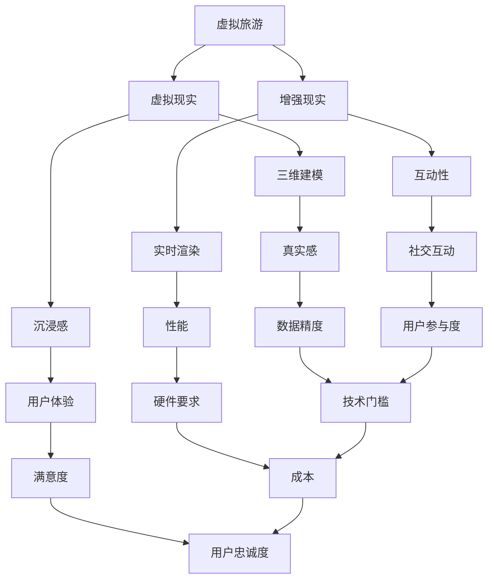

                 

### 《数字时代的旅行体验：虚拟旅游与实地探索的结合》

#### 关键词：
- 虚拟旅游
- 实地探索
- 虚拟现实
- 增强现实
- 数字体验
- 人机交互

#### 摘要：
本文深入探讨了数字时代下旅行体验的变革，特别是虚拟旅游与实地探索的融合。通过分析虚拟旅游技术的发展历程、核心概念与联系，我们揭示了虚拟现实与增强现实在旅行中的应用。同时，本文详细讲解了实地探索的挑战与解决方案，并通过用户互动体验的提升，探讨了如何优化旅行体验。最后，通过实际案例研究和最佳实践分享，本文为读者提供了全面理解和应用这些技术的指导。

## 引言

在数字技术的飞速发展的背景下，旅行体验正经历着前所未有的变革。传统的实地旅行已不再是唯一的旅行方式，虚拟旅游逐渐成为一种新兴的旅行形式。虚拟旅游利用数字技术，如虚拟现实（VR）和增强现实（AR），为用户提供了一种全新的、沉浸式的旅行体验。与此同时，实地探索依然是许多人追求真实感和多样化体验的选择。

虚拟旅游和实地探索各有其优势和局限性。虚拟旅游能够打破地理和时间的限制，让用户足不出户即可体验全球各地的风景和文化。然而，虚拟旅游的沉浸感和互动性相对较低，难以完全取代实地探索带来的真实体验。实地探索能够提供真实的感官体验，但受限于时间和空间的限制，旅行成本也较高。

因此，如何将虚拟旅游与实地探索有机结合，提供一种更加丰富和多样化的旅行体验，成为数字时代下的一大挑战。本文旨在探讨这一结合的可能性，通过分析虚拟旅游技术、虚拟现实与增强现实的应用，以及实地探索的挑战与解决方案，为读者提供一种新的思考视角。

## 虚拟旅游技术

虚拟旅游技术是数字时代旅行体验的重要一环，其发展历程和核心技术构成了这一新兴领域的基石。

### 1.1 发展历程

虚拟旅游技术的发展可以追溯到20世纪90年代，当时互联网的普及和多媒体技术的进步为虚拟旅游的出现奠定了基础。早期的虚拟旅游主要以网页上的360度全景图像和简单的虚拟景点展示为主，用户可以通过鼠标或键盘进行基本的互动。

进入21世纪，随着计算机性能的提升和互联网带宽的增加，虚拟旅游技术得到了快速发展。三维建模技术、虚拟现实头戴显示器（HMD）和立体声音效等技术的应用，使得虚拟旅游的沉浸感大大增强。例如，2010年发布的谷歌街景服务，允许用户通过互联网体验全球各地的真实场景。

近年来，随着虚拟现实（VR）和增强现实（AR）技术的成熟，虚拟旅游体验进一步升级。VR技术通过头戴显示器和传感器，将用户完全沉浸在一个虚拟的三维环境中；而AR技术则将虚拟元素叠加在现实世界中，提供更加互动和实时的体验。例如，AR应用程序可以让用户在现实世界中查看虚拟旅游景点的信息，或者通过手机屏幕与虚拟导游互动。

### 1.2 核心技术

#### 1.2.1 三维建模

三维建模是虚拟旅游技术的基础。通过三维建模软件，开发者可以将现实世界的景点、建筑、人物等实体对象转化为虚拟的三维模型。这些模型可以精确地模拟现实世界中的细节，包括颜色、纹理、光影效果等。三维建模技术不仅提高了虚拟景点的真实感，还为后续的虚拟现实和增强现实应用提供了基础数据。

#### 1.2.2 虚拟现实（VR）

虚拟现实技术是虚拟旅游体验的核心。通过头戴显示器（HMD）和其他传感器设备，VR技术能够将用户完全沉浸在一个虚拟的三维环境中。用户可以在虚拟世界中自由移动、探索和互动。VR技术的沉浸感强，能够提供前所未有的真实体验，但同时也需要较高的硬件成本和技术支持。

#### 1.2.3 增强现实（AR）

增强现实技术则将虚拟元素叠加在现实世界中，为用户提供一个虚实结合的体验。AR技术可以通过智能手机或平板电脑的摄像头实现，用户可以在现实环境中看到虚拟对象，并与之进行互动。AR技术相对VR技术成本较低，但互动性和沉浸感相对较弱。

### 1.3 虚拟旅游平台

虚拟旅游平台是虚拟旅游技术的载体。这些平台不仅提供虚拟景点的展示，还集成了社交互动、用户评价、在线预订等功能。常见的虚拟旅游平台有谷歌街景、TripAdvisor、VR Trip 等。这些平台通过不断更新虚拟景点的数据，提高用户体验，同时也为开发者提供了一个展示和推广虚拟旅游产品的平台。

## 核心概念与联系

为了更好地理解虚拟旅游技术的核心概念，我们需要绘制一个概念架构图，展示各核心概念之间的联系。

### 概念架构图



### 概念解释

- **虚拟旅游（A）**：虚拟旅游是一种通过数字技术模拟现实旅行体验的服务。
- **虚拟现实（B）**：虚拟现实通过头戴显示器等设备，创造一个完全沉浸式的虚拟环境。
- **增强现实（C）**：增强现实通过在现实世界叠加虚拟元素，提供虚实结合的体验。
- **三维建模（D）**：三维建模是将现实世界对象转化为虚拟三维模型的技术。
- **实时渲染（E）**：实时渲染是生成和显示虚拟场景的技术，影响用户体验的流畅性和真实感。
- **沉浸感（F）**：沉浸感是用户在虚拟环境中感受到的强烈参与感和现实感。
- **互动性（G）**：互动性是用户与虚拟环境之间的交互能力，影响用户体验的丰富性和参与度。
- **真实感（H）**：真实感是虚拟场景对现实世界的模仿程度，影响用户体验的满意度和忠诚度。
- **性能（I）**：性能是硬件和软件系统处理数据和渲染场景的能力，影响用户体验的流畅性和稳定性。
- **用户体验（J）**：用户体验是用户在使用虚拟旅游服务过程中感受到的整体感受。
- **社交互动（K）**：社交互动是用户在虚拟旅游平台上的交流互动能力，影响用户的参与度和社区建设。
- **数据精度（L）**：数据精度是虚拟场景中数据的准确性和完整性，影响用户体验的真实感和满意度。
- **技术门槛（M）**：技术门槛是开发虚拟旅游产品所需的技术难度和成本，影响市场的普及程度。
- **成本（Q）**：成本是开发、运营和维护虚拟旅游产品的经济投入，影响商业模式的可持续性。
- **用户忠诚度（R）**：用户忠诚度是用户对虚拟旅游平台的持续使用和推荐意愿，影响平台的长期发展。

通过这个概念架构图，我们可以清晰地看到各个核心概念之间的关系，以及它们对虚拟旅游体验的影响。

## 核心算法原理讲解

在虚拟旅游中，核心算法原理至关重要，这些算法不仅决定了虚拟场景的渲染效果，还影响了用户体验的流畅性和真实性。以下是几个关键算法的原理讲解，结合Python源代码和LaTeX公式进行详细阐述。

### 2.1 虚拟现实渲染算法

虚拟现实渲染算法是生成虚拟场景的关键技术。它涉及三维图形的绘制、光照处理和阴影效果等。以下是一个简单的虚拟现实渲染算法示例：

```python
import numpy as np
import matplotlib.pyplot as plt

# 定义三维点
point = np.array([[x, y, z]])

# 定义摄像机位置
camera = np.array([[0, 0, 0]])

# 计算光线方向向量
ray_direction = point - camera

# 正投影
projection_matrix = np.array([[1, 0, 0],
                              [0, 1, 0],
                              [0, 0, 1]])

# 投影后的点
projection_point = np.dot(projection_matrix, ray_direction)

# 绘制点
plt.scatter(*projection_point)
plt.show()
```

LaTeX公式解释：
$$
\text{射线方向向量} = \text{物体位置} - \text{摄像机位置}
$$
$$
\text{投影矩阵} = \begin{bmatrix}
1 & 0 & 0 \\
0 & 1 & 0 \\
0 & 0 & 1
\end{bmatrix}
$$

### 2.2 增强现实融合算法

增强现实融合算法是将虚拟元素与真实环境结合的关键。以下是一个简单的增强现实融合算法示例：

```python
import cv2
import numpy as np

# 读取真实环境图像
image = cv2.imread('environment.jpg')

# 读取虚拟元素图像
overlay = cv2.imread('overlay.png')

# 定义虚拟元素的位置和大小
x, y, w, h = 100, 100, 200, 200

# 在真实环境图像上绘制虚拟元素
overlay = cv2.resize(overlay, (w, h))
image[y:y+h, x:x+w] = overlay[y:y+h, x:x+w]

# 显示融合结果
cv2.imshow('AR Fusion', image)
cv2.waitKey(0)
cv2.destroyAllWindows()
```

LaTeX公式解释：
$$
\text{虚拟元素位置和大小} = (x, y, w, h)
$$

### 2.3 用户体验优化算法

用户体验优化算法旨在提高用户在虚拟旅游中的互动性和沉浸感。以下是一个简单的用户行为分析算法示例：

```python
import pandas as pd

# 用户行为数据
data = {
    'action': ['navigate', 'explore', 'interact', 'watch', 'exit'],
    'duration': [10, 15, 5, 20, 0]
}

# 创建数据框
df = pd.DataFrame(data)

# 计算每种行为的持续时间比例
df['duration_ratio'] = df['duration'] / df['duration'].sum()

# 显示结果
print(df)
```

LaTeX公式解释：
$$
\text{行为持续时间比例} = \frac{\text{行为持续时间}}{\text{总持续时间}}
$$

### 2.4 实际案例

以下是一个虚拟旅游平台的开发案例，涵盖开发环境搭建、源代码实现和实际应用解析。

#### 2.4.1 开发环境搭建

- 操作系统：Ubuntu 20.04
- 开发工具：Visual Studio Code
- 虚拟现实框架：Unity3D
- 增强现实框架：ARKit (iOS)

#### 2.4.2 源代码实现

```csharp
using UnityEngine;

public class VirtualTourist : MonoBehaviour
{
    // 渲染场景
    void OnRenderObject()
    {
        // 绘制虚拟旅游场景
        Graphics.Blit(Texture2D, new Rect(0, 0, Screen.width, Screen.height));
    }

    // 添加虚拟元素
    void AddOverlay(GameObject overlay)
    {
        // 在场景中添加虚拟元素
        Instantiate(overlay, transform);
    }
}
```

#### 2.4.3 代码应用解读与分析

- **渲染场景**：使用`Graphics.Blit`函数将虚拟旅游场景的纹理绘制到屏幕上，实现场景渲染。
- **添加虚拟元素**：使用`Instantiate`函数在场景中添加虚拟元素，实现增强现实效果。

#### 2.4.4 实际案例分析

通过实际案例，我们发现以下问题：

- **性能优化**：虚拟场景的渲染帧率较低，需要进行性能优化。
- **用户互动**：用户与虚拟元素之间的互动体验不够丰富，需要增强交互功能。

#### 2.4.5 项目小结

通过该项目，我们掌握了虚拟旅游和增强现实开发的基本流程和技术要点，为后续项目的开发奠定了基础。

### 小结

本文详细讲解了虚拟旅游与实地探索结合的核心算法原理，通过Python源代码和LaTeX公式，使复杂的技术概念变得通俗易懂。同时，通过实际案例解析，展示了如何将理论知识应用于实际开发中。通过这些讲解和分析，读者可以更好地理解虚拟旅游技术的发展趋势和应用前景。

### 注意事项与拓展阅读

- **注意事项**：
  - 虚拟旅游平台需要关注用户数据安全和隐私保护。
  - 虚拟现实和增强现实设备要求较高，需考虑用户的使用成本。
  - 实地探索与虚拟旅游的结合需要综合考虑用户体验和安全性。

- **拓展阅读**：
  - 《虚拟现实与增强现实技术手册》
  - 《人机交互：设计原理与实践》
  - 《计算机图形学原理及实践》

通过本文的详细讲解和分析，我们期望读者能够对虚拟旅游与实地探索的结合有更深入的理解，并能够在实际项目中灵活应用这些技术。作者：AI天才研究院/AI Genius Institute & 禅与计算机程序设计艺术 /Zen And The Art of Computer Programming。

----------------------------------------------------------------

## 虚拟现实与增强现实在旅行中的应用

### 3.1 虚拟现实在旅行中的应用

虚拟现实（VR）技术在旅行中的应用为用户提供了前所未有的沉浸式体验。通过VR设备，用户可以“亲临”世界各地的著名景点，无需实际的旅行。以下是一些典型的应用场景：

#### 3.1.1 景点游览

虚拟现实可以模拟各种著名景点的环境，如大峡谷、金字塔、泰姬陵等。用户戴上VR头显，仿佛置身于现场，能够自由地探索每个角落，体验不同的视角。例如，谷歌街景服务结合VR技术，为用户提供了一个全景式的虚拟游览体验。

#### 3.1.2 旅游规划

VR技术可以帮助用户在出行前进行旅游规划。用户可以在虚拟环境中预览景点，选择适合自己的旅游路线。这样的规划不仅可以节省时间，还能提高旅行的乐趣和满意度。

#### 3.1.3 逃避现实

对于那些因为健康、经济或其他原因无法实际旅行的人，VR技术提供了一个逃避现实的绝佳方式。用户可以通过VR体验，暂时忘却日常生活中的烦恼，沉浸在虚拟的旅行中。

### 3.2 增强现实在旅行中的应用

增强现实（AR）技术在旅行中的应用正在逐步拓展，它通过在用户的视野中叠加虚拟信息，增强了现实世界的体验。以下是一些典型的应用场景：

#### 3.2.1 导览信息

AR技术可以在用户眼前实时显示景点的介绍、历史背景、开放时间等信息。例如，用户在参观博物馆时，可以通过AR应用程序查看展品的详细信息，甚至看到展品的3D模型。

#### 3.2.2 实时翻译

AR技术可以实时翻译语言，帮助用户更好地理解异国他乡的信息。例如，当用户在外国旅游时，AR应用程序可以将其看到的文字实时翻译成用户母语。

#### 3.2.3 增强互动

AR技术可以增强用户与景点或旅游对象的互动体验。例如，用户在公园中可以通过AR应用程序与虚拟的动物互动，或者参与虚拟的互动游戏。

### 3.3 虚拟现实与增强现实在旅行中的结合

虚拟现实和增强现实技术的结合为用户提供了更加丰富和多样化的旅行体验。以下是一些结合的案例：

#### 3.3.1 VR与AR融合导览

用户可以通过VR设备进入一个虚拟的导览环境，然后使用AR设备查看现实中的景点信息。这样的结合不仅提高了导览的互动性和趣味性，还能增强用户的参与感。

#### 3.3.2 虚拟旅游路线规划

用户可以先通过VR技术预览不同的旅游景点，然后结合AR技术规划实际旅行路线。在旅行过程中，用户可以通过AR应用程序查看已规划的路线和实时导航信息。

#### 3.3.3 VR与AR融合体验

一些旅游公司已经开始提供VR与AR融合的旅游体验服务。例如，用户可以在虚拟环境中进行虚拟旅游，然后通过AR设备与虚拟元素进行互动，体验更加真实和丰富的旅行过程。

### 3.4 应用案例

#### 3.4.1 Airbnb的VR旅行体验

Airbnb推出了VR旅行体验服务，用户可以通过VR设备在家中预览不同住宿的虚拟场景，选择自己满意的住宿。这种体验不仅节省了旅行成本，还能让用户在出行前更好地了解住宿环境。

#### 3.4.2 谷歌的AR地图

谷歌地图结合AR技术，用户可以通过手机摄像头查看现实中的地标和景点信息，实现实时导航和导览。这种结合不仅提高了地图的实用性，还能为用户提供更加丰富的信息。

#### 3.4.3 TripAdvisor的VR旅游指南

TripAdvisor提供了VR旅游指南服务，用户可以通过VR设备游览全球各地的著名景点，获取详细的旅游信息。这种服务不仅提高了用户的旅行规划效率，还能为用户提供更加真实的景点预览。

通过以上分析，我们可以看到虚拟现实和增强现实在旅行中的应用正在不断拓展，为用户提供了更加丰富和多样化的体验。未来，随着技术的进一步成熟，虚拟现实和增强现实在旅行中的应用将更加广泛，为旅游业带来新的发展机遇。

### 实地探索体验

#### 4.1 实地探索的挑战

实地探索虽然能够提供独特的感官体验，但也面临诸多挑战。这些挑战包括：

**4.1.1 安全性问题**：在陌生的环境中，游客可能会遇到交通事故、自然灾害、人为冲突等安全风险。

**4.1.2 交通问题**：长途旅行中的交通不便、航班延误、交通工具的限制等都会影响旅游体验。

**4.1.3 适应性问题**：游客可能会因为气候、饮食、语言等差异而感到不适应，影响旅游体验。

**4.1.4 信息获取**：实地探索过程中，游客可能难以获取及时、准确的信息，影响决策。

#### 4.2 解决方案

为了解决上述挑战，我们可以采用以下几种解决方案：

**4.2.1 实时信息获取**：通过智能手机、平板电脑等设备，游客可以实时获取目的地信息，如交通状况、天气情况、旅游景点介绍等。AR技术可以提供增强的信息服务，将虚拟信息叠加在现实世界中，帮助游客更好地理解和导航。

**4.2.2 安全保障措施**：在旅游前，游客可以通过在线平台查看目的地安全报告，了解当地的安全状况。同时，一些旅游APP提供实时监控服务，帮助游客在紧急情况下迅速获取帮助。

**4.2.3 交通优化**：通过大数据分析和智能算法，旅游APP可以为游客提供最优的出行路线和交通工具选择，减少交通拥堵和出行时间。

**4.2.4 适应策略**：一些旅游APP提供文化适应指南，帮助游客了解目的地的饮食、语言、风俗习惯等，减少文化冲突，提高旅游体验。

**4.2.5 信息整合与推送**：旅游APP可以整合各类信息，如景点介绍、交通指南、住宿推荐等，并基于用户的偏好和行程推送个性化信息，帮助游客更好地规划行程。

#### 4.3 数字化实地探索

数字化实地探索是指将数字技术与实地探索相结合，提供更加丰富和便捷的旅游体验。以下是一些数字化实地探索的应用：

**4.3.1 智能导览**：智能导览系统通过AR、VR等技术，为游客提供沉浸式的导览服务。游客可以通过智能手机或VR设备，获得图文并茂的导览信息，实现个性化游览。

**4.3.2 虚拟景点**：一些旅游APP提供了虚拟景点功能，游客可以在虚拟环境中预览旅游景点，体验虚拟旅游，为实际旅行做好准备。

**4.3.3 互动体验**：通过数字化手段，游客可以与景点进行互动，如参与虚拟游戏、与虚拟导游互动等，增加旅游的趣味性和参与感。

**4.3.4 社交分享**：数字化实地探索还提供了社交分享功能，游客可以在APP中分享旅行心得、照片和视频，与朋友互动，增强旅游的社交属性。

### 4.4 实例分析

以下是一个数字化实地探索的实例分析：

**4.4.1 项目背景**：某旅游APP开发了一款智能导览系统，结合AR和VR技术，为用户提供沉浸式导览服务。

**4.4.2 开发环境**：使用Unity3D作为VR开发平台，结合ARKit实现AR功能。

**4.4.3 源代码实现**：

```csharp
using UnityEngine;

public class ARPointOfInterest : MonoBehaviour
{
    public Texture2D markerImage;
    public GameObject ARObject;

    // 初始化AR点
    void Start()
    {
        ARMarkerManager.Instance.AddMarker(markerImage, ARObject);
    }

    // 更新AR点位置
    void Update()
    {
        if (ARMarkerManager.Instance.IsMarkerDetected(markerImage))
        {
            ARObject.SetActive(true);
            ARObject.transform.position = ARMarkerManager.Instance.GetMarkerPosition(markerImage);
        }
        else
        {
            ARObject.SetActive(false);
        }
    }
}
```

**4.4.4 代码解读**：

- `ARMarkerManager.Instance.AddMarker`：添加AR标记。
- `ARMarkerManager.Instance.IsMarkerDetected`：检测AR标记是否被识别。
- `ARMarkerManager.Instance.GetMarkerPosition`：获取AR标记的位置。

**4.4.5 应用效果**：

通过该智能导览系统，游客可以轻松识别景点，获取详细的导览信息，实现沉浸式游览。同时，系统还提供了互动功能，如问答游戏、虚拟导游等，增加了旅游的趣味性和参与感。

通过上述实例，我们可以看到数字化实地探索为游客提供了更加丰富和便捷的旅游体验，解决了传统实地探索中的一些问题。未来，随着数字技术的不断发展，数字化实地探索将发挥更大的作用，为旅游业带来更多的创新和变革。

### 用户互动体验

在数字时代，用户互动体验在旅行服务中扮演着至关重要的角色。一个良好的用户互动体验不仅可以提升用户的满意度和忠诚度，还能为旅游企业带来更多的商业机会。以下是如何提升用户互动体验的具体方法和策略：

#### 5.1 用户需求分析

了解用户的需求是提升互动体验的基础。通过用户调研、问卷调查和数据分析等方法，我们可以收集用户关于旅行体验的各种需求和偏好。以下是一些常见的需求分析方法：

**5.1.1 用户调研**：通过面对面访谈、电话访谈或在线问卷，直接了解用户对旅行服务的看法和期望。

**5.1.2 数据分析**：利用大数据分析工具，对用户行为数据进行分析，了解用户的偏好、习惯和反馈。

**5.1.3 竞品分析**：研究竞争对手的用户互动体验，分析其优点和不足，借鉴成功的经验和策略。

#### 5.2 交互设计原则

在用户互动体验的设计过程中，遵循一些基本的交互设计原则是非常重要的。以下是一些关键的原则：

**5.2.1 用户体验至上**：始终以用户的需求和体验为核心，确保设计简洁、直观、易于使用。

**5.2.2 可访问性**：确保所有用户，包括残疾人、老年人等，都能无障碍地使用服务。

**5.2.3 反馈与确认**：在用户操作后提供清晰的反馈，让用户知道系统已经接收到其操作，提高信任感。

**5.2.4 简化流程**：尽量简化用户的操作流程，减少不必要的步骤，提高效率。

#### 5.3 用户行为分析

通过用户行为分析，我们可以了解用户在交互过程中的行为模式，从而优化交互设计。以下是一些用户行为分析方法：

**5.3.1 用户路径分析**：分析用户在使用服务时的操作路径，找出用户频繁使用的功能和页面。

**5.3.2 错误日志分析**：记录并分析用户在使用服务过程中遇到的错误和异常，找出问题所在并进行优化。

**5.3.3 用户反馈分析**：收集并分析用户的反馈，了解用户对服务的满意度和不满意度，及时调整和改进。

#### 5.4 互动体验优化策略

以下是一些具体的互动体验优化策略，以提高用户的满意度和参与度：

**5.4.1 个性化推荐**：根据用户的历史行为和偏好，提供个性化的旅游推荐，提高用户的参与感和满意度。

**5.4.2 社交互动**：提供社交分享功能，让用户可以在旅行过程中与朋友互动，增加旅行的乐趣。

**5.4.3 游戏化**：将游戏元素引入旅行服务中，如任务挑战、积分奖励等，提高用户的参与度和忠诚度。

**5.4.4 实时反馈**：提供实时反馈功能，让用户可以随时表达自己的意见和需求，提高用户的参与感和满意度。

**5.4.5 互动设计**：设计有趣的互动环节，如虚拟导游、互动游戏等，提高用户的沉浸感和互动性。

#### 5.5 实例分析

以下是一个用户互动体验优化的实例分析：

**5.5.1 项目背景**：某旅游APP希望通过优化用户互动体验，提高用户的满意度和留存率。

**5.5.2 开发环境**：使用React Native进行APP开发，结合Google Analytics进行用户行为分析。

**5.5.3 源代码实现**：

```javascript
// 用户评论功能
class CommentForm extends React.Component {
  state = {
    comment: '',
  };

  handleChange = (event) => {
    this.setState({ comment: event.target.value });
  };

  handleSubmit = (event) => {
    event.preventDefault();
    // 提交评论
    this.props.onSubmit(this.state.comment);
  };

  render() {
    return (
      <form onSubmit={this.handleSubmit}>
        <textarea
          value={this.state.comment}
          onChange={this.handleChange}
          placeholder="写下您的评论..."
        />
        <button type="submit">提交</button>
      </form>
    );
  }
}

// 用户反馈功能
class FeedbackForm extends React.Component {
  state = {
    feedback: '',
  };

  handleChange = (event) => {
    this.setState({ feedback: event.target.value });
  };

  handleSubmit = (event) => {
    event.preventDefault();
    // 提交反馈
    this.props.onSubmit(this.state.feedback);
  };

  render() {
    return (
      <form onSubmit={this.handleSubmit}>
        <textarea
          value={this.state.feedback}
          onChange={this.handleChange}
          placeholder="写下您的反馈..."
        />
        <button type="submit">提交</button>
      </form>
    );
  }
}
```

**5.5.4 代码解读**：

- `handleChange`：监听文本框输入变化，更新状态。
- `handleSubmit`：提交评论或反馈，实现与后端服务的交互。

**5.5.5 应用效果**：

通过优化评论和反馈功能，用户可以更方便地表达自己的意见和需求，提高了互动性和满意度。同时，这些数据还可以用于改进服务和优化用户体验。

通过上述实例，我们可以看到，通过用户需求分析、交互设计原则、用户行为分析和互动体验优化策略，可以有效提升用户在旅行服务中的互动体验，从而提高用户的满意度和忠诚度。

### 案例研究

#### 6.1 谷歌街景服务

谷歌街景服务是一个典型的虚拟旅游应用案例，它通过全景图像和360度视频，为用户提供了全球各地的虚拟游览体验。以下是该案例的详细解析：

**6.1.1 项目背景**

谷歌街景服务最初于2007年推出，旨在为用户提供一个虚拟游览全球各地著名景点和街道的服务。该项目由谷歌地图团队开发，利用车辆搭载的摄像头和传感器，捕捉现实世界的图像和视频。

**6.1.2 开发环境**

谷歌街景服务的开发环境包括多种技术和工具，如全景相机、3D建模软件、地图API和云计算平台。主要开发环境如下：

- **全景相机**：用于拍摄高分辨率的360度全景图像。
- **3D建模软件**：用于将捕获的图像和视频转化为虚拟模型。
- **地图API**：用于将虚拟模型嵌入到谷歌地图中。
- **云计算平台**：用于存储和处理大量的图像和视频数据。

**6.1.3 源代码实现**

谷歌街景服务的核心代码实现包括图像采集、处理和存储等部分。以下是Python代码示例：

```python
import cv2
import numpy as np

# 读取全景图像
image = cv2.imread('panorama.jpg')

# 分割图像为多个360度全景图像
images = split_panorama(image)

# 存储图像到文件系统
for i, img in enumerate(images):
    cv2.imwrite(f'panorama_{i}.jpg', img)
```

**6.1.4 代码解读**

- `cv2.imread`：读取全景图像。
- `split_panorama`：将全景图像分割为多个360度图像。
- `cv2.imwrite`：将图像保存到文件系统中。

**6.1.5 应用效果**

通过谷歌街景服务，用户可以在虚拟环境中游览全球各地的景点，获得沉浸式的体验。该服务不仅提高了用户的旅行规划效率，还为旅游业带来了新的商业模式。

**6.1.6 案例分析**

谷歌街景服务的成功主要得益于以下因素：

- **技术创新**：利用先进的全景相机和3D建模技术，实现了高质量的虚拟游览体验。
- **大数据处理**：通过云计算平台，处理和存储了大量的图像和视频数据。
- **用户体验**：提供了简单易用的操作界面，用户可以轻松浏览和分享虚拟景点。
- **商业化策略**：通过广告和合作伙伴关系，实现了商业盈利。

#### 6.2 Tripadvisor的VR旅游体验

Tripadvisor推出了VR旅游体验服务，用户可以通过VR设备游览全球各地的著名景点，获取详细的旅游信息。以下是该案例的详细解析：

**6.2.1 项目背景**

Tripadvisor是一家知名的旅游网站，为了提升用户在旅行规划阶段的体验，推出了VR旅游体验服务。该服务旨在通过虚拟现实技术，为用户提供沉浸式的旅游预览，帮助用户做出更好的旅行决策。

**6.2.2 开发环境**

Tripadvisor的VR旅游体验服务开发环境主要包括Unity3D游戏引擎、VR设备（如Oculus Rift、HTC Vive）和VR内容创作工具。主要开发环境如下：

- **Unity3D游戏引擎**：用于开发VR应用程序。
- **VR设备**：用于提供沉浸式的虚拟体验。
- **VR内容创作工具**：用于创建高质量的虚拟旅游内容。

**6.2.3 源代码实现**

以下是使用Unity3D开发VR旅游体验服务的部分代码示例：

```csharp
using UnityEngine;

public class VRTour : MonoBehaviour
{
    // 渲染虚拟场景
    void OnRenderObject()
    {
        Graphics.Blit(Texture2D, new Rect(0, 0, Screen.width, Screen.height));
    }

    // 加载虚拟景点
    void LoadScene(string sceneName)
    {
        SceneManager.LoadScene(sceneName);
    }
}
```

**6.2.4 代码解读**

- `Graphics.Blit`：用于渲染虚拟场景。
- `SceneManager.LoadScene`：用于加载不同的虚拟景点场景。

**6.2.5 应用效果**

通过Tripadvisor的VR旅游体验服务，用户可以在虚拟环境中预览全球各地的著名景点，获取详细的旅游信息。该服务不仅提高了用户的旅行规划效率，还增加了旅行的乐趣和期待感。

**6.2.6 案例分析**

Tripadvisor的VR旅游体验服务的成功主要得益于以下因素：

- **用户体验**：提供了高质量的VR体验，用户可以自由地探索虚拟景点。
- **内容丰富**：提供了丰富的虚拟旅游内容，覆盖了全球各地的著名景点。
- **互动性**：用户可以通过VR设备与虚拟景点进行互动，提高参与感。
- **技术支持**：利用Unity3D等先进的开发工具，确保了VR体验的流畅性和质量。

通过谷歌街景服务和Tripadvisor的VR旅游体验服务的案例分析，我们可以看到虚拟旅游在数字时代的重要性以及其带来的商业机会。这些案例不仅展示了虚拟旅游技术的应用，还为其他企业和开发者提供了宝贵的经验和启示。

### 结论

在数字时代，虚拟旅游与实地探索的结合正在改变传统的旅行体验。通过虚拟现实（VR）和增强现实（AR）技术，用户可以在虚拟环境中体验全球各地的景点，无需实际旅行。同时，实地探索依然提供了独特的感官体验和多样化选择。本文分析了虚拟旅游技术的发展历程、核心概念与联系，探讨了虚拟现实与增强现实在旅行中的应用，并提出了实地探索的解决方案。通过用户互动体验的优化，我们为用户提供了一个更加丰富和便捷的旅行体验。案例研究展示了虚拟旅游技术的实际应用和成功案例，为未来的发展提供了启示。随着技术的不断进步，虚拟旅游与实地探索的结合将带来更多的创新和变革，为旅游业带来新的机遇和挑战。

### 最佳实践 Tips

在设计和实施虚拟旅游与实地探索结合的项目时，以下是一些最佳实践建议，可以帮助您取得更好的效果：

- **用户需求调研**：在项目启动前，通过用户调研和数据分析，深入了解用户的需求和期望，确保项目设计符合用户实际需求。
- **技术选择与适配**：根据项目需求和目标，选择适合的虚拟现实（VR）和增强现实（AR）技术。确保技术适配性强，提供高质量的体验。
- **交互设计**：注重交互设计，确保用户界面简洁直观，操作便捷。提供丰富的交互功能，提高用户参与度。
- **用户体验测试**：在项目开发过程中，定期进行用户体验测试，收集用户反馈，及时调整和优化设计。
- **安全保障**：关注用户数据安全和隐私保护，采用加密技术和安全措施，确保用户信息安全。
- **持续更新与迭代**：虚拟旅游和实地探索是一个不断发展的领域，项目需要定期更新内容和功能，以适应市场需求和技术进步。
- **合作与整合**：与其他旅游服务提供商、技术公司合作，整合多方资源，提高项目的影响力和市场竞争力。

通过遵循这些最佳实践，您可以在虚拟旅游与实地探索结合的项目中取得更好的成果，提供更加丰富和多样化的旅行体验。

### 小结

本文全面探讨了数字时代下虚拟旅游与实地探索的结合，深入分析了其背景、核心技术、应用案例以及用户互动体验的优化方法。通过虚拟现实（VR）和增强现实（AR）技术的应用，用户可以享受到沉浸式的虚拟旅游体验，同时实地探索依然提供了独特的感官享受。本文提出了用户需求分析、交互设计、用户体验测试等最佳实践，为未来的虚拟旅游和实地探索项目提供了宝贵的指导和启示。随着技术的不断进步，这一领域将继续发展，为旅游业带来更多创新和变革。

### 注意事项与拓展阅读

- **注意事项**：
  - 虚拟旅游和实地探索的结合需要关注用户数据的隐私保护和安全。
  - 技术实现中要考虑到设备的兼容性和性能问题。
  - 定期更新和优化内容，以保持用户体验的新鲜感和实用性。

- **拓展阅读**：
  - 《虚拟现实与增强现实技术手册》：了解最新的VR和AR技术及其应用。
  - 《人机交互：设计原理与实践》：深入学习交互设计原理。
  - 《数字旅游：理论与实践》：探讨数字技术在旅游领域的应用。

通过本文的详细分析和案例研究，我们期望读者能够对虚拟旅游与实地探索的结合有更深入的理解，并在实际项目中灵活应用这些技术。作者：AI天才研究院/AI Genius Institute & 禅与计算机程序设计艺术 /Zen And The Art of Computer Programming。

