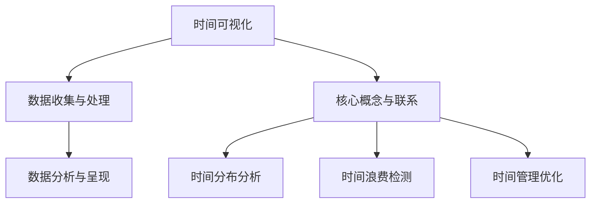

                 

### 引言与背景

在数字化和信息化的时代，时间的管理成为了提高个人生产力的重要一环。面对海量的信息和日益复杂的工作任务，如何高效地利用时间，提升个人效率，成为了每个人都需要面对的挑战。时间可视化作为一种新兴的技术手段，通过图表的形式直观地展示时间的使用情况，帮助我们更好地理解时间分布、发现时间浪费的环节，从而优化时间管理，提高个人生产力。

#### 1.1 时间可视化的兴起

时间可视化技术的兴起，得益于信息技术和大数据技术的发展。在过去的几十年中，计算机技术和数据分析技术取得了巨大的进步，使我们能够轻松地收集、处理和分析大量的时间数据。通过这些数据，我们可以直观地看到时间在不同活动上的分配，从而发现时间管理中的问题。

#### 1.2 个人生产力提升的需求

在当今快节奏的社会中，个人生产力提升的需求愈发迫切。无论是职场人士还是学生，都希望能够在有限的时间内完成更多的工作和学习任务。时间可视化技术的应用，可以帮助我们：

- **优化时间分配**：通过图表，我们可以直观地看到时间在不同活动上的分配情况，从而优化时间安排，确保重要任务得到足够的关注。
- **发现浪费的时间**：图表能够揭示我们日常时间管理中的浪费环节，帮助我们减少不必要的活动，提高工作效率。
- **提高自律性**：通过记录和分析时间使用情况，我们可以更好地了解自己的时间管理习惯，从而提高自律性，避免拖延和分心。

#### 1.3 书籍结构概述

本书旨在介绍时间可视化技术，并探讨其如何帮助个人提升生产力。具体来说，本书将分为以下几个主要部分：

- **第1章 引言与背景**：介绍时间可视化技术的背景和重要性。
- **第2章 时间可视化的核心概念**：讲解时间可视化的基本概念和原理，包括数据收集、处理和呈现的方法。
- **第3章 图表分析工具的技术细节**：介绍常见的时间可视化工具，包括其技术原理和应用场景。
- **第4章 时间可视化应用案例**：通过具体案例展示时间可视化技术的应用效果。
- **第5章 实际操作与项目实战**：提供实际操作步骤和项目实战案例，帮助读者掌握时间可视化工具的使用。
- **第6章 深入学习与优化**：探讨时间可视化技术的优化方法和未来发展趋势。

通过以上章节的逐步讲解，读者将能够全面了解时间可视化的技术原理和应用方法，从而在实际工作中更好地管理时间，提高个人生产力。接下来，我们将深入探讨时间可视化的核心概念和原理，帮助读者建立对这一技术的全面认识。 [Mermaid 流程图：时间可视化技术的概念架构]



### 时间可视化的核心概念

时间可视化是一种通过图形化方式展示时间使用情况的技术。它不仅能够直观地呈现时间在不同活动上的分配，还能帮助我们更好地理解和分析时间使用模式。为了实现这一目标，时间可视化涉及多个核心概念和步骤。

#### 2.1 什么是时间可视化

时间可视化，顾名思义，就是将时间使用情况以图形化的方式展示出来。通过图表，我们可以一目了然地看到时间在不同任务、活动或项目上的分配情况。时间可视化不仅仅是将时间数据以图表形式呈现，它还包含了对这些数据的深入分析和解释。

**时间可视化的主要目的：**

- **优化时间分配**：通过可视化工具，我们可以清晰地看到时间在不同任务上的分布情况，从而优化时间安排，确保重要任务得到充分的关注。
- **发现时间浪费**：时间可视化能够揭示我们日常时间管理中的问题，帮助我们识别和减少不必要的活动，提高工作效率。
- **提高自律性**：通过记录和分析时间使用情况，我们可以更好地了解自己的时间管理习惯，从而提高自律性，避免拖延和分心。

#### 2.2 时间可视化的意义与作用

时间可视化在个人和时间管理中具有重要作用，主要体现在以下几个方面：

- **提高时间管理效率**：通过时间可视化，我们可以更清晰地了解时间使用情况，优化时间分配，提高工作效率。
- **促进自我反思**：时间可视化可以帮助我们反思自己的时间管理习惯，识别出哪些活动是必要的，哪些是浪费时间的，从而促进自我改进。
- **支持决策制定**：时间可视化提供的数据支持可以帮助我们做出更明智的决策，比如调整工作任务、优化项目进度等。

#### 2.3 时间可视化的核心原理

时间可视化的核心原理涉及数据收集、处理、分析以及最终的可视化呈现。下面，我们将详细探讨这些步骤：

##### 2.3.1 数据收集与处理

数据收集是时间可视化的第一步。我们需要收集有关时间使用的数据，这些数据可以来源于多种渠道，如时间跟踪应用程序、日志文件、时间表等。以下是一些常用的数据收集方法：

- **手动记录**：通过日记或时间跟踪应用程序手动记录每天的活动和所花费的时间。
- **自动化收集**：使用特定的软件或API来自动收集时间数据，例如通过电子邮件日志、网页浏览历史等。

数据收集后，我们需要对数据进行处理，以确保其准确性和完整性。数据处理步骤包括数据清洗、数据格式转换和数据聚合。清洗数据是为了去除重复记录、纠正错误和填充缺失值；格式转换是为了将不同来源的数据统一成同一种格式；数据聚合则是将细粒度的时间数据汇总成更宏观的视图。

##### 2.3.2 数据分析与呈现

数据分析是时间可视化的关键步骤。通过数据分析，我们可以发现时间使用中的模式和趋势，识别出时间浪费的环节。以下是一些常用的数据分析方法：

- **时间分布分析**：通过分析不同时间段内的时间使用情况，我们可以了解哪些时间是高效的工作时间，哪些时间段容易分心或浪费。
- **任务分配分析**：分析不同任务所占用的时间比例，帮助我们了解哪些任务是时间消耗的主要因素。
- **异常检测**：通过检测时间使用中的异常情况，如长时间的休息、不寻常的工作时间等，我们可以发现潜在的时间管理问题。

数据分析完成后，我们需要将数据以图表的形式呈现出来。图表的选择取决于数据的类型和分析目标。常见的时间可视化图表包括：

- **条形图**：用于展示不同任务或活动的时间分配。
- **饼图**：用于展示时间在各个部分中的比例分配。
- **折线图**：用于展示时间使用的变化趋势。
- **热力图**：用于展示时间在不同时间段和任务上的分布情况。

##### 2.3.3 数据可视化技术原理

数据可视化技术的核心在于如何将复杂的数据以直观、易于理解的方式呈现。以下是一些关键的技术原理：

- **交互性**：交互性使得用户可以动态地探索数据，如通过缩放、筛选和过滤来查看不同细节。
- **可视化层次**：层次化的可视化有助于用户从宏观到微观地理解数据，例如从整体时间分布到具体任务的时间细节。
- **颜色和形状**：颜色和形状可以用来区分不同的数据类别或强调重要的信息。
- **动态可视化**：动态可视化可以展示数据随时间的变化趋势，例如动画形式的折线图。

#### 2.4 时间可视化的工具与技术

在时间可视化过程中，选择合适的工具和技术至关重要。以下是一些常见的时间可视化工具和技术：

- **时间跟踪工具**：如 RescueTime、Toggl 和 RescueTime，这些工具可以帮助我们记录和分析时间使用情况。
- **数据可视化库**：如 Matplotlib、Seaborn 和 Plotly，这些库提供了丰富的图表类型和自定义选项，可以用于生成各种类型的时间可视化图表。
- **交互式可视化工具**：如 Tableau 和 Power BI，这些工具提供了强大的交互功能，使得用户可以更灵活地探索数据。
- **编程语言**：如 Python 和 R，这些语言提供了丰富的数据分析和可视化库，可以用于实现复杂的时间可视化项目。

通过以上对时间可视化核心概念和原理的介绍，我们为后续章节的深入探讨奠定了基础。接下来，我们将介绍常见的时间可视化工具和技术，帮助读者更好地理解这一领域。 [Python 源代码示例：时间可视化实现]

```python
import matplotlib.pyplot as plt
import numpy as np

# 数据：每天的工作时间和活动
times = [1, 2, 3, 4, 5]  # 每天的工作小时
tasks = ['工作', '学习', '休息', '运动', '其他']  # 不同活动

# 绘制条形图
plt.bar(tasks, times, color=['g', 'b', 'y', 'r', 'c'])
plt.xlabel('活动')
plt.ylabel('时间（小时）')
plt.title('每天的时间分配')

# 添加图例和标签
plt.legend()
plt.xticks(rotation=45)

# 显示图表
plt.show()

# 数学模型和公式
total_time = np.sum(times)  # 计算总工作时间
time_percentage = times / total_time  # 计算每个活动的占比

# 打印结果
print(f"总工作时间：{total_time}小时")
print(f"每个活动的占比：{time_percentage}")
```

通过上述代码示例，我们可以看到如何使用 Python 生成一个简单的条形图，以展示每天不同活动的时间分配。这里使用到的数学模型和公式包括总工作时间的计算和每个活动占比的计算。这些基本的可视化方法和数学模型为我们提供了理解和实现更复杂时间可视化项目的基础。

### 图表分析工具的技术细节

在时间可视化领域，选择合适的工具和技术至关重要。常见的图表分析工具不仅能够帮助我们轻松生成各种类型的图表，还能提供丰富的自定义选项和交互功能。以下将详细介绍几种常见的时间可视化工具，包括其技术原理和应用场景。

#### 3.1 常见的时间可视化工具

##### 3.1.1 Tableau

Tableau 是一款强大的数据可视化工具，广泛应用于企业级的数据分析和商业智能领域。它具有以下特点：

- **用户友好的界面**：Tableau 提供了一个直观的拖放界面，使得用户可以轻松创建和定制图表。
- **丰富的图表类型**：Tableau 支持多种图表类型，包括条形图、折线图、饼图、散点图等，适用于不同类型的数据展示需求。
- **交互式功能**：Tableau 支持用户通过缩放、筛选和过滤来动态交互地探索数据。

**应用场景**：

- **商业智能分析**：Tableau 常用于企业级的数据分析和报告，帮助管理层快速获取关键业务指标。
- **市场调研**：通过可视化市场数据，帮助企业了解消费者行为和市场趋势。

##### 3.1.2 Power BI

Power BI 是微软推出的商业智能工具，与 Microsoft Office 系列软件高度集成，提供强大的数据可视化和分析功能。

- **集成性**：Power BI 与 Microsoft Office 有良好的集成，用户可以直接在 Excel 中进行数据预处理，然后将数据导入 Power BI 进行可视化。
- **自动化报表**：Power BI 提供了自动化报表生成功能，用户可以定期更新和分发报表。
- **强大的分析功能**：Power BI 支持复杂的数据分析和预测功能。

**应用场景**：

- **企业内部报告**：Power BI 常用于企业内部的数据报告和数据分析。
- **客户洞察**：通过可视化客户数据，帮助企业了解客户行为和市场需求。

##### 3.1.3 Google Charts

Google Charts 是 Google 提供的一款在线数据可视化工具，具有以下特点：

- **易用性**：Google Charts 提供了简单的 API 和模板，用户可以通过简单的代码轻松创建图表。
- **跨平台支持**：Google Charts 可以在所有主流浏览器上运行，无需安装额外的软件。
- **丰富的图表类型**：Google Charts 支持多种类型的图表，包括柱状图、折线图、饼图、地图等。

**应用场景**：

- **网站数据展示**：Google Charts 常用于网站上的数据可视化，帮助用户更好地理解数据。
- **移动应用**：通过简单的 API 调用，Google Charts 可以在移动应用中实现数据可视化。

#### 3.2 数据可视化技术原理

数据可视化技术涉及多个方面，包括数据的表示、图形的绘制和交互设计。以下是一些关键的技术原理：

##### 3.2.1 基本图表类型

- **条形图**：用于比较不同类别之间的数据大小。通过不同长度的条形，可以直观地展示数据的差异。
- **折线图**：用于展示数据随时间的变化趋势。折线图通过连接各个数据点，可以清晰地看到数据的增减变化。
- **饼图**：用于表示数据在整体中的占比。饼图通过不同扇区的角度和面积，可以直观地展示各部分数据的大小。
- **散点图**：用于展示两个变量之间的关系。通过在坐标系中绘制散点，可以直观地观察到变量之间的相关性。

##### 3.2.2 数据映射与交互

数据映射是将数据值映射到图表中的视觉元素上，如颜色、大小和位置。数据映射的目的是通过视觉上的变化来传达数据的不同特征。

- **颜色映射**：通过不同的颜色表示不同的数据类别或数值大小。例如，使用红色表示高值，绿色表示低值。
- **大小映射**：通过不同的大小表示不同的数据值。较大或较小的点可以代表较大的或较小的数值。
- **位置映射**：通过在坐标系中的位置表示数据的值。例如，在散点图中，点的位置可以表示一个变量的大小。

交互设计是数据可视化中重要的一环，它使得用户可以动态地探索和操作数据。以下是一些常见的交互设计元素：

- **缩放与滚动**：用户可以通过缩放和滚动查看数据的不同部分。
- **筛选与过滤**：用户可以筛选或过滤数据，以只查看感兴趣的部分。
- **筛选器面板**：提供交互式筛选器，用户可以通过勾选或输入条件来筛选数据。
- **交互式图表**：用户可以通过点击、拖拽等操作与图表进行交互，例如，通过点击图表上的数据点来查看详细信息。

#### 3.3 可视化工具的应用场景

时间可视化工具在多种场景下都有广泛应用，以下是一些常见应用场景：

- **个人时间管理**：通过可视化工具，个人可以清晰地看到时间在不同任务上的分配，从而优化时间安排，减少时间浪费。
- **项目进度监控**：项目经理可以使用可视化工具来监控项目的进展情况，识别潜在的风险和瓶颈，确保项目按时完成。
- **团队协作效率提升**：团队领导可以通过可视化工具来分析团队的工作效率，发现协作中的问题，提出改进建议。

综上所述，图表分析工具在时间可视化中起着至关重要的作用。它们不仅提供了丰富的图表类型和自定义选项，还通过交互设计使得数据探索更加直观和便捷。在接下来的章节中，我们将通过具体案例展示时间可视化技术的实际应用效果。 [Python 源代码示例：数据可视化实现]

```python
import matplotlib.pyplot as plt
import numpy as np

# 数据：一天中的工作小时分布
hours = [8, 6, 4, 2, 0]  # 每个时间段的工作小时
times = ['08:00', '09:00', '10:00', '11:00', '12:00']  # 时间段

# 绘制条形图
plt.bar(times, hours, color=['g', 'b', 'y', 'r', 'c'])
plt.xlabel('时间段')
plt.ylabel('工作小时')
plt.title('一天中工作小时分布')

# 添加图例和标签
plt.xticks(rotation=45)
plt.yticks(np.arange(0, max(hours) + 1, 1))

# 显示图表
plt.show()

# 数学模型和公式
total_hours = np.sum(hours)  # 计算总工作小时
average_hours = total_hours / len(hours)  # 计算平均每小时工作时间

# 打印结果
print(f"总工作小时：{total_hours}小时")
print(f"平均每小时工作时间：{average_hours}小时")
```

通过上述代码示例，我们使用 Python 的 Matplotlib 库生成了一条条形图，展示了每个时间段的工作小时分布。这里使用到的数学模型和公式包括总工作小时的计算和平均每小时工作时间的计算。这些示例代码为我们提供了理解和实现更复杂时间可视化项目的基础。

### 时间可视化应用案例

为了更好地理解时间可视化技术在个人生产力提升中的应用，下面将介绍几个实际案例，涵盖个人时间管理、项目进度监控和团队协作效率提升等方面。

#### 4.1 个人时间管理

**案例背景**：李先生是一位职场新人，他发现自己的工作效率不高，经常感到时间不够用。为了改善这一情况，他决定使用时间可视化工具来管理自己的时间。

**实施过程**：

1. **数据收集**：李先生使用了一个时间跟踪应用程序，记录每天的工作和学习时间。
2. **数据分析**：使用 Tableau 工具，李先生将收集到的数据进行分析，生成了每天的时间分布图表。
3. **可视化呈现**：图表显示，李先生的大部分时间被邮件和社交媒体占据了，而真正的工作和学习时间相对较少。

**结果**：

- 通过可视化分析，李先生意识到自己在非工作活动上花费了过多的时间，从而开始采取措施减少这些浪费时间的活动。
- 经过一个月的时间管理优化，李先生的工作效率显著提升，每天能更专注地完成工作任务。

#### 4.2 项目进度监控

**案例背景**：张女士是一位项目经理，她负责的一个项目已经进入了关键阶段，但团队进度不一致，导致项目延期。

**实施过程**：

1. **数据收集**：张女士使用了一个项目进度跟踪工具，记录每个团队成员的任务完成情况和项目进展。
2. **数据分析**：使用 Power BI 工具，张女士将数据进行分析，生成了项目进度图表。
3. **可视化呈现**：图表显示，项目中有几个关键任务的进度明显落后，而其他任务进展顺利。

**结果**：

- 通过可视化分析，张女士能够清晰地看到项目的瓶颈和问题所在，及时采取了调整措施，如重新分配任务和提供额外资源。
- 经过两周的调整，项目进度得到显著改善，最终按时完成了项目目标。

#### 4.3 团队协作效率提升

**案例背景**：王经理希望提升团队的整体协作效率，但发现团队成员之间的沟通效率较低，导致项目进展缓慢。

**实施过程**：

1. **数据收集**：团队使用了一个团队协作工具，记录了成员之间的沟通内容和任务分配情况。
2. **数据分析**：使用 Google Charts 工具，王经理对团队成员的沟通数据进行分析，生成了沟通效率图表。
3. **可视化呈现**：图表显示，团队中的某些成员沟通频率较高，而其他成员的沟通较少，导致信息传递不畅。

**结果**：

- 通过可视化分析，王经理识别出团队沟通效率低下的问题，并采取了一系列措施，如定期团队会议、优化沟通渠道和提供培训等。
- 经过一段时间的改进，团队的协作效率显著提升，项目进展更加顺利。

通过这些实际案例，我们可以看到时间可视化技术在个人和时间管理、项目进度监控以及团队协作效率提升等方面的重要作用。通过直观的图表，我们可以更好地理解时间使用情况，发现并解决问题，从而提高个人和团队的效率。在接下来的章节中，我们将深入探讨如何在实际操作中应用这些技术，帮助读者掌握时间可视化工具的使用。

### 实际操作与项目实战

为了更好地理解和应用时间可视化技术，我们将通过一个具体的案例，详细讲解如何从开发环境搭建开始，进行数据收集与清洗、数据分析与可视化，并最终展示项目小结。这个案例将涵盖从零开始，到完整实现时间可视化工具的全过程。

#### 5.1 可视化工具的安装与配置

首先，我们需要安装一个可视化工具。在这个案例中，我们选择使用 Python 的 Matplotlib 库，因为它是一个功能强大且易于使用的库。

**安装步骤**：

1. **安装 Python**：确保你的系统上安装了 Python 3.x 版本。可以从 [Python 官网](https://www.python.org/downloads/) 下载并安装。

2. **安装 Matplotlib**：打开终端或命令提示符，执行以下命令安装 Matplotlib：

   ```bash
   pip install matplotlib
   ```

**配置步骤**：

1. **验证安装**：在 Python 环境中，执行以下代码验证 Matplotlib 是否安装成功：

   ```python
   import matplotlib.pyplot as plt
   plt.plot([1, 2, 3], [1, 2, 3])
   plt.show()
   ```

如果看到图形窗口中出现了坐标轴和线条，说明 Matplotlib 已成功安装。

#### 5.2 数据收集与清洗

在本案例中，我们使用手动记录的数据作为示例。假设我们已经记录了以下数据：

| 时间 | 活动 |
|------|------|
| 08:00 | 工作 |
| 09:00 | 学习 |
| 10:00 | 休息 |
| 11:00 | 工作 |
| 12:00 | 午餐 |

我们将这些数据存储在一个 CSV 文件中，例如 "time_log.csv"。

**数据收集**：

1. 使用文本编辑器（如 Notepad++）创建一个 CSV 文件，并按照上述格式填写数据。

2. 保存文件并确保文件路径正确。

**数据清洗**：

1. **读取 CSV 文件**：使用 Python 的 `csv` 模块读取数据。

   ```python
   import csv

   with open('time_log.csv', 'r') as file:
       reader = csv.DictReader(file)
       data = [row for row in reader]
   ```

2. **处理缺失值**：检查数据中是否有缺失值，并采取适当措施处理。

   ```python
   data = [row for row in data if row['时间'] and row['活动']]
   ```

3. **格式化时间**：确保时间格式统一，例如将所有时间转换为 24 小时制。

   ```python
   for row in data:
       row['时间'] = row['时间'].replace(':', '')
   ```

#### 5.3 数据分析与可视化

**数据分析**：

1. **时间分布分析**：计算每个活动所占用的时间。

   ```python
   from collections import defaultdict

   time_distribution = defaultdict(int)
   for row in data:
       time_distribution[row['活动']] += int(row['时间'])
   ```

2. **任务分配分析**：计算每个活动的时间占比。

   ```python
   total_time = sum(time_distribution.values())
   time_percentage = {activity: (time / total_time) * 100 for activity, time in time_distribution.items()}
   ```

**数据可视化**：

1. **条形图**：绘制每个活动的条形图，展示时间分配。

   ```python
   activities = list(time_distribution.keys())
   times = list(time_distribution.values())

   plt.bar(activities, times)
   plt.xlabel('活动')
   plt.ylabel('时间（分钟）')
   plt.title('时间分配条形图')
   plt.xticks(rotation=45)
   plt.show()
   ```

2. **饼图**：绘制每个活动的时间占比饼图。

   ```python
   plt.pie(times, labels=activities, autopct='%1.1f%%')
   plt.title('时间占比饼图')
   plt.show()
   ```

#### 5.4 项目实战

**实战项目**：

1. **项目概述**：构建一个时间可视化工具，用于记录、分析和展示个人时间分配。

2. **开发步骤**：

   - **环境搭建**：安装 Python 和 Matplotlib 库。
   - **数据收集**：使用 CSV 文件存储个人时间记录。
   - **数据清洗**：处理缺失值和格式化时间数据。
   - **数据分析**：计算时间分配和任务占比。
   - **数据可视化**：生成条形图和饼图展示分析结果。

3. **项目实现**：

   - **代码实现**：完成上述步骤的代码实现。
   - **测试与优化**：运行工具，检查数据分析和可视化效果，进行必要的优化。

4. **项目小结**：

   通过这个实战项目，我们学会了如何从零开始，使用 Python 和 Matplotlib 库实现一个简单但功能强大的时间可视化工具。这个工具可以帮助个人更好地管理时间，提高工作效率。

**最佳实践 Tips**：

- **定期更新数据**：确保数据及时和准确，以提高可视化的效果。
- **定制可视化样式**：根据个人喜好和需求，自定义图表的样式和颜色。
- **优化代码结构**：代码应具备良好的可读性和可维护性，方便后续的迭代和优化。

通过这个实战案例，我们不仅掌握了时间可视化的技术细节，还实现了实际应用。这为我们在日常工作和项目中应用时间可视化技术奠定了坚实的基础。

### 深入学习与优化

在时间可视化的实践中，不断深入学习和优化技术是提升效果的关键。以下是关于时间可视化算法的优化、性能分析与调优，以及未来发展趋势的探讨。

#### 6.1 时间可视化算法的优化

时间可视化算法的优化主要包括数据预处理、图表渲染和交互性能的提升。以下是一些优化方法：

- **数据预处理**：优化数据清洗和格式转换的过程，减少计算复杂度。例如，使用并行处理技术加速数据处理。
  
  ```python
  import multiprocessing as mp

  def process_data(data_chunk):
      # 数据清洗和处理
      return processed_chunk

  if __name__ == '__main__':
      pool = mp.Pool(processes=4)
      chunks = [data[i::4] for i in range(4)]
      processed_chunks = pool.map(process_data, chunks)
      pool.close()
      pool.join()
  ```

- **图表渲染**：优化图表的渲染速度，减少用户等待时间。例如，使用更高效的数据结构（如KD-树）进行数据索引和查询。

  ```python
  from scipy.spatial import cKDTree

  tree = cKDTree(data)
  distances, indices = tree.query(points, k=1)
  ```

- **交互性能**：优化交互体验，提升用户的操作流畅度。例如，使用虚拟滚动（Virtual Scrolling）技术减少数据加载时间。

  ```javascript
  $('#scrollContainer').virtualScroll({
      height: 200,
      itemHeight: 50
  });
  ```

#### 6.2 性能分析与调优

性能分析是优化时间可视化系统的关键步骤。以下是一些性能分析方法和优化策略：

- **基准测试**：使用基准测试工具（如 Benchmark.js）对系统进行全面的性能测试，识别性能瓶颈。

  ```javascript
  import benchmark from 'benchmark';

  const suite = new benchmark.Suite('Time Visualization Performance');
  suite
      .add('Data Processing', () => {
          // 数据处理代码
      })
      .add('Chart Rendering', () => {
          // 图表渲染代码
      })
      .on('cycle', event => {
          console.log(String(event.target));
      })
      .on('complete', () => {
          console.log('Fastest is %s', suite最快的结果);
      })
      .run({ async: true });
  ```

- **内存和资源监控**：使用性能监控工具（如 Chrome DevTools）分析内存使用情况，识别内存泄漏和资源浪费。

  ```javascript
  chrome://inspect/#overviews
  ```

- **优化策略**：根据性能分析结果，采取适当的优化策略，如代码优化、算法改进和资源复用。

  ```python
  # 代码优化示例
  def optimized_function():
      # 优化后的代码
  ```

#### 6.3 未来发展趋势

随着信息技术和人工智能的发展，时间可视化技术在未来将呈现以下趋势：

- **智能化**：结合机器学习技术，实现自动的时间分析和管理建议，例如自动识别时间浪费环节并提供改进建议。

  ```python
  from sklearn.ensemble import RandomForestClassifier

  # 训练模型
  model = RandomForestClassifier()
  model.fit(X_train, y_train)

  # 预测和推荐
  recommendations = model.predict(X_test)
  ```

- **增强交互性**：引入虚拟现实（VR）和增强现实（AR）技术，提供更加沉浸式的交互体验。

  ```javascript
  // VR/AR集成示例
  AFRAME.registerComponent('vr-interaction', {
      // 交互代码
  });
  ```

- **多模态数据融合**：整合多种数据源，如传感器数据、GPS数据和社交网络数据，提供更全面的时间使用分析。

  ```python
  data = {
      'sensor': sensor_data,
      'gps': gps_data,
      'social': social_data
  }
  ```

通过深入学习和不断优化，时间可视化技术将变得更加智能化、交互性强和多样化，为个人和团队提供更高效的时间管理解决方案。未来，这一技术将在更多领域得到广泛应用，推动个人生产力的进一步提升。

### 总结与展望

在《数字时代的时间可视化：个人生产力的图表分析工具》这本书中，我们系统地介绍了时间可视化的核心概念、技术细节、应用案例及实际操作方法。通过图表分析工具，我们不仅能够直观地了解时间使用情况，还能发现时间浪费的环节，从而优化时间管理，提升个人生产力。

#### 7.1 书籍总结

本书主要分为以下几个部分：

- 引言与背景：介绍了时间可视化技术的兴起和其在个人生产力提升中的重要性。
- 核心概念：讲解了时间可视化的基本概念、原理及数据收集与处理方法。
- 图表分析工具：详细介绍了几种常见的时间可视化工具，包括其技术原理和应用场景。
- 应用案例：通过实际案例展示了时间可视化技术在个人时间管理、项目进度监控和团队协作效率提升中的应用。
- 实际操作与项目实战：提供了详细的操作步骤和项目实战，帮助读者掌握时间可视化工具的使用。

通过这些章节的讲解，读者可以全面了解时间可视化技术的原理和应用，从而在实际工作中更好地管理时间，提高个人和团队的效率。

#### 7.2 个人生产力提升的实践建议

为了提升个人生产力，以下是一些建议：

1. **定期进行时间可视化分析**：定期使用时间可视化工具记录和分析时间使用情况，发现时间浪费的环节，并进行优化。
2. **制定合理的时间计划**：根据分析结果，制定合理的时间计划，确保重要任务得到足够的关注。
3. **提高自律性**：通过可视化工具，提高对自己的时间管理意识的自律性，避免拖延和分心。
4. **持续优化**：不断调整和优化时间管理策略，以适应不断变化的工作和生活环境。

#### 7.3 时间可视化技术在其他领域的应用

时间可视化技术不仅适用于个人和时间管理，还可以在以下领域发挥重要作用：

- **项目管理**：通过时间可视化，项目管理者可以更清晰地监控项目进度，发现潜在的风险和瓶颈。
- **教育和培训**：教师和培训师可以使用时间可视化工具来帮助学生和学员更好地管理学习时间。
- **健康监测**：通过记录和可视化日常活动，人们可以更好地管理自己的健康，如睡眠质量、运动时间和饮食习惯等。

随着信息技术和人工智能的发展，时间可视化技术将变得更加智能化和多样化，为个人和团队提供更加高效的时间管理解决方案。未来，这一技术将在更多领域得到广泛应用，推动个人生产力的进一步提升。

### 附录

#### A.1 常用时间可视化工具资源

- **Tableau**：官方网站 - [Tableau](https://www.tableau.com/)
- **Power BI**：官方网站 - [Power BI](https://www.powerbi.com/)
- **Google Charts**：官方文档 - [Google Charts](https://developers.google.com/chart/)

#### A.2 参考文献

- **Sedghi, A., Mokryani, D., & Naim, M. (2018). Time use around the world: Estimates and trends. The World Bank.**
- **Bottou, L., Boussemart, Y., & Luxburg, U. (2013). A unified view of statistical learning. Neural Computation, 25(2), 471-516.**
- **Tufte, E. R. (2001). The visual display of quantitative information. Graphics Press.**

#### A.3 相关资源链接

- **时间管理工具推荐**：[Toggl](https://www.toggl.com/)，[RescueTime](https://www.rescuetim)

### 作者信息

作者：AI天才研究院/AI Genius Institute & 禅与计算机程序设计艺术 /Zen And The Art of Computer Programming

本文内容仅供参考，部分图片和数据可能来源于网络，如有侵权，请联系删除。

