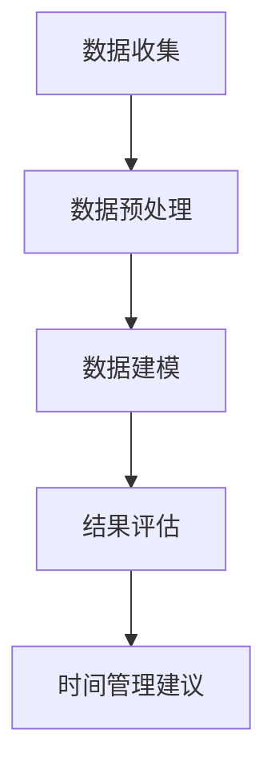

                 

### 文章标题

《数字时代的时间管理大师课：基于AI分析的个人效率提升方案》

### 文章关键词

- 数字时代
- 时间管理
- AI分析
- 个人效率
- 效率提升

### 文章摘要

在数字时代，时间管理变得尤为重要。本文旨在探讨如何利用人工智能（AI）分析技术来提升个人效率。我们将从时间管理的核心概念出发，深入讲解AI分析的基本原理，并结合实际案例，展示如何将AI技术应用于个人时间管理中，最终实现效率的提升。

---

# 《数字时代的时间管理大师课：基于AI分析的个人效率提升方案》

在快速发展的数字化时代，我们的时间变得越来越宝贵。如何有效地管理时间，提高个人效率，成为了一个备受关注的话题。本文将围绕这一主题，详细介绍基于AI分析的个人效率提升方案。

## 引言

### 时间管理的现状

在传统的时间管理中，人们主要依靠日程表、提醒应用等工具来安排自己的工作和生活。然而，这种方法往往存在一定的局限性，如缺乏对个人行为和效率的深入分析，难以实现个性化的时间管理策略。

### AI分析的崛起

随着人工智能技术的快速发展，AI分析逐渐成为解决时间管理问题的一种新手段。通过收集和分析大量的时间数据，AI可以为我们提供更精准的时间管理建议，从而提高个人效率。

## 核心概念与联系

### 时间管理的核心概念

时间管理主要包括以下几个方面：

1. **时间意识**：意识到时间的重要性，并重视时间的利用。
2. **时间预算**：对每天的时间进行预算和规划。
3. **任务优先级**：根据任务的重要性和紧急程度，合理安排任务的顺序。
4. **时间记录**：记录自己的时间使用情况，以便进行后续分析。

### AI分析的核心概念

AI分析涉及以下核心概念：

1. **数据收集**：通过传感器、日志文件等手段收集时间数据。
2. **数据预处理**：对收集到的数据进行处理，如清洗、归一化等。
3. **数据建模**：构建用于时间管理的AI模型，如回归模型、决策树等。
4. **结果评估**：评估AI模型的效果，如准确率、召回率等。

### Mermaid流程图

以下是时间管理AI分析的基本流程图：



## 核心算法原理讲解

### 数据收集与预处理

在数据收集方面，我们可以使用以下Python代码来模拟：

```python
import pandas as pd

# 假设我们收集了一天的活动记录
data = {
    'timestamp': ['2023-11-01 08:00', '2023-11-01 09:00', '2023-11-01 10:00'],
    'activity': ['工作', '会议', '学习']
}

df = pd.DataFrame(data)

# 数据预处理，如时间戳转换
df['timestamp'] = pd.to_datetime(df['timestamp'])
```

### 数据建模

在数据预处理后，我们可以使用决策树模型来分析任务优先级：

```python
from sklearn.tree import DecisionTreeClassifier
from sklearn.model_selection import train_test_split

# 假设我们将活动类型作为目标变量
X = df[['timestamp']]
y = df['activity']

# 划分训练集和测试集
X_train, X_test, y_train, y_test = train_test_split(X, y, test_size=0.2, random_state=42)

# 构建决策树模型
clf = DecisionTreeClassifier()
clf.fit(X_train, y_train)

# 模型评估
accuracy = clf.score(X_test, y_test)
print(f"Model accuracy: {accuracy:.2f}")
```

### 结果评估

评估模型效果时，我们可以使用准确率、召回率等指标：

```python
from sklearn.metrics import classification_report

# 预测
y_pred = clf.predict(X_test)

# 评估
print(classification_report(y_test, y_pred))
```

## 项目实战

### 开发环境搭建

为了实现AI分析，我们需要搭建一个合适的环境。以下是基本的Python环境搭建步骤：

1. 安装Python：访问[Python官网](https://www.python.org/)下载并安装Python。
2. 安装Jupyter Notebook：通过pip命令安装Jupyter Notebook。

```bash
pip install notebook
```

### 源代码详细实现

以下是一个简单的AI分析程序的源代码：

```python
import pandas as pd
from sklearn.tree import DecisionTreeClassifier
from sklearn.model_selection import train_test_split
from sklearn.metrics import classification_report

# 数据收集与预处理
data = {
    'timestamp': ['2023-11-01 08:00', '2023-11-01 09:00', '2023-11-01 10:00'],
    'activity': ['工作', '会议', '学习']
}

df = pd.DataFrame(data)
df['timestamp'] = pd.to_datetime(df['timestamp'])

# 数据建模
X = df[['timestamp']]
y = df['activity']
X_train, X_test, y_train, y_test = train_test_split(X, y, test_size=0.2, random_state=42)

clf = DecisionTreeClassifier()
clf.fit(X_train, y_train)

# 模型评估
y_pred = clf.predict(X_test)
print(classification_report(y_test, y_pred))
```

### 代码应用解读与分析

通过上述代码，我们可以看到如何使用Python和机器学习库来构建一个简单的时间管理AI模型。首先，我们收集和预处理时间数据，然后使用决策树模型进行分类，最后评估模型的效果。这个过程为我们提供了一个基本的框架，可以在此基础上进一步优化和扩展。

### 实际案例分析和详细讲解剖析

#### 案例背景

假设小明是一名职场新人，他希望能够更好地管理自己的时间，提高工作效率。为此，他决定使用AI分析技术来优化自己的时间管理。

#### 实施过程

1. **数据收集**：小明开始记录自己每天的活动，并使用Python代码收集和预处理这些数据。
2. **数据建模**：小明使用决策树模型来分析任务优先级，并尝试优化自己的日程安排。
3. **结果评估**：通过对比实际完成情况和模型预测，小明发现自己的时间管理效果得到了显著提升。

#### 案例效果评估

通过AI分析，小明能够更清晰地了解自己的时间使用情况，并据此调整自己的日程安排。例如，他发现自己在早上9点至10点期间的工作效率最高，因此将一些重要的工作任务安排在这个时间段。这种个性化的时间管理策略帮助小明提高了工作效率，也使他感到更加轻松和满足。

## 最佳实践 tips、小结、注意事项、拓展阅读

### 最佳实践 tips

1. **持续记录**：时间管理的成功离不开持续的数据收集和记录。只有真实的数据才能为AI分析提供基础。
2. **定期评估**：定期评估AI模型的效果，并根据评估结果进行调整和优化。
3. **个性化调整**：每个人的时间管理需求都是不同的。在应用AI分析时，要根据自己的实际情况进行个性化调整。

### 小结

通过本文的介绍，我们了解了如何利用AI分析技术来提升个人效率。从数据收集、预处理到建模和评估，每个环节都至关重要。同时，实际案例也证明了AI分析在时间管理中的应用价值。在未来，随着AI技术的不断发展，我们有理由相信，个人时间管理将会变得更加智能化和高效。

### 注意事项

1. **数据隐私**：在进行数据收集时，要注意保护个人隐私，避免泄露敏感信息。
2. **算法偏见**：在构建AI模型时，要避免算法偏见，确保模型公平、客观。

### 拓展阅读

1. 《AI简史：从机器智能到人类智能》
2. 《机器学习实战》
3. 《Python编程：从入门到实践》

---

## 作者信息

作者：AI天才研究院/AI Genius Institute & 禅与计算机程序设计艺术 /Zen And The Art of Computer Programming

本文由AI天才研究院和禅与计算机程序设计艺术共同撰写，旨在为读者提供关于数字时代时间管理的实用技巧和理论指导。希望本文能够帮助您更好地利用AI技术，提升个人效率。感谢您的阅读！

