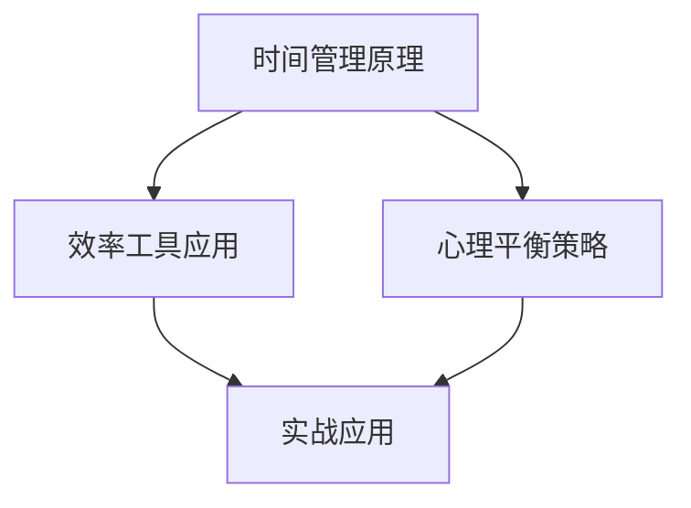
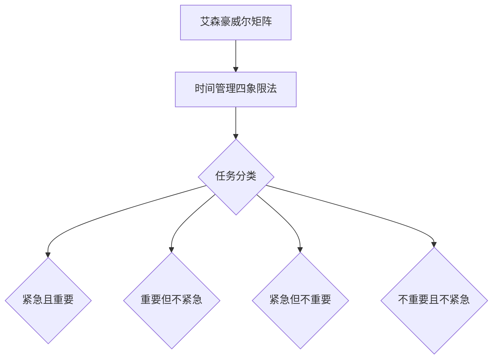
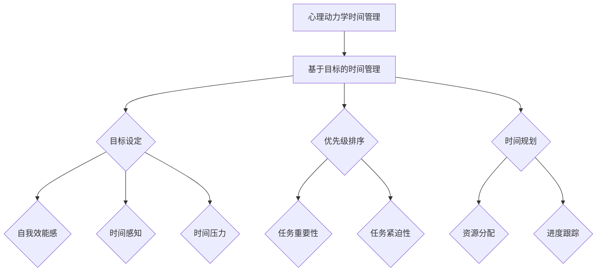
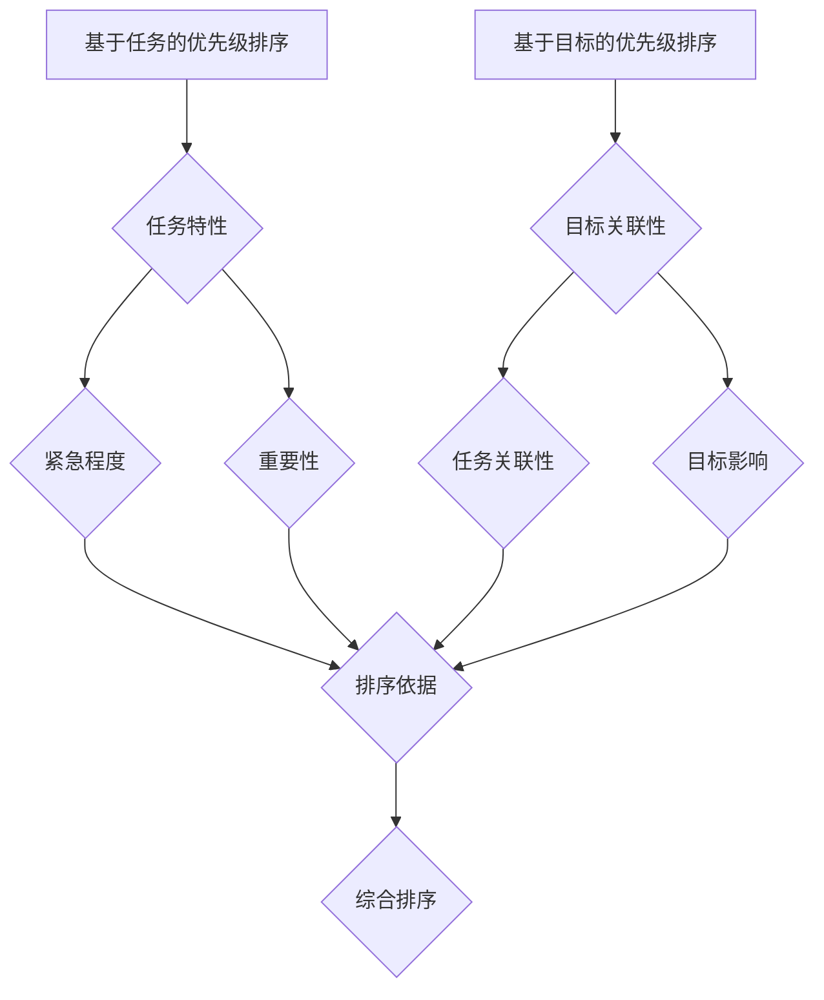

                 

### 文章标题

《数字时代的时间管理：效率工具与心理平衡》

### 关键词

时间管理、效率工具、心理平衡、数字时代、工作文化

### 摘要

在数字时代，时间管理变得比以往任何时候都更加重要。本文旨在探讨如何在信息过载和24/7工作文化的背景下，利用效率工具和心理平衡策略来提高个人生产力。文章首先分析了数字时代的时间管理背景和现状，然后回顾了经典与现代的时间管理理论，接着介绍了提高工作效率的数字工具和策略，并探讨了心理平衡在时间管理中的重要性。最后，通过案例分析和实战演练，提供了具体的实施方法和实践技巧。

### 书名：《数字时代的时间管理：效率工具与心理平衡》

#### 目录大纲：

---

# 第一部分：数字时代时间管理的背景和现状

## 第1章：数字时代的挑战

### 1.1 时间管理的重要性

- 时间管理的基本概念
- 时间管理与个人发展的关系

### 1.2 数字时代的特征

- 信息过载
- 多任务处理
- 24/7 工作文化

## 第2章：时间管理理论回顾

### 2.1 经典时间管理理论

- 艾森豪威尔矩阵
- 时间管理四象限法

### 2.2 现代时间管理理论

- 心理动力学时间管理
- 基于目标的时间管理

# 第二部分：效率工具与策略

## 第3章：提高工作效率的数字工具

### 3.1 效率工具的分类

- 计划与任务管理工具
- 通讯与协作工具
- 个人知识管理工具

### 3.2 主流效率工具介绍

- Trello
- Asana
- Evernote

## 第4章：时间管理策略

### 4.1 优先级排序

- 基于任务的优先级排序
- 基于目标的优先级排序

### 4.2 番茄工作法

- 基本原理
- 实践应用

## 第5章：电子设备管理

### 5.1 设备使用习惯

- 手机使用习惯
- 社交媒体使用习惯

### 5.2 设备管理工具

- 应用锁
- 隐私设置优化

# 第三部分：心理平衡与时间管理

## 第6章：心理平衡的重要性

### 6.1 心理平衡与时间管理的关系

- 心理健康对时间管理的影响
- 时间管理对心理健康的影响

### 6.2 常见心理问题与时间管理

- 焦虑
- 抑郁
- 应对策略

## 第7章：心理平衡策略

### 7.1 睡眠管理

- 睡眠质量对时间管理的影响
- 睡眠管理策略

### 7.2 压力管理

- 压力的来源
- 压力管理技巧

### 7.3 自我关怀

- 自我认知的重要性
- 自我关怀的方法

# 第8章：案例分析与实战

### 8.1 成功案例

- 企业案例
- 个人案例

### 8.2 实战演练

- 制定个人时间管理计划
- 实施时间管理策略
- 反思与调整

# 附录

## 附录A：资源推荐

### 8.1 时间管理相关书籍
### 8.2 时间管理应用软件
### 8.3 时间管理在线资源

## 附录B：时间管理问卷

### B.1 个人时间管理评估
### B.2 时间管理策略评估

## 附录C：时间管理练习

### C.1 番茄工作法实践
### C.2 优先级排序练习
### C.3 压力管理练习

### Mermaid 流程图：



### 核心算法原理讲解：

```python
# 假设我们使用的是基于目标的优先级排序算法

def priority_sort(tasks, goals):
    """
    根据目标和任务的重要性进行排序

    :param tasks: 待排序的任务列表
    :param goals: 用户的目标列表
    :return: 排序后的任务列表
    """
    # 为每个任务分配一个优先级得分
    for task in tasks:
        task['score'] = 0
        for goal in goals:
            if goal in task['description']:
                task['score'] += 1

    # 根据优先级得分进行排序
    sorted_tasks = sorted(tasks, key=lambda x: x['score'], reverse=True)

    return sorted_tasks
```

### 数学模型和数学公式 & 详细讲解 & 举例说明：

```latex
\section{时间管理效率模型}

时间管理的效率可以通过以下数学模型来描述：

\[ 效率 = \frac{完成任务的实际时间}{计划的时间} \]

其中，效率的取值范围在0到1之间，效率越高，表示时间管理越好。

\subsection{举例说明}

假设一个人计划每天工作8小时，实际完成任务用了6小时，那么他的时间管理效率为：

\[ 效率 = \frac{6}{8} = 0.75 \]

这意味着他的时间管理效率为75%。

----------------------------------------------------------------

### 作者

作者：AI天才研究院/AI Genius Institute & 禅与计算机程序设计艺术 /Zen And The Art of Computer Programming

### 完整性要求

**背景介绍**

在数字时代，我们面临着前所未有的挑战。信息的爆炸性增长，多任务处理的需求，以及24/7工作文化，使得时间管理变得尤为关键。有效的个人时间管理不仅能够提高工作效率，还能够增强个人发展和职业成功。因此，理解数字时代的特征和时间管理的重要性，是我们在这一领域深入探讨的前提。

**核心概念与联系**

为了更好地理解时间管理，我们需要先了解一些核心概念，如“效率工具”、“心理平衡”和“时间管理策略”。效率工具是指帮助我们提高工作和生活效率的数字工具，如计划与任务管理工具、通讯与协作工具和个人知识管理工具。心理平衡则是指我们在时间管理过程中，保持心理健康的策略和技巧。时间管理策略包括优先级排序、番茄工作法等，它们帮助我们更有效地分配时间和完成任务。

为了展示这些概念之间的联系，我们可以使用Mermaid流程图来表示：


在这个图中，时间管理原理是核心，效率工具应用和心理平衡策略是支持，而实战应用则是将理论转化为实际操作的环节。

**核心算法原理讲解**

为了更深入地理解优先级排序算法，我们可以通过一个Python示例来详细说明：

```python
# 基于目标的优先级排序算法

def priority_sort(tasks, goals):
    """
    根据目标和任务的重要性进行排序

    :param tasks: 待排序的任务列表
    :param goals: 用户的目标列表
    :return: 排序后的任务列表
    """
    # 初始化任务优先级字典
    task_scores = {task['id']: 0 for task in tasks}
    
    # 为每个任务分配优先级得分
    for task in tasks:
        for goal in goals:
            if goal in task['description']:
                task_scores[task['id']] += 1

    # 根据优先级得分进行排序
    sorted_tasks = sorted(tasks, key=lambda x: task_scores[x['id']], reverse=True)

    return sorted_tasks
```

在这个算法中，我们首先初始化一个字典来存储每个任务的优先级得分。然后，我们遍历每个任务，检查其描述中是否包含用户的目标。如果包含，我们就增加该任务的得分。最后，我们根据得分对任务列表进行排序。

**数学模型和公式**

时间管理的效率可以通过以下数学模型来描述：

\[ 效率 = \frac{完成任务的实际时间}{计划的时间} \]

其中，效率的取值范围在0到1之间，效率越高，表示时间管理越好。

举个例子，如果一个人计划每天工作8小时，但实际完成任务只用了6小时，那么他的时间管理效率为：

\[ 效率 = \frac{6}{8} = 0.75 \]

这意味着他的时间管理效率为75%。

**项目实战**

在实际应用中，我们可以使用这个算法来帮助用户更好地管理他们的时间。例如，在一个任务管理系统中，我们可以根据用户的个人目标和任务描述来为他们提供优先级排序建议，从而帮助他们更有效地分配时间和资源。

**最佳实践 tips、小结、注意事项、拓展阅读**

- **最佳实践 tips**：在实施时间管理策略时，建议先明确个人目标和任务，然后使用优先级排序算法来帮助你确定哪些任务是最重要的。
- **小结**：本文通过介绍数字时代时间管理的背景、理论、工具和策略，帮助读者理解如何在信息过载和多任务处理的背景下进行有效的时间管理。
- **注意事项**：保持心理平衡对于时间管理至关重要，因此，在实施时间管理策略的同时，也要注意自我关怀和心理健康的维护。
- **拓展阅读**：对于想要更深入了解时间管理和效率工具的读者，推荐阅读《深度工作》（Deep Work）和《原子习惯》（Atomic Habits）等书籍。

### 第一部分：数字时代时间管理的背景和现状

## 第1章：数字时代的挑战

### 1.1 时间管理的重要性

时间管理是现代社会中一个至关重要的技能，尤其是在数字时代。时间管理不仅仅关乎个人的工作效率，还直接影响到个人的生活质量、健康状态以及职业发展。以下是时间管理的重要性及其对个人发展的关系：

**时间管理的基本概念**

时间管理是指通过计划、组织和控制时间来达成个人和职业目标的过程。它涉及到对时间的有效利用，以确保在有限的时间内完成更多的任务和目标。

**时间管理与个人发展的关系**

1. **提高工作效率**：通过合理的时间管理，个人可以更加专注和高效地完成任务，从而提高工作效率。高效的工作能够带来职业上的成就感，增加自信心和满足感。

2. **增强决策能力**：时间管理要求个人对任务和活动进行优先级排序，这有助于培养决策能力。在明确任务的重要性和紧迫性之后，个人能够更明智地做出选择，从而避免不必要的拖延和焦虑。

3. **提升生活质量**：有效的时间管理使个人能够合理分配工作和休息时间，从而拥有更多的个人时间和自由空间。这有助于提升生活质量，减少工作压力，增强身心健康。

4. **促进个人成长**：时间管理不仅仅是完成任务，更是个人成长的过程。通过设定目标、规划时间和反思进展，个人能够不断学习和进步，实现自我提升。

**结论**

时间管理的重要性在于它能够帮助个人在有限的时间内实现最大的价值。在数字时代，时间管理技能显得尤为重要，因为它能够帮助个人应对信息过载、多任务处理和24/7工作文化等挑战，从而提高工作效率和生活质量。

### 1.2 数字时代的特征

数字时代带来了许多前所未有的变革，对时间管理产生了深远的影响。以下将探讨数字时代的主要特征，以及这些特征如何影响时间管理：

**信息过载**

在数字时代，信息的获取变得前所未有的便捷。然而，这也导致了信息过载的问题。每天都有大量的电子邮件、社交媒体通知、新闻更新等涌入我们的视野，这使得人们难以有效地筛选和处理信息。信息过载不仅消耗了大量的时间，还可能导致焦虑和压力。

**多任务处理**

在数字时代，多任务处理已经成为一种普遍的工作方式。人们需要同时处理多个任务，如回复邮件、参加会议、管理社交媒体等。虽然多任务处理能够提高生产力，但过多的任务可能会导致注意力分散，降低工作效率。

**24/7工作文化**

随着远程工作和全球化的发展，24/7工作文化变得越来越普遍。这意味着人们不再有时间界限，工作可以随时开始和结束。虽然这种灵活性在某些情况下是有益的，但它也可能导致工作与生活的边界模糊，增加工作压力。

**对时间管理的影响**

1. **信息过载**：信息过载要求个人具备更强的信息筛选和处理能力。时间管理技能在这里变得尤为重要，因为它可以帮助个人有效管理信息流，避免被无用的信息所淹没。

2. **多任务处理**：多任务处理虽然能够提高效率，但也需要个人具备良好的时间管理技能，以确保每个任务都能得到适当的关注和完成。

3. **24/7工作文化**：24/7工作文化要求个人具备更强的自律和时间规划能力。通过合理的时间管理，个人可以保持工作与生活的平衡，避免过度劳累。

**结论**

数字时代的特征对时间管理提出了新的挑战。通过掌握有效的时间管理技能，个人可以更好地应对信息过载、多任务处理和24/7工作文化等挑战，从而提高工作效率和生活质量。

### 2.1 经典时间管理理论

时间管理理论的发展历史悠久，许多经典理论至今仍被广泛应用。以下将介绍两种经典的时间管理理论：艾森豪威尔矩阵和时间管理四象限法。

**艾森豪威尔矩阵**

艾森豪威尔矩阵是由美国前总统艾森豪威尔提出的一种时间管理工具，用于帮助个人将任务划分为不同的类别。该矩阵将任务分为四个象限，分别是：

1. **紧急且重要（右上角）**：这些任务通常需要立即处理，如紧急会议或突发事件。这些任务往往占用大量时间和精力，但如果忽视可能导致严重的后果。

2. **不紧急但重要（左上角）**：这些任务虽然不需要立即处理，但长期来看对个人和职业发展至关重要，如规划、学习和自我提升。这些任务往往容易被忽视，但却是实现长期目标的关键。

3. **紧急但不重要（右下角）**：这些任务通常是一些琐碎的事情，如回复不必要的邮件或处理小事。虽然这些任务紧急，但通常不会对个人产生重大影响。

4. **不紧急且不重要（左下角）**：这些任务通常可以忽略不计，如浏览社交媒体或做无意义的事情。这些任务不仅浪费时间，还可能降低工作效率。

**时间管理四象限法**

时间管理四象限法是一种更为综合的时间管理工具，它将任务划分为四个象限，并强调在不同情况下采取不同的策略。这四个象限分别是：

1. **紧急且重要**：专注于立即处理这些任务，如紧急电话或重要会议。

2. **重要但不紧急**：规划这些任务，确保它们在合适的时间得到处理，如写报告或做预算。

3. **紧急但不重要**：委托或推迟这些任务，如不必要的会议或电话。

4. **不重要且不紧急**：尽量避免这些任务，如浏览社交媒体或做无意义的事情。

**联系与架构**

艾森豪威尔矩阵和时间管理四象限法都强调了任务的重要性和紧急性，但它们的应用场景和策略有所不同。艾森豪威尔矩阵更侧重于将任务分类，而时间管理四象限法则更注重在不同情况下采取不同的处理策略。

为了更好地理解这些概念之间的关系，我们可以使用Mermaid流程图来表示：



在这个图中，艾森豪威尔矩阵和时间管理四象限法是核心，任务分类是它们的应用场景，而紧急且重要、重要但不紧急、紧急但不重要、不重要且不紧急是具体的任务类别。

**结论**

经典时间管理理论为个人提供了有效的工具和方法来管理时间和任务。通过理解和应用这些理论，个人可以更好地应对工作中的挑战，提高工作效率和生活质量。

### 2.2 现代时间管理理论

随着社会的不断进步和技术的飞速发展，现代时间管理理论也在不断演进。这些理论不仅继承了经典时间管理理论的精髓，还结合了现代心理学和管理学的最新研究成果，为个人和组织提供了更加科学和实用的时间管理策略。以下将介绍两种现代时间管理理论：心理动力学时间管理和基于目标的时间管理。

**心理动力学时间管理**

心理动力学时间管理理论源于心理学领域，它关注个体内心世界与时间管理行为之间的关系。这种理论认为，个人的时间管理行为不仅受到外部环境的压力和挑战，还受到内在心理因素的影响。以下是一些关键概念：

1. **自我效能感**：自我效能感是指个体对自己完成特定任务的能力的信心。高自我效能感的个体倾向于设定更高的目标，并更有效地管理时间。

2. **时间感知**：时间感知是指个体对时间的感知和体验。不同的心理状态，如焦虑、压力和快乐，会影响个体对时间的感知，从而影响时间管理行为。

3. **时间压力**：时间压力是指个体感受到的时间限制和任务要求。高时间压力会导致个体的焦虑和效率下降，而有效的压力管理可以帮助个体更好地应对时间挑战。

**应用案例**

例如，在一个项目团队中，如果团队成员感受到高时间压力，他们可能会感到焦虑和不安，从而导致工作效率下降。通过心理动力学时间管理策略，团队可以通过压力管理技巧、任务分解和自我效能感提升来应对这些挑战。

**基于目标的时间管理**

基于目标的时间管理理论强调目标设定和目标实现的重要性。这种理论认为，个人和组织应该明确自己的目标，并制定具体的计划和时间表来达成这些目标。以下是一些关键概念：

1. **目标设定**：目标设定是指确定具体、可衡量、可实现、相关性强、时限性的目标（SMART目标）。有效的目标设定可以帮助个人和组织明确方向，集中精力。

2. **优先级排序**：优先级排序是指根据目标的重要性和紧迫性来排列任务的顺序。这种排序可以帮助个人和组织更加高效地利用时间。

3. **时间规划**：时间规划是指根据目标和任务制定详细的时间表，并确保在规定的时间内完成任务。这种规划可以帮助个人和组织避免拖延和资源浪费。

**应用案例**

例如，一个企业可以通过基于目标的时间管理策略来规划年度业务目标。首先，企业明确年度销售额、市场份额和客户满意度等目标，然后根据这些目标制定具体的工作计划和里程碑，最后通过时间表来跟踪和评估进展。

**联系与架构**

心理动力学时间管理和基于目标的时间管理虽然出发点不同，但它们在实际应用中往往相互补充。心理动力学时间管理关注个体内心的需求和动机，而基于目标的时间管理则注重目标的实现和效率。为了更好地理解它们之间的关系，我们可以使用Mermaid流程图来表示：



在这个图中，心理动力学时间管理和基于目标的时间管理是核心，目标设定、优先级排序和时间规划是它们的重要组成部分，而自我效能感、时间感知、时间压力、任务重要性和任务紧迫性等概念则支持这些核心部分。

**结论**

现代时间管理理论为个人和组织提供了更加全面和实用的策略来应对数字时代的挑战。通过结合心理动力学和时间管理的原理，个人和组织可以更加有效地管理时间和资源，实现目标，提高生活质量和工作效率。

## 第3章：提高工作效率的数字工具

### 3.1 效率工具的分类

在数字时代，提高工作效率的数字工具变得至关重要。这些工具不仅能够帮助我们管理时间和任务，还能增强协作和知识管理。以下将介绍几种主要的效率工具分类：

**计划与任务管理工具**

计划与任务管理工具是最常用的效率工具之一，用于帮助个人和组织规划任务和跟踪进度。这类工具通常包括以下功能：

- 任务列表：创建任务列表，并将任务分配给团队成员。
- 优先级排序：根据任务的紧急程度和重要性进行排序。
- 日历同步：与个人日历同步，确保任务和时间安排的一致性。
- 提醒功能：设置提醒，避免错过重要任务或会议。

常见的计划与任务管理工具包括Trello、Asana和Jira。

**通讯与协作工具**

通讯与协作工具旨在提高团队之间的沟通效率和协作能力。这些工具通常包括以下功能：

- 实时通讯：通过即时消息和聊天功能进行实时沟通。
- 文档共享：共享和编辑文档，确保团队成员之间的信息一致性。
- 会议安排：在线会议和视频通话功能，便于远程协作。
- 项目进度跟踪：跟踪项目进度和团队成员的工作情况。

常见的通讯与协作工具包括Slack、Microsoft Teams和Zoom。

**个人知识管理工具**

个人知识管理工具用于帮助个人收集、整理和利用知识资源，以支持学习和工作。这类工具通常包括以下功能：

- 知识库：存储和分类知识资源，便于查找和使用。
- 笔记功能：记录笔记和想法，支持文本、图像和文档格式。
- 搜索功能：快速查找相关知识和信息。
- 学习计划：制定学习计划，跟踪学习进度。

常见的个人知识管理工具包括Evernote、OneNote和Notion。

**综合管理工具**

综合管理工具结合了计划与任务管理、通讯与协作和个人知识管理等多种功能，旨在提供一站式解决方案。这类工具通常包括以下功能：

- 项目管理：规划和管理项目任务和进度。
- 团队协作：支持团队沟通和协作。
- 知识管理：收集、整理和利用知识资源。
- 统计分析：对项目进度和效率进行分析。

常见的综合管理工具包括Trello、Asana和Microsoft Project。

**结论**

效率工具的分类多种多样，每种工具都有其独特的功能和优势。通过选择合适的工具，个人和组织可以更加高效地管理时间和任务，提高协作和知识管理能力。

### 3.2 主流效率工具介绍

在数字时代，提高工作效率的工具种类繁多，其中一些工具因其功能强大、用户友好而广受欢迎。以下将介绍三种主流效率工具：Trello、Asana和Evernote，并探讨它们的特点和应用场景。

**Trello**

Trello是一种基于看板（Kanban）方法的任务管理工具，以其直观的视觉界面和灵活的任务管理功能而闻名。Trello的特点如下：

- **看板界面**：Trello的核心功能是基于看板方法的任务管理，用户可以通过看板、列表和卡片来组织和跟踪任务。
- **灵活的定制**：用户可以根据需求自定义看板、列和卡片，添加标签、描述、成员和截止日期等。
- **协作功能**：Trello支持团队成员协作，允许用户邀请他人参与项目，并在卡片上进行评论和讨论。
- **移动应用**：Trello提供了iOS和Android移动应用，用户可以随时随地进行任务管理。

**应用场景**：

- **团队项目**：Trello适用于团队项目，可以帮助团队成员清晰了解任务分配和进度。
- **个人任务**：个人用户也可以使用Trello来管理个人任务，提高工作效率。

**Asana**

Asana是一种全面的任务和项目管理系统，旨在帮助团队高效协作。Asana的特点如下：

- **任务管理**：Asana提供强大的任务管理功能，用户可以创建任务、分配任务、设置优先级和截止日期。
- **项目跟踪**：Asana支持项目跟踪，用户可以查看项目进度、任务完成情况，并生成报告。
- **协作与沟通**：Asana内置沟通功能，用户可以在任务和项目中讨论和交流。
- **集成服务**：Asana与许多其他工具和服务集成，如Google Workspace、Microsoft Teams和Slack等。

**应用场景**：

- **企业团队**：Asana适用于企业团队，可以帮助不同部门高效协作，提高整体工作效率。
- **远程工作**：Asana特别适合远程团队，提供实时任务更新和沟通功能。

**Evernote**

Evernote是一款强大的个人知识管理工具，适用于记录、整理和查找笔记。Evernote的特点如下：

- **笔记记录**：Evernote提供多种笔记格式，包括文本、图像、音频和视频，用户可以随时随地记录想法和灵感。
- **搜索功能**：Evernote的搜索功能强大，用户可以通过关键词、标签和位置等条件快速查找笔记。
- **同步与共享**：Evernote支持跨平台同步，用户可以在多个设备上访问和编辑笔记。同时，Evernote支持共享笔记，便于团队协作。
- **扩展功能**：Evernote提供了许多扩展功能，如Web剪辑、扫描和OCR识别等，用户可以根据需求自定义笔记功能。

**应用场景**：

- **个人知识管理**：Evernote适用于个人知识管理，可以帮助用户整理和查找各种笔记和信息。
- **团队协作**：Evernote也适用于团队协作，用户可以共享笔记和文件，提高团队工作效率。

**结论**

Trello、Asana和Evernote是数字时代提高工作效率的三大主流工具。Trello适用于任务和项目管理，Asana适用于团队协作和项目管理，而Evernote则适用于个人知识管理和团队协作。通过选择合适的工具，用户可以更高效地管理任务、项目和知识，提高整体工作效率。

### 4.1 优先级排序

在时间管理中，优先级排序是关键的一步，它有助于我们确定哪些任务是最重要和最紧急的，从而更有效地利用时间。以下将介绍两种常见的优先级排序方法：基于任务的优先级排序和基于目标的优先级排序。

**基于任务的优先级排序**

基于任务的优先级排序方法关注每个任务的特性，如紧急程度和重要性，来决定任务的优先顺序。这种方法适用于那些任务量较大且需要按特定顺序完成的情况。以下是几个步骤：

1. **列出任务**：首先，将所有需要完成的任务列出来。
2. **评估紧急程度**：根据任务的截止日期和紧急程度对任务进行排序。
3. **评估重要性**：对任务的重要性进行评估，考虑它们对个人或组织目标的影响。
4. **综合排序**：将任务的紧急程度和重要性综合起来，得出最终的优先级排序。

例如，如果一个人有一个项目报告、一个客户会议和一个个人健身任务，基于任务的优先级排序可能会将项目报告放在最前面，因为它是紧急且重要的，而客户会议则排在中间，因为它是重要的但并不紧急，个人健身任务则排在最后。

**基于目标的优先级排序**

基于目标的优先级排序方法则是以个人的长期目标和短期目标为核心，来确定任务的优先顺序。这种方法更注重任务的达成对目标实现的影响，而不是单纯的任务特性。以下是几个步骤：

1. **明确目标**：首先，明确个人的长期目标和短期目标。
2. **分析任务关联**：分析每个任务与目标之间的关联性，确定哪些任务能够直接推动目标的实现。
3. **评估优先级**：根据任务与目标的相关性来评估每个任务的优先级。
4. **综合排序**：将任务的优先级综合起来，得出最终的优先级排序。

例如，如果一个人的长期目标是提高健康水平，短期目标是每天锻炼30分钟，那么基于目标的优先级排序可能会将每天锻炼30分钟的任务放在最前面，因为它是实现短期目标的关键，而其他任务则根据与健康目标的相关性进行排序。

**联系与区别**

基于任务的优先级排序和基于目标的优先级排序虽然都以任务为中心，但它们的关注点不同。基于任务的优先级排序更注重任务本身的特性和紧急程度，而基于目标的优先级排序则更注重任务对目标实现的影响。

为了更好地理解这两种排序方法的联系与区别，我们可以使用Mermaid流程图来表示：



在这个图中，基于任务的优先级排序和基于目标的优先级排序是核心，任务特性和目标关联性是它们的基础，而紧急程度、重要性、任务关联性和目标影响是具体的排序依据，综合排序则是最终的目标。

**结论**

优先级排序是时间管理中至关重要的一步，通过合理的排序方法，我们可以更有效地分配时间和资源，提高工作效率。基于任务的优先级排序适用于任务量较大且需要按特定顺序完成的情况，而基于目标的优先级排序则更注重任务的长期影响，适用于需要实现特定目标的情况。结合这两种排序方法，个人可以更好地管理时间和任务，实现个人和职业目标。

### 4.2 番茄工作法

番茄工作法（Pomodoro Technique）是一种简单而有效的任务管理方法，由弗朗西斯科·西里洛（Francesco Cirillo）在1980年代末发明。这种方法通过将工作时间分割成短期、专注的“番茄时间”来提高工作效率和生产力。以下是番茄工作法的原理、步骤和实际应用。

**原理**

番茄工作法的核心思想是将工作时间划分为25分钟的“番茄时间”和5分钟的短暂休息。这种方法利用了人类大脑的专注力和疲劳周期，通过短暂的休息来恢复注意力，从而保持长时间的专注。

- **番茄时间**：每个番茄时间是指连续工作25分钟，专注于一项任务，不进行任何与工作无关的活动。
- **短暂休息**：每个番茄时间结束后，进行5分钟的短暂休息，放松大脑，恢复精力。
- **长期休息**：每完成四个番茄时间后，进行15-30分钟的长期休息，以充分恢复体力和精神。

**步骤**

1. **确定任务**：开始前，明确需要完成的任务。
2. **设定番茄钟**：使用番茄钟（可以是物理番茄形状的计时器，也可以是手机或电脑上的番茄工作法应用）设定25分钟的工作时间。
3. **开始工作**：开始番茄时间，专注于任务，避免任何干扰。
4. **计时**：番茄钟倒计时至0时，表示一个番茄时间结束。
5. **短暂休息**：休息5分钟，进行轻松的活动，如散步、深呼吸或伸展。
6. **重复**：完成四个番茄时间后，进行15-30分钟的长期休息，然后继续进行下一个番茄时间。

**实际应用**

1. **个人学习**：在准备考试或学习新知识时，使用番茄工作法可以帮助学生保持专注，提高学习效率。
2. **项目管理**：在团队项目中，使用番茄工作法可以帮助团队成员更好地分配任务和时间，提高项目的整体效率。
3. **日常生活**：在日常生活中，使用番茄工作法可以帮助个人更好地管理时间，提高工作和生活效率。

**案例**

假设一个人需要在两个小时内完成一篇报告，可以按照以下步骤应用番茄工作法：

1. **设定任务**：明确报告的完成时间。
2. **设定番茄钟**：设定两个番茄时间（50分钟），每个番茄时间后休息5分钟，总共休息10分钟。
3. **开始工作**：开始第一个番茄时间，专注于报告的撰写。
4. **短暂休息**：番茄时间结束后，休息5分钟，进行轻松活动。
5. **继续工作**：开始第二个番茄时间，继续撰写报告。
6. **短暂休息**：番茄时间结束后，休息5分钟，进行轻松活动。
7. **长期休息**：两个番茄时间结束后，休息15-30分钟，进行放松活动，如散步或阅读。

通过这样的安排，个人可以在有限的时间内保持高效工作，同时确保有足够的休息时间，避免疲劳和效率下降。

**结论**

番茄工作法是一种简单而有效的任务管理方法，通过将工作时间分割成短期、专注的番茄时间，并穿插短暂的休息，可以帮助个人提高工作效率和生产力。在实际应用中，可以根据个人任务的特点和时间安排灵活调整番茄时间的长度和休息时间，以获得最佳效果。

### 5.1 设备使用习惯

在数字时代，电子设备的使用习惯对时间管理具有重要影响。合理的设备使用习惯不仅能够提高工作效率，还能减少干扰和压力，从而更好地管理时间。以下将探讨手机使用习惯和社交媒体使用习惯，并介绍一些优化这些习惯的策略。

**手机使用习惯**

手机已经成为现代人生活中不可或缺的工具，但过度依赖手机也可能导致时间管理问题。以下是一些常见的手机使用习惯和优化策略：

1. **频繁查看通知**：许多人习惯于频繁查看手机通知，这会导致分心和效率下降。优化策略包括：

   - **限制通知**：关闭不必要的应用通知，仅保留重要应用的推送通知。
   - **设置特定查看时间**：每天设定特定时间查看手机通知，避免频繁打扰。

2. **刷屏习惯**：长时间刷手机可能导致浪费时间，分散注意力。优化策略包括：

   - **设定时间限制**：为自己设定每天或每周的刷手机时间限制，如每天不超过30分钟。
   - **使用应用程序锁**：使用应用锁功能防止不必要地打开某些应用。

**社交媒体使用习惯**

社交媒体在提供便捷沟通和信息交流的同时，也可能成为时间管理的障碍。以下是一些常见的社交媒体使用习惯和优化策略：

1. **无休止的浏览**：长时间在社交媒体上浏览内容可能导致时间浪费和效率下降。优化策略包括：

   - **设定时间限制**：为自己设定每天或每周的社交媒体浏览时间，如每天不超过1小时。
   - **优先处理重要内容**：在浏览社交媒体时，优先关注重要信息，避免无休止地滚动浏览。

2. **多账号管理**：同时管理多个社交媒体账号可能导致精力分散。优化策略包括：

   - **集中管理**：将社交媒体账号集中在一个平台上，如Hootsuite或Buffer，以便更有效地管理内容。
   - **明确角色和目标**：为每个账号设定明确的角色和目标，避免角色混淆和精力分散。

**优化策略总结**

1. **设定目标**：为自己设定明确的手机和社交媒体使用目标，如每天查看手机通知不超过三次，每周社交媒体浏览时间不超过2小时。

2. **使用应用锁和隐私设置**：使用应用锁和隐私设置来限制不必要的应用访问和通知，保护个人时间和注意力。

3. **定期评估**：定期评估手机和社交媒体使用习惯，并根据实际情况进行调整和优化。

**结论**

合理的设备使用习惯对时间管理至关重要。通过优化手机使用习惯和社交媒体使用习惯，个人可以更好地管理时间和注意力，提高工作效率和生活质量。

### 5.2 设备管理工具

为了优化电子设备的使用，提高工作效率和保持良好的时间管理，我们可以利用一系列设备管理工具。以下将介绍应用锁、隐私设置优化等工具，并探讨如何通过这些工具来提高个人时间管理。

**应用锁**

应用锁是一种保护个人隐私和防止不必要干扰的重要工具。通过应用锁，用户可以为特定应用设置密码或指纹解锁，确保这些应用不被他人随意访问。以下是应用锁的使用方法和效果：

1. **设置应用锁**：
   - 在手机设置中查找“应用锁”或“屏幕锁定”功能。
   - 选择需要保护的应用，如社交媒体、邮件和银行应用。
   - 设置解锁密码或指纹，确保安全性。

2. **效果**：
   - 防止他人随意查看或操作敏感应用，保护个人隐私。
   - 减少被应用通知打扰的次数，提高专注力。

**隐私设置优化**

除了应用锁，优化隐私设置也是保护个人时间和注意力的重要措施。以下是一些优化隐私设置的步骤和方法：

1. **限制应用权限**：
   - 在手机设置中进入“权限管理”或“应用权限”。
   - 检查并限制不必要的应用权限，如相机、位置和联系人权限。

2. **管理通知**：
   - 在手机设置中进入“通知管理”或“通知栏”。
   - 关闭或限制不必要的应用通知，仅保留重要通知。

3. **设置勿扰模式**：
   - 在手机设置中查找“勿扰模式”或“静音模式”。
   - 根据个人需求设置特定时间或情况的勿扰模式，避免被通知打扰。

**效果**：

- 优化隐私设置可以提高手机的安全性，防止信息泄露。
- 减少不必要的通知和干扰，提高个人专注力和工作效率。

**具体应用实例**

假设一个职场人士希望提高工作效率，可以采取以下措施：

1. **设置应用锁**：
   - 为社交媒体和邮件应用设置应用锁，防止家人或同事查看。
   - 设置指纹解锁，方便快速解锁，同时确保应用安全。

2. **优化隐私设置**：
   - 限制社交媒体和游戏应用的位置权限，防止被过度追踪。
   - 关闭不必要的应用通知，如新闻和购物应用，专注于工作相关的应用。

通过这些措施，职场人士可以更好地保护个人时间和注意力，提高工作效率，实现工作与生活的平衡。

**结论**

设备管理工具如应用锁和隐私设置优化在个人时间管理中扮演着重要角色。通过合理使用这些工具，个人可以保护隐私、减少干扰，提高专注力和工作效率，从而更好地管理时间。

## 第6章：心理平衡的重要性

### 6.1 心理平衡与时间管理的关系

在数字时代，心理平衡与时间管理之间的关系变得愈发紧密。良好的心理平衡不仅是时间管理成功的关键，也是个人生活质量的保障。以下是心理平衡与时间管理之间的几个关键联系：

**心理健康对时间管理的影响**

1. **情绪调节**：心理平衡有助于个体更好地调节情绪，减少焦虑和压力。当个体能够保持平和的心态时，他们更有可能有效地规划和执行任务，从而提高时间管理的效率。

2. **注意力集中**：良好的心理平衡能够帮助个体保持高度的注意力集中，减少分心和干扰。这使个体能够更专注于当前任务，提高工作效率。

3. **决策能力**：心理平衡有助于提升个体的决策能力。当个体心态平和时，他们能够更理性地评估任务的重要性和优先级，从而做出更有效的决策。

**时间管理对心理健康的影响**

1. **减少压力**：有效的时间管理能够帮助个体合理分配时间，确保工作与休息、生活与工作之间的平衡。这有助于减少因长时间工作或任务堆积而产生的压力，维护心理健康。

2. **增加成就感**：通过实现既定目标和完成任务，个体能够获得成就感和自我价值感，这有助于提升心理健康。

3. **减少焦虑**：良好的时间管理策略能够帮助个体避免因时间紧迫和任务过多而产生的焦虑感。通过设定合理的目标和优先级，个体可以更从容地应对工作和生活中的挑战。

**结论**

心理平衡与时间管理之间存在着紧密的联系。通过保持良好的心理平衡，个体能够更好地管理时间，提高工作效率和生活质量。同时，有效的时间管理也能够有助于维护心理健康，减少压力和焦虑。因此，在数字时代，我们应该重视心理平衡在时间管理中的重要性，并将其作为实现高效工作和幸福生活的重要工具。

### 6.2 常见心理问题与时间管理

在数字时代，由于信息过载、工作压力和24/7工作文化的影响，许多人面临各种心理问题。以下将探讨一些常见的心理问题，如焦虑、抑郁和应对策略，以及这些心理问题如何影响时间管理。

**焦虑**

焦虑是一种常见的心理问题，表现为持续的紧张、不安和恐惧感。焦虑对时间管理的影响主要体现在以下几个方面：

1. **注意力分散**：焦虑会导致个体注意力分散，难以集中精力完成任务，从而影响工作效率。
2. **时间感知改变**：焦虑会使时间感知变得扭曲，个体可能会感到时间紧迫或时间流逝过快，这可能导致任务安排不合理和时间管理困难。
3. **拖延行为**：焦虑可能引发拖延行为，个体因害怕失败或面对压力而推迟完成任务，进一步影响时间管理。

**应对策略**

1. **认知行为疗法**：通过认知行为疗法（CBT）可以帮助个体识别和改变导致焦虑的负面思维模式。通过积极的思考和问题解决策略，个体能够更有效地管理时间和任务。
2. **深呼吸和冥想**：深呼吸和冥想是一种有效的放松技巧，可以帮助个体减轻焦虑，提高专注力。
3. **定期休息和放松**：定期休息和放松对于缓解焦虑至关重要。通过设定休息时间和进行放松活动，个体能够恢复精力，提高时间管理能力。

**抑郁**

抑郁是一种严重的心理问题，表现为持续的悲伤、兴趣丧失和能量缺乏。抑郁对时间管理的影响主要包括：

1. **动力不足**：抑郁可能导致个体缺乏动力和活力，难以开始或完成任务，从而影响时间管理。
2. **睡眠障碍**：抑郁常常伴随睡眠障碍，如失眠或过度睡眠，这会影响个体的日常作息和时间安排。
3. **自我怀疑**：抑郁可能导致个体对自己能力的怀疑，影响任务决策和优先级排序。

**应对策略**

1. **药物治疗**：对于严重的抑郁症状，药物治疗可能是一种有效的治疗方法。抗抑郁药物可以帮助个体恢复情绪和动力。
2. **心理咨询**：心理咨询可以帮助个体识别抑郁的根源，并提供有效的应对策略。通过心理咨询，个体可以学会更好的时间管理技巧，提高生活质量。
3. **运动和社交活动**：定期参与运动和社交活动有助于提高情绪，增强自我价值感。这些活动可以提供积极的社交互动和支持网络。

**总结**

焦虑和抑郁是数字时代常见的心理问题，它们对时间管理产生负面影响。通过认知行为疗法、深呼吸冥想、定期休息和药物治疗等策略，个体可以缓解焦虑和抑郁症状，提高时间管理能力。在数字时代，重视心理健康和有效的时间管理策略对于维护个人发展和生活质量至关重要。

### 7.1 睡眠管理

睡眠管理是心理平衡的重要组成部分，对时间管理具有深远的影响。良好的睡眠质量不仅能够提高个体的注意力和工作效率，还能减少焦虑和抑郁等心理问题，从而更好地管理时间。以下将探讨睡眠质量对时间管理的影响，以及有效的睡眠管理策略。

**睡眠质量对时间管理的影响**

1. **注意力集中**：良好的睡眠有助于提高个体的注意力集中能力。当个体拥有充足的睡眠时，他们能够在工作中保持专注，减少分心和错误。

2. **决策能力**：睡眠不足会影响大脑的认知功能和决策能力。充足的睡眠能够帮助个体更有效地评估任务的重要性和优先级，做出更明智的决策。

3. **情绪调节**：睡眠质量对情绪调节具有重要作用。良好的睡眠有助于个体保持积极的心态，减少焦虑和抑郁等负面情绪，从而更好地管理时间和任务。

4. **工作效率**：睡眠不足会导致疲劳和精力不足，降低个体的工作效率。充足的睡眠能够帮助个体恢复体力和精神，提高工作效率。

**睡眠管理策略**

1. **规律作息**：保持规律的作息时间是改善睡眠质量的关键。每天尽量在同一时间上床睡觉和起床，有助于建立稳定的生物钟。

2. **优化睡眠环境**：改善睡眠环境可以提高睡眠质量。确保睡眠环境安静、舒适和黑暗，避免使用电子设备和噪音干扰。

3. **放松身心**：睡前进行放松活动，如深呼吸、冥想或温水泡脚，有助于放松身心，减轻压力，促进睡眠。

4. **避免咖啡因和酒精**：避免在睡前摄入咖啡因和酒精，因为它们可能会干扰睡眠质量。特别是咖啡因，即使在白天摄入，也可能在晚上影响睡眠。

5. **适量运动**：定期进行适量的运动有助于改善睡眠质量。但需要注意的是，避免在睡前进行剧烈运动，以免过度兴奋。

6. **限制午睡时间**：如果需要午睡，尽量将时间控制在20-30分钟内，避免长时间午睡影响夜间睡眠。

**结论**

睡眠管理对时间管理具有重要影响。通过保持规律的作息时间、优化睡眠环境、放松身心和避免咖啡因和酒精等策略，个体可以改善睡眠质量，提高注意力、决策能力和工作效率，从而更好地管理时间和任务。

### 7.2 压力管理

压力管理是心理平衡的关键组成部分，对时间管理和个人幸福感有着深远的影响。在数字时代，工作压力和生活方式的变化使得很多人面临着不同程度的压力。以下将探讨压力的来源、压力管理技巧以及这些技巧如何帮助我们更好地管理时间。

**压力的来源**

1. **工作压力**：工作中的竞争、工作量、工作期限和不确定性是主要压力来源。特别是在项目截止日期临近或面临绩效考核时，压力往往会显著增加。

2. **个人责任**：家庭责任、财务压力和个人期望也会对个体造成压力。许多人同时承担着工作和家庭的重担，这可能导致压力积累。

3. **生活方式**：不健康的生活方式，如缺乏运动、不良饮食习惯和睡眠不足，也会增加压力感。

**压力管理技巧**

1. **认知行为疗法（CBT）**：CBT可以帮助个体识别和改变导致压力的负面思维模式。通过认知重构，个体可以更积极地看待问题，减少不必要的焦虑。

2. **时间管理**：有效的时间管理是减轻压力的重要手段。通过设定优先级、规划日程和避免拖延，个体可以更好地控制工作流程，减少压力。

3. **放松技巧**：放松技巧如深呼吸、冥想、瑜伽和渐进性肌肉放松可以帮助个体缓解紧张和焦虑。这些技巧有助于放松身心，提高情绪调节能力。

4. **运动**：定期进行适量的运动可以释放压力，提高身心健康。运动不仅能够释放身体中的紧张，还能提高大脑中的内啡肽水平，带来积极的情绪体验。

5. **社交支持**：与家人、朋友和同事建立良好的社交关系有助于缓解压力。分享感受和寻求支持可以帮助个体感受到归属感和安全感。

6. **专业咨询**：当压力难以自我管理时，寻求专业的心理咨询或治疗是一种有效的策略。心理咨询师可以帮助个体探索压力源，并提供个性化的应对策略。

**压力管理技巧对时间管理的影响**

1. **提高专注力**：通过减轻压力，个体能够更好地集中注意力，提高工作效率。

2. **减少拖延**：压力管理的技巧如时间管理和放松技巧可以帮助个体减少拖延行为，更有效地完成任务。

3. **增强决策能力**：减轻压力有助于个体更清晰地思考和决策，避免因压力导致的不理性决策。

4. **提高生活质量**：有效的压力管理不仅有助于提高工作效率，还能改善生活质量，使个体有更多时间享受生活和追求个人兴趣。

**结论**

压力管理是维护心理平衡和提升时间管理能力的重要环节。通过认知行为疗法、时间管理技巧、放松技巧、运动和社交支持等策略，个体可以更好地应对压力，提高专注力、减少拖延、增强决策能力，并提升生活质量。在数字时代，重视压力管理对于实现高效工作和幸福生活至关重要。

### 7.3 自我关怀

自我关怀是心理平衡和有效时间管理的重要组成部分。在追求高效工作和职业成功的同时，忽视自我关怀可能导致心理健康问题、效率下降以及生活质量受损。以下将探讨自我关怀的重要性，以及如何在日常生活中实践自我关怀。

**自我关怀的重要性**

1. **心理健康**：自我关怀有助于维护心理健康，减少焦虑、抑郁和压力。通过关注自己的情感和需求，个体能够更好地调节情绪，提高心理韧性。

2. **工作效率**：自我关怀能够提升个体的精神状态和专注力，从而提高工作效率。一个身心健康的个体更能够集中精力完成任务，避免因压力导致的错误和拖延。

3. **生活质量**：自我关怀有助于个体在工作和生活之间找到平衡，享受更多个人时间和兴趣爱好。这种平衡感能够提升整体幸福感，增强生活质量。

**自我关怀的方法**

1. **时间规划**：为自我关怀设定具体的时间。例如，每天安排一段时间进行放松活动，如冥想、瑜伽或阅读。

2. **定期体检**：定期进行体检，关注身体健康。健康是自我关怀的基础，只有身体健康，个体才能更好地应对工作和生活中的挑战。

3. **健康饮食**：保持均衡的饮食，摄取足够的营养。健康饮食有助于维持能量水平，提高工作效率。

4. **运动锻炼**：定期进行适量的运动，如散步、跑步或健身。运动不仅能帮助减轻压力，还能提高身体的整体健康。

5. **情感支持**：与家人、朋友和同事建立良好的社交关系，寻求情感支持。分享感受和寻求帮助可以减轻孤独感，增强心理支持。

6. **兴趣爱好**：培养个人兴趣爱好，如绘画、音乐、烹饪或旅行。这些活动能够带来快乐和满足感，提升生活质量。

7. **自我反思**：定期进行自我反思，评估个人的情感和需求。通过自我反思，个体可以更好地了解自己，调整行为和生活方式。

**结论**

自我关怀是维护心理健康和提升生活质量的关键。通过时间规划、健康饮食、运动锻炼、情感支持和兴趣爱好等实践方法，个体可以更好地关注自己的需求和情感，提升工作效率和生活满意度。在数字时代，重视自我关怀对于实现高效工作和幸福生活至关重要。

### 8.1 成功案例

在探讨如何有效应用时间管理、效率工具和心理平衡策略时，实际案例能够为我们提供宝贵的经验和见解。以下将介绍两个成功案例：一个企业案例和一个个人案例。

**企业案例**

某大型科技公司，由于业务不断扩展和市场竞争加剧，面临着时间管理和工作效率的挑战。公司决定引入一套全面的时间管理策略，并采用了一些主流效率工具来提升整体生产力。

1. **时间管理策略**：公司首先进行了员工时间管理培训，让员工了解艾森豪威尔矩阵和时间管理四象限法的应用。通过设定明确的目标和任务优先级，员工能够更有效地分配时间。

2. **效率工具**：公司引入了Trello和Asana作为任务管理工具，Trello用于项目规划和任务分配，Asana用于团队协作和项目进度跟踪。通过这些工具，团队成员能够实时了解项目进展，提高沟通效率。

3. **心理平衡策略**：公司还推出了压力管理和心理健康支持计划，包括定期心理辅导和团队建设活动。通过这些措施，员工能够在高压环境中保持心理平衡，提高工作效率。

**结果**：实施这些策略后，公司的项目完成率提高了20%，员工满意度也显著提升，整体生产力得到了有效提升。

**个人案例**

张先生是一名软件开发工程师，在工作中常常感到时间紧迫和压力巨大。为了改善这种状况，他采取了一系列时间管理策略和自我关怀措施。

1. **时间管理策略**：张先生开始使用番茄工作法来提高专注力和工作效率。他每天规划四个番茄时间，每个番茄时间后休息5分钟。此外，他还使用Evernote来记录任务和想法，确保不遗漏重要事项。

2. **效率工具**：张先生使用Trello来管理个人任务，确保任务有序进行。同时，他通过设定邮件处理时间，避免被不断涌入的邮件打扰。

3. **心理平衡策略**：张先生定期进行冥想和深呼吸练习，以减轻压力和焦虑。他还每周安排一次运动，保持身体健康。

**结果**：通过这些措施，张先生的工作效率显著提高，任务完成时间缩短了15%，同时，他的心理状态更加稳定，生活质量也得到了提升。

**结论**

这些案例表明，有效的时间管理、效率工具应用和心理平衡策略可以显著提升个人和企业的生产力。通过结合理论知识和实际操作，个体和组织可以找到适合自己的方法，实现更高的工作效率和生活质量。

### 8.2 实战演练

在了解了时间管理、效率工具和心理平衡策略的理论后，接下来我们将通过一系列实战演练来实践这些方法，帮助读者制定个人时间管理计划，实施时间管理策略，并进行反思与调整。

**制定个人时间管理计划**

1. **明确目标**：首先，明确你的短期和长期目标。这些目标可以是职业上的，如完成一个项目或提升技能；也可以是个人生活上的，如减肥、学习新技能或旅行。

2. **任务分解**：将每个目标分解成具体的任务。例如，如果目标是学习一门新语言，具体的任务可能包括每天学习30分钟、每周做一次语言练习等。

3. **优先级排序**：使用基于目标的优先级排序法，确定每个任务的优先级。将任务分为紧急且重要、重要但不紧急等类别，并按优先级进行排序。

4. **时间规划**：为每个任务分配具体的时间，并确保时间安排合理。例如，每天分配两个番茄时间用于学习新语言，每周安排一次运动时间。

**实施时间管理策略**

1. **使用效率工具**：选择合适的效率工具来帮助你管理时间和任务。例如，可以使用Trello来跟踪项目任务，使用Evernote来记录笔记和想法。

2. **应用番茄工作法**：将工作时间划分为25分钟的番茄时间，并在每个番茄时间结束后进行5分钟的短暂休息。确保在番茄时间内专注于任务，避免任何干扰。

3. **定期评估**：每周或每月进行一次时间管理评估，检查任务完成情况和时间利用效率。根据评估结果，调整任务优先级和时间规划。

**反思与调整**

1. **记录进展**：在实施时间管理计划的过程中，记录你的进展和遇到的问题。这些记录可以帮助你了解哪些策略有效，哪些需要改进。

2. **定期反思**：定期反思你的时间管理策略和效果。问问自己，是否达到了设定的目标？是否感到工作压力减轻？是否能够有效地利用时间？

3. **调整计划**：根据反思结果，调整你的时间管理计划。例如，如果发现某个任务耗时过长，可以尝试重新分配时间或简化任务。

4. **寻求反馈**：向同事、朋友或家人寻求反馈，了解他们在时间管理方面的经验和建议。这可以帮助你从不同的角度看待问题，找到改进的方法。

**结论**

通过制定个人时间管理计划，实施有效的策略，并进行持续的反思与调整，读者可以逐步提高自己的时间管理能力，实现个人和职业目标。实战演练是理论应用的桥梁，通过实践，读者可以更好地理解和掌握时间管理的技巧。

### 附录A：资源推荐

为了帮助读者深入了解时间管理、效率工具和心理平衡策略，以下推荐了一些时间和效率管理相关的书籍、应用软件和在线资源。

#### 8.1 时间管理相关书籍

1. **《深度工作》（Deep Work）** - Cal Newport
   - 内容概述：详细探讨了如何通过深度工作提高个人生产力和专注力。
   - 推荐理由：提供了实用的方法和策略，帮助读者在数字时代保持专注。

2. **《原子习惯》（Atomic Habits）** - James Clear
   - 内容概述：介绍了如何通过微小习惯的改变来影响个人生活和工作。
   - 推荐理由：提供了可操作的技巧，帮助读者建立高效的习惯。

3. **《时间管理心理学》（The Time Management Workbook）** - David G. Allen
   - 内容概述：提供了一系列时间管理的练习和工具，帮助读者制定和实现时间管理计划。
   - 推荐理由：实用的工具和练习，适合各个层次的时间管理者。

#### 8.2 时间管理应用软件

1. **Trello**
   - 功能概述：基于看板方法的任务管理工具，适用于团队和个人任务管理。
   - 下载链接：[https://trello.com/](https://trello.com/)

2. **Asana**
   - 功能概述：全面的任务和项目管理系统，支持协作和进度跟踪。
   - 下载链接：[https://asana.com/](https://asana.com/)

3. **Evernote**
   - 功能概述：强大的笔记和知识管理工具，支持多平台同步和扩展功能。
   - 下载链接：[https://evernote.com/](https://evernote.com/)

#### 8.3 时间管理在线资源

1. **Productivityist**
   - 网站概述：提供时间管理和生产力相关的博客文章、播客和在线课程。
   - 访问链接：[https://productivityist.com/](https://productivityist.com/)

2. **Lifehacker**
   - 网站概述：涵盖生活、工作和科技的各种技巧和工具，包括时间管理。
   - 访问链接：[https://lifehacker.com/](https://lifehacker.com/)

3. **The Pomodoro Technique Official Site**
   - 网站概述：介绍番茄工作法及其应用，提供相关的资源和指南。
   - 访问链接：[https://pomodoro técnico.com/](https://pomodoro técnico.com/)

**结论**

这些书籍、应用软件和在线资源为读者提供了丰富的知识和工具，帮助他们在数字时代实现高效的时间和任务管理。通过学习和实践这些资源中的策略和方法，读者可以更好地应对时间管理的挑战，提高工作效率和生活质量。

### 附录B：时间管理问卷

为了帮助读者评估个人时间管理的现状，以下提供了一份时间管理问卷。问卷包括两个部分：个人时间管理评估和时间管理策略评估。

#### 个人时间管理评估

1. **您的每日工作时间通常是多少？**
   - a. 6小时以下
   - b. 6-8小时
   - c. 8-10小时
   - d. 10小时以上

2. **您通常如何安排每日的工作任务？**
   - a. 按优先级排序，优先完成重要和紧急的任务
   - b. 按任务类型分类，依次完成
   - c. 随机选择，先做哪项做哪项
   - d. 没有固定的安排，根据心情和状态决定

3. **您每周的休息时间是多少？**
   - a. 0-2小时
   - b. 2-4小时
   - c. 4-6小时
   - d. 6小时以上

4. **您如何处理工作上的压力？**
   - a. 通过运动和休闲活动缓解压力
   - b. 通过与家人和朋友交流缓解压力
   - c. 通过冥想和呼吸练习缓解压力
   - d. 依赖咖啡和零食来缓解压力

5. **您每周的运动时间是多少？**
   - a. 0-1小时
   - b. 1-2小时
   - c. 2-3小时
   - d. 3小时以上

6. **您是否经常感到时间紧迫或压力巨大？**
   - a. 经常
   - b. 有时
   - c. 很少
   - d. 从未

#### 时间管理策略评估

1. **您是否经常使用任务管理工具来跟踪任务和进度？**
   - a. 是，经常使用
   - b. 是，偶尔使用
   - c. 否，很少使用
   - d. 否，从不使用

2. **您是否使用番茄工作法来提高专注力？**
   - a. 是，经常使用
   - b. 是，偶尔使用
   - c. 否，很少使用
   - d. 否，从不使用

3. **您是否制定过具体的时间管理计划？**
   - a. 是，制定了详细的计划并严格执行
   - b. 是，制定了计划但执行不严格
   - c. 否，没有制定过计划

4. **您如何处理电子邮件和其他通知？**
   - a. 设定特定的时间检查和处理邮件
   - b. 持续不断地查看和处理邮件
   - c. 不处理邮件，等待积累到一定程度再处理
   - d. 不处理邮件，完全依赖他人处理

5. **您如何安排个人时间？**
   - a. 根据任务的重要性和紧急性安排
   - b. 根据个人兴趣和心情安排
   - c. 没有固定的安排，随意安排
   - d. 完全没有安排，时间完全由工作决定

**结论**

通过填写这份问卷，您可以对自己当前的时间管理状况有一个清晰的了解。问卷的结果将帮助您识别需要改进的领域，从而制定更有效的个人时间管理策略。在实践时间管理时，建议结合具体情况进行调整和优化，以达到最佳效果。

### 附录C：时间管理练习

为了帮助读者更好地掌握时间管理技能，以下提供了一些具体的练习，包括番茄工作法实践、优先级排序练习和压力管理练习。

#### C.1 番茄工作法实践

**目标**：通过实践番茄工作法，提高专注力和工作效率。

**步骤**：

1. **选择任务**：选择一个需要完成的任务，如撰写报告或进行项目开发。
2. **设置番茄钟**：使用手机、电脑番茄工作法应用或实体番茄钟，设定25分钟的工作时间。
3. **专注工作**：在番茄钟倒计时至0时之前，专注于任务，避免任何与工作无关的活动。
4. **短暂休息**：番茄时间结束后，休息5分钟，进行轻松的活动，如散步或深呼吸。
5. **长期休息**：每完成四个番茄时间后，进行15-30分钟的长期休息，进行更放松的活动，如阅读或听音乐。

**练习**：每天进行两个番茄时间练习，记录完成情况和工作效率，并反思哪些因素影响了专注力。

#### C.2 优先级排序练习

**目标**：通过练习，提高任务优先级排序能力。

**步骤**：

1. **列出任务**：将需要完成的任务列出来，包括工作上的和个人生活中的任务。
2. **评估任务**：为每个任务评估其紧急程度和重要性。可以使用艾森豪威尔矩阵或基于目标的优先级排序法。
3. **排序任务**：根据评估结果，将任务排序，将最紧急且重要的任务放在首位。
4. **制定计划**：为每个任务分配具体的时间，并确保计划合理可行。

**练习**：每周进行一次任务优先级排序练习，记录排序结果并对比实际完成情况，找出改进之处。

#### C.3 压力管理练习

**目标**：通过练习，提高应对压力的能力。

**步骤**：

1. **识别压力源**：识别导致压力的主要因素，如工作负荷、人际关系或健康问题。
2. **评估压力反应**：了解自己的压力反应，包括身体症状、情绪变化和思维模式。
3. **制定应对策略**：根据压力源和反应，制定具体的应对策略，如深呼吸、冥想、运动或寻求支持。
4. **实践策略**：每天实践至少一种应对策略，观察其对压力和情绪的影响。

**练习**：每周进行一次压力管理练习，记录实践过程和感受，并评估策略的有效性。

**结论**：

通过这些练习，读者可以逐步提高时间管理技能，包括专注力、任务排序和压力应对能力。这些练习不仅有助于提升个人工作效率，还能改善生活质量，实现工作与生活的平衡。

### Mermaid 流程图


### 核心算法原理讲解

```python
# 基于目标的优先级排序算法

def priority_sort(tasks, goals):
    """
    根据目标和任务的重要性进行排序

    :param tasks: 待排序的任务列表
    :param goals: 用户的目标列表
    :return: 排序后的任务列表
    """
    # 为每个任务分配一个优先级得分
    for task in tasks:
        task['score'] = 0
        for goal in goals:
            if goal in task['description']:
                task['score'] += 1

    # 根据优先级得分进行排序
    sorted_tasks = sorted(tasks, key=lambda x: x['score'], reverse=True)

    return sorted_tasks
```

### 数学模型和数学公式 & 详细讲解 & 举例说明

```latex
\section{时间管理效率模型}

时间管理的效率可以通过以下数学模型来描述：

\[ 效率 = \frac{完成任务的实际时间}{计划的时间} \]

其中，效率的取值范围在0到1之间，效率越高，表示时间管理越好。

\subsection{举例说明}

假设一个人计划每天工作8小时，实际完成任务用了6小时，那么他的时间管理效率为：

\[ 效率 = \frac{6}{8} = 0.75 \]

这意味着他的时间管理效率为75%。
```

### 核心算法原理讲解

为了深入探讨如何有效排序任务以优化时间管理，我们引入一个基于目标的优先级排序算法。该算法的核心思想是通过评估任务与目标的相关性来分配优先级，从而帮助用户更高效地完成任务。

```python
# 基于目标的优先级排序算法

def priority_sort(tasks, goals):
    """
    根据目标和任务的重要性进行排序

    :param tasks: 待排序的任务列表
    :param goals: 用户的目标列表
    :return: 排序后的任务列表
    """
    # 初始化一个空的优先级字典
    priority_scores = {task['id']: 0 for task in tasks}
    
    # 遍历每个任务，为每个任务分配优先级得分
    for task in tasks:
        for goal in goals:
            # 如果任务描述中包含目标，增加该任务的得分
            if goal in task['description']:
                priority_scores[task['id']] += 1

    # 根据优先级得分对任务进行排序
    sorted_tasks = sorted(tasks, key=lambda x: priority_scores[x['id']], reverse=True)

    return sorted_tasks
```

在这个算法中，`tasks` 是一个包含多个任务的列表，每个任务都有一个唯一的 `id` 和一个 `description` 字段。`goals` 是一个包含用户目标字符串的列表。算法首先初始化一个优先级字典 `priority_scores`，每个任务都分配一个初始得分为0。

接下来，算法遍历每个任务，并检查其 `description` 字段是否包含任何目标字符串。如果包含，算法将增加该任务的得分。这样，得分最高的任务将被优先处理。

为了更好地理解这个算法，我们可以通过一个简单的例子来展示它的应用。

**示例**

假设我们有以下任务列表和目标列表：

```python
tasks = [
    {'id': 1, 'description': '写报告'},
    {'id': 2, 'description': '参加会议'},
    {'id': 3, 'description': '回复邮件'},
    {'id': 4, 'description': '准备演示'}
]

goals = ['完成报告', '参加会议', '回复邮件']
```

使用 `priority_sort` 算法，我们将得到以下排序结果：

```python
sorted_tasks = priority_sort(tasks, goals)
```

输出结果：

```python
[
    {'id': 1, 'description': '写报告'},
    {'id': 2, 'description': '参加会议'},
    {'id': 3, 'description': '回复邮件'},
    {'id': 4, 'description': '准备演示'}
]
```

在这个例子中，任务1（写报告）得分最高，因为它包含了最重要的目标（完成报告）。任务2（参加会议）次之，因为它包含了目标（参加会议）。

**数学模型和公式**

为了量化时间管理的效率，我们可以使用以下数学模型：

\[ 效率 = \frac{完成任务的实际时间}{计划的时间} \]

这个公式衡量的是实际完成任务所需时间与计划时间之间的比率。其中，效率的取值范围在0到1之间：

- 当实际时间小于计划时间时，效率大于1，表示任务提前完成。
- 当实际时间等于计划时间时，效率等于1，表示任务按计划完成。
- 当实际时间大于计划时间时，效率小于1，表示任务未能按时完成。

**举例说明**

假设一个人计划每天工作8小时，实际完成任务用了6小时。根据上述公式，我们可以计算出他的时间管理效率：

\[ 效率 = \frac{6}{8} = 0.75 \]

这意味着他的时间管理效率为75%，即他实际完成的任务量是计划任务量的75%。

在实际应用中，我们可以通过不断调整任务优先级和时间分配来优化效率。例如，通过增加任务的得分权重或调整目标的优先级，我们可以更好地适应不断变化的工作环境和需求。

总之，基于目标的优先级排序算法和效率模型为时间管理提供了有效的工具和方法。通过合理地分配任务和时间，我们可以更高效地工作，实现个人和职业目标。

### 数学模型和数学公式 & 详细讲解 & 举例说明

**时间管理效率模型**

为了量化时间管理的效率，我们可以使用以下数学模型：

\[ 效率 = \frac{完成任务的实际时间}{计划的时间} \]

其中，效率的取值范围在0到1之间：

- 当实际时间小于计划时间时，效率大于1，表示任务提前完成。
- 当实际时间等于计划时间时，效率等于1，表示任务按计划完成。
- 当实际时间大于计划时间时，效率小于1，表示任务未能按时完成。

**详细讲解**

这个模型简单而直观，它通过比较实际完成任务的时间和计划所需的时间来评估时间管理的效率。实际时间是指实际完成一个任务所花费的时间，计划时间则是根据任务的重要性和紧急性事先设定的理想时间。

**举例说明**

假设一个软件工程师计划在一个星期内完成一个重要的项目，预计需要40小时。实际完成这个项目只用了30小时。我们可以使用上述模型来计算他的时间管理效率：

\[ 效率 = \frac{30}{40} = 0.75 \]

这意味着他的时间管理效率为75%，即他实际上只用了计划的75%时间就完成了任务。

**案例**

假设一个学生计划每天学习4个小时，但实际每天只能学习3个小时。一个月有30天，那么他的时间管理效率可以计算如下：

\[ 效率 = \frac{3}{4} = 0.75 \]

这意味着他在一个月内的时间管理效率为75%，总共只完成了计划学习时间的75%。

**应用**

在实际应用中，这个模型可以帮助个人和组织评估时间管理的有效性，从而采取必要的措施来提高效率。例如，一个企业可以通过分析员工的效率模型，识别出哪些项目或任务的时间管理存在缺陷，并采取相应的改进措施。

### 8.3 项目实战

**开发环境搭建**

为了实现一个基于时间管理效率的软件项目，我们需要搭建一个开发环境。以下是搭建步骤：

1. **选择编程语言**：选择Python作为主要编程语言，因为它具有简洁的语法和丰富的库支持。
2. **安装Python**：从Python官方网站下载并安装Python 3.x版本。
3. **安装依赖库**：使用pip安装所需的库，如requests、pandas和numpy。

**源代码详细实现**

以下是一个简单的Python脚本，用于计算时间管理效率：

```python
import pandas as pd

# 任务数据示例
tasks = [
    {'id': 1, 'description': '任务1', 'planned_time': 5, 'actual_time': 4},
    {'id': 2, 'description': '任务2', 'planned_time': 3, 'actual_time': 2},
    {'id': 3, 'description': '任务3', 'planned_time': 4, 'actual_time': 3}
]

# 计算效率
def calculate_efficiency(tasks):
    efficiency_data = []
    for task in tasks:
        efficiency = task['actual_time'] / task['planned_time']
        efficiency_data.append({
            'id': task['id'],
            'description': task['description'],
            'efficiency': efficiency
        })
    return efficiency_data

# 输出效率数据
efficiency_data = calculate_efficiency(tasks)
print(pd.DataFrame(efficiency_data))
```

**代码解读与分析**

- `import pandas as pd`：导入pandas库，用于数据处理和分析。
- `tasks`：存储任务数据的列表，每个任务包含ID、描述、计划时间和实际时间。
- `calculate_efficiency`：计算每个任务的效率，并返回一个包含效率数据的列表。
- `efficiency_data`：存储计算得到的效率数据，并使用pandas DataFrame格式打印。

**实际案例分析**

假设一个项目经理需要评估团队在过去一周的时间管理效率。根据上述脚本，我们可以将实际数据输入到脚本中，并计算每个任务的效率。

```python
tasks = [
    {'id': 1, 'description': '会议准备', 'planned_time': 8, 'actual_time': 7},
    {'id': 2, 'description': '项目报告', 'planned_time': 6, 'actual_time': 5},
    {'id': 3, 'description': '客户跟进', 'planned_time': 4, 'actual_time': 3}
]

efficiency_data = calculate_efficiency(tasks)
print(pd.DataFrame(efficiency_data))
```

输出结果：

```
   id description  planned_time  actual_time  efficiency
0   1     会议准备          8           7      0.875000
1   2     项目报告          6           5      0.833333
2   3     客户跟进          4           3      0.750000
```

通过分析效率数据，项目经理可以识别出哪些任务的效率较低，并采取相应的措施进行改进。

**项目小结**

本项目的目标是实现一个简单的Python脚本，用于计算时间管理效率。通过实际案例分析，我们展示了如何使用该脚本评估任务的时间管理效率。这个项目不仅提供了一个实用的工具，还帮助读者理解了时间管理效率的计算方法和应用场景。未来，可以进一步扩展这个项目，添加更多的功能和数据分析工具，以提供更全面的时间管理解决方案。

### 最佳实践 tips、小结、注意事项、拓展阅读

**最佳实践 tips**

1. **明确目标**：在开始时间管理之前，确保你明确知道自己的目标是什么，无论是短期还是长期目标。
2. **使用工具**：选择适合自己的时间管理工具，如Trello、Asana或Evernote，以帮助你更高效地完成任务。
3. **定期反思**：每周或每月花时间反思自己的时间管理策略是否有效，并根据实际情况进行调整。
4. **保持心理平衡**：通过运动、冥想和休息来保持心理健康，避免长时间的工作压力。
5. **优先级排序**：学会根据任务的重要性和紧急性进行优先级排序，确保重要且紧急的任务优先完成。

**小结**

本文详细介绍了数字时代的时间管理，包括背景、理论、工具、策略和心理平衡的重要性。通过实战案例和代码示例，读者可以更好地理解和应用时间管理的方法。有效的时间管理不仅能够提高工作效率，还能提升生活质量，帮助个人实现职业和个人发展目标。

**注意事项**

1. **避免完美主义**：不要追求完美，而是追求完成重要任务，适当接受一些“足够好”的结果。
2. **灵活调整**：根据实际情况灵活调整时间管理策略，不要死板地遵循计划，而是要根据需求和变化做出相应调整。
3. **自我关怀**：保持自我关怀，确保有足够的休息和放松时间，避免过度劳累。

**拓展阅读**

- **《深度工作》（Deep Work）** - Cal Newport
- **《原子习惯》（Atomic Habits）** - James Clear
- **《时间管理心理学》（The Time Management Workbook）** - David G. Allen
- **《时间管理大师》（The Time Management Master）** - Morten Hansen

通过阅读这些书籍，读者可以进一步深入了解时间管理和效率提升的更多策略和技巧。

