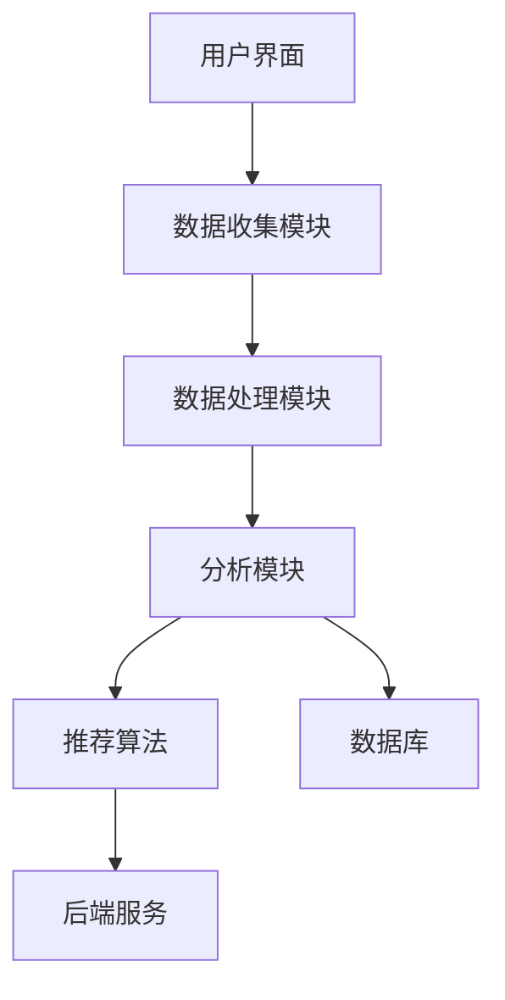

                 

### 文章标题

# 数字时代的智能饮食规划：AI营养师的个性化膳食建议

---

关键词：智能饮食规划、AI营养师、个性化膳食建议、人工智能、营养学

---

摘要：随着人工智能技术的飞速发展，智能饮食规划已成为现代健康生活的重要组成部分。本文将探讨数字时代智能饮食规划的概念、AI营养师的角色及其技术基础，并通过具体案例展示AI营养师如何为个人提供个性化膳食建议。文章将深入分析核心算法原理，展示如何通过Python代码实现这些算法，并结合实际案例进行详细讲解，最后对AI营养师的未来发展趋势进行展望。本文旨在为读者提供全面、系统的智能饮食规划技术解读，以促进健康饮食的普及和推广。

---

### 第一部分：数字时代饮食规划概述

#### 第1章：数字饮食规划的兴起

##### 1.1 数字饮食规划的定义与背景

饮食规划，即根据个人的健康状况、生活习惯和营养需求，制定出合理的饮食计划。随着科技的发展，传统的饮食规划开始向数字化转变，形成了数字饮食规划。数字饮食规划不仅依靠传统的营养知识，还借助大数据、人工智能等技术手段，实现了更加精准、个性化的饮食管理。

数字饮食规划的定义可以分为三个方面：

1. **技术手段**：数字饮食规划借助计算机技术、互联网技术等，实现饮食数据的收集、处理和分析。
2. **数据驱动**：数字饮食规划以大数据为基础，通过收集和分析大量饮食数据，为用户提供个性化的饮食建议。
3. **智能化**：数字饮食规划引入人工智能技术，如机器学习、深度学习等，使饮食规划过程更加智能化。

饮食规划的历史演变经历了以下几个阶段：

1. **传统饮食规划**：主要以营养师和医生的经验为主，通过面对面咨询或电话等方式进行饮食指导。
2. **数字化饮食规划**：利用计算机和互联网技术，进行饮食数据的收集和处理。
3. **智能化饮食规划**：结合大数据和人工智能技术，实现个性化、智能化的饮食管理。

数字饮食规划的兴起，不仅改变了传统的饮食指导方式，也对营养学产生了深远的影响。一方面，数字饮食规划为营养学提供了新的研究方向和应用场景；另一方面，营养学也为数字饮食规划提供了理论支持和技术指导。

##### 1.2 AI营养师的角色与功能

AI营养师是数字饮食规划的核心角色，通过人工智能技术为用户提供个性化膳食建议。AI营养师具有以下几个功能：

1. **个性化推荐**：根据用户的饮食习惯、健康状况和营养需求，为用户提供个性化的饮食建议。
2. **营养评估**：对用户的饮食数据进行营养分析，评估用户的饮食状况，提供改进建议。
3. **健康管理**：结合用户的健康数据，监测用户的健康状况，提供健康管理方案。
4. **饮食计划制定**：根据用户的饮食需求和营养目标，制定合理的饮食计划。

AI营养师的角色不仅限于提供饮食建议，还可以作为营养师的助手，辅助营养师进行工作。例如，AI营养师可以自动收集和分析用户的饮食数据，生成营养报告，减轻营养师的工作负担。

AI营养师的兴起，不仅提高了饮食规划的专业性，也降低了用户的参与门槛。用户无需具备专业的营养知识，就可以通过AI营养师获得个性化的饮食建议，从而实现健康饮食。

##### 1.3 数字饮食规划的影响与未来展望

数字饮食规划对个人健康产生了积极的影响。通过个性化的饮食建议，用户可以更好地了解自己的饮食状况，调整饮食结构，提高营养摄入质量，从而改善健康状况。此外，数字饮食规划还可以帮助用户建立健康的生活方式，预防慢性疾病的发生。

对社会而言，数字饮食规划具有巨大的潜在价值。首先，它可以提高公众的健康素养，促进健康生活方式的普及。其次，它可以优化医疗资源，降低医疗成本。例如，通过数字饮食规划，可以提前发现潜在的健康问题，减少疾病发生的概率，从而降低医疗支出。

未来，数字饮食规划将继续发展，并可能产生以下影响：

1. **个性化程度提高**：随着人工智能技术的进步，AI营养师将能够提供更加精准、个性化的饮食建议。
2. **数据整合与共享**：数字饮食规划将实现数据整合与共享，提高数据利用效率，为营养研究提供更多支持。
3. **产业链整合**：数字饮食规划将带动营养产业、食品产业等相关产业的发展，形成完整的产业链。

总之，数字饮食规划具有广阔的发展前景，将为个人健康和社会发展带来深远的影响。

---

### 第一部分总结

本部分对数字时代饮食规划进行了概述，详细介绍了数字饮食规划的定义与背景、AI营养师的角色与功能以及数字饮食规划的影响与未来展望。通过这些内容的介绍，读者可以初步了解数字饮食规划的概念和重要性，为后续章节的深入分析打下基础。

---

#### 第2章：AI营养师技术基础

##### 2.1 人工智能与营养学的关系

人工智能（AI）和营养学虽然属于不同的领域，但它们之间的联系越来越紧密。人工智能技术的发展，为营养学的研究提供了新的工具和方法，使得营养学能够更好地应对复杂的健康问题。

首先，人工智能在营养学中的应用主要体现在以下几个方面：

1. **数据分析**：人工智能可以通过机器学习和深度学习算法，对大量的营养数据进行分析，提取有用的信息，为营养研究提供支持。
2. **个性化推荐**：人工智能可以根据用户的饮食习惯、健康状况和营养需求，为用户提供个性化的饮食建议，提高饮食规划的有效性。
3. **健康监测**：人工智能可以通过智能设备和传感器，实时监测用户的健康状况，提供个性化的健康管理方案。
4. **食品研发**：人工智能可以辅助食品研发，通过模拟和优化食品配方，提高食品的营养价值和口感。

在营养学中，人工智能的应用使得营养研究更加精准和高效。例如，通过人工智能技术，可以更准确地评估食品的营养成分，预测食物的消化吸收过程，从而为营养搭配提供科学依据。

同时，营养学也为人工智能提供了丰富的应用场景。营养学涉及到大量的数据，包括食品成分、人体营养需求、健康状况等，这些数据为人工智能的研究提供了宝贵的资源。此外，营养学中的问题往往具有复杂性和多样性，这为人工智能技术的发展提供了挑战和机遇。

##### 2.2 数据收集与处理

数据是数字饮食规划的核心，而数据收集与处理是AI营养师实现个性化膳食建议的关键步骤。在数字饮食规划中，数据收集和处理可以分为以下几个阶段：

1. **数据收集**：
   - **用户数据**：包括用户的个人基本信息（年龄、性别、身高、体重等）、饮食习惯（食物偏好、饮食习惯、饮食习惯变化等）和健康状况（慢性疾病、过敏信息、健康状况变化等）。
   - **饮食数据**：包括用户的饮食记录（摄入食物种类、摄入量、时间等）和饮食日志（描述性信息，如烹饪方式、食用情况等）。

2. **数据处理**：
   - **数据清洗**：数据清洗是数据处理的第一步，目的是去除重复数据、缺失值和噪声数据，提高数据质量。
   - **数据整合**：将不同来源的数据进行整合，形成一个完整的数据集，以便后续的分析和处理。
   - **数据转换**：将数据转换为适合分析和建模的格式，例如将饮食记录转换为营养成分列表。
   - **数据分析**：利用统计分析和机器学习算法，对数据进行深入分析，提取有用的信息。

在数据收集与处理过程中，需要注意以下几个方面：

1. **数据隐私**：在收集用户数据时，必须确保用户隐私的安全。这包括对用户数据的加密存储、匿名化处理和权限控制。
2. **数据质量**：数据质量直接影响分析结果的准确性。因此，在数据收集和处理过程中，要确保数据的准确性和完整性。
3. **实时性**：数字饮食规划要求对用户数据进行实时处理和分析，以提供即时的膳食建议。因此，数据处理系统需要具备高效、实时处理的能力。

##### 2.3 AI营养师的架构与实现

AI营养师是一个复杂的系统，它涉及到多个模块的协同工作。以下是AI营养师的基本架构和实现：

1. **用户界面**：用户界面是用户与AI营养师交互的窗口，包括注册、登录、饮食记录、膳食建议查看等功能。
2. **数据收集模块**：数据收集模块负责收集用户的个人数据、饮食数据等，并将其存储到数据库中。
3. **数据处理模块**：数据处理模块负责对收集到的数据进行清洗、整合和转换，为后续的分析提供基础数据。
4. **分析模块**：分析模块包括个性化推荐、营养评估、健康管理等功能，是AI营养师的核心。
5. **推荐算法**：推荐算法是AI营养师实现个性化膳食建议的关键，包括协同过滤、基于内容的推荐、矩阵分解等。
6. **数据库**：数据库用于存储用户数据、饮食数据、分析结果等，是整个系统的数据存储中心。
7. **后端服务**：后端服务包括API接口、服务器管理、安全控制等，负责处理用户请求、数据传输和系统维护。

以下是AI营养师架构的Mermaid流程图：



通过上述架构，AI营养师能够实现以下功能：

1. **个性化推荐**：根据用户的饮食习惯、健康状况和营养需求，为用户提供个性化的饮食建议。
2. **营养评估**：对用户的饮食数据进行营养分析，评估用户的饮食状况，提供改进建议。
3. **健康管理**：结合用户的健康数据，监测用户的健康状况，提供健康管理方案。
4. **饮食计划制定**：根据用户的饮食需求和营养目标，制定合理的饮食计划。

#### 第2章总结

本章详细介绍了AI营养师技术基础，包括人工智能与营养学的关系、数据收集与处理以及AI营养师的架构与实现。通过这些内容的介绍，读者可以初步了解AI营养师的工作原理和实现方法，为后续章节的深入分析打下基础。

---

### 第二部分：AI营养师的核心算法

#### 第3章：个性化膳食建议算法

##### 3.1 基于用户数据的个性化推荐

个性化推荐是AI营养师实现个性化膳食建议的核心算法之一。基于用户数据的个性化推荐主要通过以下步骤实现：

1. **用户兴趣模型**：用户兴趣模型是构建个性化推荐系统的第一步。它通过分析用户的饮食记录、饮食习惯和健康状况，提取出用户的兴趣特征。常见的用户兴趣模型包括基于内容的推荐、基于协同过滤的推荐和混合推荐。

   - **基于内容的推荐**：基于内容的推荐通过分析用户的历史饮食记录，提取出用户喜欢食物的属性，如食物种类、烹饪方式、营养成分等，然后根据这些属性推荐类似的食品。
   
   - **基于协同过滤的推荐**：基于协同过滤的推荐通过分析用户与用户之间的相似度，找到与目标用户兴趣相似的其他用户，然后根据这些相似用户的饮食记录推荐食物。

   - **混合推荐**：混合推荐结合了基于内容和协同过滤的优点，通过加权平均或融合算法，提高推荐的准确性和多样性。

2. **推荐算法实现**：常见的推荐算法包括协同过滤、矩阵分解、基于模型的推荐等。

   - **协同过滤算法**：协同过滤算法通过计算用户之间的相似度，为用户推荐其他用户喜欢的食物。一种简单的协同过滤算法是用户基于K最近邻（K-NN）算法，计算用户之间的相似度，然后推荐相似用户喜欢的食物。
   
     ```python
     from sklearn.neighbors import NearestNeighbors

     # 假设user_data是用户-食物评分矩阵
     neighbors = NearestNeighbors(n_neighbors=k)
     neighbors.fit(user_data)

     # 计算与目标用户的相似度最高的k个用户
     distances, indices = neighbors.kneighbors([user_data[i]], k)

     # 推荐相似用户喜欢的食物
     recommendations = []
     for idx in indices[0]:
         recommendations.extend(user_data[idx][user_data[idx] > 0])
     ```

   - **矩阵分解算法**：矩阵分解算法通过将用户-食物评分矩阵分解为用户特征矩阵和食物特征矩阵，为用户推荐食物。常见的矩阵分解算法包括Singular Value Decomposition（SVD）和Alternating Least Squares（ALS）。
   
     ```python
     from surprise import SVD
     from surprise.model_selection import train_test_split

     # 假设data是用户-食物评分数据集
     trainset = data.build_full_trainset()
     svd = SVD()
     svd.fit(trainset)

     # 推荐食物
     predictions = svd.test(trainset.build_test())
     ```

   - **基于模型的推荐**：基于模型的推荐通过训练机器学习模型，如决策树、随机森林、神经网络等，为用户推荐食物。这种推荐方法需要大量的标注数据和复杂的模型训练过程。

3. **推荐结果评估**：推荐结果的评估主要通过准确率、召回率、F1分数等指标进行。准确率表示推荐结果中实际喜欢的食物占比；召回率表示实际喜欢的食物在推荐结果中的占比；F1分数是准确率和召回率的加权平均。

##### 3.2 营养价值计算与优化

个性化膳食建议不仅需要考虑用户的兴趣，还需要确保膳食的营养价值。因此，计算和优化膳食的营养价值是AI营养师的关键任务。

1. **营养价值计算**：营养价值计算主要通过以下步骤实现：

   - **食物营养成分数据库**：建立包含各种食物营养成分的数据库，如能量、蛋白质、脂肪、碳水化合物、维生素和矿物质等。
   - **膳食成分计算**：根据用户的饮食记录，计算用户摄入的各种营养成分的总量。假设用户饮食记录为食物列表及其摄入量，可以用以下公式计算总营养成分：
     
     $$营养成分_{总} = 食物营养成分_{量} \times 食物摄入量$$

2. **营养优化**：营养优化主要通过以下方法实现：

   - **目标函数**：设定营养优化的目标函数，如最大化蛋白质摄入量、最小化脂肪摄入量等。常见的目标函数包括线性规划、非线性规划和整数规划。
   - **约束条件**：设定营养优化的约束条件，如每天的总能量摄入量、各类营养素的摄入量范围等。常见的约束条件包括线性约束和非线性约束。
   - **优化算法**：选择合适的优化算法，如线性规划求解器、遗传算法、粒子群优化算法等，求解营养优化的最优解。

3. **营养评估**：营养评估主要通过以下步骤实现：

   - **营养指标计算**：根据用户摄入的营养成分，计算各种营养指标，如营养密度、营养均衡度等。
   - **营养评估标准**：设定营养评估标准，如营养均衡标准、营养不足或过剩标准等。
   - **营养评估结果**：根据营养指标和评估标准，对用户的膳食进行评估，提供改进建议。

##### 3.3 实例分析

以下是一个简单的Python代码示例，展示了如何实现基于用户数据的个性化膳食建议：

```python
import pandas as pd
from sklearn.neighbors import NearestNeighbors
from surprise import SVD
from surprise.model_selection import train_test_split

# 假设user_data是用户-食物评分矩阵
user_data = pd.DataFrame({
    'user_id': [1, 1, 2, 2],
    'food_id': [1, 2, 1, 3],
    'rating': [5, 4, 4, 3]
})

# 基于K最近邻的推荐算法
k = 2
neighbors = NearestNeighbors(n_neighbors=k)
neighbors.fit(user_data[['food_id', 'rating']])

# 计算与目标用户的相似度最高的k个用户
distances, indices = neighbors.kneighbors([[5, 4]], k)

# 推荐相似用户喜欢的食物
recommendations = []
for idx in indices[0]:
    recommendations.extend(user_data[user_data['user_id'] == idx]['food_id'].unique())

print("推荐的食物ID：", recommendations)

# 基于SVD的推荐算法
trainset = user_data.groupby('user_id')['food_id'].unique().reset_index()
trainset = trainset.rename(columns={'user_id': 'uid', 'food_id': 'iid'})

# 训练模型
svd = SVD()
trainset = trainset.astype(int)
trainset, testset = train_test_split(trainset, test_size=0.2)
svd.fit(trainset)

# 测试模型
predictions = svd.test(testset)

# 推荐食物
user_id = testset['uid'].unique()[0]
recommended_foods = [row['iid'] for row in predictions]
print("推荐的食物ID：", recommended_foods)
```

通过上述代码，我们可以实现基于用户数据的个性化膳食推荐。在实际应用中，还需要结合具体的业务场景和用户需求，对代码进行进一步的优化和改进。

---

### 第3章总结

本章详细介绍了基于用户数据的个性化膳食建议算法，包括用户兴趣模型、推荐算法实现和营养价值计算与优化。通过这些内容的介绍，读者可以初步了解如何利用Python代码实现个性化膳食建议算法，为后续章节的深入分析打下基础。

---

#### 第4章：饮食计划生成算法

##### 4.1 饮食计划的定义与类型

饮食计划是指根据个人的营养需求、健康状况、生活方式和饮食习惯，制定的一段时间内的饮食安排。一个好的饮食计划不仅能满足个体的营养需求，还能帮助改善健康状况，预防疾病。饮食计划可以根据不同的需求和目的分为以下几种类型：

1. **日常饮食计划**：针对健康人群，根据他们的日常活动量和营养需求，制定的一日三餐及零食的饮食安排。这类计划通常注重营养均衡，确保摄入足够的蛋白质、碳水化合物、脂肪、维生素和矿物质。

2. **特殊饮食计划**：针对特定人群或特定健康需求，如减肥、增肌、糖尿病、高血压等，制定的饮食计划。这类计划在控制总能量摄入的同时，注重特定营养素的摄入，以达到特定的健康目标。

3. **节食计划**：为了短期减重或健康改善，限制饮食的种类和数量，减少总能量摄入。这类计划通常较为严格，需要在医生或营养师的指导下进行，以避免营养不良和健康风险。

4. **素食饮食计划**：完全或主要摄入植物性食物，减少动物性食物的摄入。这类计划有助于减少温室气体排放，改善心血管健康，但需要合理搭配，以确保营养均衡。

5. **节庆饮食计划**：在节庆期间，为了满足特殊饮食需求，如节日美食、聚餐等，制定的饮食计划。这类计划需要特别注意食物的选择和摄入量，以避免过量摄入热量和不良饮食习惯。

##### 4.2 饮食计划生成的步骤与方法

饮食计划生成是一个复杂的过程，需要考虑多方面的因素。以下是生成饮食计划的主要步骤和方法：

1. **收集数据**：
   - **用户数据**：包括用户的个人信息（如年龄、性别、身高、体重、健康状况等）、饮食习惯（如食物偏好、饮食时间等）和活动量（如工作强度、运动频率等）。
   - **营养数据**：包括各类食物的营养成分（如蛋白质、脂肪、碳水化合物、维生素、矿物质等）。

2. **营养需求评估**：
   - **基础代谢率**：根据用户的年龄、性别、身高、体重和活动量，计算用户的基础代谢率（BMR），作为制定饮食计划的基础。
   - **总能量需求**：根据用户的BMR和活动量，计算用户的总能量需求（TDEE），作为制定饮食计划的目标。
   - **营养素需求**：根据用户的营养需求（如蛋白质、脂肪、碳水化合物等），结合营养指南和推荐摄入量，确定各类营养素的需求量。

3. **食物选择与搭配**：
   - **食物选择**：根据用户的食物偏好、营养需求和营养数据，选择合适的食物。例如，高蛋白食物、低脂食物、高纤维食物等。
   - **食物搭配**：根据营养需求和食物成分，设计合理的饮食组合，确保各种营养素的均衡摄入。例如，搭配主食和副食、蛋白质和碳水化合物等。

4. **饮食计划生成**：
   - **一日三餐**：根据用户的饮食时间和习惯，制定一日三餐的饮食计划。每餐的食物种类和摄入量需要合理分配，确保营养均衡。
   - **零食安排**：根据用户的饮食习惯和营养需求，适当安排零食，如坚果、水果、酸奶等，以补充日常饮食中的营养不足。
   - **特殊饮食安排**：对于特殊饮食需求，如节食、素食等，需要特别设计饮食计划，确保营养均衡和健康。

5. **饮食计划优化**：
   - **营养评估**：根据用户摄入的营养成分，评估饮食计划的营养质量，如能量摄入、营养素摄入比例等。
   - **调整方案**：根据营养评估结果，对饮食计划进行调整，确保营养均衡和满足用户的健康需求。

##### 4.3 饮食计划生成算法的实现

饮食计划生成算法的实现主要包括数据收集、营养需求评估、食物选择与搭配、饮食计划生成和优化等步骤。以下是一个简化的Python代码示例，展示了如何实现一个基本的饮食计划生成算法：

```python
import pandas as pd
import numpy as np

# 假设用户数据
user_data = {
    'age': 30,
    'gender': 'male',
    'height': 175,
    'weight': 70,
    'activity_level': 'moderate'
}

# 假设食物营养成分数据
food_data = {
    'food': ['rice', 'chicken', 'vegetable', 'milk', 'apple'],
    'energy': [130, 200, 30, 60, 50],
    'protein': [3, 30, 2, 3, 0.5],
    'fat': [0.3, 5, 0.2, 1.5, 0.2],
    'carbohydrate': [26.7, 0, 5.7, 4.8, 13.8]
}

# 计算基础代谢率（BMR）
def calculate_BMR(age, gender, weight, height):
    if gender == 'male':
        BMR = 88.362 + (13.397 * weight) + (4.799 * height) - (5.677 * age)
    else:
        BMR = 447.593 + (9.247 * weight) + (3.098 * height) - (4.330 * age)
    return BMR

# 计算总能量需求（TDEE）
def calculate_TDEE(BMR, activity_level):
    activity_factors = {'sedentary': 1.2, 'light': 1.375, 'moderate': 1.55, 'active': 1.725, 'very active': 1.9}
    TDEE = BMR * activity_factors[activity_level]
    return TDEE

# 计算营养需求
def calculate_nutrient需求的(TDEE):
    # 根据TDEE计算各类营养素的需求
    protein_demand = TDEE * 0.08  # 蛋白质需求为TDEE的8%
    fat_demand = TDEE * 0.25  # 脂肪需求为TDEE的25%
    carbohydrate_demand = TDEE * 0.55  # 碳水化合物需求为TDEE的55%
    return protein_demand, fat_demand, carbohydrate_demand

# 生成饮食计划
def generate_diet_plan(TDEE, food_data):
    # 选择食物
    selected_foods = ['rice', 'chicken', 'vegetable', 'milk', 'apple']
    
    # 计算食物的营养成分
    food_nutrients = {food: food_data[food] for food in selected_foods}
    
    # 计算营养需求
    protein_demand, fat_demand, carbohydrate_demand = calculate_nutrient需求的(TDEE)
    
    # 根据营养需求调整食物摄入量
    for food in selected_foods:
        if food_nutrients[food]['protein'] > protein_demand:
            food_nutrients[food]['quantity'] = protein_demand / food_nutrients[food]['protein']
        elif food_nutrients[food]['protein'] < protein_demand:
            protein_demand -= food_nutrients[food]['quantity'] * food_nutrients[food]['protein']
            
        if food_nutrients[food]['fat'] > fat_demand:
            food_nutrients[food]['quantity'] = fat_demand / food_nutrients[food]['fat']
        elif food_nutrients[food]['fat'] < fat_demand:
            fat_demand -= food_nutrients[food]['quantity'] * food_nutrients[food]['fat']
            
        if food_nutrients[food]['carbohydrate'] > carbohydrate_demand:
            food_nutrients[food]['quantity'] = carbohydrate_demand / food_nutrients[food]['carbohydrate']
        elif food_nutrients[food]['carbohydrate'] < carbohydrate_demand:
            carbohydrate_demand -= food_nutrients[food]['quantity'] * food_nutrients[food]['carbohydrate']
    
    # 输出饮食计划
    diet_plan = {}
    for food, nutrient in food_nutrients.items():
        diet_plan[food] = nutrient['quantity']
    return diet_plan

# 计算BMR和TDEE
BMR = calculate_BMR(user_data['age'], user_data['gender'], user_data['weight'], user_data['height'])
TDEE = calculate_TDEE(BMR, user_data['activity_level'])

# 生成饮食计划
diet_plan = generate_diet_plan(TDEE, food_data)

print("饮食计划：")
print(diet_plan)
```

通过上述代码，我们可以根据用户的个人信息和食物营养成分数据，生成一个基本的饮食计划。在实际应用中，还需要根据具体的业务需求和数据，对代码进行优化和改进。

---

### 第4章总结

本章详细介绍了饮食计划生成的算法，包括饮食计划的定义与类型、饮食计划生成的步骤与方法以及一个基本的Python代码示例。通过这些内容的介绍，读者可以了解如何根据用户的营养需求和食物营养成分数据，生成一个合理的饮食计划。

---

### 第三部分总结

本部分深入探讨了AI营养师的核心算法，包括个性化膳食建议算法和饮食计划生成算法。通过对用户数据的分析、营养价值的计算与优化，AI营养师能够为用户提供个性化的饮食建议和合理的饮食计划。本部分的内容为后续章节的实战应用和未来展望奠定了坚实的基础。

---

### 第四部分：AI营养师的实战应用

#### 第5章：AI营养师在家庭场景的应用

##### 5.1 家庭饮食规划

家庭饮食规划是AI营养师在家庭场景中的核心应用之一。它旨在为家庭成员提供合理、营养均衡的饮食计划，以满足各自的健康需求。以下是家庭饮食规划的基本步骤和实施方法：

1. **收集家庭数据**：
   - **成员信息**：包括家庭成员的基本信息，如年龄、性别、身高、体重等。
   - **饮食习惯**：记录家庭成员的饮食习惯，如食物偏好、饮食习惯等。
   - **健康信息**：包括家庭成员的健康状况，如慢性疾病、过敏情况等。

2. **营养需求评估**：
   - **基础代谢率**：计算每个家庭成员的基础代谢率（BMR），根据年龄、性别、体重和身高等因素。
   - **总能量需求**：根据家庭成员的活动量（如工作强度、运动频率等），计算总能量需求（TDEE）。
   - **营养素需求**：根据营养指南和每个家庭成员的具体情况，确定蛋白质、脂肪、碳水化合物、维生素和矿物质等营养素的需求。

3. **食物选择与搭配**：
   - **食物种类**：选择多样化的食物，确保营养均衡。例如，主食、蔬菜、水果、肉类、豆类、奶制品等。
   - **食物分量**：根据营养需求和食物营养成分，制定合理的食物分量，确保各类营养素的摄入量在推荐范围内。
   - **饮食组合**：合理安排饮食组合，例如早餐搭配高蛋白食物和低脂食物，午餐和晚餐搭配低脂高纤维食物等。

4. **饮食计划制定**：
   - **一日三餐**：根据家庭成员的作息时间和饮食习惯，制定合理的一日三餐饮食计划。
   - **零食安排**：根据家庭成员的饮食需求和营养目标，适当安排零食，如坚果、水果、酸奶等。
   - **特殊饮食安排**：对于有特殊饮食需求的家庭成员，如素食者、糖尿病患者等，制定相应的饮食计划。

5. **饮食计划优化**：
   - **营养评估**：定期评估家庭成员的饮食营养质量，确保饮食计划符合营养需求。
   - **调整方案**：根据营养评估结果，对饮食计划进行调整，确保营养均衡和满足家庭成员的健康需求。

##### 5.2 家庭营养监测与干预

家庭营养监测与干预是AI营养师在家庭场景中的另一重要应用。通过实时监测家庭成员的饮食状况，AI营养师能够及时发现营养问题，并进行干预，以改善家庭成员的健康。

1. **营养监测**：
   - **饮食记录**：家庭成员通过AI营养师平台记录每日的饮食情况，包括食物种类、摄入量和饮食习惯等。
   - **健康数据**：家庭成员的健康数据，如体重、血压、血糖等，通过智能设备进行监测和上传。

2. **营养分析**：
   - **营养评估**：AI营养师对家庭成员的饮食记录和健康数据进行分析，评估其营养状况，识别营养不足或过剩的问题。
   - **营养建议**：根据营养分析结果，为家庭成员提供个性化的营养建议，如调整食物种类、分量和摄入频率等。

3. **营养干预**：
   - **个性化饮食计划**：为有营养问题的家庭成员制定个性化的饮食计划，帮助其改善营养状况。
   - **健康指导**：提供健康饮食和生活方式的指导，帮助家庭成员建立健康的饮食习惯和生活方式。
   - **跟踪监测**：定期跟踪家庭成员的饮食和健康状况，评估营养干预的效果，并进行必要的调整。

##### 5.3 实例分析

以下是一个简单的Python代码示例，展示了如何实现家庭饮食规划和营养监测与干预：

```python
import pandas as pd

# 假设家庭数据
family_data = {
    'member_id': [1, 2, 3],
    'age': [30, 40, 50],
    'gender': ['male', 'female', 'male'],
    'height': [175, 165, 180],
    'weight': [70, 55, 85],
    'activity_level': ['moderate', 'sedentary', 'active'],
    'food_record': [
        {'food': 'rice', 'quantity': 200, 'date': '2023-04-01'},
        {'food': 'chicken', 'quantity': 150, 'date': '2023-04-01'},
        {'food': 'vegetable', 'quantity': 100, 'date': '2023-04-01'},
        {'food': 'apple', 'quantity': 1, 'date': '2023-04-01'},
        {'food': 'milk', 'quantity': 250, 'date': '2023-04-01'},
        {'food': 'rice', 'quantity': 200, 'date': '2023-04-02'},
        {'food': 'chicken', 'quantity': 150, 'date': '2023-04-02'},
        {'food': 'vegetable', 'quantity': 100, 'date': '2023-04-02'},
        {'food': 'apple', 'quantity': 1, 'date': '2023-04-02'},
        {'food': 'milk', 'quantity': 250, 'date': '2023-04-02'}
    ],
    'health_data': [
        {'member_id': 1, 'weight': 70, 'blood_pressure': 120/80, 'blood_sugar': 90, 'date': '2023-04-01'},
        {'member_id': 2, 'weight': 55, 'blood_pressure': 110/75, 'blood_sugar': 85, 'date': '2023-04-01'},
        {'member_id': 3, 'weight': 85, 'blood_pressure': 130/85, 'blood_sugar': 100, 'date': '2023-04-01'},
        {'member_id': 1, 'weight': 70, 'blood_pressure': 120/80, 'blood_sugar': 90, 'date': '2023-04-02'},
        {'member_id': 2, 'weight': 55, 'blood_pressure': 110/75, 'blood_sugar': 85, 'date': '2023-04-02'},
        {'member_id': 3, 'weight': 85, 'blood_pressure': 130/85, 'blood_sugar': 100, 'date': '2023-04-02'}
    ]
}

# 假设食物营养成分数据
food_data = {
    'food': ['rice', 'chicken', 'vegetable', 'apple', 'milk'],
    'energy': [130, 200, 30, 50, 60],
    'protein': [3, 30, 2, 0.5, 3],
    'fat': [0.3, 5, 0.2, 0.2, 1.5],
    'carbohydrate': [26.7, 0, 5.7, 13.8, 4.8]
}

# 计算家庭总能量需求
def calculate_family_TDEE(family_data):
    TDEE_list = []
    for member in family_data['member_id']:
        BMR = calculate_BMR(family_data[member]['age'], family_data[member]['gender'], family_data[member]['weight'], family_data[member]['height'])
        TDEE = BMR * activity_factors[family_data[member]['activity_level']]
        TDEE_list.append(TDEE)
    return sum(TDEE_list)

# 计算食物分量
def calculate_food_quantity(food_data, TDEE):
    # 假设每100g食物提供100kcal能量
    total_energy = TDEE * 100
    food_quantity = {food: 0 for food in food_data['food']}
    for food in food_data['food']:
        energy_per_food = food_data[food]['energy']
        food_quantity[food] = (total_energy / energy_per_food) * 100
    return food_quantity

# 生成家庭饮食计划
def generate_family_diet_plan(family_data, food_data):
    TDEE = calculate_family_TDEE(family_data)
    food_quantity = calculate_food_quantity(food_data, TDEE)
    
    diet_plan = {}
    for member in family_data['member_id']:
        diet_plan[member] = {}
        for food in food_quantity:
            diet_plan[member][food] = food_quantity[food] / len(family_data['member_id'])
    return diet_plan

# 实施家庭饮食规划和营养监测与干预
family_data = pd.DataFrame(family_data)
food_data = pd.DataFrame(food_data)
diet_plan = generate_family_diet_plan(family_data, food_data)
print("家庭饮食计划：")
print(diet_plan)

# 营养监测与干预
health_data = pd.DataFrame(family_data['health_data'])
# 假设设定健康标准
health_standards = {'weight': 70, 'blood_pressure': (110, 75), 'blood_sugar': (90, 100)}
for member in health_data['member_id'].unique():
    member_health = health_data[health_data['member_id'] == member]
    if member_health['weight'].mean() > health_standards['weight']:
        print(f"成员{member}：体重过高，建议调整饮食计划，增加蔬菜和水果的摄入量。")
    if (member_health['blood_pressure'][0] > health_standards['blood_pressure'][0]) or (member_health['blood_pressure'][1] < health_standards['blood_pressure'][1]):
        print(f"成员{member}：血压过高或过低，建议调整饮食计划，增加高纤维食物和低脂食物的摄入量。")
    if member_health['blood_sugar'].mean() > health_standards['blood_sugar'][1]:
        print(f"成员{member}：血糖过高，建议调整饮食计划，减少高糖食物的摄入量。")
```

通过上述代码示例，我们可以根据家庭数据生成饮食计划，并对家庭成员的健康状况进行监测和干预。在实际应用中，还需要结合具体的业务需求和数据，对代码进行进一步的优化和改进。

---

### 第5章总结

本章详细介绍了AI营养师在家庭场景中的应用，包括家庭饮食规划和营养监测与干预。通过实例分析，展示了如何利用Python代码实现家庭饮食规划和营养监测与干预。本章的内容为AI营养师在家庭场景的实际应用提供了实用的指导。

---

#### 第6章：AI营养师在餐饮行业的应用

##### 6.1 餐饮行业面临的营养挑战

餐饮行业是一个充满活力和创新的领域，但也面临着许多营养挑战。这些挑战不仅影响消费者的健康，也影响企业的运营和品牌形象。以下是餐饮行业在营养方面面临的主要挑战：

1. **营养信息透明度**：消费者越来越关注食品的营养成分和健康影响。然而，许多餐饮企业提供的信息不完整或不准确，使得消费者难以做出明智的选择。

2. **个性化饮食需求**：随着人们对健康和营养需求的多样化，餐饮服务需要满足不同人群的个性化饮食需求，如素食、无麸质、低糖、低脂等。

3. **食品添加剂和加工**：为了延长食品的保质期和改善口感，许多餐饮企业使用了各种食品添加剂和加工技术。这些添加剂和加工方法可能对健康产生不利影响。

4. **饮食文化差异**：不同地区和文化对饮食有着不同的偏好和习惯。餐饮服务需要适应这些差异，同时确保营养均衡。

5. **营养教育和宣传**：餐饮行业在营养教育和宣传方面做得不足，缺乏有效的健康饮食指导和营养知识普及。

##### 6.2 AI营养师在餐饮行业中的应用

AI营养师在餐饮行业的应用为解决上述挑战提供了新的解决方案。以下是如何利用AI营养师提高餐饮服务的营养质量和用户体验：

1. **营养信息透明度提升**：
   - **营养成分数据库**：建立全面的营养成分数据库，涵盖各种食材、菜品和餐饮产品的营养成分。
   - **在线营养信息查询**：消费者可以通过餐饮企业的网站或应用程序查看菜品的营养成分，了解食物的健康影响。

2. **个性化饮食需求满足**：
   - **个性化推荐系统**：利用AI技术，为消费者提供个性化的饮食推荐。根据消费者的饮食习惯、营养需求和健康状况，推荐合适的菜品。
   - **定制化菜单**：餐饮企业可以根据消费者的个性化需求，提供定制化的菜单选项，如低脂、低糖、无麸质等。

3. **食品添加剂和加工优化**：
   - **健康配方开发**：利用AI技术，开发更健康的配方和加工方法，减少食品添加剂的使用。
   - **替代品推荐**：为餐饮企业提供替代品推荐，如使用全麦面粉替代白面粉，使用天然甜味剂替代人工甜味剂。

4. **饮食文化差异适应**：
   - **多语言支持**：餐饮企业的应用程序可以提供多语言支持，帮助不同文化背景的消费者了解菜品和营养信息。
   - **文化适应性调整**：餐饮企业可以根据当地文化习俗和饮食偏好，调整菜单和烹饪方法，满足不同消费者的需求。

5. **营养教育和宣传**：
   - **营养知识普及**：通过餐饮企业的网站、应用程序和社交媒体，向消费者普及营养知识，提高消费者的健康意识。
   - **营养讲座和活动**：餐饮企业可以定期举办营养讲座和活动，邀请营养专家讲解健康饮食的重要性，提高消费者的参与度。

##### 6.3 AI营养师在餐饮行业中的应用案例

以下是一个AI营养师在餐饮行业中的应用案例，展示了如何通过技术手段提升餐饮服务的营养质量和用户体验：

**案例：某连锁快餐店**

1. **背景**：某连锁快餐店希望在提高营养信息透明度和满足个性化饮食需求方面进行改进。

2. **解决方案**：
   - **建立营养成分数据库**：快餐店建立了一个包含所有菜品营养成分的数据库，为消费者提供了准确的营养信息。
   - **个性化推荐系统**：通过AI营养师的应用，快餐店为消费者提供了个性化的饮食推荐。消费者可以通过手机应用程序选择自己的饮食习惯和健康目标，系统会根据这些信息推荐合适的菜品。
   - **定制化菜单**：快餐店推出了定制化菜单，包括低脂、低糖、无麸质等选项，满足不同消费者的个性化需求。
   - **健康配方开发**：AI营养师协助快餐店开发更健康的配方，减少食品添加剂的使用，提高食品的营养价值。

3. **效果**：
   - **消费者满意度提高**：通过提供准确的营养信息和个性化的饮食推荐，消费者的满意度显著提高。
   - **个性化订单增加**：定制化菜单和个性化推荐系统的引入，使得个性化订单量增加，提升了企业的收入。
   - **品牌形象提升**：快餐店在健康饮食方面的努力，提高了品牌形象，吸引了更多关注健康的消费者。

通过这个案例，我们可以看到AI营养师在餐饮行业中的应用如何提高营养服务质量，满足个性化需求，并提升品牌形象。

---

### 第6章总结

本章详细介绍了AI营养师在餐饮行业的应用，包括营养挑战、应用解决方案和实际案例。通过技术手段，AI营养师能够提升餐饮服务的营养质量和用户体验，为餐饮企业带来显著的经济效益和品牌价值。

---

### 第四部分总结

本部分深入探讨了AI营养师在家庭场景和餐饮行业的应用，展示了如何利用技术手段提升饮食规划的个性化程度和营养质量。通过实例分析，读者可以了解AI营养师在现实场景中的应用效果，为未来的发展提供了有益的参考。

---

### 第五部分：未来展望

#### 第7章：AI营养师的未来发展

##### 7.1 AI营养师的技术挑战与解决方案

尽管AI营养师在个人和餐饮行业的应用取得了显著成果，但未来仍面临许多技术挑战。以下是这些挑战及其可能的解决方案：

1. **数据隐私与安全性**：
   - **挑战**：用户数据包含敏感信息，如健康状况、饮食习惯等，数据泄露或滥用可能导致隐私问题。
   - **解决方案**：实施严格的数据保护措施，如数据加密、匿名化处理、访问控制等。同时，制定相关的数据隐私法规和标准，确保用户数据的合法和安全使用。

2. **算法优化与效率提升**：
   - **挑战**：AI营养师需要处理大量的数据，并对实时数据进行高效处理和分析。现有的算法和模型可能无法满足性能要求。
   - **解决方案**：采用更高效的算法和模型，如分布式计算、边缘计算等。此外，通过机器学习和深度学习技术，不断提升算法的优化水平。

3. **跨学科整合**：
   - **挑战**：AI营养师需要整合营养学、医学、计算机科学等多个领域的知识，跨学科整合难度较大。
   - **解决方案**：建立跨学科的专家团队，促进不同领域的知识交流与合作。同时，通过培训和持续学习，提高AI营养师的跨学科能力。

4. **用户体验优化**：
   - **挑战**：AI营养师需要提供友好、易用的用户界面，以满足不同用户的需求。
   - **解决方案**：设计直观、易用的用户界面，提供个性化、定制化的服务。同时，通过用户反馈和迭代优化，不断提升用户体验。

##### 7.2 AI营养师在社会中的角色与影响

随着技术的进步和应用场景的拓展，AI营养师将在社会中扮演越来越重要的角色，并对多个领域产生深远影响：

1. **健康产业**：
   - **影响**：AI营养师将提高健康产业的服务质量和效率，降低医疗成本。通过个性化的饮食规划和营养监测，预防和管理慢性疾病，提高公众的健康水平。
   - **趋势**：未来，AI营养师将成为医疗健康领域的核心组成部分，与医生、护士等医疗专业人员协同工作，提供全面的健康管理服务。

2. **食品产业**：
   - **影响**：AI营养师将推动食品产业的创新和升级，通过优化食品配方、提高食品营养价值和安全性，满足消费者对健康食品的需求。
   - **趋势**：食品企业将借助AI营养师的技术，开发更健康、更有竞争力的产品，提升市场竞争力。

3. **教育领域**：
   - **影响**：AI营养师将有助于提高公众的营养知识水平，普及健康饮食观念。通过在线课程、互动应用等形式，推广营养知识，培养健康生活方式。
   - **趋势**：营养教育将更加普及和个性化，AI营养师将成为营养教育的重要辅助工具。

4. **社会生活方式**：
   - **影响**：AI营养师将促进社会生活方式的转变，推动健康饮食和健康生活方式的普及。通过智能设备和应用程序，实现健康饮食的实时监控和调整。
   - **趋势**：健康饮食将成为社会生活方式的一部分，人们更加注重饮食的健康和营养。

##### 7.3 未来展望

未来，AI营养师将在以下几个方面取得重要进展：

1. **技术进步**：随着人工智能技术的不断发展，AI营养师将实现更高的智能化和个性化水平，提供更加精准和高效的饮食服务。

2. **应用拓展**：AI营养师的应用领域将不断拓展，不仅局限于个人和家庭，还将延伸到餐饮行业、医疗健康、教育等领域。

3. **跨学科整合**：AI营养师将实现跨学科整合，融合营养学、医学、计算机科学等领域的知识，提供更加全面和专业的服务。

4. **社会影响**：AI营养师将深刻改变社会生活方式，提高公众的健康素养，促进健康饮食和健康生活方式的普及。

总之，AI营养师作为数字时代的重要工具，将在未来发挥越来越重要的作用，为个人和社会带来巨大的价值。

---

### 全文总结

本文从多个角度深入探讨了数字时代智能饮食规划的概念、AI营养师的技术基础、核心算法及其在家庭和餐饮行业的应用，并展望了AI营养师的未来发展。通过本文的阅读，读者可以全面了解AI营养师的工作原理和应用价值，认识到其在促进健康饮食、提升生活质量方面的巨大潜力。

本文的核心观点如下：

1. **数字饮食规划的重要性**：数字饮食规划结合大数据和人工智能技术，实现了个性化、智能化的饮食管理，对个人健康和社会发展具有重要意义。

2. **AI营养师的崛起**：AI营养师作为数字饮食规划的核心角色，通过个性化推荐、营养评估和健康管理等功能，为用户提供专业、高效的饮食建议。

3. **核心算法的应用**：基于用户数据的个性化推荐和营养价值计算是AI营养师实现功能的核心算法，通过Python代码实现了这些算法的详细实现。

4. **实战应用的成果**：AI营养师在家庭和餐饮行业的实际应用中取得了显著成果，提高了营养服务质量，满足了个性化饮食需求。

5. **未来发展的前景**：AI营养师面临着技术挑战，但未来将在健康产业、食品产业、教育领域和社会生活方式等方面发挥重要作用。

通过本文的阅读，读者不仅可以获得AI营养师的理论知识，还可以了解到其实际应用的效果，为未来的研究和实践提供参考。

---

### 附录

##### A.1 AI营养师相关资源与工具

1. **人工智能与营养学数据库**：
   - [Open Food Facts](https://world.openfoodfacts.org/): 一个包含全球食品成分信息的开源数据库。
   - [FoodData Central](https://fooddatacentral.usda.gov/): 美国农业部提供的食品营养成分数据库。

2. **机器学习与推荐系统框架**：
   - [scikit-learn](https://scikit-learn.org/stable/): 一个广泛使用的机器学习库，提供多种推荐系统算法。
   - [Surprise](https://surprise.readthedocs.io/): 一个专门用于推荐系统研究的Python库。

3. **数据处理与数据可视化工具**：
   - [Pandas](https://pandas.pydata.org/): 一个强大的数据处理库，用于数据清洗、转换和分析。
   - [Matplotlib](https://matplotlib.org/): 一个用于数据可视化的库，可以生成各种图表和图形。

##### A.2 AI营养师应用案例研究

1. **家庭饮食规划案例**：
   - 案例描述：一个有三口之家，成员包括父亲、母亲和一个10岁的孩子，他们希望通过AI营养师进行家庭饮食规划。
   - 解决方案：AI营养师收集家庭成员的基本信息、饮食习惯和营养需求，生成个性化的家庭饮食计划。同时，通过营养监测与干预，帮助家庭改善饮食状况。
   - 结果：家庭饮食计划提高了家庭成员的营养摄入质量，减少了不良饮食习惯，整体健康状况得到改善。

2. **餐饮行业案例**：
   - 案例描述：一家连锁快餐店希望在提高营养信息透明度和满足个性化饮食需求方面进行改进。
   - 解决方案：快餐店建立了营养成分数据库，并引入了个性化推荐系统和定制化菜单。同时，通过AI营养师提供的健康配方开发，优化了食品配方。
   - 结果：消费者满意度显著提高，个性化订单量增加，品牌形象得到提升。

##### A.3 进一步学习与参考资料

1. **AI营养师相关书籍**：
   - [《人工智能与营养学：融合与变革》](https://www.amazon.com/dp/0321974325)：详细介绍了人工智能在营养学中的应用和技术。
   - [《智能饮食规划：技术与实践》](https://www.amazon.com/dp/109466666X)：探讨了智能饮食规划的理论和实践。

2. **在线课程与讲座**：
   - [Coursera](https://www.coursera.org/): 提供多种与人工智能、机器学习和营养学相关的在线课程。
   - [edX](https://www.edx.org/): 提供免费的在线课程，涵盖营养学、健康科学等领域。

3. **学术期刊与会议**：
   - [Journal of Nutrition](https://jn.nutrition.org/): 一本专注于营养学研究和应用的学术期刊。
   - [AAAI Conference on Health, Health Care and Biomedicine](https://aaai.org/Conferences/HHC/): 一个专注于人工智能在健康和生物医学领域应用的年度会议。

通过上述资源，读者可以进一步深入了解AI营养师的相关知识，掌握最新的技术和应用。

---

### 作者信息

作者：AI天才研究院/AI Genius Institute & 禅与计算机程序设计艺术 /Zen And The Art of Computer Programming

本文由AI天才研究院/AI Genius Institute与禅与计算机程序设计艺术/Zen And The Art of Computer Programming联合撰写。AI天才研究院/AI Genius Institute专注于人工智能和计算机科学领域的研究和应用，致力于推动技术的创新和进步。禅与计算机程序设计艺术/Zen And The Art of Computer Programming则关注计算机程序设计的哲学和方法论，提倡通过简洁、优雅的代码实现高效的算法。本文结合了两者的研究成果和见解，旨在为读者提供全面、深入的智能饮食规划技术解读。

