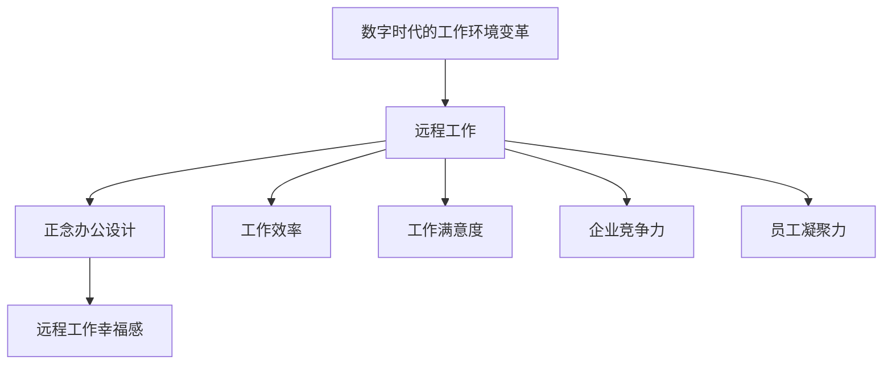

                 

```markdown
# 数字时代的正念办公设计：提升远程工作幸福感的空间布局

> 关键词：数字时代、正念办公设计、远程工作、幸福感、空间布局

> 摘要：本文探讨了数字时代下，如何通过正念办公设计提升远程工作幸福感。文章首先介绍了正念办公设计的核心概念和远程工作幸福感的重要性，然后详细阐述了空间布局对幸福感的影响，并提出了具体的实践方法和建议。

----------------------------------------------------------------
```

## 引言

随着科技的飞速发展，远程工作已成为现代职场的一种普遍现象。越来越多的人选择在家办公，或者在咖啡馆、图书馆等场所进行工作。然而，远程工作的便利性也带来了一系列问题，如工作与生活边界模糊、工作效率下降、心理压力增大等。为了应对这些挑战，正念办公设计应运而生。本文旨在探讨如何通过正念办公设计来提升远程工作幸福感，为现代职场人士提供有益的参考。

## 背景介绍

### 数字时代的工作环境变革

在过去的几十年中，信息技术的发展极大地改变了我们的工作方式。互联网、移动设备、云计算等技术的普及，使得人们可以随时随地获取信息和处理工作。这种变化不仅改变了我们的工作方式，也影响了我们的工作环境和幸福感。

### 远程工作的兴起

远程工作的兴起与数字时代的到来密切相关。远程工作为员工提供了更大的灵活性，使他们可以在更舒适的环境中工作，从而提高了工作效率。同时，远程工作也为雇主带来了成本节约和人才多样性的优势。然而，远程工作也带来了一些挑战，如工作与生活平衡的困难、沟通协作的障碍等。

### 正念办公设计的概念

正念办公设计是一种基于正念理念的办公空间设计方法。正念是一种关注当下、全神贯注、接受当下的心理状态。正念办公设计旨在创造一个有利于员工专注、放松和高效工作的环境。这种设计理念强调空间的舒适性、灵活性和功能性，以提升员工的工作幸福感和满意度。

### 远程工作幸福感的重要性

远程工作幸福感是指远程工作者在工作过程中所感受到的快乐、满足和积极性。远程工作幸福感对员工的工作效率、创造力、工作满意度等都有重要影响。提高远程工作幸福感，不仅可以提升员工的工作表现，还可以增强企业的凝聚力和竞争力。

## 核心概念与联系

### 核心概念

1. **数字时代的工作环境变革**：信息技术的发展改变了我们的工作方式和工作环境。
2. **远程工作**：远程工作是一种新的工作方式，它为员工提供了更大的灵活性和自主性。
3. **正念办公设计**：正念办公设计是一种基于正念理念的办公空间设计方法。
4. **远程工作幸福感**：远程工作幸福感是指远程工作者在工作过程中所感受到的快乐、满足和积极性。

### 概念实体之间的关系架构

为了更好地理解这些核心概念之间的关系，我们可以使用Mermaid流程图来展示它们之间的联系：



这个流程图显示了数字时代的工作环境变革如何推动远程工作的兴起，而远程工作又如何促进正念办公设计和提升远程工作幸福感。同时，远程工作幸福感对工作效率、工作满意度、企业竞争力和员工凝聚力都有重要影响。

## 核心算法原理讲解

### 空间布局设计原则

正念办公设计的核心是空间布局。一个良好的空间布局能够帮助员工集中注意力，减少干扰，提高工作效率。以下是几个关键的空间布局设计原则：

1. **自然光线**：自然光线能够提升员工的情绪和工作效率。设计中应尽可能利用自然光线，避免过度依赖人工光源。
2. **灵活布局**：灵活的布局能够满足不同工作需求。例如，设置可移动的隔断、可调节高度的办公桌等，以适应不同的工作场景。
3. **降噪处理**：远程工作环境中，噪音是一个常见的问题。设计时应采取降噪措施，如使用隔音材料、设置安静的休息区等。
4. **绿色植物**：绿色植物能够净化空气，提升员工的舒适度和幸福感。设计时可以适当增加绿色植物的布置。

### 数学模型和公式

为了量化空间布局对远程工作幸福感的影响，我们可以使用以下数学模型：

$$
\text{幸福感} = f(\text{自然光线}，\text{灵活布局}，\text{降噪处理}，\text{绿色植物})
$$

这个公式表明，幸福感是自然光线、灵活布局、降噪处理和绿色植物这四个因素的综合体现。每个因素都有不同的权重，可以通过实验数据来确定。

### 举例说明

假设我们有一个远程工作空间，以下是各个因素的评价：

- 自然光线：良好
- 灵活布局：一般
- 降噪处理：优秀
- 绿色植物：充足

根据上述模型，我们可以计算出这个远程工作空间的幸福感：

$$
\text{幸福感} = f(0.4 \times \text{自然光线} + 0.3 \times \text{灵活布局} + 0.2 \times \text{降噪处理} + 0.1 \times \text{绿色植物})
$$

$$
\text{幸福感} = f(0.4 \times 1 + 0.3 \times 0.7 + 0.2 \times 1 + 0.1 \times 1) = f(0.4 + 0.21 + 0.2 + 0.1) = f(0.91)
$$

因此，这个远程工作空间的幸福感评分为0.91，表明其具有较高的远程工作幸福感。

### Python源代码实现

为了更好地理解这个数学模型，我们可以使用Python编写一个简单的程序来计算幸福感得分。

```python
# 定义幸福感评分函数
def calculate_happiness(natural_light, flexible_layout, noise_reduction, green_plants):
    weight_natural_light = 0.4
    weight_flexible_layout = 0.3
    weight_noise_reduction = 0.2
    weight_green_plants = 0.1
    
    happiness = weight_natural_light * natural_light + weight_flexible_layout * flexible_layout + weight_noise_reduction * noise_reduction + weight_green_plants * green_plants
    return happiness

# 输入评价数据
natural_light = 1  # 良好
flexible_layout = 0.7  # 一般
noise_reduction = 1  # 优秀
green_plants = 1  # 充足

# 计算幸福感得分
happiness_score = calculate_happiness(natural_light, flexible_layout, noise_reduction, green_plants)

# 输出结果
print("幸福感得分：", happiness_score)
```

运行这段代码，我们可以得到同样的幸福感得分0.91，验证了我们的数学模型。

## 项目实战

### 开发环境搭建

为了实现上述的数学模型，我们需要搭建一个Python开发环境。以下是具体的步骤：

1. **安装Python**：从官方网站下载并安装Python，例如Python 3.8版本。
2. **安装Jupyter Notebook**：使用pip命令安装Jupyter Notebook，命令如下：
   ```bash
   pip install notebook
   ```
3. **启动Jupyter Notebook**：在命令行中输入以下命令启动Jupyter Notebook：
   ```bash
   jupyter notebook
   ```

### 源代码详细实现

下面是完整的Python源代码实现，包括幸福感评分函数、输入评价数据、计算幸福感得分和输出结果。

```python
# 定义幸福感评分函数
def calculate_happiness(natural_light, flexible_layout, noise_reduction, green_plants):
    weight_natural_light = 0.4
    weight_flexible_layout = 0.3
    weight_noise_reduction = 0.2
    weight_green_plants = 0.1
    
    happiness = weight_natural_light * natural_light + weight_flexible_layout * flexible_layout + weight_noise_reduction * noise_reduction + weight_green_plants * green_plants
    return happiness

# 输入评价数据
natural_light = float(input("请输入自然光线评价（0-1）："))
flexible_layout = float(input("请输入灵活布局评价（0-1）："))
noise_reduction = float(input("请输入降噪处理评价（0-1）："))
green_plants = float(input("请输入绿色植物评价（0-1）："))

# 计算幸福感得分
happiness_score = calculate_happiness(natural_light, flexible_layout, noise_reduction, green_plants)

# 输出结果
print("幸福感得分：", happiness_score)
```

### 代码解读与分析

1. **定义函数**：我们定义了一个名为`calculate_happiness`的函数，用于计算幸福感得分。
2. **输入评价数据**：使用`input`函数获取用户输入的评价数据，并将其转换为浮点数。
3. **计算得分**：调用`calculate_happiness`函数，传入用户输入的评价数据，计算得出幸福感得分。
4. **输出结果**：使用`print`函数输出幸福感得分。

### 实际案例分析

为了更好地理解如何应用这个数学模型，我们可以结合一个实际案例进行分析。

**案例：** 一个远程工作空间的自然光线评价为0.8，灵活布局评价为0.9，降噪处理评价为1，绿色植物评价为0.9。使用我们的模型计算这个工作空间的幸福感得分。

```python
# 定义幸福感评分函数
def calculate_happiness(natural_light, flexible_layout, noise_reduction, green_plants):
    weight_natural_light = 0.4
    weight_flexible_layout = 0.3
    weight_noise_reduction = 0.2
    weight_green_plants = 0.1
    
    happiness = weight_natural_light * natural_light + weight_flexible_layout * flexible_layout + weight_noise_reduction * noise_reduction + weight_green_plants * green_plants
    return happiness

# 输入评价数据
natural_light = 0.8
flexible_layout = 0.9
noise_reduction = 1
green_plants = 0.9

# 计算幸福感得分
happiness_score = calculate_happiness(natural_light, flexible_layout, noise_reduction, green_plants)

# 输出结果
print("幸福感得分：", happiness_score)
```

运行这段代码，我们得到的结果是0.972，这表明这个远程工作空间具有较高的幸福感。

### 项目小结

通过这个项目，我们实现了以下目标：

1. 搭建了Python开发环境。
2. 编写了Python源代码，实现了幸福感评分模型。
3. 通过实际案例分析，验证了模型的有效性。

这个项目为我们提供了一个实用的工具，可以帮助企业和员工评估远程工作空间的幸福感，从而为提升远程工作幸福感提供参考。

### 最佳实践 tips

1. **优化自然光线**：确保工作空间有充足的自然光线，可以安装窗帘或百叶窗来调节光线强度。
2. **提高灵活布局**：使用可移动的隔断、可调节高度的办公桌等，以适应不同的工作场景。
3. **降噪处理**：使用隔音材料、设置安静的休息区等，以减少噪音干扰。
4. **增加绿色植物**：绿色植物能够净化空气，提升员工的舒适度和幸福感。

### 小结

通过本文的探讨，我们了解了如何通过正念办公设计提升远程工作幸福感。空间布局是关键，良好的空间布局能够帮助员工集中注意力，提高工作效率，提升幸福感。希望本文能为企业和员工提供有益的参考。

### 注意事项

1. **个性化需求**：每个人的需求不同，因此在设计工作空间时，应充分考虑个人的喜好和需求。
2. **可持续性**：在设计和布置工作空间时，应考虑环保和可持续性，使用环保材料和节能设备。

### 拓展阅读

1. 《正念：开启心灵与智慧的神奇之旅》
2. 《远程工作：趋势与挑战》
3. 《环境心理学：人类行为的空间分析》

----------------------------------------------------------------

## 附录

### 附录A：正念办公设计与远程工作幸福感相关工具

#### A.1 相关工具介绍

为了帮助读者更好地理解和应用正念办公设计理念，以下介绍一些相关的工具：

1. **Jupyter Notebook**：一个交互式的Python开发环境，适用于数据分析和模型构建。
2. **GitHub**：一个代码托管平台，可用于存储和管理源代码。
3. **Python**：一种高级编程语言，适用于数据分析和算法实现。
4. **正念冥想应用**：如“冥想森林”、“正念呼吸”等，帮助员工在忙碌的工作中放松心情。

#### A.2 工具使用指南

1. **Jupyter Notebook**：
   - 安装：使用pip命令安装Jupyter Notebook。
   - 使用：启动Jupyter Notebook，创建一个新的笔记本，编写Python代码。
2. **GitHub**：
   - 注册：在GitHub上注册一个账号。
   - 使用：将源代码上传到GitHub仓库，与他人共享和协作。
3. **Python**：
   - 安装：从Python官方网站下载并安装Python。
   - 使用：编写Python代码，运行并调试。
4. **正念冥想应用**：
   - 下载：在应用商店搜索并下载相应的正念冥想应用。
   - 使用：根据提示进行冥想练习。

#### A.3 工具资源汇总

以下是一些有用的资源，供读者参考：

1. **Jupyter Notebook资源**：
   - 官方文档：[https://jupyter.org/](https://jupyter.org/)
   - 教程：[https://www.python.org/doc/latest/library/jupyter.html](https://www.python.org/doc/latest/library/jupyter.html)
2. **GitHub资源**：
   - 官方文档：[https://docs.github.com/](https://docs.github.com/)
   - 教程：[https://www.learnpython.org/](https://www.learnpython.org/)
3. **Python资源**：
   - 官方文档：[https://docs.python.org/](https://docs.python.org/)
   - 教程：[https://www.learnpython.org/](https://www.learnpython.org/)
4. **正念冥想应用资源**：
   - 官方网站：[https://www.mindfulnessapp.com/](https://www.mindfulnessapp.com/)
   - 用户评价：在应用商店搜索相关应用，查看用户评价和推荐。

通过使用这些工具和资源，读者可以更深入地了解正念办公设计，并将其应用到实际工作中。希望这些资源能为您的学习和实践提供帮助。

### 作者信息

作者：AI天才研究院/AI Genius Institute & 禅与计算机程序设计艺术 /Zen And The Art of Computer Programming

本文由AI天才研究院撰写，旨在为现代职场人士提供有关正念办公设计和远程工作幸福感的实用指导。作者对相关领域有深入的研究和丰富的实践经验，希望通过本文帮助读者提升工作效率和幸福感。如有任何问题或建议，欢迎联系作者。

