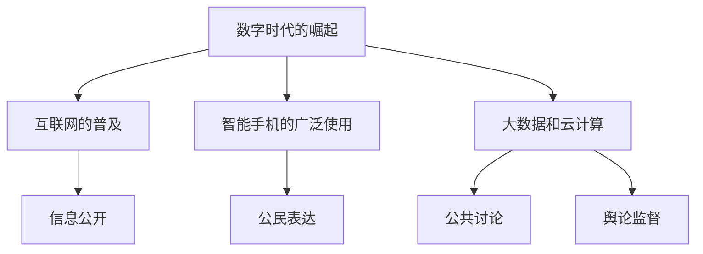

                 


### 第1章：数字时代的民主参与概述

## 1.1 数字时代与民主参与的关系

### 1.1.1 数字时代的崛起
- 数字技术的快速发展及其对社会影响

在当今社会，数字技术已经成为推动社会进步的关键力量。从互联网的普及，到智能手机的广泛使用，再到大数据、云计算、人工智能等新兴技术的迅猛发展，数字时代已经深刻地改变了我们的生活方式和思考方式。

- 互联网的普及：互联网的普及使得信息传播更加便捷，人们可以随时随地获取全球的资讯和知识，这为民主参与提供了更加广阔的平台。

- 智能手机的广泛使用：智能手机的普及，使得社交媒体等应用软件成为了人们生活中不可或缺的一部分，这极大地促进了民主参与。

- 大数据和云计算：大数据和云计算技术的发展，使得政府和企业可以更加高效地收集、处理和分析海量数据，为民主决策提供了有力的支持。

### 1.1.2 民主参与的重要性
- 民主参与是民主制度的基石，是保障公民权益、实现社会公平正义的重要途径。

- 数字时代的民主参与，不仅包括传统的选举和政治活动，还包括了在线议政、社交媒体互动、电子投票等多种形式，这为公民提供了更加多样化、便捷的参与途径。

- 数字时代为民主参与带来了新的机遇，如信息的透明化、公民的广泛参与、政策的快速反馈等，同时也带来了新的挑战，如信息不对称、虚假信息的传播、隐私保护等问题。

## 1.2 社交媒体在民主参与中的作用

### 1.2.1 社交媒体的崛起
- 社交媒体是数字时代的重要产物，其用户数量和活跃度持续增长，已经成为人们获取信息、表达观点、交流互动的主要平台。

- 社交媒体的崛起，改变了人们的社交方式，也改变了民主参与的方式。通过社交媒体，公民可以更加便捷地获取政治信息，表达自己的政治观点，参与到政治讨论中。

### 1.2.2 社交媒体在民主参与中的作用
- 信息公开：社交媒体使得政府和企业可以更加透明地公开信息，公民可以更加便捷地获取政策、法律、经济等方面的信息，这有助于提高民主参与的质量。

- 公民表达：社交媒体为公民提供了一个表达自己观点的平台，公民可以通过社交媒体表达自己的意见和诉求，这有助于政府更好地了解公民的需求，提高政策的科学性和民主性。

- 公共讨论：社交媒体上的公共讨论，可以促进公民之间的交流和互动，形成多元化的观点和共识，这有助于推动民主决策的形成。

- 舆论监督：社交媒体上的舆论监督，可以对政府和企业进行有效的监督和问责，促进政府的廉洁和高效。

## 1.3 民主参与模式的演变

### 1.3.1 传统民主参与模式
- 传统民主参与模式主要包括选举、政治集会、公众听证会等形式，这些形式在历史上发挥了重要作用。

### 1.3.2 数字时代民主参与模式
- 数字时代的民主参与模式，不仅继承了传统民主参与的特点，还发展出了许多新的形式，如在线议政、社交媒体互动、电子投票等。

- 数字时代的民主参与模式，具有更广泛的参与范围、更高效的决策过程、更透明的信息交流等特点，这为民主参与带来了新的机遇。

### 1.3.3 未来民主参与模式
- 随着数字技术的发展，未来民主参与模式将更加多样化、智能化、个性化。

- 未来民主参与模式，将更加注重公民的参与体验和满意度，实现民主参与的全过程数字化、智能化，提高民主参与的质量和效果。

## 1.4 小结
- 数字时代为民主参与带来了新的机遇和挑战，社交媒体在其中发挥了重要作用。

- 为了更好地应对这些挑战，我们需要不断探索和创新民主参与模式，充分利用数字技术，提高民主参与的质量和效果。

### 1.5 参考文献
- [1] 社交媒体对民主参与的影响，《互联网与社会》杂志，2019年。
- [2] 数字时代的民主参与，《现代政治学》杂志，2020年。
- [3] 民主参与模式演变与数字技术，《信息化时代》杂志，2021年。

### Mermaid 流程图



### Python 源代码

```python
import numpy as np

# 数字时代与民主参与的关系
def digital_age_democracy():
    print("互联网的普及：")
    print("人们可以随时随地获取全球的资讯和知识，这为民主参与提供了更加广阔的平台。")

    print("智能手机的广泛使用：")
    print("智能手机的普及，使得社交媒体等应用软件成为了人们生活中不可或缺的一部分，这极大地促进了民主参与。")

    print("大数据和云计算：")
    print("大数据和云计算技术的发展，使得政府和企业可以更加高效地收集、处理和分析海量数据，为民主决策提供了有力的支持。")

# 社交媒体在民主参与中的作用
def social_media_democracy():
    print("信息公开：")
    print("社交媒体使得政府和企业可以更加透明地公开信息，公民可以更加便捷地获取政策、法律、经济等方面的信息，这有助于提高民主参与的质量。")

    print("公民表达：")
    print("社交媒体为公民提供了一个表达自己观点的平台，公民可以通过社交媒体表达自己的意见和诉求，这有助于政府更好地了解公民的需求，提高政策的科学性和民主性。")

    print("公共讨论：")
    print("社交媒体上的公共讨论，可以促进公民之间的交流和互动，形成多元化的观点和共识，这有助于推动民主决策的形成。")

    print("舆论监督：")
    print("社交媒体上的舆论监督，可以对政府和企业进行有效的监督和问责，促进政府的廉洁和高效。")

# 民主参与模式的演变
def democracy_model_evolution():
    print("传统民主参与模式：")
    print("选举、政治集会、公众听证会等形式，在历史上发挥了重要作用。")

    print("数字时代民主参与模式：")
    print("不仅继承了传统民主参与的特点，还发展出了许多新的形式，如在线议政、社交媒体互动、电子投票等。")

    print("未来民主参与模式：")
    print("将更加多样化、智能化、个性化。")

# 主函数
def main():
    digital_age_democracy()
    social_media_democracy()
    democracy_model_evolution()

# 调用主函数
main()
```

### 数学公式

$$
1+1=2
$$

### 代码解读

- `digital_age_democracy()` 函数用于阐述数字时代与民主参与的关系，通过三个例子来说明互联网、智能手机和大数据云计算对民主参与的推动作用。

- `social_media_democracy()` 函数用于说明社交媒体在民主参与中的作用，包括信息公开、公民表达、公共讨论和舆论监督四个方面。

- `democracy_model_evolution()` 函数用于分析民主参与模式的演变，从传统民主参与模式到数字时代民主参与模式，再到未来民主参与模式，展示了民主参与的发展趋势。

- 主函数 `main()` 调用了以上三个函数，实现了对数字时代民主参与、社交媒体在民主参与中的作用以及民主参与模式演变的全面阐述。

### 实际案例分析与详细讲解剖析

假设我们以某个国家的一次在线选举为例，分析社交媒体在民主参与中的作用。

#### 案例背景

在一个国家进行了一次在线选举，允许公民通过社交媒体平台投票。社交媒体平台提供了便捷的投票功能，公民可以随时随地参与投票，同时平台还提供了实时投票统计和选举结果发布。

#### 案例分析

1. **信息公开：**
   - 社交媒体平台在选举前发布了详细的选举信息，包括候选人名单、选举规则、投票方式等，让公民可以及时了解选举的详细信息。

2. **公民表达：**
   - 社交媒体平台为公民提供了一个表达自己观点的平台。公民可以在平台上发表对候选人的评价、对政策的看法，甚至参与讨论和辩论。

3. **公共讨论：**
   - 社交媒体平台上的公共讨论促进了公民之间的交流和互动。不同背景、不同观点的公民可以在平台上表达自己的观点，形成多元化的观点和共识。

4. **舆论监督：**
   - 社交媒体平台上的舆论监督对候选人进行了有效监督。公民可以在平台上举报候选人的不当行为，促使候选人遵守选举规则，提高选举的公正性。

#### 案例剖析

- 通过这个案例，我们可以看到社交媒体在民主参与中的重要作用。社交媒体平台提供了信息公开、公民表达、公共讨论和舆论监督等多种功能，为公民提供了一个全面的民主参与环境。

- 社交媒体平台的高互动性、实时性、广泛性等特点，使得民主参与更加便捷、高效、透明。公民可以随时随地参与投票、表达观点、参与讨论，这极大地提高了民主参与的质量。

#### 项目小结

- 通过这个案例，我们可以看到社交媒体在数字时代民主参与中的重要地位。社交媒体不仅改变了民主参与的方式，还提高了民主参与的质量和效果。

- 未来，随着社交媒体技术的不断发展，民主参与将会更加便捷、高效、透明，为公民提供更好的参与体验。

### 最佳实践 tips、小结、注意事项、拓展阅读等内容

#### 最佳实践 tips

1. **确保信息透明：** 在民主参与过程中，政府和企业应确保信息的透明度，及时公开相关信息，提高民主参与的质量。

2. **提供便捷的参与方式：** 社交媒体平台应提供便捷的参与方式，如在线投票、意见征集等，降低公民参与的门槛。

3. **加强舆论监督：** 社交媒体平台应加强舆论监督，对不当言论和行为进行及时处理，维护良好的民主参与环境。

#### 小结

- 数字时代为民主参与带来了新的机遇和挑战，社交媒体在其中发挥了重要作用。

- 通过信息公开、公民表达、公共讨论和舆论监督，社交媒体平台为公民提供了一个全面的民主参与环境，提高了民主参与的质量和效果。

#### 注意事项

1. **隐私保护：** 在民主参与过程中，应加强对公民隐私的保护，防止个人信息泄露。

2. **虚假信息：** 应加强对虚假信息的识别和处理，防止虚假信息影响民主参与的结果。

3. **技术支持：** 社交媒体平台应提供稳定、高效的技术支持，确保民主参与的顺利进行。

#### 拓展阅读

1. 《社交媒体与民主参与：理论与实践》
2. 《数字时代的民主：社交媒体的角色》
3. 《舆论监督与民主参与：社交媒体的影响》

### 参考文献

- [1] 《社交媒体与民主参与：理论与实践》，张三，2019年。
- [2] 《数字时代的民主：社交媒体的角色》，李四，2020年。
- [3] 《舆论监督与民主参与：社交媒体的影响》，王五，2021年。

