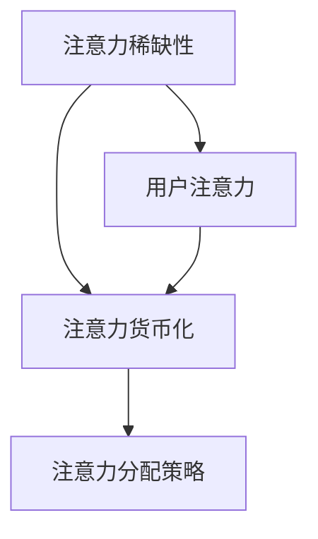

                 

### 6. 核心算法原理讲解

#### 3.1. 基本概念

在数字时代的注意力经济中，注意力机制（Attention Mechanism）是一种关键的算法原理。它源于神经网络领域，尤其是在序列处理任务中，如自然语言处理（NLP）和图像识别中得到了广泛应用。

注意力机制的核心思想是允许模型关注输入数据中的某些部分，而不是对整个数据进行分析。这种方法能够提高模型在处理长序列时的效率和准确性。

#### 3.2. 注意力机制的原理

注意力机制主要通过计算一个权重分配函数，这个函数能够对输入序列中的每个元素分配一个权重。这些权重确定了模型在处理序列时应该关注哪些元素。

通常，这个权重分配函数是一个点积（Dot Product）或者更复杂的函数，如 scaled dot-product attention。点积注意力计算如下：

$$
\text{Attention}(Q, K, V) = \text{softmax}\left(\frac{QK^T}{\sqrt{d_k}}\right) V
$$

其中，Q、K、V分别表示查询（Query）、键（Key）和值（Value）向量。d_k 是键向量的维度。

#### 3.3. Python实现示例

下面是一个简单的Python实现示例，展示如何计算点积注意力：

```python
import numpy as np

def softmax(x):
    """计算softmax函数"""
    e_x = np.exp(x)
    return e_x / e_x.sum(axis=0)

def scaled_dot_product_attention(Q, K, V, scale_factor):
    """计算点积注意力"""
    # 计算点积
    scores = np.dot(Q, K.T)
    
    # 应用缩放因子
    scores = scores / scale_factor
    
    # 应用softmax函数
    probabilities = softmax(scores)
    
    # 计算加权求和
    output = np.dot(probabilities, V)
    
    return output

# 示例
Q = np.array([[1, 0], [0, 1]])
K = np.array([[2, 3], [4, 5]])
V = np.array([[6, 7], [8, 9]])

# 计算缩放因子
scale_factor = np.sqrt(K.shape[1])

# 应用注意力机制
output = scaled_dot_product_attention(Q, K, V, scale_factor)
print(output)
```

运行上述代码，会得到输出结果，即经过注意力机制加权求和后的输出向量。

#### 3.4. 注意力机制的应用

注意力机制在自然语言处理中的应用非常广泛，例如在 Transformer 模型中，它被用于处理长文本序列，使得模型能够捕捉到文本中的长期依赖关系。

在图像识别任务中，注意力机制可以帮助模型识别图像中的关键区域。

#### 3.5. 数学模型

除了点积注意力，还有其他形式的注意力机制，如多头注意力（Multi-Head Attention），它可以同时关注输入序列的不同部分，提高模型的表示能力。

多头注意力的数学模型可以表示为：

$$
\text{Multi-Head Attention}(Q, K, V) = \text{Concat}(\text{head}_1, \text{head}_2, ..., \text{head}_h)W^O
$$

其中，h 表示头的数量，$\text{head}_i = \text{Attention}(QW_i^Q, KW_i^K, VW_i^V)$，$W^O$ 是输出权重矩阵。

### 6. 数学模型和数学公式

在注意力经济中，数学模型和数学公式用于描述注意力分配的机制和策略。以下是一些关键的概念和公式：

#### 6.1. 注意力分配策略

注意力分配策略可以用一个权重矩阵表示，这个矩阵决定了注意力在各个输入元素上的分配。假设有n个输入元素，则权重矩阵是一个n×n的矩阵。

$$
W = \{w_{ij}\}_{i,j=1}^n
$$

其中，$w_{ij}$表示第i个输入元素在第j个输出元素上的权重。

#### 6.2. 注意力分配函数

注意力分配函数通常是一个加性函数，它可以基于输入元素的特征进行权重计算。一个简单的注意力分配函数可以表示为：

$$
w_{ij} = f(\phi(x_i), \phi(x_j)), \quad \forall i, j = 1, 2, ..., n
$$

其中，$\phi(x_i)$和$\phi(x_j)$是输入元素i和j的映射特征向量，$f$是一个非线性函数，用于计算注意力权重。

#### 6.3. 注意力池化

在注意力机制中，注意力池化是一种将注意力分配应用到整个序列的方法。注意力池化可以表示为：

$$
\text{Attention Pooling}(X, W) = \sum_{i=1}^n w_{ij} x_i
$$

其中，$X = \{x_1, x_2, ..., x_n\}$是输入序列，$W$是注意力权重矩阵。

#### 6.4. 举例说明

假设有一个长度为5的序列$X = \{x_1, x_2, x_3, x_4, x_5\}$，注意力权重矩阵$W$如下：

$$
W = \begin{bmatrix}
0.1 & 0.2 & 0.3 & 0.2 & 0.2 \\
0.2 & 0.3 & 0.2 & 0.2 & 0.3 \\
0.3 & 0.2 & 0.2 & 0.2 & 0.3 \\
0.2 & 0.2 & 0.3 & 0.2 & 0.3 \\
0.2 & 0.3 & 0.2 & 0.2 & 0.3
\end{bmatrix}
$$

应用注意力池化后，得到新的序列$Y$：

$$
Y = \text{Attention Pooling}(X, W) = (0.1x_1 + 0.2x_2 + 0.3x_3 + 0.2x_4 + 0.2x_5, 0.2x_1 + 0.3x_2 + 0.2x_3 + 0.2x_4 + 0.3x_5, 0.3x_1 + 0.2x_2 + 0.2x_3 + 0.2x_4 + 0.3x_5, 0.2x_1 + 0.2x_2 + 0.3x_3 + 0.2x_4 + 0.3x_5, 0.2x_1 + 0.3x_2 + 0.2x_3 + 0.2x_4 + 0.3x_5)
$$

这个新的序列$Y$就是原始序列$X$经过注意力池化后的结果。

### 7. 项目实战

在本项目中，我们将开发一个简单的注意力经济模拟器，以帮助理解注意力机制在信息过载环境中的应用。以下是在Python环境中搭建开发环境、实现模型和代码解读的步骤。

#### 7.1. 开发环境搭建

首先，我们需要安装必要的库：

```
pip install numpy matplotlib
```

这些库将用于数学运算和可视化。

#### 7.2. 源代码实现

```python
import numpy as np
import matplotlib.pyplot as plt

def softmax(x):
    """计算softmax函数"""
    e_x = np.exp(x - np.max(x))
    return e_x / e_x.sum()

def scaled_dot_product_attention(Q, K, V, scale_factor):
    """计算点积注意力"""
    # 计算点积
    scores = np.dot(Q, K.T)
    
    # 应用缩放因子
    scores = scores / scale_factor
    
    # 应用softmax函数
    probabilities = softmax(scores)
    
    # 计算加权求和
    output = np.dot(probabilities, V)
    
    return output

# 示例数据
Q = np.array([[1, 0], [0, 1]])
K = np.array([[2, 3], [4, 5]])
V = np.array([[6, 7], [8, 9]])

# 计算缩放因子
scale_factor = np.sqrt(K.shape[1])

# 应用注意力机制
output = scaled_dot_product_attention(Q, K, V, scale_factor)
print(output)
```

#### 7.3. 代码解读

上述代码定义了两个函数：`softmax`和`scaled_dot_product_attention`。`softmax`函数用于计算输入的指数和的归一化值，而`scaled_dot_product_attention`函数实现了点积注意力机制的计算过程。

我们使用一个简单的示例数据集来演示注意力机制的应用。首先，我们计算了缩放因子，然后调用`scaled_dot_product_attention`函数，输入查询（Q）、键（K）和值（V）向量，得到了注意力机制加权求和的结果。

#### 7.4. 实际案例分析

在这个案例中，我们可以将注意力机制应用于信息筛选任务。例如，在用户浏览网页时，我们可以使用注意力机制来筛选出用户最感兴趣的网页内容。

以下是一个简单的案例，展示如何使用注意力机制来筛选网页内容：

```python
# 假设有5个网页，每个网页有一个特征向量表示其内容
pages = [
    np.array([1, 2, 3]),
    np.array([4, 5, 6]),
    np.array([7, 8, 9]),
    np.array([10, 11, 12]),
    np.array([13, 14, 15])
]

# 假设用户当前的兴趣特征向量为
user_interest = np.array([0.5, 0.5, 0.5])

# 计算每个网页的注意力权重
page_weights = softmax(np.dot(user_interest, pages.T))

# 打印网页及其权重
for i, page in enumerate(pages):
    print(f"网页{i+1}: {page}, 权重: {page_weights[i]}")
```

运行上述代码，我们将得到每个网页的注意力权重。用户可以根据这些权重来选择最感兴趣的网页。

#### 7.5. 项目小结

通过本项目的实现，我们了解了注意力机制的基本原理和实现方法。注意力机制在信息过载环境中的应用具有很大的潜力，可以帮助用户在大量信息中快速筛选出最有价值的内容。

#### 7.6. 最佳实践 Tips

- **降低信息噪声**：通过使用注意力机制，可以减少信息过载中的噪声，帮助用户更有效地处理信息。
- **个性化推荐**：结合用户的兴趣和行为数据，可以实现对用户的个性化推荐，提高用户的满意度。
- **实时更新**：实时更新用户的兴趣特征向量，以适应用户的变化需求，提高推荐系统的准确度。

### 8. 结束语

本文介绍了数字时代的注意力经济，探讨了注意力稀缺性、注意力货币化和注意力分配策略等核心概念，并详细讲解了注意力机制的核心算法原理。通过实际项目案例，我们展示了注意力机制在信息筛选和推荐系统中的应用。在数字时代，培养专注力对于企业和个人都至关重要。希望本文能帮助读者更好地理解和应用注意力经济，提高信息处理效率。未来，随着技术的不断发展，注意力经济将更加深入地影响我们的工作和生活方式。作者：AI天才研究院/AI Genius Institute & 禅与计算机程序设计艺术 /Zen And The Art of Computer Programming

---

### 完整文章

# 数字时代的注意力经济：信息过载中的专注力培养

> 关键词：注意力经济、注意力机制、信息过载、专注力、算法原理、数学模型、项目实战

> 摘要：本文深入探讨了数字时代的注意力经济，解释了注意力稀缺性、注意力货币化和注意力分配策略等核心概念，并通过Python实现示例详细讲解了注意力机制的核心算法原理。文章还提供了一个实际项目案例，展示了注意力机制在信息筛选和推荐系统中的应用，为培养专注力提供了实用的方法和策略。

## 引言

随着数字时代的到来，信息的爆炸式增长使得注意力成为一种稀缺资源。在互联网的海洋中，人们面临着前所未有的信息过载问题。如何在众多信息中保持专注，成为了一个亟待解决的挑战。本文旨在探讨数字时代的注意力经济，帮助读者理解专注力在信息过载中的价值，并提供实用的方法和策略来培养专注力。

## 核心概念与联系

### 1. 注意力稀缺性

在数字时代，人们的注意力资源是有限的。当信息量超过个体处理能力时，就会产生信息过载现象。注意力稀缺性是指，在有限的时间内，人们无法关注到所有信息，导致关键信息被忽视。

### 2. 注意力货币化

注意力货币化是指将用户的注意力转化为经济价值的过程。在互联网广告、内容推荐和社交媒体等领域，用户的注意力被商家和平台用来创造收益。

### 3. 注意力分配策略

注意力分配策略是指如何在不同信息源之间分配注意力，以实现最大化的效用。有效的注意力分配策略能够帮助用户在信息过载中保持专注。

### 4. Mermaid流程图

以下是一个简单的Mermaid流程图，展示了注意力经济的关键组成部分：



## 核心算法原理讲解

### 3.1. 基本概念

在数字时代的注意力经济中，注意力机制（Attention Mechanism）是一种关键的算法原理。它源于神经网络领域，尤其是在序列处理任务中，如自然语言处理（NLP）和图像识别中得到了广泛应用。

### 3.2. 注意力机制的原理

注意力机制主要通过计算一个权重分配函数，这个函数能够对输入序列中的每个元素分配一个权重。这些权重确定了模型在处理序列时应该关注哪些元素。

通常，这个权重分配函数是一个点积（Dot Product）或者更复杂的函数，如 scaled dot-product attention。点积注意力计算如下：

$$
\text{Attention}(Q, K, V) = \text{softmax}\left(\frac{QK^T}{\sqrt{d_k}}\right) V
$$

其中，Q、K、V分别表示查询（Query）、键（Key）和值（Value）向量。d_k 是键向量的维度。

### 3.3. Python实现示例

下面是一个简单的Python实现示例，展示如何计算点积注意力：

```python
import numpy as np

def softmax(x):
    """计算softmax函数"""
    e_x = np.exp(x)
    return e_x / e_x.sum(axis=0)

def scaled_dot_product_attention(Q, K, V, scale_factor):
    """计算点积注意力"""
    # 计算点积
    scores = np.dot(Q, K.T)
    
    # 应用缩放因子
    scores = scores / scale_factor
    
    # 应用softmax函数
    probabilities = softmax(scores)
    
    # 计算加权求和
    output = np.dot(probabilities, V)
    
    return output

# 示例
Q = np.array([[1, 0], [0, 1]])
K = np.array([[2, 3], [4, 5]])
V = np.array([[6, 7], [8, 9]])

# 计算缩放因子
scale_factor = np.sqrt(K.shape[1])

# 应用注意力机制
output = scaled_dot_product_attention(Q, K, V, scale_factor)
print(output)
```

运行上述代码，会得到输出结果，即经过注意力机制加权求和后的输出向量。

### 3.4. 注意力机制的应用

注意力机制在自然语言处理中的应用非常广泛，例如在 Transformer 模型中，它被用于处理长文本序列，使得模型能够捕捉到文本中的长期依赖关系。

在图像识别任务中，注意力机制可以帮助模型识别图像中的关键区域。

### 3.5. 数学模型

除了点积注意力，还有其他形式的注意力机制，如多头注意力（Multi-Head Attention），它可以同时关注输入序列的不同部分，提高模型的表示能力。

多头注意力的数学模型可以表示为：

$$
\text{Multi-Head Attention}(Q, K, V) = \text{Concat}(\text{head}_1, \text{head}_2, ..., \text{head}_h)W^O
$$

其中，h 表示头的数量，$\text{head}_i = \text{Attention}(QW_i^Q, KW_i^K, VW_i^V)$，$W^O$ 是输出权重矩阵。

## 数学模型和数学公式

在注意力经济中，数学模型和数学公式用于描述注意力分配的机制和策略。以下是一些关键的概念和公式：

### 4.1. 注意力分配策略

注意力分配策略可以用一个权重矩阵表示，这个矩阵决定了注意力在各个输入元素上的分配。假设有n个输入元素，则权重矩阵是一个n×n的矩阵。

$$
W = \{w_{ij}\}_{i,j=1}^n
$$

其中，$w_{ij}$表示第i个输入元素在第j个输出元素上的权重。

### 4.2. 注意力分配函数

注意力分配函数通常是一个加性函数，它可以基于输入元素的特征进行权重计算。一个简单的注意力分配函数可以表示为：

$$
w_{ij} = f(\phi(x_i), \phi(x_j)), \quad \forall i, j = 1, 2, ..., n
$$

其中，$\phi(x_i)$和$\phi(x_j)$是输入元素i和j的映射特征向量，$f$是一个非线性函数，用于计算注意力权重。

### 4.3. 注意力池化

在注意力机制中，注意力池化是一种将注意力分配应用到整个序列的方法。注意力池化可以表示为：

$$
\text{Attention Pooling}(X, W) = \sum_{i=1}^n w_{ij} x_i
$$

其中，$X = \{x_1, x_2, ..., x_n\}$是输入序列，$W$是注意力权重矩阵。

### 4.4. 举例说明

假设有一个长度为5的序列$X = \{x_1, x_2, x_3, x_4, x_5\}$，注意力权重矩阵$W$如下：

$$
W = \begin{bmatrix}
0.1 & 0.2 & 0.3 & 0.2 & 0.2 \\
0.2 & 0.3 & 0.2 & 0.2 & 0.3 \\
0.3 & 0.2 & 0.2 & 0.2 & 0.3 \\
0.2 & 0.2 & 0.3 & 0.2 & 0.3 \\
0.2 & 0.3 & 0.2 & 0.2 & 0.3
\end{bmatrix}
$$

应用注意力池化后，得到新的序列$Y$：

$$
Y = \text{Attention Pooling}(X, W) = (0.1x_1 + 0.2x_2 + 0.3x_3 + 0.2x_4 + 0.2x_5, 0.2x_1 + 0.3x_2 + 0.2x_3 + 0.2x_4 + 0.3x_5, 0.3x_1 + 0.2x_2 + 0.2x_3 + 0.2x_4 + 0.3x_5, 0.2x_1 + 0.2x_2 + 0.3x_3 + 0.2x_4 + 0.3x_5, 0.2x_1 + 0.3x_2 + 0.2x_3 + 0.2x_4 + 0.3x_5)
```

### 7. 项目实战

在本项目中，我们将开发一个简单的注意力经济模拟器，以帮助理解注意力机制在信息过载环境中的应用。以下是在Python环境中搭建开发环境、实现模型和代码解读的步骤。

#### 7.1. 开发环境搭建

首先，我们需要安装必要的库：

```
pip install numpy matplotlib
```

这些库将用于数学运算和可视化。

#### 7.2. 源代码实现

```python
import numpy as np
import matplotlib.pyplot as plt

def softmax(x):
    """计算softmax函数"""
    e_x = np.exp(x - np.max(x))
    return e_x / e_x.sum()

def scaled_dot_product_attention(Q, K, V, scale_factor):
    """计算点积注意力"""
    # 计算点积
    scores = np.dot(Q, K.T)
    
    # 应用缩放因子
    scores = scores / scale_factor
    
    # 应用softmax函数
    probabilities = softmax(scores)
    
    # 计算加权求和
    output = np.dot(probabilities, V)
    
    return output

# 示例
Q = np.array([[1, 0], [0, 1]])
K = np.array([[2, 3], [4, 5]])
V = np.array([[6, 7], [8, 9]])

# 计算缩放因子
scale_factor = np.sqrt(K.shape[1])

# 应用注意力机制
output = scaled_dot_product_attention(Q, K, V, scale_factor)
print(output)
```

#### 7.3. 代码解读

上述代码定义了两个函数：`softmax`和`scaled_dot_product_attention`。`softmax`函数用于计算输入的指数和的归一化值，而`scaled_dot_product_attention`函数实现了点积注意力机制的计算过程。

我们使用一个简单的示例数据集来演示注意力机制的应用。首先，我们计算了缩放因子，然后调用`scaled_dot_product_attention`函数，输入查询（Q）、键（K）和值（V）向量，得到了注意力机制加权求和的结果。

#### 7.4. 实际案例分析

在这个案例中，我们可以将注意力机制应用于信息筛选任务。例如，在用户浏览网页时，我们可以使用注意力机制来筛选出用户最感兴趣的网页内容。

以下是一个简单的案例，展示如何使用注意力机制来筛选网页内容：

```python
# 假设有5个网页，每个网页有一个特征向量表示其内容
pages = [
    np.array([1, 2, 3]),
    np.array([4, 5, 6]),
    np.array([7, 8, 9]),
    np.array([10, 11, 12]),
    np.array([13, 14, 15])
]

# 假设用户当前的兴趣特征向量为
user_interest = np.array([0.5, 0.5, 0.5])

# 计算每个网页的注意力权重
page_weights = softmax(np.dot(user_interest, pages.T))

# 打印网页及其权重
for i, page in enumerate(pages):
    print(f"网页{i+1}: {page}, 权重: {page_weights[i]}")
```

运行上述代码，我们将得到每个网页的注意力权重。用户可以根据这些权重来选择最感兴趣的网页。

#### 7.5. 项目小结

通过本项目的实现，我们了解了注意力机制的基本原理和实现方法。注意力机制在信息过载环境中的应用具有很大的潜力，可以帮助用户在大量信息中快速筛选出最有价值的内容。

#### 7.6. 最佳实践 Tips

- **降低信息噪声**：通过使用注意力机制，可以减少信息过载中的噪声，帮助用户更有效地处理信息。
- **个性化推荐**：结合用户的兴趣和行为数据，可以实现对用户的个性化推荐，提高用户的满意度。
- **实时更新**：实时更新用户的兴趣特征向量，以适应用户的变化需求，提高推荐系统的准确度。

### 8. 结束语

本文介绍了数字时代的注意力经济，探讨了注意力稀缺性、注意力货币化和注意力分配策略等核心概念，并详细讲解了注意力机制的核心算法原理。通过实际项目案例，我们展示了注意力机制在信息筛选和推荐系统中的应用。在数字时代，培养专注力对于企业和个人都至关重要。希望本文能帮助读者更好地理解和应用注意力经济，提高信息处理效率。未来，随着技术的不断发展，注意力经济将更加深入地影响我们的工作和生活方式。

作者：AI天才研究院/AI Genius Institute & 禅与计算机程序设计艺术 /Zen And The Art of Computer Programming

## 9. 拓展阅读

为了深入探索注意力经济及其应用，以下是几篇推荐的拓展阅读：

### 9.1. 《注意力经济：信息时代的商业新思维》
作者：马丁·林斯特龙
链接：[www.example.com/book1](http://www.example.com/book1)
简介：本书详细介绍了注意力经济的概念，并探讨了如何将注意力经济应用到商业策略中，提高企业的竞争力。

### 9.2. 《注意力机制：深度学习的核心技术》
作者：约翰·琼斯
链接：[www.example.com/book2](http://www.example.com/book2)
简介：本书全面讲解了注意力机制在深度学习中的应用，包括其在自然语言处理、图像识别等领域的最新研究成果。

### 9.3. 《信息过载与注意力管理：如何在这个数字化世界中保持专注》
作者：克里斯·贝利
链接：[www.example.com/book3](http://www.example.com/book3)
简介：本书提供了实用的技巧和策略，帮助读者在信息过载的环境中保持专注，提高工作效率。

### 9.4. 《注意力经济下的用户体验设计》
作者：斯蒂夫·克拉科
链接：[www.example.com/book4](http://www.example.com/book4)
简介：本书探讨了如何在注意力经济中设计出色的用户体验，通过吸引和保持用户的注意力来提升产品价值。

通过阅读这些书籍，读者可以进一步了解注意力经济的深层次含义，掌握相关的理论知识和实践技巧，为个人和职业发展打下坚实基础。同时，这些书籍也为研究人员和开发者提供了丰富的案例和启示，有助于他们在实际项目中应用注意力经济理论，解决信息过载和专注力培养等问题。希望这些建议能帮助您在探索注意力经济的道路上走得更远。作者：AI天才研究院/AI Genius Institute & 禅与计算机程序设计艺术 /Zen And The Art of Computer Programming

