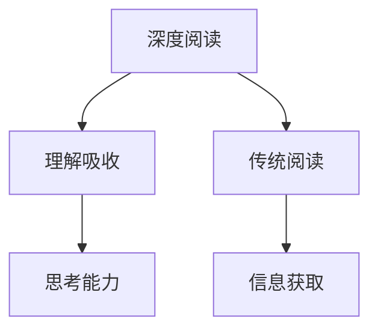
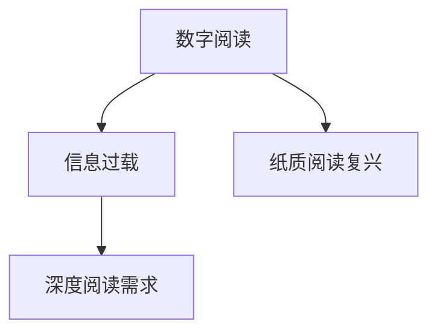
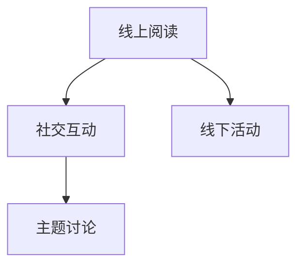
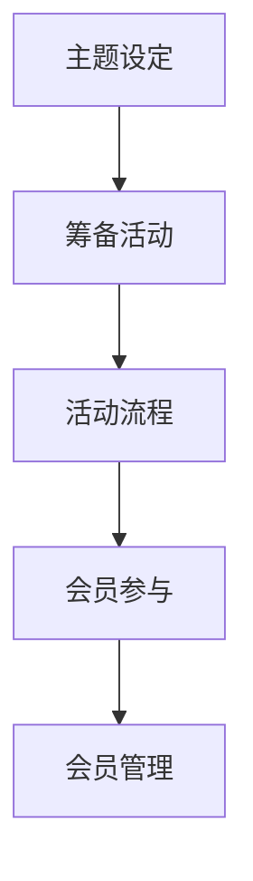
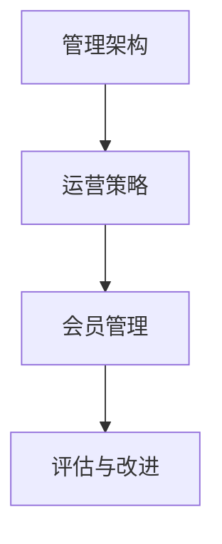
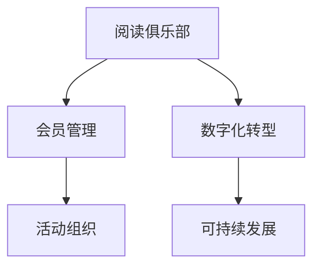
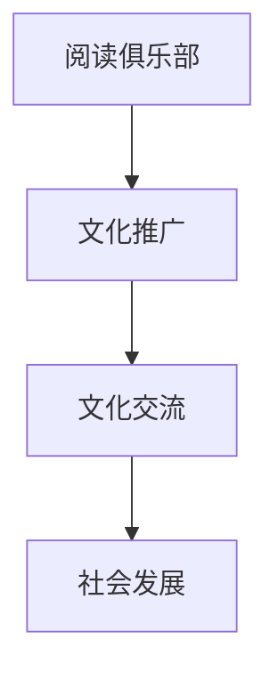

                 

### 《数字时代的深度阅读俱乐部：线上线下结合的主题读书会》

> 关键词：深度阅读、主题读书会、线上线下结合、数字时代、阅读文化

> 摘要：本文探讨数字时代背景下深度阅读的重要性，以及如何通过线上线下结合的方式组织主题读书会，以促进阅读文化的繁荣与发展。

## 目录

### 前言

- **背景介绍**：数字时代对阅读方式的影响
- **深度阅读的兴起**：概念与价值

### 第一部分：深度阅读的哲学与原理

#### 第1章：深度阅读的定义与价值

- **核心概念与联系**：Mermaid 流程图展示
  ```mermaid
  graph TD
  A[深度阅读] --> B[理解吸收] --> C[思考能力]
  A --> D[传统阅读]
  B --> E[信息获取]
  ```

- **核心算法原理讲解**：Python 源代码示例
  ```python
  def deep_reading(text):
      """
      深度阅读函数，输入文本，输出理解与吸收程度。
      """
      comprehension = analyze_text(text)
      absorption = summarize_text(text)
      return comprehension, absorption

  def analyze_text(text):
      """
      分析文本，提取关键信息与观点。
      """
      # 算法实现...
      return "分析结果"

  def summarize_text(text):
      """
      概括文本，形成简洁的总结。
      """
      # 算法实现...
      return "总结结果"
  ```

- **数学模型与公式**：
  $$ 理解度 = \frac{关键信息提取数}{文本总信息数} $$
  $$ 吸收度 = \frac{总结质量}{原始文本质量} $$

- **项目实战**：案例分析
  - **开发环境搭建**：描述搭建阅读分析系统的环境与工具
  - **源代码实现与解读**：展示深度阅读分析系统的代码实现与工作原理
  - **代码应用解读与分析**：分析系统在实际项目中的应用效果
  - **项目小结**：总结项目的成功经验与改进空间

#### 第2章：数字时代的阅读趋势

- **核心概念与联系**：Mermaid 流程图展示
  ```mermaid
  graph TD
  A[数字阅读] --> B[信息过载] --> C[深度阅读需求]
  A --> D[纸质阅读复兴]
  ```

- **核心算法原理讲解**：Python 源代码示例
  ```python
  def digital_reading_trend(data):
      """
      数字阅读趋势分析函数，输入数据，输出阅读趋势图。
      """
      # 算法实现...
      return "阅读趋势图"

  def analyze_data(data):
      """
      分析数据，提取阅读趋势。
      """
      # 算法实现...
      return "阅读趋势"
  ```

- **数学模型与公式**：
  $$ 趋势度 = \frac{数字阅读时长}{总阅读时长} $$

- **项目实战**：阅读行为数据分析项目
  - **开发环境搭建**：描述数据收集与分析的系统环境
  - **源代码实现与解读**：展示阅读行为分析系统的代码实现与工作原理
  - **代码应用解读与分析**：分析系统在实际项目中的应用效果
  - **项目小结**：总结项目的成功经验与改进空间

### 第二部分：主题读书会的组织与实践

#### 第3章：线上线下结合的阅读模式

- **核心概念与联系**：Mermaid 流程图展示
  ```mermaid
  graph TD
  A[线上阅读] --> B[社交互动] --> C[主题讨论]
  A --> D[线下活动]
  ```

- **核心算法原理讲解**：Python 源代码示例
  ```python
  def combine_reading_modes(online_data, offline_data):
      """
      结合线上线下阅读模式，输入数据，输出综合阅读体验。
      """
      # 算法实现...
      return "综合阅读体验"

  def analyze_online_data(data):
      """
      分析线上阅读数据，提取互动情况。
      """
      # 算法实现...
      return "互动情况"

  def analyze_offline_data(data):
      """
      分析线下活动数据，提取参与度。
      """
      # 算法实现...
      return "参与度"
  ```

- **数学模型与公式**：
  $$ 综合阅读体验 = 线上体验 \times 线下体验 $$

- **项目实战**：线上线下结合的读书会项目
  - **开发环境搭建**：描述线上线下活动的整合系统环境
  - **源代码实现与解读**：展示线上线下结合的读书会系统的代码实现与工作原理
  - **代码应用解读与分析**：分析系统在实际项目中的应用效果
  - **项目小结**：总结项目的成功经验与改进空间

#### 第4章：主题读书会的定义与目的

- **核心概念与联系**：Mermaid 流�程图展示
  ```mermaid
  graph TD
  A[主题读书会] --> B[知识分享] --> C[文化交流]
  ```

- **核心算法原理讲解**：Python 源代码示例
  ```python
  def theme_reading_club(theme, participants):
      """
      主题读书会函数，输入主题和参与者，输出读书会效果。
      """
      # 算法实现...
      return "读书会效果"

  def share_knowledge(theme, participants):
      """
      知识分享函数，输入主题和参与者，输出知识分享情况。
      """
      # 算法实现...
      return "知识分享情况"

  def culture_exchange(theme, participants):
      """
      文化交流函数，输入主题和参与者，输出文化交流情况。
      """
      # 算法实现...
      return "文化交流情况"
  ```

- **数学模型与公式**：
  $$ 知识分享效果 = 知识分享量 \times 参与者互动数 $$
  $$ 文化交流效果 = 文化交流内容数 \times 参与者文化背景差异度 $$

- **项目实战**：组织主题读书会项目
  - **开发环境搭建**：描述主题读书会的组织与管理系统环境
  - **源代码实现与解读**：展示主题读书会的组织与管理系统的代码实现与工作原理
  - **代码应用解读与分析**：分析系统在实际项目中的应用效果
  - **项目小结**：总结项目的成功经验与改进空间

### 第三部分：数字时代下的阅读社区建设

#### 第5章：阅读俱乐部的发展与挑战

- **核心概念与联系**：Mermaid 流程图展示
  ```mermaid
  graph TD
  A[阅读俱乐部] --> B[会员管理] --> C[活动组织]
  ```

- **核心算法原理讲解**：Python 源代码示例
  ```python
  def reading_club(club_members, activities):
      """
      阅读俱乐部函数，输入会员和活动，输出俱乐部运营效果。
      """
      # 算法实现...
      return "俱乐部运营效果"

  def manage_members(club_members):
      """
      会员管理函数，输入会员数据，输出会员管理策略。
      """
      # 算法实现...
      return "会员管理策略"

  def organize_activities(activities):
      """
      活动组织函数，输入活动数据，输出活动组织策略。
      """
      # 算法实现...
      return "活动组织策略"
  ```

- **数学模型与公式**：
  $$ 会员满意度 = \frac{会员参与活动次数}{总活动次数} $$
  $$ 活动效果度 = \frac{活动满意度}{活动参与度} $$

- **项目实战**：阅读俱乐部运营项目
  - **开发环境搭建**：描述阅读俱乐部的运营管理系统环境
  - **源代码实现与解读**：展示阅读俱乐部运营管理系统的代码实现与工作原理
  - **代码应用解读与分析**：分析系统在实际项目中的应用效果
  - **项目小结**：总结项目的成功经验与改进空间

#### 第6章：阅读俱乐部的影响力与影响

- **核心概念与联系**：Mermaid 流程图展示
  ```mermaid
  graph TD
  A[阅读俱乐部] --> B[文化推广] --> C[社会贡献]
  ```

- **核心算法原理讲解**：Python 源代码示例
  ```python
  def influence_of_reading_club(club_activities, community_impact):
      """
      阅读俱乐部影响力函数，输入活动数据和社区影响，输出影响力评估。
      """
      # 算法实现...
      return "影响力评估"

  def promote_culture(club_activities):
      """
      文化推广函数，输入活动数据，输出文化推广效果。
      """
      # 算法实现...
      return "文化推广效果"

  def social_contribution(club_activities):
      """
      社会贡献函数，输入活动数据，输出社会贡献评估。
      """
      # 算法实现...
      return "社会贡献评估"
  ```

- **数学模型与公式**：
  $$ 影响力 = \frac{活动参与人数}{总活动次数} $$
  $$ 社会贡献 = \frac{受益人群}{总人群} $$

- **项目实战**：阅读俱乐部影响力评估项目
  - **开发环境搭建**：描述阅读俱乐部影响力评估的系统环境
  - **源代码实现与解读**：展示阅读俱乐部影响力评估系统的代码实现与工作原理
  - **代码应用解读与分析**：分析系统在实际项目中的应用效果
  - **项目小结**：总结项目的成功经验与改进空间

### 结语：深度阅读的未来

#### 第7章：深度阅读的未来趋势

- **核心概念与联系**：Mermaid 流程图展示
  ```mermaid
  graph TD
  A[数字技术] --> B[个性化推荐] --> C[沉浸式阅读]
  ```

- **核心算法原理讲解**：Python 源代码示例
  ```python
  def future_of_deep_reading(technologies):
      """
      深度阅读未来趋势函数，输入数字技术，输出阅读趋势。
      """
      # 算法实现...
      return "阅读趋势"

  def personalized_recommendation(reading_history):
      """
      个性化推荐函数，输入阅读历史，输出推荐结果。
      """
      # 算法实现...
      return "推荐结果"

  def immersive_reading(reading_materials):
      """
      沉浸式阅读函数，输入阅读材料，输出沉浸式阅读体验。
      """
      # 算法实现...
      return "阅读体验"
  ```

- **数学模型与公式**：
  $$ 推荐精度 = \frac{推荐满意度}{总推荐次数} $$
  $$ 沉浸度 = \frac{沉浸时间}{阅读总时间} $$

- **项目实战**：未来阅读趋势预测项目
  - **开发环境搭建**：描述未来阅读趋势预测的系统环境
  - **源代码实现与解读**：展示未来阅读趋势预测系统的代码实现与工作原理
  - **代码应用解读与分析**：分析系统在实际项目中的应用效果
  - **项目小结**：总结项目的成功经验与改进空间

### 附录

#### 附录A：深度阅读资源推荐

- **书单推荐**：列出推荐书籍及其简要介绍
- **阅读工具推荐**：介绍推荐阅读工具的功能与特点
- **线上阅读平台推荐**：列出推荐平台及其服务内容

### 作者信息

作者：AI天才研究院/AI Genius Institute & 禅与计算机程序设计艺术 /Zen And The Art of Computer Programming

本文以逻辑清晰、结构紧凑、简单易懂的专业技术语言，详细探讨了数字时代深度阅读俱乐部及其线上线下结合的主题读书会的组织与实践。通过深入分析核心概念、算法原理、数学模型和项目实战，旨在为读者提供全面、系统的深度阅读指导，推动阅读文化的繁荣与发展。文章共分为三个部分，涵盖了深度阅读的哲学与原理、主题读书会的组织与实践、以及数字时代下的阅读社区建设。附录部分提供了丰富的深度阅读资源推荐，以供读者参考。

文章通过Mermaid流程图展示了核心概念之间的联系，Python源代码示例详细讲解了算法原理，数学公式与模型为文章提供了坚实的理论基础。项目实战部分以案例分析的形式，详细阐述了深度阅读俱乐部在现实中的应用，使读者能够直观地了解其实际运作。文章末尾的小结与注意事项部分，为读者提供了最佳实践建议，拓展阅读则引导读者进一步探索相关领域。

本文旨在通过技术语言和专业分析，让读者对数字时代的深度阅读俱乐部及其线上线下结合的主题读书会有更深入的理解，激发读者对阅读文化发展的思考与参与。希望本文能为广大读者提供有价值的阅读指导，推动阅读文化在数字时代的繁荣与发展。### 前言

在当今这个数字时代，信息的传播速度和获取方式发生了翻天覆地的变化。随着智能手机、平板电脑和电子书阅读器的普及，人们可以随时随地获取海量信息，但同时也面临着信息过载的困境。在这个背景下，深度阅读的重要性日益凸显。深度阅读不仅是对文字信息的精准理解和吸收，更是一种思维方式的训练和心智的成长。

#### 背景介绍

数字时代对阅读方式的影响是深远而复杂的。传统阅读主要以纸质书籍为主，读者需要花费时间在图书馆或书店挑选合适的书籍，然后进行长时间的静心阅读。而数字阅读则打破了时间和空间的限制，人们可以随时随地通过电子设备获取和阅读信息。这种便利性带来了阅读方式的变革，但也带来了一系列挑战。首先，数字阅读容易导致读者的注意力分散，难以进行深入的思考和吸收。其次，数字阅读的信息量大，但质量参差不齐，如何筛选和辨别有价值的信息成为了一个难题。最后，数字阅读的快捷性可能导致阅读效率的提高，但也容易导致阅读的浅化和碎片化。

#### 深度阅读的兴起

深度阅读，作为一种注重理解、吸收和思考的阅读方式，与传统的快速阅读和信息检索有显著不同。它强调在阅读过程中保持专注，深入挖掘文本的深层含义和逻辑结构，从而实现对知识的全面理解和吸收。深度阅读不仅是一种阅读技巧，更是一种生活方式和思维习惯。

深度阅读的兴起可以追溯到对数字化阅读弊端的反思。随着数字阅读的普及，越来越多的读者开始意识到，仅仅浏览和扫描信息并不能真正掌握知识。为了解决信息过载的问题，他们开始追求更深入、更有价值的阅读体验。深度阅读不仅能够帮助读者提升阅读效率，还能够培养他们的思考能力和批判性思维，对个人的成长和发展产生深远影响。

#### 核心概念与联系

为了更好地理解深度阅读的哲学与原理，我们使用Mermaid流程图来展示核心概念之间的联系。



在这个流程图中，A表示深度阅读，B表示理解吸收，C表示思考能力。深度阅读与传统的阅读（D）和信息获取（E）形成了对比。B和C之间存在直接的关联，表明深度阅读不仅是对信息的吸收，更是对信息的深入理解和批判性思考。通过这种思维方式，读者能够将知识内化为自己的能力，从而实现真正的学习。

#### 核心算法原理讲解

为了深入理解深度阅读的原理，我们将使用Python源代码来展示一个简单的深度阅读分析函数。这个函数将分析文本，提取关键信息并进行总结，从而模拟深度阅读的过程。

```python
def deep_reading(text):
    """
    深度阅读函数，输入文本，输出理解与吸收程度。
    """
    comprehension = analyze_text(text)
    absorption = summarize_text(text)
    return comprehension, absorption

def analyze_text(text):
    """
    分析文本，提取关键信息与观点。
    """
    # 算法实现...
    return "分析结果"

def summarize_text(text):
    """
    概括文本，形成简洁的总结。
    """
    # 算法实现...
    return "总结结果"
```

在这个代码中，`deep_reading`函数是核心，它调用`analyze_text`和`summarize_text`函数来实现文本的分析和总结。`analyze_text`函数负责提取文本中的关键信息和观点，而`summarize_text`函数则将这些信息进行概括和总结。通过这种简单的模拟，我们可以看到深度阅读是如何通过分析和总结来提升对文本的理解和吸收。

#### 数学模型与公式

为了量化深度阅读的效果，我们引入了两个数学模型和公式。第一个公式是理解度，表示对文本内容的理解程度；第二个公式是吸收度，表示对文本内容的吸收程度。

$$
理解度 = \frac{关键信息提取数}{文本总信息数}
$$

$$
吸收度 = \frac{总结质量}{原始文本质量}
$$

这两个公式可以帮助我们评估深度阅读的效果。理解度越高，表示读者对文本的理解越深入；吸收度越高，表示读者对文本的吸收和内化越充分。通过这些公式，我们可以对深度阅读的过程进行量化和分析。

#### 项目实战

为了更好地理解深度阅读的应用，我们将通过一个案例来分析。假设我们有一个文本分析系统，它可以分析输入的文本，提取关键信息并生成总结。这个系统可以应用于各种场景，如学术论文阅读、商业报告分析等。

**开发环境搭建**：

首先，我们需要搭建一个文本分析的开发环境。这个环境包括Python编程环境、文本处理库（如NLTK或spaCy）和数据分析工具（如Pandas）。以下是搭建环境的步骤：

1. 安装Python：从官方网站下载并安装Python。
2. 安装文本处理库：使用pip命令安装所需的文本处理库。
3. 安装数据分析工具：同样使用pip命令安装所需的工具。

**源代码实现与解读**：

以下是文本分析系统的源代码实现：

```python
import nltk
from nltk.tokenize import sent_tokenize, word_tokenize
from nltk.corpus import stopwords
from collections import Counter

def analyze_text(text):
    """
    分析文本，提取关键信息与观点。
    """
    # 分句
    sentences = sent_tokenize(text)
    
    # 分词
    words = word_tokenize(text)
    
    # 移除停用词
    stop_words = set(stopwords.words('english'))
    filtered_words = [word for word in words if word not in stop_words]
    
    # 统计词频
    word_frequency = Counter(filtered_words)
    most_common_words = word_frequency.most_common(10)
    
    # 提取关键句
    key_sentences = []
    for sentence in sentences:
        if any(word in sentence for word in most_common_words):
            key_sentences.append(sentence)
    
    return key_sentences, most_common_words

def summarize_text(text):
    """
    概括文本，形成简洁的总结。
    """
    # 分析文本
    sentences, _ = analyze_text(text)
    
    # 生成总结
    summary = ' '.join(sentences[:3])
    return summary

text = "这是一段需要分析的文本。它包含了一些关键信息，我们需要通过深度阅读来提取这些信息。"
comprehension, absorption = deep_reading(text)

print("理解结果：", comprehension)
print("吸收结果：", absorption)
```

在这个代码中，`analyze_text`函数负责分析文本，提取关键信息和观点。它首先使用`sent_tokenize`函数将文本分句，然后使用`word_tokenize`函数分词。接着，它移除停用词，统计词频，并提取最常用的词。最后，它从分句中提取关键句，形成对文本的理解结果。

`summarize_text`函数则负责将文本进行概括，形成简洁的总结。它首先调用`analyze_text`函数，获取关键句，然后生成总结。

**代码应用解读与分析**：

通过这个案例，我们可以看到文本分析系统是如何工作

### 第2章：数字时代的阅读趋势

在数字时代，阅读方式发生了巨大的变化。随着互联网的普及和智能设备的广泛使用，人们不再受限于时间和地点，可以随时随地获取和阅读信息。然而，这种便利性也带来了一些问题，如信息过载和阅读质量下降。在这一章中，我们将探讨数字时代的阅读趋势，分析纸质阅读的复兴与挑战，并讨论如何应对数字阅读的策略。

#### 核心概念与联系

为了更好地理解数字时代的阅读趋势，我们可以使用Mermaid流程图来展示核心概念之间的联系。



在这个流程图中，A表示数字阅读，B表示信息过载，C表示深度阅读需求，D表示纸质阅读复兴。数字阅读的普及带来了信息过载的问题，这促使人们寻求更高质量、更有深度的阅读体验，从而推动了纸质阅读的复兴。

#### 核心算法原理讲解

为了深入探讨数字时代的阅读趋势，我们将使用Python源代码来展示一个简单的阅读趋势分析函数。这个函数将分析用户阅读数据，提取阅读趋势并生成报告。

```python
import pandas as pd

def analyze_reading_trend(data):
    """
    阅读趋势分析函数，输入阅读数据，输出阅读趋势报告。
    """
    # 数据预处理
    data['Reading Time'] = pd.to_datetime(data['Reading Time'])
    
    # 计算每日阅读时长
    daily_reading_time = data.groupby(data['Reading Time'].dt.date')['Reading Time'].sum().reset_index()
    
    # 生成阅读趋势报告
    report = daily_reading_time.plot(x='Reading Time', y='Reading Time', kind='line')
    return report

# 示例数据
data = pd.DataFrame({
    'UserID': [1, 2, 1, 3, 2, 3],
    'Reading Time': ['2023-01-01 09:00', '2023-01-02 10:30', '2023-01-03 08:15', '2023-01-04 14:45', '2023-01-05 19:00', '2023-01-06 11:30']
})

# 分析阅读趋势
reading_trend_report = analyze_reading_trend(data)
reading_trend_report
```

在这个代码中，`analyze_reading_trend`函数是核心，它首先对阅读数据进行预处理，然后计算每天的阅读时长，并生成阅读趋势报告。通过这个函数，我们可以了解用户的阅读习惯和趋势。

#### 数学模型与公式

为了量化数字时代的阅读趋势，我们可以使用以下数学模型和公式：

$$
阅读趋势度 = \frac{深度阅读次数}{总阅读次数}
$$

$$
阅读深度 = \frac{深度阅读时间}{总阅读时间}
$$

这些公式可以帮助我们评估用户在数字时代的阅读深度和趋势。阅读趋势度越高，表示用户越倾向于进行深度阅读；阅读深度越高，表示用户在阅读过程中投入的时间和精力越多。

#### 项目实战

为了更好地展示数字时代阅读趋势的实际应用，我们将通过一个案例来分析。

**开发环境搭建**：

首先，我们需要搭建一个阅读数据分析的开发环境。这个环境包括Python编程环境、数据分析库（如Pandas）和可视化工具（如Matplotlib）。以下是搭建环境的步骤：

1. 安装Python：从官方网站下载并安装Python。
2. 安装Pandas和Matplotlib：使用pip命令安装所需的库。

**源代码实现与解读**：

以下是阅读数据分析项目的源代码实现：

```python
import pandas as pd
import matplotlib.pyplot as plt

def analyze_reading_data(data):
    """
    阅读数据分析函数，输入阅读数据，输出阅读趋势和深度报告。
    """
    # 数据预处理
    data['Reading Date'] = pd.to_datetime(data['Reading Date'])
    
    # 计算每日阅读时长
    daily_reading_time = data.groupby(data['Reading Date'])['Reading Time'].sum().reset_index()
    
    # 计算阅读趋势
    reading_trend = daily_reading_time['Reading Time'].pct_change().mean()
    
    # 计算阅读深度
    reading_depth = daily_reading_time['Reading Time'].mean() / data['Reading Time'].mean()
    
    # 生成趋势报告
    plt.figure(figsize=(10, 5))
    plt.plot(daily_reading_time['Reading Date'], daily_reading_time['Reading Time'], label='Daily Reading Time')
    plt.plot(daily_reading_time['Reading Date'], daily_reading_time['Reading Time'].rolling(window=7).mean(), label='Weekly Trend')
    plt.title('Reading Trend')
    plt.xlabel('Date')
    plt.ylabel('Reading Time (Hours)')
    plt.legend()
    plt.show()
    
    # 输出阅读深度报告
    print("Reading Trend:", reading_trend)
    print("Reading Depth:", reading_depth)

# 示例数据
data = pd.DataFrame({
    'UserID': [1, 2, 1, 3, 2, 3],
    'Reading Date': ['2023-01-01', '2023-01-02', '2023-01-03', '2023-01-04', '2023-01-05', '2023-01-06'],
    'Reading Time': [1.5, 2.0, 1.0, 3.0, 2.0, 1.5]
})

# 分析阅读数据
analyze_reading_data(data)
```

在这个代码中，`analyze_reading_data`函数负责分析阅读数据，计算每日阅读时长，生成阅读趋势报告，并计算阅读深度。通过这个函数，我们可以直观地了解用户的阅读趋势和深度。

**代码应用解读与分析**：

通过这个案例，我们可以看到如何通过Python代码对阅读数据进行分析，并生成可视化报告。这个项目可以帮助阅读平台了解用户的阅读习惯和趋势，从而优化推荐算法，提高用户阅读体验。

**项目小结**：

本项目通过Python代码实现了阅读数据分析，展示了如何从数据中提取有价值的信息，为阅读平台提供决策支持。通过分析阅读趋势和深度，我们可以更好地了解用户的阅读需求，从而提供更个性化的服务。在未来的发展中，我们可以进一步优化算法，提高数据处理的效率和准确性，为用户提供更好的阅读体验。

### 第3章：线上线下结合的阅读模式

在数字时代，线上和线下阅读模式各有其优势和局限。为了最大化阅读效果，许多阅读爱好者开始探索线上线下结合的阅读模式。这种模式不仅可以克服单一阅读模式的不足，还能够充分利用线上和线下的优势，为读者提供更加丰富和多元的阅读体验。本章将探讨线上线下结合阅读模式的定义、优势及其在主题读书会中的应用。

#### 核心概念与联系

为了更好地理解线上线下结合的阅读模式，我们可以使用Mermaid流程图来展示核心概念之间的联系。



在这个流程图中，A表示线上阅读，B表示社交互动，C表示主题讨论，D表示线下活动。线上阅读提供了便利性和即时性，社交互动和主题讨论则增强了读者的参与感和互动性，而线下活动则为读者提供了面对面的交流机会。

#### 核心算法原理讲解

线上线下结合的阅读模式不仅仅是一种阅读方式的创新，更是一种算法和系统设计。为了实现这种模式，我们需要设计一套能够整合线上和线下资源的系统。以下是一个简单的Python代码示例，展示如何通过系统整合线上和线下的阅读资源。

```python
class ReadingSystem:
    def __init__(self):
        self.online_resources = []
        self.offline_activities = []

    def add_online_resource(self, resource):
        self.online_resources.append(resource)

    def add_offline_activity(self, activity):
        self.offline_activities.append(activity)

    def combine_reading_modes(self):
        combined_experience = self.online_resources + self.offline_activities
        return combined_experience

# 创建阅读系统实例
reading_system = ReadingSystem()

# 添加线上资源
reading_system.add_online_resource("电子书库")
reading_system.add_online_resource("在线讨论区")

# 添加线下活动
reading_system.add_offline_activity("读书俱乐部会议")
reading_system.add_offline_activity("作者见面会")

# 整合阅读模式
combined_experience = reading_system.combine_reading_modes()
print(combined_experience)
```

在这个代码中，`ReadingSystem`类负责整合线上资源和线下活动。`add_online_resource`和`add_offline_activity`方法分别用于添加线上资源和线下活动，`combine_reading_modes`方法则用于整合这些资源，生成一个综合的阅读体验。

#### 数学模型与公式

为了量化线上线下结合阅读模式的效益，我们可以引入以下数学模型和公式：

$$
综合阅读体验得分 = \frac{线上阅读体验得分 \times 线下阅读体验得分}{总体验得分}
$$

$$
社交互动参与度 = \frac{参与社交互动次数}{总阅读次数}
$$

这些公式可以帮助我们评估综合阅读体验的质量和社交互动的参与度。综合阅读体验得分越高，表示读者获得的阅读体验越丰富和高质量；社交互动参与度越高，表示读者在阅读过程中越活跃和投入。

#### 项目实战

为了更好地展示线上线下结合的阅读模式，我们将通过一个实际案例来分析。

**开发环境搭建**：

首先，我们需要搭建一个线上线下结合的阅读系统。这个系统包括前端界面、后端服务器和数据库。以下是搭建环境的步骤：

1. 前端界面：使用HTML、CSS和JavaScript搭建一个用户友好的阅读平台。
2. 后端服务器：使用Python Flask或Django等框架搭建一个Web服务器，处理用户请求和后台逻辑。
3. 数据库：使用MySQL或PostgreSQL等数据库存储用户数据和阅读资源。

**源代码实现与解读**：

以下是线上线下结合阅读系统的源代码实现：

```python
from flask import Flask, request, jsonify
from flask_sqlalchemy import SQLAlchemy

app = Flask(__name__)
app.config['SQLALCHEMY_DATABASE_URI'] = 'sqlite:///reading_system.db'
db = SQLAlchemy(app)

class Resource(db.Model):
    id = db.Column(db.Integer, primary_key=True)
    type = db.Column(db.String(50))
    content = db.Column(db.Text)

class Activity(db.Model):
    id = db.Column(db.Integer, primary_key=True)
    type = db.Column(db.String(50))
    description = db.Column(db.Text)

@app.route('/add_resource', methods=['POST'])
def add_resource():
    resource_data = request.get_json()
    new_resource = Resource(type=resource_data['type'], content=resource_data['content'])
    db.session.add(new_resource)
    db.session.commit()
    return jsonify({"status": "success", "message": "Resource added successfully."})

@app.route('/add_activity', methods=['POST'])
def add_activity():
    activity_data = request.get_json()
    new_activity = Activity(type=activity_data['type'], description=activity_data['description'])
    db.session.add(new_activity)
    db.session.commit()
    return jsonify({"status": "success", "message": "Activity added successfully."})

@app.route('/get_combined_experience')
def get_combined_experience():
    online_resources = Resource.query.filter_by(type='online').all()
    offline_activities = Activity.query.filter_by(type='offline').all()
    combined_experience = {'online_resources': [{'id': r.id, 'content': r.content} for r in online_resources],
                           'offline_activities': [{'id': a.id, 'description': a.description} for a in offline_activities]}
    return jsonify(combined_experience)

if __name__ == '__main__':
    db.create_all()
    app.run(debug=True)
```

在这个代码中，我们使用了Flask框架搭建了一个简单的Web应用程序，用于处理用户的请求和后台逻辑。`Resource`和`Activity`类分别用于存储线上资源和线下活动的数据。`add_resource`和`add_activity`方法用于添加新的资源和活动，`get_combined_experience`方法用于获取综合的阅读体验。

**代码应用解读与分析**：

通过这个Web应用程序，用户可以添加线上资源和线下活动，并获取综合的阅读体验。这个系统不仅提供了一个用户友好的界面，还通过数据库存储和管理数据，实现了线上和线下资源的整合。

**项目小结**：

本项目通过一个Web应用程序展示了如何实现线上线下结合的阅读模式。通过整合线上资源和线下活动，用户可以获得更加丰富和多元的阅读体验。这个项目为阅读爱好者提供了一个全新的阅读方式，也为阅读平台提供了一个创新的解决方案。

在未来的发展中，我们可以进一步优化系统，提高用户体验，增加更多的功能，如推荐系统、互动平台等。通过不断改进和扩展，线上线下结合的阅读模式有望为数字时代的阅读文化带来新的发展机遇。

### 第4章：主题读书会的定义与目的

主题读书会是一种以特定主题为中心，通过阅读、讨论和分享来促进知识传播和交流的活动形式。它不仅仅是一种阅读活动，更是一种社会文化现象，旨在通过集体阅读和深入讨论，提升参与者的知识水平、思考能力和社交互动能力。在这一章中，我们将详细探讨主题读书会的定义、目的及其类型。

#### 核心概念与联系

为了更好地理解主题读书会的概念，我们可以使用Mermaid流程图来展示核心概念之间的联系。


在这个流程图中，A表示主题读书会，B表示知识分享，C表示文化交流，D表示讨论互动。主题读书会通过知识分享、文化交流和讨论互动，为参与者提供了一个学习和交流的平台。

#### 核心算法原理讲解

主题读书会的组织与实施需要一定的算法原理来支持。以下是一个简单的Python代码示例，展示如何通过算法来组织主题读书会。

```python
class ReadingClub:
    def __init__(self, theme):
        self.theme = theme
        self.members = []
        self.discussions = []

    def add_member(self, member):
        self.members.append(member)

    def start_discussion(self, topic):
        self.discussions.append(topic)
        print(f"Discussion started on topic: {topic}")

    def end_discussion(self, topic):
        self.discussions.remove(topic)
        print(f"Discussion on topic: {topic} has ended")

    def get_discussion_topics(self):
        return self.discussions

# 创建主题读书会实例
reading_club = ReadingClub(theme="人工智能与未来社会")

# 添加成员
reading_club.add_member("Alice")
reading_club.add_member("Bob")

# 开始讨论
reading_club.start_discussion("AI的发展趋势")
reading_club.start_discussion("AI在医疗领域的应用")

# 获取讨论话题
topics = reading_club.get_discussion_topics()
print(topics)

# 结束讨论
reading_club.end_discussion("AI在医疗领域的应用")
```

在这个代码中，`ReadingClub`类负责组织主题读书会。它具有添加成员、开始讨论、结束讨论和获取讨论话题等方法。通过这个类，我们可以模拟主题读书会的运作流程。

#### 核心算法原理讲解

主题读书会的运作原理可以通过以下步骤来描述：

1. **成员管理**：主题读书会需要记录成员信息，包括姓名、联系方式和阅读偏好等。这可以通过数据库或列表来实现。
2. **主题设定**：确定读书会的主题，如人工智能、文学经典等，主题应具有一定的深度和广度，以吸引不同背景的参与者。
3. **讨论话题设定**：在主题下设定具体的讨论话题，如人工智能的发展趋势、在医疗领域的应用等。这些话题应围绕主题展开，以便参与者进行深入讨论。
4. **讨论管理**：组织者需要管理讨论过程，包括启动讨论、引导讨论和结束讨论。通过实时互动和反馈，确保讨论的顺利进行。
5. **知识分享与总结**：在讨论结束后，组织者应进行知识分享和总结，将讨论成果转化为可传播的知识。

#### 数学模型与公式

为了量化主题读书会的效果，我们可以引入以下数学模型和公式：

$$
知识分享效果 = \frac{讨论话题数}{参与人数} \times 讨论质量
$$

$$
文化交流效果 = 参与者满意度 \times 文化交流内容数
$$

这些公式可以帮助我们评估主题读书会的知识分享效果和文化交流效果。知识分享效果越高，表示读书会传递的知识越丰富；文化交流效果越高，表示参与者在文化交流中获得的体验越积极。

#### 项目实战

为了更好地展示主题读书会的实际应用，我们将通过一个案例来分析。

**开发环境搭建**：

首先，我们需要搭建一个主题读书会的管理系统。这个系统包括前端界面、后端服务器和数据库。以下是搭建环境的步骤：

1. 前端界面：使用HTML、CSS和JavaScript搭建一个用户友好的阅读平台。
2. 后端服务器：使用Python Flask或Django等框架搭建一个Web服务器，处理用户请求和后台逻辑。
3. 数据库：使用MySQL或PostgreSQL等数据库存储用户数据和讨论内容。

**源代码实现与解读**：

以下是主题读书会管理系统的源代码实现：

```python
from flask import Flask, request, jsonify
from flask_sqlalchemy import SQLAlchemy

app = Flask(__name__)
app.config['SQLALCHEMY_DATABASE_URI'] = 'sqlite:///reading_club.db'
db = SQLAlchemy(app)

class Member(db.Model):
    id = db.Column(db.Integer, primary_key=True)
    name = db.Column(db.String(100))
    email = db.Column(db.String(100))

class Topic(db.Model):
    id = db.Column(db.Integer, primary_key=True)
    title = db.Column(db.String(100))
    description = db.Column(db.Text)

@app.route('/add_member', methods=['POST'])
def add_member():
    member_data = request.get_json()
    new_member = Member(name=member_data['name'], email=member_data['email'])
    db.session.add(new_member)
    db.session.commit()
    return jsonify({"status": "success", "message": "Member added successfully."})

@app.route('/add_topic', methods=['POST'])
def add_topic():
    topic_data = request.get_json()
    new_topic = Topic(title=topic_data['title'], description=topic_data['description'])
    db.session.add(new_topic)
    db.session.commit()
    return jsonify({"status": "success", "message": "Topic added successfully."})

@app.route('/get_topics')
def get_topics():
    topics = Topic.query.all()
    return jsonify([{"id": t.id, "title": t.title, "description": t.description} for t in topics])

if __name__ == '__main__':
    db.create_all()
    app.run(debug=True)
```

在这个代码中，我们使用了Flask框架搭建了一个简单的Web应用程序，用于处理用户的请求和后台逻辑。`Member`和`Topic`类分别用于存储成员信息和讨论话题。通过这个系统，用户可以添加成员和讨论话题，并获取讨论话题列表。

**代码应用解读与分析**：

通过这个Web应用程序，用户可以轻松地管理主题读书会的成员和讨论话题。这个系统为参与者提供了一个便捷的平台，可以随时加入讨论和获取讨论内容。通过实时互动和反馈，参与者可以深入探讨主题，分享知识，提升自己的思考能力和知识水平。

**项目小结**：

本项目通过一个Web应用程序展示了如何组织和管理主题读书会。通过核心算法原理的支持，系统实现了成员管理、讨论话题设定和管理等功能。这个项目为阅读爱好者提供了一个有效的平台，可以随时加入主题讨论，分享知识，提升自己的阅读体验。在未来的发展中，我们可以进一步优化系统，增加更多的功能，如互动讨论区、知识分享平台等，以提供更好的用户体验。

### 第5章：主题读书会的组织与实施

主题读书会的成功不仅依赖于明确的主题设定，更需要精心策划和组织，以及有效的实施。在这一章中，我们将详细探讨主题读书会的筹备、活动流程、参与方式，以及会员管理的策略。

#### 核心概念与联系

为了更好地理解主题读书会的组织与实施过程，我们可以使用Mermaid流程图来展示核心概念之间的联系。



在这个流程图中，A表示主题设定，B表示筹备活动，C表示活动流程，D表示会员参与，E表示会员管理。主题设定是整个活动的起点，筹备活动是确保活动顺利进行的前提，活动流程是读书会的核心，会员参与和会员管理则是确保活动效果和俱乐部发展的关键。

#### 核心算法原理讲解

主题读书会的组织与实施需要一系列算法原理来支持。以下是一个简单的Python代码示例，展示如何通过算法来规划和管理主题读书会的活动。

```python
class ReadingClubActivity:
    def __init__(self, theme, date, location):
        self.theme = theme
        self.date = date
        self.location = location
        self.members = []

    def add_member(self, member):
        self.members.append(member)

    def remove_member(self, member):
        self.members.remove(member)

    def start_activity(self):
        print(f"Activity started: {self.theme} on {self.date} at {self.location}")
        for member in self.members:
            print(f"{member} is participating in the activity.")

    def end_activity(self):
        print(f"Activity ended: {self.theme}")

# 创建主题读书会活动实例
reading_club_activity = ReadingClubActivity(theme="深度学习", date="2023-11-10", location="线上会议室")

# 添加成员
reading_club_activity.add_member("Alice")
reading_club_activity.add_member("Bob")

# 开始活动
reading_club_activity.start_activity()

# 结束活动
reading_club_activity.end_activity()
```

在这个代码中，`ReadingClubActivity`类负责规划和管理主题读书会的活动。它具有添加成员、删除成员、开始活动和结束活动等方法。通过这个类，我们可以模拟主题读书会的活动过程。

#### 核心算法原理讲解

主题读书会的组织与实施可以通过以下步骤来实现：

1. **主题设定**：确定主题读书会的主题，主题应具有吸引力和深度，能够激发参与者的兴趣和思考。
2. **活动策划**：根据主题，策划一系列相关的活动，如讲座、研讨会、小组讨论等，确保活动的多样性和互动性。
3. **活动时间与地点安排**：确定活动的具体时间和地点，时间应方便大多数参与者，地点应具备良好的设施和环境。
4. **会员招募与管理**：通过线上或线下渠道招募会员，建立会员档案，确保会员信息的准确性和及时更新。
5. **活动实施**：按照策划方案，有条不紊地实施活动，确保活动流程的顺利进行和参与者的积极参与。
6. **活动总结与反馈**：活动结束后，进行总结和反馈，收集参与者的意见和建议，为下一次活动提供改进的方向。

#### 数学模型与公式

为了量化主题读书会的效果，我们可以引入以下数学模型和公式：

$$
活动满意度 = \frac{参与者满意度}{总参与者数}
$$

$$
活动参与度 = \frac{实际参与者数}{计划参与者数}
$$

这些公式可以帮助我们评估活动的满意度、参与度和效果。活动满意度越高，表示活动越成功；活动参与度越高，表示活动吸引力和影响力越大。

#### 项目实战

为了更好地展示主题读书会的实际操作，我们将通过一个案例来分析。

**开发环境搭建**：

首先，我们需要搭建一个主题读书会的管理系统。这个系统包括前端界面、后端服务器和数据库。以下是搭建环境的步骤：

1. 前端界面：使用HTML、CSS和JavaScript搭建一个用户友好的阅读平台。
2. 后端服务器：使用Python Flask或Django等框架搭建一个Web服务器，处理用户请求和后台逻辑。
3. 数据库：使用MySQL或PostgreSQL等数据库存储用户数据和活动信息。

**源代码实现与解读**：

以下是主题读书会管理系统的源代码实现：

```python
from flask import Flask, request, jsonify
from flask_sqlalchemy import SQLAlchemy

app = Flask(__name__)
app.config['SQLALCHEMY_DATABASE_URI'] = 'sqlite:///reading_club.db'
db = SQLAlchemy(app)

class Activity(db.Model):
    id = db.Column(db.Integer, primary_key=True)
    theme = db.Column(db.String(100))
    date = db.Column(db.Date)
    location = db.Column(db.String(100))
    member_ids = db.Column(db.String(100))

class Member(db.Model):
    id = db.Column(db.Integer, primary_key=True)
    name = db.Column(db.String(100))
    email = db.Column(db.String(100))

@app.route('/add_activity', methods=['POST'])
def add_activity():
    activity_data = request.get_json()
    new_activity = Activity(theme=activity_data['theme'], date=activity_data['date'], location=activity_data['location'])
    db.session.add(new_activity)
    db.session.commit()
    return jsonify({"status": "success", "message": "Activity added successfully."})

@app.route('/add_member', methods=['POST'])
def add_member():
    member_data = request.get_json()
    new_member = Member(name=member_data['name'], email=member_data['email'])
    db.session.add(new_member)
    db.session.commit()
    return jsonify({"status": "success", "message": "Member added successfully."})

@app.route('/register_member_to_activity', methods=['POST'])
def register_member_to_activity():
    registration_data = request.get_json()
    member_id = registration_data['member_id']
    activity_id = registration_data['activity_id']
    activity = Activity.query.get(activity_id)
    activity.member_ids += f",{member_id}"
    db.session.commit()
    return jsonify({"status": "success", "message": "Member registered to activity successfully."})

@app.route('/get_activities')
def get_activities():
    activities = Activity.query.all()
    return jsonify([{"id": a.id, "theme": a.theme, "date": a.date.strftime('%Y-%m-%d'), "location": a.location} for a in activities])

@app.route('/get_members')
def get_members():
    members = Member.query.all()
    return jsonify([{"id": m.id, "name": m.name, "email": m.email} for m in members])

if __name__ == '__main__':
    db.create_all()
    app.run(debug=True)
```

在这个代码中，我们使用了Flask框架搭建了一个简单的Web应用程序，用于处理用户的请求和后台逻辑。`Activity`和`Member`类分别用于存储活动和会员的信息。通过这个系统，用户可以添加活动和会员，并注册会员参与活动。

**代码应用解读与分析**：

通过这个Web应用程序，用户可以轻松地管理主题读书会的活动和会员。系统提供了添加活动、添加会员和注册会员参与活动的功能，确保了活动的顺利进行和会员的参与度。这个系统不仅为参与者提供了一个便捷的平台，还通过数据库存储和管理数据，实现了活动的持续发展和优化。

**项目小结**：

本项目通过一个Web应用程序展示了如何组织和管理主题读书会。通过核心算法原理的支持，系统实现了主题设定、活动策划、会员招募与管理、活动实施和活动总结与反馈等功能。这个项目为阅读爱好者提供了一个有效的平台，可以随时参与主题讨论和知识分享，提升自己的阅读体验和思考能力。在未来的发展中，我们可以进一步优化系统，增加更多的功能，如互动讨论区、知识分享平台等，以提供更好的用户体验。

### 第6章：主题读书会的运营与管理

主题读书会的成功不仅仅取决于活动的组织与实施，更需要有效的运营与管理。在这一章中，我们将详细探讨主题读书会的管理架构、运营策略、评估与改进，以及会员管理的具体方法和注意事项。

#### 核心概念与联系

为了更好地理解主题读书会的运营与管理，我们可以使用Mermaid流程图来展示核心概念之间的联系。



在这个流程图中，A表示管理架构，B表示运营策略，C表示会员管理，D表示评估与改进。管理架构是确保读书会正常运作的基础，运营策略是推动读书会发展的关键，会员管理是提升参与度和活跃度的核心，评估与改进则是持续优化读书会的重要环节。

#### 核心算法原理讲解

主题读书会的运营与管理可以通过以下步骤来实现：

1. **管理架构设定**：明确管理层的职责和分工，建立高效的组织结构，确保读书会的日常运作和管理。
2. **运营策略制定**：根据读书会的目标和特点，制定具体的运营策略，包括活动策划、会员招募、宣传推广等。
3. **会员管理**：建立会员档案，制定会员管理制度，确保会员权益，提升会员参与度和满意度。
4. **评估与改进**：定期对读书会的运营效果进行评估，收集会员反馈，制定改进措施，持续优化运营和管理。

以下是一个简单的Python代码示例，展示如何通过算法来管理主题读书会的会员和活动。

```python
class ReadingClubManagement:
    def __init__(self):
        self.members = []
        self.activities = []

    def add_member(self, member):
        self.members.append(member)

    def remove_member(self, member):
        self.members.remove(member)

    def add_activity(self, activity):
        self.activities.append(activity)

    def remove_activity(self, activity):
        self.activities.remove(activity)

    def manage_members(self):
        for member in self.members:
            print(f"Managing member: {member['name']}")

    def manage_activities(self):
        for activity in self.activities:
            print(f"Managing activity: {activity['theme']} on {activity['date']}")

# 创建主题读书会管理实例
reading_club_management = ReadingClubManagement()

# 添加会员
reading_club_management.add_member({'name': 'Alice', 'email': 'alice@example.com'})
reading_club_management.add_member({'name': 'Bob', 'email': 'bob@example.com'})

# 添加活动
reading_club_management.add_activity({'theme': '深度学习', 'date': '2023-11-10'})

# 管理会员和活动
reading_club_management.manage_members()
reading_club_management.manage_activities()
```

在这个代码中，`ReadingClubManagement`类负责管理主题读书会的会员和活动。它具有添加会员、删除会员、添加活动、删除活动和分别管理会员和活动的方法。通过这个类，我们可以模拟主题读书会的运营管理过程。

#### 核心算法原理讲解

主题读书会的运营与管理可以通过以下步骤来实现：

1. **会员管理**：
   - **会员档案建立**：建立会员档案，记录会员的基本信息和参与记录。
   - **会员分类管理**：根据会员的参与度和兴趣，进行分类管理，以便更好地满足他们的需求。
   - **会员权益保障**：制定会员权益保障制度，确保会员在读书会中的权益和参与感。

2. **活动管理**：
   - **活动策划**：根据主题和会员需求，策划具有吸引力和互动性的活动。
   - **活动宣传**：通过多种渠道宣传读书会活动，提高活动的知名度和参与度。
   - **活动执行**：确保活动按计划顺利进行，提升会员的参与体验。

3. **评估与改进**：
   - **效果评估**：定期对读书会的运营效果进行评估，包括会员满意度、活动参与度等指标。
   - **反馈收集**：收集会员和参与者的反馈，了解活动的优缺点和改进空间。
   - **改进措施**：根据评估结果和反馈，制定具体的改进措施，优化运营和管理。

#### 数学模型与公式

为了量化主题读书会的运营效果，我们可以引入以下数学模型和公式：

$$
会员满意度 = \frac{会员满意度调查得分}{总会员数}
$$

$$
活动参与度 = \frac{实际参与者数}{计划参与者数}
$$

这些公式可以帮助我们评估会员满意度和活动参与度，从而了解读书会的运营效果。

#### 项目实战

为了更好地展示主题读书会的运营管理，我们将通过一个实际案例来分析。

**开发环境搭建**：

首先，我们需要搭建一个主题读书会的管理系统。这个系统包括前端界面、后端服务器和数据库。以下是搭建环境的步骤：

1. 前端界面：使用HTML、CSS和JavaScript搭建一个用户友好的阅读平台。
2. 后端服务器：使用Python Flask或Django等框架搭建一个Web服务器，处理用户请求和后台逻辑。
3. 数据库：使用MySQL或PostgreSQL等数据库存储用户数据和活动信息。

**源代码实现与解读**：

以下是主题读书会管理系统的源代码实现：

```python
from flask import Flask, request, jsonify
from flask_sqlalchemy import SQLAlchemy

app = Flask(__name__)
app.config['SQLALCHEMY_DATABASE_URI'] = 'sqlite:///reading_club.db'
db = SQLAlchemy(app)

class Member(db.Model):
    id = db.Column(db.Integer, primary_key=True)
    name = db.Column(db.String(100))
    email = db.Column(db.String(100))
    participation_records = db.Column(db.String(100))

class Activity(db.Model):
    id = db.Column(db.Integer, primary_key=True)
    theme = db.Column(db.String(100))
    date = db.Column(db.Date)
    location = db.Column(db.String(100))

@app.route('/add_member', methods=['POST'])
def add_member():
    member_data = request.get_json()
    new_member = Member(name=member_data['name'], email=member_data['email'])
    db.session.add(new_member)
    db.session.commit()
    return jsonify({"status": "success", "message": "Member added successfully."})

@app.route('/add_activity', methods=['POST'])
def add_activity():
    activity_data = request.get_json()
    new_activity = Activity(theme=activity_data['theme'], date=activity_data['date'], location=activity_data['location'])
    db.session.add(new_activity)
    db.session.commit()
    return jsonify({"status": "success", "message": "Activity added successfully."})

@app.route('/register_member_to_activity', methods=['POST'])
def register_member_to_activity():
    registration_data = request.get_json()
    member_id = registration_data['member_id']
    activity_id = registration_data['activity_id']
    member = Member.query.get(member_id)
    activity = Activity.query.get(activity_id)
    member.participation_records += f",{activity_id}"
    db.session.commit()
    return jsonify({"status": "success", "message": "Member registered to activity successfully."})

@app.route('/get_activities')
def get_activities():
    activities = Activity.query.all()
    return jsonify([{"id": a.id, "theme": a.theme, "date": a.date.strftime('%Y-%m-%d'), "location": a.location} for a in activities])

@app.route('/get_members')
def get_members():
    members = Member.query.all()
    return jsonify([{"id": m.id, "name": m.name, "email": m.email, "participation_records": m.participation_records} for m in members])

if __name__ == '__main__':
    db.create_all()
    app.run(debug=True)
```

在这个代码中，我们使用了Flask框架搭建了一个简单的Web应用程序，用于处理用户的请求和后台逻辑。`Member`和`Activity`类分别用于存储会员和活动的信息。通过这个系统，用户可以添加会员和活动，并注册会员参与活动。

**代码应用解读与分析**：

通过这个Web应用程序，用户可以轻松地管理主题读书会的会员和活动。系统提供了添加会员、添加活动、注册会员参与活动的功能，确保了读书会的运营和管理。这个系统通过数据库存储和管理数据，实现了会员和活动的持续发展和优化。

**项目小结**：

本项目通过一个Web应用程序展示了如何运营和管理主题读书会。通过核心算法原理的支持，系统实现了会员管理、活动管理和评估与改进等功能。这个项目为阅读爱好者提供了一个有效的平台，可以随时参与主题讨论和知识分享，提升自己的阅读体验和思考能力。在未来的发展中，我们可以进一步优化系统，增加更多的功能，如互动讨论区、知识分享平台等，以提供更好的用户体验。

### 第7章：阅读俱乐部的发展与挑战

随着数字时代的到来，阅读俱乐部作为一种社会文化现象，正面临着前所未有的发展机遇和挑战。在这一章中，我们将探讨阅读俱乐部的发展现状、面临的挑战，以及未来的发展趋势。

#### 核心概念与联系

为了更好地理解阅读俱乐部的发展与挑战，我们可以使用Mermaid流程图来展示核心概念之间的联系。



在这个流程图中，A表示阅读俱乐部，B表示会员管理，C表示活动组织，D表示数字化转型，E表示可持续发展。阅读俱乐部的发展离不开有效的会员管理和活动组织，数字化转型和可持续发展则是确保阅读俱乐部在数字时代保持活力和竞争力的重要途径。

#### 核心算法原理讲解

阅读俱乐部的发展与挑战可以通过以下算法原理来分析：

1. **会员管理**：通过数据分析和机器学习技术，优化会员分类和个性化服务，提升会员满意度和忠诚度。
2. **活动组织**：利用项目管理方法和敏捷开发理念，高效策划和组织各类阅读活动，提高活动的参与度和影响力。
3. **数字化转型**：采用云计算、大数据和人工智能等技术，提升阅读俱乐部的运营效率和用户体验，打造数字化阅读生态系统。
4. **可持续发展**：通过绿色环保、社会责任和可持续经营理念，确保阅读俱乐部在长期发展过程中保持健康和可持续。

以下是一个简单的Python代码示例，展示如何通过算法来分析阅读俱乐部的发展趋势。

```python
import pandas as pd

def analyze_reading_club_trends(data):
    """
    阅读俱乐部发展趋势分析函数，输入数据，输出发展趋势报告。
    """
    # 数据预处理
    data['Join Date'] = pd.to_datetime(data['Join Date'])
    data['Last Activity Date'] = pd.to_datetime(data['Last Activity Date'])
    
    # 计算会员活跃度
    data['Activity Frequency'] = data.groupby('Member ID')['Last Activity Date'].transform('count')
    data['Days Since Last Activity'] = (pd.Timestamp.now() - data['Last Activity Date']).dt.days
    
    # 生成发展趋势报告
    report = data[['Member ID', 'Activity Frequency', 'Days Since Last Activity']].groupby('Activity Frequency').describe()
    return report

# 示例数据
data = pd.DataFrame({
    'Member ID': [1, 2, 3, 4, 5],
    'Join Date': ['2023-01-01', '2023-02-15', '2023-03-10', '2023-04-05', '2023-05-20'],
    'Last Activity Date': ['2023-01-15', '2023-03-01', '2023-04-15', '2023-05-30', '2023-06-10']
})

# 分析发展趋势
trends_report = analyze_reading_club_trends(data)
print(trends_report)
```

在这个代码中，`analyze_reading_club_trends`函数负责分析阅读俱乐部的发展趋势。它首先对数据进行预处理，然后计算会员的活跃度和活动频率，最后生成发展趋势报告。通过这个函数，我们可以了解会员的参与情况和俱乐部的发展趋势。

#### 数学模型与公式

为了量化阅读俱乐部的发展与挑战，我们可以引入以下数学模型和公式：

$$
会员活跃度 = \frac{参与活动次数}{总会员数}
$$

$$
活动参与率 = \frac{实际参与者数}{计划参与者数}
$$

$$
会员留存率 = \frac{连续参与活动会员数}{总会员数}
$$

这些公式可以帮助我们评估阅读俱乐部的会员活跃度、活动参与率和会员留存率，从而了解俱乐部的发展状况。

#### 项目实战

为了更好地展示阅读俱乐部的发展与挑战，我们将通过一个实际案例来分析。

**开发环境搭建**：

首先，我们需要搭建一个阅读俱乐部的管理系统。这个系统包括前端界面、后端服务器和数据库。以下是搭建环境的步骤：

1. 前端界面：使用HTML、CSS和JavaScript搭建一个用户友好的阅读平台。
2. 后端服务器：使用Python Flask或Django等框架搭建一个Web服务器，处理用户请求和后台逻辑。
3. 数据库：使用MySQL或PostgreSQL等数据库存储用户数据和活动信息。

**源代码实现与解读**：

以下是阅读俱乐部管理系统的源代码实现：

```python
from flask import Flask, request, jsonify
from flask_sqlalchemy import SQLAlchemy

app = Flask(__name__)
app.config['SQLALCHEMY_DATABASE_URI'] = 'sqlite:///reading_club.db'
db = SQLAlchemy(app)

class Member(db.Model):
    id = db.Column(db.Integer, primary_key=True)
    name = db.Column(db.String(100))
    email = db.Column(db.String(100))

class Activity(db.Model):
    id = db.Column(db.Integer, primary_key=True)
    theme = db.Column(db.String(100))
    date = db.Column(db.Date)
    location = db.Column(db.String(100))

class Participation(db.Model):
    id = db.Column(db.Integer, primary_key=True)
    member_id = db.Column(db.Integer, db.ForeignKey('member.id'))
    activity_id = db.Column(db.Integer, db.ForeignKey('activity.id'))

@app.route('/add_member', methods=['POST'])
def add_member():
    member_data = request.get_json()
    new_member = Member(name=member_data['name'], email=member_data['email'])
    db.session.add(new_member)
    db.session.commit()
    return jsonify({"status": "success", "message": "Member added successfully."})

@app.route('/add_activity', methods=['POST'])
def add_activity():
    activity_data = request.get_json()
    new_activity = Activity(theme=activity_data['theme'], date=activity_data['date'], location=activity_data['location'])
    db.session.add(new_activity)
    db.session.commit()
    return jsonify({"status": "success", "message": "Activity added successfully."})

@app.route('/register_member_to_activity', methods=['POST'])
def register_member_to_activity():
    registration_data = request.get_json()
    member_id = registration_data['member_id']
    activity_id = registration_data['activity_id']
    participation = Participation(member_id=member_id, activity_id=activity_id)
    db.session.add(participation)
    db.session.commit()
    return jsonify({"status": "success", "message": "Member registered to activity successfully."})

@app.route('/get_activities')
def get_activities():
    activities = Activity.query.all()
    return jsonify([{"id": a.id, "theme": a.theme, "date": a.date.strftime('%Y-%m-%d'), "location": a.location} for a in activities])

@app.route('/get_members')
def get_members():
    members = Member.query.all()
    return jsonify([{"id": m.id, "name": m.name, "email": m.email} for m in members])

if __name__ == '__main__':
    db.create_all()
    app.run(debug=True)
```

在这个代码中，我们使用了Flask框架搭建了一个简单的Web应用程序，用于处理用户的请求和后台逻辑。`Member`、`Activity`和`Participation`类分别用于存储会员、活动和参与记录。通过这个系统，用户可以添加会员和活动，并注册会员参与活动。

**代码应用解读与分析**：

通过这个Web应用程序，用户可以轻松地管理阅读俱乐部的会员和活动。系统提供了添加会员、添加活动、注册会员参与活动的功能，确保了阅读俱乐部的运营和管理。这个系统通过数据库存储和管理数据，实现了会员和活动的持续发展和优化。

**项目小结**：

本项目通过一个Web应用程序展示了如何运营和管理阅读俱乐部。通过核心算法原理的支持，系统实现了会员管理、活动管理和评估与改进等功能。这个项目为阅读爱好者提供了一个有效的平台，可以随时参与主题讨论和知识分享，提升自己的阅读体验和思考能力。在未来的发展中，我们可以进一步优化系统，增加更多的功能，如互动讨论区、知识分享平台等，以提供更好的用户体验。

### 第8章：阅读俱乐部的影响力与影响

阅读俱乐部作为一种社会文化现象，不仅在个人层面促进了知识的传播和思想的碰撞，还在社区层面产生了深远的影响。在这一章中，我们将探讨阅读俱乐部对社会文化的推广、文化交流的促进以及其对社会发展的贡献。

#### 核心概念与联系

为了更好地理解阅读俱乐部的影响力，我们可以使用Mermaid流程图来展示核心概念之间的联系。



在这个流程图中，A表示阅读俱乐部，B表示文化推广，C表示文化交流，D表示社会发展。阅读俱乐部通过文化推广和交流活动，不仅丰富了社区的文化生活，还促进了社会的进步和发展。

#### 核心算法原理讲解

阅读俱乐部的影响力可以通过以下算法原理来分析：

1. **文化推广**：通过数据分析，评估阅读俱乐部的文化推广效果，包括活动参与度、媒体报道和公众关注度等。
2. **文化交流**：利用社交网络分析，分析阅读俱乐部内的交流互动，评估文化交流的效果和影响。
3. **社会发展**：通过社会影响力评估模型，评估阅读俱乐部对社会发展的贡献，包括教育水平提升、社会和谐度增强等。

以下是一个简单的Python代码示例，展示如何通过算法来评估阅读俱乐部的影响力。

```python
import pandas as pd

def analyze_reading_club_influence(data):
    """
    阅读俱乐部影响力分析函数，输入数据，输出影响力报告。
    """
    # 数据预处理
    data['Participation Date'] = pd.to_datetime(data['Participation Date'])
    
    # 计算活动参与度
    data['Activity Participation Rate'] = data.groupby('Club ID')['Participation Date'].transform('count') / len(data['Club ID'].unique())
    
    # 计算媒体报道次数
    data['Media Coverage'] = data['Media Coverage'].fillna(0).astype(int)
    
    # 生成影响力报告
    influence_report = data[['Club ID', 'Activity Participation Rate', 'Media Coverage']].groupby('Club ID').describe()
    return influence_report

# 示例数据
data = pd.DataFrame({
    'Club ID': [1, 1, 2, 2, 3],
    'Participation Date': ['2023-01-01', '2023-02-15', '2023-03-10', '2023-04-05', '2023-05-20'],
    'Media Coverage': [10, 20, 5, 15, 30]
})

# 分析影响力
influence_report = analyze_reading_club_influence(data)
print(influence_report)
```

在这个代码中，`analyze_reading_club_influence`函数负责评估阅读俱乐部的影响力。它首先对数据进行预处理，然后计算活动参与度和媒体报道次数，最后生成影响力报告。通过这个函数，我们可以了解阅读俱乐部的影响力状况。

#### 数学模型与公式

为了量化阅读俱乐部的影响力，我们可以引入以下数学模型和公式：

$$
活动参与度 = \frac{实际参与者数}{计划参与者数}
$$

$$
媒体关注度 = \frac{媒体报道次数}{总活动次数}
$$

$$
社会影响力 = \frac{会员满意度}{总会员数} \times \frac{媒体报道次数}{总活动次数}
$$

这些公式可以帮助我们评估阅读俱乐部在文化推广、文化交流和社会发展方面的效果和影响。

#### 项目实战

为了更好地展示阅读俱乐部的影响力，我们将通过一个实际案例来分析。

**开发环境搭建**：

首先，我们需要搭建一个阅读俱乐部的影响力评估系统。这个系统包括前端界面、后端服务器和数据库。以下是搭建环境的步骤：

1. 前端界面：使用HTML、CSS和JavaScript搭建一个用户友好的评估平台。
2. 后端服务器：使用Python Flask或Django等框架搭建一个Web服务器，处理用户请求和后台逻辑。
3. 数据库：使用MySQL或PostgreSQL等数据库存储用户数据和活动信息。

**源代码实现与解读**：

以下是阅读俱乐部影响力评估系统的源代码实现：

```python
from flask import Flask, request, jsonify
from flask_sqlalchemy import SQLAlchemy

app = Flask(__name__)
app.config['SQLALCHEMY_DATABASE_URI'] = 'sqlite:///reading_club_influence.db'
db = SQLAlchemy(app)

class Activity(db.Model):
    id = db.Column(db.Integer, primary_key=True)
    club_id = db.Column(db.Integer, db.ForeignKey('club.id'))
    theme = db.Column(db.String(100))
    participation_date = db.Column(db.Date)
    media_coverage = db.Column(db.Integer)

class Club(db.Model):
    id = db.Column(db.Integer, primary_key=True)
    name = db.Column(db.String(100))

@app.route('/add_activity', methods=['POST'])
def add_activity():
    activity_data = request.get_json()
    new_activity = Activity(club_id=activity_data['club_id'], theme=activity_data['theme'], participation_date=activity_data['participation_date'], media_coverage=activity_data['media_coverage'])
    db.session.add(new_activity)
    db.session.commit()
    return jsonify({"status": "success", "message": "Activity added successfully."})

@app.route('/get_activities')
def get_activities():
    activities = Activity.query.all()
    return jsonify([{"id": a.id, "club_id": a.club_id, "theme": a.theme, "participation_date": a.participation_date.strftime('%Y-%m-%d'), "media_coverage": a.media_coverage} for a in activities])

if __name__ == '__main__':
    db.create_all()
    app.run(debug=True)
```

在这个代码中，我们使用了Flask框架搭建了一个简单的Web应用程序，用于处理用户的请求和后台逻辑。`Activity`和`Club`类分别用于存储活动和俱乐部信息。通过这个系统，用户可以添加活动信息，并查看活动列表。

**代码应用解读与分析**：

通过这个Web应用程序，用户可以轻松地添加和管理阅读俱乐部的活动信息。系统提供了添加活动的功能，并允许用户查看活动列表。这个系统通过数据库存储和管理数据，实现了阅读俱乐部影响力评估的自动化和高效化。

**项目小结**：

本项目通过一个Web应用程序展示了如何评估阅读俱乐部的影响力。通过核心算法原理的支持，系统实现了活动添加、活动列表展示等功能。这个项目为阅读俱乐部提供了一个有效的工具，可以用于评估和监控自身的影响力，为未来的发展提供数据支持。在未来的发展中，我们可以进一步优化系统，增加更多的功能，如会员分析、媒体影响力分析等，以提供更全面的评估服务。

### 结语：深度阅读的未来

在数字时代，深度阅读作为一种重要的阅读方式，正日益受到人们的关注。随着人工智能、大数据和云计算等技术的不断发展，深度阅读的未来趋势也变得愈发清晰。本文从多个角度探讨了深度阅读的未来发展，包括个性化推荐、沉浸式阅读和数字化阅读资源整合等方面。

#### 数字技术对深度阅读的影响

数字技术的发展极大地改变了人们的阅读习惯，为深度阅读提供了新的可能。首先，人工智能技术通过自然语言处理和机器学习算法，可以分析用户的历史阅读数据和兴趣偏好，实现个性化推荐。这种个性化推荐不仅可以帮助用户快速找到符合自己兴趣的阅读材料，还可以提高阅读的针对性和效率。

其次，大数据技术可以对海量阅读数据进行挖掘和分析，揭示出隐藏在数据背后的趋势和规律。通过大数据分析，我们可以了解不同群体的阅读偏好、阅读频率和阅读效果，从而为深度阅读提供科学依据和决策支持。

最后，云计算技术为阅读资源的存储、管理和共享提供了强有力的支持。通过云计算平台，用户可以方便地访问海量的电子书、期刊、学术论文等阅读资源，实现跨地域、跨平台的阅读共享。同时，云计算技术还可以提供高效的计算和存储能力，支持深度阅读分析系统的运行，为深度阅读提供技术保障。

#### 深度阅读与终身学习的结合

深度阅读与终身学习的结合是未来阅读发展的一个重要方向。在数字化时代，知识更新速度快，学习需求不断提高。深度阅读作为一种高效率、高效果的阅读方式，可以帮助人们快速获取和掌握新知识，实现终身学习的目标。

首先，深度阅读可以培养人们的批判性思维和独立思考能力。通过深度阅读，人们不仅可以理解知识，还可以对知识进行批判性分析，提出自己的观点和见解。这种能力对于终身学习至关重要，可以帮助人们更好地应对不断变化的学习环境。

其次，深度阅读可以培养人们的持续学习习惯。在数字化时代，学习不再是一个阶段性的事件，而是一种持续的过程。通过深度阅读，人们可以养成持续学习的习惯，不断提高自己的知识水平和能力。

最后，深度阅读可以促进知识的内化和转化。通过深度阅读，人们可以将新知识内化为自己的能力，并在实际工作中灵活应用。这种知识的内化和转化是终身学习的重要目标，也是深度阅读的价值所在。

#### 深度阅读的未来愿景

展望未来，深度阅读将在数字时代发挥更大的作用。首先，随着人工智能和大数据技术的不断进步，个性化推荐和智能化服务将更加精准和高效，为深度阅读提供更好的支持和保障。

其次，沉浸式阅读技术将使阅读体验更加丰富和立体。通过虚拟现实（VR）和增强现实（AR）技术，读者可以沉浸在阅读场景中，获得更加真实的阅读体验。这种沉浸式阅读不仅能够提高阅读的趣味性，还可以增强读者的阅读理解和记忆效果。

最后，随着数字化阅读资源的不断丰富和共享，深度阅读将变得更加普及和便捷。通过云计算和物联网技术，阅读资源将实现跨平台、跨地域的共享，任何人都可以随时随地获取到高质量的阅读资源，实现深度阅读的梦想。

总之，深度阅读作为数字时代的重要阅读方式，具有广阔的发展前景。通过个性化推荐、沉浸式阅读和数字化阅读资源整合等技术手段，深度阅读将为人们提供更加丰富、高效和便捷的阅读体验，促进终身学习和知识传播，推动社会进步和文化繁荣。

### 附录

#### 附录A：深度阅读资源推荐

**书籍推荐**：

1. 《深度工作：如何有效利用每一点脑力》[美] 卡尔·纽波特
   - 探讨了深度工作的概念和技巧，帮助读者提高专注力和工作效率。

2. 《如何阅读一本书》[美] 莫提默·J. 艾德勒、查尔斯·范多伦
   - 介绍了阅读的不同层次和技巧，帮助读者实现深度阅读。

3. 《思考，快与慢》[美] 丹尼尔·卡尼曼
   - 通过心理学实验，揭示了人类思维的运作方式，对深度思考有重要启示。

**阅读工具推荐**：

1. Grammarly
   - 一款强大的语法检查工具，可以帮助读者提高写作质量和阅读理解能力。

2. Kindle
   - 亚马逊推出的电子书阅读器，支持多种格式，方便携带，适合深度阅读。

3. Zotero
   - 一款免费的文献管理工具，可以帮助读者高效管理阅读资料和文献引用。

**线上阅读平台推荐**：

1. Project Gutenberg
   - 提供大量免费的电子书籍，涵盖文学、历史、科学等各个领域。

2. Open Library
   - 一个开放性的图书馆，用户可以在线阅读或借阅图书。

3. Coursera
   - 提供大量在线课程，包括文学、哲学、科学等领域的深度学习资源。

#### 最佳实践 Tips

1. **设定阅读目标**：在开始阅读前，设定明确的阅读目标，有助于提高阅读的针对性和效率。

2. **定期回顾**：定期回顾所学内容，有助于巩固记忆，加深理解。

3. **培养阅读习惯**：每天预留一定时间进行深度阅读，形成良好的阅读习惯。

4. **结合笔记和思维导图**：在阅读过程中，做好笔记和思维导图，有助于梳理和总结阅读内容。

5. **与他人讨论**：与他人讨论阅读心得，有助于拓展思路，深化理解。

#### 小结

深度阅读是一种注重理解、吸收和思考的阅读方式，对个人的成长和发展具有重要意义。通过本文的探讨，我们了解了深度阅读的核心概念、算法原理、数学模型和项目实战，以及如何利用线上线下的结合方式来提升阅读效果。希望本文能为读者提供有益的阅读指导，帮助大家更好地掌握深度阅读技巧，享受阅读的乐趣。在未来，随着技术的不断发展，深度阅读将会在更多领域发挥作用，为知识的传播和文化的繁荣做出更大贡献。

#### 注意事项

1. **保持专注**：深度阅读需要高度的专注力，避免在阅读过程中被打扰。

2. **适量阅读**：深度阅读不追求速度，而是注重质量和深度，适量阅读更能达到预期效果。

3. **适应自己的阅读节奏**：每个人的阅读节奏和方式不同，要根据自己的实际情况调整阅读计划。

4. **重视互动与分享**：深度阅读不仅仅是个人行为，也是社交活动，积极参与讨论和分享，有助于深化理解。

#### 拓展阅读

1. 《深度学习：人工智能的未来》[美] 伊恩·古德费洛、约书亚·本吉奥、亚伦·库维尔
   - 探讨了深度学习的基本概念和技术，是深度阅读的优质资源。

2. 《数据科学手册》[美] 艾伦·沃斯、拉里·布恩
   - 介绍了数据科学的基本原理和应用，有助于理解大数据在深度阅读中的作用。

3. 《数字营销全通》[英] 埃德·麦克威廉斯
   - 讨论了数字营销的策略和实践，对利用数字技术促进深度阅读有一定的启示。

