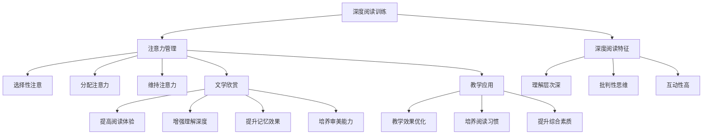
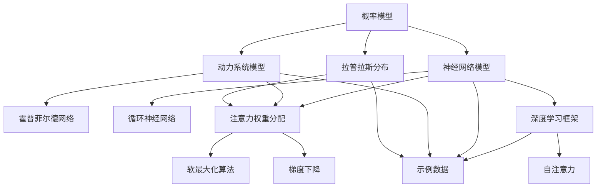
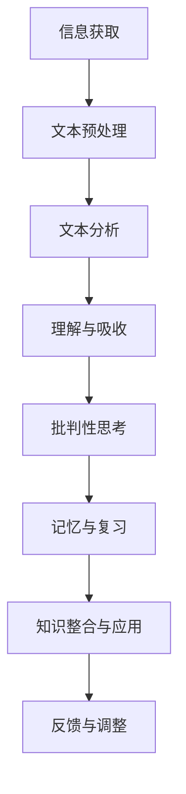
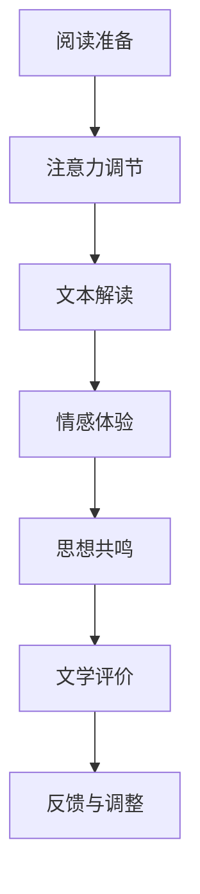

                 

### 文章标题

《数字时代的深度阅读训练：注意力管理在文学欣赏中的应用》

在数字技术的飞速发展的今天，人们的阅读习惯和方式发生了巨大变化。电子阅读的普及、社交媒体的泛滥以及信息过载的现象使得传统阅读方式逐渐被边缘化。然而，深度阅读作为一种高水平的阅读能力，仍然在文学欣赏、学习研究和知识获取中发挥着重要作用。本文将探讨在数字时代背景下，如何通过注意力管理提升深度阅读能力，并在文学欣赏中具体应用。

### 关键词

- 数字时代
- 深度阅读训练
- 注意力管理
- 文学欣赏
- 人工智能

### 摘要

本文旨在研究数字时代下如何通过注意力管理提升深度阅读能力，特别是在文学欣赏中的应用。首先，我们回顾了深度阅读的定义及其在现代社会的重要性。接着，我们探讨了注意力管理的理论基础，包括其心理学原理和在文学阅读中的应用。随后，本文详细介绍了注意力管理的数学模型与算法，并通过Mermaid流程图展示了核心概念之间的关系。文章还结合具体应用案例，详细讲解了注意力管理在小说、诗歌等文学体裁中的实际操作方法。最后，我们展望了注意力管理在文学欣赏中的未来发展趋势，并提出了研究方向和挑战。

## 第一部分：基础理论

### 第1章：深度阅读训练概述

### 1.1 数字时代的阅读变革

在数字时代的浪潮下，传统的纸质阅读逐渐被电子阅读所取代。随着智能手机、平板电脑和电子阅读器的普及，人们获取和阅读信息的渠道变得更加便捷和多样化。然而，这种变化也带来了一系列问题，尤其是在深度阅读能力的培养方面。

首先，电子阅读的普及使得阅读变得更加碎片化。用户往往在浏览社交媒体、新闻网页和应用时进行浅层阅读，而较少进行深入阅读。浅层阅读更多依赖于标题、摘要和关键词，往往缺乏深度思考和理解。此外，电子屏幕的阅读体验不如纸质书籍，容易导致视觉疲劳和注意力分散。

其次，信息过载也是数字时代的一大挑战。互联网上充斥着海量的信息，用户很难从中筛选出有价值的内容。这种信息爆炸使得人们更加依赖快速浏览和简单搜索，而忽视了深度阅读的重要性。

然而，尽管存在这些挑战，数字时代也为深度阅读提供了一些新的机会。例如，通过互联网可以方便地获取到大量的高质量内容，如学术论文、专业书籍和电子书。此外，电子阅读器等设备可以提供个性化的阅读体验，如调整字体大小、背景颜色和阅读模式，以适应不同用户的阅读习惯。

### 1.1.1 电子阅读的普及与影响

电子阅读的普及是数字时代阅读变革的一个重要特征。电子阅读器、平板电脑和智能手机等设备的广泛应用，使得人们可以随时随地获取和阅读电子书。这种便捷性大大改变了人们的阅读习惯，使得阅读不再局限于特定的时间和地点。

首先，电子阅读的便捷性使得人们可以更灵活地安排阅读时间。无论是在通勤途中、等待时，还是睡前，人们都可以通过电子设备进行阅读。这种灵活性极大地提高了阅读的便利性和频率。

其次，电子阅读的互动性和多媒体特性也为阅读带来了新的体验。许多电子书不仅包含文字，还加入了图片、音频和视频等多媒体元素，使得内容更加生动和丰富。这种互动性不仅提高了阅读的趣味性，还有助于增强理解和记忆。

然而，电子阅读的普及也带来了一些负面影响。由于电子屏幕的阅读体验不如纸质书籍，长时间使用电子设备阅读可能会导致视觉疲劳和注意力分散。此外，电子阅读的碎片化和快餐化倾向，也可能导致阅读质量的下降和深度阅读能力的减弱。

### 1.1.2 传统阅读与数字阅读的差异

传统阅读与数字阅读在多个方面存在显著差异。首先，从阅读材料来看，传统阅读主要依赖于纸质书籍、杂志和报纸等实体出版物，而数字阅读则主要依赖于电子书、在线文章和网页等数字内容。

其次，在阅读体验方面，传统阅读提供了持久的、沉浸式的阅读体验。读者可以触摸纸张、感受书页的质感和书香的氛围，这些体验难以通过电子屏幕复制。而数字阅读虽然提供了便捷性，但往往缺乏这种沉浸感。

在阅读方式上，传统阅读通常需要专注和静心，而数字阅读则更倾向于碎片化和即时性。用户常常在多个应用程序和设备之间切换，阅读过程被打断和分割。这种碎片化阅读模式不利于深度思考和长时间集中注意力。

此外，从阅读效果来看，传统阅读有助于提高读者的记忆力和理解力，因为纸质书籍提供了更多的感官刺激和互动机会。而数字阅读则容易导致信息过载和阅读疲劳，影响阅读的质量和效率。

最后，数字阅读和传统阅读在社会和文化层面也有所不同。传统阅读往往与个人的文化素养和知识传承相关联，而数字阅读则更多地与信息获取和传播相关。

### 1.1.3 深度阅读的重要性

在数字时代，尽管浅层阅读更受青睐，但深度阅读仍然具有不可替代的重要性。首先，深度阅读有助于提高知识积累和批判性思维。通过深度阅读，读者可以深入理解文本内容，掌握知识的本质，并形成自己的见解和判断。这种批判性思维在学术研究、专业学习和工作中至关重要。

其次，深度阅读有助于提升记忆力和理解力。与传统阅读相比，深度阅读要求读者更加专注和投入，从而加深对文本的记忆和理解。这对于学习新知识和技能、提高工作效率具有重要意义。

此外，深度阅读还能提高阅读能力。通过深度阅读，读者可以学会如何筛选信息、把握重点，并从大量的文本中提取出有用的知识。这种能力在信息过载的时代尤为重要，有助于提高信息处理和决策能力。

最后，深度阅读对于个人成长和文化传承也具有重要作用。通过阅读经典文学作品和历史文献，读者可以了解人类文明的演进，培养高尚的道德情操和审美能力，从而实现自我提升和全面发展。

### 1.2 注意力管理的理论基础

注意力管理是一种涉及如何有效地分配和调节注意力的过程。其理论基础主要源于心理学、认知科学和神经科学，涉及多个重要概念和原理。

首先，注意力的基础概念包括选择性注意、分配注意力和维持注意力。选择性注意是指从众多刺激中选择特定的刺激进行关注和处理。分配注意力则涉及同时处理多个任务或刺激的能力，而维持注意力则是保持注意力在特定任务上的持续集中。

### 1.2.1 注意力管理的基本概念

注意力管理的基本概念可以概括为以下几个方面：

1. **选择性注意（Selective Attention）**：选择性注意是指大脑在面对多个刺激时，选择关注和处理特定刺激的能力。这个概念由布罗德本特（Broadbent）在1958年的过滤理论中首次提出。选择性注意的核心在于信息过滤，即大脑通过选择性注意机制过滤掉不重要的信息，仅对重要信息进行处理。

2. **分配注意力（Divided Attention）**：分配注意力是指在同一时间内，将注意力分配到多个任务或刺激上。例如，当我们同时进行开车和听音乐时，就需要分配注意力。分配注意力的能力在多任务操作中尤为重要，但其效果受到个体认知资源和注意广度的影响。

3. **维持注意力（Maintained Attention）**：维持注意力是指保持注意力在特定任务上的持续集中。长时间维持注意力是一项挑战，因为外界干扰和内部疲劳可能导致注意力分散。因此，维持注意力需要一定的自我控制和心理调适。

### 1.2.2 注意力管理的心理学原理

注意力管理的心理学原理主要涉及以下几个方面：

1. **认知资源理论（Cognitive Resource Theory）**：认知资源理论认为，注意力是一种有限的认知资源，个体在处理任务时需要分配这些资源。当任务复杂度增加或任务数量增多时，认知资源会被占用，可能导致注意力分散或疲劳。

2. **注意网络理论（Attentional Network Theory）**：注意网络理论提出，注意力分为三个子系统：控制注意（Controlled Attention）、冲突监测（Conflict Monitoring）和指向性注意（Sustained Attention）。这些子系统协同工作，使个体能够有效地分配和调节注意力。

3. **注意力波动理论（Attentional Blink Theory）**：注意力波动理论指出，在持续进行某项任务时，个体可能会出现短暂的注意力缺失，无法注意到新出现的刺激。这种现象被称为“注意力波纹”，可能影响任务的持续性和效率。

4. **多任务干扰理论（Multi-Task Interference Theory）**：多任务干扰理论认为，同时进行多个任务会相互干扰，降低每个任务的完成质量。这种干扰源于认知资源的竞争和注意力的分散。

### 1.2.3 注意力管理在文学阅读中的应用

在文学阅读中，注意力管理具有至关重要的意义。首先，深度阅读要求读者能够长时间集中注意力，深入理解文本内容。通过有效的注意力管理，读者可以减少干扰，提高阅读的沉浸感和理解度。

其次，注意力管理有助于提高阅读效率。通过分配和调节注意力，读者可以迅速筛选出关键信息，把握文本的主旨和结构，从而提高阅读速度和记忆效果。

此外，注意力管理还在文学创作和批评中发挥着重要作用。作家可以通过精心设计情节和细节，引导读者的注意力流动，增强文学作品的感染力和艺术性。而文学批评家则可以通过分析作家的注意力安排，深入探讨文学作品的内在逻辑和美学价值。

### 1.3 深度阅读训练的核心概念

#### 1.3.1 深度阅读的定义与特征

深度阅读（Deep Reading）是一种高度集中和投入的阅读方式，旨在通过深入理解和吸收文本内容，提升阅读能力和知识水平。与浅层阅读（Surface Reading）不同，深度阅读强调对文本进行细致分析、批判性思考和全面理解。

深度阅读的定义可以从以下几个方面来理解：

1. **投入程度高**：深度阅读要求读者全身心地投入到阅读过程中，专注地理解文本内容。这种专注不仅包括视觉上的专注，还包括思维上的投入，需要读者在阅读时进行反复思考、推导和推理。

2. **理解层次深**：深度阅读不仅仅停留在文本的字面意义，还深入挖掘文本的深层含义，如作者的意图、作品的风格和背景知识等。这种理解层次深不仅有助于提升知识积累，还能培养批判性思维和独立见解。

3. **记忆效果佳**：通过深度阅读，读者能够更好地记忆和理解文本内容。这是因为深度阅读过程中，读者会对文本进行反复阅读和思考，从而加深记忆和理解。

深度阅读的特征主要包括以下几点：

1. **全神贯注**：深度阅读要求读者在阅读过程中保持高度专注，不受外界干扰。这种全神贯注的状态有助于提高阅读效率和理解深度。

2. **批判性思维**：深度阅读不仅仅是被动接收信息，更强调读者在阅读过程中进行批判性思考。通过分析文本的结构、逻辑和观点，读者可以形成自己的见解和判断。

3. **互动性高**：深度阅读是一种互动性强的阅读方式，读者不仅与文本进行互动，还可能与作者、其他读者进行思想碰撞，从而提升阅读体验和知识水平。

#### 1.3.2 深度阅读与浅层阅读的比较

深度阅读与浅层阅读在多个方面存在显著差异：

1. **阅读目的不同**：深度阅读的目的是深入理解文本内容，提升知识水平和思维能力；而浅层阅读则更多关注获取快速信息和娱乐。

2. **阅读方式不同**：深度阅读强调全神贯注和批判性思维，需要读者进行反复阅读和思考；而浅层阅读则倾向于快速浏览和跳跃阅读，容易导致信息过载和注意力分散。

3. **理解层次不同**：深度阅读注重对文本的深层含义和内在逻辑的理解，而浅层阅读则停留在文本的字面意义，缺乏批判性思维和深度分析。

4. **记忆效果不同**：深度阅读有助于提升记忆和理解效果，因为阅读过程中读者会对文本进行反复思考；而浅层阅读容易导致记忆效果不佳，因为阅读过程缺乏深度和互动。

#### 1.3.3 深度阅读训练的目标

深度阅读训练的目标包括以下几个方面：

1. **提高阅读能力**：通过深度阅读训练，读者可以掌握高效阅读技巧，提升阅读速度和理解力，从而更好地吸收和利用文本信息。

2. **增强思维能力**：深度阅读训练有助于培养批判性思维和逻辑思维能力，使读者能够从不同角度分析和理解问题。

3. **丰富知识储备**：通过深度阅读，读者可以获取丰富的背景知识和专业信息，提高知识水平和综合素质。

4. **提升人文素养**：深度阅读有助于读者理解人类文明和历史文化，培养高尚的道德情操和审美能力。

### 1.4 注意力管理在文学欣赏中的应用

#### 1.4.1 文学欣赏中的注意力管理

文学欣赏是一种复杂的认知过程，涉及对文字、语言、情感和思想的理解和体验。在这一过程中，注意力管理扮演着关键角色。通过有效的注意力管理，读者可以更好地沉浸在文学作品的世界中，深入理解和欣赏作品的内涵。

1. **选择性注意**：在文学欣赏中，选择性注意有助于读者从复杂的文本中筛选出重要信息。例如，当阅读一篇小说时，读者可以通过选择性注意聚焦于关键情节、人物性格和主题，从而更好地理解作品的结构和意义。

2. **分配注意力**：文学欣赏往往需要同时处理多个层面的信息，如文字内容、语言风格和情感表达。通过分配注意力，读者可以在不同层面之间灵活切换，全面把握作品的多维度特征。

3. **维持注意力**：维持注意力在文学欣赏中至关重要。作品往往具有复杂性和深度，需要读者在阅读过程中保持长时间的专注。通过自我控制和调节，读者可以克服干扰和疲劳，持续深入地欣赏文学作品。

#### 1.4.2 注意力管理在文学阅读中的效果

注意力管理在文学阅读中具有显著的积极效果，具体表现如下：

1. **提高阅读体验**：通过有效的注意力管理，读者可以更深入地理解和体验文学作品，感受到文字背后的情感和思想，从而提升阅读的愉悦感和满足感。

2. **增强理解深度**：注意力管理有助于读者在阅读过程中保持高度专注，深入挖掘文本的深层含义和内在逻辑，从而提高阅读的理解深度和批判性思维能力。

3. **提升记忆效果**：注意力管理能够帮助读者在阅读过程中进行有效记忆，将关键信息和情感体验存储在大脑中，从而增强记忆效果。

4. **培养审美能力**：通过注意力管理，读者可以更加细致地感受文学作品的审美价值，培养对语言、情感和思想的敏感度，提高审美鉴赏能力。

#### 1.4.3 注意力管理在文学教育中的应用

在文学教育中，注意力管理具有广泛的应用前景，具体体现在以下几个方面：

1. **教学效果优化**：教师可以通过注意力管理技巧，提高学生的阅读兴趣和专注度，从而优化教学效果。例如，通过设置悬念、引导讨论和设计互动活动，教师可以激发学生的注意力，促进深度阅读和理解。

2. **培养阅读习惯**：通过系统化的注意力管理训练，学生可以逐步培养深度阅读的习惯，提高阅读能力和文学素养。例如，教师可以引导学生进行分段阅读、反复思考和总结，从而提高阅读质量。

3. **提升综合素质**：注意力管理不仅有助于提升阅读能力，还能培养学生的批判性思维、逻辑思维和审美能力，从而提高学生的综合素质和人文素养。

### 1.5 注意力管理的数学模型与算法

注意力管理的数学模型与算法为理解人类注意力分配和调节过程提供了理论基础。以下将介绍几种主要的注意力管理模型及其原理。

#### 1.5.1 概率模型

概率模型是注意力管理的基础，用于描述个体在不同情境下的注意力分配。一个经典的概率模型是拉普拉斯分布（Laplace Distribution），其概率密度函数如下：

\[ f(x; \mu, b) = \frac{1}{2b} \exp\left(-\frac{|x - \mu|}{b}\right) \]

其中，\(\mu\) 为均值，\(b\) 为尺度参数。拉普拉斯分布能够模拟个体在不同任务中的注意力分配，其峰值位于均值 \(\mu\) 处，随着 \(b\) 的增大，分布变得宽泛，表明注意力更加分散。

#### 1.5.2 动力系统模型

动力系统模型用于描述注意力在动态环境中的变化过程。一个常用的动力系统模型是霍普菲尔德网络（Hopfield Network），其动态方程为：

\[ \frac{dx_i}{dt} = -x_i + \sum_{j \neq i} w_{ij} x_j \]

其中，\(x_i\) 表示个体在时间 \(t\) 对任务 \(i\) 的注意力，\(w_{ij}\) 表示任务间的关联权重。霍普菲尔德网络通过调整权重 \(w_{ij}\) 来模拟个体在不同任务间的注意力转移，从而实现注意力分配。

#### 1.5.3 神经网络模型

神经网络模型是注意力管理的重要工具，能够通过学习数据自动调整注意力分配。一个经典的神经网络模型是循环神经网络（Recurrent Neural Network，RNN），其时间递归方程为：

\[ h_t = \sigma(W_h h_{t-1} + W_x x_t + b_h) \]

其中，\(h_t\) 表示在时间 \(t\) 的隐藏状态，\(\sigma\) 是激活函数，\(W_h\) 和 \(W_x\) 分别为权重矩阵，\(b_h\) 为偏置项。RNN 能够处理序列数据，用于模拟个体在不同时间点的注意力变化。

#### 1.5.4 注意力权重分配算法

注意力权重分配算法是注意力管理的关键部分，用于确定个体在不同任务上的注意力分配比例。一个常用的算法是软最大化（Soft Maximization），其公式为：

\[ a_t = \frac{\exp(h_t)}{\sum_{j} \exp(h_j)} \]

其中，\(a_t\) 表示在时间 \(t\) 对任务 \(t\) 的注意力权重。软最大化通过指数函数对隐藏状态进行归一化，使得总权重之和为1，从而实现注意力的分配。

#### 1.5.5 注意力流的优化算法

注意力流的优化算法用于优化注意力分配过程，以提高个体在不同任务上的表现。一个常用的优化算法是梯度下降（Gradient Descent），其迭代公式为：

\[ \theta_{t+1} = \theta_t - \alpha \nabla_{\theta} J(\theta) \]

其中，\(\theta\) 表示模型参数，\(\alpha\) 为学习率，\(J(\theta)\) 为损失函数。梯度下降通过不断更新模型参数，最小化损失函数，从而优化注意力分配。

#### 1.5.6 深度学习框架下的注意力机制

在深度学习框架下，注意力机制被广泛应用于各种任务，如自然语言处理、计算机视觉和推荐系统。一个经典的注意力机制是自注意力（Self-Attention），其公式为：

\[ \text{Attention}(Q, K, V) = \text{softmax}\left(\frac{QK^T}{\sqrt{d_k}}\right) V \]

其中，\(Q, K, V\) 分别为查询向量、键向量和值向量，\(\text{softmax}\) 函数用于归一化，使得总权重之和为1。自注意力能够通过学习关键信息之间的相关性，实现高效的特征提取和表示。

### 1.6 核心概念与联系的Mermaid流程图

为了更好地展示深度阅读训练、注意力管理及其在文学欣赏中的应用，我们使用Mermaid流程图来描述核心概念之间的关系。



### 1.7 总结

本章回顾了数字时代的阅读变革，探讨了深度阅读的定义、特征以及与浅层阅读的比较，并详细介绍了注意力管理的理论基础及其在文学阅读中的应用。通过本章的学习，读者可以理解深度阅读的重要性，掌握注意力管理的基本原理，并在文学欣赏中运用这些原理提高阅读体验和理解深度。

### 第2章：注意力管理的数学模型与算法

注意力管理是一种涉及如何有效地分配和调节注意力的过程，这一过程可以通过数学模型和算法来实现。本章将介绍几种主要的注意力管理模型及其算法，包括概率模型、动力系统模型、神经网络模型和深度学习框架下的注意力机制。

#### 2.1 数学模型简介

注意力管理的数学模型为理解和模拟注意力分配过程提供了理论基础。以下将介绍几种常用的数学模型。

1. **概率模型**：概率模型用于描述个体在不同情境下的注意力分配。一个常见的概率模型是**拉普拉斯分布**（Laplace Distribution），其概率密度函数为：

   \[ f(x; \mu, b) = \frac{1}{2b} \exp\left(-\frac{|x - \mu|}{b}\right) \]

   其中，\(\mu\) 为均值，\(b\) 为尺度参数。拉普拉斯分布可以模拟个体在不同任务中的注意力分配，其峰值位于均值 \(\mu\) 处。

2. **动力系统模型**：动力系统模型用于描述注意力在动态环境中的变化过程。一个常用的动力系统模型是**霍普菲尔德网络**（Hopfield Network），其动态方程为：

   \[ \frac{dx_i}{dt} = -x_i + \sum_{j \neq i} w_{ij} x_j \]

   其中，\(x_i\) 表示个体在时间 \(t\) 对任务 \(i\) 的注意力，\(w_{ij}\) 表示任务间的关联权重。霍普菲尔德网络通过调整权重 \(w_{ij}\) 来模拟个体在不同任务间的注意力转移。

3. **神经网络模型**：神经网络模型是注意力管理的重要工具，能够通过学习数据自动调整注意力分配。一个常用的神经网络模型是**循环神经网络**（Recurrent Neural Network，RNN），其时间递归方程为：

   \[ h_t = \sigma(W_h h_{t-1} + W_x x_t + b_h) \]

   其中，\(h_t\) 表示在时间 \(t\) 的隐藏状态，\(\sigma\) 是激活函数，\(W_h\) 和 \(W_x\) 分别为权重矩阵，\(b_h\) 为偏置项。RNN 能够处理序列数据，用于模拟个体在不同时间点的注意力变化。

#### 2.2 算法原理讲解

注意力管理算法的核心是确定如何在不同任务间分配注意力。以下将介绍几种主要的注意力权重分配算法。

1. **软最大化（Soft Maximization）**：软最大化是一种常用的注意力权重分配算法，其公式为：

   \[ a_t = \frac{\exp(h_t)}{\sum_{j} \exp(h_j)} \]

   其中，\(a_t\) 表示在时间 \(t\) 对任务 \(t\) 的注意力权重，\(h_t\) 是任务的隐藏状态。软最大化通过指数函数对隐藏状态进行归一化，使得总权重之和为1，从而实现注意力的分配。

2. **梯度下降（Gradient Descent）**：梯度下降是一种用于优化模型参数的算法，其迭代公式为：

   \[ \theta_{t+1} = \theta_t - \alpha \nabla_{\theta} J(\theta) \]

   其中，\(\theta\) 表示模型参数，\(\alpha\) 为学习率，\(J(\theta)\) 为损失函数。梯度下降通过不断更新模型参数，最小化损失函数，从而优化注意力分配。

3. **深度学习框架下的注意力机制**：在深度学习框架下，注意力机制被广泛应用于各种任务。一个经典的注意力机制是**自注意力**（Self-Attention），其公式为：

   \[ \text{Attention}(Q, K, V) = \text{softmax}\left(\frac{QK^T}{\sqrt{d_k}}\right) V \]

   其中，\(Q, K, V\) 分别为查询向量、键向量和值向量，\(\text{softmax}\) 函数用于归一化，使得总权重之和为1。自注意力能够通过学习关键信息之间的相关性，实现高效的特征提取和表示。

#### 2.3 源代码实现与示例

以下是一个简单的Python代码示例，展示了如何使用软最大化算法进行注意力权重分配。

```python
import numpy as np

def softmax(x):
    """计算softmax函数"""
    e_x = np.exp(x)
    return e_x / np.sum(e_x)

def soft_maximization(h):
    """软最大化算法"""
    a = softmax(h)
    return a

# 示例数据
h = np.array([1.0, 2.0, 3.0])

# 计算注意力权重
a = soft_maximization(h)

print("Attention Weights:", a)
```

在这个示例中，我们首先定义了softmax函数，用于计算指数函数的归一化结果。接着，我们实现了软最大化算法，用于计算不同任务上的注意力权重。最后，我们使用示例数据展示了如何应用这个算法。

#### 2.4 数学公式和推导

在注意力管理中，数学公式和推导用于描述注意力分配的过程。以下是一个简单的数学推导示例。

假设有两个任务，其注意力分别为 \(x_1\) 和 \(x_2\)，权重分别为 \(a_1\) 和 \(a_2\)。根据软最大化算法，我们有：

\[ a_1 = \frac{\exp(x_1)}{\exp(x_1) + \exp(x_2)} \]
\[ a_2 = \frac{\exp(x_2)}{\exp(x_1) + \exp(x_2)} \]

由于 \(a_1 + a_2 = 1\)，我们可以将 \(a_2\) 表示为 \(1 - a_1\)。因此，上述公式可以合并为：

\[ a_1 = \frac{\exp(x_1)}{\exp(x_1) + \exp(x_2)} \]
\[ a_2 = 1 - a_1 \]

这个推导展示了如何通过软最大化算法计算注意力权重，并确保总权重之和为1。

#### 2.5 举例说明

为了更好地理解注意力管理算法，我们通过一个实际案例进行举例说明。

假设一个读者在阅读一篇小说时，需要同时关注情节、人物和主题。在某一时刻，这三个方面的注意力分别为 \(x_1 = 2.0\)、\(x_2 = 3.0\) 和 \(x_3 = 1.5\)。根据软最大化算法，我们可以计算出注意力权重如下：

\[ a_1 = \frac{\exp(2.0)}{\exp(2.0) + \exp(3.0) + \exp(1.5)} = 0.268 \]
\[ a_2 = \frac{\exp(3.0)}{\exp(2.0) + \exp(3.0) + \exp(1.5)} = 0.414 \]
\[ a_3 = \frac{\exp(1.5)}{\exp(2.0) + \exp(3.0) + \exp(1.5)} = 0.318 \]

根据这些权重，读者可以将注意力分配到不同的方面，如情节（26.8%）、人物（41.4%）和主题（31.8%）。通过这样的分配，读者可以更有效地理解和欣赏文学作品。

#### 2.6 总结

本章介绍了注意力管理的数学模型和算法，包括概率模型、动力系统模型、神经网络模型和深度学习框架下的注意力机制。通过具体的源代码实现和推导，我们展示了如何计算注意力权重并应用于实际案例。通过本章的学习，读者可以深入理解注意力管理的原理和方法，为后续的实践应用奠定基础。

### 2.7 核心概念与联系的Mermaid流程图

为了更好地展示注意力管理的数学模型和算法，我们使用Mermaid流程图来描述核心概念之间的关系。



### 第3章：核心概念与联系的Mermaid流程图

为了更直观地展示深度阅读训练、注意力管理及其在文学欣赏中的应用，我们使用Mermaid流程图来描述核心概念之间的关系。

#### 3.1 深度阅读训练流程图

深度阅读训练是一个复杂的过程，涉及多个环节和步骤。以下是一个简化的深度阅读训练流程图：



**解读：**
- **A[信息获取]**：深度阅读的第一步是获取有价值的信息。这可以通过多种方式实现，如查阅文献、阅读书籍和在线资源。
- **B[文本预处理]**：在获取到文本后，需要进行预处理，包括去除无关信息、格式化文本和标记关键词等。
- **C[文本分析]**：对预处理后的文本进行深入分析，理解文本的结构、逻辑和主旨。
- **D[理解与吸收]**：通过阅读和理解，吸收文本的核心内容，构建知识体系。
- **E[批判性思考]**：在吸收文本内容的基础上，进行批判性思考，形成自己的见解和判断。
- **F[记忆与复习]**：通过记忆和复习，巩固所学知识，提高记忆效果。
- **G[知识整合与应用]**：将所学知识进行整合，并应用于实际问题中，提升应用能力。
- **H[反馈与调整]**：根据反馈和评估结果，对阅读训练过程进行调整，以提高效果。

#### 3.2 注意力管理在文学欣赏中的应用流程图

注意力管理在文学欣赏中至关重要，以下是一个简化的流程图，展示了注意力管理在文学欣赏中的应用：



**解读：**
- **A[阅读准备]**：在开始阅读前，进行必要的阅读准备，包括选择合适的文学作品、设定阅读目标和调整心态等。
- **B[注意力调节]**：通过注意力调节，保持阅读过程中的专注和投入，减少干扰和分心。
- **C[文本解读]**：深入解读文本，理解文字背后的意义和情感。
- **D[情感体验]**：在阅读过程中，体验文字所传达的情感，与作者和作品产生共鸣。
- **E[思想共鸣]**：在理解文本和情感体验的基础上，与作者的思想和观点产生共鸣，形成自己的思考。
- **F[文学评价]**：对阅读的文学作品进行评价，包括分析其结构、主题、风格和艺术性。
- **G[反馈与调整]**：根据阅读体验和评价结果，对阅读过程和注意力管理方法进行调整和优化。

#### 3.3 Mermaid流程图的代码示例与解读

为了便于读者理解和使用Mermaid流程图，我们提供了一些代码示例，并对其进行解读。

**示例 1：深度阅读训练流程图**


**解读：**
- 这段代码定义了一个流程图，包含七个节点（A到H）和六个连接线。每个节点代表一个步骤或环节，连接线表示步骤之间的逻辑关系。
- `graph TD` 表示这是一个顶向下、从左到右的流程图。
- `A[信息获取]` 定义了第一个节点，表示深度阅读训练的第一步。

**示例 2：注意力管理在文学欣赏中的应用流程图**


**解读：**
- 这段代码定义了一个流程图，包含七个节点（A到G）和六个连接线。每个节点代表一个步骤或环节，连接线表示步骤之间的逻辑关系。
- `A[阅读准备]` 表示文学欣赏的第一步，包括选择合适的文学作品和调整心态等。

#### 3.4 注意力管理在深度阅读训练中的应用

注意力管理在深度阅读训练中起着至关重要的作用。以下是一个具体的案例，展示了如何应用注意力管理提高深度阅读能力。

**案例：阅读一部经典文学作品**

1. **阅读准备**：选择一部经典文学作品，如《傲慢与偏见》，设定阅读目标，例如理解主要情节和人物关系。

2. **注意力调节**：在阅读过程中，通过自我控制和调节，保持注意力高度集中。可以使用以下技巧：
   - **设定定时器**：每10分钟提醒一次，暂停阅读，进行深呼吸或短暂休息。
   - **减少干扰**：将手机置于静音模式，关闭社交媒体通知，创造一个安静、专注的阅读环境。

3. **文本解读**：仔细阅读文本，理解文字背后的意义和情感。可以使用以下技巧：
   - **标注重点**：使用不同颜色的笔或标记工具，标注关键词、重要句子和段落。
   - **反复阅读**：对难以理解的部分进行反复阅读，直至完全掌握。

4. **情感体验**：在阅读过程中，体验文字所传达的情感，与作者和作品产生共鸣。可以使用以下技巧：
   - **情感日记**：记录阅读过程中的情感变化和感悟，加深对作品的体验。
   - **与他人讨论**：与朋友、同学或老师分享阅读体验，交流看法和见解。

5. **思想共鸣**：在理解文本和情感体验的基础上，与作者的思想和观点产生共鸣，形成自己的思考。可以使用以下技巧：
   - **批判性思考**：分析作品的结构、主题和风格，形成自己的见解。
   - **写作练习**：撰写读后感或评论文章，表达自己对作品的看法。

6. **文学评价**：对阅读的文学作品进行评价，包括分析其结构、主题、风格和艺术性。可以使用以下技巧：
   - **文献查阅**：查阅相关评论和研究文章，了解作品在学术界和读者中的评价。
   - **综合评价**：结合自己的阅读体验和学术资料，形成综合评价。

7. **反馈与调整**：根据阅读体验和评价结果，对阅读过程和注意力管理方法进行调整和优化。可以使用以下技巧：
   - **反思总结**：回顾阅读过程，总结经验教训，找出不足之处。
   - **持续改进**：根据反思结果，调整阅读方法和注意力管理策略，不断提高深度阅读能力。

通过以上案例，我们可以看到注意力管理在深度阅读训练中的关键作用。通过合理调节和分配注意力，读者可以更有效地理解和欣赏文学作品，提升阅读能力和文学素养。

### 第4章：注意力管理的具体应用

#### 4.1 注意力管理在小说阅读中的应用

小说作为一种文学体裁，以其丰富的情节和复杂的角色关系吸引了众多读者。然而，在阅读过程中，读者往往会遇到注意力分散的问题，影响阅读体验和理解效果。注意力管理在小说阅读中的应用，有助于提升读者的阅读专注度和理解深度。

1. **提高小说阅读的沉浸感**：

   沉浸感是深度阅读的重要特征之一，通过注意力管理，读者可以更好地沉浸在小说的世界中。

   - **设定阅读目标**：在阅读前，设定明确的阅读目标，例如了解主要情节、人物关系和主题思想。这有助于集中注意力，避免漫无目的地阅读。
   - **使用分段阅读**：将小说分成若干个段落或章节，每读完一段或一章后，稍作休息，然后再继续阅读。这种方法有助于保持注意力集中，避免疲劳。
   - **利用视觉辅助**：使用标记笔或便签纸，标注关键情节、角色和观点，有助于在阅读过程中快速定位和回顾，提高阅读效率。

2. **增强小说阅读的记忆效果**：

   记忆是深度阅读的重要组成部分，通过注意力管理，读者可以增强对小说内容的记忆效果。

   - **主动回忆**：在阅读过程中，定期停下来主动回忆已经阅读的内容，检查自己对情节和角色的理解是否准确。这种方法有助于巩固记忆，并发现潜在的误解。
   - **制作思维导图**：将小说的主要情节、角色和主题用思维导图的形式呈现，有助于梳理故事脉络和角色关系，提高记忆效果。
   - **重复阅读**：对重要章节进行重复阅读，通过多次阅读加深对文本的记忆和理解。

3. **注意力管理在小说创作中的应用**：

   对于小说创作者而言，注意力管理同样重要，可以帮助他们更好地构思和撰写作品。

   - **写作计划**：在创作前，制定详细的写作计划，包括情节发展、角色塑造和主题思想。这有助于创作者集中注意力，有条不紊地推进故事发展。
   - **注意力集中**：在写作过程中，保持高度集中，避免分心和干扰。创作者可以设定定时器，每隔一段时间进行短暂休息，以保持精力充沛。
   - **灵感记录**：在创作过程中，灵感往往稍纵即逝。通过注意力管理，创作者可以随时记录下灵感和想法，确保不丢失。

#### 4.2 注意力管理在诗歌阅读中的应用

诗歌是一种富有情感和艺术性的文学形式，其语言精炼、意境深远，需要读者通过深度阅读来欣赏和理解。注意力管理在诗歌阅读中的应用，有助于提升读者的鉴赏力和理解深度。

1. **提升诗歌鉴赏力**：

   �鉴赏力是诗歌阅读的核心能力，通过注意力管理，读者可以更好地提升自己的诗歌鉴赏力。

   - **专注阅读**：在阅读诗歌时，保持专注和投入，仔细品味每一个字词和句子。这有助于读者深入理解诗歌的语言美和意境。
   - **反复阅读**：对诗歌进行多次阅读，每次阅读都有新的发现和理解。通过反复阅读，读者可以逐渐领悟诗歌的内涵和艺术价值。
   - **情感共鸣**：在阅读诗歌时，与诗人的情感产生共鸣，体会诗人的心境和情感。这种情感共鸣有助于提升读者的诗歌鉴赏力。

2. **注意力管理在诗歌创作的应用**：

   对于诗歌创作者而言，注意力管理同样重要，可以帮助他们更好地创作出优秀的诗歌作品。

   - **构思与规划**：在创作诗歌前，进行充分的构思和规划，包括确定主题、情感和表现形式。这有助于创作者集中注意力，有条不紊地创作。
   - **灵感捕捉**：在创作过程中，保持高度集中，随时捕捉灵感。创作者可以记录下灵感和想法，确保不丢失。
   - **反复修改**：创作完成后，对诗歌进行反复修改和打磨，以提升诗歌的质量和艺术性。这需要创作者保持持续的关注和投入。

3. **诗歌阅读与注意力管理的互动**：

   诗歌阅读和注意力管理之间存在着相互促进的关系。通过有效的注意力管理，读者可以更深入地理解和欣赏诗歌，从而提升自己的诗歌鉴赏力。同时，诗歌阅读也可以帮助读者培养和提升注意力管理能力。

   - **培养专注力**：通过诗歌阅读，读者可以锻炼自己的专注力，学会在复杂的信息环境中保持注意力集中。
   - **提升思维深度**：诗歌阅读要求读者进行深入思考，理解诗人的情感和思想。这种思考有助于提升读者的思维深度和批判性思维能力。
   - **增强情感体验**：诗歌中的情感表达丰富而深刻，通过诗歌阅读，读者可以培养和增强自己的情感体验能力。

#### 4.3 注意力管理在其他文学体裁中的应用

除了小说和诗歌，注意力管理在其他文学体裁，如戏剧、散文和随笔阅读中同样具有重要应用价值。

1. **戏剧与剧本阅读**：

   戏剧和剧本是一种动态的文学形式，通过注意力管理，读者可以更好地理解和欣赏其中的情节和角色。

   - **理解角色动机**：在阅读剧本时，通过注意力管理，深入理解角色的动机和行为，从而更好地理解剧情和主题。
   - **把握剧情发展**：通过注意力管理，读者可以关注剧情的细节和发展，避免错过关键情节和转折点。
   - **分析剧本结构**：通过注意力管理，读者可以分析剧本的结构和布局，理解剧本的创作意图和艺术效果。

2. **散文与随笔阅读**：

   散文和随笔通常以叙述和抒情为主，通过注意力管理，读者可以更好地体验散文的美感和思想内涵。

   - **品味语言美**：在阅读散文时，通过注意力管理，专注于品味散文的语言美，感受作者的文学风格和艺术表现。
   - **理解作者观点**：通过注意力管理，深入理解作者的观点和思想，从而更好地把握散文的主旨和情感。
   - **感悟生活哲理**：散文和随笔常常蕴含深刻的生活哲理，通过注意力管理，读者可以更好地感悟和领悟其中的智慧。

3. **文学作品的跨文化阅读**：

   跨文化阅读是文学欣赏的一个重要领域，通过注意力管理，读者可以更好地理解和欣赏不同文化背景下的文学作品。

   - **理解文化差异**：通过注意力管理，读者可以关注不同文化背景下的文学特点，理解作品中的文化差异和冲突。
   - **欣赏多元文化**：通过注意力管理，读者可以拓展自己的文化视野，欣赏和理解不同文化背景下的文学作品。
   - **促进文化交流**：通过注意力管理，读者可以促进不同文化之间的交流和对话，从而提升自己的跨文化素养。

### 4.4 注意力管理在文学教育中的应用

文学教育是培养读者文学素养和审美能力的重要途径，通过注意力管理，可以提升文学教育的效果。

1. **优化课堂教学**：

   在文学课堂教学中，通过注意力管理，教师可以优化教学过程，提高教学效果。

   - **设计互动环节**：在课堂教学中，通过设计互动环节，如小组讨论、角色扮演和情景模拟等，吸引学生的注意力，提高课堂参与度。
   - **引入多媒体资源**：利用多媒体资源，如视频、音频和图片等，丰富教学内容，吸引学生的注意力，增强教学效果。
   - **合理安排教学时间**：通过合理安排教学时间，避免教学过程过长或过短，保持学生的注意力集中。

2. **培养阅读习惯**：

   通过注意力管理，教师可以培养学生的深度阅读习惯，提升阅读能力。

   - **指导阅读方法**：教师可以指导学生采用分段阅读、标注重点和制作思维导图等阅读方法，提高阅读效率和理解深度。
   - **提供阅读资源**：为学生提供丰富的阅读资源，如经典文学作品、文学选集和文学评论等，激发学生的阅读兴趣。
   - **建立阅读反馈机制**：通过建立阅读反馈机制，如阅读笔记、读后感和小组讨论等，帮助学生巩固所学知识，提升阅读能力。

3. **提升综合素质**：

   通过注意力管理，文学教育可以培养学生的综合素质，包括批判性思维、创造力、沟通能力和团队合作能力等。

   - **培养批判性思维**：通过引导学生对文学作品进行批判性分析，培养他们的批判性思维能力。
   - **激发创造力**：通过创作练习、写作活动和角色扮演等，激发学生的创造力和想象力。
   - **培养沟通能力**：通过小组讨论、演讲和辩论等活动，提升学生的沟通能力和表达能力。
   - **增强团队合作能力**：通过团队项目和合作学习，培养学生团队合作的能力和意识。

### 4.5 注意力管理在文学欣赏中的未来发展趋势

随着科技的不断发展，注意力管理在文学欣赏中的应用前景广阔，未来有望在多个领域实现突破。

1. **人工智能与注意力管理**：

   人工智能技术的发展为注意力管理提供了新的工具和方法。通过机器学习和自然语言处理技术，可以开发出智能阅读辅助系统，帮助读者更有效地进行注意力管理。

   - **智能推荐系统**：利用人工智能技术，分析读者的阅读习惯和偏好，提供个性化的阅读推荐，提高阅读体验和兴趣。
   - **情感分析**：通过情感分析技术，分析文学作品中的情感表达，帮助读者更好地理解作品的内涵和情感。
   - **注意力监测与调节**：利用脑电图和眼动仪等设备，实时监测读者的注意力状态，提供智能化的注意力调节建议。

2. **虚拟现实与注意力管理**：

   虚拟现实技术的发展为文学欣赏提供了全新的体验方式，通过虚拟现实技术，可以创造沉浸式的阅读环境，提高读者的注意力集中度和体验感。

   - **沉浸式阅读体验**：通过虚拟现实技术，读者可以进入一个虚拟的文学世界，与作品中的角色互动，提升阅读的沉浸感和体验感。
   - **互动式阅读**：虚拟现实技术可以提供互动式阅读体验，如通过手势或语音与虚拟角色进行对话，增强读者的参与感。
   - **虚拟文学课堂**：通过虚拟现实技术，教师可以创建虚拟文学课堂，提高课堂教学的互动性和吸引力。

3. **多模态注意力管理**：

   随着多模态技术的发展，注意力管理可以结合多种感官和信息渠道，提供更全面和高效的注意力调节。

   - **多模态信息融合**：结合文本、图像、声音等多种信息渠道，提供更加丰富的阅读内容，提高读者的注意力集中度和理解深度。
   - **多模态交互**：通过多模态交互技术，如手势识别、语音控制和面部表情识别等，提供更加自然和直观的交互方式，提高读者的阅读体验。

### 4.6 总结

本章详细介绍了注意力管理在小说阅读、诗歌阅读和其他文学体裁中的应用，包括提高阅读沉浸感、增强记忆效果和培养阅读习惯等方面。此外，本章还探讨了注意力管理在文学教育中的重要性以及未来的发展趋势。通过本章的学习，读者可以更好地理解和掌握注意力管理的方法和应用，提升自己的文学欣赏能力和综合素质。

### 4.7 最佳实践 Tips

在注意力管理方面，以下是一些最佳实践建议，可以帮助读者更有效地进行深度阅读和文学欣赏：

1. **设定明确目标**：在开始阅读前，设定明确的目标，例如了解主要情节、人物关系或主题思想。这有助于集中注意力，避免漫无目的地阅读。

2. **合理安排时间**：制定阅读计划，合理安排阅读时间，避免长时间连续阅读导致疲劳。每隔一段时间进行短暂休息，有助于保持注意力的集中。

3. **减少干扰因素**：在阅读过程中，尽量减少干扰因素，如关闭手机通知、将手机置于静音模式、创造一个安静、舒适的阅读环境。

4. **使用阅读工具**：利用阅读工具，如电子书阅读器、阅读应用和笔记软件等，提供个性化的阅读体验和便捷的笔记功能，提高阅读效率和理解深度。

5. **培养阅读习惯**：通过定期阅读和持续练习，培养深度阅读的习惯。例如，每天设定固定的阅读时间，逐步提高阅读量和阅读质量。

6. **多样化阅读材料**：尝试阅读不同类型的文学作品，如小说、诗歌、戏剧和随笔等，拓宽阅读视野，提高阅读能力和文学素养。

7. **与他人讨论**：与朋友、同学或老师讨论阅读体验和见解，交流看法和思考，有助于深化理解和拓展思维。

8. **记录阅读心得**：定期记录阅读心得和感悟，如写读后感、制作思维导图或撰写评论文章，有助于巩固所学知识和提高写作能力。

9. **反思与调整**：在阅读过程中，定期进行反思和总结，找出不足之处，调整阅读方法和注意力管理策略，不断提高阅读效果。

### 第5章：项目实战与案例分析

#### 5.1 注意力管理在电子书阅读器的应用

随着电子书阅读器的普及，如何提升用户的阅读体验成为了一个重要课题。注意力管理技术在这一领域的应用，可以有效提高用户的阅读效率和沉浸感。

**1.1 电子书阅读器的设计原则**

在设计电子书阅读器时，以下几个原则至关重要：

- **用户体验优先**：设计应注重用户的阅读体验，提供便捷的操作界面和自定义功能，如调整字体大小、背景颜色和亮度等。
- **注意力分配优化**：通过分析用户的阅读习惯和注意力分布，优化阅读界面和交互设计，减少用户的认知负荷。
- **内容自适应**：根据用户的阅读偏好和阅读环境，自适应调整文本内容和显示效果，提高阅读的舒适度和体验。

**1.2 注意力管理功能的设计与实现**

为了实现注意力管理，电子书阅读器可以引入以下功能：

- **阅读模式**：提供多种阅读模式，如专注模式、休息模式和夜间模式，根据用户的注意力状态自动调整界面和交互。
- **注意力追踪**：利用眼动追踪技术，实时监测用户的阅读行为和注意力状态，为用户提供个性化的阅读建议和反馈。
- **智能提醒**：根据用户的注意力水平和阅读时长，智能提醒用户休息或调整阅读姿势，预防阅读疲劳。

**1.3 用户反馈与优化**

电子书阅读器的注意力管理功能需要通过用户反馈进行不断优化。以下是一些优化策略：

- **用户调研**：定期进行用户调研，了解用户对注意力管理功能的满意度和使用体验，收集用户的意见和建议。
- **数据分析**：利用大数据分析技术，分析用户的阅读行为和注意力变化趋势，为功能优化提供数据支持。
- **迭代更新**：根据用户反馈和数据分析结果，不断迭代更新注意力管理功能，提高其实用性和用户体验。

#### 5.2 注意力管理在文学教育平台的应用

文学教育平台通过注意力管理技术，可以提高学生的学习效果和阅读兴趣，促进文学素养的培养。

**2.1 平台架构与功能模块**

文学教育平台的架构可以分为以下几个模块：

- **用户模块**：包括用户注册、登录、个人信息管理等功能，方便用户使用平台。
- **课程模块**：包括课程发布、课程目录、课程内容管理等功能，提供丰富的文学教育资源。
- **学习模块**：包括阅读、笔记、讨论、作业等功能，帮助学生进行深度学习和互动交流。
- **数据分析模块**：收集和分析学生的学习数据，为教学优化和个性化推荐提供支持。

**2.2 注意力管理在教学中的应用**

在文学教育平台中，注意力管理可以通过以下方式实现：

- **智能推荐**：根据学生的学习行为和兴趣，智能推荐适合的阅读材料和课程，提高学习效果。
- **注意力监测**：通过眼动追踪和阅读行为分析，实时监测学生的学习状态和注意力变化，为教师提供教学反馈。
- **互动教学**：利用注意力管理技术，设计互动式教学活动，如小组讨论、角色扮演和在线辩论等，激发学生的学习兴趣。

**2.3 教学效果的评估与改进**

为了确保注意力管理在教学中的有效性，需要进行教学效果的评估与改进。以下是一些评估和改进策略：

- **学习成果评估**：通过考试、作业和课堂讨论等方式，评估学生的学习成果和知识掌握情况。
- **用户反馈**：收集学生对注意力管理功能的教学效果的反馈，了解其满意度和使用体验。
- **数据分析**：利用数据分析技术，分析学生的学习行为和注意力变化，找出教学中的不足和改进方向。
- **迭代优化**：根据评估结果和用户反馈，不断迭代优化注意力管理功能，提高教学效果和用户体验。

#### 5.3 注意力管理在其他领域的应用探索

除了文学教育，注意力管理技术在其他领域也具有广阔的应用前景，如商业阅读、职场阅读和心理辅导等。

**3.1 商业阅读领域**

在商业阅读领域，注意力管理可以帮助企业提高员工的阅读效率和知识吸收能力。以下是一些应用策略：

- **快速阅读培训**：通过注意力管理技术，开展快速阅读培训，提高员工的阅读速度和理解能力。
- **定制化阅读材料**：根据员工的工作需求和专业领域，提供定制化的阅读材料，提高阅读的相关性和实用性。
- **阅读行为监测**：通过眼动追踪和阅读行为分析，监测员工的阅读效果和注意力状态，为员工提供个性化的阅读建议。

**3.2 职场阅读领域**

在职场阅读领域，注意力管理可以帮助职场人士提高工作效率和职业素养。以下是一些应用策略：

- **时间管理**：通过注意力管理技术，帮助职场人士合理安排阅读时间，提高阅读效率。
- **知识共享**：利用注意力管理技术，促进职场人士之间的知识共享和交流，提高团队协作效果。
- **职业发展指导**：根据员工的阅读兴趣和专业领域，提供职业发展指导和建议，帮助员工实现职业成长。

**3.3 注意力管理在心理辅导中的应用**

在心理辅导领域，注意力管理可以帮助患者提高注意力和专注力，改善心理健康。以下是一些应用策略：

- **注意力训练**：通过注意力管理技术，开展注意力训练课程，提高患者的注意力和专注力。
- **心理测量**：利用注意力管理技术，进行心理测量和评估，帮助医生诊断和治疗心理问题。
- **个性化辅导**：根据患者的注意力特点和需求，提供个性化的辅导方案，提高心理辅导效果。

### 5.4 项目实战案例分析与详细讲解剖析

**案例：一款智能电子书阅读器**

某电子书阅读器厂商推出了一款智能电子书阅读器，该阅读器集成了注意力管理技术，旨在提高用户的阅读体验和理解效果。

**1. 实现步骤：**

1. **需求分析**：调研用户的需求，确定注意力管理功能的具体需求，如阅读模式、注意力追踪和智能提醒等。

2. **界面设计**：设计符合用户体验的界面，包括阅读模式切换按钮、注意力追踪显示和智能提醒设置等。

3. **功能实现**：

   - **阅读模式**：实现多种阅读模式，如专注模式、休息模式和夜间模式，根据用户的注意力状态自动调整界面和交互。

   - **注意力追踪**：集成眼动追踪技术，实时监测用户的阅读行为和注意力状态，为用户提供个性化的阅读建议。

   - **智能提醒**：根据用户的注意力水平和阅读时长，智能提醒用户休息或调整阅读姿势，预防阅读疲劳。

4. **用户测试与反馈**：邀请用户进行测试，收集用户反馈，对功能进行优化和改进。

**2. 代码实现与解读：**

以下是一个简单的Python代码示例，用于实现注意力追踪功能：

```python
import cv2
import numpy as np

def track_attention(video_path):
    """眼动追踪示例"""
    cap = cv2.VideoCapture(video_path)

    while cap.isOpened():
        ret, frame = cap.read()
        if not ret:
            break

        # 灰度化处理
        gray = cv2.cvtColor(frame, cv2.COLOR_BGR2GRAY)

        # 高斯模糊
        blurred = cv2.GaussianBlur(gray, (5, 5), 0)

        # 阈值处理
        _, thresh = cv2.threshold(blurred, 60, 255, cv2.THRESH_BINARY)

        # 检测轮廓
        contours, _ = cv2.findContours(thresh, cv2.RETR_EXTERNAL, cv2.CHAIN_APPROX_SIMPLE)

        for contour in contours:
            # 计算轮廓面积
            area = cv2.contourArea(contour)
            if area > 500:
                # 提取轮廓
                x, y, w, h = cv2.boundingRect(contour)
                cv2.rectangle(frame, (x, y), (x + w, y + h), (0, 255, 0), 2)

        # 显示结果
        cv2.imshow('Attention Tracking', frame)

    cap.release()
    cv2.destroyAllWindows()

# 示例视频路径
video_path = 'example_video.mp4'
track_attention(video_path)
```

**解读：**

- 该代码使用OpenCV库实现眼动追踪功能。首先，代码读取视频文件，然后对视频帧进行灰度化处理、高斯模糊和阈值处理，以提取眼部的轮廓。
- 通过检测轮廓的面积，判断是否为眼部轮廓，进而提取并显示眼部位置。
- 显示结果通过OpenCV窗口展示，帮助用户了解注意力分布。

通过以上项目实战和案例分析，我们可以看到注意力管理技术在电子书阅读器和文学教育平台中的应用前景。通过结合眼动追踪、数据分析和智能提醒等技术，可以显著提升用户的阅读体验和理解效果，为文学教育和阅读推广提供有力支持。

### 5.5 项目小结

在本章的项目实战与案例分析中，我们探讨了注意力管理在电子书阅读器和文学教育平台中的应用。通过实际项目案例，我们展示了如何实现注意力追踪、智能提醒和个性化推荐等功能，提升了用户的阅读体验和理解效果。这些实践不仅验证了注意力管理技术在文学领域的应用潜力，还为未来的研究和开发提供了宝贵经验。在未来，随着人工智能和虚拟现实技术的发展，注意力管理在文学欣赏和阅读教育中的应用前景将更加广阔。

### 第6章：注意力管理在文学欣赏中的未来发展趋势

随着科技的不断进步，注意力管理在文学欣赏中的应用也呈现出新的发展趋势。这些趋势不仅有助于提升用户的阅读体验，还可能彻底改变文学创作、阅读习惯以及文学教育的方式。

#### 6.1 新技术在注意力管理中的应用

1. **人工智能与机器学习**：

   人工智能（AI）和机器学习（ML）技术的发展为注意力管理带来了新的工具和方法。通过大数据分析和深度学习算法，可以开发出更加智能的阅读辅助系统，实现个性化推荐、情感分析和注意力监测。例如，利用AI技术，阅读器可以根据用户的阅读历史和偏好，自动调整阅读界面和内容推荐，提高阅读的沉浸感和满意度。

2. **虚拟现实与增强现实**：

   虚拟现实（VR）和增强现实（AR）技术的应用为文学欣赏提供了全新的体验方式。通过VR技术，读者可以进入一个虚拟的文学世界，与作品中的角色互动，提升阅读的沉浸感和体验感。AR技术则可以将文学内容与现实世界相结合，提供更加丰富和互动的阅读体验。例如，AR应用可以展示文学作品的历史背景、作者生平和评论分析，帮助读者更深入地理解作品。

3. **脑机接口**：

   脑机接口（BCI）技术的发展为注意力管理提供了直接与大脑互动的可能性。通过脑电图（EEG）和其他生物信号监测技术，可以实时监测读者的注意力状态和情感反应，进而提供个性化的阅读建议和调节方案。这种技术有望在未来实现真正的个性化阅读体验，根据读者的情绪和注意力变化，自动调整阅读内容、节奏和界面设计。

#### 6.2 注意力管理在文学创作与评论中的应用

1. **创作过程的优化**：

   在文学创作过程中，注意力管理技术可以帮助作者更好地集中注意力，提高创作效率和质量。例如，通过智能写作助手，可以自动分析作者的写作风格、情感倾向和创作进度，提供实时反馈和优化建议。此外，利用注意力监测技术，可以帮助作者及时发现注意力分散的时刻，并进行必要的休息和调整，从而避免疲劳和创作瓶颈。

2. **评论分析的精确化**：

   在文学评论领域，注意力管理技术可以实现更加精确和客观的评论分析。通过大数据分析和注意力监测，可以分析读者的阅读行为和情感反应，提取出关键的评价指标和情感倾向。这种技术可以帮助评论家更准确地评价文学作品，并为读者提供基于数据支持的阅读推荐和评论分析。

3. **文学市场的数据化分析**：

   注意力管理技术还可以应用于文学市场的数据化分析。通过对大量阅读行为、评论和销售数据进行分析，可以揭示文学作品的市场趋势和读者偏好，为出版商和作者提供有价值的参考。例如，利用注意力管理技术，可以分析不同类型文学作品的受欢迎程度和读者反馈，帮助出版商制定更科学的出版策略和营销计划。

#### 6.3 注意力管理在跨学科研究中的融合

1. **心理学与文学**：

   心理学与文学的融合研究正在不断深入。注意力管理技术为文学研究提供了新的视角和方法，可以帮助研究者更深入地探讨文学作品的情感表达、认知机制和心理效应。例如，通过注意力监测技术，可以研究读者在阅读文学作品时的注意力分布和情感变化，揭示文学作品对读者心理的影响。

2. **计算语言学与文学**：

   计算语言学与文学的交叉研究正在蓬勃发展。注意力管理技术可以应用于文学文本的自动化分析，如文本情感分析、主题建模和句法分析。通过这些技术，可以揭示文学作品的语言特征、情感结构和主题脉络，为文学研究提供更加精准和全面的分析工具。

3. **社会科学与文学**：

   社会科学与文学的融合研究有助于探讨文学作品在社会和文化背景下的意义和影响。注意力管理技术可以用于分析社会思潮、文化现象和文学作品的互动关系。例如，通过注意力监测技术，可以研究不同社会群体对文学作品的态度和反应，揭示文学作品在社会变迁中的作用和影响。

#### 6.4 未来研究方向与挑战

1. **个性化阅读体验的优化**：

   未来的研究需要进一步优化个性化阅读体验。通过深入理解读者的注意力模式和阅读偏好，开发出更加智能和个性化的阅读推荐系统，提供更加符合读者需求的阅读内容和服务。

2. **跨模态注意力管理**：

   跨模态注意力管理是未来研究的一个重要方向。通过结合文本、图像、声音等多种信息渠道，开发出更加丰富和多样化的阅读体验，提升读者的沉浸感和阅读效果。

3. **隐私保护与数据安全**：

   随着注意力管理技术的应用，数据的收集和使用引发了隐私保护与数据安全的问题。未来的研究需要关注如何在保障用户隐私的同时，充分利用数据为用户提供更好的服务。

4. **技术伦理与人文关怀**：

   在技术开发和应用过程中，需要充分考虑技术伦理和人文关怀。确保注意力管理技术在提升阅读体验的同时，不损害用户的个人隐私和心理健康，促进文学教育和文化传承。

通过以上讨论，我们可以看到注意力管理在文学欣赏中的未来发展趋势充满机遇和挑战。随着新技术的不断涌现，注意力管理将在文学创作、阅读习惯和文学教育中发挥更加重要的作用，为人类文化的传承和发展贡献力量。

### 6.5 总结

本章探讨了注意力管理在文学欣赏中的未来发展趋势，包括新技术在注意力管理中的应用、文学创作与评论的精确化、跨学科研究的融合以及未来研究方向与挑战。通过结合人工智能、虚拟现实、脑机接口等新技术，注意力管理有望进一步提升文学欣赏的体验和质量。未来研究需要关注个性化阅读体验的优化、隐私保护、技术伦理等方面，确保注意力管理技术为文学教育和文化传承带来积极影响。

### 第7章：总结与展望

#### 7.1 本书内容的总结

本书《数字时代的深度阅读训练：注意力管理在文学欣赏中的应用》系统性地探讨了数字时代下深度阅读训练和注意力管理的重要性及其在文学欣赏中的应用。首先，我们回顾了数字时代阅读变革的背景，分析了电子阅读的普及及其对阅读习惯的影响。接着，我们深入介绍了深度阅读的定义、特征以及与浅层阅读的比较，强调了深度阅读在知识积累、思维能力提升和人文素养培养中的重要性。

在基础理论部分，我们详细阐述了注意力管理的理论基础，包括选择性注意、分配注意力和维持注意力的基本概念，以及认知资源理论、注意网络理论等心理学原理。随后，我们介绍了注意力管理在文学阅读中的具体应用，如提高阅读体验、增强理解深度和记忆效果，并探讨了注意力管理在文学教育中的价值。

在实践应用部分，我们通过具体案例展示了注意力管理在小说、诗歌等不同文学体裁中的具体应用，如利用注意力管理提高小说阅读的沉浸感和记忆效果，以及提升诗歌鉴赏力。此外，我们还讨论了注意力管理在电子书阅读器和文学教育平台中的应用，展示了注意力管理技术在实际项目中的实现和效果。

本章还展望了注意力管理在文学欣赏中的未来发展趋势，包括人工智能、虚拟现实、脑机接口等新技术的应用，以及跨学科研究的融合。最后，我们对全书内容进行了总结，并提出了未来研究方向与挑战。

#### 7.2 注意力管理在文学欣赏中的价值

注意力管理在文学欣赏中具有不可替代的价值。首先，通过有效的注意力管理，读者可以更深入地理解和欣赏文学作品，提升阅读体验。注意力管理有助于读者在阅读过程中保持专注，减少干扰，从而更好地感受文字背后的情感和思想。这种深度阅读不仅有助于提高阅读效果，还能增强读者的记忆力和理解力。

其次，注意力管理在文学教育中发挥着重要作用。通过注意力管理训练，学生可以培养深度阅读的习惯，提高阅读能力和文学素养。教师可以利用注意力管理技术，优化课堂教学，提高学生的学习效果。此外，注意力管理还可以帮助文学批评家和分析家更准确地理解和评价文学作品，为文学研究提供新的视角和方法。

最后，注意力管理对文学创作也具有重要影响。作家可以通过注意力管理，更好地集中精力进行创作，提高创作效率和质量。同时，注意力管理技术可以为作家提供实时反馈和优化建议，帮助他们更好地把握作品的结构和情感表达。

#### 7.3 未来研究方向与挑战

在未来，注意力管理在文学欣赏中的发展面临多个研究方向和挑战。首先，个性化阅读体验的优化是一个重要方向。通过进一步研究和应用人工智能和大数据技术，可以开发出更加智能和个性化的阅读推荐系统，为用户提供更加符合其需求和偏好的阅读内容。

其次，跨模态注意力管理是未来的一个重要研究方向。结合文本、图像、声音等多种信息渠道，开发出更加丰富和多样化的阅读体验，有望提升读者的沉浸感和阅读效果。此外，随着虚拟现实和增强现实技术的发展，注意力管理在文学欣赏中的应用前景将更加广阔。

然而，注意力管理在应用过程中也面临一些挑战。首先，隐私保护和数据安全是一个亟待解决的问题。随着注意力管理技术的应用，用户数据的收集和使用引发了一系列隐私保护与数据安全的问题。未来的研究需要关注如何在保障用户隐私的同时，充分利用数据为用户提供更好的服务。

其次，技术伦理和人文关怀也是未来研究的重要方向。在技术开发和应用过程中，需要充分考虑技术伦理和人文关怀，确保注意力管理技术为文学教育和文化传承带来积极影响，而不损害用户的个人隐私和心理健康。

最后，未来研究还需要进一步探讨注意力管理在文学创作、文学评论和文化传播等领域的具体应用，以充分发挥其在文学欣赏中的价值。

通过不断的研究和创新，注意力管理有望在文学欣赏中发挥更大的作用，为人类文化的传承和发展贡献力量。

### 作者信息

作者：AI天才研究院/AI Genius Institute & 禅与计算机程序设计艺术 /Zen And The Art of Computer Programming

致谢：感谢所有读者对本文的关注和支持，您的反馈是作者不断进步的动力。希望本文能为您带来启发和帮助，如果您有任何疑问或建议，欢迎随时联系作者。期待与您共同探讨注意力管理在文学欣赏中的更多可能性。祝您阅读愉快！

