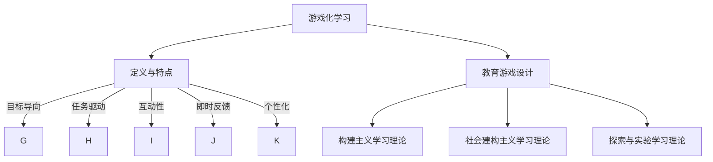

                 

# 《数字时代的游戏化学习：教育游戏设计的理论与实践》

> 关键词：游戏化学习、教育游戏设计、理论框架、实践策略、技术融合、未来趋势

> 摘要：随着数字技术的快速发展，游戏化学习作为一种创新的教育模式，正日益受到关注。本文首先介绍了游戏化学习的定义和特点，探讨了其在教育领域的重要性。接着，文章从理论基础、设计原则、游戏类型、设计流程、评价反馈以及案例分析等多个方面，系统阐述了教育游戏设计的理论与实践。最后，文章探讨了游戏化学习的未来发展趋势，为教育工作者提供了有益的参考。

## 第1章 引言

### 1.1 数字时代与游戏化学习的崛起

在数字技术快速发展的时代，互联网、人工智能、虚拟现实等新兴技术为教育领域带来了前所未有的变革。传统的课堂教学模式逐渐被数字化、个性化、互动性的学习方式所取代。在这种背景下，游戏化学习作为一种新兴的教育模式，逐渐崛起并受到广泛关注。

游戏化学习（Gamification Learning）是指将游戏的元素、机制和设计理念应用于非游戏情境中，以达到教育目标的一种学习模式。它通过激发学习者的兴趣、动机和参与度，提升学习效果。游戏化学习不仅强调知识的传授，更注重学习者的体验和参与，从而实现深度学习和全面发展。

### 1.2 教育游戏设计的重要性

教育游戏设计是将游戏化学习理念应用于教学实践的关键环节。它不仅要求游戏设计者具备深厚的教育理论素养，还需要掌握先进的技术手段和设计方法。教育游戏设计的重要性主要体现在以下几个方面：

1. **提高学习兴趣和动机**：游戏化学习通过引入游戏机制和元素，如积分、奖励、挑战等，能够激发学习者的好奇心和探索欲，提高学习兴趣和动机。

2. **增强学习效果**：教育游戏设计注重学习者的互动和参与，通过任务驱动和问题导向的方式，引导学习者主动探索和思考，从而提高学习效果。

3. **促进个性化学习**：教育游戏设计可以根据学习者的特点和需求，提供个性化的学习路径和资源，实现差异化教学。

4. **培养综合素质**：教育游戏设计不仅涵盖知识传授，还注重培养学习者的团队合作、沟通表达、创新思维等综合素质。

### 1.3 本书的目的与结构

本书旨在系统阐述游戏化学习在数字时代的教育应用，特别是教育游戏设计理论与实践。全书分为八个章节，具体结构如下：

- 第1章：引言，介绍游戏化学习的背景和重要性。
- 第2章：游戏化学习的基础理论，探讨游戏化学习的定义、特点及其理论框架。
- 第3章：游戏化学习的设计原则，讨论教育目标、学习体验、游戏平衡性等方面的设计原则。
- 第4章：教育游戏的类型与特点，介绍仿真游戏、角色扮演游戏、竞争与合作游戏等不同类型的游戏及其在教育中的应用。
- 第5章：教育游戏的设计流程，阐述游戏设计的需求分析、设计、开发、测试与优化等流程。
- 第6章：游戏化学习的评价与反馈，讨论评价指标体系、反馈机制设计以及游戏化学习的持续改进。
- 第7章：游戏化学习案例分析，通过具体案例展示游戏化学习的实践效果。
- 第8章：游戏化学习的未来发展趋势，探讨技术驱动的游戏化学习创新以及教育游戏设计的挑战与机遇。

## 第2章 游戏化学习的基础理论

### 2.1 游戏化学习的定义与特点

游戏化学习是一种将游戏元素和机制引入非游戏情境，以促进学习的行为和过程。它不仅仅是在学习中加入一些游戏化的元素，如积分、奖励等，而是要深刻理解游戏的本质，并将其应用于学习环境中。游戏化学习的核心特点是：

1. **目标导向**：游戏化学习通过设定明确的学习目标，引导学习者有目的地进行学习。

2. **任务驱动**：游戏化学习通过设置一系列的任务和挑战，激发学习者的兴趣和动机。

3. **互动性**：游戏化学习强调学习者之间的互动和合作，促进知识共享和共同成长。

4. **即时反馈**：游戏化学习通过实时反馈，帮助学习者及时了解自己的学习状态，调整学习策略。

5. **个性化**：游戏化学习可以根据学习者的特点和需求，提供个性化的学习路径和资源。

### 2.2 教育游戏设计的理论框架

教育游戏设计是游戏化学习的重要组成部分，其理论基础涵盖了多种学习理论和设计理念。以下是几种主要的理论框架：

#### 2.2.1 构建主义学习理论

构建主义学习理论认为，学习是一个主动构建知识的过程，学习者通过与环境互动，主动构建自己的认知结构。教育游戏设计中的任务驱动和问题导向学习方式，正是基于这一理论，通过设置问题和挑战，引导学习者主动探索和构建知识。

#### 2.2.2 社会建构主义学习理论

社会建构主义学习理论强调学习者在社会互动中构建知识的过程。教育游戏设计中的合作和竞争机制，可以促进学习者之间的交流和互动，共同解决问题，从而加深对知识的理解和应用。

#### 2.2.3 探索与实验学习理论

探索与实验学习理论认为，学习是通过尝试和实验来发现和验证知识的。教育游戏设计中的模拟环境和实验功能，可以提供真实的操作体验，帮助学习者更好地理解和掌握知识。

### 2.3 核心概念实体之间的关系架构

为了更好地理解游戏化学习中的核心概念，我们可以使用Mermaid流程图来展示它们之间的关系：



通过上述流程图，我们可以清晰地看到游戏化学习与教育游戏设计之间的关系，以及教育游戏设计如何与不同的学习理论相结合，形成有效的学习模式。

### 2.4 核心算法原理讲解

在游戏化学习的设计过程中，算法原理起着关键作用。以下是几个核心算法原理及其在游戏化学习中的应用：

#### 2.4.1 排行榜算法

排行榜算法用于记录和显示学习者的成绩和排名，激励学习者竞争和进步。其基本原理如下：

```python
def rank_players(players_scores):
    sorted_players = sorted(players_scores.items(), key=lambda item: item[1], reverse=True)
    return [player for player, score in sorted_players]
```

#### 2.4.2 分级算法

分级算法根据学习者的表现和进步，将其划分为不同的等级，以便提供个性化的学习资源。其基本原理如下：

```python
def assign_level(score):
    if score < 30:
        return "入门"
    elif score >= 30 and score < 60:
        return "初级"
    elif score >= 60 and score < 90:
        return "中级"
    else:
        return "高级"
```

#### 2.4.3 反馈算法

反馈算法用于根据学习者的表现，提供即时的反馈和指导，帮助其改进学习策略。其基本原理如下：

```python
def give_feedback(action, expected, actual):
    if action == expected:
        return "恭喜你，回答正确！"
    else:
        return f"回答错误，请重新考虑：{actual}"
```

通过上述算法，我们可以更好地实现游戏化学习中的目标导向、任务驱动、即时反馈和个性化等核心特点，提高学习效果。

### 2.5 数学模型和公式

在游戏化学习的设计过程中，数学模型和公式起着重要作用。以下是几个常用的数学模型和公式：

#### 2.5.1 学习曲线模型

学习曲线模型描述了学习者在学习过程中成绩的变化趋势。其基本公式如下：

$$
\text{学习曲线} = \frac{\text{当前成绩}}{\text{初始成绩}} \times 100\%
$$

#### 2.5.2 适应度函数

适应度函数用于评估学习者在游戏化学习中的适应度，其基本公式如下：

$$
\text{适应度} = \frac{\text{当前积分}}{\text{目标积分}}
$$

#### 2.5.3 奖励函数

奖励函数用于计算学习者在完成任务后获得的奖励，其基本公式如下：

$$
\text{奖励} = \text{基础奖励} + \text{额外奖励}
$$

通过这些数学模型和公式，我们可以更好地量化学习者的学习过程和成果，为游戏化学习的设计提供有力支持。

### 2.6 综述

游戏化学习作为一种创新的教育模式，其理论基础涵盖了多种学习理论和设计理念。通过定义游戏化学习的核心特点，阐述教育游戏设计的理论框架，以及分析核心概念实体之间的关系，我们为后续章节的深入探讨奠定了基础。在接下来的章节中，我们将进一步探讨游戏化学习的设计原则、游戏类型、设计流程、评价与反馈以及未来发展趋势，为教育工作者提供有益的参考。

## 第3章 游戏化学习的设计原则

### 3.1 教育目标与游戏机制

在游戏化学习的设计过程中，明确教育目标是非常重要的。教育目标是指通过学习活动，希望学习者达到的具体能力和素质。游戏化学习中的教育目标与传统教学不同，它不仅关注知识传授，更注重学习者的体验和参与。

#### 3.1.1 教育目标的制定

制定教育目标时，应遵循以下几点原则：

1. **具体性**：目标应具体、明确，避免模糊和抽象的描述。
2. **层次性**：目标应具有一定的层次性，从基础到高级，形成一个完整的体系。
3. **可衡量性**：目标应具备可衡量性，以便评估学习成果。

游戏化学习中的教育目标可以通过以下方式制定：

1. **任务分解**：将大的学习目标分解为若干个小的任务，每个任务对应一个具体的能力或素质。
2. **成果导向**：以学习成果为导向，设定具体的学习目标和评价标准。

#### 3.1.2 游戏机制的设计

游戏机制是游戏化学习的重要组成部分，它通过引入游戏元素和机制，激发学习者的兴趣和动机，提高学习效果。以下是几种常见的游戏机制：

1. **积分系统**：通过积分系统，记录学习者的学习行为和成果，激励学习者不断进步。
2. **奖励机制**：通过奖励机制，给予学习者奖励和认可，增强其学习动力。
3. **排行榜**：通过排行榜，展示学习者的成绩和排名，激发竞争意识。
4. **任务挑战**：通过设置任务挑战，引导学习者主动探索和解决问题。

#### 3.1.3 教育目标与游戏机制的关系

教育目标与游戏机制之间存在密切的关系。教育目标决定了游戏机制的设计方向和内容，而游戏机制则为实现教育目标提供了具体的途径和手段。具体来说，教育目标与游戏机制的关系可以从以下几个方面进行阐述：

1. **目标导向**：游戏机制的设计应围绕教育目标展开，确保游戏化学习活动能够有效地促进学习目标的实现。
2. **互动性**：游戏机制应鼓励学习者之间的互动和合作，促进知识共享和共同成长。
3. **适应性**：游戏机制应具有一定的适应性，根据学习者的特点和需求，提供个性化的学习体验。
4. **持续性**：游戏机制应能够持续激励学习者的兴趣和动机，保持学习动力。

### 3.2 游戏化学习中的学习体验

学习体验是游戏化学习的关键要素，它决定了学习者在游戏化学习过程中的感受和满意度。良好的学习体验能够激发学习者的兴趣和动机，提高学习效果。

#### 3.2.1 学习动机的激发

学习动机是影响学习效果的重要因素。在游戏化学习中，可以通过以下方式激发学习动机：

1. **目标明确**：明确的学习目标能够激发学习者的学习动机，使其有明确的学习方向。
2. **任务挑战**：适度的任务挑战能够激发学习者的好奇心和探索欲，增强学习动机。
3. **奖励机制**：合理的奖励机制能够给予学习者认可和激励，增强学习动力。

#### 3.2.2 学习反馈与评估

学习反馈是游戏化学习中的重要环节，它帮助学习者了解自己的学习状态和成果，调整学习策略。以下是几种常见的学习反馈和评估方式：

1. **即时反馈**：即时反馈能够迅速告知学习者正确与否，帮助其及时纠正错误，提高学习效果。
2. **阶段性评估**：阶段性评估能够对学习者的学习成果进行总结和评估，为其提供反馈和指导。
3. **综合评价**：综合评价能够从多个维度评估学习者的学习效果，全面了解其学习状况。

#### 3.2.3 学习体验与学习效果的关系

学习体验直接影响学习效果。良好的学习体验能够增强学习者的学习动机和自信心，提高学习效果。具体来说，学习体验与学习效果的关系可以从以下几个方面进行阐述：

1. **学习效果是学习体验的体现**：学习效果是学习体验的直接反映，良好的学习体验能够带来显著的学习效果。
2. **学习体验影响学习效果**：学习体验对学习效果具有显著影响，积极的学习体验能够促进学习效果，消极的学习体验则可能阻碍学习效果。

### 3.3 游戏平衡性与可访问性

游戏平衡性和可访问性是游戏化学习设计中的重要原则。游戏平衡性是指游戏机制的设计应保证公平、合理，避免极端情况的出现。可访问性是指游戏设计应考虑到不同学习者的特点和需求，提供多样化的学习路径和资源。

#### 3.3.1 游戏难度的调节

游戏难度的调节是游戏平衡性的关键。适当的难度能够激发学习者的兴趣和挑战，而过于简单或过于困难的任务则可能导致学习者的挫败感。以下是几种常见的游戏难度调节方法：

1. **动态难度调整**：根据学习者的表现和进度，动态调整游戏难度，使其始终保持在一个适度的范围内。
2. **分级难度**：将游戏任务划分为不同的难度级别，学习者可以根据自己的能力和需求选择合适的难度。
3. **任务分解**：将大的任务分解为若干个小任务，逐步提升难度，使学习者能够逐步适应并克服挑战。

#### 3.3.2 游戏内容的适应性

游戏内容的适应性是指游戏设计应考虑不同学习者的特点和需求，提供个性化的学习体验。以下是几种常见的游戏内容适应性策略：

1. **个性化推荐**：根据学习者的兴趣、能力和进度，推荐个性化的学习资源和任务。
2. **情境适应**：根据学习者的学习环境和情境，调整游戏内容和形式，提高学习效果。
3. **灵活性设计**：游戏设计应具有一定的灵活性，允许学习者根据自己的需求和进度进行学习和探索。

#### 3.3.3 游戏平衡性与可访问性的关系

游戏平衡性和可访问性是相辅相成的。游戏平衡性能够确保游戏机制的公平性和合理性，而可访问性则能够满足不同学习者的需求，提高学习体验。良好的游戏平衡性和可访问性能够为游戏化学习提供有力的保障，促进学习效果的提升。

### 3.4 总结

游戏化学习的设计原则包括教育目标与游戏机制、学习体验、游戏平衡性和可访问性等方面。明确的教育目标、合理的游戏机制、良好的学习体验、适度的游戏平衡性和可访问性，是游戏化学习设计的关键要素。通过遵循这些设计原则，我们可以构建有效的游戏化学习模式，提高学习效果，促进学习者的全面发展。

## 第4章 教育游戏的类型与特点

### 4.1 仿真游戏

仿真游戏是一种将现实世界中的情境或事件模拟出来，让学习者在虚拟环境中进行操作和探索的游戏类型。通过仿真游戏，学习者可以体验到真实世界的情境，从而更好地理解和应用所学知识。

#### 4.1.1 仿真游戏的基本概念

仿真游戏（Simulation Game）是指通过计算机技术模拟现实世界中的某个情境或事件，让学习者在虚拟环境中进行操作和探索的游戏。仿真游戏的特点包括：

1. **真实性**：仿真游戏通过高度模拟现实世界的情境，使学习者在虚拟环境中感受到真实世界的氛围。
2. **互动性**：仿真游戏强调学习者的互动和参与，通过操作和探索，学习者可以主动获取知识和技能。
3. **反馈性**：仿真游戏能够实时反馈学习者的操作结果，帮助其及时纠正错误，提高学习效果。

#### 4.1.2 仿真游戏在游戏化学习中的应用

仿真游戏在游戏化学习中的应用非常广泛，以下是一些主要的应用场景：

1. **科学教育**：仿真游戏可以模拟科学实验和现象，让学习者通过虚拟实验了解科学原理。
2. **工程教育**：仿真游戏可以模拟工程情境，让学习者通过虚拟操作掌握工程知识和技能。
3. **医学教育**：仿真游戏可以模拟手术和医疗过程，让学习者通过虚拟实践掌握医学知识。
4. **军事训练**：仿真游戏可以模拟军事情境，让学习者通过虚拟训练提高战术和指挥能力。

#### 4.1.3 仿真游戏的优点与挑战

仿真游戏的优点包括：

1. **真实体验**：仿真游戏提供了真实世界的情境，有助于学习者更好地理解和应用所学知识。
2. **互动学习**：仿真游戏强调学习者的互动和参与，有助于提高学习效果。
3. **灵活应用**：仿真游戏可以应用于多个领域，具有广泛的应用前景。

仿真游戏的挑战包括：

1. **开发成本**：仿真游戏需要高度模拟现实世界，开发成本较高。
2. **技术门槛**：仿真游戏开发需要较高的技术门槛，对开发团队的专业能力要求较高。
3. **学习适应**：学习者需要适应仿真游戏的环境和操作方式，可能存在一定的学习门槛。

### 4.2 角色扮演游戏（RPG）

角色扮演游戏（Role-Playing Game，简称RPG）是一种以角色扮演为核心的游戏类型。在RPG中，学习者扮演特定的角色，通过完成任务和挑战，提升角色的能力，并探索游戏世界。

#### 4.2.1 RPG的基本特点

RPG的基本特点包括：

1. **角色扮演**：RPG强调角色扮演，学习者可以扮演不同的角色，体验不同的生活情境。
2. **故事情节**：RPG通常具有丰富的故事情节，通过故事引导学习者进行角色扮演和任务完成。
3. **自由探索**：RPG提供自由探索的空间，学习者可以自主选择游戏路径和任务。
4. **角色成长**：RPG中角色会随着游戏进程不断成长，学习者可以通过完成任务和挑战提升角色能力。

#### 4.2.2 RPG在教育游戏设计中的应用

RPG在教育游戏设计中的应用非常广泛，以下是一些主要的应用场景：

1. **历史教育**：通过RPG游戏，学习者可以扮演历史人物，体验历史事件，加深对历史的理解。
2. **文化教育**：通过RPG游戏，学习者可以探索不同文化，了解文化差异，增进文化认同。
3. **社会教育**：通过RPG游戏，学习者可以模拟社会情境，了解社会规则，培养社会责任感。
4. **职业规划**：通过RPG游戏，学习者可以模拟职业角色，了解不同职业的特点和要求，规划自己的职业发展。

#### 4.2.3 RPG的优点与挑战

RPG的优点包括：

1. **角色体验**：通过角色扮演，学习者可以更深入地体验不同角色的生活情境，加深对知识的理解。
2. **自由探索**：RPG提供了自由探索的空间，有助于培养学习者的自主学习和创新能力。
3. **角色成长**：角色成长机制可以激发学习者的兴趣和动机，提高学习效果。

RPG的挑战包括：

1. **故事设计**：RPG需要设计丰富的故事情节，对故事设计的要求较高。
2. **操作复杂**：RPG的操作方式可能较为复杂，学习者需要一定的时间来适应。
3. **平衡性设计**：RPG需要设计平衡的角色成长和任务难度，避免出现过于简单或过于困难的情境。

### 4.3 竞争与合作游戏

竞争与合作游戏是一种通过竞争和合作机制，促进学习者和团队之间互动和协作的游戏类型。

#### 4.3.1 竞争与合作的概念

竞争与合作是两种不同的互动方式。竞争是指学习者在特定的目标和规则下，相互竞争，争取最佳成绩或资源。合作是指学习者在共同的目标下，相互协作，共同完成任务。

#### 4.3.2 竞争与合作游戏在教育中的应用

竞争与合作游戏在教育中的应用非常广泛，以下是一些主要的应用场景：

1. **知识竞赛**：通过知识竞赛，激发学习者的竞争意识，提高学习兴趣。
2. **团队协作**：通过团队协作游戏，培养学习者的团队合作精神，提高团队协作能力。
3. **项目式学习**：通过项目式学习游戏，让学习者在团队合作中完成项目任务，提高实践能力。
4. **角色扮演**：通过角色扮演游戏，让学习者在特定情境中体验竞争与合作，了解不同角色的责任和角色。

#### 4.3.3 竞争与合作游戏的优点与挑战

竞争与合作游戏的优点包括：

1. **激发兴趣**：竞争与合作游戏能够激发学习者的兴趣和动机，提高学习效果。
2. **促进互动**：竞争与合作游戏促进了学习者和团队之间的互动和协作，有助于知识共享和共同成长。
3. **培养素质**：竞争与合作游戏培养了学习者的竞争意识和团队合作精神，提高了综合素质。

竞争与合作游戏的挑战包括：

1. **平衡设计**：竞争与合作游戏需要平衡竞争和合作的程度，避免出现不公平或过于激烈的情况。
2. **心理压力**：竞争可能给学习者带来一定的心理压力，需要适当控制竞争程度，避免对学习者的负面影响。
3. **团队合作**：团队合作需要成员之间的良好沟通和协作，对团队成员的沟通能力和协作能力提出了较高要求。

### 4.4 总结

教育游戏的类型多样，包括仿真游戏、角色扮演游戏、竞争与合作游戏等。每种游戏类型都有其独特的特点和应用场景，能够满足不同学习者的需求。在游戏化学习的设计过程中，应根据具体的教学目标和学习者特点，选择合适的游戏类型，以实现最佳的学习效果。同时，教育游戏设计应注重游戏平衡性和可访问性，确保所有学习者都能够参与到游戏化学习过程中。

## 第5章 教育游戏的设计流程

### 5.1 需求分析

需求分析是教育游戏设计流程中的第一步，其目的是明确教学目标、学习者特点和需求，为后续设计提供基础。以下是需求分析的主要步骤：

#### 5.1.1 教学需求的确定

1. **明确教学目标**：教学目标是需求分析的核心，应具体、明确地描述学习者通过游戏化学习应达到的能力和素质。
2. **分析课程内容**：分析课程内容，确定游戏化学习所需的知识点和技能。
3. **了解学习者特点**：了解学习者的年龄、背景、兴趣和学习风格，为游戏化学习设计提供个性化支持。

#### 5.1.2 学习者特征分析

1. **学习背景**：分析学习者的学习经历、学习方式和学习习惯。
2. **学习动机**：了解学习者的学习动机，确定如何激发和维持其学习兴趣。
3. **学习风格**：分析学习者的学习风格，如视觉型、听觉型或动手型，为游戏化学习设计提供针对性的支持。

#### 5.1.3 教学需求与学习者特征的关系

1. **目标导向**：教学需求应与学习者特征相结合，确保教学目标能够满足学习者的需求和兴趣。
2. **个性化支持**：根据学习者的特点和需求，提供个性化的学习资源和路径。
3. **动态调整**：根据学习者的学习进度和效果，动态调整教学目标和内容，实现教学目标的最大化。

### 5.2 游戏设计

游戏设计是教育游戏设计的核心环节，其目的是将教学需求转化为具体的教育游戏方案。以下是游戏设计的主要步骤：

#### 5.2.1 故事情节设计

1. **设定背景**：为游戏设定一个具体的背景，使游戏更具情境性和真实性。
2. **构建情节**：设计游戏情节，通过故事线索引导学习者进行探索和任务完成。
3. **设定角色**：为游戏设定主要角色和次要角色，使游戏更具生动性和互动性。

#### 5.2.2 游戏规则设计

1. **明确规则**：明确游戏规则，确保学习者了解游戏玩法和规则。
2. **规则约束**：设置合理的规则约束，确保游戏的可玩性和教育性。
3. **规则适应性**：设计适应性强的规则，根据学习者的表现和需求动态调整游戏规则。

#### 5.2.3 游戏界面设计

1. **用户界面**：设计直观、易用的用户界面，确保学习者能够快速上手游戏。
2. **交互设计**：设计丰富的交互元素，提高游戏的学习性和趣味性。
3. **视觉设计**：设计美观、生动的视觉元素，增强游戏的整体体验。

### 5.3 游戏开发

游戏开发是将游戏设计转化为实际可运行的游戏产品的过程。以下是游戏开发的主要步骤：

#### 5.3.1 游戏开发工具选择

1. **游戏引擎**：选择合适的游戏引擎，如Unity、Unreal Engine等，以支持游戏的开发。
2. **编程语言**：选择合适的编程语言，如C++、Python等，以实现游戏的功能和效果。
3. **第三方库和框架**：利用第三方库和框架，提高游戏开发的效率和稳定性。

#### 5.3.2 游戏开发流程

1. **策划阶段**：制定游戏开发计划，明确开发目标、时间节点和资源需求。
2. **设计阶段**：完成游戏设计文档，包括故事情节、游戏规则、界面设计等。
3. **开发阶段**：按照设计文档进行游戏开发，实现游戏的功能和效果。
4. **测试阶段**：对游戏进行功能测试和性能测试，确保游戏的稳定性和可用性。

#### 5.3.3 游戏开发中的关键技术和方法

1. **编程技术**：掌握编程语言和相关技术，如数据结构、算法、网络编程等，以实现游戏的功能和效果。
2. **图形学技术**：掌握图形学技术，如3D建模、纹理绘制、光影效果等，以提升游戏的视觉效果。
3. **音效设计**：掌握音效设计技术，如音频处理、音效合成等，以增强游戏的沉浸感。

### 5.4 游戏测试与优化

游戏测试与优化是确保游戏质量和用户体验的重要环节。以下是游戏测试与优化的主要步骤：

#### 5.4.1 游戏测试的方法与步骤

1. **功能测试**：测试游戏的功能是否符合设计要求，包括游戏的交互、场景切换、角色行为等。
2. **性能测试**：测试游戏的运行性能，如帧率、响应时间、资源消耗等，确保游戏在多种设备和环境下都能正常运行。
3. **兼容性测试**：测试游戏在不同操作系统、浏览器和设备上的兼容性，确保游戏能够适应各种环境。
4. **用户测试**：邀请实际用户进行测试，收集用户反馈，发现游戏的问题和不足，进行优化和改进。

#### 5.4.2 游戏优化的策略

1. **性能优化**：通过代码优化、资源压缩等技术手段，提高游戏的运行性能和用户体验。
2. **交互优化**：优化游戏的交互设计，提高操作的流畅性和易用性。
3. **视觉效果优化**：提升游戏的视觉效果，如优化模型、纹理、光影效果等，增强游戏的视觉冲击力。
4. **内容优化**：根据用户反馈，对游戏内容进行调整和改进，提高游戏的趣味性和可玩性。

### 5.5 总结

教育游戏设计流程包括需求分析、游戏设计、游戏开发、游戏测试与优化等环节。每个环节都至关重要，共同确保游戏化学习的效果和用户体验。通过遵循设计流程，教育工作者可以设计出符合学习者需求、具有教育意义和教育价值的游戏化学习产品，推动教育信息化的发展。

## 第6章 游戏化学习的评价与反馈

### 6.1 评价指标体系

游戏化学习的评价与反馈是确保学习效果和教学质量的重要环节。建立科学的评价指标体系，能够全面、准确地评估学习者的学习成果和游戏化学习的实施效果。

#### 6.1.1 教育目标的评价

教育目标是游戏化学习的核心，评价教育目标是否达成是衡量学习效果的重要标准。评价教育目标的方法包括：

1. **知识掌握度**：通过测试、问答等形式，评估学习者对知识点的掌握程度。
2. **能力提升**：通过任务完成情况、实际应用能力等指标，评估学习者在能力提升方面的效果。
3. **情感态度**：通过问卷调查、访谈等方式，了解学习者的学习态度和情感体验。

#### 6.1.2 学习体验的评价

学习体验是游戏化学习的重要组成部分，直接影响学习效果。评价学习体验的方法包括：

1. **满意度调查**：通过问卷调查，了解学习者对游戏化学习内容的满意度和体验感受。
2. **参与度评估**：通过游戏中的行为数据，如任务完成率、互动频率等，评估学习者的参与度。
3. **情感反馈**：通过情感分析工具，对学习者的情感反馈进行量化分析，了解其情感体验。

#### 6.1.3 游戏化学习效果的评价

游戏化学习效果的评价应综合考虑知识掌握、能力提升、学习体验等多个维度。评价方法包括：

1. **综合评分**：结合教育目标评价和学习体验评价，对学习者的整体学习效果进行评分。
2. **阶段性评估**：在每个学习阶段结束后，进行阶段性评估，及时了解学习进度和效果。
3. **持续改进**：根据评估结果，对游戏化学习设计进行调整和优化，确保教学效果的最大化。

### 6.2 反馈机制设计

反馈机制是游戏化学习评价的重要组成部分，它能够帮助学习者了解自己的学习状况，及时调整学习策略，提高学习效果。

#### 6.2.1 学习者反馈的收集

1. **即时反馈**：在学习过程中，通过即时反馈系统，及时告知学习者正确与否，帮助其及时纠正错误。
2. **阶段性反馈**：在任务完成或学习阶段结束后，通过测试、问卷等形式，收集学习者的反馈，了解其学习体验和效果。
3. **个性化反馈**：根据学习者的表现和需求，提供个性化的反馈和建议，帮助其制定合适的学习计划。

#### 6.2.2 教师反馈的收集

1. **课堂反馈**：在课堂教学中，教师可以通过提问、讨论等形式，了解学习者的学习情况，及时给予反馈。
2. **线上反馈**：通过在线平台，教师可以收集学习者的学习数据，分析其学习习惯和效果，提供针对性的反馈。
3. **定期反馈**：定期进行教学评估，了解教学效果，为教学改进提供依据。

#### 6.2.3 反馈机制的优化

1. **反馈及时性**：确保反馈的及时性，避免延迟影响学习者的学习状态。
2. **反馈针对性**：根据学习者的需求和表现，提供有针对性的反馈，帮助其解决问题。
3. **反馈渠道多样化**：提供多样化的反馈渠道，如在线平台、面对面交流等，方便学习者获取反馈。

### 6.3 游戏化学习的持续改进

游戏化学习的评价与反馈不仅仅是为了评估学习效果，更重要的是为教学改进提供依据。以下是游戏化学习的持续改进策略：

#### 6.3.1 数据分析

通过收集和分析学习数据，了解学习者的学习行为和效果，发现教学中的问题，为教学改进提供数据支持。

#### 6.3.2 教学反思

教师应定期进行教学反思，总结教学经验，分析教学效果，找出不足，制定改进措施。

#### 6.3.3 教学调整

根据评估结果和反馈，对游戏化学习设计进行调整和优化，如修改游戏规则、调整任务难度、丰富学习内容等。

#### 6.3.4 培训与研讨

组织教师进行专业培训和学习研讨，提高其对游戏化学习的理解和应用能力，推动教学改进。

### 6.4 总结

游戏化学习的评价与反馈是确保学习效果和教学质量的重要环节。通过建立科学的评价指标体系、设计有效的反馈机制以及持续的教学改进，教育工作者可以不断提高游戏化学习的设计和应用水平，推动教育信息化的发展。

## 第7章 游戏化学习案例分析

### 7.1 案例研究一：某高校的编程教育游戏

#### 7.1.1 案例背景

随着计算机科学技术的快速发展，编程教育已成为高等教育的重要组成部分。然而，传统的编程教学模式往往过于枯燥，难以激发学生的学习兴趣和积极性。为了提高编程教育的效果，某高校引入了游戏化学习模式，设计了一款编程教育游戏。

#### 7.1.2 游戏化学习设计

该编程教育游戏设计主要包括以下几个环节：

1. **故事情节**：游戏设定了一个虚拟的编程世界，学习者在其中扮演一名编程小能手，通过完成任务和挑战，提升编程技能。
2. **任务设计**：游戏设置了多个编程任务，从基础语法到高级算法，循序渐进，确保学习者在不同阶段都有相应的学习内容。
3. **积分与奖励**：游戏引入了积分系统，学习者的每一步操作都会得到相应的积分，积分可以兑换奖品和称号，激发学习者的学习动力。
4. **即时反馈**：游戏提供了即时反馈功能，学习者在完成任务时，系统会立即告知正确与否，并提供详细的解释和指导。

#### 7.1.3 案例效果评估

通过游戏化学习模式的实施，该高校的编程教育取得了显著的效果：

1. **学习兴趣提高**：学习者在游戏化学习模式中的参与度和积极性显著提高，编程课程的出勤率和作业提交率都有明显上升。
2. **学习效果提升**：学习者在游戏化学习模式中的编程技能得到了显著提升，测试成绩和实际项目开发能力都有明显改善。
3. **团队合作增强**：游戏化学习模式鼓励学习者之间的合作和竞争，培养了一批具备团队合作精神的编程团队。

### 7.2 案例研究二：中小学的语文教育游戏

#### 7.2.1 案例背景

语文教育是中小学教育的重要组成部分，但传统的语文教学模式往往缺乏趣味性，难以吸引学生的注意力。为了提高语文教育效果，某中小学引入了游戏化学习模式，设计了一款语文教育游戏。

#### 7.2.2 游戏化学习设计

该语文教育游戏设计主要包括以下几个环节：

1. **故事情节**：游戏设定了一个文学世界，学习者在其中扮演一名文学探险家，通过阅读、写作和交流，提升语文素养。
2. **任务设计**：游戏设置了多个语文任务，包括古诗鉴赏、文言文阅读、作文写作等，从基础到高级，循序渐进。
3. **角色扮演**：游戏引入了角色扮演机制，学习者在游戏中可以扮演不同的角色，如诗人、作家、评论家等，增强学习体验。
4. **即时反馈**：游戏提供了即时反馈功能，学习者在完成任务时，系统会立即评估其表现，并提供详细的评价和建议。

#### 7.2.3 案例效果评估

通过游戏化学习模式的实施，该中小学的语文教育取得了显著的效果：

1. **学习兴趣提高**：学习者在游戏化学习模式中的参与度和积极性显著提高，语文课程的出勤率和作业提交率都有明显上升。
2. **学习效果提升**：学习者在游戏化学习模式中的语文素养得到了显著提升，测试成绩和实际写作能力都有明显改善。
3. **综合能力增强**：游戏化学习模式不仅提升了学习者的语文能力，还培养了其阅读、写作、表达等多方面的综合能力。

### 7.3 案例总结

通过以上两个案例，我们可以看出游戏化学习在提高教育效果方面具有显著的优势。游戏化学习模式不仅能够激发学习者的学习兴趣和积极性，提高学习效果，还能够培养学习者的团队合作精神和综合能力。在今后的教育实践中，我们应该继续探索和推广游戏化学习模式，为教育信息化的发展做出更大贡献。

## 第8章 游戏化学习的未来发展趋势

### 8.1 技术驱动的游戏化学习创新

随着数字技术的快速发展，游戏化学习正面临着一系列的创新机遇。人工智能、虚拟现实、增强现实等技术的融合，为游戏化学习带来了新的发展潜力。

#### 8.1.1 人工智能与游戏化学习的融合

人工智能（AI）技术的应用，可以大大提升游戏化学习的智能化水平。例如，通过自然语言处理技术，可以实现对学习者对话的实时理解和回应，提供个性化的学习指导。同时，机器学习算法可以分析学习者的学习行为和成绩，动态调整游戏难度和内容，确保学习效果的最大化。

#### 8.1.2 虚拟现实与游戏化学习的结合

虚拟现实（VR）技术的引入，为游戏化学习创造了沉浸式的学习环境。学习者可以在虚拟世界中进行实践操作，亲身体验知识的应用。例如，医学教育中的手术模拟、工程教育中的机械操作等，都可以通过VR技术实现，提高学习者的实践能力和创新能力。

#### 8.1.3 增强现实与游戏化学习的结合

增强现实（AR）技术的应用，可以使游戏化学习与现实世界相结合。通过AR技术，学习者可以在现实环境中看到虚拟的图像和信息，例如，在历史教学中，学习者可以通过AR眼镜看到历史场景的再现，增强学习体验。

### 8.2 教育游戏设计的挑战与机遇

尽管游戏化学习具有巨大的发展潜力，但在实际应用过程中也面临一系列挑战和机遇。

#### 8.2.1 挑战

1. **技术开发**：游戏化学习需要高水平的技术支持，包括人工智能、虚拟现实、增强现实等，这对技术开发团队提出了较高的要求。
2. **内容设计**：游戏化学习的内容设计需要具备教育性和趣味性，如何平衡这两者是一个挑战。
3. **学习评估**：游戏化学习的评估需要考虑多方面的因素，如知识掌握、技能提升、情感体验等，这对评估方法提出了新的要求。

#### 8.2.2 机遇

1. **个性化学习**：游戏化学习可以根据学习者的特点和需求，提供个性化的学习路径和资源，实现真正的个性化学习。
2. **创新能力**：游戏化学习可以激发学习者的创新思维和解决问题的能力，培养其创新精神和创新能力。
3. **教育公平**：游戏化学习可以通过互联网和移动设备实现全球范围内的教育资源共享，有助于促进教育公平。

### 8.3 游戏化学习在社会教育中的应用

游戏化学习不仅在传统教育领域具有广泛应用，在社会教育中也具有巨大的潜力。

#### 8.3.1 社会教育与游戏化学习的结合

社会教育包括职业教育、终身教育、社区教育等，游戏化学习可以通过模拟真实场景、任务驱动和互动学习等方式，提高学习者的实践能力和综合素质。例如，在职业教育中，可以通过游戏化学习模拟实际工作场景，帮助学习者更好地理解和应用所学知识。

#### 8.3.2 教育公平与游戏化学习

游戏化学习可以通过互联网和移动设备实现全球范围内的教育资源共享，有助于促进教育公平。特别是在教育资源不均衡的地区，游戏化学习可以弥补教育资源不足的问题，为学习者提供平等的学习机会。

### 8.4 未来展望

随着技术的不断进步和应用场景的扩展，游戏化学习将在教育领域发挥越来越重要的作用。未来，游戏化学习将更加智能化、个性化、多元化，成为教育创新的重要驱动力。同时，教育工作者和游戏开发者需要共同努力，克服挑战，抓住机遇，推动游戏化学习的发展，为教育信息化和人才培养做出更大的贡献。

### 结论

游戏化学习作为一种创新的教育模式，正日益受到关注。通过本文的阐述，我们可以看到游戏化学习在数字时代的重要性，以及其在教育游戏设计中的应用和实践。未来，随着技术的不断进步，游戏化学习将迎来更加广阔的发展空间。我们期待教育工作者和游戏开发者能够携手合作，共同推动游戏化学习的发展，为教育信息化和人才培养做出更大的贡献。

## 作者信息

作者：AI天才研究院/AI Genius Institute & 禅与计算机程序设计艺术 /Zen And The Art of Computer Programming

