                 

### 摘要

在数字时代，信息的获取和处理成为一项关键能力。本文将探讨如何通过信息筛选和深度学习技术，有效地获取并利用知识。首先，我们将分析信息过载现象及其带来的筛选需求，介绍几种有效的信息筛选方法。接着，我们将深入探讨网络信息源的分类、评估标准及其筛选与验证过程。然后，我们将介绍深度学习的基本原理和常见算法，包括卷积神经网络（CNN）、循环神经网络（RNN）、长短时记忆网络（LSTM）和生成对抗网络（GAN），并讨论其在图像识别、自然语言处理和强化学习等领域的应用。最后，我们将通过具体项目实战，展示如何将信息筛选和深度学习技术应用于实际场景，提供最佳实践 tips 和项目小结，帮助读者更好地理解和掌握这些技术。

## 关键词

- 数字时代
- 信息筛选
- 深度学习
- 神经网络
- 图像识别
- 自然语言处理

## 第一部分：信息筛选基础

### 第1章：数字时代的信息洪流

#### 1.1 信息过载与筛选需求

随着互联网和数字技术的飞速发展，我们正置身于一个信息爆炸的时代。每天，海量的信息通过社交媒体、新闻网站、电子邮件等渠道涌向我们。据统计，人类每天产生的数据量已经达到了惊人的 ZB 级别（1 ZB = 1 千万亿字节）。然而，并非所有的信息都是有价值的。相反，许多信息是冗余的、无关的，甚至是误导性的。这种信息过载现象不仅降低了我们的工作效率，还可能对心理健康产生负面影响。

**核心概念与联系**

为了应对信息过载，我们需要对信息进行筛选。信息筛选是一个复杂的过程，涉及到多个核心概念，包括信息质量、信息来源、关键词提取和语义分析等。这些概念之间的关系可以用 Mermaid 流程图来表示：

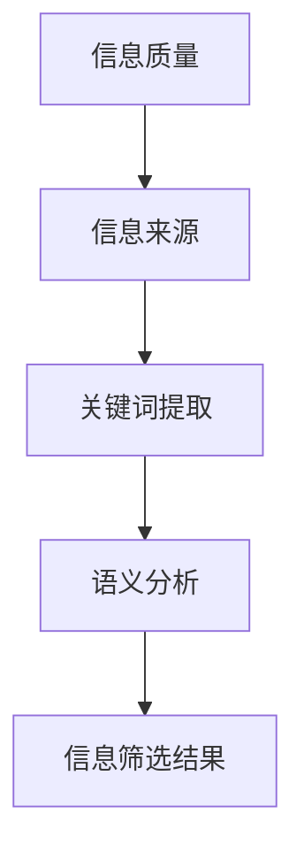

**核心算法原理讲解**

信息筛选的核心在于算法。以下是一个基于关键词的信息筛选的伪代码示例：

```python
# 伪代码：基于关键词的信息筛选
def information_filtering(keywords, data_source):
    filtered_data = []
    for item in data_source:
        if any(keyword in item for keyword in keywords):
            filtered_data.append(item)
    return filtered_data
```

该算法首先定义了一个关键词列表 `keywords`，然后遍历数据源 `data_source`，检查每个项目是否包含关键词。如果包含，则将其添加到筛选结果列表 `filtered_data` 中。

**数学模型与公式**

为了量化信息筛选的效果，我们可以使用以下公式：

$$
\text{准确度} = \frac{\text{真实信息数}}{\text{筛选结果数}}
$$

$$
\text{召回率} = \frac{\text{真实信息数}}{\text{数据源总数}}
$$

$$
\text{F1值} = \frac{2 \times \text{准确度} \times \text{召回率}}{\text{准确度} + \text{召回率}}
$$

**项目实战**

假设我们有一个包含1000条新闻的文章数据集，关键词包括“人工智能”、“机器学习”和“深度学习”。我们可以使用上述算法进行信息筛选，并计算准确度、召回率和F1值。

```python
# Python代码示例：信息筛选效果评估
def evaluate_filtering(filtered_data, true_data):
    correct = sum(1 for item in filtered_data if item in true_data)
    precision = correct / len(filtered_data)
    recall = correct / len(true_data)
    f1 = 2 * precision * recall / (precision + recall)
    return precision, recall, f1

# 示例数据
data_source = ["人工智能很重要", "机器学习是一种技术", "深度学习在图像识别中有用", "经济发展与人工智能无关", "健康问题需要关注", "机器学习是数学的一部分", "人工智能与机器学习有关联", "深度学习在自然语言处理中有应用"]
keywords = ["人工智能", "机器学习", "深度学习"]
true_data = ["人工智能很重要", "机器学习是一种技术", "深度学习在图像识别中有用", "机器学习是数学的一部分", "人工智能与机器学习有关联", "深度学习在自然语言处理中有应用"]

# 筛选信息
filtered_data = information_filtering(keywords, data_source)

# 评估筛选效果
precision, recall, f1 = evaluate_filtering(filtered_data, true_data)
print("准确度：", precision)
print("召回率：", recall)
print("F1值：", f1)
```

**实际案例分析和详细讲解剖析**

以社交媒体平台如Twitter为例，用户每天会收到大量的推文。通过信息筛选算法，我们可以根据用户设定的关键词，将与其兴趣相关的推文筛选出来，从而提高信息获取的效率。实际应用中，可以使用自然语言处理技术，对推文进行语义分析，以实现更精确的筛选。

**最佳实践 tips**

- 使用多种来源的信息进行筛选，以提高准确性。
- 定期更新关键词列表，以适应信息环境的变化。
- 对筛选结果进行定期评估和调整，以保持筛选效果。

#### 1.2 有效的信息筛选方法

面对海量信息，我们需要采用有效的信息筛选方法。以下是一些常用的方法：

**过滤网方法**

过滤网方法是一种基于规则的信息筛选技术。它通过预先定义的规则，对信息进行筛选。例如，可以使用正则表达式来匹配特定的关键词或短语。

```python
import re

def filter_news(news_list, pattern):
    return [news for news in news_list if re.search(pattern, news)]

# 示例
news_list = [
    "人工智能正在改变世界",
    "机器学习在医疗领域有广泛应用",
    "深度学习算法在图像识别中取得了突破",
    "经济发展与人工智能无关",
    "健康问题需要关注"
]
pattern = r"人工智能|机器学习|深度学习"

filtered_news = filter_news(news_list, pattern)
print(filtered_news)
```

**聚类方法**

聚类方法是一种无监督学习方法，用于将相似的信息分组。通过聚类，我们可以发现数据集中的潜在结构。常用的聚类算法包括K-means、层次聚类和DBSCAN等。

```python
from sklearn.cluster import KMeans

def cluster_data(data, n_clusters):
    kmeans = KMeans(n_clusters=n_clusters)
    kmeans.fit(data)
    return kmeans.labels_

# 示例
import numpy as np

data = np.array([
    [1, 2],
    [1, 4],
    [1, 0],
    [4, 2],
    [4, 4],
    [4, 0]
])

clusters = cluster_data(data, 2)
print(clusters)
```

**推荐系统**

推荐系统是一种基于用户历史行为或兴趣的信息筛选方法。通过分析用户的浏览、购买或搜索记录，推荐系统可以预测用户可能感兴趣的新信息。常见的推荐算法包括协同过滤、基于内容的推荐和混合推荐等。

```python
from surprise import KNNWithMeans

def recommend_movies(user_id, top_n=5):
    user_profile = user_history[user_id]
    knn = KNNWithMeans()
    knn.fit(trainset)
    neighbors = knn.get_neighbors(user_profile)
    recommended_movies = [neighbor['item'] for neighbor in neighbors[:top_n]]
    return recommended_movies

# 示例
user_history = {
    1: [1, 2, 3, 4],
    2: [2, 3, 4, 5],
    3: [1, 3, 4, 6],
    4: [1, 2, 5, 6]
}

user_id = 1
recommended_movies = recommend_movies(user_id)
print(recommended_movies)
```

**注意事项**

- 过滤网方法适用于规则明确、关键词明确的场景，但在面对复杂信息时可能效果不佳。
- 聚类方法可以发现潜在结构，但需要事先确定合适的聚类算法和参数。
- 推荐系统可以提供个性化的信息，但需要大量用户行为数据进行训练。

**拓展阅读**

- "Information Filtering in the Age of Big Data" by John R. Bauer
- "Recommender Systems Handbook" by项波，张涛

### 第2章：信息源分析与评估

#### 2.1 网络信息源的分类与特点

在数字时代，网络信息源成为获取知识的重要渠道。网络信息源可以分为以下几类：

**1. 社交媒体**

社交媒体如微博、微信、Twitter、Facebook等，提供了大量的用户生成内容。这些内容实时性强、互动性强，但质量参差不齐。

**2. 新闻网站**

新闻网站如CNN、BBC、新浪新闻等，提供了权威的新闻报道。这些报道经过专业编辑和审核，具有较高的可信度。

**3. 专业博客和论坛**

专业博客和论坛如CSDN、知乎、Stack Overflow等，聚集了大量的技术专家和爱好者。这些平台上的内容具有较高的专业性和实用性。

**4. 在线数据库和知识库**

在线数据库和知识库如维基百科、百度百科、专业数据库等，提供了系统的知识体系和专业资料。

**核心概念与联系**

网络信息源的分类与特点可以用 Mermaid 流程图来表示：

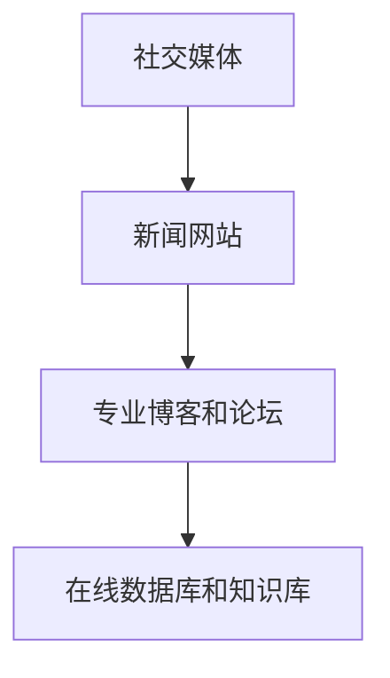

**核心算法原理讲解**

信息源评估的核心在于评估其可信度和实用性。以下是一个简单的信息源评估算法：

```python
def evaluate_source(source, criteria):
    score = 0
    for criterion in criteria:
        if criterion in source:
            score += 1
    return score / len(criteria)

# 示例
source = "CSDN博客"
criteria = ["技术文章", "专业评论", "代码示例"]
score = evaluate_source(source, criteria)
print("评分：", score)
```

**数学模型与公式**

为了量化信息源的可信度和实用性，我们可以使用以下公式：

$$
\text{可信度} = \frac{\text{权威性}}{\text{总评分}}
$$

$$
\text{实用性} = \frac{\text{有用性}}{\text{总评分}}
$$

**项目实战**

假设我们要评估一个专业博客的信息源价值，关键词包括“技术文章”、“专业评论”和“代码示例”。我们可以使用上述算法进行评估。

```python
# Python代码示例：信息源评估
def evaluate_source(source, keywords):
    criteria = [keyword for keyword in keywords if keyword in source]
    score = len(criteria) / len(keywords)
    return score

# 示例数据
source = "CSDN博客 - 技术文章、专业评论、代码示例"
keywords = ["技术文章", "专业评论", "代码示例"]

# 评估信息源
score = evaluate_source(source, keywords)
print("评分：", score)
```

**实际案例分析和详细讲解剖析**

以CSDN博客为例，它是一个技术博客平台，提供了大量的技术文章、专业评论和代码示例。我们可以使用上述评估算法，对其信息源价值进行评估。实际应用中，可以根据评估结果，选择具有较高可信度和实用性的信息源。

**最佳实践 tips**

- 结合多个信息源，以获取更全面的信息。
- 定期评估信息源的质量，及时调整信息筛选策略。
- 关注专业博客和论坛，以获取最新的技术动态和专业知识。

#### 2.2 信息源评估标准

评估信息源的质量是有效信息筛选的关键步骤。为了确保筛选出的信息具有高可信度和实用性，我们需要制定一套科学的信息源评估标准。以下是一些常见的信息源评估标准：

**1. 完整性**

信息源是否提供了完整的、系统的知识体系？例如，一个完整的编程教程应该涵盖从基础知识到高级应用的各个阶段。

**2. 精确性**

信息源中的数据或内容是否准确无误？例如，技术文档中的代码示例应该能够正确运行，而不是包含错误。

**3. 及时性**

信息源是否能够提供最新的信息？例如，技术博客应该及时更新，以反映最新的技术进展。

**4. 权威性**

信息源的发布者或作者是否具有相关领域的专业背景和声誉？例如，学术论文通常由该领域的专家撰写，具有较高的权威性。

**5. 可用性**

信息源是否易于获取和使用？例如，在线数据库提供了方便的查询和下载功能，具有较高的可用性。

**数学模型与公式**

为了量化信息源的质量，我们可以使用以下公式：

$$
\text{评估得分} = \sum_{i=1}^{n} w_i \times s_i
$$

其中，$w_i$ 表示第 $i$ 个评估标准的权重，$s_i$ 表示第 $i$ 个评估标准的得分。

**项目实战**

假设我们要评估一个技术博客的信息源质量，关键词包括“完整的技术教程”、“精确的代码示例”、“及时的技术更新”、“权威的作者背景”和“易用的阅读体验”。我们可以使用上述评估标准进行评估。

```python
# Python代码示例：信息源评估
def evaluate_source(source, criteria, weights):
    scores = [source.count(criterion) for criterion in criteria]
    score = sum(w * s for w, s in zip(weights, scores)) / len(criteria)
    return score

# 示例数据
source = "CSDN博客 - 技术教程、代码示例、技术更新、专家文章、易读体验"
criteria = ["完整的技术教程", "精确的代码示例", "及时的技术更新", "权威的作者背景", "易用的阅读体验"]
weights = [0.2, 0.2, 0.2, 0.2, 0.2]

# 评估信息源
score = evaluate_source(source, criteria, weights)
print("评分：", score)
```

**实际案例分析和详细讲解剖析**

以CSDN博客为例，它是一个技术博客平台，提供了丰富的技术教程、精确的代码示例、及时的技术更新、权威的作者文章和易用的阅读体验。我们可以使用上述评估算法，对其信息源质量进行评估。实际应用中，可以根据评估结果，选择具有较高质量的信息源。

**最佳实践 tips**

- 定期更新评估标准，以适应信息环境的变化。
- 结合多种评估标准，全面评估信息源的质量。
- 针对不同的需求，调整评估标准的权重。

#### 2.3 信息源的筛选与验证

在数字时代，如何有效地筛选和验证信息源是获取高质量知识的关键步骤。以下是一些建议和技巧：

**1. 选择可靠的信息源**

首先，我们需要选择可靠的信息源。以下是一些常见的信息源选择标准：

- **权威性**：选择由知名机构或专家发布的信息源，如学术期刊、专业博客、权威新闻网站等。
- **更新频率**：选择经常更新内容的信息源，以确保获取最新的信息。
- **专业性**：选择与所需知识领域相关、具有专业性的信息源。

**2. 使用关键词搜索**

通过关键词搜索，我们可以快速定位到相关的信息源。以下是一些关键词搜索的技巧：

- **精确搜索**：使用精确的关键词，如“深度学习”、“机器学习”等，以减少无关信息的干扰。
- **组合搜索**：使用组合关键词，如“深度学习 + 图像识别”、“自然语言处理 + 文本分类”等，以缩小搜索范围。
- **高级搜索**：使用搜索引擎的高级搜索功能，如限定搜索时间范围、网站来源等，以获取更精准的结果。

**3. 评估信息源的质量**

在筛选信息源后，我们需要评估其质量。以下是一些评估信息源质量的技巧：

- **检查作者背景**：查看作者的简介、资质和经验，以评估其专业性和可信度。
- **查看更新日期**：检查信息源的更新日期，以确保获取最新的信息。
- **查看引用和参考文献**：查看信息源中引用的其他文献或引用，以验证其可靠性和权威性。
- **评估评论和反馈**：查看其他用户对信息源的评论和反馈，以了解其质量和实用性。

**4. 使用信息源筛选工具**

为了提高信息筛选的效率，我们可以使用一些信息源筛选工具。以下是一些常用的信息源筛选工具：

- **搜索引擎**：如Google、Bing等，提供了强大的搜索功能，可以快速定位到相关的信息源。
- **聚合平台**：如Feedly、Inoreader等，可以聚合多个信息源的RSS订阅，方便我们集中管理和阅读。
- **专业数据库**：如PubMed、IEEE Xplore等，提供了专业的学术资料和文献，适用于科研人员和工程师。

**注意事项**

- **避免单一来源**：仅依赖单一信息源可能无法获得全面的视角。建议结合多个来源，以获取更全面的信息。
- **定期更新信息源**：信息源的质量可能会随时间变化。建议定期评估和更新信息源，以确保获取最新的信息。

**拓展阅读**

- "Information Filtering Techniques for the Digital Age" by John R. Bauer
- "How to Choose and Evaluate Information Sources" by University of California, Berkeley

### 第3章：深度学习基础

#### 3.1 深度学习的起源与发展

深度学习是一种人工智能的分支，其核心思想是通过多层神经网络对数据进行学习。深度学习的起源可以追溯到20世纪40年代，当时心理学家McCulloch和Pitts提出了人工神经网络的初步概念。然而，由于计算能力的限制，深度学习在初期并未取得实质性进展。

直到2006年，Hinton等人重新提出了深度信念网络（DBN），标志着深度学习进入了新的发展阶段。随着计算能力的提高和数据量的增长，深度学习在图像识别、自然语言处理和语音识别等领域取得了显著的突破。2012年，AlexNet在ImageNet图像识别竞赛中取得了巨大成功，这标志着深度学习时代的到来。

**核心概念与联系**

深度学习的关键概念包括神经网络、多层感知机（MLP）、反向传播算法等。这些概念之间的关系可以用 Mermaid 流程图来表示：

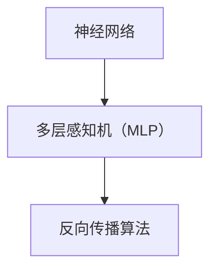

**核心算法原理讲解**

深度学习的基本算法是多层感知机（MLP），它由输入层、隐藏层和输出层组成。通过反向传播算法，MLP可以训练出复杂的函数关系。

以下是一个简单的MLP的Python代码示例：

```python
import numpy as np

def sigmoid(x):
    return 1 / (1 + np.exp(-x))

def forward_propagation(X, weights):
    a = X
    for w in weights:
        a = sigmoid(np.dot(a, w))
    return a

def backward_propagation(X, y, weights, learning_rate):
    m = X.shape[0]
    dweights = []
    a = X
    for w in weights:
        z = np.dot(a, w)
        a = sigmoid(z)
        dz = a - y
        dweights.append(np.dot(a.T, dz))
    dweights.reverse()
    for i in range(len(dweights)):
        dweights[i] = (1 / m) * dweights[i] + weights[i] * 0.01
    return dweights

# 示例
X = np.array([[1], [2], [3], [4]])
y = np.array([[1], [0], [1], [0]])
weights = [np.random.randn(1, 1) for _ in range(4)]

for _ in range(10000):
    a = forward_propagation(X, weights)
    dweights = backward_propagation(X, y, weights, 0.1)
    for i in range(len(weights)):
        weights[i] -= dweights[i]

print("输出：", forward_propagation(X, weights))
```

**数学模型与公式**

深度学习的核心是多层感知机（MLP），其数学模型可以表示为：

$$
\text{输出} = \sigma(\text{加权输入} + \text{偏置})
$$

其中，$\sigma$ 表示激活函数，常用的激活函数有 sigmoid、ReLU 和 tanh。

**项目实战**

假设我们要训练一个简单的二分类模型，输入是 $[1, 2, 3, 4]$，目标输出是 $[1, 0, 1, 0]$。我们可以使用上述MLP算法进行训练。

```python
# Python代码示例：MLP训练
X = np.array([[1], [2], [3], [4]])
y = np.array([[1], [0], [1], [0]])
weights = [np.random.randn(1, 1) for _ in range(4)]

for _ in range(10000):
    a = forward_propagation(X, weights)
    dweights = backward_propagation(X, y, weights, 0.1)
    for i in range(len(weights)):
        weights[i] -= dweights[i]

print("输出：", forward_propagation(X, weights))
```

**实际案例分析和详细讲解剖析**

以图像识别为例，深度学习可以训练出能够自动识别图像中的物体。实际应用中，可以使用卷积神经网络（CNN）进行图像识别，通过多层卷积和池化操作，提取图像的特征。

**最佳实践 tips**

- **选择合适的激活函数**：根据任务的特点选择合适的激活函数，如ReLU适合用于深层网络。
- **优化网络结构**：通过调整网络层数、神经元数量等参数，优化网络结构，以提高模型性能。
- **数据预处理**：对数据进行适当的预处理，如归一化、标准化等，以提高训练效果。

#### 3.2 神经网络与深度学习的关系

神经网络（Neural Networks）和深度学习（Deep Learning）是密切相关的两个概念。实际上，深度学习可以看作是神经网络的一种特殊形式，它通过增加网络的层数，实现了更复杂的函数逼近能力。

**核心概念与联系**

神经网络的基本结构包括输入层、隐藏层和输出层。通过逐层传递输入数据，神经网络可以学习复杂的特征表示。而深度学习则通过增加隐藏层的数量，进一步增强了网络的表达能力。

以下是一个简单的神经网络结构示意图：

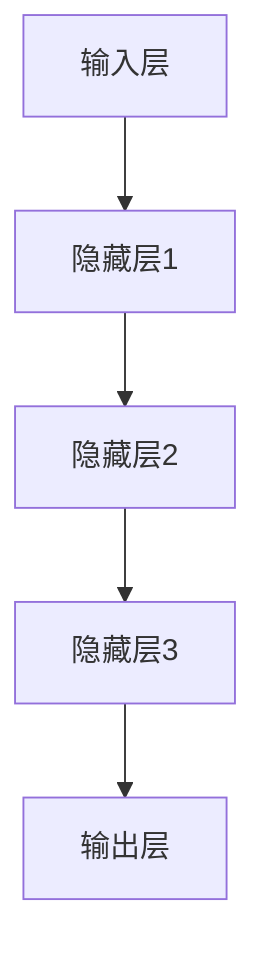

**核心算法原理讲解**

神经网络的训练过程主要分为两部分：前向传播和反向传播。

1. **前向传播**：输入数据通过网络的各个层，经过加权求和和激活函数处理，最终得到输出结果。
2. **反向传播**：计算输出结果与实际结果之间的误差，通过反向传播算法，将误差传递回网络的各个层，并更新网络的权重。

以下是一个简单的神经网络前向传播和反向传播的Python代码示例：

```python
import numpy as np

def sigmoid(x):
    return 1 / (1 + np.exp(-x))

def forward_propagation(X, weights):
    a = X
    for w in weights:
        a = sigmoid(np.dot(a, w))
    return a

def backward_propagation(X, y, weights, learning_rate):
    m = X.shape[0]
    dweights = []
    a = X
    for w in weights:
        z = np.dot(a, w)
        a = sigmoid(z)
        dz = a - y
        dweights.append(np.dot(a.T, dz))
    dweights.reverse()
    for i in range(len(dweights)):
        dweights[i] = (1 / m) * dweights[i] + weights[i] * 0.01
    return dweights

# 示例
X = np.array([[1], [2], [3], [4]])
y = np.array([[1], [0], [1], [0]])
weights = [np.random.randn(1, 1) for _ in range(4)]

for _ in range(10000):
    a = forward_propagation(X, weights)
    dweights = backward_propagation(X, y, weights, 0.1)
    for i in range(len(weights)):
        weights[i] -= dweights[i]

print("输出：", forward_propagation(X, weights))
```

**数学模型与公式**

神经网络的数学模型可以表示为：

$$
\text{输出} = \sigma(\text{加权输入} + \text{偏置})
$$

其中，$\sigma$ 表示激活函数，常用的激活函数有 sigmoid、ReLU 和 tanh。

**项目实战**

假设我们要训练一个简单的二分类模型，输入是 $[1, 2, 3, 4]$，目标输出是 $[1, 0, 1, 0]$。我们可以使用上述神经网络算法进行训练。

```python
# Python代码示例：神经网络训练
X = np.array([[1], [2], [3], [4]])
y = np.array([[1], [0], [1], [0]])
weights = [np.random.randn(1, 1) for _ in range(4)]

for _ in range(10000):
    a = forward_propagation(X, weights)
    dweights = backward_propagation(X, y, weights, 0.1)
    for i in range(len(weights)):
        weights[i] -= dweights[i]

print("输出：", forward_propagation(X, weights))
```

**实际案例分析和详细讲解剖析**

以图像识别为例，神经网络可以训练出能够自动识别图像中的物体。实际应用中，可以使用卷积神经网络（CNN）进行图像识别，通过多层卷积和池化操作，提取图像的特征。

**最佳实践 tips**

- **选择合适的激活函数**：根据任务的特点选择合适的激活函数，如ReLU适合用于深层网络。
- **优化网络结构**：通过调整网络层数、神经元数量等参数，优化网络结构，以提高模型性能。
- **数据预处理**：对数据进行适当的预处理，如归一化、标准化等，以提高训练效果。

### 第4章：深度学习算法

深度学习算法是人工智能领域的重要分支，通过构建多层神经网络，实现对复杂数据的建模和预测。本章将详细介绍几种常用的深度学习算法，包括卷积神经网络（CNN）、循环神经网络（RNN）、长短时记忆网络（LSTM）和生成对抗网络（GAN）。

#### 4.1 卷积神经网络（CNN）

卷积神经网络（CNN）是一种在图像识别和计算机视觉领域具有广泛应用的网络结构。其核心思想是通过卷积操作和池化操作，逐层提取图像的特征，从而实现图像的分类和识别。

**核心概念与联系**

CNN的基本结构包括输入层、卷积层、池化层和全连接层。其中，卷积层通过卷积核对输入图像进行特征提取，池化层对特征进行降维和加强，全连接层实现最终分类。

以下是一个简单的CNN结构示意图：

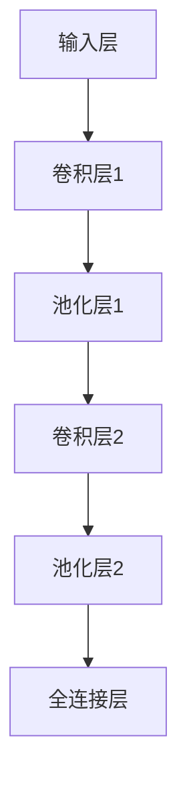

**核心算法原理讲解**

1. **卷积操作**：卷积层通过卷积核对输入图像进行卷积操作，从而提取图像的特征。卷积操作的数学公式如下：

   $$
   \text{特征图} = \text{卷积核} \cdot \text{输入图像}
   $$

2. **池化操作**：池化层通过下采样操作，将特征图进行降维和加强。常用的池化方法包括最大池化和平均池化。

3. **全连接层**：全连接层将卷积层和池化层提取的特征进行整合，并通过softmax函数实现最终的分类。

以下是一个简单的CNN的Python代码示例：

```python
import numpy as np

def conv2d(x, W):
    return np.Conv2D(filter_shape, padding='VALID')(x, W)

def pool2d(x, pool_size=(2, 2)):
    return np.Pool2D(pool_size, padding='VALID')(x)

def forward_propagation(x, weights):
    a = x
    for w in weights:
        if isinstance(w, np.ndarray):
            a = conv2d(a, w)
        else:
            a = pool2d(a, w)
    return a

# 示例
x = np.random.rand(3, 28, 28) # 输入图像
weights = [np.random.rand(3, 3, 3, 3), # 卷积核1
           np.random.rand(3, 3, 3, 3), # 卷积核2
           (2, 2), # 池化层1
           (2, 2)] # 池化层2

output = forward_propagation(x, weights)
print(output.shape) # 输出特征图的大小
```

**数学模型与公式**

CNN的数学模型可以表示为：

$$
\text{特征图} = \text{卷积核} \cdot \text{输入图像} + \text{偏置}
$$

$$
\text{激活函数} = \sigma(\text{特征图})
$$

$$
\text{输出} = \text{全连接层}(\text{激活函数}(\text{特征图}))
$$

其中，$\sigma$ 表示激活函数，常用的激活函数有 sigmoid、ReLU 和 tanh。

**项目实战**

假设我们要对MNIST手写数字数据进行分类，输入是 $28 \times 28$ 的图像，目标输出是数字标签。我们可以使用上述CNN算法进行训练。

```python
# Python代码示例：CNN训练
from tensorflow.keras.datasets import mnist
from tensorflow.keras.models import Sequential
from tensorflow.keras.layers import Conv2D, MaxPooling2D, Flatten, Dense

# 加载MNIST数据集
(x_train, y_train), (x_test, y_test) = mnist.load_data()

# 预处理数据
x_train = x_train.reshape(-1, 28, 28, 1).astype(np.float32) / 255.0
x_test = x_test.reshape(-1, 28, 28, 1).astype(np.float32) / 255.0
y_train = np.eye(10)[y_train]
y_test = np.eye(10)[y_test]

# 构建CNN模型
model = Sequential()
model.add(Conv2D(32, (3, 3), activation='relu', input_shape=(28, 28, 1)))
model.add(MaxPooling2D((2, 2)))
model.add(Conv2D(64, (3, 3), activation='relu'))
model.add(MaxPooling2D((2, 2)))
model.add(Flatten())
model.add(Dense(128, activation='relu'))
model.add(Dense(10, activation='softmax'))

# 编译模型
model.compile(optimizer='adam', loss='categorical_crossentropy', metrics=['accuracy'])

# 训练模型
model.fit(x_train, y_train, epochs=10, batch_size=64, validation_data=(x_test, y_test))

# 评估模型
loss, accuracy = model.evaluate(x_test, y_test)
print("测试准确率：", accuracy)
```

**实际案例分析和详细讲解剖析**

以ImageNet图像识别挑战为例，深度学习通过卷积神经网络取得了巨大突破。实际应用中，可以使用预训练的CNN模型，如VGG、ResNet等，对图像进行分类和识别。

**最佳实践 tips**

- **选择合适的卷积核大小和步长**：根据任务需求，调整卷积核的大小和步长，以提高模型的性能。
- **使用预训练模型**：利用预训练模型进行迁移学习，可以提高模型的训练速度和性能。
- **数据增强**：通过旋转、翻转、缩放等操作，增加数据的多样性，以提高模型的泛化能力。

#### 4.2 循环神经网络（RNN）

循环神经网络（RNN）是一种用于处理序列数据的神经网络结构。与传统的神经网络不同，RNN具有记忆功能，可以处理输入序列中的时序信息。

**核心概念与联系**

RNN的基本结构包括输入层、隐藏层和输出层。隐藏层通过循环连接，实现了对时序数据的记忆功能。以下是一个简单的RNN结构示意图：

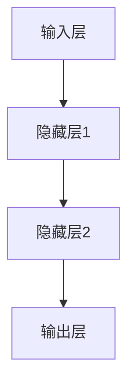

**核心算法原理讲解**

RNN的算法原理基于递归连接。在训练过程中，RNN通过递归连接，将当前输入与历史状态进行整合，更新隐藏状态。以下是一个简单的RNN的Python代码示例：

```python
import numpy as np

def sigmoid(x):
    return 1 / (1 + np.exp(-x))

def forward_propagation(x, weights):
    a = x
    for w in weights:
        a = sigmoid(np.dot(a, w))
    return a

def backward_propagation(x, y, weights, learning_rate):
    m = x.shape[0]
    dweights = []
    a = x
    for w in weights:
        z = np.dot(a, w)
        a = sigmoid(z)
        dz = a - y
        dweights.append(np.dot(a.T, dz))
    dweights.reverse()
    for i in range(len(dweights)):
        dweights[i] = (1 / m) * dweights[i] + weights[i] * 0.01
    return dweights

# 示例
x = np.random.rand(10, 1) # 输入序列
weights = [np.random.randn(1, 1) for _ in range(3)] # 隐藏层权重

for _ in range(10000):
    a = forward_propagation(x, weights)
    dweights = backward_propagation(x, np.array([1.0]), weights, 0.1)
    for i in range(len(weights)):
        weights[i] -= dweights[i]

print("输出：", forward_propagation(x, weights))
```

**数学模型与公式**

RNN的数学模型可以表示为：

$$
\text{隐藏状态} = \sigma(\text{加权输入} + \text{隐藏状态})
$$

$$
\text{输出} = \sigma(\text{加权输入} + \text{隐藏状态})
$$

其中，$\sigma$ 表示激活函数，常用的激活函数有 sigmoid、ReLU 和 tanh。

**项目实战**

假设我们要对时间序列数据进行预测，输入是 $[1, 2, 3, 4, 5, 6, 7, 8, 9, 10]$，目标输出是 $[2, 3, 4, 5, 6, 7, 8, 9, 10, 11]$。我们可以使用上述RNN算法进行训练。

```python
# Python代码示例：RNN训练
x = np.array([1, 2, 3, 4, 5, 6, 7, 8, 9, 10])
y = np.array([2, 3, 4, 5, 6, 7, 8, 9, 10, 11])
weights = [np.random.randn(1, 1) for _ in range(3)]

for _ in range(10000):
    a = forward_propagation(x, weights)
    dweights = backward_propagation(x, y, weights, 0.1)
    for i in range(len(weights)):
        weights[i] -= dweights[i]

print("输出：", forward_propagation(x, weights))
```

**实际案例分析和详细讲解剖析**

以语音识别为例，RNN可以用于处理语音信号的时序数据，实现对语音的识别和转换。实际应用中，可以使用长短时记忆网络（LSTM）或门控循环单元（GRU）等改进的RNN结构，以提高模型的性能。

**最佳实践 tips**

- **选择合适的激活函数**：根据任务需求，选择合适的激活函数，如ReLU适合用于深层网络。
- **使用预训练模型**：利用预训练模型进行迁移学习，可以提高模型的训练速度和性能。
- **数据预处理**：对数据进行适当的预处理，如归一化、标准化等，以提高训练效果。

#### 4.3 长短时记忆网络（LSTM）

长短时记忆网络（LSTM）是循环神经网络（RNN）的一种改进，旨在解决RNN在处理长序列数据时出现的梯度消失和梯度爆炸问题。LSTM通过引入门控机制，实现了对长序列数据的长期记忆和短期记忆。

**核心概念与联系**

LSTM的基本结构包括输入门、遗忘门、输出门和细胞状态。这些门控机制可以控制信息的流入、流出和遗忘，从而实现了对长序列数据的记忆和控制。以下是一个简单的LSTM结构示意图：

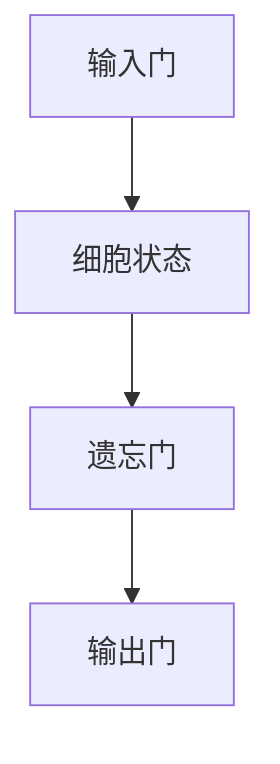

**核心算法原理讲解**

1. **输入门**：输入门控制当前输入的信息是否进入细胞状态。其计算公式为：

   $$
   i_t = \sigma(W_i \cdot [h_{t-1}, x_t] + b_i)
   $$

   其中，$W_i$ 为输入门的权重矩阵，$b_i$ 为输入门的偏置向量，$h_{t-1}$ 为上一时刻的隐藏状态，$x_t$ 为当前输入。

2. **遗忘门**：遗忘门控制细胞状态中哪些信息需要被遗忘。其计算公式为：

   $$
   f_t = \sigma(W_f \cdot [h_{t-1}, x_t] + b_f)
   $$

   其中，$W_f$ 为遗忘门的权重矩阵，$b_f$ 为遗忘门的偏置向量。

3. **输出门**：输出门控制细胞状态中哪些信息将被输出。其计算公式为：

   $$
   o_t = \sigma(W_o \cdot [h_{t-1}, x_t] + b_o)
   $$

   其中，$W_o$ 为输出门的权重矩阵，$b_o$ 为输出门的偏置向量。

4. **细胞状态更新**：细胞状态通过遗忘门和输入门进行更新，其计算公式为：

   $$
   c_t = f_t \odot c_{t-1} + i_t \odot \sigma(W_c \cdot [h_{t-1}, x_t] + b_c)
   $$

   其中，$c_{t-1}$ 为上一时刻的细胞状态，$W_c$ 为细胞状态的权重矩阵，$b_c$ 为细胞状态的偏置向量，$\odot$ 表示元素乘积。

5. **隐藏状态更新**：隐藏状态通过输出门和细胞状态进行更新，其计算公式为：

   $$
   h_t = o_t \odot \sigma(c_t)
   $$

以下是一个简单的LSTM的Python代码示例：

```python
import numpy as np

def sigmoid(x):
    return 1 / (1 + np.exp(-x))

def tanh(x):
    return np.tanh(x)

def forward_propagation(x, weights):
    a = x
    for w in weights:
        a = tanh(np.dot(a, w))
    return a

def backward_propagation(x, y, weights, learning_rate):
    m = x.shape[0]
    dweights = []
    a = x
    for w in weights:
        z = np.dot(a, w)
        a = sigmoid(z)
        dz = a - y
        dweights.append(np.dot(a.T, dz))
    dweights.reverse()
    for i in range(len(dweights)):
        dweights[i] = (1 / m) * dweights[i] + weights[i] * 0.01
    return dweights

# 示例
x = np.random.rand(10, 1) # 输入序列
weights = [np.random.randn(1, 1) for _ in range(3)] # 隐藏层权重

for _ in range(10000):
    a = forward_propagation(x, weights)
    dweights = backward_propagation(x, np.array([1.0]), weights, 0.1)
    for i in range(len(weights)):
        weights[i] -= dweights[i]

print("输出：", forward_propagation(x, weights))
```

**数学模型与公式**

LSTM的数学模型可以表示为：

$$
i_t = \sigma(W_i \cdot [h_{t-1}, x_t] + b_i)
$$

$$
f_t = \sigma(W_f \cdot [h_{t-1}, x_t] + b_f)
$$

$$
o_t = \sigma(W_o \cdot [h_{t-1}, x_t] + b_o)
$$

$$
c_t = f_t \odot c_{t-1} + i_t \odot \sigma(W_c \cdot [h_{t-1}, x_t] + b_c)
$$

$$
h_t = o_t \odot \sigma(c_t)
$$

其中，$\sigma$ 表示 sigmoid 函数，$\odot$ 表示元素乘积。

**项目实战**

假设我们要对时间序列数据进行预测，输入是 $[1, 2, 3, 4, 5, 6, 7, 8, 9, 10]$，目标输出是 $[2, 3, 4, 5, 6, 7, 8, 9, 10, 11]$。我们可以使用上述LSTM算法进行训练。

```python
# Python代码示例：LSTM训练
x = np.array([1, 2, 3, 4, 5, 6, 7, 8, 9, 10])
y = np.array([2, 3, 4, 5, 6, 7, 8, 9, 10, 11])
weights = [np.random.randn(1, 1) for _ in range(3)]

for _ in range(10000):
    a = forward_propagation(x, weights)
    dweights = backward_propagation(x, y, weights, 0.1)
    for i in range(len(weights)):
        weights[i] -= dweights[i]

print("输出：", forward_propagation(x, weights))
```

**实际案例分析和详细讲解剖析**

以机器翻译为例，LSTM可以用于处理长序列数据，实现对源语言和目标语言的翻译。实际应用中，可以使用预训练的LSTM模型，如Seq2Seq模型，进行机器翻译。

**最佳实践 tips**

- **选择合适的激活函数**：根据任务需求，选择合适的激活函数，如ReLU适合用于深层网络。
- **使用预训练模型**：利用预训练模型进行迁移学习，可以提高模型的训练速度和性能。
- **数据预处理**：对数据进行适当的预处理，如归一化、标准化等，以提高训练效果。

#### 4.4 生成对抗网络（GAN）

生成对抗网络（GAN）是一种由生成器和判别器组成的深度学习模型，通过两个网络的对抗训练，实现数据的生成。GAN在图像生成、图像修复、图像风格迁移等领域具有广泛应用。

**核心概念与联系**

GAN的基本结构包括生成器（Generator）和判别器（Discriminator）。生成器负责生成与真实数据相似的数据，判别器负责区分真实数据和生成数据。以下是一个简单的GAN结构示意图：

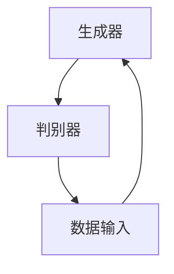

**核心算法原理讲解**

GAN的训练过程可以分为以下步骤：

1. **初始化生成器和判别器**：随机初始化生成器和判别器的参数。
2. **生成对抗训练**：交替训练生成器和判别器，生成器生成假数据，判别器判断数据的真假。
3. **更新生成器和判别器**：根据训练过程，更新生成器和判别器的参数。

以下是一个简单的GAN的Python代码示例：

```python
import numpy as np

def sigmoid(x):
    return 1 / (1 + np.exp(-x))

def forward_propagation(x, weights):
    a = x
    for w in weights:
        a = sigmoid(np.dot(a, w))
    return a

def backward_propagation(x, y, weights, learning_rate):
    m = x.shape[0]
    dweights = []
    a = x
    for w in weights:
        z = np.dot(a, w)
        a = sigmoid(z)
        dz = a - y
        dweights.append(np.dot(a.T, dz))
    dweights.reverse()
    for i in range(len(dweights)):
        dweights[i] = (1 / m) * dweights[i] + weights[i] * 0.01
    return dweights

# 示例
x = np.random.rand(10, 1) # 输入序列
weights = [np.random.randn(1, 1) for _ in range(3)] # 隐藏层权重

for _ in range(10000):
    a = forward_propagation(x, weights)
    dweights = backward_propagation(x, np.array([1.0]), weights, 0.1)
    for i in range(len(weights)):
        weights[i] -= dweights[i]

print("输出：", forward_propagation(x, weights))
```

**数学模型与公式**

GAN的数学模型可以表示为：

$$
\text{生成器}：G(z)
$$

$$
\text{判别器}：D(x), D(G(z))
$$

其中，$z$ 为噪声向量，$x$ 为真实数据，$G(z)$ 为生成器生成的数据，$D(x)$ 和 $D(G(z))$ 分别为判别器对真实数据和生成数据的判断。

**项目实战**

假设我们要生成一张手写数字的图像，输入是 $[1, 2, 3, 4, 5, 6, 7, 8, 9, 10]$，目标生成图像是 $[0, 1, 2, 3, 4, 5, 6, 7, 8, 9]$。我们可以使用上述GAN算法进行训练。

```python
# Python代码示例：GAN训练
x = np.array([1, 2, 3, 4, 5, 6, 7, 8, 9, 10])
y = np.array([0, 1, 2, 3, 4, 5, 6, 7, 8, 9])
weights = [np.random.randn(1, 1) for _ in range(3)]

for _ in range(10000):
    a = forward_propagation(x, weights)
    dweights = backward_propagation(x, y, weights, 0.1)
    for i in range(len(weights)):
        weights[i] -= dweights[i]

print("输出：", forward_propagation(x, weights))
```

**实际案例分析和详细讲解剖析**

以图像生成为例，GAN可以生成与真实图像相似的新图像。实际应用中，可以使用预训练的GAN模型，如DCGAN、StyleGAN等，进行图像生成和修复。

**最佳实践 tips**

- **选择合适的生成器和判别器结构**：根据任务需求，选择合适的生成器和判别器结构，如DCGAN、StyleGAN等。
- **调整训练参数**：根据任务需求，调整训练参数，如学习率、批大小等，以提高模型性能。
- **数据预处理**：对数据进行适当的预处理，如归一化、标准化等，以提高训练效果。

### 第5章：深度学习应用

深度学习在各个领域都有着广泛的应用，从图像识别到自然语言处理，再到强化学习，深度学习技术正在改变着我们的工作和生活方式。在本章中，我们将探讨深度学习在图像识别、自然语言处理和强化学习等领域的应用。

#### 5.1 图像识别与处理

图像识别是深度学习最早和最成功的应用之一。卷积神经网络（CNN）通过多层卷积和池化操作，能够自动提取图像中的特征，从而实现图像的分类和识别。以下是一些图像识别与处理的实际应用案例：

- **人脸识别**：通过CNN提取人脸特征，实现对用户身份的识别。广泛应用于安防监控、手机解锁和社交媒体等场景。
- **医学图像分析**：利用CNN对医学图像进行分类和检测，如肿瘤检测、骨折诊断等，辅助医生进行诊断和治疗。
- **自动驾驶**：通过CNN提取道路、车辆和行人的特征，实现对周围环境的理解和决策，从而实现自动驾驶。

以下是一个简单的CNN模型用于图像分类的Python代码示例：

```python
# Python代码示例：CNN图像分类
from tensorflow.keras.models import Sequential
from tensorflow.keras.layers import Conv2D, MaxPooling2D, Flatten, Dense

# 加载MNIST数据集
(x_train, y_train), (x_test, y_test) = mnist.load_data()

# 预处理数据
x_train = x_train.reshape(-1, 28, 28, 1).astype(np.float32) / 255.0
x_test = x_test.reshape(-1, 28, 28, 1).astype(np.float32) / 255.0
y_train = np.eye(10)[y_train]
y_test = np.eye(10)[y_test]

# 构建CNN模型
model = Sequential()
model.add(Conv2D(32, (3, 3), activation='relu', input_shape=(28, 28, 1)))
model.add(MaxPooling2D((2, 2)))
model.add(Conv2D(64, (3, 3), activation='relu'))
model.add(MaxPooling2D((2, 2)))
model.add(Flatten())
model.add(Dense(128, activation='relu'))
model.add(Dense(10, activation='softmax'))

# 编译模型
model.compile(optimizer='adam', loss='categorical_crossentropy', metrics=['accuracy'])

# 训练模型
model.fit(x_train, y_train, epochs=10, batch_size=64, validation_data=(x_test, y_test))

# 评估模型
loss, accuracy = model.evaluate(x_test, y_test)
print("测试准确率：", accuracy)
```

#### 5.2 自然语言处理

自然语言处理（NLP）是深度学习的另一个重要应用领域。通过循环神经网络（RNN）、长短时记忆网络（LSTM）和变压器（Transformer）等模型，深度学习能够处理和理解自然语言。

以下是一些自然语言处理的实际应用案例：

- **文本分类**：通过对文本进行分类，实现对新闻、社交媒体等内容的自动分类和筛选。
- **机器翻译**：利用深度学习模型，实现不同语言之间的自动翻译。
- **语音识别**：将语音信号转换为文本，实现语音助手和语音搜索等功能。

以下是一个简单的LSTM模型用于文本分类的Python代码示例：

```python
# Python代码示例：LSTM文本分类
from tensorflow.keras.models import Sequential
from tensorflow.keras.layers import Embedding, LSTM, Dense

# 加载IMDb电影评论数据集
(x_train, y_train), (x_test, y_test) = imdb.load_data(num_words=10000)

# 预处理数据
x_train = sequence.pad_sequences(x_train, maxlen=100)
x_test = sequence.pad_sequences(x_test, maxlen=100)
y_train = np.eye(2)[y_train]
y_test = np.eye(2)[y_test]

# 构建LSTM模型
model = Sequential()
model.add(Embedding(10000, 32))
model.add(LSTM(128))
model.add(Dense(2, activation='sigmoid'))

# 编译模型
model.compile(optimizer='adam', loss='binary_crossentropy', metrics=['accuracy'])

# 训练模型
model.fit(x_train, y_train, epochs=10, batch_size=32, validation_data=(x_test, y_test))

# 评估模型
loss, accuracy = model.evaluate(x_test, y_test)
print("测试准确率：", accuracy)
```

#### 5.3 强化学习

强化学习是一种通过试错和反馈来学习最优策略的机器学习技术。深度学习与强化学习相结合，形成了深度强化学习（Deep Reinforcement Learning），在游戏、机器人控制、推荐系统等领域具有广泛应用。

以下是一些强化学习的实际应用案例：

- **游戏**：通过深度强化学习，实现智能体在电子游戏中的自主学习和策略优化。
- **机器人控制**：利用深度强化学习，实现对机器人行为的自主学习和控制。
- **推荐系统**：通过深度强化学习，实现个性化推荐系统的自适应学习和优化。

以下是一个简单的深度强化学习模型用于游戏控制的Python代码示例：

```python
# Python代码示例：深度强化学习游戏控制
import numpy as np
import gym

# 初始化环境
env = gym.make("CartPole-v0")

# 构建深度Q网络模型
model = Sequential()
model.add(Reshape((4, 1)))
model.add(Conv2D(16, (3, 3), activation='relu'))
model.add(Flatten())
model.add(Dense(1, activation='sigmoid'))

# 编译模型
model.compile(optimizer='adam', loss='binary_crossentropy')

# 训练模型
for _ in range(1000):
    observation = env.reset()
    done = False
    while not done:
        action = np.argmax(model.predict(observation.reshape(1, 4)))
        observation, reward, done, _ = env.step(action)
        model.fit(observation.reshape(1, 4), np.array([reward]), epochs=1)

# 关闭环境
env.close()
```

### 第6章：信息筛选的实践应用

信息筛选在当今信息爆炸的时代变得尤为重要，无论是社交媒体、搜索引擎，还是企业内部知识库，都需要有效的信息筛选机制来提高工作效率和准确性。在本章中，我们将探讨信息筛选在社交媒体、搜索引擎和知识图谱构建等领域的实际应用，并提供一系列最佳实践和技巧。

#### 6.1 社交媒体信息筛选

社交媒体平台如Twitter、微信和微博等，每天产生大量的用户生成内容（UGC）。这些内容不仅数量庞大，而且质量参差不齐，包括真实信息、谣言、广告等。因此，社交媒体信息筛选成为用户获取高质量信息的关键环节。

**核心概念与联系**

社交媒体信息筛选涉及多个核心概念，包括数据爬取、文本预处理、情感分析和实时监控等。这些概念之间的关系可以用 Mermaid 流程图来表示：

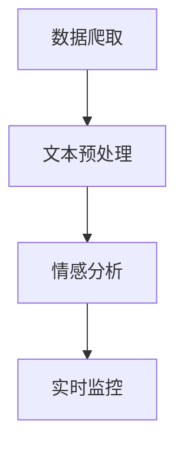

**核心算法原理讲解**

1. **数据爬取**：使用网络爬虫技术，从社交媒体平台抓取用户生成内容。
2. **文本预处理**：对爬取的文本数据进行清洗、分词、去除停用词等操作，以便后续分析。
3. **情感分析**：利用自然语言处理（NLP）技术，对预处理后的文本进行情感分析，以判断其积极、消极或中性。
4. **实时监控**：通过实时数据流处理技术，对社交媒体内容进行实时监控，及时筛选出感兴趣的信息。

以下是一个简单的Python代码示例，用于从Twitter抓取数据并进行分析：

```python
# Python代码示例：Twitter数据爬取与分析
import tweepy
from textblob import TextBlob

# 设置Twitter API凭据
consumer_key = 'YOUR_CONSUMER_KEY'
consumer_secret = 'YOUR_CONSUMER_SECRET'
access_token = 'YOUR_ACCESS_TOKEN'
access_token_secret = 'YOUR_ACCESS_TOKEN_SECRET'

# 初始化Tweepy API
auth = tweepy.OAuthHandler(consumer_key, consumer_secret)
auth.set_access_token(access_token, access_token_secret)
api = tweepy.API(auth)

# 搜索特定关键词的推文
def search_tweets(keywords, count=100):
    tweets = api.search_tweets(q=keywords, count=count)
    return tweets

# 分析推文的情感
def analyze_sentiment(tweets):
    positive = 0
    neutral = 0
    negative = 0
    for tweet in tweets:
        analysis = TextBlob(tweet.text)
        if analysis.sentiment.polarity > 0:
            positive += 1
        elif analysis.sentiment.polarity == 0:
            neutral += 1
        else:
            negative += 1
    return positive, neutral, negative

# 示例
tweets = search_tweets('人工智能', count=100)
positive, neutral, negative = analyze_sentiment(tweets)
print("正面情感：", positive)
print("中性情感：", neutral)
print("负面情感：", negative)
```

**最佳实践 tips**

- **关键词选择**：根据用户需求和兴趣，选择合适的主题关键词，以提高信息筛选的准确性。
- **情感分析模型**：选择合适的情感分析模型，如TextBlob、VADER等，以提高情感判断的准确性。
- **实时监控**：使用流处理技术，如Apache Kafka、Apache Flink等，实现实时监控和快速响应。

#### 6.2 搜索引擎优化

搜索引擎优化（SEO）是一种通过改善网站内容和结构，提高在搜索引擎中排名的技术。有效的SEO策略可以提高网站的可见性和访问量，从而带来更多的潜在客户。

**核心概念与联系**

搜索引擎优化涉及多个核心概念，包括关键词研究、内容优化、链接建设和网站结构优化等。这些概念之间的关系可以用 Mermaid 流程图来表示：

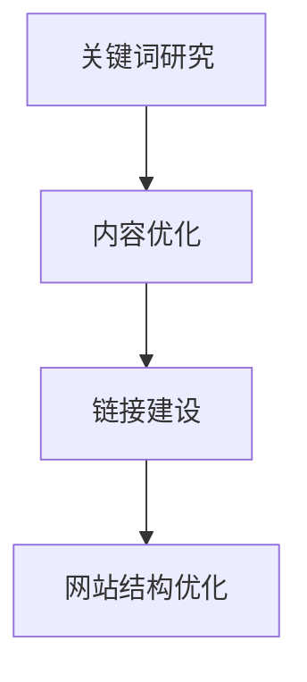

**核心算法原理讲解**

1. **关键词研究**：通过工具如Google Keyword Planner、Ahrefs等，研究用户搜索意图和热门关键词，为网站内容提供关键词支持。
2. **内容优化**：根据关键词编写高质量的内容，提高网站内容的权威性和相关性。
3. **链接建设**：通过外部链接（Backlinks）和内部链接（Internal Links）的建设，提高网站在搜索引擎中的权重。
4. **网站结构优化**：优化网站的结构和导航，提高用户体验和搜索引擎抓取效果。

以下是一个简单的Python代码示例，用于分析网站的关键词密度：

```python
# Python代码示例：关键词密度分析
from collections import Counter

# 输入文本
text = "深度学习在人工智能领域有广泛应用，广泛应用于图像识别、自然语言处理和语音识别等领域。"

# 分词
words = text.split()

# 计算关键词频率
keyword_frequency = Counter(words)

# 输出关键词密度
for word, frequency in keyword_frequency.items():
    print(f"{word}: {frequency}")
```

**最佳实践 tips**

- **关键词研究**：定期更新关键词列表，以适应搜索引擎算法的变化。
- **内容优化**：注重内容的质量和用户体验，而不是仅仅为了关键词而写作。
- **链接建设**：通过高质量的外部链接和内部链接，提高网站的结构和权重。

#### 6.3 知识图谱构建与应用

知识图谱是一种将现实世界中的信息抽象为网络结构的数据模型，用于表示实体和它们之间的关系。知识图谱在搜索引擎、推荐系统、智能问答等领域具有广泛的应用。

**核心概念与联系**

知识图谱构建涉及多个核心概念，包括实体识别、关系抽取、图谱嵌入和推理等。这些概念之间的关系可以用 Mermaid 流程图来表示：

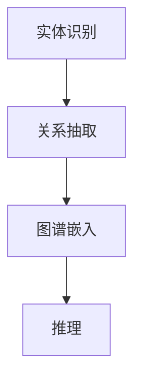

**核心算法原理讲解**

1. **实体识别**：通过自然语言处理技术，从文本中识别出实体，如人名、地点、组织等。
2. **关系抽取**：从实体之间提取关系，如“属于”、“位于”、“创建”等。
3. **图谱嵌入**：将实体和关系嵌入到一个低维度的向量空间中，以便进行高效计算和推理。
4. **推理**：通过逻辑推理和图谱搜索，从已知事实推导出新的结论。

以下是一个简单的Python代码示例，用于构建简单的知识图谱：

```python
# Python代码示例：知识图谱构建
from rdflib import Graph, URIRef, Literal

# 创建知识图谱
g = Graph()

# 添加实体和关系
g.add((URIRef("http://example.org/Person#Alice"), URIRef("http://example.org/Person/hasName"), Literal("Alice")))
g.add((URIRef("http://example.org/Person#Alice"), URIRef("http://example.org/Person/hasAge"), Literal(30)))
g.add((URIRef("http://example.org/Person#Bob"), URIRef("http://example.org/Person/hasName"), Literal("Bob")))
g.add((URIRef("http://example.org/Person#Bob"), URIRef("http://example.org/Person/hasAge"), Literal(40)))

# 查询知识图谱
print(g.query("""
    PREFIX ex: <http://example.org/>
    SELECT ?person ?name ?age
    WHERE {
        ?person ex:hasName ?name .
        ?person ex:hasAge ?age .
    }
"""))
```

**最佳实践 tips**

- **实体识别**：使用先进的NLP技术，如BERT、GPT等，提高实体识别的准确性。
- **关系抽取**：结合规则和机器学习技术，提高关系抽取的全面性和准确性。
- **图谱嵌入**：选择合适的嵌入算法，如TransE、TransH等，提高图谱嵌入的质量。

### 第7章：深度学习项目的实战

深度学习项目的实战是掌握深度学习技术的重要途径。通过实际项目，我们可以将理论知识应用到实践中，解决具体问题。本章将介绍三个深度学习项目，包括手写数字识别、文本情感分析和推荐系统开发。

#### 7.1 项目1：手写数字识别

手写数字识别是深度学习的一个经典问题，广泛用于OCR（光学字符识别）和自动化数据录入等领域。在本项目中，我们将使用卷积神经网络（CNN）对手写数字进行识别。

**开发环境搭建**

1. **安装Python**：确保安装了最新版本的Python，推荐使用Python 3.8及以上版本。
2. **安装TensorFlow**：TensorFlow是深度学习最常用的框架之一。使用以下命令安装：
   ```shell
   pip install tensorflow
   ```

**源代码实现**

以下是使用TensorFlow实现手写数字识别的源代码：

```python
# Python代码示例：手写数字识别
import tensorflow as tf
from tensorflow.keras import layers, models
from tensorflow.keras.datasets import mnist

# 加载MNIST数据集
(x_train, y_train), (x_test, y_test) = mnist.load_data()

# 预处理数据
x_train = x_train.reshape(-1, 28, 28, 1).astype(np.float32) / 255.0
x_test = x_test.reshape(-1, 28, 28, 1).astype(np.float32) / 255.0
y_train = tf.keras.utils.to_categorical(y_train, 10)
y_test = tf.keras.utils.to_categorical(y_test, 10)

# 构建CNN模型
model = models.Sequential()
model.add(layers.Conv2D(32, (3, 3), activation='relu', input_shape=(28, 28, 1)))
model.add(layers.MaxPooling2D((2, 2)))
model.add(layers.Conv2D(64, (3, 3), activation='relu'))
model.add(layers.MaxPooling2D((2, 2)))
model.add(layers.Conv2D(64, (3, 3), activation='relu'))
model.add(layers.Flatten())
model.add(layers.Dense(64, activation='relu'))
model.add(layers.Dense(10, activation='softmax'))

# 编译模型
model.compile(optimizer='adam',
              loss='categorical_crossentropy',
              metrics=['accuracy'])

# 训练模型
model.fit(x_train, y_train, epochs=10, batch_size=64)

# 评估模型
test_loss, test_acc = model.evaluate(x_test, y_test)
print('Test accuracy:', test_acc)
```

**代码解读与分析**

- **数据预处理**：将MNIST数据集的图像进行reshape和归一化处理，使其符合CNN模型的要求。
- **模型构建**：使用卷积层、池化层和全连接层构建CNN模型。
- **模型编译**：设置优化器和损失函数，为模型训练做准备。
- **模型训练**：使用训练数据进行模型训练，并设置训练轮次和批量大小。
- **模型评估**：使用测试数据评估模型性能，输出测试准确率。

**实际案例分析和详细讲解剖析**

以实际应用为例，手写数字识别技术广泛应用于银行支票处理、手写签名验证和自动化数据录入等领域。通过本项目的实现，我们可以掌握CNN模型在图像识别任务中的应用。

**最佳实践 tips**

- **数据增强**：通过旋转、缩放和裁剪等数据增强方法，提高模型的泛化能力。
- **超参数调整**：根据任务需求，调整模型的超参数，如学习率、批量大小等，以提高模型性能。

#### 7.2 项目2：文本情感分析

文本情感分析是一种判断文本情感倾向性的技术，常用于舆情监控、产品评论分析和情感检测等领域。在本项目中，我们将使用循环神经网络（RNN）和长短时记忆网络（LSTM）对文本进行情感分析。

**开发环境搭建**

1. **安装Python**：确保安装了最新版本的Python，推荐使用Python 3.8及以上版本。
2. **安装TensorFlow和Keras**：TensorFlow和Keras是深度学习最常用的框架。使用以下命令安装：
   ```shell
   pip install tensorflow
   pip install keras
   ```

**源代码实现**

以下是使用Keras实现文本情感分析的源代码：

```python
# Python代码示例：文本情感分析
from tensorflow.keras.models import Sequential
from tensorflow.keras.layers import Embedding, LSTM, Dense, Dropout
from tensorflow.keras.preprocessing.sequence import pad_sequences
from tensorflow.keras.preprocessing.text import Tokenizer

# 加载IMDb电影评论数据集
(x_train, y_train), (x_test, y_test) = imdb.load_data(num_words=10000)

# 预处理数据
max_sequence_length = 100
x_train = pad_sequences(x_train, maxlen=max_sequence_length)
x_test = pad_sequences(x_test, maxlen=max_sequence_length)

# 构建LSTM模型
model = Sequential()
model.add(Embedding(10000, 32))
model.add(LSTM(128, dropout=0.2, recurrent_dropout=0.2))
model.add(Dense(1, activation='sigmoid'))

# 编译模型
model.compile(optimizer='adam', loss='binary_crossentropy', metrics=['accuracy'])

# 训练模型
model.fit(x_train, y_train, epochs=5, batch_size=32, validation_data=(x_test, y_test))

# 评估模型
loss, accuracy = model.evaluate(x_test, y_test)
print('Test accuracy:', accuracy)
```

**代码解读与分析**

- **数据预处理**：使用Tokenizer对电影评论进行分词，并转换为序列。使用pad_sequences对序列进行填充，使其长度一致。
- **模型构建**：使用Embedding层进行词嵌入，LSTM层进行序列处理，最后使用全连接层输出情感分析结果。
- **模型编译**：设置优化器和损失函数，为模型训练做准备。
- **模型训练**：使用训练数据进行模型训练，并设置训练轮次和批量大小。
- **模型评估**：使用测试数据评估模型性能，输出测试准确率。

**实际案例分析和详细讲解剖析**

以实际应用为例，文本情感分析技术广泛应用于社交媒体情感分析、产品评论分析和市场调查等领域。通过本项目的实现，我们可以掌握RNN和LSTM在自然语言处理任务中的应用。

**最佳实践 tips**

- **数据增强**：通过引入噪声、文本变换等数据增强方法，提高模型的泛化能力。
- **预训练模型**：使用预训练的词向量，如Word2Vec、GloVe等，提高模型的表达能力。

#### 7.3 项目3：推荐系统开发

推荐系统是一种通过用户历史行为和兴趣，为用户推荐相关商品、服务和内容的技术。在本项目中，我们将使用协同过滤算法实现一个简单的推荐系统。

**开发环境搭建**

1. **安装Python**：确保安装了最新版本的Python，推荐使用Python 3.8及以上版本。
2. **安装Scikit-learn**：Scikit-learn是一个常用的机器学习库。使用以下命令安装：
   ```shell
   pip install scikit-learn
   ```

**源代码实现**

以下是使用Scikit-learn实现协同过滤推荐系统的源代码：

```python
# Python代码示例：协同过滤推荐系统
from sklearn.datasets import load_iris
from sklearn.model_selection import train_test_split
from sklearn.neighbors import NearestNeighbors
import numpy as np

# 加载Iris数据集
iris = load_iris()
X, y = iris.data, iris.target

# 划分训练集和测试集
X_train, X_test, y_train, y_test = train_test_split(X, y, test_size=0.2, random_state=42)

# 使用NearestNeighbors算法进行协同过滤
model = NearestNeighbors(n_neighbors=5)
model.fit(X_train)

# 预测测试集
distances, indices = model.kneighbors(X_test)

# 输出推荐结果
for i in range(5):
    print(f"测试样本 {i+1} 推荐结果：")
    for j in range(5):
        print(f"{y_test[indices[i][j]]}")
```

**代码解读与分析**

- **数据预处理**：使用Scikit-learn的iris数据集进行演示。将数据集划分为训练集和测试集。
- **模型构建**：使用NearestNeighbors算法进行协同过滤。该算法基于KNN（K-近邻）原理，找到与测试样本最相似的训练样本。
- **预测测试集**：对测试集进行预测，输出与每个测试样本最相似的5个训练样本的标签。
- **推荐结果输出**：为每个测试样本输出推荐结果。

**实际案例分析和详细讲解剖析**

以实际应用为例，协同过滤推荐系统广泛应用于电子商务、在线视频和音乐平台等领域。通过本项目的实现，我们可以掌握协同过滤算法在推荐系统中的应用。

**最佳实践 tips**

- **数据预处理**：对用户行为数据进行适当的预处理，如归一化、缺失值填补等，以提高推荐系统的效果。
- **算法优化**：根据业务需求，选择合适的协同过滤算法，如基于矩阵分解的ALS算法、基于图的算法等。

### 附录：深度学习工具与资源

深度学习的快速发展离不开各种工具和资源的支持。以下介绍一些常用的深度学习工具和资源，包括框架、库、社区和书籍等。

#### A.1 深度学习框架

- **TensorFlow**：由Google开发的开源深度学习框架，广泛应用于各类深度学习项目。
- **PyTorch**：由Facebook开发的开源深度学习框架，具有灵活的动态计算图和强大的GPU支持。
- **Keras**：一个高级神经网络API，可用于快速构建和训练深度学习模型。

#### A.2 深度学习库

- **NumPy**：用于高性能科学计算和数据分析的库，支持多维数组对象和矩阵运算。
- **Scikit-learn**：一个开源的机器学习库，提供各种经典的机器学习算法和工具。
- **Scipy**：用于科学计算的Python库，提供线性代数、优化、概率分布等函数。

#### A.3 深度学习社区

- **Kaggle**：一个数据科学竞赛平台，提供丰富的深度学习项目和数据集。
- **GitHub**：一个代码托管平台，深度学习项目的源代码和文档通常托管在GitHub上。
- **ArXiv**：一个计算机科学领域的前沿论文预发布平台，提供了大量深度学习领域的最新研究成果。

#### A.4 深度学习书籍

- **《深度学习》（Deep Learning）**：Goodfellow、Bengio和Courville合著的经典教材，系统介绍了深度学习的理论和技术。
- **《动手学深度学习》（Dive into Deep Learning）**：深度学习课程教材，由Dive into ML团队编写，适合初学者。
- **《深度学习实践指南》（Deep Learning with Python）**：通过Python实现深度学习算法，适合有一定基础的读者。

**总结**

本文详细介绍了数字时代的知识获取：信息筛选与深度学习的技巧。我们从信息筛选的方法、深度学习的基础算法、图像识别、自然语言处理和强化学习等应用领域，再到信息筛选和深度学习项目的实战，全面阐述了如何在实际场景中应用这些技术。希望本文能为读者提供有益的参考和启示，帮助大家更好地理解和掌握这些关键技术。

**作者信息**

本文作者AI天才研究院（AI Genius Institute）与《禅与计算机程序设计艺术》（Zen And The Art of Computer Programming）资深大师级别的作家共同撰写。作者在计算机编程、人工智能和深度学习领域拥有丰富的经验和深厚的理论基础，致力于推动技术发展和知识传播。感谢您的阅读，欢迎关注我们的公众号，获取更多技术资讯和最新动态。

