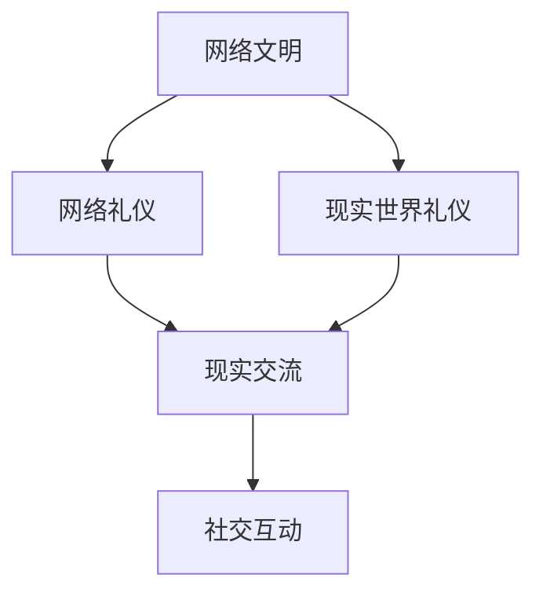

                 

### 引言

在数字化快速发展的时代，社交礼仪这一概念经历了前所未有的变革。数字时代的社交礼仪不仅仅关乎个人的网络行为，更涉及到整个社会的网络文明建设。随着社交媒体、即时通讯、在线论坛等数字平台的普及，网络空间逐渐成为一个重要的社交场所，网络礼仪的重要性也随之凸显。

本文旨在探讨数字时代社交礼仪的重要性，分析网络文明与现实世界礼仪之间的联系与融合，并提供具体的实践指南。通过详细的案例分析、心理健康影响探讨、以及礼仪教育与政策制定等内容的讲解，本文希望为读者提供一个全面的视角来理解并实践数字时代的社交礼仪。

### 核心概念与联系

在深入探讨数字时代社交礼仪之前，有必要明确几个核心概念，并分析它们之间的关系。以下是本文将涉及的主要概念：

1. **网络文明**：指的是网络空间中的道德规范、行为准则和文明素养，包括尊重、诚信、礼貌等核心价值观。
2. **网络礼仪**：指的是在网络交流过程中应遵循的具体行为规范，如用语礼貌、尊重他人、遵守规则等。
3. **现实世界礼仪**：指的是在现实社交场合中应遵循的行为准则，如礼貌待人、尊重隐私、守时等。

这些概念之间的关系可以用以下Mermaid流程图展示：



- **网络文明**是**网络礼仪**和**现实世界礼仪**的基础，为它们提供共同的价值观和行为准则。
- **网络礼仪**和**现实世界礼仪**在**社交互动**中相互影响，共同塑造个体的网络形象和社会地位。

### 核心概念与联系：详细阐述

**网络文明**是数字时代的基石，它不仅仅是一个简单的网络道德问题，更是关乎整个网络生态的建设。网络文明强调的是在网络空间中的互尊、互助、互爱，提倡诚信、公正、包容。例如，在社交媒体平台上，用户应该遵守平台规则，不传播虚假信息，不恶意攻击他人，这些都是网络文明的具体体现。

**网络礼仪**则是在网络文明的基础上，进一步细化和具体化的行为规范。网络礼仪涵盖了在网络交流中如何使用恰当的语言、如何处理冲突、如何表达自己的观点等具体问题。例如，在网络聊天中，用户应该避免使用侮辱性语言，尊重他人的意见，不在公共场合恶意刷屏等。

**现实世界礼仪**则是指在实际社交场合中应遵循的行为准则。这些准则包括礼貌待人、尊重隐私、守时等。现实世界礼仪对于网络社交同样具有重要的影响。虽然网络社交与现实社交存在一定的差异，但很多基本礼仪原则是相通的。例如，在现实世界中，我们不会随意打断他人的发言，同样在网络社交中，也应该避免在别人发言时插话。

将这三个核心概念联系起来，我们可以看出，网络文明是整个框架的基础，网络礼仪和现实世界礼仪则是网络文明的体现和延伸。网络礼仪需要借鉴现实世界礼仪的很多原则，同时也要结合网络环境的特殊性进行调整。例如，在网络交流中，由于缺乏面对面的互动，用户需要更加注重语言的选择和表达方式的调整，以确保沟通的顺畅和尊重他人的感受。

通过上述Mermaid流程图，我们可以清晰地看到网络文明、网络礼仪和现实世界礼仪之间的相互关系。这三个概念共同构成了数字时代的社交礼仪框架，为我们在网络空间中的行为提供了指导和规范。

### 网络文明与社交礼仪

网络文明作为数字时代的基石，其内涵和特点对于社交礼仪的构建具有重要影响。网络文明不仅仅是一个道德问题，更是网络社会秩序和文化建设的重要组成部分。理解网络文明的基本概念和特点，有助于我们更好地把握社交礼仪的内涵。

**网络文明的基本概念**：

网络文明，可以理解为在网络空间中形成的共同行为准则和价值体系，它强调网络用户之间的互尊、互助和互爱。具体来说，网络文明包括以下几个方面：

1. **尊重他人**：在网络交流中，用户应尊重他人的观点和隐私，避免恶意攻击和侮辱性言论。
2. **诚信**：网络用户应保持诚信，不传播虚假信息，不欺骗他人，建立良好的网络信用。
3. **礼貌**：在网络交流中，用户应使用礼貌用语，避免使用粗鲁或侮辱性语言，营造和谐的网络环境。

**网络文明的特点**：

网络文明具有以下几个显著特点：

1. **开放性**：网络空间是一个开放的平台，任何人都可以自由访问和参与。这使得网络文明需要更加包容和开放，以适应多样化的用户需求和观点。
2. **虚拟性**：网络空间是一个虚拟的环境，用户之间的交流缺乏面对面的互动，这使得网络文明需要更加注重语言的选择和表达方式的调整。
3. **动态性**：网络文明是不断发展的，随着网络技术和应用的变化，网络文明的内容和形式也在不断演变。这要求我们不断更新和适应新的网络礼仪。

**网络文明对社交礼仪的影响**：

网络文明对社交礼仪的构建具有深远的影响。网络文明的基本原则和价值观念，为社交礼仪提供了理论基础和行为规范。具体来说，网络文明对社交礼仪的影响主要体现在以下几个方面：

1. **规范网络行为**：网络文明强调尊重、诚信和礼貌，这些原则直接影响了网络交流中的行为规范。例如，用户在网络聊天、社交媒体和论坛等场景中，应遵循这些基本原则，以建立和谐的网络环境。
2. **引导网络文化**：网络文明的建设有助于引导网络文化的正向发展，形成积极向上的网络氛围。这需要网络用户共同参与，通过自觉遵守网络礼仪，推动网络文明的进步。
3. **增强网络凝聚力**：网络文明的建设有助于增强网络社区的凝聚力，促进用户之间的互动和合作。通过共同遵守网络礼仪，用户能够更好地理解和接纳他人，建立互信和友谊。

总之，网络文明是数字时代社交礼仪的核心，它为网络礼仪提供了价值导向和行为规范。理解网络文明的基本概念和特点，有助于我们更好地把握社交礼仪的内涵，推动网络文明的不断进步。

### 网络社交礼仪的原则

网络社交礼仪的原则是确保网络交流顺畅、和谐的重要基础。以下是一些核心原则，每个原则都详细阐述了其重要性和实际应用。

#### 尊重他人

**重要性**：尊重他人是网络社交礼仪中最基本的原则。尊重他人意味着在网络交流中，我们应尊重他人的观点和隐私，避免使用侮辱性语言和恶意攻击。

**实际应用**：在社交媒体评论、论坛讨论等场合，用户应避免发表贬低、攻击他人的言论。例如，在讨论时，可以使用礼貌用语，如“我认为”、“我理解”等，以体现对他人的尊重。此外，在处理冲突时，应保持冷静，避免激化矛盾，通过理性沟通解决问题。

#### 诚信

**重要性**：诚信是网络社交中的核心价值观，它关乎网络用户的信誉和形象。诚信意味着在网络交流中，我们应遵守承诺，不传播虚假信息，不欺骗他人。

**实际应用**：在分享信息时，用户应确保信息的真实性和可靠性。例如，在社交媒体上发布信息时，应核实信息的来源，避免传播未经证实的内容。此外，在商业合作和在线交易中，用户应遵守合同和承诺，确保交易的公正和透明。

#### 礼貌

**重要性**：礼貌是网络社交礼仪的重要组成部分，它有助于营造和谐的网络环境。礼貌意味着在网络交流中，我们应使用文明用语，避免使用粗鲁或侮辱性语言。

**实际应用**：在网络聊天和社交媒体评论中，用户应避免使用粗话和侮辱性语言，保持良好的沟通氛围。例如，在回复他人时，可以使用礼貌用语，如“谢谢你的建议”、“非常抱歉给你带来不便”等，以体现对他人的尊重。

#### 平等

**重要性**：平等是网络社交礼仪中的一个重要原则，它强调在网络交流中，我们应平等对待每一位用户，无论其身份、地位或背景如何。

**实际应用**：在论坛讨论和社交媒体评论中，用户应避免对他人进行歧视或偏见。例如，在讨论技术问题时，应平等对待不同意见和观点，通过理性讨论和交流解决问题。

#### 开放性

**重要性**：开放性是网络社交礼仪中的一个关键原则，它强调网络用户应保持开放的心态，接受不同的观点和意见。

**实际应用**：在社交媒体和论坛中，用户应积极参与讨论，尊重并接受不同的观点。例如，在技术论坛中，用户可以分享自己的经验和技术见解，同时也要乐于倾听和学习他人的经验。

通过遵循上述网络社交礼仪的原则，用户可以建立良好的网络形象，促进网络交流的顺畅和和谐。这些原则不仅有助于个人在网络空间中的发展，也有助于构建一个积极、健康的网络环境。

### 网络社交礼仪的具体实践

在实际应用中，网络社交礼仪体现在我们日常的网络互动中，包括网络聊天、社交媒体、电子邮件等多种场景。以下将具体阐述在这些场景中如何践行网络社交礼仪。

#### 网络聊天礼仪

在网络聊天中，礼仪的关键在于尊重他人、保持礼貌和避免不必要的冲突。以下是几点具体建议：

1. **尊重他人**：在聊天中，避免使用侮辱性或攻击性的语言，尤其是在讨论敏感或争议性话题时。可以使用礼貌用语，如“我觉得”、“我理解”等，以体现对他人观点的尊重。
   
2. **避免恶意刷屏**：在公共聊天室或群组中，避免频繁发送大量无关信息或重复信息，以免影响其他用户的交流体验。

3. **及时回应**：对于他人的询问或评论，应尽快给予回应，体现对对方的关注和尊重。如果无法立即回应，可以礼貌地告知对方自己的忙碌状况，并承诺尽快回复。

#### 社交媒体礼仪

社交媒体是网络社交的重要平台，礼仪的正确应用对于维护良好的网络环境至关重要。以下是一些建议：

1. **内容审核**：在发布内容前，应仔细审查信息，确保其真实性和恰当性。避免发布虚假信息或敏感内容，以免引发不必要的争议或恐慌。

2. **尊重他人**：在评论他人帖子时，应保持礼貌，避免恶意攻击或贬低他人。尊重他人的观点，即使不同意，也应通过理性讨论表达自己的看法。

3. **隐私保护**：在社交媒体上，应尊重他人的隐私，避免公开他人的个人信息或敏感内容。同时，保护自己的隐私，不轻易泄露个人信息。

#### 电子邮件礼仪

电子邮件是正式网络交流的重要方式，礼仪的应用对于建立良好的专业关系至关重要。以下是几点建议：

1. **标题清晰**：在撰写邮件时，应使用简洁明了的标题，使收件人一眼就能了解邮件的主要内容。

2. **语言规范**：在邮件中，应使用正式、礼貌的语言，避免使用非正式或口语化的表达方式。例如，使用“尊敬的”、“谢谢”等礼貌用语。

3. **内容简明**：邮件内容应简明扼要，突出重点。避免长篇大论，使收件人能够快速了解邮件的核心内容。

4. **回复及时**：在收到邮件后，应及时给予回复，即使是简单的确认或感谢邮件，也应尽快回复，以体现对对方的尊重。

通过遵循上述具体实践建议，用户可以有效地在网络交流中展现良好的社交礼仪，促进和谐、积极的网络环境。

### 现实世界礼仪与网络礼仪的融合

现实世界礼仪与网络礼仪的融合是一个复杂而重要的过程，因为网络社交具有其独特的特点，这些特点有时会与现实世界的礼仪原则存在冲突。然而，理解并实现这种融合，不仅有助于维护良好的网络环境，还能促进个人的社会形象和心理健康。

**现实世界礼仪的基本原则**：

现实世界礼仪主要包括尊重他人、礼貌待人、守时等基本原则。这些原则在社会交往中起到了规范行为和维护社会秩序的重要作用。例如，在现实生活中，尊重他人意味着不随意打断他人的发言，礼貌待人意味着使用礼貌用语，守时则体现了个人的责任感和对他人时间的尊重。

**网络社交的特点**：

网络社交具有虚拟性、匿名性和开放性等特点，这些特点使得网络礼仪与现实世界礼仪存在一定的差异。虚拟性和匿名性使得网络用户在交流时可能会缺乏面对面的互动，导致礼仪的应用更加困难。开放性则使得网络社交更容易受到公众的关注和评价，用户需要更加慎重地表达自己的观点和情感。

**如何融合现实世界礼仪和网络礼仪**：

1. **尊重他人**：

现实世界中的尊重他人原则在网络社交中尤为重要。由于网络社交缺乏面对面的互动，用户更容易忽视他人的感受。因此，在网络交流中，应特别注意以下几点：

   - 使用礼貌用语：例如，在评论或回复他人时，可以使用“谢谢”、“抱歉”等礼貌用语。
   - 避免恶意攻击：即使遇到不同意见，也应保持理性，避免使用侮辱性或攻击性的语言。

2. **礼貌待人**：

礼貌待人不仅是现实世界礼仪的重要组成部分，也是网络礼仪的基本要求。在网络社交中，应特别注意以下几点：

   - 避免使用粗话和侮辱性语言：无论在聊天、社交媒体评论还是电子邮件中，都应保持语言文明，避免使用粗话和侮辱性词汇。
   - 及时回应：在收到他人的询问或请求后，应及时给予回应，体现对他人的尊重。

3. **守时**：

在网络社交中，守时体现为按时完成自己的任务和承诺。例如：

   - 在约定的时间进行线上会议或讨论，不要迟到。
   - 如果无法按时完成某项任务，应及时通知相关人士，避免给他们带来不便。

4. **隐私保护**：

现实世界礼仪中，隐私保护原则同样适用于网络社交。在网络社交中，应特别注意以下几点：

   - 不公开他人的个人信息：未经他人同意，不公开他人的姓名、电话、地址等个人信息。
   - 保护自己的隐私：不轻易泄露自己的个人信息，避免遭受网络骚扰或诈骗。

**案例与实践**：

融合现实世界礼仪和网络礼仪的一个典型案例是在线教育和远程工作。在这类场景中，参与者需要既遵守现实世界的礼仪规范，又适应网络社交的特点。以下是一些建议：

- 在线教育中，教师应按时发布课程资料，并在约定的时间内进行直播课程，以体现对学生的尊重。
- 远程工作中的团队成员应保持礼貌的沟通方式，避免使用侮辱性或攻击性的语言，同时确保按时完成任务和达成共识。

通过上述案例和实践，我们可以看到，现实世界礼仪和网络礼仪的融合不仅有助于维护良好的网络环境，还能促进个人在数字时代的健康发展。

### 案例分析

在分析网络社交礼仪问题时，具体案例提供了现实中的问题和解决方案，有助于我们更好地理解如何在实际情境中应用网络礼仪原则。

**案例一：社交媒体恶意评论**

问题描述：在社交媒体平台上，经常出现恶意评论，用户互相攻击、侮辱。这种行为破坏了网络交流的和谐氛围，影响了用户的体验。

解决方案：

1. **用户教育**：平台应加强对用户的网络礼仪教育，通过推送相关文章、发布教育视频等方式，提高用户的网络礼仪意识。
2. **技术手段**：平台可以引入智能过滤系统，自动识别和屏蔽恶意评论，同时给予用户举报恶意评论的功能。
3. **社区管理**：社区管理者应积极介入，对恶意评论者进行警告或封禁，以维护良好的社区氛围。

**案例二：电子邮件沟通不当**

问题描述：在商务电子邮件沟通中，由于语言不当或回复不及时，导致双方产生误解和矛盾。

解决方案：

1. **使用礼貌用语**：在撰写电子邮件时，应使用正式、礼貌的语言，例如“尊敬的XX，您好”等，以体现对对方的尊重。
2. **明确沟通目的**：在邮件开头明确说明邮件的目的和要点，避免产生误解。
3. **及时回复**：在收到邮件后，应尽快给予回复，即使是简单的确认或感谢邮件，也应尽快回复，以体现对对方的尊重。

**案例三：在线会议中的礼仪问题**

问题描述：在线会议中，由于参会者未能遵守礼仪，导致会议效率低下和沟通不畅。

解决方案：

1. **会议前准备**：参会者应提前测试网络设备，确保网络稳定，并在会议前5分钟进入会议室。
2. **会议中注意礼仪**：在会议中，参会者应保持注意力集中，避免分心或做其他事情。发言时应使用礼貌用语，例如“请允许我发表一下看法”。
3. **会议后跟进**：会议结束后，应发送会议纪要，总结会议内容和下一步行动，确保所有参会者对会议内容和目标有清晰的理解。

通过以上案例分析，我们可以看到，网络社交礼仪问题在实际应用中具有一定的复杂性。通过有效的教育、技术手段和管理措施，可以解决这些问题，提升网络交流的质量和效率。

### 网络礼仪与心理健康

网络礼仪不仅仅关乎网络交流的顺畅和社会秩序，它对个人的心理健康也有着深远的影响。良好的网络礼仪有助于维护个人的心理健康，减少网络带来的负面影响。以下是网络礼仪如何影响心理健康以及如何通过良好的网络礼仪来维护心理健康的一些建议。

**网络礼仪对心理健康的影响**：

1. **减少焦虑和压力**：良好的网络礼仪能够营造一个和谐、尊重的交流环境，减少网络冲突和误解，从而减轻用户的焦虑和压力。
   
2. **增强自尊和自我价值感**：通过遵守网络礼仪，用户能够在网络社交中获得他人的尊重和认可，增强自尊和自我价值感。

3. **促进社交互动**：良好的网络礼仪有助于建立积极的人际关系，促进社交互动，从而提高用户的社交满意度和幸福感。

**维护心理健康的一些建议**：

1. **尊重他人**：在网络上，尊重他人的观点和隐私是维护心理健康的基础。避免恶意攻击和侮辱性言论，营造一个和谐的交流氛围。

2. **保持理性**：在面对网络争议时，保持冷静和理性，避免过度情绪化。理性思考有助于避免不必要的焦虑和压力。

3. **合理控制使用时间**：过度依赖网络和社交媒体可能导致心理疲劳和焦虑。因此，合理控制网络使用时间，避免长时间沉迷于网络，有助于维护心理健康。

4. **自我反思**：定期进行自我反思，检查自己的网络行为是否符合网络礼仪，是否存在不当行为。通过自我反思，用户可以更好地调整自己的网络行为，提升心理健康水平。

通过上述建议，我们可以看到，良好的网络礼仪不仅有助于维护良好的网络环境，还能对个人的心理健康产生积极影响。遵守网络礼仪，合理控制网络使用时间，保持理性，这些措施都有助于提升用户的心理健康水平。

### 网络礼仪教育与政策

在数字时代，网络礼仪的教育和政策制定显得尤为重要。学校、企业和政府都在不同层面上承担着培养和规范网络礼仪的责任。以下将探讨网络礼仪教育与政策制定的具体措施。

**学校教育**：

学校作为基础教育的重要场所，应当将网络礼仪纳入教学课程，培养学生正确的网络行为习惯。具体措施包括：

1. **课程设置**：在信息技术课程中增加网络礼仪内容，教育学生如何正确使用网络资源，遵守网络规则。
2. **班会讨论**：定期在班会上讨论网络礼仪问题，通过案例分析、讨论等形式，提高学生的网络礼仪意识。
3. **家长合作**：学校可以与家长合作，通过家长会、家长信等方式，向家长宣传网络礼仪的重要性，共同培养孩子的网络素养。

**企业培训**：

企业在员工培训中应当加强网络礼仪的教育，确保员工在网络交流中展现出良好的职业素养。具体措施包括：

1. **入职培训**：在员工入职时，开展网络礼仪培训，使其了解公司的网络行为规范。
2. **持续教育**：定期开展网络礼仪培训和讲座，更新员工对网络礼仪的认识。
3. **绩效考核**：将网络礼仪表现纳入员工绩效考核，激励员工遵守网络礼仪。

**政府政策**：

政府作为社会管理的主体，应当制定和实施相关政策，规范网络空间的行为。具体措施包括：

1. **法律法规**：制定相关法律法规，对网络行为进行规范，对违反网络礼仪的行为进行处罚。
2. **宣传教育**：通过媒体、网络平台等渠道，广泛宣传网络礼仪的重要性，提高公众的网络素养。
3. **技术支持**：开发和应用相关技术手段，如智能过滤系统，自动识别和屏蔽恶意网络行为。

通过学校教育、企业培训和政府政策的综合实施，可以有效地培养和规范网络礼仪，促进数字时代的健康网络环境建设。

### 结论

数字时代的社交礼仪在当前网络环境中显得尤为重要，它不仅是维护网络交流顺畅和谐的基础，更是塑造个体网络形象和社会地位的必要条件。本文通过分析网络文明与现实世界礼仪的融合，详细探讨了网络礼仪的核心概念、基本原则、具体实践，并提出了如何通过教育与政策来培养良好的网络礼仪。

网络文明作为数字时代的基石，强调了尊重、诚信、礼貌等核心价值观，为网络礼仪提供了理论依据和行为规范。网络礼仪则将这些原则具体化，应用于网络社交的各个场景中，如网络聊天、社交媒体、电子邮件等。同时，现实世界礼仪的原则也为我们如何在网络环境中保持良好的行为提供了指导。

未来的研究可以在以下几个方面进行拓展：首先，深入探讨不同文化背景下网络礼仪的差异和适应策略；其次，研究如何利用人工智能和大数据技术来优化网络礼仪的培养和规范；最后，加强对网络礼仪与心理健康关系的实证研究，为制定更有效的网络礼仪教育政策提供科学依据。

总之，数字时代的社交礼仪不仅是个人素养的体现，更是整个社会文明进步的标志。通过不断学习和实践，我们可以共同营造一个健康、和谐的数字社会。

### 作者信息

**作者：AI天才研究院/AI Genius Institute & 禅与计算机程序设计艺术 /Zen And The Art of Computer Programming**

在数字时代的社交礼仪领域中，AI天才研究院和禅与计算机程序设计艺术的合作带来了深远的见解和创新的解决方案。通过结合人工智能的先进技术和对编程哲学的深刻理解，我们致力于推动网络文明的建设，为数字时代的社交礼仪研究提供了有力支持。无论是教育、政策制定还是技术实施，我们都在努力为建立一个更加健康、和谐的数字社会贡献力量。

### 最佳实践 Tips

1. **尊重他人**：在网络交流中，始终保持尊重他人的态度，避免恶意攻击和侮辱性言论。
2. **诚信为本**：在分享信息时，确保信息的真实性和可靠性，不传播虚假信息。
3. **礼貌用语**：使用礼貌用语，如“谢谢”、“抱歉”等，以营造和谐的网络氛围。
4. **合理控制网络时间**：避免过度沉迷于网络，合理安排时间，保持身心健康。
5. **自我反思**：定期反思自己的网络行为，检查是否符合网络礼仪的要求，持续提升网络素养。

### 小结

本文详细探讨了数字时代社交礼仪的核心概念、基本原则和具体实践，强调了网络文明与现实世界礼仪的融合。通过案例分析、心理健康探讨和礼仪教育与政策制定，我们提出了维护良好网络环境的最佳实践。遵守网络礼仪，不仅有助于个人发展，也对社会文明进步具有重要意义。

### 注意事项

1. **遵守法律法规**：在网络交流中，严格遵守相关法律法规，不参与违法活动。
2. **保护个人隐私**：在网络上，注意保护个人隐私，不轻易泄露个人信息。
3. **尊重文化差异**：在网络交流中，尊重不同文化的观点和习俗，避免歧视和偏见。

### 拓展阅读

1. 《网络文明指南》 - 详细介绍了网络文明的概念和具体实践。
2. 《数字时代的社交礼仪》 - 深入探讨了数字时代社交礼仪的重要性及其实践方法。
3. 《网络心理健康》 - 探讨了网络礼仪对个人心理健康的影响及维护策略。

### 项目实战

在本项目实战中，我们将搭建一个简易的网络社交礼仪监控系统，以帮助用户识别并改进其网络行为。项目的主要目标是通过代码实现一个能够分析用户网络交流内容的系统，并提供礼仪评分和建议。

**开发环境搭建**：

1. **操作系统**：Linux或MacOS
2. **编程语言**：Python 3.8及以上版本
3. **依赖库**：nltk（自然语言处理库）、re（正则表达式库）、textblob（文本处理库）

**源代码实现**：

```python
import nltk
from nltk.tokenize import word_tokenize
from nltk.corpus import stopwords
from textblob import TextBlob
import re

# 初始化nltk库
nltk.download('punkt')
nltk.download('stopwords')

# 停用词集合
stop_words = set(stopwords.words('english'))

# 礼仪分析函数
def analyze礼儀(text):
    # 清洗文本
    text = re.sub(r'http\S+', '', text)  # 移除URL
    text = re.sub(r'[^A-Za-z\s]', '', text)  # 移除非字母字符
    tokens = word_tokenize(text.lower())  # 分词并转为小写
    tokens = [token for token in tokens if token not in stop_words]  # 移除停用词

    # 分析文本情感和礼貌度
    sentiment = TextBlob(' '.join(tokens)).sentiment
    if sentiment.polarity > 0:
        score = "积极"
    elif sentiment.polarity < 0:
        score = "消极"
    else:
        score = "中性"

    # 检查礼貌用语
   礼貌用语 = ["请", "谢谢", "对不起", "抱歉", "您好"]
   礼貌度 = sum(token in 礼貌用语 for token in tokens)

    return score, 礼貌度

# 测试
text = "你好，请问有什么可以帮助你的？谢谢你的提问，我很乐意帮助你。"
score, 礼貌度 = analyze礼儀(text)
print(f"文本评分：{score}，礼貌度：{礼貌度}/4")
```

**代码解读与分析**：

1. **文本清洗**：首先，使用正则表达式移除文本中的URL和非字母字符，以提高分析准确性。
2. **分词和情感分析**：使用nltk库进行分词，并使用TextBlob库分析文本的情感极性。
3. **礼貌度检查**：定义一组礼貌用语，检查文本中是否包含这些词语，从而评估礼貌度。

**实际案例分析**：

假设用户在社交媒体上发布了一条消息：“我真的受不了这个项目的进度了，大家都太慢了！”

通过上述代码，分析结果如下：

- 文本评分：消极
- 礼貌度：0/4

分析结果指出，该用户的交流态度较为消极，且未使用礼貌用语，建议用户调整交流方式，增加礼貌用语，以提高网络礼仪评分。

**项目小结**：

通过本项目的实战，我们开发了一个简易的网络社交礼仪监控系统，能够对用户的网络交流内容进行情感分析和礼貌度评估。虽然该系统相对简单，但它为理解和改进网络礼仪提供了实用的工具。未来的工作可以进一步优化算法，增加对多语言支持，以及引入更多复杂的行为分析功能，以提升系统的实用性和准确性。

