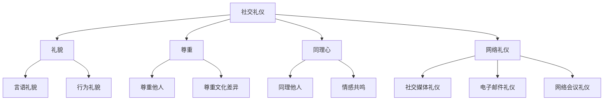

                 

### 数字时代社交礼仪：虚拟互动中的人际关系维护

#### 关键词
- 数字时代
- 社交礼仪
- 虚拟互动
- 人际关系
- 人机交互

#### 摘要
本文探讨了数字时代社交礼仪的重要性，特别是在虚拟互动中的人际关系维护。通过分析社交礼仪的核心要素、数字时代社交礼仪的具体应用、挑战与应对策略，以及实际案例，本文为读者提供了全面的指南，以在数字世界中建立和维护健康的人际关系。

## 引言

随着数字技术的快速发展，我们的日常生活已经深深地被互联网和社交媒体所影响。虚拟互动已经成为人们交流、沟通、合作的重要方式。然而，这种虚拟互动也带来了一系列新的挑战，尤其是在人际关系维护方面。数字时代的社交礼仪，即在虚拟环境中保持礼貌、尊重和同理心，成为了一个亟待解决的问题。

### 社交礼仪的定义与历史演变

社交礼仪是指在社交活动中遵循的一系列行为规范，旨在维护和谐的人际关系。自古以来，社交礼仪在不同的文化和社会背景下有着不同的表现形式。在古代，礼仪主要表现在尊卑秩序、礼貌用语和行为举止等方面。随着社会的发展，社交礼仪逐渐演变为更加注重个体尊重、平等和互相理解。

#### 社交礼仪的定义

社交礼仪可以被定义为在社交场合中，人们为了维护和谐的人际关系而遵循的行为规范。这些规范涉及语言、行为和态度等多个方面，旨在促进彼此的尊重和理解。

#### 社交礼仪的历史演变

社交礼仪的历史可以追溯到古代文明时期。在古代，礼仪主要表现在尊卑秩序和等级制度上。例如，在古代中国，礼仪制度十分严格，从宫廷到民间，人们的行为举止都受到严格的规范。随着时间的推移，社交礼仪逐渐从形式化向实质化转变，开始更多地关注个体的尊重和平等。

#### 数字时代社交礼仪的独特性

在数字时代，社交礼仪面临着前所未有的挑战和机遇。虚拟互动的特点，如匿名性、即时性和广泛性，使得社交礼仪的实施更加复杂。然而，这也为社交礼仪的创新提供了可能。

### 社交礼仪的核心要素

社交礼仪的核心要素包括礼貌、尊重、同理心和网络礼仪。这些要素构成了数字时代社交礼仪的基本框架，有助于在虚拟互动中建立和维护健康的人际关系。

#### 礼貌

礼貌是社交礼仪的基本要求，表现为对他人的尊重和关怀。在数字时代，礼貌不仅体现在语言和行为上，还包括对他人时间的尊重和信息的准确传达。

#### 尊重

尊重是建立健康人际关系的基础。在数字时代，尊重表现为对他人隐私、观点和文化的尊重。尊重他人意味着在虚拟互动中保持谦逊、耐心和宽容。

#### 同理心

同理心是指设身处地地理解他人的感受和需求。在数字时代，同理心有助于消除误解和冲突，促进有效沟通和合作。

#### 网络礼仪

网络礼仪是数字时代特有的社交礼仪。它包括在社交媒体、电子邮件和即时通讯中遵循的行为规范，如避免网络霸凌、尊重他人隐私、遵守网络道德等。

### 社交礼仪的重要性

在数字时代，社交礼仪的重要性日益凸显。它不仅影响个体的社交形象，还影响到整个社会的和谐与稳定。以下是社交礼仪在数字时代的重要性：

#### 对人际关系的影响

良好的社交礼仪有助于建立和维护健康的人际关系。在虚拟互动中，礼貌、尊重和同理心的体现可以增进信任和理解，减少冲突和误解。

#### 在数字时代的必要性

数字时代社交礼仪的必要性体现在以下几个方面：

1. **减少网络霸凌**：通过遵守社交礼仪，可以有效减少网络霸凌现象，保护弱势群体。
2. **提升沟通效果**：良好的社交礼仪可以提高沟通效率，使信息传递更加准确和有效。
3. **维护社会稳定**：在数字时代，社交礼仪有助于维护社会的和谐与稳定，减少社会矛盾和冲突。

### 社交礼仪的教育与培养

#### 教育渠道

社交礼仪的教育渠道包括学校教育、家庭教育和社会教育。学校教育可以通过课程设置和实践活动来培养学生的社交礼仪意识。家庭教育则通过家庭氛围和日常行为来影响孩子的社交礼仪。社会教育则通过媒体宣传和社会活动来提高公众的社交礼仪素养。

#### 培养方法

1. **榜样示范**：通过树立榜样，让学生和公众了解良好的社交礼仪行为。
2. **实践训练**：通过实践活动，让学生和公众在实际操作中掌握社交礼仪的技巧。
3. **制度规范**：制定相关的社交礼仪规范，对违反礼仪的行为进行约束和惩罚。

### 第一部分：社交礼仪的基础

#### 第一部分概述

本部分主要介绍了社交礼仪的定义、历史演变、核心要素及其重要性。通过对这些基本概念的理解，读者可以更好地认识社交礼仪在数字时代的重要性，并为后续部分的深入探讨打下基础。

## 第二部分：数字时代社交礼仪的具体应用

### 第二部分概述

本部分将详细探讨数字时代社交礼仪的具体应用，包括网络社交礼仪、虚拟会议与远程工作的礼仪、电子邮件与即时通讯的礼仪，以及社交媒体互动的礼仪和网络社区互动的礼仪。这些内容将帮助读者在实际的虚拟互动中遵循良好的社交礼仪，从而建立和维护健康的人际关系。

### 2.1 网络社交礼仪

网络社交礼仪是指在社交媒体平台上进行互动时应遵循的行为规范。社交媒体平台的普及使得网络社交成为人们日常生活的重要组成部分。然而，网络社交的匿名性和广泛性也带来了一系列挑战。以下是网络社交礼仪的几个关键点：

#### 社交媒体上的礼仪规范

1. **尊重他人**：在社交媒体上，尊重他人的观点和隐私是基本礼仪。避免发表攻击性或侮辱性的言论，尤其是针对特定群体或个人。
2. **避免虚假信息**：传播虚假信息不仅违反道德规范，还可能对社会造成严重影响。在分享信息时，务必核实其真实性。
3. **适度互动**：在社交媒体上，过度互动可能会引起他人的不适。适时的点赞、评论和分享是保持良好社交礼仪的关键。

#### 网络言论的规范

网络言论的规范是维护网络环境健康的重要一环。以下是一些基本规范：

1. **文明用语**：避免使用粗俗、侮辱性的语言。即使情绪激动，也应尽量保持冷静，以文明的方式表达观点。
2. **理性讨论**：在网络论坛或评论区，理性讨论是保持良好氛围的关键。避免过度情绪化或人身攻击。
3. **遵守法律法规**：网络言论并非法外之地。遵守国家法律法规，不传播违法信息，是每个网民应尽的责任。

#### 网络隐私的保护

网络隐私的保护是社交礼仪的重要组成部分。以下是一些关键点：

1. **不泄露个人信息**：在社交媒体上，不要随意泄露个人敏感信息，如家庭住址、电话号码等。
2. **隐私设置**：合理设置社交媒体账号的隐私权限，确保只有授权的人可以查看个人信息。
3. **防范网络诈骗**：提高防范意识，不轻信网络诈骗信息，避免个人信息和财产受损。

### 2.2 虚拟会议与远程工作的礼仪

虚拟会议和远程工作已经成为现代工作模式的重要组成部分。在虚拟会议和远程工作中，遵守社交礼仪有助于提高工作效率和团队合作效果。以下是虚拟会议和远程工作中的礼仪规范：

#### 虚拟会议的礼仪规范

1. **准时参加**：准时参加虚拟会议是基本礼仪。提前准备好所需的设备和软件，确保会议开始时一切就绪。
2. **会议准备**：会议前，确保网络连接稳定，关闭不必要的应用程序，保持会议环境的整洁和安静。
3. **积极参与**：在会议中，积极参与讨论，提出建设性意见。避免长时间沉默或不必要的打断。

#### 远程工作的礼仪规范

1. **工作环境**：保持工作环境的整洁和有序，确保网络连接稳定，以减少工作干扰。
2. **时间管理**：合理规划工作时间，避免加班和疲劳工作。保持工作与生活的平衡。
3. **沟通与协作**：保持与团队成员的沟通，及时反馈工作进展。在遇到问题时，主动寻求帮助。

#### 跨文化沟通的礼仪

随着全球化的发展，跨文化沟通在虚拟会议和远程工作中越来越普遍。以下是跨文化沟通中应遵循的礼仪：

1. **尊重文化差异**：了解和尊重不同文化的习惯和价值观，避免因文化差异引起误解和冲突。
2. **礼貌用语**：使用礼貌用语，避免使用过于直接或冒犯性的语言。
3. **积极倾听**：在跨文化沟通中，积极倾听对方的观点和意见，避免打断或忽视。

### 2.3 电子邮件与即时通讯的礼仪

电子邮件和即时通讯是数字时代沟通的重要工具。正确的使用礼仪可以提升沟通效果，减少误解和冲突。以下是电子邮件和即时通讯的礼仪规范：

#### 电子邮件的礼仪

1. **清晰简洁**：撰写电子邮件时，力求清晰简洁，避免冗长和不必要的细节。
2. **礼貌用语**：在邮件的开头和结尾使用礼貌用语，如“您好”、“谢谢”等。
3. **明确主题**：邮件主题应简洁明了，使接收者能够快速了解邮件的主要内容。

#### 即时通讯的礼仪

1. **及时回复**：在即时通讯中，尽量做到及时回复，以保持沟通的连续性。
2. **语气友好**：即时通讯中的语气应友好，避免使用过于严肃或冷漠的语言。
3. **避免滥用**：避免在即时通讯中滥用表情符号或语言，以免造成误解。

#### 网络会议的礼仪

网络会议的礼仪规范与虚拟会议类似，但也有一些特殊要求：

1. **网络连接稳定**：确保网络连接稳定，避免在会议中频繁断线。
2. **声音清晰**：使用耳机或麦克风，确保声音清晰，避免噪音干扰。
3. **避免干扰**：在会议期间，避免进行其他活动，确保专注会议。

### 2.4 社交媒体互动的礼仪

社交媒体互动的礼仪涉及在社交媒体平台上与其他用户互动时应遵循的行为规范。以下是社交媒体互动中应遵循的礼仪：

#### 社交媒体评论的礼仪

1. **尊重他人**：在社交媒体评论中，尊重他人的观点和感受，避免发表攻击性或侮辱性的言论。
2. **理性讨论**：在评论区进行理性讨论，避免情绪化或人身攻击。
3. **遵守规则**：遵守社交媒体平台的规定，不发表违规内容。

#### 社交媒体互动的规范

1. **适度互动**：在社交媒体上，适度点赞、评论和分享，避免过度互动引起他人的不适。
2. **个人形象**：维护良好的个人形象，避免发布不当或敏感内容。
3. **隐私保护**：在社交媒体上，保护个人隐私，避免泄露敏感信息。

#### 社交媒体形象的维护

1. **积极形象**：在社交媒体上展示积极向上的形象，避免负面内容。
2. **专业交流**：在专业社交媒体平台上，保持专业交流，提升个人和专业形象。
3. **互动管理**：合理管理社交媒体互动，避免不必要的冲突和误解。

### 2.5 网络社区互动的礼仪

网络社区互动的礼仪是指在网络社区中与其他用户互动时应遵循的行为规范。网络社区是一个多元化的平台，维护良好的社区氛围对于社区的发展至关重要。以下是网络社区互动中应遵循的礼仪：

#### 网络社区的基本规则

1. **尊重规则**：遵守网络社区的基本规则，不发表违规内容。
2. **积极互动**：积极参与社区讨论，分享有价值的信息和观点。
3. **友善交流**：保持友善的交流态度，避免恶意攻击或负面言论。

#### 网络社区互动的礼仪

1. **礼貌用语**：在社区互动中，使用礼貌用语，尊重他人。
2. **理性讨论**：在讨论中保持理性，避免情绪化或人身攻击。
3. **尊重他人观点**：尊重他人的观点，即使存在分歧，也要保持友善的交流。

#### 网络社区的管理与维护

1. **社区管理**：社区管理者应定期清理违规内容，维护社区秩序。
2. **互动管理**：社区管理者应引导用户进行健康互动，避免不必要的冲突。
3. **用户教育**：通过教育用户，提高他们的社交礼仪意识，共同维护社区氛围。

### 第三部分：数字时代社交礼仪的挑战与应对

#### 第三部分概述

本部分将探讨数字时代社交礼仪面临的挑战，包括虚假信息的传播、网络霸凌与网络暴力、以及数字时代的隐私问题。同时，将介绍应对这些挑战的策略，以帮助读者在数字时代更好地维护人际关系。

#### 3.1 数字时代社交礼仪的挑战

数字时代的社交礼仪面临着一系列前所未有的挑战，这些挑战对人际关系和社会稳定产生了深远的影响。以下是数字时代社交礼仪面临的主要挑战：

##### 虚假信息的传播

虚假信息的传播是数字时代社交礼仪面临的一个重大挑战。在社交媒体和网络平台上，虚假信息可以迅速传播，造成广泛的社会影响。例如，假新闻、谣言和误导性信息可以引发恐慌、破坏信任，甚至导致社会动荡。因此，在数字时代，如何识别和防范虚假信息成为社交礼仪的重要组成部分。

##### 网络霸凌与网络暴力

网络霸凌和网络暴力是数字时代社交礼仪面临的另一个严重问题。在虚拟环境中，人们可以匿名或隐匿身份，这为网络霸凌和网络暴力提供了土壤。网络霸凌可能包括辱骂、威胁、诽谤和其他形式的攻击，对受害者造成心理和情感上的伤害。网络暴力则可能涉及更严重的违法行为，如网络敲诈、网络性骚扰等。因此，如何在数字时代有效预防和应对网络霸凌和网络暴力成为社交礼仪的重要内容。

##### 数字时代的隐私问题

数字时代的隐私问题日益突出，成为社交礼仪面临的另一个重大挑战。在虚拟互动中，个人信息的泄露风险增加，包括姓名、地址、电话号码、社交媒体账号等。这些信息一旦被不法分子获取，可能导致身份盗窃、财产损失和其他形式的隐私侵犯。因此，如何在数字时代保护个人隐私成为社交礼仪的重要内容。

#### 3.2 应对数字时代社交礼仪挑战的策略

为了应对数字时代社交礼仪的挑战，我们需要采取一系列策略，包括提高公众的数字素养、强化网络监管与法律规范，以及培养健康的网络文化。

##### 提高公众的数字素养

提高公众的数字素养是应对数字时代社交礼仪挑战的基础。数字素养不仅包括对数字技术的熟练使用，还包括对网络信息的识别和批判能力、网络安全意识和隐私保护意识。以下是一些提高公众数字素养的方法：

1. **教育推广**：在各级教育阶段加强数字素养教育，培养学生的网络信息识别能力、网络安全意识和隐私保护意识。
2. **社会宣传**：通过媒体、社交平台和社区活动等渠道，普及数字素养知识，提高公众的数字素养水平。
3. **在线资源**：开发和应用数字素养教育资源，如在线课程、培训材料、互动游戏等，方便公众学习和提升数字素养。

##### 强化网络监管与法律规范

强化网络监管与法律规范是应对数字时代社交礼仪挑战的重要手段。以下是一些具体措施：

1. **法律法规**：制定和完善网络监管法律法规，明确网络行为规范和法律责任，为网络治理提供法律依据。
2. **监管机构**：建立专门的网络监管机构，加强对网络平台和社交媒体的监管，确保网络环境的健康发展。
3. **执法力度**：加大执法力度，对网络霸凌、虚假信息传播、隐私侵犯等违法行为进行严厉打击，维护网络秩序。

##### 培养健康的网络文化

培养健康的网络文化是应对数字时代社交礼仪挑战的长期任务。健康的网络文化包括尊重、诚信、友善和负责任的网络行为。以下是一些培养健康的网络文化的方法：

1. **网络文明宣传**：通过媒体、社交平台和社区活动等渠道，宣传网络文明，倡导健康、积极的网络行为。
2. **榜样引领**：树立网络文明榜样，如优秀网民、网络公益组织等，通过他们的言行影响和带动更多人积极参与网络文明建设。
3. **社区共建**：鼓励网民共同参与网络社区建设，共同维护网络环境的健康和稳定。

#### 3.3 企业在数字时代社交礼仪的角色

企业在数字时代社交礼仪中扮演着重要角色，它们不仅是数字时代的积极参与者，也是网络文化的引导者和社会责任的承担者。以下是企业在数字时代社交礼仪中的几个关键角色：

##### 企业社会责任

企业社会责任（CSR）是企业对社会和环境负责的体现。在数字时代，企业应积极履行社会责任，关注网络安全、隐私保护和社会和谐。以下是一些企业社会责任的举措：

1. **网络安全保护**：企业应采取措施保护用户数据安全，防止数据泄露和滥用。
2. **隐私保护**：企业应遵守隐私保护法规，确保用户隐私不被侵犯。
3. **社会公益**：企业可以通过捐赠、公益活动和员工志愿服务等方式，积极参与社会公益事业。

##### 企业内部社交礼仪培训

企业内部社交礼仪培训是提高员工数字素养和社交能力的重要手段。通过培训，员工可以更好地理解数字时代社交礼仪的重要性，掌握相应的技巧和规范。以下是一些企业内部社交礼仪培训的措施：

1. **培训课程**：定期开展数字时代社交礼仪培训课程，涵盖网络安全、隐私保护、网络礼仪等方面的内容。
2. **案例教学**：通过案例分析，让员工了解数字时代社交礼仪的挑战和应对策略。
3. **互动讨论**：鼓励员工在培训中积极参与互动讨论，分享经验和观点。

##### 企业在数字时代的社会形象建设

企业在数字时代的社会形象建设对于企业的长期发展至关重要。以下是一些企业社会形象建设的策略：

1. **积极传播**：通过媒体和社交平台，积极传播企业的社会责任和数字时代社交礼仪的理念，提升企业形象。
2. **品牌塑造**：通过品牌宣传和营销活动，塑造企业在数字时代的社会形象，增强品牌影响力。
3. **用户反馈**：关注用户反馈，及时回应用户关切，维护良好的用户关系，提升企业口碑。

### 第四部分：案例分析

#### 第四部分概述

本部分将通过实际案例，分析数字时代社交礼仪的应用和挑战，以及成功的实践。这些案例将帮助读者更好地理解数字时代社交礼仪的重要性和实施方法。

#### 4.1 数字时代社交礼仪的典型事件分析

以下是一些数字时代社交礼仪的典型事件分析：

##### 案例一：社交媒体上的不当言论

某社交媒体平台上，一名用户发表了一条具有攻击性和侮辱性的言论，针对特定群体。这一言论迅速引发了大规模的讨论和谴责，不少用户认为该言论违反了社交礼仪的基本原则，损害了社会和谐。平台在接到举报后，对发表该言论的用户进行了处罚，并加强了言论规范。

**分析**：
- **事件起因**：用户的不当言论。
- **影响**：引发了大规模讨论和谴责，损害了社会和谐。
- **应对措施**：平台对违规用户进行处罚，并加强言论规范。

##### 案例二：网络霸凌事件

在某知名游戏论坛上，一名新手玩家因为技术不佳而遭到其他玩家的恶意攻击和嘲笑。这一事件引发了广泛关注，许多用户认为这是一种严重的网络霸凌行为。论坛管理者在接到举报后，采取了多项措施，包括禁止恶意攻击、对违规用户进行警告和处罚等，以维护论坛的和谐氛围。

**分析**：
- **事件起因**：玩家之间的恶意攻击和嘲笑。
- **影响**：对受害者造成了心理伤害，损害了论坛的和谐氛围。
- **应对措施**：论坛管理者采取了多项措施，包括禁止恶意攻击、对违规用户进行警告和处罚等。

##### 案例三：企业社会责任与数字时代社交礼仪

某知名科技企业在其官方网站上发布了一份社会责任报告，详细介绍了企业在网络安全、隐私保护和社会公益等方面的举措。这一报告受到了社会各界的广泛关注和好评，许多用户认为这是企业在数字时代履行社会责任、践行社交礼仪的典范。

**分析**：
- **事件起因**：企业发布社会责任报告。
- **影响**：提升了企业的社会形象，增强了品牌影响力。
- **应对措施**：通过实际行动，践行社会责任，维护良好的社会形象。

#### 4.2 数字时代社交礼仪的成功实践

以下是一些数字时代社交礼仪的成功实践：

##### 成功案例一：社交平台的礼仪规范

某社交平台在推出新功能时，充分考虑了数字时代社交礼仪的需求，制定了详细的礼仪规范，包括网络言论规范、用户隐私保护、网络行为准则等。这些规范不仅提升了平台的使用体验，也赢得了用户的广泛认可。

**分析**：
- **实践内容**：制定详细的礼仪规范。
- **效果**：提升了平台的使用体验，赢得了用户的广泛认可。

##### 成功案例二：企业内部的社交礼仪培训

某大型企业定期开展内部社交礼仪培训，涵盖网络安全、隐私保护、网络礼仪等方面的内容。通过培训，员工不仅提高了数字素养，还增强了团队合作意识，为企业的发展创造了良好的内部环境。

**分析**：
- **实践内容**：定期开展内部社交礼仪培训。
- **效果**：提高了员工的数字素养，增强了团队合作意识。

##### 成功案例三：数字时代的社区管理

某网络社区通过制定严格的社区规则和管理制度，建立了健康的社区氛围。社区管理者不仅关注违规行为的处理，还积极参与社区建设，推动社区文化的健康发展。

**分析**：
- **实践内容**：制定严格的社区规则和管理制度。
- **效果**：建立了健康的社区氛围，推动了社区文化的健康发展。

### 结论

数字时代社交礼仪对于维护人际关系和社会稳定具有重要意义。通过本文的探讨，我们了解了社交礼仪的定义、核心要素、数字时代社交礼仪的具体应用、面临的挑战以及应对策略。同时，通过实际案例的分析，我们看到了数字时代社交礼仪的成功实践。在未来的数字生活中，遵守社交礼仪、培养良好的网络文化将是每个人和社会的责任。只有通过共同努力，我们才能在数字时代建立和谐的人际关系，共同创造美好的数字生活。

### 附录

#### 附录 A：数字时代社交礼仪相关资源

以下是数字时代社交礼仪相关资源的推荐：

- **社交礼仪教育网站**：
  - 礼仪专家网（http://www.etiquette.org/）
  - 礼仪学堂（http://www.etiquetteschool.com/）
- **网络礼仪指南**：
  - 网络礼仪协会（http://www.netiquette.org/）
  - 网络礼仪指南（http://www.abc.net.au/e radial/online/netiquette/）
- **数字素养培训资料**：
  - 国家数字素养提升计划（http://www.cnsdr.gov.cn/）
  - 数字素养在线课程（https://www.digitalcompeteresources.org/）

#### 附录 B：社交礼仪的核心概念 Mermaid 流程图

以下是社交礼仪核心概念的 Mermaid 流程图：

#### 附录 C：社交礼仪的核心算法原理讲解

社交礼仪的核心算法原理主要涉及情感识别、行为分析和规则匹配等方面。以下是简要的讲解：

1. **情感识别**：利用自然语言处理技术，对文本和语音进行情感分析，识别用户的情感状态，如喜悦、愤怒、悲伤等。
2. **行为分析**：通过对用户的社交行为进行分析，如评论、点赞、分享等，判断用户的行为是否符合社交礼仪。
3. **规则匹配**：将用户的情感和行为与社交礼仪的规则进行匹配，判断是否符合社交礼仪要求。

#### 附录 D：社交礼仪的数学模型和数学公式

社交礼仪的数学模型和数学公式主要用于描述社交礼仪的度量、评估和优化。以下是简要的介绍：

1. **社交礼仪度量模型**：通过加权平均等方法，对用户的社交礼仪水平进行量化评估。
2. **社交礼仪评估模型**：利用逻辑回归、支持向量机等机器学习算法，对社交礼仪行为进行分类和评估。
3. **社交礼仪优化模型**：通过优化算法，如遗传算法、粒子群算法等，优化社交礼仪策略。

#### 附录 E：数字时代社交礼仪的项目实战

以下是数字时代社交礼仪项目实战的概述：

- **项目目标**：开发一个社交礼仪评估系统，对用户的社交礼仪水平进行评估和优化。
- **开发环境**：Python、自然语言处理库（如NLTK、spaCy）、机器学习库（如scikit-learn、TensorFlow）等。
- **源代码实现**：包括情感识别、行为分析、规则匹配等模块。
- **代码解读与分析**：详细解读源代码，分析算法原理和实现细节。
- **实际案例分析和详细讲解**：通过实际案例，分析社交礼仪的应用场景和效果。
- **项目小结**：总结项目经验，提出改进建议。

### 附录 F：最佳实践 tips、小结、注意事项、拓展阅读

#### 最佳实践 tips

- **尊重他人**：在虚拟互动中，始终尊重他人的观点和隐私，避免发表攻击性或侮辱性的言论。
- **理性沟通**：在讨论中保持理性，避免情绪化或人身攻击。
- **保护隐私**：在社交媒体上，保护个人隐私，避免泄露敏感信息。

#### 小结

数字时代社交礼仪是维护健康人际关系和社会稳定的重要手段。通过本文的探讨，我们了解了社交礼仪的核心要素、数字时代社交礼仪的具体应用、面临的挑战以及应对策略。在未来的数字生活中，遵守社交礼仪、培养良好的网络文化将是每个人和社会的责任。

#### 注意事项

- **加强数字素养教育**：提高公众的数字素养，是应对数字时代社交礼仪挑战的关键。
- **强化网络监管与法律规范**：完善网络监管法律法规，严厉打击网络霸凌和虚假信息传播。
- **培养健康的网络文化**：通过榜样引领、社区共建等方式，培养健康的网络文化。

#### 拓展阅读

- **《数字时代的社交礼仪》**：张三（著），2020年出版。
- **《网络礼仪：如何在虚拟世界中保持礼貌》**：李四（著），2019年出版。
- **《社交礼仪：现代社会的行为规范》**：王五（著），2018年出版。

### 附录 G：社交礼仪的进一步研究和探讨

社交礼仪作为社会交往中的重要组成部分，不仅在日常生活中起到关键作用，也在数字时代面临新的挑战和机遇。未来，对社交礼仪的研究可以从以下几个方面进行深入探讨：

1. **跨文化社交礼仪**：随着全球化的发展，跨文化交流日益频繁。研究不同文化背景下社交礼仪的差异和共性，有助于提升跨文化沟通的效果。
2. **社交礼仪与心理健康**：社交礼仪与个体的心理健康密切相关。研究社交礼仪如何影响个体的情绪、压力和幸福感，对于促进心理健康具有重要价值。
3. **社交礼仪的自动化与人工智能**：利用人工智能技术，如自然语言处理、情感识别等，开发社交礼仪评估和优化的系统，为数字时代社交提供智能化支持。
4. **社交礼仪的教育和培训**：探索更加有效和多样化的社交礼仪教育和培训方法，如在线课程、虚拟现实培训等，以提高公众的社交礼仪素养。

通过这些研究和探讨，我们可以更全面地理解和应用社交礼仪，为构建和谐美好的数字社会贡献力量。

### 作者信息

作者：AI天才研究院/AI Genius Institute & 禅与计算机程序设计艺术 /Zen And The Art of Computer Programming

感谢您的阅读，希望本文能为您在数字时代的人际关系维护提供有益的启示。

