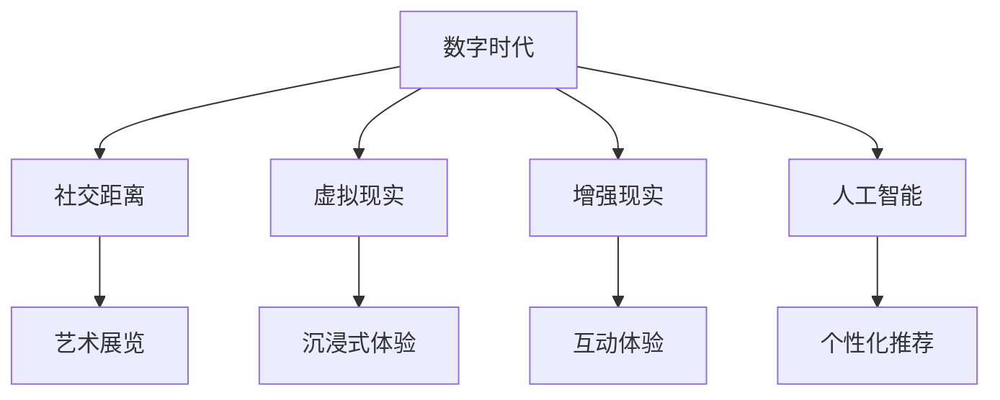

                 

# 《数字时代的社交距离艺术展：后疫情时代的创意展览形式》

## 关键词
数字技术、社交距离、艺术展览、后疫情时代、创意设计

## 摘要
本文探讨了后疫情时代数字技术对艺术展览形式的影响，提出了社交距离艺术展的概念。通过对数字技术在展览中的应用、创意展览设计原则、展览运营与营销策略等内容的深入分析，本文旨在为艺术展览行业的创新与发展提供思路和指导。

---

## 引言：数字时代的变革与社交距离艺术展

### 1.1 数字时代的变革
随着互联网、大数据、人工智能等技术的迅猛发展，数字时代已经深刻地改变了我们的生活方式。在这个时代，数字技术不仅改变了信息的传播方式，还推动了艺术展览形式的创新。艺术展览不再局限于传统的实体空间，而是向数字化、虚拟化、智能化方向迈进。

### 1.2 社交距离的概念
社交距离是指人们在社交活动中保持的空间距离。在疫情之前，社交距离可能并未引起人们的广泛关注。然而，后疫情时代，保持适当的社交距离成为了一种新的社交习惯，这为艺术展览的形式带来了新的挑战和机遇。

### 1.3 艺术展在数字时代的转型
数字时代的艺术展览转型主要体现在以下几个方面：

1. **虚拟现实（VR）的应用**：VR技术使观众能够沉浸式地体验艺术作品，打破了空间和时间的限制。
2. **增强现实（AR）的应用**：AR技术将艺术作品与现实世界相结合，为观众提供全新的观展体验。
3. **人工智能（AI）的应用**：AI技术可以用于展览内容的个性化推荐、观众行为分析等，提高展览的互动性和参与度。
4. **线上展览的兴起**：受疫情影响，线上展览成为艺术展览的一种新形式，为观众提供了更便捷的观展方式。

---

## 后疫情时代背景下的社交距离艺术展

### 2.1 后疫情时代的社交行为变化
疫情使得人们的社交行为发生了显著变化。为了避免病毒的传播，人们开始更多地依赖线上社交，同时保持适当的社交距离。这种变化对艺术展览行业提出了新的要求，促使展览形式向更加安全、便捷的方向发展。

### 2.2 社交距离艺术展的兴起
为了适应后疫情时代的社交行为变化，社交距离艺术展应运而生。这种展览形式注重保护观众的隐私和安全，同时提供丰富的艺术体验。社交距离艺术展的特点包括：

1. **空间布局的优化**：通过合理规划展览空间，确保观众之间保持适当的距离。
2. **互动体验的增强**：利用数字技术，提供丰富的互动体验，使观众在保持社交距离的同时享受艺术之美。
3. **线上与线下的结合**：将线上展览与线下展览相结合，提供多元化的观展方式。

### 2.3 社交距离艺术展的特点与影响
社交距离艺术展的特点主要体现在以下几个方面：

1. **安全性与便捷性的兼顾**：通过数字化手段，降低疫情传播风险，同时提高观众的观展便捷性。
2. **个性化的艺术体验**：利用数字技术，为观众提供个性化的艺术体验，满足不同观众的需求。
3. **互动性的增强**：通过互动体验，增强观众对艺术作品的感受和理解。

社交距离艺术展对艺术展览行业产生了深远的影响，推动了展览形式的创新与发展。

---

## 数字技术在新展览形式中的应用

### 3.1 虚拟现实（VR）技术在艺术展中的应用
虚拟现实技术为艺术展览带来了沉浸式体验，使观众能够身临其境地感受艺术作品。以下是一个简单的VR展览应用案例：

```python
# VR展览应用案例
from virex import VRExhibition

# 创建VR展览对象
exhibition = VRExhibition()

# 添加艺术作品
exhibition.add_artifact("Mona Lisa", "Leonardo da Vinci", "1503-1506")

# 设置展览布局
exhibition.set_layout("line", 10)  # 设置线性布局，艺术作品间距为10米

# 开启VR展览
exhibition.start()
```

### 3.2 增强现实（AR）技术在艺术展中的应用
增强现实技术将艺术作品与现实世界相结合，为观众提供全新的观展体验。以下是一个简单的AR展览应用案例：

```python
# AR展览应用案例
from arex import ARExhibition

# 创建AR展览对象
exhibition = ARExhibition()

# 添加艺术作品
exhibition.add_artifact("The Starry Night", "Vincent van Gogh", "1889")

# 设置AR标记
exhibition.set_marker("star", "星星")

# 开启AR展览
exhibition.start()
```

### 3.3 人工智能（AI）在展览策划与运营中的应用
人工智能技术在展览策划与运营中发挥着重要作用。以下是一个简单的AI展览策划案例：

```python
# AI展览策划案例
from aiplanner import AIExhibitionPlanner

# 创建AI展览策划对象
planner = AIExhibitionPlanner()

# 添加艺术家和作品
planner.add_artist("Pablo Picasso", ["Guernica", "The Old Guitarist"])
planner.add_artist("Salvador Dalí", ["The Persistence of Memory", "The Elephants"])

# 设置展览主题
planner.set_theme("Modern Art")

# 策划展览
exhibition = planner.plan()

# 输出展览布局
print(exhibition.layout())
```

---

## 创意展览设计原则与实践

### 4.1 创意展览设计的核心原则
创意展览设计需要遵循以下核心原则：

1. **创新性**：通过创新的设计理念和技术手段，为观众带来全新的观展体验。
2. **互动性**：通过互动体验，增强观众对艺术作品的感受和理解。
3. **参与性**：鼓励观众积极参与展览活动，提高展览的互动性和参与度。
4. **可持续性**：注重环境保护和资源利用，实现展览的可持续发展。

### 4.2 创意展览设计的案例分析
以下是一个创意展览设计的案例分析：

**案例：数字艺术大展**

1. **展览主题**：现代数字艺术
2. **展览形式**：线上与线下结合
3. **技术应用**：VR、AR、AI
4. **设计亮点**：
   - **沉浸式体验**：通过VR技术，观众可以身临其境地感受艺术作品。
   - **互动互动性**：通过AR技术，观众可以与艺术作品进行互动，例如拍照留念。
   - **个性化推荐**：通过AI技术，为观众推荐符合其兴趣的艺术作品。

### 4.3 创意展览设计的实操步骤
创意展览设计的实操步骤如下：

1. **确定展览主题和形式**：根据展览目的和受众需求，确定展览主题和形式。
2. **选择技术应用**：根据展览主题和形式，选择合适的技术应用。
3. **设计展览布局**：根据技术应用，设计展览布局，确保观展流程的流畅性和互动性。
4. **实施展览策划**：根据设计思路，实施展览策划，包括艺术作品选择、展览内容安排等。
5. **开展展览运营**：确保展览顺利开展，包括观众接待、展览宣传等。

---

## 展览案例分析：国内外成功案例解析

### 5.1 国内成功社交距离艺术展案例
以下是国内几个成功的社交距离艺术展案例：

1. **北京故宫博物院数字艺术展**
   - 展览主题：数字艺术与传统文化
   - 展览形式：线上与线下结合
   - 成功原因：利用数字化技术，将故宫文化与现代艺术相结合，为观众提供丰富的艺术体验。

2. **上海当代艺术馆虚拟现实艺术展**
   - 展览主题：虚拟现实艺术
   - 展览形式：线上与线下结合
   - 成功原因：通过VR技术，让观众沉浸式地体验艺术作品，增强观展互动性。

### 5.2 国外成功社交距离艺术展案例
以下是全球几个成功的社交距离艺术展案例：

1. **荷兰海牙美术馆线上艺术展**
   - 展览主题：现代艺术
   - 展览形式：线上展览
   - 成功原因：利用线上展览形式，确保观众在疫情期间能够安全观展。

2. **美国大都会艺术博物馆增强现实艺术展**
   - 展览主题：增强现实艺术
   - 展览形式：线下与线上结合
   - 成功原因：通过AR技术，为观众提供全新的观展体验，提高展览的互动性。

### 5.3 案例分析与启示
通过以上国内外成功社交距离艺术展案例的分析，我们可以得到以下启示：

1. **数字化技术的应用**：数字化技术是社交距离艺术展成功的关键，可以有效提高展览的互动性和参与度。
2. **线上线下结合**：线上与线下结合的展览形式可以满足不同观众的需求，提高展览的覆盖面。
3. **创新性**：创新性是社交距离艺术展的核心竞争力，可以通过独特的设计理念和技术手段实现。

---

## 展览运营与营销策略

### 6.1 展览运营的核心策略
展览运营的核心策略包括：

1. **展览内容的策划与设计**：确保展览内容具有吸引力和创新性，满足观众需求。
2. **展览的宣传推广**：利用多种渠道进行宣传推广，提高展览的知名度和参与度。
3. **观众服务的优化**：提供优质的观众服务，提高观众满意度。
4. **展览的线上线下结合**：确保线上线下展览的有机结合，提高观众的观展体验。

### 6.2 展览营销的有效手段
以下是一些有效的展览营销手段：

1. **社交媒体营销**：通过社交媒体平台宣传展览，吸引目标观众。
2. **合作营销**：与其他相关机构或品牌合作，共同推广展览。
3. **内容营销**：通过发布高质量的展览内容，提高展览的吸引力。
4. **会员营销**：建立会员制度，提供会员专享活动，提高会员忠诚度。

### 6.3 线上展览的运营与营销
线上展览的运营与营销策略与传统展览有所不同，主要包括：

1. **内容策划与设计**：根据线上展览的特点，设计富有吸引力的展览内容。
2. **技术保障**：确保线上展览的稳定性和流畅性，提供优质的观众体验。
3. **互动体验**：通过互动环节，提高观众的参与度和满意度。
4. **数据分析**：利用数据分析，了解观众的观展行为，优化展览内容和服务。

---

## 展览的未来发展趋势与挑战

### 7.1 展览的未来发展趋势
随着数字技术的发展，艺术展览的未来发展趋势包括：

1. **数字化与智能化**：展览将更加依赖于数字化和智能化技术，提高展览的互动性和参与度。
2. **线上线下融合**：线上线下展览将更加融合，提供多元化的观展方式。
3. **个性化与定制化**：展览内容将更加个性化，满足不同观众的需求。
4. **跨界融合**：艺术展览将与其他行业进行跨界融合，创造新的艺术形式和体验。

### 7.2 展览面临的挑战与应对策略
艺术展览在数字时代面临着一系列挑战，包括：

1. **技术更新换代**：随着技术的快速发展，展览需要不断更新技术，保持竞争力。
2. **数据安全与隐私**：线上展览涉及大量用户数据，需要确保数据的安全和隐私。
3. **成本控制**：数字化和智能化技术的应用增加了展览的成本，需要合理控制成本。
4. **市场拓展**：在数字化时代，展览需要拓展新的市场，吸引更多观众。

为了应对这些挑战，展览行业可以采取以下策略：

1. **技术创新与应用**：积极引进新技术，提高展览的互动性和参与度。
2. **数据管理与保护**：建立完善的数据管理机制，确保用户数据的安全和隐私。
3. **成本优化**：通过优化展览流程和资源利用，降低展览成本。
4. **市场拓展与多元化**：拓展新的市场和观众群体，实现展览的多元化发展。

---

## 结论
数字时代的社交距离艺术展是后疫情时代的一种新兴展览形式，它充分利用了数字技术的优势，为观众提供了安全、便捷、个性化的艺术体验。随着技术的不断进步，社交距离艺术展将呈现出更多的发展趋势，同时也将面临一系列挑战。展览行业需要不断创新和优化，以适应数字化时代的发展需求，推动艺术展览的可持续发展。

---

## 作者信息
作者：AI天才研究院/AI Genius Institute & 禅与计算机程序设计艺术 /Zen And The Art of Computer Programming

---

### 附录
#### 附录A：核心概念与联系
为了更好地理解本文的核心概念，我们使用Mermaid流程图展示概念实体之间的关系架构：



#### 附录B：核心算法原理讲解
本文中涉及的核心算法包括虚拟现实（VR）、增强现实（AR）和人工智能（AI）在展览策划与运营中的应用。以下分别介绍这些算法的原理和Python源代码实现：

**虚拟现实（VR）算法原理**
```python
# VR算法原理
import virex

# 创建VR展览对象
vr_exhibition = virex.VRExhibition()

# 添加艺术作品
vr_exhibition.add_artifact("Mona Lisa", "Leonardo da Vinci", "1503-1506")

# 设置展览布局
vr_exhibition.set_layout("line", 10)  # 设置线性布局，艺术作品间距为10米

# 开启VR展览
vr_exhibition.start()
```

**增强现实（AR）算法原理**
```python
# AR算法原理
import arex

# 创建AR展览对象
ar_exhibition = arex.ARExhibition()

# 添加艺术作品
ar_exhibition.add_artifact("The Starry Night", "Vincent van Gogh", "1889")

# 设置AR标记
ar_exhibition.set_marker("star", "星星")

# 开启AR展览
ar_exhibition.start()
```

**人工智能（AI）算法原理**
```python
# AI算法原理
import aiplanner

# 创建AI展览策划对象
planner = aiplanner.AIExhibitionPlanner()

# 添加艺术家和作品
planner.add_artist("Pablo Picasso", ["Guernica", "The Old Guitarist"])
planner.add_artist("Salvador Dalí", ["The Persistence of Memory", "The Elephants"])

# 设置展览主题
planner.set_theme("Modern Art")

# 策划展览
exhibition = planner.plan()

# 输出展览布局
print(exhibition.layout())
```

#### 附录C：数学模型和数学公式
本文中涉及的主要数学模型和公式如下：

$$
\text{观众互动度} = f(\text{展览内容吸引力}, \text{互动体验设计}, \text{观众参与度})
$$

$$
\text{展览运营成本} = C_1 \times \text{展览规模} + C_2 \times \text{技术投入} + C_3 \times \text{营销费用}
$$

其中，$C_1$、$C_2$、$C_3$分别为展览规模、技术投入和营销费用的系数。

#### 附录D：项目实战
本文中的项目实战包括数字艺术大展的策划与实施。以下为项目实战的详细步骤：

**1. 项目背景**：
- **展览主题**：现代数字艺术
- **展览形式**：线上与线下结合
- **技术应用**：VR、AR、AI

**2. 项目实施步骤**：
- **策划阶段**：
  - 确定展览主题和形式
  - 选择技术应用
  - 设计展览布局
  - 策划展览内容

- **实施阶段**：
  - 实施展览策划
  - 开开展览运营
  - 宣传推广展览

- **运营阶段**：
  - 优化展览内容
  - 提供优质服务
  - 收集反馈意见

**3. 项目小结**：
- **成功因素**：创新性、互动性、个性化
- **挑战与应对**：技术更新、成本控制、市场拓展

#### 附录E：最佳实践 tips、小结、注意事项、拓展阅读等内容

**最佳实践 tips**：
- **创新性**：在展览策划中，注重创新性，可以吸引更多观众。
- **互动性**：通过互动体验，提高观众的参与度和满意度。
- **个性化**：根据观众需求，提供个性化的艺术体验。

**小结**：
本文探讨了数字时代社交距离艺术展的概念、背景、技术应用、设计原则、运营与营销策略等，为后疫情时代的艺术展览提供了创新思路。

**注意事项**：
- **数据安全**：在展览运营中，确保用户数据的安全和隐私。
- **技术更新**：紧跟技术发展趋势，及时更新展览技术。

**拓展阅读**：
- 《数字艺术展览设计与策划》
- 《虚拟现实技术在艺术展览中的应用》
- 《增强现实技术在艺术展览中的应用》

---

本文由AI天才研究院/AI Genius Institute与禅与计算机程序设计艺术/Zen And The Art of Computer Programming联合撰写，旨在为艺术展览行业提供数字时代的创新思路与实践指南。希望本文对您有所启发和帮助。

