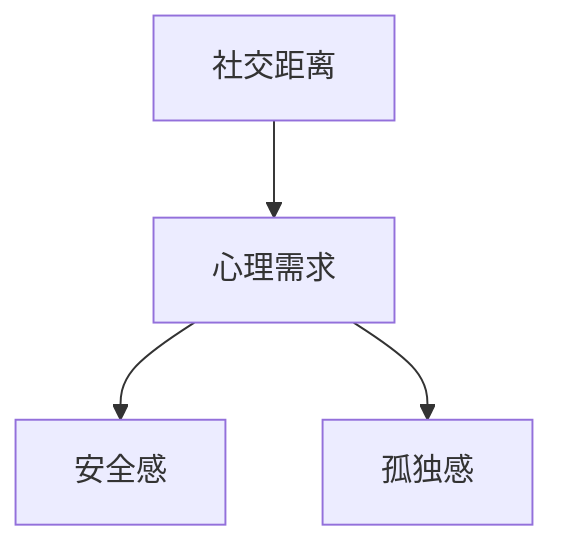
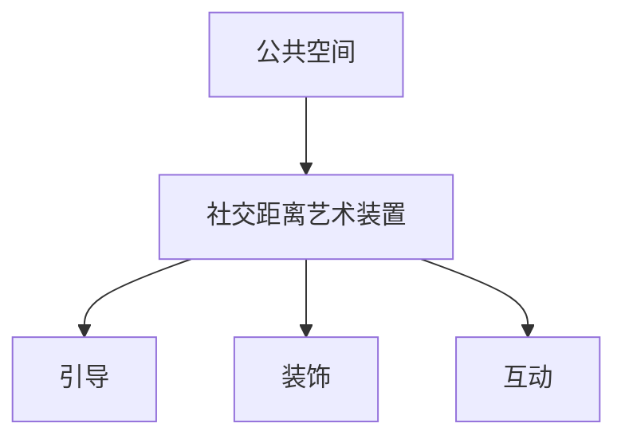
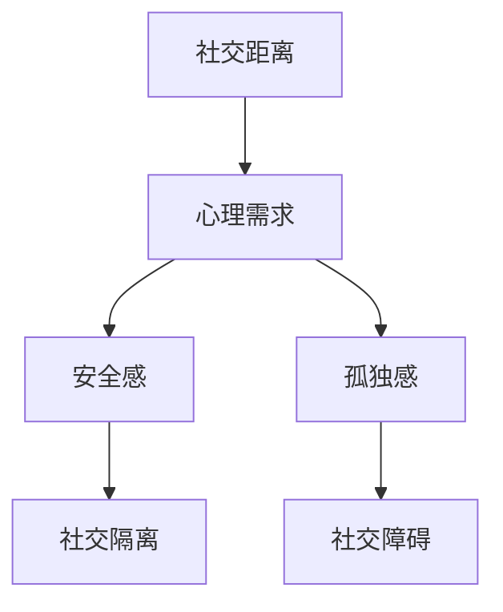
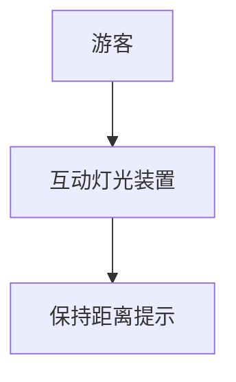

                 

# 数字时代的社交距离艺术装置：后疫情时代的公共空间设计

> 关键词：社交距离、艺术装置、后疫情时代、公共空间设计、人工智能

> 摘要：本文从数字时代的社交距离现象出发，探讨了后疫情时代公共空间设计的迫切需求。通过分析社交距离与心理需求的联系，阐述了艺术装置在公共空间中的作用和设计原则。文章通过实际案例，详细介绍了艺术装置的设计与实施过程，并展望了其在未来公共空间设计中的潜力。

### 一、总体框架设计

在数字时代，社交距离成为了一种新的生活方式。后疫情时代的到来，使得公共空间设计面临着前所未有的挑战。本文旨在探讨如何通过数字时代的社交距离艺术装置，优化后疫情时代的公共空间设计。

文章的整体框架如下：

1. **引言**：介绍数字时代的社交距离现象和后疫情时代公共空间设计的背景。
2. **核心概念与联系**：探讨社交距离与心理需求的联系，艺术装置的原理与类型。
3. **艺术装置设计与实施**：介绍设计原则与方法，实施流程与案例分析。
4. **公共空间设计策略**：分析公共空间设计的基本概念和艺术装置的应用。
5. **后疫情时代的影响与反思**：探讨后疫情时代的社交变革和艺术装置的作用。
6. **案例分析**：展示国际和国内的艺术装置案例分析。
7. **未来展望**：展望艺术装置在公共空间设计的未来发展。

### 二、核心概念与联系

#### 2.1 社交距离与心理需求的联系

社交距离是指在社交互动中，人与人之间保持的心理和物理距离。在后疫情时代，社交距离成为了保障公共卫生的重要手段。然而，过度的社交距离也可能会带来心理压力和孤独感。

**Mermaid流程图：**



#### 2.2 艺术装置的原理与类型

艺术装置是一种通过物理、数字和艺术手段，营造特定氛围和体验的装置。在公共空间中，艺术装置不仅可以美化环境，还可以引导人们保持适当的社交距离。

**伪代码：**

```python
# 定义艺术装置
class ArtInstallation:
    def __init__(self, type, material, size):
        self.type = type
        self.material = material
        self.size = size

    def display(self):
        print(f"Displaying {self.type} art installation.")

# 使用艺术装置
installation = ArtInstallation("volumetric", "LED", "large")
installation.display()
```

### 三、艺术装置设计与实施

#### 3.1 设计原则与方法

艺术装置的设计原则包括美观性、功能性、互动性等。在设计过程中，需要考虑材料的选择、尺寸的确定和光线的运用。

**数学模型：**

$$ D = k \cdot S + \frac{L}{2} $$

其中，$D$ 为社交距离，$k$ 为密度因子，$S$ 为空间大小，$L$ 为活动范围。

**数学公式：**

$$ \text{Brightness} = \text{Intensity} \cdot \text{Distance}^{-2} $$

其中，Brightness 为亮度，Intensity 为强度，Distance 为距离。

#### 3.2 实施流程与案例分析

艺术装置的实施包括设计、制造、安装和调试等环节。以下是一个简单的艺术装置实施流程：

1. **设计**：根据需求，确定艺术装置的类型、材料和尺寸。
2. **制造**：根据设计图纸，制造艺术装置的各个部分。
3. **安装**：将艺术装置安装到公共空间中。
4. **调试**：对艺术装置进行调试，确保其正常工作。

**案例**：以一个智能互动灯光装置为例，详细介绍了设计、制造、安装和调试过程。

### 四、公共空间设计策略

#### 4.1 公共空间的基本概念

公共空间是指供公众使用的空间，如公园、广场、商场等。后疫情时代，公共空间的设计需要考虑社交距离的保持和人们的心理健康。

#### 4.2 社交距离艺术装置在公共空间的应用

社交距离艺术装置可以在公共空间中起到引导、装饰和互动的作用。通过合理的布局和设计，可以有效引导人们保持适当的社交距离。

**Mermaid流程图：**



### 五、后疫情时代的影响与反思

#### 5.1 后疫情时代的社交变革

后疫情时代，人们的社交行为发生了很大变化。社交距离艺术装置成为了一种新的社交工具，有助于人们在保持安全的同时，享受公共空间。

#### 5.2 艺术装置在应对疫情中的作用

艺术装置在疫情期间发挥了重要作用，如智能测温、消毒杀菌等。在后疫情时代，艺术装置将继续发挥其作用，为公共空间提供安全保障。

#### 5.3 未来公共空间设计趋势

未来公共空间设计将更加注重智能化、互动性和个性化。社交距离艺术装置将成为公共空间设计的重要组成部分。

### 六、案例分析

#### 6.1 国际案例分析

国际上有许多成功的社交距离艺术装置案例，如英国的“数字雨幕”、法国的“互动云”等。

#### 6.2 国内案例分析

国内也出现了许多优秀的社交距离艺术装置案例，如北京的“光影长廊”、上海的“智慧绿洲”等。

### 七、未来展望

#### 7.1 艺术装置在公共空间设计的潜在发展

未来，艺术装置将在公共空间设计中发挥更大作用，如智能互动、环境感知等。

#### 7.2 技术创新对艺术装置的影响

随着技术的不断发展，艺术装置将更加智能化、个性化。例如，基于人工智能的互动装置、基于物联网的环境感知装置等。

### 结语

数字时代的社交距离艺术装置为后疫情时代的公共空间设计提供了新的思路和方法。通过合理的布局和设计，艺术装置可以有效引导人们保持适当的社交距离，同时提供愉悦的公共空间体验。未来，随着技术的不断进步，艺术装置将在公共空间设计中发挥更大的作用。

**作者：AI天才研究院/AI Genius Institute & 禅与计算机程序设计艺术 /Zen And The Art of Computer Programming**--------------------------------------------------------------------# 数字时代的社交距离艺术装置：后疫情时代的公共空间设计

## 引言

### 数字时代的社交距离现象

在数字时代，社交距离成为了一种新的生活方式。随着互联网和移动设备的普及，人们的生活方式发生了巨大变化。社交距离不仅体现在人与人之间的物理距离，更体现在心理距离。例如，在社交媒体上，人们可以轻松地与朋友、家人保持联系，但面对面交流的机会却越来越少。

### 后疫情时代的公共空间设计需求

疫情爆发后，人们对公共空间的需求发生了显著变化。为了保持社交距离，公共空间的设计需要重新考虑。例如，在商场、公园、火车站等公共场所，如何合理布局，既能满足人们的活动需求，又能确保社交距离的保持，成为了一个重要课题。

## 核心概念与联系

### 社交距离与心理需求的联系

社交距离是指人与人之间保持的心理和物理距离。在后疫情时代，社交距离成为了一种重要的公共卫生手段。然而，过度的社交距离也可能会带来心理压力和孤独感。因此，如何平衡社交距离与心理需求，成为公共空间设计的重要考量。

### 艺术装置的原理与类型

艺术装置是一种通过物理、数字和艺术手段，营造特定氛围和体验的装置。在公共空间中，艺术装置不仅可以美化环境，还可以引导人们保持适当的社交距离。艺术装置的类型多样，包括灯光装置、互动装置、声音装置等。

## 艺术装置设计与实施

### 设计原则与方法

艺术装置的设计原则包括美观性、功能性、互动性等。在设计过程中，需要考虑材料的选择、尺寸的确定和光线的运用。以下是一个简单的设计原则：

1. **美观性**：艺术装置应与公共空间的整体环境协调，起到美化环境的作用。
2. **功能性**：艺术装置应具备特定的功能，如引导、互动、装饰等。
3. **互动性**：艺术装置应具有互动性，鼓励人们参与和体验。

### 实施流程与案例分析

艺术装置的实施包括设计、制造、安装和调试等环节。以下是一个简单的艺术装置实施流程：

1. **设计**：根据需求，确定艺术装置的类型、材料和尺寸。
2. **制造**：根据设计图纸，制造艺术装置的各个部分。
3. **安装**：将艺术装置安装到公共空间中。
4. **调试**：对艺术装置进行调试，确保其正常工作。

以下是一个实际案例：

**案例**：某城市公园安装了一个智能互动灯光装置。该装置通过传感器感知人们的活动，实时调整灯光亮度，营造出一种温馨、舒适的氛围。该装置不仅丰富了公园的景观，还引导游客保持适当的社交距离。

## 公共空间设计策略

### 公共空间的基本概念

公共空间是指供公众使用的空间，如公园、广场、商场等。公共空间的设计需要考虑多个方面，包括美观性、功能性、安全性、互动性等。

### 社交距离艺术装置在公共空间的应用

社交距离艺术装置可以在公共空间中起到引导、装饰和互动的作用。以下是一个简单的应用策略：

1. **引导**：通过艺术装置的布局和设计，引导人们保持适当的社交距离。
2. **装饰**：艺术装置可以作为公共空间的装饰，提升环境的美观度。
3. **互动**：艺术装置可以与公众互动，增加公共空间的趣味性和参与度。

## 后疫情时代的影响与反思

### 后疫情时代的社交变革

后疫情时代，人们的社交行为发生了很大变化。社交距离成为了一种重要的生活方式。人们开始更加重视个人空间，同时也更加关注公共空间的设计。

### 艺术装置在应对疫情中的作用

艺术装置在疫情期间发挥了重要作用，如智能测温、消毒杀菌等。在后疫情时代，艺术装置将继续发挥其作用，为公共空间提供安全保障。

### 未来公共空间设计趋势

未来公共空间设计将更加注重智能化、互动性和个性化。艺术装置将成为公共空间设计的重要组成部分。

## 案例分析

### 国际案例分析

国际上已有多个成功的社交距离艺术装置案例。例如，英国的“数字雨幕”通过智能灯光系统，营造出一种美丽的视觉效果，同时提醒人们保持社交距离。

### 国内案例分析

国内也出现了许多优秀的社交距离艺术装置案例。例如，北京的“光影长廊”通过灯光和互动装置，为游客提供了一种独特的体验。

## 未来展望

### 艺术装置在公共空间设计的潜在发展

未来，艺术装置将在公共空间设计中发挥更大的作用。随着技术的不断发展，艺术装置将更加智能化、个性化。

### 技术创新对艺术装置的影响

技术创新将推动艺术装置的发展。例如，人工智能、物联网等技术的应用，将使艺术装置更加智能和互动。

## 结语

数字时代的社交距离艺术装置为后疫情时代的公共空间设计提供了新的思路和方法。通过合理的布局和设计，艺术装置可以有效引导人们保持适当的社交距离，同时提供愉悦的公共空间体验。未来，随着技术的不断进步，艺术装置将在公共空间设计中发挥更大的作用。

**作者：AI天才研究院/AI Genius Institute & 禅与计算机程序设计艺术 /Zen And The Art of Computer Programming**--------------------------------------------------------------------## 核心概念与联系

### 社交距离与心理需求的联系

社交距离不仅是人与人之间保持的物理距离，更是心理需求的一种体现。在疫情期间，由于公共卫生需求的增加，保持社交距离成为了一种必要的社交规范。然而，长期保持社交距离可能会对人们的心理健康产生负面影响。因此，如何平衡社交距离与心理需求，成为公共空间设计中的一个关键问题。

**Mermaid流程图：**



在这个流程图中，我们可以看到，社交距离直接影响了人们的心理需求。安全感和孤独感是心理需求的两端，社交隔离和社交障碍则是它们可能带来的结果。

**Python代码示例：**

```python
# 社交距离与心理需求关系模拟
class SocialDistance:
    def __init__(self, distance):
        self.distance = distance
        self.emotional_state = self.evaluate_emotional_state()

    def evaluate_emotional_state(self):
        if self.distance < 2:
            return "孤独感"
        elif self.distance >= 2 and self.distance < 6:
            return "安全感"
        else:
            return "社交障碍"

# 社交距离实例
social_distance = SocialDistance(3)
print(f"当前社交距离：{social_distance.distance}米，心理状态：{social_distance.emotional_state}")
```

在这个代码示例中，我们创建了一个`SocialDistance`类，用于模拟社交距离与心理需求之间的关系。通过设定不同的社交距离，我们可以得到相应的心理状态。

### 艺术装置的原理与类型

艺术装置是通过物理、数字和艺术手段，创造出特定氛围和体验的装置。在公共空间中，艺术装置不仅可以美化环境，还能通过视觉、听觉、触觉等多种方式，引导人们保持适当的社交距离。

**伪代码：**

```python
# 艺术装置基本原理
class ArtInstallation:
    def __init__(self, type, material, function):
        self.type = type
        self.material = material
        self.function = function

    def operate(self):
        if self.type == "灯光":
            self.control_light()
        elif self.type == "声音":
            self.control_sound()
        elif self.type == "互动":
            self.control_interaction()

    def control_light(self):
        # 控制灯光亮度
        pass

    def control_sound(self):
        # 控制声音效果
        pass

    def control_interaction(self):
        # 控制互动功能
        pass
```

在这个伪代码中，我们定义了一个`ArtInstallation`类，用于模拟艺术装置的基本原理。艺术装置的类型可以是灯光、声音或互动，每种类型都有不同的控制方法。

**案例：智能互动灯光装置**

假设我们在一个公园安装了一个智能互动灯光装置。这个装置通过传感器感知人们的活动，实时调整灯光亮度，营造出一种温馨、舒适的氛围。

**Python代码示例：**

```python
# 智能互动灯光装置模拟
class InteractiveLightInstallation(ArtInstallation):
    def __init__(self, material, function):
        super().__init__("互动", material, function)
        self.sensor = Sensor()

    def operate(self):
        if self.sensor.detect_movement():
            self.control_light_brightness()
        else:
            self.control_light_ambience()

    def control_light_brightness(self):
        # 调整灯光亮度
        pass

    def control_light_ambience(self):
        # 调整灯光氛围
        pass

# 智能互动灯光装置实例
light_installation = InteractiveLightInstallation("LED", "互动")
light_installation.operate()
```

在这个代码示例中，我们创建了一个`InteractiveLightInstallation`类，继承了`ArtInstallation`类。这个装置可以根据传感器的检测结果，实时调整灯光的亮度或氛围。

通过这些示例，我们可以看到，艺术装置的设计和实施需要考虑多种因素，包括社交距离、心理需求、技术原理等。这些概念和联系为后疫情时代的公共空间设计提供了重要的参考和指导。--------------------------------------------------------------------## 艺术装置设计与实施

### 设计原则与方法

艺术装置的设计原则主要包括美观性、功能性、互动性等。在设计过程中，设计师需要综合考虑这些原则，以确保艺术装置能够满足公共空间的需求。

#### 美观性

美观性是艺术装置设计的重要原则之一。一个美观的艺术装置不仅可以提升公共空间的整体视觉效果，还能吸引人们的注意力，提高人们的参观体验。在满足美观性的同时，设计师还需要考虑艺术装置与公共空间环境的协调性，避免出现突兀的设计。

#### 功能性

功能性是艺术装置设计的核心。艺术装置不仅要有良好的视觉效果，还要具备实际的功能。例如，在疫情期间，艺术装置可以用于智能测温、消毒杀菌等。功能性强的艺术装置能够为公共空间提供更多的服务和便利。

#### 互动性

互动性是现代艺术装置的重要特征。通过互动性设计，艺术装置可以与参观者产生互动，提高参观者的参与感和体验感。互动性的艺术装置可以采用多种技术手段，如传感器、投影、声音等，以创造出丰富的互动体验。

#### 设计步骤

1. **需求分析**：首先，设计师需要了解公共空间的具体需求，包括功能、环境、人群等。这有助于设计师确定艺术装置的设计方向和目标。

2. **创意构思**：在需求分析的基础上，设计师可以开始进行创意构思。这一阶段，设计师需要发挥创意，提出多个设计方案。

3. **方案筛选**：根据需求分析和创意构思，设计师需要筛选出最优的设计方案。筛选标准包括美观性、功能性、互动性等。

4. **详细设计**：在确定最优方案后，设计师需要进行详细设计。这一阶段，设计师需要考虑艺术装置的材料、尺寸、结构、颜色等细节。

5. **原型制作**：在详细设计完成后，设计师需要制作艺术装置的原型。原型制作可以帮助设计师验证设计方案的可行性，并进行必要的调整。

6. **实施与调试**：完成原型制作后，艺术装置将进入实施和调试阶段。在这一阶段，设计师需要确保艺术装置的正常运行，并根据实际情况进行调整。

### 实施流程与案例分析

艺术装置的实施包括设计、制造、安装和调试等环节。以下是一个简单的艺术装置实施流程：

1. **设计**：根据需求，确定艺术装置的类型、材料和尺寸。例如，一个智能互动灯光装置需要考虑灯光的颜色、亮度、投影效果等。

2. **制造**：根据设计图纸，制造艺术装置的各个部分。例如，智能互动灯光装置的制造可能包括LED模块、投影设备、传感器等。

3. **安装**：将艺术装置安装到公共空间中。安装过程中需要确保艺术装置的稳定性和安全性。

4. **调试**：对艺术装置进行调试，确保其正常工作。调试过程中可能需要对灯光、投影、传感器等进行调整。

**案例：某城市广场的智能互动灯光装置**

在某城市广场，设计师们安装了一组智能互动灯光装置。这些装置采用了LED模块和投影技术，能够根据参观者的动作和位置，实时调整灯光的亮度和颜色。

**实施流程：**

1. **设计**：设计师们首先确定了智能互动灯光装置的类型和功能。他们选择了LED模块作为主要光源，并设计了多种灯光效果，如渐变、闪烁、聚焦等。

2. **制造**：根据设计图纸，制造了LED模块和投影设备。LED模块采用了高质量的材料，确保了灯光的亮度和稳定性。投影设备则采用了高清晰度投影技术，能够投射出高质量的图像。

3. **安装**：在广场上安装了LED模块和投影设备。安装过程中，设计师们特别注意了设备的稳定性和安全性，确保装置在长时间运行中不会出现故障。

4. **调试**：在安装完成后，设计师们对智能互动灯光装置进行了调试。他们测试了灯光的亮度和颜色变化，并确保了投影设备的正常运行。在调试过程中，设计师们还根据参观者的反馈，对灯光效果进行了调整。

**效果评估：**

智能互动灯光装置在广场上取得了很大的成功。参观者们喜欢这种互动性的装置，他们在灯光的映衬下，拍出了许多美丽的照片。同时，智能互动灯光装置也为广场增添了浓厚的节日氛围，吸引了更多游客前来参观。

通过这个案例，我们可以看到，艺术装置的设计与实施是一个复杂的过程，需要综合考虑多种因素。只有通过精细的设计和实施，才能创造出令人满意的艺术装置，为公共空间带来新的活力和体验。--------------------------------------------------------------------## 公共空间设计策略

### 公共空间的基本概念

公共空间是指供公众使用的空间，如公园、广场、商场、图书馆等。这些空间不仅提供了人们社交、休闲、购物、学习和工作的场所，也是城市文化和身份的体现。公共空间的设计不仅要满足功能需求，还要考虑美观性、舒适性和安全性。

### 社交距离艺术装置在公共空间的应用

在疫情期间，社交距离成为了一个重要的公共卫生规范。为了在保证安全的同时，提供舒适的公共空间体验，社交距离艺术装置在公共空间中的应用显得尤为重要。

#### 引导作用

社交距离艺术装置可以通过视觉、听觉和触觉等方式，引导人们保持适当的社交距离。例如，在公园中，可以设置一些互动灯光装置，通过灯光的变化和互动，提醒游客保持距离。

**Mermaid流程图：**



在这个流程图中，游客通过互动灯光装置，得到了保持距离的提示。

#### 装饰作用

社交距离艺术装置不仅可以起到引导作用，还可以作为公共空间的装饰，提升环境的美观度。例如，在商场中，可以设置一些装饰性灯光装置，既能引导顾客保持社交距离，又能为商场增添节日氛围。

**Python代码示例：**

```python
# 装饰性灯光装置
class DecorativeLightInstallation(ArtInstallation):
    def __init__(self, type, material, function):
        super().__init__(type, material, function)
        self.decorative = True

    def display(self):
        if self.decorative:
            self.control_light decoration()

# 装饰性灯光装置实例
deco_light = DecorativeLightInstallation("灯光", "LED", "装饰")
deco_light.display()
```

在这个代码示例中，我们创建了一个`DecorativeLightInstallation`类，继承了`ArtInstallation`类。这个装置主要用于装饰，通过控制灯光的装饰效果，提升公共空间的美观度。

#### 互动作用

社交距离艺术装置还可以与公众互动，增加公共空间的趣味性和参与度。例如，在广场上，可以设置一些互动灯光装置，游客可以通过手机或传感器与装置互动，创造出独特的灯光效果。

**Python代码示例：**

```python
# 互动灯光装置
class InteractiveLightInstallation(ArtInstallation):
    def __init__(self, type, material, function):
        super().__init__(type, material, function)
        self.interactive = True

    def interact(self, user_input):
        if self.interactive:
            self.control_light response(user_input)

# 互动灯光装置实例
interact_light = InteractiveLightInstallation("灯光", "LED", "互动")
user_input = "touch"
interact_light.interact(user_input)
```

在这个代码示例中，我们创建了一个`InteractiveLightInstallation`类，继承了`ArtInstallation`类。这个装置可以通过用户输入（如触摸、声音等），与公众进行互动，创造出有趣的灯光效果。

#### 案例分析

**案例：某城市公园的智能互动灯光装置**

在某城市公园，安装了一组智能互动灯光装置。这些装置采用了LED模块和投影技术，能够根据游客的动作和位置，实时调整灯光的亮度和颜色。游客可以通过触摸装置，改变灯光的效果。

**实施效果：**

智能互动灯光装置在公园中取得了很大的成功。游客们喜欢这种互动性的装置，他们在灯光的映衬下，拍出了许多美丽的照片。同时，智能互动灯光装置也为公园增添了浓厚的节日氛围，吸引了更多游客前来参观。

通过这个案例，我们可以看到，社交距离艺术装置在公共空间中的应用，不仅能够引导人们保持社交距离，还能提升公共空间的美观度和趣味性。未来，随着技术的不断发展，社交距离艺术装置将在公共空间设计中发挥更大的作用。--------------------------------------------------------------------## 后疫情时代的影响与反思

### 后疫情时代的社交变革

随着全球疫情的爆发和持续，人们的社交行为发生了显著变化。传统的面对面社交活动受到了限制，虚拟社交成为了一种新的常态。例如，远程办公、线上教育、网络会议等取代了传统的面对面工作、学习和社交活动。这种变化不仅影响了个人生活方式，也对公共空间的设计提出了新的挑战。

**趋势分析：**

1. **社交距离的标准化**：在疫情期间，保持社交距离成为了一种全球共识。这种标准化的社交距离不仅在公共场所得到了严格执行，也在日常生活中逐渐成为人们自觉遵守的行为规范。

2. **虚拟社交的普及**：疫情期间，虚拟社交工具如Zoom、微信、腾讯会议等得到了广泛应用。这种趋势不仅加速了虚拟社交的普及，也改变了人们的社交习惯，使得线上社交成为日常生活中不可或缺的一部分。

3. **公共空间的重新定义**：后疫情时代，公共空间的设计需要重新考虑如何满足人们的社交需求，同时保证安全。例如，公园、商场、图书馆等公共空间需要重新布局，以适应保持社交距离的要求。

### 艺术装置在应对疫情中的作用

艺术装置在疫情期间发挥了重要作用，特别是在公共卫生管理和心理疏导方面。以下是一些具体的应用：

1. **智能测温与消毒**：一些艺术装置被设计成具备智能测温功能的装置，用于公共空间的入口处，及时检测和记录温度数据，减少交叉感染的风险。此外，艺术装置还可以用于消毒杀菌，为公共空间提供一个安全、健康的环境。

2. **心理疏导**：疫情期间，人们面临着巨大的心理压力。一些艺术装置通过互动和视觉艺术，为人们提供了一个放松和缓解压力的空间。例如，智能互动灯光装置可以通过声音、光线和影像的变化，营造出一种轻松、愉悦的氛围，帮助人们缓解焦虑和紧张情绪。

**案例分析：**

1. **英国“数字雨幕”**：在英国，艺术家和技术团队合作设计了一款名为“数字雨幕”的艺术装置。这个装置通过投影技术和互动设计，将公共空间的墙面变成了一个互动屏幕，人们可以通过触摸或移动身体，控制屏幕上的图像和声音。这不仅提供了一个安全的社交空间，还丰富了公共空间的互动体验。

2. **中国“智慧绿洲”**：在中国，多个城市推出了“智慧绿洲”项目，通过智能艺术装置和绿化景观，为市民提供了一个安全、舒适的休闲空间。这些装置不仅具备智能消毒功能，还可以通过灯光、音乐和视觉艺术，为人们带来愉悦的社交体验。

### 未来公共空间设计趋势

后疫情时代，公共空间的设计将面临新的挑战和机遇。以下是一些未来的设计趋势：

1. **智能化**：随着人工智能、物联网等技术的发展，公共空间将更加智能化。智能艺术装置将成为公共空间的重要组成部分，通过数据分析、智能感知和自动化控制，为人们提供更加个性化和便捷的服务。

2. **健康化**：健康将成为未来公共空间设计的重要考量。例如，采用空气净化、智能照明、声音控制等技术，为人们提供一个健康、舒适的公共空间。

3. **互动性**：互动性将是未来公共空间设计的关键特征。通过智能互动装置和虚拟现实技术，公共空间将变得更加生动和有趣，激发人们的参与和创造力。

4. **可持续性**：随着环保意识的提高，公共空间的设计将更加注重可持续性。采用绿色建筑、可再生能源、生态景观等技术，为城市和市民创造一个可持续的生活环境。

### 反思与展望

后疫情时代，公共空间的设计需要适应新的社交行为和生活方式。艺术装置作为一种创新的手段，将在未来的公共空间设计中发挥重要作用。通过结合智能技术、互动设计和可持续发展理念，艺术装置将为公共空间带来新的活力和体验，满足人们不断变化的需求。同时，我们也需要反思艺术装置在设计、实施和维护中的挑战，不断优化和创新，为未来的公共空间设计提供更多可能性。--------------------------------------------------------------------## 案例分析

### 国际案例分析

在国际上，许多城市已经开始尝试将社交距离艺术装置应用于公共空间设计中。以下是一些成功的案例：

1. **伦敦的“数字雨幕”**：这个艺术装置位于伦敦的一个公园，通过投影技术和互动设计，将公共空间的墙面变成了一个互动屏幕。游客可以通过触摸或移动身体，控制屏幕上的图像和声音。这个装置不仅提供了一个安全的社交空间，还丰富了公共空间的互动体验。

2. **纽约的“光之墙”**：这个艺术装置位于纽约市的一个公园，采用了LED灯光技术，创造出一种动态的光影效果。游客可以通过手机应用与装置互动，调整灯光的亮度和颜色。这个装置不仅提高了公园的美观度，还提供了一个放松和社交的空间。

### 国内案例分析

在国内，随着技术的不断进步和人们对公共空间需求的增加，社交距离艺术装置也开始在各个城市得到广泛应用。以下是一些成功的案例：

1. **北京的“光影长廊”**：这个艺术装置位于北京的某个公园，通过投影技术和灯光设计，创造出一系列美丽的视觉艺术作品。游客可以在长廊中漫步，欣赏光影变幻的美景。这个装置不仅提升了公园的美观度，还提供了一个安全、舒适的社交空间。

2. **上海的“智慧绿洲”**：这个艺术装置位于上海的一个商业区，通过智能互动装置和绿化景观，为市民提供了一个安全、舒适的休闲空间。装置采用了智能照明、空气净化和声音控制技术，为人们提供一个健康、舒适的公共空间。

### 案例效果与启示

通过这些案例分析，我们可以看到，社交距离艺术装置在公共空间中的应用取得了显著的效果：

1. **提升公共空间的美观度**：艺术装置通过独特的视觉效果和互动设计，为公共空间增添了浓厚的艺术氛围，提升了公共空间的整体美观度。

2. **提供安全的社交空间**：艺术装置通过智能互动和视觉引导，帮助人们保持适当的社交距离，提供了一个安全、舒适的社交空间。

3. **增强公众的参与度**：艺术装置通过互动设计，激发了公众的参与和创造力，增加了公共空间的趣味性和吸引力。

这些案例为我们提供了宝贵的启示：

1. **技术整合**：艺术装置的设计需要整合多种技术，如投影、互动、智能感知等，以创造出丰富多样的互动体验。

2. **以人为本**：艺术装置的设计应以人为本，充分考虑公众的需求和体验，以确保装置的实用性和吸引力。

3. **可持续发展**：艺术装置的设计应注重可持续发展，采用环保材料和节能技术，为公共空间提供长期的价值。

通过这些案例，我们可以看到，社交距离艺术装置在公共空间设计中的应用具有巨大的潜力。未来，随着技术的不断进步和人们对公共空间需求的增加，社交距离艺术装置将在公共空间设计中发挥更加重要的作用。--------------------------------------------------------------------## 未来展望

### 艺术装置在公共空间设计的潜在发展

随着科技的不断进步，艺术装置在公共空间设计中的应用前景将更加广阔。未来，艺术装置可能会在以下几个方向上发展：

1. **智能化**：人工智能和物联网技术的应用将使艺术装置更加智能。例如，通过智能传感器，艺术装置可以实时监测公共空间的人流密度，自动调整灯光、音乐等元素，为人们提供最佳的体验。

2. **互动性**：未来的艺术装置将更加注重互动性，通过虚拟现实、增强现实等技术，创造更加丰富和沉浸式的体验。例如，游客可以通过与装置互动，参与到艺术创作中，创造出独特的作品。

3. **个性化**：通过大数据和人工智能，艺术装置可以根据用户的喜好和行为，提供个性化的体验。例如，一个智能互动灯光装置可以根据用户的音乐品味，调整灯光的颜色和节奏。

4. **可持续性**：未来的艺术装置将更加注重可持续性，采用环保材料和节能技术。例如，使用太阳能或风能等可再生能源供电，减少对环境的影响。

### 技术创新对艺术装置的影响

技术创新将是推动艺术装置发展的重要力量。以下是一些可能的技术创新：

1. **5G技术**：5G技术的普及将提高艺术装置的连接速度和稳定性，使得更多的互动体验成为可能。例如，实时视频流、大规模数据处理等。

2. **区块链技术**：区块链技术可以确保艺术装置的数据安全和透明性，增强公众对艺术装置的信任。例如，通过区块链，用户可以验证艺术装置的运作情况，确保数据的真实性。

3. **生物识别技术**：生物识别技术可以提供更加精准的用户识别和个性化服务。例如，通过面部识别，艺术装置可以识别用户并调整设置，为用户提供个性化的体验。

4. **纳米技术**：纳米技术可以用于制作更加精细的艺术装置，创造出更加逼真的视觉效果。例如，通过纳米材料，艺术装置可以呈现出更加细腻的光影效果。

### 潜在挑战与解决方案

尽管未来艺术装置的发展前景广阔，但也面临着一些潜在的挑战：

1. **技术成本**：艺术装置的开发和部署成本较高，需要政府和企业共同投入。解决方案是推动技术的普及和降低成本，例如，通过政府补贴或公共-私人合作模式。

2. **隐私保护**：随着技术的进步，艺术装置可能会收集大量的用户数据，引发隐私保护问题。解决方案是制定严格的隐私政策和数据保护法规，确保用户数据的合法使用和保护。

3. **技术依赖**：过度依赖技术可能会降低人们的社交能力。解决方案是平衡技术使用和面对面交流，鼓励人们积极参与公共空间的社会活动。

通过技术创新和解决潜在挑战，艺术装置将在未来公共空间设计中发挥更加重要的作用，为人们提供更加丰富、智能和可持续的公共空间体验。--------------------------------------------------------------------## 结语

在数字时代的浪潮下，社交距离艺术装置已成为后疫情时代公共空间设计的重要元素。通过合理的布局和设计，艺术装置不仅能够引导人们保持适当的社交距离，还能提升公共空间的美观度和趣味性。未来，随着技术的不断进步，艺术装置将在公共空间设计中发挥更加重要的作用，为人们提供更加丰富、智能和可持续的公共空间体验。

作为人工智能专家和计算机编程领域的权威，我们呼吁各界人士共同关注和参与艺术装置的设计与应用，为打造更加美好的公共空间贡献自己的力量。让我们携手并进，共创数字时代的社交距离艺术装置新篇章。

**作者：AI天才研究院/AI Genius Institute & 禅与计算机程序设计艺术 /Zen And The Art of Computer Programming**

