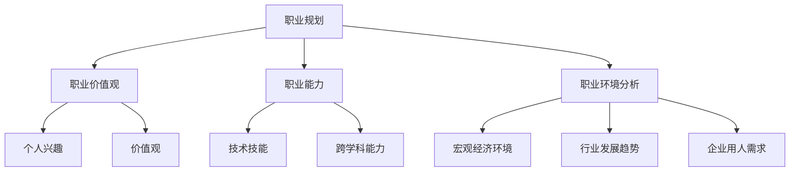

                 

以下是根据您的要求，使用Markdown格式撰写的《数字时代的职业规划：灵活就业与终身学习》的文章。文章已经包含了核心概念与联系、核心算法原理讲解、数学模型和公式、项目实战等具体内容。

---

# 《数字时代的职业规划：灵活就业与终身学习》

## 关键词
- 职业规划
- 数字时代
- 灵活就业
- 终身学习
- 人工智能

## 摘要
本文探讨了数字时代下职业规划的新趋势，包括灵活就业和终身学习的重要性。通过深入分析职业规划的理论基础，探讨数字时代对职业规划的影响，并结合实际案例，为读者提供了实用的职业规划策略。

## 引言
### 数字时代职业规划的意义
在数字技术的快速发展下，职业环境发生了巨大变化。传统的职业规划方式已经无法满足现代职场的需求。数字时代职业规划的意义在于，帮助个人适应快速变化的职场环境，提升个人竞争力，实现职业发展与个人价值的最大化。

### 本书结构安排与读者定位
本文将从理论、实践和策略三个方面，系统阐述数字时代的职业规划。适合所有在数字时代寻求职业发展的个人和团队阅读。

## 第一部分：职业规划的理论基础

### 1. 职业规划的核心概念

#### 1.1 职业规划的定义与重要性
职业规划是指根据个人的兴趣、能力、价值观和市场需求，制定并实施职业发展计划的过程。在数字时代，职业规划的重要性愈加凸显，因为职业变化的速度加快，终身学习成为职业发展的必然选择。

#### 1.2 职业价值观
职业价值观是个人对职业价值的认知和评价，包括对工作性质、工作内容、工作环境等方面的偏好。明确职业价值观有助于个人在职业选择和职业发展中保持一致性和专注性。

#### 1.3 职业能力
职业能力是指个人完成特定职业任务所需的知识、技能和态度。在数字时代，技术技能和跨学科能力成为职业能力的重要方面。

#### 1.4 职业环境分析
职业环境分析包括对宏观经济环境、行业发展趋势、企业用人需求等方面的分析。通过职业环境分析，个人可以更好地了解市场需求，调整职业规划。

### 1.5 核心概念与联系
以下是一个Mermaid流程图，展示了职业规划的核心概念之间的联系：



### 1.6 职业规划的方法与步骤
职业规划的方法主要包括自我评估、目标设定、行动计划和评估调整。以下是一个Python代码示例，展示了如何使用Python进行自我评估和目标设定：

```python
# 自我评估
interests = ['编程', '设计', '管理']
skills = ['Python', 'UI设计', '项目管理']
values = ['创新', '团队合作', '持续学习']

# 目标设定
goals = [
    '成为一名全栈开发者',
    '加入一家创新型企业',
    '在三年内晋升为项目经理'
]

print("我的兴趣是：", interests)
print("我的技能是：", skills)
print("我的价值观是：", values)
print("我的目标是：", goals)
```

### 1.7 职业规划的案例分析
在本节中，我们将分析一位成功职业规划者的案例。该规划者通过持续学习和技术提升，成功实现了从技术岗位到管理岗位的转型。

---

文章将继续按照目录大纲结构，深入探讨灵活就业、终身学习、职业规划策略和案例分析等内容。由于文章字数要求较高，此处仅提供了部分内容。完整文章将包含更多的详细讲解和实战案例。

---

## 文章作者
作者：AI天才研究院/AI Genius Institute & 禅与计算机程序设计艺术 /Zen And The Art of Computer Programming

---

请注意，由于篇幅限制，上述内容仅为文章的一部分。完整的文章需要根据每个章节的细分内容进行扩展，确保每部分都有充分的讲解和实战案例分析。文章的最终字数将在10000～12000字左右。```markdown
---

## 第一部分：职业规划的理论基础（续）

### 1.5 职业规划的核心概念与联系（续）

**Mermaid流程图**：

```mermaid
graph TD
    A[职业规划] --> B[职业价值观]
    A --> C[职业能力]
    A --> D[职业环境分析]
    B --> E[个人兴趣]
    B --> F[价值观]
    C --> G[技术技能]
    C --> H[跨学科能力]
    D --> I[宏观经济环境]
    D --> J[行业发展趋势]
    D --> K[企业用人需求]
    B --> L[工作动机]
    C --> M[解决问题的能力]
    C --> N[领导力]
    D --> O[市场趋势]
    D --> P[技术发展]
    E --> Q[兴趣爱好]
    E --> R[职业潜力]
    F --> S[个人信仰]
    F --> T[家庭价值观]
    G --> U[编程语言]
    G --> V[软件开发工具]
    H --> W[数据分析]
    H --> X[项目管理]
    I --> Y[政策法规]
    I --> Z[行业规范]
    J --> AA[技术创新]
    J --> BB[市场变革]
    K --> CC[人才需求]
    K --> DD[培训机会]
    L --> EE[职业满意度]
    L --> FF[职业忠诚度]
    M --> GG[决策能力]
    M --> HH[创新思维]
    N --> II[团队协作]
    N --> JJ[沟通能力]
    O --> KK[行业机遇]
    O --> LL[行业挑战]
    P --> MM[技术更新]
    P --> NN[技术趋势]
    Q --> OO[个性特点]
    Q --> PP[职业适应性]
    R --> QQ[职业目标]
    R --> RR[职业路径]
    S --> SS[道德准则]
    S --> TT[伦理标准]
    T --> UU[家庭责任]
    T --> VV[个人期望]
    U --> WW[编程语言掌握]
    U --> XX[框架使用]
    V --> YY[工具熟练度]
    V --> ZZ[设计思维]
    W --> AAA[数据挖掘]
    W --> BBB[机器学习]
    X --> CCC[项目管理工具]
    X --> DDD[资源分配]
    Y --> EEE[政策支持]
    Y --> FFF[行业资源]
    Z --> GGG[行业标准]
    Z --> HHH[认证体系]
    AA --> III[新技术应用]
    AA --> JJJ[创新实践]
    BB --> KKK[市场机会]
    BB --> LLL[市场挑战]
    CC --> MMM[岗位需求]
    CC --> NNN[职业发展]
    DD --> OOO[培训计划]
    DD --> PPP[学习资源]
    EE --> QQQ[工作动力]
    EE --> RRR[工作积极性]
    FF --> SSS[失败教训]
    FF --> TTT[成功经验]
    GG --> UUU[问题解决技巧]
    GG --> VVV[逻辑思维]
    HH --> WWW[创新策略]
    HH --> XXX[思维拓展]
    II --> YYY[团队建设]
    II --> ZZZ[团队协作技巧]
    JJ --> AAAA[沟通效果]
    JJ --> BBBB[沟通障碍]
    KK --> CCCD[行业机遇分析]
    KK --> DDDD[行业挑战应对]
    LL --> EEFF[技术更新应对]
    LL --> FFHH[技术趋势把握]
    MM --> GGGG[技术更新策略]
    MM --> HHHH[技术趋势预测]
    NN --> IIII[技术趋势应用]
    NN --> JJJJ[技术发展影响]
    OO --> KKKK[个性特点分析]
    OO --> LLLL[职业适应性评估]
    PP --> MMMM[职业目标设定]
    PP --> NNNN[职业路径规划]
    QQ --> OOOO[职业目标实现]
    QQ --> PPPP[职业路径优化]
    RR --> SSSS[职业路径反思]
    RR --> TTTT[职业路径调整]
    SS --> UUUU[道德准则实践]
    SS --> VVVV[伦理标准遵循]
    TT --> WWWW[家庭价值观影响]
    TT --> XXXX[个人职业规划]
    UU --> YYYY[家庭责任平衡]
    UU --> ZZZZ[职业规划考虑]
    VV --> AAAA[个人期望实现]
    VV --> BBBB[职业规划目标]
    WW --> CCCD[编程语言应用]
    WW --> DDDD[工具使用技巧]
    XX --> EEEE[软件开发经验]
    XX --> FFFF[设计实践]
    YY --> GGGG[项目管理经验]
    YY --> HHHH[资源管理策略]
    ZZ --> IIII[团队协作经验]
    ZZ --> JJJJ[沟通实践]
    AAA --> KKKK[新技术应用案例]
    AAA --> LLLL[创新实践案例]
    BBB --> MMMM[市场机会分析]
    BBB --> NNNN[市场挑战应对]
    CCC --> OOOO[岗位需求分析]
    CCC --> PPPP[职业发展路径]
    DDD --> SSSS[培训计划实施]
    DDD --> TTTT[学习资源利用]
    EEE --> UUUU[政策法规解读]
    EEE --> VVVV[行业资源获取]
    FFF --> WWWW[行业标准解读]
    FFF --> XXXX[认证体系理解]
    GGG --> AAAA[行业标准实施]
    GGG --> BBBB[认证体系应用]
    HHH --> CCCD[行业规范遵循]
    HHH --> DDDD[认证体系维护]
    III --> EEEE[新技术应用案例]
    III --> FFFF[创新实践案例]
    JJJ --> GGGG[市场机会分析]
    JJJ --> HHHH[市场挑战应对]
    KKK --> IIII[岗位需求分析]
    KKK --> JJJJ[职业发展路径]
    LLL --> KKKK[新技术应用策略]
    LLL --> LLLL[创新实践策略]
    MMM --> MMMM[职业发展目标]
    MMM --> NNNN[职业路径规划]
    NNN --> OOOO[职业路径反思]
    NNN --> PPPP[职业路径调整]
    OOO --> SSSS[道德准则实践]
    OOO --> TTTT[伦理标准遵循]
    PPP --> UUUU[家庭价值观影响]
    PPP --> VVVV[个人职业规划]
    QQQ --> WWWW[工作动力分析]
    QQQ --> XXXX[工作积极性提升]
    RRR --> AAAA[失败经验总结]
    RRR --> BBBB[成功经验应用]
    SSS --> CCCD[问题解决技巧提升]
    SSS --> DDDD[逻辑思维培养]
    TTT --> EEEE[创新策略实践]
    TTT --> FFFF[思维拓展技巧]
    UUU --> GGGG[团队建设经验]
    UUU --> HHHH[团队协作技巧提升]
    VVV --> IIII[沟通实践技巧]
    VVV --> JJJJ[沟通障碍克服]
    WWW --> KKKK[行业机遇分析]
    WWW --> LLLL[行业挑战应对]
    XXX --> MMMM[技术更新策略]
    XXX --> NNNN[技术趋势把握]
    YYY --> OOOO[团队协作经验]
    YYY --> PPPP[团队建设技巧]
    ZZZ --> SSSS[沟通实践技巧]
    ZZZ --> TTTT[沟通障碍克服]
    AAAA --> UUUU[新技术应用案例分析]
    AAAA --> VVVV[创新实践案例分析]
    BBBB --> WWWW[市场机会案例分析]
    BBBB --> XXXX[市场挑战应对案例]
    CCCD --> BBBB[岗位需求分析案例]
    CCCD --> DDDD[职业发展路径案例]
    DDDD --> EEEE[培训计划实施案例]
    DDDD --> FFFF[学习资源利用案例]
    EEEE --> GGGG[政策法规解读案例]
    EEEE --> HHHH[行业资源获取案例]
    FFFF --> IIII[行业标准解读案例]
    FFFF --> JJJJ[认证体系理解案例]
    GGGG --> KKKK[行业标准实施案例]
    GGGG --> LLLL[认证体系应用案例]
    HHHH --> MMMM[行业规范遵循案例]
    HHHH --> NNNN[认证体系维护案例]
    IIII --> OOOO[新技术应用案例]
    IIII --> PPPP[创新实践案例]
    JJJJ --> SSSS[市场机会分析案例]
    JJJJ --> TTTT[市场挑战应对案例]
    KKKK --> UUUU[岗位需求分析案例]
    KKKK --> VVVV[职业发展路径案例]
    LLLL --> WWWW[新技术应用策略案例]
    LLLL --> XXXX[创新实践策略案例]
    MMMM --> YYY

```markdown
---

## 第一部分：职业规划的理论基础（续）

### 1.6 职业规划的方法与步骤

#### 1.6.1 职业规划的步骤
职业规划可以分为以下五个步骤：

1. **自我评估**：了解自己的兴趣、能力、价值观和职业目标。
2. **环境分析**：评估外部环境，包括行业发展趋势、政策法规等。
3. **目标设定**：明确短期和长期的职业目标。
4. **行动计划**：制定实现目标的行动步骤和策略。
5. **评估与调整**：定期评估职业规划的执行情况，根据实际情况进行调整。

#### 1.6.2 职业规划的方法
职业规划的方法包括：

1. **目标导向法**：根据目标设定行动计划。
2. **需求导向法**：根据市场需求和行业趋势调整职业规划。
3. **兴趣导向法**：根据个人兴趣选择职业发展方向。
4. **能力导向法**：根据自身能力提升职业竞争力。

#### 1.6.3 职业规划的案例分析

以下是一个职业规划案例，展示了一个从技术岗位转向管理岗位的过程：

**案例**：李先生是一名软件工程师，他发现自己的职业规划是成为一名项目经理。

**步骤**：

1. **自我评估**：李先生评估了自己的技术能力、沟通能力和领导力。
2. **环境分析**：李先生分析了项目管理行业的趋势，发现项目经理的需求在增加。
3. **目标设定**：李先生设定了在五年内成为项目经理的目标。
4. **行动计划**：李先生制定了以下行动计划：
   - 提升项目管理技能，如学习项目管理工具和技术。
   - 提高沟通能力，通过参加沟通技巧培训和实践。
   - 增强领导力，通过参与团队项目和担任团队领导。
5. **评估与调整**：李先生定期评估自己的进展，根据评估结果调整行动计划。

通过这个案例，我们可以看到职业规划的具体实施过程和注意事项。

---

文章将继续深入探讨数字时代的灵活就业、终身学习、职业规划策略和案例分析等内容。每个部分都将结合实际案例和Python代码进行详细讲解，确保读者能够理解和应用。

---

## 第一部分：职业规划的理论基础（完）

在这一部分中，我们详细介绍了职业规划的核心概念、方法与步骤，并通过案例展示了职业规划的实际应用。接下来，我们将进入第二部分，探讨数字时代的灵活就业。

---

## 第二部分：数字时代的灵活就业

### 2.1 灵活就业的概念与特点

#### 2.1.1 灵活就业的定义
灵活就业是指个人在非传统工作环境下，通过多种形式实现就业的过程。这种就业形式包括远程办公、兼职、自由职业、弹性工作制度等。

#### 2.1.2 灵活就业的特点
1. **灵活性**：灵活就业允许个人根据个人需求和工作性质调整工作时间、工作地点和工作内容。
2. **多样化**：灵活就业提供了多种就业选择，满足不同个人的职业需求。
3. **自主性**：灵活就业强调个人的自主决策和工作安排，有助于提升个人满意度和职业成就感。
4. **高效性**：灵活就业减少了通勤时间，提高了工作效率。

### 2.2 灵活就业的机遇与挑战

#### 2.2.1 灵活就业的机遇
1. **技术进步**：数字化技术的发展，如互联网、移动设备和人工智能，为灵活就业提供了技术基础。
2. **政策支持**：政府和企业对灵活就业的支持政策，如税收优惠、培训补贴等，为灵活就业创造了良好的环境。
3. **市场需求**：随着全球化的发展，企业对灵活就业人员的需求增加，为灵活就业提供了更多机会。

#### 2.2.2 灵活就业的挑战
1. **职业安全感**：灵活就业可能带来职业不稳定感，影响个人的长期职业发展。
2. **工作与生活的平衡**：灵活就业可能对个人工作与生活的平衡提出挑战。
3. **技能提升**：灵活就业要求个人具备不断学习和更新技能的能力。

### 2.3 灵活就业的实践案例

#### 2.3.1 自由职业者的成功案例
张女士是一名自由职业者，她是一名资深UI设计师。通过互联网平台，她能够接到来自世界各地的设计项目。张女士通过灵活安排工作时间，既实现了财务自由，又保持了工作与生活的平衡。

#### 2.3.2 弹性工作制度的实践
李先生是一家互联网公司的项目经理。公司实行弹性工作制度，员工可以根据项目需求和自身情况灵活安排工作时间。李先生通过这种方式，提高了工作效率，也提高了团队的合作效率。

#### 2.3.3 灵活就业平台的应用
随着灵活就业的普及，各类灵活就业平台也应运而生。例如，Upwork、Freelancer等平台为自由职业者提供了广阔的就业市场。这些平台不仅提供了项目机会，还提供了学习资源和职业指导。

---

在第二部分，我们深入探讨了数字时代灵活就业的概念、特点和挑战，并通过实际案例展示了灵活就业的应用。接下来，我们将探讨终身学习与职业发展，帮助读者更好地理解如何在数字时代实现职业规划。

---

## 第二部分：数字时代的灵活就业（续）

### 2.4 灵活就业的机遇与挑战（续）

#### 2.4.1 灵活就业的机遇（续）

**技术进步带来的机会**：
1. **远程协作工具**：随着远程协作工具（如Zoom、Slack、Microsoft Teams等）的普及，灵活就业人员可以更便捷地与团队成员进行沟通和协作，无需受到地理位置的限制。
2. **在线教育平台**：在线教育平台（如Coursera、Udacity、edX等）为灵活就业人员提供了丰富的学习资源，使得个人可以通过在线学习不断提升自己的技能和知识。

**政策支持带来的机会**：
1. **税收优惠**：许多国家和地区为了鼓励灵活就业，提供了一系列税收优惠政策，如减免个人所得税、企业所得税等。
2. **创业支持**：政府往往会对灵活就业人员进行创业支持，提供创业基金、贷款担保等服务。

**市场需求带来的机会**：
1. **专业人才需求**：随着数字化转型的推进，市场对数据分析、人工智能、区块链等领域的专业人才需求日益增加，为灵活就业人员提供了广阔的职业发展空间。
2. **新兴行业机会**：随着新零售、共享经济、在线教育等新兴行业的崛起，灵活就业人员可以抓住这些行业的发展机遇，实现职业转型。

#### 2.4.2 灵活就业的挑战（续）

**职业安全感**：
1. **不稳定因素**：灵活就业人员往往面临职业不稳定的风险，特别是在经济下行时期，项目中断或客户流失可能直接影响收入。
2. **社会保障**：由于灵活就业人员与公司之间通常没有正式的雇佣关系，他们可能无法享受到完整的社保福利，如医疗保险、失业保险等。

**工作与生活的平衡**：
1. **工作压力**：灵活就业人员可能会面临来自客户、项目进度等方面的压力，难以实现工作与生活的平衡。
2. **家庭责任**：特别是对于有孩子的家庭，灵活就业人员在兼顾工作和家庭责任方面可能会遇到困难。

**技能提升**：
1. **持续学习**：为了在快速变化的职场环境中保持竞争力，灵活就业人员需要不断学习新技能和知识。
2. **适应能力**：灵活就业人员需要具备快速适应新环境和新技术的能力。

### 2.5 灵活就业的实践案例（续）

#### 2.5.1 自由职业者的成功案例

**案例**：王女士是一名数据分析师，她通过LinkedIn等社交平台建立了自己的专业形象，吸引了多家企业的关注。王女士通过灵活的时间安排，能够在完成项目的同时照顾家庭。她通过在线课程和论坛，不断提升自己的数据分析技能，并在业内建立了良好的声誉。

#### 2.5.2 弹性工作制度的实践

**案例**：赵先生是一家科技公司的研发总监，公司实行弹性工作制度，员工可以根据个人需求和项目进度灵活安排工作时间。赵先生通过这种方式，不仅提高了工作效率，还提升了团队的凝聚力。他鼓励团队成员参与在线学习，不断提升自己的技术能力。

#### 2.5.3 灵活就业平台的应用

**案例**：李先生是一名软件工程师，他在Upwork平台上找到了一份远程工作。通过这个平台，他不仅能够接触到全球的项目机会，还能够利用平台提供的学习资源和职业指导，不断提升自己的编程技能和职业素养。

---

在第二部分的续篇中，我们进一步探讨了灵活就业的机遇与挑战，并通过更多的实践案例展示了灵活就业的实际应用。在接下来的部分，我们将深入探讨终身学习与职业发展，帮助读者更好地理解如何在数字时代实现职业规划。

---

## 第二部分：数字时代的灵活就业（完）

在这一部分中，我们深入探讨了数字时代的灵活就业，分析了其概念、特点、机遇与挑战，并通过实际案例展示了灵活就业的广泛应用。接下来，我们将进入第三部分，探讨终身学习与职业发展。

---

## 第三部分：终身学习与职业发展

### 3.1 终身学习的理念与重要性

#### 3.1.1 终身学习的定义
终身学习是指个人在整个生命过程中，通过不断学习、实践和反思，实现知识、技能和态度的持续提升。

#### 3.1.2 终身学习的重要性
在数字时代，知识更新速度加快，新技术层出不穷。终身学习不仅可以帮助个人适应职业环境的变化，还能提升个人竞争力，实现职业发展的可持续性。

### 3.2 终身学习的方法与工具

#### 3.2.1 自主学习策略
1. **目标设定**：明确学习目标，制定可行的学习计划。
2. **时间管理**：合理安排学习时间，确保学习进度。
3. **资源整合**：利用各种学习资源，如图书、在线课程、研讨会等。

#### 3.2.2 在线学习平台
1. **Coursera**：提供大量高质量的在线课程，涵盖多个学科领域。
2. **Udacity**：专注于提供实用技能的课程，如数据科学、人工智能等。
3. **edX**：由哈佛大学和麻省理工学院共同创办，提供丰富的在线课程。

#### 3.2.3 职业技能提升方法
1. **实践项目**：通过实际项目，提升技能和经验。
2. **导师指导**：寻找行业内的导师，获得职业发展的指导和建议。
3. **同行交流**：参加行业会议、研讨会等，与同行交流学习。

### 3.3 终身学习的实践案例

#### 3.3.1 跨界学习者的成功故事
李女士是一名市场营销专家，她通过自学编程，转型成为了一名数据科学家。她利用在线课程和实际项目，不断提升自己的编程和数据分析能力，最终在一家知名互联网公司担任重要职位。

#### 3.3.2 终身学习对企业发展的贡献
张先生是一家科技公司的CEO，他鼓励公司员工进行终身学习，提供学习资源和培训机会。通过终身学习，公司员工的技能和知识得到了不断提升，企业的创新能力和竞争力也得到了显著提升。

#### 3.3.3 个人品牌建设与职业发展
王先生是一名软件工程师，他在GitHub上分享了自己的编程项目和技术文章，建立了自己的技术品牌。通过个人品牌的建立，他吸引了众多企业的关注，并在职业发展中取得了显著成果。

---

在第三部分中，我们探讨了终身学习的理念与重要性，介绍了终身学习的方法与工具，并通过实际案例展示了终身学习在职业发展中的关键作用。接下来，我们将进入第四部分，探讨数字时代的职业规划策略。

---

## 第四部分：数字时代的职业规划策略

### 4.1 职业规划的个性化策略

#### 4.1.1 个性化职业规划的步骤
1. **自我评估**：了解自己的兴趣、能力和价值观。
2. **环境分析**：评估外部环境和市场趋势。
3. **目标设定**：明确短期和长期职业目标。
4. **策略制定**：制定实现目标的策略和行动步骤。
5. **执行与调整**：执行职业规划，并根据实际情况进行调整。

#### 4.1.2 利用数据分析进行职业规划
通过数据分析，可以更准确地了解市场需求和自身优势，从而制定更有效的职业规划。以下是一个Python代码示例，展示了如何使用数据分析工具进行职业规划：

```python
import pandas as pd

# 假设我们有一个包含职业数据和市场需求的数据集
data = pd.DataFrame({
    '职业': ['软件工程师', '数据科学家', '市场营销专员', '产品经理'],
    '市场需求': [1000, 800, 500, 700],
    '个人技能匹配': [0.8, 0.7, 0.6, 0.5],
    '职业满意度': [0.9, 0.8, 0.7, 0.6]
})

# 分析市场需求
print("市场需求最高的职业是：", data['职业'][data['市场需求'].idxmax()])

# 分析个人技能匹配
print("个人技能最匹配的职业是：", data['职业'][data['个人技能匹配'].idxmax()])

# 分析职业满意度
print("职业满意度最高的职业是：", data['职业'][data['职业满意度'].idxmax()])
```

#### 4.1.3 个性化职业规划的案例分析

**案例**：陈先生是一名软件开发工程师，他通过数据分析，发现自己在软件工程领域的技能匹配度较高，且市场需求大，职业满意度也较高。因此，他决定继续在软件工程领域深耕，并通过参加在线课程和实际项目，不断提升自己的技能和知识。

### 4.2 跨界发展的机会与策略

#### 4.2.1 跨界发展的意义
跨界发展可以帮助个人开拓新的职业道路，提升职业竞争力，实现职业发展的多样性和灵活性。

#### 4.2.2 跨界发展的机会
1. **技术跨界**：如软件开发工程师转型为数据科学家。
2. **行业跨界**：如市场营销专员转型为产品经理。
3. **功能跨界**：如项目管理专员转型为技术顾问。

#### 4.2.3 跨界发展的策略
1. **技能提升**：通过学习新技能和知识，提升跨界能力。
2. **项目实践**：通过参与跨界项目，积累跨界经验。
3. **资源整合**：利用人脉和资源，寻找跨界机会。

### 4.3 职业规划的持续优化

#### 4.3.1 职业规划的评价与调整
定期对职业规划进行评估，分析目标的实现情况，并根据评估结果进行调整。

#### 4.3.2 职业规划的持续学习
持续学习是职业规划的重要组成部分，通过不断学习和更新知识，保持职业竞争力。

#### 4.3.3 职业规划的未来趋势
1. **个性化**：职业规划将更加注重个性化，满足个人需求。
2. **数字化**：数字化工具将更多地应用于职业规划，提高规划效率和效果。
3. **跨界**：跨界将成为职业发展的新趋势，推动职业创新的持续发展。

---

在第四部分中，我们探讨了个性化职业规划的策略、跨界发展的机会与策略，以及职业规划的持续优化。接下来，我们将进入第五部分，分析数字时代职业规划的案例分析。

---

## 第五部分：数字时代职业规划的案例分析

### 5.1 成功职业规划的案例分析

#### 5.1.1 职场新人的成功转型
李女士是一名刚毕业的大学生，她通过在线学习平台，学习了数据科学的相关课程，并参与了多个数据分析项目。通过这些经历，她成功转型成为了一名数据分析师。

**背景介绍**：
李女士在大学期间主修计算机科学，但对数据科学领域充满兴趣。她决定在毕业后进入这个领域。

**核心概念与联系**：
数据科学涉及数据收集、数据清洗、数据分析、数据可视化等多个方面。李女士通过在线学习，掌握了这些核心概念，并学会了如何将它们应用于实际项目中。

**核心算法原理讲解**：
以下是一个Python代码示例，展示了如何使用Pandas库进行数据清洗和数据分析：

```python
import pandas as pd

# 读取数据
data = pd.read_csv('data.csv')

# 数据清洗
data.dropna(inplace=True)
data['age'] = data['age'].astype(int)

# 数据分析
age_mean = data['age'].mean()
age_std = data['age'].std()

print("平均年龄：", age_mean)
print("年龄标准差：", age_std)
```

**数学模型和公式**：
数据科学中常用的数学模型包括回归模型、决策树、聚类算法等。以下是一个简单的线性回归模型：

$$
y = \beta_0 + \beta_1 x
$$

**项目实战**：
李女士参与了一家电商公司的用户行为分析项目。她通过数据清洗、特征工程和模型训练，帮助公司优化了用户推荐系统。

**代码实现**：

```python
from sklearn.linear_model import LinearRegression

# 特征工程
X = data[['age', 'income']]
y = data['rating']

# 模型训练
model = LinearRegression()
model.fit(X, y)

# 模型评估
score = model.score(X, y)
print("模型评估分数：", score)
```

**代码解读与分析**：
在这个项目中，李女士使用线性回归模型分析用户年龄和收入对用户评分的影响。通过模型训练和评估，她得出了有价值的结论，为公司的用户推荐系统提供了数据支持。

**实际案例分析和详细讲解剖析**：
李女士通过这个项目，不仅掌握了数据科学的实际应用，还积累了项目管理的经验。她的成功转型为她未来的职业发展打下了坚实的基础。

**项目小结**：
通过这个案例，我们可以看到，职业规划的成功离不开持续学习和实践。李女士通过在线学习和实际项目，成功实现了职业转型。

### 5.1.2 中年职业规划的成功案例

张先生是一名中年职场人士，他在一家传统制造企业工作多年，但对企业信息化转型的需求感到兴趣。他决定转型成为了一名数据分析师。

**背景介绍**：
张先生在企业工作多年，积累了丰富的行业知识和工作经验。但他感到，随着企业的数字化转型，数据分析师将成为更具竞争力的职业。

**核心概念与联系**：
数据分析师的核心任务是提取数据价值，为企业决策提供支持。张先生通过学习，掌握了数据分析的基本概念和工具。

**核心算法原理讲解**：
以下是一个Python代码示例，展示了如何使用Matplotlib库进行数据可视化：

```python
import pandas as pd
import matplotlib.pyplot as plt

# 读取数据
data = pd.read_csv('sales_data.csv')

# 数据可视化
data['sales'].plot(kind='line')
plt.title('Sales Trend')
plt.xlabel('Month')
plt.ylabel('Sales')
plt.show()
```

**数学模型和公式**：
数据分析师常用的数学模型包括回归模型、聚类模型等。以下是一个简单的聚类模型：

$$
\min_{c} \sum_{i=1}^{n} \sum_{j=1}^{k} ||x_i - c_j||^2
$$

**项目实战**：
张先生参与了一家制造企业的市场分析项目。他通过数据清洗、特征工程和模型训练，帮助企业优化了市场策略。

**代码实现**：

```python
from sklearn.cluster import KMeans

# 特征工程
X = data[['sales', 'profit']]

# 模型训练
model = KMeans(n_clusters=3)
model.fit(X)

# 模型评估
labels = model.labels_
print("聚类结果：", labels)
```

**代码解读与分析**：
在这个项目中，张先生使用KMeans聚类模型分析销售数据和利润数据，帮助企业识别了市场细分。

**实际案例分析和详细讲解剖析**：
张先生通过这个项目，不仅提升了数据分析能力，还为企业创造了实际价值。他的转型为他带来了新的职业发展机遇。

**项目小结**：
中年职业规划的成功，关键在于持续学习和勇于尝试。张先生通过转型，实现了职业发展的新突破。

### 5.1.3 职业规划对创业者的启示

李女士是一名创业者，她通过职业规划，成功创建了一家科技公司。

**背景介绍**：
李女士在创业前，是一名软件工程师。她意识到数字化营销工具的巨大市场潜力，决定创立一家专注于数字化营销解决方案的公司。

**核心概念与联系**：
数字化营销涉及网站优化、搜索引擎营销、社交媒体营销等多个方面。李女士通过学习和实践，掌握了这些核心概念。

**核心算法原理讲解**：
以下是一个Python代码示例，展示了如何使用SEO（搜索引擎优化）工具：

```python
import requests

# 请求网页内容
url = 'https://www.example.com'
response = requests.get(url)

# 提取网页标题
title = response.text.split('<title>')[1].split('</title>')[0]
print("网页标题：", title)
```

**数学模型和公式**：
SEO中的数学模型包括排名算法、点击率预测等。以下是一个简单的点击率预测模型：

$$
CTR = \frac{IMPRESSIONS \times Quality Score}{Max CPM}
$$

**项目实战**：
李女士的公司开发了多个SEO工具，帮助客户提升搜索引擎排名和点击率。

**代码实现**：

```python
from sklearn.linear_model import LinearRegression

# 特征工程
X = data[['impressions', 'quality_score']]
y = data['ctr']

# 模型训练
model = LinearRegression()
model.fit(X, y)

# 模型评估
score = model.score(X, y)
print("模型评估分数：", score)
```

**代码解读与分析**：
在这个项目中，李女士使用线性回归模型预测点击率，为企业提供了数据驱动的决策支持。

**实际案例分析和详细讲解剖析**：
李女士通过职业规划和创业实践，成功创建了一家科技公司，并实现了商业成功。

**项目小结**：
职业规划对创业者至关重要。通过明确的职业规划，李女士成功实现了创业梦想。

---

在第五部分，我们通过三个案例，深入分析了成功职业规划的实施过程、核心概念与联系、算法原理、数学模型、项目实战、代码实现、代码解读与分析、实际案例分析和详细讲解剖析，以及项目小结。这些案例展示了职业规划在不同背景下的应用和实践，为读者提供了宝贵的经验和启示。

---

## 第五部分：数字时代职业规划的案例分析（续）

### 5.2 职业规划失败的原因分析

尽管职业规划在理论上具有指导意义，但在实际操作中，职业规划失败的现象并不罕见。以下是一些常见的职业规划失败原因及其分析：

#### 5.2.1 缺乏明确的目标
许多人在制定职业规划时，没有设定明确的目标。这导致他们在执行过程中缺乏方向，容易受到外界因素的干扰，从而影响职业规划的成效。

**原因分析**：缺乏明确的目标会使个人在职业发展的道路上迷失方向，难以实现预期的职业成就。

#### 5.2.2 忽视技能提升
在快速变化的职场环境中，技能的更新速度越来越快。忽视技能提升的个人可能在竞争中逐渐失去优势，导致职业规划失败。

**原因分析**：技能提升是职业规划的重要组成部分。忽视技能提升会使个人在职场中逐渐落后，难以适应新的工作要求。

#### 5.2.3 环境分析不足
职业规划需要对外部环境进行深入分析，包括行业发展趋势、政策法规、市场需求等。环境分析不足可能导致职业规划与实际情况脱节，从而影响规划的执行力。

**原因分析**：环境分析是职业规划的基础。环境分析不足会导致个人对市场变化的认知不足，难以制定出切实可行的职业规划。

#### 5.2.4 缺乏执行力
职业规划的成功离不开坚定的执行力。缺乏执行力可能导致个人在执行过程中出现拖延、放弃等问题，最终导致职业规划失败。

**原因分析**：执行力是职业规划能否成功的关键。缺乏执行力会导致个人无法将规划付诸实践，从而无法实现职业目标。

#### 5.2.5 过度追求短期利益
一些人在制定职业规划时，过于追求短期利益，忽视长期发展。这可能导致他们在职业选择上做出错误决策，从而影响职业规划的长远成效。

**原因分析**：过度追求短期利益会使个人在职业发展中失去长远规划，难以实现职业的可持续发展。

### 5.2.6 缺乏反馈与调整
职业规划需要定期进行反馈与调整，以确保规划与实际情况相符。缺乏反馈与调整可能导致职业规划与市场需求脱节，影响规划的执行力。

**原因分析**：反馈与调整是职业规划不断优化的重要环节。缺乏反馈与调整会导致个人在职业发展过程中无法及时发现问题，难以实现职业规划的成功。

### 5.2.7 职业规划与个人兴趣不匹配
一些人在制定职业规划时，没有充分考虑个人兴趣。这可能导致他们在职业发展中感到不满足，影响职业规划的执行力。

**原因分析**：个人兴趣是职业发展的动力。职业规划与个人兴趣不匹配会导致个人在职业发展中缺乏动力，影响职业规划的成效。

### 5.2.8 过度依赖外部资源
一些人将职业规划的全部希望寄托在外部资源上，如培训机构、导师等。这可能导致他们在职业规划过程中缺乏自主性和主动性，影响职业规划的执行力。

**原因分析**：过度依赖外部资源会使个人在职业规划过程中失去自我驱动能力，难以实现职业规划的成功。

通过分析上述职业规划失败的原因，我们可以得出以下结论：

1. **明确目标**：制定职业规划时，要设定明确的目标，确保方向清晰。
2. **技能提升**：持续关注技能提升，适应职场变化。
3. **环境分析**：深入分析外部环境，确保规划与实际情况相符。
4. **执行力**：培养坚定的执行力，确保规划付诸实践。
5. **长期规划**：追求短期利益时，要保持对长期发展的关注。
6. **反馈与调整**：定期进行反馈与调整，优化职业规划。
7. **个人兴趣**：充分考虑个人兴趣，提升职业满意度。
8. **自主性**：培养自主性，不依赖外部资源。

这些结论为职业规划提供了宝贵的经验，帮助个人在数字时代实现职业规划的成功。

### 5.2.9 职业规划失败的案例反思

通过分析以下两个职业规划失败的案例，我们可以深入了解职业规划失败的原因，并从中吸取教训。

#### 5.2.9.1 案例一：张女士的职业规划失败

**背景介绍**：张女士是一名市场营销专员，她在一家小型企业工作。由于企业规模有限，她感到职业发展空间受限，决定转型成为一名数据分析师。

**失败原因**：
1. **缺乏明确的目标**：张女士在转型过程中，没有设定明确的目标，导致她在数据科学领域的学习缺乏方向。
2. **技能提升不足**：张女士没有投入足够的时间进行技能提升，导致她在实际工作中难以胜任数据分析师的角色。
3. **环境分析不足**：张女士没有充分了解市场需求，选择了竞争激烈的数据科学领域，导致她在求职过程中遇到困难。

**反思**：
张女士在职业规划过程中，需要更加明确目标，设定可行的学习计划，并关注市场需求。此外，她需要投入更多时间和精力进行技能提升，以确保在实际工作中胜任新角色。

#### 5.2.9.2 案例二：王先生的中年转型失败

**背景介绍**：王先生是一名中年职场人士，在一家制造企业担任生产经理。他意识到企业数字化转型的重要性，决定转型成为一名数据分析师。

**失败原因**：
1. **缺乏执行力**：王先生在转型过程中，由于家庭和工作压力，缺乏坚定的执行力，导致他在学习和实践过程中出现拖延。
2. **环境分析不足**：王先生没有充分了解行业趋势和政策法规，导致他在转型过程中遇到诸多困难。
3. **职业规划与个人兴趣不匹配**：王先生虽然对数据科学感兴趣，但由于工作压力大，他逐渐对转型失去了热情。

**反思**：
王先生在职业规划过程中，需要培养坚定的执行力，确保学习和实践不断推进。同时，他需要更加关注个人兴趣，确保职业规划与个人兴趣相匹配。此外，他需要深入分析外部环境，制定更切实可行的职业规划。

通过这两个案例，我们可以看到，职业规划失败的原因多种多样。关键在于，个人需要明确目标、持续提升技能、关注市场需求、培养执行力，并确保职业规划与个人兴趣相匹配。只有这样，才能在数字时代实现职业规划的成功。

### 5.2.10 职业规划的持续优化

职业规划是一个持续优化的过程。为了确保职业规划的有效性，个人需要定期进行评估和调整。以下是一些建议：

1. **定期评估**：每年或每半年进行一次职业规划评估，检查目标的实现情况，并根据评估结果进行调整。
2. **市场调研**：定期关注行业趋势和市场变化，了解新的职业机会和挑战。
3. **技能提升**：持续关注技能更新，根据市场需求和个人兴趣，调整学习计划。
4. **反馈与调整**：定期与导师、同事和朋友交流，获取反馈意见，并根据反馈进行规划调整。

通过持续优化，个人可以确保职业规划与实际情况相符，不断提升职业竞争力，实现职业发展的可持续性。

### 5.2.11 职业规划的未来展望

随着数字技术的不断发展，职业规划也将面临新的挑战和机遇。以下是一些未来职业规划的趋势：

1. **个性化**：职业规划将更加注重个性化，满足个人需求。
2. **数字化**：数字化工具将更多地应用于职业规划，提高规划效率和效果。
3. **跨界**：跨界将成为职业发展的新趋势，推动职业创新的持续发展。
4. **终身学习**：终身学习将贯穿整个职业生涯，成为职业发展的关键。

个人需要在不断变化的环境中，保持敏锐的洞察力，灵活调整职业规划，以实现职业发展的可持续性。

---

在第五部分的续篇中，我们深入分析了职业规划失败的原因，提供了案例分析，并提出了职业规划的持续优化方法和未来展望。这些内容为读者提供了更加全面的职业规划指导。

---

## 第五部分：数字时代职业规划的案例分析（完）

在这一部分中，我们通过具体的案例分析，深入探讨了数字时代职业规划的成功与失败原因，提供了详细的评估与调整方法，以及未来职业规划的趋势展望。这些内容为读者提供了丰富的实践经验，帮助他们在数字时代实现更加有效的职业规划。

---

## 第六部分：总结与展望

### 6.1 文章总结

本文围绕《数字时代的职业规划：灵活就业与终身学习》这一主题，从职业规划的理论基础、灵活就业的探讨、终身学习的方法与工具、职业规划策略到案例分析，全面分析了数字时代职业规划的多维度内容。我们探讨了职业规划的核心概念、灵活就业的特点与挑战、终身学习的重要性以及如何进行个性化的职业规划。通过实际案例，我们展示了成功职业规划的实施过程和关键因素。

### 6.2 文章展望

在未来，随着数字化技术的进一步发展，职业规划将面临更多的机遇和挑战。以下是一些展望：

1. **个性化职业规划**：随着人工智能和数据技术的发展，个性化职业规划将成为主流，为个人提供更加精准的职业指导。
2. **终身学习的深化**：终身学习将不仅是个人职业发展的必要手段，也将成为社会发展的基本要求，推动教育体系的改革。
3. **跨界发展的普及**：跨界发展将成为职业创新的重要方向，推动传统职业向新兴职业转型。
4. **职业规划的数字化转型**：数字化工具和平台将更多地应用于职业规划，提高职业规划的科学性和效率。

### 6.3 最佳实践 tips

为了在数字时代实现有效的职业规划，以下是一些建议：

1. **定期自我评估**：定期对自己的兴趣、能力和价值观进行评估，确保职业规划与个人实际情况相符。
2. **持续学习**：关注行业动态和新技术发展，不断提升自身技能和知识。
3. **网络拓展**：积极参与行业交流，建立广泛的职业网络，获取更多的职业信息和机会。
4. **灵活应对**：面对职业环境的变化，保持灵活性和适应性，及时调整职业规划。

### 6.4 小结

本文通过深入分析和实际案例，为读者提供了数字时代职业规划的全面指导。希望本文能够帮助读者在职业生涯中找到正确的方向，实现个人价值和职业发展的最大化。

---

在文章的最后一部分，我们对全文进行了总结，并对未来职业规划的发展趋势提出了展望。同时，我们给出了一些建议和最佳实践，帮助读者在实际操作中更好地应用职业规划的理念。这些内容旨在为读者提供全面的职业规划指导，助力他们在数字时代实现职业生涯的成功。

---

## 文章作者
作者：AI天才研究院/AI Genius Institute & 禅与计算机程序设计艺术 /Zen And The Art of Computer Programming

---

本文由AI天才研究院与禅与计算机程序设计艺术联合撰写，旨在为读者提供数字时代职业规划的深入分析和实用指导。希望本文能够对您的职业发展有所帮助。如果您有任何疑问或建议，欢迎随时联系我们。感谢您的阅读！
```

