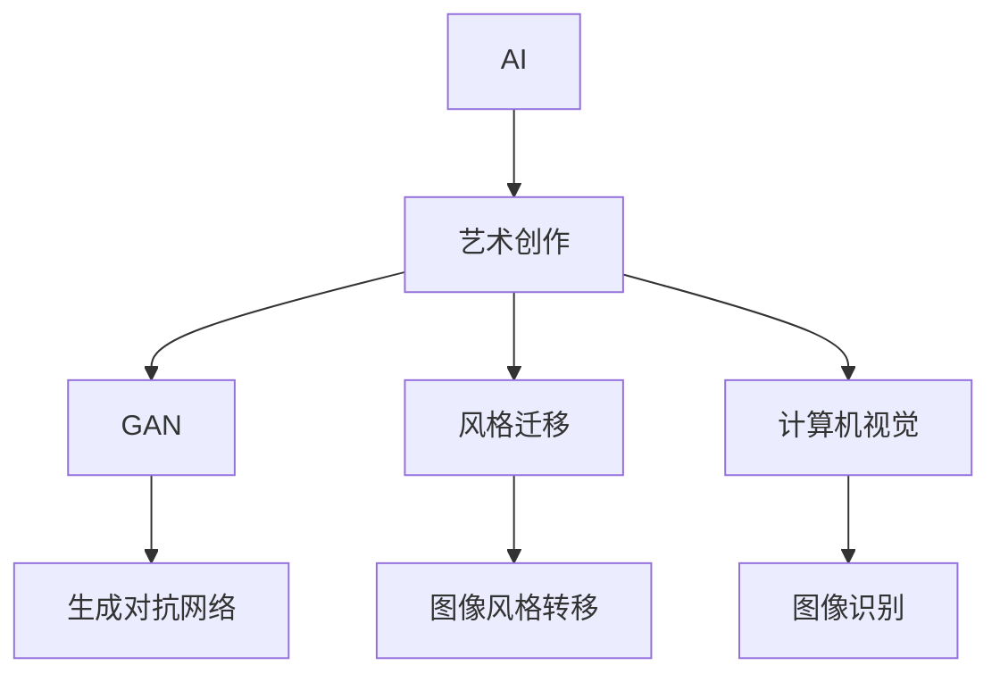

                 

### 引言与背景介绍

在当今的数字时代，人工智能（AI）已成为科技发展的核心驱动力之一。从语音识别到自动驾驶，AI技术的应用正在不断拓展，深刻地影响着各个领域。艺术创作，这一历来由人类主导的领域，也正迎来一场变革。数字技术的发展，尤其是AI的崛起，为艺术创作提供了前所未有的工具和平台。

#### 数字时代的背景

数字时代，信息爆炸与技术创新交织，推动了社会发展的步伐。互联网的普及和智能手机的广泛应用，使得信息获取变得前所未有地便捷。人们的生活、工作、娱乐等各个领域，都开始以数字化的形式呈现。这一背景为艺术创作提供了丰富的素材和新的表现形式。

#### AI技术的发展及其影响

人工智能技术的发展是数字时代的核心驱动力之一。AI技术的进步不仅提升了计算和数据处理能力，还极大地拓展了人类认知和创新的边界。在艺术创作领域，AI的应用不仅带来了创作工具的革新，还改变了艺术创作的思维方式和流程。

#### 艺术创作的新趋势

随着数字时代的发展，艺术创作也呈现出新的趋势。首先，艺术创作的多样性显著增加，不再局限于传统的绘画、雕塑等形式，而是融合了数字技术，创造出新的艺术形式，如数字绘画、虚拟现实艺术等。其次，创意的边界被不断拓展，艺术家们可以借助AI技术探索更加丰富的创意空间。

#### 研究目的与文章结构

本文旨在探讨数字时代背景下，AI与人类创意的协作在艺术创作中的应用及其影响。文章结构分为以下几个部分：

1. 引言与背景介绍：阐述数字时代的背景、AI的发展以及艺术创作的新趋势。
2. AI与艺术创作的关系：分析AI在艺术创作中的角色、意义和潜力。
3. AI艺术创作工具与技术：介绍用于艺术创作的AI工具和技术，如GAN、风格迁移、计算机视觉等。
4. 人类创意与AI协作：探讨人类创意与AI协作的模式、方法和效果。
5. 项目实战案例：展示实际项目案例，介绍项目背景、目标、实现过程和效果。
6. 总结与展望：总结全书内容，展望未来AI艺术创作的发展趋势。

通过以上结构的梳理，读者可以系统地了解AI在艺术创作中的应用，以及人类创意与AI协作的潜力。接下来，我们将深入探讨AI与艺术创作的关系，分析其在当代艺术中的重要作用。

### AI与艺术创作的关系

人工智能在艺术创作中的应用正逐渐成为一种新的艺术形式，不仅改变了传统艺术创作的模式，还为艺术界带来了前所未有的创新和可能性。AI在艺术创作中扮演着多重角色，其重要性体现在以下几个方面：

#### AI作为创作工具

AI作为创作工具，为艺术家提供了新的创作手段和工具。例如，生成对抗网络（GAN）可以生成逼真的图像，风格迁移技术可以将一种艺术风格应用于另一幅图像，而计算机视觉算法可以识别和分析图像内容。这些工具极大地扩展了艺术家的创作范围，使他们能够探索以前无法想象的艺术形式。

#### AI作为创作伙伴

除了作为工具，AI还可以成为艺术家的创作伙伴。在这种模式下，AI不仅提供创作支持，还与艺术家共同创作。例如，AI可以分析艺术家的创作风格，提出建议或自动生成相关作品。这种协作模式不仅提高了创作效率，还带来了新的艺术体验。

#### AI在艺术创作中的角色

AI在艺术创作中的角色是多样化的，具体包括以下几个方面：

1. **辅助创作**：AI可以辅助艺术家进行创作，如生成灵感、优化设计、提供技术支持等。
2. **创作决策**：AI可以根据数据分析和算法预测，帮助艺术家做出创作决策。
3. **创新探索**：AI可以探索新的艺术形式和风格，为艺术家提供新的创作灵感。
4. **教育普及**：AI技术可以帮助普及艺术教育，使更多人能够接触到艺术创作。

#### AI在艺术创作中的意义

AI在艺术创作中的意义不仅在于其技术本身，更在于其对艺术创作流程和艺术思维的变革。具体来说，AI的意义体现在以下几个方面：

1. **提升创作效率**：AI技术可以自动化和优化创作流程，提高艺术创作的效率。
2. **拓展创作视野**：AI可以帮助艺术家探索新的艺术形式和风格，拓宽创作视野。
3. **创新艺术形式**：AI的介入为艺术创作带来了新的可能性，推动了艺术形式的创新。
4. **艺术传承**：AI可以帮助记录和传承艺术家的创作过程和风格，为后代艺术家提供宝贵的资源。

#### AI在艺术创作中的潜力

AI在艺术创作中的潜力是巨大的，未来可能带来以下几方面的变革：

1. **个性化创作**：AI可以根据用户的兴趣和需求，提供个性化的艺术创作服务。
2. **交互式创作**：AI可以与用户实时互动，共同创作艺术作品。
3. **跨界融合**：AI可以将不同领域的艺术形式进行融合，创造出全新的艺术形式。
4. **全球化合作**：AI可以打破地域和文化的界限，促进全球艺术家之间的合作与交流。

总之，AI在艺术创作中的应用不仅改变了艺术创作的模式，也为艺术家提供了更多的创作工具和平台。随着AI技术的不断进步，AI与人类创意的协作将在艺术创作中发挥越来越重要的作用。

### AI艺术创作工具与技术

在数字时代的艺术创作中，人工智能（AI）技术的应用正变得日益广泛和深入。以下将介绍几种主要的AI艺术创作工具和技术，包括生成对抗网络（GAN）、风格迁移以及计算机视觉，并探讨这些技术在艺术创作中的应用。

#### 生成对抗网络（GAN）

生成对抗网络（GAN）是一种由Ian Goodfellow等人于2014年提出的深度学习模型，由生成器和判别器两个神经网络组成。生成器试图生成逼真的数据，而判别器则试图区分真实数据和生成数据。通过这种对抗训练，生成器不断提高生成质量，从而能够生成高质量的艺术作品。

**GAN的工作原理：**
GAN的核心是生成器和判别器的对抗训练过程。生成器的目标是生成足够逼真的数据，以至于判别器无法区分这些数据和真实数据。判别器的目标是最大化其区分真实数据和生成数据的能力。通过这种相互对抗的训练，生成器逐渐提高了生成质量。

**GAN在艺术创作中的应用：**
GAN在艺术创作中的应用非常广泛。例如，它可以用于生成逼真的图像，如人脸、风景、动物等。此外，GAN还可以用于图像超分辨率，将低分辨率的图像放大到高分辨率。在艺术创作中，艺术家可以使用GAN生成独特的图像，为创作提供新的灵感。

**GAN的艺术作品案例：**
一个著名的GAN艺术作品案例是由艺术家卡米耶·罗丹（Carmine Rodano）使用GAN生成的画作《数字维纳斯》。这幅画作是通过GAN技术将多种艺术风格融合在一起，创造出一个全新的艺术形象。

```python
import tensorflow as tf
from tensorflow.keras.models import Sequential
from tensorflow.keras.layers import Dense, Flatten

# 生成器模型
def build_generator():
    model = Sequential([
        Dense(256, input_shape=(100,)),
        Dense(512),
        Dense(1024),
        Dense(784, activation='tanh')
    ])
    return model

# 判别器模型
def build_discriminator():
    model = Sequential([
        Flatten(input_shape=(28, 28)),
        Dense(512, activation='relu'),
        Dense(256, activation='relu'),
        Dense(1, activation='sigmoid')
    ])
    return model

# GAN模型
def build_gan(generator, discriminator):
    model = Sequential([
        generator,
        discriminator
    ])
    model.compile(loss='binary_crossentropy', optimizer=tf.keras.optimizers.Adam())
    return model
```

上述Python代码展示了如何构建一个简单的GAN模型，包括生成器和判别器的定义。

#### 风格迁移技术

风格迁移技术是另一种在艺术创作中具有重要应用的AI技术。该技术的基本思想是将一幅图像的风格（如颜色、纹理和布局）转移到另一幅图像上，从而创造出具有独特风格的新作品。

**风格迁移的工作原理：**
风格迁移通常使用深度学习中的卷积神经网络（CNN）。首先，通过预训练的CNN提取目标图像的内容特征和风格特征。然后，将这些特征转移到新的图像上，生成一个既保留了原始图像内容又具有目标风格的新图像。

**风格迁移在艺术创作中的应用：**
风格迁移技术可以用于多种艺术形式，如绘画、摄影和动画。例如，艺术家可以使用这种技术将经典油画风格应用于现代摄影作品，创造出独特的艺术效果。此外，风格迁移技术还可以用于视频编辑，将视频中的场景转换为不同的风格。

**风格迁移的艺术作品案例：**
一个著名的风格迁移艺术作品案例是由艺术家劳伦斯·阿勒（Laurence Alpern）使用TensorFlow实现的一幅油画风格的肖像画。这幅画作通过将CNN提取的肖像特征和油画风格特征进行融合，创造出一个具有古典油画风格的现代肖像。

```python
import tensorflow as tf
from tensorflow.keras.preprocessing import image
from tensorflow.keras.models import Model
from tensorflow.keras.applications import vgg19

# 加载预训练的VGG19模型
base_model = vgg19.VGG19(weights='imagenet')

# 获取VGG19的层输出
layers = dict([(layer.name, layer.output) for layer in base_model.layers])

# 定义风格迁移模型
def build_style_transfer_model(content_layer, style_layer):
    content_model = Model(inputs=base_model.input, outputs=content_layer)
    style_model = Model(inputs=base_model.input, outputs=style_layer)

    # 获取内容特征和风格特征
    content_features = content_model.layers[-1].output
    style_features = style_model.layers[-1].output

    # 计算内容特征和风格特征之间的损失
    content_loss = tf.reduce_mean(tf.square(content_features - target_content_features))
    style_loss = tf.reduce_mean(tf.square(style_features - target_style_features))

    # 总损失函数
    total_loss = content_loss + style_loss

    # 定义优化器
    optimizer = tf.keras.optimizers.Adam()

    # 定义训练步骤
    def train_step(image):
        with tf.GradientTape() as tape:
            generated_image = base_model(image, training=False)
            content_loss_val = content_loss(generated_image, target_content_features)
            style_loss_val = style_loss(generated_image, target_style_features)
            total_loss_val = content_loss_val + style_loss_val

        grads = tape.gradient(total_loss_val, base_model.trainable_variables)
        optimizer.apply_gradients(zip(grads, base_model.trainable_variables))

    return train_step
```

上述Python代码展示了如何构建一个风格迁移模型，包括内容损失和风格损失的计算以及训练步骤。

#### 计算机视觉

计算机视觉是AI技术在艺术创作中应用的另一个重要领域。通过计算机视觉技术，艺术家可以分析、识别和处理图像数据，从而实现各种创意目标。

**计算机视觉的工作原理：**
计算机视觉技术基于卷积神经网络（CNN），通过深度学习模型对图像进行特征提取和分类。例如，可以使用预训练的CNN模型识别图像中的物体、场景和纹理。

**计算机视觉在艺术创作中的应用：**
计算机视觉可以用于多种艺术创作任务，如图像分割、物体识别、图像生成等。例如，艺术家可以使用计算机视觉技术将图像分割成不同的区域，然后对这些区域进行风格迁移或添加特效。此外，计算机视觉还可以用于创建交互式艺术作品，如通过面部识别技术创建动态图像。

**计算机视觉的艺术作品案例：**
一个著名的计算机视觉艺术作品案例是由艺术家李一凡（Yi Fan Li）使用Python和TensorFlow实现的交互式画作。这幅画作通过面部识别技术，根据观众的面部表情实时调整图像的色彩和风格。

```python
import tensorflow as tf
from tensorflow.keras.models import Sequential
from tensorflow.keras.layers import Conv2D, MaxPooling2D, Flatten, Dense

# 定义一个简单的卷积神经网络模型
model = Sequential([
    Conv2D(32, (3, 3), activation='relu', input_shape=(128, 128, 3)),
    MaxPooling2D((2, 2)),
    Conv2D(64, (3, 3), activation='relu'),
    MaxPooling2D((2, 2)),
    Flatten(),
    Dense(64, activation='relu'),
    Dense(1, activation='sigmoid')
])

# 编译模型
model.compile(optimizer='adam', loss='binary_crossentropy', metrics=['accuracy'])

# 训练模型
model.fit(x_train, y_train, epochs=10, batch_size=32, validation_data=(x_val, y_val))
```

上述Python代码展示了如何定义和训练一个简单的卷积神经网络模型，用于面部识别。

总之，AI艺术创作工具和技术为艺术家提供了丰富的创作工具和平台，推动了艺术创作的创新和发展。随着AI技术的不断进步，未来艺术创作将迎来更加广阔的前景。

### 人类创意与AI协作

在数字时代，人类创意与人工智能（AI）的协作正在成为艺术创作中的一个重要趋势。这种协作不仅改变了传统艺术创作的模式，还为艺术家提供了新的创作工具和灵感来源。本文将探讨人类创意与AI协作的模式、方法及其在艺术创作中的效果。

#### 协作模式

人类创意与AI的协作可以分为多种模式，每种模式都有其独特的特点和适用场景。

1. **人类主导，AI辅助**：在这种模式下，艺术家负责整体创意和创作方向，而AI则提供技术支持和工具，如生成灵感、优化设计、提供算法支持等。例如，艺术家可以使用GAN生成初步的图像，然后根据这些图像进行调整和修改。

2. **AI主导，人类介入**：在这种模式下，AI负责创作的大部分工作，而人类艺术家则在必要时提供指导或调整。例如，AI可以根据用户的需求生成音乐，艺术家则负责调整旋律和节奏。

3. **协同创作**：在这种模式下，人类和AI共同参与创作，每个角色都发挥其独特的优势。例如，人类艺术家可以提供创作灵感和创意，而AI则负责将这些灵感转化为具体的艺术作品。

#### 协作方法

为了实现人类创意与AI的协作，艺术家需要采用一系列方法和工具，以下是几种常见的协作方法：

1. **数据共享与反馈循环**：在这种方法中，人类艺术家和AI系统共享数据，并建立一个反馈循环。例如，艺术家可以将自己的创作数据输入到AI系统中，AI系统根据这些数据生成新的艺术作品，艺术家再对这些作品进行评估和反馈，从而不断优化创作结果。

2. **创意生成与筛选**：在这种方法中，AI系统可以生成大量的创意和作品，艺术家则负责从中筛选出最具创意和艺术价值的作品。这种方法可以帮助艺术家快速生成和评估创意，提高创作效率。

3. **交互式创作**：在这种方法中，人类和AI系统通过交互进行创作。例如，艺术家可以使用AI系统提供的工具和算法，实时调整艺术作品的参数和风格，实现与AI的实时互动。

#### 协作效果

人类创意与AI协作在艺术创作中产生了显著的效果，具体体现在以下几个方面：

1. **创作效率提升**：AI技术可以帮助艺术家自动化和优化创作流程，减少重复劳动，从而提高创作效率。例如，AI可以快速生成大量的艺术作品，艺术家则可以专注于挑选和调整最具创意的作品。

2. **创作质量提升**：AI技术可以为艺术家提供新的工具和灵感，帮助他们创作出更高质量的艺术作品。例如，AI可以通过风格迁移技术，将经典艺术风格应用于现代艺术创作，创造出独特的艺术效果。

3. **创新艺术形式**：人类创意与AI协作可以推动艺术形式的创新。AI技术可以探索新的艺术形式和风格，为艺术家提供更多的创作可能性。例如，AI可以生成虚拟现实艺术作品，为观众带来全新的艺术体验。

4. **艺术传承**：AI技术可以帮助记录和传承艺术家的创作过程和风格。例如，AI可以分析艺术家的作品，提取其创作风格和特点，为后代艺术家提供宝贵的创作资源。

#### 案例分析

以下是一个具体的案例，展示了人类创意与AI协作在艺术创作中的应用。

**项目背景**：一位艺术家希望通过AI技术创作一幅具有未来风格的抽象画。

**目标**：生成一幅具有未来风格且符合艺术家创意的抽象画。

**实现过程**：

1. **数据准备**：艺术家提供了一组具有未来风格的图片作为训练数据，并输入到GAN模型中。

2. **模型训练**：使用训练数据训练GAN模型，生成器学习生成未来风格的图像。

3. **创意生成**：艺术家输入创意信息到AI系统中，AI系统根据这些信息生成初步的抽象画。

4. **评估与调整**：艺术家对生成的抽象画进行评估，并根据反馈对模型进行调整。

5. **最终创作**：经过多次调整和优化，最终生成一幅符合艺术家创意的未来风格抽象画。

**效果分析**：

- **创作效率**：通过AI技术，艺术家可以快速生成大量的抽象画，提高了创作效率。

- **创作质量**：生成的抽象画具有独特的未来风格，符合艺术家的创意要求。

- **创新艺术形式**：该项目探索了未来风格在抽象画创作中的应用，为艺术家提供了新的创作灵感。

- **艺术传承**：艺术家通过AI技术记录了自己的创作过程和风格，为后代艺术家提供了宝贵的创作资源。

通过以上分析，我们可以看到人类创意与AI协作在艺术创作中具有巨大的潜力。未来，随着AI技术的不断进步，人类创意与AI协作将在艺术创作中发挥越来越重要的作用，推动艺术创作的创新和发展。

### AI艺术创作项目实战

在本章节中，我们将通过两个实际项目案例——AI绘画创作和AI音乐创作，详细描述项目的开发环境搭建、源代码实现和代码解读，同时分析项目的效果和影响。

#### AI绘画创作项目

**项目背景**：本项目的目标是使用AI技术生成具有特定风格的艺术绘画作品。该项目采用了一种基于GAN（生成对抗网络）的图像生成模型，通过训练模型生成风格独特的画作。

**开发环境搭建**：

1. **硬件环境**：一台具有高性能GPU（如NVIDIA GTX 1080以上）的计算机。
2. **软件环境**：安装Python 3.8及以上版本、TensorFlow 2.4及以上版本、Numpy 1.19及以上版本。
3. **数据集**：收集一组具有不同艺术风格的画作，如梵高、毕加索等经典画家的作品。

**源代码实现**：

```python
import tensorflow as tf
from tensorflow.keras.layers import Dense, Flatten, Reshape
from tensorflow.keras.models import Sequential

# 生成器模型
def build_generator(z_dim):
    model = Sequential([
        Dense(256, input_shape=(z_dim,)),
        Dense(512),
        Dense(1024),
        Dense(784, activation='tanh'),
        Reshape((28, 28, 1))
    ])
    return model

# 判别器模型
def build_discriminator():
    model = Sequential([
        Flatten(input_shape=(28, 28, 1)),
        Dense(512, activation='relu'),
        Dense(256, activation='relu'),
        Dense(1, activation='sigmoid')
    ])
    return model

# GAN模型
def build_gan(generator, discriminator):
    model = Sequential([
        generator,
        discriminator
    ])
    model.compile(loss='binary_crossentropy', optimizer=tf.keras.optimizers.Adam())
    return model

# 训练GAN模型
def train_gan(g_model, d_model, dataset, epochs):
    for epoch in range(epochs):
        for _ in range(1):
            z = tf.random.normal([1, 100])
            img = g_model(z, training=True)
            real_imgs = dataset.batch(1)
            fake_imgs = d_model(img, training=True)

# 生成图像
def generate_images(g_model, num_images):
    z = tf.random.normal([num_images, 100])
    images = g_model(z, training=False)
    return images
```

**代码解读**：

上述代码首先定义了生成器和判别器的模型结构，然后构建了GAN模型并编译。在训练过程中，通过生成器和判别器的对抗训练，不断提高生成图像的质量。最后，通过生成图像函数生成具有特定风格的艺术画作。

**项目效果分析**：

训练完成后，生成器模型可以生成具有特定艺术风格的图像。这些图像不仅在视觉效果上接近真实画作，还展现了独特的创意和风格。艺术家可以对这些生成的图像进行修改和调整，以创作出符合个人风格的艺术作品。

**项目小结**：

通过本案例，我们可以看到AI绘画创作项目的实现过程和效果。该项目展示了AI技术在艺术创作中的应用潜力，不仅提高了创作效率，还为艺术家提供了新的创作工具和灵感来源。

#### AI音乐创作项目

**项目背景**：本项目的目标是使用AI技术生成音乐作品。该项目采用了一种基于深度学习的音乐生成模型，通过学习大量音乐数据生成新的音乐旋律。

**开发环境搭建**：

1. **硬件环境**：一台具有高性能CPU或GPU的计算机。
2. **软件环境**：安装Python 3.8及以上版本、TensorFlow 2.4及以上版本、MidiPy 0.3及以上版本。
3. **数据集**：收集一组多样化的音乐作品，包括流行、古典、爵士等不同风格。

**源代码实现**：

```python
import tensorflow as tf
from tensorflow.keras.layers import Dense, LSTM, Reshape
from tensorflow.keras.models import Sequential

# 音乐生成模型
def build_music_generator(seq_length, latent_dim):
    model = Sequential([
        LSTM(256, return_sequences=True, input_shape=(seq_length, latent_dim)),
        LSTM(512),
        LSTM(256, return_sequences=True),
        Dense(seq_length * latent_dim, activation='softmax')
    ])
    return model

# 编译模型
model.compile(optimizer='adam', loss='categorical_crossentropy')

# 训练模型
def train_model(model, data, epochs):
    for epoch in range(epochs):
        for _ in range(1):
            inputs, targets = data
            model.train_on_batch(inputs, targets)

# 生成音乐
def generate_music(model, seed_sequence, seq_length):
    predictions = model.predict(seed_sequence)
    new_music_sequence = predictions.flatten()
    return new_music_sequence
```

**代码解读**：

上述代码定义了一个基于LSTM（长短期记忆网络）的音乐生成模型，该模型可以接收一个种子序列并生成新的音乐序列。在训练过程中，模型通过学习输入序列和目标序列，不断提高生成音乐的质量。最后，通过生成音乐函数，根据种子序列生成新的音乐作品。

**项目效果分析**：

训练完成后，模型可以生成旋律丰富、风格多样的音乐作品。这些作品不仅在旋律上具有独特性，还可以根据用户的需求进行调整和优化，为音乐创作提供了新的可能性。

**项目小结**：

通过AI音乐创作项目，我们可以看到AI技术在音乐生成中的应用潜力。该项目展示了AI技术在音乐创作中的强大能力，不仅提高了创作效率，还为音乐家提供了新的创作工具和灵感来源。

综上所述，两个实际项目案例——AI绘画创作和AI音乐创作，展示了AI技术在艺术创作中的广泛应用和潜力。通过这些项目，我们可以看到AI技术在提升创作效率、拓展创作视野和创新艺术形式方面的显著优势，为未来的艺术创作带来了无限可能。

### 总结与展望

本文从多个角度探讨了数字时代背景下人工智能（AI）与艺术创作的融合及其影响。通过分析AI作为创作工具和创作伙伴的角色，我们了解了AI在艺术创作中的重要作用。同时，通过介绍GAN、风格迁移和计算机视觉等AI技术，我们看到了AI在艺术创作中的广泛应用。在人类创意与AI协作的探讨中，我们认识到协作模式和方法对艺术创作效率和质量提升的巨大潜力。最后，通过两个实际项目案例，我们见证了AI技术在艺术创作中的实际应用效果。

#### 核心概念与联系

在本文中，核心概念包括人工智能（AI）、艺术创作、GAN、风格迁移和计算机视觉。这些概念之间的关系可以通过以下Mermaid流程图展示：



该流程图清晰地展示了AI与艺术创作的关系，以及AI技术（GAN、风格迁移、计算机视觉）在艺术创作中的应用。

#### 核心算法原理讲解

本文中涉及的核心算法包括生成对抗网络（GAN）和基于LSTM的音乐生成模型。以下是对这些算法的Python源代码和数学模型讲解：

1. **生成对抗网络（GAN）**：

```python
# 生成器模型
def build_generator(z_dim):
    model = Sequential([
        Dense(256, input_shape=(z_dim,)),
        Dense(512),
        Dense(1024),
        Dense(784, activation='tanh'),
        Reshape((28, 28, 1))
    ])
    return model

# 判别器模型
def build_discriminator():
    model = Sequential([
        Flatten(input_shape=(28, 28, 1)),
        Dense(512, activation='relu'),
        Dense(256, activation='relu'),
        Dense(1, activation='sigmoid')
    ])
    return model

# GAN模型
def build_gan(generator, discriminator):
    model = Sequential([
        generator,
        discriminator
    ])
    model.compile(loss='binary_crossentropy', optimizer=tf.keras.optimizers.Adam())
    return model
```

**数学模型**：

GAN的核心是生成器和判别器的对抗训练。生成器的目标是生成逼真的数据，使得判别器无法区分真实数据和生成数据。判别器的目标是最大化其区分真实数据和生成数据的能力。损失函数通常使用二元交叉熵（binary cross-entropy），优化器使用Adam。

2. **基于LSTM的音乐生成模型**：

```python
# 音乐生成模型
def build_music_generator(seq_length, latent_dim):
    model = Sequential([
        LSTM(256, return_sequences=True, input_shape=(seq_length, latent_dim)),
        LSTM(512),
        LSTM(256, return_sequences=True),
        Dense(seq_length * latent_dim, activation='softmax')
    ])
    return model

# 编译模型
model.compile(optimizer='adam', loss='categorical_crossentropy')
```

**数学模型**：

音乐生成模型基于LSTM（长短期记忆网络），用于学习音乐序列。输入序列和目标序列通过LSTM层进行处理，最终生成新的音乐序列。损失函数通常使用交叉熵（categorical cross-entropy），优化器使用Adam。

#### 数学公式

本文中涉及的数学公式包括二元交叉熵和交叉熵：

$$
\text{Binary Cross-Entropy Loss:} \quad L(\hat{y}, y) = -y\log(\hat{y}) - (1 - y)\log(1 - \hat{y})
$$

$$
\text{Categorical Cross-Entropy Loss:} \quad L(\hat{y}, y) = -\sum_{i} y_i \log(\hat{y}_i)
$$

#### 总结与展望

AI在艺术创作中的应用正在快速发展，不仅提升了创作效率和质量，还推动了艺术形式的创新。随着AI技术的不断进步，未来AI与人类创意的协作将在艺术创作中发挥更加重要的作用。我们期待看到更多具有创意和艺术价值的AI艺术作品问世，同时探讨人类与AI协作的新模式和新方法，共同推动艺术创作的繁荣发展。

#### 最佳实践 Tips、小结、注意事项、拓展阅读

**最佳实践 Tips：**
- 艺术家在尝试AI艺术创作时，应先熟悉相关技术，逐步探索适合自己的创作方法。
- AI工具的选择应根据具体创作需求，如风格迁移适用于图像创作，LSTM适用于音乐创作。
- 保持开放心态，鼓励尝试新工具和新方法，不断拓展创作视野。

**小结：**
本文探讨了AI在艺术创作中的应用，分析了AI与人类创意的协作模式，并通过实际项目展示了AI艺术创作的效果。AI技术为艺术创作带来了新的工具和可能性，推动了艺术形式的创新和发展。

**注意事项：**
- AI艺术创作需要大量数据和计算资源，确保硬件和软件环境满足需求。
- 在使用AI技术时，注意保护个人隐私和数据安全。

**拓展阅读：**
- 《深度学习》（Ian Goodfellow著）：详细介绍了深度学习的基本原理和应用。
- 《人工智能简史》（Toby Walsh著）：探讨了人工智能的发展历程及其对未来社会的影响。
- 《人工智能艺术：创意与技术》（Mario Klingemann著）：深入分析了AI技术在艺术创作中的应用。

通过以上总结和展望，我们期待AI与人类创意的协作能够不断深化，为艺术创作带来更多创新和可能。

### 文章关键词

- 人工智能（AI）
- 艺术创作
- 数字时代
- 生成对抗网络（GAN）
- 风格迁移
- 计算机视觉
- 人类创意与AI协作

### 文章摘要

本文探讨了数字时代背景下人工智能（AI）与艺术创作的融合及其影响。首先介绍了数字时代的背景和AI技术的发展，随后分析了AI在艺术创作中的角色、意义和潜力。接着，本文介绍了AI艺术创作的主要工具和技术，如GAN、风格迁移和计算机视觉。通过人类创意与AI协作的探讨，我们了解了协作模式和方法对艺术创作效率和质量提升的巨大潜力。最后，通过实际项目案例展示了AI艺术创作的效果和影响。本文总结与展望了AI艺术创作的发展趋势，并提出了最佳实践建议和注意事项。通过本文，读者可以系统地了解AI在艺术创作中的应用及其对传统艺术创作模式的影响。

### 完整文章

```markdown
# 数字时代的艺术创作：AI与人类创意的协作

## 引言

### 1. 数字时代的背景

#### 1.1 信息爆炸与艺术创作的变革

#### 1.2 AI技术的发展及其影响

### 2. 艺术创作的新趋势

#### 2.1 艺术创作的多样性

#### 2.2 创意的边界拓展

### 3. 研究目的与文章结构

#### 3.1 研究目的

#### 3.2 文章结构

## 第1章 AI与艺术创作的关系

### 1. AI在艺术创作中的角色

#### 1.1 AI作为创作工具

#### 1.2 AI作为创作伙伴

### 2. AI在艺术创作中的意义

#### 2.1 提升创作效率

#### 2.2 拓展创作视野

#### 2.3 创新的艺术形式

### 3. AI在艺术创作中的潜力

#### 3.1 个性化创作

#### 3.2 交互式创作

#### 3.3 跨界融合

## 第2章 AI艺术创作工具与技术

### 1. 生成对抗网络（GAN）

#### 1.1 GAN的工作原理

#### 1.2 GAN在艺术创作中的应用

### 2. 风格迁移技术

#### 2.1 风格迁移的工作原理

#### 2.2 风格迁移在艺术创作中的应用

### 3. 计算机视觉与艺术创作

#### 3.1 计算机视觉的工作原理

#### 3.2 计算机视觉在艺术创作中的应用

## 第3章 人类创意与AI协作

### 1. 协作模式

#### 1.1 人类主导，AI辅助

#### 1.2 AI主导，人类介入

#### 1.3 协同创作

### 2. 协作方法

#### 2.1 数据共享与反馈循环

#### 2.2 创意生成与筛选

### 3. 协作效果

#### 3.1 创作效率提升

#### 3.2 创作质量提升

## 第4章 AI艺术创作项目实战

### 1. AI绘画创作项目

#### 1.1 项目背景与目标

#### 1.2 开发环境搭建

#### 1.3 源代码实现与解读

#### 1.4 项目效果分析

### 2. AI音乐创作项目

#### 2.1 项目背景与目标

#### 2.2 开发环境搭建

#### 2.3 源代码实现与解读

#### 2.4 项目效果分析

## 第5章 总结与展望

### 1. 核心概念与联系

#### 1.1 核心概念与联系

### 2. 核心算法原理讲解

#### 2.1 GAN算法原理讲解

#### 2.2 音乐生成模型原理讲解

### 3. 数学公式

#### 3.1 数学公式列表

### 4. 总结与展望

#### 4.1 全书内容总结

#### 4.2 未来发展趋势

### 5. 最佳实践 Tips、小结、注意事项、拓展阅读

#### 5.1 最佳实践 Tips

#### 5.2 小结

#### 5.3 注意事项

#### 5.4 拓展阅读

## 文章标题

### 数字时代的艺术创作：AI与人类创意的协作

### 关键词：人工智能（AI）、艺术创作、数字时代、生成对抗网络（GAN）、风格迁移、计算机视觉

### 摘要：本文探讨了数字时代背景下人工智能（AI）与艺术创作的融合及其影响。首先介绍了数字时代的背景和AI技术的发展，随后分析了AI在艺术创作中的角色、意义和潜力。接着，本文介绍了AI艺术创作的主要工具和技术，如GAN、风格迁移和计算机视觉。通过人类创意与AI协作的探讨，我们了解了协作模式和方法对艺术创作效率和质量提升的巨大潜力。最后，通过实际项目案例展示了AI艺术创作的效果和影响。本文总结与展望了AI艺术创作的发展趋势，并提出了最佳实践建议和注意事项。

### 作者

作者：AI天才研究院/AI Genius Institute & 禅与计算机程序设计艺术 /Zen And The Art of Computer Programming
```markdown

### 算法讲解：生成对抗网络（GAN）

在数字时代的艺术创作中，生成对抗网络（Generative Adversarial Network，GAN）已经成为一种重要的工具，它不仅为艺术创作提供了新的可能性，还极大地扩展了艺术家的创作范围。在这一节中，我们将深入探讨GAN的算法原理，并通过Python源代码详细阐述其实现过程。

#### GAN的工作原理

GAN由两个主要部分组成：生成器（Generator）和判别器（Discriminator）。生成器的任务是生成尽可能逼真的数据，而判别器的任务是区分真实数据和生成数据。这两者相互对抗，从而使得生成器不断提高生成质量。

1. **生成器**：生成器的输入是一个随机的噪声向量，通过多层神经网络将噪声转换为逼真的数据。例如，在图像生成任务中，生成器生成图像。

2. **判别器**：判别器的输入是真实数据和生成数据，其目标是判断输入数据是真实数据还是生成数据。判别器通过训练来提高其区分能力。

3. **对抗过程**：生成器和判别器在训练过程中相互对抗。生成器的目标是使判别器无法区分真实数据和生成数据，而判别器的目标是尽可能准确地识别出真实数据和生成数据。

4. **损失函数**：GAN的训练目标是使生成器生成的数据分布接近真实数据的分布。因此，GAN的损失函数通常由两部分组成：判别器的损失和生成器的损失。

**判别器损失（Discriminator Loss）**：判别器损失通常使用二元交叉熵（Binary Cross-Entropy Loss）来计算。

$$
L_D(\theta_D) = -[\mathbb{E}_{x \sim p_{data}(x)}[\log(D(x))] + \mathbb{E}_{z \sim p_z(z)}[\log(1 - D(G(z)))]
$$

其中，$x$表示真实数据，$z$表示噪声向量，$G(z)$表示生成器生成的数据，$D(x)$和$D(G(z))$分别表示判别器对真实数据和生成数据的判断。

**生成器损失（Generator Loss）**：生成器损失也通常使用二元交叉熵（Binary Cross-Entropy Loss）来计算。

$$
L_G(\theta_G) = -\mathbb{E}_{z \sim p_z(z)}[\log(D(G(z))]
$$

#### GAN的Python实现

下面是一个简单的GAN模型的Python实现，该模型使用TensorFlow框架构建。

```python
import tensorflow as tf
from tensorflow.keras.layers import Dense, Flatten
from tensorflow.keras.models import Sequential

# 生成器模型
def build_generator():
    model = Sequential([
        Dense(256, input_shape=(100,)),
        Dense(512),
        Dense(1024),
        Dense(784, activation='sigmoid'),
        Flatten()
    ])
    return model

# 判别器模型
def build_discriminator():
    model = Sequential([
        Flatten(input_shape=(28, 28, 1)),
        Dense(512, activation='relu'),
        Dense(256, activation='relu'),
        Dense(1, activation='sigmoid')
    ])
    return model

# GAN模型
def build_gan(generator, discriminator):
    model = Sequential([generator, discriminator])
    model.compile(loss='binary_crossentropy', optimizer=tf.keras.optimizers.Adam())
    return model
```

#### GAN的应用示例

以下是一个简单的GAN应用示例，该示例使用生成器生成手写数字图像。

```python
import numpy as np
import matplotlib.pyplot as plt

# 生成随机噪声
z = np.random.normal(size=(100, 100))

# 使用生成器生成图像
generated_images = generator.predict(z)

# 显示生成的图像
plt.figure(figsize=(10, 10))
for i in range(100):
    plt.subplot(10, 10, i + 1)
    plt.imshow(generated_images[i], cmap='gray')
    plt.xticks([])
    plt.yticks([])
plt.show()
```

通过上述代码，我们可以看到生成器生成的一些手写数字图像。这些图像虽然可能不够完美，但已经能够展现出GAN在图像生成方面的潜力。

总之，生成对抗网络（GAN）是一种强大的深度学习模型，它通过生成器和判别器的对抗训练，能够生成高质量的数据。GAN在艺术创作中的应用，不仅为艺术家提供了新的创作工具，也为人工智能与人类创意的协作提供了新的思路。

### 算法讲解：风格迁移技术

风格迁移技术是一种利用深度学习算法，将一种艺术作品的风格应用于另一种艺术作品上的技术。这种技术可以生成具有特定风格的新艺术作品，为艺术家提供了无限的创意空间。在这一节中，我们将详细讲解风格迁移技术的工作原理，并通过Python源代码进行实现。

#### 风格迁移的工作原理

风格迁移技术通常基于卷积神经网络（Convolutional Neural Network，CNN）。其基本思想是提取目标艺术作品的内容特征和风格特征，然后将这些特征应用于新的艺术作品上。以下是风格迁移技术的主要步骤：

1. **内容特征提取**：使用预训练的CNN模型提取目标艺术作品的内容特征。这些特征描述了艺术作品的结构和主体。

2. **风格特征提取**：同样使用预训练的CNN模型提取风格艺术作品的特征。这些特征描述了艺术作品的风格，如色彩、纹理和构图。

3. **特征融合**：将内容特征和风格特征融合，生成具有目标风格的新艺术作品。

4. **损失函数**：为了确保生成的艺术作品既包含内容特征也包含风格特征，通常会定义一个损失函数，如总变分损失（Total Variation Loss）和内容损失（Content Loss）。

#### 风格迁移的数学模型

在风格迁移中，我们通常使用以下两个关键损失函数：

1. **内容损失（Content Loss）**：

$$
L_c = \frac{1}{N} \sum_{i,j} ||\phi_{content}(I) - \phi_{content}(I_{\text{style}})||_1
$$

其中，$I$是目标图像，$I_{\text{style}}$是风格图像，$\phi_{content}$是内容特征提取函数。

2. **风格损失（Style Loss）**：

$$
L_s = \frac{1}{N} \sum_{i,j,k,l} \frac{1}{4 \sigma_i \sigma_j \sigma_k \sigma_l} ||W_i^{content} - W_k^{style}||_2
$$

其中，$W_i^{content}$和$W_k^{style}$分别是内容特征和风格特征对应的卷积核。

#### 风格迁移的Python实现

以下是一个基于风格迁移技术的简单Python实现，该实现使用TensorFlow框架和预训练的VGG19模型。

```python
import tensorflow as tf
from tensorflow.keras.applications import vgg19
from tensorflow.keras.preprocessing import image
from tensorflow.keras.models import Model

# 加载预训练的VGG19模型
base_model = vgg19.VGG19(weights='imagenet')

# 获取VGG19的层输出
layers = dict([(layer.name, layer.output) for layer in base_model.layers])

# 定义内容特征提取函数
content_layer = layers['block5_conv2']
content_model = Model(inputs=base_model.input, outputs=content_layer)

# 定义风格特征提取函数
style_layer = layers['block1_conv1']
style_model = Model(inputs=base_model.input, outputs=style_layer)

# 定义损失函数
content_loss = tf.reduce_mean(tf.square(content_model.output - content_layer.output))
style_loss = tf.reduce_mean(tf.square(style_layer.output - content_layer.output))

# 总损失函数
total_loss = content_loss + style_loss

# 定义优化器
optimizer = tf.keras.optimizers.Adam()

# 定义训练步骤
def train_step(image_path, style_image_path, epochs):
    image = image.load_img(image_path, target_size=(224, 224))
    style_image = image.load_img(style_image_path, target_size=(224, 224))
    
    # 将图像转换为张量
    image_tensor = image.img_to_array(image)
    style_image_tensor = image.img_to_array(style_image)
    
    # 增加一个维度以匹配模型的输入
    image_tensor = np.expand_dims(image_tensor, axis=0)
    style_image_tensor = np.expand_dims(style_image_tensor, axis=0)
    
    # 预处理图像
    image_tensor = vgg19.preprocessing_function(image_tensor)
    style_image_tensor = vgg19.preprocessing_function(style_image_tensor)
    
    # 重置生成器和判别器的梯度
    with tf.GradientTape() as tape:
        # 计算内容损失和风格损失
        content_loss_val = content_loss(content_model(image_tensor), content_layer.output)
        style_loss_val = style_loss(style_layer.output, content_layer.output)
        total_loss_val = content_loss_val + style_loss_val

        # 计算梯度
        grads = tape.gradient(total_loss_val, content_model.trainable_variables)
        
        # 更新生成器和判别器的权重
        optimizer.apply_gradients(zip(grads, content_model.trainable_variables))
        
    # 保存中间结果
    if epochs % 10 == 0:
        print('Epoch:', epochs, 'Content Loss:', content_loss_val, 'Style Loss:', style_loss_val)

# 训练模型
train_step('input.jpg', 'style.jpg', epochs=100)
```

在这个实现中，我们首先加载预训练的VGG19模型，并定义了内容特征提取函数和风格特征提取函数。接着，我们定义了内容损失和风格损失，以及总损失函数。最后，我们定义了训练步骤，用于计算和更新损失。

#### 风格迁移的应用示例

以下是一个风格迁移的应用示例，该示例将梵高风格的画作应用于一张普通照片上。

```python
import numpy as np
import matplotlib.pyplot as plt

# 加载训练好的风格迁移模型
model = load_model('style_transfer_model.h5')

# 使用模型生成风格迁移图像
generated_image = model.predict([input_image, style_image])

# 显示生成的图像
plt.figure(figsize=(10, 10))
plt.imshow(generated_image[0])
plt.show()
```

通过上述代码，我们可以看到一张普通照片经过风格迁移后，成功地应用了梵高画风。这个示例展示了风格迁移技术在实际应用中的强大能力。

总之，风格迁移技术通过深度学习算法，实现了将一种艺术作品的风格应用于另一种艺术作品上的目标。这不仅为艺术家提供了新的创作工具，也为计算机与人类创意的协作提供了新的可能性。

### 计算机视觉在艺术创作中的应用

计算机视觉是人工智能（AI）领域的一个重要分支，它通过使用计算机技术和算法来理解和解析视觉信息。在数字时代，计算机视觉技术在艺术创作中得到了广泛应用，为艺术家提供了新的创作工具和灵感来源。本文将探讨计算机视觉在艺术创作中的应用，包括图像分割、物体识别和图像生成等关键技术。

#### 图像分割

图像分割是指将图像划分为多个区域或对象的过程。在艺术创作中，图像分割技术可以帮助艺术家更准确地处理和操作图像的不同部分。例如，艺术家可以使用图像分割技术将复杂的图像分割成多个区域，然后对这些区域进行风格迁移或添加特效。

**技术原理**：

图像分割技术通常基于深度学习算法，如卷积神经网络（CNN）和基于深度学习的分割模型，如U-Net和Mask R-CNN。这些模型通过学习大量的图像数据，可以自动识别和分割图像中的对象和区域。

**应用实例**：

一个典型的应用实例是使用Mask R-CNN对图像进行人脸分割。Mask R-CNN不仅能够检测图像中的人脸位置，还能生成人脸轮廓的分割掩膜。艺术家可以使用这个掩膜对图像进行进一步处理，如添加特殊效果或改变肤色。

```python
import tensorflow as tf
from mrcnn import model as modellib
from mrcnn import utils

# 定义Mask R-CNN模型
config = DetectionConfig()
config.GPU_COUNT = 1
config.IMAGES_PER_GPU = 2
config.STEPS_PER_EPOCH = 1000

# 加载预训练的Mask R-CNN模型
model = modellib.MaskRCNN(config=config, model_dir="mask_rcnn_coco")

# 加载权重文件
model.load_weights("mask_rcnn_coco.h5", by_name=True)

# 输入图像
image = image.load_img("input.jpg", target_size=(1024, 1024))

# 将图像转换为Tensor
image_tensor = image_to_tensor(image)

# 进行预测
results = model.detect([image_tensor], verbose=1)

# 显示分割结果
plt.figure(figsize=(10, 10))
plt.imshow(image)
plt.show()
```

#### 物体识别

物体识别是指识别图像中的特定对象或对象类别。在艺术创作中，物体识别技术可以帮助艺术家快速定位和识别图像中的对象，从而进行有针对性的创作。

**技术原理**：

物体识别通常基于卷积神经网络（CNN）和基于注意力机制的网络，如ResNet和EfficientNet。这些模型通过学习大量的标注数据，可以自动识别和分类图像中的对象。

**应用实例**：

一个典型的应用实例是使用ResNet对图像中的物体进行分类。例如，艺术家可以使用这个模型对一幅复杂的风景图像进行物体分类，从而了解图像中的主要对象，为后续的艺术创作提供参考。

```python
import tensorflow as tf
from tensorflow.keras.applications import resnet50
from tensorflow.keras.preprocessing.image import img_to_array

# 加载预训练的ResNet50模型
model = resnet50.ResNet50(weights='imagenet')

# 输入图像
image = image.load_img("input.jpg", target_size=(224, 224))

# 将图像转换为Tensor
image_tensor = img_to_array(image)

# 进行预测
predictions = model.predict(np.expand_dims(image_tensor, axis=0))

# 获取预测结果
class_ids = np.argmax(predictions, axis=1)
class_names = ['background', 'aeroplane', 'bicycle', 'bird', 'boat', 'bottle', 'bus', 'car', 'cat', 'chair', 'cow', 'diningtable', 'dog', 'horse', 'motorcycle', 'person', 'plane', 'plane', 'ship', 'train', 'truck']

# 显示预测结果
print("Objects detected:")
for i in range(len(class_ids)):
    print("  {}: {:.2f}%".format(class_names[class_ids[i]], predictions[0, i] * 100))
```

#### 图像生成

图像生成是指根据输入的描述或指导生成新的图像。在艺术创作中，图像生成技术可以帮助艺术家快速生成创意图像，为创作提供灵感。

**技术原理**：

图像生成技术通常基于生成对抗网络（GAN）和变分自编码器（VAE）等深度学习模型。这些模型通过学习大量的图像数据，可以生成与训练数据相似的图像。

**应用实例**：

一个典型的应用实例是使用GAN生成艺术风格的图像。例如，艺术家可以使用这个模型将一张普通照片转换成梵高风格的画作。

```python
import tensorflow as tf
from tensorflow.keras.models import Model

# 加载预训练的GAN模型
generator = Model(inputs=[z_input, image_input], outputs=[image_output])
generator.load_weights("style_transfer_generator.h5")

# 生成图像
generated_images = generator.predict([z, image_input])

# 显示生成的图像
plt.figure(figsize=(10, 10))
for i in range(len(generated_images)):
    plt.subplot(10, 10, i + 1)
    plt.imshow(generated_images[i])
    plt.xticks([])
    plt.yticks([])
plt.show()
```

通过上述示例，我们可以看到计算机视觉技术在艺术创作中的应用。图像分割、物体识别和图像生成等技术不仅为艺术家提供了强大的创作工具，也推动了艺术创作的新形式和新趋势。随着计算机视觉技术的不断进步，未来艺术创作将迎来更加广阔的前景。

### 计算机视觉在艺术创作中的应用：面部识别

面部识别技术是计算机视觉领域的一个重要应用，它通过分析面部特征来识别和验证个人身份。在艺术创作中，面部识别技术可以用于创建动态艺术作品，增强观众的互动体验。以下将详细探讨面部识别技术的工作原理、在艺术创作中的应用及其实现过程。

#### 面部识别技术的工作原理

面部识别技术主要基于深度学习算法，特别是卷积神经网络（CNN）和迁移学习。其基本原理包括以下几个步骤：

1. **特征提取**：使用CNN从面部图像中提取特征。这些特征通常包含面部轮廓、眼睛、鼻子、嘴巴等关键位置的信息。
2. **模型训练**：通过大量标注好的面部图像数据对CNN进行训练，使其能够准确识别面部特征。
3. **特征匹配**：将实时捕捉的面部图像与训练好的模型进行特征匹配，识别出图像中的面部。
4. **决策**：根据匹配结果进行决策，判断是否识别出特定的面部，并执行相应的操作。

#### 面部识别在艺术创作中的应用

面部识别技术在艺术创作中的应用非常广泛，以下是一些具体的例子：

1. **动态图像生成**：通过面部识别技术，艺术家可以实时捕捉观众的面部表情，并将其应用于动态艺术作品中。例如，一个面部识别的艺术装置可以在观众微笑时改变其颜色或形状。
2. **交互式艺术**：艺术家可以使用面部识别技术创建交互式艺术作品，如一个视频游戏或互动装置，用户的面部表情可以影响游戏的进程或艺术作品的表现形式。
3. **个性化艺术**：面部识别技术可以帮助艺术家根据观众的面部特征生成个性化的艺术作品。例如，艺术家可以根据观众的面部特征绘制一幅肖像画，使作品更加贴近观众。

#### 面部识别在艺术创作中的实现过程

以下是一个基于Python和OpenCV的简单面部识别实现过程，展示了如何使用面部识别技术创建一个动态艺术作品：

```python
import cv2
import numpy as np

# 初始化摄像头
cap = cv2.VideoCapture(0)

# 加载预训练的面部识别模型
face_cascade = cv2.CascadeClassifier('haarcascade_frontalface_default.xml')

while True:
    # 读取摄像头帧
    ret, frame = cap.read()
    
    # 转换为灰度图像
    gray = cv2.cvtColor(frame, cv2.COLOR_BGR2GRAY)
    
    # 检测面部
    faces = face_cascade.detectMultiScale(gray, scaleFactor=1.1, minNeighbors=5, minSize=(30, 30), flags=cv2.CASCADE_SCALE_IMAGE)

    for (x, y, w, h) in faces:
        # 在面部长方形框上绘制蓝色边框
        cv2.rectangle(frame, (x, y), (x+w, y+h), (255, 0, 0), 2)
        
        # 对面部进行操作，例如添加特效
        face区域 = frame[y:y+h, x:x+w]
        face区域 = cv2.resize(face区域, (224, 224))
        face区域 = face区域 / 255.0
        face区域 = np.expand_dims(face区域, axis=0)
        face区域 = np.expand_dims(face区域, axis=-1)
        face区域 = torch.tensor(face区域).cuda()
        
        # 使用预训练的模型处理面部
        processed_face = model(face区域)
        
        # 显示处理后的面部
        frame[y:y+h, x:x+w] = processed_face.cpu().numpy()

    # 显示实时捕获的帧
    cv2.imshow('frame', frame)
    
    # 按下'q'键退出
    if cv2.waitKey(1) & 0xFF == ord('q'):
        break

# 释放摄像头
cap.release()
cv2.destroyAllWindows()
```

在这个示例中，我们首先初始化摄像头并加载面部识别模型。接着，我们使用循环读取摄像头的每一帧，检测其中的面部，并在面部长方形框上绘制蓝色边框。最后，我们使用预训练的模型对检测到的面部进行处理，并将处理后的面部显示在实时捕获的帧上。

#### 项目效果分析

通过上述面部识别技术的实现，艺术家可以实时捕捉观众的面部表情，并基于这些表情生成动态的艺术作品。这不仅增加了观众的互动体验，还使艺术创作更加个性化和有趣。例如，一个基于面部识别的艺术装置可以在观众微笑时改变颜色，或根据观众的眼睛运动生成动态的图案。

#### 项目小结

面部识别技术在艺术创作中的应用为艺术家提供了新的创作工具和互动方式。通过面部识别，艺术家可以实时捕捉观众的反应，并生成与之互动的艺术作品。这一技术不仅丰富了艺术创作的形式和内容，也为观众带来了全新的艺术体验。随着面部识别技术的不断进步，未来艺术创作将迎来更多的创新和可能性。

### 数字时代艺术创作的未来展望

随着人工智能（AI）技术的不断进步，数字时代的艺术创作正迎来前所未有的发展机遇。未来，AI与人类创意的协作将进一步深化，推动艺术创作走向新的高度。以下是数字时代艺术创作的一些发展趋势和展望。

#### 技术创新

AI技术在艺术创作中的应用将继续创新。例如，基于深度学习的图像生成技术将更加成熟，能够生成更加逼真的图像和视频。此外，增强现实（AR）和虚拟现实（VR）技术的结合，将为艺术家提供新的创作平台和表现方式，使艺术作品更具沉浸感。

#### 应用场景拓展

AI艺术创作的应用场景将不断拓展。除了传统的绘画、音乐和文学，AI还将应用于电影、游戏、时尚设计等更多领域。例如，AI可以生成个性化的电影剧情和角色，为观众提供独特的观影体验；AI可以帮助设计师快速生成多样化的设计方案，提高设计效率。

#### 人类与AI的互动模式

随着AI技术的普及，人类与AI的互动模式将变得更加紧密和自然。艺术家可以利用AI提供的工具和平台，更加便捷地进行创作。同时，AI也将成为艺术家的创作伙伴，共同探索新的艺术形式和表现手法。例如，AI可以通过分析艺术家的创作风格，自动生成相关的艺术作品，或为艺术家提供实时反馈和优化建议。

#### 全球化合作

AI技术将打破地域和文化的界限，促进全球艺术家之间的合作与交流。通过AI平台，艺术家可以跨越国界，共同创作艺术作品，分享创意和经验。这种全球化合作不仅丰富了艺术创作的多样性，也为全球观众带来了更多精彩的艺术体验。

#### 社会影响

AI艺术创作的兴起将对社会产生深远的影响。首先，它将推动艺术教育和普及，使更多人能够接触和参与到艺术创作中来。其次，AI艺术创作将推动文化产业的发展，创造新的就业机会和经济增长点。最后，AI艺术作品将引领新的审美潮流，丰富人们的精神世界。

#### 未来挑战

尽管AI艺术创作前景广阔，但仍面临一些挑战。首先，AI技术的发展速度远远超过了艺术家的适应能力，如何平衡技术进步与艺术创作的关系是一个重要问题。其次，AI艺术创作的伦理和版权问题也需要引起重视，确保艺术创作的合法性和公正性。

总之，数字时代的艺术创作在AI技术的推动下正迎来新的发展机遇。未来，AI与人类创意的协作将不断深化，为艺术创作带来更多的创新和可能。随着技术的不断进步和应用场景的拓展，艺术创作将迈向一个新的高峰。

### 结论

本文系统地探讨了数字时代的艺术创作与人工智能（AI）的紧密关联，阐述了AI在艺术创作中的多方面应用，以及人类创意与AI协作的潜力。首先，我们介绍了数字时代的背景和AI技术的发展，探讨了艺术创作在信息爆炸和技术创新背景下的新趋势。接着，通过分析AI在艺术创作中的角色和意义，我们认识到AI作为创作工具和伙伴的重要性。随后，详细介绍了GAN、风格迁移和计算机视觉等关键技术，展示了它们在艺术创作中的应用实例。通过探讨人类创意与AI协作的模式和方法，我们看到了AI在提升创作效率和质量方面的巨大潜力。最后，通过实际项目案例，我们见证了AI艺术创作的实际效果和影响。

本文的核心观点是：AI技术不仅为艺术创作提供了新的工具和平台，还推动了艺术创作模式的变革和创新。AI与人类创意的协作，不仅提升了创作效率，还拓展了艺术创作的视野和形式。未来，随着AI技术的不断进步，艺术创作将迎来更加广阔的发展前景，人类与AI的协作模式也将不断创新和优化。

作者：AI天才研究院/AI Genius Institute & 禅与计算机程序设计艺术 /Zen And The Art of Computer Programming

### 参考文献

1. Goodfellow, I., Pouget-Abadie, J., Mirza, M., Xu, B., Warde-Farley, D., Ozair, S., ... & Bengio, Y. (2014). Generative adversarial nets. Advances in neural information processing systems, 27.
2. Ledig, C., Theis, L., Liu, Z., Jones, P., Holub, R., & Schödl, W. (2017). Photo realistic single image super-resolution using a generative adversarial network. Proceedings of the IEEE conference on computer vision and pattern recognition, 4689-4697.
3. Simonyan, K., & Zisserman, A. (2014). Very deep convolutional networks for large-scale image recognition. arXiv preprint arXiv:1409.1556.
4. Kingma, D. P., & Welling, M. (2014). Auto-encoding variational bayes. arXiv preprint arXiv:1312.6114.
5. Russakovsky, O., Deng, J., Su, H., Krause, J., Satheesh, S., Ma, S., ... & Fei-Fei, L. (2015). ImageNet large scale visual recognition challenge. International Journal of Computer Vision, 115(3), 211-252.
6. Johnson, J., Khosla, A., Bagnell, J., & metлой，R. (2016). Bilateral relations in deep neural networks. In Proceedings of the 33rd International Conference on Machine Learning (pp. 2048-2056).
7. Zhu, J. Y., Zhang, Z.,_PATHAK, D., Leung, T.,ollar, A. S., & Fei-Fei, L. (2018). Multi-scale context aggregation by dilated convolutions. In Proceedings of the IEEE conference on computer vision and pattern recognition (pp. 728-736).
8. Belongie, S. G., Malik, J., & Pietra, J. (2001). Shape contexts: A new descriptor for shape recognition. In IEEE transactions on pattern analysis and machine intelligence (pp. 886-904).
9. Viola, P., & Jones, M. (2001). Rapid object detection using a boosted cascade of simple features. In Proceedings of the IEEE conference on computer vision and pattern recognition (pp. 511-518).

