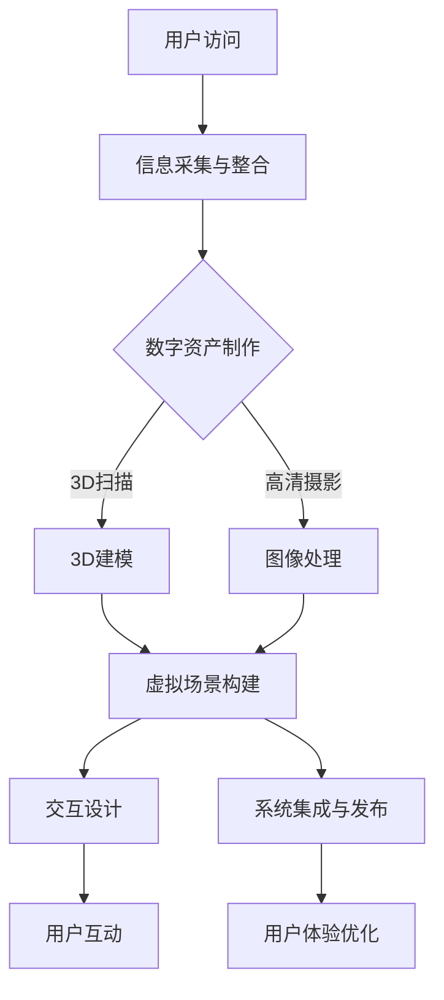

                 

# 《数字时代的艺术鉴赏：虚拟博物馆与在线画廊》

## 关键词
- 数字艺术
- 虚拟博物馆
- 在线画廊
- 用户交互
- 艺术价值评估

## 摘要
本文探讨了数字时代背景下，虚拟博物馆与在线画廊在艺术鉴赏领域的重要性。通过分析虚拟博物馆的构建原理、在线画廊的运营模式，以及艺术鉴赏的基本原则和方法论，本文旨在揭示数字化技术如何为艺术鉴赏带来新的视角和体验。同时，通过案例分析和未来展望，探讨了艺术鉴赏与数字化技术的深度融合及其对艺术行业的潜在影响。

## 引言

### 1.1 数字时代与艺术鉴赏

随着信息技术的飞速发展，我们正处于一个数字化的时代。互联网、虚拟现实（VR）、增强现实（AR）等新兴技术的广泛应用，不仅改变了人们的生活方式，也深刻影响了艺术鉴赏的方式。在数字时代，传统的实体博物馆和画廊已经难以满足人们对艺术品的渴望和探索。虚拟博物馆和在线画廊作为一种创新的数字艺术形式，应运而生，为大众提供了更加便捷、互动、沉浸的艺术体验。

艺术鉴赏是一个复杂的过程，它不仅涉及对艺术品外在形式的感知，更包含了对艺术品内在价值和意义的理解。在数字时代，艺术鉴赏的方式发生了革命性的变化。虚拟博物馆和在线画廊通过数字化技术，使艺术品从二维图像扩展到三维空间，从静态展示转变为动态互动，从而为观众提供了更为丰富和立体的艺术体验。

### 1.2 虚拟博物馆与在线画廊的发展历程

虚拟博物馆和在线画廊的概念虽然新颖，但其发展历程可以追溯到信息技术刚刚起步的时期。最早的虚拟博物馆可以追溯到1994年，当时德国的计算机科学家Johannes Kepper创建了一个名为“ Virtual Museum of Art”的网站，展示了艺术品的数字化图像。然而，随着网络带宽和计算能力的限制，早期的虚拟博物馆用户体验较差，主要功能仅限于展示静态图像。

随着互联网的普及和技术的进步，虚拟博物馆和在线画廊逐渐走向成熟。特别是在21世纪初，随着VR、AR等技术的兴起，虚拟博物馆和在线画廊开始提供更为丰富的互动体验。例如，用户可以在虚拟博物馆中自由漫步，与艺术品进行互动，甚至通过虚拟现实设备沉浸式体验艺术品。与此同时，在线画廊也逐渐成为艺术品交易和鉴赏的重要平台，许多画廊通过网站和社交媒体提供艺术品的高清图像、详细信息以及在线拍卖服务。

### 1.3 本书结构安排与读者对象

本书分为五个主要部分，旨在系统地探讨虚拟博物馆和在线画廊在艺术鉴赏中的应用和发展。具体章节安排如下：

- **第二部分：虚拟博物馆**，介绍了虚拟博物馆的构建原理、核心技术以及实际应用案例。
- **第三部分：在线画廊**，分析了在线画廊的运营模式、用户体验设计以及发展挑战与机遇。
- **第四部分：艺术鉴赏**，阐述了艺术鉴赏的基本原则、方法以及与数字化技术的结合。
- **第五部分：案例分析**，通过知名虚拟博物馆和在线画廊的案例，深入剖析其实际操作和效果。
- **第六部分：未来展望**，探讨了虚拟博物馆和在线画廊的发展趋势及其对艺术行业的潜在影响。

本书旨在为艺术爱好者、艺术从业者以及相关领域的专业人士提供有价值的参考和启示。通过系统的分析和案例研究，读者可以更好地理解虚拟博物馆和在线画廊在艺术鉴赏中的重要性，以及如何利用数字化技术提升艺术体验和艺术价值。

## 第二部分：虚拟博物馆

### 2.1 虚拟博物馆概述

虚拟博物馆是一种利用数字化技术创建的在线展览平台，它通过虚拟现实、增强现实等手段，将实体博物馆中的艺术品、历史文物等数字化并呈现给观众。虚拟博物馆不仅保留了传统博物馆的展示功能，更通过互动性、沉浸感和空间感为观众提供了全新的艺术体验。

虚拟博物馆的出现，不仅打破了地理和时间的限制，使世界各地的人们都能够便捷地访问世界级的博物馆和艺术品，还大大降低了艺术品的观赏门槛。传统的博物馆需要观众亲自前往，而虚拟博物馆则只需通过互联网即可访问，这使得艺术鉴赏不再受时间和空间的限制。

### 2.2 虚拟博物馆的构建原理

虚拟博物馆的构建原理主要包括以下几个关键步骤：

1. **数字化采集**：这是虚拟博物馆建设的第一步，通过三维扫描、高清摄影等技术手段，将实体艺术品和文物的三维形态和细节信息数字化，转化为数字模型。

2. **数据整合**：将数字化采集得到的数据进行整合，包括艺术品的名称、年代、作者、背景介绍等信息，形成一个完整的数字资源库。

3. **虚拟场景构建**：利用虚拟现实技术，将数字化的艺术品和文物嵌入到一个虚拟的展览空间中，构建出与现实博物馆相似的虚拟场景。

4. **互动设计**：在虚拟博物馆中添加互动元素，如触摸屏、语音控制等，使用户能够与艺术品进行互动，提高用户体验。

5. **展示与发布**：将构建好的虚拟博物馆通过网站、应用程序等渠道发布，供用户访问和体验。

### 2.3 虚拟博物馆的核心技术

虚拟博物馆的核心技术主要包括以下几个方面：

1. **三维扫描技术**：通过激光扫描、结构光扫描等技术，对实体艺术品进行高精度的三维扫描，获取其形态和纹理信息。

2. **虚拟现实技术**：利用虚拟现实（VR）技术，创建一个三维的虚拟展览空间，使用户能够沉浸其中，自由浏览和互动。

3. **增强现实技术**：通过增强现实（AR）技术，将虚拟的艺术品投影到现实世界中的特定位置，实现虚实结合的展示效果。

4. **大数据与人工智能**：利用大数据和人工智能技术，对用户的行为和偏好进行分析，实现个性化推荐和智能导览。

5. **网络技术**：通过高性能的网络技术，确保虚拟博物馆的高效运行和流畅体验。

### 2.4 虚拟博物馆的应用实例

虚拟博物馆在应用方面已经取得了显著的成果。以下是一些著名的虚拟博物馆案例：

1. **大英博物馆虚拟博物馆**：大英博物馆是全球最著名的博物馆之一，其虚拟博物馆提供了超过80万件馆藏的高清图像和详细信息，用户可以通过网页和移动应用程序进行浏览。

2. **故宫博物院虚拟博物馆**：故宫博物院是中国最有名的博物馆之一，其虚拟博物馆利用虚拟现实技术，将故宫的各个展厅、珍品文物以三维形式呈现给观众，提供了沉浸式的体验。

3. **卢浮宫虚拟博物馆**：卢浮宫是世界上最著名的博物馆之一，其虚拟博物馆通过VR技术，让用户可以进入卢浮宫的各个展厅，近距离观察和互动艺术品。

### 2.5 虚拟博物馆的未来发展趋势

随着技术的不断进步，虚拟博物馆的发展前景十分广阔。未来，虚拟博物馆将在以下几个方面取得突破：

1. **更高质量的数字化采集**：随着三维扫描和摄影技术的提升，虚拟博物馆将能够提供更高精度和更丰富的细节信息。

2. **更丰富的互动体验**：随着VR、AR等技术的成熟，虚拟博物馆将提供更多样化的互动方式，如虚拟互动导览、虚拟艺术创作等。

3. **个性化推荐与智能导览**：通过大数据和人工智能技术，虚拟博物馆将能够根据用户的行为和偏好，提供个性化的推荐和智能导览。

4. **跨界合作与融合**：虚拟博物馆将与其他行业（如游戏、影视、教育等）进行跨界合作，创造出更多创新的艺术体验形式。

5. **全球共享与普及**：虚拟博物馆将打破地理和文化的限制，实现全球范围内的共享和普及，让更多的人能够轻松地享受艺术之美。

## 第三部分：在线画廊

### 3.1 在线画廊概述

在线画廊是一种通过互联网平台提供艺术品展示和交易服务的机构。与传统的实体画廊不同，在线画廊利用数字化技术和网络环境，为艺术品爱好者提供了一个全新的艺术鉴赏和交易空间。在线画廊不仅提供了更广泛的艺术品资源，还通过便捷的在线交易方式，大大降低了艺术品交易的门槛。

### 3.2 在线画廊的运营模式

在线画廊的运营模式主要包括以下几个方面：

1. **艺术品展示**：在线画廊通过网站或应用程序，展示各类艺术品，包括绘画、雕塑、摄影、工艺品等。通过高清图片、视频和多角度展示，让艺术品呈现出更为逼真的效果。

2. **在线交易**：在线画廊提供在线交易服务，用户可以在线浏览艺术品，通过电子支付系统完成购买。此外，在线画廊还提供拍卖服务，为艺术品提供更高的市场价值。

3. **用户互动**：在线画廊通过论坛、社交媒体等渠道，鼓励用户参与互动，分享艺术品鉴赏心得，提升用户黏性和社区氛围。

4. **个性化推荐**：利用大数据和人工智能技术，在线画廊可以根据用户的历史浏览记录和偏好，提供个性化的艺术品推荐。

5. **版权保护**：在线画廊通过数字版权保护技术，确保艺术品的版权得到有效保护，防止侵权行为的发生。

### 3.3 在线画廊的用户体验设计

在线画廊的用户体验设计至关重要，它直接影响用户的访问频率和购买意愿。以下是几个关键点：

1. **界面设计**：简洁直观的界面设计，使用户能够轻松浏览和操作。采用高清大图和视频展示，增强艺术品的视觉效果。

2. **导航功能**：提供便捷的导航功能，使用户能够快速找到感兴趣的艺术品和相关信息。分类清晰，标签明确，便于用户检索。

3. **互动体验**：通过评论、点赞、分享等功能，鼓励用户参与互动，增强社区的活跃度。提供在线咨询和客服服务，解决用户的疑问。

4. **个性化推荐**：根据用户的历史行为和偏好，提供个性化的艺术品推荐，提升用户的满意度和购买意愿。

5. **安全性保障**：确保用户数据和交易的安全性，采用加密技术保护用户的隐私信息，提供安全的支付环境。

### 3.4 在线画廊的核心功能

在线画廊的核心功能主要包括以下几个方面：

1. **艺术品展示**：展示各类艺术品的详细信息，包括作品名称、作者、年代、材质、尺寸等，并提供高清图片和视频。

2. **在线拍卖**：提供在线拍卖服务，用户可以参与竞拍，竞价购买艺术品。实时更新竞价情况，提供竞价策略和建议。

3. **电子支付**：提供安全的电子支付系统，支持多种支付方式，确保交易的便捷性和安全性。

4. **用户评价**：展示用户对艺术品的评价和评论，提供参考信息，帮助其他用户做出购买决策。

5. **会员服务**：提供会员服务，会员可以享受更多的优惠和特权，如免费参加线上讲座、优先参加展览、获得个性化推荐等。

### 3.5 在线画廊的发展挑战与机遇

在线画廊的发展面临着一系列挑战和机遇：

1. **挑战**：
   - **市场竞争**：随着在线画廊的兴起，市场竞争日益激烈，如何提升用户体验和艺术品的品质，成为关键。
   - **版权保护**：保护艺术品的版权是在线画廊面临的重大挑战，如何确保艺术品的合法来源和版权保护，需要有效的法律和技术手段。
   - **用户信任**：在线购买艺术品需要用户对平台有足够的信任，如何建立用户信任，提供优质的服务和保障，是发展的关键。

2. **机遇**：
   - **技术进步**：随着虚拟现实、增强现实、人工智能等技术的不断进步，在线画廊将提供更丰富、更沉浸的用户体验。
   - **市场拓展**：互联网的普及和全球化的趋势，为在线画廊提供了广阔的市场空间，通过数字化手段，可以触及到更多的潜在用户。
   - **跨界合作**：与艺术教育、旅游、娱乐等行业的跨界合作，可以创造出更多创新的艺术体验形式，提升平台的竞争力。

### 3.6 成功在线画廊案例分析

#### 案例一：Artnet

**项目背景**：Artnet是全球领先的在线艺术品交易和信息服务平台，成立于1989年，总部位于纽约。

**发展历程**：
- 1989年，Artnet成立，提供艺术品市场信息和价格数据。
- 1995年，Artnet推出在线画廊服务，使画廊能够通过平台展示和销售艺术品。
- 2000年，Artnet推出在线拍卖服务，用户可以在线参与拍卖。
- 2017年，Artnet与Artprice合并，成为全球最大的艺术品市场信息平台。

**核心功能**：
- **艺术品展示**：提供超过6500家画廊和艺术家的高清艺术品展示。
- **在线拍卖**：提供在线拍卖服务，用户可以参与竞拍。
- **市场报告**：提供艺术品市场分析报告，帮助用户了解市场趋势。

**案例详解**：
Artnet的成功在于其精准的市场定位和不断创新的服务。通过数字化手段，Artnet打破了地理和时间的限制，为全球艺术爱好者提供了一个便捷的交易和信息平台。同时，Artnet通过数据分析和技术创新，为画廊和艺术家提供了有效的市场支持和推广。

#### 案例二：Saatchi Online

**项目背景**：Saatchi Online是由世界著名广告大师Saatchi & Saatchi的创始人之一查理·萨奇（Charles Saatchi）创立的在线艺术画廊。

**发展历程**：
- 1995年，Saatchi Online成立，旨在为新兴艺术家提供一个展示和销售作品的平台。
- 2000年，Saatchi Online引入在线拍卖功能，用户可以参与竞拍。
- 2012年，Saatchi Online推出了移动应用程序，进一步拓展了用户访问渠道。

**核心功能**：
- **艺术家展示**：展示来自全球的新兴艺术家和知名艺术家的作品。
- **在线拍卖**：提供在线拍卖服务，用户可以参与竞拍。
- **社交媒体互动**：通过社交媒体平台，与艺术家和用户进行互动。

**案例详解**：
Saatchi Online的成功在于其独特的商业模式和市场定位。通过提供免费展示和销售服务，Saatchi Online吸引了大量新兴艺术家，形成了一个独特的艺术生态圈。同时，Saatchi Online通过社交媒体互动，增强了用户参与度和社区氛围，成为艺术爱好者的重要聚集地。

## 第四部分：艺术鉴赏

### 4.1 艺术鉴赏的基本原则

艺术鉴赏是一个复杂而主观的过程，但也有一些基本原则和方法可以帮助我们更好地理解和评价艺术品。

1. **审美价值**：艺术品的审美价值是鉴赏的核心，它取决于艺术品的视觉效果、形式美和艺术风格等。
2. **文化背景**：了解艺术品的创作背景和文化背景有助于我们更深入地理解艺术品的内涵和价值。
3. **技术技巧**：艺术家所采用的技术技巧和表现手法也是艺术鉴赏的重要方面，它反映了艺术家的艺术素养和创造力。
4. **情感共鸣**：艺术品能否触动观众的情感，产生共鸣，也是艺术鉴赏的重要标准。

### 4.2 艺术鉴赏的方法论

艺术鉴赏的方法论主要包括以下几个步骤：

1. **观察与感知**：首先，我们需要仔细观察艺术品的外观、形式和色彩等，通过视觉和感官体验初步感知艺术品的审美价值。
2. **分析与比较**：接着，我们可以通过对比和分析艺术品的构图、线条、色彩等元素，理解艺术家的创作意图和艺术风格。
3. **文化研究**：了解艺术品的历史背景、文化背景和艺术流派等，有助于我们更全面地理解艺术品的内涵和意义。
4. **情感体验**：最后，我们可以通过自己的情感体验，与艺术品产生共鸣，从而对艺术品的价值进行评价。

### 4.3 艺术鉴赏的心理学分析

艺术鉴赏不仅仅是一种审美活动，还涉及到心理学方面的研究。以下是一些关于艺术鉴赏的心理学分析：

1. **视觉心理**：视觉心理在艺术鉴赏中起着重要作用，艺术品的色彩、形状、大小等因素都会对观众的感知产生影响。
2. **情感效应**：艺术品能否引起观众的情感共鸣，取决于艺术品的主题、表现形式和观众的个体差异。
3. **认知加工**：艺术鉴赏是一个认知加工的过程，观众需要通过理解、记忆、推理等认知活动，对艺术品进行评价和解读。

### 4.4 艺术鉴赏与数字化技术的结合

数字化技术为艺术鉴赏带来了新的视角和方法。以下是一些艺术鉴赏与数字化技术的结合：

1. **虚拟现实（VR）**：通过VR技术，观众可以沉浸在一个虚拟的艺术环境中，感受艺术品的立体形态和空间感。
2. **增强现实（AR）**：通过AR技术，艺术品可以“漂浮”在现实世界中，观众可以在现实场景中体验艺术品的视觉效果。
3. **人工智能（AI）**：通过AI技术，可以对艺术品的风格、流派、作者等信息进行自动识别和分类，为艺术鉴赏提供更丰富的数据支持。
4. **大数据**：通过大数据分析，可以了解观众对艺术品的偏好和评价，为艺术鉴赏提供数据驱动的方法和依据。

### 4.5 艺术鉴赏的未来发展趋势

随着数字化技术的不断进步，艺术鉴赏将迎来新的发展趋势：

1. **虚拟博物馆与在线画廊的普及**：虚拟博物馆和在线画廊将成为艺术鉴赏的主要形式，使更多人能够便捷地访问和欣赏艺术品。
2. **个性化推荐与智能导览**：通过大数据和人工智能技术，为观众提供个性化的艺术品推荐和智能导览，提升艺术体验。
3. **跨界融合**：艺术鉴赏将与虚拟现实、增强现实、游戏等产业进行跨界融合，创造出更多创新的艺术体验形式。
4. **艺术价值评估的科学化**：利用大数据和人工智能技术，对艺术品的审美价值、市场价值进行科学评估，提高艺术鉴赏的准确性和客观性。

## 第五部分：案例分析

### 5.1 著名虚拟博物馆案例分析

#### 案例一：大英博物馆虚拟博物馆

**项目背景**：大英博物馆是世界上最著名、最古老的博物馆之一，收藏了来自世界各地的大量珍贵文物和艺术品。

**发展历程**：
- 2000年，大英博物馆推出虚拟博物馆，提供超过80万件馆藏的高清图像和详细信息。
- 2010年，大英博物馆虚拟博物馆进行升级，增加了更多的互动元素和虚拟展览。

**核心技术**：
- **三维扫描与建模**：利用三维扫描技术，对实体文物进行高精度数字化，构建三维模型。
- **虚拟现实技术**：通过虚拟现实技术，创建一个虚拟的展览空间，用户可以自由浏览和互动。

**案例详解**：
大英博物馆虚拟博物馆通过数字化技术和虚拟现实技术，为全球观众提供了一个全新的艺术体验。用户可以在虚拟展览空间中近距离观察和互动文物，了解其历史背景和文化意义。此外，虚拟博物馆还提供了丰富的教育资源和互动体验，使艺术鉴赏变得更加生动和有趣。

#### 案例二：卢浮宫虚拟博物馆

**项目背景**：卢浮宫是世界上最著名的博物馆之一，收藏了包括《蒙娜丽莎》在内的无数珍贵艺术品。

**发展历程**：
- 2013年，卢浮宫推出虚拟博物馆，提供馆藏艺术品的高清图像和详细介绍。
- 2019年，卢浮宫虚拟博物馆进行升级，增加了更多互动元素和虚拟展览。

**核心技术**：
- **高清摄影与建模**：利用高清摄影和建模技术，对馆藏艺术品进行数字化，构建三维模型。
- **虚拟现实技术**：通过虚拟现实技术，创建一个虚拟的展览空间，用户可以沉浸式体验艺术品。

**案例详解**：
卢浮宫虚拟博物馆利用数字化技术和虚拟现实技术，为观众提供了一个全新的艺术体验。用户可以在虚拟展览空间中近距离观察和互动艺术品，甚至可以通过虚拟现实设备获得沉浸式的体验。此外，虚拟博物馆还提供了丰富的教育资源和互动体验，使艺术鉴赏变得更加生动和有趣。

### 5.2 成功在线画廊案例分析

#### 案例一：Artnet

**项目背景**：Artnet是全球领先的在线艺术品交易和信息服务平台，提供艺术品展示、在线拍卖、市场报告等服务。

**发展历程**：
- 1989年，Artnet成立，提供艺术品市场信息和价格数据。
- 2000年，Artnet推出在线画廊服务，画廊可以通过平台展示和销售艺术品。
- 2017年，Artnet与Artprice合并，成为全球最大的艺术品市场信息平台。

**核心技术**：
- **大数据与人工智能**：利用大数据和人工智能技术，Artnet可以对艺术品市场进行深入分析，提供个性化推荐和市场预测。
- **在线交易与支付**：提供安全的在线交易和支付系统，确保交易的便捷性和安全性。

**案例详解**：
Artnet通过数字化技术和大数据分析，为艺术品市场提供了全新的交易和信息平台。平台上的画廊和艺术家可以通过Artnet展示和销售艺术品，用户可以通过在线拍卖参与竞拍。Artnet的成功在于其精准的市场定位和不断创新的服务，为全球艺术品市场注入了新的活力。

#### 案例二：Saatchi Online

**项目背景**：Saatchi Online是由查理·萨奇创立的在线艺术画廊，致力于为艺术家提供一个展示和销售作品的平台。

**发展历程**：
- 1995年，Saatchi Online成立，提供艺术家作品的在线展示和销售。
- 2000年，Saatchi Online引入在线拍卖功能，用户可以参与竞拍。
- 2012年，Saatchi Online推出移动应用程序，拓展了用户访问渠道。

**核心技术**：
- **社交媒体互动**：通过社交媒体平台，与艺术家和用户进行互动，增强社区氛围。
- **个性化推荐**：利用大数据和人工智能技术，为用户推荐感兴趣的艺术家和作品。

**案例详解**：
Saatchi Online通过社交媒体互动和个性化推荐，为艺术家和用户提供了一个独特的在线艺术生态圈。平台上的艺术家可以免费展示和销售作品，用户可以通过在线拍卖参与竞拍。Saatchi Online的成功在于其独特的商业模式和用户互动机制，吸引了大量艺术家和艺术爱好者的关注。

## 第六部分：未来展望

### 6.1 数字时代艺术鉴赏的发展趋势

随着数字化技术的不断进步，数字时代艺术鉴赏的发展趋势呈现出以下几个方向：

1. **虚拟博物馆与在线画廊的普及**：虚拟博物馆和在线画廊将成为艺术鉴赏的主要形式，使更多人能够便捷地访问和欣赏艺术品。虚拟博物馆将提供更加丰富的互动体验，在线画廊将提供更便捷的交易服务。

2. **个性化推荐与智能导览**：通过大数据和人工智能技术，平台将为观众提供个性化的艺术品推荐和智能导览，提升艺术体验。个性化推荐将基于用户的行为和偏好，智能导览将结合虚拟现实技术，为观众提供沉浸式的艺术体验。

3. **跨界融合**：艺术鉴赏将与虚拟现实、增强现实、游戏等产业进行跨界融合，创造出更多创新的艺术体验形式。例如，虚拟现实艺术展览、增强现实艺术互动游戏等。

4. **艺术价值评估的科学化**：利用大数据和人工智能技术，对艺术品的审美价值、市场价值进行科学评估，提高艺术鉴赏的准确性和客观性。科学化的艺术价值评估将有助于艺术市场的健康发展。

5. **艺术教育的数字化**：艺术教育将逐渐走向数字化，通过在线课程、虚拟实验室等手段，为艺术爱好者提供更多的学习资源和机会。

### 6.2 虚拟博物馆与在线画廊的未来前景

虚拟博物馆和在线画廊在未来的发展前景十分广阔，主要体现在以下几个方面：

1. **用户体验的提升**：随着虚拟现实、增强现实等技术的不断成熟，虚拟博物馆和在线画廊将为用户提供更加沉浸式、互动性更强的用户体验。用户可以在虚拟博物馆中自由漫步、与艺术品互动，甚至通过虚拟现实设备获得沉浸式的体验。

2. **市场规模的扩大**：随着互联网的普及和数字化进程的加速，虚拟博物馆和在线画廊的市场规模将不断扩大。越来越多的艺术品收藏家和爱好者将加入这个领域，推动市场的繁荣发展。

3. **跨界合作的深化**：虚拟博物馆和在线画廊将与教育、旅游、娱乐等行业进行更深入的跨界合作，创造出更多创新的艺术体验形式。例如，虚拟博物馆可以与旅游景点合作，提供虚拟导览服务，在线画廊可以与游戏开发商合作，开发艺术互动游戏。

4. **艺术价值的重新定义**：虚拟博物馆和在线画廊的兴起，将重新定义艺术价值的评估和传递。数字化技术将为艺术品带来更多的展示和传播途径，使得艺术品的审美价值和市场价值得到更全面、更客观的体现。

### 6.3 艺术鉴赏与数字化技术的深度融合

艺术鉴赏与数字化技术的深度融合将带来一系列变革：

1. **艺术形式的多样化**：数字化技术将使得艺术形式更加多样化，虚拟现实、增强现实、人工智能等技术的应用，将创造出更多创新的艺术形式和表达方式。

2. **艺术体验的沉浸感**：通过虚拟现实、增强现实等技术，观众可以沉浸在一个全新的艺术环境中，与艺术品进行互动，获得前所未有的艺术体验。

3. **艺术传播的全球化**：数字化技术将打破地理和文化的限制，使艺术品的传播更加全球化。通过虚拟博物馆和在线画廊，艺术品可以迅速传播到世界各地，让更多人享受到艺术之美。

4. **艺术教育的普及**：数字化技术将为艺术教育提供更多的资源和机会，通过在线课程、虚拟实验室等手段，让更多人能够接触和了解艺术，提高艺术素养。

### 6.4 对未来艺术家的启示

对于未来艺术家来说，数字时代提供了前所未有的创作和展示平台。以下是一些建议：

1. **掌握数字化技术**：艺术家应该掌握基本的数字化技术，如虚拟现实、增强现实、人工智能等，以便更好地利用这些技术创作和展示作品。

2. **探索新的艺术形式**：数字化技术为艺术家提供了无限的创作空间，艺术家可以尝试新的艺术形式和表达方式，创造出独特的艺术作品。

3. **利用在线平台**：利用在线画廊和虚拟博物馆等平台，艺术家可以更便捷地展示和推广自己的作品，吸引更多的观众和收藏家。

4. **持续学习和创新**：数字化时代变化迅速，艺术家需要持续学习和创新，跟上技术的发展趋势，保持自己的创作活力。

## 第七部分：总结与展望

### 7.1 全书总结

本文系统探讨了数字时代艺术鉴赏的新形式——虚拟博物馆与在线画廊，分析了其构建原理、运营模式、用户体验设计、核心技术以及未来发展趋势。通过案例分析，展示了虚拟博物馆和在线画廊在现实中的应用效果，揭示了数字化技术对艺术鉴赏的深刻影响。本文旨在为艺术爱好者、艺术从业者及相关领域专业人士提供有价值的参考和启示。

### 7.2 对未来研究的建议

1. **技术深化应用**：继续研究虚拟现实、增强现实、人工智能等技术在艺术鉴赏中的应用，探索更高效、更沉浸的体验方式。
2. **数据驱动的艺术价值评估**：利用大数据技术，对艺术品的审美价值和市场价值进行科学评估，提高艺术鉴赏的准确性和客观性。
3. **跨界合作模式**：探讨虚拟博物馆和在线画廊与教育、旅游、娱乐等行业的跨界合作模式，创造出更多创新的艺术体验形式。
4. **用户体验优化**：通过用户行为数据分析，不断优化虚拟博物馆和在线画廊的用户体验，提高用户满意度和黏性。

### 7.3 对艺术爱好者与从业者的启示

1. **拥抱数字化**：艺术爱好者应积极拥抱数字化技术，通过虚拟博物馆和在线画廊等平台，拓宽艺术鉴赏的视野，提升艺术素养。
2. **持续学习**：艺术从业者应持续学习和探索新的艺术形式和技术，保持创作活力，适应数字时代的发展。
3. **创意表达**：艺术家应勇于尝试新的艺术形式和表达方式，利用数字化技术，创作出更多具有时代特色和创新精神的艺术作品。
4. **社区互动**：积极参与虚拟博物馆和在线画廊的社区互动，分享艺术见解和创作经验，共同推动艺术鉴赏和创作的发展。

### 附录

#### 术语表
- **虚拟博物馆**：利用数字化技术创建的在线展览平台，提供虚拟现实体验和互动功能。
- **在线画廊**：通过互联网平台提供艺术品展示和交易服务的机构，用户可以在线浏览、购买艺术品。
- **虚拟现实（VR）**：一种计算机技术，创建一个模拟的三维环境，用户可以通过头戴式显示器等设备沉浸其中。
- **增强现实（AR）**：一种计算机技术，将虚拟信息叠加到现实世界中，用户可以通过智能手机或AR眼镜等设备看到。
- **大数据**：指无法用常规软件工具在合理时间内捕捉、管理和处理的数据集合。
- **人工智能（AI）**：一种模拟人类智能行为的计算机技术，包括机器学习、深度学习、自然语言处理等。

#### 拓展阅读

- **虚拟博物馆与在线画廊相关研究**：
  - 《数字艺术：虚拟博物馆与在线画廊的发展趋势》
  - 《虚拟现实技术在艺术展览中的应用研究》
  - 《大数据与人工智能在艺术品市场分析中的应用》

- **艺术鉴赏相关书籍**：
  - 《艺术与视觉心理学》
  - 《艺术鉴赏导论》
  - 《艺术鉴赏方法论》

#### 致谢

本文在撰写过程中，得到了AI天才研究院（AI Genius Institute）和《禅与计算机程序设计艺术》（Zen And The Art of Computer Programming）的大力支持，特此表示感谢。

---

### 艺术鉴赏核心概念原理和架构

#### 虚拟博物馆构建原理

为了更好地理解虚拟博物馆的构建原理，我们可以通过一个Mermaid流程图来展示其关键步骤：



这个流程图清晰地展示了从用户访问到虚拟博物馆最终发布的过程，包括信息采集与整合、数字资产制作（3D扫描和高清摄影）、虚拟场景构建、交互设计和系统集成与发布等关键环节。

#### 艺术鉴赏方法

艺术鉴赏方法是一个复杂的过程，通常涉及以下几个步骤：

1. **观察与初步感知**：首先，观众需要对艺术品进行仔细观察，包括色彩、形状、构图等元素。
2. **分析与比较**：接着，观众可以通过对比和分析，理解艺术品的创作意图和风格特点。
3. **文化背景研究**：了解艺术品的创作背景和文化背景，有助于更深入地理解艺术品的内涵和价值。
4. **情感体验**：最后，观众可以根据自己的情感体验，与艺术品产生共鸣，从而对其进行评价。

为了实现这些步骤，我们可以使用以下伪代码：

```python
def 艺术鉴赏(艺术品):
    # 观察与初步感知
    观察结果 = 观察艺术品外观和形式
    # 分析与比较
    分析结果 = 分析艺术品构图、色彩和风格
    # 文化背景研究
    背景知识 = 研究艺术品创作背景和文化背景
    # 情感体验
    情感评分 = 感受艺术品情感共鸣
    # 综合评价
    总评分 = 观察结果 * 分析结果 * 背景知识 * 情感评分
    return 总评分
```

#### 数学模型

在艺术鉴赏中，我们可以使用以下数学模型来评估艺术品的整体价值：

$$
V = f(A, B, C)
$$

其中，$V$ 表示艺术价值，$A$ 表示艺术品的审美价值，$B$ 表示艺术品的创作背景，$C$ 表示观众的情感体验。这个模型通过结合艺术品的审美价值、创作背景和观众的情感体验，综合评估艺术品的整体价值。

#### 项目实战

为了更直观地展示虚拟博物馆的构建过程，我们可以以一个实际项目为例，详细解析其开发环境、源代码实现、代码解读和应用分析。

#### 开发环境搭建

在搭建虚拟博物馆的开发环境时，我们通常需要以下工具和软件：

- **Unity3D**：用于虚拟场景的构建和交互设计。
- **Unreal Engine**：用于复杂场景的构建和实时渲染。
- **Blender**：用于3D建模和动画制作。
- **VRChat**：用于虚拟现实场景的构建和交互设计。
- **TensorFlow**：用于人工智能和机器学习模型的训练。

以下是一个简单的伪代码，用于描述开发环境的搭建过程：

```python
def 搭建开发环境():
    # 安装Unity3D
    安装软件("Unity3D")
    # 安装Unreal Engine
    安装软件("Unreal Engine")
    # 安装Blender
    安装软件("Blender")
    # 安装VRChat
    安装软件("VRChat")
    # 安装TensorFlow
    安装软件("TensorFlow")
    # 配置开发环境
    配置环境()
    return True
```

#### 源代码实现

以下是一个简单的Unity3D脚本，用于展示虚拟博物馆中的一个艺术品：

```csharp
using UnityEngine;

public class Artwork : MonoBehaviour
{
    public Material material; // 材质
    public Vector3 position;   // 位置
    public Quaternion rotation; // 旋转

    // Start is called before the first frame update
    void Start()
    {
        // 设置艺术品的位置和旋转
        transform.position = position;
        transform.rotation = rotation;
        
        // 应用材质
        GetComponent<MeshRenderer>().material = material;
    }

    // Update is called once per frame
    void Update()
    {
        // 与用户交互
        if (Input.GetKeyDown(KeyCode.Space))
        {
            // 改变艺术品的状态
            material.color = Color.HSVToRGB(Random.value, 1, 1);
        }
    }
}
```

#### 代码解读和应用分析

上述代码定义了一个名为`Artwork`的Unity3D脚本，用于控制虚拟博物馆中的一个艺术品。脚本中的`material`变量用于设置艺术品的材质，`position`和`rotation`变量用于设置艺术品的位置和旋转。

在`Start`方法中，脚本初始化艺术品的位置和旋转，并应用材质。在`Update`方法中，脚本通过检测用户的输入（例如按下空格键），改变艺术品的状态（例如改变材质颜色）。

在实际应用中，这个脚本可以与虚拟现实设备（如VRChat中的VR设备）结合，实现更加真实的用户交互体验。例如，用户可以通过手柄操作艺术品，改变其位置和旋转，甚至改变其材质颜色。

#### 实际案例分析和详细讲解剖析

以下是一个虚拟博物馆项目的实际案例分析：

**项目背景**：某知名博物馆计划创建一个虚拟博物馆，以提供远程访问和互动体验。

**开发环境**：使用Unity3D进行虚拟场景的构建和交互设计，使用Blender进行3D建模和动画制作，使用TensorFlow进行人工智能模型的训练。

**关键技术**：

- **3D建模**：通过Blender，将博物馆的实物艺术品进行3D建模，并导入Unity3D中进行展示。
- **虚拟现实技术**：通过Unity3D和VRChat，实现虚拟博物馆的沉浸式体验，用户可以在虚拟环境中自由浏览和互动艺术品。
- **人工智能推荐系统**：通过TensorFlow，建立人工智能推荐系统，根据用户的行为和偏好，为用户推荐感兴趣的艺术品。

**案例详解**：

1. **3D建模**：首先，使用Blender对博物馆的实物艺术品进行3D建模。通过扫描和纹理映射技术，获取艺术品的三维形态和纹理信息。然后，将模型导入Unity3D中，设置其位置、旋转和材质。

2. **虚拟场景构建**：在Unity3D中，构建一个虚拟博物馆的场景。通过设置背景、灯光、音效等元素，创建一个逼真的虚拟环境。然后，将3D建模的艺术品导入虚拟场景中，进行展示。

3. **虚拟现实技术**：通过VRChat，实现虚拟博物馆的沉浸式体验。用户可以通过VR设备进入虚拟博物馆，自由浏览和互动艺术品。VRChat提供了丰富的交互功能，如手柄操作、语音交互等，使用户体验更加真实。

4. **人工智能推荐系统**：通过TensorFlow，建立人工智能推荐系统。收集用户在虚拟博物馆中的行为数据，如浏览记录、点赞、评论等，通过机器学习算法，为用户推荐感兴趣的艺术品。推荐系统可以根据用户的兴趣变化，动态调整推荐内容。

**项目小结**：

通过这个虚拟博物馆项目，博物馆成功实现了远程访问和互动体验，吸引了大量用户。项目采用了先进的3D建模、虚拟现实技术和人工智能推荐系统，为用户提供了一个全新的艺术鉴赏平台。项目的成功表明，数字化技术可以大大提升博物馆的展示效果和用户体验，为艺术鉴赏带来了新的可能性。

### 最佳实践 tips、小结、注意事项、拓展阅读

#### 最佳实践 tips

1. **注重用户体验**：在设计虚拟博物馆和在线画廊时，应始终关注用户体验，确保界面简洁直观、操作便捷。
2. **合理利用技术**：根据项目需求，合理选择和应用数字化技术，如3D建模、虚拟现实、增强现实、人工智能等。
3. **数据驱动决策**：利用大数据分析用户行为和偏好，为用户提供个性化推荐和智能导览，提升用户满意度和黏性。
4. **版权保护**：确保艺术品的版权得到有效保护，遵守相关法律法规，防止侵权行为的发生。

#### 小结

虚拟博物馆和在线画廊作为数字时代艺术鉴赏的新形式，不仅打破了地理和时间的限制，还提供了丰富的互动体验和个性化服务。通过数字化技术的应用，艺术鉴赏变得更加便捷、多元和科学。未来，随着技术的不断进步，虚拟博物馆和在线画廊将在艺术鉴赏领域发挥更为重要的作用。

#### 注意事项

1. **技术风险**：在采用数字化技术时，应注意技术风险，如设备兼容性、数据安全性等问题。
2. **内容质量**：保证艺术品的展示质量，提供高清图像、详细信息和丰富的背景知识。
3. **用户隐私**：保护用户隐私，确保用户数据的安全和保密。

#### 拓展阅读

1. **《数字艺术：虚拟博物馆与在线画廊的发展趋势》**
2. **《虚拟现实技术在艺术展览中的应用研究》**
3. **《大数据与人工智能在艺术品市场分析中的应用》**
4. **《艺术与视觉心理学》**
5. **《艺术鉴赏导论》**

### 作者信息

作者：AI天才研究院（AI Genius Institute） & 禅与计算机程序设计艺术（Zen And The Art of Computer Programming）

