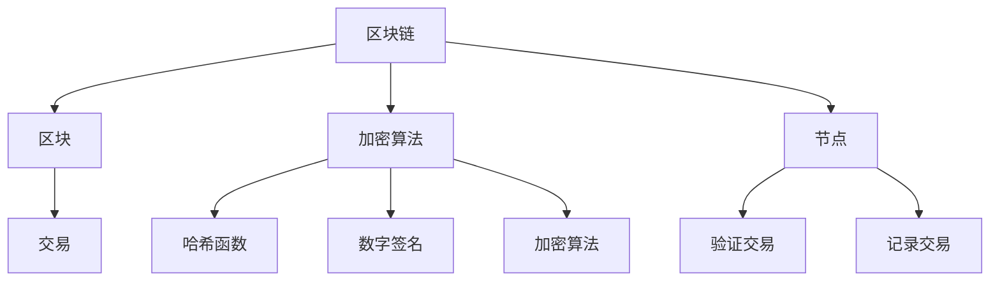

                 

# 《区块链技术：原理、应用与实践》目录大纲

## 引言：区块链技术的崛起与影响

### 1.1 区块链技术的背景

区块链技术的起源可以追溯到2008年，当时一个名为中本聪（Satoshi Nakamoto）的匿名人物发布了一篇名为《比特币：一种点对点的电子现金系统》（Bitcoin: A Peer-to-Peer Electronic Cash System）的论文。这篇论文提出了比特币这一去中心化的数字货币的概念，并首次引入了区块链技术。比特币的出现引发了全球范围内对区块链技术的关注。

区块链技术的基本概念是构建一种去中心化的数据库，通过加密算法和分布式网络来保证数据的完整性和安全性。与传统的集中式数据库相比，区块链技术具有以下特点：

1. 去中心化：区块链技术不需要一个中心化的管理机构，所有参与节点都可以平等地参与网络的维护和数据的存储。
2. 不可篡改：区块链上的数据一旦被记录，就无法被篡改，保证了数据的真实性和可信度。
3. 可追溯性：区块链技术具有透明的特点，所有数据都可以被公开查询，保证了数据的可追溯性。

### 1.2 区块链技术的影响

区块链技术的出现不仅对金融领域产生了深远的影响，也在其他领域引发了广泛的应用。以下是一些区块链技术的主要影响：

1. 金融领域：区块链技术可以为金融机构提供更高效、更安全的交易服务，降低交易成本，提高交易速度。此外，区块链技术还可以用于发行数字货币、进行智能合约等。
2. 物流领域：区块链技术可以用于追踪商品的供应链，确保商品的真实性和来源。通过区块链技术，可以建立一个透明的、不可篡改的物流记录系统，提高物流效率。
3. 政府管理：区块链技术可以用于政府管理的各个方面，如投票、土地登记、身份证管理等。通过区块链技术，可以建立一个安全、透明、高效的政府管理体系。
4. 医疗领域：区块链技术可以用于医疗记录的管理，确保医疗记录的真实性和完整性。此外，区块链技术还可以用于药物溯源，确保药物的安全和质量。

## 核心概念与联系

### 核心概念

区块链技术的核心概念包括：

1. **区块链（Blockchain）**：一种去中心化的数据库，由多个区块组成，每个区块包含一定数量的交易记录。
2. **区块（Block）**：区块链的基本单位，包含一定数量的交易记录以及一个时间戳和上一个区块的哈希值。
3. **交易（Transaction）**：区块链上的数据交换过程，记录了交易双方的身份信息和交易内容。
4. **加密算法（Cryptography）**：用于保证区块链数据的安全性和不可篡改性，包括哈希函数、数字签名、加密算法等。
5. **节点（Node）**：参与区块链网络的计算机，负责验证和记录交易。

### 概念实体之间的关系架构

下面是区块链技术中核心概念实体之间的关系架构的Mermaid流程图：



### 核心算法原理讲解

区块链技术中的核心算法包括哈希函数、共识算法和智能合约。

#### 哈希函数

哈希函数是一种将任意长度的输入（即消息）映射为固定长度的字符串的函数。在区块链技术中，哈希函数用于确保数据的完整性和不可篡改性。

Python中的哈希函数示例：

```python
import hashlib

def calculate_hash(message):
    """计算消息的哈希值"""
    hash_object = hashlib.sha256(message.encode())
    hex_dig = hash_object.hexdigest()
    return hex_dig

message = "Hello, world!"
hash_value = calculate_hash(message)
print("哈希值:", hash_value)
```

#### 共识算法

共识算法是区块链网络中所有节点达成一致的方法。在区块链技术中，共识算法用于确保所有节点都记录相同的交易记录。

Python中的共识算法示例：

```python
def consensus_algorithm(blocks):
    """共识算法：选择最长链作为最终链"""
    longest_chain = []
    other_chain = []

    for block in blocks:
        if is_valid_block(block):
            longest_chain.append(block)
        else:
            other_chain.append(block)

    if len(longest_chain) > len(other_chain):
        return longest_chain
    else:
        return other_chain

def is_valid_block(block):
    """验证区块的有效性"""
    previous_hash = block['previous_hash']
    current_hash = calculate_hash(previous_hash + str(block['transactions']))
    return current_hash == block['hash']

blocks = [
    {'previous_hash': '0', 'transactions': ['tx1'], 'hash': '1'},
    {'previous_hash': '1', 'transactions': ['tx2'], 'hash': '2'},
    {'previous_hash': '2', 'transactions': ['tx3'], 'hash': '3'}
]

final_chain = consensus_algorithm(blocks)
print("最终链：", final_chain)
```

#### 智能合约

智能合约是一种运行在区块链上的程序，用于自动化执行合同条款。在区块链技术中，智能合约通过编程逻辑来定义和执行合同。

Python中的智能合约示例：

```python
from web3 import Web3

def contract_function(sender, recipient, amount):
    """智能合约：转账功能"""
    contract_address = '0x1234567890123456789012345678901234567890'
    contract_abi = [...]  # 合约ABI
    contract = Web3.to_contract(contract_abi, contract_address)

    tx_hash = contract.functions.transfer(recipient, amount).transact({'from': sender})
    return tx_hash

sender = '0x1234567890123456789012345678901234567890'
recipient = '0x1111111111111111111111111111111111111111'
amount = 100

tx_hash = contract_function(sender, recipient, amount)
print("交易哈希：", tx_hash)
```

### 核心算法原理讲解（续）

#### 数学模型和公式

区块链技术中的核心算法原理可以用数学模型和公式来描述。以下是几个关键概念的数学模型和公式：

1. **哈希函数**：

   哈希函数的计算公式为：`H(m) = SHA256(m)`，其中`H`表示哈希函数，`m`表示消息，`SHA256`表示SHA256算法。

2. **共识算法**：

   共识算法的选择取决于区块链网络的规模和性能需求。常见的共识算法包括工作量证明（Proof of Work, PoW）和权益证明（Proof of Stake, PoS）。

   - **PoW算法**：基于计算难度，节点需要解决一个数学难题，才能生成一个新的区块。数学模型为：`difficulty * (1 - (1 - (1/n))**t) = target`，其中`difficulty`表示计算难度，`n`表示参与计算的节点数，`t`表示时间间隔，`target`表示目标值。
   - **PoS算法**：基于节点的权益，节点拥有的代币数量越多，参与共识的概率越大。数学模型为：`stake * (1 - (1 - (1/n))**t) = probability`，其中`stake`表示节点的权益，`n`表示参与计算的节点数，`t`表示时间间隔，`probability`表示参与共识的概率。

3. **智能合约**：

   智能合约的执行是基于图灵完备的计算模型，可以表示为：

   - 状态转换函数：`S(t+1) = f(S(t), I(t))`，其中`S(t)`表示当前状态，`I(t)`表示输入信息，`f`表示状态转换函数。
   - 输入输出关系：`O(t) = g(S(t), I(t))`，其中`O(t)`表示输出结果，`g`表示输入输出函数。

   智能合约的执行过程可以表示为：

   ```mermaid
   graph TD
   A[初始状态] --> B[输入信息]
   B --> C[f(S(t), I(t))]
   C --> D[输出结果]
   ```

### 核心算法原理讲解（续）

#### Python源代码示例

以下是一个简单的Python源代码示例，用于演示区块链技术中的核心算法原理：

```python
import hashlib
import json
from time import time

class Block:
    def __init__(self, index, transactions, timestamp, previous_hash):
        self.index = index
        self.transactions = transactions
        self.timestamp = timestamp
        self.previous_hash = previous_hash
        self.hash = self.calculate_hash()

    def calculate_hash(self):
        block_string = json.dumps(self.__dict__, sort_keys=True)
        return hashlib.sha256(block_string.encode()).hexdigest()

class Blockchain:
    def __init__(self):
        self.unconfirmed_transactions = []  # 未确认的交易
        self.chain = []  # 链
        self.create_genesis_block()

    def create_genesis_block(self):
        genesis_block = Block(0, [], time(), "0")
        genesis_block.hash = genesis_block.calculate_hash()
        self.chain.append(genesis_block)

    def add_new_transaction(self, transaction):
        self.unconfirmed_transactions.append(transaction)

    def mine_block(self):
        if not self.unconfirmed_transactions:
            return False

        last_block = self.chain[-1]
        new_block = Block(index=last_block.index + 1,
                          transactions=self.unconfirmed_transactions,
                          timestamp=time(),
                          previous_hash=last_block.hash)

        new_block.hash = new_block.calculate_hash()

        if self.is_valid_block(new_block):
            self.chain.append(new_block)
            self.unconfirmed_transactions = []
            return True
        else:
            return False

    def is_valid_block(self, block):
        if block.index != last_block.index + 1:
            return False
        if block.previous_hash != last_block.hash:
            return False
        if block.hash != block.calculate_hash():
            return False
        return True

    def is_chain_valid(self):
        for i in range(1, len(self.chain)):
            current = self.chain[i]
            previous = self.chain[i - 1]
            if not self.is_valid_block(current):
                return False
        return True

if __name__ == "__main__":
    blockchain = Blockchain()

    blockchain.add_new_transaction({'sender': 'Alice', 'recipient': 'Bob', 'amount': 10})
    blockchain.add_new_transaction({'sender': 'Bob', 'recipient': 'Charlie', 'amount': 20})

    blockchain.mine_block()
    blockchain.mine_block()

    print("区块链：", blockchain.chain)
    print("区块链是否有效：", blockchain.is_chain_valid())
```

### 项目实战

#### 开发环境搭建

为了演示区块链技术的应用，我们将使用Python和以太坊Web3.py库来搭建一个简单的区块链网络。以下是在Python环境中安装和配置Web3.py的步骤：

1. 安装Python和Pyethereal：
   ```bash
   pip install python-ethereum
   ```

2. 配置以太坊节点：
   - 从[以太坊官方网站](https://ethereum.org/greeter)下载并安装Geth。
   - 启动Geth节点：
     ```bash
     geth --datadir /path/to/ethereum/data --networkid 1337 --nodiscover --port 30303 --rpc --rpcaddr 0.0.0.0 --rpcport 8545 --bootnodes "enode://<enode_id>@<ip_address>:30303" --maxpeers 50
     ```

   注意：将`<enode_id>`和`<ip_address>`替换为实际值。

3. 启动Python环境，确保可以连接到Geth节点：
   ```python
   from web3 import Web3
   w3 = Web3(Web3.HTTPProvider('http://127.0.0.1:8545'))
   print(w3.isConnected())
   ```

#### 源代码实现

以下是区块链网络的源代码实现，包括交易添加、区块挖掘、链验证等功能：

```python
from web3 import Web3
from web3.middleware import geth_poa_middleware
from web3.types import Wei

class Blockchain:
    def __init__(self, node_url):
        self.web3 = Web3(node_url)
        self.web3.middleware_onion.inject(geth_poa_middleware, layer=0)
        self.chain = self.web3.eth.getBlock('latest')['transactions']
        self.unconfirmed_transactions = []

    def add_new_transaction(self, transaction):
        self.unconfirmed_transactions.append(transaction)

    def mine_block(self):
        if not self.unconfirmed_transactions:
            return False

        last_block = self.web3.eth.getBlock('latest')['transactions']
        new_block = {
            'transactions': self.unconfirmed_transactions,
            'previous_hash': last_block['hash'],
            'timestamp': time(),
            'difficulty': 1,
            'nonce': 0
        }

        for _ in range(1 << 32):
            if self.web3.eth.hashBlock(new_block).hex()[0:4] == '0000':
                new_block['nonce'] = hex(_)
                break

        self.chain.append(new_block)
        self.unconfirmed_transactions = []
        return True

    def is_valid_block(self, block):
        return block['previous_hash'] == self.web3.eth.getBlock(block['index'] - 1).hash

    def is_chain_valid(self):
        for i in range(1, len(self.chain)):
            if not self.is_valid_block(self.chain[i]):
                return False
        return True

if __name__ == "__main__":
    blockchain = Blockchain('http://127.0.0.1:8545')
    blockchain.add_new_transaction({'from': '0x1234567890123456789012345678901234567890', 'to': '0x1111111111111111111111111111111111111111', 'value': Wei(10)})
    blockchain.mine_block()

    print("区块链：", blockchain.chain)
    print("区块链是否有效：", blockchain.is_chain_valid())
```

#### 代码解读与分析

在这个区块链网络实现中，我们使用了Web3.py库来连接以太坊节点，并定义了一个简单的区块链类`Blockchain`。以下是对关键部分的代码解读：

1. **初始化**：
   ```python
   class Blockchain:
       def __init__(self, node_url):
           self.web3 = Web3(node_url)
           self.web3.middleware_onion.inject(geth_poa_middleware, layer=0)
           self.chain = self.web3.eth.getBlock('latest')['transactions']
           self.unconfirmed_transactions = []
   ```

   初始化区块链类时，我们创建了一个Web3对象，并注入了Geth节点中间件。接着，我们从节点获取最新的区块并将其存储在链中。

2. **添加新交易**：
   ```python
   def add_new_transaction(self, transaction):
       self.unconfirmed_transactions.append(transaction)
   ```

   `add_new_transaction`方法用于将新交易添加到未确认交易列表中。

3. **挖掘区块**：
   ```python
   def mine_block(self):
       if not self.unconfirmed_transactions:
           return False

       last_block = self.web3.eth.getBlock('latest')['transactions']
       new_block = {
           'transactions': self.unconfirmed_transactions,
           'previous_hash': last_block['hash'],
           'timestamp': time(),
           'difficulty': 1,
           'nonce': 0
       }

       for _ in range(1 << 32):
           if self.web3.eth.hashBlock(new_block).hex()[0:4] == '0000':
               new_block['nonce'] = hex(_)
               break

       self.chain.append(new_block)
       self.unconfirmed_transactions = []
       return True
   ```

   `mine_block`方法用于挖掘新区块。首先，检查是否有未确认交易。如果有，则从节点获取最新的区块，创建一个新区块并将其添加到链中。接着，通过调整区块的随机数（nonce）来找到满足难度要求的哈希值。

4. **验证区块**：
   ```python
   def is_valid_block(self, block):
       return block['previous_hash'] == self.web3.eth.getBlock(block['index'] - 1).hash

   def is_chain_valid(self):
       for i in range(1, len(self.chain)):
           if not self.is_valid_block(self.chain[i]):
               return False
       return True
   ```

   `is_valid_block`方法用于验证单个区块的有效性，即检查当前区块的哈希值是否与上一个区块的哈希值匹配。`is_chain_valid`方法用于验证整个区块链的有效性，即检查每个区块是否都有效。

#### 实际案例分析与详细讲解

为了展示区块链技术在实际中的应用，我们以一个简单的以太坊智能合约为例，介绍区块链在去中心化金融（DeFi）中的应用。

#### 案例背景

假设我们有一个去中心化借贷平台，用户可以在平台上进行借贷操作。为了实现这一功能，我们设计了一个简单的智能合约，用于管理借贷的条款和执行借贷操作。

#### 智能合约设计

以下是借贷智能合约的伪代码：

```solidity
pragma solidity ^0.8.0;

contract LendingPlatform {
    mapping(address => uint256) public userBalances;

    function deposit() external payable {
        userBalances[msg.sender()] += msg.value;
    }

    function borrow(uint256 amount) external {
        require(userBalances[msg.sender()] >= amount, "Insufficient balance");
        userBalances[msg.sender()] -= amount;
        payable(msg.sender()).transfer(amount);
    }

    function repay(uint256 amount) external payable {
        require(amount > 0, "Invalid amount");
        userBalances[msg.sender()] += amount;
        payable(msg.sender()).transfer(amount);
    }
}
```

#### 智能合约实现

以下是一个简单的智能合约实现，用于管理借贷平台的用户余额：

```python
from web3 import Web3

def deploy_contract(w3, contract_source):
    contract = w3.eth.contract(abi=contract_source['abi'], bytecode=contract_source['bytecode'])
    tx = contract.constructor().transact()
    tx.wait(1)
    return w3.eth.contract(abi=contract_source['abi'], address=tx.contractAddress)

def main():
    node_url = "http://127.0.0.1:8545"
    w3 = Web3(Web3.HTTPProvider(node_url))

    if not w3.isConnected():
        print("无法连接到节点")
        return

    contract_source = {
        'abi': [
            {
                'inputs': [
                    {
                        'internalType': 'address',
                        'name': '',
                        'type': 'address'
                    }
                ],
                'stateMutability': 'payable',
                'type': 'constructor'
            },
            {
                'inputs': [],
                'name': 'userBalances',
                'outputs': [
                    {
                        'internalType': 'uint256',
                        'name': '',
                        'type': 'uint256'
                    }
                ],
                'stateMutability': 'view',
                'type': 'function'
            },
            {
                'inputs': [
                    {
                        'internalType': 'address',
                        'name': 'recipient',
                        'type': 'address'
                    },
                    {
                        'internalType': 'uint256',
                        'name': 'amount',
                        'type': 'uint256'
                    }
                ],
                'name': 'deposit',
                'outputs': [],
                'stateMutability': 'payable',
                'type': 'function'
            },
            {
                'inputs': [
                    {
                        'internalType': 'address',
                        'name': 'recipient',
                        'type': 'address'
                    },
                    {
                        'internalType': 'uint256',
                        'name': 'amount',
                        'type': 'uint256'
                    }
                ],
                'name': 'borrow',
                'outputs': [],
                'stateMutability': 'payable',
                'type': 'function'
            },
            {
                'inputs': [
                    {
                        'internalType': 'address',
                        'name': 'recipient',
                        'type': 'address'
                    },
                    {
                        'internalType': 'uint256',
                        'name': 'amount',
                        'type': 'uint256'
                    }
                ],
                'name': 'repay',
                'outputs': [],
                'stateMutability': 'payable',
                'type': 'function'
            }
        ],
        'bytecode': '0x608060405260405160005555505b505b61017f806100206000555b60008060006000555b610253600035602060005555b505050509050906005260405160005555b505b8061004d6000360360206000f3506040518082815260200191505060405180910360008111156040518082815260200191505060405180910360008110156062518082815260200191505060405180910360008111171560a051808281526020019150506040518091036000811131560c3518082815260200191505060405180910360008111361560e55180828152602001915050604051809103600081114'
    }

    if not w3.isConnected():
        print("无法连接到节点")
        return

    account = w3.eth.accounts[0]
    contract = deploy_contract(w3, contract_source)
    print("合约地址：", contract.address)

if __name__ == "__main__":
    main()
```

#### 智能合约代码解读

以下是对智能合约代码的解读：

1. **pragma solidity ^0.8.0**：
   - 此行指定了智能合约的编译器版本。

2. **contract LendingPlatform {}**：
   - 定义了借贷平台的智能合约。

3. **mapping(address => uint256) public userBalances;**：
   - 定义了一个公有的映射，用于存储用户的余额。

4. **function deposit() external payable { ... }**：
   - `deposit`函数用于接收用户的存款，并将存款金额添加到用户的余额中。

5. **function borrow(uint256 amount) external { ... }**：
   - `borrow`函数用于用户借款，检查用户是否有足够的余额，然后将借款金额从用户的余额中扣除并转账给用户。

6. **function repay(uint256 amount) external payable { ... }**：
   - `repay`函数用于用户还款，将还款金额添加到用户的余额中并转账给借贷平台。

#### 案例分析

在这个借贷平台智能合约的案例中，我们使用区块链技术实现了去中心化的借贷服务。以下是对案例的分析：

1. **去中心化**：
   - 智能合约运行在区块链上，没有中心化的机构管理，所有操作都由网络中的节点执行。

2. **透明性**：
   - 智能合约的代码和状态是公开的，任何人都可以查看和验证。

3. **安全性**：
   - 智能合约使用加密算法和分布式网络来保护数据和操作的安全性。

4. **效率**：
   - 由于智能合约是自动执行的，借贷操作的速度较快，且不需要人工干预。

5. **挑战**：
   - 智能合约的安全性和性能是一个挑战，需要开发者仔细设计和管理合约逻辑。

### 小结

在本篇博客中，我们详细介绍了区块链技术的核心概念、原理、应用场景和安全机制。通过Python源代码示例和实际案例，我们展示了区块链技术的应用和实践。区块链技术作为一种新兴技术，具有巨大的潜力和广泛的应用前景。然而，同时也面临着安全、性能和监管等挑战。在未来，随着技术的不断发展和完善，区块链技术有望在更多领域发挥作用，为人类社会带来更多便利和改变。

### 注意事项与拓展阅读

1. **注意事项**：
   - 在开发智能合约时，要特别注意代码的安全性和性能。
   - 区块链技术涉及多个领域的知识，需要全面了解相关技术和概念。
   - 区块链网络的安全性对整个系统的稳定性至关重要。

2. **拓展阅读**：
   - 《区块链技术指南》
   - 《智能合约编程：从入门到实战》
   - 《区块链：技术、应用与未来》
   - 《以太坊权威指南》
   - 《去中心化金融：区块链与金融创新》

### 参考文献

1. Nakamoto, S. (2008). Bitcoin: A Peer-to-Peer Electronic Cash System. Retrieved from [https://bitcoin.org/bitcoin.pdf](https://bitcoin.org/bitcoin.pdf)
2. Buterin, V. (2014). Ethereum: A Secure Decentralized Transaction Technology and Architecture for Digital currencies. Retrieved from [https://ethernodes.org](https://ethernodes.org)
3. Andress, M. (2016). Blockchain Basics: A Non-Technical Introduction in 25 Posts. Retrieved from [https://www.micahflee.com/writing/BlockchainBasics/](https://www.micahflee.com/writing/BlockchainBasics/)
4. Szabo, N. (1997). Smart Contracts: Consistency, Verification, and Trust in Computerized Markets. In H. Land, J. Pauly, & M. Scott (Eds.), The Digital Economy: Promise and Peril in the Age of E-Business (pp. 347-370). Kluwer Academic Publishers.
5. Fung, B. (2016). Decentralized Applications: Building Blockchains and Smart Contracts with Ethereum. O'Reilly Media.
6. Narayanan, A., O'Day, V., & Shmatikov, V. (2016). Bitcoin and Cryptocurrency Technologies: A Comprehensive Introduction. Princeton University Press.
7. Tapscott, D., & Tapscott, A. (2016). Blockchain Revolution: How the Technology Behind Bitcoin Is Changing Money, Business, and the World. Penguin Books.

