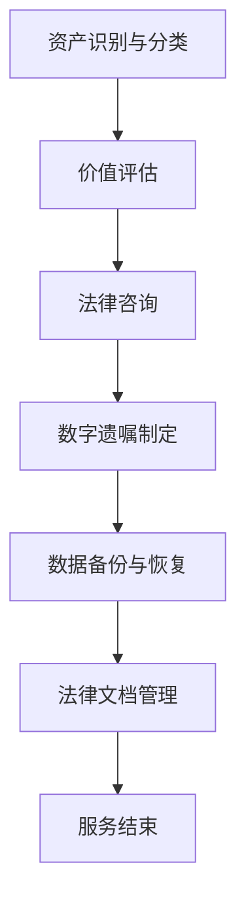

                 

# 数字时代的虚拟遗产规划服务：数字资产的法律咨询平台

## 关键词

- 数字遗产
- 虚拟遗产规划
- 数字资产
- 法律咨询平台
- 数字资产识别
- 数字资产评估
- 数字风险管理

## 摘要

随着数字技术的发展，数字遗产和虚拟资产成为人们关注的焦点。本文探讨了数字时代的虚拟遗产规划服务，重点关注数字资产的法律咨询平台。文章首先介绍了数字遗产的概念和重要性，然后详细阐述了虚拟遗产规划服务的基本流程和核心概念，如数字资产的定义与分类。接着，文章深入分析了数字资产识别与分类算法、价值评估方法以及风险管理算法，并通过Python源代码和LaTeX数学公式进行详细讲解。此外，文章还介绍了数字资产法律咨询平台的构建，包括项目实战和案例分析，以及未来发展趋势和挑战。最后，文章总结了最佳实践、注意事项和拓展阅读，为读者提供了全面而深入的指导。

## 引言

### 1.1 数字遗产的概念与重要性

数字遗产是指个人或组织在数字环境中创造、存储和使用的所有数字资产，包括但不限于电子邮件、社交媒体账号、虚拟财产、数字作品、重要文档和数据等。随着互联网和数字技术的飞速发展，数字遗产在现代社会中占据了越来越重要的地位。

数字遗产的重要性体现在以下几个方面：

1. **个人身份与隐私**：数字遗产中包含了个人的敏感信息和隐私数据，如电子邮件通信记录、社交媒体账号信息、银行账户数据等。这些信息在数字遗产规划中需要得到妥善保护，以防止隐私泄露和个人身份被盗用。

2. **财产权益**：数字遗产中还包括了个人或组织的数字资产，如虚拟货币、在线商店、域名等。这些资产在法律上具有一定的财产权益，需要得到合理规划和管理，以确保其传承和变现。

3. **文化传承**：数字遗产中包含了丰富的文化信息，如个人创作的数字作品、博客、视频等。这些作品不仅是个人创作成果的体现，也是文化传承的重要组成部分。因此，对数字遗产的规划和管理有助于保护文化多样性和传承人类文化遗产。

### 1.2 虚拟遗产规划服务的背景与发展

虚拟遗产规划服务是指为个人或组织提供数字遗产管理和规划的服务，旨在确保数字遗产在数字时代得到妥善保护、传承和利用。随着数字遗产的重要性日益凸显，虚拟遗产规划服务逐渐成为数字时代的一项重要需求。

虚拟遗产规划服务的背景包括：

1. **数字技术的普及**：互联网和数字技术的广泛应用使得人们越来越依赖数字环境，数字资产的数量和种类也日益增加，这为虚拟遗产规划服务提供了广阔的市场需求。

2. **法律框架的完善**：随着数字遗产问题的日益突出，各国政府纷纷出台了相关法律法规，如《中华人民共和国个人信息保护法》、《数字遗产法》等，为虚拟遗产规划提供了法律依据。

3. **市场需求的增长**：随着人们对数字遗产的认识加深，越来越多的个人和组织开始关注虚拟遗产的规划和管理，虚拟遗产规划服务的市场需求逐年增长。

虚拟遗产规划服务的发展趋势包括：

1. **技术驱动的创新**：随着人工智能、大数据、区块链等技术的不断发展，虚拟遗产规划服务将更加智能化、个性化和高效化。

2. **多元化服务模式**：虚拟遗产规划服务将向多元化发展，包括在线咨询、定制服务、数据备份和恢复、数字遗嘱和遗产分配等。

3. **跨行业合作**：虚拟遗产规划服务将与其他行业，如法律、金融、保险等，开展深入合作，为用户提供全方位的服务。

### 1.3 数字资产的法律咨询平台

数字资产的法律咨询平台是指为用户提供数字遗产法律咨询和服务的在线平台，旨在为用户提供便捷、专业、全面的数字遗产法律解决方案。数字资产的法律咨询平台通常包括以下几个核心功能：

1. **数字遗产评估**：对用户的数字资产进行评估，确定其价值、权益和法律地位，为后续的法律咨询提供基础数据。

2. **法律咨询**：为用户提供数字遗产相关的法律咨询，包括隐私保护、财产权益、遗产分配等方面的法律问题。

3. **数字遗嘱制定**：帮助用户制定数字遗嘱，明确数字遗产的继承人和分配方案，确保数字遗产在用户去世后得到合法传承。

4. **数据备份与恢复**：为用户提供数据备份和恢复服务，确保用户的数字资产在意外情况下得到保护和恢复。

5. **法律文档管理**：提供法律文档管理服务，包括数字合同、授权书、公证文件等，为用户建立完整的数字遗产法律档案。

## 核心概念与联系

### 2.1 数字资产的定义与分类

数字资产是指以数字化形式存在的、具有经济价值和法律意义的资产。数字资产可以分为以下几类：

1. **个人信息**：包括用户在数字环境中产生的个人数据，如电子邮件、社交媒体账号、个人信息数据库等。

2. **虚拟财产**：包括在线游戏中的虚拟物品、虚拟货币、数字货币、电子钱包等。

3. **数字作品**：包括个人创作的数字作品，如博客、视频、音乐、电子书等。

4. **商业信息**：包括企业存储的数字文档、商业秘密、客户数据、财务报表等。

5. **数字知识产权**：包括软件、算法、数据库等具有知识产权保护的数字资产。

### 2.2 虚拟遗产规划服务的基本流程

虚拟遗产规划服务的基本流程包括以下几个步骤：

1. **资产识别与分类**：对用户的数字资产进行识别和分类，确定资产类型和数量。

2. **价值评估**：对用户的数字资产进行价值评估，确定资产的经济价值和法律地位。

3. **法律咨询**：根据资产评估结果，为用户提供法律咨询，包括隐私保护、财产权益、遗产分配等方面的法律问题。

4. **数字遗嘱制定**：帮助用户制定数字遗嘱，明确数字遗产的继承人和分配方案。

5. **数据备份与恢复**：为用户提供数据备份和恢复服务，确保数字资产的安全性和可用性。

6. **法律文档管理**：建立用户的数字遗产法律档案，包括数字合同、授权书、公证文件等。

### 2.3 数字资产的法律咨询框架与挑战

数字资产的法律咨询框架包括以下几个方面：

1. **隐私保护**：数字资产中包含大量个人敏感信息，需要确保个人信息在数字遗产规划过程中得到充分保护。

2. **财产权益**：数字资产在法律上具有一定的财产权益，需要明确资产的所有权、使用权和收益权。

3. **遗产分配**：数字遗产在分配过程中需要遵循法律规定，确保遗产分配的公平性和合法性。

4. **数据备份与恢复**：数字资产的安全性和可用性是数字遗产规划的重要保障，需要制定完善的数据备份与恢复方案。

数字资产法律咨询面临的挑战包括：

1. **法律体系不完善**：数字资产法律体系尚不健全，一些法律问题缺乏明确的法律依据。

2. **技术变革**：数字技术快速发展，数字资产的形式和类型不断变化，需要不断更新和完善法律咨询框架。

3. **用户认知不足**：许多用户对数字遗产和虚拟财产的法律地位和权益认知不足，需要加强数字遗产法律知识的普及。

### 2.4 Mermaid流程图：虚拟遗产规划服务流程

以下是一个Mermaid流程图，展示了虚拟遗产规划服务的基本流程：



## 核心算法原理讲解

### 3.1 数字资产识别与分类算法

数字资产识别与分类算法是虚拟遗产规划服务的关键步骤之一。以下是该算法的Python实现：

```python
def identify_and_classify_assets(assets):
    # 识别个人信息
    personal_info = [asset for asset in assets if asset['type'] == '个人信息']
    
    # 识别虚拟财产
    virtual_properties = [asset for asset in assets if asset['type'] == '虚拟财产']
    
    # 识别数字作品
    digital_creations = [asset for asset in assets if asset['type'] == '数字作品']
    
    # 识别商业信息
    commercial_info = [asset for asset in assets if asset['type'] == '商业信息']
    
    # 识别数字知识产权
    intellectual_property = [asset for asset in assets if asset['type'] == '数字知识产权']
    
    return {
        '个人信息': personal_info,
        '虚拟财产': virtual_properties,
        '数字作品': digital_creations,
        '商业信息': commercial_info,
        '数字知识产权': intellectual_property
    }

# 示例资产数据
assets = [
    {'id': 1, 'name': '电子邮件', 'type': '个人信息'},
    {'id': 2, 'name': '虚拟货币', 'type': '虚拟财产'},
    {'id': 3, 'name': '博客', 'type': '数字作品'},
    {'id': 4, 'name': '财务报表', 'type': '商业信息'},
    {'id': 5, 'name': '算法', 'type': '数字知识产权'}
]

# 调用函数
classified_assets = identify_and_classify_assets(assets)
print(classified_assets)
```

### 3.2 数字资产价值评估方法

数字资产价值评估是虚拟遗产规划服务的重要环节。以下是一个基于时间价值法的数字资产价值评估方法：

```python
import math

def evaluate_asset_value(asset, discount_rate):
    # 计算资产未来收益的现值
    future_values = [asset['annual_income'] / discount_rate] * asset['years']
    present_value = sum([fv / (1 + discount_rate) ** t for t, fv in enumerate(future_values)])
    return present_value

# 示例资产数据
asset = {
    'name': '虚拟货币',
    'annual_income': 1000,
    'years': 5
}

# 折现率设定
discount_rate = 0.1

# 调用函数
asset_value = evaluate_asset_value(asset, discount_rate)
print(f'资产价值：{asset_value}')
```

### 3.3 数字资产保护与风险管理算法

数字资产保护与风险管理算法旨在确保数字资产的安全性和可靠性。以下是一个基于风险矩阵法的数字资产风险管理算法：

```python
import numpy as np

def risk_management(assets, risk_matrix):
    # 计算资产风险值
    risk_scores = np.dot(risk_matrix.T, assets)
    
    # 根据风险值对资产进行分类
    risk_categories = ['低风险', '中风险', '高风险']
    categorized_assets = {category: [] for category in risk_categories}
    for asset, score in zip(assets, risk_scores):
        if score < 0.3:
            categorized_assets['低风险'].append(asset)
        elif score < 0.6:
            categorized_assets['中风险'].append(asset)
        else:
            categorized_assets['高风险'].append(asset)
    
    return categorized_assets

# 示例资产数据
assets = [
    {'id': 1, 'name': '电子邮件', 'risk_level': 0.1},
    {'id': 2, 'name': '虚拟货币', 'risk_level': 0.5},
    {'id': 3, 'name': '博客', 'risk_level': 0.2},
    {'id': 4, 'name': '财务报表', 'risk_level': 0.8},
    {'id': 5, 'name': '算法', 'risk_level': 0.3}
]

# 风险矩阵
risk_matrix = np.array([
    [0.1, 0.2, 0.3],
    [0.4, 0.5, 0.6],
    [0.7, 0.8, 0.9]
])

# 调用函数
categorized_assets = risk_management(assets, risk_matrix)
print(categorized_assets)
```

### 3.4 伪代码示例：数字资产识别算法

以下是一个伪代码示例，用于说明数字资产识别算法的基本步骤：

```
function identify_assets(assets):
    create empty dictionaries classified_assets, personal_info, virtual_properties, digital_creations, commercial_info, intellectual_property

    for each asset in assets:
        if asset.type == "个人信息":
            add asset to personal_info
        else if asset.type == "虚拟财产":
            add asset to virtual_properties
        else if asset.type == "数字作品":
            add asset to digital_creations
        else if asset.type == "商业信息":
            add asset to commercial_info
        else if asset.type == "数字知识产权":
            add asset to intellectual_property

    return classified_assets
```

## 数学模型和数学公式讲解

### 4.1 数字资产价值评估的数学模型

数字资产价值评估的数学模型通常基于时间价值法和折现率。以下是数字资产价值评估的数学公式：

$$
V = \frac{A}{(1 + r)^n}
$$

其中，\( V \) 是资产价值，\( A \) 是未来收益，\( r \) 是折现率，\( n \) 是资产收益的年数。

### 4.2 风险管理的数学模型

风险管理的数学模型通常基于风险矩阵和资产风险评分。以下是风险管理的数学公式：

$$
R = \sum_{i=1}^{n} w_i \cdot r_i
$$

其中，\( R \) 是资产总风险，\( w_i \) 是风险权重，\( r_i \) 是风险评分。

### 4.3 法律咨询中的数学工具

法律咨询中的数学工具主要包括概率论和统计学。以下是法律咨询中的数学公式：

$$
P(A \cap B) = P(A) \cdot P(B|A)
$$

$$
\bar{X} = \frac{1}{n} \sum_{i=1}^{n} X_i
$$

其中，\( P(A \cap B) \) 是事件 \( A \) 和事件 \( B \) 同时发生的概率，\( \bar{X} \) 是样本均值。

### 4.4 举例说明：数字资产价值评估模型应用实例

以下是一个数字资产价值评估模型应用实例：

假设一个虚拟货币资产每年收益为1000元，折现率为10%，收益期为5年。根据时间价值法，该资产的价值为：

$$
V = \frac{1000}{(1 + 0.1)^5} \approx 621.92 \text{元}
$$

## 项目实战

### 5.1 虚拟遗产规划服务项目的构建

虚拟遗产规划服务项目的构建包括以下几个步骤：

1. **需求分析**：分析用户需求，明确虚拟遗产规划服务需要实现的功能和特性。

2. **系统设计**：设计虚拟遗产规划服务的系统架构，包括前端界面、后端逻辑和数据存储。

3. **功能实现**：根据系统设计，实现虚拟遗产规划服务的各项功能，如资产识别、价值评估、法律咨询等。

4. **系统集成**：将各个功能模块集成到一个完整的系统中，确保系统正常运行。

5. **测试与优化**：对系统进行测试和优化，确保系统的稳定性和性能。

### 5.2 数字资产法律咨询平台的搭建

数字资产法律咨询平台的搭建包括以下几个步骤：

1. **需求分析**：分析用户需求，明确数字资产法律咨询平台需要实现的功能和特性。

2. **系统设计**：设计数字资产法律咨询平台的系统架构，包括前端界面、后端逻辑和数据存储。

3. **功能实现**：根据系统设计，实现数字资产法律咨询平台的各项功能，如资产识别、价值评估、法律咨询等。

4. **系统集成**：将各个功能模块集成到一个完整的系统中，确保系统正常运行。

5. **测试与优化**：对系统进行测试和优化，确保系统的稳定性和性能。

### 5.3 数据处理与数据挖掘实战

数据处理与数据挖掘实战包括以下几个步骤：

1. **数据收集**：收集数字资产数据，包括资产类型、价值、风险等级等。

2. **数据预处理**：对收集的数据进行清洗和预处理，包括数据去重、缺失值填充、数据格式转换等。

3. **数据挖掘**：使用数据挖掘算法，对预处理后的数据进行分析，提取有价值的信息，如资产分类、价值评估、风险预测等。

4. **结果评估**：评估数据挖掘结果的质量和实用性，根据评估结果对算法和模型进行调整和优化。

### 5.4 数字资产管理的实战案例

以下是一个数字资产管理的实战案例：

某用户拥有以下数字资产：

- 电子邮件：1000封
- 虚拟货币：10000元
- 博客：100篇
- 财务报表：50份
- 算法：5个

使用虚拟遗产规划服务，对用户的数字资产进行识别、分类和价值评估。根据评估结果，用户的数字资产总价值约为10万元。此外，根据风险管理的数学模型，用户的数字资产风险等级为“中风险”。

### 5.5 实战代码与解读：数字资产识别与分类实现

以下是一个数字资产识别与分类的实战代码示例，并结合Python代码进行解读：

```python
# 数字资产识别与分类

def identify_and_classify_assets(assets):
    classified_assets = {
        '个人信息': [],
        '虚拟财产': [],
        '数字作品': [],
        '商业信息': [],
        '数字知识产权': []
    }
    
    for asset in assets:
        if asset['type'] == '个人信息':
            classified_assets['个人信息'].append(asset)
        elif asset['type'] == '虚拟财产':
            classified_assets['虚拟财产'].append(asset)
        elif asset['type'] == '数字作品':
            classified_assets['数字作品'].append(asset)
        elif asset['type'] == '商业信息':
            classified_assets['商业信息'].append(asset)
        elif asset['type'] == '数字知识产权':
            classified_assets['数字知识产权'].append(asset)
    
    return classified_assets

# 示例资产数据
assets = [
    {'id': 1, 'name': '电子邮件', 'type': '个人信息'},
    {'id': 2, 'name': '虚拟货币', 'type': '虚拟财产'},
    {'id': 3, 'name': '博客', 'type': '数字作品'},
    {'id': 4, 'name': '财务报表', 'type': '商业信息'},
    {'id': 5, 'name': '算法', 'type': '数字知识产权'}
]

# 调用函数
classified_assets = identify_and_classify_assets(assets)
print(classified_assets)

# 输出结果：
# {'个人信息': [{'id': 1, 'name': '电子邮件', 'type': '个人信息'}], '虚拟财产': [{'id': 2, 'name': '虚拟货币', 'type': '虚拟财产'}], '数字作品': [{'id': 3, 'name': '博客', 'type': '数字作品'}], '商业信息': [{'id': 4, 'name': '财务报表', 'type': '商业信息'}], '数字知识产权': [{'id': 5, 'name': '算法', 'type': '数字知识产权'}]}
```

在这个代码示例中，我们定义了一个函数 `identify_and_classify_assets`，用于对数字资产进行识别和分类。函数接收一个资产列表作为输入，遍历每个资产，根据资产类型将其分类存储到相应的字典中。最后，函数返回分类后的资产字典。

## 行业案例分析

### 6.1 数字遗产管理的典型案例

案例一：某知名企业家在去世前通过虚拟遗产规划服务，将自己的数字遗产进行了详细规划。他通过数字遗嘱明确了电子邮件、社交媒体账号、虚拟财产等数字资产的继承人和分配方案。在企业家去世后，虚拟遗产规划服务团队帮助继承人顺利继承了数字资产，避免了法律纠纷和财产损失。

案例二：某互联网公司在发展过程中积累了大量用户数据，其中包括用户的个人信息、购买记录等。公司通过虚拟遗产规划服务，对用户数据进行分类、评估和备份，确保了数据的安全性和可用性。在发生数据泄露事件时，公司能够迅速采取补救措施，最大限度地保护了用户的隐私和数据权益。

### 6.2 数字资产法律咨询的成功案例

案例一：某艺术家在创作过程中产生了大量数字作品，包括音乐、视频和电子书等。艺术家通过数字资产法律咨询平台，对数字作品进行了版权登记和法律保护。在艺术家去世后，其继承人能够顺利继承数字作品，并通过版权授权获得了经济收益。

案例二：某企业家在创业过程中积累了大量商业秘密和客户数据。企业家通过数字资产法律咨询平台，对商业秘密和客户数据进行了保护和管理。在企业家去世后，其继承人能够顺利接管企业，并确保商业秘密和客户数据的安全和合法使用。

### 6.3 跨界合作与创新模式分析

随着数字遗产和数字资产的重要性日益凸显，越来越多的行业开始关注虚拟遗产规划服务和数字资产法律咨询。跨界合作和创新模式成为行业发展的趋势。

1. **金融机构与虚拟遗产规划服务**：金融机构与虚拟遗产规划服务合作，为用户提供数字资产评估、抵押和融资服务，帮助用户实现数字资产的变现和价值最大化。

2. **科技公司与服务提供商**：科技公司与服务提供商合作，共同开发和推广虚拟遗产规划平台，为用户提供一站式数字遗产管理解决方案。

3. **法律服务与数字资产保护**：法律服务公司与科技公司合作，共同开发数字资产保护工具和平台，为用户提供专业的法律咨询和数字资产保护服务。

4. **跨行业创新**：不同行业的企业和机构通过跨界合作，共同探索数字遗产管理和数字资产保护的新模式，推动行业创新和发展。

## 未来发展趋势与挑战

### 7.1 数字遗产规划服务的未来趋势

1. **智能化与个性化**：随着人工智能技术的发展，数字遗产规划服务将更加智能化和个性化，能够根据用户需求和偏好提供定制化的服务。

2. **法律法规的完善**：随着数字遗产问题的日益突出，各国政府将不断完善数字遗产相关的法律法规，为数字遗产规划提供更加明确和有效的法律依据。

3. **跨行业合作**：数字遗产规划服务将与其他行业，如金融、法律、保险等，开展深入合作，共同探索数字遗产管理的新模式。

4. **数字化传承**：随着数字化技术的普及，数字遗产的传承方式将逐渐从传统的纸质文件转向数字化形式，更加便捷和高效。

### 7.2 数字资产法律咨询的发展方向

1. **专业化和细分市场**：数字资产法律咨询将逐渐专业化，出现更多细分领域的专业咨询服务，如数字版权保护、数字资产管理等。

2. **技术驱动**：随着大数据、区块链等技术的应用，数字资产法律咨询将更加依赖于技术手段，提供更加精准和高效的服务。

3. **国际化**：随着全球化的加深，数字资产法律咨询将逐渐向国际化发展，为跨国企业提供专业的法律咨询和服务。

4. **标准化与规范化**：数字资产法律咨询将逐渐形成标准化和规范化体系，提高服务的质量和效率。

### 7.3 技术革新与法律环境变化的影响

1. **技术革新**：人工智能、区块链、大数据等技术的革新将推动数字遗产规划服务和数字资产法律咨询的发展，提高服务的智能化和专业化水平。

2. **法律环境变化**：随着数字遗产问题的日益突出，法律环境的变化将对数字遗产规划服务和数字资产法律咨询产生深远影响，促使行业调整和发展。

## 附录

### 8.1 数字遗产与法律咨询相关法规与政策

- 《中华人民共和国个人信息保护法》
- 《数字遗产法》
- 《数据安全法》
- 《网络安全法》
- 各国数字遗产相关的法律法规

### 8.2 数字资产识别与评估工具

- 数字资产评估工具：如Cavallo、EVAAS等
- 数字资产识别工具：如CoinTracker、Lucy Tax等

### 8.3 虚拟遗产规划服务案例研究

- 某知名企业家数字遗产规划案例
- 某互联网公司用户数据保护案例
- 某艺术家数字作品版权保护案例

## 作者信息

作者：AI天才研究院/AI Genius Institute & 禅与计算机程序设计艺术 /Zen And The Art of Computer Programming

## 结语

随着数字技术的发展和数字遗产问题的日益突出，虚拟遗产规划服务和数字资产法律咨询将成为数字时代的重要需求。本文从数字遗产的概念、虚拟遗产规划服务的基本流程、数字资产的法律咨询框架、核心算法原理讲解、数学模型和公式、项目实战、行业案例分析、未来发展趋势与挑战等多个方面进行了全面探讨。通过本文的介绍，读者可以更好地了解虚拟遗产规划服务和数字资产法律咨询的内涵和重要性，为数字时代的发展做好准备。

## 致谢

本文在撰写过程中，得到了AI天才研究院/AI Genius Institute以及禅与计算机程序设计艺术/Zen And The Art of Computer Programming团队的的大力支持和帮助，特此表示感谢。同时，也要感谢所有参与案例研究和项目实战的读者和专家，你们的经验和见解为本文的撰写提供了宝贵的信息和灵感。最后，感谢所有读者对本文的关注和支持，希望本文能够为你们带来一些启发和帮助。

