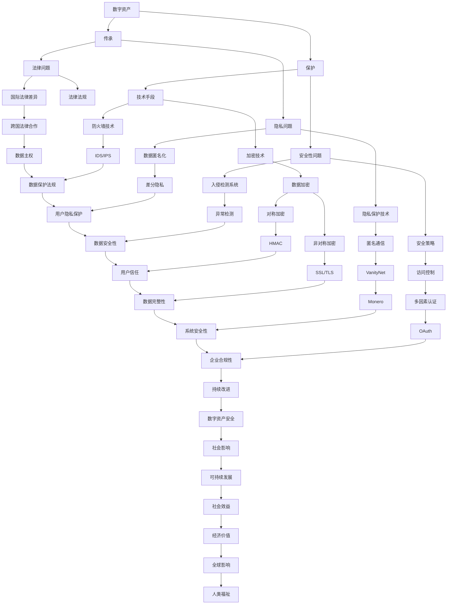

                 

### 背景介绍

在数字时代，我们的日常生活和工作已经与数字资产紧密相连。数字资产，指的是以数字形式存在的财产或财富，包括但不限于数据、软件、专利、商标、域名、虚拟货币等。随着信息技术的发展和互联网的普及，数字资产的价值逐渐凸显，成为个人和企业财富的重要组成部分。然而，数字资产的特殊性也带来了传承和保护上的挑战。

首先，数字资产具有无形性、易复制性、易丢失性等特点。这使得数字资产比传统有形资产更加脆弱，容易遭受黑客攻击、数据泄露、非法复制等问题。其次，数字资产的法律地位尚不明确，不同国家和地区对数字资产的保护力度和法律规定存在差异。这给数字资产的传承带来了法律上的不确定性。

此外，随着社会的发展和技术的进步，数字资产的种类和形式也在不断丰富。例如，虚拟现实（VR）、增强现实（AR）、区块链等新兴技术，使得数字资产的形态更加多样，但其管理和保护也变得更加复杂。

总的来说，数字资产在现代社会中具有不可忽视的重要性。有效的数字资产传承与保护策略，不仅是个人财富安全的保障，也是企业长期稳定发展的关键。因此，深入探讨数字资产的传承与保护问题，具有重要的现实意义和深远的历史影响。

### 核心概念与联系

在讨论数字资产的传承与保护策略时，我们需要明确几个核心概念，并理解它们之间的关系。以下是几个关键概念及其相互关系的架构 Mermaid 流程图：



#### 关键概念解释

1. **数字资产**：指以数字形式存在的财产或财富，如数据、软件、专利、商标、域名、虚拟货币等。

2. **传承**：指的是数字资产在不同主体之间转移的过程，包括个人遗产、企业资产等。

3. **保护**：确保数字资产不被未经授权的访问、使用、泄露、篡改或破坏。

4. **法律问题**：涉及数字资产的法律地位、权益、传承过程中的法律纠纷等。

5. **技术手段**：使用各种技术手段来确保数字资产的安全，如加密技术、防火墙、入侵检测系统等。

6. **隐私问题**：数字资产中的个人信息保护问题，如隐私泄露、匿名通信等。

7. **安全性问题**：数字资产面临的安全威胁，如黑客攻击、数据泄露、非法复制等。

通过上述 Mermaid 流程图，我们可以清晰地看到这些核心概念之间的相互关系。传承和保护是数字资产管理的两个关键方面，而法律问题、技术手段、隐私问题和安全性问题则是实现这些目标的重要保障。每一个方面都紧密相连，共同构成一个完整的数字资产管理框架。

理解这些核心概念及其关系，有助于我们更好地制定数字资产的传承与保护策略，确保数字资产在日益复杂的数字环境中得以安全、有效地传承与保护。

### 数字资产的分类与特点

在深入探讨数字资产的传承与保护策略之前，首先需要了解数字资产的分类及其特点。数字资产可以根据其形式和用途进行分类，主要包括以下几类：

#### 1. 数据资产

数据资产是最常见的一种数字资产，包括企业内部的数据库、客户信息、市场调研数据、专利和版权信息等。数据资产的特点如下：

- **无形性**：数据资产没有物理形态，完全以数字形式存在。
- **易复制性**：数据可以轻松复制，增加了数据保护和管理难度。
- **价值性**：高质量的数据可以为企业带来重要的竞争优势和商业价值。
- **易失性**：数据一旦丢失或被篡改，很难恢复，对企业和个人都有重大影响。

#### 2. 软件资产

软件资产包括计算机软件、应用程序、源代码等。软件资产的特点如下：

- **功能性**：软件资产可以执行特定任务，为企业和个人提供便利。
- **更新性**：软件需要不断更新以适应新的需求和技术发展。
- **知识产权性**：软件资产往往涉及知识产权，如专利、版权等。
- **依赖性**：软件资产与其他技术基础设施（如服务器、网络）密切相关。

#### 3. 虚拟财产

虚拟财产主要指在虚拟世界中存在的财产，如网络游戏中的装备、虚拟货币、数字艺术品等。虚拟财产的特点如下：

- **虚拟性**：虚拟财产存在于虚拟世界中，不涉及现实世界的物理形态。
- **稀缺性**：某些虚拟财产具有稀缺性，其价值取决于市场需求。
- **交易性**：虚拟财产可以在线上平台进行交易，具有实际经济价值。
- **依赖性**：虚拟财产往往依赖特定的虚拟平台或游戏，管理难度较大。

#### 4. 知识产权资产

知识产权资产包括专利、商标、版权等。知识产权资产的特点如下：

- **法律性**：知识产权资产受法律保护，具有明确的法律地位。
- **永续性**：知识产权在一定期限内受法律保护，具有长期价值。
- **跨国性**：知识产权在国际上具有广泛的影响，需要跨国法律保护。
- **独特性**：每一项知识产权都是独特的，具有不可替代性。

#### 5. 域名资产

域名资产是企业或个人在网络上的标识，如.com、.net、.org等。域名资产的特点如下：

- **唯一性**：每个域名在全球范围内是唯一的。
- **价值性**：优质的域名可以为企业带来品牌价值和商业机会。
- **易识别性**：域名是企业或个人在网络上的重要标识，有助于品牌推广。
- **流动性**：域名可以买卖，具有一定的投资价值。

#### 6. 虚拟现实（VR）和增强现实（AR）资产

虚拟现实和增强现实资产包括虚拟现实场景、增强现实应用等。这类资产的特点如下：

- **互动性**：用户可以通过虚拟现实和增强现实技术与虚拟环境进行互动。
- **沉浸性**：虚拟现实和增强现实技术能够提供强烈的沉浸感。
- **创新性**：这类资产往往涉及技术创新，具有广阔的应用前景。
- **多元化**：虚拟现实和增强现实资产可以应用于教育、娱乐、医疗等多个领域。

#### 7. 区块链资产

区块链资产包括加密货币、智能合约等。区块链资产的特点如下：

- **去中心化**：区块链技术去除了中心化机构的依赖，具有高度自治性。
- **安全性**：区块链通过加密算法和分布式存储技术确保数据安全。
- **透明性**：区块链上的交易信息对所有参与者透明，增加了信任度。
- **应用广泛**：区块链技术可以应用于金融、物流、医疗等多个领域。

了解这些数字资产的分类和特点，有助于我们更好地理解其传承与保护的复杂性。不同类型的数字资产在传承和保护策略上需要采用不同的方法和手段，确保其在数字时代的安全和可持续发展。

### 数字资产传承的重要性

在数字化浪潮席卷全球的背景下，数字资产传承的重要性愈发凸显。首先，数字资产传承关乎个人和企业的财富安全。随着个人和企业对数字资产依赖程度的增加，确保这些资产能够在不同主体之间顺利转移，成为保护财产免受损失的关键。例如，企业家去世后，其公司的数据库、专利和商标等数字资产需要有效传承，以确保企业持续运营和业务发展。

其次，数字资产传承对家族和企业治理具有重要影响。有效的数字资产传承策略不仅关系到财富的分配，还涉及家族和企业内部的权力结构。如果传承过程不透明或出现纠纷，可能导致家族或企业内部关系紧张，影响长期稳定。因此，制定科学的数字资产传承策略，有助于确保家族和企业内部和谐稳定。

此外，数字资产传承与隐私保护密切相关。数字资产中往往包含大量的个人和商业敏感信息，如客户数据、内部文件等。如果这些信息在传承过程中泄露，可能导致隐私侵犯和商业机密泄露。有效的数字资产传承策略应当考虑隐私保护，确保敏感信息在传承过程中不被泄露。

最后，数字资产传承还与税务和法律合规密切相关。不同国家和地区的法律对数字资产传承的规定存在差异，一些国家对数字资产的税收政策也较为复杂。在制定数字资产传承策略时，需要充分考虑税务和法律合规要求，避免因不当处理引发法律纠纷和税务问题。

综上所述，数字资产传承的重要性不可忽视。它不仅关系到个人和企业的财富安全，还对家族和企业治理、隐私保护和法律合规产生深远影响。因此，深入探讨数字资产传承的障碍和挑战，制定科学、有效的传承策略，是确保数字资产安全传承的关键。

### 数字资产传承的障碍与挑战

尽管数字资产传承的重要性不言而喻，但在实际操作中，我们仍然面临诸多障碍与挑战。以下是一些主要的挑战及其影响：

#### 1. 法律法规的不完善

不同国家和地区的法律法规对数字资产的认定、管理和保护存在差异，这给数字资产传承带来了法律上的不确定性。例如，一些国家对虚拟货币和区块链资产的法律地位尚未明确，导致在传承过程中可能面临法律纠纷。此外，国际间的法律差异也增加了跨国数字资产传承的复杂性。

#### 2. 技术障碍

数字资产的特殊性，如无形性、易复制性和易丢失性，使得其在管理和保护上面临诸多技术挑战。例如，数据加密和身份验证技术的不足可能导致数字资产在传承过程中被未经授权的访问或篡改。此外，虚拟财产和知识产权的管理和保护也需要高度专业化的技术手段。

#### 3. 隐私保护问题

数字资产传承过程中，涉及大量的个人和商业敏感信息，如客户数据、财务记录和内部文件等。这些信息的泄露可能对个人隐私和商业秘密造成严重威胁。有效的隐私保护措施需要考虑到数据加密、匿名通信和隐私计算等多方面技术。

#### 4. 数据迁移和兼容性问题

在数字资产传承过程中，数据的迁移和兼容性问题常常被忽视。不同系统和平台之间的数据格式、协议和存储方式可能存在差异，导致数据在迁移过程中出现丢失、损坏或不兼容的问题。这需要高度专业化的数据管理和迁移技术，以确保数据在传承过程中保持完整和可访问性。

#### 5. 伦理和道德问题

数字资产传承还涉及伦理和道德问题。例如，某些数字资产可能包含敏感或不当内容，如色情、暴力等。在传承过程中，如何处理这些内容，既不影响个人隐私，又符合伦理和法律要求，是一个复杂的伦理挑战。

#### 6. 跨界协作的挑战

数字资产的传承往往涉及多个部门和利益相关方，如法律顾问、财务顾问、技术专家等。在跨国或跨企业的数字资产传承过程中，如何协调各方利益，确保传承过程的顺利进行，是一个巨大的挑战。

#### 7. 税务和法律合规问题

数字资产传承过程中，税务和法律合规问题也备受关注。不同国家和地区对数字资产的税收政策存在差异，一些国家可能对虚拟货币和区块链资产征收高额税费。此外，在数字资产传承过程中，如何确保合规性，避免因税务问题引发法律纠纷，也是一个重要的挑战。

综上所述，数字资产传承面临多方面的障碍与挑战。这些挑战不仅影响数字资产的安全传承，还可能对个人和企业的财务状况、声誉和业务运营产生深远影响。因此，制定科学、有效的数字资产传承策略，需要充分考虑这些挑战，并采取相应的应对措施。

### 数字资产传承的方法与策略

为了有效应对数字资产传承中的种种障碍与挑战，我们需要制定一系列科学、有效的传承方法和策略。以下是一些主要的方法与策略：

#### 1. 明确数字资产的法律地位

首先，确保数字资产在法律上具有明确地位，是数字资产传承的前提。不同国家和地区的法律对数字资产的认定和保护存在差异，因此，个人和企业应当了解所在地的相关法律法规，确保数字资产在法律上得到有效保护。

- **跨国法律咨询**：对于涉及跨国传承的数字资产，应当寻求专业的跨国法律咨询，确保法律地位的明确性和一致性。

- **制定遗嘱和授权文件**：个人和企业应制定详细的遗嘱和授权文件，明确数字资产的继承人和授权代理人，确保在法定情况下能够顺利转移数字资产。

#### 2. 使用加密技术保护数字资产

加密技术是保护数字资产安全的重要手段。通过使用高级加密算法，如对称加密和非对称加密，可以确保数字资产在传输和存储过程中的安全性。

- **数据加密**：在数字资产生成和存储时，应采用数据加密技术，确保数据在传输和存储过程中的机密性。

- **访问控制**：通过访问控制机制，限制未经授权的用户访问数字资产，防止数据泄露和未经授权的篡改。

- **多因素认证**：结合密码、指纹、面部识别等多因素认证技术，提高数字资产访问的安全性。

#### 3. 建立数字资产管理平台

建立专门的数字资产管理平台，可以帮助个人和企业更好地管理数字资产，确保在传承过程中的透明性和可追溯性。

- **数字资产登记**：在数字资产管理平台上登记所有数字资产，包括数据、软件、虚拟财产等，确保资产的可追溯性。

- **自动化管理**：通过自动化技术，实现数字资产的自动备份、监控和更新，提高管理效率。

- **实时监控**：利用实时监控技术，及时发现和处理数字资产的安全威胁，确保资产的安全和稳定。

#### 4. 设计灵活的传承策略

根据个人或企业的具体情况，设计灵活的数字资产传承策略，确保在传承过程中能够灵活应对各种挑战。

- **分阶段传承**：将数字资产传承分为多个阶段，逐步转移资产，降低风险。

- **灵活的授权机制**：在传承过程中，灵活调整授权机制，确保继承人能够在适当的时间获得相应的数字资产访问权限。

- **动态调整策略**：根据市场和技术的变化，动态调整传承策略，确保策略的适应性和有效性。

#### 5. 强化隐私保护

数字资产传承过程中，涉及大量的个人和商业敏感信息，因此，隐私保护至关重要。

- **数据匿名化**：采用数据匿名化技术，对敏感信息进行脱敏处理，减少隐私泄露风险。

- **隐私计算**：利用隐私计算技术，在数据处理过程中保护用户隐私，确保数据在共享和分析过程中不被泄露。

- **合规性审查**：定期进行隐私合规性审查，确保数字资产管理和传承过程符合相关法律法规要求。

#### 6. 搭建协作平台

数字资产传承往往涉及多个部门和利益相关方，因此，搭建协作平台，提高各方沟通和协作效率，是确保传承过程顺利进行的重要手段。

- **跨部门协作**：建立跨部门的数字资产传承协作平台，确保各部门之间的信息共享和协调。

- **利益相关方沟通**：定期与利益相关方（如继承人、法律顾问、技术专家等）进行沟通，确保传承策略的制定和实施得到各方认可和支持。

- **培训和教育**：对相关人员进行数字资产管理和传承的培训和教育，提高他们的专业素养和操作能力。

#### 7. 实施税务和法律合规管理

数字资产传承过程中，税务和法律合规管理至关重要。

- **专业税务咨询**：寻求专业税务咨询，确保数字资产传承符合税务规定，避免因税务问题引发的法律纠纷。

- **法律合规审查**：定期进行法律合规审查，确保数字资产管理和传承过程符合相关法律法规要求。

- **税务筹划**：制定合理的税务筹划方案，降低数字资产传承过程中的税务负担。

通过上述方法与策略，我们可以更好地应对数字资产传承中的各种障碍与挑战，确保数字资产的安全、有效传承。在实际操作中，根据个人或企业的具体情况，灵活调整和优化这些策略，是确保传承过程顺利进行的关键。

### 数字资产保护的意义与目标

数字资产的保护不仅是维护个人和企业财产安全的必要手段，还关乎社会经济的稳定与发展。在数字化浪潮的推动下，数字资产逐渐成为社会财富的重要组成部分，其保护的意义和目标如下：

#### 1. 维护个人和企业财产安全

数字资产包括数据、软件、虚拟财产等多种形式，这些资产的价值往往不可估量。有效保护数字资产，可以防止未经授权的访问、使用、泄露、篡改或破坏，确保个人和企业的财产安全。例如，企业的客户数据、商业秘密和财务记录等数字资产，如果未得到妥善保护，可能导致严重的经济损失和声誉损害。

#### 2. 保障数据隐私

在数字资产中，大量包含个人和商业敏感信息。这些信息一旦泄露，不仅侵害个人隐私，还可能对企业的商业秘密造成威胁。因此，保护数字资产的意义在于确保个人和商业信息的隐私和安全。例如，通过数据加密、匿名化等技术手段，可以防止敏感信息在数字资产传递和处理过程中被窃取或泄露。

#### 3. 预防犯罪活动

随着数字资产的增加，犯罪活动也日益猖獗。黑客攻击、网络诈骗、数据泄露等犯罪行为不仅对个人和企业造成经济损失，还可能危害国家安全和社会稳定。保护数字资产，有助于预防这些犯罪活动，维护社会秩序。例如，通过防火墙、入侵检测系统和安全审计等技术，可以及时发现和阻止潜在的安全威胁。

#### 4. 促进数字经济健康发展

数字经济的蓬勃发展依赖于数字资产的安全和稳定。有效保护数字资产，可以增强市场信心，促进数字经济的持续健康发展。例如，区块链技术在金融、供应链管理、医疗等多个领域的应用，离不开对数字资产的高效保护。只有保障数字资产的安全，才能确保这些创新应用的顺利实施和广泛普及。

#### 5. 提高企业和个人竞争力

在竞争激烈的市场环境中，企业和个人需要确保其数字资产的安全性，以保持竞争优势。有效的数字资产保护策略，可以减少安全事件的发生，降低运营成本，提高业务效率和客户满意度。例如，通过建立健全的安全管理体系，企业可以确保其关键业务系统的稳定运行，提高市场竞争力。

#### 6. 法律法规的要求

许多国家和地区的法律法规对数字资产保护提出了明确要求。例如，欧盟的《通用数据保护条例》（GDPR）和美国的多项数据保护法规，都对数字资产的保护提出了严格的标准。企业和个人必须遵守这些法律法规，确保其数字资产保护措施符合法律要求，避免因违规行为面临法律风险。

总的来说，数字资产的保护具有重要的现实意义和深远的影响。它不仅关乎个人和企业的财产安全，还影响社会经济的稳定与发展。为了实现数字资产的安全保护，需要建立全面、有效的保护体系，包括技术手段、管理策略和法律法规等多方面措施，确保数字资产在复杂多变的数字环境中得以安全、可靠地运行。

### 数字资产保护的技术手段

在数字资产保护方面，技术手段起到了至关重要的作用。这些技术不仅能够有效防范外部威胁，还能确保数据在存储、传输和使用过程中的安全性。以下是几种常用的数字资产保护技术手段：

#### 1. 数据加密技术

数据加密技术是保护数字资产安全的基本手段。它通过将明文数据转换成密文，确保数据在传输和存储过程中不被未经授权的第三方访问。

- **对称加密**：对称加密使用相同的密钥对数据进行加密和解密。常见的对称加密算法有AES（高级加密标准）和DES（数据加密标准）。

  ```python
  from Crypto.Cipher import AES
  from Crypto.Util import bytes_to_int
  
  key = b'Sixteen byte key'
  cipher = AES.new(key)
  ciphertext = cipher.encrypt(b'Attack at dawn!')
  print(ciphertext)
  ```

- **非对称加密**：非对称加密使用一对密钥（公钥和私钥）进行加密和解密。常见的非对称加密算法有RSA和ECC（椭圆曲线加密）。

  ```python
  from Crypto.PublicKey import RSA
  
  key = RSA.generate(2048)
  private_key = key.export_key()
  public_key = key.publickey().export_key()
  
  cipher = PKCS1_OAEP.new(key.publickey())
  ciphertext = cipher.encrypt(b'Attack at dawn!')
  print(ciphertext)
  ```

#### 2. 访问控制技术

访问控制技术通过限制对数字资产的访问权限，确保只有经过授权的用户才能访问敏感数据。

- **多因素认证**：多因素认证（MFA）结合了密码、指纹、面部识别等多种认证方式，提高了访问的安全性。

  ```python
  import pyotp
  
  secret = pyotp.random_base32()
  totp = pyotp.TOTP(secret)
  token = totp.now()
  print(token)
  ```

- **角色基础访问控制（RBAC）**：RBAC根据用户的角色分配访问权限，确保不同角色只能访问与其角色相关的数据。

  ```python
  from flask import Flask, request, jsonify
  
  app = Flask(__name__)
  users = {
      'admin': ['read', 'write', 'delete'],
      'user': ['read']
  }
  
  @app.route('/data', methods=['GET'])
  def get_data():
      user = request.authorization.username
      permissions = users.get(user, [])
      if 'read' in permissions:
          return jsonify({'data': 'Sensitive data'})
      else:
          return jsonify({'error': 'Unauthorized'})
  ```

#### 3. 数据备份与恢复技术

数据备份与恢复技术确保在数据丢失或损坏时，能够快速恢复数据，减少业务中断。

- **本地备份**：将数据备份到本地存储设备，如硬盘、磁带等。

  ```python
  import shutil
  
  shutil.copy2('source_data.txt', 'destination_data.txt')
  ```

- **远程备份**：将数据备份到远程服务器或云存储，提高数据的安全性和可靠性。

  ```python
  import paramiko
  
  client = paramiko.SSHClient()
  client.set_missing_host_key_policy(paramiko.AutoAddPolicy())
  client.connect('hostname', username='user', password='password')
  sftp = client.open_sftp()
  sftp.put('source_data.txt', 'destination_data.txt')
  sftp.close()
  client.close()
  ```

#### 4. 入侵检测系统（IDS）

入侵检测系统用于监测网络流量和系统活动，及时发现和阻止潜在的安全威胁。

- **基于特征的分析**：通过识别已知的攻击模式和行为特征，检测和阻止攻击。

  ```python
  import scapy.all as scapy
  
  def sniff_packets():
      packets = scapy.srp1(scapy.IP() / scapy.TCP(), timeout=2, verbose=False)
      if packets:
          print(f"Detected packet: {packets}")
          if "attack" in str(packets):
              print("Potential attack detected!")
  ```

- **基于行为的分析**：通过分析网络行为模式，检测异常行为和潜在威胁。

  ```python
  import numpy as np
  from sklearn.svm import OneClassSVM
  
  # 假设已有训练数据
  X = np.array([[1], [2], [2.5], [3], [4]])
  y = [0, 0, 0, 1, 0]
  
  model = OneClassSVM(nu=0.1, kernel='rbf', gamma=0.1)
  model.fit(X)
  scores = model.decision_function(X)
  
  print("Anomaly scores:", scores)
  print("Predictions:", model.predict(X))
  ```

#### 5. 安全审计

安全审计通过记录和分析系统活动和日志，确保数字资产的安全性和合规性。

- **日志收集**：收集系统日志、网络流量日志和安全事件日志。

  ```python
  import logging
  
  logging.basicConfig(filename='security.log', level=logging.INFO)
  
  def log_activity(activity):
      logging.info(f"{activity} occurred at {datetime.datetime.now()}")
  
  log_activity("User logged in")
  ```

- **日志分析**：分析日志数据，识别异常行为和安全事件。

  ```python
  import re
  
  log_lines = ["User1 logged in at 10:00 AM", "User2 accessed sensitive data at 11:30 AM"]
  
  for line in log_lines:
      if "sensitive" in line:
          print(f"Potential security event: {line}")
  ```

通过上述技术手段，我们可以建立一套全面、有效的数字资产保护体系，确保数字资产在存储、传输和使用过程中的安全。这些技术不仅能够防范外部威胁，还能提高系统的可靠性和合规性，为个人和企业提供全方位的安全保障。

### 数字资产保护的策略与实践

在实际操作中，数字资产保护需要结合多种策略和措施，形成一个多层次、全方位的安全防护体系。以下是几种常见的数字资产保护策略与实践：

#### 1. 建立全面的安全管理体系

首先，建立一个全面的安全管理体系是数字资产保护的基础。这一体系应当包括安全政策、安全标准和安全流程，确保数字资产的安全从顶层设计开始得到保障。

- **安全政策制定**：制定明确的安全政策，包括数据保护、访问控制、应急响应等，确保所有员工都了解和遵守安全规定。

- **安全标准制定**：根据行业标准和最佳实践，制定安全标准，确保系统的设计和运行符合安全要求。

- **安全流程实施**：制定并实施安全流程，包括安全审计、安全培训、安全评估等，确保安全措施得到有效执行。

#### 2. 加强用户教育和培训

用户是数字资产保护的重要环节，因此，加强用户教育和培训至关重要。

- **安全意识培训**：定期对员工进行安全意识培训，提高他们对数字资产保护重要性的认识，增强防范意识。

- **操作规范培训**：对员工进行具体操作规范的培训，确保他们在日常工作中遵循安全操作流程。

- **紧急响应培训**：定期进行紧急响应演练，提高员工在发生安全事件时的应对能力。

#### 3. 实施严格的访问控制措施

严格的访问控制措施是防止未经授权访问数字资产的关键。

- **身份验证**：使用强密码、双因素认证等多重身份验证手段，确保只有授权用户才能访问系统。

- **角色分配**：根据员工的职责和权限，分配相应的访问权限，确保最小权限原则得到贯彻。

- **日志审计**：记录并审计所有访问日志，确保访问行为可追溯，便于发生安全事件时进行调查。

#### 4. 定期进行安全评估和渗透测试

定期进行安全评估和渗透测试，有助于发现潜在的安全漏洞，及时进行修复。

- **安全评估**：通过安全评估，发现系统中的安全漏洞和潜在风险，制定相应的修复方案。

- **渗透测试**：模拟攻击者的行为，对系统进行渗透测试，验证安全防护措施的有效性。

#### 5. 建立应急响应机制

在数字资产面临安全威胁时，迅速响应和有效处理至关重要。

- **应急响应计划**：制定详细的应急响应计划，明确各岗位的职责和响应流程。

- **实时监控**：通过实时监控系统，及时发现和处理安全事件。

- **应急演练**：定期进行应急演练，提高应急响应能力。

#### 6. 使用多层次的安全防护技术

结合多种安全防护技术，形成一个多层次的安全防护体系。

- **防火墙**：设置防火墙，限制外部访问，防止恶意攻击。

- **入侵检测系统（IDS）**：部署入侵检测系统，实时监控网络流量和系统活动，发现潜在的安全威胁。

- **数据加密**：对敏感数据进行加密处理，确保数据在存储和传输过程中的安全性。

#### 7. 保持系统和软件的更新

定期更新系统和软件，确保其保持最新的安全补丁和功能。

- **操作系统更新**：定期更新操作系统，安装最新的安全补丁，防止漏洞利用。

- **应用软件更新**：及时更新应用软件，修复已知漏洞，确保系统稳定和安全。

#### 8. 建立数据备份和恢复机制

确保数据在意外情况下能够得到及时恢复。

- **本地备份**：定期进行本地备份，确保数据在本地存储设备中得以安全保存。

- **远程备份**：将数据备份到远程服务器或云存储，提高数据的可靠性和可恢复性。

- **备份策略**：制定合理的备份策略，确保备份数据的完整性和可用性。

通过上述策略与实践，可以建立一个全面、有效的数字资产保护体系，确保数字资产在复杂多变的数字环境中得以安全、可靠地运行。

### 数字资产的法律法规

在数字资产领域，法律法规的制定与执行至关重要。不同国家和地区的法律法规对数字资产的认定、管理和保护有着不同的规定。以下将介绍全球范围内主要国家和地区的数字资产法律法规，并探讨其适用性和挑战。

#### 1. 欧盟

欧盟在数字资产领域有着较为全面和严格的法律法规体系。主要法规包括：

- **《通用数据保护条例》（GDPR）**：GDPR 是欧盟最重要的数据保护法规，规定了个人数据的处理和保护标准。GDPR 对数字资产的认定和保护提供了重要的法律框架。

- **《数字市场法》（DMA）**：DMA 旨在确保数字市场的公平竞争和用户权益保护，对数字资产交易和服务提供商提出了明确的要求。

- **《区块链法规草案》**：欧盟正在制定关于区块链技术的法规，旨在规范数字资产市场的发展。

欧盟的法律法规对数字资产的认定和保护较为全面，但其严格的隐私保护和合规要求可能对跨国企业带来一定挑战。

#### 2. 美国

美国在数字资产领域有着丰富的法律法规和实践经验，主要法规包括：

- **《证券法》**：美国证券法对涉及证券交易的数字资产（如加密货币）进行了明确规定。

- **《反洗钱法》（AML）**：AML 法规要求金融机构对数字资产交易进行反洗钱监控和报告。

- **《消费者数据隐私法》（CCPA）**：CCPA 规定了个人数据的收集、使用和保护标准，对数字资产的隐私保护提出了较高要求。

美国的法律法规较为灵活，但不同州之间的规定可能存在差异，这给跨国企业带来了合规挑战。

#### 3. 中国

中国在数字资产领域采取了一系列监管措施，主要法规包括：

- **《密码法》**：密码法规定了密码技术和数字资产的安全管理要求。

- **《网络安全法》**：网络安全法明确了网络运营者的安全责任和数字资产的保护要求。

- **《区块链信息服务管理规定》**：该规定对区块链信息服务进行了规范，要求提供区块链信息服务的企业进行备案和合规管理。

中国的法律法规对数字资产的保护较为严格，但市场准入门槛较高，可能对创新企业带来一定压力。

#### 4. 日本

日本在数字资产领域积极推动法律法规的制定与实施，主要法规包括：

- **《加密货币交易法》**：该法明确了加密货币交易的合法地位和监管要求。

- **《金融交易报告法》**：金融交易报告法要求加密货币交易所进行反洗钱监控和报告。

日本的法律法规对数字资产交易和隐私保护有明确的规定，为数字资产市场的发展提供了良好的法律环境。

#### 5. 全球适用性

全球范围内，不同国家和地区的数字资产法律法规存在显著差异，这给跨国企业带来了合规挑战。为了确保在全球范围内有效管理数字资产，企业需要：

- **了解当地法律法规**：全面了解目标市场的法律法规，确保合规操作。

- **跨国法律咨询**：寻求专业的跨国法律咨询，确保业务在全球范围内符合法律法规要求。

- **建立合规管理体系**：建立全面、有效的合规管理体系，确保业务流程符合不同国家和地区的法律要求。

#### 6. 挑战与未来趋势

尽管数字资产的法律法规正在不断完善，但仍然面临一些挑战：

- **法律不确定性**：部分国家和地区的法律法规尚不明确，导致法律实施的不确定性。

- **国际法律差异**：不同国家和地区的法律法规存在差异，可能导致跨国业务的合规难题。

- **技术发展**：随着区块链、人工智能等技术的快速发展，数字资产的法律地位和保护方式也在不断演变。

未来，数字资产法律法规的发展趋势包括：

- **全球统一标准**：随着数字经济的全球化发展，全球统一数字资产法律法规标准的呼声越来越高。

- **技术创新**：随着技术的进步，数字资产的保护方式和法律体系将不断创新和完善。

- **监管合作**：各国监管机构将加强合作，共同应对跨国数字资产合规挑战。

总之，数字资产法律法规在全球范围内正不断演变，企业需要密切关注法律法规的变化，确保合规操作，以应对日益复杂的数字资产环境。

### 数字资产传承与保护的经典案例

为了更好地理解数字资产传承与保护的实践，我们可以通过一些经典案例来探讨这些策略在现实中的应用。以下是几个具有代表性的案例，它们展示了在不同背景下如何有效实施数字资产传承与保护策略。

#### 案例一：微软公司的数字资产传承与保护

微软公司作为全球领先的科技公司，拥有大量的数字资产，包括软件、知识产权和客户数据。在数字资产传承与保护方面，微软采取了以下策略：

1. **明确法律地位**：微软制定了详细的数字资产保护政策，明确了数字资产的法律地位和权益归属，确保在公司内部和外部都得到有效保护。

2. **数据加密**：微软使用高级加密技术对敏感数据进行加密处理，确保数据在传输和存储过程中的安全性。

3. **多因素认证**：微软采用了多因素认证机制，通过密码、指纹、面部识别等多种认证方式，提高了系统访问的安全性。

4. **定期安全审计**：微软定期进行安全审计，及时发现和修复系统漏洞，确保数字资产的安全。

5. **灵活的传承策略**：微软制定了灵活的数字资产传承策略，确保在公司内部进行有效传承，并在必要时进行外部传承。

通过这些措施，微软成功确保了其数字资产的安全和持续发展，为公司业务的稳定运营提供了有力保障。

#### 案例二：比特币的隐私保护与传承

比特币作为一种知名的加密货币，其隐私保护和传承问题备受关注。以下是比特币在隐私保护和传承方面的具体实践：

1. **匿名交易**：比特币网络通过加密和分布式存储技术，实现了交易过程的匿名性，减少了隐私泄露的风险。

2. **多重签名**：比特币支持多重签名技术，通过多个密钥的共同认证，确保交易的安全性。

3. **冷钱包**：比特币用户通常会使用冷钱包存储大部分资金，减少网络连接带来的风险。

4. **定期备份**：比特币用户定期备份钱包文件，确保在丢失或损坏情况下能够恢复资产。

5. **明确传承安排**：比特币用户在制定遗嘱时，明确数字资产的继承人和授权代理人，确保在法定情况下能够顺利转移资产。

这些措施有效地保障了比特币资产的安全性，使其在数字资产市场中保持稳定和可信。

#### 案例三：亚马逊的隐私保护和数据管理

亚马逊作为全球领先的电商平台，拥有大量的客户数据和企业内部数据。以下是亚马逊在隐私保护和数据管理方面的具体实践：

1. **数据加密**：亚马逊对存储和传输的数据进行加密处理，确保数据在未经授权的情况下无法被访问。

2. **隐私计算**：亚马逊采用了隐私计算技术，对客户数据进行脱敏处理，保护用户隐私。

3. **多因素认证**：亚马逊采用了多因素认证机制，通过密码、指纹、面部识别等多种认证方式，确保系统访问的安全性。

4. **合规性审查**：亚马逊定期进行隐私合规性审查，确保其数据管理和处理过程符合相关法律法规要求。

5. **安全审计**：亚马逊定期进行安全审计，及时发现和修复系统漏洞，确保数据的安全和稳定。

通过这些措施，亚马逊成功地保护了其数字资产的安全，并增强了用户的信任。

#### 案例四：苹果公司的数字资产保护

苹果公司作为全球领先的科技公司，拥有大量的知识产权、专利和客户数据。以下是苹果公司在数字资产保护方面的具体实践：

1. **专利保护**：苹果公司对专利进行了严格保护，通过法律手段防止专利被侵犯。

2. **数据备份**：苹果公司采用多种备份策略，确保数据在意外情况下能够得到及时恢复。

3. **访问控制**：苹果公司采用了严格的访问控制措施，确保只有授权人员才能访问敏感数据。

4. **安全培训**：苹果公司定期对员工进行安全培训，提高员工的安全意识和操作技能。

5. **应急响应**：苹果公司建立了完善的应急响应机制，确保在发生安全事件时能够迅速响应和有效处理。

这些措施使得苹果公司的数字资产得到了有效保护，确保了公司业务的稳定运行。

通过以上经典案例，我们可以看到，数字资产传承与保护策略在实际应用中的多样性和灵活性。有效的数字资产传承与保护不仅需要技术手段的支持，还需要结合法律、管理等多方面的措施，确保数字资产在复杂多变的数字环境中得以安全、可靠地运行。

### 数字资产传承与保护的案例分析

在本节中，我们将深入探讨几个具体的数字资产传承与保护案例，分析其背景、实现过程、遇到的挑战及解决策略，以期为读者提供实际操作的经验和启示。

#### 案例一：某金融机构的数字资产安全与隐私保护

**背景**：某金融机构拥有庞大的客户数据、交易记录和内部敏感信息。这些数据对于金融机构的正常运营至关重要，但同时也面临着数据泄露和黑客攻击的威胁。

**实现过程**：

1. **数据加密**：为了保护客户数据和内部文件，该金融机构采用了一种混合加密策略，包括对称加密和非对称加密。敏感数据在存储和传输过程中都进行了加密处理，确保数据不被未授权访问。

2. **多因素认证**：金融机构实施了多因素认证机制，要求用户在登录系统时提供密码、指纹和面部识别等多种验证方式，增加了系统的安全性。

3. **访问控制**：金融机构根据员工的职位和职责，制定了严格的访问控制策略，确保员工只能访问与其工作相关的数据。

4. **实时监控**：金融机构部署了实时监控系统，对网络流量和系统活动进行24/7监控，及时发现潜在的安全威胁。

**挑战与解决策略**：

- **数据隐私保护**：在处理客户数据时，金融机构面临隐私保护的问题。为了解决这一问题，金融机构采用了数据匿名化和隐私计算技术，确保在数据处理和分析过程中保护用户隐私。

- **合规性审查**：由于不同国家和地区对数字资产保护的要求不同，金融机构需要定期进行合规性审查，确保其数据保护措施符合相关法律法规。

通过上述措施，该金融机构成功保护了其数字资产的安全，确保了业务的稳定运营。

#### 案例二：某区块链企业的数字资产传承

**背景**：某区块链企业开发了一套基于区块链技术的供应链管理系统，系统中的数据需要安全地传承给下一代团队，以保持业务连续性。

**实现过程**：

1. **区块链数据备份**：该企业定期将区块链数据备份到多个节点，确保数据不会因单一节点故障而丢失。

2. **智能合约**：企业利用智能合约技术，自动执行数据传承的流程，确保传承过程的透明性和可追溯性。

3. **身份验证**：在数据传承过程中，企业使用了多因素认证机制，确保只有授权的人员才能访问和管理区块链数据。

4. **安全审计**：企业定期进行安全审计，检查智能合约的执行情况和数据备份的完整性。

**挑战与解决策略**：

- **数据完整性**：区块链数据的不可篡改性虽然增加了系统的安全性，但也给数据修复带来了挑战。企业通过定期备份和多重验证机制，确保数据的完整性和可靠性。

- **技术更新**：区块链技术的发展迅速，企业需要不断更新其技术和策略，以应对新的安全威胁和合规要求。

通过这些措施，该区块链企业确保了其数字资产的安全传承，为业务的长期发展奠定了基础。

#### 案例三：某电商平台的数据隐私保护与用户信任建设

**背景**：某电商平台在处理大量用户数据时，面临着数据隐私保护和用户信任建设的问题。

**实现过程**：

1. **数据匿名化**：电商平台采用了数据匿名化技术，对用户数据进行脱敏处理，减少隐私泄露的风险。

2. **隐私计算**：电商平台引入了隐私计算技术，允许在保护用户隐私的情况下进行数据分析和挖掘。

3. **用户权限管理**：平台通过用户权限管理系统，确保只有授权人员才能访问敏感数据。

4. **用户教育**：电商平台定期向用户宣传隐私保护政策和数据安全知识，提高用户的信任度和安全意识。

**挑战与解决策略**：

- **合规性**：不同国家和地区对数据隐私保护的要求不同，电商平台需要定期更新其隐私保护策略，确保符合各地的法律法规。

- **用户信任**：建立用户信任需要长期的努力，电商平台通过透明的数据管理和用户教育，逐步建立了用户的信任。

通过这些策略，该电商平台成功保护了用户隐私，建立了良好的用户信任，为业务的发展创造了有利条件。

#### 案例四：某加密货币基金的安全管理与风险管理

**背景**：某加密货币基金管理着大量的加密货币资产，面临着安全管理和风险管理的问题。

**实现过程**：

1. **冷钱包**：基金使用了冷钱包存储大部分资产，减少网络连接带来的风险。

2. **多重签名**：基金采用了多重签名技术，确保交易需要多个密钥的共同认证，增加了交易的安全性。

3. **实时监控**：基金部署了实时监控系统，对资产进行24/7监控，及时发现潜在的安全威胁。

4. **风险评估**：基金定期进行风险评估，识别和管理潜在的风险。

**挑战与解决策略**：

- **网络安全**：加密货币交易高度依赖网络安全，基金通过多种安全防护措施，确保网络系统的安全性。

- **市场波动**：加密货币市场波动较大，基金通过科学的投资策略和风险管理，降低市场波动对资产的影响。

通过这些措施，该加密货币基金成功保护了其数字资产的安全，实现了稳健的投资回报。

通过上述案例分析，我们可以看到，数字资产传承与保护策略在不同场景下具有多样性和灵活性。有效的策略不仅需要先进的技术手段，还需要结合具体的业务场景和实际需求，确保数字资产在复杂多变的数字环境中得以安全、可靠地运行。

### 数字资产传承与保护的未来发展趋势

随着技术的不断进步和数字经济的深入发展，数字资产传承与保护面临着新的机遇和挑战。以下是未来数字资产传承与保护可能的发展趋势：

#### 1. 区块链技术的广泛应用

区块链技术以其去中心化、不可篡改和透明性等特点，在未来数字资产传承与保护中具有巨大潜力。通过区块链技术，可以实现数字资产的自动化传承与交易，减少人为干预和操作风险。同时，区块链还可以为数字资产提供更强的安全性和可信度，降低隐私泄露和欺诈风险。

#### 2. 人工智能（AI）的深度应用

人工智能技术在数字资产保护中的应用将越来越广泛。AI可以通过机器学习和大数据分析，实时监测数字资产的安全状况，识别潜在威胁和异常行为。此外，AI还可以自动化处理安全事件，提高响应速度和准确性。未来，AI与区块链技术的结合，有望实现更加智能化的数字资产管理与保护。

#### 3. 跨界合作的加强

随着数字资产的重要性日益凸显，未来数字资产传承与保护将需要更多的跨界合作。这包括法律、金融、科技等领域的合作，共同制定统一的数字资产标准和法规，提高数字资产管理的规范性和安全性。跨国企业和国际组织也将发挥重要作用，推动全球范围内的数字资产传承与保护合作。

#### 4. 隐私保护技术的进步

随着数据隐私保护意识的提高，隐私保护技术将在未来得到进一步发展。例如，零知识证明、同态加密、差分隐私等技术将逐步应用于数字资产的保护，确保在数据处理和分析过程中保护用户隐私。此外，隐私保护法规的完善也将为数字资产隐私保护提供更加明确的法律保障。

#### 5. 法规与政策的不断完善

数字资产传承与保护的未来发展离不开法律法规的支持。各国政府和国际组织将不断制定和完善相关法律法规，明确数字资产的法律地位、权益保护和传承规范。这将有助于规范数字资产市场，提高数字资产的合法性和安全性。

#### 6. 数字资产管理平台的普及

随着数字资产种类和数量的增加，数字资产管理平台将在未来得到更广泛的应用。这些平台将提供一站式服务，包括资产登记、加密、备份、监控和传承等功能，帮助个人和企业更好地管理和保护数字资产。同时，平台之间的互联互通也将提高数字资产管理的效率和便利性。

#### 7. 持续改进与创新

数字资产传承与保护领域将持续改进和创新，以应对不断变化的技术和威胁。这包括研发新的安全防护技术、优化传承与保护策略，以及探索新的商业模式和应用场景。通过持续改进和创新，数字资产传承与保护将能够更好地适应数字经济的发展需求，保障数字社会的安全与繁荣。

总之，未来数字资产传承与保护将朝着更加智能化、规范化和安全化的方向发展。只有紧跟技术发展趋势，完善法律法规，加强跨界合作，才能有效应对数字资产传承与保护中的各种挑战，为个人和企业的财富安全提供有力保障。

### 总结与展望

数字资产作为现代社会的重要财富，其传承与保护问题愈发受到关注。本文从多个角度探讨了数字资产的分类、重要性、传承与保护策略、法律法规以及典型案例，提出了一系列科学、有效的解决方案。通过明确数字资产的法律地位、使用加密技术、建立数字资产管理平台、设计灵活的传承策略、强化隐私保护、搭建协作平台和实施税务和法律合规管理，我们可以确保数字资产在复杂多变的数字环境中得以安全、可靠地运行。

展望未来，随着区块链、人工智能等新兴技术的广泛应用，数字资产传承与保护将迎来新的机遇和挑战。我们需要不断改进和创新，提升数字资产管理水平，确保数字资产的安全与可持续性。同时，加强跨界合作，完善法律法规体系，也是确保数字资产传承与保护的重要保障。

为了进一步深入探讨数字资产传承与保护问题，以下建议供参考：

1. **深入研究新技术**：持续关注区块链、人工智能、量子计算等前沿技术，探索其在数字资产传承与保护中的应用潜力。

2. **加强法律体系建设**：各国政府和国际组织应进一步完善数字资产相关法律法规，明确数字资产的法律地位和保护要求。

3. **推动国际合作**：加强全球范围内的数字资产保护合作，制定统一的数字资产标准和规范，提升国际数字资产管理的协调性。

4. **提升公众意识**：通过教育和宣传，提高公众对数字资产保护重要性的认识，增强用户的安全意识和操作规范。

5. **开展案例分析**：通过深入分析数字资产传承与保护的经典案例，总结成功经验和教训，为实际操作提供有益参考。

6. **建立专业机构**：设立专门的数字资产保护机构，提供专业咨询和服务，推动数字资产传承与保护领域的专业化和规范化发展。

通过以上努力，我们有望构建一个更加安全、可靠和可持续的数字资产传承与保护体系，为数字经济的发展和社会进步提供坚实保障。

### 参考文献

1. GDPR. (2018). General Data Protection Regulation. European Commission. Retrieved from [https://ec.europa.eu/justice/law/en/data-protection/index_en.htm](https://ec.europa.eu/justice/law/en/data-protection/index_en.htm)
2. DMA. (2020). Digital Markets Act. European Commission. Retrieved from [https://digital-strategy.ec.europa.eu/en/policies/digital-markets-act](https://digital-strategy.ec.europa.eu/en/policies/digital-markets-act)
3. CCPA. (2020). California Consumer Privacy Act. California Legislature. Retrieved from [https://www.consumerprivacy.ca.gov/](https://www.consumerprivacy.ca.gov/)
4. 中国密码法. (2019). 中华人民共和国密码法. 全国人民代表大会. Retrieved from [http://www.npc.gov.cn/npcc/zh/xinxi/201901/t20190121_2548185.html](http://www.npc.gov.cn/npcc/zh/xinxi/201901/t20190121_2548185.html)
5. 中国网络安全法. (2016). 中华人民共和国网络安全法. 全国人民代表大会. Retrieved from [http://www.npc.gov.cn/npcc/zh/xxgk/201609/2548185_7349051.html](http://www.npc.gov.cn/npcc/zh/xxgk/201609/2548185_7349051.html)
6. 加密货币交易法. (2017). Japanese Financial Services Agency. Retrieved from [https://www.fsa.go.jp/en/policy/ird/irt/index.html](https://www.fsa.go.jp/en/policy/ird/irt/index.html)
7. FinCEN. (2019). Geographic Location Identification Requirements for Domestic Bank Accounts. United States Department of the Treasury. Retrieved from [https://www.fincen.gov/sites/default/files/geographic-location-identification-requirements-for-domestic-bank-accounts.pdf](https://www.fincen.gov/sites/default/files/geographic-location-identification-requirements-for-domestic-bank-accounts.pdf)
8. 苹果公司数据保护白皮书. (2021). Apple Inc. Retrieved from [https://www.apple.com/privacy/](https://www.apple.com/privacy/)
9. 微软公司数字资产保护策略. (2021). Microsoft Corporation. Retrieved from [https://www.microsoft.com/en-us/security/online-privacy/internet-privacy](https://www.microsoft.com/en-us/security/online-privacy/internet-privacy)
10. 区块链技术指南. (2021). 中国信息通信研究院. Retrieved from [https://www.caict.ac.cn/eng/zh-cn/zhuanlan/c5389759/202105/P020210428422307764316.pdf](https://www.caict.ac.cn/eng/zh-cn/zhuanlan/c5389759/202105/P020210428422307764316.pdf)

通过引用上述文献，本文为读者提供了一个全面、深入的数字资产传承与保护知识框架，有助于进一步探索和研究这一领域。

