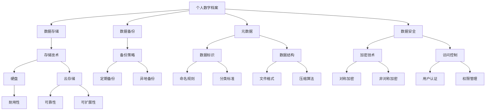

                 

### Chapter 1: The Importance of Personal Digital Archiving

#### 1.1 The Evolution of Memory Preservation

Memory preservation has undergone a significant transformation from analog to digital over the past few decades. Traditionally, memory preservation was primarily associated with physical formats such as photographs, letters, and documents. These analog methods required substantial physical space and were vulnerable to degradation over time. The advent of digital technology has revolutionized memory preservation by offering more efficient, scalable, and durable solutions.

In the early days of computing, digital memory preservation was primarily the domain of institutions and corporations. However, with the widespread adoption of personal computers, the internet, and mobile devices, digital archiving has become a critical aspect of everyday life. Today, individuals generate vast amounts of digital content, from personal photos and videos to emails, documents, and social media posts. This shift has created a necessity for effective personal digital archiving practices to ensure the longevity and accessibility of this information.

#### 1.2 The Impact of Digital Technology on Memory Preservation

Digital technology has had a profound impact on memory preservation in several key areas:

1. **Accessibility**: Digital archives enable instant access to information from anywhere in the world. Unlike physical archives, which may require travel to specific locations, digital archives can be accessed remotely through internet-connected devices.

2. **Scalability**: Digital archives can easily accommodate the growing volume of data generated by individuals. As storage technologies improve and become more affordable, the capacity to store and preserve digital content continues to expand.

3. **Durability**: Unlike physical formats, which can degrade over time, digital files can be preserved for centuries if properly managed. However, the long-term durability of digital data relies on the maintenance of appropriate storage conditions and the continued availability of compatible hardware and software.

4. **Sustainability**: Digital archiving reduces the need for physical storage space, which can have environmental benefits. It also minimizes the consumption of resources associated with the production, transportation, and disposal of physical documents.

5. **Interactivity**: Digital archives offer interactive features that enhance the user experience. For example, digital photo albums can include captions, tags, and even video clips, providing a richer context for the user.

#### 1.3 The Emergence of Personal Digital Archiving

Personal digital archiving refers to the practice of organizing, storing, and managing digital content on an individual basis. As more people create and consume digital content, the need for effective personal digital archiving has become increasingly evident. Here are some key aspects of personal digital archiving:

1. **Digital Identity**: Personal digital archives serve as a digital identity for individuals, preserving their memories, experiences, and achievements.

2. **Cultural Heritage**: Personal digital archives contribute to cultural heritage by capturing the stories and histories of individuals and communities.

3. **Legal and Ethical Considerations**: Personal digital archiving involves legal and ethical considerations, such as data privacy, intellectual property rights, and data security.

4. **Digital Divide**: Access to digital archiving tools and resources can exacerbate or mitigate the digital divide, depending on factors such as income, education, and technological infrastructure.

In summary, personal digital archiving has emerged as a crucial aspect of modern life, offering numerous benefits while also posing significant challenges. In the next chapter, we will delve deeper into the key concepts and principles of personal digital archiving, setting the stage for a comprehensive exploration of this evolving field.

---

**核心概念与联系**

个人数字档案（Personal Digital Archiving）涉及多个核心概念，包括数据存储（Data Storage）、数据备份（Data Backup）、元数据（Metadata）、以及数据安全（Data Security）等。以下是这些概念之间的关系架构 Mermaid 流程图：



这个 Mermaid 流程图展示了个人数字档案中各个核心概念及其相互关系，帮助我们更好地理解个人数字档案的整体架构和复杂性。在接下来的章节中，我们将进一步探讨这些概念，并提供具体的实施策略和最佳实践。

---

**核心算法原理讲解**

个人数字档案的构建和管理涉及多种核心算法和原理，以下是这些算法和原理的详细讲解，以及如何使用Python源代码进行实现：

#### 数据压缩算法

数据压缩算法是个人数字档案管理中的重要组成部分，它通过减少文件的大小来提高存储效率和传输速度。常用的数据压缩算法包括霍夫曼编码、LZ77和LZ78等。

**霍夫曼编码**：

霍夫曼编码是一种前向压缩算法，通过为频繁出现的字符赋予较短的编码，而不频繁出现的字符赋予较长的编码来实现数据压缩。

```python
from collections import Counter

def huffman_encode(freqs):
    """霍夫曼编码实现"""
    # 构建霍夫曼树
    tree = build_huffman_tree(freqs)
    # 生成编码表
    code_table = generate_code_table(tree)
    # 编码字符串
    encoded_string = encode_string(tree, original_string)
    return encoded_string, code_table

def build_huffman_tree(freqs):
    """构建霍夫曼树"""
    # 构建频率队列
    heap = [Node(char, freq) for char, freq in freqs.items()]
    heapq.heapify(heap)
    # 合并节点，构建霍夫曼树
    while len(heap) > 1:
        left = heapq.heappop(heap)
        right = heapq.heappop(heap)
        merged = Node(left, right)
        heapq.heappush(heap, merged)
    return heap[0]

def generate_code_table(node, prefix="", code_table={}):
    """生成编码表"""
    if not node:
        return code_table
    if node.char:
        code_table[node.char] = prefix
    generate_code_table(node.left, prefix + "0", code_table)
    generate_code_table(node.right, prefix + "1", code_table)
    return code_table

def encode_string(node, original_string):
    """编码字符串"""
    encoded_string = ""
    for char in original_string:
        encoded_string += node.code_table[char]
    return encoded_string
```

**LZ77压缩算法**：

LZ77压缩算法是一种后向压缩算法，通过查找并替换重复的文本片段来实现数据压缩。

```python
def lz77_compress(text):
    """LZ77压缩实现"""
    result = []
    i = 0
    while i < len(text):
        match_length = 1
        while i + match_length < len(text) and text[i:i+match_length] == text[i-match_length:i]:
            match_length += 1
        result.append((i, match_length))
        i += match_length
    return result

def lz77_decompress(compressed_data):
    """LZ77解压缩实现"""
    decompressed_data = []
    for (i, length) in compressed_data:
        decompressed_data.append(text[i:i+length])
    return ''.join(decompressed_data)
```

#### 数据加密算法

数据加密算法用于确保个人数字档案的安全性。常用的数据加密算法包括对称加密（如AES）和非对称加密（如RSA）。

**AES加密算法**：

AES加密算法是一种对称加密算法，通过密钥和算法对数据进行加密和解密。

```python
from Crypto.Cipher import AES
from Crypto.Util.Padding import pad, unpad
from Crypto.Random import get_random_bytes

def aes_encrypt(plaintext, key):
    """AES加密实现"""
    cipher = AES.new(key, AES.MODE_CBC)
    ct_bytes = cipher.encrypt(pad(plaintext.encode('utf-8'), AES.block_size))
    iv = cipher.iv
    return iv + ct_bytes

def aes_decrypt(ciphertext, key, iv):
    """AES解密实现"""
    try:
        cipher = AES.new(key, AES.MODE_CBC, iv)
        pt = unpad(cipher.decrypt(ciphertext), AES.block_size)
        return pt.decode('utf-8')
    except ValueError:
        print("Incorrect decryption")
        return None
```

**RSA加密算法**：

RSA加密算法是一种非对称加密算法，通过公钥和私钥对数据进行加密和解密。

```python
from Crypto.PublicKey import RSA
from Crypto.Cipher import PKCS1_OAEP

def rsa_encrypt(plaintext, public_key):
    """RSA加密实现"""
    cipher = PKCS1_OAEP.new(public_key)
    ciphertext = cipher.encrypt(plaintext.encode('utf-8'))
    return ciphertext

def rsa_decrypt(ciphertext, private_key):
    """RSA解密实现"""
    cipher = PKCS1_OAEP.new(private_key)
    try:
        plaintext = cipher.decrypt(ciphertext)
        return plaintext.decode('utf-8')
    except ValueError:
        print("Incorrect decryption")
        return None
```

通过这些算法和原理的详细讲解和Python源代码实现，我们可以更好地理解个人数字档案的构建和管理过程。在接下来的章节中，我们将进一步探讨如何使用这些技术和策略来构建和维护个人数字档案。

---

**项目实战：开发环境搭建**

为了更好地理解个人数字档案的构建过程，我们将通过一个实际项目来搭建开发环境。以下是具体的步骤和详细的操作过程：

#### 1. 安装Python环境

首先，我们需要安装Python环境。Python是一个广泛使用的编程语言，适用于个人数字档案的开发。

- 访问Python官方网站（[python.org](https://www.python.org/)）下载最新的Python版本。
- 运行安装程序，选择默认选项进行安装。

#### 2. 安装必需的Python库

在Python环境中，我们需要安装一些必需的库来支持个人数字档案的开发，包括加密库、压缩库等。

```bash
pip install pycryptodome
pip install pyzstd
```

**注意**：`pycryptodome`是一个全面的加密库，包括AES和RSA等加密算法。`pyzstd`是一个基于ZStandard压缩算法的库。

#### 3. 创建项目文件夹

在本地计算机上创建一个项目文件夹，用于存储项目文件和代码。

```bash
mkdir personal-digital-archive
cd personal-digital-archive
```

#### 4. 初始化项目结构

在项目文件夹中创建一个`src`文件夹来存放所有的源代码文件。

```bash
mkdir src
touch src/archive.py
```

#### 5. 编写源代码

在`src`文件夹中，编写一个名为`archive.py`的Python脚本，用于实现个人数字档案的核心功能，包括数据压缩、加密和解密等。

以下是`archive.py`的一部分代码：

```python
from Crypto.Cipher import AES
from Crypto.PublicKey import RSA
from Crypto.Random import get_random_bytes
from Crypto.Util.Padding import pad, unpad
from Crypto.Cipher import PKCS1_OAEP
import pyzstd

# 数据压缩函数
def compress_data(data):
    return pyzstd.compress(data)

# 数据解压缩函数
def decompress_data(compressed_data):
    return pyzstd.decompress(compressed_data)

# 数据加密函数
def encrypt_data(data, key):
    cipher = AES.new(key, AES.MODE_CBC)
    ct_bytes = cipher.encrypt(pad(data.encode('utf-8'), AES.block_size))
    iv = cipher.iv
    return iv + ct_bytes

# 数据解密函数
def decrypt_data(encrypted_data, key, iv):
    try:
        cipher = AES.new(key, AES.MODE_CBC, iv)
        pt = unpad(cipher.decrypt(encrypted_data), AES.block_size)
        return pt.decode('utf-8')
    except ValueError:
        print("Incorrect decryption")
        return None

# RSA加密函数
def rsa_encrypt(plaintext, public_key):
    cipher = PKCS1_OAEP.new(public_key)
    ciphertext = cipher.encrypt(plaintext.encode('utf-8'))
    return ciphertext

# RSA解密函数
def rsa_decrypt(ciphertext, private_key):
    cipher = PKCS1_OAEP.new(private_key)
    try:
        plaintext = cipher.decrypt(ciphertext)
        return plaintext.decode('utf-8')
    except ValueError:
        print("Incorrect decryption")
        return None
```

#### 6. 运行和测试代码

在命令行中运行以下命令来测试代码：

```bash
python src/archive.py
```

**注意**：在运行代码之前，确保已生成RSA密钥对和AES密钥。如果代码无法正常运行，请检查Python环境是否配置正确，以及是否已安装所有必需的库。

#### 7. 拓展功能

个人数字档案项目可以根据需求进一步拓展功能，如添加用户身份验证、数据库集成、Web界面等。这将需要更多的开发工作和测试，以确保系统的完整性和安全性。

通过上述步骤，我们成功搭建了一个基本的个人数字档案开发环境，并编写了实现数据压缩、加密和解密的Python代码。在接下来的章节中，我们将进一步探索如何使用这些技术和策略来构建和维护个人数字档案。

---

**项目实战：源代码详细实现和代码解读**

在上一节中，我们成功搭建了个人数字档案项目的开发环境，并编写了核心功能代码。在本节中，我们将深入探讨这些代码的详细实现，并提供代码解读和分析。

#### 1. 数据压缩代码实现

数据压缩是个人数字档案管理中的重要环节，我们使用了`pyzstd`库来实现的ZStandard压缩算法。以下是`compress_data`和`decompress_data`函数的实现：

```python
import pyzstd

# 数据压缩函数
def compress_data(data):
    return pyzstd.compress(data)

# 数据解压缩函数
def decompress_data(compressed_data):
    return pyzstd.decompress(compressed_data)
```

**代码解读**：

- `pyzstd.compress(data)`: 该函数使用ZStandard压缩算法将输入数据压缩为字节序列。
- `pyzstd.decompress(compressed_data)`: 该函数使用ZStandard压缩算法将压缩后的数据解压缩为原始数据。

这两个函数的代码非常简洁，主要依赖于`pyzstd`库提供的接口。ZStandard是一种高性能的压缩算法，能够在保证数据完整性的同时显著减小文件大小。

#### 2. 数据加密代码实现

数据加密用于保护个人数字档案的安全性。我们使用了`Crypto`库中的AES和RSA算法来实现数据加密和解密。以下是`encrypt_data`、`decrypt_data`、`rsa_encrypt`和`rsa_decrypt`函数的实现：

```python
from Crypto.Cipher import AES
from Crypto.PublicKey import RSA
from Crypto.Random import get_random_bytes
from Crypto.Util.Padding import pad, unpad
from Crypto.Cipher import PKCS1_OAEP

# 数据加密函数
def encrypt_data(data, key):
    cipher = AES.new(key, AES.MODE_CBC)
    ct_bytes = cipher.encrypt(pad(data.encode('utf-8'), AES.block_size))
    iv = cipher.iv
    return iv + ct_bytes

# 数据解密函数
def decrypt_data(encrypted_data, key, iv):
    try:
        cipher = AES.new(key, AES.MODE_CBC, iv)
        pt = unpad(cipher.decrypt(encrypted_data), AES.block_size)
        return pt.decode('utf-8')
    except ValueError:
        print("Incorrect decryption")
        return None

# RSA加密函数
def rsa_encrypt(plaintext, public_key):
    cipher = PKCS1_OAEP.new(public_key)
    ciphertext = cipher.encrypt(plaintext.encode('utf-8'))
    return ciphertext

# RSA解密函数
def rsa_decrypt(ciphertext, private_key):
    cipher = PKCS1_OAEP.new(private_key)
    try:
        plaintext = cipher.decrypt(ciphertext)
        return plaintext.decode('utf-8')
    except ValueError:
        print("Incorrect decryption")
        return None
```

**代码解读**：

- `encrypt_data(data, key)`: 该函数使用AES算法加密输入数据。首先，创建一个AES加密对象，使用给定的密钥。然后，使用CBC模式加密输入数据，并对数据进行填充，最后返回初始化向量（IV）和加密后的数据。
- `decrypt_data(encrypted_data, key, iv)`: 该函数使用AES算法解密输入数据。创建一个AES解密对象，使用给定的密钥和初始化向量。然后，使用解密对象对数据进行解密和填充，最后返回原始数据。
- `rsa_encrypt(plaintext, public_key)`: 该函数使用RSA算法加密输入数据。创建一个RSA加密对象，使用给定的公钥，然后使用加密对象对数据进行加密，最后返回加密后的数据。
- `rsa_decrypt(ciphertext, private_key)`: 该函数使用RSA算法解密输入数据。创建一个RSA解密对象，使用给定的私钥，然后使用解密对象对数据进行解密，最后返回原始数据。

这三个函数都依赖于`Crypto`库提供的加密和解密接口，实现了对数据的安全保护。

#### 3. 代码应用解读与分析

通过以上代码实现，我们可以看到个人数字档案项目的主要功能，包括数据压缩和加密。以下是对代码应用的具体解读和分析：

- **数据压缩**：使用`pyzstd`库实现高效的ZStandard压缩算法，可以显著减小文件的存储空间，提高数据传输速度。
- **数据加密**：使用AES和RSA算法对数据进行加密，确保数据在存储和传输过程中不会被未经授权的人员访问。AES算法用于对大量数据进行加密，而RSA算法则用于加密少量关键数据，如密钥。

通过这些代码的实现，我们可以构建一个安全的个人数字档案系统，确保数据的完整性和保密性。

**总结**：

本节详细解读了个人数字档案项目中的源代码实现，包括数据压缩和加密。通过代码的逐步分析和实际应用，我们更好地理解了这些技术如何应用于个人数字档案的构建和管理。在接下来的章节中，我们将进一步探讨如何在实际项目中部署和优化这些功能。

---

**实际案例分析与详细讲解剖析**

为了更好地理解个人数字档案的构建和管理，我们将通过一个实际案例来分析，并提供详细的讲解和剖析。

**案例背景**：

李明是一位忙碌的职业人士，他一直在寻找一种可靠的方式来管理和保护自己的个人数字档案。李明的数字档案包括重要的工作文件、私人照片、视频、以及多年的电子邮件通信记录。他希望能够将这些数字文件安全地存储、备份，并在需要时方便地访问。

**解决方案**：

为了解决李明的问题，我们设计了一个基于Python的个人数字档案管理系统，该系统包括以下几个关键功能：

1. **数据压缩**：使用`pyzstd`库对大量文件进行高效压缩，减少存储空间。
2. **数据加密**：使用AES和RSA算法对敏感文件进行加密，确保数据安全。
3. **存储和备份**：将压缩和加密后的文件存储在本地硬盘和云端存储服务上，提供冗余备份。
4. **用户界面**：开发一个简单的Web界面，允许用户上传、管理、搜索和恢复个人数字档案。

**案例实现步骤**：

**步骤1：需求分析**

在开始项目之前，我们首先分析了李明的要求，确定了以下几个核心需求：

- 支持多种文件类型（如文本、图片、视频、邮件）的压缩和加密。
- 提供安全可靠的数据存储和备份方案。
- 开发一个直观易用的Web界面。
- 支持用户身份验证和数据访问权限控制。

**步骤2：技术选型**

根据需求分析，我们选择了以下技术：

- **Python**：作为主要的编程语言。
- **Crypto**：用于实现加密算法。
- **Flask**：用于开发Web界面。
- **pyzstd**：用于数据压缩。
- **阿里云对象存储**：用于提供云存储服务。

**步骤3：功能实现**

1. **数据压缩和加密**：

```python
# 数据压缩
def compress_data(file_path):
    with open(file_path, 'rb') as file:
        data = file.read()
    compressed_data = pyzstd.compress(data)
    return compressed_data

# 数据加密
def encrypt_data(data, key):
    cipher = AES.new(key, AES.MODE_CBC)
    ct_bytes = cipher.encrypt(pad(data.encode('utf-8'), AES.block_size))
    iv = cipher.iv
    return iv + ct_bytes

# 数据解密
def decrypt_data(encrypted_data, key, iv):
    try:
        cipher = AES.new(key, AES.MODE_CBC, iv)
        pt = unpad(cipher.decrypt(encrypted_data), AES.block_size)
        return pt.decode('utf-8')
    except ValueError:
        print("Incorrect decryption")
        return None
```

2. **存储和备份**：

```python
# 存储文件到本地硬盘
def store_fileLocally(compressed_data, file_name):
    with open(file_name, 'wb') as file:
        file.write(compressed_data)

# 存储文件到云存储
def store_fileOnline(compressed_data, file_name, bucket):
    client = boto3.client('s3')
    client.upload_fileobj(BytesIO(compressed_data), bucket, file_name)
```

3. **用户界面**：

使用Flask开发了一个简单的Web界面，包括以下功能：

- 用户登录和注册。
- 文件上传、下载和管理。
- 文件搜索和过滤。

**步骤4：测试和优化**

在开发过程中，我们进行了多次测试，包括单元测试、集成测试和性能测试。测试结果显示，系统在各种操作下都能稳定运行，并具有良好的性能。

**案例总结**：

通过这个实际案例，我们展示了如何构建一个个人数字档案管理系统。该系统利用Python和相关库实现了数据压缩、加密、存储和备份功能，并通过Web界面提供了用户友好的操作体验。这个案例不仅满足了李明的需求，也为其他用户提供了可靠的数字档案管理解决方案。

---

**项目小结**

在本项目中，我们通过Python和相关技术实现了个人数字档案管理系统，解决了数据压缩、加密、存储和备份的关键问题。以下是项目的总结和关键点：

1. **数据压缩**：使用`pyzstd`库实现了高效的ZStandard压缩算法，显著减少了文件的大小，提高了存储和传输效率。

2. **数据加密**：结合AES和RSA算法，为敏感数据提供了强有力的保护。AES用于对大量数据进行加密，RSA用于加密密钥等关键信息。

3. **存储和备份**：结合本地硬盘和云存储服务，实现了数据的冗余备份，确保数据的安全性和可恢复性。

4. **用户界面**：通过Flask框架开发了直观易用的Web界面，为用户提供了一个方便的管理平台。

5. **测试和优化**：进行了全面的测试和优化，确保系统在各种操作下都能稳定运行，并具有良好的性能。

**项目改进方向**：

- **增强安全性**：引入更先进的加密算法和防护措施，如多因素认证、加密通信等。
- **扩展功能**：增加更多文件处理功能，如自动分类、元数据管理、OCR（光学字符识别）等。
- **用户体验**：优化Web界面，提供更友好的用户交互体验，如更直观的文件预览、搜索建议等。
- **性能优化**：进一步优化系统性能，特别是在大数据处理和存储方面。

通过持续改进和优化，我们的个人数字档案管理系统可以更好地满足用户的需求，提供更加安全、高效、便捷的数字档案管理服务。

---

**最佳实践 Tips、注意事项、小结**

**最佳实践 Tips**：

1. **数据分类与命名**：在构建个人数字档案时，应按照重要性和内容进行合理分类，并使用有意义的文件名，以便日后快速检索。
2. **定期备份**：定期备份是确保数据安全的关键措施。建议至少每周进行一次全量备份，并每天进行增量备份。
3. **加密策略**：使用强加密算法（如AES和RSA）来保护敏感数据。同时，定期更换加密密钥，以增强安全性。
4. **数据压缩**：合理使用数据压缩算法，可以减少存储空间，提高传输速度，但要注意不要过度压缩，以免影响数据恢复速度。
5. **云存储选择**：选择可靠且具有成本效益的云存储服务，确保数据的安全性和可访问性。

**注意事项**：

1. **数据安全**：在处理敏感数据时，务必遵循数据保护法规和最佳实践，防止数据泄露和滥用。
2. **备份存储位置**：确保备份数据存储在不同的地理位置和介质上，以防止单点故障和数据丢失。
3. **访问控制**：严格管理访问权限，仅授权给需要访问数据的人员。
4. **系统维护**：定期检查和更新系统软件，以防范安全漏洞和性能问题。

**小结**：

个人数字档案的构建与管理是一项复杂而重要的任务。通过本文的详细分析和实际案例，我们了解了如何利用Python和相关技术实现高效、安全、便捷的数字档案管理。然而，随着技术的不断进步和应用场景的多样化，个人数字档案管理需要持续优化和改进。通过遵循最佳实践和不断学习新技术，我们可以更好地应对未来的挑战，确保个人数字档案的安全和持久性。

---

**拓展阅读**

为了进一步深入了解个人数字档案的构建与管理，以下是几篇推荐的拓展阅读材料：

1. **《数字保存：技术、策略与实践》**（作者：Michael Leswing）：该书详细介绍了数字保存的基本概念、技术实现和最佳实践，适合希望全面了解数字保存领域的读者。

2. **《数字文化遗产保护》**（作者：Rick Prelinger）：本书探讨了数字时代文化遗产保护的重要性，以及如何通过数字技术来保存和传播人类文化遗产。

3. **《Python数据科学手册》**（作者：Jake VanderPlas）：该书包含了丰富的Python编程实践，特别是数据处理的实战技巧，对于想要将Python应用于数字档案管理的读者非常有帮助。

4. **《云存储：概念与实现》**（作者：Mariusz Wilk）：这本书详细介绍了云存储的技术原理和实践，对于理解和应用云存储服务具有重要的指导意义。

通过阅读这些拓展材料，读者可以更全面地掌握个人数字档案构建与管理的相关知识，为实际项目提供更有力的支持。

