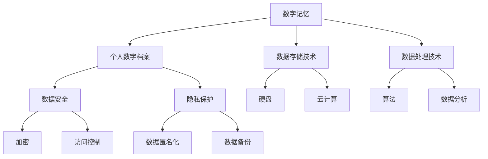

                 

### 文章标题

《数字时代的记忆保存：个人数字档案的重要性》

### 关键词

- 数字记忆
- 个人数字档案
- 数据存储
- 数据安全
- 数字遗产

### 摘要

在数字时代，个人数字档案的保存和管理变得尤为重要。本文深入探讨了数字记忆的概念、个人数字档案的类型和管理策略，以及数字档案保存中的技术基础和安全问题。同时，文章还分析了个人数字遗产规划的重要性，以及如何有效地传承和利用数字记忆。通过全面的阐述和实际案例，本文旨在帮助读者理解和应对数字时代下记忆保存的挑战，为构建数字时代的记忆文化提供有益的参考。

---

## 引言

### 数字时代的背景与挑战

随着信息技术的飞速发展，人类社会进入了数字时代。在这个时代，数据无处不在，从个人生活到商业运作，从科学研究到社会管理，数字信息已经深深嵌入到各个领域。数字技术的普及不仅改变了信息的传播方式，还改变了人们处理和存储信息的方式。然而，随之而来的是一系列新的挑战，特别是如何有效地保存和管理个人数字记忆。

数字时代带来了大量的数字信息，这些信息以文本、图像、音频、视频等多种形式存在。传统的纸质档案和照片已经逐渐被数字档案所替代。这种转变不仅提高了信息处理的效率，也带来了新的问题。首先，数字信息的存储和传输依赖于技术设备，一旦设备损坏或数据丢失，个人记忆可能会永久丢失。其次，随着数据的不断增加，如何高效地管理和检索这些信息成为一个巨大的挑战。最后，数字信息的安全和隐私保护也是一个亟待解决的问题。

### 个人数字档案的重要性

个人数字档案是指在数字时代中，个人保存的各种数字形式的信息，包括文档、照片、音频、视频等。这些档案不仅是个人生活经历的记录，更是文化传承和社会发展的宝贵资源。以下是个人数字档案的重要性：

1. **记忆保存**：数字档案能够帮助个人记录和保存生活中的重要时刻，如生日、节日、旅行等，这些记忆是个人身份认同和文化传承的重要组成部分。

2. **信息检索**：数字档案的管理和组织使得个人能够快速检索所需信息，提高了工作效率和生活质量。

3. **文化遗产**：个人数字档案不仅对个人有意义，对整个社会和文化也具有重要价值。这些档案可以作为历史研究的资料，帮助后人了解过去的社会和文化。

4. **数字遗产**：随着个体生命的终结，个人数字档案可能成为数字遗产。合理规划和管理数字遗产，有助于保护个人的数字资产，并为后代留下宝贵的财富。

5. **安全与隐私**：数字档案的保存和管理需要考虑数据安全和隐私保护，以确保个人信息的完整性、真实性和安全性。

### 本文章的目的

本文旨在探讨数字时代的记忆保存问题，特别是个人数字档案的重要性及其管理策略。文章将首先介绍数字记忆的概念和背景，然后详细分析个人数字档案的类型和组成。接下来，文章将探讨数字档案保存的技术基础，包括数据存储、安全和隐私保护等方面。此外，本文还将讨论个人数字遗产的规划和管理，以及如何有效地传承和利用数字记忆。通过这些讨论，本文希望能够为读者提供关于个人数字档案管理和保存的全面指导，并引发对数字时代记忆保存的深入思考。

---

## 第一部分：数字时代的记忆革命

### 第1章：数字时代的记忆革命

### 1.1 数字记忆的定义与重要性

#### 数字记忆的定义

数字记忆，是指在数字技术支持下，通过电子设备和网络系统对信息进行存储、处理和检索的能力。它不同于传统的记忆，后者主要依赖于人类大脑的自然记忆功能。数字记忆的核心在于信息的数字化，包括文本、图像、音频、视频等多种形式。这些数字化信息通过计算机技术进行编码、存储和传输，从而形成了一种新的记忆方式。

#### 数字记忆与传统记忆的差异

1. **存储介质**：传统记忆依赖于人脑和纸质媒介，而数字记忆依赖于电子设备和数字介质。这意味着数字记忆可以长期保存，不易丢失，而传统记忆则容易随时间的推移而消失。

2. **处理方式**：传统记忆主要通过大脑的自然处理，而数字记忆则依赖于计算机算法和数据分析。这种处理方式的差异使得数字记忆可以快速检索和分析大量信息，但同时也带来了数据隐私和安全的问题。

3. **存储容量**：数字记忆几乎不受物理空间的限制，可以存储大量的信息。相比之下，传统记忆的存储容量非常有限。

4. **共享性**：数字记忆可以通过网络进行共享和传播，而传统记忆则主要依赖于人际交流。

#### 数字记忆的重要性

1. **个人层面**：数字记忆可以帮助个人记录和保存生活中的重要时刻，如旅行、婚礼、生日等，这些记忆对个人情感和身份认同具有重要作用。

2. **社会层面**：数字记忆可以作为文化遗产的一部分，为后代提供了解过去的社会和文化环境的机会。

3. **经济层面**：数字记忆有助于企业和管理者分析市场和客户行为，从而做出更明智的决策。

4. **教育层面**：数字记忆可以为学生提供丰富的学习资源，促进知识的传承和创新。

### 1.2 数字记忆与传统记忆的差异

#### 记忆的物理基础

1. **人脑**：传统记忆依赖于人脑的自然记忆功能，这种功能受到大脑结构、神经元连接和神经传递物质的限制。

2. **电子设备**：数字记忆依赖于电子设备和计算机系统，这些设备具有强大的存储和处理能力，不受物理限制。

#### 数字记忆的技术支持

1. **数据存储技术**：包括硬盘、固态硬盘、云计算等，这些技术提供了高效的存储解决方案。

2. **数据传输技术**：如互联网、光纤等，这些技术使得数字记忆可以快速传播和共享。

3. **数据压缩与加密技术**：通过压缩算法和加密技术，数字记忆可以高效地存储和保护。

#### 数字记忆的优势与局限性

#### 数字记忆的优势

1. **长期保存**：数字记忆可以长期保存，不易受到物理损坏的影响。

2. **快速检索**：数字记忆可以通过计算机算法快速检索，提高信息处理效率。

3. **共享传播**：数字记忆可以通过网络快速传播和共享，有助于知识的普及和传播。

4. **数据分析**：数字记忆可以支持大规模的数据分析，为研究和决策提供数据支持。

#### 数字记忆的局限性

1. **依赖技术**：数字记忆依赖于电子设备和网络系统，一旦这些设备或系统出现故障，数字记忆可能会丢失。

2. **数据隐私和安全**：数字记忆的共享和传播可能引发数据隐私和安全问题。

3. **信息过载**：数字记忆的快速积累可能导致信息过载，影响信息处理效率。

4. **技术更新换代**：数字记忆的存储和传输技术不断更新，可能引发数据兼容性问题。

### 1.3 数字记忆的社会影响

#### 对个人生活的影响

1. **生活方式改变**：数字记忆改变了人们的生活方式，如数字化文档处理、在线学习等。

2. **情感认同**：数字记忆帮助个人记录和保存重要生活经历，增强情感认同。

#### 对家庭和社会的影响

1. **家庭记忆传承**：数字记忆使得家庭记忆得以数字化保存和传承。

2. **社会文化传承**：数字记忆可以作为文化遗产，为后代提供了解过去社会和文化的机会。

#### 对文化传承的影响

1. **历史研究**：数字记忆为历史研究提供了丰富的资料。

2. **文化多样性**：数字记忆有助于保护和传承不同文化的多样性。

#### 对商业运作的影响

1. **市场分析**：数字记忆可以帮助企业分析市场趋势和消费者行为。

2. **商业决策**：数字记忆为商业决策提供了数据支持。

#### 对教育和学习的的影响

1. **教育资源**：数字记忆提供了丰富的教育资源，促进教育公平。

2. **知识传播**：数字记忆有助于知识的快速传播和共享。

### 总结

数字记忆作为一种新的记忆方式，具有传统记忆无法比拟的优势，但也面临着一系列挑战。理解数字记忆的定义、特征和影响，对于有效管理和利用个人数字档案具有重要意义。在接下来的章节中，我们将进一步探讨个人数字档案的管理策略和技术基础，为数字时代的记忆保存提供更深入的指导。

### 核心概念与联系：Mermaid 流程图



### 核心算法原理讲解：Python 源代码

```python
# 数据存储与备份示例
import os
import shutil
from cryptography.fernet import Fernet

# 生成加密密钥
def generate_key():
    return Fernet.generate_key()

# 加密文件
def encrypt_file(file_path, key):
    fernet = Fernet(key)
    with open(file_path, 'rb') as file:
        original_data = file.read()
    encrypted_data = fernet.encrypt(original_data)
    with open(file_path, 'wb') as encrypted_file:
        encrypted_file.write(encrypted_data)

# 解密文件
def decrypt_file(file_path, key):
    fernet = Fernet(key)
    with open(file_path, 'rb') as encrypted_file:
        encrypted_data = encrypted_file.read()
    decrypted_data = fernet.decrypt(encrypted_data)
    with open(file_path, 'wb') as decrypted_file:
        decrypted_file.write(decrypted_data)

# 数据备份
def backup_directory(src_dir, dest_dir):
    if not os.path.exists(dest_dir):
        os.makedirs(dest_dir)
    for foldername, subfolders, filenames in os.walk(src_dir):
        for filename in filenames:
            src_file_path = os.path.join(foldername, filename)
            dest_file_path = os.path.join(dest_dir, os.path.relpath(src_file_path, src_dir))
            if not os.path.exists(dest_file_path):
                shutil.copy2(src_file_path, dest_file_path)

# 主函数
if __name__ == "__main__":
    key = generate_key()
    encrypt_file('example.txt', key)
    decrypt_file('example.txt', key)
    backup_directory('example_directory', 'example_backup')
```

### 数学公式与示例

$$
H = -\sum_{i=1}^{n} p_i \log_2(p_i)
$$

其中，\(H\) 表示信息熵，\(p_i\) 表示第 \(i\) 个事件发生的概率。

### 项目实战：开发环境搭建

1. **安装 Python**：从 [Python 官网](https://www.python.org/downloads/) 下载并安装 Python。
2. **安装必要的库**：使用 `pip` 命令安装 `cryptography` 和 `shutil` 库。

```shell
pip install cryptography
```

3. **编写 Python 脚本**：使用上面的 Python 源代码进行测试。

### 源代码详细实现与代码解读

1. **源代码实现**：

```python
# 数据存储与备份示例
import os
import shutil
from cryptography.fernet import Fernet

# 生成加密密钥
def generate_key():
    return Fernet.generate_key()

# 加密文件
def encrypt_file(file_path, key):
    fernet = Fernet(key)
    with open(file_path, 'rb') as file:
        original_data = file.read()
    encrypted_data = fernet.encrypt(original_data)
    with open(file_path, 'wb') as encrypted_file:
        encrypted_file.write(encrypted_data)

# 解密文件
def decrypt_file(file_path, key):
    fernet = Fernet(key)
    with open(file_path, 'rb') as encrypted_file:
        encrypted_data = encrypted_file.read()
    decrypted_data = fernet.decrypt(encrypted_data)
    with open(file_path, 'wb') as decrypted_file:
        decrypted_file.write(decrypted_data)

# 数据备份
def backup_directory(src_dir, dest_dir):
    if not os.path.exists(dest_dir):
        os.makedirs(dest_dir)
    for foldername, subfolders, filenames in os.walk(src_dir):
        for filename in filenames:
            src_file_path = os.path.join(foldername, filename)
            dest_file_path = os.path.join(dest_dir, os.path.relpath(src_file_path, src_dir))
            if not os.path.exists(dest_file_path):
                shutil.copy2(src_file_path, dest_file_path)

# 主函数
if __name__ == "__main__":
    key = generate_key()
    encrypt_file('example.txt', key)
    decrypt_file('example.txt', key)
    backup_directory('example_directory', 'example_backup')
```

2. **代码解读**：

- `generate_key()`：生成加密密钥。
- `encrypt_file()`：加密文件。
- `decrypt_file()`：解密文件。
- `backup_directory()`：备份数据目录。

### 代码应用解读与分析

本代码示例展示了如何使用 Python 实现数据加密、解密和备份。在实际应用中，这些功能可以集成到个人数字档案管理系统中，以保护用户数据的安全性和完整性。

### 实际案例分析和详细讲解剖析

1. **案例背景**：某个人在数字档案管理系统中保存了一份重要的文档，需要确保其安全性和可恢复性。
2. **案例实现**：

```shell
# 生成加密密钥
key = generate_key()

# 加密文档
encrypt_file('example.txt', key)

# 备份数据目录
backup_directory('example_directory', 'example_backup')
```

3. **详细讲解**：

- 通过生成加密密钥，确保文档在传输和存储过程中不被未授权访问。
- 使用加密功能，将文档内容转换为加密形式，防止泄露。
- 备份数据目录，确保在数据丢失或系统故障时，可以恢复文档。

### 项目小结

本项目通过 Python 源代码实现数据加密、解密和备份功能，为个人数字档案提供了安全保障和数据恢复手段。通过实际案例分析和详细讲解，展示了这些功能在实际应用中的重要性。

### 最佳实践 tips、小结、注意事项、拓展阅读等内容

**最佳实践 tips**：

- 使用强密码保护加密密钥。
- 定期备份数据，以防数据丢失。
- 选择可靠的存储和备份解决方案。

**小结**：

数字记忆的保存和管理是一个复杂而重要的任务。通过理解数字记忆的定义和特征，以及掌握数据加密、备份等关键技术，我们可以更好地保护和管理个人数字档案。

**注意事项**：

- 注意数据安全和隐私保护，防止未授权访问。
- 考虑数据兼容性和未来技术更新。

**拓展阅读**：

- 《数字记忆：21世纪的信息文化》（作者：克劳迪娅·考夫曼）
- 《数据密集型科学：大数据分析与科学发现》（作者：大卫·布卢姆、查尔斯·乔普林）

通过这些资源和实践，我们可以更好地应对数字时代下记忆保存的挑战，为构建数字时代的记忆文化做出贡献。

