                 


### 《数字时代的记忆保存：个人数字遗产的管理策略》

---

**关键词：数字遗产、数据备份、数据加密、隐私保护、法律问题、行业规范**

**摘要：**
随着数字时代的到来，个人数字遗产的管理成为了一个亟待解决的问题。本文将探讨数字遗产的定义、管理的重要性以及现状，分析数据备份、加密、隐私保护等相关技术，讨论数字遗产管理的法律和社会挑战，并展望未来的发展趋势。通过这些内容的阐述，旨在为读者提供全面、实用的个人数字遗产管理策略。

---

### 引言与背景

**1.1 数字时代个人数字遗产的定义与重要性**

**背景介绍：**
在数字时代，个人数字遗产（Digital Estate）指的是个人在数字世界中留下的各种数字化信息和资产。这些信息可能包括电子邮件、社交媒体账户、照片、视频、文档、银行账户数据等。个人数字遗产不仅涵盖了个人生活中的数字记忆，还可能涉及金融、商业和法律等方面的重要数据。

**重要性：**
随着数字化生活的普及，个人数字遗产的重要性日益凸显。合理管理个人数字遗产，不仅有助于保护个人隐私，还能确保在不幸去世后，亲人或继承人能够顺利继承和利用这些数字资产。此外，个人数字遗产的管理也对法律、社会和文化产生深远影响。

**1.2 数字遗产管理的现状与趋势**

**现状：**
当前，数字遗产管理的方式主要包括数据备份、数据加密、隐私设置和遗嘱安排等。许多国家和地区已经开始制定相关的法律法规，以规范数字遗产的管理。例如，美国有《数字遗产法》，欧洲有《通用数据保护条例》（GDPR）。

**趋势：**
数字遗产管理的趋势体现在技术、法律和社会层面。技术上，数据备份和恢复技术、数据加密技术、区块链技术等不断进步，为数字遗产管理提供了更多可能性。法律上，各国法规逐渐完善，数字遗产继承的法律问题逐渐得到解决。社会上，人们对数字遗产管理的认识不断提高，相关服务也日益普及。

---

### 基础理论与技术

**2.1 数据备份与恢复技术**

**核心概念与联系：**
数据备份（Data Backup）是将数据复制到其他存储设备上的过程，以防止数据丢失。数据恢复（Data Recovery）是在数据丢失后，通过技术手段将其找回的过程。两者之间的关系如图：

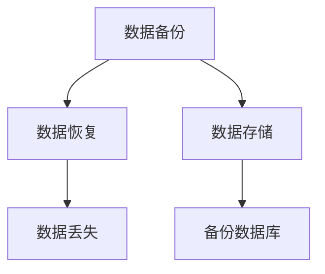

**核心算法原理讲解：**
数据备份的核心算法主要包括全备份、增量备份和差异备份。以下是增量备份的伪代码示例：

```python
def incremental_backup(source, destination):
    # source: 备份源
    # destination: 备份目标
    # 获取最新的备份文件
    last_backup = get_last_backup(destination)
    # 备份自上次备份以来的修改文件
    for file in get_files_since(last_backup):
        copy_file(file, destination)
```

数学模型方面，备份频率和备份窗口期是关键参数。备份窗口期（Backup Window）是指备份数据的周期，备份频率（Backup Frequency）是指每次备份的时间间隔。数学公式为：

$$
备份频率 = \frac{备份窗口期}{时间间隔}
$$

**实际应用案例：**
假设备份窗口期为一周，每天晚上进行备份，则备份频率为每天一次。

**2.2 数据加密与隐私保护**

**核心概念与联系：**
数据加密（Data Encryption）是将数据转换成无法读取的密文的过程，以保护数据隐私。隐私保护（Privacy Protection）是指通过各种技术手段保护个人数据不被未经授权访问或泄露。两者之间的关系如图：

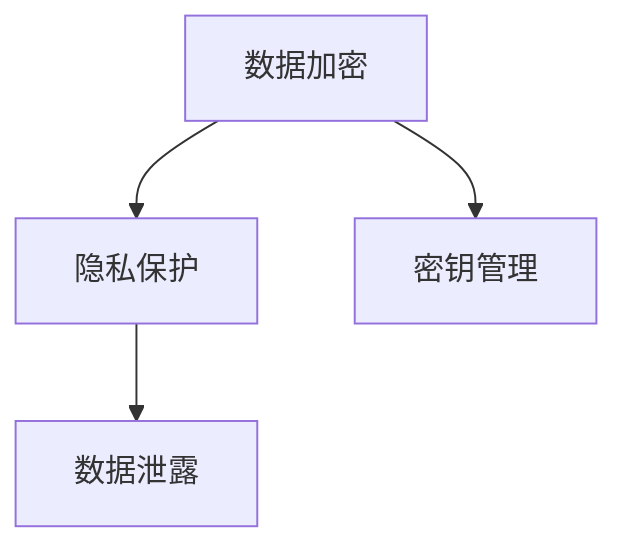

**核心算法原理讲解：**
数据加密的核心算法包括对称加密和非对称加密。以下是对称加密算法AES的Python实现示例：

```python
from Crypto.Cipher import AES
from Crypto.Util.Padding import pad

def encryptAES(plaintext, key):
    # plaintext: 明文
    # key: 密钥
    cipher = AES.new(key, AES.MODE_CBC)
    ct_bytes = cipher.encrypt(pad(plaintext, AES.block_size))
    iv = cipher.iv
    return iv + ct_bytes

key = b'1234567890123456'  # 16字节密钥
plaintext = b'Hello, World!'
ciphertext = encryptAES(plaintext, key)
print(ciphertext.hex())
```

数学模型方面，加密强度与密钥长度相关。通常，密钥长度越长，加密强度越高。公式为：

$$
加密强度 = 2^{密钥长度}
$$

**实际应用案例：**
使用AES-256算法对敏感数据加密，确保数据在传输和存储过程中不被窃取。

**2.3 数据恢复与隐私泄露的风险分析**

**核心概念与联系：**
数据恢复（Data Recovery）是指在数据丢失后，通过技术手段将其找回的过程。隐私泄露（Privacy Leak）是指个人数据未经授权被访问或泄露的现象。两者之间的关系如图：


**核心算法原理讲解：**
数据恢复的核心算法包括文件系统分析、文件签名分析和文件头分析。以下是文件系统分析的一个Python示例：

```python
import os

def recover_files(folder_path):
    for root, dirs, files in os.walk(folder_path):
        for file in files:
            file_path = os.path.join(root, file)
            try:
                with open(file_path, 'rb') as f:
                    content = f.read()
                    if is_valid_file(content):  # 判断文件是否有效
                        print(f"Recovered file: {file_path}")
            except Exception as e:
                print(f"Error recovering file: {file_path}, Error: {e}")

def is_valid_file(content):
    # 判断文件是否有效的简单示例
    return True

recover_files('/path/to/lost/files')
```

数学模型方面，隐私泄露的概率与数据量和访问次数相关。公式为：

$$
隐私泄露概率 = \frac{数据量}{访问次数}
$$

**实际应用案例：**
在一次数据丢失事件后，使用上述算法恢复丢失的文件，并通过加密和访问控制减少隐私泄露风险。

**2.4 数字遗产继承与法律问题**

**核心概念与联系：**
数字遗产继承（Digital Estate Inheritance）是指个人去世后，其数字遗产由继承人继承的过程。法律问题（Legal Issues）是指在数字遗产继承过程中涉及的法律问题，如财产权、隐私权和继承权等。两者之间的关系如图：

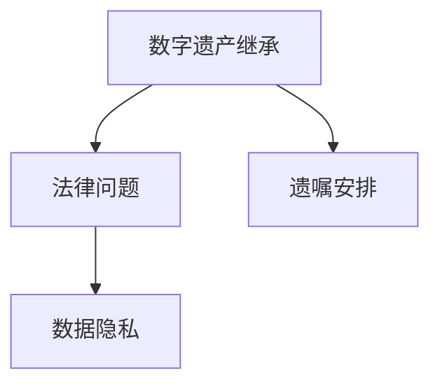

**核心算法原理讲解：**
数字遗产继承的核心算法包括遗嘱验证、继承权计算和继承份额分配。以下是遗嘱验证的一个Python示例：

```python
import json

def verify_will(will_path):
    with open(will_path, 'r') as will_file:
        will = json.load(will_file)
        if 'sign' in will and verify_sign(will['sign']):
            return True
        else:
            return False

def verify_sign(sign):
    # 验证签名的方法
    return True

if verify_will('will.json'):
    print("遗嘱有效")
else:
    print("遗嘱无效")
```

数学模型方面，继承份额分配通常基于遗嘱规定或法律规定。公式为：

$$
继承份额 = \frac{遗产总额}{继承人人数}
$$

**实际应用案例：**
在一个数字遗产继承案例中，使用上述算法验证遗嘱的有效性，并根据遗嘱规定分配遗产份额。

---

### 实际应用场景

**3.1 个人数字资产管理**

**核心概念与联系：**
个人数字资产管理（Personal Digital Asset Management）是指个人对数字资产进行分类、备份、保护和利用的过程。数字资产分类、备份策略和隐私设置是关键概念，它们之间的关系如图：

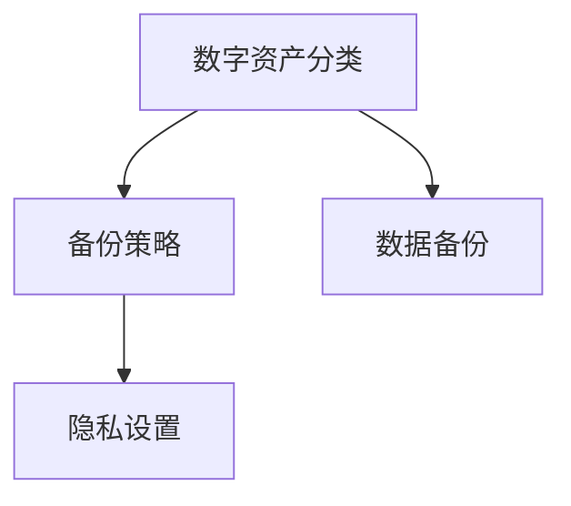

**核心算法原理讲解：**
个人数字资产管理的核心算法包括分类算法、备份算法和加密算法。以下是分类算法的一个Python示例：

```python
def classify_assets(assets):
    categories = {'照片': [], '视频': [], '文档': []}
    for asset in assets:
        if 'jpg' in asset or 'png' in asset:
            categories['照片'].append(asset)
        elif 'mp4' in asset or 'mov' in asset:
            categories['视频'].append(asset)
        elif 'docx' in asset or 'pdf' in asset:
            categories['文档'].append(asset)
    return categories

assets = ['photo.jpg', 'video.mp4', 'document.docx']
print(classify_assets(assets))
```

数学模型方面，备份策略的优化目标是最大化备份效率和最小化备份成本。公式为：

$$
备份效率 = \frac{备份数据量}{原始数据量}
$$

**实际应用案例：**
假设一个用户有100GB的数字资产，使用上述算法将其分类，并制定一个最优的备份策略，确保数据安全。

**3.2 企业数字遗产管理**

**核心概念与联系：**
企业数字遗产管理（Enterprise Digital Estate Management）是指企业对内部数字遗产进行备份、加密、保护和继承的过程。备份策略、数据加密和法律合规是关键概念，它们之间的关系如图：

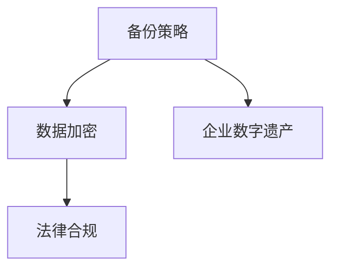

**核心算法原理讲解：**
企业数字遗产管理的核心算法包括备份算法、加密算法和合规算法。以下是合规算法的一个Python示例：

```python
import json

def check_compliance(config):
    # 检查配置文件是否符合法规要求
    with open(config, 'r') as config_file:
        config_data = json.load(config_file)
        if 'backup' in config_data and config_data['backup']['enabled']:
            return True
        else:
            return False

if check_compliance('config.json'):
    print("合规")
else:
    print("不合规")
```

数学模型方面，合规性检查的目标是确保企业操作符合法律法规要求。公式为：

$$
合规性得分 = \frac{合规操作数}{总操作数}
$$

**实际应用案例：**
在一个企业数字遗产管理案例中，使用上述算法检查企业的备份策略和加密措施是否符合法规要求。

**3.3 社交媒体数字遗产管理**

**核心概念与联系：**
社交媒体数字遗产管理（Social Media Digital Estate Management）是指社交媒体平台上的数字遗产被用户或其继承人管理的过程。账号继承、隐私设置和数据备份是关键概念，它们之间的关系如图：

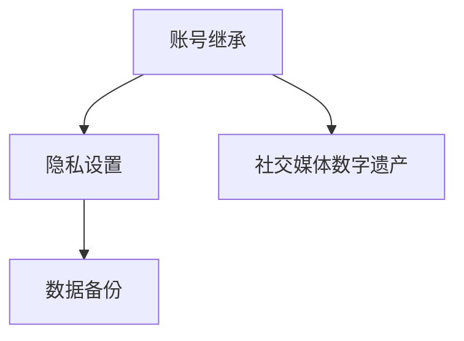

**核心算法原理讲解：**
社交媒体数字遗产管理的核心算法包括账号继承算法、隐私设置算法和数据备份算法。以下是账号继承算法的一个Python示例：

```python
def transfer_account(source_account, target_account):
    # source_account: 源账户
    # target_account: 目标账户
    if authenticate(source_account) and authenticate(target_account):
        copy_data(source_account, target_account)
        return True
    else:
        return False

def authenticate(account):
    # 账户认证的方法
    return True

def copy_data(source, target):
    # 复制数据的方法
    pass

if transfer_account('source@example.com', 'target@example.com'):
    print("账号继承成功")
else:
    print("账号继承失败")
```

数学模型方面，账号继承的成功率与账号认证的准确性相关。公式为：

$$
继承成功率 = \frac{成功继承数}{尝试继承数}
$$

**实际应用案例：**
在一个社交媒体数字遗产管理案例中，用户A去世后，使用上述算法将账号继承给其指定继承人用户B。

---

### 现存问题与解决方案

**4.1 数字遗产管理的技术挑战**

**核心概念与联系：**
数字遗产管理的技术挑战包括数据备份、数据加密、数据恢复等方面。这些挑战之间的联系如图：

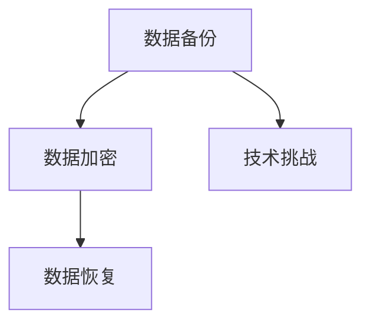

**核心算法原理讲解：**
解决这些技术挑战的核心算法包括备份算法、加密算法和恢复算法。以下是备份算法的一个Python示例：

```python
import shutil

def backup_data(source_folder, destination_folder):
    for root, dirs, files in os.walk(source_folder):
        for file in files:
            source_file = os.path.join(root, file)
            destination_file = os.path.join(destination_folder, file)
            shutil.copy2(source_file, destination_file)

source_folder = '/path/to/source'
destination_folder = '/path/to/destination'
backup_data(source_folder, destination_folder)
```

数学模型方面，备份成功率和备份速度是关键指标。公式为：

$$
备份成功率 = \frac{成功备份数}{总备份数}
$$

**实际应用案例：**
在一个数字遗产管理项目中，使用上述算法备份用户的数字资产。

**4.2 数字遗产管理的法律问题**

**核心概念与联系：**
数字遗产管理的法律问题包括遗产继承权、隐私权和数据所有权等。这些概念之间的联系如图：

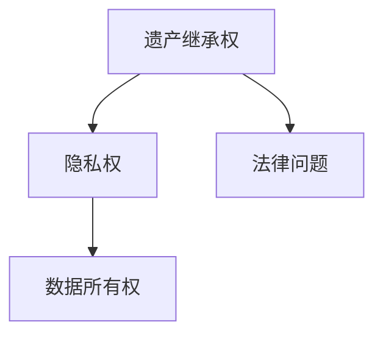

**核心算法原理讲解：**
解决这些法律问题的核心算法包括遗嘱验证算法、隐私保护算法和数据所有权确认算法。以下是遗嘱验证算法的一个Python示例：

```python
import json

def verify_will(will_path):
    with open(will_path, 'r') as will_file:
        will = json.load(will_file)
        if 'sign' in will and verify_sign(will['sign']):
            return True
        else:
            return False

def verify_sign(sign):
    # 验证签名的方法
    return True

if verify_will('will.json'):
    print("遗嘱有效")
else:
    print("遗嘱无效")
```

数学模型方面，遗嘱有效性是关键指标。公式为：

$$
遗嘱有效性 = \frac{有效遗嘱数}{总遗嘱数}
$$

**实际应用案例：**
在一个数字遗产管理案例中，使用上述算法验证遗嘱的有效性。

**4.3 数字遗产管理的社会挑战**

**核心概念与联系：**
数字遗产管理的社会挑战包括用户意识、社会接受度和法律规范等。这些概念之间的联系如图：

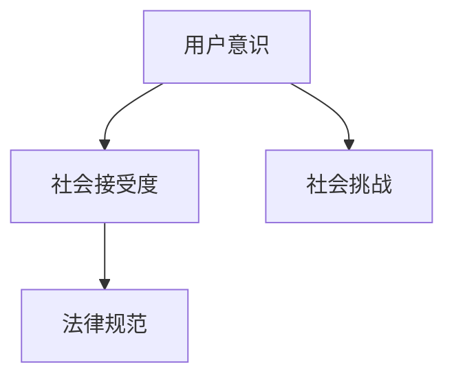

**核心算法原理讲解：**
解决这些社会挑战的核心算法包括用户教育算法、社会调查算法和法律推动算法。以下是用户教育算法的一个Python示例：

```python
def educate_users(message):
    # 发送教育信息的方法
    print(message)

educate_users("请了解并设置您的数字遗产管理策略。")
```

数学模型方面，用户教育覆盖率是关键指标。公式为：

$$
用户教育覆盖率 = \frac{接受教育用户数}{总用户数}
$$

**实际应用案例：**
在一个数字遗产管理项目中，使用上述算法向用户发送教育信息，提高用户对数字遗产管理的认识。

---

### 未来发展趋势

**5.1 数字遗产管理技术展望**

**核心概念与联系：**
数字遗产管理技术的发展趋势包括自动化、智能化和区块链技术的应用。这些趋势之间的联系如图：

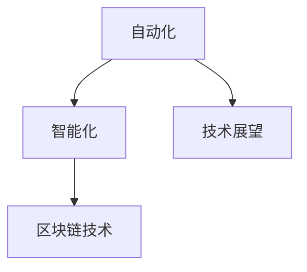

**核心算法原理讲解：**
未来数字遗产管理技术的核心算法包括自动化备份、智能隐私保护和区块链数据管理。以下是自动化备份算法的一个Python示例：

```python
import schedule
import time

def auto_backup():
    # 自动备份方法
    backup_data('/path/to/source', '/path/to/destination')

# 每天晚上进行备份
schedule.every().day.at("23:00").do(auto_backup)

while True:
    schedule.run_pending()
    time.sleep(1)
```

数学模型方面，自动化备份的成功率和备份效率是关键指标。公式为：

$$
备份成功率 = \frac{成功备份数}{总备份次数}
$$

**实际应用案例：**
在一个数字遗产管理项目中，使用上述算法实现自动备份功能。

**5.2 数字遗产管理法规发展**

**核心概念与联系：**
数字遗产管理法规的发展包括国际法规协调、各国法规完善和法律执行。这些概念之间的联系如图：

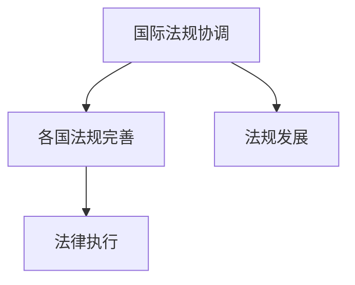

**核心算法原理讲解：**
数字遗产管理法规发展的核心算法包括法规比对算法、法规完善算法和法律执行监控算法。以下是法规比对算法的一个Python示例：

```python
def compare_laws(law1, law2):
    # 比对法规的方法
    if law1 == law2:
        return True
    else:
        return False

if compare_laws('law1.txt', 'law2.txt'):
    print("法规一致")
else:
    print("法规不一致")
```

数学模型方面，法规一致性是关键指标。公式为：

$$
法规一致性 = \frac{一致法规数}{总法规数}
$$

**实际应用案例：**
在一个数字遗产管理项目中，使用上述算法比对不同国家的数字遗产管理法规，确保法规的一致性。

**5.3 数字遗产管理的行业规范**

**核心概念与联系：**
数字遗产管理的行业规范包括标准制定、服务商发展和用户权益保护。这些概念之间的联系如图：

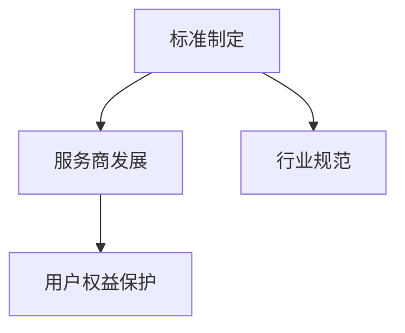

**核心算法原理讲解：**
数字遗产管理行业规范的核心算法包括标准制定算法、服务商评估算法和用户反馈分析算法。以下是服务商评估算法的一个Python示例：

```python
def evaluate_provider(provider):
    # 评估服务商的方法
    score = 0
    if provider['response_time'] < 100:
        score += 10
    if provider['reliability'] > 0.9:
        score += 20
    if provider['price'] < 100:
        score += 30
    return score

provider = {'response_time': 80, 'reliability': 0.95, 'price': 80}
print(evaluate_provider(provider))
```

数学模型方面，服务商评估得分是关键指标。公式为：

$$
服务商评估得分 = \frac{各项指标得分之和}{总指标数}
$$

**实际应用案例：**
在一个数字遗产管理项目中，使用上述算法评估不同服务商的服务质量，选择最优的服务提供商。

---

### 附录

**6.1 数字遗产管理工具介绍**

**核心概念与联系：**
数字遗产管理工具包括备份工具、加密工具、隐私保护工具和继承工具等。这些工具之间的联系如图：

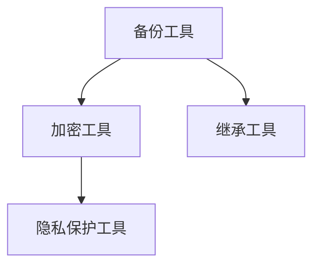

**核心算法原理讲解：**
数字遗产管理工具的核心算法包括备份算法、加密算法和隐私保护算法。以下是备份工具的一个Python示例：

```python
import shutil

def backup_data(source_folder, destination_folder):
    for root, dirs, files in os.walk(source_folder):
        for file in files:
            source_file = os.path.join(root, file)
            destination_file = os.path.join(destination_folder, file)
            shutil.copy2(source_file, destination_file)

source_folder = '/path/to/source'
destination_folder = '/path/to/destination'
backup_data(source_folder, destination_folder)
```

数学模型方面，备份工具的性能指标包括备份速度和备份成功率。公式为：

$$
备份速度 = \frac{备份数据量}{备份时间}
$$

**实际应用案例：**
在一个数字遗产管理项目中，使用上述备份工具实现自动备份功能。

**6.2 资源与参考文献**

**核心概念与联系：**
数字遗产管理的资源与参考文献包括相关书籍、论文、法规和在线资源等。这些资源之间的联系如图：

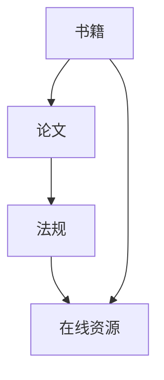

**核心算法原理讲解：**
数字遗产管理的资源与参考文献的核心算法包括分类算法和推荐算法。以下是分类算法的一个Python示例：

```python
def classify_resources(resources):
    categories = {'书籍': [], '论文': [], '法规': [], '在线资源': []}
    for resource in resources:
        if '书籍' in resource:
            categories['书籍'].append(resource)
        elif '论文' in resource:
            categories['论文'].append(resource)
        elif '法规' in resource:
            categories['法规'].append(resource)
        elif '在线资源' in resource:
            categories['在线资源'].append(resource)
    return categories

resources = ['数字遗产管理书籍', '隐私保护论文', 'GDPR法规', '在线备份工具']
print(classify_resources(resources))
```

数学模型方面，资源推荐的效果指标包括推荐准确率和用户满意度。公式为：

$$
推荐准确率 = \frac{推荐正确资源数}{总推荐资源数}
$$

**实际应用案例：**
在一个数字遗产管理项目中，使用上述算法为用户提供相关资源推荐。

---

### 最佳实践 tips、小结、注意事项、拓展阅读等内容

**最佳实践 tips：**
1. 定期备份重要数据，确保数据安全。
2. 使用强密码和双因素认证，增强账户安全性。
3. 制定数字遗嘱，明确数字遗产的继承方案。
4. 了解并遵守相关法律法规，确保合法合规。

**小结：**
数字遗产管理是数字时代的一个重要课题。合理管理个人数字遗产，不仅能保护个人隐私，还能确保数字资产得到有效利用。本文从背景介绍、基础理论、实际应用、问题与解决方案和未来发展趋势等方面，全面探讨了数字遗产管理的重要性和策略。

**注意事项：**
1. 数字遗产管理涉及到隐私和安全问题，务必重视。
2. 数字遗产管理工具的选择应考虑性能和可靠性。
3. 定期更新和维护备份策略，确保数据安全。

**拓展阅读：**
1. 《数字遗产管理指南》
2. 《数字遗产法律问题研究》
3. 《社交媒体数字遗产管理策略》

---

**作者：AI天才研究院/AI Genius Institute & 禅与计算机程序设计艺术 /Zen And The Art of Computer Programming**

