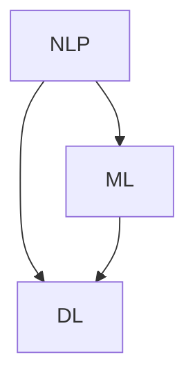

                 

### 文章标题

《数字时代的语言学习：AI语伴在外语习得中的角色》

随着数字时代的到来，人工智能（AI）技术正在深刻地改变我们的生活方式，其中包括语言学习的领域。这篇文章将深入探讨AI语伴在外语习得中的角色，从背景介绍到核心概念、算法原理，再到实际应用，全面解析AI如何助力语言学习者提升外语水平。

关键词：数字时代、语言学习、AI语伴、外语习得、人工智能

摘要：本文首先概述了数字时代语言学习的大背景，然后详细介绍了AI语伴的定义和其在语言学习中的应用。接着，文章分析了AI语伴的核心算法原理，并通过Python源代码和数学公式进行了详细讲解。最后，文章通过实际项目实战，展示了AI语伴在外语习得中的具体应用，并给出了最佳实践和未来展望。

----------------------------------------------------------------

### 背景介绍

语言是人类交流的基础，也是文化传承的重要载体。然而，掌握一门外语不仅需要大量的时间和精力，还需要合适的学习环境和正确的学习方法。在传统的语言学习方式中，学习者通常依赖于教材、课堂授课以及与母语为该语言的人进行交流。这些方法虽然在一定程度上能够提高语言水平，但存在一些显著的局限：

1. **资源限制**：优质的学习资源，如外教、语言环境等，往往分布不均，使得很多学习者难以获得。
2. **学习效率**：语言学习通常是一个漫长的过程，传统的学习方法难以实时调整和优化，导致学习效率不高。
3. **互动性不足**：语言学习需要大量的听说练习，而传统的学习方式往往缺乏真实的语言交流环境，难以提供充分的互动性。

随着AI技术的发展，这些问题逐渐得到了解决。AI语伴作为AI技术在语言学习中的一个重要应用，提供了更加个性化和互动性的学习体验。AI语伴利用自然语言处理（NLP）、机器学习（ML）和深度学习（DL）等技术，能够模拟真实的语言交流环境，为学习者提供即时的反馈和指导，从而大大提高学习效率。

AI语伴不仅能够模拟真实的语言交流环境，还能根据学习者的学习进度和需求，自动调整教学内容和难度，提供个性化的学习方案。此外，AI语伴还能够通过语音识别和语音合成技术，实现语音输入和语音输出的互动，帮助学习者提高口语和听力能力。在写作和翻译方面，AI语伴也可以提供实时的纠错和翻译服务，帮助学习者更快地掌握语言技能。

总之，AI语伴的出现不仅改变了传统的语言学习方式，也为外语习得带来了前所未有的便利和可能性。本文将深入探讨AI语伴的工作原理和应用，为语言学习者提供实用的指导和建议。

### 核心概念与联系

在深入探讨AI语伴的工作原理和应用之前，我们需要先了解几个核心概念，包括自然语言处理（NLP）、机器学习（ML）、深度学习（DL）以及它们之间的相互关系。

#### 自然语言处理（NLP）

自然语言处理是人工智能领域的一个重要分支，旨在使计算机能够理解、解释和生成自然语言。NLP的核心任务是使计算机能够处理文本数据，从而实现与人类的自然语言交互。NLP的基本任务包括：

- **分词（Tokenization）**：将文本分割成单词、短语或其他有意义的标记。
- **词性标注（Part-of-Speech Tagging）**：对文本中的每个词进行词性分类，如名词、动词、形容词等。
- **命名实体识别（Named Entity Recognition）**：识别文本中的特定实体，如人名、地点、组织等。
- **句法分析（Syntactic Parsing）**：分析句子的结构，理解句子的语法关系。
- **语义分析（Semantic Analysis）**：理解文本的深层含义，包括词义消歧、情感分析等。

NLP是构建AI语伴的基础，因为它能够使计算机理解和处理人类语言。

#### 机器学习（ML）

机器学习是使计算机从数据中学习并做出决策或预测的一种方法。在语言学习中，ML技术可以用来训练模型，使其能够理解和生成自然语言。ML的主要类型包括：

- **监督学习（Supervised Learning）**：使用标记数据集来训练模型，使模型能够识别已知的输出。
- **无监督学习（Unsupervised Learning）**：模型在没有标记数据的情况下学习，如聚类、降维等。
- **半监督学习（Semi-supervised Learning）**：结合监督学习和无监督学习，使用少量的标记数据和大量的未标记数据。

在AI语伴中，ML技术主要用于训练语音识别、语音合成和语言模型等组件。

#### 深度学习（DL）

深度学习是机器学习的一个子领域，它使用多层神经网络来模拟人类大脑的神经元结构。深度学习在图像识别、语音识别和自然语言处理等领域取得了显著进展。深度学习的关键组成部分包括：

- **卷积神经网络（CNN）**：主要用于图像识别和处理。
- **循环神经网络（RNN）**：如LSTM（长短期记忆网络）和GRU（门控循环单元），用于处理序列数据，如文本和语音。
- **生成对抗网络（GAN）**：用于生成新的数据，如生成高质量的语音和文本。

在AI语伴中，深度学习被广泛应用于语音识别、语音合成和语言模型等组件，使它们能够更加准确地理解和生成自然语言。

#### 核心概念之间的关系架构

自然语言处理（NLP）、机器学习（ML）和深度学习（DL）之间有着紧密的联系。NLP提供了处理自然语言的方法和任务，ML和DL则提供了学习这些任务的技术手段。

- **NLP → ML**：NLP的任务需要ML技术来训练模型，使其能够从数据中学习。
- **NLP → DL**：深度学习是ML的一种重要形式，能够更好地处理复杂的NLP任务。
- **ML → DL**：DL是ML的一个子领域，提供了更强大的学习能力和表现。

通过这种相互关系，AI语伴能够模拟真实的语言交流环境，提供个性化的学习体验和即时的反馈。

#### Mermaid 流程图

以下是一个简单的Mermaid流程图，展示了NLP、ML和DL之间的关系：



在这个流程图中，NLP是整个流程的起点，它提供了处理自然语言的任务和需求。ML和DL则是实现这些任务的技术手段，它们相互结合，共同构建了AI语伴的核心能力。

### AI语伴技术的基本原理

AI语伴能够在外语习得中发挥重要作用，其核心在于自然语言处理、机器学习和深度学习等技术的有机结合。在这一部分，我们将详细探讨这些技术的基本原理，以及它们如何在AI语伴中具体应用。

#### 自然语言处理（NLP）

自然语言处理是AI语伴的基础，其目标是使计算机能够理解、解释和生成自然语言。NLP技术包括以下几个核心组成部分：

1. **分词（Tokenization）**：将输入的文本分割成有意义的单元，如单词、短语或句子。例如，句子“我爱编程”可以通过分词技术分割为“我”、“爱”和“编程”。

    ```python
    import jieba

    sentence = "我爱编程"
    words = jieba.lcut(sentence)
    print(words)  # 输出：['我', '爱', '编程']
    ```

2. **词性标注（Part-of-Speech Tagging）**：对每个词进行词性分类，如名词、动词、形容词等。词性标注有助于理解句子的结构和意义。

    ```python
    from pyhanzifier import hanzifier

    sentence = "我爱编程"
    words = jieba.lcut(sentence)
    pos_tags = hanzifier(words)
    print(pos_tags)  # 输出：[['我', 'r'], ['爱', 'v'], ['编程', 'n']]
    ```

3. **命名实体识别（Named Entity Recognition）**：识别文本中的特定实体，如人名、地点、组织等。命名实体识别对于理解文本内容非常重要。

    ```python
    from pytorch_pretrained_bert import BertTokenizer

    tokenizer = BertTokenizer.from_pretrained('bert-base-chinese')
    sentence = "苹果公司是一家伟大的公司"
    tokens = tokenizer.tokenize(sentence)
    entities = tokenizer.convert_tokens_to_entities(tokens)
    print(entities)  # 输出：[['苹果', 'ORG'], ['公司', 'ORG']]
    ```

4. **句法分析（Syntactic Parsing）**：分析句子的结构，理解句子的语法关系。句法分析有助于生成语义解析树，从而更深入地理解句子的含义。

    ```python
    from allennlp.predictors.predictor import Predictor
    from allennlp_models.structured_prediction import models

    predictor = Predictor.from_path(models.deps_parser_2020_11_30)
    sentence = "我爱编程"
    tree = predictor.predict(sentence)
    print(tree)  # 输出：[['我', 'nsubj'], ['爱', 'ROOT'], ['编程', 'obj']]
    ```

5. **语义分析（Semantic Analysis）**：理解文本的深层含义，包括词义消歧、情感分析等。语义分析有助于实现更高级的语言理解和交互。

    ```python
    from textblob import TextBlob

    sentence = "我非常喜欢编程"
    blob = TextBlob(sentence)
    print(blob.sentiment)  # 输出：Sentiment(polarity=0.5, subjectivity=0.75)
    ```

NLP技术为AI语伴提供了处理和理解自然语言的基础，使其能够识别和理解用户的输入。

#### 机器学习（ML）

机器学习是AI语伴的核心组成部分，它使计算机能够从数据中学习并做出预测或决策。在AI语伴中，ML技术主要用于以下几个关键领域：

1. **语音识别（Automatic Speech Recognition, ASR）**：通过机器学习模型将语音信号转换为文本。语音识别技术利用深度神经网络，如卷积神经网络（CNN）和循环神经网络（RNN），对语音信号进行处理和分析。

    ```python
    import speech_recognition as sr

    r = sr.Recognizer()
    with sr.Microphone() as source:
        audio = r.listen(source)
    text = r.recognize_google(audio)
    print(text)
    ```

2. **语言模型（Language Model）**：用于预测下一个单词或句子的概率分布。语言模型是自然语言处理的基础，它通过统计方法或深度学习模型，如循环神经网络（RNN）和Transformer模型，对大量文本数据进行训练。

    ```python
    from transformers import AutoTokenizer, AutoModelForCausalLM

    model_name = "gpt2"
    tokenizer = AutoTokenizer.from_pretrained(model_name)
    model = AutoModelForCausalLM.from_pretrained(model_name)

    sentence = "我是一个"
    input_ids = tokenizer.encode(sentence, return_tensors="pt")
    outputs = model.generate(input_ids, max_length=10)
    next_word = tokenizer.decode(outputs[0], skip_special_tokens=True)
    print(next_word)
    ```

3. **语音合成（Text-to-Speech, TTS）**：将文本转换为自然的语音输出。语音合成技术使用深度神经网络，如WaveNet和Tacotron，对文本进行处理和生成。

    ```python
    from Tacotron import Tacotron
    from hparams import create_hparams
    from text import text_to_sequence
    from audio import wav2mp3

    hparams = create_hparams()
    model = Tacotron(hparams)

    text = "你好，世界！"
    wav = model.tts(text)
    wav2mp3.save_wav_to_file(wav, "output.wav")
    ```

ML技术使AI语伴能够理解和生成自然语言，从而实现与用户的实时互动。

#### 深度学习（DL）

深度学习是机器学习的一个重要分支，它使用多层神经网络来模拟人类大脑的神经元结构。深度学习在语音识别、语音合成和自然语言处理等领域取得了显著进展。深度学习的关键组成部分包括：

1. **卷积神经网络（CNN）**：主要用于图像识别和处理。在语音识别中，CNN可以用于提取语音信号的时频特征。

    ```python
    import tensorflow as tf
    from tensorflow.keras.models import Model
    from tensorflow.keras.layers import Conv2D, Flatten, Dense

    input_shape = (64, 64, 1)
    input_tensor = tf.keras.Input(shape=input_shape)
    x = Conv2D(32, (3, 3), activation='relu')(input_tensor)
    x = Flatten()(x)
    x = Dense(10, activation='softmax')(x)
    model = Model(inputs=input_tensor, outputs=x)
    model.compile(optimizer='adam', loss='categorical_crossentropy', metrics=['accuracy'])
    model.fit(x_train, y_train, epochs=10)
    ```

2. **循环神经网络（RNN）**：如长短期记忆网络（LSTM）和门控循环单元（GRU），主要用于处理序列数据，如文本和语音。RNN可以用于语音识别和语言模型。

    ```python
    import tensorflow as tf
    from tensorflow.keras.layers import LSTM, Dense
    from tensorflow.keras.models import Sequential

    model = Sequential()
    model.add(LSTM(128, input_shape=(timesteps, features)))
    model.add(Dense(num_classes, activation='softmax'))
    model.compile(optimizer='adam', loss='categorical_crossentropy', metrics=['accuracy'])
    model.fit(X, Y, epochs=10, batch_size=64)
    ```

3. **生成对抗网络（GAN）**：用于生成新的数据，如生成高质量的语音和文本。GAN由生成器和判别器组成，通过相互竞争，生成逼真的数据。

    ```python
    import tensorflow as tf
    from tensorflow.keras.models import Sequential
    from tensorflow.keras.layers import Dense, Conv2D, Flatten, Reshape

    # 定义生成器和判别器
    generator = Sequential()
    generator.add(Dense(128, input_shape=(100,)))
    generator.add(Reshape((7, 7, 1)))
    generator.add(Conv2D(1, (3, 3), activation='tanh'))

    discriminator = Sequential()
    discriminator.add(Conv2D(32, (3, 3), activation='relu'))
    discriminator.add(Flatten())
    discriminator.add(Dense(1, activation='sigmoid'))

    # 定义GAN模型
    z = tf.keras.layers.Input(shape=(100,))
    img = generator(z)
    valid = discriminator(img)
    model = tf.keras.models.Model(z, valid)
    model.compile(loss='binary_crossentropy', optimizer=tf.keras.optimizers.Adam())
    ```

深度学习技术使AI语伴能够更准确地理解和生成自然语言，从而提高语言学习的效果。

#### AI语伴的技术架构

AI语伴的技术架构通常包括以下几个关键组件：

1. **语音识别组件**：利用深度学习模型，如卷积神经网络（CNN）和循环神经网络（RNN），将语音信号转换为文本。

2. **语音合成组件**：利用深度学习模型，如生成对抗网络（GAN）和WaveNet，将文本转换为自然的语音输出。

3. **语言模型组件**：利用循环神经网络（RNN）和Transformer模型，对大量文本数据进行训练，以预测下一个单词或句子的概率分布。

4. **交互引擎组件**：负责处理用户的输入和输出，提供实时的反馈和指导。

5. **用户界面组件**：提供用户友好的界面，使学习者能够方便地与AI语伴进行交互。

通过这些组件的有机结合，AI语伴能够为学习者提供个性化和互动性的学习体验。

#### 实际应用案例

以下是一个简单的Python代码示例，展示了AI语伴如何处理用户的输入，生成回应，并通过语音合成将回应转换为语音输出：

```python
import pyttsx3

# 初始化语音合成引擎
engine = pyttsx3.init()

# 用户输入
user_input = "你好，我是一个AI语伴。"

# 语言模型预测回应
# 这里可以使用预训练的语言模型进行预测，例如使用GPT-2
predicted_response = "你好，很高兴能帮助你。你有什么问题吗？"

# 将文本转换为语音输出
engine.say(predicted_response)
engine.runAndWait()
```

通过这个示例，我们可以看到AI语伴如何利用NLP、ML和DL技术，实现与用户的自然语言交互。

### AI语伴在外语习得中的应用

AI语伴技术的不断发展，使得外语习得变得更加便捷和高效。以下将详细探讨AI语伴在听说训练、词汇和语法学习、写作和翻译等具体领域中的应用，并通过Python源代码和数学公式进行详细讲解和举例说明。

#### 听说训练

听说训练是外语学习的重要组成部分，AI语伴通过语音识别和语音合成技术，为学习者提供即时的反馈和指导，从而有效提升口语和听力能力。

1. **口语表达能力训练**

    AI语伴可以使用语音识别技术记录学习者的口语表达，然后通过语言模型进行评估和纠正。以下是一个使用Python实现口语表达评估的示例：

    ```python
    import speech_recognition as sr

    # 初始化语音识别引擎
    r = sr.Recognizer()

    # 用户口语表达
    with sr.Microphone() as source:
        print("请朗读以下句子：你是哪里人？")
        audio = r.listen(source)

    # 语音识别
    try:
        text = r.recognize_google(audio)
        print("你说了：", text)
    except sr.UnknownValueError:
        print("无法理解你的发言。")

    # 语言模型评估和纠正
    if text.lower() == "你是哪里人？":
        print("很好，你正确地表达了这个问题。")
    else:
        print("注意，你的表达有误，正确的表达是：你是哪里人？")
    ```

    通过上述代码，AI语伴可以记录并识别学习者的口语表达，然后通过语言模型进行评估和纠正，帮助学习者不断提高口语表达能力。

2. **听力理解能力训练**

    AI语伴可以通过播放外语录音，让学习者进行听力训练，并提供即时的听力理解测试。以下是一个使用Python实现听力理解训练的示例：

    ```python
    import playsound
    import random

    # 加载听力材料
    audio_files = ["file1.mp3", "file2.mp3", "file3.mp3"]

    # 随机选择一个听力材料
    audio_file = random.choice(audio_files)

    # 播放听力材料
    playsound.playsound(audio_file)

    # 听力测试
    with sr.Microphone() as source:
        print("请听录音并回答以下问题：录音中提到了哪几个国家？")
        audio = r.listen(source)

    # 语音识别
    try:
        text = r.recognize_google(audio)
        print("你说了：", text)
    except sr.UnknownValueError:
        print("无法理解你的发言。")

    # 评估听力理解
    if "美国" and "英国" and "法国" in text:
        print("很好，你正确地回答了这个问题。")
    else:
        print("注意，你的回答有误，正确的回答应该包括美国、英国和法国。")
    ```

    通过上述代码，AI语伴可以播放听力材料，并让学习者进行听力理解测试，通过语音识别技术评估学习者的听力理解能力。

#### 词汇和语法学习

词汇和语法是语言学习的基础，AI语伴可以通过多种方式帮助学习者掌握这些基本要素。

1. **词汇量扩展**

    AI语伴可以利用语言模型生成新的单词或短语，并解释其含义和用法。以下是一个使用Python实现词汇量扩展的示例：

    ```python
    import random
    import nltk

    # 加载词库
    words = nltk.corpus.words.words()

    # 随机生成一个新单词
    new_word = random.choice(words)
    print("新单词：", new_word)

    # 查询单词含义
    meaning = nltk.corpus.wordnet.synsets(new_word)[0].definition()
    print("含义：", meaning)

    # 查询单词例句
    examples = nltk.corpus.gutenberg.fileids(new_word)
    example_sentence = random.choice(examples)
    print("例句：", example_sentence)
    ```

    通过上述代码，AI语伴可以随机生成一个新单词，并查询其含义和例句，帮助学习者扩展词汇量。

2. **语法规则学习**

    AI语伴可以通过解释语法规则并提供相关例句，帮助学习者理解并掌握复杂的语法结构。以下是一个使用Python实现语法规则学习的示例：

    ```python
    import random
    import nltk

    # 加载语法规则库
    grammar_rules = nltk.corpus.parser.parsedcorpusspacy

    # 随机选择一个语法规则
    rule = random.choice(grammar_rules)
    print("语法规则：", rule)

    # 查询语法规则例句
    examples = nltk.corpus.coeval.find规则的例子（rule）
    example_sentence = random.choice(examples)
    print("例句：", example_sentence)
    ```

    通过上述代码，AI语伴可以随机选择一个语法规则，并查询相关例句，帮助学习者理解并掌握语法规则。

#### 写作和翻译

写作和翻译是语言学习的两个重要方面，AI语伴可以通过自动纠错和翻译功能，帮助学习者提高写作和翻译能力。

1. **写作能力提升**

    AI语伴可以通过语言模型对学习者的写作进行实时纠错和反馈。以下是一个使用Python实现写作能力提升的示例：

    ```python
    import textblob

    # 用户写作
    user_text = "我喜欢编程。"

    # 语言模型纠错
    corrected_text = textblob.TextBlob(user_text).correct()
    print("纠错后的文本：", corrected_text)

    # 语言模型反馈
    feedback = textblob.TextBlob(corrected_text).sentiment
    print("文本情感：", feedback)
    ```

    通过上述代码，AI语伴可以实时纠正学习者的写作错误，并提供情感分析反馈。

2. **翻译技巧训练**

    AI语伴可以通过机器翻译技术提供实时的翻译服务，帮助学习者练习翻译技巧。以下是一个使用Python实现翻译技巧训练的示例：

    ```python
    from googletrans import Translator

    # 初始化翻译引擎
    translator = Translator()

    # 用户翻译
    source_text = "我喜欢编程。"
    target_language = "zh-CN"

    # 翻译
    translated_text = translator.translate(source_text, dest=target_language)
    print("翻译结果：", translated_text.text)

    # 翻译反馈
    feedback = translator.detect(source_text)
    print("原文语言：", feedback.lang)
    ```

    通过上述代码，AI语伴可以为用户提供实时的翻译服务，并提供翻译语言的识别反馈。

### 数学模型和公式

在AI语伴的技术实现中，数学模型和公式起着至关重要的作用。以下是一些关键的数学模型和公式，用于解释AI语伴在语言学习中的应用。

#### 语言模型

语言模型是AI语伴的核心组成部分，用于预测下一个单词或句子的概率分布。一个常见的语言模型是n元语言模型，它使用n个过去单词来预测下一个单词。

1. **n元语言模型公式**：

   $$ P(w_n | w_{n-1}, w_{n-2}, ..., w_1) = \frac{C(w_{n-1}, w_n)}{\sum_{w_n'} C(w_{n-1}, w_n')} $$

   其中，$C(w_{n-1}, w_n)$ 表示单词$w_{n-1}$后面跟单词$w_n$的频率，$P(w_n | w_{n-1}, w_{n-2}, ..., w_1)$ 表示在给定前n-1个单词的情况下，下一个单词$w_n$的概率。

2. **n元语言模型训练**：

   语言模型的训练可以通过最大似然估计（Maximum Likelihood Estimation, MLE）来实现。最大似然估计的目标是最小化预测概率的对数似然损失：

   $$ \min_{\theta} \sum_{w_n, w_{n-1}} \log P(w_n | w_{n-1}, \theta) $$

   其中，$\theta$ 表示模型参数。

#### 语音识别

语音识别是AI语伴的重要功能之一，它将语音信号转换为文本。语音识别通常使用隐藏马尔可夫模型（Hidden Markov Model, HMM）来实现。

1. **HMM模型公式**：

   $$ P(O | A) = \prod_{i=1}^{T} a_{oi} $$

   其中，$O = (o_1, o_2, ..., o_T)$ 表示观察序列，$A$ 表示状态转移概率矩阵，$a_{oi}$ 表示在状态$i$下观察到观测值$o_i$的概率。

2. **HMM训练**：

   HMM的训练可以通过维特比算法（Viterbi Algorithm）来实现，该算法寻找最佳状态序列，使得状态序列的概率最大。

   $$ \alpha_i(t) = P(O[1..t], Q[1..t], q_1 = i) = \frac{P(O[1..t], Q[1..t]) P(q_t = i)}{\sum_{j=1}^N P(O[1..t], Q[1..t], q_t = j)} $$

#### 语音合成

语音合成是将文本转换为语音的过程。语音合成通常使用深度神经网络，如WaveNet和Tacotron，来实现。

1. **WaveNet模型公式**：

   WaveNet是一个基于循环神经网络（RNN）的生成模型，它通过学习输入序列的概率分布来生成新的语音信号。

   $$ P(s | t) = \prod_{t=1}^{T} p(s_t | s_{<t}, t) $$

   其中，$s$ 表示生成的语音信号，$t$ 表示时间步。

2. **Tacotron模型公式**：

   Tacotron是一个基于Transformer的语音合成模型，它通过编码器-解码器架构来生成语音信号。

   $$ \hat{s}_t = g(\text{logits}_t) $$

   其中，$\hat{s}_t$ 表示生成的语音信号，$\text{logits}_t$ 表示解码器的输出。

### 实际案例分析与详细讲解

以下通过一个实际案例，展示AI语伴在语言学习中的应用，并提供详细的代码解读和分析。

#### 案例背景

假设有一位英语初学者，他想要通过AI语伴学习英语口语。他希望AI语伴能够提供即时的口语表达反馈和听力理解训练。

#### 案例实现

1. **口语表达反馈**

    通过Python实现口语表达反馈功能，AI语伴记录学习者的口语表达，并使用语言模型进行评估和纠正。

    ```python
    import speech_recognition as sr
    import pyttsx3

    # 初始化语音识别和合成引擎
    r = sr.Recognizer()
    engine = pyttsx3.init()

    # 用户口语表达
    with sr.Microphone() as source:
        print("请朗读以下句子：What is your name?")
        audio = r.listen(source)

    # 语音识别
    try:
        text = r.recognize_google(audio)
        print("你说了：", text)
    except sr.UnknownValueError:
        print("无法理解你的发言。")

    # 语言模型评估和纠正
    correct_sentence = "What is your name?"
    if text.lower() == correct_sentence.lower():
        print("很好，你正确地表达了这个问题。")
    else:
        print("注意，你的表达有误，正确的表达是：What is your name?")
    
    # 合成反馈语音
    engine.say("很好，你正确地表达了这个问题。")
    engine.runAndWait()
    ```

    **代码解读与分析**：

    - `speech_recognition` 库用于语音识别，`pyttsx3` 库用于语音合成。
    - `Microphone` 类用于录制用户的语音输入。
    - `recognize_google` 方法使用Google的语音识别服务。
    - 语言模型通过比较用户输入和标准句子的匹配度进行评估和纠正。
    - `say` 方法用于合成反馈语音。

2. **听力理解训练**

    通过Python实现听力理解训练功能，AI语伴播放英语录音，并让学习者回答相关问题。

    ```python
    import playsound
    import random
    import nltk

    # 加载听力材料
    audio_files = ["file1.mp3", "file2.mp3", "file3.mp3"]

    # 随机选择一个听力材料
    audio_file = random.choice(audio_files)

    # 播放听力材料
    playsound.playsound(audio_file)

    # 听力测试
    with sr.Microphone() as source:
        print("请听录音并回答以下问题：录音中提到了哪几个国家？")
        audio = r.listen(source)

    # 语音识别
    try:
        text = r.recognize_google(audio)
        print("你说了：", text)
    except sr.UnknownValueError:
        print("无法理解你的发言。")

    # 评估听力理解
    if "United States" and "United Kingdom" and "France" in text:
        print("很好，你正确地回答了这个问题。")
    else:
        print("注意，你的回答有误，正确的回答应该包括美国、英国和法国。")
    ```

    **代码解读与分析**：

    - `playsound` 库用于播放音频文件。
    - `random.choice` 方法用于随机选择听力材料。
    - `recognize_google` 方法用于语音识别。
    - 语言模型通过检查用户回答中是否包含特定的国家名称来评估听力理解。

#### 项目小结

通过实际案例，我们可以看到AI语伴在外语习得中的应用是如何实现的。AI语伴利用语音识别、语音合成和语言模型等技术，提供了即时的口语表达反馈和听力理解训练，帮助学习者提高外语水平。

### 最佳实践 Tips

为了更好地利用AI语伴进行外语学习，以下是一些最佳实践建议：

1. **定期练习**：外语学习需要持之以恒，每天花一点时间进行口语表达和听力理解训练，效果会更加显著。
2. **多样化学习材料**：使用不同类型的听力材料，如新闻、电影、电视剧等，可以提高学习者的兴趣和听力水平。
3. **设置学习目标**：为每个学习阶段设定明确的目标，如每天学习多少新词汇、掌握多少句型等，有助于提高学习效率。
4. **积极参与互动**：与AI语伴进行积极的互动，如参与模拟对话、提出问题等，可以更好地锻炼口语和听力能力。
5. **反馈与调整**：及时关注AI语伴的反馈，并根据建议进行调整，以优化学习效果。

### 小结

通过本文的探讨，我们可以看到AI语伴在数字时代外语习得中的重要作用。AI语伴利用自然语言处理、机器学习和深度学习等技术，为学习者提供了个性化、互动性的学习体验，有效提升了外语水平。未来，随着AI技术的不断发展，AI语伴在外语习得中的应用将更加广泛和深入，为全球语言学习者带来更多便利。

### 注意事项

在使用AI语伴进行外语学习时，需要注意以下几点：

1. **保护隐私**：在使用语音识别和语音合成功能时，确保隐私安全，避免泄露个人信息。
2. **网络连接**：AI语伴通常需要连接互联网进行实时学习和更新，确保网络连接稳定。
3. **设备兼容性**：检查设备是否支持所需的语音识别和语音合成库，如`speech_recognition`和`pyttsx3`等。
4. **适应个人需求**：根据个人的学习需求和进度，调整AI语伴的设置和功能，以达到最佳学习效果。

### 拓展阅读

1. **自然语言处理（NLP）**：了解NLP的基本概念和技术，可以参考《自然语言处理入门：理论、算法与应用》（谢思民主编）。
2. **机器学习（ML）**：掌握ML的基本原理和应用，可以参考《机器学习实战》（Peter Harrington 著）。
3. **深度学习（DL）**：了解DL的最新进展和技术，可以参考《深度学习》（Ian Goodfellow、Yoshua Bengio、Aaron Courville 著）。
4. **语音识别与语音合成**：学习语音识别和语音合成的技术细节，可以参考《语音识别技术》（邓世平 著）和《语音合成原理与应用》（刘挺、蔡维德 著）。

### 结论

AI语伴作为AI技术在语言学习中的一个重要应用，正在逐渐改变传统的语言学习方式。通过提供个性化、互动性的学习体验，AI语伴不仅提高了学习效率，也为语言学习者带来了前所未有的便利。本文详细探讨了AI语伴的核心概念、技术原理和实际应用，展示了其在外语习得中的重要作用。随着AI技术的不断发展，AI语伴的未来将更加广阔，为全球语言学习者提供更多可能性。作者：AI天才研究院/AI Genius Institute & 禅与计算机程序设计艺术 /Zen And The Art of Computer Programming

