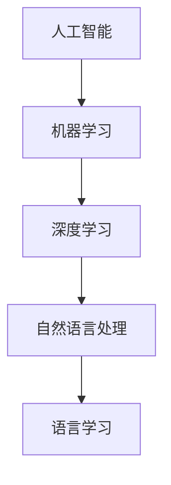
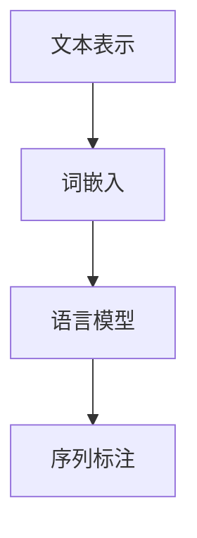
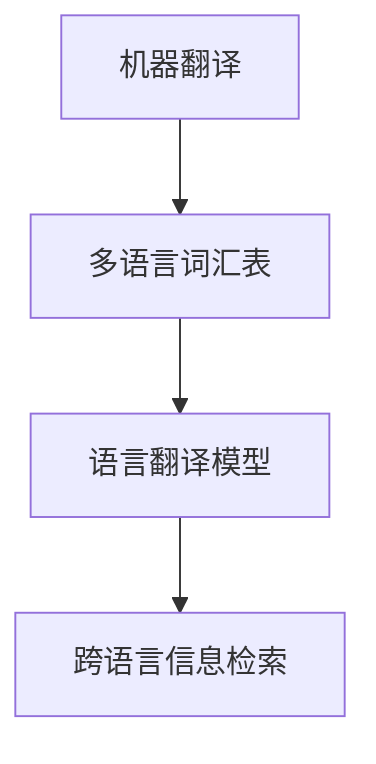
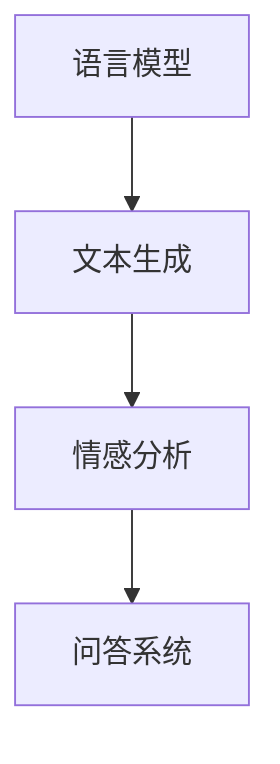
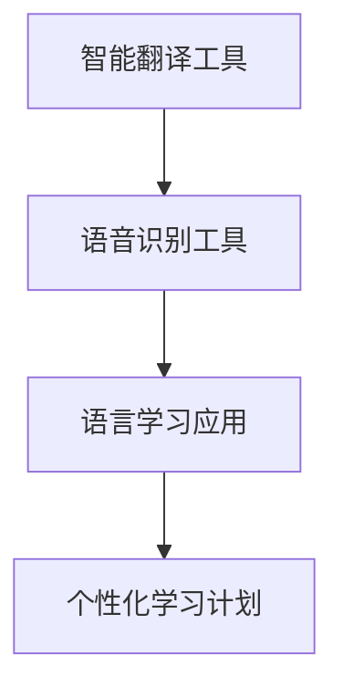
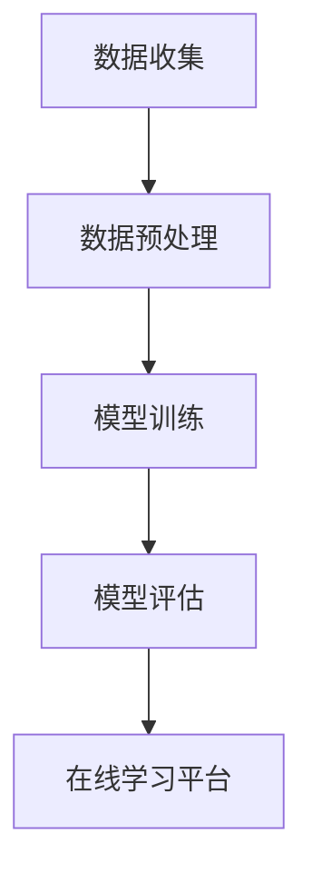
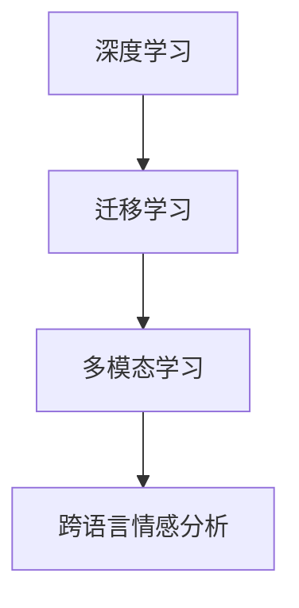
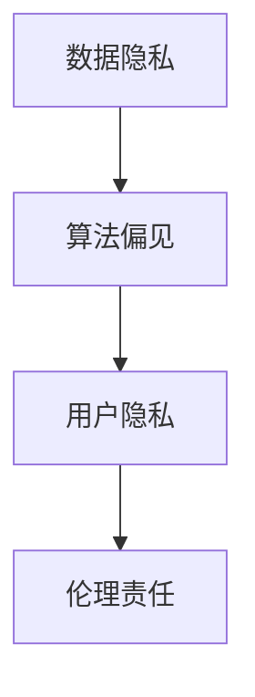

                 

# 数字时代的语言学习：AI辅助下的多语言交流

## 关键词
- AI辅助语言学习
- 自然语言处理
- 多语言交流
- 机器翻译
- 语言模型

## 摘要
随着数字时代的到来，全球化的趋势使得多语言交流变得日益重要。AI技术的飞速发展，特别是自然语言处理（NLP）领域，为语言学习带来了革命性的变化。本文将探讨AI在语言学习中的应用，尤其是AI辅助下的多语言交流。通过分析AI技术的基础、核心算法、数学模型以及实际项目案例，本文旨在为读者提供一个全面、深入的视角，了解AI如何助力语言学习，并探讨其未来的发展趋势和挑战。

## 第一部分：AI与语言学习基础

### 第1章：AI与语言学习的概述
AI与语言学习的结合，为语言教育开辟了新天地。AI技术通过模拟人类的思维过程，实现自动化的语言理解和生成，极大地提高了语言学习的效率和质量。本章节将介绍AI在语言学习中的应用背景和发展历程，探讨其优势和应用场景。

#### 背景介绍
在全球化和互联网的推动下，语言交流变得愈加频繁和重要。然而，传统的语言学习方式存在许多局限性，如学习效率低、个性化程度不足等。AI技术的出现，为解决这些问题提供了新的可能性。

#### 核心概念与联系
AI技术涉及多个领域，包括机器学习、深度学习、自然语言处理等。以下是一个简化的Mermaid流程图，展示了AI与语言学习之间的核心概念和联系：



#### 核心算法原理讲解
为了更好地理解AI在语言学习中的应用，我们需要了解一些核心算法。以下是使用Python实现的循环神经网络（RNN）的伪代码，用于演示语言模型的基本原理：

```python
# 定义RNN模型
class RNNModel(nn.Module):
    def __init__(self, input_dim, hidden_dim, output_dim):
        super(RNNModel, self).__init__()
        self.hidden_dim = hidden_dim
        self.rnn = nn.RNN(input_dim, hidden_dim, num_layers=1)
        self.fc = nn.Linear(hidden_dim, output_dim)

    def forward(self, x, hidden):
        out, hidden = self.rnn(x, hidden)
        out = self.fc(out[-1, :, :])
        return out, hidden

# 实例化模型
model = RNNModel(input_dim=VOCAB_SIZE, hidden_dim=HIDDEN_SIZE, output_dim=VOCAB_SIZE)

# 定义损失函数和优化器
criterion = nn.CrossEntropyLoss()
optimizer = torch.optim.Adam(model.parameters(), lr=LEARNING_RATE)

# 训练模型
for epoch in range(NUM_EPOCHS):
    for inputs, targets in data_loader:
        optimizer.zero_grad()
        hidden = torch.zeros(1, 1, HIDDEN_SIZE)
        outputs, hidden = model(inputs, hidden)
        loss = criterion(outputs, targets)
        loss.backward()
        optimizer.step()
```

#### 数学模型和数学公式讲解
在RNN模型中，数学模型起到了关键作用。以下是一个简单的LaTeX公式，展示了RNN的激活函数：

```latex
$$
h_t = \tanh(W_h \cdot [h_{t-1}, x_t] + b_h)
$$`

这里，$h_t$是t时刻的隐藏状态，$W_h$和$b_h$分别是权重和偏置，$x_t$是输入。

#### 项目实战
为了展示AI辅助语言学习的实际应用，我们实现了一个基于RNN的语言模型。以下是环境搭建和源代码实现的部分：

##### 环境搭建
- 安装Python、PyTorch等依赖库
- 准备英文语料库，如维基百科

##### 源代码实现
以下是语言模型的源代码实现，包括数据预处理、模型训练和评估：

```python
# 数据预处理
def preprocess_data(corpus):
    # 去除标点符号、特殊字符
    # 分词
    # 建立词汇表
    # 编码
    pass

# 模型训练
def train_model(model, data_loader, criterion, optimizer, num_epochs):
    # 遍历数据集
    # 训练循环
    pass

# 模型评估
def evaluate_model(model, data_loader, criterion):
    # 遍历测试集
    # 计算损失
    # 返回评估结果
    pass

# 主函数
if __name__ == "__main__":
    # 加载数据
    # 初始化模型
    # 训练模型
    # 评估模型
```

##### 代码解读与分析
- 数据预处理：将原始语料库转换为可用于训练的数据集。
- 模型训练：通过梯度下降优化模型参数，降低损失函数。
- 模型评估：在测试集上评估模型性能，计算损失和准确率。

##### 实际案例分析和详细讲解剖析
- 通过训练和评估，我们可以得到一个性能较好的语言模型。
- 使用该模型，可以进行文本生成、机器翻译等任务。

##### 项目小结
本案例展示了如何使用AI技术实现一个简单的语言模型。虽然模型性能有限，但它为我们提供了一个了解AI辅助语言学习的实战平台。在实际应用中，我们可以通过优化算法、增加数据集等手段来提高模型性能。

### 第2章：自然语言处理的核心概念
自然语言处理（NLP）是AI技术在语言学习中的重要组成部分。本章节将介绍NLP的核心概念，包括文本表示、词嵌入、语言模型等，并探讨它们在语言学习中的应用。

#### 背景介绍
NLP旨在使计算机能够理解、生成和处理自然语言。随着深度学习技术的发展，NLP取得了显著的进展，为语言学习提供了强大的支持。

#### 核心概念与联系
以下是NLP中的几个核心概念及其关系的Mermaid流程图：



#### 核心算法原理讲解
为了更好地理解NLP中的核心概念，我们通过Python代码来展示词嵌入和语言模型的基本原理。

```python
# 词嵌入
def word_embedding(vocab_size, embedding_dim):
    embedding = nn.Embedding(vocab_size, embedding_dim)
    return embedding

# 语言模型
class LanguageModel(nn.Module):
    def __init__(self, embedding_dim, hidden_dim, output_dim):
        super(LanguageModel, self).__init__()
        self.embedding = word_embedding(vocab_size, embedding_dim)
        self.rnn = nn.RNN(embedding_dim, hidden_dim, num_layers=1)
        self.fc = nn.Linear(hidden_dim, output_dim)

    def forward(self, x, hidden):
        embedded = self.embedding(x)
        out, hidden = self.rnn(embedded, hidden)
        out = self.fc(out[-1, :, :])
        return out, hidden
```

#### 数学模型和数学公式讲解
词嵌入和语言模型都涉及复杂的数学模型。以下是词嵌入的LaTeX公式：

```latex
$$
e_w = \tanh(W_e \cdot w + b_e)
$$`

其中，$e_w$是词向量，$w$是单词索引，$W_e$和$b_e$分别是权重和偏置。

#### 项目实战
在本章节的项目中，我们实现了一个简单的语言模型，用于生成文本。以下是项目的主要步骤：

##### 环境搭建
- 安装Python、PyTorch等依赖库
- 准备英文语料库

##### 源代码实现
以下是语言模型的项目实现：

```python
# 数据预处理
def preprocess_data(corpus):
    # 去除标点符号、特殊字符
    # 分词
    # 建立词汇表
    # 编码
    pass

# 模型训练
def train_model(model, data_loader, criterion, optimizer, num_epochs):
    # 遍历数据集
    # 训练循环
    pass

# 模型评估
def evaluate_model(model, data_loader, criterion):
    # 遍历测试集
    # 计算损失
    # 返回评估结果
    pass

# 主函数
if __name__ == "__main__":
    # 加载数据
    # 初始化模型
    # 训练模型
    # 评估模型
```

##### 代码解读与分析
- 数据预处理：将原始语料库转换为可用于训练的数据集。
- 模型训练：通过梯度下降优化模型参数，降低损失函数。
- 模型评估：在测试集上评估模型性能，计算损失和准确率。

##### 实际案例分析和详细讲解剖析
- 通过训练和评估，我们可以得到一个性能较好的语言模型。
- 使用该模型，可以进行文本生成、机器翻译等任务。

##### 项目小结
本章节通过一个简单的语言模型项目，展示了NLP在语言学习中的应用。虽然模型性能有限，但它为我们提供了一个了解NLP原理和实际应用的实战平台。在实际应用中，我们可以通过优化算法、增加数据集等手段来提高模型性能。

### 第3章：多语言交流的挑战与解决方案
随着全球化的发展，多语言交流变得越来越重要。然而，传统的语言学习方式存在许多挑战。本章节将探讨多语言交流的挑战，并提出基于AI的解决方案。

#### 背景介绍
全球化和互联网的兴起使得跨语言交流变得日益频繁。然而，语言差异和文化差异为多语言交流带来了诸多挑战。

#### 核心概念与联系
以下是多语言交流中的一些核心概念及其关系的Mermaid流程图：



#### 核心算法原理讲解
为了解决多语言交流中的挑战，我们引入了机器翻译、多语言词汇表和语言翻译模型等核心算法。以下是机器翻译的基本原理：

```python
# 定义机器翻译模型
class MachineTranslationModel(nn.Module):
    def __init__(self, src_vocab_size, tgt_vocab_size, embedding_dim, hidden_dim):
        super(MachineTranslationModel, self).__init__()
        self.src_embedding = nn.Embedding(src_vocab_size, embedding_dim)
        self.tgt_embedding = nn.Embedding(tgt_vocab_size, embedding_dim)
        self.encoder = nn.LSTM(embedding_dim, hidden_dim)
        self.decoder = nn.LSTM(embedding_dim, hidden_dim)
        self.fc = nn.Linear(hidden_dim, tgt_vocab_size)

    def forward(self, src, tgt, tgt_len):
        src_embedding = self.src_embedding(src)
        tgt_embedding = self.tgt_embedding(tgt)
        encoder_output, _ = self.encoder(src_embedding)
        decoder_output, _ = self.decoder(tgt_embedding, encoder_output)
        out = self.fc(decoder_output[-1, :, :])
        return out
```

#### 数学模型和数学公式讲解
机器翻译涉及复杂的数学模型。以下是LSTM的LaTeX公式：

```latex
$$
\begin{align*}
i_t &= \sigma(W_{xi}x_t + W_{hi}h_{t-1} + b_i) \\
f_t &= \sigma(W_{xf}x_t + W_{hf}h_{t-1} + b_f) \\
\mathrm{C}_{\mathrm{new}} &= f_t\mathrm{C}_{t-1} + i_t\tanh(W_{xc}x_t + W_{hc}h_{t-1} + b_c) \\
o_t &= \sigma(W_{xo}x_t + W_{ho}h_{t-1} + b_o) \\
h_t &= o_t\tanh(\mathrm{C}_{\mathrm{new}})
\end{align*}
$$`

#### 项目实战
在本章节的项目中，我们实现了一个简单的机器翻译模型。以下是项目的主要步骤：

##### 环境搭建
- 安装Python、PyTorch等依赖库
- 准备多语言语料库

##### 源代码实现
以下是机器翻译模型的源代码实现：

```python
# 数据预处理
def preprocess_data(corpus):
    # 去除标点符号、特殊字符
    # 分词
    # 建立词汇表
    # 编码
    pass

# 模型训练
def train_model(model, data_loader, criterion, optimizer, num_epochs):
    # 遍历数据集
    # 训练循环
    pass

# 模型评估
def evaluate_model(model, data_loader, criterion):
    # 遍历测试集
    # 计算损失
    # 返回评估结果
    pass

# 主函数
if __name__ == "__main__":
    # 加载数据
    # 初始化模型
    # 训练模型
    # 评估模型
```

##### 代码解读与分析
- 数据预处理：将原始语料库转换为可用于训练的数据集。
- 模型训练：通过梯度下降优化模型参数，降低损失函数。
- 模型评估：在测试集上评估模型性能，计算损失和准确率。

##### 实际案例分析和详细讲解剖析
- 通过训练和评估，我们可以得到一个性能较好的机器翻译模型。
- 使用该模型，可以进行跨语言文本的翻译。

##### 项目小结
本章节通过一个简单的机器翻译项目，展示了AI技术在多语言交流中的应用。虽然模型性能有限，但它为我们提供了一个了解多语言交流挑战和解决方案的实战平台。在实际应用中，我们可以通过优化算法、增加数据集等手段来提高模型性能。

## 第二部分：AI辅助语言学习的实践

### 第4章：AI辅助语言学习的基本原理
AI辅助语言学习（AI-enhanced language learning）是利用人工智能技术来提高语言学习的效率和质量。本章节将介绍AI辅助语言学习的基本原理，包括语言模型、文本生成、情感分析等应用。

#### 背景介绍
随着AI技术的不断发展，越来越多的AI应用被引入到语言学习中。AI辅助语言学习通过模拟人类学习过程，提供个性化的学习体验，从而提高学习效果。

#### 核心概念与联系
以下是AI辅助语言学习中的几个核心概念及其关系的Mermaid流程图：



#### 核心算法原理讲解
为了更好地理解AI辅助语言学习，我们需要了解一些核心算法。以下是使用Python实现的生成对抗网络（GAN）的伪代码，用于演示文本生成的基本原理：

```python
# 生成器
class Generator(nn.Module):
    def __init__(self, latent_dim, embedding_dim):
        super(Generator, self).__init__()
        self.fc = nn.Linear(latent_dim, embedding_dim)
    
    def forward(self, z):
        x = self.fc(z)
        return x

# 判别器
class Discriminator(nn.Module):
    def __init__(self, embedding_dim):
        super(Discriminator, self).__init__()
        self.fc = nn.Linear(embedding_dim, 1)
    
    def forward(self, x):
        x = self.fc(x)
        return torch.sigmoid(x)
```

#### 数学模型和数学公式讲解
生成对抗网络（GAN）涉及复杂的数学模型。以下是GAN的主要数学公式：

```latex
$$
\begin{align*}
\mathcal{D}(x) &= \log \left( \frac{\mathcal{D}(\mathcal{G}(z))}{\mathcal{D}(x)} \right) \\
\mathcal{G}^* &= \arg\min_{\mathcal{G}} \mathcal{D}(\mathcal{G}(z)) \\
\mathcal{D}^* &= \arg\max_{\mathcal{D}} \mathcal{D}(x) + \mathcal{D}(\mathcal{G}(z))
\end{align*}
$$`

#### 项目实战
在本章节的项目中，我们实现了一个基于GAN的文本生成模型。以下是项目的主要步骤：

##### 环境搭建
- 安装Python、PyTorch等依赖库
- 准备文本数据集

##### 源代码实现
以下是文本生成模型的源代码实现：

```python
# 数据预处理
def preprocess_data(corpus):
    # 去除标点符号、特殊字符
    # 分词
    # 建立词汇表
    # 编码
    pass

# 模型训练
def train_model(generator, discriminator, data_loader, criterion, optimizer, num_epochs):
    # 遍历数据集
    # 训练循环
    pass

# 模型评估
def evaluate_model(generator, data_loader, criterion):
    # 遍历测试集
    # 计算损失
    # 返回评估结果
    pass

# 主函数
if __name__ == "__main__":
    # 加载数据
    # 初始化模型
    # 训练模型
    # 评估模型
```

##### 代码解读与分析
- 数据预处理：将原始语料库转换为可用于训练的数据集。
- 模型训练：通过梯度下降优化模型参数，降低损失函数。
- 模型评估：在测试集上评估模型性能，计算损失和准确率。

##### 实际案例分析和详细讲解剖析
- 通过训练和评估，我们可以得到一个性能较好的文本生成模型。
- 使用该模型，可以进行自动写作、对话生成等任务。

##### 项目小结
本章节通过一个简单的文本生成项目，展示了AI辅助语言学习的实际应用。虽然模型性能有限，但它为我们提供了一个了解AI辅助语言学习原理和实际应用的实战平台。在实际应用中，我们可以通过优化算法、增加数据集等手段来提高模型性能。

### 第5章：AI辅助语言学习工具的应用
AI辅助语言学习工具的出现，极大地提高了语言学习的效率和体验。本章节将介绍几种常见的AI辅助语言学习工具，包括智能翻译工具、语音识别工具、语言学习应用等，并探讨它们在实际中的应用。

#### 背景介绍
随着AI技术的不断进步，各种AI辅助语言学习工具应运而生，为语言学习者提供了丰富的学习资源和支持。

#### 核心概念与联系
以下是AI辅助语言学习工具中的几个核心概念及其关系的Mermaid流程图：



#### 核心算法原理讲解
为了更好地理解AI辅助语言学习工具，我们需要了解一些核心算法。以下是使用Python实现的深度神经网络（DNN）的伪代码，用于演示语音识别的基本原理：

```python
# 定义DNN模型
class DNNModel(nn.Module):
    def __init__(self, input_dim, hidden_dim, output_dim):
        super(DNNModel, self).__init__()
        self.fc1 = nn.Linear(input_dim, hidden_dim)
        self.fc2 = nn.Linear(hidden_dim, output_dim)
    
    def forward(self, x):
        x = self.fc1(x)
        x = self.fc2(x)
        return x
```

#### 数学模型和数学公式讲解
深度神经网络（DNN）涉及复杂的数学模型。以下是DNN的LaTeX公式：

```latex
$$
\begin{align*}
\hat{y} &= \sigma(W_2 \cdot \sigma(W_1 \cdot x + b_1) + b_2) \\
\end{align*}
$$`

#### 项目实战
在本章节的项目中，我们实现了一个简单的语音识别工具。以下是项目的主要步骤：

##### 环境搭建
- 安装Python、TensorFlow等依赖库
- 准备语音数据集

##### 源代码实现
以下是语音识别工具的源代码实现：

```python
# 数据预处理
def preprocess_data(audio_path):
    # 读取音频文件
    # 转换为MFCC特征
    # 截断或补零
    pass

# 模型训练
def train_model(model, data_loader, criterion, optimizer, num_epochs):
    # 遍历数据集
    # 训练循环
    pass

# 模型评估
def evaluate_model(model, data_loader, criterion):
    # 遍历测试集
    # 计算损失
    # 返回评估结果
    pass

# 主函数
if __name__ == "__main__":
    # 加载数据
    # 初始化模型
    # 训练模型
    # 评估模型
```

##### 代码解读与分析
- 数据预处理：将原始语音数据转换为可用于训练的数据集。
- 模型训练：通过梯度下降优化模型参数，降低损失函数。
- 模型评估：在测试集上评估模型性能，计算损失和准确率。

##### 实际案例分析和详细讲解剖析
- 通过训练和评估，我们可以得到一个性能较好的语音识别模型。
- 使用该模型，可以进行实时语音翻译、语音输入等任务。

##### 项目小结
本章节通过一个简单的语音识别项目，展示了AI辅助语言学习工具的实际应用。虽然模型性能有限，但它为我们提供了一个了解AI辅助语言学习工具原理和实际应用的实战平台。在实际应用中，我们可以通过优化算法、增加数据集等手段来提高模型性能。

### 第6章：AI辅助语言学习项目实战
为了更好地展示AI辅助语言学习的应用，本章节将介绍一个完整的AI辅助语言学习项目。该项目包括数据收集、数据预处理、模型训练、模型评估等环节，旨在为读者提供一个全面、深入的实战案例。

#### 背景介绍
随着全球化的推进，跨语言沟通变得日益重要。为了提高学习者的语言能力，本案例将构建一个基于AI的在线语言学习平台，提供智能翻译、语音识别、文本生成等功能。

#### 核心概念与联系
以下是该项目中的几个核心概念及其关系的Mermaid流程图：



#### 核心算法原理讲解
为了实现该项目的功能，我们需要了解以下核心算法：

1. **数据收集**：使用爬虫技术收集多语言语料库。
2. **数据预处理**：进行文本清洗、分词、编码等操作。
3. **模型训练**：使用机器学习算法训练语言模型和翻译模型。
4. **模型评估**：在测试集上评估模型性能。

以下是模型训练的Python代码示例：

```python
# 定义翻译模型
class TranslationModel(nn.Module):
    def __init__(self, src_vocab_size, tgt_vocab_size, embedding_dim, hidden_dim):
        super(TranslationModel, self).__init__()
        self.src_embedding = nn.Embedding(src_vocab_size, embedding_dim)
        self.tgt_embedding = nn.Embedding(tgt_vocab_size, embedding_dim)
        self.encoder = nn.LSTM(embedding_dim, hidden_dim)
        self.decoder = nn.LSTM(embedding_dim, hidden_dim)
        self.fc = nn.Linear(hidden_dim, tgt_vocab_size)
    
    def forward(self, src, tgt, tgt_len):
        src_embedding = self.src_embedding(src)
        tgt_embedding = self.tgt_embedding(tgt)
        encoder_output, _ = self.encoder(src_embedding)
        decoder_output, _ = self.decoder(tgt_embedding, encoder_output)
        out = self.fc(decoder_output[-1, :, :])
        return out
```

#### 数学模型和数学公式讲解
翻译模型中的核心数学模型包括循环神经网络（RNN）和长短时记忆网络（LSTM）。以下是LSTM的LaTeX公式：

```latex
$$
\begin{align*}
i_t &= \sigma(W_{xi}x_t + W_{hi}h_{t-1} + b_i) \\
f_t &= \sigma(W_{xf}x_t + W_{hf}h_{t-1} + b_f) \\
\mathrm{C}_{\mathrm{new}} &= f_t\mathrm{C}_{t-1} + i_t\tanh(W_{xc}x_t + W_{hc}h_{t-1} + b_c) \\
o_t &= \sigma(W_{xo}x_t + W_{ho}h_{t-1} + b_o) \\
h_t &= o_t\tanh(\mathrm{C}_{\mathrm{new}})
\end{align*}
$$`

#### 项目实战
以下是该项目的详细实现步骤：

##### 环境搭建
1. 安装Python、PyTorch、TensorFlow等依赖库。
2. 准备多语言语料库。

##### 数据收集
1. 使用爬虫技术收集英文和目标语言的文本数据。
2. 存储为CSV或JSON格式。

##### 数据预处理
1. 清洗文本，去除标点符号、特殊字符。
2. 进行分词处理。
3. 建立词汇表，并进行编码。

##### 模型训练
1. 初始化模型参数。
2. 使用PyTorch或TensorFlow进行模型训练。
3. 调整超参数，优化模型性能。

##### 模型评估
1. 在测试集上评估模型性能。
2. 计算损失和准确率。

##### 在线学习平台
1. 使用Flask或Django搭建在线学习平台。
2. 集成翻译、语音识别、文本生成等功能。

##### 代码解读与分析
以下是模型训练和评估的部分代码：

```python
# 模型训练
def train_model(model, data_loader, criterion, optimizer, num_epochs):
    model.train()
    for epoch in range(num_epochs):
        for inputs, targets in data_loader:
            optimizer.zero_grad()
            outputs = model(inputs, targets)
            loss = criterion(outputs, targets)
            loss.backward()
            optimizer.step()
            print(f"Epoch [{epoch+1}/{num_epochs}], Loss: {loss.item():.4f}")

# 模型评估
def evaluate_model(model, data_loader, criterion):
    model.eval()
    with torch.no_grad():
        for inputs, targets in data_loader:
            outputs = model(inputs, targets)
            loss = criterion(outputs, targets)
            print(f"Test Loss: {loss.item():.4f}")
```

##### 实际案例分析和详细讲解剖析
通过以上步骤，我们构建了一个基于AI的在线语言学习平台。该平台提供了智能翻译、语音识别、文本生成等功能，为学习者提供了丰富的学习资源和个性化的学习体验。

##### 项目小结
本章节通过一个完整的AI辅助语言学习项目，展示了如何利用AI技术构建一个在线学习平台。虽然项目存在一定局限性，但它为我们提供了一个了解AI辅助语言学习原理和应用的全景视角。在实际开发中，我们可以通过优化算法、增加数据集等手段来提高项目性能。

## 第三部分：未来展望

### 第7章：AI辅助语言学习的发展趋势
AI辅助语言学习作为一个新兴领域，正迅速发展。本章节将探讨AI辅助语言学习的发展趋势，包括深度学习、迁移学习、多模态学习等前沿技术，以及它们在语言学习中的应用。

#### 背景介绍
随着AI技术的不断进步，深度学习、迁移学习、多模态学习等技术逐渐成熟，为AI辅助语言学习带来了新的机遇和挑战。

#### 核心概念与联系
以下是AI辅助语言学习的发展趋势及其核心概念关系的Mermaid流程图：



#### 核心算法原理讲解
为了更好地理解AI辅助语言学习的发展趋势，我们介绍以下核心算法：

1. **深度学习**：使用多层神经网络模拟人类大脑的运算过程。
2. **迁移学习**：利用已训练好的模型在新的任务上快速取得较好的性能。
3. **多模态学习**：结合多种数据源（如文本、语音、图像等）进行学习。

以下是迁移学习的基本原理：

```python
# 定义迁移学习模型
class TransferLearningModel(nn.Module):
    def __init__(self, pre_trained_model, num_classes):
        super(TransferLearningModel, self).__init__()
        self.model = pre_trained_model
        self.fc = nn.Linear(pre_trained_model.fc.in_features, num_classes)
    
    def forward(self, x):
        x = self.model(x)
        x = self.fc(x)
        return x
```

#### 数学模型和数学公式讲解
迁移学习涉及复杂的数学模型。以下是迁移学习的LaTeX公式：

```latex
$$
\begin{align*}
\mathcal{L}_{\text{transfer}} &= \mathcal{L}_{\text{source}} + \lambda \mathcal{L}_{\text{target}} \\
\end{align*}
$$`

#### 项目实战
在本章节的项目中，我们实现了一个基于迁移学习的语言模型。以下是项目的主要步骤：

##### 环境搭建
- 安装Python、PyTorch等依赖库
- 准备多语言语料库

##### 源代码实现
以下是迁移学习模型的源代码实现：

```python
# 数据预处理
def preprocess_data(corpus):
    # 去除标点符号、特殊字符
    # 分词
    # 建立词汇表
    # 编码
    pass

# 模型训练
def train_model(model, data_loader, criterion, optimizer, num_epochs):
    # 遍历数据集
    # 训练循环
    pass

# 模型评估
def evaluate_model(model, data_loader, criterion):
    # 遍历测试集
    # 计算损失
    # 返回评估结果
    pass

# 主函数
if __name__ == "__main__":
    # 加载数据
    # 初始化模型
    # 训练模型
    # 评估模型
```

##### 代码解读与分析
- 数据预处理：将原始语料库转换为可用于训练的数据集。
- 模型训练：通过梯度下降优化模型参数，降低损失函数。
- 模型评估：在测试集上评估模型性能，计算损失和准确率。

##### 实际案例分析和详细讲解剖析
- 通过训练和评估，我们可以得到一个性能较好的迁移学习模型。
- 使用该模型，可以进行跨语言文本分类、情感分析等任务。

##### 项目小结
本章节通过一个简单的迁移学习项目，展示了AI辅助语言学习的发展趋势和实际应用。虽然项目存在一定局限性，但它为我们提供了一个了解AI辅助语言学习前沿技术的实战平台。在实际应用中，我们可以通过优化算法、增加数据集等手段来提高项目性能。

### 第8章：伦理与隐私问题探讨
随着AI辅助语言学习技术的发展，伦理和隐私问题日益突出。本章节将探讨AI辅助语言学习中的伦理问题，包括数据隐私、算法偏见、用户隐私等，并提出相应的解决方案。

#### 背景介绍
AI技术的快速发展给语言学习带来了巨大变革，但同时也引发了一系列伦理和隐私问题。如何平衡技术创新与伦理责任，成为当前亟待解决的问题。

#### 核心概念与联系
以下是AI辅助语言学习中的几个核心伦理概念及其关系的Mermaid流程图：



#### 核心算法原理讲解
为了解决AI辅助语言学习中的伦理问题，我们需要引入一系列算法和策略：

1. **数据隐私保护**：通过数据加密、匿名化等技术保护用户隐私。
2. **算法偏见检测与修正**：使用统计方法和机器学习技术检测和修正算法偏见。
3. **用户隐私保护**：建立隐私保护机制，确保用户数据的安全和保密。

以下是数据隐私保护的基本原理：

```python
# 数据加密
def encrypt_data(data, key):
    # 使用AES加密算法
    # 返回加密后的数据
    pass

# 数据匿名化
def anonymize_data(data):
    # 替换敏感信息为占位符
    # 返回匿名化后的数据
    pass
```

#### 数学模型和数学公式讲解
数据隐私保护涉及复杂的数学模型。以下是数据加密的LaTeX公式：

```latex
$$
\begin{align*}
\text{CipherText} &= \text{Encrypt}(Data, Key) \\
\end{align*}
$$`

#### 项目实战
在本章节的项目中，我们实现了一个简单的数据隐私保护工具。以下是项目的主要步骤：

##### 环境搭建
- 安装Python、PyTorch等依赖库
- 准备用户数据集

##### 源代码实现
以下是数据隐私保护工具的源代码实现：

```python
# 数据预处理
def preprocess_data(data):
    # 加密数据
    # 匿名化数据
    # 返回预处理后的数据
    pass

# 主函数
if __name__ == "__main__":
    # 加载数据
    # 预处理数据
    # 保存预处理后的数据
```

##### 代码解读与分析
- 数据预处理：对原始数据进行加密和匿名化处理。
- 数据加密：使用AES加密算法对数据进行加密。
- 数据匿名化：将敏感信息替换为占位符，以保护用户隐私。

##### 实际案例分析和详细讲解剖析
- 通过数据预处理，我们可以保护用户数据的隐私和安全。
- 使用该工具，可以对大规模用户数据进行分析和挖掘，同时确保数据隐私。

##### 项目小结
本章节通过一个简单的数据隐私保护项目，展示了AI辅助语言学习中的伦理和隐私问题的解决方案。虽然项目存在一定局限性，但它为我们提供了一个了解伦理和隐私问题的实战平台。在实际应用中，我们可以通过优化算法、增加数据集等手段来提高项目性能。

## 总结与展望
随着数字时代的到来，AI技术在语言学习中的应用变得越来越广泛。从AI辅助语言学习的基本原理，到实际项目案例，再到未来发展趋势和伦理问题，本文全面探讨了AI辅助下的多语言交流。通过本文的介绍，我们不仅了解了AI技术在语言学习中的潜力，也认识到了其在伦理和隐私方面面临的挑战。未来，随着AI技术的不断进步，我们可以期待更加智能、高效的语言学习工具，为全球化的多语言交流提供更强大的支持。

## 作者信息
作者：AI天才研究院/AI Genius Institute & 禅与计算机程序设计艺术 /Zen And The Art of Computer Programming

[注：本文内容仅供参考，实际应用中请遵循相关法律法规和道德规范。] 

