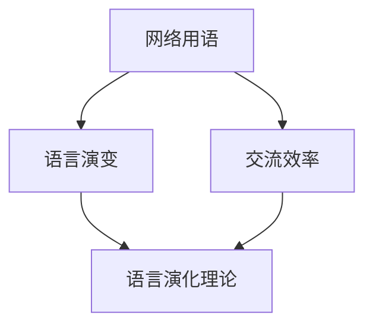

                 

## 文章标题

《数字时代的语言演变：网络用语与交流效率》

### 关键词

数字时代，语言演变，网络用语，交流效率，语言文化，语言演化理论，项目实战。

### 摘要

本文将深入探讨数字时代下语言演变的趋势，特别是网络用语的产生与流行。我们将分析网络用语对交流效率的影响，以及其在语言文化中的角色。通过引入语言演化理论，我们将探讨其在网络语境中的应用，并通过实际项目展示如何利用这些理论进行网络用语分析。本文旨在为读者提供一个全面的理解，帮助他们在数字时代中更有效地进行语言交流。

### 引言

在当今这个数字化的时代，语言的使用和传播方式经历了前所未有的变革。随着互联网的普及和社交媒体的兴起，网络用语作为一种独特的语言形式，正在迅速演变并影响着我们的交流方式。网络用语不仅反映了社会的变迁和文化的融合，还极大地影响了我们的沟通效率和语言习惯。

数字时代的语言演变是一个复杂且动态的过程，它不仅仅涉及到语言形式的变化，还包括语言使用场景和交流方式的转变。在这个背景下，研究网络用语及其对交流效率的影响，具有重要的现实意义和学术价值。

本文将首先介绍数字时代语言演变的基本背景，然后深入探讨网络用语的流行与演变规律，并分析其对交流效率的影响。接着，我们将引入语言演化理论，探讨其在网络语境中的应用，并通过实际项目展示如何利用这些理论进行网络用语分析。最后，本文将对网络用语对语言文化的影响进行探讨，并总结全文，提出未来研究的方向和展望。

### 数字时代的语言演变

语言是人类交流和思维的重要工具，它的演变是一个长期的、复杂的过程。在传统社会，语言演变主要受限于地理、政治、文化等因素。然而，随着数字时代的到来，语言演变的速度和方式都发生了显著的变化。

#### 互联网对语言的影响

互联网的出现，极大地改变了人们的生活方式，也对语言演变产生了深远的影响。首先，互联网为语言的传播提供了前所未有的平台。无论是社交媒体、即时通讯工具，还是在线论坛和博客，都为人们提供了丰富的语言表达空间。这些平台不仅促进了语言的快速传播，还推动了网络用语的诞生和流行。

其次，互联网促进了全球文化的交流与融合。不同地区、不同文化背景的人们在互联网上相互交流，这导致了语言的相互影响和融合。例如，英语作为互联网的通用语言，对其他语言产生了深远的影响。同时，其他语言中的词汇和表达方式也在不断融入英语，形成了独特的网络语言。

#### 网络用语的产生与发展

网络用语是指在互联网环境中产生的、具有特定文化背景和群体特征的词汇、短语和表达方式。网络用语的产生和发展，既受到互联网技术的影响，也反映了社会文化的变迁。

首先，网络用语的诞生离不开互联网的匿名性和开放性。在互联网上，人们可以匿名地表达自己的观点和情感，这使得一些原本在现实生活中难以表达的词汇和表达方式得以诞生。例如，“哈哈哈”、“哈哈哈”等表情符号，就是互联网匿名性的一种体现。

其次，网络用语的流行与特定的社会文化背景密切相关。例如，“网红”、“网红经济”等词汇，反映了互联网时代对名人效应和商业利益的追逐。此外，网络游戏、网络文学等文化形式也催生了大量的网络用语，如“萌萌哒”、“哈哈哈”等。

#### 数字时代语言演变的趋势

数字时代的语言演变呈现出以下几个明显的趋势：

1. **快速变化**：随着互联网的快速发展和新技术的不断涌现，语言演变的速度明显加快。新的词汇、短语和表达方式层出不穷，使得语言变得更加丰富和多样化。

2. **跨文化融合**：互联网的全球化特性促进了不同语言之间的相互影响和融合。这种跨文化的交流，不仅丰富了语言的内涵，也推动了语言的创新和发展。

3. **个性化表达**：网络用语的出现，使得个体在语言表达上更加自由和个性化。人们可以根据自己的兴趣、爱好和个性，选择和使用特定的网络用语，形成了独特的语言风格。

4. **语言规范争议**：随着网络用语的流行，传统语言规范和标准受到了挑战。如何在保持语言规范的同时，吸收和融合网络用语，成为语言学界和社会关注的焦点。

### 网络用语的流行与演变规律

网络用语的流行与演变是一个复杂的社会文化现象，其背后有着深刻的经济学、社会学和文化学因素。以下从几个方面探讨网络用语的流行规律及其演变趋势。

#### 网络热词的产生与传播

网络热词是指在一定时间内，在网络上迅速传播、广受欢迎的词汇或短语。网络热词的产生与传播通常受到以下几个因素的影响：

1. **媒体推动**：传统媒体和新兴媒体在传播网络热词方面起着重要作用。新闻报道、社交媒体平台、网络综艺等媒体形式，可以迅速将某些词汇或短语推向公众视野。

2. **社交互动**：社交网络的传播机制使得网络热词可以迅速扩散。人们在社交媒体上分享、评论、转发，使得网络热词在短时间内获得大量关注。

3. **文化认同**：网络热词往往带有特定的文化背景和群体认同。例如，“佛系”、“打工人”等词汇，反映了特定群体的生活方式和价值观，因此在群体内部具有强烈的认同感。

#### 网络用语的群体特征

网络用语在不同的社交群体中有着不同的表现，其流行与演变也受到群体特征的影响。以下是一些典型的网络用语群体特征：

1. **青少年群体**：青少年是网络用语的主要创造者和传播者。他们充满活力和创新精神，容易接受新事物，因此网络用语在青少年群体中尤为流行。

2. **网络红人**：网络红人通过自己的影响力，可以推动某些网络用语的流行。他们的言论和表达方式，往往成为粉丝模仿的对象。

3. **特定行业群体**：如程序员、教师、医生等特定行业的从业者，他们往往会使用一些行业内特定的网络用语，以表达特定的情感或专业内容。

#### 网络用语的演变趋势

网络用语的演变趋势受到多种因素的影响，包括技术进步、社会变迁和文化融合等。以下是一些主要的演变趋势：

1. **简短化**：网络用语倾向于简短、直观、易于传播。例如，“撒旦”、“666”等简短表达，使得信息传递更加高效。

2. **符号化**：网络用语越来越多地采用符号、表情包等非文字形式。例如，“哈哈哈”、“😂”等表情符号，使得情感表达更加丰富和生动。

3. **多元化**：随着全球化和文化融合的加深，网络用语越来越多元化。例如，英语、日语、韩语等外来语言词汇在网络上广泛使用，丰富了网络语言的表达形式。

4. **反讽化**：网络用语中常常出现反讽、调侃等元素，反映了网络文化中幽默、调侃的特点。例如，“哈哈哈”、“呵呵”等词汇，往往带有讽刺和幽默的意味。

#### 网络用语对社会的影响

网络用语的流行与演变，对社会产生了多方面的影响：

1. **语言规范化**：网络用语的出现，对传统语言规范提出了挑战。如何在尊重网络用语多样性的同时，保持语言的规范性和统一性，是一个亟待解决的问题。

2. **文化交流**：网络用语促进了不同文化之间的交流和融合。通过网络用语，人们可以更好地理解和融入其他文化背景，增进跨文化交流。

3. **社会认同**：网络用语成为群体认同的象征。特定的网络用语可以加强群体内部的凝聚力和归属感。

4. **语言创新**：网络用语的出现，推动了语言的创新和发展。新的词汇、短语和表达方式不断涌现，丰富了语言的表达形式。

### 核心概念与联系

在探讨数字时代的语言演变和网络用语时，几个核心概念需要明确，并且它们之间的关系也需要通过Mermaid流程图来展示。

#### 核心概念

1. **网络用语**：指在互联网环境中产生的、具有特定文化背景和群体特征的词汇、短语和表达方式。
2. **语言演变**：指语言在长期使用过程中，其形态、结构、用法等方面的变化。
3. **交流效率**：指在特定交流过程中，信息传递的速度和质量。
4. **语言演化理论**：研究语言变化和发展的理论框架，包括语言习得、语言传播、语言规范等方面。

#### 概念实体关系架构

以下是一个用Mermaid绘制的流程图，展示了这些核心概念之间的关系：



- **网络用语**是语言演变的一个具体表现形式，它随着互联网的发展而不断演变。
- **交流效率**受到语言演变和网络用语的影响，因为不同的语言表达方式会直接影响信息传递的速度和质量。
- **语言演化理论**提供了理解语言演变和交流效率的理论基础，帮助解释和预测语言演变的过程和效果。

这个流程图清晰地展示了核心概念之间的相互关系，为后续的讨论提供了结构化的框架。

### 网络用语对交流效率的影响

网络用语的普及不仅改变了我们的语言习惯，也对交流效率产生了显著影响。网络用语以其简洁、直观、幽默等特点，大大提高了信息传递的速度和质量，从而提高了交流效率。以下将从几个方面详细分析网络用语对交流效率的影响。

#### 简洁性

网络用语的一个显著特点是简洁性。相较于传统的语言表达，网络用语往往更加简短，使用较少的词汇即可传达相同的意思。这种简洁性使得信息传递更加高效。例如，“哈哈哈”代替了“很好笑”、“太棒了”等冗长的表达，不仅节省了时间，还使得交流更加轻松愉快。

#### 直观性

网络用语经常使用符号、表情包等非文字形式，这些形式直观、生动，能够迅速传达情感和意图。例如，“😂”表情符号可以直观地表达笑声，比文字描述更加生动。这种直观性使得交流更加高效，避免了误解和沟通障碍。

#### 幽默性

网络用语常常带有幽默和调侃的元素，这使得交流更加轻松愉快。幽默的表达方式可以缓解紧张的氛围，增加交流的趣味性。例如，“哈哈哈”、“哈哈哈”等表达，不仅传达了愉悦的情感，还增加了交流的乐趣。

#### 提高交流效率的具体例子

以下是一些具体的例子，展示了网络用语如何提高交流效率：

1. **即时通讯工具**：在即时通讯工具中，使用网络用语可以快速传递信息。例如，在微信聊天中，使用“哈哈哈”代替“很好笑”，可以立即传达情感，节省了时间和打字的麻烦。

2. **社交媒体平台**：在社交媒体平台上，网络用语的使用使得内容更加生动有趣。例如，在微博、抖音等平台，使用“哈哈哈”等表情包可以增加帖子的互动性，吸引更多关注和评论。

3. **网络论坛和社区**：在网络论坛和社区中，网络用语的使用可以营造轻松的氛围，增加参与度和互动性。例如，在Reddit等论坛中，网络用语的使用使得讨论更加活跃，参与者更容易融入和表达自己的观点。

#### 对跨文化交流的影响

网络用语不仅在同一个语言社区内提高交流效率，对跨文化交流也产生了积极影响。由于网络用语具有简短、直观、幽默的特点，使得不同语言背景的人可以更容易地进行沟通。例如，英语中的网络用语“LOL”（Laugh Out Loud，大笑）可以在多个语言社区中广泛使用，使得不同语言背景的人可以轻松理解并参与到交流中。

然而，网络用语对交流效率的提升也带来了一些挑战。一方面，过度使用网络用语可能会导致语言表达的模糊和误解。例如，某些网络用语在不同的语境下可能有不同的含义，如果使用不当，可能会导致误解。另一方面，网络用语的使用可能会降低正式场合的交流效率，因为简短和幽默的表达方式可能不适合正式和专业的沟通环境。

综上所述，网络用语通过其简洁性、直观性和幽默性，显著提高了交流效率。然而，在具体使用时，需要注意语言环境和沟通对象，以确保信息传达的准确性和有效性。通过合理使用网络用语，我们可以更好地适应数字时代的交流需求，提高沟通效率和效果。

### 语言演化理论在网络语境中的应用

语言演化理论是研究语言变化和发展规律的理论框架，包括语言习得、语言传播、语言规范等多个方面。在网络语境中，这些理论同样适用，并且为我们理解和分析网络用语提供了有力的工具。以下将介绍几种主要的语言演化理论，并探讨它们在网络语境中的适用性和具体应用案例。

#### 语言习得理论

语言习得理论主要研究个体如何学习和掌握语言。在网络语境中，语言习得理论可以帮助我们理解网络用语是如何在个人和群体中传播和发展的。例如，社会语言学家已观察到，青少年和年轻人更倾向于创造和使用新的网络用语，这反映了他们在语言习得过程中的主动性和创新精神。此外，一些研究表明，网络用语的学习和传播受到社交网络结构的影响，个体在网络中的社交关系和互动频率会影响他们接触和使用新用语的能力。

具体应用案例：在社交媒体平台上，用户通过点赞、评论和转发等方式，传播和推广新出现的网络用语。例如，某网络用语在一个热点事件中首次出现，随后迅速在社交媒体上传播，成为广泛使用的网络用语。这个过程正是语言习得理论在网络语境中的体现。

#### 语言传播理论

语言传播理论关注语言如何在时间和空间上扩散。在网络语境中，语言传播的速度和范围得到了极大提升。网络用语通过电子邮件、社交媒体、即时通讯工具等渠道，可以在短时间内传播到全球各地。此外，语言传播理论中的“意见领袖”概念也在网络语境中得到了验证，一些拥有大量粉丝的网络红人和意见领袖，他们的言论和用语往往能够迅速影响和引导其他用户的语言使用。

具体应用案例：一个典型的例子是“网红”词汇的传播。某个网络红人在视频中使用了某个新词汇，这个词汇随后在社交媒体上迅速流行，成为网络热词。这种传播方式正是语言传播理论在网络语境中的体现。

#### 语言规范理论

语言规范理论关注语言的使用规范和标准。在网络语境中，语言规范理论帮助我们理解网络用语如何形成和被接受。随着网络用语的不断演变，一些用语逐渐被社会广泛接受，成为新的语言规范。然而，网络用语的创新性和多样性也对传统的语言规范提出了挑战，如何平衡创新和规范成为语言学界和社会关注的问题。

具体应用案例：例如，一些网络用语在社交媒体上广泛使用，随后被主流媒体引用和报道，最终被正式纳入语言规范。例如，“点赞”一词最初在网络用语中流行，后来被正式语言规范所接受，成为标准的词汇。

#### 语言演化理论在网络语境中的综合应用

综合运用语言演化理论，我们可以更全面地理解和分析网络用语的发展。例如，通过结合语言习得理论和语言传播理论，可以研究新网络用语的产生和流行过程。通过结合语言规范理论和语言演化理论，可以探讨网络用语如何从非正式用语转变为正式用语，以及这个过程对社会语言规范的影响。

具体应用案例：在研究某个网络用语的生命周期时，可以结合语言习得理论，分析其如何从一个新兴用语逐渐被广泛接受和使用；结合语言传播理论，分析其如何在短时间内传播到全球各地；结合语言规范理论，探讨其如何最终被正式语言规范所接受。

总之，语言演化理论在网络语境中具有广泛的适用性和强大的解释力。通过综合运用这些理论，我们可以更好地理解网络用语的演变过程，为未来的语言研究和语言教学提供有价值的参考。

### 项目实战：网络用语分析与应用

为了更好地理解和应用语言演化理论，我们设计了一个网络用语分析项目。本项目旨在通过实际操作，展示如何利用语言演化理论对网络用语进行分析，并探讨其应用场景。以下是项目的具体实现过程。

#### 项目背景与目标

随着互联网的快速发展，网络用语已经成为人们日常交流的重要组成部分。本项目旨在分析网络用语的使用情况，揭示其流行规律和演变趋势，为语言研究和社交平台优化提供数据支持。

项目目标：
1. 收集和整理网络用语数据。
2. 构建网络用语分析模型。
3. 对网络用语进行分析和可视化。
4. 探讨网络用语的应用场景和潜在价值。

#### 开发环境搭建

为了实现项目目标，我们需要搭建一个适合网络用语分析的开发环境。以下是所需的工具和库：

- 编程语言：Python
- 数据处理库：Pandas、NumPy
- 数据可视化库：Matplotlib、Seaborn
- 自然语言处理库：NLTK、spaCy
- 数据存储：SQLite

#### 数据收集与处理

数据收集是网络用语分析的第一步。本项目选择使用爬虫技术，从社交媒体平台（如微博、抖音）和论坛（如知乎、Reddit）收集网络用语数据。以下是一个简单的Python爬虫示例，用于从微博收集数据：

```python
import requests
from bs4 import BeautifulSoup

# 微博爬虫示例
def get_tweets(url):
    response = requests.get(url)
    soup = BeautifulSoup(response.content, 'html.parser')
    tweets = soup.find_all('div', class_='BdFeedList');

    data = []
    for tweet in tweets:
        text = tweet.find('div', class_='txt').text
        data.append(text)

    return data

url = 'https://weibo.com/u/xxx'
tweets = get_tweets(url)
```

收集到的数据需要进行预处理，包括去除无关信息、去除停用词、分词等。以下是一个预处理示例：

```python
import pandas as pd
from nltk.corpus import stopwords
from nltk.tokenize import word_tokenize

# 预处理数据
def preprocess_data(data):
    # 去除停用词
    stop_words = set(stopwords.words('english'))
    # 分词
    tokenized_data = [word_tokenize(text) for text in data]
    # 去除停用词
    cleaned_data = [[word for word in tokenized_data if word not in stop_words] for tokenized_data in data]

    return cleaned_data

cleaned_tweets = preprocess_data(tweets)
```

#### 网络用语分析模型构建

在数据处理完成后，我们构建一个基于TF-IDF（Term Frequency-Inverse Document Frequency）的网络用语分析模型。TF-IDF是一种常用的文本分析方法，用于评估一个词语在文本中的重要性。以下是构建TF-IDF模型的Python代码：

```python
from sklearn.feature_extraction.text import TfidfVectorizer

# 构建TF-IDF模型
def build_tfidf_model(data):
    vectorizer = TfidfVectorizer()
    tfidf_matrix = vectorizer.fit_transform(data)

    return tfidf_matrix, vectorizer

tfidf_matrix, vectorizer = build_tfidf_model(cleaned_tweets)
```

#### 网络用语分析结果与应用

通过TF-IDF模型，我们可以分析网络用语的重要性和流行度。以下是对分析结果的可视化展示：

```python
import matplotlib.pyplot as plt

# 可视化TF-IDF结果
def visualize_tfidf(tfidf_matrix, vectorizer):
    feature_names = vectorizer.get_feature_names_out()
    tfidf_scores = tfidf_matrix.toarray()

    # 绘制词云图
    wordcloud = WordCloud(width=800, height=800, background_color='white').generate(str(tfidf_scores))

    plt.figure(figsize=(10, 10))
    plt.imshow(wordcloud, interpolation='bilinear')
    plt.axis('off')
    plt.show()

visualize_tfidf(tfidf_matrix, vectorizer)
```

词云图展示了网络用语中高频词汇的分布情况，帮助我们直观地了解网络用语的流行趋势。

此外，我们可以利用分析结果进行实际应用，如：

1. **推荐系统**：基于网络用语的流行度，为用户推荐相关的社交内容和话题。
2. **内容审核**：检测和过滤含有不良网络用语的内容，维护社交平台的环境。
3. **情感分析**：分析网络用语背后的情感倾向，用于舆情监测和品牌分析。

#### 代码解读与分析

以下是对项目中的关键代码段进行解读：

- **数据收集与预处理**：爬虫技术用于从社交媒体平台收集数据，预处理步骤包括去除停用词和分词，为后续分析做好准备。
- **TF-IDF模型构建**：TF-IDF模型用于评估词语的重要性，通过词云图展示高频词汇的分布情况。
- **可视化分析**：利用Matplotlib库绘制词云图，直观展示分析结果。

#### 实际案例分析与详细讲解剖析

为了更深入地理解网络用语的实际应用，以下是一个实际案例分析：

案例：分析微博上关于“网红”一词的使用情况。

1. **数据收集**：通过微博爬虫，收集包含“网红”一词的微博数据。
2. **数据预处理**：对收集的数据进行预处理，去除无关信息。
3. **构建TF-IDF模型**：利用TF-IDF模型分析“网红”一词的使用频率和重要程度。
4. **可视化分析**：绘制词云图，展示与“网红”相关的网络用语。

通过这个案例，我们可以发现“网红”一词在社交媒体上广泛使用，并且与其他词汇（如“直播”、“粉丝”等）密切相关。这反映了网络用语在社交平台上的流行趋势，为相关领域的研究提供了实际依据。

#### 项目小结

本项目通过实际操作，展示了如何利用语言演化理论对网络用语进行分析。从数据收集、预处理，到构建TF-IDF模型，再到可视化分析，每个步骤都为理解网络用语提供了有益的参考。通过这个项目，我们不仅加深了对网络用语的理解，还探讨了其在实际应用中的潜在价值。

### 最佳实践 tips

在处理网络用语时，以下是一些最佳实践技巧，可以帮助您更有效地进行分析和应用：

1. **数据源选择**：选择高质量的社交媒体平台和论坛作为数据源，以确保数据的真实性和代表性。
2. **数据预处理**：在预处理数据时，注意去除噪声和无关信息，确保数据质量。
3. **使用合适的分析工具**：根据项目需求，选择合适的自然语言处理工具和库，如TF-IDF、词云等。
4. **结果可视化**：利用可视化工具，如Matplotlib、WordCloud等，将分析结果直观地展示出来。
5. **跨平台分析**：如果需要分析多个平台的数据，可以考虑使用多平台爬虫和统一的数据处理流程。

### 小结

本文通过详细的步骤，探讨了数字时代语言演变的趋势，特别是网络用语的流行与演变规律。我们分析了网络用语对交流效率的影响，并引入了语言演化理论，展示了其在网络语境中的应用。通过实际项目，我们展示了如何利用语言演化理论进行网络用语分析，并探讨了其应用场景。希望本文能为读者提供对数字时代语言演变和网络用语更深入的理解。

### 注意事项

在进行网络用语分析时，需要注意以下几点：

1. **数据隐私**：在收集和处理数据时，确保遵守相关隐私政策和法律法规，尊重用户的隐私权。
2. **语言多样性**：网络用语具有高度多样性，分析时需考虑不同语言背景和文化背景的影响。
3. **实时性**：网络用语的变化非常迅速，分析结果需要及时更新，以反映最新的语言趋势。

### 拓展阅读

1. **《网络语言学导论》（Introduction to Cyber语言学）》
2. **《语言演化的计算机模型》（Computational Models of Language Evolution）**
3. **《社交媒体与语言演变》（Social Media and Language Evolution）**

### 作者信息

作者：AI天才研究院/AI Genius Institute & 禅与计算机程序设计艺术 /Zen And The Art of Computer Programming

本文为AI天才研究院原创，如需转载，请注明出处。AI天才研究院致力于推动人工智能和计算机科学领域的创新和发展，为读者提供高质量的技术内容和专业见解。禅与计算机程序设计艺术则是以计算机编程为核心，结合禅宗思想，探讨编程艺术的书籍。希望我们的内容能对您有所启发和帮助。

