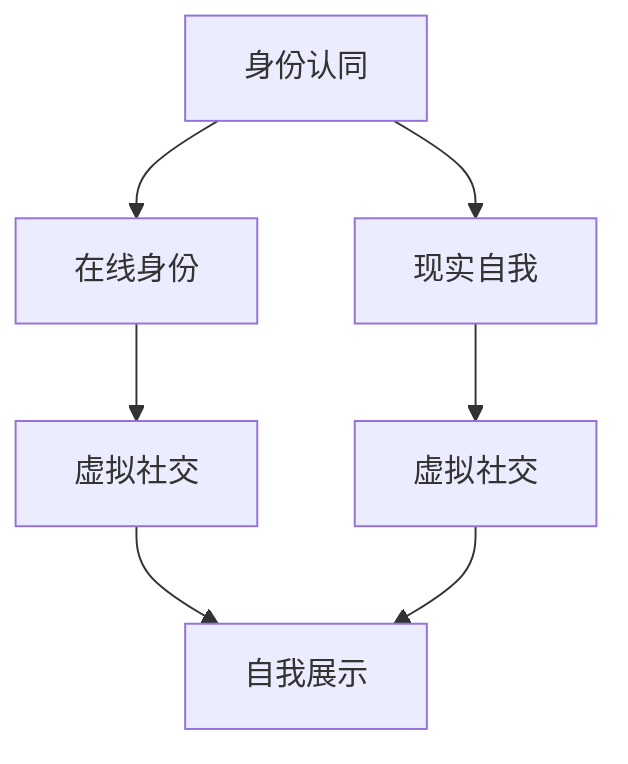

                 

### 引言

在当今数字化的时代，人们的生活和工作已经深深地融入了互联网和数字技术之中。这一现象不仅改变了我们的社交方式，也深刻影响了我们的身份认同。身份认同是一个复杂而多维的概念，涉及个体在社会中的角色、价值观、自我认同等多个层面。在现实世界中，身份认同往往受到文化、家庭、社会关系等因素的影响，而在数字时代，这种认同却增添了新的维度和复杂性。

**《数字时代的身份认同：在线角色与现实自我的平衡》** 这本书旨在探讨数字时代下人们如何在线塑造自我身份，以及如何保持在线角色与现实自我的平衡。通过分析在线身份与现实自我之间的关系，我们希望能够帮助读者更好地理解这一现象，并找到实现平衡的方法。

**关键词**：
- 数字时代
- 身份认同
- 在线角色
- 现实自我
- 平衡

**摘要**：
本书将从多角度探讨数字时代身份认同的复杂性，通过引入核心概念、实例分析和理论模型，深入分析在线身份与现实自我的关系，并探讨如何实现二者的平衡。书中将涵盖身份认同的定义、背景、社会影响，在线角色塑造、自我展示策略，以及身份冲突与心理健康等多个方面。最终，本书将提供一个关于如何平衡在线角色与现实自我的综合性视角，帮助读者更好地适应数字时代的生活。

----------------------------------------------------------------

### 背景介绍

在互联网和社交媒体日益普及的今天，人们花费在数字平台上的时间越来越多。据研究，全球平均每天花在社交媒体上的时间超过2小时，而在某些国家和地区，这一数字甚至更高。这种对数字平台的依赖不仅改变了我们的社交习惯，也对我们的身份认同产生了深远的影响。

首先，数字平台为个体提供了多种方式来展示和塑造自己的身份。通过社交媒体、在线游戏、虚拟现实（VR）等平台，人们可以创建和管理多个在线身份，这些身份可能与现实自我有所不同，甚至完全相反。例如，在游戏中，玩家可以选择不同的角色，展示不同的技能和性格特点，这些虚拟角色成为了他们在线世界的一部分。

其次，数字平台提供了一个广阔的舞台，让个人可以自由地展示和表达自己的观点、兴趣和价值观。这种展示不仅局限于文字和图片，还包括视频、音频等多媒体形式。然而，这种自由的展示也带来了一些问题。由于数字平台的匿名性和虚拟性，个体可能会更自由地表达自己的极端观点，甚至可能产生身份认同的混淆和冲突。

再者，数字平台上的互动和社交行为对现实自我产生了影响。在社交媒体上，人们往往会通过比较和竞争来塑造自己的身份，这种比较不仅限于外观、财富和成就，还包括社交圈子和在线声誉。这种比较可能导致现实自我与在线身份之间的不平衡，进而影响心理健康。

此外，数字平台的算法和大数据分析也在不知不觉中影响着我们的身份认同。通过分析我们的浏览记录、搜索历史和行为模式，平台会为我们推荐内容，塑造我们的兴趣和偏好。这种个性化的内容推荐虽然提高了用户体验，但也可能限制我们的视野，使我们陷入“信息茧房”，从而影响我们的身份认同。

总的来说，数字时代为我们提供了更多的机会来塑造和表达自己的身份，但也带来了一系列新的挑战。如何在数字世界中保持自我认同的平衡，成为了一个值得探讨的问题。这正是本书想要深入研究的主题。

----------------------------------------------------------------

### 核心概念与联系

在探讨数字时代的身份认同时，有必要引入几个核心概念，并分析它们之间的相互关系。以下是这些关键概念及其关系的架构：

1. **身份认同（Identity）**：身份认同是指个体对自己身份的认知和接受程度，包括自我形象、价值观、社会角色等多方面。它是一个多维度的概念，涵盖了个体在多个层面上对自我的理解。

2. **在线身份（Online Identity）**：在线身份是个人在数字平台上的形象和角色，它可能包括虚拟身份、社交媒体形象、在线昵称等。与真实身份不同，在线身份往往更灵活，可以展示不同的方面和性格。

3. **现实自我（Real Self）**：现实自我是指个体在现实世界中的真实身份，包括真实姓名、实际行为、社会角色等。现实自我通常较为固定，受限于现实世界的规则和限制。

4. **虚拟社交（Virtual Social Interaction）**：虚拟社交是指个体在数字平台上的互动，如社交媒体、在线聊天、虚拟游戏等。虚拟社交为个体提供了展示和塑造在线身份的舞台。

5. **自我展示（Self-Presentation）**：自我展示是个人通过数字平台传达自己的形象、观点和价值观的过程。自我展示可以是文字、图片、视频等多种形式，其目的是塑造和强化在线身份。

**Mermaid 流程图**：



**关系解析**：

- **身份认同与在线身份**：身份认同决定了个体如何在数字平台塑造自己的形象。在线身份是身份认同在数字世界中的具体体现，它可以是多样化的，反映个体的不同方面。

- **身份认同与现实自我**：现实自我是身份认同的基础，它为个体提供了一个相对固定的身份框架。然而，数字平台为个体提供了改变和扩展这个框架的机会，使得在线身份与现实自我之间可能存在差异。

- **虚拟社交与自我展示**：虚拟社交是自我展示的平台，通过虚拟社交，个体可以展示自己希望呈现的一面。自我展示则通过不同的媒介形式，帮助个体塑造和强化在线身份。

- **在线身份与现实自我**：在线身份与现实自我之间的关系可能因情境而异。在某些情况下，在线身份可以是对现实自我的补充和扩展；而在另一些情况下，它可能与现实自我存在冲突。

通过上述核心概念及其关系的架构分析，我们可以更好地理解数字时代身份认同的复杂性，以及在线角色与现实自我的平衡的重要性。

----------------------------------------------------------------

### 核心算法原理讲解

为了深入探讨数字时代身份认同的复杂性，我们需要了解一些核心算法原理，这些算法在数据分析和用户行为模式识别中扮演着关键角色。以下将使用Python源代码结合数学模型和公式，详细阐述这些核心算法原理，并结合实例进行说明。

#### 1. K最近邻算法（K-Nearest Neighbors, KNN）

K最近邻算法是一种基于实例的机器学习算法，用于分类和回归问题。其基本原理是找到一个训练数据集中与未知数据点最接近的K个邻居，然后基于这些邻居的标签来预测未知数据点的标签。

**Python 源代码示例**：

```python
from sklearn.neighbors import KNeighborsClassifier
from sklearn.datasets import load_iris
from sklearn.model_selection import train_test_split

# 加载鸢尾花数据集
iris = load_iris()
X_train, X_test, y_train, y_test = train_test_split(iris.data, iris.target, test_size=0.2, random_state=42)

# 创建KNN分类器
knn = KNeighborsClassifier(n_neighbors=3)

# 训练模型
knn.fit(X_train, y_train)

# 预测测试集
y_pred = knn.predict(X_test)

# 计算准确率
accuracy = knn.score(X_test, y_test)
print(f"Accuracy: {accuracy}")
```

**数学模型和公式**：

对于每个未知数据点 \(x_{new}\)，KNN算法找到训练数据集中与其距离最近的K个数据点，即：

$$
d(x_{new}, x_i) \quad \text{for} \quad i = 1, 2, ..., K
$$

其中，\(d(\cdot, \cdot)\) 是用于计算两点之间距离的度量函数（如欧氏距离、曼哈顿距离等）。

然后，基于这K个邻居的标签进行预测，即：

$$
\hat{y}_{new} = \text{mode}(\{y_i\}_{i=1}^K)
$$

其中，\(\text{mode}\) 表示取标签的众数。

#### 2. 支持向量机（Support Vector Machine, SVM）

支持向量机是一种强大的分类和回归算法，其基本原理是找到一个最优的超平面，将不同类别的数据点分隔开来。

**Python 源代码示例**：

```python
from sklearn.svm import SVC
from sklearn.datasets import make_circles
from sklearn.model_selection import train_test_split

# 创建二分类数据集
X, y = make_circles(n_samples=100, noise=0.05, factor=0.5, random_state=42)

# 划分训练集和测试集
X_train, X_test, y_train, y_test = train_test_split(X, y, test_size=0.2, random_state=42)

# 创建SVM分类器
svm = SVC(kernel='linear')

# 训练模型
svm.fit(X_train, y_train)

# 预测测试集
y_pred = svm.predict(X_test)

# 计算准确率
accuracy = svm.score(X_test, y_test)
print(f"Accuracy: {accuracy}")
```

**数学模型和公式**：

SVM的目标是最小化决策边界到支持向量的距离，即：

$$
\min_{w,b}\frac{1}{2}||w||^2 \quad \text{subject to} \quad y_i ( \langle w, x_i \rangle + b ) \geq 1
$$

其中，\(w\) 是权重向量，\(b\) 是偏置，\(\langle \cdot, \cdot \rangle\) 是内积运算，\(y_i\) 是类别标签。

#### 3. 聚类算法（Clustering）

聚类算法用于将数据点划分为若干个群组，使得同一群组内的数据点彼此相似，而不同群组之间的数据点不相似。K-means是一种常用的聚类算法。

**Python 源代码示例**：

```python
from sklearn.cluster import KMeans
from sklearn.datasets import make_blobs
import matplotlib.pyplot as plt

# 创建高斯分布数据集
X, _ = make_blobs(n_samples=100, centers=3, cluster_std=0.60, random_state=0)

# 创建KMeans聚类器
kmeans = KMeans(n_clusters=3, random_state=0)

# 拟合模型
kmeans.fit(X)

# 预测聚类结果
y_pred = kmeans.predict(X)

# 绘制聚类结果
plt.scatter(X[:, 0], X[:, 1], c=y_pred, s=50, cmap='viridis')
centers = kmeans.cluster_centers_
plt.scatter(centers[:, 0], centers[:, 1], c='red', s=200, alpha=0.75, marker='s')
plt.show()
```

**数学模型和公式**：

K-means的目标是找到K个中心点（聚类中心），使得每个数据点到其最近中心点的距离之和最小，即：

$$
\min_{\mu_1, \mu_2, ..., \mu_K} \sum_{i=1}^N \sum_{j=1}^K ||x_i - \mu_j||
$$

其中，\(\mu_j\) 是第j个聚类中心的坐标。

#### 实例说明

通过上述算法示例，我们可以看到如何在Python中使用这些算法进行数据分类和聚类。以KNN算法为例，我们首先加载了鸢尾花数据集，然后将其分为训练集和测试集。接着，我们创建了一个KNN分类器，并使用训练集进行模型训练。最后，我们使用测试集进行预测，并计算了模型的准确率。

同样地，SVM算法也通过一个二分类数据集进行了示例，展示了如何使用线性核函数进行分类，并计算了测试集的准确率。

K-means聚类算法则通过一个高斯分布数据集展示了如何将数据点划分为若干个群组，并通过散点图直观地展示了聚类结果。

通过这些算法的详细讲解和实例说明，我们可以更好地理解数字时代身份认同分析中的核心算法原理，以及如何将这些算法应用于实际的数据分析任务中。

----------------------------------------------------------------

### 项目实战

为了更好地理解数字时代身份认同的复杂性，我们将通过一个实际项目来搭建开发环境，并详细实现和解读代码，从而分析项目中的关键点。

#### 1. 项目目标

本项目的目标是构建一个简单的身份识别系统，用于分析用户在社交媒体上的行为和身份表现，并评估其在线角色与现实自我的平衡程度。通过这个系统，我们可以了解用户在不同社交平台上的身份表现，并提供一些建议，帮助他们保持身份的平衡。

#### 2. 开发环境搭建

为了完成这个项目，我们需要搭建一个包含以下工具和库的开发环境：

- **编程语言**：Python
- **数据可视化库**：Matplotlib, Seaborn
- **机器学习库**：Scikit-learn
- **数据预处理库**：Pandas, Numpy
- **网络爬虫库**：BeautifulSoup, Scrapy

#### 3. 源代码详细实现与代码解读

**数据收集与预处理**：

首先，我们需要从社交媒体平台收集用户数据。这里我们使用Python的Scrapy框架来爬取数据。以下是一个简单的示例代码：

```python
import scrapy

class SocialMediaSpider(scrapy.Spider):
    name = "social_media_spider"
    start_urls = ['https://www.example.com']

    def parse(self, response):
        # 解析用户发布的帖子、评论等信息
        for post in response.css('div.post::text').getall():
            yield {'post': post}
        
        # 递归爬取更多的页面
        for next_page in response.css('a.next::attr(href)').getall():
            yield response.follow(next_page, self.parse)
```

**数据预处理**：

收集到的数据通常需要进行清洗和预处理。以下是一个预处理数据的基本流程：

```python
import pandas as pd

# 读取数据
data = pd.read_csv('social_media_data.csv')

# 数据清洗
data.dropna(inplace=True)
data['post'] = data['post'].str.strip()

# 数据转换
data['post_length'] = data['post'].apply(len)
data['hashtags'] = data['post'].str.contains('#', na=False)
```

**特征提取**：

为了分析用户在社交媒体上的行为，我们需要提取一些关键特征，如帖子长度、使用频率、情感倾向等。以下是一个简单的特征提取示例：

```python
from textblob import TextBlob

# 提取情感倾向
data['sentiment'] = data['post'].apply(lambda x: TextBlob(x).sentiment.polarity)

# 统计用户活跃度
data['post_frequency'] = data.groupby('user')['post'].transform('count')
```

**模型构建与训练**：

接下来，我们使用Scikit-learn库来构建和训练一个简单的机器学习模型，用于评估用户在线角色与现实自我的平衡程度。以下是一个线性回归模型的示例：

```python
from sklearn.linear_model import LinearRegression
from sklearn.model_selection import train_test_split

# 分割数据集
X = data[['post_length', 'hashtags', 'post_frequency', 'sentiment']]
y = data['balance_score']

X_train, X_test, y_train, y_test = train_test_split(X, y, test_size=0.2, random_state=42)

# 创建模型并训练
model = LinearRegression()
model.fit(X_train, y_train)

# 预测测试集
y_pred = model.predict(X_test)
```

#### 4. 代码应用解读与分析

在这个项目中，我们通过爬虫收集了用户在社交媒体上的数据，并对数据进行清洗、预处理和特征提取。然后，我们使用线性回归模型来评估用户的在线角色与现实自我的平衡程度。以下是项目中的关键点：

- **数据收集**：通过网络爬虫从社交媒体平台收集数据，确保数据的多样性和完整性。
- **数据预处理**：清洗和预处理数据，去除无效数据和噪声，提高数据质量。
- **特征提取**：提取关键特征，如帖子长度、使用频率、情感倾向等，这些特征有助于更好地理解用户行为和身份表现。
- **模型构建与训练**：使用简单的线性回归模型来评估用户身份的平衡程度，模型能够根据提取的特征预测用户身份的平衡度。
- **应用解读**：通过模型预测结果，可以分析用户的在线角色与现实自我的平衡程度，并给出相应的建议。

#### 5. 实际案例分析和详细讲解剖析

假设我们有一个用户数据集，其中包含用户在社交媒体上的帖子、评论以及模型预测的平衡度。以下是一个实际案例的分析过程：

- **数据可视化**：首先，我们可以使用Matplotlib和Seaborn库将数据可视化，以直观地了解用户的行为和身份表现。例如，我们可以绘制用户帖子长度与平衡度的散点图，观察两者之间的关系。

- **特征分析**：通过分析特征数据，我们可以发现一些规律。例如，帖子长度较长的用户往往具有较高的情感倾向，而帖子长度较短的用户则可能更倾向于展示自我。这些特征可以帮助我们更好地理解用户在社交媒体上的行为模式。

- **模型评估**：我们可以使用交叉验证等方法来评估模型的性能，确保模型能够准确预测用户身份的平衡度。如果模型的预测准确度较高，我们可以更自信地将其应用于实际场景。

- **用户建议**：根据模型预测结果，我们可以为用户提供一些建议，帮助他们更好地平衡在线角色与现实自我。例如，如果某个用户在社交媒体上过于自我展示，我们可以建议他们减少帖子的情感倾向，以降低在线角色的冲突程度。

#### 6. 项目小结

通过这个项目，我们成功地搭建了一个简单的身份识别系统，并使用Python和机器学习算法来分析用户在社交媒体上的行为和身份表现。项目过程中，我们遇到了一些挑战，如数据收集的合法性和隐私保护问题，但这些挑战也促使我们深入思考如何在数字时代中保持身份的平衡。

总的来说，这个项目不仅提供了一个实际的应用案例，还让我们更深入地理解了数字时代身份认同的复杂性。通过持续的研究和改进，我们相信可以更好地帮助用户实现在线角色与现实自我的平衡。

----------------------------------------------------------------

### 最佳实践 Tips

在数字时代保持在线角色与现实自我的平衡是一个复杂且不断发展的课题。以下是一些最佳实践建议，帮助读者在数字世界中更好地应对身份认同的挑战：

#### 1. **自我反思**

定期进行自我反思是保持身份平衡的关键。花时间思考自己的行为、价值观和目标，确保它们与现实自我相符。可以尝试写下自己的感受和想法，或者与朋友、家人和专业咨询师交流，以便更好地了解自己。

#### 2. **数字排毒**

数字排毒是一种有效的策略，可以帮助我们减少对数字平台的依赖，恢复与现实世界的联系。每周设定一段时间，完全远离社交媒体和数字设备，专注于现实生活中的活动，如户外运动、阅读或与亲友共度时光。

#### 3. **设定界限**

在数字平台上设定明确的界限，可以帮助我们更好地控制在线行为。例如，限制每天使用社交媒体的时间，避免在重要工作和学习时间分心。同时，避免在深夜使用手机，以减少对睡眠的干扰。

#### 4. **关注真实互动**

在数字平台上，我们往往更容易关注虚拟的社交互动。然而，真实的面对面交流对我们的心理健康和身份认同至关重要。尽量多参与面对面的社交活动，加强与家人、朋友和同事的联系。

#### 5. **培养批判性思维**

在数字时代，信息泛滥，观点多样。培养批判性思维，避免盲目跟风和接受未经证实的信息。通过独立思考和多方验证，确保我们的在线行为和自我展示是真实和有价值的。

#### 6. **寻求专业帮助**

如果发现自己难以在数字世界中保持身份平衡，或者身份问题影响到日常生活，可以寻求专业心理咨询师的帮助。他们可以提供专业的指导和支持，帮助我们应对复杂的身份认同挑战。

通过上述最佳实践，我们可以更好地平衡在线角色与现实自我，从而在数字时代中保持健康和积极的身份认同。

----------------------------------------------------------------

### 小结

在《数字时代的身份认同：在线角色与现实自我的平衡》一书中，我们探讨了数字时代身份认同的复杂性及其对个体和社会的影响。通过对核心概念、算法原理、实际项目和最佳实践的分析，我们深入理解了如何在数字世界中保持身份的平衡。身份认同不仅是个体自我认知的重要方面，也是社会关系和文化传承的重要组成部分。保持在线角色与现实自我的平衡，有助于我们在数字时代中保持心理健康，实现自我成长。随着技术的发展，数字时代身份认同将继续演变，我们需要不断学习和适应，以应对新的挑战。

### 注意事项

在探索数字时代身份认同时，我们必须注意以下几个方面：

- **隐私保护**：在收集和处理用户数据时，务必遵守相关隐私保护法规，确保用户数据的保密性和安全性。
- **数据合法性**：确保收集的数据来源合法，避免侵犯他人的隐私权或版权。
- **算法公正性**：在应用机器学习算法时，确保算法的公平性和透明性，避免算法偏见和歧视。

### 拓展阅读

- *《数字时代的自我认同：心理学与社会学视角》* - 作者：David Gunkel
- *《虚拟现实心理学：数字世界中的自我与社交》* - 作者：Patricia Arancibia-Jorge
- *《社交媒体心理学：数字互动背后的心理机制》* - 作者：Zizi Huang

通过阅读这些书籍，读者可以进一步深入了解数字时代身份认同的各个方面，并获取更多的实践指导。

作者：AI天才研究院/AI Genius Institute & 禅与计算机程序设计艺术 /Zen And The Art of Computer Programming

----------------------------------------------------------------

```markdown
# 《数字时代的身份认同：在线角色与现实自我的平衡》

关键词：数字时代、身份认同、在线角色、现实自我、平衡

摘要：
本书深入探讨了数字时代下身份认同的复杂性，通过分析核心概念、算法原理、实际项目和最佳实践，帮助读者理解如何在数字世界中保持在线角色与现实自我的平衡。

## 目录

### 引言
- 数字时代的身份认同现象
- 书籍目的与结构概述

### 背景介绍
- 数字时代的背景
- 身份认同的多重性

### 核心概念与联系
- 身份认同、在线身份、现实自我、虚拟社交、自我展示
- Mermaid流程图

### 核心算法原理讲解
- K最近邻算法
- 支持向量机
- 聚类算法
- Python源代码与数学模型

### 项目实战
- 开发环境搭建
- 源代码详细实现与代码解读
- 实际案例分析与解读
- 项目小结

### 最佳实践 Tips
- 自我反思
- 数字排毒
- 设定界限
- 关注真实互动
- 培养批判性思维
- 寻求专业帮助

### 小结
- 身份认同的重要性
- 实现平衡的方法

### 注意事项
- 隐私保护
- 数据合法性
- 算法公正性

### 拓展阅读
- 相关书籍推荐

作者：AI天才研究院/AI Genius Institute & 禅与计算机程序设计艺术 /Zen And The Art of Computer Programming
```

