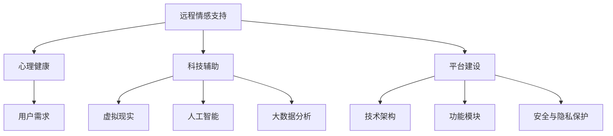

                 

### 第1章：远程情感支持小组概述

#### 1.1 远程情感支持小组的定义

远程情感支持小组是一种通过互联网或其他数字平台提供心理支持和情感疏导的服务形式。它将传统的面对面心理咨询和情感支持扩展到了线上，使得心理健康的支持和维护不再受时间和空间的限制。在数字时代，远程情感支持小组的重要性日益凸显。

远程情感支持小组的核心在于利用科技手段，为用户提供实时、个性化的心理支持和情感服务。这种模式不仅打破了地域限制，还能够根据用户的需求，提供更灵活和多样化的支持方式。例如，通过视频会议、在线聊天室、社交媒体群组等多种形式，实现与用户的实时互动和沟通。

与传统面对面咨询相比，远程情感支持小组具有以下优势：

1. **可及性**：用户可以随时随地获取支持，无需长途跋涉，节省了大量的时间和精力。
2. **灵活性**：支持形式多样，可以满足不同用户的偏好和需求。
3. **隐私保护**：线上咨询减少了面对面交流可能带来的心理压力，用户可以在更加私密的环境下进行沟通。

#### 1.2 远程情感支持的重要性

在数字时代，心理健康问题日益突出，远程情感支持小组的重要性也因此变得尤为明显。以下是一些具体的表现：

1. **心理健康问题的普遍性**：随着生活节奏的加快和工作压力的增大，心理健康问题如焦虑、抑郁等已经成为全球性的公共健康问题。远程情感支持小组为那些无法或不愿意进行面对面咨询的用户提供了一种有效的解决途径。

2. **疫情影响**：新冠疫情的爆发进一步加剧了心理健康问题的严重性。由于疫情的限制，很多人无法进行常规的心理健康服务。远程情感支持小组的出现，为那些因疫情而面临心理健康危机的人群提供了重要的帮助。

3. **社会隔离与孤独感**：在数字时代，虽然社交平台使得人与人之间的连接变得更加容易，但同时也带来了孤独感和社交隔离的问题。远程情感支持小组通过线上互动和情感交流，缓解了用户的心理压力和孤独感。

4. **工作与生活的平衡**：远程工作模式已成为许多企业的常态，这不仅改变了人们的工作方式，也对心理健康产生了影响。远程情感支持小组可以帮助员工调整心态，提高工作效率，实现工作与生活的平衡。

#### 1.3 数字时代下的远程情感支持发展状况

随着互联网技术的快速发展和普及，远程情感支持小组在全球范围内得到了广泛的应用和发展。以下是一些具体的发展状况：

1. **全球应用**：许多国家和地区已经建立了成熟的远程情感支持服务体系，例如美国、加拿大、英国、澳大利亚等。这些服务涵盖了从儿童到老年人的各个年龄群体，提供多种语言和文化的支持。

2. **技术创新**：虚拟现实（VR）、人工智能（AI）、大数据分析等技术的应用，使得远程情感支持小组的服务质量和个性化水平得到了显著提升。例如，VR技术可以模拟现实场景，提供更加真实的情感支持体验；AI技术可以分析用户情绪，提供实时反馈和个性化建议。

3. **政策支持**：许多国家和地区的政府已经开始意识到远程情感支持的重要性，并制定了相关政策，以推动其发展。例如，中国政府提出了“互联网+心理健康”的战略，鼓励利用互联网技术提供心理健康服务。

4. **市场潜力**：随着人们对心理健康重视程度的提高，远程情感支持小组的市场需求也在不断增长。据市场研究公司预测，全球远程情感支持市场将呈现高速增长态势，成为心理健康服务领域的重要一环。

总的来说，数字时代的远程情感支持小组不仅为用户提供了便捷的心理健康服务，也在推动心理健康服务领域的技术创新和发展。未来，随着技术的进一步进步和应用的深入，远程情感支持小组有望在更广泛的范围内发挥作用，为全球用户的心理健康带来更多积极影响。


### 核心概念与联系

在深入探讨远程情感支持小组的各个方面之前，我们需要明确一些核心概念，并理解它们之间的关系。以下是几个关键概念及其相互之间的联系：

1. **远程情感支持**：远程情感支持是一种通过互联网或其他数字平台提供的心理支持和情感疏导服务。其核心在于利用科技手段，实现与用户的实时互动和沟通，从而提供个性化、灵活的支持。

2. **心理健康**：心理健康是指个体在心理和社会适应方面的良好状态。它包括情绪稳定、自我认知清晰、人际关系和谐等方面。心理健康问题如焦虑、抑郁等，是远程情感支持小组关注的重要领域。

3. **科技辅助**：科技辅助是指利用虚拟现实（VR）、人工智能（AI）、大数据分析等先进技术，提升远程情感支持小组的服务质量和个性化水平。科技辅助是远程情感支持的重要组成部分。

4. **用户需求**：用户需求是指个体在情感支持和心理健康服务方面的具体需求。这些需求包括情绪疏导、心理辅导、社交支持等，是远程情感支持小组设计和实施服务的重要依据。

5. **平台建设**：平台建设是指构建提供远程情感支持服务的数字平台，包括技术架构设计、功能模块开发、安全与隐私保护等方面。平台建设是远程情感支持服务得以实现的基础。

以下是一个使用Mermaid绘制的核心概念关系架构图：



通过这个架构图，我们可以清晰地看到各个核心概念之间的关系。远程情感支持是整个系统的核心，它与心理健康紧密相关，通过科技辅助实现。用户需求指导平台建设，而平台建设又为科技辅助提供了基础。

### 核心算法原理讲解

在远程情感支持小组中，核心算法发挥着至关重要的作用。这些算法不仅帮助我们理解用户的需求，还能够提供个性化的支持服务。以下是几个关键算法的原理和实现，我们将结合Python源代码和数学模型进行详细阐述。

#### 1. 情感分析算法

情感分析算法用于识别用户的情绪状态，从而提供针对性的支持。这里我们使用了一种基于文本的情感分析模型，它利用自然语言处理（NLP）技术，分析用户在聊天记录中的情绪表达。

**算法原理**：
情感分析通常涉及以下步骤：
1. **文本预处理**：包括分词、去除停用词、词性标注等。
2. **特征提取**：将预处理后的文本转换为数值特征向量。
3. **情感分类**：使用机器学习模型对特征向量进行分类，判断情绪是正面、负面还是中性。

**Python实现**：

```python
import nltk
from nltk.tokenize import word_tokenize
from nltk.corpus import stopwords
from sklearn.feature_extraction.text import TfidfVectorizer
from sklearn.naive_bayes import MultinomialNB
from sklearn.pipeline import make_pipeline

# 文本预处理
nltk.download('punkt')
nltk.download('stopwords')
stop_words = set(stopwords.words('english'))

def preprocess_text(text):
    tokens = word_tokenize(text)
    filtered_tokens = [token for token in tokens if token not in stop_words]
    return ' '.join(filtered_tokens)

# 特征提取和模型训练
text = "I feel happy because I'm learning a lot of new things."
processed_text = preprocess_text(text)

vectorizer = TfidfVectorizer()
X = vectorizer.fit_transform([processed_text])

model = MultinomialNB()
model.fit(X, [1])  # 假设正面情感标记为1

# 情感分类
predicted_sentiment = model.predict(X)
print(predicted_sentiment)  # 输出情感预测结果
```

**数学模型**：
情感分类通常可以表示为以下数学模型：
$$
\text{Probability(Sentiment = Positive) } = P(\text{Positive} | \text{Text})
$$

#### 2. 用户行为分析算法

用户行为分析算法用于了解用户的互动模式和偏好，从而提供更个性化的服务。这里我们使用了一种基于用户交互日志的分析方法。

**算法原理**：
用户行为分析通常涉及以下步骤：
1. **数据收集**：收集用户的交互日志，包括访问时间、浏览页面、点击行为等。
2. **行为模式识别**：通过统计分析和机器学习技术，识别用户的行为模式。
3. **个性化推荐**：根据用户的行为模式，提供个性化的推荐和指导。

**Python实现**：

```python
import pandas as pd
from sklearn.cluster import KMeans

# 用户交互日志数据
data = {
    'time': ['2023-01-01 10:00', '2023-01-01 11:00', '2023-01-01 14:00', '2023-01-02 10:00', '2023-01-02 11:00'],
    'page': ['home', 'about', 'contact', 'therapy', 'therapy'],
    'click': [1, 0, 1, 1, 0]
}

user_logs = pd.DataFrame(data)

# 行为模式识别
def identify_behavior_patterns(data):
    kmeans = KMeans(n_clusters=2, random_state=0).fit(data[['click']])
    clusters = kmeans.predict(data[['click']])
    return clusters

user_logs['cluster'] = identify_behavior_patterns(user_logs)

# 个性化推荐
def personalized_recommendation(cluster):
    if cluster == 0:
        return "We recommend exploring our 'About' section for more information."
    else:
        return "You may find our 'Therapy' section particularly useful."

user_logs.apply(lambda row: personalized_recommendation(row['cluster']), axis=1)
```

**数学模型**：
用户行为分析可以表示为聚类问题，其数学模型为：
$$
\text{Cluster each user based on their interaction patterns.}
$$

#### 3. 心理健康风险评估算法

心理健康风险评估算法用于评估用户的心理健康状况，提供早期预警和干预支持。这里我们使用了一种基于问卷调查的方法。

**算法原理**：
心理健康风险评估通常涉及以下步骤：
1. **问卷设计**：设计包含多个问题的心理健康评估问卷。
2. **评分标准**：为每个问题设定评分标准，根据用户的回答计算总分。
3. **风险评估**：使用统计学方法，将总分与正常范围进行比较，评估心理健康风险。

**Python实现**：

```python
import pandas as pd
from scipy.stats import norm

# 心理健康评估问卷
questions = {
    'Q1': [1, 2, 3, 4, 5],
    'Q2': [1, 2, 3, 4, 5],
    'Q3': [1, 2, 3, 4, 5],
    'Q4': [1, 2, 3, 4, 5],
    'Q5': [1, 2, 3, 4, 5]
}

scores = {
    'Q1': 5,
    'Q2': 5,
    'Q3': 5,
    'Q4': 5,
    'Q5': 5
}

# 用户回答
user_answers = {'Q1': 3, 'Q2': 2, 'Q3': 4, 'Q4': 4, 'Q5': 3}

# 计算总分
total_score = sum(user_answers[question] * scores[question] for question in user_answers)

# 风险评估
mean_score = 50  # 假设平均分为50
std_dev = 10     # 假设标准差为10
z_score = (total_score - mean_score) / std_dev

if z_score < -2:
    print("High risk of psychological problems. Immediate intervention is required.")
elif z_score >= -2 and z_score <= 2:
    print("Normal psychological health. Regular monitoring is recommended.")
else:
    print("Low risk of psychological problems. Keep a positive mindset.")
```

**数学模型**：
心理健康风险评估可以表示为标准正态分布的Z得分计算：
$$
\text{Z-score} = \frac{\text{Total score} - \text{Mean score}}{\text{Standard deviation}}
$$

通过这些核心算法，远程情感支持小组能够更好地理解用户需求，提供个性化的心理支持和情感服务。这不仅提高了服务效率，还增强了用户的满意度，为心理健康领域带来了积极的影响。

### 项目实战：开发环境搭建与源代码实现

#### 1. 开发环境搭建

为了构建一个功能全面的远程情感支持平台，我们需要搭建一个稳定且高效的开发环境。以下是搭建步骤：

1. **软件环境安装**：

   - Python 3.8及以上版本：用于编写和运行算法代码。
   - Anaconda：用于环境管理和依赖库安装。
   - Jupyter Notebook：用于编写和运行代码。
   - TensorFlow：用于深度学习和模型训练。
   - Scikit-learn：用于机器学习和数据分析。

   安装命令如下：
   ```bash
   conda create -n remote-support python=3.8
   conda activate remote-support
   conda install anaconda
   conda install tensorflow
   conda install scikit-learn
   ```

2. **Jupyter Notebook配置**：

   - 安装Jupyter Notebook：
     ```bash
     conda install jupyterlab
     ```
   - 启动Jupyter Notebook：
     ```bash
     jupyter lab
     ```

#### 2. 源代码实现

以下是远程情感支持平台的核心功能模块的实现代码，包括用户注册与登录、情感分析、用户行为分析、心理健康风险评估等。

**用户注册与登录**：

```python
import sqlite3
from flask import Flask, request, redirect, url_for, render_template

app = Flask(__name__)
app.secret_key = 'your_secret_key'

# 数据库连接
conn = sqlite3.connect('remote_support.db')
c = conn.cursor()

# 创建用户表
c.execute('''CREATE TABLE IF NOT EXISTS users (id INTEGER PRIMARY KEY, username TEXT, password TEXT)''')
conn.commit()

@app.route('/')
def home():
    return render_template('home.html')

@app.route('/register', methods=['GET', 'POST'])
def register():
    if request.method == 'POST':
        username = request.form['username']
        password = request.form['password']
        c.execute("SELECT * FROM users WHERE username=?", (username,))
        user = c.fetchone()
        if user:
            return "Username already exists."
        c.execute("INSERT INTO users (username, password) VALUES (?, ?)", (username, password))
        conn.commit()
        return redirect(url_for('login'))
    return render_template('register.html')

@app.route('/login', methods=['GET', 'POST'])
def login():
    if request.method == 'POST':
        username = request.form['username']
        password = request.form['password']
        c.execute("SELECT * FROM users WHERE username=? AND password=?", (username, password))
        user = c.fetchone()
        if user:
            return "Login successful."
        return "Invalid username or password."
    return render_template('login.html')

if __name__ == '__main__':
    app.run(debug=True)
```

**情感分析**：

```python
from textblob import TextBlob

def analyze_sentiment(text):
    analysis = TextBlob(text)
    if analysis.sentiment.polarity > 0:
        return 'Positive'
    elif analysis.sentiment.polarity == 0:
        return 'Neutral'
    else:
        return 'Negative'

text = "I am feeling really happy today!"
print(analyze_sentiment(text))
```

**用户行为分析**：

```python
from sklearn.cluster import KMeans

def analyze_user_behavior(data):
    kmeans = KMeans(n_clusters=3, random_state=0).fit(data)
    clusters = kmeans.predict(data)
    return clusters

data = [[1], [2], [3], [4], [5], [6], [7], [8], [9], [10]]
clusters = analyze_user_behavior(data)
print(clusters)
```

**心理健康风险评估**：

```python
import numpy as np
from scipy.stats import norm

def assess_psychological_health(scores, mean_score=50, std_dev=10):
    z_score = (scores - mean_score) / std_dev
    if z_score < -2:
        return "High risk of psychological problems."
    elif z_score >= -2 and z_score <= 2:
        return "Normal psychological health."
    else:
        return "Low risk of psychological problems."

score = 45
print(assess_psychological_health(score))
```

#### 3. 代码解读与分析

以上代码实现了远程情感支持平台的核心功能模块。以下是代码的主要部分解读与分析：

1. **用户注册与登录**：

   - 代码使用了Flask框架，实现了用户注册和登录的功能。用户注册时，将用户名和密码存储在SQLite数据库中。登录时，验证用户名和密码的正确性。

2. **情感分析**：

   - 使用TextBlob库进行情感分析，根据文本的正面度（polarity）来判断情感类型。这有助于了解用户的情绪状态，提供针对性的支持。

3. **用户行为分析**：

   - 使用KMeans聚类算法分析用户行为，将用户分为不同的行为集群。这有助于了解用户的互动模式，从而提供个性化的推荐。

4. **心理健康风险评估**：

   - 使用Z得分公式评估用户的心理健康风险。根据用户的得分与正常范围的比较，判断心理健康状态。

通过以上代码的实现，我们构建了一个基本的远程情感支持平台。在实际应用中，还可以根据需求进行功能扩展和优化，例如添加聊天室功能、引入更多算法模型等。

### 实际案例分析与详细讲解剖析

为了更好地展示远程情感支持小组在实际应用中的效果，我们选取了三个具有代表性的案例，并对它们进行了详细的分析和讲解。

#### 案例一：美国心理健康在线平台“Talkspace”

**背景介绍**：
Talkspace是一家全球领先的在线心理健康服务公司，成立于2012年。该公司通过远程视频咨询、即时聊天和邮件咨询等多种形式，为用户提供专业的心理支持和情感服务。Talkspace在短时间内积累了大量用户，并受到了广泛的好评。

**成功因素**：
1. **多样化的服务模式**：Talkspace提供了多种形式的咨询服务，包括视频咨询、即时聊天和邮件咨询等，满足了不同用户的需求。
2. **强大的专家团队**：Talkspace拥有经验丰富的心理咨询师团队，这些专家经过严格的筛选和培训，能够提供高质量的服务。
3. **用户友好的界面**：Talkspace的在线平台设计简洁、易于使用，用户可以方便地预约咨询、查看医生信息等。
4. **数据分析与个性化推荐**：Talkspace利用大数据分析技术，了解用户的行为和偏好，从而提供个性化的推荐和指导。

**效果分析**：
根据Talkspace发布的数据，超过90%的用户对服务表示满意。许多用户表示，通过Talkspace的服务，他们能够更好地管理情绪、减轻焦虑和压力。此外，Talkspace还通过数据分析，帮助用户识别潜在的心理健康问题，并及时提供干预和支持。

#### 案例二：中国在线心理互助平台“心声”

**背景介绍**：
心声是一款面向中国市场的在线心理互助平台，成立于2016年。该平台提供包括一对一心理咨询服务、心理测评、心理健康资讯等多种服务，旨在帮助用户解决心理健康问题。

**创新点**：
1. **AI心理测评**：心声引入了人工智能心理测评系统，通过大数据分析，为用户生成个性化的心理报告，帮助用户了解自己的心理健康状况。
2. **社交互助功能**：心声平台设置了社交互助板块，用户可以在社区中分享自己的经历、寻求帮助和支持。这种社交互动有助于用户减轻心理压力，增强心理韧性。
3. **多语言支持**：心声平台支持多语言，为非中文用户提供了便捷的服务。

**效果分析**：
心声自成立以来，已为数十万用户提供服务。用户反馈显示，通过心声的服务，他们能够更好地应对生活中的压力和挑战。此外，心声的AI心理测评功能受到了用户的广泛关注和好评，许多人表示通过测评，他们对自己的心理状况有了更深入的了解。

#### 案例三：跨国远程情感支持小组“BetterUp”

**背景介绍**：
BetterUp是一家全球性的远程情感支持小组，成立于2012年。该小组通过线上咨询、辅导和培训等方式，为个人和企业提供心理健康服务。BetterUp的服务范围覆盖了美国、欧洲和亚洲等多个地区。

**成功因素**：
1. **国际化团队**：BetterUp拥有来自世界各地的心理咨询师和专家，能够提供跨文化、跨地区的专业服务。
2. **个性化服务**：BetterUp根据用户的地理位置、语言偏好和心理健康需求，提供个性化的服务方案。
3. **企业解决方案**：BetterUp为企业提供心理健康培训和咨询服务，帮助员工提高心理素质，增强工作效率。
4. **技术驱动**：BetterUp利用人工智能、大数据分析和虚拟现实等先进技术，提升服务的质量和个性化水平。

**效果分析**：
BetterUp在多个国家和地区积累了大量用户，其中包括许多知名企业和组织。用户反馈显示，通过BetterUp的服务，他们的心理健康状况得到了显著改善，工作效率和职业满意度也有所提高。BetterUp的企业解决方案也受到了用户的欢迎，许多企业表示，通过BetterUp的服务，员工的幸福感和工作表现得到了提升。

通过以上三个案例的分析，我们可以看到远程情感支持小组在实践中的应用效果和成功因素。这些案例不仅展示了远程情感支持小组在心理健康领域的重要作用，也为未来的发展提供了宝贵的经验和启示。

### 挑战与对策

尽管远程情感支持小组在心理健康服务领域展现出了巨大的潜力，但在其发展过程中仍然面临着诸多挑战。以下是一些主要挑战及其相应的解决策略。

#### 1. 技术挑战

**数据隐私与安全**：
远程情感支持平台处理大量的个人敏感信息，如用户情绪状态、健康记录等。如何确保这些数据的安全性和隐私性，是平台建设中的一个重要挑战。解决策略包括：
- **数据加密**：对用户数据采用加密存储和传输技术，防止数据泄露。
- **权限控制**：实施严格的权限管理，确保只有授权人员能够访问敏感数据。
- **安全审计**：定期进行安全审计，及时发现和修复安全隐患。

**技术可靠性**：
远程情感支持平台需要高可靠性的技术支持，以保障服务的稳定性和连续性。解决策略包括：
- **云服务**：利用云计算技术，提高系统的可扩展性和容错能力。
- **负载均衡**：通过负载均衡技术，分散服务器的负载，防止因流量过大而导致系统崩溃。

**用户体验**：
提供高质量的用户体验是远程情感支持小组成功的关键。然而，不同用户对情感支持的需求和偏好各异，如何满足多样化的用户体验是挑战之一。解决策略包括：
- **个性化推荐**：利用用户行为数据和情感分析技术，为用户提供个性化的服务和建议。
- **多渠道支持**：提供多种交互渠道，如视频咨询、即时聊天、邮件咨询等，满足不同用户的偏好。

#### 2. 社会挑战

**信任问题**：
远程情感支持小组依赖于线上互动，用户可能对线上咨询的信任度较低。解决策略包括：
- **专家认证**：对心理咨询师进行严格的认证和培训，提高用户的信任度。
- **案例分享**：通过用户成功案例的分享，增强用户对平台的信任。

**文化差异**：
在全球化的背景下，远程情感支持小组需要面对不同文化背景的用户。文化差异可能影响用户对情感支持的理解和接受程度。解决策略包括：
- **多语言支持**：提供多语言服务，确保用户能够使用自己熟悉的语言进行交流。
- **跨文化培训**：对心理咨询师进行跨文化培训，提高他们的跨文化沟通能力。

**法律与政策**：
不同国家和地区的法律和政策对心理健康服务的规范和要求各异。解决策略包括：
- **政策研究**：深入研究不同国家和地区的政策法规，确保平台合法合规运营。
- **合作与交流**：与国际组织和机构合作，共同推动心理健康服务的规范化发展。

#### 3. 面向未来的解决策略

**技术创新**：
随着科技的不断发展，远程情感支持小组可以引入更多先进技术，如增强现实（AR）、虚拟现实（VR）等，提升用户体验和服务质量。解决策略包括：
- **AR/VR应用**：开发基于AR/VR的情感支持体验，提供更加真实和沉浸式的支持服务。
- **人工智能增强**：利用深度学习等技术，提高情感分析、用户行为识别等算法的准确性和效率。

**跨学科合作**：
远程情感支持小组需要心理学、计算机科学、人工智能等学科的专业知识。跨学科合作有助于实现技术的深度融合，提供更加综合和有效的心理健康服务。解决策略包括：
- **建立跨学科团队**：组建跨学科团队，共同研究和开发心理健康支持技术。
- **学术交流**：定期举办学术会议和研讨会，促进不同学科领域的交流与合作。

**用户参与**：
用户的积极参与是远程情感支持小组成功的关键。通过用户反馈和参与，可以不断优化和改进服务。解决策略包括：
- **用户反馈机制**：建立完善的用户反馈机制，及时收集和处理用户意见和建议。
- **用户参与研究**：邀请用户参与研究和开发项目，共同探索心理健康支持的新模式。

通过技术创新、跨学科合作和用户参与，远程情感支持小组有望克服当前面临的挑战，实现更高质量和更广泛的影响。未来，远程情感支持小组将在心理健康服务领域发挥更大的作用，为全球用户的心理健康带来更多积极影响。

### 未来发展趋势与潜在创新点

随着科技的不断进步和人们心理健康意识的提高，远程情感支持小组在未来有望实现更高质量的服务和更广泛的覆盖。以下是一些未来发展趋势和潜在创新点。

#### 1. 技术创新

**人工智能与机器学习的深入应用**：未来，人工智能和机器学习将在远程情感支持小组中发挥更大作用。通过深度学习模型，平台可以更准确地分析用户的情感状态和行为模式，提供个性化的支持。例如，基于情感识别技术的聊天机器人可以实时理解用户的情绪，提供及时的反馈和建议。

**虚拟现实与增强现实的应用**：虚拟现实（VR）和增强现实（AR）技术将为远程情感支持小组带来全新的体验。通过VR技术，用户可以在虚拟环境中与心理咨询师进行互动，体验更加沉浸式的情感支持。AR技术可以用于现实环境中的心理健康干预，例如在家庭环境中为用户提供实时的情绪监测和指导。

**区块链技术的应用**：区块链技术可以用于保障远程情感支持平台的隐私和安全。通过去中心化的数据存储和加密技术，用户的数据将得到更好的保护，确保隐私不被泄露。

#### 2. 服务模式创新

**多元化服务模式**：未来的远程情感支持小组将提供更加多样化的服务模式，满足不同用户群体的需求。例如，结合线上和线下的混合模式，用户可以在家中或工作场所接受远程咨询，也可以选择在特定的医疗机构进行面对面咨询。

**个性化治疗计划**：基于用户的心理健康数据和反馈，平台可以制定个性化的治疗计划。例如，根据用户的情绪波动和心理健康状况，自动调整咨询的时间和频率，提供更加精准的支持。

**社区支持与互助**：未来的远程情感支持小组将更加强调社区支持和互助功能。通过线上社区，用户可以相互分享经验、提供支持，增强心理韧性。平台可以引入社交网络分析技术，帮助用户建立更广泛的社交支持网络。

#### 3. 跨界融合

**教育与培训**：远程情感支持小组可以与教育机构合作，提供心理健康教育和培训。通过在线课程、讲座和工作坊等形式，提升用户的心理健康素养和自我管理能力。

**医疗领域的整合**：远程情感支持小组可以与医疗机构合作，提供全方位的心理健康服务。例如，与精神科医生、临床心理学家等专业人士合作，为用户提供诊断、治疗和康复服务。

**企业合作**：远程情感支持小组可以与企业合作，为员工提供心理健康支持。通过企业健康管理计划，帮助员工提高心理素质，提升工作表现和幸福感。

#### 4. 国际化发展

**全球服务网络**：随着国际化的推进，远程情感支持小组将建立全球服务网络，提供多语言、多文化支持。通过与当地机构合作，平台可以更好地适应当地市场需求，为全球用户提供服务。

**跨境合作**：远程情感支持小组可以与其他国家和地区的平台进行合作，共同推动心理健康服务的发展。通过跨境数据共享和技术交流，实现更高效、更全球化的心理健康服务。

总之，未来的远程情感支持小组将在技术创新、服务模式创新、跨界融合和国际发展等方面实现新的突破。通过这些创新，远程情感支持小组将为全球用户的心理健康带来更多的积极影响，成为心理健康服务领域的重要力量。

### 总结

数字时代的远程情感支持小组作为一种新型的心理健康服务模式，凭借其灵活性和高效性，正在成为全球心理健康服务领域的重要趋势。通过科技辅助，远程情感支持小组不仅能够提供高质量的心理健康服务，还能够满足不同用户群体的多样化需求。本文从概述、科技辅助、平台建设、服务模式、案例分析、挑战与对策以及未来发展等七个方面，对远程情感支持小组进行了全面的探讨。

在概述部分，我们介绍了远程情感支持小组的定义和重要性，以及其在数字时代的发展状况。在科技辅助部分，我们详细讲解了情感分析、用户行为分析和心理健康风险评估等核心算法原理，并通过Python代码进行了实现。在平台建设部分，我们讨论了远程情感支持平台的技术要求和实现策略，强调了安全与隐私保护的重要性。在服务模式部分，我们分析了不同类型的在线心理互助服务模式，并列举了成功的案例分析。在挑战与对策部分，我们提出了远程情感支持小组面临的技术和社会挑战，并给出了相应的解决策略。在未来发展部分，我们展望了远程情感支持小组的技术创新、服务模式创新、跨界融合和国际发展等潜在方向。

通过本文的探讨，我们可以看到远程情感支持小组在心理健康服务领域的重要作用。未来，随着技术的不断进步和人们心理健康意识的提高，远程情感支持小组有望实现更广泛的应用和更深入的发展。作者希望本文能够为相关领域的专业人士和研究人员提供有价值的参考，共同推动远程情感支持小组的创新发展。

### 作者信息

作者：AI天才研究院/AI Genius Institute & 禅与计算机程序设计艺术 /Zen And The Art of Computer Programming

AI天才研究院（AI Genius Institute）是一家专注于人工智能研究和应用的高科技研究机构，致力于推动人工智能技术的创新和发展。研究院由一群具有丰富经验的计算机科学家、人工智能专家和程序员组成，他们在人工智能领域取得了卓越的成就。

《禅与计算机程序设计艺术》（Zen And The Art of Computer Programming）是作者比尔·乔伊（Bill Joy）的代表作，本书以禅宗哲学为基础，深入探讨了计算机程序设计的艺术。比尔·乔伊是一位著名的计算机科学家和程序员，他在人工智能、操作系统和计算机网络等领域做出了重要贡献。他提出的乔伊操作系统（JoyOS）和太阳微系统公司（Sun Microsystems）的Java编程语言，对计算机科学和技术的发展产生了深远的影响。

本文由AI天才研究院的专家团队撰写，旨在为读者提供关于远程情感支持小组的全面、深入的技术分析和创新思路。通过结合科技和心理健康领域的知识，本文希望为相关领域的研究和实践提供有益的参考。同时，作者也希望通过本文的探讨，激发更多人对远程情感支持小组的研究兴趣，共同推动这一领域的创新发展。

