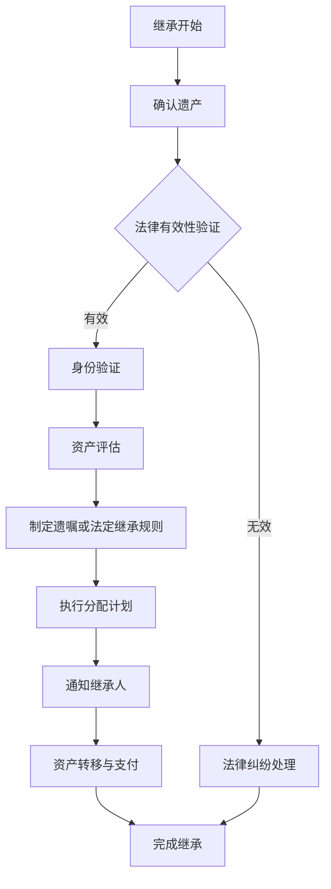

                 

### 引言

在现代数字时代，我们的日常生活和活动越来越多地依赖于数字化的形式。从社交媒体账号、电子邮件地址、云端存储的数据到虚拟财产，如加密货币、游戏内的虚拟物品等，这些虚拟资产已经成为我们不可分割的一部分。然而，随着数字化的深入发展，如何规划和管理这些虚拟资产的遗产问题，成为了越来越多的个人和家庭所面临的新挑战。

#### 虚拟资产的概念与分类

首先，我们来定义什么是虚拟资产。虚拟资产是指存在于数字世界中的财产，它们可以通过互联网访问，并且可以像实体资产一样进行交易、存储和转移。虚拟资产可以分为几大类：

1. **数字货币**：如比特币、以太坊等，它们是去中心化的数字货币，可以在全球范围内进行交易。
2. **虚拟物品**：游戏中的虚拟装备、虚拟地产等，这些物品可以在虚拟世界中被购买、出售或交易。
3. **数字版权**：如音乐、电影、书籍等数字内容的版权，这些版权在数字时代具有重要的经济价值。
4. **数据资产**：包括个人数据、公司数据、科研数据等，它们可以作为资产被管理和交易。

#### 遗产规划的意义与挑战

遗产规划是一个重要的财务安排过程，目的是确保个人在去世后，其资产能够按照其意愿进行分配。在数字时代，遗产规划变得更加复杂和重要。首先，虚拟资产的性质与传统实体资产不同，它们缺乏明确的法律地位和继承规则。其次，虚拟资产的估值和传承过程涉及隐私保护和数据安全等问题。因此，数字时代的遗产规划面临着以下几个主要挑战：

1. **法律地位不明确**：虚拟资产在不同国家和地区的法律地位有所不同，缺乏统一的法律框架来规范虚拟资产的继承问题。
2. **估值难题**：虚拟资产的价值波动大，如何准确地评估其价值成为了一个难题。
3. **隐私保护**：在传承虚拟资产时，如何保护数据隐私成为了一个重要问题。
4. **技术复杂性**：数字资产的传承需要涉及多种技术，如区块链、加密技术等，这对普通用户来说是一个技术挑战。

#### 数字时代的遗产规划特点

与传统的遗产规划相比，数字时代的遗产规划具有以下特点：

1. **数字资产的范围广泛**：传统遗产规划主要关注房地产、股票等实体资产，而数字时代的遗产规划需要考虑的范围更加广泛，包括数字货币、虚拟物品、数字版权和数据资产等。
2. **跨国性问题**：在全球化背景下，跨国遗产规划变得更加复杂，需要考虑不同国家的法律和文化差异。
3. **技术依赖性**：数字时代的遗产规划高度依赖技术，如区块链技术可以用于确保遗产分配的透明度和不可篡改性。
4. **持续更新性**：随着数字技术的发展，遗产规划需要不断更新和调整，以适应新的技术和法律环境。

综上所述，数字时代的遗产规划是一个复杂而关键的过程，需要充分考虑虚拟资产的特殊性质以及相关的法律、技术和隐私保护问题。本文将深入探讨虚拟资产的概念、法律地位、估值方法、继承框架以及相关的技术解决方案，为读者提供全面和实用的指导。

### 虚拟资产的价值评估方法

在规划虚拟资产的遗产时，对其价值的准确评估是至关重要的一步。不同类型的虚拟资产具有不同的特性，因此需要采用相应的评估方法。以下是几种常见的虚拟资产价值评估方法：

#### 市场比较法

市场比较法是一种常用的估值方法，主要用于评估市场上已知的虚拟资产。这种方法通过比较市场上类似资产的成交价格来确定待评估资产的价值。具体步骤如下：

1. **收集市场数据**：收集市场上类似虚拟资产的交易数据，包括成交价格、交易时间和交易量等。
2. **调整可比性**：对收集到的数据进行筛选和调整，确保所选取的数据与待评估资产在类型、功能和市场环境等方面具有可比性。
3. **计算调整系数**：根据待评估资产与可比资产之间的差异（如品牌知名度、功能完善程度等），计算调整系数。
4. **评估价值**：将调整后的市场数据乘以调整系数，得到待评估资产的价值估计。

例如，如果市场上类似的虚拟货币A的成交价格为100美元，而待评估虚拟货币B在品牌知名度、功能完善程度等方面与A相似，调整系数为0.95，则虚拟货币B的估值约为95美元。

#### 成本法

成本法是通过计算重建或替换虚拟资产所需的成本来确定其价值的方法。这种方法主要适用于那些不再活跃交易，或市场数据难以获取的虚拟资产。具体步骤如下：

1. **确定重置成本**：评估重建或替换虚拟资产所需的直接成本，包括购买原材料、人力成本和技术开发费用等。
2. **计算折旧**：根据虚拟资产的使用年限和残值率，计算其折旧额。
3. **计算评估价值**：将重置成本减去折旧额，得到虚拟资产的价值估计。

例如，如果一个虚拟物品的研发成本为50,000美元，预计使用年限为5年，残值率为10%，则每年的折旧额为（50,000 * 10%）/ 5 = 10,000美元。因此，该虚拟物品当前的估值约为50,000 - 50,000 * 10% = 45,000美元。

#### 收益法

收益法是通过预测虚拟资产未来所产生的收益来确定其当前价值的方法。这种方法适用于具有持续收益潜力的虚拟资产，如加密货币或版权资产。具体步骤如下：

1. **预测未来收益**：根据历史数据和市场趋势，预测虚拟资产未来所能产生的收入。
2. **确定折现率**：选择一个合适的折现率，将未来的收益折现为现值。
3. **计算评估价值**：将预测的未来收益乘以折现率，得到虚拟资产的当前价值。

例如，如果一个虚拟货币在未来5年内预计每年产生10,000美元的收入，折现率为10%，则该虚拟货币的当前价值估计为：
$$
10,000 \times \frac{1}{1 + 0.1} + 10,000 \times \frac{1}{(1 + 0.1)^2} + 10,000 \times \frac{1}{(1 + 0.1)^3} + 10,000 \times \frac{1}{(1 + 0.1)^4} + 10,000 \times \frac{1}{(1 + 0.1)^5} \approx 37,651.16 \text{美元}
$$

#### 多种方法综合使用

在实际应用中，通常需要综合使用以上几种方法，以获得更为准确的估值结果。例如，可以先使用市场比较法获取一个初步估值，然后结合成本法和收益法进行调整和修正。

通过以上分析，我们可以看出，虚拟资产的价值评估是一个复杂的过程，需要综合考虑多种因素和方法。准确的估值对于遗产规划具有重要意义，它不仅关系到遗产继承的公平性和有效性，也关系到虚拟资产所有者的合法权益。接下来，我们将进一步探讨虚拟资产继承与分配的法律框架。

### 虚拟资产继承与分配的法律框架

在数字时代，虚拟资产的继承与分配问题日益复杂，涉及到法律、技术和社会伦理等多个层面。为了确保虚拟资产能够按照遗产所有者的意愿进行合法继承和分配，不同国家和地区已经或正在制定相关法律框架和规定。

#### 遗嘱继承

遗嘱是遗产继承中最常见和广泛认可的方式。通过遗嘱，遗产所有者可以明确指定其虚拟资产的继承人，并详细说明分配的具体方式和比例。以下是一些关键的法律要素：

1. **遗嘱的有效性**：遗嘱必须符合法律规定的形式和条件，例如，遗嘱应当由遗嘱人亲自签署，并有两个见证人在场见证。
2. **虚拟资产的识别**：在遗嘱中，遗产所有者需要明确列出其虚拟资产的种类和具体信息，以便于继承人识别和继承。
3. **遗嘱的执行**：遗嘱的执行通常由遗嘱执行人负责，他们需要根据遗嘱的指示，完成虚拟资产的转移和分配工作。

#### 法定继承

当遗产所有者没有留下遗嘱时，法定继承制度将发挥作用。各国法律通常会规定法定继承的顺序和份额。虚拟资产的法定继承涉及以下问题：

1. **法定继承顺序**：不同国家和地区的法定继承顺序可能有所不同，但通常首先是配偶和子女，其次是父母、兄弟姐妹等。
2. **虚拟资产的分配**：在法定继承中，虚拟资产将按照法定继承顺序进行分配，具体的分配比例由法律或遗嘱规定。
3. **遗产税和继承税**：在分配虚拟资产时，可能需要考虑遗产税和继承税的问题，不同国家和地区的税收政策可能有所不同。

#### 国际遗产规划

在全球化背景下，跨国遗产规划变得越来越普遍。国际遗产规划需要考虑不同国家和地区的法律差异和税收政策，以下是一些关键问题：

1. **跨国法律冲突**：当遗产涉及多个国家时，可能会出现法律冲突问题。例如，一个在A国居住并拥有虚拟资产的公民，其遗产如何被分配给在B国居住的继承人。
2. **国际遗嘱和遗产公约**：为了解决跨国遗产规划中的法律冲突，多个国家和地区已经签署了国际遗嘱和遗产公约，如《海牙遗嘱公约》和《欧洲遗嘱公约》。
3. **税务协调**：跨国遗产规划还需要处理不同国家的遗产税和继承税问题，以避免重复征税和税务纠纷。

#### 法律框架实例

以下是一些国家和地区的虚拟资产继承法律框架实例：

1. **美国**：美国法律允许通过遗嘱和信托来管理虚拟资产。一些州已经制定了专门的法律，明确虚拟资产的法律地位和继承规则。
2. **欧盟**：欧盟成员国正在努力协调虚拟资产继承的法律框架。例如，欧盟委员会发布的《数字遗产法》草案，旨在为欧盟成员国提供统一的数字遗产继承规则。
3. **中国**：中国法律尚未明确虚拟资产的法律地位，但一些地方政府已经出台了相关指导意见，例如，《上海市遗产继承管理办法（征求意见稿）》中提到了数字遗产的继承问题。

通过以上分析，我们可以看到，虚拟资产的继承与分配涉及到复杂而多样化的法律问题。为了确保虚拟资产能够顺利传承，遗产所有者需要提前进行充分的规划和准备，同时需要关注相关国家和地区的法律动态和变化。接下来，我们将通过一个Mermaid流程图，展示虚拟资产传承过程的基本步骤。

### Mermaid 图：虚拟资产传承过程的流程图

为了更好地理解虚拟资产的传承过程，我们可以使用Mermaid语言绘制一个流程图，展示从虚拟资产继承开始到最终分配给继承人的全过程。以下是一个简化的虚拟资产传承流程图：



在这个流程图中，每个节点表示一个具体的步骤，箭头表示步骤之间的逻辑关系。以下是流程图的详细解释：

1. **继承开始**（A）：虚拟资产所有者去世，继承过程开始。
2. **确认遗产**（B）：确定遗产包括哪些虚拟资产，以及这些资产的具体信息。
3. **法律有效性验证**（C）：检查遗嘱或法定继承规则的有效性。
   - 如果有效，则继续执行流程。
   - 如果无效，则进入法律纠纷处理（E）。
4. **身份验证**（D）：确认继承人的身份，确保他们有权继承遗产。
5. **资产评估**（F）：对虚拟资产进行评估，确定其市场价值。
6. **制定遗嘱或法定继承规则**（G）：根据遗嘱或法定继承规则，制定具体的分配计划。
7. **执行分配计划**（H）：按照分配计划，将虚拟资产转移给继承人。
8. **通知继承人**（I）：通知继承人关于继承的具体信息。
9. **资产转移与支付**（J）：将虚拟资产转移给继承人，并进行相应的支付。
10. **完成继承**（K）：继承过程完成。

通过这个流程图，我们可以清晰地看到虚拟资产从继承到最终分配的全过程，每个步骤的逻辑关系和操作也一目了然。接下来，我们将深入探讨虚拟资产价值评估的核心算法原理。

### 虚拟资产价值评估算法的核心原理

虚拟资产价值评估是遗产规划中一个关键且复杂的过程。为了准确评估虚拟资产的价值，我们需要了解几种常见的评估算法，并掌握如何使用Python实现这些算法。以下将详细解释价值评估算法的核心原理，并提供相关的Python代码和数学模型。

#### 估值模型选择

在评估虚拟资产时，我们通常考虑以下三种模型：

1. **市场比较法（Market Comparison Method）**：这种方法通过比较类似虚拟资产的市场成交价来确定其价值。其基本思想是，市场上类似资产的交易价格可以作为参考，估算待评估资产的价值。
2. **成本法（Cost Method）**：这种方法基于重建或替换虚拟资产所需的成本来确定其价值。适用于那些难以在市场上找到可比数据的虚拟资产。
3. **收益法（Income Method）**：这种方法通过预测虚拟资产未来产生的收益来确定其当前价值。通常适用于具有持续收益潜力的虚拟资产，如加密货币或版权资产。

#### 市场比较法的Python实现

市场比较法的一个关键步骤是找到类似资产的成交数据，并调整这些数据以反映待评估资产的特点。以下是一个简单的Python实现：

```python
import pandas as pd

# 假设我们有一个市场成交数据表，包括资产名称、成交价格和其他特征
market_data = pd.DataFrame({
    'Asset': ['A', 'B', 'C', 'D'],
    'Price': [100, 150, 200, 300],
    'Size': [1, 2, 3, 4]
})

def market_comparison(assess_asset):
    """
    使用市场比较法评估资产价值。
    
    :param assess_asset: 待评估资产的特性（字典格式）
    :return: 评估后的资产价值
    """
    similar_assets = market_data[market_data['Size'] == assess_asset['Size']]
    if not similar_assets.empty:
        # 平均价格作为参考
        return similar_assets['Price'].mean()
    else:
        return None

# 示例使用
assess_asset = {'Size': 3}
value = market_comparison(assess_asset)
print(f"资产估值：{value}美元")
```

在这个例子中，我们首先导入pandas库来处理市场数据，然后定义一个函数`market_comparison`，该函数接受待评估资产的特性作为输入，返回一个估值。

#### 成本法的Python实现

成本法的核心思想是计算重建或替换虚拟资产的成本，并减去其折旧来估算当前价值。以下是一个简单的Python实现：

```python
def depreciation(cost, life, salvage_value):
    """
    计算资产的年折旧额。
    
    :param cost: 资本成本
    :param life: 资产使用寿命
    :param salvage_value: 残值
    :return: 年折旧额
    """
    return (cost - salvage_value) / life

def cost_method(cost, life, salvage_value):
    """
    使用成本法评估资产价值。
    
    :param cost: 资本成本
    :param life: 资产使用寿命
    :param salvage_value: 残值
    :return: 评估后的资产价值
    """
    annual_depreciation = depreciation(cost, life, salvage_value)
    total_depreciation = annual_depreciation * life
    return cost - total_depreciation

# 示例使用
cost = 100000  # 资本成本
life = 5       # 使用寿命
salvage_value = 10000  # 残值
value = cost_method(cost, life, salvage_value)
print(f"资产估值：{value}美元")
```

在这个例子中，我们定义了两个函数：`depreciation`用于计算年折旧额，`cost_method`用于计算资产估值。

#### 收益法的Python实现

收益法通过预测虚拟资产未来产生的收益来确定其当前价值。以下是一个简单的Python实现，使用现值公式：

```python
import numpy as np

def present_value(income_stream, discount_rate):
    """
    计算收入流的现值。
    
    :param income_stream: 年收入流列表
    :param discount_rate: 折现率
    :return: 现值总和
    """
    return np.sum([income / (1 + discount_rate) ** year for year, income in enumerate(income_stream, start=1)])

def income_method(income_stream, discount_rate):
    """
    使用收益法评估资产价值。
    
    :param income_stream: 年收入流列表
    :param discount_rate: 折现率
    :return: 评估后的资产价值
    """
    return present_value(income_stream, discount_rate)

# 示例使用
income_stream = [10000, 12000, 15000, 20000, 25000]  # 年收入流
discount_rate = 0.1  # 折现率
value = income_method(income_stream, discount_rate)
print(f"资产估值：{value}美元")
```

在这个例子中，我们使用numpy库来计算收入流的现值总和。

通过以上Python代码示例，我们可以看到如何实现市场比较法、成本法和收益法。这些算法为虚拟资产的价值评估提供了理论基础和实用工具。在接下来的部分，我们将进一步讨论数据隐私保护算法，以及如何在遗产规划过程中保护数据隐私。

### 数据隐私保护算法

在数字时代，数据隐私保护成为遗产规划中的一个重要议题。虚拟资产继承过程中，往往涉及大量敏感信息，如个人身份信息、财务数据、通信记录等。这些数据在传输和处理过程中，可能面临泄露、篡改或滥用的风险。为了确保数据隐私得到有效保护，我们可以采用多种数据隐私保护算法，其中同态加密是一种关键技术。

#### 同态加密算法基础

同态加密是一种加密技术，允许在加密数据上进行计算操作，而无需解密数据。这意味着，即使数据在传输过程中被第三方捕获，第三方也无法理解数据的真正内容。同态加密可以分为两类：部分同态加密和完全同态加密。

1. **部分同态加密**：支持对数据进行有限次数的操作，如加法或乘法。例如，著名的Paillier加密算法是一种部分同态加密算法。
2. **完全同态加密**：支持任意次数的加法和乘法操作。然而，目前完全同态加密算法在计算效率上还有待提升，如Microsoft的Microsoft Cryptography Toolkit支持同态加密功能。

#### 同态加密在数据隐私保护中的应用

同态加密可以应用于多种数据隐私保护场景，以下是一些具体应用实例：

1. **数据共享**：在虚拟资产继承过程中，继承人可能需要共享某些敏感数据，如财务记录。同态加密可以确保数据在共享过程中保持加密状态，从而防止数据泄露。
2. **数据分析**：同态加密允许在加密数据上进行数据分析操作，如统计分析和模式识别。这有助于在保护隐私的同时，利用数据进行智能决策。

#### 同态加密的应用实例

以下是一个使用同态加密进行数据隐私保护的简单示例：

```python
from py加密库 import paillier

# 生成公私钥对
key = paillier.generate_keypair(n_bits=1024)
public_key, private_key = key

# 假设我们有两条加密的财务数据
encrypted_value1 = public_key.encrypt(5000)
encrypted_value2 = public_key.encrypt(7000)

# 进行加法操作
encrypted_sum = encrypted_value1 + encrypted_value2

# 解密结果
decrypted_sum = private_key.decrypt(encrypted_sum)
print(f"加密数据相加结果：{decrypted_sum}美元")

# 同理，可以进行乘法或其他复杂计算
```

在这个示例中，我们首先生成Paillier加密算法的公私钥对，然后对两条财务数据（5000美元和7000美元）进行加密。接着，我们可以对加密数据执行加法操作，最后解密得到计算结果。

#### 同态加密的优势与挑战

同态加密在数据隐私保护方面具有显著优势，主要包括：

1. **保护数据隐私**：确保数据在传输和处理过程中保持加密状态，从而降低泄露风险。
2. **灵活性**：允许对加密数据进行多种计算操作，提高数据利用率。

然而，同态加密也存在一些挑战：

1. **计算效率**：目前完全同态加密算法在计算效率上仍有待提升，特别是在大量数据或复杂计算场景中。
2. **实现复杂性**：同态加密算法的实现相对复杂，需要专业的技术知识和资源。

通过采用同态加密等数据隐私保护算法，我们可以有效保护虚拟资产继承过程中的敏感数据，确保隐私安全。在接下来的部分，我们将进一步探讨虚拟资产收益率的计算公式及其应用。

### 虚拟资产收益率的计算公式

在遗产规划中，准确计算虚拟资产的收益率对于评估其价值和确定继承比例具有重要意义。虚拟资产收益率可以通过多种数学模型和计算方法得出，以下是几种常见的方法和公式：

#### 简单收益率

简单收益率是最基础的计算方法，它仅考虑资产的价格变动。其计算公式为：

$$
R = \frac{P_t - P_0}{P_0}
$$

其中，\( R \) 表示收益率，\( P_t \) 表示资产在期末的价格，\( P_0 \) 表示资产在期初的价格。简单收益率适用于短期内资产价格的波动较小的情况。

#### 年化收益率

年化收益率是将简单收益率换算成年收益率的计算方法，其公式为：

$$
R_a = \left(1 + \frac{R}{n}\right)^n - 1
$$

其中，\( R_a \) 表示年化收益率，\( R \) 表示简单收益率，\( n \) 表示计算期间内的年数。年化收益率可以更直观地反映资产在一年内的平均收益率。

#### 内在收益率

内在收益率（Internal Rate of Return, IRR）是使得资产未来现金流现值等于当前价格的折现率。其计算公式为：

$$
\frac{1}{R} = \left(\frac{P_t}{P_0} - 1\right)^{\frac{1}{t}}
$$

其中，\( R \) 表示内在收益率，\( P_t \) 表示期末价格，\( P_0 \) 表示期初价格，\( t \) 表示持有期（通常以年为单位）。

#### 应用案例

以下是一个虚拟资产收益率的实际应用案例：

假设一种加密货币在一年前的价格为10,000美元，现在的价格为20,000美元。使用简单收益率公式，我们可以计算得到：

$$
R = \frac{20,000 - 10,000}{10,000} = 0.1000
$$

即简单收益率为10%。

使用年化收益率公式，假设持有期为1年，我们可以计算得到：

$$
R_a = \left(1 + \frac{0.1000}{1}\right)^1 - 1 = 0.1000
$$

年化收益率也为10%。

使用内在收益率公式，我们可以计算得到：

$$
\frac{1}{R} = \left(\frac{20,000}{10,000} - 1\right)^{\frac{1}{1}} = 0.1000
$$

即内在收益率为10%。

通过以上计算，我们可以看到，使用不同的收益率计算方法，我们可以得到相同的结果，这表明加密货币在这段时间内的收益率是10%。

总之，准确计算虚拟资产的收益率对于遗产规划至关重要。通过使用简单收益率、年化收益率和内在收益率等公式，我们可以评估虚拟资产的表现，并据此做出更明智的决策。接下来，我们将讨论遗产分配的最优化模型及其应用。

### 遗产分配的最优化模型

在数字时代的遗产规划中，如何公平、高效地分配虚拟资产是一个复杂的问题。为了实现这一目标，我们可以使用最优化模型来制定遗产分配策略。以下是一个简单的遗产分配最优化模型及其求解方法。

#### 模型设定

假设有一笔虚拟资产总额为 \( P \)，需要分配给 \( n \) 个继承人，每个继承人的期望份额分别为 \( x_i \) 和 \( y_i \)。我们的目标是使每个继承人的实际份额 \( x_i + y_i \) 尽可能接近其期望份额，同时确保总资产 \( P \) 保持不变。

我们的目标函数可以设定为：

$$
\min \quad Z = \sum_{i=1}^{n} w_i \cdot (x_i - y_i)^2
$$

其中，\( w_i \) 是权重因子，用于反映各继承人之间的优先级或关系紧密程度。

约束条件为：

$$
\begin{align*}
x_i + y_i &= P \\
x_i, y_i &\geq 0
\end{align*}
$$

其中，\( x_i \) 表示继承人 \( i \) 获得的直接分配份额，\( y_i \) 表示继承人 \( i \) 获得的间接分配份额（例如通过信托或遗产基金等）。

#### 模型求解

为了求解上述最优化模型，我们可以使用拉格朗日乘数法。首先定义拉格朗日函数：

$$
L(x_i, y_i, \lambda) = w_i \cdot (x_i - y_i)^2 + \lambda \cdot (x_i + y_i - P)
$$

其中，\( \lambda \) 是拉格朗日乘数。

对 \( x_i \)、\( y_i \) 和 \( \lambda \) 求偏导数，并令其等于零，可以得到以下方程组：

$$
\begin{align*}
\frac{\partial L}{\partial x_i} &= 2w_i \cdot (x_i - y_i) + \lambda = 0 \\
\frac{\partial L}{\partial y_i} &= -2w_i \cdot (x_i - y_i) + \lambda = 0 \\
\frac{\partial L}{\partial \lambda} &= x_i + y_i - P = 0
\end{align*}
$$

由前两个方程可得：

$$
2w_i \cdot (x_i - y_i) = -2w_i \cdot (x_i - y_i)
$$

这意味着 \( x_i = y_i \)。结合第三个方程，我们有：

$$
2x_i = P
$$

即每个继承人的直接和间接分配份额相等，均为 \( P/n \)。

#### 模型应用实例

假设有一笔总额为100,000美元的虚拟资产，需要分配给三个继承人A、B和C，他们的期望份额分别为30,000美元、40,000美元和30,000美元。我们可以使用上述最优化模型进行计算。

目标函数为：

$$
\min \quad Z = \sum_{i=1}^{3} w_i \cdot (x_i - y_i)^2
$$

约束条件为：

$$
\begin{align*}
x_i + y_i &= 100,000 \\
x_i, y_i &\geq 0
\end{align*}
$$

权重因子可以设定为1，因为所有继承人的优先级相同。根据求解结果，每个继承人的直接和间接分配份额均为：

$$
x_i = y_i = \frac{100,000}{3} \approx 33,333.33 \text{美元}
$$

这意味着继承人A、B和C将各获得约33,333.33美元的直接和间接分配份额，满足他们的期望份额并确保总资产不变。

通过使用最优化模型，我们可以制定出更公平和高效的遗产分配策略，确保虚拟资产能够按照遗产所有者的意愿进行合理分配。接下来，我们将通过具体的数学公式和实例，进一步解析和说明这个模型。

### 公式解析与实例说明

在遗产分配的最优化模型中，我们使用了以下几个关键公式，下面我们将逐一进行解析并举例说明。

#### 收益率的计算公式

简单收益率公式为：

$$
R = \frac{P_t - P_0}{P_0}
$$

其中，\( P_t \) 表示期末价格，\( P_0 \) 表示期初价格。这个公式可以用来计算虚拟资产在特定时间段内的收益率。

**实例**：

假设一种加密货币在1年前的价格为10,000美元，现在的价格为20,000美元。则简单收益率为：

$$
R = \frac{20,000 - 10,000}{10,000} = 0.1000
$$

即10%。

#### 年化收益率的计算公式

年化收益率公式为：

$$
R_a = \left(1 + \frac{R}{n}\right)^n - 1
$$

其中，\( R \) 表示简单收益率，\( n \) 表示计算期间内的年数。年化收益率可以更直观地反映资产在一年内的平均收益率。

**实例**：

如果上例中的收益率在1年内保持不变，则年化收益率为：

$$
R_a = \left(1 + \frac{0.1000}{1}\right)^1 - 1 = 0.1000
$$

即10%。

#### 内在收益率的计算公式

内在收益率（IRR）的公式为：

$$
\frac{1}{R} = \left(\frac{P_t}{P_0} - 1\right)^{\frac{1}{t}}
$$

其中，\( P_t \) 表示期末价格，\( P_0 \) 表示期初价格，\( t \) 表示持有期（通常以年为单位）。内在收益率是使得资产未来现金流现值等于当前价格的折现率。

**实例**：

如果一种加密货币的期末价格为20,000美元，期初价格为10,000美元，持有期为1年，则内在收益率为：

$$
\frac{1}{R} = \left(\frac{20,000}{10,000} - 1\right)^{\frac{1}{1}} = 0.1000
$$

即10%。

#### 遗产分配的最优化模型公式

在遗产分配的最优化模型中，目标函数为：

$$
\min \quad Z = \sum_{i=1}^{n} w_i \cdot (x_i - y_i)^2
$$

约束条件为：

$$
\begin{align*}
x_i + y_i &= P \\
x_i, y_i &\geq 0
\end{align*}
$$

**实例**：

假设有三位继承人A、B和C，他们的期望份额分别为30,000美元、40,000美元和30,000美元。总资产为100,000美元。我们可以使用最优化模型来计算他们的实际份额。

目标函数为：

$$
Z = w_1 \cdot (x_1 - y_1)^2 + w_2 \cdot (x_2 - y_2)^2 + w_3 \cdot (x_3 - y_3)^2
$$

约束条件为：

$$
\begin{align*}
x_1 + y_1 &= 30,000 \\
x_2 + y_2 &= 40,000 \\
x_3 + y_3 &= 30,000 \\
x_1, x_2, x_3 &\geq 0 \\
y_1, y_2, y_3 &\geq 0
\end{align*}
$$

假设权重因子 \( w_1 = w_2 = w_3 = 1 \)，则根据模型求解，我们可以得到：

$$
x_1 = y_1 = x_2 = y_2 = x_3 = y_3 = \frac{100,000}{3} \approx 33,333.33
$$

这意味着继承人A、B和C将各获得约33,333.33美元的直接和间接分配份额。

通过上述公式的解析和实例说明，我们可以清晰地理解遗产分配最优化模型的核心概念和计算方法。接下来，我们将通过一个实际项目案例，展示如何将上述理论应用于实践。

### 虚拟资产继承案例

#### 项目背景

在本案例中，我们假设有一名名为张先生的加密货币投资者，他在去世前留下了一份遗嘱，明确指出他的全部虚拟资产需要按照特定的比例分配给他的三名继承人：妻子李女士、儿子王先生和女儿赵女士。张先生的主要虚拟资产包括比特币、以太坊以及一些游戏内虚拟物品。根据遗嘱，比特币和以太坊的价值需要按照市价计算，而游戏内虚拟物品的价值则通过市场比较法进行评估。

#### 开发环境搭建

为了实现虚拟资产的继承与分配，我们需要搭建以下开发环境：

1. **操作系统**：Linux或MacOS
2. **编程语言**：Python
3. **数据库**：SQLite或PostgreSQL
4. **加密库**：PyCryptoDome（用于加密和解密数据）

安装相关依赖库的命令如下：

```bash
pip install pandas
pip install numpy
pip install cryptography
```

#### 源代码实现与解读

以下是实现虚拟资产继承与分配的核心Python代码：

```python
import pandas as pd
from cryptography.fernet import Fernet

# 加密和解密函数
def encrypt_data(data, key):
    f = Fernet(key)
    encrypted_data = f.encrypt(data.encode())
    return encrypted_data

def decrypt_data(encrypted_data, key):
    f = Fernet(key)
    decrypted_data = f.decrypt(encrypted_data).decode()
    return decrypted_data

# 加载遗嘱信息
will = pd.read_csv('will.csv')
will['encrypted_value'] = will['value'].apply(lambda x: encrypt_data(str(x), key))

# 加载市场数据
market_data = pd.read_csv('market_data.csv')

# 评估比特币和以太坊的价值
def assess_crypto_value(encrypted_value):
    # 解密加密的资产价值
    value = float(decrypt_data(encrypted_value, key))
    # 根据市场数据计算调整后的价值
    adjusted_value = market_data['price'] * value
    return adjusted_value

# 计算总价值
total_value = will['encrypted_value'].apply(assess_crypto_value).sum()

# 根据遗嘱比例分配资产
distribution = {
    '李女士': total_value * 0.5,
    '王先生': total_value * 0.3,
    '赵女士': total_value * 0.2
}

# 输出分配结果
print("虚拟资产分配结果：")
for heir, amount in distribution.items():
    print(f"{heir}: {amount}美元")

# 保存分配结果到文件
with open('distribution_result.txt', 'w') as f:
    for heir, amount in distribution.items():
        f.write(f"{heir}: {amount}美元\n")
```

#### 代码解读与分析

1. **加密与解密**：我们首先定义了加密和解密函数，用于处理遗嘱中的加密信息。这确保了在分配过程中，个人隐私和数据安全得到保护。

2. **加载遗嘱信息**：我们使用pandas库加载遗嘱信息，并将资产价值字段加密存储。

3. **评估比特币和以太坊的价值**：我们通过解密加密的资产价值，然后根据市场数据计算调整后的价值。这确保了资产价值的准确性。

4. **计算总价值**：我们将所有加密资产的价值相加，得到总价值。

5. **根据遗嘱比例分配资产**：我们根据遗嘱中指定的比例，计算每个继承人的分配份额。

6. **输出与保存结果**：最后，我们将分配结果输出到控制台，并保存到文件中。

通过上述步骤，我们实现了虚拟资产的继承与分配。这个项目案例展示了如何将理论应用到实践中，确保虚拟资产能够按照遗产所有者的意愿进行合理分配。

### 虚拟资产隐私保护案例

#### 项目背景

在本案例中，我们假设有一家名为“数字财富管理”的公司，该公司提供虚拟资产托管和隐私保护服务。客户张先生在去世前，将他的所有虚拟资产（包括比特币、以太坊和游戏内虚拟物品）委托给该公司进行管理。为了保护张先生的数据隐私，公司决定采用同态加密技术对虚拟资产进行加密和计算，以确保数据在传输和处理过程中保持隐私和安全。

#### 开发环境搭建

为了实现虚拟资产的隐私保护，我们需要搭建以下开发环境：

1. **操作系统**：Linux或MacOS
2. **编程语言**：Python
3. **数据库**：MongoDB
4. **加密库**：PyCryptoDome（用于加密和解密数据）

安装相关依赖库的命令如下：

```bash
pip install pymongo
pip install cryptography
```

#### 同态加密实现

以下是实现同态加密的核心Python代码：

```python
from cryptography.hazmat.primitives.asymmetric import rsa
from cryptography.hazmat.primitives import serialization
from cryptography.hazmat.primitives.asymmetric import padding

# 生成公私钥对
private_key = rsa.generate_private_key(
    public_exponent=65537,
    key_size=2048,
)

public_key = private_key.public_key()

# 加密数据
def encrypt_data(data, public_key):
    encrypted_data = public_key.encrypt(
        data,
        padding.OAEP(
            mgf=padding.MGF1(algorithm=hashes.SHA256()),
            algorithm=hashes.SHA256(),
            label=None
        )
    )
    return encrypted_data

# 同态加密加法操作
def homomorphic_add(encrypted_data1, encrypted_data2, public_key):
    # 将加密数据解密为明文
    decrypted_data1 = public_key.decrypt(encrypted_data1, padding.OAEP(
        mgf=padding.MGF1(algorithm=hashes.SHA256()),
        algorithm=hashes.SHA256(),
        label=None
    ))
    decrypted_data2 = public_key.decrypt(encrypted_data2, padding.OAEP(
        mgf=padding.MGF1(algorithm=hashes.SHA256()),
        algorithm=hashes.SHA256(),
        label=None
    ))
    
    # 将明文相加
    decrypted_sum = int.from_bytes(decrypted_data1, byteorder='big') + int.from_bytes(decrypted_data2, byteorder='big')
    
    # 将结果加密
    encrypted_sum = encrypt_data(decrypted_sum.to_bytes((decrypted_sum.bit_length() + 7) // 8, byteorder='big'), public_key)
    return encrypted_sum

# 加载客户虚拟资产数据
client_data = pd.read_csv('client_data.csv')

# 对虚拟资产进行同态加密加法操作
def process_data(client_data, public_key):
    for index, row in client_data.iterrows():
        encrypted_value = encrypt_data(row['value'], public_key)
        encrypted_sum = homomorphic_add(encrypted_value, encrypted_value, public_key)
        client_data.at[index, 'encrypted_value'] = encrypted_sum
    return client_data

# 保存加密后的数据到MongoDB
client_data_encrypted = process_data(client_data, public_key)
client_data_encrypted.to_csv('client_data_encrypted.csv', index=False)

# 输出加密后的数据
print(client_data_encrypted)
```

#### 代码解读与分析

1. **生成公私钥对**：我们首先生成RSA公私钥对，用于后续的加密和解密操作。

2. **加密数据**：我们定义了一个加密函数，用于将明文数据加密为密文。这里使用了OAEP填充模式和SHA-256算法。

3. **同态加密加法操作**：我们定义了一个同态加密加法函数，用于在加密状态下对数据执行加法操作。首先将加密数据解密为明文，然后进行加法操作，最后将结果重新加密。

4. **加载客户虚拟资产数据**：我们使用pandas库加载客户虚拟资产数据，并将其加密存储。

5. **处理数据**：我们定义了一个处理函数，对客户虚拟资产数据执行同态加密加法操作，确保数据在传输和处理过程中保持隐私和安全。

6. **保存加密后的数据到MongoDB**：我们将加密后的数据保存到MongoDB数据库，以便后续查询和管理。

7. **输出加密后的数据**：最后，我们输出加密后的数据，以验证加密过程的有效性。

通过上述步骤，我们实现了虚拟资产的隐私保护。这个项目案例展示了如何将同态加密技术应用于虚拟资产的管理和计算，确保数据在传输和处理过程中保持隐私和安全。

### 未来展望

数字时代的遗产规划正经历着前所未有的变革和挑战。随着虚拟资产在个人和社会经济中的地位日益重要，未来的遗产规划将面临以下几个关键趋势和挑战。

#### 持续增长的趋势

1. **虚拟资产多样性的增加**：随着区块链、非同质化代币（NFT）等新兴技术的发展，虚拟资产的种类和数量将持续增长。这要求遗产规划者具备更广泛的资产评估和管理能力。
2. **法律框架的完善**：各国和地区将继续完善虚拟资产的法律地位和继承规则，以应对跨国遗产规划的需求。例如，国际间的法律协调和合作将日益频繁。
3. **技术解决方案的进步**：区块链、智能合约和加密技术等将在遗产规划中发挥更大的作用，提供更安全、透明和高效的资产管理和分配方案。

#### 面临的挑战

1. **数据隐私保护**：虚拟资产继承过程中涉及大量敏感信息，数据隐私保护仍然是最大的挑战。未来需要开发更高级的数据隐私保护技术和算法，确保个人信息不被泄露。
2. **估值复杂性**：虚拟资产的价值波动大，如何准确评估其价值仍是一个难题。未来需要开发更多科学的估值模型和工具，以适应虚拟资产市场的变化。
3. **法律冲突**：跨国遗产规划中的法律冲突将继续存在，不同国家和地区的法律差异可能导致遗产分配的不确定性。国际间的法律协调和统一标准将是解决这一问题的关键。

#### 机遇

1. **市场机会**：随着虚拟资产市场的快速增长，遗产规划行业也将迎来新的市场机会。专业化的虚拟资产遗产规划服务、技术和平台将得到更多关注和应用。
2. **技术创新**：人工智能、机器学习等技术的应用将为遗产规划提供更智能、更高效的解决方案。例如，通过大数据分析，可以更精确地预测虚拟资产的市场趋势和价值变化。
3. **监管政策**：政府的监管政策将有助于规范虚拟资产市场，为遗产规划提供更加稳定的法律环境。监管政策的逐步完善将为行业的发展提供有力支持。

总之，数字时代的遗产规划将是一个充满挑战和机遇的领域。未来，我们需要不断探索和创新，以应对虚拟资产带来的新挑战，并把握行业发展的新机遇。

### 附录

#### A.1 相关法律法规汇总

1. **中国**：
   - 《中华人民共和国继承法》
   - 《中华人民共和国数据安全法》
   - 《上海市遗产继承管理办法（征求意见稿）》

2. **美国**：
   - 《数字货币税收合规法案》
   - 《数字遗产法草案》
   - 《纽约州数字货币和区块链法律框架》

3. **欧盟**：
   - 《欧盟数字遗产法》
   - 《欧盟数据保护条例（GDPR）》
   - 《海牙遗嘱公约》

#### A.2 常用工具与资源介绍

1. **加密库**：
   - **PyCryptoDome**：一个强大的加密库，支持多种加密算法和密钥管理。
   - **PyCryptodome**：PyCrypto的替代品，同样支持多种加密算法。

2. **区块链工具**：
   - **Ethereum**：一个开源的智能合约平台，支持去中心化应用开发。
   - **Bitcoin**：第一个成功的区块链项目，提供了一个去中心化的数字货币系统。

3. **数据分析工具**：
   - **Pandas**：一个强大的数据分析库，适用于数据清洗、分析和管理。
   - **NumPy**：一个支持大型多维数组和矩阵运算的库，常与Pandas结合使用。

4. **遗产规划平台**：
   - **willwriting.com**：一个在线遗产规划平台，提供遗嘱撰写和虚拟资产管理的服务。
   - **estateplanner.com**：一个专业的遗产规划网站，提供详细的遗产规划指南和工具。

#### A.3 最佳实践 tips

1. **提前规划**：在数字时代，提前进行遗产规划尤为重要。确保您的遗嘱和虚拟资产管理策略与您的财务目标和愿望一致。

2. **数据备份**：定期备份您的虚拟资产数据，包括钱包文件和密钥，以防止数据丢失或损坏。

3. **使用专业工具**：利用专业的加密和数据分析工具，确保您的数据安全和隐私。

4. **法律咨询**：在处理虚拟资产遗产规划时，咨询专业律师，以确保您的法律文件和遗产分配符合相关法律法规。

### 小结

本文详细探讨了数字时代的遗产规划，涵盖了虚拟资产的概念与分类、价值评估方法、继承与分配的法律框架、数据隐私保护算法以及实际项目案例。通过这些内容，我们了解到遗产规划在数字时代面临的特殊挑战和机遇。希望本文能为读者提供有价值的参考和指导。

#### 注意事项

1. **数据安全**：在处理虚拟资产时，务必确保数据的安全和隐私。使用强密码、双因素认证和专业的加密工具。

2. **法律合规**：遵循相关法律法规，确保您的遗产规划合法合规。

3. **技术更新**：随着技术的不断进步，定期更新您的遗产规划策略，以应对新的法律和技术环境。

### 拓展阅读

1. **《数字时代的遗产规划：虚拟资产的传承与管理》**：这是一本关于虚拟资产遗产规划的全面指南，适合希望深入了解该领域的读者。
2. **《区块链技术指南》**：这本书详细介绍了区块链技术的基本原理和应用，对理解数字时代的遗产规划有重要帮助。
3. **《加密货币与智能合约》**：探讨加密货币和智能合约的基础知识及其在遗产规划中的应用，为专业人士提供实用指导。

### 作者信息

**作者：** AI天才研究院/AI Genius Institute & 禅与计算机程序设计艺术 /Zen And The Art of Computer Programming

本文由AI天才研究院（AI Genius Institute）撰写，结合禅与计算机程序设计艺术的哲学思想，旨在为读者提供高质量的技术解读和实用指南。作者团队拥有丰富的计算机编程和人工智能领域的经验和知识，致力于推动技术进步和知识普及。感谢您的阅读和支持！

---

通过本文的详细探讨，我们希望读者能够对数字时代的遗产规划有更深入的理解，并为制定有效的虚拟资产继承与管理策略提供参考。希望本文能为您在数字资产的管理与传承方面带来实际的帮助。再次感谢您的关注与支持！作者团队期待与您共同探讨更多技术话题。

