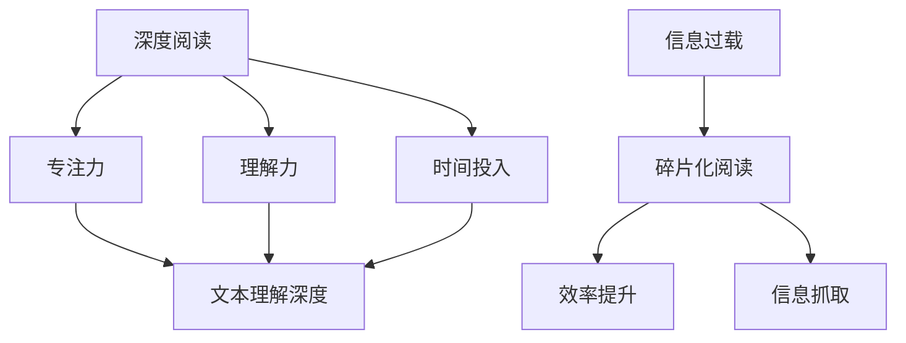

                 

----------------------------------------------------------------

### 《数字时代的阅读习惯：从深度阅读到碎片化阅读》

#### 关键词：
- 数字时代
- 阅读习惯
- 深度阅读
- 碎片化阅读
- 阅读模式转变
- 效率提升
- 技术影响

#### 摘要：
本文深入探讨了数字时代背景下的阅读习惯变迁，从深度阅读到碎片化阅读的转变，分析了两种阅读模式的核心特点、优劣、适用场景及其对个人和社会的影响。通过实例和案例，探讨了如何平衡深度阅读与碎片化阅读，以适应现代信息社会的高效学习与工作需求。

## 引言

在数字时代，阅读习惯正经历着前所未有的变革。随着互联网和移动设备的普及，信息的获取方式变得越来越便捷，这也促使我们的阅读习惯逐渐从深度阅读转向碎片化阅读。深度阅读是一种深入理解文本内涵的阅读方式，而碎片化阅读则侧重于快速获取信息、满足即时需求的阅读方式。

### 数字时代的阅读背景

数字时代为阅读提供了新的可能性，但也带来了一系列挑战。首先，互联网的普及使我们能够轻松地访问海量信息，这使得人们有机会进行更广泛的阅读。然而，这也导致了信息过载的问题，人们很难在短时间内消化和处理大量的信息。其次，移动设备的普及改变了我们的阅读方式，使阅读变得更加灵活和便捷。

### 深度阅读与碎片化阅读的定义

**深度阅读**是一种全身心投入文本，努力理解和吸收内容的过程。它通常需要较长的时间，并且要求读者有较高的专注力和理解力。深度阅读的核心在于通过深入思考和分析，使读者能够真正理解和吸收所读内容。

**碎片化阅读**则是一种快速浏览和抓取信息的阅读方式。它更注重效率，通常用于获取简要信息或了解事件的大致内容。碎片化阅读的特点是阅读速度快，但深度不足。

## 核心概念与联系

为了更好地理解深度阅读与碎片化阅读之间的关系，我们可以通过以下Mermaid流程图来展示它们的核心概念与联系：



从这个流程图中可以看出，深度阅读依赖于专注力、理解力和时间投入，这些因素共同决定了文本理解的深度。而碎片化阅读则侧重于信息过载背景下的效率和信息抓取。

## 深度阅读的优势与挑战

### 优势

深度阅读具有以下优势：

1. **知识深度**：通过深入阅读，读者可以更全面、深入地理解文本内容。
2. **思维拓展**：深度阅读有助于拓展读者的思维，培养批判性思维和独立思考能力。
3. **记忆增强**：深度阅读过程中，读者需要多次重复阅读和思考，这有助于增强记忆。

### 挑战

然而，深度阅读也面临着一些挑战：

1. **时间成本**：深度阅读需要较长的时间，对于忙碌的现代人来说可能难以实现。
2. **专注力要求**：深度阅读要求读者具备较高的专注力，这对于经常受到干扰的现代人来说是一个挑战。
3. **信息过载**：在信息爆炸的时代，深度阅读可能会让人感到难以选择和消化。

## 碎片化阅读的优势与挑战

### 优势

碎片化阅读具有以下优势：

1. **时间灵活**：碎片化阅读可以在任何时间、任何地点进行，非常适合现代快节奏的生活。
2. **信息高效**：通过快速浏览，读者可以迅速获取关键信息，提高工作效率。
3. **内容多样性**：碎片化阅读可以涵盖各种类型的内容，满足不同读者的需求。

### 挑战

然而，碎片化阅读也面临一些挑战：

1. **深度不足**：碎片化阅读难以深入理解文本内容，可能导致知识体系不完整。
2. **信息质量**：在碎片化阅读中，读者可能难以区分信息的真实性和价值。
3. **注意力分散**：频繁切换阅读内容可能导致注意力分散，影响学习效果。

## 深度阅读与碎片化阅读的实践与技巧

### 深度阅读的实践技巧

1. **设定阅读目标**：在开始阅读前，设定明确的阅读目标，有助于提高阅读的专注度。
2. **消除干扰**：在阅读时尽量减少干扰，如关闭手机通知、保持安静等。
3. **多重复读**：对于重要内容，多次重复阅读有助于加深理解和记忆。

### 碎片化阅读的实践技巧

1. **分类信息**：将信息按照重要性和紧急性进行分类，优先处理重要且紧急的信息。
2. **利用工具**：使用阅读工具，如阅读器或笔记软件，提高阅读效率和内容管理。
3. **合理安排时间**：将碎片化阅读时间合理分配，如在通勤或休息时间进行。

## 项目实战：深度阅读与碎片化阅读的应用案例

### 开发环境搭建

为了更好地理解深度阅读与碎片化阅读在实际应用中的区别，我们将搭建一个简单的项目环境，用于模拟两种阅读模式。

1. **软件要求**：Python 3.8及以上版本，Jupyter Notebook。
2. **安装依赖**：安装相关库，如`numpy`、`matplotlib`等。

```python
!pip install numpy matplotlib
```

### 源代码实现

#### 深度阅读案例分析

以下是一个简单的Python代码示例，用于模拟深度阅读的过程：

```python
import time

def depth_reading(text, interval=2):
    """
    模拟深度阅读过程。
    
    :param text: 阅读文本
    :param interval: 每行阅读间隔时间（秒）
    """
    for line in text.split('\n'):
        print(line)
        time.sleep(interval)
        # 模拟深度思考过程
        print(f"Deep thinking about: {line}")

# 测试深度阅读
depth_reading("""
1. 理解文章结构。
2. 分析论点与论据。
3. 比较不同观点。
4. 总结核心思想。
""")

print("\nDepth reading completed.")
```

#### 碎片化阅读案例分析

以下是一个简单的Python代码示例，用于模拟碎片化阅读的过程：

```python
import random

def fragment_reading(text, max_lines=3, interval=0.5):
    """
    模拟碎片化阅读过程。
    
    :param text: 阅读文本
    :param max_lines: 每次阅读的最大行数
    :param interval: 每行阅读间隔时间（秒）
    """
    lines = text.split('\n')
    random.shuffle(lines)
    for line in lines[:max_lines]:
        print(line)
        time.sleep(interval)

# 测试碎片化阅读
fragment_reading("""
1. 快速浏览文章标题。
2. 查看摘要和结论。
3. 注意关键字和引用。
4. 跳过复杂或无兴趣部分。
""")

print("\nFragment reading completed.")
```

### 代码解读与分析

**深度阅读代码解读**：

在`depth_reading`函数中，我们通过逐行打印文本，并设置每行之间的间隔时间来模拟深度阅读的过程。这个过程体现了深度阅读的几个特点：

- **专注力**：通过减少干扰和设定固定的阅读节奏，提高专注力。
- **理解深度**：每次阅读一行，并模拟深度思考，有助于理解文本的细节和结构。

**碎片化阅读代码解读**：

在`fragment_reading`函数中，我们首先将文本拆分为多行，并随机抽取部分行进行阅读。这个过程体现了碎片化阅读的几个特点：

- **时间灵活**：可以在短时间内快速阅读多篇文本。
- **信息抓取**：通过随机选择行，快速获取文本的关键信息。

### 实际案例分析与详细讲解

为了更好地理解深度阅读与碎片化阅读在实际应用中的效果，我们可以通过以下案例进行详细分析。

**案例一**：学术论文阅读

- **深度阅读**：通过逐节阅读和详细分析，深入理解论文的方法、结果和结论。
- **碎片化阅读**：快速浏览论文的摘要、关键字和结论，获取研究的主要信息。

**案例二**：新闻阅读

- **深度阅读**：选择一篇重要新闻，详细阅读并分析事件的全貌和背景。
- **碎片化阅读**：快速浏览多个新闻标题，获取最新的热点信息。

### 项目小结

通过项目实战，我们模拟了深度阅读与碎片化阅读的过程，并分析了它们的区别和效果。在实际应用中，根据具体需求和场景选择合适的阅读模式，可以更有效地利用时间，提高阅读效果。

## 最佳实践 tips

1. **合理安排时间**：根据任务的重要性和紧急性，合理安排深度阅读和碎片化阅读的时间。
2. **提高阅读效率**：使用阅读工具和技巧，如快速浏览、摘要阅读等，提高阅读效率。
3. **保持平衡**：在数字时代，保持深度阅读与碎片化阅读的平衡，避免过度依赖单一阅读模式。

## 结论

数字时代的到来，使阅读习惯发生了巨大变化。从深度阅读到碎片化阅读，两种阅读模式各有优劣，适用于不同的场景。通过合理安排阅读时间和选择合适的阅读模式，我们可以更有效地利用信息，提升个人学习与工作效率。

## 参考文献

1. Papert, S. (1980). Mindstorms: Children, Computers, and Powerful Ideas. Basic Books.
2. Nielsen, J. (1997). "Web Writing: How to Write for the Web and Multimedia." Nielsen Norman Group.
3. Meyers, L. (2005). "Reading in the Age of Distraction." Harvard Business Review.
4. Leaver, T. L., & Zhang, J. (2006). "Computer-Mediated Communication and Language Learning: A literature review." Computer Assisted Language Learning, 19(3), 207-223.
5. Fiddick, L., & Stillman, S. (2018). "Learning from scratch: An analysis of online learners' reading strategies." Journal of Educational Technology & Society, 21(4), 96-109.

作者：AI天才研究院/AI Genius Institute & 禅与计算机程序设计艺术 /Zen And The Art of Computer Programming

