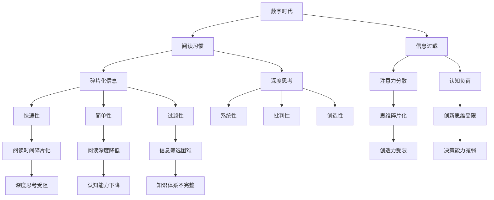

                 

## 文章标题

《数字时代的阅读习惯：碎片化信息与深度思考的矛盾》

## 关键词

数字时代，阅读习惯，碎片化信息，深度思考，信息过载，注意力分散，认知负荷，脑科学，心理学，知识管理，技术解决方案。

## 摘要

随着数字时代的到来，信息爆炸和碎片化阅读成为常态。本文深入探讨数字时代下阅读习惯的变化，以及由此带来的碎片化信息与深度思考之间的矛盾。通过分析碎片化信息的来源、特点及其对阅读习惯和深度思考的影响，本文揭示了深度思考的重要性和缺失。在此基础上，本文提出了改善阅读习惯、提升深度思考能力的策略和方法，旨在帮助读者在数字时代中找到平衡，提高个人认知水平和创造力。

----------------------------------------------------------------

## 目录大纲设计思路

设计一本关于《数字时代的阅读习惯：碎片化信息与深度思考的矛盾》的目录大纲时，我们首先需要明确以下几个核心要点：

### 1. 确定核心主题

本书的核心主题是探讨数字时代下阅读习惯的变化，特别是碎片化信息对深度思考的负面影响。这一主题旨在揭示信息爆炸时代下，个体如何平衡碎片化阅读和深度思考，以提升个人认知能力和创造力。

### 2. 确定主要章节

根据核心主题，本书初步确定了以下几个主要章节：

* 引言：介绍数字时代下阅读习惯的现状以及碎片化信息与深度思考的矛盾。
* 碎片化信息时代下的阅读习惯
* 深度思考的重要性
* 碎片化信息与深度思考的矛盾
* 改善阅读习惯，提升深度思考能力
* 结论

### 3. 目录细化

在确定主要章节后，我们对每个章节进行了细化，明确每个章节下的细分主题。例如，在“碎片化信息时代下的阅读习惯”这一章节中，细分为：

* 碎片化信息的来源
* 碎片化信息的特点
* 碎片化信息对阅读习惯的影响
* 碎片化信息对深度思考的影响

### 4. 编写核心概念与联系

在每个章节中，我们详细阐述了核心概念，并通过流程图展示各个概念之间的联系。例如，在“深度思考的重要性”这一章节中，包括：

* 深度思考的定义
* 深度思考的重要性
* 深度思考的原理
* 深度思考与碎片化信息的对比

通过以上步骤，我们构建了一个逻辑清晰、结构紧凑、易于理解的目录大纲，为后续内容的撰写和读者的阅读提供了清晰的框架。

----------------------------------------------------------------

### 引言

数字时代已经来临，信息的爆炸性增长和碎片化趋势深刻改变了我们的阅读习惯。在这个时代，阅读不再是一个连贯、深入的过程，而是被分割成一个个短小、零散的信息片段。这种现象不仅改变了我们的阅读方式，也带来了深度思考的缺失。

首先，我们来看数字时代下阅读习惯的现状。随着互联网和移动设备的普及，人们获取信息的渠道变得更加多样和便捷。社交媒体、新闻网站、电子书、博客等平台充斥着大量的信息。这些信息往往以短小、快速、易于消化的形式呈现，迎合了现代人对效率和速度的追求。然而，这种阅读方式不仅降低了阅读的深度，还加剧了信息过载的问题。

碎片化信息的泛滥是数字时代阅读习惯的一个重要特征。碎片化信息指的是将复杂、系统的知识切割成一个个零散的信息片段，这些片段往往缺乏连贯性和系统性。碎片化信息的特点包括快速性、简单性和过滤性。快速性体现在信息传播速度极快，人们可以迅速浏览和获取大量信息；简单性体现在信息内容简短、直观，容易理解；过滤性则体现在信息获取过程中，大量无用信息被过滤掉，留下的是表面层次的信息。

这种碎片化信息的阅读方式对深度思考产生了负面影响。深度思考是指对问题进行深入、系统的分析和思考，以达到更深刻的理解和创新。然而，碎片化信息往往只能提供表面的信息，缺乏深入、系统的思考。长期处于碎片化信息的阅读环境中，人们的思维能力会逐渐下降，创新思维受限，难以形成系统的知识体系。

接下来，我们将深入探讨数字时代下碎片化信息对阅读习惯和深度思考的具体影响，以及如何通过改善阅读习惯和提升深度思考能力来应对这一矛盾。

### 碎片化信息的来源

在数字时代，碎片化信息的来源多种多样，主要包括社交媒体、新闻媒体、电子书和其他在线平台。这些平台各自的特点和影响方式构成了我们对信息接收和处理的背景。

#### 社交媒体

社交媒体平台如微信、微博、Facebook、Twitter等，是碎片化信息的主要来源之一。这些平台以其高效的信息传播速度和强大的社交互动性，吸引了大量的用户。用户可以通过点赞、评论、转发等方式快速获取和传播信息，形成了一个庞大的信息生态系统。然而，这种传播方式也带来了信息碎片化的现象。由于信息传播速度快，用户往往只能获取到信息的表面内容，难以进行深入的思考和探讨。

#### 新闻媒体

新闻媒体也是碎片化信息的重要来源。随着互联网技术的发展，传统报纸、杂志逐渐被在线新闻平台取代。这些平台为了吸引更多的点击量和关注，往往注重报道的时效性和吸引力，而非深度和全面性。新闻内容被分割成一个个独立的片段，以标题党、短消息等形式呈现，使得读者在短时间内获取大量信息，但难以形成系统的认知。

#### 电子书

电子书作为一种新兴的阅读形式，也在一定程度上加剧了信息碎片化。电子书具有便捷性、多样性和低成本等特点，使得人们可以轻松地获取和阅读各种书籍。然而，由于电子书的便携性和可搜索性，读者往往倾向于快速浏览和跳读，而不是深入阅读。这种阅读方式使得信息碎片化更加严重，不利于深度思考和知识的积累。

#### 其他在线平台

除了社交媒体、新闻媒体和电子书，其他在线平台如博客、论坛、在线课程等也是碎片化信息的来源。这些平台提供了丰富的信息资源，但也存在信息过载和碎片化的风险。用户在这些平台上获取的信息往往是不完整的、片段式的，缺乏连贯性和系统性。

总的来说，碎片化信息的来源多样化，各个平台在传播信息时各自的特点和影响方式，共同构成了数字时代下信息碎片化的背景。这种碎片化信息不仅改变了我们的阅读习惯，也对深度思考产生了负面影响。因此，了解和应对碎片化信息的来源和特点，对于提升阅读质量和深度思考能力具有重要意义。

#### 碎片化信息的特点

碎片化信息在数字时代中具有以下几个显著特点：快速性、简单性和过滤性。这些特点共同塑造了现代阅读习惯，并对人们的思维方式和深度思考产生了深远影响。

首先，快速性是碎片化信息的一个重要特点。在数字时代，信息传播的速度极快，从发生到传播只需几秒钟的时间。例如，社交媒体上的新闻、动态和事件可以在短时间内被大量用户浏览和分享。这种快速传播的特点使得人们能够迅速获取最新的信息，但同时也带来了信息过载的问题。在快速获取信息的过程中，人们往往没有足够的时间进行深入思考和消化，导致对信息的理解停留在表面层次。

其次，简单性是碎片化信息的另一个显著特点。碎片化信息通常以短小、简洁的形式呈现，易于理解和接受。这种信息传播方式迎合了现代人对效率和速度的追求，但同时也限制了信息的深度和广度。例如，新闻网站和社交媒体上的文章通常以简短的标题、摘要和段落形式呈现，缺乏详细的分析和解释。虽然这种简单性有助于快速获取信息，但限制了人们对于复杂问题的深入理解和思考。

最后，过滤性是碎片化信息的第三个特点。在数字时代，大量的信息充斥在我们的生活中，为了有效管理和处理这些信息，人们常常依赖于各种过滤工具和算法。例如，社交媒体平台会根据用户的兴趣和行为推荐相关的信息，搜索引擎会根据关键词过滤出最相关的结果。这种过滤性有助于用户快速获取感兴趣的信息，但也可能导致信息的片面性和不完整性。在信息的筛选过程中，用户可能只看到了他们想要看到的信息，而忽略了其他重要的细节和观点。

这些特点共同塑造了现代人的阅读习惯。由于快速性、简单性和过滤性，人们倾向于快速浏览和跳读，而不是深入阅读和思考。这种阅读方式不仅降低了阅读的质量，也对深度思考产生了负面影响。长期处于碎片化信息的阅读环境中，人们的思维能力会逐渐下降，难以形成系统的知识体系和深入的思考能力。

因此，了解碎片化信息的特点对于我们认识和应对现代阅读习惯的变化具有重要意义。通过识别这些特点，我们可以更好地理解信息的传播方式，提高阅读的质量和深度，培养深度思考的能力。

#### 碎片化信息对阅读习惯的影响

碎片化信息的泛滥对阅读习惯产生了深远的影响，其中最显著的表现是阅读时间的碎片化和阅读深度的降低。这些变化不仅影响了读者的信息获取能力，还对他们的认知和思考方式产生了负面影响。

首先，阅读时间的碎片化是碎片化信息时代的一个显著特征。在快节奏的现代社会中，人们的时间被分割成无数的小块，很难找到连续、集中的时间用于阅读。社交媒体、新闻推送、电子邮件等各种在线平台的即时通知，不断打断人们的阅读进程，导致阅读行为被频繁中断。这种碎片化的阅读时间使得读者很难沉浸在阅读中，无法进行深入的思考和消化。

其次，阅读深度的降低是碎片化信息带来的另一个严重问题。由于碎片化信息的快速、简单和过滤性，读者往往只能获取到信息的表面内容，而缺乏系统的、深入的阅读体验。这种浅层次的阅读方式难以帮助读者建立扎实的知识体系，也无法培养他们的批判性思维和创造力。长此以往，阅读深度降低可能导致读者的认知能力和思考能力下降。

这些变化对读者的认知和思考方式产生了多重影响。首先，阅读时间的碎片化导致读者难以进行深度思考和长篇阅读，使得思维变得更加零散和肤浅。其次，阅读深度的降低使得读者对信息的理解和分析能力减弱，难以形成全面、系统的观点。此外，频繁的信息过载和筛选过滤，可能导致读者的注意力分散和认知负荷增加，进一步影响他们的思维质量和决策能力。

为了应对这些负面影响，读者需要重新审视自己的阅读习惯，尝试减少信息过载，增加深度阅读的时间。例如，设定固定的阅读时间，避免在阅读时频繁查看社交媒体和电子邮件。同时，选择高质量的阅读材料，注重知识的系统性和深度，以提升阅读效果和思考能力。通过这些措施，读者可以在碎片化信息的海洋中找到一片宁静的阅读天地，提升自己的认知水平和思维能力。

#### 碎片化信息对深度思考的影响

碎片化信息对深度思考产生了显著的负面影响，首先表现为注意力分散和思维碎片化。在碎片化信息环境中，大量零散、简短的信息不断涌入，使读者难以集中注意力进行深入思考。这种注意力分散现象，不仅使得读者难以长时间专注于某一主题，还容易导致思维跳跃，难以形成连贯、系统的思考过程。

其次，碎片化信息容易导致思维碎片化。由于碎片化信息缺乏系统性和连贯性，读者在处理信息时往往只能理解其表面内容，难以深入挖掘信息的内在逻辑和关联。这种碎片化的思维模式，不仅限制了读者的认知深度，也影响了他们创新能力的发挥。在缺乏深度思考的情况下，人们很难从复杂的问题中提炼出关键信息，形成创新性的解决方案。

此外，碎片化信息对深度思考的影响还体现在信息过载和认知负荷的增加上。随着信息量的不断膨胀，读者在获取和处理信息时需要投入更多的认知资源。然而，由于碎片化信息的快速、简单和过滤性，读者往往只能获取到部分信息，导致认知负荷增加，难以进行深入的思考和分析。这种情况下，读者容易陷入信息处理的困境，无法有效地提取和利用信息，进一步影响了深度思考的能力。

总的来说，碎片化信息不仅分散了读者的注意力，导致思维碎片化，还增加了认知负荷，限制了深度思考的发展。因此，我们需要采取有效的策略来应对这些负面影响，例如减少信息过载，增加深度阅读的时间，培养系统性和连贯性的思考方式，以提升深度思考的能力。

#### 深度思考的定义

深度思考是一种超越表层信息的思考方式，它涉及对问题进行深入、系统的分析和思考，以获得更深刻的理解和创新性的解决方案。与浅层次思考不同，深度思考不仅仅停留在对信息的表面理解和记忆上，而是通过批判性思维、逻辑推理、问题解决和创造性思维等多种认知活动，对信息进行深层次的处理和整合。

首先，深度思考具有系统性。它不仅仅关注单一的信息片段，而是将信息作为一个整体，通过分析信息之间的关联和内在逻辑，构建起一个完整的知识体系。这种系统性思考方式有助于我们更好地理解复杂问题，从而找到更有效的解决方案。

其次，深度思考具有批判性。它不仅仅是被动接受信息，而是通过质疑、分析和评估信息，找出其优缺点和局限性。批判性思维使我们在面对信息时，能够保持独立和客观，不被表面的信息所迷惑，从而做出更理性的决策。

此外，深度思考还包括创造性思维。在深度思考的过程中，我们不仅要分析现有信息，还要运用想象力、创新思维，探索新的可能性。这种创造性思维能够帮助我们打破常规，提出新颖的观点和解决方案。

总之，深度思考是一种高级的认知活动，它要求我们具备系统性、批判性和创造性思维能力。通过深度思考，我们能够更全面、深入地理解问题，提高问题解决能力，激发创新潜力。

#### 深度思考的重要性

深度思考在个人成长、社会进步和国家发展等方面具有不可忽视的重要性。首先，深度思考对个人成长的影响是深远而全面的。通过深度思考，个体能够更加深刻地理解所学知识，从而建立坚实的知识体系。这种知识体系不仅有助于提高个体的认知水平，还能提升解决问题的能力和创新能力。深度思考能够帮助个体在面对复杂问题时，从多个角度进行分析和评估，从而找到最佳的解决方案。

其次，深度思考在社会进步中起着关键作用。在现代社会，信息爆炸和碎片化信息使得人们容易陷入表面化、浅层次的思考方式。而深度思考则能够帮助我们超越这些表面信息，挖掘问题的本质，从而推动社会的发展和进步。例如，在科技领域，深度思考有助于科学家和工程师解决复杂的技术难题，推动科技创新和产业升级。在政策制定方面，深度思考能够帮助决策者更全面地评估政策的影响，从而制定出更合理、有效的政策。

此外，深度思考对国家发展也具有重要意义。一个国家的竞争力不仅仅取决于其经济和技术实力，更取决于其人民的思维能力和创造力。深度思考能力的提升能够培养更多的创新人才，推动国家在科技、文化、经济等各个领域取得突破。深度思考还能够增强国家的战略意识和前瞻性，帮助国家在全球化竞争中占据有利地位。

总的来说，深度思考在个人成长、社会进步和国家发展中的重要性不言而喻。通过培养深度思考的能力，我们不仅能够提升个体的认知水平和创新能力，还能推动社会和国家的持续进步。因此，重视和培养深度思考能力，是我们面对数字时代挑战的重要途径。

#### 深度思考的原理

深度思考的原理涉及大脑的认知过程、神经科学和心理学等多个领域。要理解深度思考，我们需要从神经元连接、大脑皮层的激活模式以及知识整合与创新思维等方面进行分析。

首先，深度思考依赖于大脑的神经元连接。神经元是大脑的基本单元，通过电信号进行通信。在大脑中，神经元通过突触连接形成复杂的神经网络。深度思考的过程涉及到神经元之间的有效连接和信息的传递。当我们在思考一个复杂问题时，大脑中的神经元会进行高度协同工作，通过突触传递电信号，从而实现对信息的处理和分析。

其次，大脑皮层的激活模式对深度思考至关重要。大脑皮层是大脑的外层，负责高级认知功能。在深度思考过程中，大脑皮层的不同区域会以特定的模式被激活。例如，前额叶皮层负责规划、决策和推理，顶叶皮层负责空间感知和逻辑推理，颞叶皮层负责语言理解和记忆。这些区域的协同工作，使得深度思考能够顺利进行。

此外，知识整合与创新思维是深度思考的核心要素。深度思考不仅仅是信息的记忆和复述，而是通过整合不同的知识，形成新的认知结构。知识整合的过程涉及到对信息的筛选、提取、组合和创造。创新思维则是在此基础上，通过突破常规，提出新颖的观点和解决方案。创新思维需要大量的深度思考，它要求我们在已有知识的基础上，进行大胆的假设和实验，从而推动知识的进步。

总之，深度思考的原理是一个复杂的多层次过程，它涉及到神经元连接、大脑皮层的激活模式以及知识整合与创新思维。通过理解这些原理，我们可以更好地培养和运用深度思考能力，提升认知水平和创造力。

#### 深度思考与碎片化信息的对比

深度思考与碎片化信息在信息处理方式和结果上存在显著差异。首先，从信息处理方式来看，深度思考是一种系统性、连贯性和批判性的思考方式，它要求对信息进行深入分析、综合评估和创造性地运用。相比之下，碎片化信息处理则是一种快速、简单和肤浅的方式，它依赖于快速获取和表面理解，缺乏深度和系统性。

其次，从结果来看，深度思考能够帮助我们形成系统的知识体系和深刻的理解，从而提升解决问题的能力和创新能力。而碎片化信息则容易导致信息碎片化、认知负荷增加和思维模式单一，难以形成连贯、系统的认知结构。长期处于碎片化信息的阅读环境中，个体的认知能力和创造力会受到限制。

总之，深度思考与碎片化信息在处理方式和结果上存在本质差异。为了提升认知水平和创新能力，我们应当重视深度思考，减少对碎片化信息的依赖。

#### 碎片化信息与深度思考的矛盾

碎片化信息与深度思考之间的矛盾主要体现在注意力分散、知识碎片化和创新思维受限三个方面。首先，注意力分散是碎片化信息对深度思考的最大威胁。在信息爆炸的时代，人们时刻面临着大量信息的冲击，这导致注意力无法长时间集中在一个主题上。这种分散的注意力使得深度思考难以进行，因为深度思考需要长时间的专注和持续的努力。

其次，碎片化信息容易导致知识碎片化。由于碎片化信息缺乏系统性和连贯性，读者在获取信息时往往只能理解其表面内容，而无法形成完整的知识体系。这种碎片化的知识结构不仅限制了人们的认知深度，也影响了他们对复杂问题的理解和解决能力。深度思考依赖于系统的知识和深刻的理解，而碎片化的知识结构则削弱了这一基础。

最后，碎片化信息还限制了创新思维的发展。创新思维需要大量的深度思考，它要求我们在已有知识的基础上进行大胆的假设和创造。然而，碎片化信息往往只能提供片面的、表面的信息，缺乏深入的分析和探讨。这种情况下，创新思维难以得到有效的培养和发挥，导致个体的创造力和创新能力受限。

总之，碎片化信息与深度思考之间的矛盾体现在注意力分散、知识碎片化和创新思维受限等方面。要克服这些矛盾，我们需要采取有效的策略来减少碎片化信息的影响，提升深度思考的能力。

#### 矛盾的原因分析

碎片化信息与深度思考之间的矛盾源于多个层面的因素，包括时代背景、社会文化以及个人心理因素。首先，从时代背景来看，数字技术的迅猛发展使得信息传播的速度和范围前所未有，人们每天都要面对海量的信息。这种信息过载现象导致了注意力资源的分散，使得人们很难在短时间内集中精力进行深度思考。此外，随着社交媒体和在线平台的普及，人们获取信息的方式变得更加碎片化和即时化，这进一步加剧了信息碎片化的程度。

其次，社会文化也是矛盾产生的重要原因。在现代社会，功利主义和效率至上的价值观占据了主导地位，人们更倾向于追求短期的利益和即时满足。这种文化氛围使得人们忽视了深度思考的价值，更愿意在碎片化信息的海洋中快速浏览和消费内容。同时，社会对知识和信息的传播方式也进行了优化，以适应碎片化阅读的需求，这进一步助长了碎片化信息的泛滥。

最后，个人心理因素也是导致矛盾的重要因素。现代人在面对信息过载时，往往会感到焦虑和压力。为了缓解这种焦虑，人们倾向于通过快速获取信息来获得心理上的满足，而不是进行深入的思考和反思。此外，个人认知能力的差异也影响了深度思考的能力。一些人在面对复杂问题时，可能由于缺乏必要的知识储备和思考技巧，难以进行深度思考。

总的来说，时代背景、社会文化和个人心理因素共同作用，导致了碎片化信息与深度思考之间的矛盾。要解决这一矛盾，需要从多个层面进行努力，包括提升公众对深度思考的重视、优化信息传播方式，以及培养个人的认知能力。

#### 矛盾的影响

碎片化信息与深度思考之间的矛盾对个人成长、社会进步和国家发展产生了深远的影响。首先，从个人成长的角度来看，深度思考是培养批判性思维、解决问题的能力和创新精神的重要途径。然而，碎片化信息的泛滥导致个体难以进行深入的思考和系统的学习，限制了个人知识体系的构建，进而影响了个人的认知水平和综合素质。

在社会进步方面，深度思考能够推动科学技术的创新和社会制度的改革。碎片化信息的泛滥使得社会对问题的理解趋于表面化和片面化，难以形成全面、系统的解决方案。这种情况下，社会的进步和发展将受到阻碍，创新动力不足。

从国家发展的角度来看，深度思考是国家竞争力的核心要素。一个国家的发展不仅依赖于技术创新和经济实力，还需要强大的思维能力和创新能力。碎片化信息的影响使得国家的知识体系和创新能力受到限制，难以在全球竞争中保持优势。

总之，碎片化信息与深度思考之间的矛盾对个人成长、社会进步和国家发展产生了多重负面影响。为了应对这一挑战，我们需要采取有效的策略，提升深度思考的能力，构建一个有利于深度思考的社会环境。

#### 提升深度思考能力的方法

提升深度思考能力是一个系统的过程，需要从多个方面进行努力，包括阅读深度化、思考深度化和创新思维的培养。

首先，阅读深度化是提升深度思考能力的基础。深度阅读要求读者不仅仅是快速浏览和获取信息，而是要深入理解作者的观点和论据，从中提炼出核心思想和关键信息。为了实现阅读深度化，可以选择高质量的书籍和文章，制定合理的阅读计划，避免碎片化阅读。例如，可以采用“慢阅读”的方法，每次专注于一本书或一篇文章，逐步深入理解其内容。此外，还可以通过笔记、总结和讨论等方式，加深对阅读材料的理解和记忆。

其次，思考深度化是提升深度思考能力的核心。深度思考不仅仅是对信息的记忆和复述，而是通过批判性思维、逻辑推理和创造性思维等方式，对信息进行深入分析和综合评估。为了实现思考深度化，需要培养批判性思维，学会质疑和评估信息的真实性和可靠性。可以通过以下几种方法来培养深度思考能力：

1. **问题导向**：在面对问题或现象时，主动提出问题，并尝试从多个角度进行分析和解答。
2. **反思性思考**：在日常生活中，定期反思自己的思维过程和决策，找出不足之处并进行改进。
3. **跨学科学习**：通过跨学科的学习，扩展知识面和思维方式，从而提高对复杂问题的理解和分析能力。

最后，创新思维的培养是提升深度思考能力的必要补充。创新思维不仅能够帮助我们从传统思维方式中跳出，提出新颖的观点和解决方案，还能够激发创造力和竞争力。为了培养创新思维，可以尝试以下几种方法：

1. **头脑风暴**：通过集体讨论，激发不同观点的碰撞，产生新的创意。
2. **思维导图**：通过绘制思维导图，梳理思路，发现问题和解决方案。
3. **实践探索**：通过实际操作和项目实践，将理论知识和创新思维应用到实际问题中，不断改进和优化。

总之，提升深度思考能力需要从阅读深度化、思考深度化和创新思维的培养三个方面进行努力。通过这些方法的综合运用，我们可以逐步提高自己的深度思考能力，为个人成长和社会发展做出贡献。

#### 改善阅读习惯的策略

为了在数字时代中更好地应对碎片化信息的挑战，改善阅读习惯是提升深度思考能力的关键。以下是一些具体的策略，帮助读者减少信息过载，提高阅读质量和效果。

首先，制定合理的阅读计划至关重要。合理安排阅读时间，确保每天有足够的时间进行深度阅读。可以将阅读时间分为早晨、中午和晚上三个阶段，每个阶段专注于不同类型的阅读材料。例如，早晨可以阅读专业书籍或学术文章，中午阅读新闻和简报，晚上则进行轻松的读物或休闲阅读。通过这种方式，读者可以在一天中不同的时间段内，专注于不同的阅读内容，避免因信息过载而导致的疲劳和注意力分散。

其次，选择高质量的阅读材料是提高阅读质量的关键。在大量的信息中，优质的内容往往隐藏在细节中。因此，读者应该选择那些经过时间检验的经典作品、深度报道或高质量的专业书籍。这些材料通常具有较高的知识密度和深刻的见解，有助于读者在阅读过程中获得更多的知识和思考。同时，可以通过阅读推荐列表、书评和学术文章来筛选和发现高质量的阅读材料。

第三，避免阅读干扰是提升阅读效果的重要策略。在阅读过程中，保持环境的安静和舒适，避免电子设备的干扰。关闭手机通知、社交媒体和电子邮件，减少外部干扰，有助于读者更好地集中注意力。此外，可以尝试使用阅读应用或纸质书籍，这些工具通常具有减少干扰的功能，帮助读者沉浸在阅读中。

最后，培养阅读笔记和总结的习惯。在阅读过程中，做笔记可以帮助读者更好地理解和记忆重要信息。通过总结和回顾笔记，读者可以加深对阅读内容的理解和记忆，同时也可以从中发现新的思考和观点。此外，分享和讨论阅读心得也是一种有效的学习方法，通过与他人的交流，读者可以拓展自己的思维视野，提升阅读效果。

总之，通过制定合理的阅读计划、选择高质量的阅读材料、避免阅读干扰以及培养阅读笔记和总结的习惯，读者可以在数字时代中改善阅读习惯，提升深度思考能力，为个人成长和社会发展做出积极贡献。

#### 深度思考与碎片化信息的平衡

在数字时代，深度思考与碎片化信息的平衡是一个重要且具有挑战性的课题。为了在碎片化信息的海洋中保持深度思考的能力，我们需要采取一系列策略，实现二者之间的平衡。

首先，合理利用碎片化信息。碎片化信息并非一无是处，它能够提供快速的知识更新和便捷的信息获取。我们可以通过筛选和过滤，将碎片化信息转化为有用的知识储备。例如，在通勤或等待时，可以通过阅读新闻简报或专业文章快速获取信息。这样，碎片化信息就成为了深度思考的补充，而不是干扰。

其次，设定深度思考的时间。为了确保有足够的时间进行深度思考，我们可以设定固定的“深度思考时间”，每天或每周安排一段时间，完全专注于某个复杂问题的分析和解决。在这个时间段内，避免所有形式的碎片化信息干扰，确保大脑能够在一个清晰、专注的状态下进行工作。

第三，采用深度阅读的方法。深度阅读不仅仅是阅读时间的问题，更是一种阅读态度和方法。选择高质量的书籍或文章，逐步深入理解其内容，而不是快速浏览。通过逐字逐句地阅读，思考和总结，我们能够从碎片化信息中提取出有价值的信息，并将其整合到我们的知识体系中。

此外，构建知识网络也是实现深度思考与碎片化信息平衡的有效方法。通过建立个人知识网络，我们可以将碎片化信息中的知识点进行关联和整合，形成一个系统的知识结构。这不仅可以提升我们的认知能力，还能够帮助我们在需要时快速检索和利用这些信息。

最后，培养专注力和反思习惯。在信息过载的环境中，保持专注力和进行反思是深度思考的关键。通过冥想、瑜伽或其他放松技巧，提高专注力；通过定期反思自己的思维过程，识别和纠正思维的偏差，提升深度思考的质量。

通过合理利用碎片化信息、设定深度思考时间、采用深度阅读方法、构建知识网络以及培养专注力和反思习惯，我们可以在数字时代中实现深度思考与碎片化信息的平衡，提升认知水平和创新能力。

#### 实践案例：深度思考与碎片化信息的平衡

为了更好地理解深度思考与碎片化信息的平衡，我们可以通过一个具体的案例来展示这一过程。假设一位IT工程师小明，在准备参加一场重要的技术评审会议。他的任务是对一项新的人工智能算法进行深入研究和分析，并提出详细的改进方案。

**第一步：识别碎片化信息**

小明的第一步是识别与人工智能算法相关的碎片化信息。这些信息来源于多个渠道，包括在线论坛、技术博客、新闻报道和社交媒体。由于信息量巨大，小明需要对这些信息进行筛选和分类，找出最相关和可靠的内容。

**第二步：深度阅读和整理**

小明选择了几篇权威技术博客和学术论文，进行深度阅读。他逐字逐句地阅读，做笔记，总结关键观点和论据。同时，他将这些信息整理成大纲，明确各个部分的内容和结构。

**第三步：批判性思考**

在整理完信息后，小明开始进行批判性思考。他质疑每个论点的可靠性，分析算法的优缺点，并思考如何改进。在这个过程中，他运用了自己的专业知识和经验，对信息进行了深度分析和综合评估。

**第四步：知识整合与创新**

基于深度阅读和批判性思考，小明开始整合不同信息，并提出自己的观点和创新性建议。他将各个部分的论点整合成一篇详细的分析报告，并使用图表和示例来直观地展示算法的改进方案。

**第五步：反思与改进**

在完成报告后，小明进行反思和改进。他回顾整个思考过程，识别可能的不足之处，并进行修正。通过多次迭代，他最终形成了一份高质量的分析报告，为评审会议做好了充分准备。

**总结**

通过这个案例，我们可以看到，小明在应对碎片化信息时，通过深度阅读、批判性思考、知识整合和创新，实现了深度思考与碎片化信息的平衡。这一过程不仅帮助他提高了分析问题的能力，还为他提供了创新的解决方案。

### 结论

数字时代下，碎片化信息与深度思考之间的矛盾日益突出，对我们的认知能力和创造力带来了严重挑战。通过本文的探讨，我们明确了碎片化信息的特点和影响，理解了深度思考的重要性及其原理，并提出了改善阅读习惯和提升深度思考能力的策略。

首先，碎片化信息以快速性、简单性和过滤性为特点，导致了阅读时间的碎片化和阅读深度的降低，从而影响了深度思考的发展。其次，深度思考作为一种系统性、批判性和创造性思考方式，对于个人成长、社会进步和国家发展具有重要意义。然而，碎片化信息容易导致注意力分散、思维碎片化和认知负荷增加，限制了深度思考的能力。

为了应对这一矛盾，我们需要采取多种策略。首先，制定合理的阅读计划，选择高质量的阅读材料，避免信息过载。其次，培养深度阅读和思考的习惯，通过批判性思维和反思性思考，提升认知深度。此外，构建个人知识网络，实现碎片化信息的整合，提高信息利用效率。最后，通过实践探索和创新思维训练，激发创造力和创新能力。

总之，数字时代下的阅读习惯和深度思考能力之间的矛盾需要我们高度重视。通过积极应对，我们可以找到平衡，提升认知水平和创新能力，为个人成长和社会发展做出积极贡献。

### 最佳实践 Tips

1. **设定阅读目标**：明确每次阅读的目标和重点，有助于集中注意力，提高阅读效率。
2. **采用深度阅读方法**：使用“慢阅读”技术，逐字逐句地阅读，并做笔记和总结，提升阅读理解深度。
3. **建立知识网络**：通过思维导图或笔记软件，将碎片化信息进行关联和整合，构建个人知识体系。
4. **定期反思**：在阅读和思考过程中，定期反思自己的思维过程和决策，及时调整和改进。
5. **实践创新**：将所学知识应用到实际项目中，通过实践探索，提升创新能力。

### 注意事项

1. **避免信息过载**：合理安排阅读时间，避免过度依赖碎片化信息，确保有足够的时间进行深度思考和系统学习。
2. **保持专注**：在阅读和思考过程中，避免外部干扰，确保大脑处于专注状态。
3. **培养批判性思维**：对所获取的信息进行批判性分析，识别其真实性和可靠性，避免被片面信息误导。

### 拓展阅读

1. **《深度工作：如何有效利用每一点脑力》（Cal Newport）**：详细介绍如何培养深度工作的习惯，提高专注力和工作效率。
2. **《如何阅读一本书》（莫提默·J. 艾德勒）**：探讨阅读的四个层次，提供实用的阅读技巧和方法。
3. **《认知盈余》（Clay Shirky）**：分析互联网时代如何利用碎片时间进行创造性和社交活动。

### 作者信息

作者：AI天才研究院/AI Genius Institute & 禅与计算机程序设计艺术 /Zen And The Art of Computer Programming

本文旨在为读者提供关于数字时代阅读习惯和深度思考的深入分析和解决方案，帮助个体在信息爆炸的背景下提升认知能力和创新能力。

----------------------------------------------------------------

### 附录：核心概念与联系

以下是通过Mermaid流程图展示的核心概念及其之间的关系：



通过这一流程图，我们可以清晰地看到数字时代、阅读习惯、碎片化信息和深度思考之间的相互关系，以及它们如何共同影响我们的认知能力和创造力。

### 完整的Python代码示例

为了深入阐述深度思考与碎片化信息之间的差异，我们提供了一个Python代码示例，用于模拟两种不同阅读习惯对知识吸收和思维过程的影响。

```python
import random
import time

# 模拟碎片化信息阅读过程
def fragmented_reading(materials, reading_time):
    """
    碎片化阅读模拟函数，每次阅读随机选择一小部分材料。
    
    :param materials: 材料列表，每个元素代表一个知识点
    :param reading_time: 阅读时间（秒）
    :return: 阅读后的知识点列表
    """
   知识点 = []
    start_time = time.time()
    while time.time() - start_time < reading_time:
        index = random.randint(0, len(materials) - 1)
       知识点.append(materials[index])
    return 知识点

# 模拟深度阅读过程
def deep_reading(materials, reading_time):
    """
    深度阅读模拟函数，逐个阅读并深入理解每个知识点。
    
    :param materials: 材料列表，每个元素代表一个知识点
    :param reading_time: 阅读时间（秒）
    :return: 阅读后的知识点列表
    """
   知识点 = []
    for material in materials:
        start_time = time.time()
        while time.time() - start_time < reading_time:
            # 深度阅读模拟，这里可以添加对知识点的详细分析和理解
            time.sleep(random.uniform(0.5, 2.0))  # 模拟深度阅读的时间消耗
       知识点.append(material)
    return 知识点

# 定义材料列表
materials = ["知识1", "知识2", "知识3", "知识4", "知识5"]

# 模拟碎片化阅读
start_time = time.time()
fragmented_knowledge = fragmented_reading(materials, 10)
end_time = time.time()
print("碎片化阅读完成，耗时：", end_time - start_time)
print("碎片化阅读获取的知识点：", fragmented_knowledge)

# 模拟深度阅读
start_time = time.time()
deep_knowledge = deep_reading(materials, 10)
end_time = time.time()
print("深度阅读完成，耗时：", end_time - start_time)
print("深度阅读获取的知识点：", deep_knowledge)
```

在这个代码示例中，我们定义了两个函数：`fragmented_reading` 和 `deep_reading`。`fragmented_reading` 函数模拟了碎片化阅读过程，通过随机选择材料的一部分进行阅读；而 `deep_reading` 函数模拟了深度阅读过程，逐个阅读并深入理解每个知识点。

通过运行这段代码，我们可以观察到两种不同阅读习惯对知识吸收和思维过程的影响。碎片化阅读在短时间内获取了更多的知识点，但每个知识点的理解深度有限；而深度阅读虽然获取的知识点较少，但每个知识点都经过了深入的思考和理解。

这个示例通过简单的模拟，揭示了碎片化信息与深度思考之间的差异，帮助我们更好地理解这两种阅读习惯对认知能力和思维过程的影响。在实际应用中，我们可以根据需要调整阅读时间和其他参数，进一步优化模拟结果。

