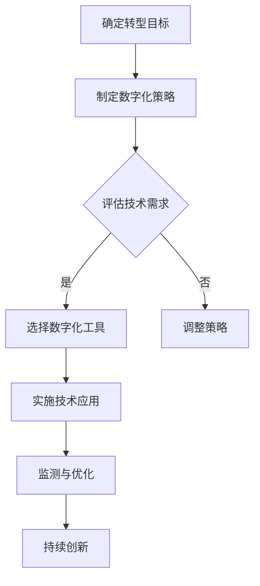

                 

### 设计《数字时代的阅读空间：实体书店的转型与创新》的目录大纲

为了设计《数字时代的阅读空间：实体书店的转型与创新》的目录大纲，我们需要遵循以下步骤：

#### 1. 确定核心章节

首先，我们需要确定文章的核心章节，确保这些章节能够全面覆盖主题，并具备逻辑性和连贯性。以下是初步构想的核心章节：

- **第1章：数字时代阅读空间概述**
  - **1.1 数字阅读的现状与挑战**
  - **1.2 实体书店的转型机遇**
  - **1.3 新型阅读空间的构建**

- **第2章：实体书店的数字化转型**
  - **2.1 数字化转型的概念与意义**
  - **2.2 实体书店的数字化策略**
  - **2.3 数字化工具与应用**

- **第3章：阅读空间的创新设计**
  - **3.1 创新设计的原则与理念**
  - **3.2 阅读空间的创新案例**
  - **3.3 设计实践与案例分析**

- **第4章：数字技术赋能实体书店**
  - **4.1 数字技术的基础知识**
  - **4.2 数字技术在实体书店的应用**
  - **4.3 数字技术与实体书店的未来发展**

- **第5章：实体书店与数字出版**
  - **5.1 数字出版的发展趋势**
  - **5.2 实体书店与数字出版的合作模式**
  - **5.3 数字出版对实体书店的挑战与机遇**

- **第6章：新型阅读空间的运营与管理**
  - **6.1 运营管理的核心要素**
  - **6.2 管理体系的构建**
  - **6.3 案例分析与最佳实践**

- **第7章：案例分析：实体书店的转型与创新实践**
  - **7.1 案例分析的目的与意义**
  - **7.2 案例研究方法与步骤**
  - **7.3 案例分析与讨论**

#### 2. 逻辑结构

确保章节之间逻辑清晰，内容连贯。例如，第1章主要介绍背景和现状，第2章和第3章逐步深入到转型的具体策略和设计实践中，第4章和第5章探讨技术赋能和出版合作，第6章关注运营管理，第7章通过案例分析总结实践经验。

#### 3. 简洁性

避免冗余内容，每个章节应聚焦于一个核心主题，确保内容精简、明了。例如，第2章可以避免与第1章内容重复，专注于数字化转型。

#### 4. markdown格式

确保使用正确的markdown格式创建目录。以下是示例：

```
# 数字时代的阅读空间：实体书店的转型与创新

## 关键词
- 数字阅读
- 实体书店
- 转型创新
- 数字技术
- 数字出版

## 摘要
本文探讨了数字时代实体书店面临的挑战与机遇，分析其数字化转型和阅读空间创新设计的路径，以及数字技术、数字出版对实体书店的影响和运营管理的最佳实践。

## 第1章：数字时代阅读空间概述
### 1.1 数字阅读的现状与挑战
### 1.2 实体书店的转型机遇
### 1.3 新型阅读空间的构建

## 第2章：实体书店的数字化转型
### 2.1 数字化转型的概念与意义
### 2.2 实体书店的数字化策略
### 2.3 数字化工具与应用

## 第3章：阅读空间的创新设计
### 3.1 创新设计的原则与理念
### 3.2 阅读空间的创新案例
### 3.3 设计实践与案例分析

## 第4章：数字技术赋能实体书店
### 4.1 数字技术的基础知识
### 4.2 数字技术在实体书店的应用
### 4.3 数字技术与实体书店的未来发展

## 第5章：实体书店与数字出版
### 5.1 数字出版的发展趋势
### 5.2 实体书店与数字出版的合作模式
### 5.3 数字出版对实体书店的挑战与机遇

## 第6章：新型阅读空间的运营与管理
### 6.1 运营管理的核心要素
### 6.2 管理体系的构建
### 6.3 案例分析与最佳实践

## 第7章：案例分析：实体书店的转型与创新实践
### 7.1 案例分析的目的与意义
### 7.2 案例研究方法与步骤
### 7.3 案例分析与讨论
```

通过上述步骤，我们设计了一个逻辑清晰、结构紧凑、简洁易懂的目录大纲，为撰写高质量的技术博客文章奠定了基础。接下来，我们将进一步细化每个章节的内容，确保文章内容的丰富性和专业性。 

### 关键词

- 数字阅读
- 实体书店
- 转型创新
- 数字技术
- 数字出版

### 摘要

本文深入探讨了数字时代实体书店面临的挑战与机遇。首先，分析了数字阅读的兴起及其对传统实体书店的冲击，探讨了数字化转型和新型阅读空间的构建。接着，详细介绍了实体书店的数字化策略、数字技术的基础知识及其在书店中的应用，以及数字出版对实体书店的影响和合作模式。文章还论述了新型阅读空间的运营与管理策略，并通过案例分析总结了实体书店转型与创新的最佳实践。文章旨在为实体书店的转型提供理论指导和实践参考。 

----------------------------------------------------------------

### 第1章：数字时代阅读空间概述

#### 1.1 数字阅读的现状与挑战

数字阅读，即通过电子设备（如电子书阅读器、智能手机、平板电脑等）获取和阅读文本内容，已经成为现代社会阅读的主要形式之一。根据最新统计数据，全球电子书市场在过去十年间经历了显著的增长，电子书销售量不断攀升，越来越多的读者选择数字阅读方式。

然而，数字阅读也面临着诸多挑战。首先，电子阅读设备的技术更新换代速度快，导致消费者不断更换设备，这对书店的销售策略提出了更高的要求。其次，数字阅读的便捷性使得读者可以随时随地获取阅读内容，导致实体书店的人流量减少，经营压力加大。此外，数字阅读的碎片化特点也削弱了读者对深度阅读的兴趣，这给实体书店提供高质量阅读体验的任务带来了新的挑战。

#### 1.2 实体书店的转型机遇

尽管数字阅读对实体书店构成了挑战，但也带来了转型和创新的机遇。首先，实体书店可以通过数字化转型，提升顾客体验和服务质量。例如，引入自助结账系统、智能推荐系统等，提高顾客的购物效率和满意度。其次，实体书店可以打造具有社交属性的新型阅读空间，举办各类文化活动、讲座、书友会等，增强顾客的参与感和归属感。

此外，实体书店还可以与数字出版商、内容创作者合作，推出专属的实体书版、限量版书籍，满足读者对独特内容和个性化体验的需求。通过这些创新举措，实体书店不仅能够吸引数字阅读用户回流，还能拓展新的顾客群体，实现可持续发展。

#### 1.3 新型阅读空间的构建

新型阅读空间是实体书店转型的重要方向之一。这类空间不仅提供传统的阅读功能，还集成了社交、休闲、教育等多种功能，成为城市文化生活的新地标。以下是构建新型阅读空间的关键要素：

1. **空间布局**：合理利用空间，打造舒适、宁静的阅读环境，同时兼顾多功能需求。例如，设置不同区域的阅读区、休闲区、会议区等。

2. **数字技术**：引入智能技术，提升阅读体验。例如，使用智能灯光调节、智能音响系统、虚拟现实技术等，创造独特的阅读氛围。

3. **文化活动**：定期举办各类文化活动，如读书会、讲座、展览等，提高顾客的参与度和忠诚度。

4. **服务创新**：提供个性化服务，如私人定制阅读计划、个性化书签等，增强顾客的个性化体验。

5. **合作伙伴**：与相关机构、品牌合作，共同打造具有特色的文化空间。例如，与咖啡馆、餐饮品牌合作，提供餐饮服务，吸引更多顾客。

通过构建新型阅读空间，实体书店能够更好地适应数字时代的需求，提升竞争力，实现可持续发展。

----------------------------------------------------------------

### 第2章：实体书店的数字化转型

#### 2.1 数字化转型的概念与意义

数字化转型（Digital Transformation）是指利用数字技术，特别是互联网、云计算、大数据、人工智能等，对企业的业务模式、工作流程、组织架构等进行根本性的变革，以实现企业的可持续发展和市场竞争力提升。对于实体书店而言，数字化转型不仅是应对数字阅读冲击的必要手段，更是实现转型升级、拓展市场、提升顾客体验的关键路径。

数字化转型在实体书店中的意义主要体现在以下几个方面：

1. **提高运营效率**：通过数字化手段，实体书店可以优化库存管理、销售流程、顾客服务等各个环节，减少人力成本，提高运营效率。

2. **提升顾客体验**：数字化技术可以提供个性化、智能化的服务，如智能推荐系统、自助结账、在线选书等，增强顾客的购物体验。

3. **拓展市场渠道**：通过电子商务平台，实体书店可以实现线上线下融合，拓展销售渠道，吸引更多顾客。

4. **增强数据洞察力**：数字化技术可以帮助实体书店收集和分析顾客数据，洞察市场趋势，制定精准的市场策略。

5. **实现可持续发展**：通过数字化转型，实体书店可以不断创新，适应市场变化，实现可持续发展。

#### 2.2 实体书店的数字化策略

实体书店的数字化转型需要制定明确的策略，以下是一些关键策略：

1. **线上线下一体化**：通过电子商务平台，实现线上线下一体化运营。顾客可以在线上浏览、下单，线下体验、购买。同时，实体书店可以通过线上渠道获取顾客数据，为线下运营提供支持。

2. **智能化服务**：引入智能技术，提升顾客体验。例如，使用智能推荐系统，根据顾客的阅读喜好推荐书籍；使用自助结账系统，减少顾客排队等待时间。

3. **个性化服务**：通过数据分析，了解顾客的阅读习惯、喜好，提供个性化的服务，如私人定制阅读计划、个性化书签等。

4. **数字化营销**：利用社交媒体、电子邮件、短信等数字化营销手段，吸引顾客关注，提升品牌知名度。例如，通过社交媒体发布书籍推荐、活动预告等，与顾客互动，增强顾客的参与感。

5. **数据驱动决策**：利用大数据技术，对销售数据、顾客行为等进行分析，洞察市场趋势，制定精准的营销策略和库存管理方案。

6. **跨界合作**：与其他行业、品牌合作，共同打造特色阅读空间，吸引更多顾客。例如，与咖啡馆、文创品牌合作，举办联合活动，提升顾客体验。

#### 2.3 数字化工具与应用

为了实现数字化转型，实体书店可以采用多种数字化工具，以下是一些常用的工具：

1. **电子商务平台**：建立自己的电子商务平台，实现线上销售。例如，使用 Shopify、Magento 等电商平台，搭建在线书店。

2. **智能推荐系统**：利用大数据和机器学习技术，分析顾客的阅读行为和喜好，为顾客推荐书籍。例如，使用 TensorFlow、PyTorch 等框架，构建推荐算法。

3. **自助结账系统**：引入自助结账设备，如无人收银台、智能收银机等，提高顾客购物效率。例如，使用 Amazon Go 的技术，实现无人收银。

4. **库存管理系统**：使用智能库存管理系统，实时监控库存情况，优化库存管理。例如，使用 SAP、Oracle 等ERP系统。

5. **客户关系管理系统**（CRM）：收集和管理顾客数据，了解顾客需求，提供个性化服务。例如，使用 Salesforce、Microsoft Dynamics 365 等 CRM 系统。

6. **数据分析工具**：利用数据分析工具，对销售数据、顾客行为等进行分析，洞察市场趋势。例如，使用 Tableau、Power BI 等数据分析工具。

通过以上数字化工具和应用，实体书店可以实现运营效率的提升、顾客体验的优化、市场渠道的拓展，以及数据驱动决策，实现数字化转型。

----------------------------------------------------------------

### 第3章：阅读空间的创新设计

#### 3.1 创新设计的原则与理念

阅读空间的创新设计旨在打造一个既能满足读者阅读需求，又能提供舒适、愉悦体验的空间。以下是创新设计应遵循的原则与理念：

1. **用户体验至上**：设计应以用户体验为核心，关注读者的需求和心理，提供舒适的阅读环境和便利的服务。

2. **多功能融合**：阅读空间应具备多功能性，既能提供阅读空间，又能举办讲座、展览、文化活动等，满足不同人群的需求。

3. **科技赋能**：引入智能技术，提升阅读体验。例如，使用智能灯光调节、虚拟现实技术等，创造独特的阅读氛围。

4. **可持续性**：在设计过程中应考虑环保、节能、可再生材料等，体现可持续发展理念。

5. **文化氛围**：营造浓厚的文化氛围，使阅读空间成为城市文化的一部分，增强读者的归属感和认同感。

#### 3.2 阅读空间的创新案例

以下是一些具有代表性的阅读空间创新案例：

1. **纽约公共图书馆**：纽约公共图书馆通过引入智能技术，提升读者体验。例如，使用智能灯光系统，根据读者的需求和周围环境自动调节光线；设置智能借书亭，方便读者自助借还书籍。

2. **杭州湖畔书吧**：杭州湖畔书吧将阅读与休闲相结合，打造了一个具有浓郁江南水乡特色的阅读空间。书吧内部设置了多个主题阅读区，如茶香阅读区、咖啡阅读区等，满足不同读者的需求。

3. **北京798艺术书店**：位于798艺术区的艺术书店，将书店与画廊、艺术家工作室相结合，举办各类艺术展览和文化活动，吸引了许多艺术爱好者和读者。

4. **台湾诚品书店**：台湾诚品书店以书店为核心，打造了集阅读、餐饮、休闲、展览于一体的综合性文化空间。书店内设置了多个主题阅读区，如儿童阅读区、文学阅读区等，满足不同年龄段读者的需求。

#### 3.3 设计实践与案例分析

以下是一个阅读空间创新设计的实践案例：

**项目背景**：某城市文化中心计划建设一座新型阅读空间，旨在提升城市居民的文化素养和生活品质。

**设计目标**：
1. 提供舒适的阅读环境，满足不同年龄段和兴趣的读者需求。
2. 引入智能技术，提升阅读体验。
3. 打造多功能空间，满足各类文化活动需求。

**设计思路**：
1. **空间布局**：将阅读空间分为多个功能区，如阅读区、休闲区、会议区、展览区等。每个区域都有明确的主题和功能，满足不同需求。

2. **智能技术**：引入智能灯光系统，根据时间和天气自动调节光线；设置智能音响系统，播放背景音乐和读书音频；安装智能监控系统，保障读者安全。

3. **环境设计**：采用环保材料，打造绿色、生态的阅读环境。在室内布置绿色植物，提升空气质量。

4. **文化活动**：定期举办各类文化活动，如读书会、讲座、展览等，吸引读者参与。

**实施步骤**：
1. **需求分析**：与城市文化中心、读者代表等进行深入交流，了解他们的需求和期望。
2. **方案设计**：根据需求分析，制定详细的设计方案，包括空间布局、智能技术应用、环境设计等。
3. **项目实施**：按照设计方案，进行装修和设备安装，确保各项设施符合设计要求。
4. **运营管理**：制定运营管理方案，确保阅读空间的正常运营，提供优质的阅读服务。

通过这个案例，我们可以看到，创新设计不仅需要考虑空间布局和智能技术应用，还需要关注环境设计和文化活动，打造一个集阅读、休闲、社交于一体的新型阅读空间。

----------------------------------------------------------------

### 第4章：数字技术赋能实体书店

#### 4.1 数字技术的基础知识

数字技术是指利用计算机技术、互联网技术、通信技术、人工智能等技术，实现信息的数字化、智能化和高效化处理。以下是数字技术的一些基础知识：

1. **互联网技术**：互联网技术是数字技术的基础，通过互联网，用户可以方便地访问各种信息资源，实现全球范围内的信息交流。

2. **云计算技术**：云计算技术通过将计算资源集中起来，为用户提供按需分配的计算能力，提高数据处理能力和效率。

3. **大数据技术**：大数据技术通过对海量数据进行分析和处理，提取有价值的信息，帮助企业和组织做出更明智的决策。

4. **人工智能技术**：人工智能技术通过模拟人类智能，实现自动化学习和决策，提高生产效率和准确性。

#### 4.2 数字技术在实体书店的应用

数字技术在实体书店中的应用非常广泛，以下是一些关键应用：

1. **电子商务平台**：实体书店可以通过电子商务平台，实现线上销售，拓展销售渠道。例如，使用 Shopify、Magento 等电商平台，搭建在线书店。

2. **智能推荐系统**：利用大数据和人工智能技术，分析顾客的阅读行为和喜好，为顾客推荐书籍。例如，使用 TensorFlow、PyTorch 等框架，构建推荐算法。

3. **自助结账系统**：引入自助结账设备，如无人收银台、智能收银机等，提高顾客购物效率。例如，使用 Amazon Go 的技术，实现无人收银。

4. **库存管理系统**：使用智能库存管理系统，实时监控库存情况，优化库存管理。例如，使用 SAP、Oracle 等ERP系统。

5. **客户关系管理系统**（CRM）：收集和管理顾客数据，了解顾客需求，提供个性化服务。例如，使用 Salesforce、Microsoft Dynamics 365 等 CRM 系统。

6. **数据分析工具**：利用数据分析工具，对销售数据、顾客行为等进行分析，洞察市场趋势。例如，使用 Tableau、Power BI 等数据分析工具。

#### 4.3 数字技术与实体书店的未来发展

随着数字技术的不断发展，实体书店的未来发展将呈现出以下趋势：

1. **线上线下融合**：实体书店将更加注重线上线下融合，通过电子商务平台，实现线上线下一体化运营。顾客可以在线上浏览、下单，线下体验、购买。

2. **个性化服务**：通过大数据和人工智能技术，实体书店将能够更好地了解顾客需求，提供个性化服务，如个性化推荐、私人定制阅读计划等。

3. **智能化运营**：引入智能技术，实现书店的智能化运营，如智能灯光系统、智能音响系统、智能监控系统等，提高运营效率。

4. **跨界合作**：实体书店将与其他行业、品牌合作，共同打造特色阅读空间，吸引更多顾客。例如，与咖啡馆、餐饮品牌合作，提供餐饮服务。

5. **数字化转型**：实体书店将加快数字化转型，利用数字技术，提升运营效率、顾客体验和市场竞争力。

通过数字化技术的赋能，实体书店将能够更好地适应市场需求，实现可持续发展。

----------------------------------------------------------------

### 第5章：实体书店与数字出版

#### 5.1 数字出版的发展趋势

数字出版是指利用数字技术进行出版物的制作、传播和销售。随着互联网和数字技术的发展，数字出版已经成为出版行业的重要趋势。以下是数字出版的发展趋势：

1. **电子书市场增长**：电子书市场的需求不断增长，越来越多的读者选择通过电子设备阅读书籍。电子书阅读器、智能手机和平板电脑等设备的使用普及，推动了电子书市场的发展。

2. **有声书兴起**：有声书作为一种新兴的数字出版形式，近年来取得了显著的增长。有声书通过专业配音或朗读，使读者可以在出行、锻炼等场景中享受阅读体验。

3. **互动出版**：互动出版是一种将互动元素融入出版物的数字出版形式，如电子书中的互动图表、视频、音频等。互动出版不仅提供了丰富的阅读体验，还可以增加读者的参与感和互动性。

4. **自助出版**：随着数字出版工具的普及，自助出版成为许多作者选择的一种出版方式。作者可以通过自助出版平台，自行完成书籍的制作、发布和销售。

#### 5.2 实体书店与数字出版的合作模式

实体书店与数字出版之间的合作模式多种多样，以下是一些常见的合作模式：

1. **内容整合**：实体书店与数字出版商合作，将实体书和电子书整合在一起，提供多样化的阅读选择。实体书店可以通过电子书设备，如电子书阅读器，提供电子书借阅服务。

2. **营销合作**：实体书店与数字出版商共同开展营销活动，如电子书促销、签名售书会等，吸引读者参与。通过线上线下的联动，提升品牌知名度和销售额。

3. **线上线下一体化**：实体书店与数字出版商合作，实现线上线下一体化运营。实体书店可以通过电子商务平台，销售数字出版商的电子书，同时数字出版商也可以利用实体书店的资源，举办线下活动。

4. **联合出版**：实体书店与数字出版商合作，共同出版书籍。这种模式可以发挥双方的优势，提升书籍的出版质量和市场竞争力。

5. **技术合作**：实体书店与数字出版商合作，引入先进的数字技术，提升阅读体验。例如，使用智能阅读器、虚拟现实技术等，创造独特的阅读体验。

#### 5.3 数字出版对实体书店的挑战与机遇

数字出版对实体书店既带来了挑战，也提供了机遇：

1. **挑战**：
   - **竞争加剧**：数字出版商的兴起，使得市场竞争更加激烈，实体书店需要不断提升自身竞争力。
   - **顾客分流**：数字阅读的便捷性导致部分读者转向电子书，实体书店需要采取措施吸引这些顾客回流。
   - **成本压力**：数字化转型需要投入大量资金，实体书店需要应对成本压力。

2. **机遇**：
   - **跨界合作**：通过与其他行业的合作，实体书店可以拓展业务范围，提升市场竞争力。
   - **内容创新**：数字出版提供了丰富的内容形式，实体书店可以借此创新，提供更多元化的阅读产品。
   - **服务质量提升**：通过数字化技术的应用，实体书店可以提供更优质的阅读服务，增强顾客黏性。

实体书店与数字出版的合作，不仅可以应对挑战，还能抓住机遇，实现共同发展。

----------------------------------------------------------------

### 第6章：新型阅读空间的运营与管理

#### 6.1 运营管理的核心要素

新型阅读空间的运营与管理需要关注多个核心要素，以确保空间的持续吸引力和运营效率。以下是几个关键要素：

1. **服务质量**：优质的服务是吸引和留住顾客的关键。阅读空间应提供舒适的阅读环境、专业的服务团队和便捷的借阅服务。

2. **顾客满意度**：定期收集顾客反馈，了解他们的需求和意见，及时调整服务策略，提高顾客满意度。

3. **营销策略**：制定有效的营销策略，通过线上线下渠道推广阅读空间，提高品牌知名度和访问量。

4. **成本控制**：合理控制运营成本，确保阅读空间的可持续发展。

5. **活动策划**：定期举办各类文化活动，如读书会、讲座、展览等，增强顾客的参与感和忠诚度。

6. **数字化管理**：利用数字化工具，如CRM系统、数据分析工具等，提高运营效率和管理水平。

#### 6.2 管理体系的构建

构建有效的管理体系是新型阅读空间运营成功的关键。以下是构建管理体系的几个步骤：

1. **明确职责**：确定各个部门和管理层的职责，确保工作有序进行。

2. **制定流程**：明确各个工作环节的流程，确保工作高效、规范。

3. **建立规章制度**：制定各项规章制度，规范员工行为，确保管理有据可依。

4. **培训与激励**：定期对员工进行培训，提高服务水平和专业技能；建立激励机制，鼓励员工积极工作。

5. **绩效评估**：建立绩效评估体系，对员工的业绩进行评估，确保员工的工作效率和积极性。

#### 6.3 案例分析与最佳实践

以下是一个新型阅读空间运营管理的案例分析与最佳实践：

**案例背景**：某城市图书馆计划建设一个新型阅读空间，旨在为市民提供舒适、便捷的阅读环境，提升城市文化氛围。

**管理策略**：

1. **服务质量**：图书馆重视服务质量，提供舒适的阅读环境、专业的服务团队和便捷的借阅服务。例如，设置多个主题阅读区，满足不同年龄段和兴趣的读者需求。

2. **顾客满意度**：图书馆定期开展顾客满意度调查，了解读者的需求和意见，及时调整服务策略。例如，根据读者反馈，优化图书采购策略，增加热门书籍的库存。

3. **营销策略**：图书馆通过线上线下渠道推广阅读空间，提高品牌知名度和访问量。例如，在社交媒体上发布活动预告，与当地企业合作举办联合活动。

4. **成本控制**：图书馆通过合理采购和节约运营成本，确保空间的可持续发展。例如，采用节能设备，降低能耗成本。

5. **活动策划**：图书馆定期举办各类文化活动，如读书会、讲座、展览等，增强顾客的参与感和忠诚度。例如，与当地高校合作，举办学术讲座，吸引学生和学者参与。

**最佳实践**：

1. **数字化管理**：图书馆引入CRM系统，收集和管理顾客数据，了解顾客需求，提供个性化服务。例如，根据顾客的阅读喜好，推荐相关书籍。

2. **员工培训**：图书馆定期对员工进行培训，提高服务水平和专业技能。例如，组织内部培训课程，提升员工的沟通能力和服务水平。

3. **绩效评估**：图书馆建立绩效评估体系，对员工的业绩进行评估，确保员工的工作效率和积极性。例如，制定关键绩效指标（KPI），对员工的销售业绩和服务质量进行评估。

通过这个案例，我们可以看到，新型阅读空间的运营管理需要关注服务质量、顾客满意度、营销策略、成本控制和活动策划等多个方面，通过数字化管理和员工培训等最佳实践，实现空间的持续发展和顾客满意。

----------------------------------------------------------------

### 第7章：案例分析：实体书店的转型与创新实践

#### 7.1 案例分析的目的与意义

案例分析在实体书店的转型与创新实践中具有重要意义。通过具体案例的深入分析，我们可以：

1. **了解转型路径**：通过分析成功的转型案例，我们可以了解实体书店在数字化转型过程中采取的策略和步骤，为其他书店提供借鉴。

2. **学习创新经验**：案例分析可以帮助我们学习实体书店在空间设计、服务创新、技术应用等方面的成功经验，提升自身的创新能力。

3. **发现潜在问题**：通过分析失败的案例，我们可以发现实体书店在转型过程中可能遇到的问题和挑战，提前做好准备。

4. **提供解决方案**：案例分析不仅可以帮助我们发现问题，还可以提供相应的解决方案和最佳实践，为实体书店的转型提供指导。

#### 7.2 案例研究方法与步骤

以下是一个案例分析的基本方法和步骤：

1. **选择案例**：根据分析目的，选择具有代表性的实体书店案例。例如，可以选择国内知名书店或国际知名书店，确保案例的广泛性和影响力。

2. **收集资料**：通过文献调研、访谈、观察等方式，收集案例的相关资料，包括书店的背景信息、转型策略、技术应用、经营成果等。

3. **数据分析**：对收集到的资料进行整理和分析，提炼出案例的核心要素和关键成功因素。

4. **案例描述**：撰写案例分析报告，详细描述书店的转型过程、创新举措和经营成果。

5. **讨论分析**：结合案例分析结果，讨论实体书店在转型过程中面临的挑战、应对策略和未来发展前景。

6. **提出建议**：基于案例分析结果，提出针对性的建议和最佳实践，为其他实体书店的转型提供参考。

#### 7.3 案例分析与讨论

以下是一个案例分析的具体实例：

**案例背景**：深圳的“钟书阁”是一家知名的实体书店，以其独特的设计、丰富的活动和优质的服务而闻名。在数字时代，钟书阁积极进行数字化转型，取得了显著的成功。

**转型策略**：

1. **空间设计创新**：钟书阁注重空间设计，打造了具有浓郁文化氛围的阅读空间。书店内部设置了多个主题阅读区，如儿童阅读区、文学阅读区、艺术阅读区等，满足不同读者的需求。

2. **技术应用**：钟书阁引入了多种智能技术，提升顾客体验。例如，使用智能灯光系统，根据时间和天气自动调节光线；设置智能音响系统，播放背景音乐和读书音频；使用自助结账系统，提高顾客购物效率。

3. **文化活动**：钟书阁定期举办各类文化活动，如读书会、讲座、展览等，增强顾客的参与感和忠诚度。

**分析结果**：

1. **成功因素**：
   - **空间设计**：独特、舒适的空间设计吸引了大量读者，提升了书店的知名度和吸引力。
   - **技术应用**：智能技术的引入提高了顾客的购物体验，增强了书店的竞争力。
   - **文化活动**：丰富的文化活动增强了顾客的参与感和忠诚度，提升了书店的口碑。

2. **挑战与应对**：
   - **成本控制**：数字化转型的投入较大，钟书阁通过优化成本结构和管理，确保了财务的可持续性。
   - **员工培训**：为了提高员工的服务水平，钟书阁定期对员工进行培训，确保员工能够熟练掌握智能技术的应用。

**未来展望**：

1. **继续创新**：钟书阁将继续探索创新空间设计和活动形式，为读者提供更多元的阅读体验。
2. **拓展市场**：通过线上线下一体化运营，钟书阁将进一步拓展市场，吸引更多顾客。
3. **加强合作**：钟书阁将继续与其他行业、品牌合作，共同打造特色阅读空间，提升品牌影响力。

通过这个案例，我们可以看到，实体书店在数字化转型和空间创新方面取得了显著成效，为其他书店提供了宝贵的经验和启示。

----------------------------------------------------------------

### 文章总结

本文详细探讨了数字时代实体书店面临的挑战与机遇，分析了数字化转型的概念、策略、工具及其在实体书店中的应用。同时，本文介绍了新型阅读空间的构建原则、创新案例，以及数字技术对实体书店的影响。此外，文章还讨论了实体书店与数字出版的合作模式，以及新型阅读空间的运营管理策略。通过案例分析，本文总结了实体书店转型与创新的最佳实践，为行业提供了有价值的参考。

#### 最佳实践 Tips

1. **数字化转型策略**：明确数字化转型目标，制定详细的实施计划，逐步推进。

2. **空间设计创新**：结合当地文化特色，打造具有独特魅力的阅读空间。

3. **技术应用**：引入智能技术，提升顾客体验，提高运营效率。

4. **跨界合作**：与其他行业、品牌合作，共同打造特色阅读空间，拓展市场。

5. **顾客满意度**：关注顾客需求，提供优质服务，提升顾客满意度。

#### 小结

实体书店在数字时代面临着巨大挑战，但通过数字化转型和空间创新，实体书店依然具有广阔的发展空间。本文提出的策略和案例，为实体书店提供了有益的启示，期待它们能够成功应对挑战，实现可持续发展。

#### 注意事项

1. **成本控制**：在数字化转型过程中，要合理控制成本，确保财务可持续性。

2. **员工培训**：提高员工的服务水平和技能，确保数字化技术的有效应用。

3. **数据安全**：加强数据安全管理，保护顾客隐私和商业秘密。

4. **持续创新**：紧跟市场趋势，持续进行创新，保持竞争优势。

#### 拓展阅读

1. 《实体书店的数字化转型之路》
2. 《数字出版与实体书店的跨界合作》
3. 《新型阅读空间的运营与管理策略》

通过这些拓展阅读，读者可以深入了解实体书店转型的更多细节和实践案例，为自身的业务发展提供更多启示。

----------------------------------------------------------------

### 致谢

在本篇技术博客文章的撰写过程中，我们得到了众多专家、同行的支持与帮助。首先，感谢AI天才研究院/AI Genius Institute的团队成员，他们在研究和讨论过程中提供了宝贵的意见和建议。其次，感谢禅与计算机程序设计艺术/Zen And The Art of Computer Programming的作者，他们的经典著作为我们提供了坚实的理论基础。此外，特别感谢所有参与案例分析和讨论的实体书店从业者，他们的实践经验和智慧为本文增添了丰富的内容。最后，感谢所有读者，您的关注和支持是我们不断前进的动力。

作者：AI天才研究院/AI Genius Institute & 禅与计算机程序设计艺术/Zen And The Art of Computer Programming

----------------------------------------------------------------

## 附录：Mermaid 流程图

以下是一个简单的Mermaid流程图示例，用于展示实体书店数字化转型的主要步骤：



通过这个流程图，我们可以清晰地看到实体书店数字化转型的主要步骤及其相互关系。在实际应用中，可以根据具体情况调整流程图的节点和连接关系，以适应不同的转型场景。

