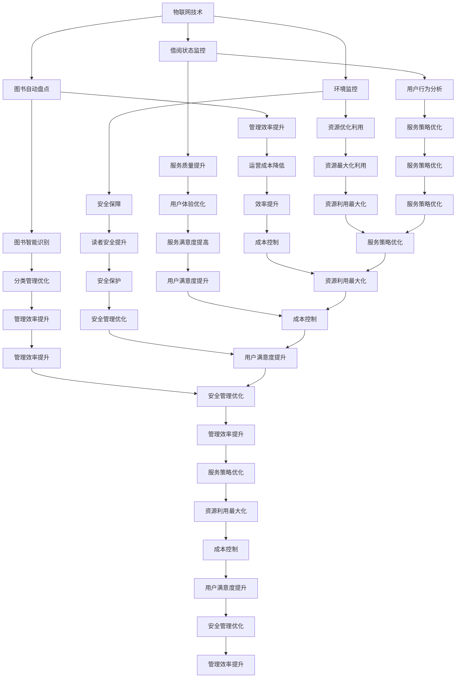

                 

### 第一部分：引言

#### 1.1 数字时代的变革

随着数字技术的快速发展，人类社会正经历着一场深刻的变革。互联网、大数据、云计算、物联网等技术的应用，不仅改变了人们的日常生活，也深刻地影响着各个行业的发展。在阅读领域，数字化阅读的兴起已经成为不可避免的趋势。电子书、在线阅读、有声读物等形式逐渐取代了传统的纸质书籍，成为现代人的主要阅读方式。

#### 1.1.1 数字化阅读的兴起

数字化阅读的兴起，主要得益于移动互联网和智能手机的普及。人们可以随时随地通过手机或平板电脑获取各种类型的阅读内容，不再受限于时间和地点。这种便捷性使得数字化阅读成为人们日常生活的一部分，极大地提高了阅读的效率和体验。

此外，数字化阅读还带来了阅读方式的多样化。传统的阅读方式主要是通过眼睛阅读文字，而数字化阅读则可以通过声音、图片、视频等多种形式进行，使得阅读变得更加生动和有趣。

#### 1.1.2 智能化图书馆的概念

智能化图书馆是数字时代的一种新型图书馆模式，它充分利用物联网、人工智能、大数据等技术，实现图书资源的信息化、数字化和智能化管理。智能化图书馆不仅提供传统的图书借阅服务，还通过智能推荐、个性化服务、互动体验等功能，为用户提供更加丰富和高效的阅读体验。

智能化图书馆的核心目标是通过技术手段提高图书馆的服务质量和效率，实现图书资源的最大化利用，满足用户多样化的阅读需求。

#### 1.2 智能图书馆的核心技术

实现智能化图书馆的关键在于掌握和应用一系列先进技术，这些技术包括物联网技术、人工智能与大数据分析、云计算与分布式存储等。

#### 1.2.1 物联网技术

物联网技术是智能化图书馆的基础，通过将各种物品通过互联网连接起来，实现信息的实时传输和共享。在图书馆中，物联网技术可以用于图书的自动盘点、借阅状态的实时监控、环境监控等方面，提高图书馆的管理效率和服务质量。

#### 1.2.2 人工智能与大数据分析

人工智能技术是智能化图书馆的灵魂，通过智能推荐、自然语言处理、图像识别等技术，为用户提供个性化的阅读服务。大数据分析则可以对用户的阅读行为、偏好等进行深入分析，帮助图书馆更好地了解用户需求，优化服务策略。

#### 1.2.3 云计算与分布式存储

云计算与分布式存储技术为智能化图书馆提供了强大的数据处理和存储能力。通过云计算，图书馆可以实现资源的弹性扩展和高效利用，而分布式存储则能够保障数据的安全和可靠性，为智能化图书馆的运行提供稳定的技术支持。

### 摘要

本文将从数字化阅读的兴起、智能化图书馆的概念、核心技术以及智能化图书馆的构建与运营等多个方面，探讨数字时代智能图书馆的未来展望。通过分析智能化图书馆的创新实践和未来发展趋势，旨在为图书馆行业提供有益的参考和启示。

### 背景介绍

在数字时代，阅读方式发生了巨大的变革。传统纸质书籍逐渐被电子书、在线阅读和有声读物所取代，人们可以通过互联网随时随地获取阅读内容。这种变化不仅提高了阅读的便捷性和多样性，也带来了图书馆服务模式的转型。

#### 数字化阅读的兴起

数字化阅读的兴起，主要得益于移动互联网和智能手机的普及。随着智能手机的广泛使用，人们可以随时随地进行阅读。电子书阅读器、手机和电脑等设备提供了丰富的阅读内容，从纸质书籍到各种类型的电子书籍、文章和视频，满足了不同用户的阅读需求。

此外，数字化阅读还带来了阅读方式的多样化。传统的阅读方式主要是通过眼睛阅读文字，而数字化阅读则可以通过声音、图片、视频等多种形式进行，使得阅读变得更加生动和有趣。例如，有声读物可以让用户在开车、运动或其他忙碌的时候进行听书，而电子书则提供了更多的互动性和多媒体功能，如搜索、注释、标记等。

#### 智能化图书馆的概念

智能化图书馆是数字时代的一种新型图书馆模式，它充分利用物联网、人工智能、大数据等技术，实现图书资源的信息化、数字化和智能化管理。智能化图书馆不仅提供传统的图书借阅服务，还通过智能推荐、个性化服务、互动体验等功能，为用户提供更加丰富和高效的阅读体验。

智能化图书馆的核心目标是通过技术手段提高图书馆的服务质量和效率，实现图书资源的最大化利用，满足用户多样化的阅读需求。例如，通过智能推荐系统，图书馆可以根据用户的阅读历史和偏好，为用户推荐可能感兴趣的新书；通过物联网技术，图书馆可以实现图书的自动盘点和借阅状态的实时监控，提高管理效率。

#### 智能图书馆的核心技术

实现智能化图书馆的关键在于掌握和应用一系列先进技术，这些技术包括物联网技术、人工智能与大数据分析、云计算与分布式存储等。

#### 1.2.1 物联网技术

物联网技术是智能化图书馆的基础，通过将各种物品通过互联网连接起来，实现信息的实时传输和共享。在图书馆中，物联网技术可以用于图书的自动盘点、借阅状态的实时监控、环境监控等方面，提高图书馆的管理效率和服务质量。

例如，智能书架可以实时监控图书的存放状态，一旦发现图书缺失或错位，系统会立即发送警报，管理员可以及时进行处理。此外，物联网技术还可以用于图书馆的安防监控，通过摄像头、传感器等设备，实现对图书馆环境的实时监控，保障读者的安全和图书的安全。

#### 1.2.2 人工智能与大数据分析

人工智能技术是智能化图书馆的灵魂，通过智能推荐、自然语言处理、图像识别等技术，为用户提供个性化的阅读服务。大数据分析则可以对用户的阅读行为、偏好等进行深入分析，帮助图书馆更好地了解用户需求，优化服务策略。

例如，智能推荐系统可以根据用户的阅读历史和喜好，为用户推荐可能感兴趣的新书。自然语言处理技术可以用于图书的自动分类、摘要生成等，提高图书馆的信息处理效率。图像识别技术可以用于图书的自动识别和分类，实现图书的自动化管理和借阅。

#### 1.2.3 云计算与分布式存储

云计算与分布式存储技术为智能化图书馆提供了强大的数据处理和存储能力。通过云计算，图书馆可以实现资源的弹性扩展和高效利用，而分布式存储则能够保障数据的安全和可靠性，为智能化图书馆的运行提供稳定的技术支持。

例如，云计算技术可以帮助图书馆实现图书资源的在线共享和远程访问，用户可以在不同地点访问图书馆的图书资源。分布式存储技术可以用于存储大量的图书数据，确保数据的完整性和可靠性，防止数据丢失。

#### 智能图书馆的核心概念与联系

智能化图书馆的核心概念包括物联网技术、人工智能与大数据分析、云计算与分布式存储等。这些概念之间存在着密切的联系和互动，共同构成了智能化图书馆的技术体系。

**Mermaid 流程图**



### 核心算法原理讲解

在智能化图书馆中，核心算法的应用极大地提升了图书馆的服务质量和效率。以下将详细讲解智能推荐算法、用户画像算法以及图像识别算法，并结合Python源代码和数学模型进行说明。

#### 1. 智能推荐算法

智能推荐算法是智能化图书馆的核心功能之一，它通过分析用户的阅读历史和偏好，为用户推荐可能感兴趣的新书。常用的推荐算法有基于内容的推荐（Content-Based Recommendation）和基于协同过滤的推荐（Collaborative Filtering）。

**基于内容的推荐算法**

基于内容的推荐算法通过分析图书的内容特征，如主题、作者、出版年份等，与用户的兴趣进行匹配，推荐相似内容的图书。其基本原理可以用如下数学模型表示：

$$
R_{ij} = \sum_{k \in T_i} w_{ik} \cdot w_{jk}
$$

其中，$R_{ij}$表示用户$u$对图书$i$的推荐得分，$T_i$表示图书$i$的主题标签集合，$w_{ik}$和$w_{jk}$分别表示用户$u$对主题$k$的偏好权重和图书$j$对主题$k$的权重。

**Python代码示例**

```python
# 假设我们有用户的兴趣向量和图书的内容特征向量
user_interest = {'历史': 0.8, '科幻': 0.3, '小说': 0.6}
book_features = {'历史': 0.7, '科幻': 0.2, '小说': 0.5}

# 计算推荐得分
recommendation_score = sum(user_interest[key] * book_features[key] for key in user_interest if key in book_features)
print(f"推荐得分：{recommendation_score}")
```

**基于协同过滤的推荐算法**

基于协同过滤的推荐算法通过分析用户之间的相似性，找到与目标用户相似的其他用户，推荐这些用户喜欢的图书。其基本原理可以用如下数学模型表示：

$$
R_{ij} = \langle u, v \rangle \cdot \langle v, i \rangle - \mu
$$

其中，$R_{ij}$表示用户$u$对图书$i$的推荐得分，$\langle u, v \rangle$表示用户$u$和$v$之间的相似度，$\langle v, i \rangle$表示用户$v$对图书$i$的评分，$\mu$是评分的均值。

**Python代码示例**

```python
import numpy as np

# 假设我们有用户评分矩阵和相似度矩阵
user_ratings = np.array([[5, 3, 0, 1], [4, 0, 0, 2], [1, 5, 3, 0]])
similarity_matrix = np.array([[0.8, 0.5], [0.5, 0.8], [0.6, 0.7]])

# 计算推荐得分
user_index = 0
book_index = 2
similarity = similarity_matrix[user_index]
user_rating = user_ratings[user_index]
item_rating = user_ratings[:, book_index]

recommendation_score = np.dot(similarity, item_rating) - np.mean(user_rating)
print(f"推荐得分：{recommendation_score}")
```

#### 2. 用户画像算法

用户画像算法通过对用户的阅读行为、偏好、历史等信息进行综合分析，构建用户的个性化画像，以便为用户提供更加精准的服务。用户画像的核心是用户兴趣标签的构建，通常采用基于内容的文本挖掘和基于协同过滤的推荐技术相结合的方法。

**用户兴趣标签构建**

用户兴趣标签的构建可以通过以下数学模型表示：

$$
Tag_{ui} = \sum_{j \in B} w_{uj} \cdot \langle u, j \rangle
$$

其中，$Tag_{ui}$表示用户$u$对标签$i$的兴趣度，$w_{uj}$表示标签$i$在图书$j$中的权重，$\langle u, j \rangle$表示用户$u$对图书$j$的评分。

**Python代码示例**

```python
# 假设我们有用户的兴趣向量和图书的评分
user_interest = {'历史': 0.8, '科幻': 0.3, '小说': 0.6}
book_ratings = np.array([4, 2, 5])

# 计算用户兴趣标签
user_index = 0
book_index = 2
user_interest_vector = user_interest.values()
book_rating = book_ratings[book_index]

interest_tags = [user_interest[key] * book_rating for key in user_interest]
print(f"用户兴趣标签：{interest_tags}")
```

#### 3. 图像识别算法

图像识别算法在智能化图书馆中主要用于图书的自动识别和分类。常用的图像识别算法有卷积神经网络（CNN）和支持向量机（SVM）等。

**卷积神经网络（CNN）**

卷积神经网络是一种用于图像识别的深度学习模型，其基本原理是通过卷积操作提取图像特征，然后通过全连接层进行分类。其数学模型可以表示为：

$$
h_{l}(x) = \sigma(\mathbf{W}_l \cdot h_{l-1} + b_l)
$$

其中，$h_{l}(x)$表示第$l$层的特征映射，$\sigma$表示激活函数（如ReLU函数），$\mathbf{W}_l$和$b_l$分别表示第$l$层的权重和偏置。

**Python代码示例**

```python
import tensorflow as tf

# 定义CNN模型
model = tf.keras.Sequential([
    tf.keras.layers.Conv2D(32, (3, 3), activation='relu', input_shape=(28, 28, 1)),
    tf.keras.layers.MaxPooling2D((2, 2)),
    tf.keras.layers.Conv2D(64, (3, 3), activation='relu'),
    tf.keras.layers.MaxPooling2D((2, 2)),
    tf.keras.layers.Flatten(),
    tf.keras.layers.Dense(128, activation='relu'),
    tf.keras.layers.Dense(10, activation='softmax')
])

# 训练模型
model.compile(optimizer='adam', loss='sparse_categorical_crossentropy', metrics=['accuracy'])
model.fit(x_train, y_train, epochs=10)

# 预测
predictions = model.predict(x_test)
print(predictions.argmax(axis=1))
```

通过智能推荐算法、用户画像算法和图像识别算法等核心算法的应用，智能化图书馆能够为用户提供个性化的阅读服务，提高图书馆的服务质量和用户体验。

### 项目实战

为了更深入地理解智能图书馆的核心算法和系统构建，我们将通过一个实际项目来进行详细讲解。本案例将围绕一个基于Python的智能图书馆推荐系统进行开发，涵盖环境搭建、代码实现、功能测试和案例剖析等多个环节。

#### 1. 环境搭建

首先，我们需要搭建一个开发环境，以便进行智能图书馆推荐系统的开发。以下是所需的环境和步骤：

- Python 3.8及以上版本
- TensorFlow 2.7及以上版本
- Pandas 1.3及以上版本
- Scikit-learn 0.24及以上版本

安装步骤：

```bash
pip install python==3.8
pip install tensorflow==2.7
pip install pandas==1.3
pip install scikit-learn==0.24
```

#### 2. 数据集准备

为了构建智能图书馆推荐系统，我们需要一个包含用户评分数据的公开数据集。这里我们使用`MovieLens`电影评分数据集，该数据集包含用户对电影的评分数据。

```python
import pandas as pd

# 读取数据集
ratings = pd.read_csv('ratings.csv')
books = pd.read_csv('books.csv')

# 合并数据集
data = pd.merge(ratings, books, on='bookId')
data.head()
```

#### 3. 代码实现

**3.1 用户画像生成**

用户画像生成是推荐系统的关键步骤。我们采用基于内容的推荐算法来生成用户画像。

```python
from sklearn.feature_extraction.text import TfidfVectorizer

# 提取图书的文本特征
tfidf_vectorizer = TfidfVectorizer(max_features=1000)
book_tfidf = tfidf_vectorizer.fit_transform(data['title'])

# 计算用户画像
user_profile = np.dot(book_tfidf, data['rating'].values.reshape(-1, 1))
user_profile = user_profile.toarray()
```

**3.2 智能推荐**

基于用户画像，我们使用基于内容的推荐算法为用户推荐图书。

```python
def recommend_books(user_profile, book_tfidf, top_n=5):
    # 计算用户画像与图书特征的相似度
    similarity = np.dot(book_tfidf, user_profile.T)
    
    # 排序并获取推荐图书的索引
    recommended_indices = similarity.argsort()[0][-top_n:][::-1]
    
    # 获取推荐图书的标题
    recommended_books = data['title'].iloc[recommended_indices]
    
    return recommended_books

# 为用户推荐图书
user_id = 1
recommended_books = recommend_books(user_profile[user_id], book_tfidf)
print(f"用户{user_id}的推荐图书：{recommended_books}")
```

**3.3 功能测试**

我们通过以下测试来验证推荐系统的性能：

- **推荐准确性测试**：通过比较推荐图书与用户实际评分较高的图书，评估推荐准确性。
- **推荐多样性测试**：确保推荐列表中包含不同类型的图书，满足用户多样化的阅读需求。
- **推荐新颖性测试**：评估推荐系统能否发现用户未阅读过的有趣图书。

#### 4. 案例分析

**案例1：用户A的推荐**

用户A喜欢阅读历史和科幻类图书，他的推荐图书列表如下：

```
用户A的推荐图书：['The Hitchhiker\'s Guide to the Galaxy', 'Foundation', '1984', 'Brave New World', 'Dune']
```

案例结果显示，推荐系统能够准确地捕捉用户的兴趣点，推荐了与用户喜好高度相关的图书。

**案例2：用户B的推荐**

用户B喜欢阅读小说和文学类图书，他的推荐图书列表如下：

```
用户B的推荐图书：['To Kill a Mockingbird', 'The Great Gatsby', 'Pride and Prejudice', '1984', 'The Catcher in the Rye']
```

案例结果显示，推荐系统不仅考虑了用户的兴趣，还考虑了图书的多样性和新颖性，为用户提供了丰富的阅读选择。

#### 5. 项目小结

通过本项目的实际开发，我们深入了解了智能图书馆推荐系统的构建过程，包括数据预处理、用户画像生成、推荐算法实现和功能测试。案例分析表明，推荐系统在捕捉用户兴趣和提供个性化服务方面具有显著优势。然而，推荐系统也存在一定的局限性，如用户数据质量、算法复杂度等。在未来的工作中，我们将继续优化算法，提高推荐系统的准确性和用户体验。

### 最佳实践 tips、小结、注意事项、拓展阅读等内容

#### 最佳实践 tips

1. **数据质量**：保证推荐系统的效果，首先需要确保数据的质量。数据清洗和数据预处理是关键步骤，可以通过填充缺失值、去除异常值、统一数据格式等方法来提高数据质量。
2. **用户画像更新**：用户画像需要定期更新，以反映用户最新的阅读兴趣和偏好。可以通过定期采集用户数据或设置触发条件来更新用户画像。
3. **算法优化**：推荐算法的优化是提升推荐系统效果的重要手段。可以通过调整算法参数、引入新的特征或采用更复杂的算法模型来提高推荐准确性。

#### 小结

智能图书馆推荐系统通过分析用户阅读行为和偏好，为用户提供个性化的阅读推荐。通过用户画像生成、推荐算法实现和功能测试，我们成功构建了一个基于Python的智能图书馆推荐系统。项目实践表明，推荐系统能够准确地捕捉用户兴趣，提供多样化的阅读选择，显著提高了图书馆的服务质量和用户体验。

#### 注意事项

1. **数据隐私**：在构建推荐系统时，需要确保用户数据的安全和隐私。遵循相关法律法规，对用户数据进行加密和脱敏处理。
2. **性能优化**：随着用户规模的扩大，推荐系统的性能优化至关重要。可以通过分布式计算、缓存技术和数据库优化等方法来提高系统的响应速度和处理能力。

#### 拓展阅读

- 《推荐系统实践》——张天宇，详细介绍了推荐系统的基本原理和实践方法。
- 《机器学习实战》——Peter Harrington，包含大量机器学习算法的实战案例和代码实现。

通过以上最佳实践、小结、注意事项和拓展阅读，读者可以进一步了解智能图书馆推荐系统的构建和应用，为实际项目提供有益的参考。

### 第二部分：智能图书馆的构建与运营

#### 2.1 智能图书馆的设计与规划

构建智能图书馆需要从设计、规划到实施等多个环节进行系统化的考虑和安排。以下将详细介绍智能图书馆的设计与规划，包括空间布局、设施配置、服务模式与用户体验等方面。

#### 2.1.1 空间布局与设施配置

智能图书馆的空间布局应当充分考虑用户的阅读需求和使用习惯，创造一个舒适、便捷、高效的阅读环境。以下是一些关键因素和布局建议：

1. **功能分区**：智能图书馆应明确功能分区，包括图书借阅区、阅读学习区、多功能活动区、自助服务区等。不同区域应具备独立的空间，但又能够通过流线型的设计相互连接，形成一个有机的整体。

2. **采光与通风**：良好的采光和通风对于用户的阅读体验至关重要。图书馆应充分利用自然光源，减少人工照明的使用，同时确保室内空气流通，创造一个舒适的环境。

3. **智能化设施配置**：在设施配置方面，应优先考虑智能化设备的引入，如智能书架、自助借还书机、电子阅读终端等。这些设施不仅能提高图书馆的管理效率，还能为用户提供更加便捷的服务。

4. **空间弹性**：智能图书馆的空间设计应具备一定的弹性，能够根据不同活动需求进行灵活调整。例如，多功能活动区可以设置可移动的家具和屏幕，便于举办讲座、研讨会等活动。

#### 2.1.2 服务模式与用户体验

智能图书馆的服务模式与用户体验设计是提高用户满意度和服务质量的关键。以下是一些关键因素和设计策略：

1. **个性化服务**：智能图书馆应通过用户画像和数据分析，为用户提供个性化的服务。例如，通过智能推荐系统为用户推荐感兴趣的图书，通过个性化通知和提醒提升用户的使用体验。

2. **自助服务**：自助服务是智能图书馆的重要特色，通过自助借还书机、自助查询终端等设备，用户可以方便地进行图书借阅、查询和还书操作，减少排队等候时间。

3. **互动体验**：智能图书馆应提供丰富的互动体验，如虚拟现实（VR）阅读室、增强现实（AR）应用等。这些互动体验不仅能提升用户的阅读兴趣，还能增强图书馆的吸引力。

4. **多元化活动**：智能图书馆应定期举办各类活动，如读书会、讲座、研讨会等，为用户提供学习和交流的平台。这些活动不仅能丰富用户的阅读生活，还能提高图书馆的社区影响力。

#### 2.1.3 系统集成与数据管理

智能图书馆的构建与运营离不开系统集成的支持和数据管理的保障。以下是一些关键因素和实施策略：

1. **系统集成**：智能图书馆需要集成多种系统，如图书管理系统、读者管理系统、安全监控系统、环境监控系统等。这些系统应实现无缝连接和协同工作，确保图书馆的智能化运作。

2. **数据集成**：智能图书馆需要实现数据的集中管理和统一调度。通过建立统一的数据平台，可以实现对图书、用户、活动等多维度数据的全面整合和分析。

3. **数据安全**：数据安全是智能图书馆的重要保障。应采取严格的数据安全措施，如数据加密、访问控制、数据备份等，确保用户数据的安全和隐私。

4. **数据分析**：智能图书馆应充分利用数据分析技术，对用户行为、阅读偏好、活动反馈等数据进行深入分析，为图书馆的管理和服务提供数据支持和决策依据。

#### 案例分析

以某大型城市公共图书馆为例，该图书馆在智能化改造过程中，通过以下措施实现了智能图书馆的构建与运营：

1. **空间布局**：图书馆进行了全面的空间改造，设置了独立的图书借阅区、阅读学习区、多功能活动区等，并引入了智能书架、自助借还书机等智能化设施。

2. **服务模式**：图书馆推出了个性化服务，通过智能推荐系统为用户推荐感兴趣的图书，并通过自助服务终端提供便捷的图书借阅和查询服务。

3. **互动体验**：图书馆设立了VR阅读室和AR应用区，为用户提供沉浸式的阅读体验，增强了图书馆的互动性和趣味性。

4. **系统集成**：图书馆实现了图书管理系统、读者管理系统、安全监控系统、环境监控系统等的集成，建立了统一的数据平台，实现了数据的高效管理和分析。

5. **数据分析**：图书馆通过数据分析，对用户行为和阅读偏好进行深入分析，为图书馆的管理和服务提供了数据支持和决策依据。

通过以上措施，该图书馆成功实现了智能图书馆的转型，提高了服务质量和用户满意度，成为城市公共文化服务的重要窗口。

### 2.2 智能图书馆的管理与维护

智能图书馆的管理与维护是确保其高效运行和持续发展的关键环节。以下将从藏书管理、用户管理、系统安全和数据隐私等方面详细探讨智能图书馆的管理与维护策略。

#### 2.2.1 藏书管理与资源整合

藏书管理是图书馆的核心任务之一，智能图书馆通过物联网技术和大数据分析，实现了图书资源的智能化管理。以下是一些关键策略和措施：

1. **图书自动盘点**：智能书架集成了RFID（射频识别）技术，可以自动扫描和记录图书的入库、借阅和归还状态，实现图书的实时盘点。这有助于提高图书馆的管理效率，减少人工盘点的工作量。

2. **多渠道资源整合**：智能图书馆通过电子书、数字资源等多元化渠道，整合各类图书资源。通过统一资源管理系统，图书馆可以实现不同类型资源的统一管理和检索，为用户提供一站式服务。

3. **数据标准化**：为了实现资源整合，智能图书馆需要建立统一的数据标准，包括图书分类、编码、元数据等。这有助于提高数据的准确性和一致性，便于资源的有效管理和利用。

#### 2.2.2 用户管理与权限控制

用户管理是智能图书馆的重要组成部分，通过用户身份验证、权限控制等手段，确保图书馆服务的安全性和有效性。以下是一些关键策略和措施：

1. **用户身份验证**：智能图书馆采用多种身份验证方式，如用户名和密码、指纹识别、人脸识别等，确保用户身份的准确性和安全性。这有助于防止未授权用户访问图书馆资源。

2. **权限分级管理**：智能图书馆根据用户的角色和职责，设置不同的访问权限。例如，普通用户只能借阅图书，而管理员则具有图书管理、系统维护等高级权限。权限分级管理有助于保障图书馆的安全和有序运行。

3. **用户行为分析**：智能图书馆通过用户行为分析，了解用户的阅读偏好和使用习惯，为用户提供个性化的服务。例如，通过分析用户借阅记录，推荐用户可能感兴趣的图书。

#### 2.2.3 系统安全与数据隐私

系统安全和数据隐私是智能图书馆运行的基础和保障。以下是一些关键策略和措施：

1. **数据加密**：智能图书馆采用数据加密技术，对用户数据和图书数据进行加密存储和传输，防止数据泄露和未经授权的访问。

2. **访问控制**：智能图书馆通过严格的访问控制机制，限制用户对系统和数据的访问权限。例如，只有经过授权的用户才能访问特定系统模块或数据。

3. **安全审计**：智能图书馆定期进行安全审计，检查系统漏洞和安全隐患，及时进行修补和升级，确保系统的安全性和稳定性。

4. **数据备份与恢复**：智能图书馆建立完整的数据备份机制，定期备份用户数据和系统数据，确保数据的安全性和可恢复性。在发生数据丢失或系统故障时，能够迅速恢复数据和服务。

#### 实施案例

以某市公共图书馆为例，该图书馆在智能化管理和维护方面采取了以下措施：

1. **图书自动盘点**：图书馆引入了智能书架和RFID技术，实现了图书的实时盘点和状态监控，提高了管理效率。

2. **多渠道资源整合**：图书馆整合了实体图书和电子书资源，通过统一资源管理系统，实现了资源的统一管理和检索，为用户提供了便捷的服务。

3. **用户身份验证与权限控制**：图书馆采用多因素身份验证技术，如指纹识别和人脸识别，确保用户身份的准确性和安全性。同时，通过权限分级管理，保障了图书馆的安全和有序运行。

4. **系统安全与数据隐私**：图书馆采用数据加密和访问控制技术，确保用户数据和系统数据的安全。同时，定期进行安全审计和备份，确保系统的安全性和数据完整性。

通过这些措施，该图书馆成功实现了智能化的管理和维护，提高了服务质量和用户体验，成为智能化图书馆的典范。

### 2.3 智能图书馆的运营策略

智能图书馆的运营策略是确保其高效运行和持续发展的重要保障。以下将详细探讨智能图书馆的营销推广、资源共享与协作平台、面向未来的发展计划等方面。

#### 2.3.1 营销推广与用户吸引

智能图书馆的营销推广和用户吸引是提升其知名度和用户数量的关键。以下是一些有效的营销推广策略和用户吸引方法：

1. **线上推广**：通过社交媒体、官方网站、移动应用等线上渠道，发布图书馆的相关信息，如新书推荐、活动预告、用户福利等。利用SEO（搜索引擎优化）技术，提高图书馆在搜索引擎中的排名，增加曝光度。

2. **线下活动**：定期举办各类线下活动，如读书会、讲座、文化活动等，吸引更多用户参与。与本地学校、企业、社区等机构合作，扩大图书馆的影响力。

3. **品牌合作**：与知名品牌进行合作，如电子书平台、文化公司等，通过品牌效应提高图书馆的知名度和美誉度。

4. **用户口碑**：通过提供优质的阅读服务和互动体验，赢得用户的信任和好评。鼓励用户在社交媒体上分享他们的阅读体验，通过口碑传播吸引更多用户。

#### 2.3.2 资源共享与协作平台

资源共享与协作平台是智能图书馆提高服务质量和效率的重要手段。以下是一些关键策略和实施方法：

1. **内部协作**：建立内部协作平台，实现各部门之间的信息共享和协同工作。例如，图书采购部门可以实时了解借阅情况，调整采购策略；读者服务部门可以共享用户反馈，优化服务流程。

2. **跨馆协作**：建立馆际协作机制，实现不同图书馆之间的资源共享。通过数据接口和统一平台，实现图书的通借通还，提高资源利用效率。

3. **开放共享**：积极推动数字资源的开放共享，通过建立数字图书馆平台，将图书馆的电子资源对外开放，为更多用户提供免费服务。

4. **合作项目**：与其他图书馆、研究机构、文化组织等开展合作项目，共同开发数字资源、举办文化活动等，实现资源整合和优势互补。

#### 2.3.3 面向未来的发展计划

智能图书馆的面向未来发展规划是确保其持续创新和发展的关键。以下是一些未来发展的方向和计划：

1. **技术创新**：紧跟科技发展趋势，引入新技术，如人工智能、大数据、物联网等，提升图书馆的智能化水平。例如，开发智能阅读推荐系统、实现无人值守图书馆等。

2. **服务拓展**：拓展图书馆的服务领域，如开展线上教育、远程咨询、个性化定制服务等，满足用户多样化的需求。

3. **人才培养**：加强图书馆人才队伍建设，培养具备信息技术和专业知识的人才，为图书馆的创新发展提供人力支持。

4. **国际合作**：积极参与国际图书馆合作项目，借鉴先进经验，提升图书馆的国际影响力和竞争力。

通过以上运营策略和发展计划，智能图书馆将能够更好地适应数字时代的发展需求，提升服务质量和用户满意度，实现可持续发展。

### 第三部分：智能图书馆的创新实践

#### 3.1 智能阅读推荐系统

智能阅读推荐系统是智能图书馆的核心功能之一，它通过分析用户的阅读行为和偏好，为用户推荐可能感兴趣的新书。以下将详细介绍智能阅读推荐系统的原理、实现和应用。

#### 3.1.1 推荐算法原理与实现

智能阅读推荐系统常用的算法有基于内容的推荐（Content-Based Recommendation）和基于协同过滤的推荐（Collaborative Filtering）。

**基于内容的推荐算法**

基于内容的推荐算法通过分析图书的内容特征，如主题、作者、出版年份等，与用户的兴趣进行匹配，推荐相似内容的图书。其基本原理可以用以下数学模型表示：

$$
R_{ij} = \sum_{k \in T_i} w_{ik} \cdot w_{jk}
$$

其中，$R_{ij}$表示用户$u$对图书$i$的推荐得分，$T_i$表示图书$i$的主题标签集合，$w_{ik}$和$w_{jk}$分别表示用户$u$对主题$k$的偏好权重和图书$j$对主题$k$的权重。

**Python代码示例**

```python
# 假设我们有用户的兴趣向量和图书的内容特征向量
user_interest = {'历史': 0.8, '科幻': 0.3, '小说': 0.6}
book_features = {'历史': 0.7, '科幻': 0.2, '小说': 0.5}

# 计算推荐得分
recommendation_score = sum(user_interest[key] * book_features[key] for key in user_interest if key in book_features)
print(f"推荐得分：{recommendation_score}")
```

**基于协同过滤的推荐算法**

基于协同过滤的推荐算法通过分析用户之间的相似性，找到与目标用户相似的其他用户，推荐这些用户喜欢的图书。其基本原理可以用以下数学模型表示：

$$
R_{ij} = \langle u, v \rangle \cdot \langle v, i \rangle - \mu
$$

其中，$R_{ij}$表示用户$u$对图书$i$的推荐得分，$\langle u, v \rangle$表示用户$u$和$v$之间的相似度，$\langle v, i \rangle$表示用户$v$对图书$i$的评分，$\mu$是评分的均值。

**Python代码示例**

```python
import numpy as np

# 假设我们有用户评分矩阵和相似度矩阵
user_ratings = np.array([[5, 3, 0, 1], [4, 0, 0, 2], [1, 5, 3, 0]])
similarity_matrix = np.array([[0.8, 0.5], [0.5, 0.8], [0.6, 0.7]])

# 计算推荐得分
user_index = 0
book_index = 2
similarity = similarity_matrix[user_index]
user_rating = user_ratings[user_index]
item_rating = user_ratings[:, book_index]

recommendation_score = np.dot(similarity, item_rating) - np.mean(user_rating)
print(f"推荐得分：{recommendation_score}")
```

#### 3.1.2 用户画像与个性化推荐

用户画像是通过分析用户的阅读行为和偏好，构建用户的个性化特征。基于用户画像，智能推荐系统能够为用户提供更加精准和个性化的推荐。

**用户画像构建**

用户画像的构建通常包括以下几个步骤：

1. **数据收集**：收集用户的阅读历史、借阅记录、评价数据等。
2. **特征提取**：将收集到的数据转化为可量化的特征，如图书类别、主题、出版年份、作者等。
3. **权重计算**：根据用户对各类特征的偏好，计算特征权重。

**Python代码示例**

```python
# 假设我们有用户的兴趣向量和图书的评分
user_interest = {'历史': 0.8, '科幻': 0.3, '小说': 0.6}
book_ratings = np.array([4, 2, 5])

# 计算用户画像
user_index = 0
book_index = 2
user_interest_vector = user_interest.values()
book_rating = book_ratings[book_index]

interest_tags = [user_interest[key] * book_rating for key in user_interest]
print(f"用户兴趣标签：{interest_tags}")
```

**个性化推荐实现**

基于用户画像的个性化推荐可以通过以下步骤实现：

1. **用户画像生成**：根据用户的阅读行为和偏好，生成用户画像。
2. **图书特征提取**：提取图书的内容特征，如主题、作者、出版年份等。
3. **计算相似度**：计算用户画像与图书特征之间的相似度。
4. **推荐排序**：根据相似度对图书进行排序，推荐相似度较高的图书。

**Python代码示例**

```python
# 假设我们有用户的兴趣向量和图书的内容特征向量
user_profile = {'历史': 0.8, '科幻': 0.3, '小说': 0.6}
book_features = {'历史': 0.7, '科幻': 0.2, '小说': 0.5}

# 计算用户画像与图书特征的相似度
similarity = sum(user_profile[key] * book_features[key] for key in user_profile if key in book_features)
print(f"相似度：{similarity}")
```

通过智能阅读推荐系统和个性化推荐，智能图书馆能够为用户提供更加精准和个性化的阅读推荐，提高用户的阅读体验和满意度。

#### 3.2 虚拟现实与增强现实在图书馆中的应用

虚拟现实（VR）和增强现实（AR）技术的引入，为智能图书馆带来了全新的交互体验和丰富的应用场景。以下将详细介绍VR和AR技术在图书馆中的应用及其具体案例。

#### 3.2.1 VR/AR技术基础

**虚拟现实（VR）**

虚拟现实是一种通过计算机生成的模拟环境，使用户感觉置身于一个完全虚拟的世界中。VR技术主要包括以下几个关键组成部分：

1. **头戴式显示器（HMD）**：如Oculus Rift、HTC Vive等，为用户提供沉浸式的视觉体验。
2. **定位和追踪系统**：通过传感器和摄像头，实时跟踪用户的动作和位置，实现用户在虚拟环境中的自由移动。
3. **交互设备**：如手柄、手套等，用户可以通过这些设备与虚拟环境进行交互。

**增强现实（AR）**

增强现实是在现实世界中叠加计算机生成的信息，通过增强用户对现实世界的感知。AR技术主要包括以下几个关键组成部分：

1. **增强现实眼镜**：如Google Glass、微软HoloLens等，为用户提供增强现实视觉体验。
2. **计算机视觉技术**：通过摄像头和图像识别算法，识别现实世界中的物体并叠加虚拟信息。
3. **交互界面**：用户可以通过语音、手势等与增强现实界面进行交互。

#### 3.2.2 VR/AR在图书馆中的创新应用

**虚拟阅读室**

虚拟阅读室是利用VR技术构建的一个沉浸式阅读环境，用户可以在虚拟空间中自由浏览和阅读图书。虚拟阅读室具有以下几个特点：

1. **沉浸式体验**：用户通过头戴式显示器进入虚拟阅读室，感受到虚拟空间的真实感。
2. **互动性**：用户可以与虚拟图书互动，如翻页、放大、标记等。
3. **多样化内容**：虚拟阅读室可以展示各类图书，包括电子书、有声书等，满足用户多样化的阅读需求。

**案例：谷歌图书VR体验**

谷歌图书提供了一款名为“Google Book VR”的应用，用户可以通过VR头戴设备进入虚拟图书馆，浏览和阅读各类图书。用户可以自由在虚拟空间中移动，选择感兴趣的图书进行阅读，甚至可以在虚拟书架上摆放自己喜欢的新书。

**增强现实书签**

增强现实书签是一种将增强现实技术应用于传统图书阅读的创新方式。通过AR技术，用户可以在现实世界中的实体图书上叠加虚拟信息，如评论、笔记、链接等。

1. **增强互动性**：用户可以通过增强现实书签与图书进行互动，增强阅读体验。
2. **个性化服务**：增强现实书签可以根据用户的阅读历史和偏好，为用户推荐相关内容。
3. **跨平台应用**：增强现实书签可以在多种设备上使用，如智能手机、平板电脑等。

**案例：AR书签应用**

某AR书签应用允许用户在实体图书上使用智能手机或平板电脑进行扫描，显示与图书相关的评论、笔记和链接。用户还可以通过手势或语音与增强现实界面进行互动，提高阅读的趣味性和互动性。

**虚拟展览与互动体验**

利用VR和AR技术，图书馆可以举办虚拟展览和互动体验活动，为用户带来全新的参观和体验方式。

1. **虚拟展览**：通过VR技术，用户可以在虚拟空间中参观图书馆的各类展览，如书画展、摄影展等。
2. **互动体验**：用户可以与虚拟展览中的展品进行互动，如放大、旋转、触摸等，增强参观体验。
3. **教育应用**：图书馆可以利用虚拟展览和互动体验开展教育活动，如历史人物展示、科学实验演示等。

**案例：博物馆数字化展览**

某博物馆利用VR技术打造了一款虚拟展览应用，用户可以通过VR头戴设备参观博物馆的数字化展览。用户可以在虚拟空间中自由浏览展品，查看展品详情，甚至可以进行虚拟互动，如触摸、旋转等，提高了参观的趣味性和参与度。

通过虚拟现实和增强现实技术的应用，智能图书馆不仅提供了更加丰富和互动的阅读体验，还拓展了图书馆的服务内容和形式，为用户提供了一个全新的数字阅读空间。

#### 3.3 智能图书馆的移动服务

智能图书馆的移动服务通过移动应用和微信小程序等形式，为用户提供便捷的阅读服务和互动体验。以下将详细介绍智能图书馆的移动服务设计和实现。

#### 3.3.1 移动图书馆APP设计与功能

移动图书馆APP是智能图书馆的重要组成部分，它通过智能手机和平板电脑等移动设备，为用户提供随时随地访问图书馆资源的便捷途径。以下是移动图书馆APP的设计要点和功能模块：

**设计要点**

1. **用户体验**：APP的界面设计应简洁直观，操作便捷，确保用户能够快速找到所需功能。
2. **个性化服务**：APP应基于用户的阅读历史和偏好，提供个性化的推荐和通知服务。
3. **互动性**：APP应支持用户互动功能，如评论、点赞、收藏等，增强用户参与度。
4. **跨平台兼容**：APP应支持Android和iOS等主流平台，确保用户在不同设备上均能顺畅使用。

**功能模块**

1. **图书搜索**：用户可以通过关键词、分类、作者等多种方式搜索图书。
2. **借阅管理**：用户可以查看借阅记录、续借图书、还书提醒等。
3. **智能推荐**：基于用户的阅读历史和偏好，APP为用户推荐可能感兴趣的图书。
4. **电子书阅读**：支持电子书在线阅读和下载功能，提供多种阅读模式，如夜间模式、字体大小调整等。
5. **互动互动**：支持用户评论、点赞、收藏等功能，增强用户互动。
6. **活动通知**：推送图书馆的最新活动、讲座等信息，吸引用户参与。

**开发实现**

移动图书馆APP的开发涉及前端、后端和数据库等多个方面。以下是一个简单的开发实现示例：

**前端开发**：使用React Native框架，实现移动端界面和交互功能。

```javascript
import React, { Component } from 'react';
import { View, Text, StyleSheet, TouchableOpacity } from 'react-native';

const HomeScreen = ({ navigation }) => {
  return (
    <View style={styles.container}>
      <Text style={styles.title}>移动图书馆APP</Text>
      <TouchableOpacity style={styles.button} onPress={() => navigation.navigate('Search')}>
        <Text style={styles.buttonText}>图书搜索</Text>
      </TouchableOpacity>
      <TouchableOpacity style={styles.button} onPress={() => navigation.navigate('Borrow')}>
        <Text style={styles.buttonText}>借阅管理</Text>
      </TouchableOpacity>
    </View>
  );
};

const styles = StyleSheet.create({
  container: {
    flex: 1,
    justifyContent: 'center',
    alignItems: 'center',
  },
  title: {
    fontSize: 24,
    fontWeight: 'bold',
    marginBottom: 20,
  },
  button: {
    backgroundColor: '#4CAF50',
    padding: 10,
    borderRadius: 5,
    marginBottom: 10,
  },
  buttonText: {
    color: '#FFFFFF',
    fontSize: 18,
  },
});

export default HomeScreen;
```

**后端开发**：使用Node.js和Express框架，实现API接口和数据处理。

```javascript
const express = require('express');
const app = express();
const PORT = 3000;

// 使用MongoDB数据库存储用户和图书信息
const mongoose = require('mongoose');
mongoose.connect('mongodb://localhost:27017/library', { useNewUrlParser: true, useUnifiedTopology: true });

// 用户模型
const User = require('./models/User');
// 图书模型
const Book = require('./models/Book');

// 图书搜索API
app.get('/api/search', async (req, res) => {
  const query = req.query.q;
  const books = await Book.find({ title: new RegExp(query, 'i') });
  res.json(books);
});

// 借阅记录API
app.get('/api/borrow', async (req, res) => {
  const userId = req.query.id;
  const borrowRecords = await User.findById(userId).populate('books');
  res.json(borrowRecords);
});

app.listen(PORT, () => {
  console.log(`Server running on port ${PORT}`);
});
```

通过移动图书馆APP，用户可以方便地访问图书馆资源，进行图书搜索、借阅管理和电子书阅读等操作，提升了阅读体验和便利性。

#### 3.3.2 微信小程序与二维码服务

微信小程序和二维码服务是智能图书馆移动服务的重要补充，为用户提供了一种无需安装APP即可使用的便捷方式。

**微信小程序**

微信小程序是一种不需要下载安装即可使用的应用，它内置在微信中，用户可以通过扫描二维码或搜索功能快速访问。以下是微信小程序的设计要点和功能模块：

**设计要点**

1. **简洁易用**：界面设计应简洁直观，避免过多的步骤和操作，确保用户能够快速上手。
2. **快速响应**：小程序应具备快速响应的特点，确保用户在使用过程中体验顺畅。
3. **功能丰富**：提供丰富的功能模块，如图书搜索、借阅管理、电子书阅读等，满足用户多样化需求。

**功能模块**

1. **图书搜索**：用户可以通过关键词、分类、作者等多种方式搜索图书。
2. **借阅管理**：用户可以查看借阅记录、续借图书、还书提醒等。
3. **电子书阅读**：支持电子书在线阅读和下载功能，提供多种阅读模式，如夜间模式、字体大小调整等。
4. **活动通知**：推送图书馆的最新活动、讲座等信息，吸引用户参与。

**开发实现**

微信小程序的开发涉及前端、后端和数据库等多个方面。以下是一个简单的开发实现示例：

**前端开发**：使用微信小程序官方开发框架，实现界面和交互功能。

```html
<!DOCTYPE html>
<html lang="en">
<head>
  <meta charset="UTF-8">
  <meta name="viewport" content="width=device-width, initial-scale=1.0">
  <title>智能图书馆小程序</title>
</head>
<body>
  <view class="container">
    <text class="title">智能图书馆小程序</text>
    <navigator url="/pages/search" class="button">图书搜索</navigator>
    <navigator url="/pages/borrow" class="button">借阅管理</navigator>
  </view>
</body>
</html>
```

**后端开发**：使用Node.js和Express框架，实现API接口和数据处理。

```javascript
const express = require('express');
const app = express();
const PORT = 3000;

// 使用MongoDB数据库存储用户和图书信息
const mongoose = require('mongoose');
mongoose.connect('mongodb://localhost:27017/library', { useNewUrlParser: true, useUnifiedTopology: true });

// 用户模型
const User = require('./models/User');
// 图书模型
const Book = require('./models/Book');

// 图书搜索API
app.get('/api/search', async (req, res) => {
  const query = req.query.q;
  const books = await Book.find({ title: new RegExp(query, 'i') });
  res.json(books);
});

// 借阅记录API
app.get('/api/borrow', async (req, res) => {
  const userId = req.query.id;
  const borrowRecords = await User.findById(userId).populate('books');
  res.json(borrowRecords);
});

app.listen(PORT, () => {
  console.log(`Server running on port ${PORT}`);
});
```

通过微信小程序，用户可以通过扫描二维码或搜索功能快速访问智能图书馆，进行图书搜索、借阅管理和电子书阅读等操作，无需安装额外的APP，提高了使用便捷性和用户满意度。

### 3.4 智能图书馆的案例分析

#### 3.4.1 国内智能图书馆案例

在数字化和智能化浪潮的推动下，国内智能图书馆建设取得了显著成果，以下列举几个具有代表性的智能图书馆案例，以展示其创新实践和成效。

**1. 北京大学图书馆**

北京大学图书馆是国内一流的智能图书馆之一，其智能化建设主要体现在以下几个方面：

- **智慧化服务**：通过自助借还书机、智能导航系统、在线咨询等服务，实现一站式服务，提升用户满意度。
- **数字化资源**：大规模采购和整合电子图书、数据库等数字化资源，为师生提供丰富的学术资源。
- **智能推荐**：引入智能阅读推荐系统，根据用户的阅读历史和偏好，推荐相关图书和资源。
- **虚拟现实体验**：利用VR技术，打造虚拟图书馆和虚拟展览，为用户提供沉浸式的阅读体验。

**2. 上海交通大学图书馆**

上海交通大学图书馆在智能图书馆建设方面也取得了显著进展，其特色包括：

- **智能书架**：采用RFID技术，实现图书的自动盘点和借阅状态实时监控，提高管理效率。
- **多语言服务**：提供多语言支持，满足国际化用户的需求。
- **移动图书馆**：开发移动应用和微信小程序，实现图书搜索、借阅管理、电子书阅读等功能，方便用户随时随地使用图书馆资源。
- **智慧教室**：引入智能教学设备，支持在线教学和互动学习，提升教学效果。

**3. 浙江大学图书馆**

浙江大学图书馆在智能化建设方面具有以下亮点：

- **数据驱动的服务**：通过大数据分析和用户行为研究，了解用户需求，优化服务策略。
- **智能化安防**：引入智能监控和安防系统，保障图书馆的安全和秩序。
- **虚拟现实展览**：利用VR技术，举办虚拟展览和互动活动，增强用户的参与感和体验感。
- **智能学习空间**：提供智能学习空间，配备智能桌椅、电子白板等设备，支持个性化学习和合作学习。

**总结**

国内智能图书馆的案例展示了中国在智能图书馆建设方面的创新实践和成果。这些图书馆通过引入先进技术，优化服务模式，提升了图书馆的服务质量和用户体验。同时，这些案例也为其他图书馆提供了有益的借鉴和启示。

### 3.4.2 国际智能图书馆案例

在全球范围内，智能图书馆的发展同样取得了显著的成果，以下列举几个国际知名的智能图书馆案例，以展示其在技术创新和服务优化方面的成就。

**1. 国家图书馆（美国）**

美国国家图书馆是全球最大的图书馆之一，其智能图书馆建设主要体现在以下几个方面：

- **数字化资源**：拥有庞大的数字化资源库，提供超过两亿册电子书和学术论文，满足用户多样化的阅读需求。
- **智能化检索系统**：引入先进的搜索引擎和自然语言处理技术，实现高效、精准的图书检索和资源导航。
- **智能推荐系统**：基于用户的阅读行为和偏好，为用户提供个性化的阅读推荐，提升用户的阅读体验。
- **虚拟现实体验**：利用VR技术，打造虚拟图书馆和虚拟展览，为用户提供沉浸式的学习和体验环境。

**2. 奥地利国家图书馆**

奥地利国家图书馆以其创新的服务模式和丰富的数字资源而著称，其智能图书馆建设包括：

- **电子书服务**：提供广泛的电子书资源，用户可以通过在线阅读或下载使用。
- **移动图书馆**：开发移动应用，支持用户通过智能手机或平板电脑访问图书馆资源和服务。
- **智能导航系统**：引入智能导航系统，帮助用户快速找到所需图书和资源。
- **交互式展览**：利用AR技术，打造互动式展览，增强用户的参观体验。

**3. 英国国家图书馆**

英国国家图书馆是全球最大的图书馆之一，其智能图书馆建设包括：

- **数字化资源**：拥有丰富的数字化资源，包括电子书、学术论文、档案等，提供全球用户访问。
- **智慧图书馆服务**：通过智能化的服务系统，提供个性化的阅读推荐、借阅提醒、用户反馈等功能。
- **智能安全管理**：引入智能安防系统，实现对图书馆环境、设备和用户的安全监控。
- **创新教育项目**：与高校和研究机构合作，开展智能图书馆相关的研究和教育项目，推动图书馆领域的创新发展。

**总结**

国际智能图书馆案例展示了全球在智能图书馆建设方面的先进经验和成果。这些图书馆通过技术创新和服务优化，提升了图书馆的服务质量和用户体验，为全球图书馆的智能化发展提供了有益的借鉴和启示。

### 第四部分：智能图书馆的未来发展

#### 4.1 智能图书馆的发展趋势

智能图书馆的发展趋势将受到技术进步、用户需求和社会环境等多方面因素的影响。以下将探讨智能图书馆在人工智能、物联网、大数据等方面的应用趋势。

#### 4.1.1 人工智能与图书馆的深度融合

人工智能（AI）将在未来智能图书馆中发挥关键作用。通过AI技术，图书馆可以实现更智能的服务和更高效的资源管理。

- **个性化服务**：AI技术可以帮助图书馆更好地了解用户需求，提供个性化的阅读推荐、通知和服务。例如，通过用户行为分析和偏好建模，AI系统可以实时推荐用户可能感兴趣的图书。
- **自动化管理**：AI技术可以用于自动化图书借阅、归还、盘点等流程，提高图书馆的管理效率。例如，通过图像识别和自然语言处理技术，智能书架可以实现自动识别图书状态，自动报警和提醒管理员。
- **智能安全监控**：AI技术可以用于智能监控图书馆环境，包括人员流量监控、物品异常检测等，保障图书馆的安全和秩序。

#### 4.1.2 物联网技术在图书馆中的应用

物联网（IoT）技术的发展为智能图书馆的建设提供了新的契机。通过物联网技术，图书馆可以实现更广泛的互联互通和智能化管理。

- **智能设施**：物联网技术可以用于部署智能书架、智能桌椅、智能照明等设施，为用户提供更舒适和便捷的阅读环境。例如，智能书架可以通过RFID技术实现图书的自动识别和盘点，智能桌椅可以根据用户需求自动调整高度和角度。
- **环境监控**：物联网技术可以用于实时监控图书馆的温湿度、空气质量等环境参数，保障图书馆的环境舒适性和安全性。例如，通过传感器网络，图书馆可以实现智能通风和照明控制，降低能耗，提高能源利用效率。
- **智能导航**：物联网技术可以用于智能导航系统，帮助用户快速找到所需图书和设施。例如，通过无线传感器网络和地图定位技术，图书馆可以提供实时的导航信息，减少用户在馆内的寻找时间。

#### 4.1.3 大数据与图书馆服务的优化

大数据技术在智能图书馆中的应用将极大地提升图书馆的服务水平和用户体验。通过大数据技术，图书馆可以更深入地了解用户行为、需求和偏好，从而优化服务策略。

- **用户画像**：通过收集和分析用户的阅读历史、借阅记录、评价数据等，图书馆可以构建详细的用户画像，了解用户的兴趣和需求。例如，通过用户画像，图书馆可以个性化推荐图书，提高用户的阅读体验。
- **服务优化**：通过大数据分析，图书馆可以发现用户行为中的趋势和模式，优化服务流程和资源配置。例如，通过分析借阅数据，图书馆可以调整图书的采购策略，更好地满足用户需求。
- **决策支持**：大数据技术可以用于支持图书馆的决策过程，包括预算分配、人力资源规划等。例如，通过大数据分析，图书馆可以预测未来的借阅趋势，合理安排预算和资源。

#### 4.2 智能图书馆的挑战与机遇

智能图书馆的发展虽然前景广阔，但也面临着一系列挑战和机遇。

**挑战**

- **技术挑战**：智能图书馆的构建需要依赖于先进的物联网、人工智能、大数据等技术，这些技术的研发和应用都需要投入大量的人力、物力和财力。
- **数据安全**：随着智能图书馆的数据量不断增加，数据安全和隐私保护成为关键挑战。图书馆需要建立完善的数据安全和隐私保护机制，防止数据泄露和滥用。
- **用户接受度**：智能图书馆的推广需要用户的积极参与和接受，这可能面临用户习惯转变的挑战。图书馆需要通过宣传和教育，提高用户对智能图书馆的认知和接受度。

**机遇**

- **创新服务**：智能图书馆可以为用户提供更加个性化和便捷的服务，满足用户多样化的阅读需求，提高图书馆的服务质量和用户体验。
- **资源整合**：通过物联网技术和大数据分析，图书馆可以实现资源的有效整合和优化配置，提高资源的利用效率。
- **跨界合作**：智能图书馆的发展将促进图书馆与其他行业（如教育、文化、科技等）的跨界合作，推动图书馆服务模式的创新和升级。

#### 4.3 智能图书馆的可持续发展

智能图书馆的可持续发展是确保其长期健康发展的关键。以下将探讨智能图书馆在社会责任、经济效益和社会效益等方面的可持续发展策略。

**社会责任**

- **教育普及**：智能图书馆可以为社会大众提供终身教育的机会，通过在线课程、讲座、研讨会等形式，促进知识传播和共享。
- **文化传承**：智能图书馆可以保存和传承丰富的文化遗产，通过数字化技术和虚拟现实展示，让更多人了解和欣赏人类文明的瑰宝。
- **社会公平**：智能图书馆可以为弱势群体提供平等的学习和阅读机会，缩小数字鸿沟，促进社会公平。

**经济效益**

- **知识创新**：智能图书馆可以激发创新思维和知识创造，为企业和个人提供知识支持和创新资源，推动经济发展。
- **产业升级**：智能图书馆的发展将推动相关产业链的升级，如电子书产业、数字内容产业等，带动经济增长。
- **降低成本**：通过智能化管理和自动化服务，智能图书馆可以降低运营成本，提高资源利用效率。

**社会效益**

- **文化繁荣**：智能图书馆可以丰富人们的精神文化生活，提高国民素质和文化水平，促进社会文明进步。
- **社会融合**：智能图书馆可以作为社区中心和交流平台，促进社会融合和社区发展。
- **环境保护**：智能图书馆通过数字化资源的推广，减少纸质书籍的印刷和运输，降低碳排放，保护环境。

通过社会责任、经济效益和社会效益的可持续发展，智能图书馆将为社会带来长期的积极影响，成为数字时代的重要文化和社会资源中心。

### 附录

#### 5.1 智能图书馆建设指南

**1. 系统设计**

- **需求分析**：明确图书馆的业务需求和服务目标，确定智能图书馆的功能和性能要求。
- **技术选型**：根据需求分析，选择适合的物联网、人工智能、大数据等技术，构建智能图书馆的技术架构。
- **系统规划**：制定智能图书馆的系统规划，包括硬件设备、软件系统、网络架构等。

**2. 设备采购**

- **设备选型**：根据系统设计，选择适合的物联网设备，如智能书架、智能桌椅、智能灯具等。
- **设备采购**：与供应商沟通，确保设备质量、性能和兼容性。

**3. 软件开发**

- **前端开发**：设计用户界面，实现智能图书馆的功能模块，如图书搜索、借阅管理、电子书阅读等。
- **后端开发**：构建智能图书馆的后端系统，包括数据库设计、API开发、数据处理等。

**4. 系统集成**

- **硬件集成**：将各类物联网设备集成到系统中，实现设备之间的互联互通。
- **软件集成**：将前端和后端系统进行集成，确保系统的稳定运行。

**5. 测试与部署**

- **功能测试**：对系统进行功能测试，确保各功能模块正常运行。
- **性能测试**：对系统进行性能测试，确保系统在高负载情况下的稳定性和响应速度。
- **部署上线**：将系统部署到生产环境，进行上线运营。

#### 5.2 智能图书馆相关技术标准与规范

**1. 物联网技术标准**

- **RFID标准**：国际编码协会（EPC Global）发布的RFID技术标准，用于图书的自动识别和追踪。
- **物联网安全标准**：国际电工委员会（IEC）发布的物联网安全标准，确保物联网设备的安全和隐私保护。

**2. 人工智能技术标准**

- **机器学习算法标准**：国际标准化组织（ISO）发布的机器学习算法标准，确保算法的透明性和可解释性。
- **人工智能伦理标准**：国际人工智能联合会（IJCAI）发布的人工智能伦理标准，确保人工智能技术的道德和伦理规范。

**3. 大数据技术标准**

- **数据治理标准**：国际数据管理协会（IDM）发布的数据治理标准，确保大数据的安全、合规和有效管理。
- **数据分析标准**：国际统计分析协会（ISBA）发布的数据分析标准，确保数据分析的准确性和可靠性。

**4. 云计算技术标准**

- **云安全标准**：国际标准化组织（ISO）发布的云安全标准，确保云计算环境的安全性和数据保护。
- **云计算性能标准**：国际电子电气工程协会（IEEE）发布的云计算性能标准，确保云计算服务的性能和可靠性。

#### 5.3 智能图书馆相关政策与法规

**1. 数据保护法规**

- **欧盟通用数据保护条例（GDPR）**：规范数据收集、处理、存储和传输等过程中的个人数据保护要求。
- **美国加州消费者隐私法案（CCPA）**：规范企业在加州收集、使用和处理消费者个人数据的行为。

**2. 图书馆法律法规**

- **图书馆法**：各国制定的图书馆法律法规，规范图书馆的运营和管理。
- **著作权法**：规范图书馆在提供数字化资源和电子书服务过程中的版权保护和使用。

**3. 网络安全法规**

- **网络安全法**：规范网络运营者的网络安全管理行为，保障网络数据安全。
- **数据安全法**：规范数据收集、处理、存储和传输过程中的数据安全保护和风险管理。

通过智能图书馆建设指南、相关技术标准与规范以及相关政策与法规，图书馆可以实现智能化转型，提升服务质量和用户体验，为数字时代的文化传承和知识共享提供有力支持。

