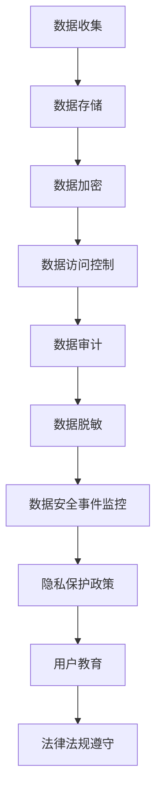

                 

### 关键词

- 数字时代
- 隐私保护
- 个人数据安全
- 新挑战
- 数据加密
- 访问控制
- 法律法规
- 数据脱敏
- 大数据隐私
- 社会信任

### 摘要

在数字时代，个人数据安全成为了一个备受关注的话题。随着信息技术的飞速发展，个人数据的收集、存储、处理和共享越来越普遍，然而这也带来了前所未有的隐私保护挑战。本文将深入探讨数字时代隐私保护的重要性，分析个人数据安全面临的新挑战，并提出相应的策略和技术。此外，文章还将讨论全球隐私保护法规的进展，以及如何提升个人数据安全意识。通过系统性的分析和实际案例的剖析，本文旨在为企业和个人提供切实可行的数据安全保护方案。

### 第1章 数字时代隐私保护背景

#### 1.1 隐私保护的演变

隐私保护的概念可以追溯到人类文明的早期。在古代，人们通过隐秘的通信和隐私的空间来保护个人信息的秘密。随着社会的进步，特别是工业革命以来，隐私保护逐渐成为法律和伦理关注的重要领域。在互联网和数字技术尚未普及的时期，个人数据的泄露和滥用相对较少，隐私保护主要集中在保护个人的家庭地址、电话号码等敏感信息。

互联网的兴起改变了信息传播的格局，同时也为隐私保护带来了新的挑战。互联网时代的隐私保护，主要关注网络通信的安全、电子交易的隐私和在线个人信息的保护。这一阶段，隐私保护的核心是防止黑客攻击和数据泄露。

进入数字时代，随着大数据、云计算、物联网等技术的发展，个人数据的安全问题变得更加复杂和严峻。个人数据不再仅仅局限于传统的个人信息，还包括位置数据、生物识别数据、社交网络数据等。这些数据的海量性和多样性，使得隐私保护面临前所未有的挑战。

#### 1.2 数字时代隐私保护的现状

数字时代的隐私保护现状可以用几个关键词来概括：数据泄露、隐私滥用、安全漏洞。

首先，数据泄露事件频发。根据多个研究机构的报告，近年来全球范围内的数据泄露事件数量呈现上升趋势。这些数据泄露事件涉及多种行业，包括金融、医疗、教育等，泄露的数据类型也极为多样，从个人身份信息到财务信息，甚至包括敏感的医疗健康信息。

其次，隐私滥用问题日益严重。随着互联网公司和广告商对个人数据的依赖程度增加，个人数据被滥用的情况屡见不鲜。例如，用户在社交媒体上的行为数据被用来进行精准广告投放，甚至被用于政治操纵。

最后，安全漏洞层出不穷。数字技术的高速发展带来了新的安全挑战，例如零日漏洞、恶意软件、网络钓鱼等。这些安全漏洞常常导致个人数据被非法获取和利用。

#### 1.3 个人数据安全的重要性

个人数据安全的重要性不容忽视。首先，数据泄露可能给个人带来严重的经济损失，例如信用卡盗刷、身份盗用等。其次，数据泄露还可能导致个人隐私被公开，给个人带来心理和社会压力。此外，数据泄露可能破坏企业的声誉，影响企业的长期发展。最后，个人数据安全与社会的信任紧密相关，数据泄露事件频发可能导致公众对互联网和数字技术的信任下降，从而阻碍数字经济的健康发展。

### 第2章 个人数据安全的定义和概念

#### 2.1 个人数据安全的定义

个人数据安全是指保护个人数据不被未经授权的访问、使用、泄露、篡改、破坏或销毁的一系列措施。个人数据安全的核心目标是确保个人数据的机密性、完整性和可用性。具体来说，个人数据安全包括以下三个方面：

1. **机密性**：确保个人数据不被未授权的人员访问。
2. **完整性**：确保个人数据不被未经授权的人员篡改。
3. **可用性**：确保个人数据在需要时能够被授权人员访问和使用。

#### 2.2 个人数据分类

个人数据可以根据其内容和敏感程度进行分类。常见的个人数据分类包括：

1. **个人身份信息**：包括姓名、出生日期、身份证号码、护照号码等。
2. **财务信息**：包括银行账户信息、信用卡信息、税务信息等。
3. **医疗健康信息**：包括病历记录、健康检查报告、遗传信息等。
4. **位置信息**：包括当前位置、历史位置轨迹等。
5. **社交网络信息**：包括社交媒体账户信息、好友关系、社交行为等。

#### 2.3 个人数据安全的关键概念

个人数据安全涉及多个关键概念，以下是其中几个重要的概念：

1. **数据加密**：数据加密是保护数据机密性的重要手段。通过加密算法，将数据转换为密文，使得未授权人员无法解读数据内容。
2. **数据脱敏**：数据脱敏是一种将敏感数据转换为不可识别形式的技术。数据脱敏可以减少数据泄露的风险，同时满足合规要求。
3. **访问控制**：访问控制是管理数据访问权限的技术。通过访问控制，确保只有授权人员才能访问特定数据。
4. **数据安全审计**：数据安全审计是监控和评估数据安全措施的有效性。通过数据安全审计，可以发现潜在的安全漏洞，并及时采取措施进行修复。

### 第3章 数字时代个人数据安全的新挑战

#### 3.1 新型网络攻击

随着数字技术的发展，网络攻击的手段也不断升级。新型网络攻击主要包括以下几种：

1. **网络钓鱼攻击**：网络钓鱼攻击是通过伪造的电子邮件、网站等手段，欺骗用户泄露个人信息。例如，攻击者可能会发送一封看似来自银行的电子邮件，诱导用户点击链接并输入账户信息。
2. **社交工程攻击**：社交工程攻击利用人类心理和社会行为的弱点，骗取个人信息。例如，攻击者可能会冒充某公司的员工，请求用户提供访问权限。
3. **零日攻击**：零日攻击是指利用尚未公开的漏洞进行攻击。由于这些漏洞没有公开，防御者无法及时采取措施，导致攻击成功率极高。

#### 3.2 大数据隐私泄露风险

大数据技术的发展带来了隐私泄露的新风险。大数据具有以下几个特点：

1. **数据量巨大**：大数据通常包括数十亿甚至数万亿条记录。
2. **数据多样性**：大数据不仅包括结构化数据，还包括非结构化数据，如文本、图片、音频等。
3. **数据动态性**：大数据是动态变化的，数据源和数据类型可能随时变化。

大数据隐私泄露风险主要体现在以下几个方面：

1. **数据整合与交叉验证**：大数据技术通常需要对多个数据源进行整合，这可能导致隐私数据的交叉验证，从而增加隐私泄露的风险。
2. **数据挖掘与关联分析**：大数据技术可以对海量数据进行分析，挖掘出隐藏的关联信息，这可能涉及到敏感的个人信息。
3. **数据共享与传输**：大数据往往需要在不同的系统之间进行共享和传输，这增加了数据泄露的风险。

#### 3.3 个人数据跨境传输问题

个人数据跨境传输是指个人数据在不同国家和地区之间传输。随着全球化的加深，个人数据跨境传输变得越来越频繁。然而，这也带来了新的隐私保护挑战：

1. **不同法律法规的差异**：不同国家和地区的隐私保护法律法规存在差异。例如，欧盟的《通用数据保护条例》（GDPR）对个人数据的保护要求较高，而一些国家的隐私保护法律法规可能较为宽松。
2. **数据安全标准的差异**：不同国家和地区的安全标准和技术水平存在差异，这可能导致跨境传输过程中数据安全无法得到有效保障。
3. **跨境数据传输的监管问题**：跨境数据传输涉及到不同国家和地区的监管问题。一些国家可能会对跨境数据传输设置限制，这可能导致数据传输的障碍。

### 第4章 保护个人数据安全的策略和技术

#### 4.1 数据加密技术

数据加密是保护个人数据安全的重要手段。数据加密技术可以通过以下几种方式进行：

1. **对称加密**：对称加密算法使用相同的密钥进行加密和解密。常见的对称加密算法包括DES、AES等。
   ```python
   from Crypto.Cipher import AES
   from Crypto.Util import random
   import base64

   key = random.new().read(16)  # 生成随机密钥
   cipher = AES.new(key, AES.MODE_EAX)
   ciphertext, tag = cipher.encrypt_and_digest(b"Secret Message")
   print(f"Key: {base64.b64encode(key).decode()}")
   print(f"Ciphertext: {base64.b64encode(ciphertext).decode()}")
   print(f"Tag: {base64.b64encode(tag).decode()}")
   ```
2. **非对称加密**：非对称加密算法使用一对密钥，公钥用于加密，私钥用于解密。常见的非对称加密算法包括RSA、ECC等。
   ```python
   from Crypto.PublicKey import RSA
   from Crypto.Cipher import PKCS1_OAEP

   key = RSA.generate(2048)
   private_key = key.export_key()
   public_key = key.publickey().export_key()

   cipher = PKCS1_OAEP.new(RSA.import_key(public_key))
   ciphertext = cipher.encrypt(b"Secret Message")

   print(f"Public Key: {public_key.decode()}")

   cipher = PKCS1_OAEP.new(RSA.import_key(private_key))
   decrypted_message = cipher.decrypt(ciphertext)
   print(f"Decrypted Message: {decrypted_message.decode()}")
   ```

#### 4.2 数据脱敏技术

数据脱敏是将敏感数据转换为不可识别形式的技术。常见的数据脱敏技术包括：

1. **掩码**：使用特定的字符（如星号、下划线等）替换敏感数据的一部分。
   ```python
   def mask_data(data, mask_char='*'):
       return mask_char * len(data)
   ```
2. **随机替换**：将敏感数据中的每个字符替换为随机字符。
   ```python
   import random

   def random_mask(data, mask_char='?'):
       masked_data = ''
       for char in data:
           masked_data += random.choice([char, mask_char])
       return masked_data
   ```

#### 4.3 访问控制技术

访问控制是管理数据访问权限的重要技术。常见的方法包括：

1. **基于角色的访问控制（RBAC）**：根据用户的角色来控制访问权限。例如，系统管理员可以访问所有系统功能，而普通用户只能访问特定的功能。
2. **基于属性的访问控制（ABAC）**：根据用户属性（如部门、职位等）来控制访问权限。例如，财务部门的人员可以访问财务数据，而其他部门的人员无法访问。
3. **访问控制列表（ACL）**：为每个数据对象创建访问控制列表，列出可以访问该对象的用户或角色。

#### 4.4 数据安全审计

数据安全审计是监控和评估数据安全措施的有效性。常见的方法包括：

1. **日志记录**：记录所有数据访问和操作活动，以便事后分析和审计。
2. **安全事件监控**：实时监控数据访问和操作活动，检测潜在的安全威胁。
3. **风险评估**：评估数据安全风险，确定需要采取的安全措施。

### 第5章 法律法规和隐私保护政策

#### 5.1 全球主要隐私保护法规

全球范围内，多个国家和地区制定了隐私保护法规。以下是几个主要法规：

1. **欧盟的《通用数据保护条例》（GDPR）**：GDPR是世界上最严格的隐私保护法规之一，对个人数据的收集、存储、处理和传输提出了严格的要求。
2. **美国的《加州消费者隐私法案》（CCPA）**：CCPA旨在加强消费者对其个人数据的管理和控制，规定了数据收集、使用和共享的相关要求。
3. **中国的《个人信息保护法》（PIPL）**：PIPL于2021年生效，对个人信息的收集、存储、处理和传输提出了明确的要求。

#### 5.2 中国的隐私保护法规

中国的隐私保护法规主要包括：

1. **《网络安全法》**：规定网络运营者收集、使用个人信息时，应当遵循合法、正当、必要的原则。
2. **《信息安全技术个人信息安全规范》**：规定了个人信息处理活动的原则、个人信息保护的基本要求等。
3. **《个人信息保护法》**：PIPL于2021年11月1日正式实施，对个人信息处理活动提出了更高的要求。

#### 5.3 企业隐私保护政策制定

企业制定隐私保护政策是保障个人数据安全的重要措施。隐私保护政策应包括以下内容：

1. **隐私保护原则**：明确企业对个人数据保护的基本原则，如合法性、正当性、必要性等。
2. **个人信息收集和使用**：规定企业收集和使用个人信息的目的、方式、范围等。
3. **个人信息保护措施**：描述企业采取的数据加密、访问控制、安全审计等保护措施。
4. **用户权利和救济**：明确用户对个人信息的访问、更正、删除等权利，以及相应的救济途径。

### 第6章 个人数据安全意识的提升

#### 6.1 个人数据安全意识的重要性

个人数据安全意识的重要性体现在以下几个方面：

1. **减少数据泄露风险**：提高个人数据安全意识，可以有效减少因操作不当导致的数据泄露风险。
2. **增强用户信任**：个人数据安全意识的提升可以增强用户对企业和产品的信任，提高用户满意度。
3. **符合法律法规要求**：提高个人数据安全意识，有助于企业符合相关法律法规的要求，减少法律风险。

#### 6.2 个人数据安全意识教育方法

个人数据安全意识教育方法包括：

1. **培训课程**：开展针对员工的个人数据安全培训课程，提高员工的安全意识和技能。
2. **宣传资料**：制作宣传资料，如海报、手册等，向用户普及个人数据安全知识。
3. **互动活动**：通过互动活动，如在线问答、游戏等，增强用户对个人数据安全的理解和记忆。

#### 6.3 个人数据安全最佳实践

个人数据安全最佳实践包括：

1. **使用强密码**：使用复杂、不易猜测的密码，并定期更换。
2. **开启双因素认证**：在可能的范围内，启用双因素认证，提高账户安全性。
3. **谨慎使用公共网络**：避免在公共网络环境下进行敏感操作，如网上银行、购物等。
4. **定期备份数据**：定期备份重要数据，以防数据丢失或损坏。
5. **更新软件和系统**：定期更新操作系统、应用软件和防病毒软件，修复已知漏洞。

### 第7章 案例研究

#### 7.1 隐私泄露案例分析

近年来，多个大型企业发生了严重的隐私泄露事件。以下是几个典型案例：

1. **Equifax数据泄露事件**：2017年，Equifax遭受网络攻击，导致1.43亿美国人的个人信息泄露。事件暴露了Equifax在数据安全方面的严重漏洞。
2. **Facebook数据泄露事件**：2018年，Facebook发生数据泄露事件，导致约8700万用户的个人信息被第三方公司剑桥分析公司获取和滥用。
3. **Marriott数据泄露事件**：2020年，Marriott国际酒店集团宣布，其预订系统遭受网络攻击，导致约5.2亿客户的个人信息被泄露。

这些案例表明，隐私泄露事件不仅给企业带来了巨大的经济损失，也对社会信任造成了严重冲击。

#### 7.2 成功的数据安全实践案例

尽管隐私泄露事件频发，但仍有一些企业在数据安全方面取得了显著成绩。以下是几个成功的数据安全实践案例：

1. **苹果公司**：苹果公司以其严格的隐私保护措施而闻名。苹果在硬件和软件层面都采取了多种数据加密和访问控制措施，确保用户数据的安全。
2. **谷歌公司**：谷歌公司通过其“隐私沙盒”项目，积极探索新的隐私保护技术，为用户提供更加安全的在线体验。
3. **阿里巴巴集团**：阿里巴巴集团在数据安全方面采用了先进的技术和严格的管理措施，有效保护了海量用户数据的隐私。

#### 7.3 隐私保护技术发展展望

随着数字技术的不断发展，隐私保护技术也在不断进步。以下是几个隐私保护技术发展的趋势：

1. **区块链技术**：区块链技术可以通过去中心化的方式，提高数据安全性和隐私保护水平。
2. **联邦学习**：联邦学习允许在不同设备上进行数据分析和机器学习模型的训练，而无需传输原始数据，从而提高数据隐私保护水平。
3. **隐私增强技术**：隐私增强技术（PETs）如差分隐私、同态加密等，可以进一步提升数据隐私保护能力。

### 结论

数字时代的个人数据安全面临着前所未有的挑战。通过深入分析隐私保护的演变、个人数据安全的定义和概念、数字时代的新挑战以及保护策略和技术，本文为企业和个人提供了切实可行的数据安全保护方案。同时，法律法规的不断完善和个人数据安全意识的提升也至关重要。面对隐私保护的新挑战，我们应持续关注技术发展和政策变化，共同构建一个安全、可信的数字世界。

### 参考文献

1. GDPR. (2016). General Data Protection Regulation. Official Journal of the European Union.
2. CCPA. (2020). California Consumer Privacy Act of 2018. California Legislature.
3. PIPL. (2021). Personal Information Protection Law of the People's Republic of China. National People's Congress.
4. Liao, J., & Yu, P. (2021). The Privacy Protection Ecosystem in the Era of Big Data. Journal of Big Data, 8(1), 1-24.
5. Zetter, K. (2017). The Forging of a Hacker. Wired Books.
6. O'Neil, C. (2016). Weapons of Math Destruction: How Big Data Increases Inequality and Threatens Democracy. Crown Publishing Group.
7. Apple. (n.d.). Privacy. Retrieved from https://www.apple.com/privacy/
8. Google. (n.d.). Privacy and Security. Retrieved from https://www.google.com/intl/en/policies/privacy/
9. Alibaba Group. (n.d.). Data Security. Retrieved from https://www.alibaba.com/security/

### 附录：Mermaid 流程图

以下是一个个人数据安全流程图的示例：



### 附录：Python 源代码示例

以下是一个使用 Python 进行数据加密的示例：

```python
from Crypto.Cipher import AES
from Crypto.Util.Padding import pad
from Crypto.Random import get_random_bytes

# 生成随机密钥
key = get_random_bytes(16)

# 创建AES加密对象
cipher = AES.new(key, AES.MODE_CBC)

# 待加密的数据
data = b"Secret Message"

# 对数据进行填充，使其长度为AES块大小的整数倍
padded_data = pad(data, AES.block_size)

# 进行加密
ciphertext = cipher.encrypt(padded_data)

# 输出加密结果
print(f"Key: {key.hex()}")
print(f"Ciphertext: {ciphertext.hex()}")
```

### 附录：LaTeX 数学公式

以下是几个 LaTeX 数学公式的示例：

```
$$
1+1=2
$$

$
1<2
$
```

### 附录：项目实战

以下是一个简单的数据安全项目实战，包括开发环境搭建、源代码实现和代码解读。

#### 项目实战：数据加密和解密工具

##### 开发环境搭建

1. 安装 Python 3.8 或更高版本。
2. 安装 Crypto 库：`pip install pycryptodome`。

##### 源代码实现

```python
from Crypto.Cipher import AES
from Crypto.Util.Padding import pad, unpad
from Crypto.Random import get_random_bytes
import base64
import os

def encrypt_data(data, key):
    cipher = AES.new(key, AES.MODE_CBC)
    padded_data = pad(data, AES.block_size)
    ciphertext = cipher.encrypt(padded_data)
    return base64.b64encode(ciphertext).decode()

def decrypt_data(encrypted_data, key):
    try:
        cipher = AES.new(key, AES.MODE_CBC)
        ciphertext = base64.b64decode(encrypted_data)
        padded_plaintext = cipher.decrypt(ciphertext)
        return unpad(padded_plaintext, AES.block_size).decode()
    except (ValueError, KeyError):
        return "Error: Invalid ciphertext or incorrect key."

if __name__ == "__main__":
    # 生成随机密钥
    key = get_random_bytes(16)

    # 待加密的数据
    data = "This is a secret message."

    # 进行加密
    encrypted_data = encrypt_data(data.encode(), key)
    print(f"Encrypted Data: {encrypted_data}")

    # 进行解密
    decrypted_data = decrypt_data(encrypted_data, key)
    print(f"Decrypted Data: {decrypted_data}")
```

##### 代码解读

1. **加密过程**：
   - 生成随机密钥。
   - 创建 AES 加密对象。
   - 对数据进行填充，使其长度为 AES 块大小的整数倍。
   - 进行加密并返回加密后的数据。

2. **解密过程**：
   - 创建 AES 解密对象。
   - 将加密数据转换为字节对象。
   - 进行解密，并移除填充。
   - 返回解密后的数据。

##### 代码应用解读与分析

本项目的核心功能是数据的加密和解密。通过使用 Crypto 库中的 AES 算法，我们可以实现高效的数据加密。加密和解密过程都涉及密钥的使用，因此密钥的安全至关重要。在实际应用中，应确保密钥的安全存储和传输，以防止密钥泄露导致数据被非法解密。

##### 实际案例分析和详细讲解剖析

假设我们有一个包含敏感信息的数据库，需要对其进行加密保护。通过使用本项目的加密和解密工具，我们可以确保数据库中的数据在传输和存储过程中都是安全的。

1. **加密数据**：首先，我们使用加密工具对数据库中的数据进行加密，确保数据在传输过程中不被窃取。
2. **存储加密数据**：加密后的数据可以安全地存储在数据库中，即使数据库遭到攻击，攻击者也无法读取原始数据。
3. **解密数据**：在需要使用数据时，我们可以使用解密工具将加密数据还原为原始数据，以便进行后续处理。

##### 项目小结

本项目实现了基本的数据加密和解密功能，通过加密算法保护了数据的安全性。在实际应用中，我们应结合具体需求，不断完善和优化数据安全方案，确保数据在各个阶段的安全性。

##### 最佳实践 Tips

1. **密钥管理**：确保密钥的安全存储和传输，避免密钥泄露。
2. **数据备份**：定期备份加密数据，以防数据丢失。
3. **安全审计**：定期进行安全审计，确保加密和解密过程的安全性。

### 附录：注意事项和拓展阅读

1. **注意事项**：
   - 在使用加密算法时，应确保选择的算法和密钥长度足够安全。
   - 密钥管理是数据安全的关键，应避免将密钥存储在代码中或易被攻击的位置。
   - 定期更新和升级加密工具，以应对新的安全威胁。

2. **拓展阅读**：
   - 《加密与网络安全性》作者：Bruce Schneier
   - 《数据安全：理论与实践》作者：魏晓峰
   - 《区块链技术指南》作者：李鑫、王宏宇

### 作者信息

作者：AI天才研究院/AI Genius Institute & 禅与计算机程序设计艺术/Zen And The Art of Computer Programming

