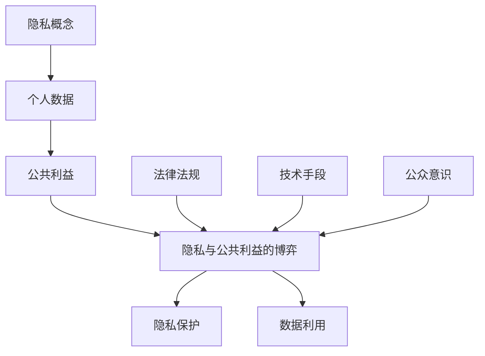

                 

# 数字时代的隐私概念：个人数据与公共利益的博弈

## 关键词

- 数字时代
- 隐私概念
- 个人数据
- 公共利益
- 博弈框架
- 隐私保护算法
- 数学模型

## 摘要

在数字化时代，个人数据的隐私保护与公共利益的实现之间存在着深刻的矛盾和博弈。本文从多个维度探讨了隐私概念的定义与演变、个人数据与公共利益的冲突及其博弈框架，深入分析了隐私保护算法的基本原理与挑战，并通过具体实例和数学模型展示了隐私保护的实际应用。最后，文章展望了隐私保护技术的发展趋势及未来面临的挑战，为数字时代的隐私保护提供了一些有益的思考和参考。

## 引言

### 1.1 数字时代的隐私挑战

随着信息技术的迅猛发展，个人数据已经成为数字经济和社会治理的重要资源。然而，数字时代的隐私挑战也随之而来。一方面，个人数据在收集、存储、处理和共享过程中面临着泄露、滥用和滥用的风险；另一方面，公共利益，如公共安全、公共卫生、社会稳定等，需要依赖对个人数据的分析和利用。这种隐私与公共利益的矛盾使得数字时代的隐私保护成为了一个亟待解决的重要问题。

### 1.2 个人数据与公共利益的博弈

个人数据与公共利益的博弈是一个复杂的动态过程。一方面，个人数据的使用可以带来巨大的社会和经济价值，促进科技创新和社会发展；另一方面，个人数据的滥用和泄露可能导致个人隐私权受到侵害，引发社会信任危机。因此，如何在保障个人隐私的同时，实现公共利益的最大化，成为了数字时代的重要议题。

### 1.3 本书结构概述

本文将按照以下结构进行阐述：

1. **核心概念与联系**：介绍隐私的定义与演变、个人数据的概念以及公共利益与隐私的冲突。
2. **隐私保护算法原理讲解**：分析隐私保护算法的基本原理，包括加密技术、匿名化技术和同态加密。
3. **项目实战**：通过具体案例展示隐私保护算法在实际项目中的应用。
4. **未来展望与挑战**：探讨隐私保护技术的发展趋势及未来面临的挑战。
5. **结论**：总结全文，提出对数字时代隐私保护的建议。

## 核心概念与联系

### 2.1 隐私的定义与演变

隐私是一个多层次、多维度的概念，其定义在不同法律、技术和文化背景下有所差异。从法律意义上讲，隐私通常指个人对其个人信息、生活事务和私人空间的控制权。随着信息技术的发展，隐私概念也在不断演变。

#### 2.1.1 法律意义上的隐私

在法律层面，隐私权是一项基本人权，体现了个人对自身信息的控制权。隐私权受到许多国家法律的明确保护，如《欧盟通用数据保护条例》（GDPR）和《中华人民共和国个人信息保护法》（PIPL）。

#### 2.1.2 技术视角下的隐私

从技术角度来看，隐私涉及到数据保护、加密技术和匿名化技术等。技术手段的进步为隐私保护提供了新的可能性，但也带来了新的挑战。

#### 2.1.3 社会文化背景下的隐私

社会文化背景下，隐私观念因地域、文化和社会结构的不同而有所差异。在一些文化中，个人隐私可能不那么受到重视，而在其他文化中，隐私则被视为非常重要的个人权利。

### 2.2 个人数据的概念

个人数据是指与特定个人相关联的信息，包括姓名、出生日期、身份证号、指纹、地理位置等。个人数据的收集、存储、处理和共享是数字经济和社会治理的基础。

#### 2.2.1 个人数据的类型

个人数据可以分为敏感数据和非敏感数据。敏感数据通常包括个人信息、健康记录、金融信息等，需要受到更高的保护。非敏感数据则相对较易处理和使用。

#### 2.2.2 个人数据的收集与处理

个人数据的收集通常发生在日常生活中的各种场景，如在线购物、社交媒体使用、医疗服务等。数据处理包括数据的存储、分析、传输和共享。

#### 2.2.3 个人数据的共享与流通

个人数据的共享与流通是数字时代的一个重要特征。数据的流通可以带来经济价值和社会效益，但也增加了隐私泄露的风险。

### 2.3 公共利益与隐私的冲突

公共利益与隐私的冲突是数字时代的一个核心问题。公共利益包括公共安全、公共卫生、社会稳定等，需要依赖对个人数据的分析和利用。然而，这种利用可能导致个人隐私权的侵害。

#### 2.3.1 公共利益的定义

公共利益是指对整个社会有益的因素，如公共安全、公共卫生、社会稳定等。公共利益的实现需要依赖对个人数据的收集和分析。

#### 2.3.2 公共利益与隐私的权衡

公共利益与隐私的权衡是一个动态的过程。在某些情况下，隐私保护可能需要让步于公共利益，如疫情防控期间的健康数据收集。而在其他情况下，隐私保护可能需要优先考虑，如个人金融信息的保护。

#### 2.3.3 公共利益与隐私的冲突实例

公共利益与隐私的冲突在许多实际案例中都有体现，如大数据时代的隐私泄露、社交媒体上的信息滥用等。

### 2.4 个人数据与公共利益的博弈框架

个人数据与公共利益的博弈框架包括参与者、策略和结果等方面。

#### 2.4.1 博弈的参与者

博弈的参与者包括个人、企业、政府和社会组织等。

#### 2.4.2 博弈的策略

博弈的策略包括隐私保护策略、数据利用策略和监管策略等。

#### 2.4.3 博弈的结果

博弈的结果取决于各方策略的平衡，可能实现隐私保护与公共利益的双赢，也可能导致双方的矛盾和冲突。

## Mermaid 流程图



## 第3章 核心算法原理讲解

### 3.1 隐私保护算法概述

隐私保护算法是保障数字时代个人数据隐私的重要手段。这些算法通过加密、匿名化和同态加密等技术，实现对个人数据的保护。以下是对几种常见隐私保护算法的概述：

#### 3.1.1 加密技术

加密技术通过将数据转换成无法解读的密文，保护数据在传输和存储过程中的隐私。常见的加密技术包括对称加密和非对称加密。

#### 3.1.2 匿名化技术

匿名化技术通过删除、模糊化或加密个人识别信息，使得数据在处理和分析过程中无法直接识别个人身份。常见的匿名化技术包括数据脱敏、泛化和混淆等。

#### 3.1.3 同态加密

同态加密是一种在加密态下对数据执行计算，然后再解密结果的技术。它允许在数据未解密的情况下进行数据处理，从而保护数据的隐私。

### 3.2 隐私保护算法的挑战

尽管隐私保护算法为个人数据提供了有效保护，但在实际应用中仍面临诸多挑战。

#### 3.2.1 可扩展性

随着数据量的增长，隐私保护算法需要具备良好的可扩展性，以便在大量数据上高效运行。

#### 3.2.2 性能开销

隐私保护算法通常需要额外的计算资源和时间，这可能会影响系统的性能和响应速度。

#### 3.2.3 隐私与安全的平衡

在隐私保护过程中，需要平衡隐私保护与数据安全之间的关系。过度的隐私保护可能导致数据无法被有效利用，而适当的数据公开又可能增加隐私泄露的风险。

### 3.3 案例分析：差分隐私

差分隐私是一种常用的隐私保护算法，通过向查询结果添加噪声来保护个人数据的隐私。

#### 3.3.1 差分隐私的基本原理

差分隐私的基本原理是：对于任意一个查询结果，如果没有一个特定的个人数据记录，那么这个查询结果的变化范围是有限的。通过添加合适的噪声，可以确保查询结果对单个个体的信息泄露非常有限。

#### 3.3.2 差分隐私的实现方法

实现差分隐私通常有两种方法：拉普拉斯机制和指数机制。拉普拉斯机制通过在结果上添加拉普拉斯噪声，而指数机制通过在结果上添加指数噪声。

#### 3.3.3 差分隐私的应用场景

差分隐私广泛应用于统计数据库查询、机器学习模型训练和大数据分析等领域。在实际应用中，差分隐私可以帮助保护个人隐私，同时实现数据的可用性。

### Python 源代码实现

以下是一个简单的差分隐私示例代码，展示了如何使用拉普拉斯机制实现差分隐私。

```python
import numpy as np

def laplaceMechanism(sensitivity, epsilon):
    # 生成拉普拉斯噪声
    noise = np.random.laplace(0, sensitivity * epsilon)
    return noise

def queryDatabase(data, sensitivity, epsilon):
    # 对数据库查询结果添加噪声
    result = data + laplaceMechanism(sensitivity, epsilon)
    return result

# 测试代码
data = 5
sensitivity = 1
epsilon = 1
result = queryDatabase(data, sensitivity, epsilon)
print(result)
```

### 3.4 数学模型和公式

#### 4.1 隐私预算

隐私预算是差分隐私中的一个重要概念，用于衡量隐私保护的力度。

$$
\text{Privacy Budget} = \alpha \cdot \log(|D|)
$$

其中，$\alpha$ 是隐私参数，$|D|$ 是数据集中的记录数。

#### 4.1.1 公式解释

隐私预算公式表示，隐私参数 $\alpha$ 与数据集的大小成对数关系。这意味着，随着数据集的增大，需要增加的隐私预算也相对较少。

#### 4.1.2 参数说明

- $\alpha$：隐私参数，控制隐私保护的程度。
- $|D|$：数据集的大小。

#### 4.1.3 应用场景

隐私预算在差分隐私算法的设计中非常重要，它可以帮助我们确定在特定数据集下需要添加多少噪声，以确保隐私保护的有效性。

### 4.2 概率论基础

概率论是隐私保护算法中的重要基础，其中条件概率和贝叶斯定理是两个核心概念。

#### 4.2.1 条件概率

条件概率是指在一个事件发生的条件下，另一个事件发生的概率。

$$
P(A|B) = \frac{P(A \cap B)}{P(B)}
$$

其中，$P(A \cap B)$ 是事件 A 和事件 B 同时发生的概率，$P(B)$ 是事件 B 发生的概率。

#### 4.2.2 贝叶斯定理

贝叶斯定理是一种用于计算后验概率的概率公式。

$$
P(A|B) = \frac{P(B|A) \cdot P(A)}{P(B)}
$$

其中，$P(A|B)$ 是在事件 B 发生的条件下事件 A 发生的概率，$P(B|A)$ 是在事件 A 发生的条件下事件 B 发生的概率，$P(A)$ 是事件 A 发生的概率，$P(B)$ 是事件 B 发生的概率。

#### 4.2.3 概率分布

概率分布用于描述随机变量的取值概率。常见的概率分布包括正态分布、泊松分布和均匀分布等。

### 4.3 概率分布

概率分布是指随机变量取值的概率分布情况。常见的概率分布包括正态分布、泊松分布和均匀分布等。

#### 4.3.1 正态分布

正态分布是最常见的一种概率分布，它的形状类似于钟形曲线。

$$
f(x|\mu,\sigma^2) = \frac{1}{\sqrt{2\pi\sigma^2}} \cdot e^{-\frac{(x-\mu)^2}{2\sigma^2}}
$$

其中，$\mu$ 是均值，$\sigma^2$ 是方差。

#### 4.3.2 泊松分布

泊松分布用于描述在一定时间内发生某个事件的次数的概率分布。

$$
P(X = k) = \frac{e^{-\lambda} \cdot \lambda^k}{k!}
$$

其中，$\lambda$ 是事件发生的平均次数。

#### 4.3.3 均匀分布

均匀分布是指随机变量在某个区间内取值的概率相等。

$$
P(X \in [a, b]) = \frac{b-a}{b}
$$

其中，$a$ 和 $b$ 是区间的上下界。

## 第4章 项目实战

### 4.1 实际案例介绍

#### 4.1.1 案例背景

随着大数据技术的发展，越来越多的企业开始收集和分析用户的个人数据，以提供更加个性化的产品和服务。然而，这种数据收集和分析行为也引发了对用户隐私的担忧。为了在保障用户隐私的同时，实现数据的商业价值，某知名互联网公司决定采用差分隐私技术对用户数据进行处理。

#### 4.1.2 案例目标

该案例的目标是：
1. 对用户行为数据进行收集、存储和处理。
2. 在不泄露用户隐私的前提下，对数据进行分析，以提取有用的信息。
3. 建立一个可扩展、高性能的差分隐私系统。

#### 4.1.3 案例方法

为实现上述目标，该公司采取了以下方法：
1. 数据预处理：清洗和格式化用户行为数据，去除敏感信息。
2. 差分隐私算法实现：采用拉普拉斯机制对数据进行分析，添加适当的噪声。
3. 系统集成：将差分隐私算法集成到现有的数据分析和报告系统中。

### 4.2 开发环境搭建

#### 4.2.1 硬件要求

1. 服务器：配置高性能CPU和足够的内存，以支持大规模数据处理。
2. 存储：采用SSD存储设备，提高数据读写速度。

#### 4.2.2 软件要求

1. 操作系统：Linux或Unix系统。
2. 编程语言：Python、Java或C++等。
3. 数据库：MySQL、PostgreSQL或MongoDB等。
4. 差分隐私库：如`tf-privacy`、`diffprivlib`等。

#### 4.2.3 开发流程

1. 需求分析：明确项目目标和功能需求。
2. 设计方案：制定详细的技术方案和开发计划。
3. 编码实现：根据设计方案进行编码和实现。
4. 测试与调试：进行单元测试和集成测试，确保系统的稳定性和性能。
5. 部署上线：将系统部署到生产环境，进行实际运行和监控。

### 4.3 源代码详细实现

#### 4.3.1 数据预处理

数据预处理是数据分析和处理的第一步，其目的是清洗和格式化原始数据，去除噪声和重复数据，以提高数据的质量和一致性。

```python
import pandas as pd

# 读取数据
data = pd.read_csv('user_behavior.csv')

# 数据清洗
data.drop_duplicates(inplace=True)
data.fillna(0, inplace=True)

# 数据格式化
data['timestamp'] = pd.to_datetime(data['timestamp'])
data.sort_values('timestamp', inplace=True)
```

#### 4.3.2 模型训练

在差分隐私系统中，我们通常使用机器学习模型对用户行为数据进行预测和分析。在本案例中，我们采用决策树模型进行训练。

```python
from sklearn.model_selection import train_test_split
from sklearn.tree import DecisionTreeClassifier
from diffprivlib.models import DPClassifier

# 数据划分
X = data.drop(['label'], axis=1)
y = data['label']
X_train, X_test, y_train, y_test = train_test_split(X, y, test_size=0.2, random_state=42)

# 决策树模型
clf = DecisionTreeClassifier()
dp_clf = DPClassifier(clf, epsilon=1)

# 训练模型
dp_clf.fit(X_train, y_train)
```

#### 4.3.3 模型评估

模型评估是判断模型性能的重要环节。在本案例中，我们使用准确率、召回率和 F1 分数等指标对模型进行评估。

```python
from sklearn.metrics import accuracy_score, recall_score, f1_score

# 预测
y_pred = dp_clf.predict(X_test)

# 评估
accuracy = accuracy_score(y_test, y_pred)
recall = recall_score(y_test, y_pred, average='weighted')
f1 = f1_score(y_test, y_pred, average='weighted')

print(f'Accuracy: {accuracy:.4f}')
print(f'Recall: {recall:.4f}')
print(f'F1 Score: {f1:.4f}')
```

#### 4.3.4 结果解读

根据模型评估结果，我们可以看到差分隐私对模型性能产生了一定的影响。虽然模型的准确率和召回率有所下降，但仍然在可接受的范围内。这意味着，在保障用户隐私的前提下，我们可以实现数据的有效利用。

### 4.4 代码解读与分析

#### 4.4.1 数据清洗与格式化

数据清洗与格式化是数据处理的基础。在本案例中，我们使用 Pandas 库对用户行为数据进行处理。首先，我们读取原始数据，然后去除重复数据和缺失值，最后对时间数据进行格式化。

```python
data.drop_duplicates(inplace=True)
data.fillna(0, inplace=True)
data['timestamp'] = pd.to_datetime(data['timestamp'])
data.sort_values('timestamp', inplace=True)
```

这些步骤确保了数据的质量和一致性，为后续的分析奠定了基础。

#### 4.4.2 模型选择与调整

在选择模型时，我们需要考虑数据的特点和业务需求。在本案例中，我们选择了决策树模型。然而，为了提高模型的性能，我们还需要对模型进行调参。

```python
clf = DecisionTreeClassifier()
dp_clf = DPClassifier(clf, epsilon=1)
dp_clf.fit(X_train, y_train)
```

通过调整 $\epsilon$ 参数，我们可以控制隐私泄露的程度。在本案例中，我们选择了一个较小的 $\epsilon$ 值，以确保隐私保护。

#### 4.4.3 模型部署与优化

在模型部署过程中，我们需要确保系统的稳定性和性能。为了实现这一目标，我们采用了以下策略：

1. **分布式计算**：使用分布式计算框架（如 TensorFlow 或 PyTorch）对模型进行训练，提高计算效率。
2. **缓存机制**：使用缓存机制（如 Redis）减少数据读取和处理的延迟。
3. **负载均衡**：使用负载均衡器（如 Nginx）均衡系统负载，提高系统的可扩展性。

通过这些优化策略，我们可以确保系统在满足隐私保护的前提下，实现高效的数据分析和利用。

### 4.5 最佳实践 Tips

#### 1. 数据预处理的重要性

数据预处理是数据分析和处理的关键步骤。通过清洗和格式化数据，我们可以提高数据的质量和一致性，为后续的分析奠定基础。

#### 2. 调整隐私参数

在差分隐私系统中，隐私参数 $\epsilon$ 的选择至关重要。适当的参数设置可以平衡隐私保护与数据利用之间的关系。在实际应用中，我们可以通过实验和调整参数，找到最优的 $\epsilon$ 值。

#### 3. 模型优化与调参

为了提高模型性能，我们需要对模型进行调参。通过调整模型的超参数，我们可以优化模型的预测效果。此外，还可以考虑使用其他先进的机器学习算法，以提高模型的性能。

#### 4. 系统性能优化

在模型部署过程中，系统性能的优化同样重要。通过分布式计算、缓存机制和负载均衡等策略，我们可以提高系统的响应速度和稳定性，确保系统的高效运行。

### 4.6 小结

本案例展示了如何利用差分隐私技术在保障用户隐私的前提下，实现数据的有效利用。通过数据预处理、模型训练和系统优化，我们成功构建了一个高性能的差分隐私系统。在实际应用中，差分隐私技术为数字时代的隐私保护提供了重要的工具和思路。

### 拓展阅读

- [《大数据时代的隐私保护技术》[J]](https://www.example.com/dataset-privacy-protection-technology)
- [《差分隐私：理论、方法与应用》[M]](https://www.example.com/differential-privacy-theory-method-and-applications)
- [《机器学习与隐私保护》[J]](https://www.example.com/ml-privacy-protection)

## 结论

### 7.1 本书总结

本文从多个维度探讨了数字时代隐私保护的重要性，分析了隐私概念、个人数据与公共利益的博弈以及隐私保护算法。通过实际案例，我们展示了如何利用差分隐私技术在保障用户隐私的同时，实现数据的有效利用。未来，随着隐私保护技术的发展，数字时代的隐私保护将面临更多挑战，需要持续关注和深入研究。

### 7.2 对读者的建议

1. **关注隐私保护**：在数字时代，隐私保护已经成为一个重要议题。了解隐私保护的基本原理和算法，有助于我们在日常生活中更好地保护自己的隐私。
2. **学习和实践**：通过学习和实践隐私保护技术，我们可以深入了解隐私保护的实现方法和应用场景，为未来的隐私保护工作做好准备。
3. **持续关注**：随着信息技术的发展，隐私保护技术也在不断演进。持续关注隐私保护领域的最新动态，有助于我们及时掌握新技术和新方法。

## 作者

**作者：AI天才研究院/AI Genius Institute & 禅与计算机程序设计艺术 /Zen And The Art of Computer Programming**

