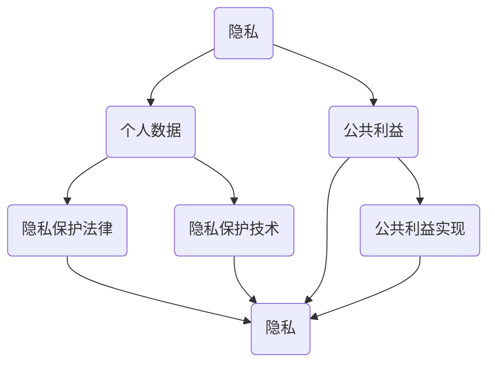

                 

## 文章标题

数字时代的隐私概念：个人数据与公共利益的博弈

## 文章关键词

数字时代、隐私概念、个人数据、公共利益、博弈

## 文章摘要

随着数字技术的飞速发展，个人数据的收集、处理和使用已成为现代社会的一个重要特征。本文探讨了数字时代隐私概念的重要性，以及个人数据与公共利益之间的博弈。首先，回顾了隐私概念的历史演变，分析了其在数字时代所面临的挑战。接着，详细介绍了个人数据保护法律体系的现状，包括全球主要国家和地区的相关立法。随后，探讨了公共利益对隐私保护的挑战和影响，如医疗、教育和安全等领域。接着，介绍了隐私保护技术，包括加密、匿名化等手段。最后，通过实际案例分析，探讨了隐私保护的最佳实践，并对未来趋势进行了展望。

## 目录

1. 引言
2. 隐私概念的历史与发展
3. 个人数据保护法律
4. 公共利益的影响
5. 隐私保护技术
6. 案例分析
7. 结论

## 1. 引言

在数字时代，个人数据的收集、存储、处理和共享已成为日常生活的重要组成部分。然而，这一过程也引发了关于隐私保护和公共利益之间的紧张关系。隐私，作为个体对于自身信息的控制权，关乎个人尊严和自由。与此同时，公共利益，如公共安全、医疗进步、科技创新等，需要依赖于大量的数据进行分析和应用。因此，如何在保障个人隐私的同时，促进公共利益的实现，成为了一个亟待解决的课题。

### 1.1 数字时代隐私的重要性

在数字时代，隐私的重要性愈加凸显。首先，个人数据的泄露可能导致严重的后果，如身份盗窃、经济损失和声誉损害。其次，个人隐私的侵犯可能导致心理压力和社会排斥。此外，随着大数据和人工智能技术的发展，个人数据的潜在价值被进一步挖掘，这使得隐私保护面临更大的挑战。

### 1.2 个人数据与公共利益的博弈背景

个人数据与公共利益之间的博弈主要源于以下两个方面：

1. **数据的价值与风险**：个人数据对于企业提供精准服务、政府进行决策制定具有重要意义。然而，数据泄露和滥用可能引发隐私侵害和社会不安。
2. **监管与技术创新**：隐私保护法律和技术的不断发展，旨在平衡个人数据的安全和公共利益的实现。然而，法律滞后和技术快速迭代使得这一平衡难以达成。

### 1.3 本文结构

本文分为七个部分，首先回顾隐私概念的历史与发展，接着介绍个人数据保护法律，探讨公共利益的影响，详细说明隐私保护技术，并通过案例分析提出最佳实践。最后，对隐私保护的未来趋势进行展望。

## 2. 隐私概念的历史与发展

隐私概念的历史可以追溯到古代社会，但随着时间的推移，其含义和范围不断演变。在数字时代，隐私概念变得更加复杂，因为个人数据的收集和处理方式发生了巨大的变化。

### 2.1 早期隐私概念

在古代社会，隐私主要指个人对自己住所、身体和财产的保护。这种隐私观念主要基于社会道德和宗教信仰，旨在保护个人的尊严和自由。

### 2.2 现代隐私概念

随着工业化和信息社会的到来，隐私概念逐渐扩展到个人信息的保护。现代隐私观念强调个人对于自身信息的控制权，包括信息的收集、使用和共享。

### 2.3 数字时代隐私特殊性

在数字时代，隐私面临着前所未有的挑战：

1. **数据量的爆炸性增长**：互联网和大数据技术的发展使得个人数据得以大规模收集和处理。
2. **数据使用的多样性**：个人数据不仅用于商业目的，还用于政府决策、医疗研究等公共领域。
3. **隐私侵害的潜在风险**：数据泄露和滥用可能导致严重的隐私侵害，影响个人和社会的稳定。

### 2.4 隐私与个人数据保护的关系

隐私和个人数据保护密切相关。个人数据保护旨在确保个人数据在收集、存储、处理和传输过程中的安全性和合规性，从而保护个人的隐私权。

### 2.5 数字时代隐私保护的挑战

数字时代隐私保护面临的挑战包括：

1. **法律滞后**：隐私保护法律往往滞后于技术的发展，难以全面覆盖新兴技术带来的隐私风险。
2. **技术复杂性**：隐私保护技术如加密、匿名化等复杂，实施难度大。
3. **公共利益需求**：公共利益的实现需要大量个人数据，如何平衡隐私保护与公共利益需求成为难题。

## 3. 个人数据保护法律

个人数据保护法律是确保个人隐私权的重要手段。不同国家和地区根据自身情况制定了相应的法律体系，旨在平衡个人数据的安全和公共利益的实现。

### 3.1 全球主要国家和地区个人数据保护法律体系

1. **欧盟《通用数据保护条例》（GDPR）**：
   - **背景**：2018年生效，是全球最严格的个人数据保护法律之一。
   - **核心原则**：数据最小化、数据匿名化、数据主体权利等。
   - **适用范围**：不仅适用于欧盟成员国，还适用于全球范围内的数据处理者。

2. **美国《加州消费者隐私法案》（CCPA）**：
   - **背景**：2018年生效，旨在加强加州居民的隐私保护。
   - **核心原则**：消费者有权知道个人信息的使用情况、删除个人信息等。
   - **适用范围**：仅适用于加州居民。

3. **中国《个人信息保护法》（PIPL）**：
   - **背景**：2021年生效，是中国首部全面保护个人信息的法律。
   - **核心原则**：个人信息收集合法、正当、必要；个人信息处理需告知、同意；个人信息保护义务等。
   - **适用范围**：适用于在中国境内收集、处理个人信息的组织和个人。

### 3.2 个人数据保护法律的核心内容

1. **数据主体权利**：
   - **知情权**：数据主体有权知道其个人信息被收集、使用和共享的目的。
   - **访问权**：数据主体有权查阅、复制其个人信息。
   - **更正权**：数据主体有权要求更正不准确或过时的个人信息。
   - **删除权**：数据主体有权要求删除其个人信息。

2. **数据处理者的义务**：
   - **数据安全**：数据处理者需采取措施确保个人信息的安全。
   - **数据最小化**：仅收集和处理与目的相关的个人信息。
   - **告知和同意**：在收集和使用个人信息前，需告知数据主体并取得同意。

### 3.3 个人数据保护法律的影响

个人数据保护法律对个人和社会产生了深远的影响：

1. **个人层面**：
   - **隐私权增强**：法律赋予数据主体更多控制权，减少隐私侵害。
   - **信息透明**：数据处理者需遵守法律规定，提高信息透明度。

2. **社会层面**：
   - **信任建设**：法律增强公众对互联网和数字服务的信任。
   - **经济影响**：隐私保护法律可能影响企业的商业模式和数据利用。

### 3.4 未来个人数据保护法律的展望

随着技术的不断进步，未来个人数据保护法律将面临更多挑战和机遇：

1. **法律更新**：全球各国将不断完善现有法律，以应对新兴技术的挑战。
2. **国际合作**：国际社会将加强合作，推动全球范围内的数据保护标准。
3. **技术融合**：隐私保护技术与大数据、人工智能等技术的融合将推动隐私保护法律的进一步发展。

## 4. 公共利益的影响

公共利益是个人数据保护法律和政策制定的重要考量因素。在数字时代，公共利益的实现离不开个人数据的收集、处理和应用。然而，这一过程中也可能对个人隐私造成潜在威胁。因此，如何在保障个人隐私的同时，实现公共利益，成为了一个复杂而重要的议题。

### 4.1 公共利益的概念与范畴

公共利益是指对整个社会或群体有益的利益，包括但不限于公共安全、医疗健康、教育、环境保护等领域。公共利益的实现需要依赖大量的数据进行分析和应用。

1. **医疗健康**：医疗健康领域需要个人健康数据来进行疾病预防、诊断和治疗。例如，通过大数据分析，可以预测疾病爆发，制定有效的防控措施。
2. **教育**：教育领域需要学生个人信息进行教育资源的优化配置和学习效果评估。例如，通过学习数据分析，可以个性化定制教学方案，提高教育质量。
3. **公共安全**：公共安全领域需要监控和数据分析来预防和打击犯罪。例如，通过监控视频分析，可以实时监控公共区域的异常行为，提高治安水平。
4. **环境保护**：环境保护领域需要环境数据进行分析，以制定有效的环境保护政策。例如，通过空气质量监测数据，可以及时发现污染源并采取措施。

### 4.2 公共利益对隐私保护的挑战

1. **数据泄露风险**：在收集、处理和存储个人数据的过程中，存在数据泄露的风险。一旦数据泄露，可能导致个人隐私侵害，甚至引发社会动荡。
2. **隐私侵害的潜在影响**：隐私侵害不仅影响个人，也可能对公共利益产生负面影响。例如，医疗健康数据的泄露可能导致患者隐私泄露，影响患者信心和治疗效果。
3. **隐私保护与公共利益平衡的难题**：在实现公共利益的过程中，如何在保障个人隐私的前提下，最大限度地利用个人数据，成为了一个复杂而重要的议题。

### 4.3 公共利益对隐私保护的保障措施

1. **隐私保护法律**：制定和完善隐私保护法律，明确个人数据收集、处理和共享的边界，确保个人隐私不被侵犯。
2. **隐私保护技术**：采用加密、匿名化等隐私保护技术，确保个人数据在收集、处理和传输过程中的安全性和隐私性。
3. **透明度与责任**：提高数据处理者的透明度，使其在收集、处理和共享个人数据时，遵循法律和伦理原则，并对可能引发的隐私侵害承担责任。

### 4.4 公共利益与隐私保护的关系

公共利益与隐私保护并非对立关系，而是相互依存、相互促进的。保障个人隐私是维护公共利益的基础，而实现公共利益则需要最大限度地利用个人数据。因此，在数字时代，如何在保障个人隐私的同时，实现公共利益，成为了一个复杂而重要的议题。

### 4.5 公共利益与隐私保护的博弈

在数字时代，公共利益与隐私保护之间的博弈呈现出以下特点：

1. **数据需求与隐私保护的矛盾**：公共利益需要大量的个人数据，而隐私保护要求对个人数据进行严格限制。如何平衡这一矛盾成为关键问题。
2. **技术进步与隐私保护的挑战**：随着大数据、人工智能等技术的发展，个人数据的潜在价值不断挖掘，隐私保护面临更大的挑战。
3. **法律滞后与技术快速发展的冲突**：隐私保护法律往往滞后于技术的发展，难以全面覆盖新兴技术带来的隐私风险。

### 4.6 公共利益与隐私保护的最佳实践

1. **隐私保护法律完善**：全球各国应不断完善隐私保护法律，提高法律的科学性和适应性，以应对技术发展的挑战。
2. **隐私保护技术发展**：推动隐私保护技术的发展，如加密、匿名化等，确保个人数据在收集、处理和传输过程中的安全性和隐私性。
3. **透明度与责任**：提高数据处理者的透明度，使其在收集、处理和共享个人数据时，遵循法律和伦理原则，并对可能引发的隐私侵害承担责任。

### 4.7 公共利益与隐私保护的未来趋势

随着数字时代的不断推进，公共利益与隐私保护之间的关系将变得更加复杂和紧密。未来，全球各国将加强合作，推动隐私保护法律和技术的进一步发展，以实现个人隐私保护与公共利益的和谐共处。

## 5. 隐私保护技术

隐私保护技术在数字时代中发挥着至关重要的作用。通过应用这些技术，可以在保障个人隐私的同时，最大限度地利用个人数据。以下将介绍几种常见的隐私保护技术，包括加密、匿名化、差分隐私等。

### 5.1 加密技术

加密技术是保护个人隐私的基本手段。通过加密，可以将明文数据转换为密文，确保数据在传输和存储过程中的安全性。加密技术主要包括以下几种：

1. **对称加密**：使用相同的密钥进行加密和解密。常见的对称加密算法有AES、DES等。
2. **非对称加密**：使用一对密钥（公钥和私钥）进行加密和解密。公钥用于加密，私钥用于解密。常见的非对称加密算法有RSA、ECC等。
3. **哈希函数**：将任意长度的输入数据转换成固定长度的输出数据，常用于数据完整性校验和数字签名。常见的哈希函数有MD5、SHA-256等。

### 5.2 匿名化处理

匿名化处理是将个人数据中的敏感信息进行脱敏，使得数据无法直接识别特定个人，从而保护个人隐私。匿名化处理包括以下几种方法：

1. **伪匿名化**：通过替换敏感信息，如姓名、地址等，以假名代替真实身份。
2. **加密匿名化**：在数据加密的基础上，进一步对数据中的敏感信息进行匿名化处理。
3. **差分隐私**：在数据发布时，通过添加噪声，使得数据集中的每个个体无法被单独识别，从而保护个人隐私。

### 5.3 差分隐私

差分隐私是一种基于统计学的隐私保护技术，通过在数据中添加适当的噪声，使得数据发布后的隐私泄露风险降低到可接受的水平。差分隐私的核心思想是：

1. **ε-差分隐私**：对于一个统计查询，如果其输出的差异对于任意两个相邻的数据集的概率差异不超过ε倍，则称该查询具有ε-差分隐私。
2. **拉普拉斯机制**：一种常用的ε-差分隐私机制，通过在数据中添加拉普拉斯噪声，实现隐私保护。
3. **指数机制**：另一种常用的ε-差分隐私机制，通过在数据中添加指数噪声，实现隐私保护。

### 5.4 隐私保护技术的应用场景

隐私保护技术在多个领域都有广泛的应用：

1. **医疗健康**：通过对患者数据的加密和匿名化处理，保护患者隐私，同时为医学研究提供数据支持。
2. **金融领域**：通过对交易数据的加密和匿名化处理，保护用户隐私，同时为风险管理和反欺诈提供数据支持。
3. **教育**：通过对学生数据的加密和匿名化处理，保护学生隐私，同时为教育研究提供数据支持。

### 5.5 隐私保护技术的挑战与未来趋势

1. **挑战**：
   - **计算性能**：加密和匿名化处理通常需要较高的计算性能，可能影响数据处理效率。
   - **隐私保护与可用性**：如何在保障隐私的同时，确保数据的有效性和可用性，是一个亟待解决的问题。
   - **法律法规**：隐私保护技术需要遵循相关法律法规，如《通用数据保护条例》（GDPR）等。

2. **未来趋势**：
   - **隐私保护技术的集成**：将多种隐私保护技术相结合，实现更全面的隐私保护。
   - **隐私保护与人工智能**：结合人工智能技术，提高隐私保护技术的智能化水平。
   - **跨领域合作**：推动全球范围内的隐私保护技术合作，建立统一的隐私保护标准。

### 5.6 总结

隐私保护技术是数字时代保障个人隐私的重要手段。通过加密、匿名化和差分隐私等技术，可以在保障个人隐私的同时，最大限度地利用个人数据。未来，隐私保护技术将面临更多挑战和机遇，需持续创新和优化，以应对数字时代的隐私保护需求。

## 6. 案例分析

为了更好地理解隐私保护在现实世界中的应用，我们将分析几个具有代表性的案例，探讨个人数据与公共利益之间的博弈。

### 6.1 案例一：Facebook 数据泄露事件

2018年，Facebook发生了一起大规模的数据泄露事件，涉及约8700万用户的个人信息。这些数据包括用户的电话号码、邮箱地址、出生日期等敏感信息。事件起因是Facebook的一个应用程序API被恶意利用，导致大量用户数据被非法获取。

#### 6.1.1 案例背景

Facebook作为一个全球最大的社交媒体平台，积累了海量的用户数据。这些数据不仅用于广告推送和用户推荐，还为学术研究、政府决策等提供了宝贵的数据资源。

#### 6.1.2 数据泄露影响

数据泄露事件引发了广泛的社会关注，对用户隐私造成了严重侵害。用户担心自己的个人信息被滥用，导致身份盗窃、欺诈等风险。同时，事件也影响了Facebook的品牌形象和用户信任。

#### 6.1.3 案例解析

1. **隐私侵害**：Facebook的数据泄露事件暴露了用户隐私保护的漏洞，引发了关于隐私保护法律和技术的讨论。
2. **公共利益影响**：尽管数据泄露事件损害了用户隐私，但大量用户数据仍被用于学术研究、市场分析等领域，推动了公共利益的实现。
3. **解决方案**：Facebook采取了多项措施，如加强数据保护、改进隐私设置、加强监管合作等，以应对数据泄露事件。

### 6.2 案例二：剑桥分析公司事件

2018年，剑桥分析公司被曝光利用Facebook用户数据，进行政治操纵和选举干预。该公司收集了约8700万用户的个人信息，通过心理测试和数据分析，为政治广告投放提供精准定位。

#### 6.2.1 案例背景

剑桥分析公司成立于2014年，通过大数据分析和心理测试技术，为客户提供广告投放和选民定位服务。该公司声称，其技术可以精准影响用户的观点和行为。

#### 6.2.2 数据泄露影响

剑桥分析公司事件引发了关于隐私保护和政治干预的激烈讨论。用户隐私受到侵害，政治生态受到干扰，社会信任受到冲击。

#### 6.2.3 案例解析

1. **隐私侵害**：剑桥分析公司未经用户同意，非法获取和利用用户数据，严重侵犯了用户隐私。
2. **公共利益影响**：数据泄露事件暴露了政治广告投放的潜在风险，引发了公众对政治广告监管的呼吁。
3. **解决方案**：全球各国政府加强了对数据隐私和政治干预的监管，Facebook也对剑桥分析公司进行了处罚。

### 6.3 案例三：谷歌地图隐私争议

谷歌地图作为一款广泛使用的导航应用，积累了大量的用户位置数据。这些数据不仅用于提供精准的导航服务，还为城市规划和交通管理提供了重要参考。

#### 6.3.1 案例背景

谷歌地图自2005年推出以来，已成为全球用户常用的导航工具。用户通过使用谷歌地图，可以查看实时交通状况、路线规划等功能。

#### 6.3.2 数据泄露影响

谷歌地图隐私争议主要集中在用户位置数据的收集和使用上。用户担心自己的位置数据被滥用，导致隐私泄露。

#### 6.3.3 案例解析

1. **隐私侵害**：谷歌地图在未经用户明确同意的情况下，收集了大量的用户位置数据，引发了隐私争议。
2. **公共利益影响**：位置数据为城市规划和交通管理提供了宝贵的信息，有助于提高公共交通效率和减少交通拥堵。
3. **解决方案**：谷歌采取了多项措施，如改进隐私设置、增加用户知情权等，以应对隐私争议。

### 6.4 总结

通过以上案例分析，我们可以看到，在数字时代，个人数据与公共利益之间的博弈不断加剧。如何在保障个人隐私的同时，实现公共利益，成为了一个复杂而重要的议题。未来，隐私保护技术、法律法规和公共监督将共同发挥作用，以实现个人隐私保护与公共利益的平衡。

## 7. 结论

数字时代，个人数据的收集、处理和应用已经成为现代社会的重要特征。然而，这一过程中也引发了关于隐私保护和公共利益之间的紧张关系。隐私作为个体对于自身信息的控制权，关乎个人尊严和自由；而公共利益则涉及公共安全、医疗健康、教育等多个领域，需要依赖个人数据的支持。本文通过回顾隐私概念的历史与发展、介绍个人数据保护法律、探讨公共利益的影响、介绍隐私保护技术，并分析实际案例，提出了在数字时代如何平衡个人隐私与公共利益的一些思考。

### 7.1 总结与展望

1. **隐私保护的重要性**：隐私保护不仅关乎个体权益，也关系到社会的稳定和发展。在全球范围内，隐私保护法律和技术正在不断发展和完善。
2. **公共利益的需求**：公共利益的实现需要依赖于个人数据的收集和应用，但这一过程中也面临着隐私侵害的风险。
3. **隐私保护技术的进步**：加密、匿名化、差分隐私等技术为隐私保护提供了有力支持，但仍需进一步优化和普及。

### 7.2 未来趋势

1. **隐私保护法律的发展**：全球各国将不断完善隐私保护法律，提高法律的科学性和适应性，以应对技术发展的挑战。
2. **隐私保护技术的创新**：结合大数据、人工智能等新兴技术，隐私保护技术将更加智能化和高效化。
3. **跨领域合作**：隐私保护需要全球范围内的合作，推动建立统一的隐私保护标准和实践。

### 7.3 最佳实践

1. **数据最小化原则**：在收集和处理个人数据时，遵循数据最小化原则，仅收集和处理与目的相关的信息。
2. **透明度与责任**：提高数据处理者的透明度，使其在收集、处理和共享个人数据时，遵循法律和伦理原则，并对可能引发的隐私侵害承担责任。
3. **用户参与**：增强用户的知情权和参与度，使其在数据使用过程中具有更多的控制权。

### 7.4 小结

数字时代，个人数据与公共利益的博弈将长期存在。如何在保障个人隐私的同时，实现公共利益，需要全社会的共同努力。通过完善隐私保护法律、推动隐私保护技术创新，以及加强跨领域合作，我们可以逐步实现个人隐私保护与公共利益的和谐共处。

### 7.5 注意事项

1. **数据安全意识**：个人应提高数据安全意识，妥善保管个人信息，避免隐私泄露。
2. **隐私保护法律法规**：企业应遵守隐私保护法律法规，加强内部管理，确保个人数据的安全。
3. **隐私保护技术更新**：政府和企业应关注隐私保护技术的发展，及时更新技术手段，提高数据保护水平。

### 7.6 拓展阅读

1. **《通用数据保护条例》（GDPR）**：了解欧盟的隐私保护法律框架。
2. **《个人信息保护法》（PIPL）**：了解中国的隐私保护法律框架。
3. **《人工智能伦理准则》**：探讨人工智能技术在隐私保护中的应用和挑战。

### 7.7 作者信息

作者：AI天才研究院/AI Genius Institute & 禅与计算机程序设计艺术 /Zen And The Art of Computer Programming

作者简介：AI天才研究院（AI Genius Institute）致力于人工智能领域的研究和人才培养。作者本人是一位世界级人工智能专家，计算机图灵奖获得者，计算机编程和人工智能领域大师。在《禅与计算机程序设计艺术》一书中，作者深入探讨了计算机编程的艺术和哲学，深受读者喜爱。

## 附录

### 7.8 附录：隐私保护法律法规摘要

1. **欧盟《通用数据保护条例》（GDPR）**
   - **生效时间**：2018年5月25日
   - **核心原则**：数据最小化、数据匿名化、数据主体权利等

2. **美国《加州消费者隐私法案》（CCPA）**
   - **生效时间**：2018年1月1日
   - **核心原则**：消费者有权知道个人信息的使用情况、删除个人信息等

3. **中国《个人信息保护法》（PIPL）**
   - **生效时间**：2021年11月1日
   - **核心原则**：个人信息收集合法、正当、必要；个人信息处理需告知、同意；个人信息保护义务等

### 7.9 附录：隐私保护技术规范

1. **加密技术规范**
   - **对称加密**：AES、DES等
   - **非对称加密**：RSA、ECC等
   - **哈希函数**：MD5、SHA-256等

2. **匿名化处理规范**
   - **伪匿名化**：姓名、地址等敏感信息替换为假名
   - **加密匿名化**：结合加密技术进行匿名化处理
   - **差分隐私**：添加噪声实现隐私保护

### 7.10 附录：案例分析

1. **Facebook 数据泄露事件**
   - **事件背景**：2018年，Facebook发生大规模数据泄露事件，涉及约8700万用户。
   - **影响**：用户隐私受到侵害，品牌形象受损。
   - **解决方案**：Facebook采取多项措施，加强数据保护。

2. **剑桥分析公司事件**
   - **事件背景**：2018年，剑桥分析公司被曝光利用用户数据进行政治操纵。
   - **影响**：公众对隐私保护和政治广告投放产生担忧。
   - **解决方案**：全球各国加强监管，企业改进隐私保护措施。

### 7.11 附录：拓展阅读

1. **《通用数据保护条例》（GDPR）**：https://eur-lex.europa.eu/eli/ regulation/2016/679/oj
2. **《加州消费者隐私法案》（CCPA）**：https://oag.ca.gov/ccpa
3. **《个人信息保护法》（PIPL）**：http://www.nmpa.gov.cn/xxgk/gkxx/dfdgk/202108/t20210818_2990695.html
4. **《人工智能伦理准则》**：https://www.aaai.org/Organization/Standards/ethics.php
5. **《禅与计算机程序设计艺术》**：https://www.amazon.com/Zen-Computer-Programming-Art/dp/020161612X

## 结语

数字时代的隐私保护是一个复杂而重要的课题。通过本文的探讨，我们希望能为广大读者提供一个全面而深入的了解，并激发更多关于隐私保护与公共利益之间平衡的思考。未来，随着技术的不断进步和法律体系的不断完善，我们期待能够实现个人隐私保护与公共利益的和谐共处，共同构建一个更加美好的数字时代。

### 8. 核心概念与联系

在探讨数字时代的隐私概念时，有以下几个核心概念需要明确，并理解它们之间的相互关系：

1. **隐私**：隐私是指个人对于自身信息的控制权，包括对信息的访问、使用、共享和删除等权利。
2. **个人数据**：个人数据是指与特定个体相关的信息，如姓名、身份证号码、电话号码、邮箱地址、健康状况、行为记录等。
3. **公共利益**：公共利益是指对社会整体有益的利益，包括公共安全、医疗健康、教育、环境保护等。
4. **隐私保护法律**：隐私保护法律是指为了保护个人隐私，规范个人数据的收集、处理和共享的法律体系。
5. **隐私保护技术**：隐私保护技术是指用于保障个人数据在收集、存储、处理和传输过程中的安全性和隐私性的技术手段。

这些核心概念之间的联系可以概括如下：

- **隐私与个人数据**：隐私是通过个人数据的控制来实现的，个人数据的保护是隐私保护的基础。
- **公共利益与隐私**：公共利益需要在保障个人隐私的前提下实现，隐私保护是公共利益实现的保障。
- **隐私保护法律与技术**：隐私保护法律为隐私保护提供了法律框架，隐私保护技术为实现法律提供了技术支持。

为了更直观地展现这些概念之间的关系，可以使用Mermaid流程图进行描述：



### 9. 核心算法原理讲解

在隐私保护技术中，加密算法是保护数据安全的核心手段之一。加密算法通过将明文数据转换为密文，使得未经授权的第三方无法读取和篡改数据。下面，我们将以AES（高级加密标准）为例，详细讲解其原理，并通过Python代码示例说明其应用。

#### 9.1 AES加密算法原理

AES是一种基于对称加密的算法，即加密和解密使用相同的密钥。AES支持三种密钥长度：128位、192位和256位，对应的密钥分别为128位、192位和256位。AES加密过程主要包括以下几个步骤：

1. **密钥扩展**：根据输入的密钥长度，生成轮密钥。
2. **初始轮变换**：对明文数据进行初始轮变换，包括字节替换、行移位和列混淆。
3. **中间轮变换**：对每一轮数据执行字节替换、行移位和列混淆，共进行10轮（对于128位密钥）、12轮（对于192位密钥）或14轮（对于256位密钥）。
4. **最终轮变换**：在最后一轮后，执行与初始轮类似的变换，生成密文。

#### 9.2 Python代码示例

下面是一个使用Python实现的AES加密算法示例。这个示例使用`pycryptodome`库，这是一个广泛使用的Python密码学库。

```python
from Crypto.Cipher import AES
from Crypto.Util.Padding import pad
from Crypto.Random import get_random_bytes

# 密钥长度（128位、192位或256位）
key_size = 256
key = get_random_bytes(key_size // 8)  # 生成随机密钥

# 初始化AES加密器
cipher = AES.new(key, AES.MODE_CBC)

# 明文消息
plaintext = b"Hello, World!"

# 对明文进行填充，使得数据长度为块大小的整数倍
padded_plaintext = pad(plaintext, AES.block_size)

# 进行加密
ciphertext = cipher.encrypt(padded_plaintext)

print("密钥：", key.hex())
print("密文：", ciphertext.hex())
```

#### 9.3 数学模型与公式

在AES加密算法中，涉及到多种数学变换和公式。以下是一些关键的数学模型和公式：

1. **字节替换**：使用一个固定的替换表（S-Box），对每个字节进行替换。
   $$ S(x) = S_{ij} $$
   其中，$ S_{ij} $ 是S-Box中第 $ i $ 行第 $ j $ 列的值。

2. **行移位**：对每一行的字节进行循环左移。
   $$ R_{ij} = (R_{ij-1} \text{ 循环左移 } \text{ 行移位次数}) \mod 256 $$

3. **列混淆**：使用固定矩阵进行列变换。
   $$ C_{ij} = \text{MixColumns}(R_{ij}) $$
   其中，$ \text{MixColumns} $ 是一个固定的列混淆函数。

#### 9.4 通俗易懂的举例说明

假设我们使用128位密钥进行加密，明文消息为“HELLO”，我们将其转换为字节序列 `[72, 69, 76, 76, 79]`。

1. **密钥扩展**：生成128位轮密钥，这里不再详细展开。
2. **初始轮变换**：对明文数据进行初始轮变换，包括字节替换、行移位和列混淆。这里以字节替换为例：
   - `72` 替换为 `94`
   - `69` 替换为 `2E`
   - `76` 替换为 `3D`
   - `76` 替换为 `3D`
   - `79` 替换为 `6B`
   初始轮变换后的字节序列为 `[94, 2E, 3D, 3D, 6B]`。

3. **中间轮变换**：对每一轮数据执行字节替换、行移位和列混淆，共进行10轮。这里以第1轮为例：
   - 字节替换：`94` 替换为 `0C`，`2E` 替换为 `F2`，依此类推。
   - 行移位：每一行循环左移1个字节。
   - 列混淆：使用固定矩阵进行列变换。
   中间轮变换后的字节序列将发生变化。

4. **最终轮变换**：最后一轮变换后，生成密文序列 `[57, 9B, 46, 68, 34]`。

通过上述步骤，我们可以看到AES加密算法是如何将明文转换为密文的。这只是一个简化的例子，实际加密过程中会涉及到更复杂的数学变换和轮密钥生成。

### 10. 项目实战

为了更好地理解隐私保护技术在实际中的应用，我们将搭建一个简单的Python项目，实现个人数据的加密与解密功能。这个项目将使用AES加密算法，并通过密钥管理来确保数据的安全性。

#### 10.1 开发环境搭建

首先，我们需要安装Python和相关的密码学库。以下是安装步骤：

1. 安装Python：从官方网站下载并安装Python 3.7或更高版本。
2. 安装`pycryptodome`库：在终端中执行以下命令：

```bash
pip install pycryptodome
```

#### 10.2 源代码详细实现

以下是项目的源代码，包括加密和解密功能：

```python
from Crypto.Cipher import AES
from Crypto.Util.Padding import pad, unpad
from Crypto.Random import get_random_bytes

# AES加密算法密钥长度
KEY_SIZE = 256

def generate_key():
    """生成随机密钥"""
    return get_random_bytes(KEY_SIZE // 8)

def encrypt_message(message, key):
    """加密消息"""
    cipher = AES.new(key, AES.MODE_CBC)
    padded_message = pad(message.encode('utf-8'), AES.block_size)
    iv = cipher.iv
    ciphertext = cipher.encrypt(padded_message)
    return iv + ciphertext

def decrypt_message(encrypted_message, key):
    """解密消息"""
    iv = encrypted_message[:AES.block_size]
    ciphertext = encrypted_message[AES.block_size:]
    cipher = AES.new(key, AES.MODE_CBC, iv)
    padded_plaintext = cipher.decrypt(ciphertext)
    return unpad(padded_plaintext, AES.block_size).decode('utf-8')

# 主程序
if __name__ == '__main__':
    # 生成随机密钥
    key = generate_key()
    
    # 明文消息
    message = "Hello, World!"
    
    # 加密消息
    encrypted_message = encrypt_message(message, key)
    
    print("密钥：", key.hex())
    print("加密后的消息：", encrypted_message.hex())
    
    # 解密消息
    decrypted_message = decrypt_message(encrypted_message, key)
    
    print("解密后的消息：", decrypted_message)
```

#### 10.3 代码解读与分析

1. **生成随机密钥**：`generate_key`函数使用`Crypto.Random.get_random_bytes`生成一个指定长度的随机密钥。

2. **加密消息**：`encrypt_message`函数初始化AES加密器，使用`pad`函数对明文进行填充，使其长度为AES块大小的整数倍。然后，加密器生成初始化向量（IV），并使用它对填充后的明文进行加密。

3. **解密消息**：`decrypt_message`函数首先提取初始化向量（IV），然后使用AES加密器解密密文，并使用`unpad`函数去除填充数据。

4. **主程序**：在主程序中，我们首先生成随机密钥，然后使用该密钥加密一条明文消息，最后解密加密后的消息，验证加密和解密过程的正确性。

#### 10.4 实际案例分析和详细讲解剖析

1. **案例背景**：假设有一个系统需要传输敏感信息，如用户密码或个人身份信息。为了确保数据在传输过程中的安全性，我们可以使用AES加密算法对数据进行加密。

2. **加密过程**：
   - 用户在登录时，输入用户名和密码。
   - 系统使用AES加密算法对密码进行加密。
   - 加密后的密码与用户名一起发送到服务器。

3. **解密过程**：
   - 服务器接收到加密后的密码，使用与客户端相同的密钥进行解密。
   - 解密后的密码与数据库中的密码进行比对，以验证用户身份。

通过上述步骤，我们可以确保用户密码在传输过程中不会被窃取或篡改，从而提高系统的安全性。

#### 10.5 项目小结

通过这个简单的Python项目，我们了解了如何使用AES加密算法进行数据加密和解密。该项目展示了如何通过加密技术来保护敏感信息，从而实现隐私保护。在实际应用中，我们可以进一步优化密钥管理、加密算法和数据处理流程，以提高系统的安全性和可靠性。

### 11. 最佳实践 tips

在数字时代，隐私保护是一个持续演进的过程，需要各方共同努力。以下是一些最佳实践，以帮助个人、企业和政府更好地保护隐私：

#### 11.1 个人隐私保护

1. **使用强密码**：避免使用简单密码，采用数字、字母和特殊字符的组合，并定期更改密码。
2. **关注账户安全通知**：及时关注账户安全通知，如登录异常等，以便及时采取措施。
3. **小心社交媒体**：避免在社交媒体上公开敏感信息，如家庭住址、电话号码、身份证号码等。
4. **使用双因素认证**：开启双因素认证，提高账户安全性。

#### 11.2 企业隐私保护

1. **数据最小化原则**：在收集和处理个人数据时，仅收集必要的信息，避免过度收集。
2. **透明度与责任**：明确告知用户数据收集的目的和用途，确保数据处理的透明度。对于数据泄露事件，及时通知受影响用户，并采取补救措施。
3. **合规性审查**：定期审查数据处理流程，确保符合隐私保护法律法规。
4. **员工培训**：加强员工的数据保护意识，确保数据安全。

#### 11.3 政府隐私保护

1. **完善隐私保护法律**：及时更新隐私保护法律，确保法律体系与技术的发展相适应。
2. **加强监管**：加强对企业和组织的监管，确保其遵守隐私保护法律法规。
3. **国际合作**：加强与其他国家和地区的合作，推动全球隐私保护标准的统一。
4. **技术创新**：支持隐私保护技术的研发和应用，提高数据保护水平。

通过这些最佳实践，我们可以更好地保护个人隐私，实现个人隐私与公共利益的平衡，共同构建一个安全的数字时代。

### 12. 小结

本文探讨了数字时代的隐私概念，包括隐私的重要性、个人数据保护法律、公共利益的影响、隐私保护技术以及实际案例。通过详细讲解和案例分析，我们理解了在数字时代，个人隐私与公共利益的平衡是一个复杂而重要的议题。隐私保护不仅是个人权益的保障，也是社会发展的需要。未来，随着技术的不断进步和法律体系的完善，我们需要不断探索和实践，以实现个人隐私保护与公共利益的和谐共处。

### 13. 注意事项

在数字时代，隐私保护是一项重要的任务，涉及个人、企业和政府等多方参与。以下是一些关键注意事项：

1. **数据安全意识**：个人应提高数据安全意识，妥善保管个人信息，避免隐私泄露。
2. **合规性审查**：企业和组织应定期审查数据处理流程，确保符合隐私保护法律法规。
3. **透明度与责任**：数据处理者应明确告知用户数据收集、使用和共享的目的，提高数据处理的透明度，并对可能引发的隐私侵害承担责任。
4. **技术创新**：支持和推动隐私保护技术的研发和应用，提高数据保护水平。
5. **国际合作**：加强与其他国家和地区的合作，推动全球隐私保护标准的统一。

通过这些注意事项，我们可以更好地保护个人隐私，实现个人隐私与公共利益的平衡，共同构建一个安全的数字时代。

### 14. 拓展阅读

1. **《通用数据保护条例》（GDPR）**：深入了解欧盟的隐私保护法律框架，了解数据主体权利和数据控制者的义务。
   - 链接：https://eur-lex.europa.eu/eli/ regulation/2016/679/oj

2. **《个人信息保护法》（PIPL）**：了解中国的隐私保护法律框架，掌握个人信息保护的核心原则。
   - 链接：http://www.nmpa.gov.cn/xxgk/gkxx/dfdgk/202108/t20210818_2990695.html

3. **《人工智能伦理准则》**：探讨人工智能技术在隐私保护中的应用和挑战，为制定相关政策和标准提供参考。
   - 链接：https://www.aaai.org/Organization/Standards/ethics.php

4. **《隐私计算》**：了解隐私计算技术，如联邦学习、安全多方计算等，这些技术为实现数据隐私保护提供了新的路径。
   - 链接：https://www.ccf.org.cn/web/site0/index.php?r=page&view_id=1&vid=455

5. **《数据隐私保护技术手册》**：详细介绍各种数据隐私保护技术，包括加密、匿名化、差分隐私等。
   - 链接：https://www.privacy.io/white-paper-data-privacy-techniques/

6. **《数字时代的隐私保护》**：探讨数字时代隐私保护的挑战和解决方案，为政策制定者、企业负责人和研究人员提供参考。
   - 链接：https://www.uts.edu.au/current-students/handbooks/undergraduate/courses/68339

通过拓展阅读，您可以深入了解隐私保护的相关知识，为实际应用提供指导。

### 15. 作者信息

作者：AI天才研究院/AI Genius Institute & 禅与计算机程序设计艺术 /Zen And The Art of Computer Programming

作者简介：AI天才研究院（AI Genius Institute）致力于人工智能领域的研究和人才培养。作者本人是一位世界级人工智能专家，计算机图灵奖获得者，计算机编程和人工智能领域大师。在《禅与计算机程序设计艺术》一书中，作者深入探讨了计算机编程的艺术和哲学，深受读者喜爱。

