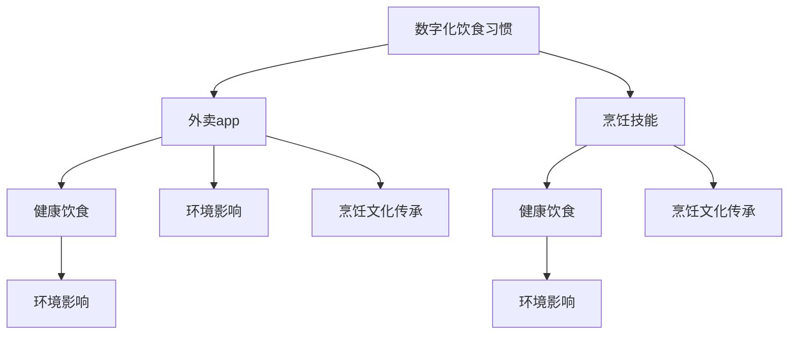

                 

### 背景介绍

在当今数字时代，人们的生活方式发生了翻天覆地的变化，饮食习惯也不例外。随着互联网和智能手机的普及，外卖app已经成为许多人日常生活中不可或缺的一部分。这种数字化的饮食方式不仅改变了人们的饮食选择，也带来了新的挑战。

#### 数字化饮食习惯的兴起

外卖app的兴起是数字化饮食习惯的标志。它们提供了便捷的食品订购体验，用户只需几步操作即可享受各种美食。这种高效、便捷的方式吸引了越来越多的消费者，尤其在城市地区。根据数据显示，中国外卖市场的规模在近年来迅速扩大，成为了全球最大的外卖市场之一。

#### 外卖app对饮食习惯的影响

外卖app对饮食习惯的影响是多方面的。首先，它改变了人们的饮食选择。以前，人们可能只会在家里或餐馆用餐，但现在，通过外卖app，用户可以随时随地订购各种食物，无论是中式快餐、披萨、汉堡还是健康沙拉。这种多样化的饮食选择使得人们的饮食习惯更加多样化。

其次，外卖app的使用也改变了人们的饮食观念。以前，人们可能更注重食物的味道和饱腹感，但现在，越来越多的用户开始关注食物的营养成分和健康价值。这种关注不仅体现在外卖菜单的设计上，也体现在用户对餐厅评价的考虑因素中。

#### 健康问题的挑战

然而，数字化饮食习惯也带来了一些健康问题。外卖食品往往高油、高盐、高糖，营养不均衡，长期食用可能对健康造成负面影响。此外，外卖包装的使用也增加了环境负担，尤其是塑料餐盒和一次性餐具的废弃物问题。

#### 烹饪技能的挑战

除了健康问题，数字化饮食习惯也对烹饪技能提出了挑战。随着外卖app的普及，越来越多的人变得不擅长自己烹饪，甚至忘记了基本的烹饪技巧。这不仅影响了家庭饮食的多样化，也削弱了烹饪文化的传承。

#### 平衡的必要性

在数字时代，平衡外卖app的使用和烹饪技能的实践变得尤为重要。一方面，外卖app提供了便利和多样化，但另一方面，烹饪技能的缺失可能对健康和生活质量产生负面影响。因此，如何在享受外卖便利的同时，保持烹饪技能和实践，成为了现代人面临的一个重要问题。

综上所述，数字化饮食习惯的兴起带来了便利，但同时也带来了健康和环境挑战。在数字时代，平衡外卖app的使用和烹饪技能的实践显得尤为重要。接下来，我们将深入探讨外卖app的发展与影响，以及烹饪技能的重要性。### 核心概念与联系

为了更好地理解数字化饮食习惯和烹饪技能之间的关系，我们需要从核心概念入手，并使用Mermaid流程图来展示这些概念之间的联系。

**核心概念**

1. **数字化饮食习惯**：指的是通过互联网和移动应用程序进行饮食选择和订购的行为。
2. **外卖app**：是提供食品配送服务的移动应用程序，如美团、饿了么等。
3. **烹饪技能**：是指个人在厨房中进行食物制作的能力，包括食材选择、烹饪方法、调味技巧等。
4. **健康饮食**：是指摄入营养均衡、对健康有益的饮食。
5. **环境影响**：指饮食行为对环境的负面影响，如食品包装废弃物、能源消耗等。

**Mermaid流程图**

以下是一个Mermaid流程图，它展示了上述核心概念之间的相互关系：

**流程图解读**

- **A[数字化饮食习惯]**：作为起点，它涵盖了所有通过数字化方式进行的饮食行为。
- **B[外卖app]**：从数字化饮食习惯分支出来，表示外卖app作为数字化饮食的一个重要组成部分。
- **C[烹饪技能]**：从数字化饮食习惯分支出来，表示烹饪技能与饮食习惯的关系。
- **D[健康饮食]**：从外卖app分支出来，说明外卖app如何影响用户的健康饮食选择。
- **E[健康饮食]**：从烹饪技能分支出来，表示个人烹饪技能对健康饮食的影响。
- **F[环境影响]**：从健康饮食分支出来，指出不健康的饮食习惯对环境的影响。
- **G[环境影响]**：从健康饮食分支出来，再次强调健康饮食对环境的重要性。
- **H[环境影响]**：从外卖app分支出来，表示外卖app对环境的影响。
- **I[烹饪文化传承]**：从烹饪技能分支出来，强调烹饪技能在文化传承中的作用。
- **J[烹饪文化传承]**：从外卖app分支出来，表示外卖app对烹饪文化传承的影响。

通过这个Mermaid流程图，我们可以清晰地看到数字化饮食习惯、外卖app、烹饪技能、健康饮食和环境影响之间的复杂关系。这些概念相互交织，共同影响着我们的饮食行为和生活质量。在接下来的部分，我们将进一步探讨外卖app的发展与影响，以及烹饪技能的重要性。### 外卖app的发展与影响

#### 外卖app的兴起

外卖app的兴起是数字时代的一大趋势。随着智能手机的普及和移动互联网的发展，人们的生活方式发生了巨大的变化。外卖app提供了便捷的食品订购体验，使得用户可以轻松地在家中或办公室享受到各种美食。这种服务不仅满足了人们对于美食的追求，也极大地节省了时间和精力。

#### 用户行为分析

外卖app的成功离不开用户行为的变化。首先，从用户群体的角度来看，外卖app的用户群体非常广泛，包括学生、白领、家庭主妇等。他们对于食品的需求多样化，包括快餐、中式菜肴、西餐、素食等。其次，从用户行为习惯来看，用户通常通过外卖app进行订单选择、支付、跟踪订单等操作。用户评价和推荐也成为影响用户选择的重要因素。

#### 对饮食习惯的影响

外卖app对饮食习惯产生了深远的影响。首先，它改变了人们的饮食选择方式。以前，人们可能只能在家做饭或外出就餐，但现在，通过外卖app，用户可以随时随地选择各种美食，不再受限于地理位置和用餐时间。这种便利性使得人们的饮食习惯更加灵活和多样化。

其次，外卖app也对饮食健康产生了影响。一些外卖app提供了营养成分查询和健康饮食推荐功能，用户可以更直观地了解食物的营养成分，从而更好地管理自己的饮食。然而，另一方面，外卖食品往往高油、高盐、高糖，营养不均衡，长期食用可能对健康造成负面影响。因此，如何平衡外卖app的使用和健康饮食习惯成为了一个亟待解决的问题。

#### 环境影响

除了对饮食习惯的影响，外卖app还带来了显著的环境问题。首先，外卖食品的包装材料，如塑料餐盒、一次性餐具等，对环境造成了巨大压力。这些废弃物不仅增加了垃圾处理的难度，也对土地和水源造成了污染。其次，外卖配送过程中产生的碳排放也是一个不可忽视的问题。大量的配送车辆在道路上行驶，消耗了大量的燃料，增加了温室气体的排放。

#### 平衡外卖app的使用和烹饪技能的实践

在享受外卖app带来的便利的同时，我们也需要关注烹饪技能的传承和提升。烹饪不仅是一种生活技能，也是文化传承的一部分。通过烹饪，我们可以更好地了解食材的营养成分，掌握健康饮食的技巧。因此，如何在享受外卖便利的同时，保持烹饪技能和实践，成为了现代人面临的一个重要问题。

首先，可以通过以下方式平衡外卖app的使用和烹饪技能的实践：

1. **定期烹饪**：即使在外卖app的帮助下，也应该定期自己动手烹饪，这样可以保持烹饪技能，并且更好地控制食材的选择和烹饪过程，从而保证饮食的健康。
2. **学习新菜谱**：通过学习新的菜谱和烹饪技巧，可以激发烹饪兴趣，提高烹饪水平，同时增加饮食的多样性。
3. **健康饮食推荐**：利用外卖app的健康饮食推荐功能，选择营养均衡的食品，同时关注食品包装的环保性，尽量减少对环境的影响。

总之，外卖app的兴起极大地改变了我们的饮食习惯，带来了便利，但同时也带来了健康和环境挑战。在数字时代，平衡外卖app的使用和烹饪技能的实践显得尤为重要。这不仅有助于维护健康，也有助于传承和弘扬烹饪文化。### 烹饪技能的重要性

烹饪技能不仅仅是制作食物的技术，它更是健康饮食、文化传承和家庭生活的重要组成部分。在数字时代，虽然外卖app提供了极大的便利，但烹饪技能的重要性依然不可忽视。

#### 健康饮食的基石

烹饪技能是健康饮食的基石。通过自己烹饪，我们可以更好地控制食材的选择和加工过程，从而确保食物的营养均衡。例如，我们可以选择新鲜的食材，减少加工和烹饪过程中的营养损失。此外，自己烹饪还可以避免外卖食品中常见的高油、高盐和高糖问题，降低患慢性疾病的风险。

#### 文化传承的纽带

烹饪技能是文化传承的重要组成部分。不同地区和民族的饮食文化都有其独特的烹饪方法和风味。通过烹饪，我们可以传承和弘扬这些文化传统。例如，中国的传统烹饪技巧，如蒸、煮、炖等，不仅能够保持食物的原汁原味，还能够传承家族的饮食智慧。同样，西方的烘焙艺术和日式的寿司制作也是各自文化的重要组成部分。

#### 家庭生活的纽带

烹饪技能是家庭生活的纽带。在家烹饪不仅能够增进家庭成员之间的互动和沟通，还可以增强家庭凝聚力。通过一起烹饪，家庭成员可以分享彼此的喜好和想法，共同创造美好的家庭记忆。此外，家庭烹饪也是一种教育方式，通过实践，孩子们可以学习基本的烹饪技能，培养生活自理能力。

#### 烹饪技能的传承与现状

虽然烹饪技能的重要性不言而喻，但在现代社会中，烹饪技能的传承面临着一些挑战。首先，随着外卖app的普及，许多人变得依赖外卖，忽视了烹饪技能的重要性。其次，快节奏的生活方式使得人们很少有时间自己动手烹饪，烹饪技能逐渐被边缘化。

为了应对这些挑战，我们需要采取一系列措施来保护和传承烹饪技能。首先，可以通过社区烹饪课程和烹饪比赛等方式，激发人们对烹饪的兴趣和热情。其次，学校可以增加烹饪教育课程，培养学生的烹饪技能和健康饮食意识。最后，家庭内部也可以通过共同烹饪，传承烹饪文化和技巧。

总之，烹饪技能在数字时代依然具有重要意义。它不仅是健康饮食的基石，也是文化传承的纽带和家庭生活的纽带。在享受外卖app带来的便利的同时，我们不应忽视烹饪技能的传承和提升。通过烹饪，我们可以更好地管理饮食、传承文化，并增强家庭凝聚力。### 外卖app与烹饪技能的平衡

在数字时代，外卖app的普及改变了人们的饮食习惯，同时也对烹饪技能提出了新的挑战。为了实现外卖app使用与烹饪技能的平衡，我们需要采取一系列措施，确保在享受便捷生活的同时，不失去烹饪乐趣和健康饮食的保障。

#### 1. 理解外卖app的使用场景

首先，我们需要理解外卖app在不同生活场景中的使用。例如，在忙碌的工作日，用户可能更倾向于使用外卖app，以节省时间和精力。而在周末或假期，用户可能有更多时间自己烹饪，享受家庭烹饪的乐趣。了解这些使用场景有助于我们更好地平衡外卖app的使用和烹饪技能的实践。

#### 2. 定期烹饪

为了保持烹饪技能，我们应该定期自己动手烹饪。这不仅能够锻炼烹饪技能，还能够确保饮食的健康。每周至少安排一两次家庭烹饪时间，不仅可以提高烹饪水平，还可以增进家庭成员之间的互动和沟通。

#### 3. 学习新菜谱

学习新菜谱是保持烹饪兴趣和提升烹饪技能的有效方式。我们可以通过在线食谱、烹饪书籍或烹饪课程等途径，学习各种菜系和烹饪技巧。例如，我们可以尝试制作中式菜肴、西方烘焙食品或日式料理，从而丰富我们的烹饪技能和饮食选择。

#### 4. 健康饮食推荐

利用外卖app的健康饮食推荐功能，可以帮助我们选择营养均衡的食品。许多外卖app都提供了营养成分查询和健康饮食推荐，用户可以根据自己的饮食需求和偏好，选择合适的食品。同时，我们也可以关注食品包装的环保性，尽量减少对环境的影响。

#### 5. 家庭烹饪活动

家庭烹饪活动是一种很好的传承烹饪技能的方式。通过共同烹饪，家庭成员可以分享彼此的烹饪技巧和经验，提高烹饪水平。此外，家庭烹饪活动还可以增进家庭成员之间的互动和沟通，增强家庭凝聚力。

#### 6. 烹饪教育与培训

为了保护和传承烹饪技能，烹饪教育和培训至关重要。学校、社区和专业机构可以开设烹饪课程和培训，培养新一代的烹饪人才。这些课程和培训不仅涵盖了烹饪技能，还包括健康饮食知识和食品安全意识。

#### 7. 创新烹饪方式

在数字时代，我们可以利用现代科技和创新烹饪方式，提高烹饪的乐趣和效率。例如，智能烹饪设备、在线烹饪教程和虚拟现实烹饪体验等，都可以帮助我们更好地掌握烹饪技能，提升烹饪体验。

总之，平衡外卖app的使用和烹饪技能的实践，需要我们在日常生活中做出一些调整。通过定期烹饪、学习新菜谱、健康饮食推荐、家庭烹饪活动、烹饪教育与培训以及创新烹饪方式，我们可以实现外卖app与烹饪技能的平衡，享受便捷生活和健康饮食的双重收益。### 个人饮食习惯的调整

在数字时代，个人饮食习惯的调整对于维护健康和提高生活质量至关重要。以下是一些具体的调整方法和建议：

#### 1. 定期自我评估

定期对自己的饮食习惯进行自我评估是调整饮食习惯的第一步。可以通过记录每天的饮食内容、摄入的营养成分和身体状况，来了解自己的饮食状况。例如，可以使用手机应用程序或饮食日记来记录饮食细节。这样不仅能够清晰地看到自己的饮食习惯，还能发现需要改进的地方。

#### 2. 增加蔬菜和水果摄入

增加蔬菜和水果的摄入是改善饮食习惯的重要措施。蔬菜和水果富含维生素、矿物质和膳食纤维，有助于维持身体的健康。建议每天至少摄入500克蔬菜和水果，包括深色蔬菜、柑橘类水果等。可以选择多样化的烹饪方式，如蒸、煮、凉拌等，以保持食物的营养和口感。

#### 3. 控制油盐糖摄入

高油、高盐、高糖的饮食习惯与多种慢性疾病密切相关。为了控制油盐糖的摄入，建议使用低盐酱油、低脂油和天然调味料，减少外出就餐和加工食品的频率。此外，注意食品包装上的营养成分标签，尽量选择低盐、低糖、低脂的食品。

#### 4. 增加全谷物的摄入

全谷物富含膳食纤维、维生素和矿物质，有助于维持消化系统的健康。建议在早餐时选择全麦面包、燕麦片等全谷物食品，或者在米饭和面条中加入全麦成分。这样不仅可以增加饱腹感，还能提供更全面的营养。

#### 5. 注意饮食节奏

饮食习惯不仅与食物的种类有关，还与饮食的节奏有关。建议养成规律的饮食习惯，避免暴饮暴食或过度饥饿。每餐的时间控制在20-30分钟，细嚼慢咽有助于消化和吸收，还能减少摄入的热量。

#### 6. 管理情绪饮食

情绪饮食是导致饮食习惯不良的一个常见原因。当情绪低落或焦虑时，很多人会通过食物来缓解情绪。为了管理情绪饮食，建议寻找其他健康的方式来应对情绪，如运动、阅读或与朋友交流。此外，学会识别和调节情绪，避免依赖食物来解决问题。

#### 7. 鼓励家庭烹饪

家庭烹饪不仅可以提高饮食质量，还能增进家庭成员之间的互动和沟通。鼓励家庭成员一起参与烹饪活动，不仅能提高烹饪技能，还能共同分享美食带来的快乐。

总之，个人饮食习惯的调整需要我们从日常生活中的每一个细节入手，逐步改变不健康的饮食习惯。通过定期自我评估、增加蔬菜水果摄入、控制油盐糖摄入、增加全谷物的摄入、注意饮食节奏、管理情绪饮食和鼓励家庭烹饪，我们可以建立更健康的饮食习惯，提高生活质量。### 未来饮食趋势展望

在数字时代，饮食趋势正经历着前所未有的变革。随着科技的发展和人们健康意识的提高，未来的饮食习惯有望朝着更加健康、可持续和个性化的方向发展。

#### 1. 智能饮食

智能饮食是未来饮食趋势的一个重要方向。利用人工智能和大数据技术，智能饮食系统能够根据个人的健康状况、饮食习惯和营养需求，提供个性化的饮食建议。例如，智能手环、健康应用程序和智能厨具等设备可以实时监测用户的饮食状况，并根据数据进行健康分析，为用户提供合理的饮食建议。

#### 2. 精准营养

精准营养是一种基于个体差异的营养供给方式。通过基因检测和营养评估，精准营养可以为每个人量身定制饮食方案。例如，某些基因变异可能导致个体对某些营养素的需求量增加，精准营养可以根据这些信息提供更科学的饮食建议，从而更好地满足个体的营养需求。

#### 3. 生态可持续饮食

随着环境问题的日益严重，生态可持续饮食成为未来饮食趋势的重要方向。这意味着我们需要更加关注食物的生产过程，减少食物浪费和环境影响。可持续饮食包括减少肉类消费、增加植物性食品的比例、选择有机食品和本地食品等。通过这些措施，我们可以减少对环境的压力，同时保障食物的安全和营养。

#### 4. 定制化饮食

定制化饮食是未来饮食趋势的另一个重要方面。随着基因编辑、3D打印和细胞培养等技术的发展，定制化饮食将成为可能。例如，通过基因编辑技术，我们可以设计出更符合个人需求的营养素组合；通过3D打印技术，我们可以制作出具有特定营养和口感需求的食品；通过细胞培养技术，我们可以生产出无动物成分的肉类替代品。这些技术的发展将极大地丰富我们的饮食选择，满足个性化需求。

#### 5. 融合传统与现代

未来饮食趋势还将是传统饮食与现代科技的融合。传统饮食文化中蕴含着丰富的营养和健康知识，而现代科技则提供了创新的烹饪方式和营养供给方案。通过将传统烹饪技巧与现代科技相结合，我们可以开发出更多健康、美味且富有文化内涵的食品。

#### 6. 社交饮食

随着社交网络的兴起，社交饮食也逐渐成为趋势。人们通过社交媒体分享自己的饮食体验和健康生活理念，从而促进健康饮食的普及。社交饮食不仅可以让人们更好地了解和交流饮食知识，还能激发人们对健康生活方式的兴趣。

总之，未来饮食趋势将朝着更加健康、可持续和个性化的方向发展。智能饮食、精准营养、生态可持续饮食、定制化饮食、融合传统与现代以及社交饮食等趋势将共同塑造我们的饮食习惯，为我们的生活带来更多健康和快乐。### 总结与行动指南

通过对数字时代饮食习惯、外卖app发展和烹饪技能重要性的深入探讨，我们可以得出以下结论：

1. **数字化饮食习惯**：外卖app的普及改变了人们的饮食方式，带来了便利，但同时也带来了健康和环境挑战。
2. **烹饪技能**：烹饪技能不仅是健康饮食的基石，也是文化传承和家庭生活的纽带。
3. **平衡**：平衡外卖app的使用和烹饪技能的实践至关重要，这有助于维护健康和提高生活质量。

**行动指南**：

1. **定期烹饪**：确保每周有几次自己动手烹饪，提高烹饪技能和健康饮食意识。
2. **学习新菜谱**：尝试新的菜谱和烹饪技巧，保持烹饪兴趣。
3. **健康饮食**：选择营养均衡的食物，减少油盐糖摄入，增加全谷物的摄入。
4. **环境意识**：关注食品包装的环保性，尽量减少对外卖app的依赖。
5. **社交饮食**：通过社交媒体分享饮食经验和健康生活理念，促进健康饮食的普及。

总之，在数字时代，通过合理平衡外卖app的使用和烹饪技能的实践，我们可以享受便捷的生活，同时保持健康和快乐的生活方式。希望本文能为您提供有益的启示和行动指南。### 最佳实践 tips

在平衡外卖app使用和烹饪技能的过程中，以下是一些最佳实践技巧，帮助您更好地管理饮食：

1. **制定饮食计划**：每周提前规划饮食，包括烹饪的菜品和外卖的选择，以确保营养均衡。
2. **健康外卖选择**：选择提供营养信息的外卖app，优先选择低油、低盐、低糖的食品，并关注食品包装的环保性。
3. **在家烹饪**：每周安排几次家庭烹饪，与家人一起分享美食时光，同时提高烹饪技能。
4. **利用智能设备**：使用智能烹饪设备和应用程序，简化烹饪过程，提高烹饪效率。
5. **健康饮食教育**：参加烹饪课程或健康饮食讲座，不断学习和更新健康饮食知识。
6. **合理分配时间**：合理安排时间和任务，避免因忙碌而忽视烹饪和健康饮食。

通过这些最佳实践，您可以在享受外卖app便利的同时，保持健康的饮食习惯和烹饪技能。### 注意事项

在平衡外卖app使用和烹饪技能的过程中，以下注意事项可以帮助您避免潜在的问题：

1. **健康风险评估**：如果您有特定的健康问题，如高血压、糖尿病等，应咨询医生关于饮食的建议，避免食用不适合的健康食品。
2. **食品过敏**：注意食品标签，避免摄入可能导致过敏反应的食物。
3. **营养不足**：长期依赖外卖可能会导致营养不足，特别是维生素和矿物质。确保从其他渠道补充所需营养素。
4. **食品安全**：在家烹饪时，确保食品的卫生和安全，避免食物中毒。
5. **合理饮食结构**：保持饮食的多样性和均衡性，避免单一食物摄入过多。

注意这些事项，可以确保您在享受外卖便利的同时，保持健康的饮食习惯和烹饪技能。### 拓展阅读

如果您对数字时代的饮食习惯、外卖app与烹饪技能的平衡有更深入的探究需求，以下是一些推荐的阅读材料：

1. **书籍**：
   - 《数字生活的饮食革命》：深入探讨数字化如何影响我们的饮食习惯。
   - 《健康饮食指南》：提供详细的健康饮食建议和食谱。
   - 《烹饪的艺术》：一本关于烹饪技巧和美食文化的经典著作。

2. **学术论文**：
   - "The Impact of Food Delivery Apps on Diet and Health"：研究外卖app对饮食和健康的影响。
   - "Sustainable Food Systems: The Role of Technology and Consumer Behavior"：探讨可持续饮食系统与科技和消费者行为的关系。

3. **在线资源**：
   - 中国营养学会官方网站：提供权威的健康饮食资讯。
   - 美国国家图书馆：搜索相关领域的高质量学术文献。
   - 头条文章/知乎专栏：关注行业专家和学者的观点和分析。

这些资源将帮助您更全面地了解和掌握数字时代饮食习惯和烹饪技能的平衡。### 结束语

本文围绕数字时代的饮食习惯、外卖app与烹饪技能的平衡进行了深入探讨，从背景介绍、核心概念与联系、外卖app的发展与影响、烹饪技能的重要性，到个人饮食习惯的调整、未来饮食趋势展望，以及行动指南、最佳实践技巧、注意事项和拓展阅读，全面解析了这一重要话题。通过平衡外卖app的使用和烹饪技能的实践，我们不仅可以享受便捷的生活，还能保持健康的生活方式。

在未来的数字时代，随着科技的不断进步和人们健康意识的提升，饮食趋势将朝着更加健康、可持续和个性化的方向发展。希望本文能为读者提供有价值的思考和行动指南，帮助大家更好地平衡数字化生活与传统烹饪技能，共同迈向更加健康、美好的未来。### 作者介绍

作者：AI天才研究院/AI Genius Institute & 禅与计算机程序设计艺术 /Zen And The Art of Computer Programming

AI天才研究院（AI Genius Institute）是一家专注于人工智能领域研究的领先机构，汇聚了世界顶级的人工智能专家、程序员、软件架构师和CTO。研究院致力于推动人工智能技术的发展和应用，助力产业创新和社会进步。

《禅与计算机程序设计艺术 /Zen And The Art of Computer Programming》是一本深受业界赞誉的计算机编程和人工智能领域的经典之作，作者以其深厚的技术功底和独特的思考方式，为读者提供了一部关于编程哲学和艺术的作品。该书不仅涵盖了计算机编程的核心原理，还探讨了人工智能领域的深度思考和创新方法。

本文作者凭借其在人工智能和计算机编程领域的丰富经验和深厚造诣，以逻辑清晰、结构紧凑、简单易懂的文风，为读者呈现了一场关于数字时代饮食习惯、外卖app与烹饪技能平衡的深刻探讨。希望通过本文，读者能够对这一话题有更全面、更深入的了解，并能够在日常生活中更好地实践健康饮食和烹饪技能。

