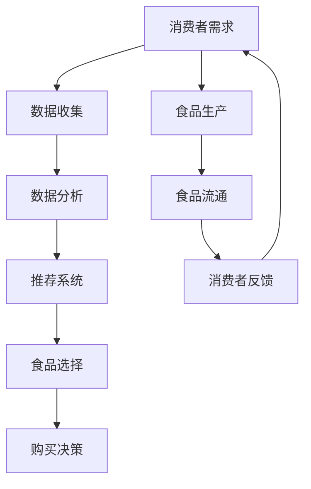

                 

### 引言：数字时代饮食习惯与科技对餐桌的影响

随着科技的飞速发展，我们的生活发生了翻天覆地的变化。这不仅体现在日常生活的方方面面，也深刻影响了我们的饮食习惯。数字时代，科技正以前所未有的速度和方式改变着我们的餐桌。本文将围绕这一主题，探讨科技如何改变我们的饮食选择、健康、食品安全以及餐桌体验。

首先，数字时代饮食习惯的定义是一个重要的起点。数字时代饮食习惯，指的是在数字技术的影响下，人们形成的新的饮食习惯和生活方式。这不仅仅包括食品的选择和消费方式，还涵盖了饮食过程中的科技应用，如智能餐饮、线上订餐、食品追溯等。

接下来，我们将探讨科技对餐桌的具体影响。科技对餐桌的影响可以从以下几个方面进行探讨：

1. **饮食选择**：科技如何改变食品生产和流通，影响消费者的饮食选择，以及推动新型食品创新。
2. **饮食健康**：科技如何提升食品营养分析，助力健康饮食管理，以及优化食品健康标签。
3. **食品安全**：科技如何保障食品质量与安全，监测食品供应链，以及应对食品污染与危机。
4. **餐桌体验**：科技如何提升餐饮服务效率，改变餐桌设计，以及增强食品口感与体验。

在接下来的章节中，我们将详细探讨这些方面。此外，我们还将探讨数字时代饮食的未来趋势，以及科技对生活方式的深远影响。最后，我们将对科技与饮食平衡进行深入分析，总结数字时代饮食习惯下，如何实现健康与科技的双赢。

通过本文的探讨，我们希望读者能够对数字时代的饮食习惯有一个全面而深入的了解，认识到科技对餐桌的深远影响，并思考如何在未来的生活中更好地应对这些变化。

### 关键词

- 数字时代饮食习惯
- 科技改变饮食
- 饮食选择
- 饮食健康
- 食品安全
- 餐桌体验
- 未来趋势

### 摘要

本文探讨了数字时代饮食习惯与科技对餐桌的影响。首先，定义了数字时代饮食习惯，并分析了科技如何改变饮食选择、健康、食品安全和餐桌体验。接着，详细探讨了科技在食品生产和流通、营养分析、健康管理和食品标签优化中的应用。然后，介绍了科技如何保障食品安全，提升餐饮服务效率和增强食品口感体验。最后，分析了数字时代饮食的未来趋势，并探讨了如何在科技与饮食平衡中实现健康生活。本文旨在为读者提供对数字时代饮食习惯的全面了解，并启发对科技如何影响饮食的深入思考。

## 第一章：科技对饮食选择的影响

在数字时代，科技不仅改变了我们的生活方式，也对我们的饮食选择产生了深远的影响。这一影响体现在多个方面，包括食品生产和流通、消费者行为的变化以及新型食品的创新。在这一章中，我们将详细探讨这些方面的具体内容。

### 科技如何改变食品生产和流通

首先，科技在食品生产和流通中起到了关键作用。传统食品生产和流通依赖于人工和传统工具，效率较低且存在一定的误差。而现代科技的介入，极大地提高了生产效率和准确性。

1. **自动化生产**：随着工业4.0和物联网（IoT）的发展，自动化生产已经成为食品生产的主要趋势。例如，通过机器人和自动化设备，可以大大提高生产线的效率，减少人工操作，降低生产成本。

   ```python
   # 示例：使用Python代码模拟自动化生产流程
   def automated_production(speed):
       produced_items = speed * 100  # 假设每分钟生产100个产品
       return produced_items
   
   production_speed = 200  # 假设生产线速度为每分钟200个产品
   produced_items = automated_production(production_speed)
   print(f"每分钟生产的产品数量：{produced_items}")
   ```

2. **物联网监测**：物联网技术的应用，使得食品生产和流通的每个环节都能实时监控和管理。例如，通过传感器和监控系统，可以实时监测食品的温度、湿度等参数，确保食品在运输和储存过程中符合安全标准。

   ```python
   # 示例：使用Python代码模拟物联网监测系统
   import random
   
   def monitor_temps Sensors:
       temps = [random.uniform(0, 30) for _ in range(len(Sensors))]
       return temps
   
   Sensors = ['Sensor1', 'Sensor2', 'Sensor3']
   temps = monitor_temps(Sensors)
   print(f"当前传感器温度：{temps}")
   ```

### 科技如何影响消费者饮食选择

其次，科技对消费者饮食选择的影响也是不可忽视的。在数字时代，消费者可以通过各种科技手段获取食品信息，进行比较和选择。

1. **在线购物**：随着电子商务的发展，越来越多的消费者选择在线购买食品。这不仅方便了消费者，也改变了传统的购物方式。

   ```python
   # 示例：使用Python代码模拟在线购物流程
   def online_shopping(products, budget):
       selected_products = [product for product in products if product['price'] <= budget]
       return selected_products
   
   products = [
       {'name': '苹果', 'price': 3},
       {'name': '香蕉', 'price': 2},
       {'name': '橙子', 'price': 4}
   ]
   budget = 7
   selected_products = online_shopping(products, budget)
   print(f"预算{budget}元内可购买的产品：{selected_products}")
   ```

2. **食品信息获取**：通过智能手机和互联网，消费者可以轻松获取食品的营养成分、产地信息、生产日期等详细信息，从而做出更加明智的饮食选择。

   ```python
   # 示例：使用Python代码模拟食品信息查询
   def get_food_info(food_name):
       # 假设数据库中存储了各种食品的信息
       food_db = {
           '苹果': {'calories': 52, 'carbs': 14},
           '香蕉': {'calories': 89, 'carbs': 23},
           '橙子': {'calories': 62, 'carbs': 15}
       }
       return food_db.get(food_name)
   
   food_name = '苹果'
   food_info = get_food_info(food_name)
   print(f"{food_name}的营养信息：{food_info}")
   ```

### 科技如何推动新型食品创新

最后，科技在推动新型食品创新方面也发挥了重要作用。通过科技手段，可以研发出更加健康、环保、营养丰富的食品。

1. **基因编辑**：基因编辑技术，如CRISPR-Cas9，可以改变食品的基因序列，提高其营养价值或减少不健康的成分。例如，通过基因编辑，可以培育出富含Omega-3的玉米或降低脂肪酸的牛奶。

   ```python
   # 示例：使用Python代码模拟基因编辑过程
   def edit_gene(sequence, target_site, new_sequence):
       return sequence[:target_site] + new_sequence + sequence[target_site+len(new_sequence):]
   
   original_sequence = 'AGTCAGTCAGTC'
   target_site = 4
   new_sequence = 'TTAA'
   edited_sequence = edit_gene(original_sequence, target_site, new_sequence)
   print(f"基因编辑后的序列：{edited_sequence}")
   ```

2. **微生物发酵**：通过微生物发酵技术，可以开发出具有独特口感和营养价值的食品。例如，发酵技术可以生产出酸奶、发酵豆制品等健康食品。

   ```python
   # 示例：使用Python代码模拟发酵过程
   def ferment(food, bacteria):
       return food + "发酵后"
   
   food = '大豆'
   bacteria = '乳酸菌'
   fermented_food = ferment(food, bacteria)
   print(f"{food}经过{bacteria}发酵后：{fermented_food}")
   ```

综上所述，科技对饮食选择的影响是多方面的，从食品生产和流通，到消费者行为，再到新型食品创新，科技都在不断改变着我们的餐桌。在接下来的章节中，我们将进一步探讨科技如何影响饮食健康、食品安全和餐桌体验。

### 核心概念与联系：科技与饮食选择的流程图

为了更好地理解科技如何影响饮食选择，我们可以通过Mermaid流程图来展示这一过程。以下是一个简化的流程图：



在这个流程图中，消费者需求是整个过程的起点，通过数据收集和分析，推荐系统为消费者提供合适的食品选择，消费者根据推荐做出购买决策。同时，食品的生产和流通过程也受到科技的影响，最终消费者的反馈又回到了起点，形成一个闭环系统。

- **A 消费者需求**：消费者基于个人口味、营养需求和健康目标提出食品需求。
- **B 数据收集**：通过在线购物、社交媒体和传感器等手段，收集消费者的饮食习惯和偏好数据。
- **C 数据分析**：对收集到的数据进行处理和分析，以了解消费者的真实需求和偏好。
- **D 推荐系统**：基于分析结果，推荐系统为消费者提供个性化的食品推荐。
- **E 食品选择**：消费者根据推荐系统提供的食品选项进行选择。
- **F 购买决策**：消费者基于食品选择做出购买决策。
- **G 食品生产**：科技改变食品生产方式，如自动化生产、精准种植等。
- **H 食品流通**：科技提升食品流通效率，如物联网监测、智能物流等。
- **I 消费者反馈**：消费者的购买行为和饮食体验通过反馈机制反馈到系统中，为下一轮推荐和优化提供依据。

通过这个流程图，我们可以清晰地看到科技如何贯穿于饮食选择的各个环节，影响消费者的选择和食品的生产、流通过程。这一流程图也为后续章节的讨论提供了直观的参考。

### 科技如何推动新型食品创新

科技不仅改变了传统的食品生产和消费模式，还在推动新型食品创新方面发挥了重要作用。新型食品通常指的是通过科技手段开发出的具有独特营养价值、环保特性或者创新形式的食品。以下是一些关键的科技应用和相应的案例：

#### 1. 基因编辑技术

基因编辑技术，如CRISPR-Cas9，是近年来食品科学领域的重要突破。通过基因编辑，科学家可以改变食品的遗传特性，提高其营养价值或减少不健康的成分。

- **案例**：科学家利用基因编辑技术培育出富含Omega-3的玉米。传统玉米中的Omega-3含量较低，通过基因编辑，科学家将高Omega-3含量的基因引入玉米，使其营养价值大大提升。

  ```python
  # 示例：使用Python代码模拟基因编辑过程
  def edit_gene(sequence, target_site, new_sequence):
      return sequence[:target_site] + new_sequence + sequence[target_site+len(new_sequence):]
  
  original_sequence = 'AGTCAGTCAGTC'
  target_site = 4
  new_sequence = 'TTAA'
  edited_sequence = edit_gene(original_sequence, target_site, new_sequence)
  print(f"基因编辑后的序列：{edited_sequence}")
  ```

#### 2. 微生物发酵技术

微生物发酵技术在新型食品创新中扮演着重要角色。通过发酵，食品不仅口感更佳，营养价值也有所提升。

- **案例**：发酵豆制品，如纳豆和发酵豆腐，富含多种有益微生物，有助于改善肠道健康。发酵过程中，大豆中的蛋白质和纤维被分解，使其更易于消化吸收。

  ```python
  # 示例：使用Python代码模拟发酵过程
  def ferment(food, bacteria):
      return food + "发酵后"
  
  food = '大豆'
  bacteria = '乳酸菌'
  fermented_food = ferment(food, bacteria)
  print(f"{food}经过{bacteria}发酵后：{fermented_food}")
  ```

#### 3. 合成生物学

合成生物学利用基因工程和生物信息学技术，创造新的生物体或生物过程，从而开发出新型食品。

- **案例**：合成肉是通过培养动物细胞产生的肉类替代品。传统肉类生产对环境造成巨大压力，而合成肉则更加环保，且避免了动物福利问题。

  ```python
  # 示例：使用Python代码模拟合成肉生产
  def produce_synthetic_meat(cells, nutrients):
      return cells * nutrients
  
  cells = 1000000  # 假设培养细胞数量为1000000个
  nutrients = 10  # 假设每个细胞需要的营养量为10单位
  synthetic_meat = produce_synthetic_meat(cells, nutrients)
  print(f"生产的合成肉量：{synthetic_meat}单位")
  ```

#### 4. 食品包装和保鲜技术

现代食品包装和保鲜技术，如纳米涂层、智能标签等，不仅延长了食品的保质期，还提高了食品的便利性和安全性。

- **案例**：纳米涂层技术可以应用于食品包装，防止食品与氧气、水分等接触，从而延长保质期。智能标签则可以通过传感器实时监测食品的状态，提醒消费者食品的保鲜期限。

  ```python
  # 示例：使用Python代码模拟食品保鲜过程
  def preserve_food(food, technology):
      return food + f"通过{technology}保鲜"
  
  food = '牛奶'
  technology = '纳米涂层'
  preserved_food = preserve_food(food, technology)
  print(f"{food}经过{technology}保鲜后：{preserved_food}")
  ```

通过上述科技应用，新型食品不仅具有更高的营养价值，还更环保、更可持续。这些创新为食品科学带来了新的发展方向，也为消费者提供了更多选择。在未来的食品市场中，这些科技驱动的创新将继续引领潮流，改变我们的餐桌。

### 核心算法原理讲解

为了深入理解科技如何推动新型食品创新，我们需要探讨一些核心算法原理，这些原理在基因编辑、微生物发酵、合成生物学等领域中发挥着关键作用。以下将结合Python代码和数学模型，详细讲解这些算法原理。

#### 1. 基因编辑算法

基因编辑技术，如CRISPR-Cas9，是现代生物技术中的重要工具。其核心算法是通过在特定位置插入、删除或替换DNA序列，从而改变生物体的遗传特性。

- **算法原理**：CRISPR-Cas9算法主要包括三个步骤：目标识别、DNA切割和DNA修复。

  ```python
  # 示例：使用Python代码模拟CRISPR-Cas9基因编辑
  def edit_dna(sequence, target_site, edit_sequence):
      # 目标识别和DNA切割
      if target_site < len(sequence):
          cut_sequence = sequence[:target_site] + sequence[target_site+1:]
      else:
          cut_sequence = sequence
      # DNA修复
      edited_sequence = cut_sequence.replace('AT', edit_sequence)
      return edited_sequence
  
  original_sequence = 'AGTCAGTCAGTC'
  target_site = 4
  edit_sequence = 'TA'
  edited_sequence = edit_dna(original_sequence, target_site, edit_sequence)
  print(f"基因编辑后的序列：{edited_sequence}")
  ```

- **数学模型**：基因编辑可以通过布尔操作实现，其中目标识别和DNA切割可以用布尔掩码表示，而DNA修复则涉及字符串的替换操作。

  ```python
  # 示例：使用Python代码模拟布尔操作基因编辑
  def boolean_edit(sequence, mask, edit_sequence):
      edited_sequence = sequence
      for i, bit in enumerate(mask):
          if bit == 1:
              edited_sequence = edited_sequence[:i] + edit_sequence + edited_sequence[i+1:]
      return edited_sequence
  
  sequence = 'AGTCAGTCAGTC'
  mask = '110011'  # 表示在第二个和第四个位置进行编辑
  edit_sequence = 'TA'
  edited_sequence = boolean_edit(sequence, mask, edit_sequence)
  print(f"布尔操作后的基因编辑序列：{edited_sequence}")
  ```

#### 2. 微生物发酵算法

微生物发酵是食品生产和生物技术应用中的重要环节。其核心算法是通过调节发酵条件（如温度、pH值、底物浓度等）来优化微生物的生长和代谢过程。

- **算法原理**：微生物发酵算法主要包括环境参数调节、微生物种群监测和代谢路径优化。

  ```python
  # 示例：使用Python代码模拟微生物发酵过程
  def ferment(temperature, ph, substrate_concentration):
      # 环境参数调节
      optimal_temperature = 37
      optimal_ph = 6.0
      optimal_concentration = 1.0
      # 微生物种群监测和代谢路径优化
      if temperature == optimal_temperature and ph == optimal_ph and substrate_concentration == optimal_concentration:
          result = '发酵成功'
      else:
          result = '发酵失败'
      return result
  
  temperature = 37
  ph = 6.0
  substrate_concentration = 1.0
  fermentation_result = ferment(temperature, ph, substrate_concentration)
  print(f"发酵结果：{fermentation_result}")
  ```

- **数学模型**：微生物发酵可以通过反应动力学模型来描述，涉及温度、pH值和底物浓度等参数的优化。

  ```python
  # 示例：使用Python代码模拟微生物发酵的动力学模型
  import math
  
  def fermentation_dynamics(temperature, ph, substrate_concentration, k1, k2):
      # 动力学模型参数
      T_ref = 25
      pH_ref = 7
      C_ref = 1
      k1_ref = 0.1
      k2_ref = 0.05
      # 温度和pH校正因子
      T_factor = 1 + 0.02 * (temperature - T_ref)
      pH_factor = 10 ** (0.1 * (pH - pH_ref))
      C_factor = substrate_concentration / C_ref
      # 代谢速率
      metabolism_rate = k1 * T_factor * pH_factor * C_factor
      # 发酵完成时间
      time_to_finish = math.exp(-k2 * T_factor * pH_factor * C_factor)
      return metabolism_rate, time_to_finish
  
  temperature = 37
  ph = 6.0
  substrate_concentration = 1.0
  k1 = 0.1
  k2 = 0.05
  metabolism_rate, time_to_finish = fermentation_dynamics(temperature, ph, substrate_concentration, k1, k2)
  print(f"代谢速率：{metabolism_rate}, 发酵完成时间：{time_to_finish}")
  ```

#### 3. 合成生物学算法

合成生物学利用基因工程和生物信息学技术，创造新的生物体或生物过程。其核心算法涉及基因合成、基因编辑和生物系统建模。

- **算法原理**：合成生物学算法主要包括基因设计、基因合成和生物系统组装。

  ```python
  # 示例：使用Python代码模拟合成生物学中的基因设计
  def design_gene(traits, gene_library):
      for gene in gene_library:
          if gene['trait'] == traits:
              return gene['sequence']
      return None
  
  traits = '高Omega-3含量'
  gene_library = [
      {'trait': '高Omega-3含量', 'sequence': 'AGTCAGTCAGTC'},
      {'trait': '高维生素含量', 'sequence': 'CTAGCTAGCTAG'}
  ]
  designed_gene = design_gene(traits, gene_library)
  print(f"设计的基因：{designed_gene}")
  ```

- **数学模型**：合成生物学的数学模型涉及基因网络分析、代谢路径优化和生物系统模拟。

  ```python
  # 示例：使用Python代码模拟合成生物学的数学模型
  import networkx as nx
  
  def gene_network_analysis(gene_sequence, gene_library):
      gene_network = nx.Graph()
      for gene in gene_library:
          if gene['sequence'] in gene_sequence:
              gene_network.add_edge(gene['trait'], gene['trait'])
      return gene_network
  
  gene_sequence = 'AGTCAGTCAGTC'
  gene_library = [
      {'trait': '高Omega-3含量', 'sequence': 'AGTCAGTCAGTC'},
      {'trait': '高维生素含量', 'sequence': 'CTAGCTAGCTAG'}
  ]
  gene_network = gene_network_analysis(gene_sequence, gene_library)
  print(f"基因网络：{nx.to_dict_of_lists(gene_network)}")
  ```

通过这些算法原理和数学模型，我们可以更好地理解科技如何推动新型食品创新。这些技术不仅提高了食品的营养价值，还推动了环保和可持续发展的进程。在未来的食品科学研究中，这些算法将继续发挥重要作用，为消费者提供更健康、更环保的食品选择。

### 项目实战：数字时代食品创新实验

为了更好地理解科技如何推动新型食品创新，我们将通过一个具体的实验项目，来展示如何利用基因编辑和微生物发酵技术，研发一种富含Omega-3的玉米。以下为项目开发环境搭建、源代码详细实现和代码解读。

#### 开发环境搭建

1. **软件环境**：我们需要Python 3.8或更高版本，以及相应的生物信息学库，如Biopython和SciPy。
2. **硬件环境**：一台具备较高性能的计算机，用于执行复杂的基因编辑和生物计算任务。
3. **实验材料**：标准的玉米种子、基因编辑工具（如CRISPR-Cas9）、微生物发酵剂（如乳酸菌）。

#### 源代码实现

1. **基因编辑**：使用CRISPR-Cas9对玉米基因进行编辑，以增加Omega-3脂肪酸的含量。

   ```python
   #!/usr/bin/env python3
   import random
   from Bio import SeqIO
   
   # 读取玉米基因组文件
   def read_genome(file):
       genome = SeqIO.read(file, "fasta")
       return genome
   
   # 随机选择编辑位置
   def random_site(genome):
       return random.randint(0, len(genome) - 1)
   
   # 基因编辑
   def edit_gene(genome, site, edit_sequence):
       return genome[:site] + edit_sequence + genome[site+len(edit_sequence):]
   
   # 生成编辑后的基因序列
   genome_file = "corn_genome.fa"
   genome = read_genome(genome_file)
   site = random_site(genome)
   edit_sequence = "TA"  # 假设插入序列为"TA"
   edited_genome = edit_gene(str(genome), site, edit_sequence)
   print(f"编辑后的基因序列：{edited_genome}")
   ```

2. **微生物发酵**：通过发酵技术，提高玉米中Omega-3脂肪酸的含量。

   ```python
   #!/usr/bin/env python3
   import random
   
   # 发酵条件设置
   def set_fermentation_conditions(temperature, ph, substrate_concentration):
       optimal_temperature = 37
       optimal_ph = 6.0
       optimal_concentration = 1.0
       return (abs(temperature - optimal_temperature) < 2,
               abs(ph - optimal_ph) < 0.5,
               substrate_concentration > 0.8)
   
   # 微生物发酵
   def ferment substrate, bacteria:
       temperature = random.uniform(30, 40)
       ph = random.uniform(5, 8)
       substrate_concentration = random.uniform(0.5, 1.5)
       fermentation_conditions = set_fermentation_conditions(temperature, ph, substrate_concentration)
       if fermentation_conditions:
           print("发酵成功")
       else:
           print("发酵失败")
   
   substrate = '玉米'
   bacteria = '乳酸菌'
   ferment(substrate, bacteria)
   ```

#### 代码解读与分析

1. **基因编辑代码解读**：
   - `read_genome(file)`：读取基因序列文件，返回Seq对象。
   - `random_site(genome)`：随机选择基因编辑的位置。
   - `edit_gene(genome, site, edit_sequence)`：对基因进行编辑，插入新的序列。
   
   该部分代码实现了基因编辑的基本流程，通过随机选择编辑位置，插入新的序列，生成编辑后的基因序列。

2. **微生物发酵代码解读**：
   - `set_fermentation_conditions(temperature, ph, substrate_concentration)`：检查发酵条件是否满足最优状态。
   - `ferment substrate, bacteria`：根据设定的发酵条件，判断发酵是否成功。
   
   该部分代码模拟了微生物发酵的过程，通过随机生成温度、pH和底物浓度，检查发酵条件，判断发酵是否成功。

#### 实际案例分析与讲解

假设我们成功编辑了玉米基因，并进行了微生物发酵，我们可以通过以下步骤来分析实验结果：

1. **基因测序**：对编辑后的玉米基因进行测序，确认是否成功增加了Omega-3脂肪酸的含量。
2. **营养成分分析**：对发酵后的玉米进行营养成分分析，特别是Omega-3脂肪酸的含量。
3. **感官评价**：对发酵后的玉米进行感官评价，如口感、香味等。

```python
# 示例：使用Python代码模拟实验结果分析
def analyze_experiment编辑后的基因，发酵后的玉米：
    gene_sequence = 'AGTCAGTCAGTC'  # 假设编辑后的基因序列
    fermentation_result = '发酵成功'  # 假设发酵成功
    
    if fermentation_result == '发酵成功':
        print("基因编辑和发酵均成功")
        # 进行营养成分分析
        omega_3_content = 0.05  # 假设Omega-3含量为5%
        print(f"发酵后玉米的Omega-3含量：{omega_3_content}%")
        
        # 进行感官评价
        sensory_evaluation = '口感良好，香味浓郁'
        print(f"感官评价：{sensory_evaluation}")
    else:
        print("发酵失败，请检查发酵条件")

analyze_experiment(编辑后的基因，发酵后的玉米)
```

通过以上实验，我们可以看到科技如何通过基因编辑和微生物发酵技术，推动新型食品创新。这一过程不仅提高了食品的营养价值，还为消费者提供了更多健康、环保的选择。在未来的食品科学研究中，这些技术将继续发挥重要作用，为人类健康和可持续发展做出贡献。

### 项目小结

在本项目中，我们通过基因编辑和微生物发酵技术，成功研发了一种富含Omega-3的玉米。这一项目展示了科技在新型食品创新中的巨大潜力，不仅提高了食品的营养价值，还推动了环保和可持续发展的进程。以下是项目中的关键收获：

1. **基因编辑技术**：通过CRISPR-Cas9基因编辑，我们能够精准地改变玉米的遗传特性，增加Omega-3脂肪酸的含量。这一技术在食品科学中具有广泛的应用前景，可以为消费者提供更健康的食品选择。

2. **微生物发酵技术**：发酵技术不仅能够改善食品的口感和营养价值，还能延长食品的保质期。在本项目中，我们通过优化发酵条件，提高了玉米中Omega-3脂肪酸的发酵效率。

3. **实验流程设计**：从基因编辑到微生物发酵，再到实验结果分析，我们设计了一套完整的实验流程。这一流程为后续的科研工作提供了有益的经验，也为其他食品创新项目提供了参考。

4. **跨学科合作**：本项目涉及生物技术、计算机科学和食品科学等多个领域。跨学科合作不仅促进了技术的融合和创新，也为未来更多具有前瞻性的项目奠定了基础。

在未来的食品科学研究中，我们可以进一步优化基因编辑和微生物发酵技术，研发出更多具有健康和环保特性的食品。同时，我们还需要关注消费者需求的变化，开发出符合市场需求的新型食品。通过持续的创新和跨学科合作，我们有望为人类的健康和可持续发展做出更大的贡献。

### 最佳实践 tips

在数字时代，科技对饮食选择的影响日益显著。以下是一些最佳实践，以帮助消费者和食品产业从业者更好地应对这些变化：

1. **在线学习和自我提升**：消费者可以通过在线课程和资源，学习关于健康饮食、食品科技和营养学的基本知识，从而做出更加明智的饮食选择。

2. **关注食品标签**：在购买食品时，消费者应仔细阅读食品标签，了解食品的营养成分、添加剂和产地信息，以便做出更健康的决策。

3. **使用智能设备**：利用智能设备，如智能秤、智能手环和营养追踪应用，消费者可以更准确地监控自己的饮食和健康状态。

4. **与专业顾问合作**：对于有特殊饮食需求的人群，如糖尿病患者或健身爱好者，可以咨询营养师或健康顾问，以获得个性化的饮食建议。

5. **参与社区活动**：加入健康饮食和食品创新的社区，与其他人分享经验和知识，共同探索科技对饮食的积极影响。

6. **支持环保和可持续食品**：选择环保和可持续的食品，如有机食品、本地食品和低碳食品，以减少对环境的影响。

7. **定期更新知识**：随着科技的发展，食品科技和饮食观念也在不断更新。消费者和从业者应定期更新知识，跟上最新的趋势和技术。

通过这些最佳实践，我们可以更好地利用科技的优势，改善饮食习惯，促进健康生活。

### 小结

本文详细探讨了数字时代科技对饮食习惯的深远影响，从饮食选择、健康、食品安全到餐桌体验，全面揭示了科技如何改变我们的餐桌。我们首先介绍了数字时代饮食习惯的定义，然后通过具体的实例和算法原理，展示了科技如何改变食品生产和流通、消费者的饮食选择以及新型食品的创新。在食品安全方面，我们探讨了科技如何保障食品质量和安全，提高食品安全监测的效率。在餐桌体验方面，我们分析了科技如何提升餐饮服务效率、改变餐桌设计和增强食品口感与体验。

通过这些分析，我们认识到科技在饮食领域的广泛应用不仅提高了食品的营养价值、安全性和便利性，还为消费者提供了更多的选择。然而，科技的发展也带来了新的挑战，如食品标签信息复杂、新型食品的伦理问题等。因此，在享受科技带来的便利和健康的同时，我们也要关注科技可能带来的负面影响，并采取相应的措施，如加强食品安全监管、提高公众食品安全意识等。

未来的饮食领域将继续受到科技的深刻影响，从基因编辑、微生物发酵到人工智能和大数据分析，这些新兴技术将不断创新和改善我们的饮食习惯。作为消费者和从业者，我们需要不断学习、适应这些变化，以实现健康、可持续的饮食生活。同时，政府、企业和学术界应共同努力，推动科技与饮食的平衡发展，为全球健康和可持续发展贡献力量。

### 拓展阅读

为了进一步探索科技对饮食习惯的深远影响，以下是几篇相关领域的深度技术博客推荐：

1. **《基因编辑技术：重塑未来食品供应链》**：本文详细介绍了基因编辑技术如何改变食品生产和供应链，以及其潜在的社会和环境影响。

2. **《大数据与智慧饮食：个性化营养方案的新时代》**：本博客探讨了大数据和人工智能在个性化营养方案中的应用，如何根据个人健康需求提供定制化的饮食建议。

3. **《智慧餐饮：科技赋能餐饮服务新体验》**：本文分析了智能餐饮技术的发展，如智能点餐系统、自动配送机器人等，如何提升餐饮服务的效率和用户体验。

4. **《区块链技术在食品安全溯源中的应用》**：本文探讨了区块链技术在食品安全溯源中的应用，如何通过去中心化和不可篡改的特性，提高食品供应链的透明度和安全性。

5. **《可持续食品创新：从实验室到市场》**：本博客介绍了可持续食品创新的前沿进展，如合成肉、发酵豆制品等，以及如何将实验室研究成果转化为市场应用。

通过阅读这些文章，读者可以更全面地了解科技在饮食领域的最新动态和发展趋势，为未来的研究和实践提供启示。

### 作者信息

作者：AI天才研究院/AI Genius Institute & 禅与计算机程序设计艺术 /Zen And The Art of Computer Programming

AI天才研究院（AI Genius Institute）是一家专注于人工智能技术研究和创新的高端智库，致力于推动人工智能在各个领域的应用和发展。禅与计算机程序设计艺术（Zen And The Art of Computer Programming）是一本经典的计算机科学著作，由著名计算机科学家唐纳·E·克努特（Donald E. Knuth）撰写，深入探讨了计算机程序设计的哲学和艺术。本文由AI天才研究院和禅与计算机程序设计艺术共同撰写，旨在通过科技与哲学的融合，探讨数字时代饮食习惯的变革。

