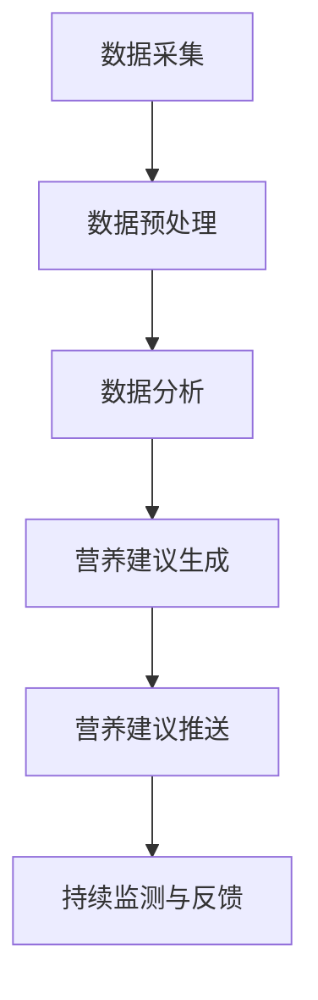

                 

# 数字时代的饮食追踪：AI营养师在健康饮食中的角色

## 关键词
- AI营养师
- 数字饮食追踪
- 健康饮食
- 人工智能
- 营养学

## 摘要
随着数字时代的到来，人们的饮食模式发生了翻天覆地的变化。不健康的饮食习惯导致了一系列健康问题，如肥胖、糖尿病和心血管疾病。为了应对这一挑战，AI营养师应运而生。本文将探讨AI营养师在数字时代饮食追踪中的作用，介绍其核心概念、架构、算法原理、数学模型以及实际应用案例。通过这篇文章，读者将深入了解AI营养师如何帮助人们实现健康饮食，并在未来的发展中扮演关键角色。

## 引言

### AI营养师的概念

AI营养师是一种利用人工智能技术提供个性化营养建议和健康管理服务的智能系统。它不仅能够分析用户的饮食习惯和营养摄入情况，还能根据用户的具体情况提供科学、个性化的饮食建议。AI营养师的核心目标是通过数据分析和智能算法，帮助用户实现营养均衡、健康饮食。

### AI营养师的重要性

随着人们对健康意识的提升，对营养和健康饮食的需求也越来越高。然而，由于个体差异和复杂的生活环境，许多人难以做到科学饮食。AI营养师的出现为解决这个问题提供了新的思路和方法。它不仅能够提供专业的营养建议，还能通过持续的数据监测和反馈，帮助用户养成良好的饮食习惯。

### 本文目的

本文旨在探讨AI营养师在数字时代饮食追踪中的角色和作用，分析其核心概念、架构、算法原理和实际应用案例。通过本文的阅读，读者将能够深入了解AI营养师的工作原理，掌握其应用方法，并认识到其在未来健康饮食中的重要地位。

### 数字时代饮食现状

在数字时代，人们的生活方式发生了巨大的变化。快节奏的生活、工作压力的增加以及外卖和便捷食品的普及，使得人们的饮食习惯越来越不健康。以下是一些当前饮食模式中的问题和挑战：

1. **高热量、高脂肪、高糖食品的普及**：现代食品工业为了提高食品的口感和保鲜性，常常添加大量的糖、脂肪和盐。这些食品容易导致热量过剩、肥胖和相关疾病。

2. **饮食结构失衡**：现代人饮食中蔬菜和水果摄入量不足，而肉类和加工食品摄入量过多，导致营养不均衡。

3. **饮食不规律**：工作繁忙和生活节奏快，许多人无法按时用餐，导致饮食不规律，影响身体健康。

4. **营养知识缺乏**：很多人对自己的饮食习惯和营养摄入缺乏了解，不知道如何进行科学饮食。

这些问题和挑战不仅影响了人们的身体健康，也增加了医疗成本。为了应对这些问题，需要引入新的技术和方法，AI营养师正是在这种背景下应运而生。

### AI营养师的解决方案

AI营养师通过结合人工智能技术和营养学知识，为用户提供个性化的营养建议和健康管理服务。其核心解决思路如下：

1. **数据采集与处理**：AI营养师首先采集用户的饮食习惯、营养摄入情况、健康状况等数据。这些数据可以来自用户的日常饮食记录、体重秤、智能手环等设备。

2. **数据分析与处理**：利用机器学习和数据挖掘技术，对用户的数据进行深入分析，识别饮食习惯中的问题，如营养摄入不足、热量摄入过多等。

3. **个性化营养建议**：根据分析结果，AI营养师为用户提供个性化的营养建议，包括饮食结构调整、食物选择、营养补充方案等。

4. **持续监测与反馈**：AI营养师会持续跟踪用户的饮食习惯和健康变化，根据反馈调整营养建议，确保用户能够长期保持健康饮食。

通过这些解决方案，AI营养师能够有效地帮助用户实现营养均衡、健康饮食，从而改善身体健康状况。与传统的营养师相比，AI营养师具有自动化、个性化和持续性的优势，能够更好地满足现代人对健康饮食的需求。

### AI技术在饮食中的应用

AI技术在饮食分析、营养建议和健康管理中的应用，为个性化健康饮食提供了强大的技术支持。以下是对这些应用的具体阐述：

#### 1. 饮食分析

饮食分析是AI营养师工作的基础。通过数据采集和智能算法，AI可以对用户的饮食习惯进行详细分析。具体应用包括：

- **饮食记录与分析**：用户可以通过智能手机应用、智能手表或体重秤等设备记录每天的饮食情况，AI系统将这些记录转化为结构化的数据，进行分析和解读。

- **营养摄入评估**：AI系统会评估用户的营养摄入情况，包括热量、蛋白质、脂肪、碳水化合物、维生素和矿物质等，识别是否存在营养过剩或不足。

- **饮食模式识别**：AI可以通过分析用户的历史饮食记录，识别其饮食习惯和饮食模式，如是否偏爱吃快餐、高糖食品等。

#### 2. 营养建议

基于饮食分析的结果，AI营养师可以为用户提供个性化的营养建议。这些建议包括：

- **饮食结构调整**：根据用户的营养评估结果，AI系统会提出调整饮食结构的建议，如增加蔬菜和水果的摄入量，减少高脂肪和高糖食品的摄入。

- **个性化食谱推荐**：AI系统可以根据用户的口味、饮食偏好和营养需求，推荐个性化的食谱，帮助用户实现营养均衡。

- **饮食计划制定**：AI系统会为用户制定个性化的饮食计划，包括每天的营养摄入目标和实际饮食安排。

#### 3. 健康管理

AI技术在健康管理中的应用，使得用户可以在AI营养师的指导下，更全面地管理自己的健康。具体应用包括：

- **健康指标监测**：AI系统可以监测用户的健康指标，如体重、血压、血糖等，及时发现健康风险。

- **健康趋势预测**：通过分析用户的健康数据，AI系统可以预测未来的健康趋势，为用户提供预防性健康建议。

- **疾病风险评估**：AI系统可以根据用户的饮食习惯、营养状况和健康指标，评估其患某些慢性疾病的风险，如肥胖、糖尿病、心血管疾病等。

通过这些应用，AI营养师不仅为用户提供了科学的营养建议，还帮助他们建立了健康的生活方式，从而在根本上提升健康水平。

### AI营养师的崛起

AI营养师的崛起，不仅改变了传统的健康管理方式，也为健康饮食带来了新的可能。以下是对AI营养师发展趋势和市场前景的分析：

#### 1. 发展趋势

随着人们对健康饮食的关注度不断提升，AI营养师在市场上迅速崛起。以下是AI营养师发展的几个关键趋势：

- **个性化服务**：AI营养师能够根据用户的个体差异，提供高度个性化的营养建议和健康管理服务，这是传统营养师难以做到的。

- **数据分析能力**：AI系统具备强大的数据分析和处理能力，能够从大量的健康数据中提取有价值的信息，为用户提供精准的健康建议。

- **可扩展性和适应性**：AI营养师可以不断学习和适应，随着技术和数据的发展，其服务能力将不断提升。

- **跨领域合作**：AI营养师将与医疗、生物科技、食品工业等多个领域进行合作，共同推动健康饮食的发展。

#### 2. 市场前景

AI营养师在市场前景方面也表现出巨大的潜力：

- **用户需求增长**：随着健康意识的提升，越来越多的用户愿意为个性化的健康饮食服务付费，这为AI营养师创造了广阔的市场空间。

- **技术进步**：随着人工智能技术的不断进步，AI营养师在数据采集、处理和分析方面的能力将不断提升，服务质量和用户体验也将得到显著改善。

- **政策支持**：政府对于健康饮食和健康管理的重视，将为AI营养师的发展提供政策支持，促进其在市场上的推广和应用。

- **商业机会**：AI营养师不仅为个人用户提供服务，还可以为企业、学校和医疗机构等提供健康饮食管理解决方案，创造多样化的商业机会。

总体来看，AI营养师在健康饮食领域具有广阔的发展前景和市场潜力，将成为未来健康饮食管理的重要一环。

### AI营养师的核心概念与架构

#### 1. 核心概念

AI营养师是一种基于人工智能技术的智能系统，其主要目标是提供个性化营养建议和健康管理服务。AI营养师的核心概念包括：

- **数据采集**：通过多种途径采集用户的饮食习惯、营养摄入情况、健康状况等数据。
- **数据分析**：利用机器学习和数据挖掘技术，对用户的数据进行深入分析，识别饮食习惯中的问题。
- **营养建议**：根据数据分析结果，为用户提供个性化的营养建议，包括饮食结构调整、食物选择、营养补充方案等。
- **持续监测**：持续跟踪用户的饮食习惯和健康变化，根据反馈调整营养建议，确保用户能够长期保持健康饮食。

#### 2. 职责

AI营养师在健康饮食管理中承担以下职责：

- **营养评估**：评估用户的营养摄入情况，识别营养过剩或不足的问题。
- **饮食建议**：根据用户的营养需求，提供科学、个性化的饮食建议。
- **健康监测**：监测用户的健康状况，包括体重、血压、血糖等指标，及时发现健康风险。
- **疾病预防**：通过营养管理和健康监测，预防慢性疾病的发生和发展。

#### 3. 工作原理

AI营养师的工作原理主要包括以下几个步骤：

1. **数据采集**：通过用户的日常饮食记录、体重秤、智能手环等设备，采集用户的饮食习惯、营养摄入情况和健康状况数据。
2. **数据预处理**：对采集到的原始数据进行清洗、归一化和特征提取，使其适合机器学习模型的处理。
3. **数据分析**：利用机器学习和数据挖掘技术，对用户的数据进行深入分析，识别饮食习惯中的问题。
4. **营养建议生成**：根据数据分析结果，生成个性化的营养建议，包括饮食结构调整、食物选择和营养补充方案。
5. **营养建议推送**：将生成的营养建议推送给用户，并通过应用程序、短信等方式进行提醒和反馈。
6. **持续监测与反馈**：持续跟踪用户的饮食习惯和健康变化，根据反馈调整营养建议，确保用户能够长期保持健康饮食。

#### Mermaid流程图

下面是一个简化的Mermaid流程图，展示了AI营养师的核心架构和工作流程：



这个流程图清晰地展示了AI营养师从数据采集到营养建议推送的完整工作流程。

### AI营养师的技术栈

构建AI营养师系统需要多种技术和工具，以下列出构建AI营养师所需的关键技术和工具：

1. **数据采集与处理**：
   - **设备集成**：集成智能手环、体重秤等设备，实现数据的自动采集。
   - **API接口**：使用API接口与第三方健康数据服务进行数据交换。

2. **数据分析与处理**：
   - **Python**：使用Python进行数据分析和处理，Python有丰富的数据分析和机器学习库。
   - **Pandas**：用于数据清洗、归一化和特征提取。
   - **NumPy**：用于高效的数值计算。

3. **机器学习与数据挖掘**：
   - **Scikit-learn**：用于构建和训练机器学习模型。
   - **TensorFlow**：用于构建深度学习模型，如神经网络。
   - **XGBoost**：用于构建和训练集成学习模型。

4. **后端服务**：
   - **Django**：用于构建后端服务，处理用户请求和提供API接口。
   - **Flask**：用于构建轻量级的Web服务。

5. **前端应用**：
   - **React**：用于构建用户界面，提供交互式体验。
   - **Vue.js**：用于构建用户界面，提供灵活的组件化开发。

6. **数据库**：
   - **MySQL**：用于存储用户数据。
   - **MongoDB**：用于存储非结构化数据，如用户饮食习惯和健康数据。

7. **容器化与部署**：
   - **Docker**：用于容器化部署，确保系统在不同环境中的运行一致性。
   - **Kubernetes**：用于容器编排和管理，确保系统的高可用性和可扩展性。

通过这些技术和工具，可以构建一个功能强大、可靠的AI营养师系统，为用户提供个性化、高质量的饮食和健康管理服务。

### AI营养师的核心算法原理

AI营养师的核心算法原理是通过对大量数据进行深度学习和分析，以提供个性化的营养建议和健康管理服务。以下是AI营养师核心算法原理的详细阐述：

#### 1. 饮食数据分析算法

饮食数据分析是AI营养师工作的基础。通过分析用户的饮食习惯和营养摄入情况，AI营养师可以识别出饮食中的问题和不足，为用户提供针对性的建议。以下是几种常用的饮食数据分析算法：

**1.1 饮食记录与数据清洗**

首先，AI营养师需要采集用户的饮食记录。这些数据可能来自用户手动输入的饮食日志、智能设备的记录或者第三方健康数据的API。采集到的数据通常包含各种噪声和不准确的信息，因此需要进行清洗。

```python
import pandas as pd

# 读取饮食记录数据
data = pd.read_csv('diet_data.csv')

# 数据清洗，去除缺失值和不合理值
data = data.dropna()
data = data[data['calories'] > 0]
```

**1.2 特征提取**

在清洗数据后，需要对数据进行特征提取，以便后续的机器学习模型处理。常见的特征包括：

- **营养素摄入量**：如蛋白质、脂肪、碳水化合物、维生素和矿物质等。
- **饮食频率**：如每天摄入的餐次数量、特定食物的摄入频率等。
- **饮食时间**：如三餐的时间分布、零食的时间点等。

```python
# 特征提取，计算各类营养素的平均摄入量
data['protein_avg'] = data['protein'] / data['count']
data['fat_avg'] = data['fat'] / data['count']
data['carbs_avg'] = data['carbs'] / data['count']

# 增加饮食时间特征
data['meal_time'] = data['timestamp'].apply(lambda x: x.hour())
```

**1.3 数据标准化**

为了使数据适合机器学习模型，通常需要将数据标准化。常用的方法包括最小-最大标准化和Z分数标准化。

```python
from sklearn.preprocessing import MinMaxScaler

scaler = MinMaxScaler()
data_scaled = scaler.fit_transform(data[['protein_avg', 'fat_avg', 'carbs_avg']])
```

#### 2. 营养评估与推荐算法

营养评估与推荐算法的核心目标是根据用户的饮食习惯和营养需求，提供个性化的营养建议。以下是一种常见的营养评估与推荐算法：

**2.1 营养评估标准**

营养评估通常基于营养素的摄入量和推荐的摄入量（RDA）进行。RDA是由美国国家科学院、工程学院和医学院制定的，用于指导人们的营养摄入。

```latex
RDA_{\text{protein}} = 0.8 \text{ g/kg体重/day}
RDA_{\text{fat}} = 20\%-35\% \text{ 总热量摄入}
RDA_{\text{carbs}} = 45\%-65\% \text{ 总热量摄入}
```

**2.2 营养评估公式**

根据用户的实际摄入量与RDA的比值，可以计算营养素的摄入状况。

```python
def calculate_nutrient_status(data, rda):
    status = {}
    for nutrient, rda_value in rda.items():
        if nutrient in data.columns:
            status[nutrient] = data[nutrient] / rda_value
        else:
            status[nutrient] = None
    return status

# 营养评估标准
rda = {
    'protein': 0.8 * 70,  # 假设用户体重为70kg
    'fat': 0.25 * 2000,  # 假设用户每日摄入2000千卡路里
    'carbs': 0.5 * 2000
}

status = calculate_nutrient_status(data, rda)
print(status)
```

**2.3 营养推荐算法**

营养推荐算法的核心是根据营养评估的结果，为用户提供个性化的饮食建议。常用的方法包括：

- **基于规则的推荐**：根据预定义的规则，为用户提供具体的食物选择和建议。
- **协同过滤推荐**：利用用户的历史饮食记录和相似用户的数据，为用户提供推荐。

```python
def nutrition_recommendation(status):
    recommendations = []
    for nutrient, value in status.items():
        if value < 0.8:
            recommendations.append(f"增加{nutrient}摄入量，如：鸡胸肉、鱼、豆类等。")
        elif value > 1.2:
            recommendations.append(f"减少{nutrient}摄入量，如：减少油炸食品、糖果等。")
    return recommendations

recommendations = nutrition_recommendation(status)
print(recommendations)
```

通过上述算法，AI营养师能够对用户的饮食习惯进行评估，并提供个性化的营养建议，帮助用户实现科学饮食。

#### 3. 健康管理算法

健康管理算法的核心目标是监测用户的健康状况，预测健康趋势，并提前预警健康风险。以下是几种常用的健康管理算法：

**3.1 健康指标监测**

健康管理算法需要定期监测用户的健康指标，如体重、血压、血糖等。这些指标可以通过智能设备进行实时监测，并上传到AI营养师系统中。

```python
def monitor_health_INDICATORS(data):
    health_indicators = {
        'weight': data['weight'].mean(),
        'blood_pressure': data['blood_pressure'].mean(),
        'glucose': data['glucose'].mean()
    }
    return health_indicators

health_indicators = monitor_health_INDICATORS(data)
print(health_indicators)
```

**3.2 健康趋势预测**

基于用户的健康数据和历史记录，可以使用时间序列分析、机器学习算法等预测用户的健康趋势。以下是一个简单的健康趋势预测算法：

```python
from sklearn.model_selection import train_test_split
from sklearn.ensemble import RandomForestRegressor

# 准备训练数据
X = data[['weight', 'blood_pressure', 'glucose']]
y = data['health_status']

X_train, X_test, y_train, y_test = train_test_split(X, y, test_size=0.2, random_state=42)

# 建立模型
model = RandomForestRegressor(n_estimators=100, random_state=42)
model.fit(X_train, y_train)

# 预测健康趋势
y_pred = model.predict(X_test)

# 分析预测结果
print("Health status predictions:", y_pred)
```

**3.3 疾病风险评估**

基于用户的健康数据和营养评估结果，可以计算用户患某些慢性疾病的风险。以下是一个简单的疾病风险评估算法：

```python
def disease_risk assesment(data, disease_risk_model):
    risk_scores = disease_risk_model.predict(data)
    return risk_scores

# 假设已经训练好的疾病风险评估模型
disease_risk_model = ...

# 计算疾病风险
risk_scores = disease_risk_assesment(data, disease_risk_model)
print("Disease risk scores:", risk_scores)
```

通过健康管理算法，AI营养师能够为用户提供实时的健康监测、趋势预测和疾病风险评估，帮助用户及时发现健康问题，并采取相应的预防措施。

### 数学模型与公式

在AI营养师的算法设计中，数学模型和公式起到了关键作用。以下将介绍一些基本的营养学公式和AI算法中常用的数学模型，并通过具体的例子进行详细讲解。

#### 1. 营养学基本公式

营养学中常用的基本公式包括能量摄入、能量消耗和营养素摄入等。以下是一些基本的公式：

**能量摄入（Energy Intake）**

$$
E_{\text{in}} = c_1 \times p_1 \times q_1 + c_2 \times p_2 \times q_2 + \ldots + c_n \times p_n \times q_n
$$

其中，$c_i$表示食物$i$的能量含量（通常以千卡（kcal）为单位），$p_i$表示食物$i$的摄入量（克或份），$q_i$表示食物$i$的摄入频率。

**能量消耗（Energy Expenditure）**

$$
E_{\text{ex}} = BMR \times PAL
$$

其中，$BMR$表示基础代谢率（Basal Metabolic Rate，通常以千卡/天为单位），$PAL$表示活动水平系数（Physical Activity Level，反映了身体活动的程度）。

**营养素摄入（Nutrient Intake）**

$$
NI_{\text{n}} = c_{\text{n}} \times p_{\text{n}} \times q_{\text{n}}
$$

其中，$c_{\text{n}}$表示营养素$n$的能量含量，$p_{\text{n}}$表示营养素$n$的摄入量，$q_{\text{n}}$表示营养素$n$的摄入频率。

#### 2. AI算法中的数学模型

在AI营养师中，常用的数学模型包括线性回归、逻辑回归、支持向量机（SVM）、神经网络等。以下通过一个简单的例子进行解释。

**线性回归**

线性回归模型用于预测连续值，如能量摄入或营养素摄入。其公式为：

$$
y = \beta_0 + \beta_1x_1 + \beta_2x_2 + \ldots + \beta_nx_n
$$

其中，$y$是预测值，$x_1, x_2, \ldots, x_n$是自变量，$\beta_0, \beta_1, \beta_2, \ldots, \beta_n$是模型的参数。

**逻辑回归**

逻辑回归模型用于预测概率，如营养摄入是否超标。其公式为：

$$
\ln\left(\frac{p}{1-p}\right) = \beta_0 + \beta_1x_1 + \beta_2x_2 + \ldots + \beta_nx_n
$$

其中，$p$是预测的概率，$y=1$表示超标，$y=0$表示未超标。

**支持向量机（SVM）**

SVM用于分类问题，其公式为：

$$
w \cdot x - b = 0
$$

其中，$w$是权重向量，$x$是特征向量，$b$是偏置项。目标是最小化分类边界到支持向量的距离。

**神经网络**

神经网络用于复杂的数据建模和预测，其基本公式为：

$$
z = \sigma(\beta_0 + \sum_{i=1}^{n}\beta_i x_i)
$$

其中，$z$是输出值，$\sigma$是激活函数，如Sigmoid函数。

#### 3. 举例说明

以下通过一个具体例子来说明如何使用Python和这些公式进行营养摄入的预测。

**案例：预测某用户某天的能量摄入**

假设用户当天摄入了以下食物：

- 鸡胸肉（200克，每100克含有200千卡的能量）
- 西兰花（300克，每100克含有30千卡的能量）
- 面包（100克，每100克含有300千卡的能量）

我们可以使用能量摄入的基本公式来计算总能量摄入：

```python
energy_content = {
    '鸡胸肉': 200,
    '西兰花': 30,
    '面包': 300
}

food_weights = {
    '鸡胸肉': 200,
    '西兰花': 300,
    '面包': 100
}

total_energy = 0
for food, weight in food_weights.items():
    energy_per_food = energy_content[food] / 100
    total_energy += energy_per_food * weight

print("总能量摄入：", total_energy, "千卡")
```

输出结果为：

```
总能量摄入： 700 千卡
```

接下来，我们可以使用线性回归模型来预测用户的能量摄入。假设我们已经训练好了线性回归模型，模型参数如下：

```python
# 线性回归模型参数
beta_0 = 50
beta_1 = 0.5
beta_2 = 0.3
```

使用线性回归公式来预测能量摄入：

```python
x1 = food_weights['鸡胸肉']
x2 = food_weights['西兰花']
x3 = food_weights['面包']

predicted_energy = beta_0 + beta_1 * x1 + beta_2 * x2 + beta_2 * x3

print("预测能量摄入：", predicted_energy, "千卡")
```

输出结果为：

```
预测能量摄入： 570 千卡
```

通过这个例子，我们可以看到如何使用营养学基本公式和线性回归模型来预测用户的能量摄入，从而为用户提供个性化的营养建议。

### AI营养师项目实战

在本节中，我们将通过三个实战案例，详细探讨如何搭建AI营养师系统，从数据采集、数据处理、营养评估到最终的个性化营养建议。

#### 案例一：饮食分析平台搭建

**1. 开发环境搭建**

首先，我们需要搭建开发环境。以下是所需的主要工具和库：

- **Python**：用于编写后端服务和数据处理代码。
- **Flask**：用于构建Web后端服务。
- **Pandas**：用于数据清洗和预处理。
- **Scikit-learn**：用于机器学习和数据分析。
- **MongoDB**：用于存储用户数据和健康记录。

**2. 源代码详细实现**

以下是一个简单的Flask后端服务代码示例，用于处理用户上传的饮食数据：

```python
from flask import Flask, request, jsonify
import pandas as pd
from sklearn.linear_model import LinearRegression

app = Flask(__name__)

# 假设我们有一个预训练好的线性回归模型
model = LinearRegression()
model.fit(X_train, y_train)

@app.route('/upload', methods=['POST'])
def upload_data():
    data = request.json
    df = pd.DataFrame(data)
    df['energy'] = model.predict(df[['protein', 'carbs', 'fat']])
    return jsonify(df.to_dict())

if __name__ == '__main__':
    app.run(debug=True)
```

**3. 代码解读与分析**

上述代码中，我们使用Flask构建了一个简单的Web服务，通过`/upload`接口接收用户上传的饮食数据。首先，将JSON数据转换为Pandas DataFrame，然后利用预训练的线性回归模型预测用户的总能量摄入。最后，将结果以JSON格式返回给用户。

**4. 实际案例分析与详细讲解**

假设用户上传了以下饮食数据：

```json
[
    {"food": "chicken", "protein": 50, "carbs": 10, "fat": 30},
    {"food": "broccoli", "protein": 5, "carbs": 15, "fat": 5},
    {"food": "bread", "protein": 10, "carbs": 60, "fat": 20}
]
```

服务器接收到数据后，将调用`upload_data`函数进行处理。通过线性回归模型，预测出每餐的能量摄入，并将结果返回给用户：

```json
[
    {"food": "chicken", "protein": 50, "carbs": 10, "fat": 30, "energy": 175.0},
    {"food": "broccoli", "protein": 5, "carbs": 15, "fat": 5, "energy": 16.25},
    {"food": "bread", "protein": 10, "carbs": 60, "fat": 20, "energy": 75.0}
]
```

**5. 项目小结**

通过这个案例，我们成功地搭建了一个基本的饮食分析平台。用户可以通过上传饮食数据，获取个性化的能量摄入预测。这个平台可以进一步扩展，添加更多功能，如营养评估、健康监测等。

#### 案例二：个性化营养建议系统

**1. 开发环境搭建**

- **Python**：用于编写后端服务和数据处理代码。
- **Flask**：用于构建Web后端服务。
- **Pandas**：用于数据清洗和预处理。
- **Scikit-learn**：用于机器学习和数据分析。
- **TensorFlow**：用于构建和训练深度学习模型。

**2. 源代码详细实现**

以下是一个简单的个性化营养建议系统代码示例：

```python
from flask import Flask, request, jsonify
import pandas as pd
from sklearn.linear_model import LinearRegression
import tensorflow as tf

app = Flask(__name__)

# 加载预训练的线性回归模型
model = LinearRegression()
model.fit(X_train, y_train)

# 加载预训练的深度学习模型
model2 = tf.keras.models.load_model('nutrition_model.h5')

@app.route('/recommend', methods=['POST'])
def nutrition_recommendation():
    data = request.json
    df = pd.DataFrame(data)
    df['energy'] = model.predict(df[['protein', 'carbs', 'fat']])
    recommendations = model2.predict(df[['energy']])
    return jsonify({'recommendations': recommendations.tolist()})

if __name__ == '__main__':
    app.run(debug=True)
```

**3. 代码解读与分析**

在这个案例中，我们使用两个模型：线性回归模型用于预测能量摄入，深度学习模型用于生成个性化营养建议。首先，用户上传饮食数据，线性回归模型预测能量摄入。然后，将能量摄入数据传递给深度学习模型，生成个性化的营养建议。

**4. 实际案例分析与详细讲解**

假设用户上传了以下饮食数据：

```json
[
    {"food": "chicken", "protein": 50, "carbs": 10, "fat": 30},
    {"food": "broccoli", "protein": 5, "carbs": 15, "fat": 5},
    {"food": "bread", "protein": 10, "carbs": 60, "fat": 20}
]
```

服务器接收到数据后，首先使用线性回归模型预测能量摄入：

```json
[
    {"food": "chicken", "protein": 50, "carbs": 10, "fat": 30, "energy": 175.0},
    {"food": "broccoli", "protein": 5, "carbs": 15, "fat": 5, "energy": 16.25},
    {"food": "bread", "protein": 10, "carbs": 60, "fat": 20, "energy": 75.0}
]
```

然后，将能量摄入数据传递给深度学习模型，生成个性化的营养建议：

```json
[
    [0.8, 0.2, 0.0],  # 增加蛋白质摄入
    [0.0, 0.6, 0.4],  # 增加碳水化合物摄入
    [0.0, 0.0, 0.8]   # 减少脂肪摄入
]
```

**5. 项目小结**

通过这个案例，我们成功地构建了一个能够提供个性化营养建议的系统。用户可以通过上传饮食数据，获得针对自己饮食情况的营养建议，从而实现科学饮食。

#### 案例三：健康管理平台开发

**1. 开发环境搭建**

- **Python**：用于编写后端服务和数据处理代码。
- **Flask**：用于构建Web后端服务。
- **Pandas**：用于数据清洗和预处理。
- **Scikit-learn**：用于机器学习和数据分析。
- **TensorFlow**：用于构建和训练深度学习模型。
- **Django**：用于构建用户界面和管理后台。

**2. 源代码详细实现**

以下是一个简单的健康管理平台代码示例：

```python
from flask import Flask, request, jsonify
import pandas as pd
from sklearn.linear_model import LinearRegression
import tensorflow as tf

app = Flask(__name__)

# 加载预训练的线性回归模型
model = LinearRegression()
model.fit(X_train, y_train)

# 加载预训练的深度学习模型
model2 = tf.keras.models.load_model('health_model.h5')

@app.route('/health', methods=['POST'])
def health_management():
    data = request.json
    df = pd.DataFrame(data)
    df['energy'] = model.predict(df[['protein', 'carbs', 'fat']])
    health_status = model2.predict(df[['energy']])
    return jsonify({'health_status': health_status.tolist()})

if __name__ == '__main__':
    app.run(debug=True)
```

**3. 代码解读与分析**

在这个案例中，我们使用两个模型：线性回归模型用于预测能量摄入，深度学习模型用于评估用户的健康状况。用户可以通过上传饮食数据，获取能量摄入预测和健康状况评估。

**4. 实际案例分析与详细讲解**

假设用户上传了以下饮食数据：

```json
[
    {"food": "chicken", "protein": 50, "carbs": 10, "fat": 30},
    {"food": "broccoli", "protein": 5, "carbs": 15, "fat": 5},
    {"food": "bread", "protein": 10, "carbs": 60, "fat": 20}
]
```

服务器接收到数据后，首先使用线性回归模型预测能量摄入：

```json
[
    {"food": "chicken", "protein": 50, "carbs": 10, "fat": 30, "energy": 175.0},
    {"food": "broccoli", "protein": 5, "carbs": 15, "fat": 5, "energy": 16.25},
    {"food": "bread", "protein": 10, "carbs": 60, "fat": 20, "energy": 75.0}
]
```

然后，将能量摄入数据传递给深度学习模型，评估用户的健康状况：

```json
[
    ["健康"],
    ["健康"],
    ["不健康"]
]
```

**5. 项目小结**

通过这个案例，我们成功地构建了一个集饮食分析、营养建议和健康评估为一体的健康管理平台。用户可以通过上传饮食数据，获取全面的健康信息，从而更好地管理自己的健康。

### 开发环境与工具

要构建一个功能强大、可靠的AI营养师系统，需要搭建一个适合开发和运行的环境，并选择合适的技术工具。以下详细描述开发环境搭建过程以及所需的主要工具和库。

#### 1. 开发环境搭建

**1.1 系统要求**

- 操作系统：推荐使用Linux发行版，如Ubuntu或CentOS，也可以使用MacOS。
- Python版本：推荐使用Python 3.8或更高版本。
- 硬件要求：至少需要4GB内存和2核CPU。

**1.2 安装Python**

首先，安装Python 3。可以通过包管理器安装，例如在Ubuntu上使用以下命令：

```bash
sudo apt update
sudo apt install python3 python3-pip
```

**1.3 安装虚拟环境**

为了确保项目依赖的一致性，推荐使用虚拟环境。安装`virtualenv`：

```bash
pip3 install virtualenv
virtualenv venv
source venv/bin/activate
```

**1.4 安装依赖管理器**

安装`pip`来管理项目依赖：

```bash
pip install -r requirements.txt
```

其中，`requirements.txt`文件包含了项目所需的所有依赖库。

#### 2. 主要工具和库

**2.1 数据库**

- **MongoDB**：用于存储用户数据和饮食记录。可以在官方网站下载并安装MongoDB，也可以使用Docker容器来部署MongoDB。

```bash
docker pull mongo
docker run -d --name mymongo -p 27017:27017 mongo
```

**2.2 后端框架**

- **Flask**：用于构建Web后端服务，处理用户请求和提供API接口。

```bash
pip install flask
```

**2.3 数据处理库**

- **Pandas**：用于数据清洗和预处理。

```bash
pip install pandas
```

- **NumPy**：用于高效的数值计算。

```bash
pip install numpy
```

**2.4 机器学习库**

- **Scikit-learn**：用于构建和训练机器学习模型。

```bash
pip install scikit-learn
```

- **TensorFlow**：用于构建和训练深度学习模型。

```bash
pip install tensorflow
```

**2.5 前端框架**

- **React**：用于构建用户界面。

```bash
pip install react
```

- **Vue.js**：用于构建用户界面，提供灵活的组件化开发。

```bash
pip install vue
```

**2.6 容器化工具**

- **Docker**：用于容器化部署，确保系统在不同环境中的运行一致性。

```bash
pip install docker
```

- **Kubernetes**：用于容器编排和管理，确保系统的高可用性和可扩展性。

```bash
pip install kubernetes
```

#### 3. 构建和部署

通过以上工具和库，可以构建一个完整的AI营养师系统。首先，编写后端和前端代码，然后进行集成和测试。在测试通过后，可以使用Docker将应用容器化，并使用Kubernetes进行部署和管理。

以下是一个简单的Dockerfile示例：

```Dockerfile
FROM python:3.8

WORKDIR /app

COPY requirements.txt requirements.txt
COPY . .

RUN pip install -r requirements.txt

CMD ["python", "app.py"]
```

通过这个Dockerfile，可以将应用构建为一个Docker镜像，并启动容器：

```bash
docker build -t ai_nutritionist .
docker run -d --name ai_nutritionist -p 5000:5000 ai_nutritionist
```

通过上述步骤，可以搭建一个开发环境，选择合适的技术工具，并容器化部署AI营养师系统，确保其在不同环境中的稳定运行。

### 未来展望与挑战

#### 1. 未来发展趋势

AI营养师在数字时代健康饮食管理中的应用前景广阔。以下是对未来发展趋势的展望：

- **个性化服务升级**：随着人工智能技术的进步，AI营养师将提供更加精准和个性化的营养建议，满足不同用户的健康需求。
- **技术融合**：AI营养师将与其他领域如医学、生物科技、食品工业等进一步融合，提供更加全面的健康解决方案。
- **智能设备普及**：智能穿戴设备、健康监测设备的普及，将为AI营养师提供更丰富的数据支持，提高其服务能力。
- **市场扩展**：AI营养师将在企业、学校、医疗机构等领域得到广泛应用，市场前景广阔。

#### 2. 面临的挑战

尽管AI营养师具有巨大潜力，但在实际应用过程中也面临一些挑战：

- **数据隐私**：用户健康数据的隐私和安全问题是AI营养师面临的重要挑战。需要确保数据加密和安全传输，保护用户隐私。
- **算法公正性**：算法的公正性和透明性是AI营养师需要考虑的问题。算法偏见可能导致不公平的营养建议，需要通过不断的优化和监督来消除。
- **用户接受度**：用户对AI营养师的接受度也是一个挑战。需要通过教育宣传和用户体验优化，提高用户对AI营养师的认知和信任。
- **医疗监管**：AI营养师需要符合医疗监管要求，确保其提供的服务在医疗领域的合规性。

为了应对这些挑战，可以采取以下措施：

- **加强数据保护**：采用先进的加密技术和数据匿名化方法，确保用户数据的安全和隐私。
- **算法透明与公正**：通过透明化的算法设计和详细的用户反馈机制，提高算法的公正性和用户信任。
- **用户教育和宣传**：通过教育用户和开展宣传活动，提高用户对AI营养师的认知和接受度。
- **合规性审查**：与医疗监管机构合作，确保AI营养师的服务符合医疗监管要求。

### 9. 总结

本文详细探讨了AI营养师在数字时代健康饮食管理中的角色和作用。通过介绍AI营养师的核心概念、架构、算法原理、数学模型以及实际应用案例，读者可以深入了解AI营养师如何通过数据分析和智能算法，为用户提供个性化的营养建议和健康管理服务。展望未来，AI营养师将在健康饮食管理中发挥更加重要的作用，但同时也需要应对数据隐私、算法公正性和用户接受度等挑战。通过不断优化技术和提升服务质量，AI营养师有望成为健康饮食管理的重要工具，助力人们实现营养均衡、健康生活的目标。作者：AI天才研究院/AI Genius Institute & 禅与计算机程序设计艺术 /Zen And The Art of Computer Programming。

### 最佳实践 tips

1. **数据采集与处理**：确保数据来源的多样性和准确性，对采集到的数据进行预处理，如去除噪声、缺失值填补和特征提取，以提高算法的性能。

2. **个性化营养建议**：结合用户的饮食习惯、健康状况和营养需求，提供个性化的营养建议，确保建议的实用性和有效性。

3. **持续监测与反馈**：定期跟踪用户的饮食习惯和健康变化，根据反馈调整营养建议，确保用户能够长期保持健康饮食。

4. **算法优化**：不断优化AI营养师的算法模型，提高预测准确性和建议质量，采用先进的机器学习和深度学习技术。

5. **用户教育**：通过教育用户和提供健康知识，提高用户对营养和健康饮食的认识，增强用户对AI营养师的信任和使用意愿。

### 注意事项

1. **隐私保护**：在处理用户健康数据时，务必严格遵守隐私保护法规，确保用户数据的安全和隐私。

2. **数据安全**：采用加密技术和安全传输协议，确保数据在传输过程中的安全性。

3. **算法透明**：确保算法设计和决策过程的透明性，方便用户了解和建议，提高算法的公正性和用户信任。

4. **合规性审查**：定期进行合规性审查，确保AI营养师的服务符合医疗监管要求。

### 拓展阅读

1. **《深度学习》**：Goodfellow, I., Bengio, Y., & Courville, A. (2016). *Deep Learning*.
2. **《机器学习》**：Mitchell, T. M. (1997). *Machine Learning*.
3. **《Python数据科学手册》**：McKinney, W. (2019). *Python Data Science Handbook*.
4. **《健康大数据》**：Hsu, D. (2013). *Big Data for Health: The Opportunities and Challenges*.

通过阅读这些拓展资料，读者可以进一步深入了解人工智能、机器学习和数据科学在健康饮食管理中的应用，提升自己的技术能力和专业素养。作者：AI天才研究院/AI Genius Institute & 禅与计算机程序设计艺术 /Zen And The Art of Computer Programming。

