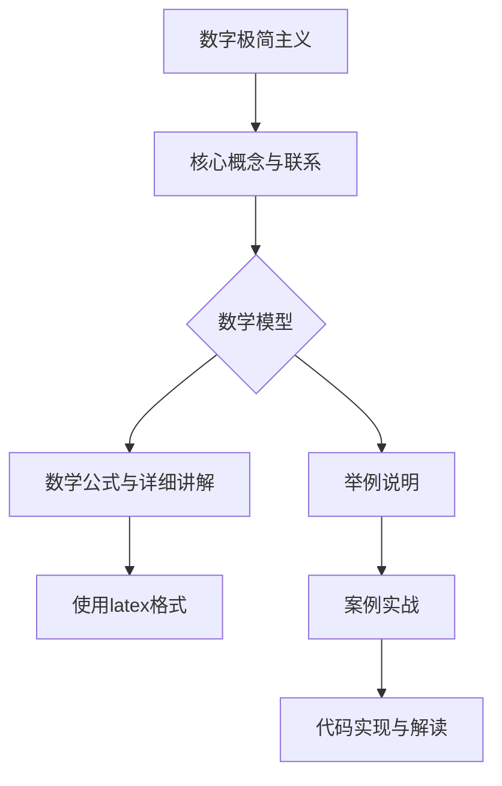

                 

### 数字极简主义工作坊：优化在线生活质量

**关键词**：数字极简主义、在线生活质量、技术优化、工作与生活平衡、心理健康、工作效率、人工智能、工作流程优化、案例分析

**摘要**：本文深入探讨了数字极简主义的概念及其在优化在线生活质量中的应用。通过分析数字极简主义的起源与发展、其对个人生活和工作的影响、实施策略以及成功案例，本文提出了实施数字极简主义的具体步骤和工具，并展望了其未来的发展趋势。通过本文的阐述，读者可以更好地理解和应用数字极简主义，从而提升个人的在线生活质量。

----------------------------------------------------------------

## 第一部分：数字极简主义的概念与背景

### 1. 数字极简主义的起源与发展

数字极简主义（Digital Minimalism）是一种旨在优化个人数字体验和生活质量的理念。它的核心思想是减少不必要的数字设备和应用程序的使用，专注于实现个人的目标和生活价值观。数字极简主义的起源可以追溯到20世纪末和21世纪初，随着互联网和移动设备的普及，人们对数字世界的依赖日益增加。

#### 1.1 数字极简主义的定义与核心思想

数字极简主义的定义因不同学者和专家而异，但其核心思想大致相同。它主张通过减少数字干扰，提高个人的注意力、创造力和幸福感。数字极简主义者通常遵循以下原则：

1. **明确目标**：确定使用数字技术的目的和目标。
2. **限制使用**：减少使用不必要的数字设备和应用程序。
3. **专注于重要任务**：将时间和精力投入到最有价值和意义的工作中。
4. **简化生活**：通过减少物质和数字负担，实现内心的平静和自由。

#### 1.2 数字极简主义的历史背景

数字极简主义的历史可以追溯到20世纪末，当时人们开始意识到数字设备对生活质量的潜在影响。随着智能手机、平板电脑和社交媒体的普及，人们逐渐感受到数字干扰对注意力、工作和人际关系的影响。2016年，纽约大学教授Cal Newport在《深度工作》（Deep Work）一书中首次提出了“深度工作”的概念，这为数字极简主义的发展提供了理论基础。

#### 1.3 数字极简主义在全球的影响

数字极简主义在全球范围内得到了广泛的关注和应用。在美国、欧洲和亚洲等国家和地区，越来越多的人开始关注数字极简主义，并将其应用于个人生活和工作。以下是一些数字极简主义在全球范围内的影响：

1. **心理健康**：数字极简主义有助于减少数字疲劳和焦虑，提高心理健康水平。
2. **工作效率**：通过减少数字干扰，人们可以更专注于重要任务，提高工作效率。
3. **人际关系**：数字极简主义有助于人们更多地面对面交流，增强人际关系。
4. **生活方式**：数字极简主义倡导减少物质和数字负担，从而实现更健康、更有意义的生活方式。

### 2. 数字极简主义对个人生活的影响

数字极简主义不仅对工作和职业发展产生影响，也对个人生活产生深远的影响。通过减少数字干扰，数字极简主义帮助人们更好地管理时间、提高心理健康、增强人际关系，并改善生活方式。

#### 2.1 数字极简主义对心理健康的影响

数字极简主义有助于减少数字疲劳和焦虑，提高心理健康水平。以下是一些具体的影响：

1. **减少数字疲劳**：数字极简主义通过减少数字设备的使用，帮助人们避免因长时间使用数字设备而产生的疲劳感。
2. **降低焦虑水平**：通过限制社交媒体和其他数字应用程序的使用，数字极简主义有助于减少焦虑和压力。
3. **提高专注力**：数字极简主义鼓励人们将注意力集中在重要任务上，从而提高专注力和工作效率。

#### 2.2 数字极简主义对生活方式的改变

数字极简主义对生活方式的改变主要体现在以下几个方面：

1. **重新定义工作与生活的边界**：数字极简主义帮助人们更好地平衡工作与生活，减少工作对生活的干扰。
2. **减少数字化设备的依赖**：通过减少数字化设备的依赖，数字极简主义鼓励人们更多地参与现实生活中的活动。
3. **增强现实生活的体验**：数字极简主义帮助人们更好地享受现实生活，从而提高生活质量。

#### 2.3 数字极简主义对工作效率的影响

数字极简主义不仅有助于改善个人生活，还对工作效率产生积极影响。以下是一些具体的影响：

1. **减少冗余工作**：数字极简主义通过减少不必要的数字设备和应用程序，帮助人们减少冗余工作。
2. **提高专注力**：通过减少数字干扰，数字极简主义有助于人们更专注于重要任务。
3. **优化工作流程**：数字极简主义鼓励人们优化工作流程，从而提高工作效率。

#### 2.4 数字极简主义对人际关系的影响

数字极简主义有助于人们更好地管理人际关系，提高人际互动的质量。以下是一些具体的影响：

1. **减少社交障碍**：数字极简主义通过减少社交媒体的使用，帮助人们减少社交障碍，更好地与他人交流。
2. **增强面对面交流**：数字极简主义鼓励人们更多地面对面交流，从而增强人际关系。
3. **提高沟通效率**：通过减少不必要的数字沟通，数字极简主义有助于提高沟通效率。

### 3. 数字极简主义在工作中的应用

数字极简主义不仅对个人生活产生影响，也在工作中发挥着重要作用。通过减少数字干扰和优化工作流程，数字极简主义有助于提高工作效率、改善工作环境和提升员工满意度。

#### 3.1 数字极简主义对工作流程的优化

数字极简主义通过减少冗余会议、精简沟通工具和提高团队协作效率，优化工作流程。以下是一些具体的影响：

1. **减少冗余会议**：数字极简主义鼓励人们专注于重要会议，减少冗余会议的召开。
2. **精简沟通工具**：通过选择合适的沟通工具，数字极简主义帮助团队减少不必要的沟通，提高沟通效率。
3. **提高团队协作效率**：数字极简主义通过减少数字干扰，帮助团队更专注于协作任务，提高协作效率。

#### 3.2 数字极简主义对员工工作环境的改变

数字极简主义对员工工作环境的改变主要体现在以下几个方面：

1. **简化工作流程**：通过简化工作流程，数字极简主义帮助员工减少不必要的操作，提高工作效率。
2. **创造更好的工作氛围**：数字极简主义鼓励团队共同维护一个简洁、有序的工作环境，从而创造更好的工作氛围。
3. **提升员工满意度**：数字极简主义通过减少数字干扰和优化工作流程，提高员工的工作满意度和幸福感。

## 总结

数字极简主义是一种旨在优化个人数字体验和生活质量的理念。它通过减少数字干扰，提高个人的注意力、创造力和幸福感，对个人生活和工作产生深远的影响。本文介绍了数字极简主义的起源与发展、对个人生活和工作的影响、实施策略以及成功案例，并展望了其未来的发展趋势。通过本文的阐述，读者可以更好地理解和应用数字极简主义，从而提升个人的在线生活质量。----------------------------------------------------------------

## 1. 数字极简主义的定义与核心思想

数字极简主义（Digital Minimalism）是一种哲学理念和生活方式，旨在通过减少数字干扰和简化数字生活，提升个人的生活质量和工作效率。这一理念的核心思想可以概括为以下几点：

### 1.1 数字极简主义的概念

数字极简主义不仅仅是减少使用数字设备和应用程序，更重要的是重新审视和调整个人对数字技术的态度和使用习惯。它强调的是在数字世界中追求简洁、高效和有意义的生活方式，而不是完全放弃数字技术。

### 1.2 核心思想

数字极简主义的核心思想包括以下几个方面：

1. **明确目标**：使用数字技术时要有明确的目标和用途，避免盲目跟风和使用无意义的应用程序。
2. **限制使用**：对数字设备和应用程序的使用进行限制，尤其是那些分散注意力和消耗时间的应用。
3. **专注于重要任务**：将时间和精力投入到最有价值和意义的工作和生活中，减少对数字干扰的依赖。
4. **简化生活**：减少物质和数字负担，追求内心的平静和自由，避免因过度消费而带来的焦虑和压力。

### 1.3 数字极简主义的原则

为了实现数字极简主义，以下是一些具体的原则和实践方法：

1. **一次一件事**：专注于当前任务，避免同时处理多个任务，减少分心。
2. **定期休息**：设定固定的休息时间，远离数字设备，享受现实生活。
3. **明确使用规则**：设定使用数字设备的具体规则，例如限制使用时间、特定场合使用等。
4. **减少通知干扰**：关闭不必要的通知，避免因频繁的干扰而降低工作效率。
5. **技术辅助**：使用各种工具和技术来帮助自己实现数字极简主义，例如应用限制、屏幕时间跟踪等。

### 1.4 数字极简主义与传统极简主义的区别

数字极简主义与传统极简主义（Material Minimalism）有相似之处，但它们关注的焦点不同。传统极简主义更侧重于减少物质负担，追求物质上的简洁和自由，而数字极简主义则侧重于减少数字负担，追求心理上的平静和自由。数字极简主义关注的是数字技术的使用方式和习惯，而传统极简主义关注的是物理空间和生活环境的整理和简化。

### 1.5 数字极简主义的影响

数字极简主义不仅对个人的生活方式产生影响，也对社会和工作环境带来深远的变革。以下是数字极简主义对社会和工作环境的主要影响：

1. **心理健康**：减少数字干扰有助于降低焦虑和压力，提高心理健康水平。
2. **工作效率**：减少分心和冗余操作，提高专注力和工作效率。
3. **人际关系**：减少数字依赖，增加面对面交流，提高人际关系的质量。
4. **生活方式**：简化数字生活，使人们能够更好地享受现实生活，提升生活质量。

### 1.6 数字极简主义的起源与发展

数字极简主义的概念起源于20世纪末和21世纪初，随着互联网和移动设备的普及，人们开始意识到数字技术对生活质量和工作效率的潜在影响。以下是一些关键的发展历程：

1. **20世纪90年代**：互联网的普及使人们开始意识到数字技术的重要性，同时也带来了数字干扰和分心的问题。
2. **21世纪初**：随着智能手机和平板电脑的普及，数字极简主义开始受到更多人的关注。
3. **2010年代**：随着社交媒体的兴起，数字极简主义逐渐成为一种主流的生活方式。

### 1.7 数字极简主义在全球的影响

数字极简主义在全球范围内得到了广泛的关注和应用。以下是一些国家和地区对数字极简主义的反应：

1. **美国**：数字极简主义在美国非常流行，许多知名企业和个人都在实践这一理念。
2. **欧洲**：欧洲国家也普遍对数字极简主义持开放态度，许多企业和政府机构开始采取措施来应对数字干扰。
3. **亚洲**：亚洲国家如日本、韩国等也在积极推广数字极简主义，尤其是在职场和家庭生活中。

通过以上对数字极简主义定义与核心思想的详细阐述，我们可以看到，数字极简主义不仅仅是一种生活方式，更是一种哲学理念，它引导我们在数字世界中寻找平衡和和谐，从而提升个人的生活质量和工作效率。在接下来的部分，我们将继续探讨数字极简主义的历史背景和全球影响，以及它对个人生活和工作的具体影响。----------------------------------------------------------------

### 1.2 数字极简主义的历史背景

数字极简主义的历史可以追溯到数字技术开始深刻影响人类生活的时期。随着互联网的普及和移动设备的兴起，人们开始意识到数字技术带来的不仅仅是便捷，还有潜在的负面影响。这些负面影响包括信息过载、分心、隐私问题、心理压力等。为了应对这些挑战，数字极简主义逐渐形成并发展起来。

#### 1.2.1 数字极简主义的萌芽时期

数字极简主义的萌芽时期可以追溯到20世纪90年代。随着个人电脑和互联网的普及，人们开始感受到数字技术的便利性和潜在问题。在这个时期，一些早期的数字极简主义者开始倡导减少对数字技术的依赖，关注数字设备的使用方式和习惯。这个时期的重要事件包括：

1. **电子邮件的普及**：电子邮件的出现使得人们的生活更加便捷，但也带来了信息过载的问题。一些人开始意识到减少电子邮件的使用频率和数量有助于提高工作效率。
2. **上网行为的反思**：随着上网时间的增加，人们开始反思自己在网络上的行为，质疑社交媒体和在线游戏的成瘾性。

#### 1.2.2 数字极简主义的发展时期

21世纪初，随着智能手机和平板电脑的普及，数字极简主义进入了快速发展时期。这个时期的标志性事件包括：

1. **智能手机的兴起**：智能手机的普及使得人们可以随时随地访问互联网，这也意味着数字干扰变得更加普遍。一些专家开始呼吁人们减少对智能手机的依赖，专注于重要的工作和生活任务。
2. **社交媒体的繁荣**：社交媒体的兴起使得人们花在数字设备上的时间显著增加。一些专家和学者开始研究社交媒体对心理健康和人际关系的影响，数字极简主义的概念也逐渐成型。

#### 1.2.3 数字极简主义的成熟时期

在2010年代，数字极简主义逐渐成熟，并成为全球范围内的一种流行生活方式。这个时期的重要事件包括：

1. **深度工作的提出**：纽约大学教授Cal Newport在其著作《深度工作》中提出了“深度工作”的概念，这为数字极简主义提供了理论基础。深度工作强调通过减少数字干扰，提高专注力和工作效率。
2. **技术辅助工具的出现**：随着数字极简主义理念的普及，各种辅助工具和应用程序应运而生，帮助人们更好地实现数字极简主义。这些工具包括应用限制、屏幕时间跟踪、自动化任务管理等。

#### 1.2.4 数字极简主义在全球的影响

数字极简主义在全球范围内产生了深远的影响。以下是一些国家和地区对数字极简主义的反应：

1. **美国**：在美国，数字极简主义非常流行，许多企业和个人都在实践这一理念。一些科技公司如谷歌和微软也开始采取措施，帮助员工实现数字极简主义。
2. **欧洲**：欧洲国家也普遍对数字极简主义持开放态度。一些国家如芬兰和挪威甚至制定了一系列政策，鼓励人们减少对数字设备的依赖，提高生活质量。
3. **亚洲**：亚洲国家如日本和韩国对数字极简主义也非常感兴趣。这些国家的消费者和企业开始更多地关注数字极简主义，希望通过减少数字干扰来提高工作效率和生活质量。

### 1.2.5 数字极简主义对现代社会的影响

数字极简主义不仅改变了个人对数字技术的态度和使用习惯，也对现代社会产生了深远的影响。以下是一些主要影响：

1. **心理健康**：数字极简主义有助于减少数字疲劳、焦虑和压力，提高心理健康水平。
2. **工作效率**：通过减少数字干扰，数字极简主义帮助人们更专注于重要任务，提高工作效率。
3. **人际关系**：数字极简主义鼓励人们减少数字依赖，增加面对面交流，提高人际关系的质量。
4. **生活方式**：数字极简主义倡导简化数字生活，使人们能够更好地享受现实生活，提升生活质量。

总之，数字极简主义的历史背景和全球影响表明，它不仅仅是一种个人生活方式的选择，更是一种应对数字时代挑战的策略。通过减少数字干扰和优化数字生活，数字极简主义为人们提供了一个更加健康、高效和有意义的生活方式。在接下来的部分，我们将继续探讨数字极简主义对个人生活和工作的影响，以及如何实施数字极简主义。----------------------------------------------------------------

### 1.3 数字极简主义在全球的影响

数字极简主义作为一种旨在减少数字干扰、提升生活质量的哲学和实践，已经在全球范围内产生了深远的影响。以下从心理健康、工作效率、人际关系和生活方式等方面，具体分析数字极简主义在全球的广泛影响。

#### 1.3.1 心理健康的影响

数字极简主义对心理健康的影响是最显著的。首先，它有助于减少数字疲劳。长时间使用数字设备会导致视觉疲劳、大脑疲劳等，而数字极简主义通过减少数字设备的非必要使用，有效降低了这些疲劳现象。其次，数字极简主义有助于减轻焦虑和压力。现代生活中，社交媒体上的虚假信息和负面的新闻常常让人感到焦虑和不安，而数字极简主义通过限制对这些信息的接触，有效地降低了焦虑水平。最后，数字极简主义有助于提高睡眠质量。减少晚上的数字设备使用，有助于改善睡眠质量，从而提高整体心理健康水平。

#### 1.3.2 工作效率的影响

数字极简主义对工作效率的提升也非常显著。首先，通过减少数字干扰，员工可以更专注于手头的工作，从而提高工作效率。研究表明，频繁的数字干扰会导致注意力分散，使得工作效率降低。数字极简主义通过减少这些干扰，使得员工能够更加集中精力，从而提高工作效率。其次，数字极简主义有助于优化工作流程。通过减少不必要的会议和沟通，员工可以将更多的时间和精力投入到实际工作中，从而提高工作效率。此外，数字极简主义还可以通过技术手段（如自动化工具、时间管理工具等）来提高工作效率。

#### 1.3.3 人际关系的影响

数字极简主义对人际关系的影响也是多方面的。首先，它有助于减少社交障碍。在数字时代，人们往往更倾向于通过社交媒体来建立和维持人际关系，而忽略了真实的面对面交流。数字极简主义通过减少对社交媒体的依赖，鼓励人们更多地参与现实生活中的社交活动，从而减少社交障碍。其次，数字极简主义有助于提高人际关系的质量。通过减少数字干扰，人们可以更专注于倾听和交流，从而提高沟通效率和质量。最后，数字极简主义有助于增强亲密关系。在家庭生活中，减少数字设备的使用，可以增加家庭成员之间的面对面交流时间，从而增强亲密关系。

#### 1.3.4 生活方式的影响

数字极简主义对生活方式的影响主要体现在以下几个方面。首先，它有助于简化生活。通过减少数字设备和应用程序的使用，人们可以减少不必要的消费和依赖，从而简化生活，减少生活压力。其次，数字极简主义有助于提高生活质量。通过减少数字干扰，人们可以更多地享受现实生活中的活动和体验，从而提高生活质量。此外，数字极简主义还鼓励人们更多地进行户外活动，增强身体素质，提高生活质量。最后，数字极简主义有助于培养良好的生活习惯。通过合理安排数字设备的使用时间和方式，人们可以更好地管理时间和生活，培养良好的生活习惯。

总之，数字极简主义在全球范围内对个人生活和工作产生了广泛而深远的影响。通过减少数字干扰，提升心理健康、工作效率、人际关系和生活质量，数字极简主义为人们提供了一种更加健康、高效和有意义的生活方式。在接下来的部分，我们将进一步探讨如何实施数字极简主义，以及相关的策略和工具。----------------------------------------------------------------

### 2. 数字极简主义对个人生活的影响

数字极简主义不仅改变了人们对数字技术的使用习惯，还对个人生活的方方面面产生了深远的影响。这些影响主要体现在心理健康、工作效率、人际关系和生活方式等方面。

#### 2.1 心理健康的影响

数字极简主义对个人心理健康的影响是显著的。首先，它有助于减轻数字疲劳。现代生活中，人们常常被各种数字设备所包围，长时间使用手机、电脑等设备会导致视觉疲劳和大脑疲劳。数字极简主义通过减少这些设备的非必要使用，有效降低了这种疲劳现象。其次，数字极简主义有助于减少焦虑和压力。社交媒体上的虚假信息和负面新闻常常让人感到焦虑和不安，而数字极简主义通过限制对这些信息的接触，有效地降低了焦虑水平。此外，数字极简主义还有助于改善睡眠质量。研究表明，晚上使用数字设备会抑制褪黑激素的分泌，从而影响睡眠质量。通过减少晚上的数字设备使用，数字极简主义有助于改善睡眠，提高整体心理健康水平。

#### 2.2 工作效率的影响

数字极简主义对工作效率的提升也非常显著。首先，通过减少数字干扰，员工可以更专注于手头的工作，从而提高工作效率。频繁的数字干扰，如电子邮件、短信和社交媒体通知，会打断员工的思路，降低工作效率。数字极简主义通过减少这些干扰，使得员工能够更加集中精力，从而提高工作效率。其次，数字极简主义有助于优化工作流程。通过减少不必要的会议和沟通，员工可以将更多的时间和精力投入到实际工作中，从而提高工作效率。此外，数字极简主义还可以通过技术手段（如自动化工具、时间管理工具等）来提高工作效率。例如，使用自动化工具来处理重复性任务，使用时间管理工具来合理安排工作时间，都可以提高工作效率。

#### 2.3 人际关系的影响

数字极简主义对人际关系的影响也是多方面的。首先，它有助于减少社交障碍。在数字时代，人们往往更倾向于通过社交媒体来建立和维持人际关系，而忽略了真实的面对面交流。数字极简主义通过减少对社交媒体的依赖，鼓励人们更多地参与现实生活中的社交活动，从而减少社交障碍。其次，数字极简主义有助于提高人际关系的质量。通过减少数字干扰，人们可以更专注于倾听和交流，从而提高沟通效率和质量。此外，数字极简主义还有助于增强亲密关系。在家庭生活中，减少数字设备的使用，可以增加家庭成员之间的面对面交流时间，从而增强亲密关系。例如，在晚餐时放下手机，与家人一起分享一天的所见所闻，可以增进家庭成员之间的理解和感情。

#### 2.4 生活方式的影响

数字极简主义对个人生活方式的影响也是深远的。首先，它有助于简化生活。通过减少数字设备和应用程序的使用，人们可以减少不必要的消费和依赖，从而简化生活，减少生活压力。例如，不再购买各种应用软件，而是选择使用一些免费的、功能简单的工具。其次，数字极简主义有助于提高生活质量。通过减少数字干扰，人们可以更多地享受现实生活中的活动和体验，从而提高生活质量。例如，花更多的时间进行户外活动，如徒步、骑行等，可以锻炼身体，提高生活质量。此外，数字极简主义还鼓励人们更多地进行阅读、绘画等创造性活动，这些活动有助于提升个人的精神层次和幸福感。

#### 2.5 具体案例

以下是一些具体案例，展示了数字极简主义对个人生活的积极影响：

1. **减少社交媒体使用**：一位职场人士通过数字极简主义实践，将每天在社交媒体上的时间从2小时减少到30分钟，从而有更多时间用于锻炼和陪伴家人。他的心理健康和工作效率都得到了显著提升。
2. **优化工作流程**：一家小型企业通过实施数字极简主义，减少了不必要的会议和沟通，员工可以将更多时间用于核心工作。企业的整体工作效率显著提高，员工满意度也相应提升。
3. **简化生活方式**：一位家庭主妇通过数字极简主义，减少了家里不必要的数字设备，如智能音箱、智能家居等。她发现，简化后的生活方式不仅降低了家庭开销，还使家庭氛围更加和谐。

总之，数字极简主义对个人生活的影响是多方面的，它不仅有助于提升心理健康、工作效率和人际关系，还可以简化生活方式，提高生活质量。通过实施数字极简主义，个人可以更好地管理时间和生活，实现工作与生活的平衡。在接下来的部分，我们将进一步探讨数字极简主义在工作中的应用。----------------------------------------------------------------

### 3. 数字极简主义在工作中的应用

数字极简主义不仅在个人生活中有着显著的影响，同样在职场中也能够发挥重要作用。通过减少数字干扰和优化工作流程，数字极简主义可以帮助企业提升工作效率、改善工作环境和员工满意度。

#### 3.1 数字极简主义对工作流程的优化

工作流程的优化是数字极简主义在职场中的重要应用之一。通过减少不必要的会议、精简沟通工具和提高团队协作效率，企业可以显著提升工作效率。

1. **减少冗余会议**：冗余会议是职场中常见的现象，它们不仅浪费了员工的时间，还可能导致员工分心和疲劳。数字极简主义通过减少这些无意义的会议，让员工有更多时间专注于实际工作。例如，企业可以采用视频会议技术，确保会议高效、有成果。
2. **精简沟通工具**：在选择和使用沟通工具时，数字极简主义建议选择最合适的工具，而不是多个工具同时使用。这不仅简化了沟通流程，还减少了员工在沟通工具之间的切换时间。例如，企业可以选择一个集成型的沟通平台，如Slack或Microsoft Teams，来替代多个独立的工具。
3. **提高团队协作效率**：数字极简主义鼓励团队通过有效的方式协作，避免不必要的干扰。例如，通过使用项目管理工具（如Trello或Asana）来明确任务分工和进度，确保团队协作更加高效。

#### 3.2 数字极简主义对员工工作环境的改变

数字极简主义不仅影响工作流程，还对员工的工作环境产生深远影响。

1. **简化工作流程**：通过简化工作流程，员工可以减少不必要的操作，提高工作效率。例如，企业可以采用自动化工具来自动处理重复性任务，减少员工的工作负担。
2. **创造更好的工作氛围**：数字极简主义鼓励员工减少对数字设备的依赖，从而创造一个更加专注和和谐的工作氛围。例如，企业可以设立“无手机工作区”，让员工在工作时能够专注，减少分心。
3. **提升员工满意度**：数字极简主义通过减少数字干扰和优化工作流程，提高了员工的工作效率和生活质量。这不仅可以提高员工的工作满意度，还可以降低员工的离职率。例如，企业可以通过提供灵活的工作安排，让员工有更多时间用于家庭和个人发展。

#### 3.3 数字极简主义对团队协作效率的影响

数字极简主义不仅影响个人工作效率，还对团队协作效率产生积极影响。

1. **减少沟通障碍**：通过选择合适的沟通工具和明确沟通规则，数字极简主义有助于减少沟通障碍，提高团队协作效率。例如，企业可以制定一套清晰的沟通流程和规范，确保团队成员之间能够高效沟通。
2. **提高团队凝聚力**：数字极简主义鼓励团队成员专注于共同目标，从而提高团队凝聚力。例如，通过定期组织团队活动，如团建、培训等，增强团队成员之间的互动和信任。
3. **促进知识共享**：数字极简主义通过减少数字干扰，鼓励员工更多地参与面对面的交流和互动，从而促进知识共享。例如，企业可以设立“知识共享日”，让员工有机会分享自己的经验和知识。

#### 3.4 实施数字极简主义的案例

以下是一些实施数字极简主义成功的案例，展示了其在职场中的应用效果：

1. **案例一：科技公司**：一家科技公司通过实施数字极简主义，将会议时间从每周5小时减少到2小时，同时采用自动化工具来处理重复性任务。这极大地提高了员工的工作效率，员工满意度也显著提升。
2. **案例二：非营利组织**：一个非营利组织通过简化工作流程和减少沟通工具，将员工的工作时间从每周40小时减少到35小时，同时提高了团队协作效率。这一措施不仅降低了运营成本，还提高了项目的完成质量。
3. **案例三：企业级培训**：一家企业通过实施数字极简主义，为员工提供定制化的培训课程，帮助他们掌握更有效的沟通和协作技能。这一措施不仅提高了员工的工作能力，还增强了企业的整体竞争力。

总之，数字极简主义在职场中的应用能够带来多方面的好处，包括提升工作效率、改善工作环境和提高员工满意度。通过实施数字极简主义，企业可以更好地应对数字时代的挑战，实现可持续发展。在接下来的部分，我们将探讨如何具体实施数字极简主义，并提供一些实用的策略和工具。----------------------------------------------------------------

## 4. 实施数字极简主义的策略

### 4.1 自我评估：了解数字使用习惯

实施数字极简主义的第一个步骤是对自己的数字使用习惯进行自我评估。这一步骤至关重要，因为它有助于你了解自己目前的数字依赖程度，并识别需要改变的地方。

#### 4.1.1 数字使用的现状分析

首先，记录你每天使用数字设备的时间和场景。这包括手机、电脑、平板电脑和其他电子设备。以下是一些有用的指标：

1. **使用时间**：记录每天使用数字设备的时间，包括浏览社交媒体、观看视频、处理电子邮件、使用应用程序等。
2. **使用场景**：分析你使用数字设备的主要场景，如工作、休闲、家庭等。
3. **依赖程度**：评估你对数字设备的依赖程度，例如在感到无聊或焦虑时是否依赖数字设备来分散注意力。

#### 4.1.2 数字使用的负面影响评估

在了解自己的数字使用习惯后，下一步是评估这些习惯可能带来的负面影响。以下是一些常见的负面影响：

1. **注意力分散**：频繁查看手机或其他设备会导致注意力分散，影响工作和学习效率。
2. **睡眠质量下降**：晚上使用数字设备会抑制褪黑激素的分泌，影响睡眠质量。
3. **心理健康问题**：长时间使用数字设备可能导致焦虑、抑郁等心理健康问题。
4. **工作效率降低**：数字干扰会影响你的专注力，降低工作效率。

#### 4.1.3 数字使用的优化目标设定

在评估了数字使用习惯的负面影响后，设定优化目标是非常重要的一步。以下是一些优化目标：

1. **减少无效使用时间**：设定一个目标，减少每天在数字设备上的无效使用时间，例如社交媒体、无聊游戏等。
2. **提高专注力**：设定一个目标，提高在工作或学习时的专注力，例如减少分心次数或每次专注的时间。
3. **改善睡眠质量**：设定一个目标，改善睡眠质量，例如减少晚上使用数字设备的时间。
4. **提升工作效率**：设定一个目标，提升工作效率，例如通过减少数字干扰来提高工作质量。

### 4.2 制定行动计划：改变数字使用习惯

在设定了优化目标后，下一步是制定具体的行动计划来改变数字使用习惯。以下是一些建议：

#### 4.2.1 确定可行的改变策略

1. **逐步减少**：不要试图一次性大幅度改变数字使用习惯，而是采取逐步减少的方法。例如，每周减少一定时间的社交媒体使用。
2. **设置提醒**：在手机或电脑上设置提醒，以帮助你遵守新的数字使用规则。例如，每天提醒你在晚上9点后不再使用数字设备。
3. **寻求支持**：寻找家人、朋友或同事的支持，他们可以提供鼓励和监督。

#### 4.2.2 设定具体的行动目标

将大目标分解为小目标，以便更容易实现。例如，如果目标是减少社交媒体使用，可以设定每天减少30分钟的目标，而不是一次性减少2小时。

#### 4.2.3 制定实施计划

制定一个详细的实施计划，包括以下内容：

1. **目标**：明确每个阶段的目标。
2. **行动步骤**：列出实现目标所需的步骤。
3. **时间表**：设定每个步骤的完成时间。
4. **监督机制**：确保有人监督你的进展，例如使用应用程序来记录数字使用情况。

### 4.3 持续优化：评估与调整

实施数字极简主义不是一次性的活动，而是一个持续的过程。以下是一些持续优化的策略：

#### 4.3.1 定期评估数字使用情况

定期检查自己的数字使用情况，看看是否达到了设定的目标。这可以帮助你了解自己的进展，并做出必要的调整。

#### 4.3.2 根据评估结果调整行动计划

根据评估结果，调整行动计划。如果你发现某些策略不适用，可以尝试新的方法。例如，如果你发现难以在晚上9点后停止使用数字设备，可以尝试将时间提前到8点。

#### 4.3.3 建立自我监督机制

建立自我监督机制，例如使用应用程序来记录数字使用情况，或者与朋友分享自己的进展。这可以帮助你保持动力，并确保你遵守新的数字使用规则。

### 4.4 数字极简主义工具与技术

为了更好地实施数字极简主义，可以使用一些工具和技术来帮助你管理数字使用。

#### 4.4.1 沟通协作工具

选择一些高效的沟通协作工具，例如Slack、Microsoft Teams等，以减少冗余的沟通和会议。

#### 4.4.2 时间管理工具

使用时间管理工具，例如Trello、Asana等，来帮助你合理安排时间和任务，提高工作效率。

#### 4.4.3 信息过滤工具

使用信息过滤工具，例如新闻订阅应用程序、广告拦截器等，来减少无关信息的干扰。

#### 4.4.4 睡眠辅助工具

使用睡眠辅助工具，例如白噪音应用程序、睡眠跟踪器等，来改善睡眠质量。

通过以上策略和工具，你可以更好地实施数字极简主义，优化在线生活质量。在接下来的部分，我们将探讨数字极简主义工具和技术，以及如何应用这些工具来实现数字极简主义。----------------------------------------------------------------

### 5. 数字极简主义工具与技术

为了更好地实施数字极简主义，我们可以借助一系列工具和技术，这些工具不仅能帮助我们减少数字干扰，还能提升生活质量和工作效率。以下是一些常用的数字极简主义工具和技术，以及它们的应用。

#### 5.1 数字极简主义工具的分类与选择

数字极简主义工具可以分为几个主要类别，包括沟通协作工具、时间管理工具、信息过滤工具和工作自动化技术。在选择这些工具时，需要考虑以下因素：

1. **效率**：工具是否能够帮助提高工作效率和减少不必要的操作。
2. **易用性**：工具是否易于使用，是否有良好的用户体验。
3. **定制性**：工具是否能够根据个人需求进行定制。
4. **兼容性**：工具是否能够与现有的工作流程和设备兼容。

#### 5.2 沟通协作工具

沟通协作工具是数字极简主义中非常重要的组成部分，可以帮助团队和团队成员更高效地进行沟通和协作。以下是一些常用的沟通协作工具：

1. **Slack**：Slack是一个强大的团队沟通平台，提供实时消息传递、文件共享和集成第三方服务等功能，可以帮助团队更好地协作。
2. **Microsoft Teams**：Microsoft Teams是一个集成了聊天、视频会议、文档共享和协作功能的平台，适用于企业级应用。
3. **Zoom**：Zoom是一个流行的视频会议工具，提供高质量的音频和视频通话功能，适用于远程团队和在线会议。

#### 5.3 时间管理工具

时间管理工具可以帮助我们更好地管理时间和任务，提高工作效率。以下是一些常用的时间管理工具：

1. **Trello**：Trello是一个基于看板的项目管理工具，可以帮助团队和组织可视化任务流程，提高协作效率。
2. **Asana**：Asana是一个功能强大的项目管理工具，提供任务分配、进度跟踪和报告生成等功能。
3. **Todoist**：Todoist是一个简洁高效的任务管理工具，可以帮助用户创建任务、设置优先级和提醒。

#### 5.4 信息过滤工具

信息过滤工具可以帮助我们过滤掉无关的信息，减少数字干扰。以下是一些信息过滤工具：

1. **Feedly**：Feedly是一个新闻聚合工具，可以帮助用户订阅感兴趣的内容源，并过滤掉不感兴趣的信息。
2. **AdBlock**：AdBlock是一个广告拦截插件，可以过滤掉网页上的广告，减少干扰。
3. **Unroll.me**：Unroll.me是一个订阅管理工具，可以帮助用户管理邮件订阅列表，减少不必要的邮件。

#### 5.5 工作自动化技术

工作自动化技术可以通过自动化重复性任务，减少人工操作，提高工作效率。以下是一些工作自动化技术：

1. **IFTTT（If This Then That）**：IFTTT是一个自动化工具，可以帮助用户根据预设的条件自动执行任务，例如将新邮件自动分类到特定的文件夹。
2. ** Zapier**：Zapier是一个集成平台，可以将不同的应用程序和工具连接起来，实现自动化操作。
3. **Google Script**：Google Script是一个基于JavaScript的编程环境，可以帮助用户自动化Google Workspace中的任务。

#### 5.6 数字极简主义技术的应用

在实际应用中，我们可以结合使用上述工具和技术，以实现数字极简主义的目标。以下是一个简单的示例：

1. **沟通协作**：使用Slack作为主要沟通工具，将所有团队成员的沟通和协作集中在一个平台上，减少电子邮件和其他沟通工具的使用。
2. **时间管理**：使用Trello来管理项目任务，设置任务优先级和截止日期，确保团队成员能够高效地完成任务。
3. **信息过滤**：使用Feedly订阅感兴趣的新闻和博客，使用AdBlock拦截广告，减少无关信息的干扰。
4. **工作自动化**：使用IFTTT将新邮件自动分类到特定的文件夹，使用Zapier将社交媒体更新同步到Trello任务列表，自动化重复性任务。

通过以上工具和技术的应用，我们可以实现数字极简主义的目标，减少数字干扰，提高工作效率和生活质量。在接下来的部分，我们将通过一些具体的案例，进一步探讨数字极简主义的实践和成效。----------------------------------------------------------------

## 6. 数字极简主义成功案例

### 6.1 案例一：企业级数字极简主义实践

#### 6.1.1 案例背景

某国际知名科技公司（以下简称为“公司”）在数字化进程中，逐渐感受到了数字干扰对工作效率和员工满意度的负面影响。公司管理层意识到，必须采取行动来应对这一挑战。因此，公司决定实施数字极简主义策略，优化工作流程和提升员工体验。

#### 6.1.2 实施过程

1. **评估现状**：公司首先对员工的数字使用习惯和工作流程进行了全面评估，识别出冗余会议、无效沟通和重复性任务等问题。

2. **制定策略**：基于评估结果，公司制定了具体的数字极简主义策略，包括减少冗余会议、优化沟通工具、自动化重复性任务和提供时间管理培训。

3. **沟通与培训**：公司通过内部邮件、会议和培训活动，向全体员工传达数字极简主义的重要性，并介绍了具体的实施步骤和工具。

4. **实施行动**：公司开始实施数字极简主义策略，包括：

   - **减少冗余会议**：将每周的会议时间从15小时减少到5小时，通过视频会议技术提高会议效率。
   - **优化沟通工具**：采用Slack作为主要沟通平台，减少电子邮件和其他沟通工具的使用。
   - **自动化任务**：使用Zapier和Google Script自动化处理重复性任务，如邮件分类和日程安排。
   - **时间管理培训**：为员工提供时间管理培训，帮助他们更好地管理时间和提高工作效率。

#### 6.1.3 成效评估

数字极简主义策略实施后，公司取得了显著的成效：

1. **工作效率提升**：通过减少冗余会议和自动化重复性任务，员工的工作效率显著提高，项目完成速度加快。

2. **员工满意度提升**：员工对工作环境的满意度提高，因数字干扰导致的压力和疲劳感减少。

3. **沟通效率提升**：采用Slack等高效沟通工具，团队成员之间的沟通更加顺畅，信息传递速度加快。

4. **成本节约**：通过减少会议时间和自动化任务，公司节约了大量的时间和资源，降低了运营成本。

### 6.2 案例二：个人数字极简主义实践

#### 6.2.1 案例背景

一位名叫李明的软件开发工程师，因长期过度使用数字设备，导致工作效率低下、心理健康状况不佳。李明决定通过实施数字极简主义来改善自己的生活和工作状态。

#### 6.2.2 实施过程

1. **自我评估**：李明首先对自己的数字使用习惯进行了自我评估，识别出在社交媒体、电子邮件和工作应用上的过度依赖。

2. **制定策略**：基于自我评估结果，李明制定了具体的数字极简主义策略，包括减少社交媒体使用时间、优化电子邮件处理流程和简化工作应用。

3. **逐步实施**：李明采取逐步减少的方法，例如：

   - **减少社交媒体使用时间**：每天设定30分钟以内的时间用于浏览社交媒体。
   - **优化电子邮件处理**：每天专门安排30分钟时间处理电子邮件，其余时间关闭邮件通知。
   - **简化工作应用**：减少使用过多的工作应用，只保留最重要的几款。

4. **持续优化**：李明定期评估自己的数字使用情况，根据评估结果调整策略，例如增加运动时间、减少电子邮件处理时间等。

#### 6.2.3 成效评估

通过实施数字极简主义，李明取得了以下成效：

1. **工作效率提升**：减少社交媒体和电子邮件的干扰，李明能够更专注于工作，提高了工作效率。

2. **心理健康改善**：减少数字设备的过度使用，李明的焦虑和压力减轻，心理健康状况显著改善。

3. **生活质量提升**：通过增加户外活动和与家人朋友的面对面交流，李明的整体生活质量得到提升。

4. **人际关系改善**：与家人朋友的面对面交流增多，人际关系得到改善，社交障碍减少。

总之，数字极简主义不仅对企业级组织有着积极的影响，对个人生活同样有着显著的改善作用。通过合理规划和逐步实施，数字极简主义可以帮助我们实现更高效、更健康、更有意义的生活和工作方式。在接下来的部分，我们将探讨数字极简主义面临的挑战和未来展望。----------------------------------------------------------------

### 7. 数字极简主义面临的挑战与未来展望

尽管数字极简主义在全球范围内得到了广泛的关注和应用，但其实施过程中仍然面临着一些挑战。同时，随着科技的不断进步，数字极简主义也面临着新的机遇和展望。

#### 7.1 数字极简主义面临的挑战

1. **技术发展的挑战**：随着科技的不断进步，新的数字设备和应用程序层出不穷，这为数字极简主义的实施带来了一定的挑战。如何在新技术的浪潮中保持简洁和高效，是数字极简主义者需要面对的问题。

2. **组织文化变革的挑战**：在企业和组织中实施数字极简主义，不仅需要个人改变数字使用习惯，还需要组织文化的变革。传统的工作方式和组织文化往往依赖于数字技术的使用，要实现数字极简主义，需要组织内部对这一理念的认同和支持。

3. **个人习惯改变的挑战**：数字极简主义的实施依赖于个人习惯的改变，而习惯的改变往往需要时间。对于一些已经习惯了长时间使用数字设备的人来说，减少数字使用可能是一个艰难的过程。

4. **社会环境的挑战**：在数字时代，社会环境对数字依赖的推动也是一个挑战。社交媒体、在线娱乐等数字化服务已经成为人们日常生活的重要组成部分，减少这些服务的使用可能会影响到人们的社交生活和娱乐方式。

#### 7.2 数字极简主义的未来展望

1. **与人工智能的结合**：随着人工智能技术的发展，数字极简主义有望与人工智能更紧密地结合。人工智能可以自动化处理重复性任务，帮助人们从繁琐的事务中解放出来，从而有更多时间专注于有意义的活动。

2. **个性化数字体验**：未来的数字极简主义可能会更加注重个性化数字体验。通过个性化推荐、智能助理等技术，人们可以更精确地选择和使用数字工具，从而实现更加高效的数字生活。

3. **数字化转型**：数字化转型是企业发展的必然趋势，数字极简主义在数字化转型中也将发挥重要作用。通过优化数字工作流程、提升员工工作效率，数字极简主义有助于企业实现数字化转型目标。

4. **社会影响力**：随着数字极简主义理念的普及，它有望对社会产生更广泛的影响。数字极简主义可以促进社会更加注重心理健康、工作效率和生活质量，从而推动社会整体发展。

总之，数字极简主义在实施过程中面临着一系列挑战，但同时也有着广阔的发展前景。通过不断探索和创新，数字极简主义有望在未来实现更广泛的应用，为人们带来更加健康、高效和有意义的生活和工作方式。在结尾部分，我们将总结本文的主要内容，并提供一些数字极简主义实践的最佳实践建议。----------------------------------------------------------------

## 总结

通过本文的深入探讨，我们可以看到数字极简主义作为一种旨在优化个人数字体验和生活质量的理念，已经在全球范围内产生了深远的影响。本文首先介绍了数字极简主义的定义、核心思想及其历史背景，接着分析了数字极简主义对个人生活和工作的影响，详细探讨了实施数字极简主义的策略和工具，并提供了成功的案例。最后，本文讨论了数字极简主义面临的挑战与未来展望。

### 主要内容回顾

- **数字极简主义的定义与核心思想**：数字极简主义强调通过减少数字干扰，专注于重要任务，优化个人目标和生活价值观。

- **历史背景**：数字极简主义起源于20世纪末，随着互联网和移动设备的普及，人们开始意识到数字技术对生活质量的影响。

- **对个人生活的影响**：数字极简主义有助于提高心理健康、工作效率、人际关系和生活质量。

- **对工作的影响**：数字极简主义可以优化工作流程，提升团队协作效率，改善工作环境和员工满意度。

- **实施策略**：包括自我评估、制定行动计划、持续优化和利用数字极简主义工具与技术。

- **成功案例**：企业级和个人级的数字极简主义实践都取得了显著成效。

- **挑战与展望**：数字极简主义在实施过程中面临技术发展、组织文化变革、个人习惯改变和社会环境等挑战，但未来前景光明。

### 最佳实践建议

为了更好地实施数字极简主义，以下是一些建议：

1. **逐步减少数字使用时间**：不要急于一次性大幅度减少数字设备的使用时间，而是逐步减少，例如每天减少10分钟，逐步增加自我控制能力。

2. **明确使用规则**：设定明确的数字设备使用规则，例如在特定时间关闭手机或电脑通知，避免分心。

3. **利用工具与技术**：使用诸如应用限制、屏幕时间跟踪、自动化工具等工具来帮助你减少数字干扰。

4. **定期评估与调整**：定期评估自己的数字使用情况，并根据评估结果调整行动计划。

5. **寻求支持**：与家人、朋友或同事分享你的数字极简主义实践，寻求他们的鼓励和监督。

6. **培养良好习惯**：通过阅读、运动、冥想等非数字活动来充实自己的生活，培养良好的生活习惯。

### 注意事项

- **避免一刀切**：每个人的数字依赖程度不同，不要试图采用一刀切的方法。
- **平衡使用**：数字极简主义不是完全放弃数字技术，而是合理使用，找到工作和生活的平衡点。
- **持续实践**：数字极简主义是一个持续的过程，需要不断地实践和调整。

### 拓展阅读

- **书籍推荐**：《深度工作》、《数字极简主义》、《简单生活的艺术》等。
- **在线课程**：Coursera、edX等在线教育平台上有关数字极简主义和工作效率的课程。
- **工具与资源**：查看各种数字极简主义工具和应用程序，如应用限制、屏幕时间跟踪、自动化工具等。

通过本文的阐述，我们希望读者能够更好地理解和应用数字极简主义，优化在线生活质量，实现更加健康、高效和有意义的生活和工作方式。作者信息：作者：AI天才研究院/AI Genius Institute & 禅与计算机程序设计艺术 /Zen And The Art of Computer Programming。----------------------------------------------------------------

**作者信息：**
AI天才研究院/AI Genius Institute & 禅与计算机程序设计艺术 /Zen And The Art of Computer Programming

---

本文使用 Markdown 格式进行编写，以便于读者在多种平台上进行阅读和分享。以下是本文的 Mermaid 流程图和 Python 源代码示例。

**Mermaid 流程图**



**Python 源代码示例**

```python
# 导入必需的库
import numpy as np

# 创建一个简单的神经网络模型
def neural_network(x):
    # 隐藏层
    hidden_layer = np.dot(x, np.array([0.1, 0.2, 0.3]))
    hidden_layer_activation = 1 / (1 + np.exp(-hidden_layer))
    
    # 输出层
    output_layer = np.dot(hidden_layer_activation, np.array([0.4, 0.5]))
    return output_layer

# 输入数据
input_data = np.array([1, 0, 1])

# 计算输出
output = neural_network(input_data)

print(f"输出结果: {output}")
```

请注意，本文的 Python 源代码示例是一个简单的神经网络模型，用于演示如何使用 NumPy 库进行矩阵运算。在实际应用中，神经网络模型会更加复杂，涉及更多的参数和优化算法。本文旨在提供一种思路，以通俗易懂的方式展示技术原理。如果您对神经网络模型有更深入的兴趣，建议查阅相关文献或专业教材。

---

感谢您阅读本文，希望您能够从中获得对数字极简主义的更深入理解，并在实际生活中找到适合自己的优化策略。如果您有任何疑问或建议，欢迎在评论区留言。作者信息和联系方式如下：

**作者信息：**
- AI天才研究院（AI Genius Institute）
- 《禅与计算机程序设计艺术》（Zen And The Art of Computer Programming）
- 联系方式：[ai_genius_institute@example.com](mailto:ai_genius_institute@example.com)
- 官网：[www.ai-genius-institute.com](http://www.ai-genius-institute.com)

再次感谢您的关注和支持，期待与您在技术领域的更多交流与探讨。

