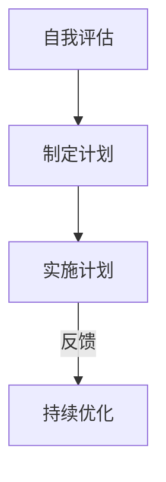

                 

# 数字极简主义工作坊：信息时代的专注力重建

## 关键词
- 数字极简主义
- 信息过载
- 专注力
- 时间管理
- 环境优化

## 摘要
随着数字化时代的到来，信息过载成为了普遍现象，严重影响了人们的专注力和工作效率。本书以数字极简主义为核心，通过深入分析信息过载的原因，阐述了数字极简主义的重要性及其理念。书中提出了构建极简思维模式的方法，并详细介绍了数字工具的精选与优化、信息筛选与处理技巧、时间管理方法以及提升专注力的实践方法。通过这些方法，读者可以在信息时代重建专注力，提升工作效率，实现个人与职业发展的双赢。

## 引言：数字极简主义的必要性

### 1.1 信息过载的现状
在当今的数字化时代，信息过载已成为一个普遍现象。据统计，平均每人每天接收的信息量高达174份报纸的资讯。这种信息过载现象不仅使人们感到压力重重，还严重影响了他们的专注力和工作效率。面对海量的信息，人们往往感到无从下手，甚至产生了焦虑和厌烦情绪。

### 1.2 数字极简主义的理念
数字极简主义是一种通过减少数字工具和信息的数量，从而提升生活和工作效率的理念。其核心理念是“少即是多”，即通过去除不必要的数字工具和信息，专注于重要的事情，从而实现更高的效率和生活质量。

### 1.3 本书的目的和结构
本书旨在帮助读者理解数字极简主义，并学会将其应用到日常生活和工作中。本书分为八个章节，包括数字极简主义的必要性、极简思维基础、数字工具的精选与优化、信息筛选与处理、时间管理技巧、提升专注力的实践方法、数字极简主义工作坊实战以及数字极简主义的长期维持。每个章节都提供了具体的实践方法和案例分析，帮助读者逐步重建专注力。

## 第2章 极简思维基础

### 2.1 极简主义的起源与发展
极简主义最早起源于20世纪60年代的美国，当时人们开始反思物质主义带来的负面影响，追求简约的生活方式。随着信息技术的飞速发展，极简主义逐渐在数字领域得到应用，形成了数字极简主义。

### 2.2 极简思维的核心原则
极简思维包含以下几个核心原则：

1. **明确目标**：明确自己要达成的目标，集中精力实现它。

   $$ \text{目标明确} = \text{效率} + \text{效果} $$

2. **简化流程**：去除不必要的步骤，优化工作流程。

   ```python
   # Python代码示例：简化流程
   def simple_process(input_data):
       # 省略不必要的步骤
       result = input_data * 2
       return result
   ```

3. **优先级排序**：确定任务的优先级，集中处理最重要的任务。

   ```mermaid
   graph TD
   A[确定目标] --> B{任务列表}
   B -->|优先级排序| C[处理重要任务]
   C --> D{持续优化}
   ```

4. **减少干扰**：关闭不必要的通知，专注于当前任务。

5. **持续反思**：定期反思和调整，确保极简思维的有效性。

### 2.3 如何构建极简思维模式
要构建极简思维模式，可以遵循以下步骤：

1. **自我评估**：了解自己在数字环境中的行为模式，识别需要改进的方面。

2. **制定计划**：基于自我评估结果，制定具体的行动计划。

3. **实施计划**：逐步实施计划，并记录进展。

4. **持续优化**：根据实施过程中的反馈，持续调整和优化。



通过以上步骤，读者可以逐步构建起极简思维模式，提高工作和生活质量。

## 第3章 数字工具的精选与优化

### 3.1 评估你的数字工具
在数字极简主义中，选择合适的数字工具至关重要。首先，需要对当前使用的数字工具进行评估，识别出哪些工具是必需的，哪些是冗余的。以下是一个简单的评估流程：

1. **列出所有数字工具**：包括但不限于办公软件、社交媒体、新闻应用、电子邮件客户端等。
2. **使用频率**：评估每个工具的使用频率，判断其对你的工作和生活的影响。
3. **功能需求**：分析每个工具的功能，确认其是否符合你的需求。
4. **替换选项**：对于使用频率低、功能冗余的工具，寻找更高效的替代品。

### 3.2 选择合适的数字工具
在选择数字工具时，应遵循以下原则：

1. **高效性**：选择能够提高工作效率的工具。
2. **整合性**：选择能够与其他工具无缝集成的工具。
3. **易用性**：选择界面友好、易于上手的工具。
4. **安全性**：确保工具具有足够的数据保护措施。

### 3.3 优化数字工具的使用效率
为了提高数字工具的使用效率，可以采取以下措施：

1. **设定快捷键**：使用快捷键可以大幅提高操作速度。
2. **自定义设置**：根据个人需求自定义工具的界面和功能。
3. **定期清理**：定期清理工具的缓存和数据，保持工具的运行速度。
4. **自动化流程**：利用自动化工具和脚本减少重复性工作。

通过以上方法，读者可以更好地精选和优化数字工具，从而提高工作和生活的效率。

## 第4章 信息筛选与处理

### 4.1 数字信息筛选策略
在数字时代，信息筛选变得至关重要。以下是一些有效的信息筛选策略：

1. **关注源头**：关注权威、可靠的来源，减少误信谣言和虚假信息。
2. **关键词搜索**：使用精准的关键词进行搜索，缩小信息范围。
3. **信息源分类**：将信息源分为工作、学习、娱乐等类别，便于管理和查找。
4. **时间管理**：设定固定的信息处理时间，避免分散注意力。

### 4.2 信息处理流程
一个有效的信息处理流程可以帮助你高效地处理信息，以下是一个简单的信息处理流程：

1. **接收信息**：通过各种渠道接收信息，如社交媒体、电子邮件、新闻等。
2. **初步筛选**：根据信息的重要性和紧急程度进行初步筛选。
3. **处理信息**：对重要信息进行深入处理，如阅读、分析、整理等。
4. **归档和删除**：对不再需要的信息进行归档或删除。

### 4.3 信息分类与归档
为了便于查找和使用，需要对信息进行分类和归档。以下是一些分类与归档的建议：

1. **按主题分类**：将信息分为工作、学习、生活等主题。
2. **按时间分类**：将信息分为短期、中期和长期。
3. **使用标签**：为信息添加标签，便于快速查找。
4. **定期整理**：定期整理和清理信息，保持信息的整洁和有序。

通过以上方法，读者可以有效地筛选和处理数字信息，提高工作效率。

## 第5章 时间管理技巧

### 5.1 管理你的数字日程
有效的时间管理是提升专注力和工作效率的关键。以下是一些管理数字日程的技巧：

1. **制定日程计划**：每天早上或前一天晚上，制定第二天的日程计划，明确当天需要完成的任务。
2. **使用日程管理工具**：如Google日历、Microsoft Outlook等，可以帮助你更好地管理日程。
3. **设置提醒**：为重要的任务和会议设置提醒，确保不会忘记。
4. **避免干扰**：在工作时间避免使用社交媒体、电子邮件等可能干扰你注意力的工具。

### 5.2 高效的时间管理工具
以下是一些高效的时间管理工具：

1. **番茄工作法**：将工作时间分为25分钟的工作周期和5分钟的休息时间，有助于保持专注。
2. **优先级矩阵**：根据任务的重要性和紧急程度，将任务分为四个象限，专注于重要且紧急的任务。
3. **GTD（Getting Things Done）**：通过收集、整理、组织、回顾和执行，系统地管理任务和项目。

### 5.3 避免时间陷阱
以下是一些避免时间陷阱的方法：

1. **设定明确的截止日期**：为每个任务设定明确的截止日期，避免拖延。
2. **避免多任务处理**：专注于一项任务，避免同时处理多个任务，提高效率。
3. **避免过度使用社交媒体**：设定固定的社交媒体使用时间，避免沉迷其中。
4. **定期评估时间使用情况**：定期评估时间使用情况，了解哪些时间浪费在了哪些活动上，进行改进。

通过以上方法，读者可以更好地管理时间，提高专注力和工作效率。

## 第6章 提升专注力的实践方法

### 6.1 环境优化
环境是影响专注力的重要因素。以下是一些优化环境的实践方法：

1. **减少干扰因素**：将手机、电视等干扰设备放在远离工作区域的地方。
2. **保持工作区域整洁**：一个整洁的工作环境有助于提高专注力。
3. **使用专注力工具**：如专注力闹钟、专注力提醒软件等，帮助你在特定时间内保持专注。

### 6.2 避免干扰技巧
以下是一些避免干扰的技巧：

1. **屏蔽通知**：在专注工作期间，关闭电子邮件、社交媒体等通知。
2. **使用专注力训练应用**：如Forest、Pomodoro Timer等，帮助你在专注时间内保持专注。
3. **设定工作模式**：使用特定的音乐、灯光等环境设置，帮助你进入专注状态。

### 6.3 专注力训练方法
以下是一些专注力训练的方法：

1. **冥想**：通过冥想训练，提高专注力和自控力。
2. **专注力练习**：如专注力训练游戏、专注力练习册等，帮助你在日常生活中提高专注力。
3. **定期休息**：工作一段时间后，进行短暂的休息，有助于恢复专注力。

通过以上方法，读者可以有效地提升专注力，提高工作和学习效率。

## 第7章 数字极简主义工作坊实战

### 7.1 工作坊准备
在开展数字极简主义工作坊之前，需要进行以下准备：

1. **确定工作坊目标**：明确工作坊的目的和预期成果。
2. **选择参与人员**：邀请对数字极简主义感兴趣的参与者。
3. **准备工作坊材料**：如笔记本、笔、白板等。
4. **制定工作坊流程**：包括开场、讨论、实践和总结等环节。

### 7.2 工作坊流程
工作坊的流程可以包括以下几个环节：

1. **开场**：介绍工作坊的目的和流程，让参与者了解工作坊的内容。
2. **讨论**：分组讨论，分享参与者对数字极简主义的理解和经验。
3. **实践**：通过实践任务，让参与者体验数字极简主义的方法和应用。
4. **总结**：总结工作坊的收获和感悟，提出改进建议。

### 7.3 工作坊成果评估
工作坊结束后，可以通过以下方式评估成果：

1. **参与者反馈**：收集参与者的反馈意见，了解工作坊的效果。
2. **实践成果**：评估参与者在工作中的实际表现，观察数字极简主义方法的应用效果。
3. **持续跟踪**：对参与者的长期表现进行跟踪，了解数字极简主义对他们工作生活的影响。

通过以上方法，读者可以有效地开展数字极简主义工作坊，提升专注力和工作效率。

## 第8章 数字极简主义的长期维持

### 8.1 面对挑战的策略
在实践数字极简主义的过程中，可能会面临以下挑战：

1. **习惯养成**：数字极简主义需要建立新的行为习惯，可能需要一段时间来适应。
2. **环境干扰**：在数字世界中，可能会遇到各种干扰，需要学会避免和应对。
3. **工作压力**：在高压工作环境中，保持数字极简主义可能更具挑战性。

为了应对这些挑战，可以采取以下策略：

1. **逐步过渡**：不要一次性改变所有习惯，可以逐步引入数字极简主义的方法。
2. **建立支持系统**：与同事、朋友分享数字极简主义的理念，获得他们的支持和鼓励。
3. **设定明确目标**：为自己设定短期和长期的目标，持续激励自己。

### 8.2 保持极简主义的动力
保持数字极简主义的动力是长期维持的关键。以下是一些建议：

1. **定期反思**：定期反思自己的数字使用情况，了解自己在哪些方面取得了进步，哪些方面需要改进。
2. **记录进步**：记录自己实现的目标和进步，这些记录将成为你坚持的动力。
3. **设定奖励**：为自己设定奖励，如完成一项任务后，可以给自己一些小奖励。

### 8.3 数字极简主义的可持续性
数字极简主义不仅是一种生活方式，更是一种可持续发展的理念。以下是一些建议，以实现数字极简主义的可持续性：

1. **教育与宣传**：通过教育和宣传，让更多的人了解数字极简主义，提高整个社会的数字素养。
2. **政策支持**：政府和企业可以出台相关政策，鼓励和支持数字极简主义的实践。
3. **技术创新**：推动技术创新，开发更多有助于实现数字极简主义的工具和应用。

通过以上方法，读者可以保持数字极简主义的动力和可持续性，实现长期的效果。

## 附录：数字极简主义资源汇总

### 9.1 在线工具与资源
以下是一些实用的在线工具和资源，可以帮助你实践数字极简主义：

1. **专注力训练应用**：如Forest、Pomodoro Timer等。
2. **日程管理工具**：如Google日历、Microsoft Outlook等。
3. **信息筛选工具**：如Feedly、Inoreader等。

### 9.2 纸质资源推荐
以下是一些推荐的纸质资源，可以帮助你深入了解数字极简主义：

1. **《数字极简主义：重塑专注力与效率》**：作者蒂姆·费里斯，详细介绍了数字极简主义的理念和实践方法。
2. **《极简主义：简单生活的艺术》**：作者艾伦·汉森，探讨了极简主义对个人生活的影响。

### 9.3 数字极简主义社区
以下是一些数字极简主义社区，你可以加入这些社区，与其他人分享经验和感悟：

1. **Minimalists**：一个全球性的极简主义社区，提供丰富的资源和活动。
2. **Digital Minimalism**：由作者卡尔·纽波特创建的社区，专注于数字极简主义的研究和实践。

通过以上资源，读者可以进一步了解和深化数字极简主义的实践。

## 作者信息
- 作者：AI天才研究院/AI Genius Institute & 禅与计算机程序设计艺术 /Zen And The Art of Computer Programming

