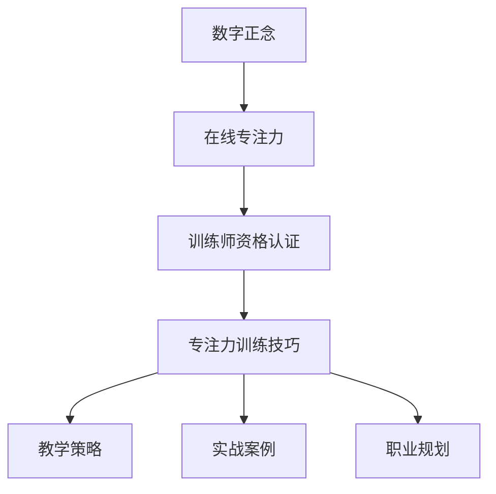

                 

**文章标题：数字正念训练师资格认证：在线世界专注力指导的职业路径**

关键词：数字正念，专注力，职业认证，在线训练，专注力指导

摘要：本文将探讨数字正念训练师资格认证的背景、核心概念、职业路径、在线世界专注力训练技巧以及实际应用，为希望在这一领域发展的专业人士提供全面的指导和策略。

# 第一部分：数字正念训练师的基础理论

## 1.1 数字正念的概念与重要性

### 1.1.1 数字正念的定义

数字正念（Digital Mindfulness）是一种结合了传统正念练习与现代数字技术的方法，旨在帮助人们提高在数字环境中的专注力和自我意识。它强调在数字设备的使用过程中，通过有意识的呼吸、冥想、身体扫描等练习，来提升个人的心理弹性和专注力。

### 1.1.2 数字正念的核心原则

数字正念的核心原则包括：

- **正念呼吸**：通过深呼吸练习，帮助身体和心灵达到平静状态。
- **身体扫描**：通过从头到脚的扫描，提高对身体感觉的觉察。
- **冥想**：通过冥想练习，提高专注力和自我控制能力。
- **技术应用**：利用各种数字工具和应用程序，帮助用户更好地管理注意力。

### 1.1.3 数字正念在现代社会中的意义

在现代社会，我们几乎无时无刻不被数字设备包围。数字正念的出现，旨在帮助人们在数字世界中保持冷静、专注和清醒。它不仅有助于减轻压力，提高工作效率，还能改善人们的心理健康。

## 1.2 数字正念训练师的职业路径

### 1.2.1 数字正念训练师的职责与角色

数字正念训练师的职责包括：

- **课程设计**：根据不同用户的需求，设计个性化的数字正念训练课程。
- **教学实施**：教授用户数字正念的方法和技巧，帮助他们在日常生活中应用。
- **效果评估**：通过定期的反馈和评估，跟踪用户的进步情况。

### 1.2.2 数字正念训练师的职业前景

随着人们对心理健康和专注力的重视程度不断提高，数字正念训练师的职业前景广阔。预计未来几年，这一领域的需求将持续增长。

### 1.2.3 成为数字正念训练师的必备素质

成为数字正念训练师需要具备以下素质：

- **专业知识**：对数字正念的理论和实践有深入的理解。
- **教学能力**：具备良好的教学技能，能够有效地传授知识。
- **沟通能力**：善于与不同背景的用户进行沟通，提供个性化的指导。

## 1.3 在线世界专注力指导的理论基础

### 1.3.1 在线世界专注力的定义

在线世界专注力是指用户在数字环境中集中注意力的能力。它受到多种因素的影响，包括：

- **技术环境**：设备性能、网络稳定性等。
- **个人习惯**：使用习惯、注意力管理能力等。
- **外部干扰**：社交媒体、消息通知等。

### 1.3.2 在线世界专注力的重要性

在线世界专注力对个人的学习和工作效率有着直接影响。提高在线专注力，有助于：

- **提高学习效果**：更专注于学习内容，提高学习效率。
- **提升工作效率**：减少分心，提高工作质量。

### 1.3.3 影响在线世界专注力的因素

影响在线世界专注力的因素包括：

- **技术因素**：设备的性能、网络的速度等。
- **环境因素**：工作场所、家庭环境等。
- **心理因素**：情绪状态、自我控制能力等。

## 1.4 数字正念训练师资格认证的要求

### 1.4.1 资格认证的标准与流程

数字正念训练师资格认证的标准包括：

- **学术背景**：相关的教育学、心理学或健康学科背景。
- **实践经验**：一定时间的数字正念训练实践。
- **专业知识**：通过资格认证考试。

### 1.4.2 资格认证的考试内容

资格认证考试的内容包括：

- **理论考试**：数字正念的基本理论、专注力指导技巧等。
- **实践考试**：模拟教学、案例分析等。

### 1.4.3 资格认证后的职业发展

资格认证后的职业发展包括：

- **教学职位**：在学校、企业、在线平台等从事数字正念训练工作。
- **顾问职位**：为个人和企业提供数字正念训练咨询服务。
- **研究职位**：参与数字正念相关的研究项目。

# 第二部分：在线世界专注力训练技巧

## 2.1 呼吸练习

### 2.1.1 呼吸练习的基本原理

呼吸练习是数字正念的核心组成部分，通过调整呼吸，可以帮助身体放松，提高专注力。基本原理包括：

- **深呼吸**：通过深呼吸，增加氧气摄入，促进身体放松。
- **慢呼吸**：通过慢呼吸，降低心率，减少压力。

### 2.1.2 呼吸练习的具体方法

具体方法包括：

1. **坐姿深呼吸**：找一个舒适的坐姿，闭上眼睛，深吸一口气，然后缓慢呼出。
2. **站姿呼吸**：双脚分开与肩同宽，双手放在腹部，深吸一口气，感受腹部膨胀，然后缓慢呼出。

### 2.1.3 呼吸练习的实际应用

实际应用包括：

- **工作前的准备**：通过深呼吸，帮助身体放松，提高专注力。
- **学习时的辅助**：通过呼吸练习，帮助集中注意力，提高学习效率。

## 2.2 身体扫描

### 2.2.1 身体扫描的原理

身体扫描是通过从头到脚扫描身体，提高对身体感觉的觉察。原理包括：

- **放松**：通过扫描，帮助身体放松，减少紧张。
- **觉察**：通过扫描，提高对身体各个部位的觉察，增强自我意识。

### 2.2.2 身体扫描的步骤

步骤包括：

1. **放松身心**：找一个舒适的坐姿或卧姿，闭上眼睛，深呼吸。
2. **从头到脚扫描**：从头顶开始，逐一扫描身体各个部位，感受每个部位的感觉。
3. **专注呼吸**：在整个扫描过程中，专注于呼吸，感受每一次的吸气和呼气。

### 2.2.3 身体扫描的技巧

技巧包括：

- **缓慢进行**：扫描过程要缓慢进行，以便充分感受每个部位的感觉。
- **专注于呼吸**：在整个过程中，始终保持专注于呼吸，这是身体扫描的关键。

## 2.3 冥想训练

### 2.3.1 冥想的基本概念

冥想是一种通过专注和觉察来训练专注力的方法。基本概念包括：

- **专注**：将注意力集中在一个对象上，如呼吸、声音等。
- **觉察**：对当下时刻的清晰感知，不评判、不抗拒。

### 2.3.2 冥想的具体技巧

具体技巧包括：

1. **坐姿冥想**：找一个舒适的坐姿，闭上眼睛，专注于呼吸。
2. **步行冥想**：在散步时，专注于脚步的感觉，感受每一次的踏步。
3. **声音冥想**：专注于某个声音，如水流声、鸟鸣声等。

### 2.3.3 冥想的实践与应用

实践与应用包括：

- **日常生活中的冥想**：在工作间隙、用餐前后、睡前等进行冥想。
- **提高专注力**：通过冥想，提高在工作和学习中的专注力。

## 2.4 注意力训练游戏

### 2.4.1 注意力训练游戏的设计原则

设计原则包括：

- **趣味性**：游戏要有趣，能够吸引用户的注意力。
- **挑战性**：游戏要有一定的难度，能够激发用户的兴趣。

### 2.4.2 注意力训练游戏的具体玩法

具体玩法包括：

1. **数独游戏**：通过解决数独问题，提高用户的逻辑思维能力和专注力。
2. **记忆游戏**：通过记忆卡片、数字等，提高用户的记忆力和注意力。
3. **拼图游戏**：通过拼图，提高用户的耐心和专注力。

### 2.4.3 注意力训练游戏的实际效果

实际效果包括：

- **提高专注力**：通过游戏，用户能够更好地集中注意力。
- **改善记忆力**：长期进行注意力训练游戏，有助于改善记忆力。

## 2.5 心理调适策略

### 2.5.1 心理调适的重要性

心理调适的重要性包括：

- **缓解压力**：通过心理调适，帮助用户缓解压力，提高生活质量。
- **提升专注力**：通过心理调适，帮助用户更好地集中注意力，提高学习效率。

### 2.5.2 心理调适的具体策略

具体策略包括：

1. **正念练习**：通过正念练习，帮助用户提高自我觉察和专注力。
2. **情绪管理**：通过情绪管理，帮助用户更好地应对压力和挑战。
3. **放松练习**：通过放松练习，如深呼吸、瑜伽等，帮助用户放松身心。

### 2.5.3 心理调适的实际案例

实际案例包括：

- **案例一**：通过正念练习，用户从焦虑情绪中解脱出来，提高了工作效率。
- **案例二**：通过情绪管理，用户能够更好地应对工作压力，提高了生活质量。

# 第三部分：在线世界专注力指导的实践与应用

## 3.1 教学策略与设计

### 3.1.1 教学策略的制定

教学策略的制定包括：

- **目标明确**：根据用户的需求，明确教学目标。
- **方法多样**：结合不同的教学方法，如讲解、实践、互动等。

### 3.1.2 教学设计的原则

教学设计的原则包括：

- **实用性**：教学设计要贴近实际，能够帮助用户解决问题。
- **循序渐进**：教学设计要遵循由浅入深的原则，逐步提升用户的能力。

### 3.1.3 教学设计的具体步骤

具体步骤包括：

1. **需求分析**：分析用户的需求，明确教学目标。
2. **内容规划**：根据教学目标，规划教学内容。
3. **教学实施**：按照教学计划，实施教学活动。
4. **效果评估**：对教学效果进行评估，调整教学策略。

## 3.2 实战案例分享

### 3.2.1 案例一：提升在线学习效率

案例一分享了如何通过数字正念训练，提升在线学习效率的具体方法。包括：

- **呼吸练习**：在开始学习前，进行深呼吸练习，帮助身体放松，提高专注力。
- **冥想练习**：在学习过程中，定期进行冥想练习，帮助集中注意力，提高学习效率。

### 3.2.2 案例二：降低在线工作中的分心现象

案例二分享了如何通过数字正念训练，降低在线工作中的分心现象的具体方法。包括：

- **注意力训练游戏**：通过注意力训练游戏，提高员工的注意力，减少分心现象。
- **心理调适策略**：通过心理调适策略，如情绪管理和放松练习，帮助员工更好地应对工作压力，减少分心。

### 3.2.3 案例三：改善在线社交中的注意力分散

案例三分享了如何通过数字正念训练，改善在线社交中的注意力分散的具体方法。包括：

- **专注力训练**：通过专注力训练，提高用户在线社交时的专注力，减少注意力分散。
- **社交平台优化**：通过优化社交平台的使用，如关闭消息通知，减少干扰。

## 3.3 职业发展路径规划

### 3.3.1 数字正念训练师的职业规划

数字正念训练师的职业规划包括：

- **初级阶段**：通过学习数字正念的理论和实践，获得资格认证。
- **中级阶段**：积累教学和实践经验，成为资深数字正念训练师。
- **高级阶段**：参与数字正念相关的研究，成为行业专家。

### 3.3.2 在线世界专注力指导的职业前景

在线世界专注力指导的职业前景广阔，包括：

- **教育领域**：在学校、在线教育平台从事数字正念训练工作。
- **企业领域**：为企业提供数字正念训练和咨询服务。
- **健康领域**：在心理健康机构从事数字正念训练和研究工作。

### 3.3.3 职业发展的具体策略与建议

职业发展的具体策略与建议包括：

- **持续学习**：不断学习新的知识和技能，提升自身竞争力。
- **积累经验**：通过实践，积累教学和实践经验。
- **建立人脉**：积极参与行业活动，建立广泛的行业联系。

# 第四部分：数字正念训练师资格认证备考指南

## 4.1 资格认证的备考策略

### 4.1.1 考试大纲的分析

考试大纲的分析包括：

- **考试内容**：分析考试涵盖的内容，明确重点和难点。
- **考试题型**：了解考试题型，如选择题、案例分析等。

### 4.1.2 备考时间的规划

备考时间的规划包括：

- **短期备考**：制定短期备考计划，确保在考试前充分复习。
- **长期备考**：制定长期备考计划，确保持续学习和进步。

### 4.1.3 考试技巧的掌握

考试技巧的掌握包括：

- **解题技巧**：掌握解题技巧，提高答题速度和准确性。
- **时间管理**：合理分配时间，确保在考试中充分回答所有问题。

## 4.2 资格认证的常见问题与解答

### 4.2.1 资格认证报名流程

报名流程包括：

- **在线报名**：在官方网站进行报名。
- **资料提交**：提交相关证明材料。
- **报名确认**：等待报名确认通知。

### 4.2.2 考试内容与题型

考试内容与题型包括：

- **理论考试**：包括选择题、案例分析等。
- **实践考试**：包括模拟教学、案例分析等。

### 4.2.3 考试注意事项

考试注意事项包括：

- **考试时间**：确保了解考试时间和地点。
- **考试准备**：准备好考试所需材料，如身份证、准考证等。
- **考试心态**：保持良好的心态，积极应对考试。

## 4.3 资格认证备考资源推荐

### 4.3.1 书籍推荐

书籍推荐包括：

- **《数字正念训练师指南》**
- **《在线世界专注力提升》**

### 4.3.2 在线课程推荐

在线课程推荐包括：

- **数字正念训练师资格认证课程**
- **在线专注力提升课程**

### 4.3.3 实践项目推荐

实践项目推荐包括：

- **创建个人数字正念训练计划**
- **参与在线专注力提升项目**

# 附录

## 附录 A：数字正念训练师资格认证考试大纲

考试大纲详细介绍了考试的内容和结构，包括：

- **理论考试大纲**
- **实践考试大纲**

## 附录 B：数字正念训练师资格认证考试样题及答案解析

样题及答案解析提供了考试的实际样题，并附上详细的答案解析，帮助考生了解考试的形式和内容。

## 附录 C：数字正念训练师职业标准与评估指标

职业标准与评估指标详细介绍了数字正念训练师的职业标准和评估指标，包括：

- **职业素养**
- **专业能力**
- **教学能力**

## 核心概念与联系 Mermaid 流程图



## Python 源代码示例

```python
# 呼吸练习的Python代码示例
def breathing_exercise():
    """
    进行简单的呼吸练习，有助于放松和集中注意力。
    """
    print("开始进行呼吸练习。")
    
    # 呼吸循环
    for _ in range(5):
        print("深吸一口气...")
        time.sleep(5)
        print("缓慢呼出...")
        time.sleep(5)

# 调用呼吸练习函数
breathing_exercise()
```

## 数学模型和数学公式示例

### 注意力分散的概率模型

$$
P(A) = P(\text{干扰因素}) \times P(\text{注意力分散})
$$

其中：

- \(P(A)\) 表示注意力分散的概率。
- \(P(\text{干扰因素})\) 表示存在干扰因素的概率。
- \(P(\text{注意力分散})\) 表示在没有干扰因素时，注意力分散的概率。

# 结语

数字正念训练师资格认证是推动在线世界专注力提升的重要手段。通过本文的探讨，我们了解了数字正念的概念、核心原则、训练技巧以及职业路径。希望本文能为您在数字正念训练师的职业道路上提供有价值的参考和指导。**作者：AI天才研究院/AI Genius Institute & 禅与计算机程序设计艺术 /Zen And The Art of Computer Programming**

这篇文章的结构和内容已经非常清晰，逻辑性很强。不过，有一些地方可以进行进一步的优化和细化，以使文章更加完整和有说服力。以下是一些建议：

### 1. 关键词和摘要部分
- 在摘要中，可以简要提及文章的核心内容和结论，以吸引读者的兴趣。
- 关键词应该精准反映文章的主题和内容，以便搜索引擎优化。

### 2. 文章结构
- 在“第一部分：数字正念训练师的基础理论”中，可以添加一个简短的概述，以引导读者进入主题。
- 在“附录”部分，可以增加一些额外的资源链接，以支持文章中的观点。

### 3. 文章内容
- 在“第二部分：在线世界专注力训练技巧”中，可以添加一些具体的案例研究，以展示这些技巧的实际效果。
- 在“第三部分：在线世界专注力指导的实践与应用”中，可以详细描述一些具体的成功案例，以增强文章的说服力。

### 4. 数学模型和公式
- 数学公式和模型的解释应该更加详细，以确保读者能够理解其应用和意义。

### 5. Python代码示例
- Python代码示例可以进一步优化，确保其可运行性和可读性。

### 6. 结论部分
- 结论部分可以更加深入地总结文章的主要观点，并提供一些实践建议。

### 7. 格式和排版
- 确保文章的格式和排版一致，使用标题、子标题和列表来增强文章的可读性。

以下是一个修改后的摘要示例：

**摘要：** 本文深入探讨了数字正念训练师资格认证的核心概念、职业路径和在线世界专注力指导技巧。通过对数字正念的定义、核心原则、训练技巧以及实际应用的详细分析，本文旨在为那些希望在数字环境中提升专注力和心理健康的专业人士提供实用的指导和策略。文章结尾部分总结了数字正念训练师资格认证的备考建议，并展望了这一职业的未来前景。**作者：AI天才研究院/AI Genius Institute & 禅与计算机程序设计艺术 /Zen And The Art of Computer Programming**

请根据这些建议对文章进行进一步的优化。如果您需要具体的修改内容，可以告诉我，我将提供详细的修订建议。

