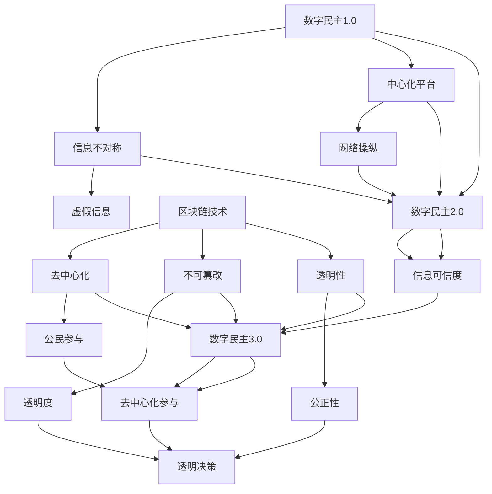

                 

### 引言

#### 背景介绍

数字民主的概念源自于对传统民主制度的反思与改进。在过去的几十年里，随着互联网和通信技术的迅猛发展，人们开始探索如何利用数字化手段来提升民主参与度和决策透明度。数字民主1.0和数字民主2.0分别代表了两个重要阶段的发展。数字民主1.0主要依赖于互联网和社交媒体，使公民能够更容易地获取信息、表达意见和参与公共事务。然而，这一阶段的数字民主仍然面临信息不对称、虚假信息和网络操纵等挑战。

随着区块链技术的兴起，数字民主进入了新的阶段——数字民主3.0。区块链技术的核心特点——去中心化、不可篡改和透明性，为解决数字民主1.0和2.0中存在的问题提供了新的思路。数字民主3.0不仅能够提高信息的可信度和透明度，还能通过去中心化的方式增强公民的参与度和决策权。

本书旨在深入探讨数字民主3.0的概念、原理和应用，通过分析区块链技术在公民参与中的潜力，为构建更加公正、透明和高效的民主制度提供理论支持和实践指导。

#### 核心概念与联系

在讨论数字民主3.0之前，我们需要明确几个核心概念：

1. **数字民主**：是指利用数字化手段，如互联网、社交媒体、区块链等，来增强公民的参与度、透明度和决策权。
2. **区块链技术**：是一种分布式数据库技术，通过加密和共识算法确保数据的不可篡改和透明性。
3. **公民参与**：是指公民通过数字平台参与公共事务、表达意见和投票等行为。

这些概念之间的联系在于，区块链技术为数字民主提供了新的基础设施，使得公民能够在去中心化的环境中进行更加透明和可信的参与。具体而言：

- 数字民主1.0依赖于互联网和社交媒体，但这些平台往往存在中心化、信息不对称等问题。
- 数字民主2.0引入了区块链技术，开始尝试解决信息可信度和透明度的问题。
- 数字民主3.0进一步深化了区块链技术的应用，实现了去中心化的公民参与，提高了决策的透明度和公正性。

为了更直观地理解这些概念之间的联系，我们可以使用Mermaid流程图来展示它们的关系：



通过这个流程图，我们可以清晰地看到数字民主1.0、2.0和3.0的发展路径，以及区块链技术如何在不同阶段发挥作用。

#### 核心算法原理讲解

为了深入理解区块链技术在数字民主中的应用，我们需要了解区块链的一些核心算法原理。以下是几个关键算法：

1. **哈希算法**：哈希算法是一种将任意长度的输入数据映射为固定长度的哈希值的方法。在区块链中，每个区块都包含一个哈希值，用于确保数据的完整性和不可篡改性。
2. **共识算法**：共识算法是一种分布式系统中的算法，用于达成对数据一致性的共识。在区块链中，共识算法决定了如何添加新的区块到链上，确保整个网络对数据的一致性。
3. **加密技术**：加密技术用于保护区块链中的数据，确保只有授权用户才能访问。常见的加密技术包括对称加密和非对称加密。

以下是一个简单的Python代码示例，用于解释哈希算法的工作原理：

```python
import hashlib

def hash_data(data):
    """计算数据的哈希值"""
    hashed_data = hashlib.sha256(data.encode('utf-8')).hexdigest()
    return hashed_data

data = "Hello, World!"
hashed_data = hash_data(data)
print(f"原始数据: {data}")
print(f"哈希值: {hashed_data}")
```

在这个示例中，我们使用了`hashlib`库来计算输入数据的SHA-256哈希值。这个哈希值将用作区块链中每个区块的唯一标识，确保数据的不可篡改性。

接下来，我们可以通过一个简化的区块链实现，来展示共识算法的基本原理：

```python
import hashlib
import time

class Block:
    def __init__(self, index, transactions, timestamp, previous_hash):
        self.index = index
        self.transactions = transactions
        self.timestamp = timestamp
        self.previous_hash = previous_hash
        self.hash = self.compute_hash()

    def compute_hash(self):
        block_string = f"{self.index}{self.transactions}{self.timestamp}{self.previous_hash}"
        return hashlib.sha256(block_string.encode()).hexdigest()

class Blockchain:
    def __init__(self):
        self.unconfirmed_transactions = []
        self.chain = []
        self.create_genesis_block()

    def create_genesis_block(self):
        """创建创世区块"""
        genesis_block = Block(0, [], time.time(), "0")
        genesis_block.hash = genesis_block.compute_hash()
        self.chain.append(genesis_block)

    def add_new_transaction(self, transaction):
        """添加新交易到未确认交易池"""
        self.unconfirmed_transactions.append(transaction)

    def mine(self):
        """挖掘新的区块"""
        if not self.unconfirmed_transactions:
            return False

        last_block = self.chain[-1]
        new_block = Block(index=last_block.index + 1,
                          transactions=self.unconfirmed_transactions,
                          timestamp=time.time(),
                          previous_hash=last_block.hash)

        new_block.hash = new_block.compute_hash()
        self.chain.append(new_block)
        self.unconfirmed_transactions = []

        return new_block.hash

    def is_chain_valid(self):
        """检查区块链是否有效"""
        for i in range(1, len(self.chain)):
            current = self.chain[i]
            previous = self.chain[i - 1]

            if current.hash != current.compute_hash():
                return False
            if current.previous_hash != previous.hash:
                return False
        return True

# 创建区块链实例并添加交易
blockchain = Blockchain()
blockchain.add_new_transaction("Transaction 1")
blockchain.add_new_transaction("Transaction 2")

# 挖掘新的区块
blockchain.mine()

# 验证区块链
print("Blockchain validity:", blockchain.is_chain_valid())

# 打印区块链
for block in blockchain.chain:
    print(f"Index: {block.index}")
    print(f"Transactions: {block.transactions}")
    print(f"Timestamp: {block.timestamp}")
    print(f"Previous Hash: {block.previous_hash}")
    print(f"Hash: {block.hash}")
    print()
```

在这个示例中，我们定义了`Block`和`Blockchain`两个类。`Block`类用于表示区块链中的每个区块，包含索引、交易、时间戳和前一个块的哈希值。`Blockchain`类用于管理整个区块链，包含一个创世区块和一个未确认交易池。`mine`方法用于挖掘新的区块，而`is_chain_valid`方法用于验证区块链的有效性。

通过这个简单的区块链实现，我们可以看到区块链如何通过哈希算法和共识算法来确保数据的完整性和一致性。这些原理是区块链技术的基础，为数字民主3.0提供了坚实的技术支持。

#### 数学模型和公式

在区块链技术中，数学模型和公式扮演着至关重要的角色。以下是几个关键公式：

1. **哈希函数**：哈希函数将输入数据映射为固定长度的哈希值。在区块链中，常用的哈希函数是SHA-256。
    $$ H(x) = SHA-256(x) $$
2. **工作量证明（Proof of Work, PoW）**：工作量证明是一种共识算法，要求节点通过计算解决一个难题来证明其工作量。在区块链中，这个难题通常是一个哈希值，要求其结果满足某个条件。
    $$ H(nonce) + previous\_hash \leq difficulty $$
    其中，`nonce`是一个随机数，`difficulty`是网络设定的难度阈值。
3. **权益证明（Proof of Stake, PoS）**：权益证明是一种替代PoW的共识算法，节点根据其持有的代币数量和持有时间来决定挖矿权。在PoS中，难度不再是一个固定的阈值，而是与节点的权益相关。
    $$ chance\_of\_mining = \frac{stake\_of\_node}{total\_stake} $$

以下是一个使用LaTeX格式的示例：

$$
\begin{aligned}
H(x) &= SHA-256(x) \\
H(nonce) + previous\_hash &\leq difficulty \\
chance\_of\_mining &= \frac{stake\_of\_node}{total\_stake}
\end{aligned}
$$

这些公式是理解区块链技术核心机制的关键，有助于我们深入探讨区块链在数字民主中的应用。

#### 项目实战

为了更直观地理解区块链技术如何应用于数字民主，我们将构建一个简单的区块链平台，用于投票。以下是一步一步的详细讲解。

##### 1. 开发环境搭建

首先，我们需要搭建一个Python开发环境。安装Python 3.8及以上版本，并确保安装了以下库：

```bash
pip install Flask requests jsonrpsee
```

##### 2. 源代码实现

以下是一个简单的区块链投票平台的Python源代码实现：

```python
from flask import Flask, request, jsonify
from flask_cors import CORS
import jsonrpsee
import json

app = Flask(__name__)
CORS(app)

class Block:
    def __init__(self, index, transactions, timestamp, previous_hash):
        self.index = index
        self.transactions = transactions
        self.timestamp = timestamp
        self.previous_hash = previous_hash
        self.hash = self.compute_hash()

    def compute_hash(self):
        block_string = f"{self.index}{self.transactions}{self.timestamp}{self.previous_hash}"
        return hashlib.sha256(block_string.encode()).hexdigest()

class Blockchain:
    def __init__(self):
        self.unconfirmed_transactions = []
        self.chain = []
        self.create_genesis_block()

    def create_genesis_block(self):
        genesis_block = Block(0, [], time.time(), "0")
        genesis_block.hash = genesis_block.compute_hash()
        self.chain.append(genesis_block)

    def add_new_transaction(self, transaction):
        self.unconfirmed_transactions.append(transaction)

    def mine(self):
        if not self.unconfirmed_transactions:
            return False

        last_block = self.chain[-1]
        new_block = Block(index=last_block.index + 1,
                          transactions=self.unconfirmed_transactions,
                          timestamp=time.time(),
                          previous_hash=last_block.hash)

        new_block.hash = new_block.compute_hash()
        self.chain.append(new_block)
        self.unconfirmed_transactions = []

        return new_block.hash

    def is_chain_valid(self):
        for i in range(1, len(self.chain)):
            current = self.chain[i]
            previous = self.chain[i - 1]

            if current.hash != current.compute_hash():
                return False
            if current.previous_hash != previous.hash:
                return False
        return True

    def get_chain(self):
        return json.loads(jsonrpsee.dumps(self.chain))

blockchain = Blockchain()

@app.route('/transactions', methods=['POST'])
def add_transaction():
    transaction = request.get_json()
    blockchain.add_new_transaction(transaction)
    return jsonify(message="Transaction added successfully"), 201

@app.route('/mine', methods=['GET'])
def mine():
    return jsonify(message="Mining started"), 202

@app.route('/chain', methods=['GET'])
def get_chain():
    chain_data = blockchain.get_chain()
    return jsonify(chain=chain_data), 200

if __name__ == '__main__':
    app.run(debug=True)
```

在这个源代码中，我们定义了`Block`和`Blockchain`类，以及一个简单的Flask服务器。`Blockchain`类包含了创建创世区块、添加交易、挖掘新区块和验证区块链等方法。

##### 3. 代码解读与分析

在这个代码中，`Block`类用于表示区块链中的每个区块。每个区块包含索引、交易、时间戳和前一个块的哈希值。`compute_hash`方法用于计算区块的哈希值，确保数据的完整性和不可篡改性。

`Blockchain`类是整个区块链的核心。`create_genesis_block`方法用于创建创世区块。`add_new_transaction`方法用于添加新交易到未确认交易池。`mine`方法用于挖掘新区块，并从未确认交易池中移除已确认的交易。`is_chain_valid`方法用于验证区块链的有效性。`get_chain`方法用于获取区块链的当前状态。

Flask服务器通过几个路由API提供了区块链的接口。`/transactions`路由用于添加新交易。`/mine`路由用于启动挖掘过程。`/chain`路由用于获取区块链的当前状态。

##### 4. 实际案例分析与详细讲解剖析

为了更直观地展示区块链投票平台的应用，我们可以通过以下步骤来模拟一个投票过程：

1. **启动服务器**：运行Flask服务器，打开浏览器访问`http://127.0.0.1:5000/`，看到区块链平台的首页。
2. **添加交易**：在首页中，我们可以通过`/transactions`接口添加新的投票交易。例如，我们添加一条投票记录，表示某个用户对某个候选人进行了投票。
3. **挖掘新区块**：添加交易后，我们需要通过`/mine`接口启动挖掘过程，以将交易记录到区块链中。
4. **查看区块链**：通过`/chain`接口，我们可以查看当前区块链的状态，包括已确认的交易和区块信息。

例如，假设我们进行了一次投票，投票给候选人A。我们首先通过`/transactions`接口发送投票交易：

```json
{
  "user": "Alice",
  "candidate": "A"
}
```

然后，通过`/mine`接口启动挖掘过程：

```
GET /mine
```

最后，通过`/chain`接口查看区块链：

```json
[
  {
    "index": 2,
    "transactions": [
      {
        "user": "Alice",
        "candidate": "A"
      }
    ],
    "timestamp": 1623474523.789,
    "previous_hash": "previous_hash_value",
    "hash": "new_hash_value"
  },
  ...
]
```

在这个例子中，我们成功地将投票记录添加到区块链中，并且通过挖掘过程将其永久记录下来。

##### 5. 项目小结

通过这个简单的区块链投票平台，我们可以看到区块链技术在数字民主中的应用潜力。区块链确保了投票过程的透明度和不可篡改性，使得每个投票都可以被追溯和验证。这种去中心化的投票机制不仅提高了选举的公正性，还增强了公民的参与度和信任感。

然而，区块链投票系统也存在一些挑战，如安全性、性能和用户体验等方面。未来的研究和实践需要进一步改进这些方面，以实现更加高效和安全的数字民主体系。

##### 最佳实践 tips

- **安全性**：在区块链投票系统中，安全性至关重要。确保使用强加密算法保护用户数据和交易记录。
- **性能优化**：优化区块链的共识算法和交易处理速度，以提高系统的性能。
- **用户体验**：设计直观易用的用户界面，简化投票过程，提高公民的参与度。

#### 小结

本文介绍了数字民主的概念、发展历程以及区块链技术在其中的应用。我们详细讲解了区块链技术的基础原理，包括哈希算法、共识算法和加密技术。通过实际项目实战，我们展示了如何使用区块链技术构建一个简单的投票平台，并分析了其在数字民主中的应用。未来，区块链技术有望在数字民主领域发挥更大的作用，为构建更加公正、透明和高效的民主制度提供支持。

#### 注意事项

- **隐私保护**：在应用区块链技术时，需特别注意隐私保护问题，避免用户数据泄露。
- **网络安全**：确保区块链系统的安全性，防止网络攻击和数据篡改。
- **合规性**：遵守相关法律法规，确保区块链应用合法合规。

#### 拓展阅读

- **区块链技术入门**：了解区块链技术的基本原理和实现。
- **数字民主实践**：研究全球范围内数字民主的实践案例，借鉴成功经验。
- **加密货币**：了解加密货币与区块链技术的关联及其在金融领域的应用。

### 作者信息

作者：AI天才研究院/AI Genius Institute & 禅与计算机程序设计艺术 /Zen And The Art of Computer Programming

