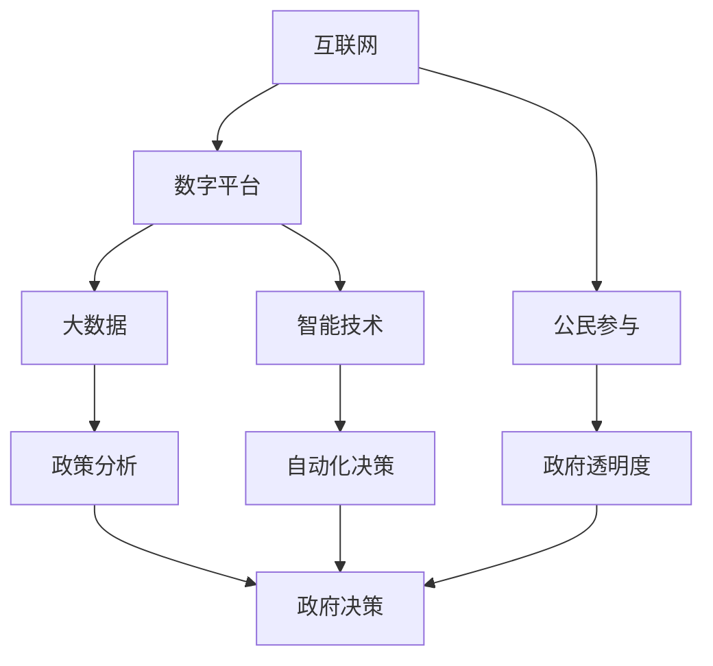

                 

### 数字民主概述

#### 1.1 数字民主的定义与重要性

数字民主，是一种通过互联网和数字技术实现的公民参与形式。其核心概念可以简单概括为：

$$
\text{数字民主} = \text{科技} + \text{公民参与}
$$

##### 1.1.1 数字民主的定义

数字民主，并不是简单的互联网应用，而是通过互联网和数字技术，使公民能够更方便、更直接地参与公共事务的一种形式。它包括以下几个方面：

- **在线表达**：公民通过互联网平台表达自己的观点和意见，如在线论坛、社交媒体等。
- **参与决策**：公民可以通过在线平台参与政府的决策过程，如电子投票、在线讨论等。
- **监督政府**：公民利用互联网技术监督政府的工作，确保政府透明和高效。

##### 1.1.2 数字民主的重要性

数字民主的重要性在于：

1. **提高政府透明度和责任感**：通过互联网和数字技术，政府的工作流程和信息可以更加公开，公民可以更容易地了解政府的工作情况，从而提高政府的透明度和责任感。

2. **增强公民对政治事务的关注和参与度**：数字民主使公民更加便捷地参与政治事务，从而增强他们对政治事务的关注和参与度。

3. **促进公共事务的民主化和效率**：数字民主可以使决策过程更加民主，同时，通过科技手段，可以大大提高公共事务的处理效率。

#### 1.2 数字民主的发展历程

##### 1.2.1 数字民主的起源

数字民主的起源可以追溯到20世纪90年代。随着互联网的普及，人们开始探索如何利用互联网来促进公民参与。最早的数字民主实践主要集中在电子邮件和论坛等简单的在线交流方式上。

##### 1.2.2 数字民主的快速发展

进入21世纪，随着社交媒体和移动设备的兴起，数字民主得到了快速发展。电子投票、在线讨论和社交媒体成为了数字民主的重要形式。例如，Twitter和Facebook等社交媒体平台，不仅为公民提供了一个表达观点的平台，也成为了政府与公民之间沟通的重要渠道。

##### 1.2.3 数字民主的挑战与未来趋势

尽管数字民主取得了显著的进展，但同时也面临着一系列挑战。例如，网络安全、隐私保护、信息真实性等问题。未来，随着智能技术和大数据分析的发展，数字民主将继续向着更加智能化、个性化、高效化的方向发展。

总的来说，数字民主是一种通过科技赋能的公民参与形式，它不仅提高了政府的透明度和责任感，也增强了公民对政治事务的关注和参与度。随着科技的发展，数字民主在未来将会发挥更大的作用。

#### 1.3 数字民主的核心概念与关系架构

为了更好地理解数字民主，我们需要明确几个核心概念，并探讨它们之间的关系。以下是数字民主中几个关键概念及其相互关系：

1. **互联网**：互联网是数字民主的基础设施，它为公民提供了参与公共事务的渠道。没有互联网，数字民主就无法实现。
   
2. **数字平台**：数字平台是互联网上的具体应用，如社交媒体、在线论坛、电子投票系统等。这些平台为公民提供了表达意见、参与决策和监督政府的途径。

3. **大数据**：大数据是数字民主的重要工具，它可以帮助分析公民的意见和行为，从而为政府提供决策支持。

4. **智能技术**：智能技术，如人工智能、机器学习等，可以为数字民主提供更加个性化和高效的解决方案。

以下是这些概念之间关系的Mermaid流程图：

在这个图中，互联网是整个数字民主的基础，它连接了数字平台和公民参与。数字平台为公民提供了表达意见和参与决策的渠道，而大数据和智能技术则为政府和公民提供了有力的支持。最终，这些要素共同促进了政府的透明度和责任感，以及公共事务的民主化和效率。

通过这个关系架构，我们可以更清晰地理解数字民主的运作机制和核心概念之间的相互关系。这有助于我们进一步探讨数字民主的各个方面，以及如何更好地利用科技赋能公民参与。

### 第2章: 科技在数字民主中的应用

科技在数字民主中发挥着至关重要的作用，通过提供基础设施、工具和方法，科技不仅使公民参与变得更加便捷，还大大提高了公共事务的透明度和效率。本章将深入探讨互联网与数字平台、大数据分析以及智能技术在数字民主中的应用。

#### 2.1 互联网与数字平台

##### 2.1.1 互联网的基础设施

互联网作为数字民主的基础设施，其发展历程可以追溯到20世纪60年代。当时，美国高级研究计划局（ARPA）开始研究如何将不同类型的计算机连接起来，以实现信息共享和资源分配。这一研究最终导致了互联网的诞生。

互联网的基础设施主要包括以下几个方面：

- **网络协议**：互联网采用的协议，如TCP/IP，确保了数据能够在全球范围内的不同计算机之间可靠地传输。
- **路由器**：路由器是互联网的核心设备，它负责将数据从一个网络传输到另一个网络。
- **数据中心**：数据中心是互联网的“大脑”，它存储了大量的数据和服务，为全球用户提供访问。

互联网的发展历程可以大致分为以下几个阶段：

1. **ARPANET阶段（1969-1983）**：这是互联网的起源阶段，ARPANET是第一个实现数据包交换的网络。
2. **NSFNET阶段（1986-1991）**：NSFNET是互联网的第二个主要阶段，它由美国国家科学基金会资助，成为了连接各大学和研究机构的主要网络。
3. **商业化阶段（1991-至今）**：随着互联网的商业化，它迅速普及到全球，成为连接个人、企业和政府的重要工具。

##### 2.1.2 数字平台的功能

数字平台是互联网上的具体应用，它们为公民提供了多种参与公共事务的途径。以下是几种常见的数字平台：

1. **社交媒体平台**：如Facebook、Twitter和微信等，它们为公民提供了一个广泛交流的平台，使公民可以随时随地表达自己的观点和意见。

2. **在线讨论平台**：如Reddit和知乎等，这些平台允许公民就特定话题展开讨论，从而促进观点的交流和碰撞。

3. **电子投票系统**：如Diebold和Smartmatic等，这些系统使公民可以在互联网上进行投票，从而提高了投票的便利性和安全性。

4. **公民参与平台**：如Change.org和PetitionsOnline等，这些平台允许公民发起和签署在线请愿，从而向政府表达自己的诉求。

#### 2.2 大数据分析

大数据分析是数字民主中的重要工具，它通过处理和分析海量数据，为政府提供了宝贵的决策支持。大数据的特点包括：

- **数据量大**：大数据通常指的是“大量”（Volume）、“多样”（Variety）、“快速”（Velocity）和“真实”（Veracity）的数据。
- **处理速度快**：大数据分析需要实时或近实时的数据处理和分析能力。
- **分析方法多样**：大数据分析包括机器学习、数据挖掘、统计分析等多种方法。

##### 2.2.1 大数据的概念

大数据的概念最早由Gartner提出，它指的是无法使用常规数据库管理工具进行捕捉、管理和处理的“大量”数据。大数据的4V特点决定了其独特的处理需求。

1. **大量**（Volume）：大数据的数据量非常庞大，通常以PB（拍字节）甚至EB（艾字节）为单位。
2. **多样**（Variety）：大数据的类型多样，包括结构化数据、半结构化数据和非结构化数据。
3. **快速**（Velocity）：大数据的处理速度要求高，通常需要在短时间内处理大量数据。
4. **真实**（Veracity）：大数据的真实性是关键，因为不准确或虚假的数据会导致错误的决策。

##### 2.2.2 大数据在数字民主中的应用

大数据在数字民主中的应用主要体现在以下几个方面：

1. **公共意见分析**：通过分析社交媒体、论坛等平台上的用户评论和反馈，政府可以了解公民对特定政策或事件的看法和态度。

2. **政策影响评估**：政府可以利用大数据分析来评估不同政策实施后的影响，从而做出更科学的决策。

3. **选举预测**：大数据分析可以帮助预测选举结果，从而为政治候选人提供策略支持。

4. **危机管理**：大数据分析可以实时监测和预测社会动荡、自然灾害等危机，从而帮助政府及时采取应对措施。

#### 2.3 智能技术

智能技术，特别是人工智能（AI）和机器学习（ML），正在改变数字民主的方方面面。智能技术可以通过自动化、个性化和服务优化等方式，提高数字民主的效率和质量。

##### 2.3.1 智能技术的基本原理

智能技术的基本原理主要包括：

1. **人工智能**：人工智能是指使计算机系统能够模拟人类智能的行为和能力的科学。它包括机器学习、深度学习、自然语言处理等多种技术。
2. **机器学习**：机器学习是人工智能的一个分支，它使计算机系统能够从数据中学习和改进，而无需显式编程。
3. **深度学习**：深度学习是机器学习的一种方法，它通过构建多层神经网络来模拟人类大脑的思考方式。

##### 2.3.2 智能技术在数字民主中的应用

智能技术在数字民主中的应用包括：

1. **自动化决策支持**：智能技术可以帮助政府自动化处理和分析海量数据，从而为决策提供支持。
2. **个性化推荐系统**：基于用户行为和兴趣的智能推荐系统可以为公民提供个性化的政策、服务和信息。
3. **智能客服系统**：智能客服系统可以自动化处理公民的咨询和投诉，提供24/7的服务。

通过以上探讨，我们可以看到科技在数字民主中的应用是多方面的，从互联网和数字平台到大数据分析和智能技术，每一种技术都在推动数字民主的发展。科技不仅使公民参与变得更加便捷，也大大提高了公共事务的透明度和效率。未来，随着科技的进一步发展，数字民主将会更加智能化、个性化，从而更好地服务于公民和社会。

### 公民参与的形式与工具

数字民主的核心在于公民参与，而公民参与的形式和工具是实现这一目标的关键。本章将详细介绍线上公民参与、社交媒体参与以及其他形式的公民参与，并探讨这些工具在实际应用中的优势和挑战。

#### 3.1 线上公民参与

线上公民参与是数字民主中最常见的参与形式之一，它通过互联网平台使公民能够方便地表达自己的意见和参与公共事务。

##### 3.1.1 线上论坛与讨论组

在线论坛和讨论组是公民参与的重要工具，它们允许公民就特定话题展开讨论，分享观点和经验。以下是一些特点：

- **开放性**：在线论坛和讨论组通常是开放的，任何人都可以注册参与讨论。
- **互动性**：讨论组成员可以实时交流，回答问题，提出观点。
- **多样性**：在线论坛和讨论组可以涵盖各种主题，从政策讨论到技术分享。

优势：

- **广泛覆盖**：在线论坛和讨论组可以吸引来自不同地区、不同背景的公民参与。
- **便捷性**：公民可以在任何时间、任何地点参与讨论。
- **信息丰富**：在线论坛和讨论组可以积累大量有价值的信息和观点。

挑战：

- **管理难度**：论坛和讨论组需要有效的管理，以避免垃圾信息、恶意言论和冲突。
- **信息真实性**：在线论坛和讨论组中的信息真实性难以保证，存在虚假信息和误导性内容的风险。

##### 3.1.2 电子投票与投票系统

电子投票系统是一种通过互联网进行投票的技术，它使公民可以在网上参与选举和投票。以下是一些特点：

- **便捷性**：电子投票系统允许公民在任何地点和时间进行投票。
- **安全性**：现代电子投票系统采用了多种安全措施，如加密技术和身份验证，以确保投票安全。
- **高效性**：电子投票系统可以快速收集和统计投票结果。

优势：

- **提高投票率**：电子投票系统可以吸引更多公民参与投票，特别是在传统投票方式不便的情况下。
- **节省资源**：电子投票系统可以节省人力和物力资源，降低投票成本。

挑战：

- **技术风险**：电子投票系统可能面临技术漏洞和网络攻击的风险。
- **法律规范**：电子投票需要符合相关法律法规，确保投票的合法性和公正性。

#### 3.2 社交媒体参与

社交媒体平台已经成为公民参与公共事务的重要渠道，它们提供了丰富的工具和功能，使公民可以方便地表达观点、参与讨论和传播信息。

##### 3.2.1 社交媒体的使用

社交媒体的使用在数字民主中具有显著的作用，以下是一些主要特点：

- **信息传播速度快**：社交媒体上的信息可以迅速传播，形成广泛的社会影响力。
- **互动性强**：社交媒体平台提供了评论、点赞、分享等功能，增强了公民之间的互动。
- **个性化推荐**：社交媒体平台可以根据用户兴趣和行为推荐相关内容和话题。

优势：

- **广泛参与**：社交媒体的低门槛使其成为公民参与公共事务的重要工具。
- **实时反馈**：公民可以通过社交媒体实时表达对政策、事件和公共事务的看法和意见。
- **舆论引导**：社交媒体可以引导公众关注重要议题，形成社会共识。

挑战：

- **信息真实性**：社交媒体上的信息真实性难以保证，存在虚假信息和误导性内容的风险。
- **隐私保护**：社交媒体平台需要确保公民的隐私和数据安全。

##### 3.2.2 社交媒体平台的挑战

社交媒体平台在促进公民参与方面具有巨大潜力，但也面临一系列挑战：

- **算法偏见**：社交媒体平台使用算法推荐内容，可能存在算法偏见，导致信息茧房和偏见加强。
- **网络暴力**：社交媒体上的负面言论和攻击可能对公民造成心理伤害，影响公共讨论的质量。
- **信息操纵**：社交媒体平台可能成为信息操纵的工具，影响公众意见和选举结果。

#### 3.3 其他公民参与形式

除了线上论坛、电子投票和社交媒体参与，还有其他形式的公民参与，如线下活动和公众调查。

##### 3.3.1 线下公民参与

线下公民参与包括公民在现实生活中参与的各种活动，如公共讨论会、抗议活动、社区会议等。以下是一些特点：

- **面对面互动**：线下活动使公民能够面对面交流，建立更紧密的社区联系。
- **实际行动**：线下活动可以转化为实际行动，如请愿、示威和投票。

优势：

- **增强社区凝聚力**：线下活动可以增强公民之间的联系和社区凝聚力。
- **实际影响**：线下活动可以直接影响政策制定和社会变革。

挑战：

- **时间和空间限制**：线下活动通常受时间和地点的限制，参与人数可能受限。
- **组织难度**：线下活动需要组织和协调，可能面临组织和管理上的挑战。

##### 3.3.2 公众调查与反馈

公众调查和反馈是收集公民意见和需求的重要工具，以下是一些特点：

- **广泛覆盖**：公众调查可以通过多种渠道进行，如在线问卷、电话访问和现场调查。
- **数据分析**：公众调查结果可以进行分析，为政府提供决策依据。

优势：

- **数据可靠**：通过科学的调查方法，公众调查可以收集到可靠的数据。
- **政策影响**：公众调查结果可以直接影响政府的决策和政策制定。

挑战：

- **调查方法**：公众调查的方法和质量可能影响结果的可靠性。
- **参与度**：公众的参与度可能受到调查方式、问卷设计等因素的影响。

总之，公民参与的形式和工具多种多样，每种形式和工具都有其独特的优势和挑战。通过合理利用这些工具，可以大大提高公民参与公共事务的积极性和效率。未来，随着科技的发展，公民参与的形式和工具将会更加多样化和智能化，从而更好地服务于公民和社会。

#### 4.1 数据隐私与网络安全

在数字民主的时代，数据隐私和网络安全成为至关重要的议题。随着公民参与公共事务的渠道日益多样化和数字化，个人数据的安全性和隐私保护面临前所未有的挑战。本节将详细探讨数据隐私的问题、网络安全的重要性以及如何应对这些挑战。

##### 4.1.1 数据隐私的问题

数据隐私问题主要体现在以下几个方面：

1. **数据收集与使用**：在数字民主中，政府、企业和第三方机构会收集大量的个人数据，如姓名、地址、联系方式、浏览记录、社交媒体行为等。这些数据在公共事务的决策、政策分析和公共服务提供中发挥了重要作用，但同时也带来了隐私泄露的风险。

2. **隐私泄露的风险**：由于技术漏洞、恶意攻击和内部泄露，个人数据可能被未经授权的第三方访问、篡改或滥用。隐私泄露不仅会导致个人信息的丢失，还可能引发身份盗窃、金融欺诈等严重问题。

3. **数据滥用**：个人数据可能被用于商业目的，甚至被用于操纵公共意见和选举结果。例如，某些机构可能会利用用户数据进行分析，然后通过定向广告或社交媒体操纵用户的行为和观点。

##### 4.1.2 网络安全的重要性

网络安全是数字民主的基石，保障网络安全至关重要。以下是网络安全的重要性：

1. **保障公民参与**：网络安全确保公民可以安全地参与公共事务，如在线投票、论坛讨论和公共调查等。如果网络安全受到威胁，公民可能会因担心数据泄露和安全问题而减少参与，从而影响数字民主的有效性。

2. **保护个人数据**：网络安全措施可以有效防止个人数据的泄露、篡改和滥用。通过加密技术、访问控制和身份验证等手段，可以确保个人数据在传输和存储过程中的安全性。

3. **维护政府公信力**：网络安全不仅关系到公民的权益，也关系到政府的公信力。如果政府无法保障网络安全，可能会引发公众对政府能力和诚信的质疑，影响政府的合法性和权威性。

##### 4.1.3 数据隐私与网络安全的应对策略

为了应对数据隐私和网络安全的问题，可以采取以下策略：

1. **数据加密**：对敏感数据进行加密处理，确保数据在传输和存储过程中的安全性。常用的加密算法包括AES（高级加密标准）和RSA（RSA算法）。

2. **访问控制**：通过访问控制机制，限制对敏感数据的访问权限，确保只有授权人员可以访问和处理数据。

3. **身份验证**：使用强身份验证机制，如双因素认证和多因素认证，确保用户身份的真实性和合法性。

4. **安全审计**：定期进行安全审计，检查系统的漏洞和弱点，及时修补安全漏洞。

5. **隐私政策**：制定明确的隐私政策，告知用户数据收集、使用和共享的方式，并获得用户的明确同意。

6. **安全培训**：对员工进行安全培训，提高他们对网络安全和数据隐私的认识，防止内部泄露和安全事件。

7. **法律法规**：建立健全的法律法规，加强对数据隐私和网络安全的管理和监督，确保公民的合法权益得到保护。

通过上述策略，可以有效应对数据隐私和网络安全的问题，保障数字民主的健康和可持续发展。随着科技的不断进步，这些策略也需要不断更新和优化，以适应新的挑战和需求。

#### 4.2 虚假信息和信息操纵

虚假信息和信息操纵在数字民主中成为一个日益严重的问题。随着互联网的普及和社交媒体的兴起，虚假信息的传播速度之快、覆盖面之广，对公众意见、社会稳定和民主过程产生了深远的影响。本节将深入探讨虚假信息的特点、传播途径、影响以及如何应对这些挑战。

##### 4.2.1 虚假信息的传播

虚假信息，即不真实、误导性或故意编造的信息，可以在多种形式下传播。以下是虚假信息传播的主要特点：

1. **快速传播**：在互联网和社交媒体平台上，虚假信息可以迅速传播，短时间内影响大量用户。这是因为网络上的信息传播速度极快，用户可以快速转发、评论和分享。

2. **隐蔽性**：虚假信息往往伪装成真实信息，通过巧妙的语言、图片或视频等手段进行传播，使其难以被识别和验证。

3. **目的性**：虚假信息的传播往往具有一定的目的性，如操纵公众意见、影响选举结果、破坏社会稳定等。

4. **广泛覆盖**：虚假信息可以跨越地域、文化和语言界限，通过互联网和社交媒体平台迅速传播到全球。

##### 4.2.2 虚假信息的传播途径

虚假信息的传播途径多种多样，以下是几种常见的传播方式：

1. **社交媒体**：社交媒体平台是虚假信息传播的主要渠道之一。用户可以在社交媒体上转发、评论和分享虚假信息，使其迅速扩散。

2. **新闻媒体**：部分新闻媒体可能出于商业利益或政治动机，故意报道或传播虚假信息，进一步扩大其影响力。

3. **网络论坛和博客**：网络论坛和博客也是虚假信息的重要传播途径，一些用户可能会故意发布虚假信息，引发争议和讨论。

4. **恶意软件和钓鱼网站**：通过恶意软件和钓鱼网站，黑客可以传播虚假信息，诱导用户泄露个人信息或进行恶意操作。

##### 4.2.3 虚假信息的影响

虚假信息对社会和个人产生了广泛而深远的影响，主要表现在以下几个方面：

1. **公众信任危机**：虚假信息的传播可能导致公众对传统媒体、政府和权威机构的信任下降，影响社会稳定和民主过程。

2. **社会分裂**：虚假信息往往具有煽动性和偏见性，容易引发社会分歧和对立，加剧社会分裂。

3. **经济损害**：虚假信息可能导致投资者决策失误，影响金融市场稳定，甚至引发经济危机。

4. **个人隐私和安全**：虚假信息可能涉及个人隐私和安全的泄露，如身份盗窃、网络诈骗等。

##### 4.2.4 应对策略

为了应对虚假信息和信息操纵的挑战，可以采取以下策略：

1. **加强监管**：政府应加强对虚假信息和信息操纵的监管，制定相关法律法规，严厉打击违法行为。

2. **提升公众意识**：通过教育和宣传，提高公众对虚假信息的识别能力和防范意识，鼓励用户批判性思考。

3. **信息验证**：建立信息验证机制，对社交媒体上的信息进行审核和验证，防止虚假信息的传播。

4. **透明度**：提高社交媒体平台和新闻媒体的透明度，公开平台运营规则和信息发布标准，接受公众监督。

5. **技术手段**：利用人工智能和大数据分析技术，自动识别和过滤虚假信息，提高信息筛选的准确性。

6. **国际合作**：加强国际间的合作，共同应对虚假信息和信息操纵的全球性挑战。

通过上述策略，可以有效应对虚假信息和信息操纵的问题，保障数字民主的健康和可持续发展。未来，随着科技的发展，这些策略也需要不断更新和优化，以应对新的挑战和威胁。

#### 4.3 数字鸿沟与民主参与

数字鸿沟是指不同群体在获取和使用互联网和数字技术方面的差异，这种差异不仅影响了公民参与数字民主的能力，也加剧了社会不平等。本节将探讨数字鸿沟的存在及其对民主参与的影响，并分析如何通过缩小数字鸿沟来促进公民参与。

##### 4.3.1 数字鸿沟的存在

数字鸿沟的存在主要体现在以下几个方面：

1. **区域差异**：发达国家和发展中国家在互联网普及率、网络速度和基础设施方面存在巨大差距。例如，一些发展中国家的农村地区可能无法获得稳定的互联网接入。

2. **经济差异**：经济条件较差的家庭往往无法负担互联网接入费用，导致他们在数字世界中的参与度较低。

3. **教育水平差异**：教育水平较低的人群可能缺乏数字技能和知识，难以有效利用互联网和数字技术参与公共事务。

4. **年龄差异**：年轻一代比老年一代更熟悉和习惯使用互联网和数字设备，这导致不同年龄群体在数字民主中的参与度存在差异。

##### 4.3.2 数字鸿沟对民主参与的影响

数字鸿沟对民主参与的影响主要体现在以下几个方面：

1. **降低参与度**：数字鸿沟使得一部分公民无法有效参与数字民主，这导致公共事务的决策过程中缺乏广泛的代表性，影响决策的公正性和合理性。

2. **信息不对称**：数字鸿沟使得不同群体获取信息的渠道和内容存在差异，这可能导致信息不对称，影响公众对公共事务的全面了解和判断。

3. **加剧社会不平等**：数字鸿沟加剧了社会不平等，使经济条件较差、教育水平较低和年龄较大的群体在公共事务中的话语权进一步减弱。

4. **信息操纵风险**：数字鸿沟使得一些有能力操纵信息的组织或个人能够更轻易地影响公众意见，从而影响选举结果和社会稳定。

##### 4.3.3 缩小数字鸿沟的策略

为了缩小数字鸿沟，促进公民参与，可以采取以下策略：

1. **增加互联网接入**：政府可以通过建设公共Wi-Fi热点、提供补贴或优惠政策等方式，增加互联网接入，提高全民的互联网普及率。

2. **提高数字素养**：通过教育和培训，提高公民的数字技能和知识，使他们能够更好地利用互联网和数字技术参与公共事务。

3. **提供技术支持**：为经济条件较差、教育水平较低和年龄较大的群体提供技术支持和帮助，确保他们能够有效参与数字民主。

4. **政策支持**：政府应制定相关政策和法规，保障公民在数字民主中的权利和利益，同时加强对数字鸿沟问题的关注和解决。

5. **国际合作**：加强国际间的合作，分享经验和技术，共同应对数字鸿沟问题，推动全球数字民主的发展。

通过上述策略，可以有效缩小数字鸿沟，提高公民参与数字民主的能力，促进公共事务的民主化和公平性。未来，随着科技的发展，这些策略也需要不断更新和优化，以适应新的挑战和需求。

### 数字民主的成功案例

数字民主在全球范围内取得了显著的进展，许多国家和地区通过创新和应用科技，成功地实现了公民的广泛参与和公共事务的民主化。以下将介绍一些国内外数字民主的成功案例，分析其政策与实践，并探讨其取得的成效。

#### 5.1 国外数字民主的成功案例

##### 5.1.1 瑞典电子民主

瑞典是数字民主的先驱之一，其电子民主政策取得了显著成效。瑞典政府早在2001年就推出了电子民主战略，旨在通过互联网和数字技术提高政府的透明度和公民的参与度。

1. **政策与实践**：
   - **电子投票**：瑞典的电子投票系统允许公民在线投票，包括议会选举和地方选举。这不仅提高了投票率，还减少了选举成本。
   - **在线论坛**：瑞典政府通过在线论坛平台，与公民进行实时互动，收集意见和建议。
   - **开放数据**：瑞典政府公开大量数据，供公民和第三方进行分析和应用，促进数据透明和公共参与。

2. **成效**：
   - **提高投票率**：电子投票系统使得更多公民能够参与选举，投票率显著提高。
   - **增强政府透明度**：在线论坛和开放数据政策使政府工作更加透明，公民可以更方便地了解和参与公共事务。
   - **促进公共参与**：通过多种数字工具，瑞典政府成功地促进了公民对公共事务的广泛参与。

##### 5.1.2 加拿大开放政府

加拿大于2012年启动了“开放政府”计划，旨在通过透明度和公民参与，推动政府的现代化和民主化。

1. **政策与实践**：
   - **数据开放**：加拿大政府公开了大量政府数据，供公众和开发者使用，促进了数据的透明性和再利用。
   - **在线咨询**：政府通过在线平台，定期举办在线咨询会，听取公民的意见和建议。
   - **电子参与**：加拿大政府推出了一系列电子参与工具，如在线投票、电子请愿和在线调查，使公民可以更便捷地参与政府决策。

2. **成效**：
   - **提高透明度**：开放数据政策使政府工作更加透明，公民可以更方便地获取政府信息。
   - **促进公民参与**：通过多种数字工具，加拿大政府成功地增强了公民对公共事务的参与度。
   - **推动政府现代化**：开放政府计划推动了政府工作的数字化转型，提高了政府的效率和服务质量。

#### 5.2 国内数字民主的成功案例

##### 5.2.1 中国政府网站政务服务

中国政府近年来积极推进政务服务数字化，通过政府网站提供了丰富的在线服务，大大提高了政府工作的透明度和便捷性。

1. **政策与实践**：
   - **政务服务一体化**：中国政府建立了全国一体化的在线服务平台，提供包括税务、社保、医疗、教育等各方面的政务服务。
   - **数据共享**：政府通过数据共享平台，实现了不同部门间的信息互联互通，提高了数据利用效率。
   - **在线咨询与反馈**：政府网站提供了在线咨询和反馈渠道，公民可以方便地提出问题和建议。

2. **成效**：
   - **提高政府透明度**：通过政务服务一体化和在线咨询，政府工作更加透明，公民可以更方便地了解和监督政府。
   - **提高服务质量**：通过数字化手段，政府能够提供更加高效、便捷的服务，提高了公众满意度。
   - **促进公民参与**：在线反馈渠道使公民能够更直接地参与政府决策，增强了公共事务的民主化。

##### 5.2.2 社交媒体治理

随着社交媒体在中国的广泛普及，政府也在积极探索如何利用社交媒体平台促进公民参与和公共事务的治理。

1. **政策与实践**：
   - **社交媒体平台管理**：政府通过社交媒体平台，发布政策信息、回应公众关切、引导舆论方向。
   - **公民参与政策制定**：政府通过社交媒体平台，征求公众意见，参与政策制定和调整。
   - **舆论监督**：社交媒体平台成为政府监督公共事务和公共服务的重要工具。

2. **成效**：
   - **提高政府透明度**：通过社交媒体平台，政府可以更直接地与公民互动，提高政府工作的透明度和公开性。
   - **促进公民参与**：社交媒体平台为公民提供了一个表达意见和参与公共事务的便捷渠道。
   - **加强舆论引导**：政府通过社交媒体平台，有效引导公众舆论，维护社会稳定。

通过国内外数字民主的成功案例，我们可以看到，数字民主不仅提高了政府的透明度和责任感，也增强了公民对政治事务的关注和参与度。这些成功经验为全球其他国家和地区提供了有益的参考和启示。未来，随着科技的进一步发展，数字民主将继续在全球范围内推广，为公民参与和公共治理带来更多创新和机遇。

#### 6.1 科技进步与数字民主

随着科技的不断进步，人工智能和区块链等新兴技术正在为数字民主带来新的机遇和挑战。这些技术不仅能够提高公民参与的质量和效率，还可能重塑公共事务的治理模式。

##### 6.1.1 人工智能与数字民主

人工智能（AI）技术在数字民主中的应用潜力巨大。以下是人工智能在数字民主中的几个关键应用：

1. **自动化决策支持**：人工智能可以通过大数据分析和机器学习技术，为政府提供自动化决策支持。例如，AI系统可以分析大量数据，预测社会趋势，为政府提供科学的决策依据。

2. **个性化推荐系统**：人工智能可以根据公民的兴趣和行为，提供个性化的政策、服务和信息推荐。这有助于提高公民对公共事务的关注度，增强他们的参与意愿。

3. **智能客服系统**：人工智能客服系统可以自动化处理公民的咨询和投诉，提供24/7的服务，提高政府服务的效率和质量。

4. **舆情监测与分析**：人工智能可以通过自然语言处理技术，实时监测和分析社交媒体上的舆论动态，帮助政府及时了解公众对特定政策或事件的看法，从而做出更科学的决策。

##### 6.1.2 区块链与数字民主

区块链技术为数字民主提供了新的可能性，特别是在保障公民参与和提升透明度方面。以下是区块链在数字民主中的几个关键应用：

1. **透明和不可篡改的投票系统**：区块链可以用于构建透明和安全的电子投票系统，确保投票过程和结果的真实性和不可篡改性。

2. **身份验证与隐私保护**：区块链技术可以实现去中心化的身份验证，同时保护公民的隐私。这有助于防止身份盗用，提高数字民主的公平性和安全性。

3. **公开透明的政府数据管理**：区块链技术可以用于存储和管理政府数据，确保数据的透明性和不可篡改性。这有助于提高政府的透明度和责任感。

4. **去中心化的公共事务治理**：区块链技术可以促进去中心化的公共事务治理，使公民可以直接参与决策过程，从而实现更民主和高效的治理。

##### 6.1.3 科技进步对数字民主的挑战

尽管科技进步为数字民主带来了巨大机遇，但也带来了一系列挑战：

1. **数据隐私和安全**：随着数据量的激增，保护公民数据隐私和安全成为关键挑战。政府需要制定有效的数据保护政策和措施，防止数据泄露和滥用。

2. **技术不平等**：科技进步可能导致新的数字鸿沟，加剧社会不平等。政府需要采取措施，确保所有人都能平等地享受科技进步带来的好处。

3. **算法偏见和透明度**：人工智能和自动化决策系统的算法可能存在偏见，影响决策的公正性。政府需要加强算法透明度和监管，确保其公平性和合理性。

4. **网络安全**：数字民主依赖于互联网和数字平台，网络安全成为关键挑战。政府需要加强网络安全防护，防止网络攻击和恶意软件的侵害。

总之，科技进步为数字民主提供了新的工具和方法，使其更加智能化、高效化和透明化。然而，这些技术也带来了新的挑战，需要政府和社会各界共同努力，确保数字民主的健康和可持续发展。

#### 6.2 数字民主的全球趋势

数字民主在全球范围内呈现出不断发展的趋势，各国政府和国际组织正在积极探索和应用新技术，以提升公民参与和公共事务治理的效率。以下是数字民主的几个全球趋势：

##### 6.2.1 全球数字民主的推进

1. **政策制定和立法**：许多国家已经出台相关政策，鼓励和规范数字民主的发展。例如，欧盟推出了《数字服务法案》和《数字市场法案》，旨在规范数字平台和电子投票系统的运作，保障公民的数字权利。

2. **政府数字化转型**：各国政府纷纷推进数字化转型，通过在线平台提供公共服务，提高政府透明度和公民参与度。例如，新西兰政府通过“数字新西兰”战略，全面推动政府数字化，提供便捷的在线服务。

3. **公共参与工具的普及**：社交媒体、在线论坛、电子投票等数字工具在全球范围内得到广泛应用，成为公民参与公共事务的重要途径。例如，印度政府在2020年推出了“我的政府”应用程序，提供在线投票、意见征集和公共咨询等功能。

##### 6.2.2 数字民主的国际合作

1. **技术共享和标准制定**：国际组织和技术企业正在推动数字民主相关技术的共享和标准制定，以提高数字民主的互操作性和安全性。例如，联合国开发计划署（UNDP）与多家国际组织合作，推广电子投票技术和透明治理工具。

2. **经验交流与合作项目**：各国政府和国际组织通过经验交流和合作项目，分享数字民主的实践和成果。例如，联合国教科文组织（UNESCO）发起了“数字民主和公民参与”项目，促进各国在数字民主领域的合作与交流。

3. **国际合作平台**：一些国际合作平台，如“开放政府合作伙伴关系”（OGP）和“全球发展倡议”（GDI），旨在推动全球数字民主的发展，支持各国政府实施开放和透明的政策。

总之，全球数字民主的发展趋势表明，各国政府和国际组织正在通过政策制定、技术创新和国际合作，共同推动数字民主的进步。这一趋势不仅有助于提高公民参与度和政府透明度，也为实现全球公共事务的民主化提供了新的机遇。

### 第7章: 结论与展望

#### 7.1 数字民主的意义

数字民主作为一种通过科技赋能的公民参与形式，具有重要的现实意义和深远的社会影响。首先，数字民主提高了政府的透明度和责任感，使公民能够更方便地了解和监督政府的工作。其次，数字民主增强了公民对政治事务的关注和参与度，使公共事务更加民主和透明。此外，数字民主还促进了公共事务的效率，通过科技手段优化了决策过程和公共服务。总之，数字民主不仅有助于提升政府的治理水平，也为公民提供了更多的参与机会和表达渠道，是现代社会发展的重要方向。

#### 7.2 数字民主的展望

展望未来，数字民主将继续向着智能化、个性化、高效化的方向发展。首先，人工智能和大数据分析等智能技术的应用将使数字民主更加智能化，提高决策支持和公共服务的质量。其次，区块链等新技术的应用将进一步提升数字民主的透明度和安全性，保障公民参与的真实性和公正性。此外，随着互联网和数字设备的普及，数字民主的参与门槛将不断降低，更多公民将能够参与到公共事务中，推动社会的民主化和公平化。

#### 7.3 我国数字民主的发展策略

为了推动我国数字民主的发展，可以采取以下策略：

1. **加强政策制定和法律法规建设**：政府应制定和完善相关法律法规，规范数字民主的运作，保障公民的数字权利。

2. **推动政府数字化转型**：政府应加快数字化转型，通过在线平台提供便捷的公共服务，提高政府透明度和公民参与度。

3. **提升公民数字素养**：通过教育和培训，提高公民的数字技能和知识，使他们能够更好地利用互联网和数字技术参与公共事务。

4. **加强国际合作与经验交流**：积极参与国际数字民主合作项目，借鉴国际先进经验，推动我国数字民主的发展。

5. **保障数据隐私和安全**：制定有效的数据保护政策，加强网络安全防护，确保公民数据的隐私和安全。

总之，数字民主的发展是现代社会的重要趋势，我国应抓住这一机遇，通过制定合理的发展策略，推动数字民主的健康发展，为公民提供更多的参与机会和表达渠道，提升政府治理水平和社会公平性。

### 总结与展望

在本文中，我们详细探讨了数字民主的概念、发展历程、科技应用、公民参与形式、挑战与应对策略，以及国内外成功案例。数字民主作为一种通过科技赋能的公民参与形式，不仅提高了政府的透明度和责任感，也增强了公民对政治事务的关注和参与度。未来，随着人工智能、大数据、区块链等新技术的不断发展，数字民主将向着更加智能化、个性化、高效化的方向发展。

展望未来，数字民主在全球范围内将继续得到推广和应用，成为现代社会治理的重要工具。我国应抓住这一机遇，通过加强政策制定、推动政府数字化转型、提升公民数字素养、加强国际合作与经验交流，以及保障数据隐私和安全，推动数字民主的健康发展。

在实施过程中，我们应关注以下几个关键点：

1. **政策制定与法律法规建设**：制定和完善数字民主相关法律法规，为数字民主的运作提供法律保障。
2. **技术创新与智能化应用**：积极引入和推广新技术，提高数字民主的智能化水平，优化决策支持和公共服务。
3. **提升公民参与度**：通过多种渠道和形式，鼓励和引导公民参与数字民主，增强公共事务的民主性和透明度。
4. **数据隐私与安全**：加强数据隐私和安全保护，确保公民数据的隐私和安全。

总之，数字民主是现代社会发展的必然趋势，我们应共同努力，推动数字民主的健康发展，为建设更加公平、透明、高效的现代社会贡献力量。

