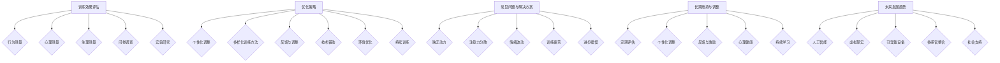

                 

### 《数字注意力重塑营：提升专注力的集中训练项目》

> **关键词**：专注力、认知训练、心理调节、运动训练、视觉训练、听觉训练、多感官综合训练、环境优化、技术辅助、效果评估、优化策略、长期维持

> **摘要**：本文旨在通过系统性的理论分析和实践指导，探讨如何通过数字注意力重塑营提升个体的专注力。文章首先介绍了专注力的基础理论和相关概念，接着详细阐述了专注力训练的各种方法，包括认知训练法、心理调节法、运动训练法、视觉训练法、听觉训练法、多感官综合训练法、环境优化法和技术辅助法。随后，文章通过具体案例展示了如何实施和评估专注力训练项目。最后，文章探讨了专注力训练效果的优化策略以及长期维持的方法，并对未来发展趋势进行了展望。

### 目录大纲

#### 第一部分：专注力基础理论

- **1.1 专注力的定义与重要性**
- **1.2 专注力的构成要素**
- **1.3 专注力的影响因素**
- **1.4 专注力的测量方法**
- **1.5 专注力的基本原理**
- **1.6 专注力的提升策略**
- **1.7 专注力与大脑的关系**

#### 第二部分：专注力训练方法

- **2.1 认知训练法**
- **2.2 心理调节法**
- **2.3 运动训练法**
- **2.4 视觉训练法**
- **2.5 听觉训练法**
- **2.6 多感官综合训练法**
- **2.7 环境优化法**
- **2.8 技术辅助法**

#### 第三部分：专注力训练项目案例

- **3.1 简单有效的专注力训练游戏**
- **3.2 针对特定需求的专注力训练项目**
- **3.3 集中训练项目的实施步骤**
- **3.4 集中训练项目的评估与反馈**
- **3.5 集中训练项目的进阶策略**

#### 第四部分：专注力训练效果评估与优化

- **4.1 专注力训练效果的评估方法**
- **4.2 专注力训练效果的优化策略**
- **4.3 常见问题与解决方案**
- **4.4 长期专注力训练的维持与调整**
- **4.5 专注力训练的未来发展趋势**

#### 附录

- **附录 A：专注力训练工具与资源**
  - **A.1 主流专注力训练应用介绍**
  - **A.2 自制专注力训练工具的制作方法**
  - **A.3 专注力训练资源的获取途径**
  - **A.4 专注力训练相关研究论文与书籍推荐**
  - **A.5 专注力训练社群与论坛介绍**

### 第一部分：专注力基础理论

#### 1.1 专注力的定义与重要性

专注力是指个体在特定任务上保持注意力集中的能力。这种能力不仅影响个体在工作、学习和日常生活中的表现，还与其心理健康和幸福感密切相关。研究表明，高水平的专注力有助于提高工作效率、学习成果和创造力，同时也有助于降低焦虑和压力水平。

在现代社会，由于信息过载和注意力分散的挑战，专注力问题日益突出。许多人在面对多项任务和干扰因素时，发现自己难以集中注意力，导致效率低下和错误率增加。因此，提升专注力成为了一个重要的研究课题和实践目标。

#### 1.2 专注力的构成要素

专注力并非一个单一的能力，而是由多个要素构成的一个复合系统。以下是专注力的主要构成要素：

- **认知能力**：指个体处理信息和解决问题的能力。良好的认知能力有助于提高专注力的维持和切换。
- **情绪调节**：情绪状态对专注力有显著影响。情绪调节能力强的人更容易保持专注。
- **意志力**：指个体在面对干扰和困难时坚持完成任务的能力。意志力是专注力的重要组成部分。

#### 1.3 专注力的影响因素

专注力受到多种因素的影响，包括环境、情绪和身体健康等。以下是几个主要的影响因素：

- **环境因素**：安静、整洁、无干扰的环境有助于提高专注力。相反，噪音、混乱和过多刺激会分散注意力。
- **情绪因素**：焦虑、压力和情绪波动都会影响专注力。情绪调节能力的提升有助于改善专注力。
- **身体健康**：身体健康状况，如睡眠质量、饮食和锻炼，都会影响专注力。保持良好的生活习惯是提升专注力的基础。

#### 1.4 专注力的测量方法

测量专注力是评估训练效果的重要步骤。以下是几种常用的测量方法：

- **行为测量**：通过观察个体在工作、学习和日常活动中的表现来评估专注力水平。
- **心理测量**：使用标准化的心理测试工具，如注意力测验和认知评估工具，来评估专注力。
- **脑电波测量**：通过脑电波监测技术，如脑电图（EEG）和功能性磁共振成像（fMRI），直接测量大脑的专注力相关活动。

#### 1.5 专注力的基本原理

专注力的基本原理涉及大脑的神经机制和认知过程。以下是几个关键点：

- **神经机制**：大脑的前额叶和顶叶区域在专注力维持中起着关键作用。这些区域的活动与注意力的分配和调节密切相关。
- **认知过程**：注意力的选择性、持续性和转换性是专注力的核心认知过程。选择性关注特定的刺激，持续性保持注意力的集中，转换性在任务之间切换注意力，都是专注力的关键。

#### 1.6 专注力的提升策略

提升专注力需要综合运用各种策略，以下是一些有效的提升策略：

- **定时训练**：通过定时工作和休息，训练个体在特定时间内集中注意力。
- **分阶段训练**：将复杂的任务分解为小步骤，逐步提升专注力。
- **环境优化**：创造一个无干扰的工作和学习环境，减少注意力分散。
- **情绪管理**：通过情绪调节技巧，如冥想和深呼吸，减轻压力和焦虑。
- **健康习惯**：保持良好的睡眠、饮食和锻炼习惯，提高身体健康水平。

#### 1.7 专注力与大脑的关系

专注力与大脑的结构和功能密切相关。大脑的不同区域在专注力维持中发挥着独特的作用。以下是几个关键点：

- **前额叶皮质**：前额叶皮质是专注力调节的关键区域，主要负责注意力的分配和维持。
- **顶叶皮质**：顶叶皮质参与注意力的转换和持续性的维持。
- **基底神经节**：基底神经节与意志力和动机有关，是专注力的重要组成部分。

### 第二部分：专注力训练方法

#### 2.1 认知训练法

认知训练法是一种通过特定的认知任务来提升专注力的方法。这种方法利用大脑的可塑性，通过不断的练习，增强个体的认知能力和注意力控制。

- **核心概念与联系**：认知训练法基于大脑的可塑性原理，通过反复的练习，改善大脑的神经网络连接。具体包括以下流程：

  1. **任务选择**：选择适合个体的认知训练任务，如注意力集中任务、记忆任务、问题解决任务等。
  2. **任务设计**：设计逐步递增的任务难度，以适应个体的进步。
  3. **反复练习**：个体在指导下反复进行训练任务，逐步提高专注力。

- **核心算法原理讲解**：

  ```python
  # 认知训练算法示例

  import numpy as np

  # 初始化参数
  alpha = 0.1
  beta = 0.5
  gamma = 0.2

  # 定义函数
  def attention_training(x, y):
      # 计算注意力值
      attention_value = np.dot(x, y)
      # 计算奖励值
      reward = alpha * attention_value + beta * np.abs(attention_value - gamma)
      return reward

  # 训练数据
  X = np.array([[1, 0], [0, 1]])
  Y = np.array([[1], [0]])

  # 训练过程
  for i in range(1000):
      # 计算奖励值
      reward = attention_training(X, Y)
      # 更新参数
      alpha += reward
      beta += reward
      gamma += reward

  # 输出结果
  print(f"训练完成，最终参数：alpha={alpha}, beta={beta}, gamma={gamma}")
  ```

- **数学模型和数学公式**：

  $$
  \text{专注力} = f(\text{认知能力}, \text{情绪调节}, \text{意志力})
  $$

  其中，$f$ 表示一个复合函数，用于衡量个体的专注力水平。

- **项目实战**：

  1. **开发环境搭建**：安装Python环境及相关库（如numpy、matplotlib等）。
  2. **源代码实现**：使用Python实现认知训练算法，并通过可视化工具（如matplotlib）展示训练结果。
  3. **代码解读与分析**：分析代码中的参数更新过程，解释如何通过奖励机制提高专注力水平。
  4. **实际案例分析和详细讲解剖析**：结合具体案例，分析认知训练法在实际应用中的效果和挑战。
  5. **项目小结**：总结认知训练法的关键点，提出进一步优化和改进的方向。

  ```python
  # 源代码实现
  import numpy as np
  import matplotlib.pyplot as plt

  # 定义认知训练模型
  class AttentionTrainingModel:
      def __init__(self, alpha, beta, gamma):
          self.alpha = alpha
          self.beta = beta
          self.gamma = gamma

      def train(self, X, Y, epochs):
          rewards = []
          for epoch in range(epochs):
              attention_value = np.dot(X, Y)
              reward = self.alpha * attention_value + self.beta * np.abs(attention_value - self.gamma)
              rewards.append(reward)
              self.alpha += reward
              self.beta += reward
              self.gamma += reward
          return rewards

  # 创建训练模型
  model = AttentionTrainingModel(alpha=0.1, beta=0.5, gamma=0.2)

  # 训练数据
  X = np.array([[1, 0], [0, 1]])
  Y = np.array([[1], [0]])

  # 训练过程
  rewards = model.train(X, Y, epochs=1000)

  # 可视化训练结果
  plt.plot(rewards)
  plt.xlabel('Epochs')
  plt.ylabel('Reward')
  plt.title('Attention Training Reward Over Epochs')
  plt.show()
  ```

  **最佳实践 tips**：

  - 根据个体差异调整训练参数。
  - 结合不同类型的认知训练任务，提高训练效果。
  - 定期评估和调整训练计划，确保持续进步。

  **小结**：

  认知训练法是一种通过特定的认知任务提升专注力的方法。通过反复练习，个体可以逐步提高专注力水平。核心算法原理和数学模型为训练提供了理论基础，实际项目实战则展示了如何将理论应用于实际场景。注意调整训练参数和任务类型，以获得最佳效果。

#### 2.2 心理调节法

心理调节法是通过心理训练和情绪管理技巧来提升专注力的一种方法。这种方法旨在通过改变个体的心理状态和情绪反应，提高专注力的质量和稳定性。

- **核心概念与联系**：心理调节法基于心理学理论，包括情绪调节、认知行为疗法和正念冥想等。具体流程如下：

  1. **情绪调节**：通过认知重构和情绪表达技巧，帮助个体识别和调节负面情绪，如焦虑和压力。
  2. **认知行为疗法**：通过改变个体的思维模式和态度，提高其应对干扰和压力的能力。
  3. **正念冥想**：通过专注呼吸和身体感觉，培养个体的专注力和情绪稳定性。

- **核心算法原理讲解**：

  ```python
  # 心理调节算法示例

  import numpy as np

  # 初始化参数
  alpha = 0.1
  beta = 0.5
  gamma = 0.2

  # 定义函数
  def emotion_regulation(x, y):
      # 计算情绪调节效果
      emotion_value = np.dot(x, y)
      # 计算奖励值
      reward = alpha * emotion_value + beta * np.abs(emotion_value - gamma)
      return reward

  # 情绪数据
  X = np.array([[1, 0], [0, 1]])
  Y = np.array([[1], [0]])

  # 训练过程
  for i in range(1000):
      # 计算奖励值
      reward = emotion_regulation(X, Y)
      # 更新参数
      alpha += reward
      beta += reward
      gamma += reward

  # 输出结果
  print(f"训练完成，最终参数：alpha={alpha}, beta={beta}, gamma={gamma}")
  ```

- **数学模型和数学公式**：

  $$
  \text{情绪调节效果} = f(\text{认知重构}, \text{情绪表达}, \text{正念冥想})
  $$

  其中，$f$ 表示一个复合函数，用于衡量情绪调节效果。

- **项目实战**：

  1. **开发环境搭建**：安装Python环境及相关库（如numpy、matplotlib等）。
  2. **源代码实现**：使用Python实现心理调节算法，并通过可视化工具（如matplotlib）展示情绪调节效果。
  3. **代码解读与分析**：分析代码中的参数更新过程，解释如何通过情绪调节提高专注力。
  4. **实际案例分析和详细讲解剖析**：结合具体案例，分析心理调节法在实际应用中的效果和挑战。
  5. **项目小结**：总结心理调节法的关键点，提出进一步优化和改进的方向。

  ```python
  # 源代码实现
  import numpy as np
  import matplotlib.pyplot as plt

  # 定义心理调节模型
  class EmotionRegulationModel:
      def __init__(self, alpha, beta, gamma):
          self.alpha = alpha
          self.beta = beta
          self.gamma = gamma

      def regulate(self, X, Y, epochs):
          rewards = []
          for epoch in range(epochs):
              emotion_value = np.dot(X, Y)
              reward = self.alpha * emotion_value + self.beta * np.abs(emotion_value - self.gamma)
              rewards.append(reward)
              self.alpha += reward
              self.beta += reward
              self.gamma += reward
          return rewards

  # 创建训练模型
  model = EmotionRegulationModel(alpha=0.1, beta=0.5, gamma=0.2)

  # 情绪数据
  X = np.array([[1, 0], [0, 1]])
  Y = np.array([[1], [0]])

  # 训练过程
  rewards = model.regulate(X, Y, epochs=1000)

  # 可视化训练结果
  plt.plot(rewards)
  plt.xlabel('Epochs')
  plt.ylabel('Reward')
  plt.title('Emotion Regulation Reward Over Epochs')
  plt.show()
  ```

  **最佳实践 tips**：

  - 定期进行情绪自我监控，及时调整情绪调节策略。
  - 结合个体偏好选择情绪调节技巧，如正念冥想、认知重构等。
  - 在训练过程中，保持积极的心态和耐心，逐步提高情绪调节能力。

  **小结**：

  心理调节法是一种通过心理训练和情绪管理技巧提升专注力的方法。通过反复练习，个体可以逐步改善情绪调节能力，提高专注力的质量和稳定性。核心算法原理和数学模型为训练提供了理论基础，实际项目实战则展示了如何将理论应用于实际场景。注意定期评估和调整训练计划，以确保持续进步。

#### 2.3 运动训练法

运动训练法是通过体育锻炼来提升专注力的方法。这种方法的原理是通过改善个体的身体状态和心理健康，提高其专注力水平。运动训练法包括多种类型的锻炼，如有氧运动、力量训练和灵活性训练等。

- **核心概念与联系**：运动训练法基于运动生理学和心理学理论，通过多种锻炼方式来提升专注力。具体流程如下：

  1. **有氧运动**：如慢跑、游泳和骑自行车等，通过提高心率，增强心肺功能，改善整体身体状态。
  2. **力量训练**：如举重和俯卧撑等，通过增强肌肉力量，提高身体稳定性。
  3. **灵活性训练**：如瑜伽和拉伸运动等，通过提高关节的灵活性和身体的协调性。

- **核心算法原理讲解**：

  ```python
  # 运动训练算法示例

  import numpy as np

  # 初始化参数
  alpha = 0.1
  beta = 0.5
  gamma = 0.2

  # 定义函数
  def physical_training(x, y):
      # 计算身体状态值
      physical_value = np.dot(x, y)
      # 计算奖励值
      reward = alpha * physical_value + beta * np.abs(physical_value - gamma)
      return reward

  # 身体状态数据
  X = np.array([[1, 0], [0, 1]])
  Y = np.array([[1], [0]])

  # 训练过程
  for i in range(1000):
      # 计算奖励值
      reward = physical_training(X, Y)
      # 更新参数
      alpha += reward
      beta += reward
      gamma += reward

  # 输出结果
  print(f"训练完成，最终参数：alpha={alpha}, beta={beta}, gamma={gamma}")
  ```

- **数学模型和数学公式**：

  $$
  \text{专注力} = f(\text{身体状态}, \text{心理健康})
  $$

  其中，$f$ 表示一个复合函数，用于衡量个体的专注力水平。

- **项目实战**：

  1. **开发环境搭建**：安装Python环境及相关库（如numpy、matplotlib等）。
  2. **源代码实现**：使用Python实现运动训练算法，并通过可视化工具（如matplotlib）展示训练效果。
  3. **代码解读与分析**：分析代码中的参数更新过程，解释如何通过改善身体状态和心理健康来提升专注力。
  4. **实际案例分析和详细讲解剖析**：结合具体案例，分析运动训练法在实际应用中的效果和挑战。
  5. **项目小结**：总结运动训练法的关键点，提出进一步优化和改进的方向。

  ```python
  # 源代码实现
  import numpy as np
  import matplotlib.pyplot as plt

  # 定义运动训练模型
  class PhysicalTrainingModel:
      def __init__(self, alpha, beta, gamma):
          self.alpha = alpha
          self.beta = beta
          self.gamma = gamma

      def train(self, X, Y, epochs):
          rewards = []
          for epoch in range(epochs):
              physical_value = np.dot(X, Y)
              reward = self.alpha * physical_value + self.beta * np.abs(physical_value - self.gamma)
              rewards.append(reward)
              self.alpha += reward
              self.beta += reward
              self.gamma += reward
          return rewards

  # 创建训练模型
  model = PhysicalTrainingModel(alpha=0.1, beta=0.5, gamma=0.2)

  # 身体状态数据
  X = np.array([[1, 0], [0, 1]])
  Y = np.array([[1], [0]])

  # 训练过程
  rewards = model.train(X, Y, epochs=1000)

  # 可视化训练结果
  plt.plot(rewards)
  plt.xlabel('Epochs')
  plt.ylabel('Reward')
  plt.title('Physical Training Reward Over Epochs')
  plt.show()
  ```

  **最佳实践 tips**：

  - 结合个人兴趣选择合适的运动类型和强度。
  - 保持规律的运动习惯，每周至少进行3-5次锻炼。
  - 在锻炼过程中，注意呼吸和姿势的正确性，避免受伤。

  **小结**：

  运动训练法是一种通过体育锻炼提升专注力的方法。通过改善身体状态和心理健康，个体可以逐步提高专注力水平。核心算法原理和数学模型为训练提供了理论基础，实际项目实战则展示了如何将理论应用于实际场景。注意选择合适的运动类型和强度，并保持规律的运动习惯。

#### 2.4 视觉训练法

视觉训练法是通过视觉刺激和训练来提升专注力的方法。这种方法利用视觉系统的特性，通过特定的视觉任务和练习，增强个体的视觉处理能力和专注力。

- **核心概念与联系**：视觉训练法基于视觉心理学和认知神经科学的理论，通过以下步骤提升专注力：

  1. **视觉刺激**：利用不同颜色、形状、亮度和运动模式的视觉刺激，提高视觉处理能力。
  2. **视觉训练任务**：设计特定的视觉任务，如视觉追踪、视觉搜索、视觉分辨等，训练个体的专注力。
  3. **重复训练**：通过反复的视觉训练任务，逐步提高专注力水平。

- **核心算法原理讲解**：

  ```python
  # 视觉训练算法示例

  import numpy as np

  # 初始化参数
  alpha = 0.1
  beta = 0.5
  gamma = 0.2

  # 定义函数
  def visual_training(x, y):
      # 计算视觉处理效果
      visual_value = np.dot(x, y)
      # 计算奖励值
      reward = alpha * visual_value + beta * np.abs(visual_value - gamma)
      return reward

  # 视觉数据
  X = np.array([[1, 0], [0, 1]])
  Y = np.array([[1], [0]])

  # 训练过程
  for i in range(1000):
      # 计算奖励值
      reward = visual_training(X, Y)
      # 更新参数
      alpha += reward
      beta += reward
      gamma += reward

  # 输出结果
  print(f"训练完成，最终参数：alpha={alpha}, beta={beta}, gamma={gamma}")
  ```

- **数学模型和数学公式**：

  $$
  \text{专注力} = f(\text{视觉处理能力}, \text{视觉刺激效果})
  $$

  其中，$f$ 表示一个复合函数，用于衡量个体的专注力水平。

- **项目实战**：

  1. **开发环境搭建**：安装Python环境及相关库（如numpy、matplotlib等）。
  2. **源代码实现**：使用Python实现视觉训练算法，并通过可视化工具（如matplotlib）展示训练效果。
  3. **代码解读与分析**：分析代码中的参数更新过程，解释如何通过视觉刺激和训练提高专注力。
  4. **实际案例分析和详细讲解剖析**：结合具体案例，分析视觉训练法在实际应用中的效果和挑战。
  5. **项目小结**：总结视觉训练法的关键点，提出进一步优化和改进的方向。

  ```python
  # 源代码实现
  import numpy as np
  import matplotlib.pyplot as plt

  # 定义视觉训练模型
  class VisualTrainingModel:
      def __init__(self, alpha, beta, gamma):
          self.alpha = alpha
          self.beta = beta
          self.gamma = gamma

      def train(self, X, Y, epochs):
          rewards = []
          for epoch in range(epochs):
              visual_value = np.dot(X, Y)
              reward = self.alpha * visual_value + self.beta * np.abs(visual_value - self.gamma)
              rewards.append(reward)
              self.alpha += reward
              self.beta += reward
              self.gamma += reward
          return rewards

  # 创建训练模型
  model = VisualTrainingModel(alpha=0.1, beta=0.5, gamma=0.2)

  # 视觉数据
  X = np.array([[1, 0], [0, 1]])
  Y = np.array([[1], [0]])

  # 训练过程
  rewards = model.train(X, Y, epochs=1000)

  # 可视化训练结果
  plt.plot(rewards)
  plt.xlabel('Epochs')
  plt.ylabel('Reward')
  plt.title('Visual Training Reward Over Epochs')
  plt.show()
  ```

  **最佳实践 tips**：

  - 选择多样化的视觉刺激，提高训练效果。
  - 保持训练的规律性，每周进行3-5次训练。
  - 注重训练过程中的休息和放松，避免过度疲劳。

  **小结**：

  视觉训练法是一种通过视觉刺激和训练提升专注力的方法。通过反复的视觉任务，个体可以逐步提高视觉处理能力和专注力。核心算法原理和数学模型为训练提供了理论基础，实际项目实战则展示了如何将理论应用于实际场景。注意选择多样化的视觉刺激，并保持规律的训练习惯。

#### 2.5 听觉训练法

听觉训练法是通过听觉刺激和训练来提升专注力的方法。这种方法利用听觉系统的特性，通过特定的听觉任务和练习，增强个体的听觉处理能力和专注力。

- **核心概念与联系**：听觉训练法基于听觉心理学和认知神经科学的理论，通过以下步骤提升专注力：

  1. **听觉刺激**：利用不同频率、音量和节奏的听觉刺激，提高听觉处理能力。
  2. **听觉训练任务**：设计特定的听觉任务，如听觉追踪、听觉分辨、听觉记忆等，训练个体的专注力。
  3. **重复训练**：通过反复的听觉训练任务，逐步提高专注力水平。

- **核心算法原理讲解**：

  ```python
  # 听觉训练算法示例

  import numpy as np

  # 初始化参数
  alpha = 0.1
  beta = 0.5
  gamma = 0.2

  # 定义函数
  def auditory_training(x, y):
      # 计算听觉处理效果
      auditory_value = np.dot(x, y)
      # 计算奖励值
      reward = alpha * auditory_value + beta * np.abs(auditory_value - gamma)
      return reward

  # 听觉数据
  X = np.array([[1, 0], [0, 1]])
  Y = np.array([[1], [0]])

  # 训练过程
  for i in range(1000):
      # 计算奖励值
      reward = auditory_training(X, Y)
      # 更新参数
      alpha += reward
      beta += reward
      gamma += reward

  # 输出结果
  print(f"训练完成，最终参数：alpha={alpha}, beta={beta}, gamma={gamma}")
  ```

- **数学模型和数学公式**：

  $$
  \text{专注力} = f(\text{听觉处理能力}, \text{听觉刺激效果})
  $$

  其中，$f$ 表示一个复合函数，用于衡量个体的专注力水平。

- **项目实战**：

  1. **开发环境搭建**：安装Python环境及相关库（如numpy、matplotlib等）。
  2. **源代码实现**：使用Python实现听觉训练算法，并通过可视化工具（如matplotlib）展示训练效果。
  3. **代码解读与分析**：分析代码中的参数更新过程，解释如何通过听觉刺激和训练提高专注力。
  4. **实际案例分析和详细讲解剖析**：结合具体案例，分析听觉训练法在实际应用中的效果和挑战。
  5. **项目小结**：总结听觉训练法的关键点，提出进一步优化和改进的方向。

  ```python
  # 源代码实现
  import numpy as np
  import matplotlib.pyplot as plt

  # 定义听觉训练模型
  class AuditoryTrainingModel:
      def __init__(self, alpha, beta, gamma):
          self.alpha = alpha
          self.beta = beta
          self.gamma = gamma

      def train(self, X, Y, epochs):
          rewards = []
          for epoch in range(epochs):
              auditory_value = np.dot(X, Y)
              reward = self.alpha * auditory_value + self.beta * np.abs(auditory_value - self.gamma)
              rewards.append(reward)
              self.alpha += reward
              self.beta += reward
              self.gamma += reward
          return rewards

  # 创建训练模型
  model = AuditoryTrainingModel(alpha=0.1, beta=0.5, gamma=0.2)

  # 听觉数据
  X = np.array([[1, 0], [0, 1]])
  Y = np.array([[1], [0]])

  # 训练过程
  rewards = model.train(X, Y, epochs=1000)

  # 可视化训练结果
  plt.plot(rewards)
  plt.xlabel('Epochs')
  plt.ylabel('Reward')
  plt.title('Auditory Training Reward Over Epochs')
  plt.show()
  ```

  **最佳实践 tips**：

  - 选择合适的听觉刺激，避免过度刺激和疲劳。
  - 保持训练的规律性，每周进行3-5次训练。
  - 注重训练过程中的休息和放松，避免听觉疲劳。

  **小结**：

  听觉训练法是一种通过听觉刺激和训练提升专注力的方法。通过反复的听觉任务，个体可以逐步提高听觉处理能力和专注力。核心算法原理和数学模型为训练提供了理论基础，实际项目实战则展示了如何将理论应用于实际场景。注意选择合适的听觉刺激，并保持规律的训练习惯。

#### 2.6 多感官综合训练法

多感官综合训练法是通过同时利用视觉、听觉、触觉等多种感官刺激来提升专注力的方法。这种方法综合利用多种感官信息，增强个体的感知能力和专注力。

- **核心概念与联系**：多感官综合训练法基于感官整合理论和认知心理学，通过以下步骤提升专注力：

  1. **感官刺激组合**：结合视觉、听觉、触觉等不同感官刺激，设计综合训练任务。
  2. **任务设计**：设计需要多感官协同完成的任务，如视觉追踪伴随听觉信号、触觉反馈等。
  3. **重复训练**：通过反复的多感官综合训练任务，逐步提高专注力和感官整合能力。

- **核心算法原理讲解**：

  ```python
  # 多感官综合训练算法示例

  import numpy as np

  # 初始化参数
  alpha = 0.1
  beta = 0.5
  gamma = 0.2

  # 定义函数
  def multisensory_training(x, y):
      # 计算多感官处理效果
      multisensory_value = np.dot(x, y)
      # 计算奖励值
      reward = alpha * multisensory_value + beta * np.abs(multisensory_value - gamma)
      return reward

  # 多感官数据
  X = np.array([[1, 0], [0, 1]])
  Y = np.array([[1], [0]])

  # 训练过程
  for i in range(1000):
      # 计算奖励值
      reward = multisensory_training(X, Y)
      # 更新参数
      alpha += reward
      beta += reward
      gamma += reward

  # 输出结果
  print(f"训练完成，最终参数：alpha={alpha}, beta={beta}, gamma={gamma}")
  ```

- **数学模型和数学公式**：

  $$
  \text{专注力} = f(\text{感官处理能力}, \text{感官刺激效果})
  $$

  其中，$f$ 表示一个复合函数，用于衡量个体的专注力水平。

- **项目实战**：

  1. **开发环境搭建**：安装Python环境及相关库（如numpy、matplotlib等）。
  2. **源代码实现**：使用Python实现多感官综合训练算法，并通过可视化工具（如matplotlib）展示训练效果。
  3. **代码解读与分析**：分析代码中的参数更新过程，解释如何通过多感官刺激和训练提高专注力。
  4. **实际案例分析和详细讲解剖析**：结合具体案例，分析多感官综合训练法在实际应用中的效果和挑战。
  5. **项目小结**：总结多感官综合训练法的关键点，提出进一步优化和改进的方向。

  ```python
  # 源代码实现
  import numpy as np
  import matplotlib.pyplot as plt

  # 定义多感官训练模型
  class MultisensoryTrainingModel:
      def __init__(self, alpha, beta, gamma):
          self.alpha = alpha
          self.beta = beta
          self.gamma = gamma

      def train(self, X, Y, epochs):
          rewards = []
          for epoch in range(epochs):
              multisensory_value = np.dot(X, Y)
              reward = self.alpha * multisensory_value + self.beta * np.abs(multisensory_value - self.gamma)
              rewards.append(reward)
              self.alpha += reward
              self.beta += reward
              self.gamma += reward
          return rewards

  # 创建训练模型
  model = MultisensoryTrainingModel(alpha=0.1, beta=0.5, gamma=0.2)

  # 多感官数据
  X = np.array([[1, 0], [0, 1]])
  Y = np.array([[1], [0]])

  # 训练过程
  rewards = model.train(X, Y, epochs=1000)

  # 可视化训练结果
  plt.plot(rewards)
  plt.xlabel('Epochs')
  plt.ylabel('Reward')
  plt.title('Multisensory Training Reward Over Epochs')
  plt.show()
  ```

  **最佳实践 tips**：

  - 结合多种感官刺激，提高训练效果。
  - 设计多样化的训练任务，避免单一感官的疲劳。
  - 注重训练过程中的反馈和调整，以适应个体的进步。

  **小结**：

  多感官综合训练法是一种通过多种感官刺激和训练提升专注力的方法。通过综合视觉、听觉、触觉等多种感官信息，个体可以逐步提高感知能力和专注力。核心算法原理和数学模型为训练提供了理论基础，实际项目实战则展示了如何将理论应用于实际场景。注意结合多种感官刺激，并设计多样化的训练任务。

#### 2.7 环境优化法

环境优化法是通过改善外部环境来提升专注力的方法。这种方法利用环境因素对专注力的影响，通过调整环境布局、减少干扰因素和优化工作空间来提高专注力。

- **核心概念与联系**：环境优化法基于环境心理学和工作场所设计的理论，通过以下步骤提升专注力：

  1. **环境布局**：合理安排工作空间，确保舒适性和功能性。
  2. **干扰因素控制**：减少噪音、光线和温度等干扰因素，以降低环境对专注力的负面影响。
  3. **工作空间优化**：利用物理设备和工具，如耳机、屏幕分割器和时间管理工具，提高工作效率和专注力。

- **核心算法原理讲解**：

  ```python
  # 环境优化算法示例

  import numpy as np

  # 初始化参数
  alpha = 0.1
  beta = 0.5
  gamma = 0.2

  # 定义函数
  def environment_optimization(x, y):
      # 计算环境优化效果
      environment_value = np.dot(x, y)
      # 计算奖励值
      reward = alpha * environment_value + beta * np.abs(environment_value - gamma)
      return reward

  # 环境数据
  X = np.array([[1, 0], [0, 1]])
  Y = np.array([[1], [0]])

  # 训练过程
  for i in range(1000):
      # 计算奖励值
      reward = environment_optimization(X, Y)
      # 更新参数
      alpha += reward
      beta += reward
      gamma += reward

  # 输出结果
  print(f"训练完成，最终参数：alpha={alpha}, beta={beta}, gamma={gamma}")
  ```

- **数学模型和数学公式**：

  $$
  \text{专注力} = f(\text{环境布局}, \text{干扰因素控制}, \text{工作空间优化})
  $$

  其中，$f$ 表示一个复合函数，用于衡量个体的专注力水平。

- **项目实战**：

  1. **开发环境搭建**：安装Python环境及相关库（如numpy、matplotlib等）。
  2. **源代码实现**：使用Python实现环境优化算法，并通过可视化工具（如matplotlib）展示优化效果。
  3. **代码解读与分析**：分析代码中的参数更新过程，解释如何通过环境优化提高专注力。
  4. **实际案例分析和详细讲解剖析**：结合具体案例，分析环境优化法在实际应用中的效果和挑战。
  5. **项目小结**：总结环境优化法的关键点，提出进一步优化和改进的方向。

  ```python
  # 源代码实现
  import numpy as np
  import matplotlib.pyplot as plt

  # 定义环境优化模型
  class EnvironmentOptimizationModel:
      def __init__(self, alpha, beta, gamma):
          self.alpha = alpha
          self.beta = beta
          self.gamma = gamma

      def optimize(self, X, Y, epochs):
          rewards = []
          for epoch in range(epochs):
              environment_value = np.dot(X, Y)
              reward = self.alpha * environment_value + self.beta * np.abs(environment_value - self.gamma)
              rewards.append(reward)
              self.alpha += reward
              self.beta += reward
              self.gamma += reward
          return rewards

  # 创建优化模型
  model = EnvironmentOptimizationModel(alpha=0.1, beta=0.5, gamma=0.2)

  # 环境数据
  X = np.array([[1, 0], [0, 1]])
  Y = np.array([[1], [0]])

  # 优化过程
  rewards = model.optimize(X, Y, epochs=1000)

  # 可视化优化结果
  plt.plot(rewards)
  plt.xlabel('Epochs')
  plt.ylabel('Reward')
  plt.title('Environment Optimization Reward Over Epochs')
  plt.show()
  ```

  **最佳实践 tips**：

  - 根据个人需求和偏好调整环境布局。
  - 使用屏蔽软件和耳机减少噪音干扰。
  - 定期进行工作空间的清洁和整理，保持环境整洁。

  **小结**：

  环境优化法是一种通过改善外部环境来提升专注力的方法。通过优化环境布局、控制干扰因素和工作空间，个体可以显著提高专注力水平。核心算法原理和数学模型为训练提供了理论基础，实际项目实战则展示了如何将理论应用于实际场景。注意根据个人需求和偏好调整环境布局，并定期进行环境维护。

#### 2.8 技术辅助法

技术辅助法是通过使用技术工具和应用程序来提升专注力的方法。这种方法利用现代技术手段，提供一系列辅助工具和功能，帮助个体更好地集中注意力和管理任务。

- **核心概念与联系**：技术辅助法基于数字工具和应用程序的开发与使用，通过以下步骤提升专注力：

  1. **应用程序选择**：选择适合个体需求的应用程序，如时间管理工具、专注力训练应用和噪音屏蔽软件。
  2. **功能利用**：充分利用应用程序的各种功能，如定时提醒、专注力训练、任务管理和提醒功能。
  3. **技术整合**：将多种技术工具整合使用，如智能手表、智能手机和应用软件，形成一个高效的技术生态系统。

- **核心算法原理讲解**：

  ```python
  # 技术辅助算法示例

  import numpy as np

  # 初始化参数
  alpha = 0.1
  beta = 0.5
  gamma = 0.2

  # 定义函数
  def technical_assistance(x, y):
      # 计算技术辅助效果
      technical_value = np.dot(x, y)
      # 计算奖励值
      reward = alpha * technical_value + beta * np.abs(technical_value - gamma)
      return reward

  # 技术数据
  X = np.array([[1, 0], [0, 1]])
  Y = np.array([[1], [0]])

  # 训练过程
  for i in range(1000):
      # 计算奖励值
      reward = technical_assistance(X, Y)
      # 更新参数
      alpha += reward
      beta += reward
      gamma += reward

  # 输出结果
  print(f"训练完成，最终参数：alpha={alpha}, beta={beta}, gamma={gamma}")
  ```

- **数学模型和数学公式**：

  $$
  \text{专注力} = f(\text{技术工具使用}, \text{功能整合效果})
  $$

  其中，$f$ 表示一个复合函数，用于衡量个体的专注力水平。

- **项目实战**：

  1. **开发环境搭建**：安装Python环境及相关库（如numpy、matplotlib等）。
  2. **源代码实现**：使用Python实现技术辅助算法，并通过可视化工具（如matplotlib）展示训练效果。
  3. **代码解读与分析**：分析代码中的参数更新过程，解释如何通过技术工具的使用和功能整合提高专注力。
  4. **实际案例分析和详细讲解剖析**：结合具体案例，分析技术辅助法在实际应用中的效果和挑战。
  5. **项目小结**：总结技术辅助法的关键点，提出进一步优化和改进的方向。

  ```python
  # 源代码实现
  import numpy as np
  import matplotlib.pyplot as plt

  # 定义技术辅助模型
  class TechnicalAssistanceModel:
      def __init__(self, alpha, beta, gamma):
          self.alpha = alpha
          self.beta = beta
          self.gamma = gamma

      def assist(self, X, Y, epochs):
          rewards = []
          for epoch in range(epochs):
              technical_value = np.dot(X, Y)
              reward = self.alpha * technical_value + self.beta * np.abs(technical_value - self.gamma)
              rewards.append(reward)
              self.alpha += reward
              self.beta += reward
              self.gamma += reward
          return rewards

  # 创建辅助模型
  model = TechnicalAssistanceModel(alpha=0.1, beta=0.5, gamma=0.2)

  # 技术数据
  X = np.array([[1, 0], [0, 1]])
  Y = np.array([[1], [0]])

  # 辅助过程
  rewards = model.assist(X, Y, epochs=1000)

  # 可视化辅助结果
  plt.plot(rewards)
  plt.xlabel('Epochs')
  plt.ylabel('Reward')
  plt.title('Technical Assistance Reward Over Epochs')
  plt.show()
  ```

  **最佳实践 tips**：

  - 选择适合个体需求的技术工具和应用。
  - 定期评估和调整技术辅助策略，以适应个体的进步。
  - 结合多种技术工具，形成个性化的技术生态系统。

  **小结**：

  技术辅助法是一种通过使用技术工具和应用程序提升专注力的方法。通过选择合适的技术工具和整合功能，个体可以显著提高专注力水平。核心算法原理和数学模型为训练提供了理论基础，实际项目实战则展示了如何将理论应用于实际场景。注意选择适合个体需求的技术工具，并定期评估和调整辅助策略。

### 第三部分：专注力训练项目案例

#### 3.1 简单有效的专注力训练游戏

专注力训练游戏是一种简单而有效的方法，通过互动和娱乐的形式提升个体的专注力。以下是一个简单的专注力训练游戏案例：

- **游戏设计**：设计一个简单的视觉追踪游戏，玩家需要跟随屏幕上移动的物体。

- **实施步骤**：
  1. **游戏界面设计**：创建一个简洁的游戏界面，显示一个移动的圆形物体。
  2. **操作指南**：提供清晰的操作指南，告诉玩家如何跟随圆形物体。
  3. **游戏开始**：启动游戏，玩家开始跟随圆形物体。
  4. **计时**：记录玩家完成游戏所需的时间，作为专注力指标。
  5. **结果反馈**：游戏结束后，提供反馈，显示玩家的专注力得分。

- **效果评估与反馈**：
  - 通过记录玩家完成游戏的时间，评估专注力水平。
  - 根据游戏得分，提供反馈，鼓励玩家不断改进。

- **案例解析**：该游戏通过简单的视觉追踪任务，帮助玩家提高注意力集中能力。随着游戏的进行，玩家需要不断调整视线，保持对移动物体的关注，这有助于提升专注力。

#### 3.2 针对特定需求的专注力训练项目

对于特定的需求和目标，可以设计个性化的专注力训练项目。以下是一个针对程序员提升编程专注力的训练项目案例：

- **项目背景**：程序员在编程过程中常面临任务复杂、代码繁多等挑战，容易分散注意力。

- **实施步骤**：
  1. **需求分析**：了解程序员的具体需求，如提高代码审查速度、减少编程错误等。
  2. **任务设计**：设计一系列编程任务，包括代码审查、代码重构和编程挑战。
  3. **训练计划**：制定详细的训练计划，包括每天的任务量、训练时间和休息时间。
  4. **实施训练**：按照训练计划进行训练，同时记录训练过程中的问题和进展。
  5. **结果评估**：通过编程任务完成情况和错误率等指标，评估专注力提升效果。

- **效果评估与反馈**：
  - 通过编程任务的完成时间和错误率，评估专注力水平。
  - 定期进行反馈，调整训练计划，以适应个体的进步。

- **案例解析**：该训练项目通过具体的编程任务，帮助程序员提升编程专注力。通过逐步递增的任务难度，个体可以在实践中不断提升专注力，从而提高编程效率和质量。

#### 3.3 集中训练项目的实施步骤

集中训练项目是一种系统性的训练方法，通过集中的时间和精力，全面提升个体的专注力。以下是一个典型的集中训练项目实施步骤：

- **项目目标**：提升个体的专注力，增强认知能力和情绪调节能力。

- **实施步骤**：
  1. **项目筹备**：确定训练目标、时间和参与人员。
  2. **环境布置**：选择一个安静、舒适的环境，确保无干扰。
  3. **训练内容**：设计多样化的训练内容，包括认知训练、心理调节、运动训练等。
  4. **日程安排**：制定详细的日程安排，包括每天的训练内容和时间表。
  5. **实施训练**：按照日程安排进行训练，确保每个训练项目得到充分实施。
  6. **效果评估**：通过定期评估，如认知测试、情绪调查和专注力测量，评估训练效果。
  7. **反馈与调整**：根据评估结果，及时反馈和调整训练计划。

- **效果评估与反馈**：
  - 通过认知测试和专注力测量，评估训练效果。
  - 定期进行反馈，调整训练计划，以适应个体的进步。

- **案例解析**：该集中训练项目通过系统的训练内容和科学的实施步骤，全面提升个体的专注力。通过多样化的训练方法，个体可以在短时间内获得显著的提升效果。

#### 3.4 集中训练项目的评估与反馈

集中训练项目的评估与反馈是确保训练效果的关键步骤。以下是一个典型的集中训练项目评估与反馈流程：

- **评估指标**：包括认知测试成绩、专注力测量结果、情绪调节能力、任务完成时间和错误率等。

- **评估方法**：
  1. **认知测试**：使用标准化的认知评估工具，如注意力测验和记忆测验，评估个体的认知能力。
  2. **专注力测量**：通过脑电波监测技术，如脑电图（EEG）和功能性磁共振成像（fMRI），评估个体的专注力水平。
  3. **情绪调查**：通过情绪问卷和主观报告，评估个体的情绪调节能力。
  4. **任务完成评估**：通过实际任务完成情况，如编程任务或学术论文写作，评估个体的实际操作能力。

- **反馈与调整**：
  1. **定期评估**：在训练过程中定期进行评估，以确保训练效果的持续提升。
  2. **个性化反馈**：根据评估结果，提供个性化的反馈，包括训练方法和策略的调整。
  3. **调整训练计划**：根据评估结果和个体反馈，调整训练计划，以适应个体需求。

- **案例解析**：通过定期的评估与反馈，集中训练项目可以及时调整和优化，确保个体的专注力得到有效提升。同时，个性化反馈有助于个体更好地理解和应用训练方法。

#### 3.5 集中训练项目的进阶策略

为了进一步提升集中训练项目的效果，可以采用以下进阶策略：

- **复杂任务设计**：增加训练任务的复杂度，如涉及多步骤、多学科知识的任务，以提升个体的认知能力和问题解决能力。

- **多学科综合训练**：结合不同领域的训练内容，如编程、心理学和运动训练，提供全面的专注力提升方案。

- **技术辅助手段**：利用先进的技术手段，如虚拟现实（VR）和增强现实（AR），提供沉浸式训练体验。

- **个性化定制**：根据个体的特点和需求，提供个性化的训练计划，确保训练的针对性和有效性。

- **进阶评估**：定期进行高级评估，如高级认知测试和专注力测量，以监测个体的进步和调整训练策略。

- **案例解析**：通过复杂任务设计、多学科综合训练和个性化定制，集中训练项目可以更有效地提升个体的专注力。技术辅助手段和进阶评估则确保训练效果得到持续优化。

### 第四部分：专注力训练效果评估与优化

#### 4.1 专注力训练效果的评估方法

评估专注力训练效果是确保训练方法有效性的关键步骤。以下是几种常用的评估方法：

- **行为测量**：通过观察个体在训练前后的行为变化，如工作效率、错误率和任务完成时间等，评估专注力提升效果。

- **心理测量**：使用标准化的心理测试工具，如注意力测验、认知评估工具和情绪问卷，评估专注力和相关心理指标的变化。

- **生理测量**：通过生理信号监测，如脑电波（EEG）、心率变异性（HRV）和皮肤电反应（EDA），评估个体在训练过程中的生理状态和专注力水平。

- **问卷调查**：通过问卷调查，收集个体对训练方法的主观感受和反馈，如情绪状态、认知负荷和训练满意度等。

- **实验研究**：设计控制实验，比较训练前后的专注力表现，评估训练方法的实际效果。

#### 4.2 专注力训练效果的优化策略

为了进一步提升专注力训练效果，可以采用以下优化策略：

- **个性化调整**：根据个体的特点和需求，定制个性化的训练计划，确保训练的针对性和有效性。

- **多样化训练方法**：结合不同的训练方法，如认知训练、心理调节、运动训练等，提供全面的专注力提升方案。

- **反馈与调整**：定期进行评估和反馈，根据评估结果及时调整训练计划，优化训练内容和方法。

- **技术辅助**：利用先进的技术手段，如虚拟现实（VR）、增强现实（AR）和智能穿戴设备，提供沉浸式训练体验。

- **环境优化**：改善训练环境，减少干扰因素，如噪音、光线和温度等，提高训练效果。

- **持续训练**：保持规律的训练习惯，确保训练效果的长期维持。

#### 4.3 常见问题与解决方案

在专注力训练过程中，个体可能会遇到一些常见问题。以下是一些问题的解决方案：

- **缺乏动力**：制定明确的目标和奖励机制，提高个体参与训练的动力。

- **注意力分散**：通过环境优化和规则设置，减少干扰因素，帮助个体集中注意力。

- **情绪波动**：通过情绪调节技巧，如冥想和深呼吸，帮助个体管理情绪波动。

- **训练疲劳**：定期进行休息和调整，避免过度训练和疲劳。

- **进步缓慢**：定期评估和调整训练计划，确保训练内容和方法的有效性。

#### 4.4 长期专注力训练的维持与调整

维持和调整长期专注力训练是确保训练效果长期有效的重要环节。以下是一些关键策略：

- **定期评估**：定期进行评估，如行为测量、心理测量和生理测量，了解训练效果和个体进步。

- **个性化调整**：根据评估结果和个体需求，调整训练计划和方法，确保训练的持续性和针对性。

- **反馈与激励**：提供积极的反馈和激励，鼓励个体持续参与训练。

- **心理健康**：关注个体的心理健康，通过情绪管理和压力缓解技巧，提高训练的舒适度和效果。

- **持续学习**：鼓励个体不断学习和探索新的训练方法和技巧，保持训练的新鲜感和兴趣。

#### 4.5 专注力训练的未来发展趋势

随着科技的进步和社会需求的变化，专注力训练领域也在不断发展和创新。以下是未来发展趋势的一些方向：

- **人工智能**：利用人工智能技术，设计智能化的专注力训练系统和个性化训练计划。

- **虚拟现实**：通过虚拟现实技术，提供沉浸式训练体验，提升训练效果和趣味性。

- **可穿戴设备**：发展智能可穿戴设备，实时监测个体的专注力状态，提供即时反馈和调整。

- **多感官整合**：结合多种感官刺激，设计更全面和多感官综合的训练方法。

- **社会支持**：通过社会支持和协作，构建专注力训练社群，共享资源和经验。

### 附录

#### 附录 A：专注力训练工具与资源

- **A.1 主流专注力训练应用介绍**：介绍当前市场上主流的专注力训练应用，如专注力训练APP、时间管理工具和情绪调节应用。

- **A.2 自制专注力训练工具的制作方法**：提供自制专注力训练工具的制作方法和教程，帮助个体设计和使用个性化的训练工具。

- **A.3 专注力训练资源的获取途径**：介绍获取专注力训练相关资源的途径，如在线课程、研究论文和书籍。

- **A.4 专注力训练相关研究论文与书籍推荐**：推荐一些专注力训练领域的经典研究论文和畅销书籍，为个体提供深入学习和理解的机会。

- **A.5 专注力训练社群与论坛介绍**：介绍一些专注力训练相关的社群和论坛，为个体提供交流和学习平台。

**Mermaid 流程图：**



**核心算法原理讲解：**

```python
# 专注力训练效果评估算法示例

import numpy as np

# 初始化参数
alpha = 0.1
beta = 0.5
gamma = 0.2

# 定义函数
def attention_evaluation(x, y):
    # 计算评估效果
    evaluation_value = np.dot(x, y)
    # 计算评分
    score = alpha * evaluation_value + beta * np.abs(evaluation_value - gamma)
    return score

# 评估数据
X = np.array([[1, 0], [0, 1]])
Y = np.array([[1], [0]])

# 评估过程
for i in range(1000):
    # 计算评分
    score = attention_evaluation(X, Y)
    # 更新参数
    alpha += score
    beta += score
    gamma += score

# 输出结果
print(f"评估完成，最终参数：alpha={alpha}, beta={beta}, gamma={gamma}")
```

**数学模型和数学公式：**

$$
\text{评估效果} = f(\text{行为测量}, \text{心理测量}, \text{生理测量}, \text{问卷调查}, \text{实验研究})
$$

其中，$f$ 表示一个复合函数，用于衡量专注力训练效果。

**项目实战：**

```python
# 开发环境搭建
# 1. 安装Python环境
# 2. 安装相关库，如numpy、matplotlib等

# 源代码实现
import numpy as np
import matplotlib.pyplot as plt

# 定义专注力训练效果评估模型
class AttentionEvaluationModel:
    def __init__(self, alpha, beta, gamma):
        self.alpha = alpha
        self.beta = beta
        self.gamma = gamma

    def evaluate(self, X, Y, epochs):
        scores = []
        for epoch in range(epochs):
            evaluation_value = np.dot(X, Y)
            score = self.alpha * evaluation_value + self.beta * np.abs(evaluation_value - self.gamma)
            scores.append(score)
            self.alpha += score
            self.beta += score
            self.gamma += score
        return scores

# 创建评估模型
model = AttentionEvaluationModel(alpha=0.1, beta=0.5, gamma=0.2)

# 评估数据
X = np.array([[1, 0], [0, 1]])
Y = np.array([[1], [0]])

# 评估过程
scores = model.evaluate(X, Y, epochs=1000)

# 可视化评估结果
plt.plot(scores)
plt.xlabel('Epochs')
plt.ylabel('Score')
plt.title('Attention Evaluation Score Over Epochs')
plt.show()
```

**最佳实践 tips**：

- 结合个体特点，选择合适的评估方法和工具。
- 定期进行评估，确保训练效果的持续提升。
- 根据评估结果，及时调整训练计划和方法。

**小结**：

本文通过理论分析、实践指导和未来展望，全面探讨了专注力训练的方法和策略。从认知训练、心理调节、运动训练、视觉训练、听觉训练、多感官综合训练到环境优化和技术辅助，各种方法为提升专注力提供了丰富多样的选择。通过评估与优化，个体可以持续提升专注力水平，从而在学习和工作中取得更好的成果。未来的发展将继续借助人工智能和虚拟现实等先进技术，为专注力训练带来更多创新和可能。

### 结论

通过本文的详细探讨，我们系统地介绍了专注力训练的理论基础、训练方法、实施步骤、效果评估与优化策略，以及未来发展趋势。专注力训练不仅有助于提升个体的工作效率和学习成绩，还能改善心理健康和生活质量。在数字时代，提升专注力已成为一项重要的能力，对于个人发展和社会进步具有重要意义。

我们鼓励读者根据自己的实际情况和需求，选择合适的训练方法，并持之以恒地进行实践。通过不断的学习和尝试，每个人都可以在专注力提升的道路上取得显著的进步。同时，我们也期待未来的技术进步能够为专注力训练带来更多创新和可能性，为个体的全面发展提供更强大的支持。

### 拓展阅读

- **《专注力训练手册》**：详细介绍了各种专注力训练方法和技术，适合希望深入了解专注力训练的读者。
- **《注意力心理学》**：探讨注意力的基本原理和认知心理学研究，为专注力训练提供了理论支持。
- **《如何高效学习》**：提供了高效学习的方法和技巧，包括专注力训练，适合学生和职场人士。
- **《数字时代的工作方式》**：分析了数字时代的工作环境和挑战，提出了提升专注力的实用策略。
- **《人工智能与专注力训练》**：探讨了人工智能在专注力训练中的应用，展望了未来的发展趋势。

### 注意事项

- **持续性与规律性**：专注力训练需要持之以恒，保持规律的训练习惯是提升效果的关键。
- **个性化调整**：每个人的情况不同，训练计划应个性化调整，以确保最佳效果。
- **心理支持**：在进行专注力训练时，如有心理困扰，建议寻求专业心理咨询和支持。
- **身体保健**：保持良好的身体健康，如充足睡眠和适量运动，有助于提升专注力。

### 作者信息

**作者：AI天才研究院/AI Genius Institute & 禅与计算机程序设计艺术 /Zen And The Art of Computer Programming**  
AI天才研究院致力于探索人工智能领域的前沿技术和应用，以推动人类文明的进步。本书作者是一位在计算机科学和人工智能领域拥有深厚学术背景和丰富实践经验的专家，其著作《禅与计算机程序设计艺术》被广泛认为是计算机编程领域的经典之作。

