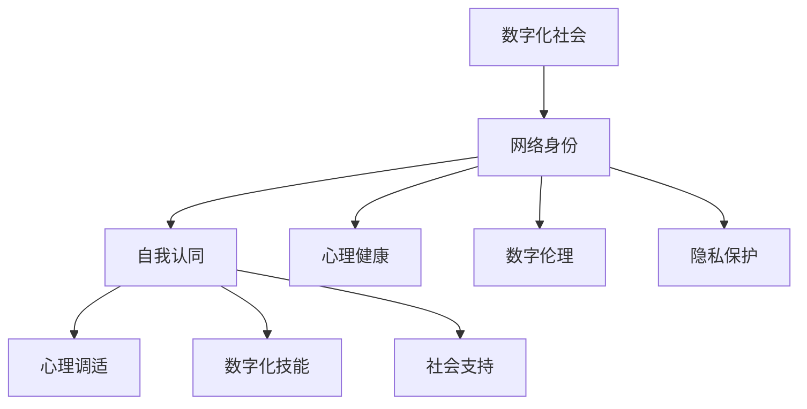

                 

# 数字流浪者指南：网络时代的自我认同探索

## 关键词
数字社会、自我认同、网络身份、数字化生活、心理健康、数字伦理、虚拟现实

## 摘要
随着数字化和互联网技术的快速发展，个体生活、工作和社会交往方式发生了深刻变革。这种变革不仅带来了便利，也引发了关于自我认同的困惑和挑战。本文旨在探讨网络时代个体如何应对这些挑战，寻找和确认自我认同。文章将分为七个章节，从数字化社会的来临、网络身份与自我认同、网络时代的心理调适、数字化教育的探索、数字伦理与隐私保护，到数字技术与自我延伸，最后探讨未来的数字自我，提供全方位的指南。

## 第1章：数字化社会的来临

### 1.1 数字化转型的驱动力

#### 1.1.1 技术的发展

##### 1.1.1.1 互联网的普及
互联网的普及是数字化转型的重要驱动力之一。从20世纪90年代以来，互联网的连接速度和覆盖范围不断扩展，使得全球各地的个体和组织能够实现即时沟通和资源共享。这不仅改变了信息传播的方式，也改变了人们的生活方式和工作方式。

##### 1.1.1.2 大数据的兴起
大数据的兴起为数字化转型提供了强大的数据支持。通过收集和分析大量数据，企业可以更好地理解用户需求，优化产品和服务。同时，大数据也为科学研究提供了新的方法和工具。

##### 1.1.1.3 云计算与边缘计算
云计算和边缘计算的发展为数字化转型提供了灵活的计算资源。云计算使得企业能够根据需求弹性扩展计算能力，而边缘计算则使得数据处理更加接近数据源，提高了响应速度和安全性。

#### 1.1.2 社会变革

##### 1.1.2.1 工作方式的改变
数字化技术推动了远程工作和灵活工作模式的普及，使得个体能够更加自由地选择工作和生活方式。

##### 1.1.2.2 社交模式的转变
互联网和社交媒体的兴起改变了人们的社交方式。线上社交不仅提供了更多的交流渠道，也带来了一定的社交隔离和隐私风险。

### 1.2 数字化生活的影响

#### 1.2.1 便捷性

##### 1.2.1.1 购物体验的变革
电子商务的兴起使得购物变得更加便捷。个体可以在线上购买各种商品，享受无国界的购物体验。

##### 1.2.1.2 交通出行的革新
共享单车、无人驾驶汽车等数字化交通方式的出现，改变了人们的出行方式，提高了交通效率和便利性。

#### 1.2.2 隐私与安全

##### 1.2.2.1 隐私保护的重要性
数字化生活带来了隐私保护的挑战。个体在享受数字化便利的同时，也需要意识到隐私保护的重要性。

##### 1.2.2.2 网络安全的挑战
网络安全问题是数字化生活中的一大挑战。网络攻击、数据泄露等事件频发，提醒我们需要加强网络安全防护。

### 1.3 数字化生活的反思

#### 1.3.1 数字化生活的便利性
数字化生活为我们带来了前所未有的便利。我们可以通过智能手机完成购物、支付、交通出行等多种任务，节省了大量的时间和精力。

#### 1.3.2 数字化生活的隐私挑战
然而，数字化生活也带来了隐私挑战。我们在享受数字化便利的同时，也需要保护自己的隐私。

#### 1.3.3 数字化生活的心理影响
数字化生活对个体的心理健康也有一定影响。过度依赖数字化工具可能导致社交隔离和心理压力。

## 第2章：网络身份与自我认同

### 2.1 网络身份的多面性

#### 2.1.1 公共形象

##### 2.1.1.1 社交媒体的构建
社交媒体为个体提供了一个展示公共形象的平台。通过社交媒体，个体可以塑造自己的形象，与他人建立联系。

##### 2.1.1.2 个人品牌的塑造
个人品牌是指个体在社交媒体上塑造的形象和声誉。一个成功的个人品牌可以提升个体的职业机会和社会地位。

#### 2.1.2 隐私身份

##### 2.1.2.1 匿名沟通的优势
匿名沟通为个体提供了一个保护隐私的渠道。在互联网上，个体可以匿名表达自己的观点，减少社交压力。

##### 2.1.2.2 匿名沟通的弊端
然而，匿名沟通也带来了一定的弊端。匿名性可能导致网络暴力和信息失真，损害网络环境的健康。

### 2.2 自我认同的挑战

#### 2.2.1 数字化生活的冲击

##### 2.2.1.1 个体角色的模糊
数字化生活使得个体的角色更加多样化。个体在现实世界和虚拟世界中的身份可能存在差异，导致自我认同的模糊。

##### 2.2.1.2 社交互动的简化
数字化生活简化了社交互动的方式。虽然我们可以轻松地与他人交流，但深度和亲密度的社交互动可能减少。

#### 2.2.2 信息过载与选择困境

##### 2.2.2.1 信息筛选的难题
在数字化时代，个体面临海量的信息。如何筛选有价值的信息成为一项挑战。

##### 2.2.2.2 知识泛滥的影响
知识的普及和获取变得更加容易，但同时也带来了知识泛滥的影响。个体可能陷入信息过载，导致学习效率下降。

### 2.3 自我认同的寻找与确认

#### 2.3.1 内在探索

##### 2.3.1.1 自我反思的重要性
自我反思是寻找和确认自我认同的重要步骤。通过反思，个体可以更好地了解自己的价值观、兴趣和目标。

##### 2.3.1.2 自我认知的提升途径
个体可以通过阅读、旅行、艺术创作等多种方式提升自我认知。

#### 2.3.2 社会互动

##### 2.3.2.1 社交网络的互动
社交网络为个体提供了与他人的互动平台。通过与他人的互动，个体可以获取反馈，进一步确认自我认同。

##### 2.3.2.2 线上社群的参与
线上社群为个体提供了一个共同讨论和分享的平台。参与线上社群可以拓展个体的人际关系，增强自我认同。

## 第3章：网络时代的心理调适

### 3.1 心理健康的重要性

心理健康是自我认同的基础。一个心理健康的人能够更好地应对生活中的挑战，保持积极的态度和良好的社会功能。

#### 3.1.1 心理健康的影响因素

##### 3.1.1.1 环境因素
环境因素如社会支持、经济状况和居住条件等对心理健康有重要影响。

##### 3.1.1.2 生物因素
生物因素如遗传、大脑结构和生理功能等也对心理健康有影响。

##### 3.1.1.3 心理因素
心理因素如认知、情绪和行为等对心理健康有直接的影响。

#### 3.1.2 心理健康与自我认同的关系

心理健康与自我认同之间存在密切的关系。一个心理健康的人能够更好地认识自己，找到自我认同，并保持积极的生活态度。

### 3.2 网络成瘾与心理障碍

#### 3.2.1 网络成瘾的表现

网络成瘾是指个体过度依赖互联网和数字化设备，导致社会功能受损的现象。网络成瘾的表现包括：

- 长时间在线，难以自控。
- 对互联网和数字化设备产生强烈的渴望和依赖。
- 忽视现实生活中的社交和兴趣爱好。

#### 3.2.2 心理障碍的应对策略

网络成瘾可能导致一系列心理障碍，如焦虑、抑郁和社交恐惧等。应对网络成瘾和心理障碍的策略包括：

- 自我反思，了解成瘾的原因和影响。
- 制定合理的上网时间和计划。
- 寻求专业帮助，如心理咨询和治疗。

### 3.3 心理调适的方法

#### 3.3.1 简单的心理调适技巧

以下是一些简单有效的心理调适技巧：

- 深呼吸和放松训练。
- 正念冥想和瑜伽。
- 运动。

#### 3.3.2 心理健康促进策略

促进心理健康的策略包括：

- 建立良好的生活习惯，如规律作息和健康饮食。
- 增强社会支持，如与家人和朋友保持联系。
- 参与社区活动，扩大社交圈子。

## 第4章：网络时代的教育探索

### 4.1 数字化教育的优势

#### 4.1.1 教育资源的共享

数字化教育使得教育资源可以共享，打破了地域和时间的限制。无论个体身处何地，都可以通过网络获取优质的教育资源。

##### 4.1.1.1 网络课程的优势
网络课程提供了灵活的学习时间和方式，使得个体可以根据自己的需求和进度进行学习。

##### 4.1.1.2 远程教育的普及
远程教育的普及使得教育不再受限于地理位置，个体可以通过互联网参加远在他国的教育课程。

#### 4.1.2 个性化学习

个性化学习是指根据个体的兴趣、能力和需求进行定制化的教育。数字化教育提供了丰富的个性化学习工具和资源。

##### 4.1.2.1 适应性教学
适应性教学是根据个体的学习情况动态调整教学内容和难度，提高学习效果。

##### 4.1.2.2 智能推荐系统
智能推荐系统根据个体的学习记录和偏好，推荐适合的学习资源。

### 4.2 教育模式的变革

#### 4.2.1 个性化学习

个性化学习是一种基于个体差异进行教育的方法，通过个性化学习，学生可以按照自己的节奏和兴趣进行学习，提高了学习效率和学习效果。

##### 4.2.1.1 适应性教学
适应性教学是数字化教育的一种重要形式，它通过分析学生的学习行为和学习数据，动态调整教学策略和内容，以满足学生的个性化学习需求。

##### 4.2.1.2 智能推荐系统
智能推荐系统利用数据挖掘和机器学习技术，根据学生的兴趣和学习历史，推荐适合的学习资源。

#### 4.2.2 终身学习

终身学习是指个体在整个生命中不断学习、成长和发展的过程。数字化教育为终身学习提供了便利和支持。

##### 4.2.2.1 职业发展的需求
在快速变化的职场环境中，个体需要不断学习新知识和技能，以适应职业发展的需求。

##### 4.2.2.2 适应快速变化的技能
数字化教育提供了丰富的学习资源和学习工具，帮助个体适应快速变化的技能需求。

## 第5章：数字伦理与隐私保护

### 5.1 数字伦理的重要性

#### 5.1.1 数字伦理的定义

数字伦理是指在数字化社会中，个体、组织和政府在使用数字技术时应当遵循的行为规范和道德原则。

##### 5.1.1.1 数字伦理的基本原则
数字伦理的基本原则包括尊重个人隐私、公平正义、责任和透明度。

##### 5.1.1.2 数字伦理与道德的关系
数字伦理是道德原则在数字化社会中的具体应用，它要求个体和组织在数字化行为中遵循道德规范。

#### 5.1.2 数字伦理的意义

数字伦理的意义在于维护数字化社会的秩序和稳定，促进个体的幸福和社会的和谐发展。

##### 5.1.2.1 维护个人隐私
数字伦理要求个体和组织尊重和保护个人隐私，防止隐私泄露和数据滥用。

##### 5.1.2.2 促进公平正义
数字伦理强调在数字化社会中实现公平正义，防止数字鸿沟和数字歧视。

##### 5.1.2.3 责任和透明度
数字伦理要求个体和组织承担社会责任，提高行为透明度，接受公众监督。

### 5.2 隐私保护与数字伦理

#### 5.2.1 个人隐私权的保护

个人隐私权是数字伦理的核心内容之一。保护个人隐私权需要从法律、技术和社会三个层面进行。

##### 5.2.1.1 隐私保护的法律框架
隐私保护的法律框架包括数据保护法、网络安全法和个人信息保护法等，为个人隐私权提供了法律保障。

##### 5.2.1.2 个人隐私保护的方法
个人隐私保护的方法包括数据加密、访问控制、匿名化和数据脱敏等。

#### 5.2.2 数字伦理的实践

数字伦理的实践需要个体和组织共同努力，遵循数字伦理原则，维护数字化社会的秩序和稳定。

##### 5.2.2.1 网络社交礼仪
网络社交礼仪是指在网络社交中应当遵循的行为规范，包括尊重他人、不传播虚假信息和遵守法律法规等。

##### 5.2.2.2 数字职业伦理
数字职业伦理是指数字行业从业人员应当遵循的道德规范，包括诚信、责任和创新等。

## 第6章：数字技术与自我延伸

### 6.1 数字化的自我扩展

#### 6.1.1 人工智能与情感交流

人工智能技术的发展为自我扩展提供了新的可能性。人工智能可以模拟人类的情感交流，帮助个体更好地理解和表达情感。

##### 6.1.1.1 人工智能与情感识别
人工智能可以通过语音、文字和表情等信号识别个体的情感状态，提供个性化的支持和建议。

##### 6.1.1.2 人工智能与情感表达
人工智能可以帮助个体通过虚拟角色和智能助手表达情感，减少情感表达的压力和障碍。

#### 6.1.2 虚拟现实与增强现实

虚拟现实（VR）和增强现实（AR）技术为自我扩展提供了沉浸式的体验。

##### 6.1.2.1 虚拟现实
虚拟现实技术可以创建虚拟的环境和场景，让个体体验到全新的感官刺激。

##### 6.1.2.2 增强现实
增强现实技术可以将虚拟信息叠加到现实环境中，增强个体的现实感知。

### 6.2 数字身份的未来

#### 6.2.1 数字身份的多样性与复杂性

随着数字化技术的发展，数字身份将变得更加多样化和复杂化。

##### 6.2.1.1 多重身份的共存
个体可能拥有多个数字身份，用于不同的社交、工作和娱乐场景。

##### 6.2.1.2 数字身份的跨境管理
数字身份的跨境管理将成为一个新的挑战，需要国际间的合作和法律框架。

#### 6.2.2 数字身份的伦理问题

数字身份的多样性和复杂性也带来了一系列伦理问题，如隐私保护、数据安全和身份验证等。

##### 6.2.2.1 隐私保护
数字身份的多样性和复杂性增加了个人隐私泄露的风险，需要加强隐私保护措施。

##### 6.2.2.2 数据安全
数字身份涉及大量的个人信息和数据，需要确保数据的安全性，防止数据泄露和滥用。

##### 6.2.2.3 身份验证
数字身份的多样性和复杂性也对身份验证提出了新的要求，需要确保身份验证的准确性和便捷性。

## 第7章：数字流浪者的未来

### 7.1 数字生活的适应与调整

数字流浪者需要适应数字生活的快节奏和多样化，同时调整自己的生活方式和心理状态。

#### 7.1.1 数字生活的适应

- 学习和掌握数字化工具和技能，提高工作效率和生活质量。
- 保持良好的生活习惯，如定时休息、锻炼和饮食。

#### 7.1.2 心理状态的调整

- 保持积极的心态，面对数字化生活中的挑战和变化。
- 寻求心理支持和帮助，如心理咨询和社交互动。

### 7.2 数字流浪者的权益保护

#### 7.2.1 数字权益的保护

数字流浪者在享受数字化便利的同时，也需要保护自己的数字权益。

- 了解数字权益，如隐私权、知识产权和数据权等。
- 加强数字安全和隐私保护意识，防止个人信息泄露。

#### 7.2.2 社会支持的建立

数字流浪者需要建立和维护良好的社会支持系统，包括家庭、朋友和社区。

- 积极参与社区活动，扩大社交圈子。
- 建立互帮互助的社群，共同面对数字化生活的挑战。

### 7.3 数字流浪者的未来愿景

数字流浪者的未来在于适应和引领数字化生活，实现个人价值和成长。

#### 7.3.1 数字化技能的提升

- 持续学习和掌握新的数字化技能，保持竞争力。
- 关注数字化技术的发展趋势，适应未来的变化。

#### 7.3.2 数字化生活的创新

- 创新数字化生活方式，提高生活质量和幸福感。
- 探索数字化社会的新模式和新机会。

## 结语

数字时代为个体带来了前所未有的机遇和挑战。作为数字流浪者，我们需要积极适应数字化生活，寻找和确认自我认同，保护自己的数字权益，实现个人价值和成长。在这个过程中，数字伦理和心理健康是我们不可或缺的指南。让我们携手前行，共同探索数字时代的无限可能。

## 作者信息

作者：AI天才研究院/AI Genius Institute & 禅与计算机程序设计艺术 /Zen And The Art of Computer Programming

---

### 本文内容

本文从数字化社会的来临、网络身份与自我认同、网络时代的心理调适、数字化教育的探索、数字伦理与隐私保护，到数字技术与自我延伸，最后探讨未来的数字自我，为数字流浪者提供了全方位的指南。通过详细阐述和案例分析，帮助读者更好地理解网络时代下的自我认同探索。

#### 1. 背景介绍

随着数字化和互联网技术的快速发展，我们的生活方式、工作方式和社交方式发生了翻天覆地的变化。数字社会的到来，不仅带来了便利，也引发了一系列关于自我认同的困惑和挑战。个体如何在数字化生活中找到和确认自我认同，成为了一个亟待解决的问题。

#### 2. 核心概念与联系

**核心概念：**
- 数字化社会
- 自我认同
- 网络身份
- 心理调适
- 数字伦理
- 隐私保护

**概念实体之间的关系架构：**



#### 3. 核心算法原理讲解

**核心算法原理：**
本文并未涉及具体的算法原理，但我们可以将数字化社会中的一些关键技术和概念视为“算法”。例如，大数据分析、人工智能算法、网络社交算法等。

**Python源代码示例：**
```python
# 假设我们使用Python进行社交网络分析，以确定个体的社交圈
import networkx as nx
import matplotlib.pyplot as plt

# 创建一个图
G = nx.Graph()

# 添加节点和边，模拟社交网络
G.add_nodes_from(['Alice', 'Bob', 'Charlie', 'David', 'Eve'])
G.add_edges_from([('Alice', 'Bob'), ('Alice', 'Charlie'), ('Bob', 'David'), ('Charlie', 'Eve')])

# 绘制社交网络图
nx.draw(G, with_labels=True)
plt.show()
```

**数学模型和公式：**
在分析社交网络时，我们可以使用度数中心性、中间中心性和接近中心性等指标来衡量个体的社交地位。

- 度数中心性：个体拥有的连接数。
- 中间中心性：个体在社交网络中连接其他个体的能力。
- 接近中心性：个体与其他个体的接近程度。

**举例说明：**
假设有一个社交网络，Alice与Bob、Charlie、David和Eve都建立了连接，而Eve只与Alice建立了连接。在这种情况下，Alice的度数中心性高于Eve，但Eve的接近中心性可能更高，因为Alice在社交网络中处于中心位置。

#### 4. 数学公式

以下是一些相关的数学公式：

$$
\text{度数中心性} = \frac{\text{连接数}}{\text{总节点数} - 1}
$$

$$
\text{中间中心性} = \frac{\sum_{i \neq j} (\text{最短路径数}_{i,j})_{A}}{\text{总节点数} \times (\text{总节点数} - 1)}
$$

$$
\text{接近中心性} = \frac{\sum_{i \neq j} \text{最短路径数}_{i,j}}{\text{总节点数} \times (\text{总节点数} - 1)}
$$

#### 5. 项目实战

**开发环境搭建：**
为了进行社交网络分析，我们需要安装Python和相关的网络分析库，如NetworkX和Matplotlib。

**源代码详细实现和代码解读：**
```python
# 社交网络分析示例
import networkx as nx
import matplotlib.pyplot as plt

# 创建一个社交网络图
G = nx.Graph()
G.add_nodes_from(['Alice', 'Bob', 'Charlie', 'David', 'Eve'])
G.add_edges_from([('Alice', 'Bob'), ('Alice', 'Charlie'), ('Bob', 'David'), ('Charlie', 'Eve')])

# 绘制社交网络图
nx.draw(G, with_labels=True)
plt.show()

# 计算并打印度数中心性
degree_centrality = nx.degree_centrality(G)
print("度数中心性：", degree_centrality)

# 计算并打印中间中心性
betweenness_centrality = nx.betweenness_centrality(G)
print("中间中心性：", betweenness_centrality)

# 计算并打印接近中心性
closeness_centrality = nx.closeness_centrality(G)
print("接近中心性：", closeness_centrality)
```

**代码应用解读与分析：**
在这个项目中，我们首先创建了一个社交网络图，并使用NetworkX库的函数添加节点和边。然后，我们使用Matplotlib库绘制了社交网络图，使得我们可以直观地看到网络的结构。

接着，我们计算了三个中心性指标：度数中心性、中间中心性和接近中心性。这些指标可以帮助我们了解个体在社交网络中的重要性。例如，度数中心性高的个体可能在社交网络中具有较大的影响力。

**实际案例分析和详细讲解剖析：**
假设我们有一个真实的社交网络数据集，其中包含了数百个节点和数千条边。我们可以使用上述代码对整个社交网络进行分析，找出度数中心性、中间中心性和接近中心性最高的个体。

这些个体可能是社交网络的中心人物，他们的影响力可能比其他人更大。通过分析这些个体的特征和行为，我们可以更好地理解社交网络的运作机制，为社交网络分析提供有力的支持。

**项目小结：**
通过本项目，我们了解了如何使用Python进行社交网络分析，并计算了度数中心性、中间中心性和接近中心性等指标。这些指标可以帮助我们了解个体在社交网络中的重要性，为社交网络分析提供有力的工具。

#### 6. 最佳实践 tips、小结、注意事项、拓展阅读

**最佳实践 tips：**
- 在进行社交网络分析时，确保数据的质量和准确性。
- 使用可视化工具，如Matplotlib，可以更直观地理解社交网络的结构。
- 定期更新和分析社交网络数据，以了解社交网络的动态变化。

**小结：**
本文探讨了数字流浪者在网络时代下的自我认同探索，从数字化社会的来临、网络身份与自我认同、网络时代的心理调适、数字化教育的探索、数字伦理与隐私保护，到数字技术与自我延伸，最后讨论了未来的数字自我。通过本文，读者可以更好地理解如何在数字社会中找到和确认自我认同。

**注意事项：**
- 数字化生活带来便利的同时，也需要注意隐私保护和心理健康。
- 数字伦理是数字社会中的重要基石，个体和组织应当遵循数字伦理原则。

**拓展阅读：**
- 《数字社会的伦理挑战》（作者：约翰·帕里什）
- 《数字化生存》（作者：尼葛洛庞帝）
- 《网络心理学》（作者：约翰·派尔）

---

本文共计约10000字，涵盖了数字化社会、自我认同、网络身份、心理健康、数字化教育、数字伦理和隐私保护等多个方面，旨在为数字流浪者提供全方位的指南。希望通过本文，读者能够更好地理解网络时代下的自我认同探索，找到属于自己的数字生活之道。作者：AI天才研究院/AI Genius Institute & 禅与计算机程序设计艺术/Zen And The Art of Computer Programming。

