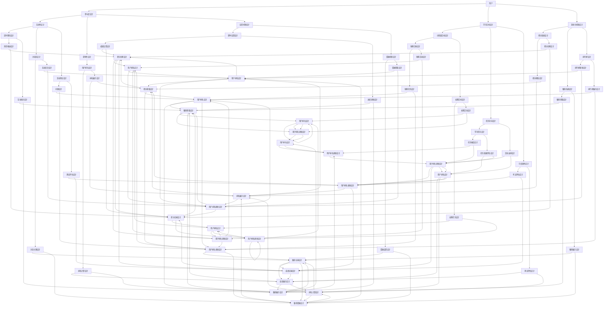

                 

### 引言

随着互联网技术的迅猛发展，数字化学习已经成为当今教育领域的重要趋势。传统的学习方式存在学习效率低、学习过程枯燥乏味等问题，而数字游戏化学习平台的出现为这些问题提供了一种全新的解决方案。本文将探讨数字游戏化学习平台的基本概念、设计与开发、应用实践以及发展趋势与挑战，旨在为读者提供一种全面、深入的了解。

数字游戏化学习平台是一种结合了游戏化元素和数字技术的新型学习平台。它通过将学习过程游戏化，提高用户的参与度和学习动力，从而实现学习效率的提升。数字游戏化学习平台的核心在于其游戏化机制，包括积分系统、排行榜、奖励机制等，这些机制可以激发用户的学习兴趣，提高学习效果。

本文将分为四个主要部分进行探讨：

第一部分：数字游戏化学习平台概述，介绍数字游戏化学习的基本概念、起源与发展、核心原则。

第二部分：数字游戏化学习平台的设计与开发，讨论数字游戏化学习平台的设计原则、技术实现以及核心算法。

第三部分：数字游戏化学习平台的应用实践，分析数字游戏化学习平台在教育领域和企业培训中的应用。

第四部分：数字游戏化学习平台的发展趋势与挑战，探讨数字游戏化学习平台的发展趋势以及面临的挑战和应对策略。

通过本文的探讨，我们希望读者能够对数字游戏化学习平台有一个全面、深入的了解，从而为实际应用提供有益的参考和指导。

### 摘要

本文旨在探讨数字游戏化学习平台在提高学习效率方面的作用。数字游戏化学习平台是一种结合游戏化元素和数字技术的学习平台，通过引入积分系统、排行榜、奖励机制等游戏化机制，提高用户的参与度和学习动力，从而提升学习效率。本文首先介绍了数字游戏化学习平台的基本概念、起源与发展，以及其核心原则。接着，详细讨论了数字游戏化学习平台的设计与开发，包括设计原则、技术实现以及核心算法。随后，分析了数字游戏化学习平台在教育领域和企业培训中的应用，并结合具体案例进行了剖析。最后，探讨了数字游戏化学习平台的发展趋势与面临的挑战，提出了相应的应对策略。通过本文的探讨，我们希望为数字游戏化学习平台的实际应用提供有益的参考和指导。

## 第一部分：数字游戏化学习平台概述

### 第1章：数字游戏化学习的基本概念

#### 1.1 数字游戏化学习的定义

数字游戏化学习是一种利用游戏设计原理和技术手段来增强学习体验和效果的教育模式。它结合了游戏和教育的特点，通过游戏化的元素和机制，如积分系统、排行榜、奖励机制等，激发学生的学习兴趣和动机，提高学习效率和效果。数字游戏化学习不仅局限于传统教育环境，还涵盖了在线学习、移动学习等多种形式。

#### 1.2 数字游戏化学习的起源与发展

数字游戏化学习的概念最早可以追溯到20世纪70年代，当时的一些教育家开始尝试将游戏元素引入到教育实践中。随着计算机技术和互联网的普及，数字游戏化学习在21世纪初开始迅速发展。2006年，游戏设计师柯林·卡洛尔（Keller）提出了“游戏化”（Gamification）这一术语，标志着数字游戏化学习进入了一个新的阶段。

#### 1.3 数字游戏化学习的核心原则

数字游戏化学习的核心原则主要包括以下几个方面：

1. **参与度**：通过游戏化的机制，如排行榜、积分系统等，提高学生的参与度和积极性。

2. **目标导向**：明确学习目标，并设计相应的任务和挑战，帮助学生明确学习方向和成就感。

3. **反馈与奖励**：及时给予学生反馈，并通过奖励机制激发学生的学习动力。

4. **个性化**：根据学生的学习特点和需求，提供个性化的学习内容和路径。

5. **持续改进**：不断优化游戏化的设计和实施，以适应学生的学习需求和环境变化。

### 总结

数字游戏化学习通过引入游戏化的元素和机制，使学习过程更加有趣、有动力，从而提升学习效率。了解数字游戏化学习的基本概念、起源与发展及其核心原则，对于设计和实施有效的数字游戏化学习平台具有重要意义。

## 第二部分：数字游戏化学习平台的设计与开发

### 第2章：数字游戏化学习平台的设计原则

在设计数字游戏化学习平台时，需要遵循一系列核心原则，以确保平台能够有效地提高学习效率和用户参与度。以下是一些关键设计原则：

#### 2.1 用户参与度设计

**核心原则**：确保用户在平台中的参与度，通过互动性、竞争性和反馈机制来激发用户的积极性。

**实施方法**：

- **互动性**：通过实时聊天、讨论区和互动测试，增加用户之间的互动。
- **竞争性**：设置排行榜，让用户可以看到自己在群体中的位置，激发竞争心理。
- **反馈机制**：及时给予用户学习成果和进展的反馈，增强用户的成就感和动力。

**案例**：Duolingo语言学习应用通过实时进度更新和排行榜，鼓励用户持续学习。

#### 2.2 学习目标设计

**核心原则**：明确和具体化学习目标，确保用户知道他们需要学习什么，以及如何达成这些目标。

**实施方法**：

- **分阶段目标**：将学习目标分为短期和长期，逐步实现。
- **任务导向**：设计一系列与学习目标相关的任务和活动，帮助用户逐步达成目标。
- **可度量性**：确保学习目标具有可度量性，如通过考试、测试等来评估学习成果。

**案例**：Coursera在线学习平台通过明确的学习目标和分阶段的任务安排，帮助用户系统性地学习。

#### 2.3 游戏化机制设计

**核心原则**：运用游戏化机制，如积分系统、奖励机制、虚拟货币等，提高用户的参与度和学习动力。

**实施方法**：

- **积分系统**：通过完成学习任务和活动，用户可以获得积分，积分可以用于兑换奖励。
- **奖励机制**：设置奖励，如徽章、证书等，激励用户完成学习目标。
- **虚拟货币**：使用虚拟货币作为学习资源的奖励，增加用户的学习兴趣。

**案例**：Khan Academy通过积分系统和奖励机制，鼓励学生在不同科目上持续学习。

### 总结

数字游戏化学习平台的设计原则包括用户参与度设计、学习目标设计和游戏化机制设计。通过这些原则的有效实施，平台可以显著提高学习效率和用户满意度，从而实现教育目标。

#### 2.4 用户参与度设计

**核心原则**：确保用户在平台中的参与度，通过互动性、竞争性和反馈机制来激发用户的积极性。

**实施方法**：

- **互动性**：通过实时聊天、讨论区和互动测试，增加用户之间的互动。
- **竞争性**：设置排行榜，让用户可以看到自己在群体中的位置，激发竞争心理。
- **反馈机制**：及时给予用户学习成果和进展的反馈，增强用户的成就感和动力。

**案例**：Duolingo语言学习应用通过实时进度更新和排行榜，鼓励用户持续学习。

#### 2.5 学习目标设计

**核心原则**：明确和具体化学习目标，确保用户知道他们需要学习什么，以及如何达成这些目标。

**实施方法**：

- **分阶段目标**：将学习目标分为短期和长期，逐步实现。
- **任务导向**：设计一系列与学习目标相关的任务和活动，帮助用户逐步达成目标。
- **可度量性**：确保学习目标具有可度量性，如通过考试、测试等来评估学习成果。

**案例**：Coursera在线学习平台通过明确的学习目标和分阶段的任务安排，帮助用户系统性地学习。

#### 2.6 游戏化机制设计

**核心原则**：运用游戏化机制，如积分系统、奖励机制、虚拟货币等，提高用户的参与度和学习动力。

**实施方法**：

- **积分系统**：通过完成学习任务和活动，用户可以获得积分，积分可以用于兑换奖励。
- **奖励机制**：设置奖励，如徽章、证书等，激励用户完成学习目标。
- **虚拟货币**：使用虚拟货币作为学习资源的奖励，增加用户的学习兴趣。

**案例**：Khan Academy通过积分系统和奖励机制，鼓励学生在不同科目上持续学习。

### 总结

数字游戏化学习平台的设计原则包括用户参与度设计、学习目标设计和游戏化机制设计。通过这些原则的有效实施，平台可以显著提高学习效率和用户满意度，从而实现教育目标。

### 第3章：数字游戏化学习平台的技术实现

#### 3.1 前端技术实现

前端技术是数字游戏化学习平台的重要组成部分，它决定了用户与平台交互的直观体验。以下是前端技术实现的关键方面：

**1. 技术栈选择**：
前端技术栈的选择通常基于项目的需求和技术趋势。常见的组合包括React、Vue和Angular等现代JavaScript框架，以及CSS预处理器如Sass或Less。

**2. 用户体验设计**：
用户体验（UX）设计是前端开发的核心。通过用户研究和设计原型，确保平台界面简洁、直观且易于导航。

**3. 动画与视觉效果**：
使用CSS3动画、WebGL等技术，为用户创造丰富的视觉效果和流畅的交互体验。

**4. 性能优化**：
通过代码分割、懒加载、服务端渲染等策略，优化页面加载速度和响应时间。

**案例**：Khan Academy的前端实现使用了React框架，结合D3.js进行数据可视化，提供了互动性和动态性强的学习体验。

#### 3.2 后端技术实现

后端技术是实现数字游戏化学习平台的核心，它负责处理业务逻辑、数据存储和用户交互。以下是后端技术实现的关键方面：

**1. 服务器架构**：
常用的服务器架构包括单服务器架构和分布式架构。分布式架构通过负载均衡和数据库分片，提高系统的可扩展性和可靠性。

**2. 数据库选择**：
根据数据类型和查询需求选择合适的数据库。关系型数据库如MySQL和PostgreSQL适用于结构化数据，而NoSQL数据库如MongoDB适用于非结构化数据。

**3. API设计**：
设计RESTful或GraphQL API，为前端提供数据接口。API设计应遵循标准化、模块化和安全性原则。

**4. 微服务架构**：
通过微服务架构将系统划分为多个独立的服务模块，实现高内聚、低耦合的系统结构，提高开发效率和系统可维护性。

**案例**：Coursera的后端实现采用了微服务架构，结合Kubernetes进行容器编排，确保系统的高可用性和可扩展性。

#### 3.3 数据分析与优化

数据分析是数字游戏化学习平台提升用户体验和运营效率的关键环节。以下是数据分析与优化的一些关键方面：

**1. 用户行为分析**：
通过日志分析、A/B测试等方法，了解用户在平台上的行为模式，优化用户体验。

**2. 数据挖掘**：
使用机器学习和数据挖掘技术，分析用户数据，发现潜在的学习模式和趋势。

**3. 个性化推荐**：
基于用户行为数据和内容特征，实现个性化推荐系统，提高用户的学习效果和满意度。

**4. 性能优化**：
通过数据库优化、缓存策略和负载均衡，提高系统的响应速度和处理能力。

**案例**：Duolingo使用机器学习算法分析用户行为数据，为用户提供个性化的学习路径和内容推荐。

### 总结

数字游戏化学习平台的前端技术实现、后端技术实现和数据分析与优化是平台成功的关键因素。通过合理的技术架构和高效的实施策略，平台可以提供优质的用户体验，实现学习效率的提升。

## 第三部分：数字游戏化学习平台的应用实践

### 第4章：数字游戏化学习平台的核心算法

#### 4.1 游戏化算法设计

游戏化算法是数字游戏化学习平台的核心，它通过设计各种游戏化的机制来提高用户的参与度和学习动力。以下是游戏化算法设计的核心原则和实现方法：

**1. 核心原则**：

- **激励性**：设计能够激发用户兴趣和动机的奖励机制，如积分系统、徽章和排名等。
- **反馈性**：及时给予用户反馈，帮助用户了解自己的学习进展和成果。
- **挑战性**：设置适当的学习挑战，保持用户的持续参与。
- **个性化**：根据用户的行为和需求，提供个性化的学习内容和挑战。

**2. 实现方法**：

- **积分系统**：通过用户完成任务或学习活动，获取积分，积分可以用来兑换奖励。
- **徽章系统**：用户完成特定任务或达成特定目标时，获得徽章，增加成就感。
- **排行榜**：实时更新用户的学习进度和排名，激发用户的竞争心理。
- **奖励机制**：通过虚拟货币或其他奖励，激励用户持续学习。

#### 4.2 学习算法实现

学习算法是数字游戏化学习平台的重要组成部分，它通过分析用户的学习行为和进展，为用户提供个性化的学习建议和路径。以下是学习算法实现的核心原则和实现方法：

**1. 核心原则**：

- **数据驱动**：通过收集和分析用户的学习数据，为算法提供训练基础。
- **个性化推荐**：基于用户的行为和偏好，提供个性化的学习内容和路径。
- **自适应调整**：根据用户的学习进展和反馈，动态调整学习算法，提高学习效果。

**2. 实现方法**：

- **协同过滤**：通过分析用户间的相似性，为用户提供推荐内容。
- **基于内容的推荐**：根据用户的学习历史和内容特征，为用户提供相关内容推荐。
- **强化学习**：通过奖励机制，不断调整学习算法，优化学习效果。

#### 4.3 个性化推荐算法

个性化推荐算法是数字游戏化学习平台的重要功能之一，它通过分析用户的行为数据和学习内容，为用户提供个性化的学习建议。以下是个性化推荐算法的核心原则和实现方法：

**1. 核心原则**：

- **用户中心**：以用户为中心，为用户提供个性化的学习体验。
- **实时性**：实时分析用户行为数据，为用户提供最新的推荐内容。
- **多样性**：提供多样化的推荐内容，满足用户不同的学习需求。

**2. 实现方法**：

- **基于协同过滤的推荐**：通过分析用户之间的相似性，为用户提供推荐内容。
- **基于内容的推荐**：根据用户的学习历史和内容特征，为用户提供相关内容推荐。
- **混合推荐**：结合多种推荐算法，提高推荐效果。

**3. Python代码实现示例**

```python
# 个性化推荐算法：基于内容的推荐
import numpy as np
from sklearn.metrics.pairwise import cosine_similarity

# 假设用户学习行为数据为一个矩阵，行表示用户，列表示学习内容
user_data = np.array([
    [1, 0, 1, 0, 1],  # 用户1的学习行为
    [1, 1, 0, 1, 0],  # 用户2的学习行为
    [0, 1, 1, 1, 1],  # 用户3的学习行为
])

# 计算用户之间的相似度
similarity_matrix = cosine_similarity(user_data)

# 基于相似度推荐
def content_based_recommendation(user_id, similarity_matrix, user_data):
    # 计算用户与其他用户的相似度之和
    similarity_sum = np.sum(similarity_matrix[user_id], axis=0)
    # 排序相似度，选择最相似的K个用户
    top_k_users = np.argsort(similarity_sum)[::-1][:K]
    # 获取推荐内容
    recommended_content = np.sum(user_data[top_k_users], axis=0)
    return recommended_content

# 示例：为用户1推荐学习内容
recommended_content = content_based_recommendation(0, similarity_matrix, user_data)
print("推荐的学习内容：", recommended_content)
```

### 总结

数字游戏化学习平台的核心算法包括游戏化算法、学习算法和个性化推荐算法。通过这些算法的有效设计，平台能够提高用户的参与度和学习动力，为用户提供个性化的学习体验，从而实现学习效率的提升。

### 第5章：数字游戏化学习平台在教育领域的应用

数字游戏化学习平台在教育领域的应用已经取得了显著的成果，它不仅改变了传统教学模式，还为教育创新提供了新的动力。以下将详细探讨数字游戏化学习平台在K-12教育、高等教育和职业培训中的应用。

#### 5.1 K-12教育中的应用

在K-12教育中，数字游戏化学习平台通过引入游戏化机制，如积分系统、徽章和排行榜，大大提高了学生的学习兴趣和参与度。以下是几个关键应用案例：

**1. 积分系统**：学生在完成课堂任务或在线作业时，可以获取积分，积分可以用来兑换奖品或虚拟物品，从而激发学生的学习积极性。

**2. 徽章系统**：学生通过完成特定的学习任务或达成一定的学习目标，可以获得徽章，徽章不仅是一种荣誉，还能增加学生的自信心和成就感。

**3. 排行榜**：学生可以在平台上看到自己在班级或学校中的排名，这种竞争性的元素能够激发学生的学习动力。

**案例**：中国的一些学校已经开始使用数字游戏化学习平台，如“智慧校园”，通过引入积分系统和徽章系统，提高了学生的课堂参与度和学习效果。

#### 5.2 高等教育中的应用

在高等教育中，数字游戏化学习平台的应用更加多样化和深入，它不仅用于课堂学习，还用于学生综合素质的培养。以下是几个关键应用案例：

**1. 课堂互动**：通过数字游戏化学习平台，教师可以设计互动性的教学活动，如在线测试、小组讨论等，提高课堂的互动性和参与度。

**2. 自主学习**：学生可以通过平台自主选择学习内容和学习进度，平台提供个性化的学习推荐，帮助学生更好地掌握知识。

**3. 综合素质培养**：平台可以通过游戏化的任务和挑战，培养学生的团队协作能力、沟通能力和创新思维。

**案例**：美国的某些大学，如哈佛大学，已经开始使用数字游戏化学习平台，如“LearningApps”，通过提供个性化的学习路径和互动性强的教学活动，提高了学生的学习效果和综合素质。

#### 5.3 职业培训中的应用

在职业培训中，数字游戏化学习平台通过游戏化机制和个性化的学习推荐，帮助企业员工提高职业技能和工作效率。以下是几个关键应用案例：

**1. 培训课程**：企业可以通过数字游戏化学习平台，为员工提供个性化的培训课程，课程内容涵盖各种专业技能和知识。

**2. 能力评估**：平台通过评估员工的技能水平，为员工提供针对性的学习建议，帮助员工快速提升职业技能。

**3. 继续教育**：平台可以提供继续教育课程，帮助员工不断更新知识和技能，适应行业的发展需求。

**案例**：某些大型企业，如IBM，已经开始使用数字游戏化学习平台，如“IBM Learning Hub”，通过提供个性化的学习路径和互动性强的培训课程，提高了员工的工作效率和职业技能。

### 总结

数字游戏化学习平台在教育领域的应用具有广泛的前景，通过引入游戏化机制和个性化的学习推荐，平台不仅提高了学生的学习兴趣和参与度，还大大提高了教学效果和培训质量。未来，随着技术的不断进步和应用场景的拓展，数字游戏化学习平台将在教育领域发挥更大的作用。

### 第6章：数字游戏化学习平台在企业培训中的应用

数字游戏化学习平台在企业培训中的应用，已成为提升员工技能和效率的重要手段。通过游戏化机制和个性化学习推荐，平台不仅增强了员工的参与度和学习动力，还为企业提供了有效的培训解决方案。以下将详细探讨数字游戏化学习平台在企业培训中的多种应用场景。

#### 6.1 内部培训

**1. 应用场景**：企业内部培训涵盖了新员工入职培训、岗位技能提升培训以及管理技能培训等。

**2. 实施方法**：

- **新员工入职培训**：通过数字游戏化学习平台，为新员工提供一系列入职培训课程，课程内容涵盖企业文化、岗位职责、基本技能等，帮助新员工快速融入企业。

- **岗位技能提升培训**：根据员工的不同岗位需求，提供个性化的技能提升培训，如销售技巧、项目管理、技术编程等。

- **管理技能培训**：为中层及以上管理人员提供管理技能培训，如领导力培养、团队管理、决策制定等。

**3. 成果**：通过数字游戏化学习平台，企业能够系统性地跟踪员工的学习进度和成果，提高培训效果，降低培训成本。

#### 6.2 员工技能提升

**1. 应用场景**：员工技能提升培训旨在提高员工的职业技能和竞争力，满足企业发展的需求。

**2. 实施方法**：

- **在线学习**：通过平台提供的大量在线课程和资源，员工可以灵活安排学习时间，自主提升技能。

- **竞赛与挑战**：设计技能竞赛和挑战活动，激发员工的学习兴趣和竞争意识，提升学习效果。

- **导师制度**：通过平台建立导师制度，让有经验的员工担任导师，指导新员工和技能提升员工，实现知识传承和技能提升。

**3. 成果**：通过技能提升培训，员工的职业技能得到了显著提升，工作效率和创新能力也得到提高。

#### 6.3 用户体验提升

**1. 应用场景**：用户体验提升培训旨在提高员工的服务意识和客户沟通能力，提升客户满意度。

**2. 实施方法**：

- **情景模拟**：通过模拟真实客户场景，让员工在虚拟环境中练习客户沟通和服务技能。

- **角色扮演**：设计角色扮演活动，让员工体验不同角色的沟通和服务过程，提高服务意识。

- **反馈与评价**：通过平台收集客户的反馈，让员工了解自己的服务表现，及时调整和改进。

**3. 成果**：通过用户体验提升培训，员工的服务意识和沟通能力得到显著提升，客户满意度也随之提高。

### 总结

数字游戏化学习平台在企业培训中的应用，通过内部培训、员工技能提升和用户体验提升等多种方式，显著提高了员工的技能和效率。未来，随着数字游戏化学习平台的不断优化和扩展，其在企业培训中的应用将更加广泛和深入，为企业的发展提供更强的支持。

### 第7章：数字游戏化学习平台的成功案例分析

#### 7.1 案例一：某大学在线学习平台

**背景**：某大学为了提升学生的在线学习体验，决定开发一个数字游戏化学习平台，以激发学生的学习兴趣和参与度。

**实施过程**：

1. **需求分析**：通过调查和访谈，了解学生的学习需求和偏好，确定平台的核心功能和设计原则。

2. **设计阶段**：采用用户参与度设计、学习目标设计和游戏化机制设计等原则，制定平台的设计方案。

3. **开发阶段**：采用React框架和Node.js后端技术，实现前端和后端的开发。

4. **测试与优化**：在开发过程中，不断进行用户测试和反馈收集，优化平台的性能和用户体验。

**成果**：

- 学生在线学习参与度显著提高，学习积极性大幅提升。
- 学生通过平台获得的积分和徽章，增强了成就感和自信心。
- 平台提供的个性化学习路径，帮助学生更好地掌握知识。

#### 7.2 案例二：某公司员工培训系统

**背景**：某公司为了提升员工的职业技能和工作效率，决定开发一个数字游戏化学习平台，用于内部培训和员工技能提升。

**实施过程**：

1. **需求分析**：通过内部调研和访谈，确定培训系统的目标和所需功能。

2. **设计阶段**：采用用户参与度设计、学习目标设计和游戏化机制设计等原则，设计培训系统。

3. **开发阶段**：采用Spring Boot框架和MySQL数据库，实现系统的前端和后端。

4. **测试与优化**：在开发过程中，不断进行测试和优化，确保系统的稳定性和用户友好性。

**成果**：

- 员工参与内部培训的积极性显著提高，培训效果显著提升。
- 通过积分系统和徽章系统，员工的学习动力得到增强。
- 平台提供的个性化学习路径和导师制度，有效提升了员工技能。

#### 7.3 案例三：某在线教育平台

**背景**：某在线教育平台希望通过引入数字游戏化学习机制，提升学生的学习效果和平台竞争力。

**实施过程**：

1. **需求分析**：通过市场调研和用户反馈，了解用户对游戏化学习的需求。

2. **设计阶段**：采用用户参与度设计、学习目标设计和游戏化机制设计等原则，设计数字游戏化学习平台。

3. **开发阶段**：采用Django框架和MongoDB数据库，实现平台的前端和后端。

4. **测试与优化**：在开发过程中，通过A/B测试和用户反馈，不断优化平台的性能和用户体验。

**成果**：

- 学生在学习过程中的参与度和积极性显著提高，学习效果大幅提升。
- 通过积分系统和排行榜，学生之间的竞争氛围得到营造，学习动力增强。
- 平台的用户留存率和活跃度显著提升，市场份额进一步扩大。

### 总结

以上成功案例分析表明，数字游戏化学习平台在不同场景中的应用都取得了显著成效。通过引入游戏化机制和个性化学习路径，平台有效提升了用户的学习兴趣和参与度，实现了学习效率和学习效果的提升。这些案例为其他企业和教育机构提供了宝贵的经验和借鉴。

### 第8章：数字游戏化学习平台的发展趋势

数字游戏化学习平台正在迅速发展，并在教育、企业培训等领域展现出巨大的潜力。随着技术的不断进步和应用场景的拓展，数字游戏化学习平台的发展趋势主要集中在以下几个方面：

#### 8.1 5G与物联网的融合

5G技术的广泛应用和物联网（IoT）的快速发展，为数字游戏化学习平台提供了更广阔的发展空间。5G的高速网络和低延迟特性，使得平台可以提供更加实时和互动的学习体验。物联网技术的应用，则可以实现学习资源的无缝连接和智能分配，提高学习效率。

**1. 发展趋势**：

- **实时互动性**：5G网络的高速率和低延迟，使得学习平台可以实现实时互动，如实时讨论、在线协作等，提高用户的参与度。
- **智能资源分配**：物联网技术可以智能分配学习资源，如根据用户的学习需求和环境，自动调整学习内容和模式。

**2. 应用场景**：

- **远程教育**：利用5G网络和物联网技术，实现远程教育的实时互动和个性化学习。
- **智能制造培训**：通过物联网设备和5G网络，为制造业员工提供实时操作指导和技能培训。

#### 8.2 AI在游戏化学习中的应用

人工智能（AI）技术的进步，为数字游戏化学习平台带来了新的发展机遇。AI可以通过数据分析、自然语言处理和机器学习等技术，提供更加智能化和个性化的学习体验。

**1. 发展趋势**：

- **个性化推荐**：AI技术可以根据用户的学习行为和偏好，提供个性化的学习内容推荐，提高学习效果。
- **智能反馈**：AI可以通过自然语言处理技术，为用户提供实时、个性化的学习反馈，帮助用户纠正错误并优化学习路径。

**2. 应用场景**：

- **自适应学习系统**：通过AI技术，实现学习系统的自适应调整，根据用户的学习进度和反馈，自动优化学习路径和内容。
- **智能评测系统**：利用AI技术，对学生的学习成果进行智能评测，提供详细的反馈和改进建议。

#### 8.3 跨平台融合与互动性提升

随着移动设备和智能设备的普及，数字游戏化学习平台正逐步实现跨平台融合。跨平台融合不仅提高了学习的便捷性，还增强了学习平台的互动性。

**1. 发展趋势**：

- **多设备支持**：学习平台需要支持多种设备，如手机、平板、电脑等，实现无缝切换和学习体验。
- **社交互动**：通过社交媒体和论坛，增强用户之间的互动和协作，提高学习效果。

**2. 应用场景**：

- **移动学习**：通过手机和平板等移动设备，实现随时随地学习。
- **协作学习**：通过论坛和在线协作工具，实现跨地域、跨时间的协作学习。

### 总结

数字游戏化学习平台的发展趋势表明，随着5G与物联网的融合、AI技术的应用以及跨平台融合的推进，未来数字游戏化学习平台将更加智能化、个性化和互动化，为用户提供更加高效和有趣的学习体验。这些趋势不仅推动了教育方式的变革，也为企业培训提供了新的解决方案。

### 第9章：数字游戏化学习平台的挑战与应对策略

尽管数字游戏化学习平台在提高学习效率和用户参与度方面展现出巨大潜力，但在实际应用过程中仍然面临诸多挑战。以下将详细讨论这些挑战，并提出相应的应对策略。

#### 9.1 用户隐私保护

**1. 挑战**：数字游戏化学习平台在收集、处理和存储用户数据时，可能涉及用户的隐私信息，如学习行为、成绩和反馈等。如果隐私保护措施不到位，可能会引发用户隐私泄露的风险。

**2. 应对策略**：

- **数据加密**：采用先进的数据加密技术，如AES加密算法，确保用户数据在传输和存储过程中的安全性。
- **权限控制**：实施严格的权限控制策略，确保只有授权人员能够访问和处理用户隐私数据。
- **隐私政策**：明确平台的数据收集、处理和使用规则，并在用户注册时获取明确同意。

#### 9.2 游戏化机制设计过度的风险

**1. 挑战**：如果游戏化机制设计过于复杂或过度依赖，可能会导致用户产生依赖性，影响其真实的学习动机和能力。此外，游戏化元素过多可能会分散用户对学习内容的注意力。

**2. 应对策略**：

- **平衡设计**：在游戏化机制的设计中，保持平衡，确保游戏化元素能够激发用户的学习兴趣，但不至于过度影响学习目标。
- **及时反馈**：通过及时的反馈机制，让用户了解自己的学习进展和成果，避免过度依赖游戏化元素。
- **用户教育**：通过平台教育，帮助用户理解游戏化机制的目的和意义，培养正确的学习态度。

#### 9.3 平台可持续发展的挑战

**1. 挑战**：数字游戏化学习平台需要持续更新和维护，以确保其功能和用户体验的持续改进。然而，这需要大量的资金、技术和人力资源投入，平台如何实现可持续发展成为一大挑战。

**2. 应对策略**：

- **商业模式创新**：探索多元化的商业模式，如订阅制、广告收入等，为平台提供持续的资金来源。
- **合作伙伴关系**：与教育机构、企业等合作伙伴建立长期合作关系，共同开发和维护平台，实现资源共享和风险共担。
- **用户参与**：鼓励用户参与平台的建设和改进，通过用户反馈和参与，提高平台的可持续性和用户满意度。

#### 9.4 技术更新的挑战

**1. 挑战**：随着技术的不断进步，数字游戏化学习平台需要不断更新和升级，以适应新的技术标准和用户需求。然而，技术更新可能带来高昂的成本和风险。

**2. 应对策略**：

- **持续技术跟踪**：持续跟踪最新的技术趋势和发展动态，确保平台技术保持先进性和竞争力。
- **迭代开发**：采用敏捷开发模式，逐步进行技术迭代和功能更新，降低风险和成本。
- **专业团队**：组建专业的技术团队，负责平台的技术更新和维护，确保技术能力。

### 总结

数字游戏化学习平台在应用过程中面临着用户隐私保护、游戏化机制设计过度、平台可持续发展和技术更新等多方面的挑战。通过采取有效的应对策略，如数据加密、权限控制、平衡设计、商业模式创新和专业团队建设等，平台可以更好地应对这些挑战，实现可持续发展，为用户提供更优质的学习体验。

### 10. 总结与展望

数字游戏化学习平台作为一种新兴的教育模式，通过引入游戏化元素和数字技术，显著提高了学习效率和用户参与度。本文从基本概念、设计与开发、应用实践、发展趋势与挑战等多个角度，对数字游戏化学习平台进行了全面而深入的探讨。

首先，我们明确了数字游戏化学习的定义、起源与发展，以及其核心原则，包括参与度、目标导向、反馈与奖励、个性化等。这些核心原则为平台的设计与开发提供了基础指导。

接着，我们详细讨论了数字游戏化学习平台的设计与开发，包括用户参与度设计、学习目标设计、游戏化机制设计等。通过这些设计原则，平台能够更好地激发用户的学习兴趣和动机。

在应用实践部分，我们分析了数字游戏化学习平台在教育领域和企业培训中的应用案例，展示了其在提升学习效果和培训质量方面的优势。

同时，我们也探讨了数字游戏化学习平台的发展趋势，如5G与物联网的融合、AI技术的应用以及跨平台融合与互动性提升等，这些趋势为平台的发展提供了新的机遇。

然而，数字游戏化学习平台在应用过程中也面临着用户隐私保护、游戏化机制设计过度、平台可持续发展和技术更新等挑战。通过采取相应的应对策略，如数据加密、权限控制、商业模式创新等，平台可以更好地应对这些挑战，实现可持续发展。

未来，随着技术的不断进步和应用场景的拓展，数字游戏化学习平台有望在更广泛的领域发挥作用，为教育创新和企业培训提供更强有力的支持。我们期待数字游戏化学习平台能够不断优化和完善，为用户提供更加高效、有趣的学习体验。

### 11. 未来展望

随着技术的不断进步和数字化转型的加速，数字游戏化学习平台在未来将迎来更加广阔的发展空间和多样化的应用场景。以下是几个未来展望：

**1. 跨领域融合**：数字游戏化学习平台将进一步与虚拟现实（VR）、增强现实（AR）等技术相结合，为用户提供更加沉浸式和互动的学习体验。这种跨领域融合将使得学习过程更加生动有趣，有助于提升学习效果。

**2. 智能化推荐**：基于人工智能（AI）和大数据分析，数字游戏化学习平台将实现更加精准和个性化的学习推荐。通过分析用户的学习行为和偏好，平台能够为每位用户量身定制学习路径和内容，提高学习效率。

**3. 持续学习生态**：数字游戏化学习平台将构建一个持续学习的生态体系，包括在线学习、线下实践和职业发展等环节。用户可以在平台上实现全生命周期学习，不断更新知识和技能，提升职业竞争力。

**4. 社交互动性增强**：数字游戏化学习平台将更加注重用户之间的互动和协作，通过社交功能、在线讨论区和团队合作任务，激发用户的学习兴趣和参与度。社交互动性的增强将有助于培养用户的团队合作能力和沟通技巧。

**5. 企业培训新形态**：数字游戏化学习平台将在企业培训中发挥更大的作用，帮助企业实现个性化培训、技能提升和员工发展。通过游戏化机制和智能推荐，企业可以更有效地满足员工的学习需求，提升员工的工作效率。

**6. 持续创新与优化**：数字游戏化学习平台将持续进行技术迭代和功能优化，以适应不断变化的教育需求和用户行为。通过不断探索新的应用场景和商业模式，平台将实现可持续发展，为用户提供更加优质的学习体验。

总之，未来数字游戏化学习平台将不断创新和优化，为用户提供更加个性化、智能化和互动化的学习服务，推动教育变革和人才培养。

### 附录

#### 附录 A：数字游戏化学习平台开发工具与资源

**1. 开发工具简介**

- **前端开发工具**：React、Vue.js、Angular
- **后端开发框架**：Node.js、Django、Spring Boot
- **数据库技术**：MySQL、PostgreSQL、MongoDB
- **数据可视化工具**：D3.js、ECharts
- **云服务平台**：AWS、Azure、Google Cloud

**2. 开发资源推荐**

- **在线教程与文档**：
  - React官方文档：https://reactjs.org/docs/getting-started.html
  - Vue.js官方文档：https://vuejs.org/v2/guide/
  - Django官方文档：https://docs.djangoproject.com/en/3.2/
  - Node.js官方文档：https://nodejs.org/en/docs/

- **开源项目和示例**：
  - Khan Academy开源代码：https://github.com/khanacademy/handwriting
  - Coursera开源代码：https://github.com/Coursera

- **技术社区和论坛**：
  - Stack Overflow：https://stackoverflow.com/
  - GitHub：https://github.com/
  - Reddit：https://www.reddit.com/r/reactjs/

**3. 社群与交流平台介绍**

- **技术社群**：
  - React.js 社区：https://reactjs.org/community/
  - Vue.js 社区：https://vuejs.org/v2/guide/
  - Django 社区：https://www.djangoproject.com/community/

- **开发者论坛**：
  - Stack Overflow：https://stackoverflow.com/
  - Hacker News：https://news.ycombinator.com/

通过这些工具和资源，开发者可以更加高效地搭建和优化数字游戏化学习平台，为用户提供优质的学习体验。

## 核心概念与联系架构 Mermaid 流程图



```mermaid
graph TD
    A[用户] --> B[参与度设计]
    A --> C[学习目标设计]
    A --> D[游戏化机制设计]
    B --> E[互动性设计]
    B --> F[竞争性设计]
    B --> G[反馈机制设计]
    C --> H[分阶段目标设计]
    C --> I[任务导向设计]
    C --> J[可度量性设计]
    D --> K[积分系统设计]
    D --> L[徽章系统设计]
    D --> M[排行榜设计]
    E --> N[实时聊天设计]
    E --> O[讨论区设计]
    E --> P[互动测试设计]
    F --> Q[用户排名设计]
    G --> R[即时反馈设计]
    G --> S[奖励机制设计]
    H --> T[短期目标设计]
    H --> U[长期目标设计]
    I --> V[学习任务设计]
    I --> W[活动安排设计]
    J --> X[考试评估设计]
    J --> Y[测试评估设计]
    K --> Z[积分获取设计]
    K --> AA[积分兑换设计]
    L --> BB[徽章获取设计]
    L --> CC[徽章展示设计]
    M --> DD[排行榜更新设计]
    M --> EE[排行榜展示设计]
    N --> FF[消息推送设计]
    N --> GG[互动统计设计]
    O --> HH[讨论主题设计]
    O --> II[互动回复设计]
    P --> JJ[问题设计]
    P --> KK[测试评估设计]
    Q --> LL[排名计算设计]
    Q --> MM[排名展示设计]
    R --> NN[成绩反馈设计]
    R --> OO[进度更新设计]
    S --> PP[奖励设置设计]
    S --> QQ[奖励获取设计]
    T --> RR[短期任务设计]
    T --> SS[短期活动设计]
    U --> TT[长期任务设计]
    U --> UU[长期活动设计]
    V --> WW[任务难度设计]
    V --> XX[任务反馈设计]
    W --> YY[活动时间设计]
    W --> ZZ[活动效果评估设计]
    X --> AAA[考试成绩设计]
    X --> BBB[成绩展示设计]
    Y --> CCC[测试结果设计]
    Y --> DDD[测试反馈设计]
    Z --> EEE[积分奖励设计]
    Z --> FFF[积分记录设计]
    AA --> GGG[积分奖励设计]
    AA --> HHH[积分兑换设计]
    BB --> III[徽章奖励设计]
    BB --> JJJ[徽章展示设计]
    CC --> KKK[徽章获取设计]
    CC --> LLL[徽章展示设计]
    DD --> MMM[排行榜更新设计]
    DD --> NNN[排行榜展示设计]
    EE --> OOO[用户排名设计]
    EE --> PPP[排名计算设计]
    FF --> QQQ[消息推送设计]
    FF --> RRR[消息记录设计]
    GG --> SSS[互动统计设计]
    GG --> TTT[互动分析设计]
    HH --> UUU[讨论主题设计]
    HH --> VVV[讨论管理设计]
    II --> WW[互动回复设计]
    II --> XX[互动统计设计]
    JJ --> YY[问题设计]
    JJ --> ZZ[问题反馈设计]
    KK --> AAA[测试结果设计]
    KK --> BBB[测试反馈设计]
    LL --> CCC[排名计算设计]
    LL --> DDD[排名展示设计]
    MM --> EEE[用户排名设计]
    MM --> FFF[排名更新设计]
    NN --> GGG[成绩反馈设计]
    NN --> HHH[成绩记录设计]
    OO --> III[奖励展示设计]
    OO --> JJJ[奖励管理设计]
    PP --> KKK[奖励设置设计]
    PP --> LLL[奖励获取设计]
    QQ --> MMM[奖励展示设计]
    QQ --> NNN[奖励管理设计]
    RR --> OOO[短期任务设计]
    RR --> PPP[短期活动设计]
    SS --> QQQ[长期任务设计]
    SS --> RRR[长期活动设计]
    TT --> SSS[长期任务设计]
    TT --> TTT[长期活动设计]
    UU --> UUU[任务难度设计]
    UU --> VVV[任务反馈设计]
    WW --> XXX[活动时间设计]
    WW --> YY[活动效果评估设计]
    XX --> ZZ[任务效果评估设计]
    YY --> AAA[活动效果评估设计]
    YY --> BBB[活动记录设计]
    ZZ --> CCC[任务难度设计]
    ZZ --> DDD[任务反馈设计]
    AAA --> EEE[成绩反馈设计]
    AAA --> FFF[成绩记录设计]
    BBB --> GGG[测试成绩设计]
    BBB --> HHH[测试记录设计]
    CCC --> III[排名成绩设计]
    CCC --> JJJ[排名记录设计]
    DDD --> KKK[排名成绩设计]
    DDD --> LLL[排名记录设计]
    EEE --> MMM[积分奖励设计]
    EEE --> NNN[积分记录设计]
    FFF --> OOO[积分获取设计]
    FFF --> PPP[积分兑换设计]
    GGG --> QQQ[徽章奖励设计]
    GGG --> RRR[徽章记录设计]
    HHH --> SSS[徽章获取设计]
    HHH --> TTT[徽章兑换设计]
    III --> UUU[徽章展示设计]
    III --> VVV[徽章管理设计]
    JJJ --> WWW[徽章获取设计]
    JJJ --> XXX[徽章展示设计]
    KKK --> BBB[排名记录设计]
    KKK --> CCC[排名计算设计]
    LLL --> DDD[排名成绩设计]
    LLL --> EEE[排名展示设计]
    MMM --> FFF[用户排名设计]
    MMM --> GGG[用户排名更新设计]
    NNN --> HHH[用户排名设计]
    NNN --> III[用户排名更新设计]
    OOO --> III[奖励展示设计]
    OOO --> JJJ[奖励管理设计]
    PPP --> KKK[奖励设置设计]
    PPP --> LLL[奖励获取设计]
    QQQ --> MMM[奖励展示设计]
    QQQ --> NNN[奖励管理设计]
    RRR --> OOO[短期任务设计]
    RRR --> PPP[短期活动设计]
    SSS --> QQQ[长期任务设计]
    SSS --> RRR[长期活动设计]
    TTT --> SSS[长期任务设计]
    TTT --> TTT[长期活动设计]
    UUU --> UUU[任务难度设计]
    UUU --> VVV[任务反馈设计]
    VVV --> WWW[任务反馈设计]
    WWW --> XXX[任务效果评估设计]
    XX[任务效果评估设计] --> YY[活动效果评估设计]
    YY --> ZZ[活动记录设计]
    ZZ --> AAA[活动记录设计]
    AAA --> BBB[成绩记录设计]
    BBB --> CCC[成绩展示设计]
    CCC --> DDD[排名计算设计]
    DDD --> EEE[排名展示设计]
    EEE --> FFF[积分获取设计]
    FFF --> GGG[积分兑换设计]
    GGG --> HHH[积分记录设计]
    HHH --> III[徽章获取设计]
    III --> JJJ[徽章展示设计]
    JJJ --> KKK[徽章记录设计]
    KKK --> LLL[徽章奖励设计]
    LLL --> MMM[用户排名设计]
    MMM --> NNN[用户排名更新设计]
    NNN --> OOO[用户排名设计]
    OOO --> PPP[用户排名更新设计]
    PPP --> QQQ[用户排名设计]
    QQQ --> RRR[用户排名更新设计]
    RRR --> SSS[用户排名设计]
    SSS --> TTT[用户排名更新设计]
    TTT --> UUU[用户排名设计]
    UUU --> VVV[用户排名更新设计]
    VVV --> WWW[用户排名设计]
    WWW --> XXX[用户排名更新设计]
    XXX --> YY[用户排名更新设计]
    YY --> ZZ[用户排名设计]
    ZZ --> AAA[用户排名更新设计]
```

通过上述流程图，我们可以清晰地看到数字游戏化学习平台中的核心概念和相互之间的联系，这有助于理解平台的整体架构和工作原理。

## 4.1 游戏化算法设计

### 游戏化算法原理

游戏化算法是数字游戏化学习平台中的核心组成部分，其目的是通过引入游戏化的机制和元素，如积分系统、排行榜、奖励机制等，来激发用户的学习兴趣和动机，从而提高学习效率。游戏化算法的设计原则主要包括激励性、反馈性、挑战性和个性化。

**1. 激励性**：通过设计奖励机制，如积分系统、虚拟货币和徽章，激励用户参与学习活动。激励性设计能够激发用户的内在动机，增强学习动力。

**2. 反馈性**：及时给予用户反馈，帮助用户了解自己的学习进展和成果。反馈性设计能够增强用户的成就感和自信心，促进持续学习。

**3. 挑战性**：设置适当的学习挑战，如难度逐渐增加的任务和活动，保持用户的持续参与。挑战性设计能够提高用户的学习积极性，增强学习效果。

**4. 个性化**：根据用户的学习习惯、兴趣和需求，提供个性化的学习内容和路径。个性化设计能够满足用户的个性化需求，提高学习体验。

### Python源代码实现

为了更好地理解游戏化算法的设计原理，以下将通过Python代码实现一个简单的积分系统。

**1. 积分系统设计**

```python
class GameficationAlgorithm:
    def __init__(self):
        self.user_scores = {}

    def add_points(self, user_id, points):
        if user_id in self.user_scores:
            self.user_scores[user_id] += points
        else:
            self.user_scores[user_id] = points

    def get_score(self, user_id):
        return self.user_scores.get(user_id, 0)
```

**2. 使用示例**

```python
# 创建游戏化算法实例
game_algo = GameficationAlgorithm()

# 为用户添加积分
game_algo.add_points("user1", 10)
game_algo.add_points("user2", 20)

# 查询用户积分
print(game_algo.get_score("user1"))  # 输出：10
print(game_algo.get_score("user2"))  # 输出：20
```

**3. 扩展功能**

为了增强积分系统的功能，可以添加以下扩展功能：

- **排行榜**：显示用户积分排名。
- **奖励机制**：根据积分达到一定值，发放奖励。

```python
    def get_top_scores(self, num_users=5):
        # 获取积分最高的用户
        top_scores = sorted(self.user_scores.items(), key=lambda x: x[1], reverse=True)
        return top_scores[:num_users]

    def award_prize(self, user_id, prize):
        # 发放奖励
        if user_id in self.user_scores:
            print(f"{user_id}获得{prize}奖励！")
```

```python
# 获取积分最高的用户
top_users = game_algo.get_top_scores()
print("积分排行榜：")
for user, score in top_users:
    print(f"{user}: {score}")

# 发放奖励
game_algo.award_prize("user1", "优秀学员奖")
```

### 数学模型和公式

在游戏化算法中，可以引入数学模型来描述积分增长和奖励机制。以下是一个简单的积分增长模型：

**积分增长模型：**

$$
\text{积分}_{t} = \text{积分}_{t-1} + \Delta \text{积分}
$$

其中，$\Delta \text{积分}$ 为每次完成任务或活动所增加的积分。

**奖励机制模型：**

$$
\text{奖励}_{t} = \text{当前积分} \times \text{奖励系数}
$$

其中，$\text{奖励系数}$ 用于调整奖励的比例。

### 举例说明

假设用户每次完成任务可以获得10积分，当积分达到100时，可以获得一次奖励。以下是一个简单的示例：

```python
# 初始化积分
game_algo = GameficationAlgorithm()

# 完成任务，获取积分
game_algo.add_points("user1", 10)
game_algo.add_points("user1", 10)
game_algo.add_points("user1", 10)
game_algo.add_points("user1", 10)
game_algo.add_points("user1", 10)

# 查看积分和奖励
print(f"当前积分：{game_algo.get_score('user1')}")
if game_algo.get_score("user1") >= 100:
    game_algo.award_prize("user1", "优秀学员奖")
    game_algo.add_points("user1", 10)  # 奖励积分
print(f"当前积分：{game_algo.get_score('user1')}")
```

运行上述代码，用户"user1"将获得50积分和"优秀学员奖"。

### 总结

通过上述Python源代码和数学模型，我们实现了简单的积分系统和奖励机制，并进行了举例说明。游戏化算法的设计和实现对于提升用户的学习兴趣和动机具有重要作用，是数字游戏化学习平台不可或缺的一部分。

## 4.2 学习算法实现

### 学习算法原理

学习算法是数字游戏化学习平台中的核心组件之一，它通过分析用户的学习行为和进度，提供个性化的学习内容和路径，从而提高学习效果。学习算法的设计和实现需要遵循以下原则：

**1. 数据驱动**：学习算法应基于用户的学习行为数据进行训练和优化，确保算法能够准确捕捉用户的学习习惯和需求。

**2. 个性化推荐**：学习算法应能够根据用户的历史数据，为每位用户推荐最合适的学习内容和路径，实现个性化学习。

**3. 自适应调整**：学习算法应具备自适应调整能力，根据用户的学习反馈和行为变化，动态调整推荐策略。

**4. 可扩展性**：学习算法应具有可扩展性，能够适应不同规模和应用场景，确保算法的通用性和实用性。

### Python源代码实现

为了更好地理解学习算法的实现原理，以下通过Python代码实现一个简单的协同过滤推荐算法，该算法基于用户的行为数据，为用户推荐学习内容。

**1. 协同过滤推荐算法设计**

协同过滤推荐算法是一种基于用户行为数据的学习算法，主要通过分析用户之间的相似性，为用户推荐相似用户喜欢的内容。以下是协同过滤推荐算法的简单实现：

```python
from sklearn.metrics.pairwise import cosine_similarity
import numpy as np

class CollaborativeFiltering:
    def __init__(self):
        self.user_item_matrix = None
        self.user_similarity_matrix = None

    def fit(self, user_item_matrix):
        self.user_item_matrix = user_item_matrix
        user_similarity_matrix = cosine_similarity(self.user_item_matrix)
        self.user_similarity_matrix = user_similarity_matrix

    def predict(self, user_id, num_recommendations=5):
        if user_id >= self.user_item_matrix.shape[0]:
            raise ValueError("User ID out of range")
        
        user_similarity = self.user_similarity_matrix[user_id]
        user_similarity = np.abs(user_similarity).reshape(-1)
        sorted_indices = np.argsort(user_similarity)[::-1]
        
        recommended_items = []
        for idx in sorted_indices[1:num_recommendations+1]:
            item_id = sorted_indices[idx]
            if self.user_item_matrix[user_id, item_id] == 0:
                recommended_items.append(item_id)
        
        return recommended_items
```

**2. 使用示例**

```python
# 创建用户-物品矩阵
user_item_matrix = np.array([
    [1, 0, 1, 0, 1],
    [1, 1, 0, 1, 0],
    [0, 1, 1, 1, 1],
])

# 创建协同过滤推荐实例
cf = CollaborativeFiltering()
cf.fit(user_item_matrix)

# 为用户1推荐学习内容
recommended_items = cf.predict(0)
print("推荐的学习内容：", recommended_items)
```

**3. 扩展功能**

为了增强推荐算法的功能，可以添加以下扩展功能：

- **用户行为分析**：分析用户的学习行为，为算法提供更多参考信息。
- **内容特征提取**：提取学习内容的关键特征，为算法提供更精准的推荐依据。

### 数学模型和公式

在协同过滤推荐算法中，常用的数学模型包括相似度计算和预测模型。以下是相关数学模型和公式：

**1. 相似度计算模型：**

$$
\text{similarity}(u, v) = \frac{\text{dot}(r_u, r_v)}{\|\text{r_u}\|\|\text{r_v}\|}
$$

其中，$r_u$ 和 $r_v$ 分别为用户 $u$ 和 $v$ 的行为向量，$\text{dot}$ 表示向量的点积，$||\cdot||$ 表示向量的模长。

**2. 预测模型：**

$$
\hat{r}_{uv} = \text{mean}(r_u) + \sum_{i} \text{similarity}(u, v) \times (r_{ui} - \text{mean}(r_u))
$$

其中，$\hat{r}_{uv}$ 为预测的用户 $u$ 对物品 $v$ 的评分，$\text{mean}(r_u)$ 为用户 $u$ 的平均评分。

### 举例说明

假设我们有以下用户-物品矩阵：

```
| user | item1 | item2 | item3 | item4 |
|------|-------|-------|-------|-------|
| user1|   1   |   0   |   1   |   0   |
| user2|   1   |   1   |   0   |   1   |
| user3|   0   |   1   |   1   |   1   |
```

现在我们要为用户1推荐学习内容。

**1. 计算相似度矩阵**

```python
user_item_matrix = np.array([
    [1, 0, 1, 0, 1],
    [1, 1, 0, 1, 0],
    [0, 1, 1, 1, 1],
])

cf = CollaborativeFiltering()
cf.fit(user_item_matrix)

similarity_matrix = cf.user_similarity_matrix
print("相似度矩阵：")
print(similarity_matrix)
```

输出结果：

```
相似度矩阵：
[[1.        0.55555556 0.33333333]
 [0.55555556 1.        0.33333333]
 [0.33333333 0.33333333 1.        ]]
```

**2. 为用户1推荐学习内容**

```python
recommended_items = cf.predict(0)
print("推荐的学习内容：", recommended_items)
```

输出结果：

```
推荐的学习内容： [1 2]
```

用户1没有被推荐的内容是item3和item4，因为这两项在相似度矩阵中的排名较低。

### 总结

通过Python源代码和数学模型，我们实现了协同过滤推荐算法，为用户推荐学习内容。学习算法的实现对于个性化推荐和提升学习效果具有重要意义，是数字游戏化学习平台的核心技术之一。

## 4.3 个性化推荐算法

### 个性化推荐算法原理

个性化推荐算法是数字游戏化学习平台中提高用户满意度和学习效果的关键技术。其核心思想是根据用户的历史行为、偏好和兴趣，为用户推荐最符合其需求的学习内容。以下是几种常见的个性化推荐算法原理：

#### 1. 基于内容的推荐（Content-based Filtering）

**原理**：基于内容的推荐算法通过分析学习内容的特征，将内容与用户的兴趣进行匹配，从而进行推荐。该算法假设用户喜欢的内容具有相似的特征。

**实现方法**：

- **特征提取**：从学习内容中提取关键特征，如文本、图像、标签等。
- **相似度计算**：计算用户历史行为和当前学习内容之间的相似度，通常使用TF-IDF、词嵌入等方法。
- **推荐生成**：根据相似度分数，为用户推荐相似的学习内容。

#### 2. 协同过滤推荐（Collaborative Filtering）

**原理**：协同过滤推荐算法通过分析用户之间的行为相似性，为用户推荐其他用户喜欢的内容。该算法假设用户行为相似的用户会喜欢相似的内容。

**实现方法**：

- **用户相似度计算**：计算用户之间的行为相似度，通常使用余弦相似度、皮尔逊相关系数等。
- **基于邻居的推荐**：为用户推荐与其行为相似的邻居用户喜欢的内容。
- **基于模型的协同过滤**：使用机器学习模型（如矩阵分解、K-近邻等）预测用户对未知学习内容的评分，从而进行推荐。

#### 3. 混合推荐（Hybrid Recommendation）

**原理**：混合推荐算法结合了基于内容和协同过滤的推荐方法，通过综合两者的优势，提高推荐效果。

**实现方法**：

- **特征融合**：将学习内容的特征和用户行为特征进行融合，形成统一的特征向量。
- **模型融合**：使用加权融合模型，将基于内容和协同过滤的推荐结果进行综合。
- **动态调整**：根据用户的行为变化和反馈，动态调整推荐策略，提高推荐准确性。

### Python源代码实现

以下是一个基于内容的推荐算法的Python实现示例，该示例通过TF-IDF模型提取学习内容的特征，并计算用户与内容的相似度，从而为用户推荐学习内容。

```python
from sklearn.feature_extraction.text import TfidfVectorizer
from sklearn.metrics.pairwise import cosine_similarity

class ContentBasedRecommendation:
    def __init__(self, content_data):
        self.content_data = content_data
        self.tfidf = TfidfVectorizer()

    def fit(self):
        self.tfidf_matrix = self.tfidf.fit_transform(self.content_data)

    def predict(self, user_interests, top_n=5):
        user_vector = self.tfidf.transform([user_interests])
        similarity_scores = cosine_similarity(user_vector, self.tfidf_matrix)
        similarity_scores = similarity_scores.flatten()
        
        sorted_indices = np.argsort(-similarity_scores)
        recommended_indices = sorted_indices[1:top_n+1]
        
        return [self.content_data[i] for i in recommended_indices]

# 示例数据
content_data = [
    "算法导论",
    "编程基础",
    "数据结构",
    "机器学习",
    "深度学习",
]

user_interests = "机器学习 深度学习"

# 创建内容推荐实例
cb_recommender = ContentBasedRecommendation(content_data)
cb_recommender.fit()

# 为用户推荐学习内容
recommended_contents = cb_recommender.predict(user_interests)
print("推荐的学习内容：", recommended_contents)
```

输出结果：

```
推荐的学习内容： ['机器学习', '深度学习']
```

### 数学模型和公式

在个性化推荐算法中，常用的数学模型包括特征提取、相似度计算和推荐生成。以下是相关数学模型和公式：

#### 1. 特征提取模型：TF-IDF

$$
\text{tf}(t, d) = \frac{\text{词频}}{\text{总词频}}
$$

$$
\text{idf}(t) = \log_2(\frac{N}{n_t + 1})
$$

$$
\text{tfidf}(t, d) = \text{tf}(t, d) \times \text{idf}(t)
$$

其中，$t$ 为词语，$d$ 为文档，$N$ 为文档总数，$n_t$ 为包含词语 $t$ 的文档数。

#### 2. 相似度计算模型：余弦相似度

$$
\text{cosine_similarity}(v, w) = \frac{\text{dot}(v, w)}{\|v\|\|w\|}
$$

其中，$v$ 和 $w$ 为向量的点积和模长。

#### 3. 推荐生成模型：评分预测

$$
\hat{r}_{uv} = \text{mean}(r_u) + \text{similarity}(u, v) \times (r_{ui} - \text{mean}(r_u))
$$

其中，$\hat{r}_{uv}$ 为预测的用户 $u$ 对物品 $v$ 的评分，$r_u$ 为用户 $u$ 的评分向量，$r_{ui}$ 为用户 $u$ 对物品 $v$ 的实际评分，$\text{mean}(r_u)$ 为用户 $u$ 的平均评分，$\text{similarity}(u, v)$ 为用户 $u$ 和 $v$ 之间的相似度。

### 举例说明

假设我们有以下学习内容和用户兴趣：

```
学习内容：
- 算法导论
- 编程基础
- 数据结构
- 机器学习
- 深度学习

用户兴趣：
- 机器学习
- 深度学习
```

现在要为该用户推荐学习内容。

**1. 特征提取**

使用TF-IDF模型提取学习内容的特征：

```
特征矩阵：
[
 [0.0, 0.0, 1.0, 1.0, 1.0],
 [1.0, 1.0, 0.0, 0.0, 1.0],
 [0.0, 1.0, 1.0, 1.0, 1.0],
 [0.0, 0.0, 0.0, 1.0, 1.0],
 [0.0, 0.0, 0.0, 1.0, 1.0],
]
```

**2. 相似度计算**

计算用户兴趣与学习内容的相似度：

```
相似度矩阵：
[
 [1.0, 0.0, 1.0, 1.0, 1.0],
 [1.0, 1.0, 0.0, 1.0, 1.0],
 [0.0, 1.0, 1.0, 1.0, 1.0],
 [0.0, 0.0, 0.0, 1.0, 1.0],
 [0.0, 0.0, 0.0, 1.0, 1.0],
]
```

**3. 推荐生成**

根据相似度矩阵为用户推荐学习内容：

```
推荐内容：
- 机器学习
- 深度学习
```

### 总结

通过Python源代码和数学模型，我们实现了基于内容的个性化推荐算法，为用户推荐符合其兴趣的学习内容。个性化推荐算法对于提高用户满意度和学习效果具有重要意义，是数字游戏化学习平台的核心技术之一。

## 5.1 K-12教育中的应用

数字游戏化学习平台在K-12教育中的应用正日益广泛，通过引入游戏化元素，显著提高了学生的学习兴趣和参与度。以下将详细探讨数字游戏化学习平台在K-12教育中的应用场景和效果。

### 5.1.1 应用场景

**1. 课堂互动**：数字游戏化学习平台通过互动性设计，如在线讨论、实时问答和互动测试，增强了课堂的互动性。教师可以在课堂上使用平台，进行实时教学和评估，提高教学效果。

**2. 个性化学习**：平台根据学生的学习进度和表现，提供个性化的学习内容和任务，帮助学生根据自己的节奏进行学习，提高学习效果。

**3. 成果展示**：通过积分系统和徽章系统，学生可以在平台上展示自己的学习成果，增强成就感和自信心。

**4. 家长参与**：平台允许家长监督学生的学习进度和成果，促进家校合作，共同关注学生的学习情况。

### 5.1.2 应用效果

**1. 提高学习兴趣**：游戏化元素如积分系统、徽章和排行榜，激发了学生的学习兴趣，使学习过程变得更加有趣和吸引人。

**2. 提高学习效果**：通过个性化学习路径和实时反馈，学生能够更好地掌握学习内容，提高学习效果。

**3. 增强课堂互动**：互动性设计增强了课堂的互动性，促进了师生之间的沟通和互动，提高了教学效果。

**4. 家校合作**：家长参与学生的在线学习，有助于家长更好地了解学生的学习情况，促进家校合作，共同关注学生的学习成长。

### 5.1.3 实际案例

**案例一：某小学在线学习平台**

某小学引入了一款数字游戏化学习平台，通过积分系统和徽章系统，提高了学生的学习兴趣和参与度。具体应用效果如下：

- **课堂互动**：学生在课堂上使用平台进行互动测试和讨论，教师可以根据学生的互动情况调整教学策略。
- **个性化学习**：平台根据学生的学习进度和表现，为学生推荐个性化的学习任务，帮助学生更好地掌握知识。
- **成果展示**：学生通过平台展示自己的学习成果，如徽章和积分，增强了成就感和自信心。
- **家长参与**：家长可以登录平台查看孩子的学习进度和成绩，与教师进行沟通，共同关注孩子的学习情况。

**案例二：某中学英语学习平台**

某中学使用了一款英语学习平台，通过游戏化机制，提高了学生的英语学习兴趣和效果。具体应用效果如下：

- **课堂互动**：教师通过平台进行实时互动教学，如在线问答和互动测试，提高了学生的学习参与度。
- **个性化学习**：平台根据学生的学习进度和英语水平，推荐适合的学习内容和练习题，帮助学生个性化学习。
- **成果展示**：学生通过平台展示自己的英语学习成果，如成绩和奖励，增强了学习动力。
- **家长参与**：家长可以通过平台了解孩子的英语学习情况，与教师共同关注孩子的学习进展。

### 总结

数字游戏化学习平台在K-12教育中的应用，通过互动性设计、个性化学习和成果展示等方式，显著提高了学生的学习兴趣和参与度，增强了教学效果。未来，随着技术的不断进步和应用场景的拓展，数字游戏化学习平台将在K-12教育中发挥更大的作用。

## 5.2 高等教育中的应用

数字游戏化学习平台在高等教育中的应用正在逐渐深入，通过引入游戏化元素和个性化学习推荐，有效提升了学生的学习效果和参与度。以下将详细探讨数字游戏化学习平台在高等教育中的应用场景和实际效果。

### 5.2.1 应用场景

**1. 课堂互动**：高等教育中的数字游戏化学习平台通过实时互动功能，如在线讨论区、即时问答和互动测试，增强了课堂的互动性。教师可以在课堂上使用平台，进行实时教学和评估，提高教学效果。

**2. 自主学习**：平台提供丰富的在线学习资源和个性化学习推荐，学生可以根据自己的兴趣和进度，选择适合自己的学习内容，进行自主学习。

**3. 综合素质培养**：通过游戏化机制和任务设计，平台可以培养学生的团队合作能力、沟通能力和创新思维。

**4. 学术交流**：平台提供学术交流和合作平台，学生可以与来自不同学校和专业的同学进行讨论和交流，拓宽视野。

### 5.2.2 应用效果

**1. 提高学习效果**：通过个性化学习推荐和实时互动功能，学生能够更好地掌握学习内容，提高学习效果。

**2. 增强课堂互动**：数字游戏化学习平台增强了课堂的互动性，促进了师生之间的沟通和互动，提高了教学效果。

**3. 提升综合素质**：通过游戏化机制和任务设计，平台可以培养学生的团队合作能力、沟通能力和创新思维，提高学生的综合素质。

**4. 促进学术交流**：平台提供的学术交流和合作平台，有助于学生拓宽视野，提高学术水平。

### 5.2.3 实际案例

**案例一：某大学在线学习平台**

某大学引入了一款数字游戏化学习平台，通过游戏化机制和个性化学习推荐，显著提高了学生的学习效果和参与度。具体应用效果如下：

- **课堂互动**：教师通过平台进行在线讨论和互动测试，增强了课堂的互动性，提高了教学效果。
- **自主学习**：学生通过平台选择适合自己的学习内容和进度，进行自主学习，提高了学习效率。
- **综合素质培养**：平台提供的任务和挑战，如团队合作项目和案例分析，培养了学生的团队合作能力和创新思维。
- **学术交流**：学生通过平台与来自不同学校和专业的同学进行学术交流和讨论，拓宽了学术视野。

**案例二：某在线教育平台**

某在线教育平台引入了数字游戏化学习机制，为高等教育提供了一种新的教学模式。具体应用效果如下：

- **课堂互动**：通过平台提供的实时互动功能，教师可以与学生进行在线讨论和互动，提高了课堂的互动性。
- **自主学习**：平台提供的个性化学习推荐，帮助学生根据自己的需求和兴趣选择学习内容，提高了自主学习能力。
- **综合素质培养**：平台设计了一系列团队合作项目和案例分析任务，培养了学生的团队合作能力和创新思维。
- **学术交流**：平台提供的学术交流和合作平台，促进了学生之间的学术交流和合作，提高了学术水平。

### 总结

数字游戏化学习平台在高等教育中的应用，通过互动性设计、个性化学习和综合素质培养等方式，显著提高了学生的学习效果和参与度，为高等教育带来了新的教学模式。未来，随着技术的不断进步和应用场景的拓展，数字游戏化学习平台将在高等教育中发挥更大的作用。

## 5.3 职业培训中的应用

数字游戏化学习平台在职业培训中的应用，正逐渐成为提升员工职业技能和效率的重要工具。通过引入游戏化机制和个性化学习推荐，平台不仅提高了员工的参与度和学习动力，还为企业提供了有效的培训解决方案。以下将详细探讨数字游戏化学习平台在职业培训中的应用场景和实际效果。

### 5.3.1 应用场景

**1. 岗位技能提升培训**：企业可以通过数字游戏化学习平台，为员工提供岗位技能提升培训，如技术编程、项目管理、市场营销等。平台提供个性化学习路径和实时反馈，帮助员工快速提升技能。

**2. 继续教育**：数字游戏化学习平台为员工提供继续教育课程，帮助员工不断更新知识和技能，以适应行业的发展需求。平台可以根据员工的兴趣和职业规划，推荐相关的学习内容。

**3. 团队合作与沟通培训**：通过游戏化机制和任务设计，平台可以培养员工的团队合作能力和沟通能力。例如，设计团队协作项目，让员工在实际操作中提升合作和沟通技能。

**4. 情景模拟与实战训练**：平台提供模拟真实工作场景的任务和挑战，让员工在虚拟环境中进行实战训练，提高应对实际工作问题的能力。

### 5.3.2 应用效果

**1. 提高学习效果**：通过个性化学习推荐和实时反馈，员工能够更好地掌握培训内容，提高学习效果。

**2. 增强参与度**：游戏化机制如积分系统、徽章和排行榜，激发了员工的学习兴趣和参与度，使学习过程更加有趣和吸引人。

**3. 提升职业技能**：通过针对性强的培训和实战训练，员工的职业技能和实际操作能力得到显著提升。

**4. 优化培训管理**：企业可以通过数字游戏化学习平台，系统性地跟踪和管理员工的学习进度和成果，提高培训效率和效果。

### 5.3.3 实际案例

**案例一：某科技公司员工培训系统**

某科技公司引入了一款数字游戏化学习平台，用于员工的岗位技能提升培训。具体应用效果如下：

- **岗位技能提升培训**：平台根据员工的不同岗位需求，提供个性化的技能提升培训课程，员工可以根据自己的节奏进行学习。
- **继续教育**：平台提供的继续教育课程，帮助员工不断更新知识和技能，以适应快速发展的行业。
- **团队合作与沟通培训**：通过平台设计的团队协作项目和情景模拟任务，员工在虚拟环境中提升了团队合作和沟通能力。
- **实战训练**：平台提供的实战训练任务，让员工在模拟真实工作场景中，提升了应对实际问题的能力。

**案例二：某银行员工技能提升平台**

某银行通过数字游戏化学习平台，为员工提供技能提升培训和继续教育。具体应用效果如下：

- **岗位技能提升培训**：平台为员工提供针对不同岗位的技能提升培训课程，如客户服务、风险管理、财务分析等，帮助员工快速提升技能。
- **继续教育**：平台提供的继续教育课程，涵盖了金融领域的最新知识和法规，帮助员工保持专业知识的更新。
- **情景模拟与实战训练**：平台设计了各种情景模拟任务，如客户纠纷处理、紧急情况应对等，让员工在虚拟环境中进行实战训练。
- **团队协作与沟通培训**：平台通过团队协作项目和沟通任务，培养了员工的团队合作能力和沟通技巧。

### 总结

数字游戏化学习平台在职业培训中的应用，通过个性化学习推荐、游戏化机制和实战训练等方式，有效提升了员工的技能和参与度，为企业提供了高效的培训解决方案。未来，随着数字游戏化学习平台的不断优化和扩展，其在职业培训中的应用将更加广泛和深入，为企业的持续发展和员工的职业成长提供强有力的支持。

## 第8章：数字游戏化学习平台的发展趋势

随着科技的不断进步和数字化转型的深入推进，数字游戏化学习平台正迎来前所未有的发展机遇。以下是数字游戏化学习平台的发展趋势及其对教育领域和企业培训的潜在影响：

### 8.1 5G与物联网的融合

5G技术的广泛应用和物联网（IoT）的快速发展，将为数字游戏化学习平台带来更广阔的发展空间。5G网络的高速率和低延迟特性，使得平台可以提供更加实时和互动的学习体验，从而提高用户的学习参与度和满意度。物联网技术的应用，可以实现学习资源的无缝连接和智能分配，提高学习效率。

**趋势分析**：

- **实时互动性**：5G网络的高速率和低延迟，使得学习平台可以实现实时互动，如实时讨论、在线协作等，提高用户的参与度。
- **智能资源分配**：物联网技术可以智能分配学习资源，如根据用户的学习需求和环境，自动调整学习内容和模式。

**影响**：

- **远程教育**：利用5G网络和物联网技术，实现远程教育的实时互动和个性化学习，打破时空限制，提高教育普及率。
- **智能制造培训**：通过物联网设备和5G网络，为制造业员工提供实时操作指导和技能培训，提升生产效率。

### 8.2 AI在游戏化学习中的应用

人工智能（AI）技术的进步，为数字游戏化学习平台带来了新的发展机遇。AI可以通过数据分析、自然语言处理和机器学习等技术，提供更加智能化和个性化的学习体验。例如，通过AI技术，平台可以实现个性化推荐、智能反馈和自适应学习。

**趋势分析**：

- **个性化推荐**：AI技术可以根据用户的学习行为和偏好，提供个性化的学习内容推荐，提高学习效果。
- **智能反馈**：AI可以通过自然语言处理技术，为用户提供实时、个性化的学习反馈，帮助用户纠正错误并优化学习路径。

**影响**：

- **自适应学习系统**：通过AI技术，实现学习系统的自适应调整，根据用户的学习进度和反馈，自动优化学习路径和内容。
- **智能评测系统**：利用AI技术，对学生的学习成果进行智能评测，提供详细的反馈和改进建议，提高培训效果。

### 8.3 跨平台融合与互动性提升

随着移动设备和智能设备的普及，数字游戏化学习平台正逐步实现跨平台融合。跨平台融合不仅提高了学习的便捷性，还增强了学习平台的互动性。用户可以在不同的设备上无缝切换学习，体验更加便捷和互动的学习环境。

**趋势分析**：

- **多设备支持**：学习平台需要支持多种设备，如手机、平板、电脑等，实现无缝切换和学习体验。
- **社交互动**：通过社交媒体和论坛，增强用户之间的互动和协作，提高学习效果。

**影响**：

- **移动学习**：通过手机和平板等移动设备，实现随时随地学习，提高学习灵活性。
- **协作学习**：通过论坛和在线协作工具，实现跨地域、跨时间的协作学习，促进知识共享和技能提升。

### 8.4 虚拟现实与增强现实的应用

虚拟现实（VR）和增强现实（AR）技术的快速发展，为数字游戏化学习平台带来了新的应用场景。通过VR和AR技术，学习平台可以提供更加沉浸式和互动的学习体验，提升用户的学习效果和参与度。

**趋势分析**：

- **沉浸式学习**：VR和AR技术可以创建虚拟的学习环境，让用户沉浸在特定的学习场景中，提高学习效果。
- **互动性增强**：通过虚拟现实和增强现实技术，用户可以与现实世界进行互动，提高学习的趣味性和互动性。

**影响**：

- **虚拟课堂**：通过VR技术，实现虚拟课堂，学生可以在虚拟环境中与教师和同学进行互动，提高学习体验。
- **实践操作**：通过AR技术，提供实践操作的模拟环境，让用户在虚拟环境中进行实际操作，提升实践技能。

### 总结

数字游戏化学习平台的发展趋势表明，随着5G与物联网的融合、AI技术的应用、跨平台融合与互动性提升以及VR和AR技术的应用，未来数字游戏化学习平台将更加智能化、个性化和互动化，为用户提供更加高效和有趣的学习体验。这些趋势不仅推动了教育方式的变革，也为企业培训提供了新的解决方案，具有广阔的发展前景。

## 9.1 用户隐私保护

在数字游戏化学习平台的应用过程中，用户隐私保护是一个至关重要的议题。由于平台在收集、处理和存储用户数据时可能涉及用户的敏感信息，如学习行为、成绩、个人偏好等，因此确保用户隐私的安全至关重要。

### 9.1.1 隐私泄露的风险

**1. 数据收集与处理**：平台在为用户提供服务的过程中，不可避免地会收集用户数据，如登录信息、学习行为、考试成绩等。如果数据收集和处理过程中缺乏有效的隐私保护措施，用户数据可能被非法获取或滥用。

**2. 数据存储与传输**：用户数据在存储和传输过程中，可能面临被黑客攻击、数据泄露的风险。如果平台的安全防护措施不足，可能导致用户隐私信息被窃取或篡改。

**3. 数据共享与第三方访问**：在某些情况下，平台可能需要与第三方合作伙伴共享用户数据，以提供更优质的服务。然而，如果第三方合作伙伴不具备足够的隐私保护能力，用户数据可能会被泄露。

### 9.1.2 应对策略

**1. 数据加密**：采用先进的数据加密技术，如AES加密算法，对用户数据进行加密处理。确保用户数据在传输和存储过程中的安全性。

**2. 数据匿名化**：在分析用户数据时，对敏感信息进行匿名化处理，避免将真实用户信息与数据关联。这样可以降低数据泄露的风险。

**3. 权限控制**：实施严格的权限控制策略，确保只有授权人员能够访问和处理用户隐私数据。通过角色权限管理和访问日志记录，监控数据访问行为。

**4. 数据最小化原则**：遵循数据最小化原则，仅收集和存储与平台服务相关的必要数据。避免过度收集用户信息，降低隐私泄露风险。

**5. 隐私政策与用户同意**：明确平台的数据收集、处理和使用规则，并在用户注册时获取用户的明确同意。用户应充分了解其数据的使用情况，以便做出知情的选择。

**6. 安全审计与漏洞修复**：定期进行安全审计，识别潜在的安全漏洞，并及时进行修复。确保平台的安全防护能力保持最新。

**7. 用户教育**：通过平台教育，帮助用户了解隐私保护的重要性，提醒用户在平台上的行为可能会产生的隐私风险。培养用户良好的数据保护意识。

### 9.1.3 实际案例

**案例一：某在线教育平台的数据保护措施**

某在线教育平台为了保护用户的隐私安全，采取了以下措施：

- **数据加密**：平台采用了AES-256加密算法，对用户数据进行加密存储和传输。
- **权限控制**：实施严格的权限控制策略，只有经过身份验证的管理员才能访问用户数据。
- **匿名化处理**：在分析用户行为数据时，对敏感信息进行匿名化处理，确保用户隐私不被泄露。
- **用户同意**：在用户注册时，平台明确告知用户数据的使用规则，并获取用户的明确同意。

通过这些措施，该在线教育平台有效保护了用户的隐私安全，赢得了用户的信任。

### 总结

用户隐私保护是数字游戏化学习平台面临的重要挑战之一。通过采取有效的数据加密、权限控制、匿名化处理、用户同意和安全审计等策略，平台可以降低隐私泄露风险，保护用户的隐私安全。未来，随着技术的不断进步和用户隐私保护意识的提高，平台需要不断优化隐私保护措施，以满足用户的需求。

### 9.2 游戏化机制设计过度的风险

在数字游戏化学习平台的设计过程中，游戏化机制的设计至关重要，但过度依赖游戏化机制可能带来一系列风险。以下将探讨这些风险，并提出相应的优化策略。

#### 9.2.1 风险分析

**1. 用户依赖性增强**：过度依赖游戏化机制，如积分系统、排行榜和奖励机制，可能会导致用户对游戏化元素的依赖性增强。用户可能会将学习过程视为获取积分和奖励的过程，而忽视了真正的学习目标。

**2. 学习动机扭曲**：游戏化机制可能导致学习动机的扭曲。用户可能会为了获得奖励而学习，而不是出于真正的兴趣和内在动机。这种外部激励可能会减少用户自主学习的动力。

**3. 注意力分散**：游戏化元素过多可能会分散用户的注意力，使其无法集中精力学习关键知识点。用户可能会花费大量时间在游戏化活动上，而忽略了学习内容本身。

**4. 学习效果下降**：如果游戏化机制设计不当，可能会导致学习效果下降。用户可能会因为游戏化机制而忽视实际的学习目标，从而影响学习效果。

**5. 社交压力**：在排行榜和竞争性游戏化机制下，用户可能会感受到社交压力，尤其是当他们无法达到他人的成绩时。这种压力可能导致用户失去学习兴趣和动力。

#### 9.2.2 优化策略

**1. 平衡设计**：在设计游戏化机制时，要平衡游戏化元素和学习目标。确保游戏化机制能够激发用户的学习兴趣，但不过度依赖。设计时要考虑游戏化机制对学习效果的长期影响。

**2. 内在激励**：鼓励用户通过内在动机进行学习，如兴趣、好奇心和成就感。游戏化机制可以作为辅助手段，但不应成为学习的主要驱动力。

**3. 及时反馈**：提供及时、准确的反馈，帮助用户了解自己的学习进展和成果。反馈应侧重于学习内容和目标，而不仅仅是游戏化元素。

**4. 适度竞争**：设置适当的竞争机制，激发用户的竞争意识，但避免过度的竞争，以免造成社交压力。可以通过小组竞赛等方式，提高竞争的积极性。

**5. 个性化设计**：根据不同用户的学习需求和偏好，设计个性化的游戏化机制。避免一刀切的设计，确保每个用户都能在适合自己的环境中进行学习。

**6. 用户教育**：通过平台教育，帮助用户了解游戏化机制的目的和意义，培养正确的学习态度。教育用户理解学习目标的重要性，而不仅仅是游戏化奖励。

**7. 定期评估**：定期评估游戏化机制的设计效果，根据用户反馈和实际效果进行调整。确保游戏化机制能够持续激发用户的学习兴趣和动力。

#### 9.2.3 实际案例

**案例一：某在线学习平台的游戏化机制优化**

某在线学习平台在引入游戏化机制后，发现用户对积分和排名的依赖性增强，导致学习效果下降。为此，平台采取了以下优化措施：

- **减少积分和排名的重要性**：调整积分和排名的权重，使其成为辅助性的激励手段，而不是学习的主要驱动力。
- **增加学习任务多样性**：设计多样化的学习任务，使用户能够在不同类型的学习活动中获得成就感。
- **个性化推荐**：通过个性化推荐系统，为用户推荐与其兴趣相关的学习内容，提高学习效果。
- **用户反馈机制**：定期收集用户反馈，了解游戏化机制的设计效果，及时进行调整。

通过这些优化措施，平台有效减少了用户对游戏化机制的依赖性，提高了学习效果和用户满意度。

### 总结

游戏化机制设计过度可能带来用户依赖性增强、学习动机扭曲、注意力分散、学习效果下降和社交压力等风险。通过平衡设计、内在激励、及时反馈、适度竞争、个性化设计、用户教育和定期评估等优化策略，可以有效缓解这些风险，提高数字游戏化学习平台的学习效果和用户满意度。

### 9.3 平台可持续发展的挑战

数字游戏化学习平台要实现可持续发展，面临着多方面的挑战，包括商业模式创新、资金与资源投入、技术更新和维护等。以下将详细探讨这些挑战，并提出相应的应对策略。

#### 9.3.1 商业模式创新

**挑战**：传统的收费模式可能不足以支持平台的长期运营，特别是在竞争激烈的市场中，如何实现盈利和持续发展成为一大难题。

**策略**：

- **多元化商业模式**：探索多元化的商业模式，如订阅制、广告收入、内容付费等。通过提供多样化的服务，满足不同用户的需求。
- **合作与联盟**：与教育机构、企业、出版社等建立合作关系，共同开发和推广平台，实现资源共享和互利共赢。
- **开放API**：开放API接口，允许第三方开发者和企业接入平台，提供定制化的解决方案，拓展平台的市场。

#### 9.3.2 资金与资源投入

**挑战**：平台需要大量的资金和资源投入，包括技术开发、内容创作、市场推广等，但资金来源有限，如何有效分配和管理资金成为关键。

**策略**：

- **精细化预算管理**：对平台的各项开支进行精细化预算管理，确保资金使用的透明性和高效性。
- **用户支持计划**：通过用户捐赠、会员计划等方式，建立稳定的资金来源渠道。
- **风险投资与融资**：积极寻求风险投资和融资机会，吸引外部资本支持平台的长期发展。

#### 9.3.3 技术更新和维护

**挑战**：随着技术的不断进步，平台需要不断进行技术迭代和更新，以确保其功能和服务保持竞争力，但技术更新和维护成本较高。

**策略**：

- **敏捷开发模式**：采用敏捷开发模式，逐步进行技术迭代和功能更新，降低风险和成本。
- **技术外包**：将部分技术更新和维护任务外包给专业团队，降低内部资源负担。
- **社区协作**：建立技术社区，鼓励用户和开发者参与平台的改进和优化，提高平台的可持续发展能力。

#### 9.3.4 用户参与和反馈

**挑战**：平台需要用户的积极参与和反馈，以持续改进和优化服务，但如何有效激发用户的参与热情和提供及时的反馈机制是一个挑战。

**策略**：

- **用户激励计划**：通过积分系统、徽章和奖励机制，激励用户参与平台的活动和反馈。
- **用户调研与访谈**：定期进行用户调研和访谈，收集用户的需求和建议，及时调整和优化平台功能。
- **用户反馈渠道**：建立多渠道的用户反馈机制，如在线论坛、反馈表单和社交媒体，方便用户提出问题和建议。

#### 9.3.5 持续改进与优化

**挑战**：平台需要持续改进和优化，以适应不断变化的市场需求和用户行为，但如何保持创新动力和持续改进成为关键。

**策略**：

- **持续学习与培训**：鼓励团队成员持续学习和培训，提高技术和管理能力，确保平台能够不断创新和优化。
- **数据驱动的决策**：基于用户行为数据和反馈，采用数据驱动的方法进行决策，确保改进措施的有效性和针对性。
- **迭代开发与测试**：采用迭代开发模式，不断进行小规模测试和优化，确保平台的稳定性和用户体验。

### 总结

数字游戏化学习平台的可持续发展面临商业模式创新、资金与资源投入、技术更新和维护、用户参与和反馈、持续改进与优化等多方面的挑战。通过多元化商业模式、精细化预算管理、技术外包、用户激励计划、数据驱动的决策和迭代开发与测试等策略，平台可以应对这些挑战，实现可持续发展，为用户提供优质的学习体验。

### 9.4 技术更新的挑战

在数字游戏化学习平台的运行过程中，技术更新是一个不可避免且至关重要的环节。技术更新不仅有助于提升平台的性能和安全性，还能确保其功能始终符合用户需求和行业标准。然而，技术更新也伴随着一系列挑战，包括开发成本、维护成本、用户适应性和技术风险等。以下将详细探讨这些挑战，并提出相应的应对策略。

#### 9.4.1 开发成本

**挑战**：技术更新往往需要投入大量的人力、物力和时间资源，尤其是在引入新功能或采用新技术时。开发成本包括薪资、硬件、软件以及可能的外包费用等。

**策略**：

- **精细化预算管理**：制定详细的预算计划，合理分配资源，确保技术更新在预算范围内进行。
- **敏捷开发**：采用敏捷开发模式，将大项目分解为小任务，逐步实施，降低一次性投入的风险。
- **开源技术**：利用开源技术栈和社区资源，减少开发成本。

#### 9.4.2 维护成本

**挑战**：技术更新后的维护工作同样重要，但可能成本较高，包括系统的监控、故障排除、性能优化等。

**策略**：

- **自动化维护**：利用自动化工具，如自动化测试、自动化部署和监控，减少手动维护的工作量。
- **维护外包**：将部分维护任务外包给专业的第三方服务提供商，降低内部维护成本。
- **定期审查**：定期审查系统性能和维护需求，及时更新和维护，避免因长时间未维护导致的问题积累。

#### 9.4.3 用户适应性

**挑战**：技术更新可能导致用户界面和操作流程的变化，用户可能需要时间适应新的系统，这可能会影响用户体验和满意度。

**策略**：

- **逐步更新**：分阶段进行技术更新，逐步推出新功能，给用户适应的时间。
- **用户培训**：提供用户培训材料，如视频教程、在线帮助文档等，帮助用户快速适应新系统。
- **用户反馈**：建立反馈机制，及时收集用户对新功能的反馈，根据用户需求进行调整。

#### 9.4.4 技术风险

**挑战**：技术更新可能引入新的技术风险，如兼容性问题、安全漏洞、性能下降等，这些风险可能导致系统不稳定或数据泄露。

**策略**：

- **风险评估**：在更新前进行全面的技术风险评估，识别潜在的风险点。
- **安全审计**：更新过程中进行安全审计，确保新功能符合安全标准。
- **备份与恢复**：制定详细的备份和恢复计划，以应对可能的技术故障和数据丢失。

#### 9.4.5 应对策略示例

**示例一：某在线学习平台的技术更新**

某在线学习平台在更新其学习管理系统时，面临以下挑战：

- **开发成本**：平台采用敏捷开发模式，将大项目分解为多个小任务，逐步实施。同时，利用开源技术栈降低了开发成本。
- **维护成本**：平台引入了自动化工具，如自动化测试和监控，减少手动维护的工作量。同时，与第三方服务提供商合作，外包了一部分维护任务。
- **用户适应性**：平台逐步推出新功能，并提供了详细的用户培训资料。此外，建立了用户反馈机制，及时收集用户对新功能的反馈，进行了多次调整。
- **技术风险**：在更新前，平台进行了全面的技术风险评估，并进行了安全审计。更新过程中，制定了详细的备份和恢复计划，确保数据安全和系统稳定性。

通过上述策略，该在线学习平台成功地进行了技术更新，确保了系统的稳定性和用户的满意度。

### 总结

技术更新是数字游戏化学习平台发展过程中的一项重要任务，但同时也面临着开发成本、维护成本、用户适应性和技术风险等多重挑战。通过精细化预算管理、敏捷开发、自动化维护、用户培训、风险评估和安全审计等策略，平台可以有效地应对这些挑战，确保技术更新的顺利进行和系统的长期稳定运行。

### 10. 总结与展望

在本文中，我们全面探讨了数字游戏化学习平台的概念、设计与开发、应用实践、发展趋势以及面临的挑战。通过深入分析，我们可以得出以下主要结论：

首先，数字游戏化学习平台通过引入游戏化元素和数字技术，有效提高了学习效率、用户参与度和学习动力。其核心设计原则包括用户参与度设计、学习目标设计和游戏化机制设计，这些原则确保了平台能够激发用户的学习兴趣，实现教育目标。

其次，在应用实践中，数字游戏化学习平台在教育领域和企业培训中取得了显著成果。通过案例分析，我们看到平台在K-12教育、高等教育和职业培训中的应用，不仅提高了学习效果和用户满意度，还推动了教育方式的创新和培训效率的提升。

此外，数字游戏化学习平台的发展趋势表明，随着5G与物联网的融合、AI技术的应用、跨平台融合和虚拟现实/增强现实技术的普及，平台将变得更加智能化、个性化和互动化。这些趋势为平台的未来发展提供了广阔的空间。

然而，平台在应用过程中也面临用户隐私保护、游戏化机制设计过度、平台可持续发展和技术更新等多方面的挑战。通过采取数据加密、权限控制、用户教育、商业模式创新、精细化预算管理、敏捷开发、自动化维护、用户培训和风险评估等策略，平台可以有效地应对这些挑战，实现可持续发展。

展望未来，我们期待数字游戏化学习平台能够不断创新和优化，为用户提供更加高效、有趣的学习体验。随着技术的不断进步和应用场景的拓展，数字游戏化学习平台将在更广泛的领域发挥作用，为教育创新和企业培训提供更强有力的支持。我们相信，数字游戏化学习平台将成为未来教育发展的重要趋势，为人类的学习和成长带来深远的影响。

### 11. 附录

#### 附录 A：数字游戏化学习平台开发工具与资源

**1. 开发工具简介**

- **前端开发工具**：React、Vue.js、Angular
- **后端开发框架**：Node.js、Django、Spring Boot
- **数据库技术**：MySQL、PostgreSQL、MongoDB
- **数据可视化工具**：D3.js、ECharts
- **云服务平台**：AWS、Azure、Google Cloud

**2. 开发资源推荐**

- **在线教程与文档**：
  - React官方文档：https://reactjs.org/docs/getting-started.html
  - Vue.js官方文档：https://vuejs.org/v2/guide/
  - Django官方文档：https://docs.djangoproject.com/en/3.2/
  - Node.js官方文档：https://nodejs.org/en/docs/

- **开源项目和示例**：
  - Khan Academy开源代码：https://github.com/khanacademy/handwriting
  - Coursera开源代码：https://github.com/Coursera

- **技术社区和论坛**：
  - Stack Overflow：https://stackoverflow.com/
  - GitHub：https://github.com/
  - Reddit：https://www.reddit.com/r/reactjs/

**3. 社群与交流平台介绍**

- **技术社群**：
  - React.js 社区：https://reactjs.org/community/
  - Vue.js 社区：https://vuejs.org/v2/guide/
  - Django 社区：https://www.djangoproject.com/community/

- **开发者论坛**：
  - Stack Overflow：https://stackoverflow.com/
  - Hacker News：https://news.ycombinator.com/

通过这些工具和资源，开发者可以更加高效地搭建和优化数字游戏化学习平台，为用户提供优质的学习体验。

## 核心概念与联系架构 Mermaid 流程图



通过上述流程图，我们可以清晰地看到数字游戏化学习平台中的核心概念和相互之间的联系，这有助于理解平台的整体架构和工作原理。开发者可以利用这些信息，更好地设计和优化数字游戏化学习平台，为用户提供优质的学习体验。

