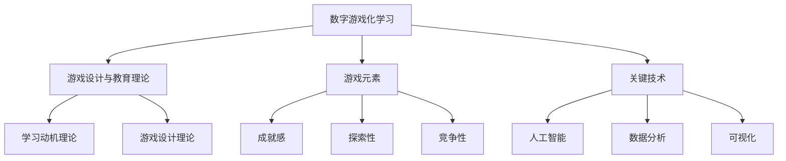

                 

### 文章标题：数字游戏化学习：寓教于乐的教育方式

**关键词：** 数字游戏化学习，教育方式，游戏化设计，寓教于乐，人工智能，数据分析，个性化学习

**摘要：** 本文将探讨数字游戏化学习这一新兴教育方式，分析其定义、核心概念、设计方法、关键技术及其在实践中的应用。通过详细解析数字游戏化学习的发展历程，以及其在教育领域的意义和前景，本文旨在为教育工作者和开发者提供一套系统化的理论框架和实践指南。

---

### 目录大纲

#### 第一部分：引言

- **第1章：数字游戏化学习概述**
  - 1.1 数字游戏化学习的定义
  - 1.2 数字游戏化学习的意义
  - 1.3 数字游戏化学习的发展历程

- **第2章：数字游戏化学习的核心概念**
  - 2.1 游戏设计与教育理论的融合
  - 2.2 游戏元素在教育中的应用
  - 2.3 数字游戏化学习的关键技术

#### 第二部分：数字游戏化学习的实践与应用

- **第3章：数字游戏化学习的设计方法**
  - 3.1 游戏化学习设计原则
  - 3.2 游戏化学习案例分析
  - 3.3 游戏化学习设计与实施流程

- **第4章：数字游戏化学习的关键技术实现**
  - 4.1 人工智能技术在数字游戏化学习中的应用
  - 4.2 数据分析技术在数字游戏化学习中的应用
  - 4.3 可视化技术在数字游戏化学习中的应用
  - 4.4 虚拟现实与增强现实技术在数字游戏化学习中的应用

- **第5章：数字游戏化学习案例解析**
  - 5.1 在线编程学习平台
  - 5.2 基于虚拟现实的科学教育

- **第6章：数字游戏化学习的挑战与未来发展**
  - 6.1 数字游戏化学习的挑战
  - 6.2 数字游戏化学习的发展趋势
  - 6.3 数字游戏化学习的未来前景

- **第7章：数字游戏化学习的政策与支持**
  - 7.1 政策支持与推广
  - 7.2 学校与教师参与
  - 7.3 家长与学生的态度
  - 7.4 社会力量参与

#### 附录

- **附录A：数字游戏化学习资源推荐**
- **附录B：数字游戏化学习实践指南**

### Mermaid 流程图：数字游戏化学习核心概念关系图

---

### 引言

数字游戏化学习，作为一种新兴的教育方式，正逐渐在全球范围内受到关注。它不仅融合了游戏设计的教育理论，还借助现代信息技术，特别是人工智能、数据分析和可视化技术，为学习者提供了一种全新的学习体验。本文旨在探讨数字游戏化学习的定义、核心概念、设计方法及其在实践中的应用，并分析其面临的发展挑战和未来前景。

#### 数字游戏化学习的定义

数字游戏化学习是指通过将游戏元素和教育内容相结合，利用信息技术手段，设计出富有教育意义和互动性的数字学习产品或服务。它强调在学习过程中引入游戏的机制，如成就系统、排行榜、积分等，以激发学习者的兴趣和动力，提高学习效果。

#### 数字游戏化学习的意义

数字游戏化学习具有多重意义：

1. **提高学习兴趣**：游戏本身就具有娱乐性和吸引力，能够激发学习者的好奇心和探索欲，从而提高学习兴趣。

2. **增强学习动力**：通过游戏中的奖励机制，如积分、勋章等，可以增强学习者的成就感和自我效能感，提高学习动力。

3. **促进主动学习**：游戏化学习鼓励学习者主动参与和探索，培养了自主学习的能力。

4. **个性化学习**：通过数据分析技术，可以根据学习者的行为和学习数据，提供个性化的学习建议和资源，实现个性化学习。

5. **适应现代教育需求**：随着互联网和移动设备的普及，数字游戏化学习能够更好地适应现代教育的需求，提供灵活、便捷的学习方式。

#### 数字游戏化学习的发展历程

数字游戏化学习并非一蹴而就，而是经历了长期的探索和发展。以下是其简要的发展历程：

- **起源**：20世纪90年代，游戏和教育的结合开始受到关注，一些学者和游戏开发者开始探索游戏化教育的可能性。

- **早期探索**：21世纪初，一些教育机构和企业开始尝试将游戏元素引入教学过程，并取得了初步的成果。

- **快速发展**：随着移动互联网和人工智能技术的兴起，数字游戏化学习迎来了快速发展期，大量游戏化学习产品和服务涌现。

- **应用推广**：近年来，数字游戏化学习逐渐被广泛接受，并应用于各种教育场景，如在线教育、职业教育等。

#### 本文结构

本文将分为七个部分：

1. **引言**：介绍数字游戏化学习的定义、意义和发展历程。

2. **核心概念**：详细解析数字游戏化学习的核心概念，包括游戏设计与教育理论的融合、游戏元素在教育中的应用以及关键技术。

3. **设计方法**：探讨数字游戏化学习的设计原则、方法和流程。

4. **关键技术实现**：分析人工智能、数据分析、可视化等关键技术如何在数字游戏化学习中应用。

5. **案例解析**：通过具体案例，展示数字游戏化学习的实际应用和效果。

6. **挑战与未来**：分析数字游戏化学习面临的挑战和未来发展趋势。

7. **政策与支持**：探讨数字游戏化学习的政策环境和社会支持。

通过上述结构，本文将为读者提供一幅完整的数字游戏化学习蓝图，帮助读者深入了解这一新兴教育方式。

### 第一部分：数字游戏化学习概述

#### 第1章：数字游戏化学习概述

**1.1 数字游戏化学习的定义**

数字游戏化学习是指通过将游戏元素和教育内容相结合，利用信息技术手段，设计出富有教育意义和互动性的数字学习产品或服务。它强调在学习过程中引入游戏的机制，如成就系统、排行榜、积分等，以激发学习者的兴趣和动力，提高学习效果。

**1.2 数字游戏化学习的特点**

数字游戏化学习具有以下几个特点：

1. **互动性**：数字游戏化学习通过互动方式，如问答、讨论、竞赛等，使学习过程更加生动有趣，提高学习者的参与度。

2. **个性化**：通过收集和分析学习者的行为数据，数字游戏化学习可以提供个性化的学习建议和资源，满足不同学习者的需求。

3. **激励性**：数字游戏化学习通过游戏化机制，如奖励、惩罚、挑战等，激发学习者的学习动机，提高学习效果。

4. **趣味性**：游戏本身就是一种娱乐形式，数字游戏化学习通过将教育内容融入游戏中，使学习过程更加有趣。

**1.3 数字游戏化学习的意义**

数字游戏化学习在教育领域中具有重要意义：

1. **提高学习兴趣**：游戏本身具有娱乐性和吸引力，能够激发学习者的好奇心和探索欲，从而提高学习兴趣。

2. **增强学习动力**：通过游戏中的奖励机制，如积分、勋章等，可以增强学习者的成就感和自我效能感，提高学习动力。

3. **促进主动学习**：游戏化学习鼓励学习者主动参与和探索，培养了自主学习的能力。

4. **适应现代教育需求**：随着互联网和移动设备的普及，数字游戏化学习能够更好地适应现代教育的需求，提供灵活、便捷的学习方式。

**1.4 数字游戏化学习的发展历程**

数字游戏化学习并非一蹴而就，而是经历了长期的探索和发展。以下是其简要的发展历程：

- **起源**：20世纪90年代，游戏和教育的结合开始受到关注，一些学者和游戏开发者开始探索游戏化教育的可能性。

- **早期探索**：21世纪初，一些教育机构和企业开始尝试将游戏元素引入教学过程，并取得了初步的成果。

- **快速发展**：随着移动互联网和人工智能技术的兴起，数字游戏化学习迎来了快速发展期，大量游戏化学习产品和服务涌现。

- **应用推广**：近年来，数字游戏化学习逐渐被广泛接受，并应用于各种教育场景，如在线教育、职业教育等。

通过上述章节，本文将为读者提供一个对数字游戏化学习的全面了解，为后续章节的深入探讨打下基础。

### 第二部分：数字游戏化学习的核心概念

#### 第2章：数字游戏化学习的核心概念

**2.1 游戏设计与教育理论的融合**

数字游戏化学习的核心在于游戏设计与教育理论的深度融合。游戏设计理论关注如何通过游戏机制激发玩家的兴趣和动机，而教育理论则关注如何通过有效的教学策略提高学习效果。两者的结合旨在创造一种既能带来娱乐体验，又能实现学习目标的学习环境。

**学习动机理论**

学习动机理论是理解游戏设计与教育理论融合的重要基础。根据自我决定理论（Self-Determination Theory），学习者的内在动机包括自主性、能力感和关联感。数字游戏化学习通过设计具有挑战性、反馈及时的任务，以及提供自我决定的机会，来激发学习者的内在动机。

**游戏设计理论与教育理论的融合**

游戏设计理论与教育理论的融合体现在以下几个方面：

1. **任务设计**：游戏任务应具有一定的挑战性，既能激发学习者的兴趣，又能促使他们持续学习。
2. **反馈机制**：通过实时反馈，使学习者能够了解自己的学习进度和成果，从而增强自我效能感。
3. **奖励机制**：适当的奖励可以激发学习者的积极性和成就感，如积分、勋章、排名等。
4. **社会互动**：通过社交功能，如小组合作、竞争，增强学习者的互动性和归属感。

**2.2 游戏元素在教育中的应用**

数字游戏化学习通过引入游戏元素，如成就感、探索性和竞争性，来提高学习效果。

**成就感**

成就感是指个体在完成某个任务或达成某个目标时感受到的积极情绪。数字游戏化学习通过设计具有挑战性的任务，使学习者在完成任务后获得成就感，从而提高学习动力。

**探索性**

探索性是指个体在未知环境中主动寻求信息和解决问题的行为。数字游戏化学习通过设计具有多样性和不确定性的学习内容，激发学习者的探索兴趣，培养他们的创新能力。

**竞争性**

竞争性是指个体通过与他人比较来评估自己的能力和成就。数字游戏化学习通过引入竞争机制，如排行榜、竞赛等，激发学习者的竞争意识，提高学习效果。

**2.3 数字游戏化学习的关键技术**

数字游戏化学习的关键技术包括人工智能、数据分析、可视化等。

**人工智能**

人工智能（AI）技术在数字游戏化学习中主要用于个性化学习推荐、智能辅导和自适应学习等方面。通过分析学习者的行为数据，AI可以提供个性化的学习建议和资源，使学习过程更加高效。

**数据分析**

数据分析技术在数字游戏化学习中用于收集、处理和分析学习者的行为数据，以评估学习效果和优化学习策略。通过数据可视化，学习者可以直观地了解自己的学习进度和成果。

**可视化**

可视化技术可以将复杂的数据和学习过程以图形化的形式呈现，使学习者更容易理解和掌握知识。数字游戏化学习中的可视化技术包括图表、图像、动画等。

通过以上分析，我们可以看出，数字游戏化学习不仅仅是将游戏元素引入教育，更是一种教育理念的变革。它通过游戏设计与教育理论的融合，以及关键技术的应用，为学习者提供了一种全新的学习体验。接下来，本文将详细探讨数字游戏化学习的设计方法，以期为教育实践提供有益的指导。

### 第三部分：数字游戏化学习的设计方法

#### 第3章：数字游戏化学习的设计方法

**3.1 游戏化学习设计原则**

数字游戏化学习的设计原则是确保学习过程既有游戏性，又能实现教育目标的关键。以下是一些核心原则：

1. **明确学习目标**：设计游戏化学习活动时，首先要明确教育的目标，确保游戏活动能够帮助学生达到这些目标。

2. **平衡挑战性与可及性**：游戏任务应具有一定的挑战性，以激发学习者的兴趣和动力，但同时也需要考虑学习者的背景和能力，确保他们能够顺利完成。

3. **及时有效的反馈**：学习者需要及时获得关于学习进度和成就的反馈，以维持学习动机和自我效能感。反馈应具体、及时且具有激励性。

4. **鼓励社会互动**：通过小组合作、讨论和竞赛等社交功能，增强学习者的互动性和归属感，促进知识的共享和深化。

5. **保持趣味性**：游戏化学习应该充满趣味性，避免枯燥和单调，以保持学习者的兴趣和参与度。

**3.2 游戏化学习案例分析**

为了更好地理解游戏化学习设计原则的应用，以下提供两个具体案例。

**案例一：编程教学中的数字游戏化学习**

**案例背景**：某在线编程教育平台采用游戏化学习设计，帮助学习者掌握编程技能。

**设计思路**：
1. **明确学习目标**：平台通过设置不同的编程挑战，确保学习者在完成挑战的过程中掌握基础编程概念和技能。
2. **平衡挑战性与可及性**：编程挑战的难度逐渐提升，同时提供简明易懂的教程和参考代码，帮助学习者逐步克服困难。
3. **及时有效的反馈**：每次编程任务完成后，平台会提供即时反馈，指出错误和改进建议，帮助学习者迅速纠正问题。
4. **鼓励社会互动**：学习者可以在平台上分享自己的编程成果，参与讨论和竞赛，增强学习的互动性和成就感。
5. **保持趣味性**：编程挑战设计为游戏形式，包括任务解锁、积分奖励等，使学习过程更加有趣。

**案例效果**：该平台通过游戏化学习设计，显著提高了学习者的参与度和编程技能水平。

**案例二：数学学习中的数字游戏化学习**

**案例背景**：某在线数学教育平台采用游戏化学习，帮助中小学生提高数学能力。

**设计思路**：
1. **明确学习目标**：平台通过设置数学游戏任务，确保学习者在完成游戏的过程中掌握数学概念和解题技巧。
2. **平衡挑战性与可及性**：数学游戏任务的难度逐渐提升，同时提供详细的解题步骤和提示，帮助学习者逐步提高解题能力。
3. **及时有效的反馈**：每次数学游戏完成后，平台会提供详细的答案解析和评分，帮助学习者了解自己的学习进度和错误原因。
4. **鼓励社会互动**：学习者可以在平台上进行数学问答和竞赛，增强学习的互动性和乐趣。
5. **保持趣味性**：数学游戏设计为趣味性的互动形式，如拼图、解谜等，使学习过程更加生动有趣。

**案例效果**：该平台通过游戏化学习设计，提高了学习者的数学兴趣和成绩，取得了良好的教育效果。

**3.3 游戏化学习设计与实施流程**

游戏化学习的设计与实施可以分为以下步骤：

1. **学习需求分析**：分析学习者的背景、需求和兴趣，确定游戏化学习的设计方向。
2. **游戏设计**：结合教育目标和学习需求，设计游戏化的学习活动，包括任务、规则、奖励机制等。
3. **游戏实施**：在合适的教育环境中部署游戏化学习活动，确保学习者的积极参与。
4. **游戏评估**：通过数据分析和学习者反馈，评估游戏化学习的效果，进行必要的调整和优化。

通过以上设计方法和实践案例，我们可以看到，数字游戏化学习不仅能够提高学习者的兴趣和动机，还能有效地促进学习目标的实现。在接下来的章节中，本文将深入探讨数字游戏化学习的关键技术，以期为教育实践提供更加详细和具体的指导。

### 第四部分：数字游戏化学习的关键技术实现

#### 第4章：数字游戏化学习的关键技术实现

**4.1 人工智能技术在数字游戏化学习中的应用**

人工智能（AI）技术在数字游戏化学习中的应用主要体现在个性化学习推荐、智能辅导和自适应学习等方面。以下将详细探讨这些应用。

**个性化学习推荐**

个性化学习推荐是利用AI算法分析学习者的行为数据，为学习者推荐最适合他们的学习内容和资源。具体应用步骤如下：

1. **数据收集**：收集学习者的学习行为数据，包括学习时间、学习内容、学习进度、考试成绩等。

2. **数据预处理**：对收集到的数据进行分析和清洗，提取有用的特征信息。

3. **推荐算法**：采用协同过滤、内容推荐、混合推荐等算法，根据学习者的行为数据和偏好，生成个性化推荐列表。

4. **推荐结果展示**：将推荐结果以直观的方式展示给学习者，如推荐课程、学习资源等。

**智能辅导**

智能辅导系统通过AI技术模拟教师的教学行为，为学习者提供个性化的辅导和支持。具体实现步骤如下：

1. **学习过程监控**：监控学习者的学习过程，包括学习时间、学习内容、学习进度等。

2. **智能评估**：利用自然语言处理（NLP）和机器学习算法，对学习者的作业和测试结果进行分析，评估学习效果。

3. **个性化辅导**：根据评估结果，提供针对性的辅导内容，如学习建议、解题方法等。

4. **反馈机制**：收集学习者的反馈，不断优化辅导系统，提高辅导效果。

**自适应学习**

自适应学习系统通过实时分析学习者的学习行为和学习结果，动态调整学习内容和难度，以适应学习者的个性化需求。具体实现步骤如下：

1. **学习行为分析**：收集学习者的学习行为数据，如学习时间、学习内容、学习进度等。

2. **学习结果评估**：通过测试、作业等手段评估学习效果，分析学习者的掌握情况。

3. **学习路径调整**：根据学习行为和学习结果，动态调整学习路径，如增加或减少学习内容、调整学习难度等。

4. **效果评估**：定期评估自适应学习的效果，根据反馈进行优化。

**4.2 数据分析技术在数字游戏化学习中的应用**

数据分析技术在数字游戏化学习中的应用主要体现在数据收集、数据处理和数据可视化等方面。以下将详细探讨这些应用。

**数据收集**

数据收集是数字游戏化学习的基础，通过收集学习者的行为数据，可以深入了解学习过程和学习效果。具体方法包括：

1. **日志记录**：记录学习者的学习活动日志，如学习时间、学习内容、学习进度等。

2. **问卷调查**：通过问卷调查收集学习者的主观感受和学习需求。

3. **在线测试**：通过在线测试收集学习者的学习成果和掌握情况。

**数据处理**

数据处理是对收集到的数据进行清洗、转换和分析的过程，以提取有价值的信息。具体步骤如下：

1. **数据清洗**：去除重复、错误和缺失的数据，保证数据质量。

2. **数据转换**：将不同格式的数据转换为统一格式，便于分析。

3. **统计分析**：采用统计方法对数据进行描述性和推断性分析，提取学习者的行为模式和趋势。

**数据可视化**

数据可视化是将分析结果以图形化的方式展示出来，使学习者更容易理解和掌握知识。具体方法包括：

1. **图表**：利用柱状图、饼图、折线图等展示数据的分布和变化趋势。

2. **交互式图表**：通过交互式图表，如热图、地图等，使学习者能够动态地探索数据，深入了解学习过程和效果。

**4.3 可视化技术在数字游戏化学习中的应用**

可视化技术将复杂的数据和学习过程以图形化的形式呈现，使学习者更容易理解和掌握知识。以下将探讨可视化技术在数字游戏化学习中的应用。

**数据可视化**

数据可视化是将学习者的行为数据和学习成果以图表形式展示，使学习者能够直观地了解自己的学习进展和效果。具体应用包括：

1. **学习进度图**：展示学习者的学习进度，如已完成任务、未完成任务等。

2. **成绩分布图**：展示学习者的考试成绩分布，如优秀率、及格率等。

3. **知识点掌握情况图**：展示学习者在各个知识点的掌握情况，如掌握情况、薄弱环节等。

**学习过程可视化**

学习过程可视化是将学习者的学习过程以动态图或动画形式展示，使学习者能够看到学习过程的完整流程和关键步骤。具体应用包括：

1. **学习路径图**：展示学习者的学习路径，包括已学习内容和待学习内容。

2. **学习活动图**：展示学习者的学习活动，如阅读、做题、讨论等。

3. **学习反馈图**：展示学习者的反馈情况，如评价、建议等。

通过以上关键技术实现，数字游戏化学习不仅能够提供个性化的学习体验，还能通过数据分析和学习过程可视化，提高学习效果。在接下来的章节中，本文将结合具体案例，进一步探讨数字游戏化学习的实际应用和效果。

### 第五部分：数字游戏化学习案例解析

#### 第5章：数字游戏化学习案例解析

**5.1 案例一：在线编程学习平台**

**案例背景**：某在线编程学习平台，旨在通过游戏化学习方式，帮助学习者掌握编程技能。

**学习模式分析**：

1. **任务导向**：平台通过设置一系列编程任务，引导学习者逐步学习编程基础知识。每个任务都有明确的完成目标，使学习者能够直观地了解学习进度。

2. **奖励机制**：平台采用积分和徽章奖励机制，鼓励学习者积极参与学习。完成每个任务都能获得相应积分，积累积分可以换取虚拟礼物。

3. **社交互动**：学习者可以在平台上分享自己的编程作品，参与讨论和竞赛。通过互动，学习者能够相互学习，共同进步。

4. **实时反馈**：平台提供即时反馈机制，学习者在完成任务后，系统会自动检查代码，并提供详细的错误提示和建议。

**教学效果评估**：

1. **学习参与度**：通过数据统计，发现学习者在平台上的活跃度显著提高。多数学习者表示，游戏化学习方式让他们更加投入学习。

2. **学习效果**：学习者在完成编程任务后的测试中，成绩有明显提升。特别是在任务难度逐渐增加的过程中，学习者的编程能力得到显著提高。

3. **用户满意度**：通过用户反馈，多数学习者对平台的游戏化学习方式表示满意，认为这种学习方式有趣且富有挑战性。

**5.2 案例二：基于虚拟现实的科学教育**

**案例背景**：某科学教育机构，利用虚拟现实（VR）技术，开展游戏化科学教育活动。

**学习体验**：

1. **沉浸式学习**：通过VR技术，学习者可以进入一个虚拟的科学实验室，亲身参与各种科学实验。这种沉浸式学习体验，使学习者对科学知识产生更深刻的理解和记忆。

2. **互动性**：在VR环境中，学习者可以与其他学习者或虚拟助手互动，讨论科学问题，解决实验中的难题。

3. **探索性**：VR环境中的科学实验是开放性的，学习者可以自由探索，尝试不同的实验方案，培养他们的创新思维和解决问题的能力。

**教学效果**：

1. **学习兴趣**：通过VR技术，科学教育变得生动有趣，学习者的学习兴趣显著提高。许多学习者表示，在VR环境中学习科学知识，让他们感到兴奋和好奇。

2. **知识掌握**：通过VR实验，学习者在科学知识方面的掌握程度明显提升。在后续的测试中，学习者的成绩有所提高，且对科学原理的理解更加深入。

3. **动手能力**：VR实验使学习者有机会进行虚拟操作，提高了他们的动手能力和实践技能。在现实中的科学实验中，学习者的表现也更为出色。

**综合评价**：

1. **创新性**：这两个案例展示了数字游戏化学习在在线教育和科学教育中的创新应用，为传统教育模式提供了新的思路。

2. **实用性**：通过游戏化设计和VR技术，数字游戏化学习不仅提高了学习者的兴趣和动力，还显著提升了学习效果，具有很高的实用价值。

3. **推广前景**：随着技术的不断进步和成熟，数字游戏化学习将在更多教育场景中推广，为个性化教育和智慧教育的发展贡献力量。

通过以上案例解析，我们可以看到，数字游戏化学习在提高学习兴趣、增强学习动力和提升学习效果方面具有显著优势。在接下来的章节中，本文将探讨数字游戏化学习面临的挑战及其未来发展趋势。

### 第六部分：数字游戏化学习的挑战与未来发展

#### 第6章：数字游戏化学习的挑战与未来发展

**6.1 数字游戏化学习的挑战**

尽管数字游戏化学习在教育领域中展现出诸多优势，但其在实际应用中仍面临一系列挑战：

**1. 学习效果评估**：如何准确评估游戏化学习对学习者知识掌握和能力提升的效果，是一个亟待解决的问题。传统的测试和评估方法可能无法全面反映游戏化学习的效果。

**2. 伦理道德问题**：数字游戏化学习涉及大量的数据收集和分析，如何保护学习者的隐私和数据安全，避免数据滥用，是必须考虑的伦理道德问题。

**3. 教学资源的开发**：游戏化学习资源的设计和开发需要专业知识和技能，但目前相关资源的开发水平和质量参差不齐，需要提高。

**4. 教师的培训与支持**：教师需要掌握游戏化学习的设计和实施方法，但许多教师对此缺乏培训和支持，影响了游戏化学习的效果。

**6.2 数字游戏化学习的发展趋势**

数字游戏化学习的发展趋势主要体现在以下几个方面：

**1. 技术创新**：随着人工智能、大数据、虚拟现实等技术的发展，数字游戏化学习将更加智能化、个性化，提供更丰富的学习体验。

**2. 教育模式变革**：数字游戏化学习将推动教育模式的变革，从传统的课堂教学向个性化、自主学习和协作学习转变。

**3. 跨学科融合**：数字游戏化学习将融合不同学科的知识和技能，提供更加综合和多样化的学习内容。

**6.3 数字游戏化学习的未来前景**

数字游戏化学习的未来前景广阔，主要体现在以下几个方面：

**1. 数字化教育市场**：随着数字化教育市场的不断扩大，数字游戏化学习将成为教育行业的重要方向，为教育机构和企业提供新的商业机会。

**2. 个性化学习需求**：随着社会对个性化和高质量教育的需求增加，数字游戏化学习将满足不同学习者的需求，提供个性化的学习体验。

**3. 智慧教育发展**：数字游戏化学习将与智慧教育相结合，推动教育信息化和智能化的发展，为教育改革提供技术支持。

通过上述分析，我们可以看到，数字游戏化学习在面临挑战的同时，也具有广阔的发展前景。随着技术的不断进步和教育的变革，数字游戏化学习有望在教育领域中发挥更大的作用，为学习者提供更加高效、有趣的学习体验。

### 第七部分：数字游戏化学习的政策与支持

#### 第7章：数字游戏化学习的政策与支持

**7.1 政策支持与推广**

数字游戏化学习作为新兴的教育方式，受到了政策层面的高度重视。各国政府和教育机构纷纷出台相关政策和措施，以推动数字游戏化学习的发展。

**1. 国家政策**：许多国家已将数字游戏化学习纳入国家教育战略，通过专项资金支持、科研立项等方式，鼓励企业和研究机构开展相关研究和开发。

**2. 地方政府政策**：地方政府也积极响应国家政策，出台了一系列地方性政策，如提供财政补贴、税收优惠等，以支持数字游戏化学习项目。

**7.2 学校与教师参与**

学校和教育机构是数字游戏化学习的重要实践者。为了推动数字游戏化学习，学校和教育机构需要采取以下措施：

**1. 教师培训**：为教师提供数字游戏化学习相关的培训，提高他们的专业素养和教学技能。培训内容应包括游戏设计理论、技术实现方法、教学策略等。

**2. 教学资源建设**：学校和教育机构应积极建设数字游戏化学习资源库，包括教材、课件、游戏化教学工具等，为教师和学生提供丰富的学习资源。

**7.3 家长与学生的态度**

家长和学生在数字游戏化学习中的参与度直接影响其效果。为此，需要采取以下措施：

**1. 家长认知**：通过宣传教育，提高家长对数字游戏化学习的认知，使其了解数字游戏化学习的优势和应用场景，从而积极支持孩子参与。

**2. 学生反馈**：定期收集学生的反馈，了解他们的学习体验和需求，及时调整数字游戏化学习的设计和实施策略。

**7.4 社会力量参与**

数字游戏化学习的发展不仅需要政策支持，还需要社会力量的积极参与。以下是一些具体的参与方式：

**1. 企业合作**：企业可以通过投资、赞助等方式，支持数字游戏化学习项目的开发和应用。同时，企业也可以提供技术支持和专业人才，参与数字游戏化学习的设计和实施。

**2. 社会组织支持**：社会组织可以通过开展公益项目、提供咨询和服务等方式，推动数字游戏化学习的发展。例如，一些教育公益组织可以提供数字游戏化学习的培训课程，帮助学校和教师掌握相关技能。

通过政策支持、学校与教师的积极参与、家长和学生的支持，以及社会力量的广泛参与，数字游戏化学习有望在教育领域中发挥更大的作用，为学习者提供更加丰富和高效的学习体验。

### 附录

#### 附录A：数字游戏化学习资源推荐

**书籍推荐**

1. 《游戏化思维：用游戏的方法改变生活和工作》（Gameful Learning: Gamification in Education）
2. 《数字游戏化学习：设计与实践指南》（Digital Game-Based Learning: Fundamentals and Practice）
3. 《教育游戏设计：理论与案例》（Educational Game Design: Theory and Case Studies）

**学术期刊**

1. 《游戏化学习研究期刊》（Journal of Game-Based Learning）
2. 《教育技术研究与发展》（Educational Technology Research and Development）
3. 《互动学习研究》（Interactive Learning Environments）

**在线课程**

1. Coursera上的《数字游戏化学习》（Digital Game-Based Learning）
2. Udemy上的《游戏化设计与实践》（Gamification Design & Implementation）
3. edX上的《教育游戏设计》（Educational Game Design）

**游戏化学习平台推荐**

1. **Khan Academy**：提供丰富的免费教育资源和游戏化学习模块。
2. **Code.org**：专注于编程教育，提供游戏化的编程学习工具。
3. **Duolingo**：结合游戏化元素的语言学习平台。

#### 附录B：数字游戏化学习实践指南

**设计指南**

1. **明确目标**：在设计数字游戏化学习项目时，首先要明确教育目标和学习者的需求。
2. **融入游戏元素**：根据教育目标，融入成就感、探索性、竞争性等游戏元素，提高学习者的参与度和积极性。
3. **保持简单性**：设计应简洁明了，避免复杂和冗余，确保学习者的专注和投入。

**实施指南**

1. **测试与反馈**：在设计完成后，进行测试和用户反馈，根据反馈调整和优化设计。
2. **逐步推广**：从小规模试点开始，逐步推广到更大范围，以评估和改进项目效果。
3. **持续更新**：根据用户需求和反馈，定期更新学习内容和游戏元素，保持学习体验的新鲜感和吸引力。

**评估指南**

1. **定量与定性评估**：结合定量（如成绩、使用时长）和定性（如用户反馈、行为分析）方法，全面评估数字游戏化学习的效果。
2. **跟踪学习成果**：通过跟踪学习者的学习成果，如知识掌握情况、技能提升等，评估项目对学习者的影响。
3. **持续改进**：根据评估结果，不断优化设计和实施策略，以提高数字游戏化学习的有效性。

通过以上实践指南，教育工作者和开发者可以更好地设计和实施数字游戏化学习项目，为学习者提供更高质量的教育体验。

